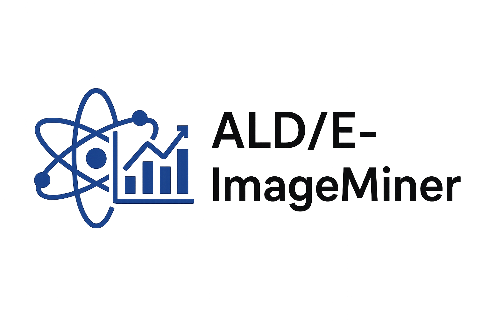

<div align="center">
  
</div>

## Project Overview  

**ALD/E-ImageMiner** is an annotation project on figures from **atomic layer deposition (ALD)** and **atomic layer etching (ALE)**, situated within the broader field of materials science and engineering. Within each of these categories, the data is further organized into the sub-categories **experimental-usecase** and **simulation-usecase**.  

It aims to host gold-standard annotations for chart classification, data extraction, summarization, and question answering—providing both pilot and full-phase data to support multimodal AI research in scientific image understanding.   

### 🗂️ Directory Structure  

We have compiled the dataset for annotation in this repository, structured into clearly defined categories and sub-categories.  
The layout reflects the distinction between ALD and ALE literature, as well as between experimental and simulation studies, making it easier to navigate both the pilot and full annotation phases.  


```text
data
├── pilot-annotation-task
│   ├── atomic-layer-deposition
│   │   ├── experimental-usecase
│   │   │   ├── paper #
│   │   │   │   ├── images
│   │   │   │   │   ├── figures
│   │   │   │   │   │   ├── filename 1.jpg          # (JPEG) actual figure image extracted using MinerU
│   │   │   │   │   │   ├── filename.class.txt      # (Text) chart visualization class/category extracted using Qwen 2.5 VL
│   │   │   │   │   │   ├── filename.data.txt       # (Text) data extracted as a markdown table using instruction-tuned Qwen 2.5 VL
│   │   │   │   │   │   └── filename.summary.txt    # (Text) summarization of chart visualization extracted using Qwen 2.5 VL
│   │   │   │   │   ├── formulas
│   │   │   │   │   │   ├── filename.jpg            # (JPEG) actual formula image extracted using MinerU
│   │   │   │   │   └── tables
│   │   │   │   │       ├── filename.jpg            # (JPEG) actual table image extracted using MinerU
│   │   │   │   ├── Author et al.pdf                # (PDF) actual PDF document
│   │   │   │   ├── content.json                    # (JSON) structured content extracted using MinerU
│   │   │   │   ├── content.md                      # (Markdown) structured content extracted using MinerU
│   │   │   │   ├── content.tei.xml                 # (TEI-XML) structured content extracted using GROBID
│   │   │   │   ├── content.txt                     # (Text) unstructured content extracted using MinerU
│   │   │   │   └── layout.json                     # (JSON) bounding box and segmentation data from MinerU
│   │   │   └── ...
│   │   └── simulation-usecase
│   │       └── ...
│   └── atomic-layer-etching
│       └── ...
└── full-annotation-task
    ├── atomic-layer-deposition
    │   ├── experimental-usecase
    │   └── simulation-usecase
    └── atomic-layer-etching
        ├── experimental-usecase
        └── simulation-usecase
```

## 🛠️ Tools Used

- **[GROBID (GeneRation Of BIbliographic Data)](https://github.com/kermitt2/grobid)** → scholarly PDF parsing into TEI XML.
- **[GROBID Python Client](https://github.com/kermitt2/grobid_client_python)** → Python interface to GROBID.
- **[MinerU](https://github.com/opendatalab/MinerU)** → structured text, figures, formulas, and tables from PDFs. It is created by OpenDataLab as an open-source tool designed for data extraction from PDF documents, converting them into structured machine-readable formats like Markdown and JSON. MinerU can interpret the complex layout structure of research papers, including figures, tables, formulas, and text.
- **[Qwen2.5-VL](https://github.com/QwenLM/Qwen2.5-VL)** → multimodal LLM applied for classification, extraction, and summarization. Specifically, we used [Qwen2.5-VL-7B-Instruct](https://huggingface.co/Qwen/Qwen2.5-VL-7B-Instruct).  
  The [Prompts.md](Prompts.md) file documents the prompts used for information extraction (figure type, data, summary, and figure labels).  


### 📊 Dataset Statistics

#### Overall

| Category | Sub-category | PDFs | Figures | Formulas | Tables |
| --- | --- | --- | --- | --- | --- |
| atomic-layer-deposition | experimental-usecase | 66 | 552 | 102 | 76 |  796 |
| atomic-layer-deposition | simulation-usecase | 58 | 579 | 413 | 131 | 1181 |
| atomic-layer-etching | experimental-usecase | 47 | 461 | 116 | 28 |  652 |
| atomic-layer-etching | simulation-usecase | 32 | 346 | 165 | 55 |  598 |
| **Total** | - | **203** | **1938** | **796** | **290** |

#### Figure type classification

We have defined a taxonomy of 40 figure types including "unknown". The full taxonomy with descriptions, parent taxonomy category, and aliases is here [figure_taxonomy.tsv](https://github.com/sciknoworg/ALD-E-ImageMiner/blob/main/figure_taxonomy.tsv). The ALD/E-ImageMiner project maintains a focus only on figures of parent taxonomy category `quantitative plot`.

| Figure Type | Auto Labels | Human Labels |
| --- | --- | --- |
| Area chart | 0 | 0 |
| Bar chart | 13 | 0 |
| 3D bar chart | 18 | 0 |
| Grouped bar chart | 46 | 0 |
| Stacked bar chart | 7 | 0 |
| Box plot | 1 | 0 |
| Bubble chart | 6 | 0 |
| Donut chart | 2 | 0 |
| Funnel chart | 0 | 0 |
| Heatmap | 36 | 0 |
| Line chart | 360 | 0 |
| Multiple Line chart | 580 | 0 |
| Multi-axis chart | 197 | 0 |
| Pie chart | 5 | 0 |
| Polar chart | 9 | 0 |
| Radar chart | 1 | 0 |
| Rose chart | 0 | 0 |
| 3D scatter plot | 1 | 0 |
| Scatter plot | 91 | 0 |
| Treemap | 0 | 0 |
| Unknown | 546 | 0 |
| --- | --- | --- |
| flowchart | 2 | 0 |
| table | 1 | 0 |
| | 15 | 0 |
| ['scatter plot', 'line chart'] | 1 | 0 |
| **Total** | **1938** | **0** |


## 📖 Citation  

The **ALD/E-ImageMiner project vision** is described in the following working paper, pre-released on Zenodo.  
Please cite this paper if you find this work useful:  

```bibtex
@misc{d_souza_2025_17130928,
  author       = {D'Souza, Jennifer},
  title        = {A Pathway to General-Purpose Scientific AI:
                   Multimodal Comprehension of Scientific Images},
  month        = sep,
  year         = 2025,
  publisher    = {Zenodo},
  doi          = {10.5281/zenodo.17130928},
  url          = {https://doi.org/10.5281/zenodo.17130928},
}
```

## ⭐ Acknowledgements  

The **ALD/E-ImageMiner** project is supported by:  

-   
  The [NFDI4DataScience](https://www.nfdi4datascience.de/) initiative, funded by the **German Research Foundation (DFG, Grant ID: 460234259)**, under the *Speedboat Annotation Project* funding scheme.  

- The *AI-Aware Pathways to Sustainable Semiconductor Process and Manufacturing Technologies (AWASES)* initiative (Mackus et al., 2024), funded by **Merck and Intel**, with collaboration between **Eindhoven University**, **Leibniz University Hannover’s L3S Research Centre (co-led by applicants)**, and **University of Warwick**. AWASES hosts three fully funded PhD positions and supports advances in **generative AI, multimodal models, and FAIR scientific knowledge graph construction**.  

