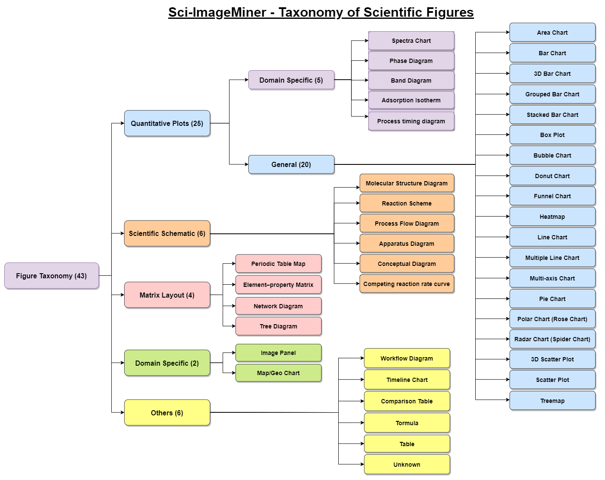
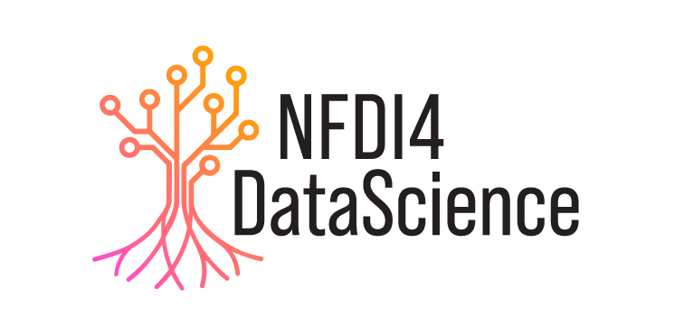

<div align="center">
  
</div>

## Project Overview  

**ALD/E-ImageMiner** is an annotation project on figures from **atomic layer deposition (ALD)** and **atomic layer etching (ALE)**, situated within the broader field of materials science and engineering. Within each of these categories, the data is further organized into the sub-categories **experimental-usecase** and **simulation-usecase**.  

It aims to host gold-standard annotations for chart classification, data extraction, summarization, and question answering—providing both pilot and full-phase data to support multimodal AI research in scientific image understanding.   

### 🗂️ Directory Structure  

We have compiled the dataset for annotation in this repository, structured into clearly defined categories and sub-categories.  
The layout reflects the distinction between ALD and ALE literature, as well as between experimental and simulation studies, making it easier to navigate both the pilot and full annotation phases.  


```text
data
├── atomic-layer-deposition
│   ├── experimental-usecase
│   │   ├── paper #
│   │   │   ├── images
│   │   │   │   ├── figures
│   │   │   │   ├── filename 1.jpg          # (JPEG) actual figure image extracted using MinerU
│   │   │   │   │   ├── filename.caption.txt    # (Text) figure caption extracted from the paper.
│   │   │   │   │   ├── filename.class.txt      # (Text) chart visualization class/category extracted using Qwen 2.5 VL
│   │   │   │   │   ├── filename.data.txt       # (Text) data extracted as a markdown table using instruction-tuned Qwen 2.5 VL
│   │   │   │   │   └── filename.summary.txt    # (Text) summarization of chart visualization extracted using Qwen 2.5 VL
│   │   │   │   ├── formulas
│   │   │   │   │   ├── filename.jpg            # (JPEG) actual formula image extracted using MinerU
│   │   │   │   └── tables
│   │   │   │       ├── filename.jpg            # (JPEG) actual table image extracted using MinerU
│   │   │   ├── Author et al.pdf                # (PDF) actual PDF document
│   │   │   ├── content.json                    # (JSON) structured content extracted using MinerU
│   │   │   ├── content.md                      # (Markdown) structured content extracted using MinerU
│   │   │   ├── content.tei.xml                 # (TEI-XML) structured content extracted using GROBID
│   │   │   ├── content.txt                     # (Text) unstructured content extracted using MinerU
│   │   │   └── layout.json                     # (JSON) bounding box and segmentation data from MinerU
│   │   └── ...
│   └── simulation-usecase
│       └── ...
└── atomic-layer-etching
    ├── experimental-usecase
    └── simulation-usecase
```

## 🛠️ Tools Used

- **[GROBID (GeneRation Of BIbliographic Data)](https://github.com/kermitt2/grobid)** → scholarly PDF parsing into TEI XML.
- **[GROBID Python Client](https://github.com/kermitt2/grobid_client_python)** → Python interface to GROBID.
- **[MinerU](https://github.com/opendatalab/MinerU)** → structured text, figures, formulas, and tables from PDFs. It is created by OpenDataLab as an open-source tool designed for data extraction from PDF documents, converting them into structured machine-readable formats like Markdown and JSON. MinerU can interpret the complex layout structure of research papers, including figures, tables, formulas, and text.
- **[Qwen2.5-VL](https://github.com/QwenLM/Qwen2.5-VL)** → multimodal LLM applied for classification, extraction, and summarization. Specifically, we used [Qwen2.5-VL-7B-Instruct](https://huggingface.co/Qwen/Qwen2.5-VL-7B-Instruct).  
  The [Prompts.md](Prompts.md) file documents the prompts used for information extraction (figure type, data, summary, and figure labels).  

## Figure Taxonomy




### 📊 Dataset Statistics

#### Overall

| **Split Name** | **atomic-layer-deposition** | ****    | ****               | ****    | **atomic-layer-etching** | ****    | ****               | ****    | **Total** | ****    |
|----------------|-----------------------------|---------|--------------------|---------|--------------------------|---------|--------------------|---------|-----------|---------|
|                | **experimental-usecase**        |         | **simulation-usecase** |         | **experimental-usecase**     |         | **simulation-usecase** |         |           |         |
|                | **Papers**                      | **Figures** | **Papers**             | **Figures** | **Papers**                   | **Figures** | **Papers**             | **Figures** | **Papers**    | **Figures** |
| **Train**          | 42                          | 330     | 36                 | 350     | 28                       | 257     | 22                 | 243     | 128       | 1180    |
| **Dev**            | 6                           | 50      | 6                  | 59      | 5                        | 55      | 3                  | 37      | 20        | 201     |
| **Test**           | 18                          | 172     | 16                 | 148     | 13                       | 129     | 10                 | 121     | 57        | 570     |
|                | 66                          | 552     | 58                 | 557     | 46                       | 441     | 35                 | 401     | **205**       | **1951**    |


#### Figure type classification

We have defined a taxonomy of 48 figure types including "unknown". The full taxonomy with descriptions, parent taxonomy category, and aliases is here [figure_taxonomy.tsv](https://github.com/sciknoworg/ALD-E-ImageMiner/blob/main/figure_taxonomy.tsv). The ALD/E-ImageMiner project maintains a focus only on figures of parent taxonomy category `quantitative plot`.

Individual statistics for each annotation task dataset distribution are also available i.e. [pilot-annotation-task](data/pilot-annotation-task/README.md) and [full-annotation-task](data/full-annotation-task/README.md).

| **Figure type**                       | **Count** |
|---------------------------------|-----------|
| molecular structure diagram     | 734       |
| multiple line chart             | 443       |
| image panel                     | 354       |
| multiple scatter plot           | 265       |
| multi spectra chart             | 257       |
| conceptual diagram              | 226       |
| scatter plot                    | 212       |
| reaction scheme                 | 205       |
| line chart                      | 194       |
| stacked spectra chart           | 158       |
| multi-axis chart                | 134       |
| spectra chart                   | 118       |
| heatmap                         | 103       |
| reaction energy profile diagram | 85        |
| apparatus diagram               | 80        |
| process flow diagram            | 54        |
| bar chart                       | 50        |
| unknown                         | 47        |
| contour heatmap                 | 46        |
| process timing diagram          | 39        |
| device structure diagram        | 16        |
| 3d scatter plot                 | 14        |
| band diagram                    | 13        |
| grouped bar chart               | 12        |
| box plot                        | 10        |
| stacked bar chart               | 7         |
| phase diagram                   | 7         |
| workflow diagram                | 7         |
| pie chart                       | 4         |
| timeline chart                  | 3         |
| periodic table map              | 3         |
| table                           | 3         |
| network diagram                 | 2         |
| polar chart (rose chart)        | 2         |
| formula                         | 2         |
| chromaticity diagram            | 1         |
| area chart                      | 1         |
| **Total**                           | **3911**      |

## 📖 Citation  

The **ALD/E-ImageMiner project vision** is described in the following working paper, pre-released on Zenodo.  
Please cite this paper if you find this work useful:  

```bibtex
@misc{d_souza_2025_17130928,
  author       = {D'Souza, Jennifer},
  title        = {A Pathway to General-Purpose Scientific AI:
                   Multimodal Comprehension of Scientific Images},
  month        = sep,
  year         = 2025,
  publisher    = {Zenodo},
  doi          = {10.5281/zenodo.17130928},
  url          = {https://doi.org/10.5281/zenodo.17130928},
}
```

## ⭐ Acknowledgements  

The **ALD/E-ImageMiner** project is supported by:  

-   

  The [NFDI4DataScience](https://www.nfdi4datascience.de/) initiative, funded by the **German Research Foundation (DFG, Grant ID: 460234259)** under the *[Speedboat Annotation Project](https://www.nfdi4datascience.de/community/speed-boat-projects/)* funding scheme.  

- The *AI-Aware Pathways to Sustainable Semiconductor Process and Manufacturing Technologies (AWASES)* initiative (Mackus et al., 2024), funded by **Merck and Intel**, with collaboration between **Eindhoven University**, **Leibniz University Hannover’s L3S Research Centre**, and **University of Warwick**. AWASES hosts three fully funded PhD positions and supports advances in **generative AI, multimodal models, and FAIR scientific knowledge graph construction**.  


