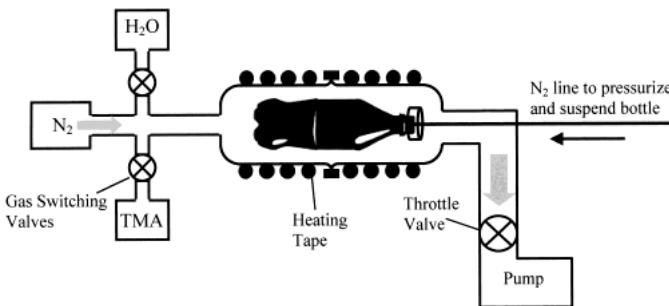
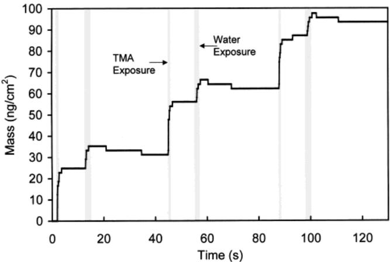
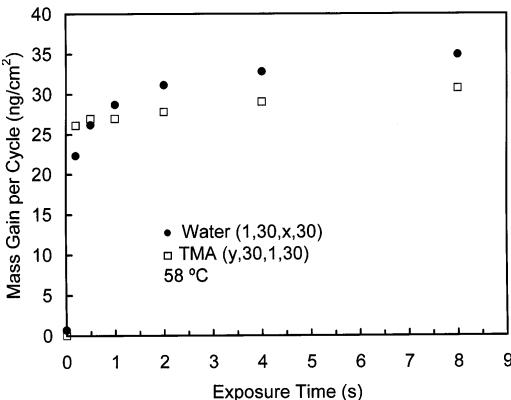
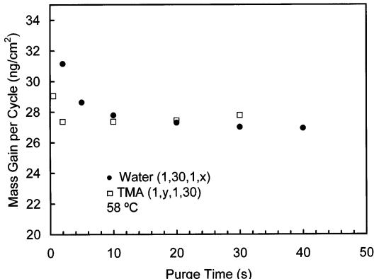
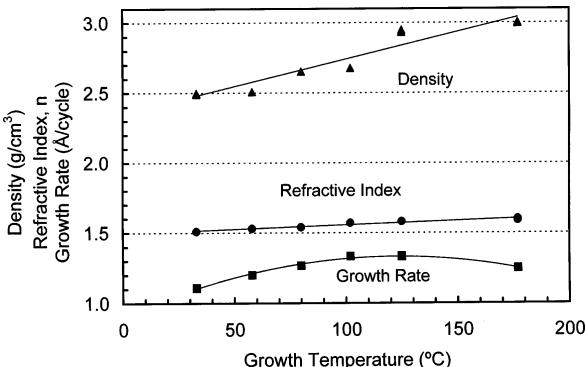
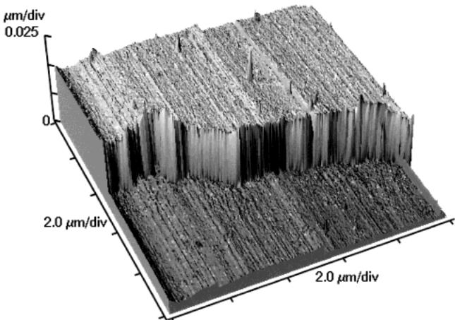
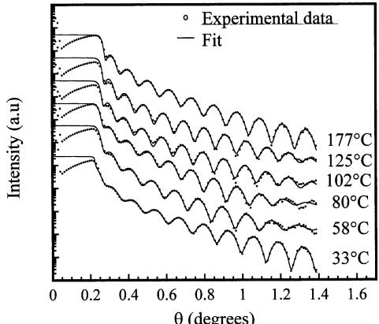
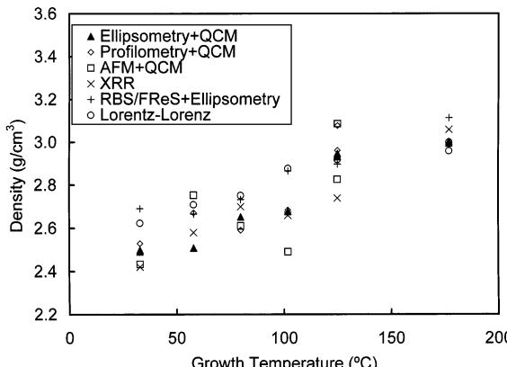

# Low-Temperature  $\mathbf{Al}_2\mathbf{O}_3$  Atomic Layer Deposition

M. 
D. Groner, $^{\dagger}$  
F. 
H. Fabreguette, $^{\dagger}$  
J. 
W. Elam, $^{\dagger}$  and 
S. 
M. George $^{*,\dagger ,\ddagger}$ Department of Chemistry and Biochemistry and Department of Chemical Engineering, University of Colorado, Boulder, Colorado 80309-0215

Received July 3, 2003. Revised Manuscript Received December 5, 2003

$\mathrm{Al}_2\mathrm{O}_3$  films were deposited by atomic layer deposition (ALD) at temperatures as low as 33  $^\circ \mathrm{C}$  in a viscous- flow reactor using alternating exposures of  $\mathrm{Al(CH_3)_3}$  (trimethylaluminum [TMA]) and  $\mathrm{H}_2\mathrm{O}$ . Low- temperature  $\mathrm{Al}_2\mathrm{O}_3$  ALD films have the potential to coat thermally fragile substrates such as organic, polymeric, or biological materials. The properties of low- temperature  $\mathrm{Al}_2\mathrm{O}_3$  ALD films were investigated versus growth temperature by depositing films on Si(100) substrates and quartz crystal microbalance (QCM) sensors.  $\mathrm{Al}_2\mathrm{O}_3$  film thicknesses, growth rates, densities, and optical properties were determined using surface profilometry, atomic force microscopy (AFM), QCM, and spectroscopic ellipsometry.  $\mathrm{Al}_2\mathrm{O}_3$  film densities were lower at lower deposition temperatures.  $\mathrm{Al}_2\mathrm{O}_3$  ALD film densities were  $3.0~\mathrm{g / cm^3}$  at  $177^{\circ}\mathrm{C}$  and  $2.5~\mathrm{g / cm^3}$  at  $33^{\circ}\mathrm{C}$ . AFM images showed that  $\mathrm{Al}_2\mathrm{O}_3$  ALD films grown at low temperatures were very smooth with a root- mean- squared (RMS) roughness of only  $4\pm 1\mathrm{\AA}$ . Current- voltage and capacitance- voltage measurements showed good electrical properties of the low- temperature  $\mathrm{Al}_2\mathrm{O}_3$  ALD films. Elemental analysis of the films using forward recoil spectrometry revealed hydrogen concentrations that increased with decreasing growth temperature. No other elements were observed by Rutherford backscattering spectrometry except the parent aluminum and oxygen concentrations. Low- temperature  $\mathrm{Al}_2\mathrm{O}_3$  ALD at  $58^{\circ}\mathrm{C}$  was demonstrated for the first time on a poly(ethylene terephthalate) (PET) polymeric substrate.  $\mathrm{Al}_2\mathrm{O}_3$  ALD coatings on PET bottles resulted in reduced  $\mathrm{CO}_2$  gas permeabilities.

# 1. Introduction

The coating of thermally fragile substrates by atomic layer deposition (ALD) may provide exciting new applications of ALD in diverse areas ranging from food packaging to microelectronics to biomaterials. For example, thin ALD films may serve as gas diffusion barriers in food packaging and extend shelf life by decreasing oxygen diffusion through potato chip bags or slowing the escape of  $\mathrm{CO}_2$  from pressurized soda containers. $^{1,2}$  ALD coatings on polymers may also be important as gas diffusion barriers for flexible electronic devices or organic light emitting diodes (OLEDs). $^{3,4}$  However, few ALD processes have been demonstrated at low temperatures of  $\sim 100^{\circ}\mathrm{C}$ . Room- temperature catalytic  $\mathrm{SiO}_2$  ALD has been demonstrated with  $\mathrm{SiCl}_4$  and  $\mathrm{H}_2\mathrm{O}$  plus pyridine $^5$  or  $\mathrm{NH}_3^6$  as the catalyst. ALD of  $\mathrm{ZnSe}$  and  $\mathrm{CdS}$  has also been demonstrated at room temperature. $^7$  The vast majority of ALD processes occur at temperatures of  $>100^{\circ}\mathrm{C}$  that would degrade organic, polymeric, or biological material.

$\mathrm{Al}_2\mathrm{O}_3$  is one of the most widely studied materials grown by ALD. $^{8 - 17}$ $\mathrm{Al}_2\mathrm{O}_3$  is a well- behaved ALD system that can be accomplished with a variety of precursors and relatively short cycle times. The effect of growth temperature on the properties of  $\mathrm{Al}_2\mathrm{O}_3$  ALD films has been studied at temperatures ranging from 125 to 500  $^\circ \mathrm{C}$ . $^{11 - 16}$  For microelectronics applications, desired properties such as high dielectric constant and low impurity concentration have been found to be optimized at a growth temperature of  $\sim 350^{\circ}\mathrm{C}$ . $^{11}$  Little is known about  $\mathrm{Al}_2\mathrm{O}_3$  ALD at low temperatures ( $\leq 100^{\circ}\mathrm{C}$ ) and the

  
Figure 1. Diagram of the viscous-flow reactor used for low-temperature  $\mathrm{Al_2O_3}$  ALD. A special flow tube was employed to accommodate a  $510 - \mathrm{mL}$  PET bottle. A nitrogen purge line was used to suspend and pressurize the PET bottle during  $\mathrm{Al_2O_3}$  ALD.

properties of such films. This study explores the conditions necessary for low- temperature  $\mathrm{Al_2O_3}$  ALD and examines the properties of the resulting films. Low- temperature  $\mathrm{Al_2O_3}$  ALD was also applied for the first time to a poly(ethylene terephthalate) (PET) polymer substrate. Reduced gas permeabilities were observed for  $\mathrm{Al_2O_3}$  ALD- coated PET bottles.

# 2. Experimental Section

A. Chemicals and Substrates.  $\mathrm{Al_2O_3}$  ALD films were grown using  $\mathrm{H_2O}$  (Fisher, optima grade) and  $\mathrm{Al(CH_3)_3}$  [trimethylaluminum (TMA)] (Alzo-Nobel, semiconductor grade,  $99.9999\%$ ). The carrier gas in the viscous flow reactor was  $\mathrm{N}_2$  (Airgas, ultrahigh purity). Moderately doped  $n$ -type  $\mathrm{Si}(100)$  wafers from Montco Silicon Technologies, Inc., with a boron doping density of  $\sim 2 \times 10^{17} \mathrm{cm}^{-3}$  were used as substrates.

A variety of chemicals were used for etching and cleaning of the Si substrates. These chemicals included  $5\%$  HF (general chemicals class 10 water/HF (10:1) mix), water (HPLC grade), sulfuric acid, and hydrogen peroxide  $(30\%)$ . Prior to deposition, the silicon wafers were cut into  $\sim 2.5 \mathrm{cm} \times 2.5 \mathrm{cm}$  pieces, cleaned in a  $\sim 60^{\circ}\mathrm{C}$  Piranha solution for  $15 \mathrm{min}$ , and then HF etched for  $60 \mathrm{s}$ .

For gas diffusion tests, uncoated poly(ethylene terephthalate) (PET) bottles were supplied by Applied Films Corp. The bottles were  $510 - \mathrm{mL}$  Coke Contour bottles. These PET bottles had a weight of  $28 \mathrm{g}$  and a petalloid shaped base. The PET bottles were cleaned with Micro cleaner/oxide remover (International Products Corp.) prior to deposition.

B.  $\mathrm{Al_2O_3}$  ALD Film Growth in Viscous-Flow Reactor.  $\mathrm{Al_2O_3}$  films were grown by ALD in a viscous-flow ALD reactor. This reactor has been described in detail in other publications.11,17 TMA and  $\mathrm{H_2O}$  were alternately entrained in the  $\mathrm{N}_2$  carrier flow using gas switching valves.17 The  $\mathrm{N}_2$  carrier gas pressure was  $\sim 1.0$  Torr. TMA and  $\mathrm{H_2O}$  pressure transient increases of  $\sim 0.1$  Torr were measured by a Baratron when the reactants were introduced into the  $\mathrm{N}_2$  carrier flow.

The  $\mathrm{Al_2O_3}$  ALD film growth proceeded according to two self- limiting surface reactions. The TMA and  $\mathrm{H_2O}$  yield  $\mathrm{Al_2O_3}$  ALD according to the following two reactions:9,10

$$
\begin{array}{r}\mathrm{(A)Al - OH^{*} + Al(CH_{3})_{3}\rightarrow Al - O - Al(CH_{3})_{2}^{*} + CH_{4}}\\ \mathrm{(B)Al - CH_{3}^{*} + H_{2}O\rightarrow Al - OH^{*} + CH_{4}} \end{array}
$$

where the asterisks denote the surface species. When performed in an ABAB... reaction sequence, these sequential reactions produce linear, atomic- layer controlled  $\mathrm{Al_2O_3}$  growth. Many previous studies have confirmed linear and conformal growth using TMA and  $\mathrm{H_2O}$ .9,11,15,17

The standard flow tube was used to deposit  $\mathrm{Al_2O_3}$  ALD films on Si substrates or the QCM.17 Figure 1 shows the reactor with a larger- than- normal flow tube designed to accommodate the PET bottles. Figure 1 also shows a simplified diagram of the gas switching valves and the gas reservoirs. The gas switching valves allow for a rapid turn- on and shut- off of the reactant gases for short ALD cycle times. This short time is facilitated by pumping the gas reservoirs with separate mechanical pumps after the reactant exposures.17

The time for one complete  $\mathrm{Al_2O_3}$  ALD cycle ranged from 12 s at  $177^{\circ}\mathrm{C}$  to  $203 \mathrm{s}$  at  $33^{\circ}\mathrm{C}$ . This cycle time was defined by  $(t_{1}, t_{2}, t_{3}, t_{4})$  where  $t_{1}$  is the TMA exposure time,  $t_{2}$  is the  $\mathrm{N}_2$  purge time following the TMA reactant exposure,  $t_{3}$  is the  $\mathrm{H}_2\mathrm{O}$  exposure time, and  $t_{4}$  is the  $\mathrm{N}_2$  purge time following the  $\mathrm{H}_2\mathrm{O}$  reactant exposure. All times are in units of seconds. Longer purge times were required at lower temperatures to avoid  $\mathrm{Al_2O_3}$  chemical vapor deposition (CVD) resulting from insufficient purge times.

Quartz crystal microbalance (QCM) studies of  $\mathrm{Al_2O_3}$  ALD were performed in situ using a Maxtek TM400 thin- film deposition monitor. The QCM crystal housing was sealed and purged to prevent deposition on the backside and positioned horizontally in the flow reactor tube. A detailed description of the QCM for monitoring ALD has been presented in a previous publication.17

$\mathrm{Al_2O_3}$  ALD films were deposited on PET bottles at  $58^{\circ}\mathrm{C}$ . To accommodate the  $510 - \mathrm{mL}$  PET bottles, the standard reactor flow tube was replaced with a larger  $10 - \mathrm{cm}$  diameter tube as shown in Figure 1. This tube consisted of the bottom halves of two vacuum traps joined by an O- ring and a clamp. The bottles were suspended in this enlarged reactor tube by a custom- made cap and purge line that allowed the bottle to be pressurized with  $\mathrm{N}_2$  gas during  $\mathrm{Al_2O_3}$  ALD. The pressurization prevented bottle deformation during and after the  $\mathrm{Al_2O_3}$  ALD film growth.

C.  $\mathrm{Al_2O_3}$  Film Characterization:  $\mathrm{Al_2O_3}$  film thicknesses and refractive indices were measured using a 
J. 
A. Woollam M44 variable-angle spectroscopic ellipsometer (VASE). Measurements were obtained over the spectral range from 406 to  $806 \mathrm{nm}$  using an incidence angle of  $75^{\circ}$ .  $\mathrm{Al_2O_3}$  and  $\mathrm{SiO_2}$  have virtually identical optical constants. Consequently, a simple ellipsometric measurement yields only the sum of the  $\mathrm{Al_2O_3}$  and  $\mathrm{SiO_2}$  film thicknesses. To determine the true  $\mathrm{Al_2O_3}$  thickness and the thickness of any interfacial  $\mathrm{SiO_2}$  layer on  $\mathrm{Si}(100)$ , a procedure was employed that utilized simultaneous  $\mathrm{Al_2O_3}$  ALD growth on both an HF-etched Si wafer and a Si wafer with a native oxide. This procedure was described in detail in another publication.11 A  $13 \pm 2 \mathrm{\AA}$  thick interfacial  $\mathrm{SiO_2}$  layer was determined to be present at the  $\mathrm{Al_2O_3 / Si}$  interface after  $\mathrm{Al_2O_3}$  ALD. This  $\mathrm{SiO_2}$  thickness was subtracted from the ellipsometric measurements to determine the  $\mathrm{Al_2O_3}$  layer thickness.

Atomic force microscope (AFM) images of the  $\mathrm{Al_2O_3}$  films and substrates were obtained using an AutoProbe CP Research scanning probe microscope (SPM) instrument from ThermoMicroscopes. RMS surface roughness values were calculated on the basis of  $1 \mu \mathrm{m}^2$  contact- mode AFM scans. Profilometry was performed using a Dektak 3 surface profile measuring system from Veeco Metrology Group.  $\mathrm{Al_2O_3}$  film thicknesses were determined by measuring step heights using profilometry and contact- mode AFM. Well- defined steps needed for AFM imaging were created by masking part of the sample with a small piece of high- temperature aluminum foil tape (3M, Type 433) during  $\mathrm{Al_2O_3}$  ALD. Other methods, such as clamping another piece of silicon to the substrate, were found to produce poorly defined steps that were too wide to be imaged by AFM.

Electrical measurements were performed using a MDC 811 mercury probe from the Materials Development Corporation. These electrical measurements have been described in another publication.11 The mercury probe makes contact to the front surface of the  $\mathrm{Al_2O_3}$  films by drawing up a well- defined column of  $\mathrm{Hg}$  with a surface area of  $0.437 \mathrm{mm}^2$ . Current- voltage (IV) measurements were obtained using a Keithley 487 picoammeter/voltage source. Capacitance- voltage (CV) measurements were performed using a Stanford Research Systems SR720 LCR meter. The experiments were computer- controlled using LabView from National Instruments.

Elemental analysis was performed at the Ion Beam Analysis Laboratory in the Institute of Technology Characterization

  
Figure 2. QCM measurements for  $\mathrm{Al}_2\mathrm{O}_3$  ALD at  $58^{\circ}C$  showing the linear growth of the  $\mathrm{Al}_2\mathrm{O}_3$  ALD film over many reaction cycles. The average  $\mathrm{Al}_2\mathrm{O}_3$  mass gain per ALD cycle is  $30~\mathrm{ng / cm^2}$ .

Facility at the University of Minnesota. Al and O were determined by Rutherford backscattering spectrometry (RBS) using a  $3.5\mathrm{MeV}^{4}\mathrm{He}^{2 + }$  and  $2.4\mathrm{MeV}^{4}\mathrm{He}^{+}$ beam, respectively. H was determined by  $1.3\mathrm{MeV}^{4}\mathrm{He}^{+}$ forward recoil spectrometry (FReS). The instrument is composed of a NEC  $1.7\mathrm{MV}$  Pelletron accelerator with a Charles Evans RBS 400 endstation. The He beam incident angle was  $75^{\circ}$ . The RBS detector was located at  $165^{\circ}$  and the FReS detector was located at  $30^{\circ}$  from the beam direction. A  $5 - \mu \mathrm{m}$  thick Mylar foil was placed in front of the FReS detector to filter the scattered  $^4\mathrm{He}$  particles. The error was estimated at less than  $5\%$ .

X- ray reflectivity (XRF) was performed with a Bede Scientific Ltd. D1 System using a channel cut crystal. The X- ray wavelength from the Cu Kα X- ray tube was  $1.54\mathrm{\AA}$ . The electron beam current in the X- ray tube was  $20\mathrm{mA}$  at  $35\mathrm{kV}$ . A  $\theta - 2\theta$  scan was performed with a 10- arcsec step size and a 5- s acquisition time. The Bede Refs software with a genetic algorithm was used to fit the XRR data and calculate the densities of the films.

Gas diffusion tests on the  $\mathrm{Al}_2\mathrm{O}_3$  ALD- coated PET bottles were performed by Applied Films Corporation using a GMS barrier measurement system (Balzers Process Systems, GmbH). The bottles were pressurized with up to 6 bar of  $\mathrm{CO_2}$  gas. The loss of  $\mathrm{CO_2}$  was then measured over 3 to 4 days. The  $\mathrm{CO_2}$  loss rate of an  $\mathrm{Al}_2\mathrm{O}_3$  ALD- coated PET coated bottle was compared with the  $\mathrm{CO_2}$  loss rate of an uncoated bottle. This ratio of these loss rates determined the  $\mathrm{CO_2}$  barrier improvement factor (BIF).

# 3. Results

A. Quartz Crystal Microbalance.  $\mathrm{Al}_2\mathrm{O}_3$  ALD was characterized at different growth temperatures from 33 to  $177^{\circ}C$  using a QCM. Figure 2 shows  $\mathrm{Al}_2\mathrm{O}_3$  ALD at  $58^{\circ}C$  using a (1, 10, 2, 30) cycle time. The  $\mathrm{Al}_2\mathrm{O}_3$  ALD film growth is very linear with number of AB reaction cycles. A mass gain per cycle of  $30~\mathrm{ng / cm^2}$  was measured for the  $\mathrm{Al}_2\mathrm{O}_3$  ALD growth shown in Figure 2. A more detailed view of the QCM data is shown in Figure 3. The QCM data for three ALD cycles shows the mass gain for each TMA and water exposure. The time periods during which the TMA and  $\mathrm{H}_2\mathrm{O}$  dosing valves were open are denoted by the shaded regions. A larger mass gain is observed during the TMA exposure than during the  $\mathrm{H}_2\mathrm{O}$  exposure. This behavior is similar to that previously observed during QCM studies of  $\mathrm{Al}_2\mathrm{O}_3$  ALD at  $177^{\circ}C$ .

The QCM data were used to determine the optimal reactant exposures and nitrogen purge times for  $\mathrm{Al}_2\mathrm{O}_3$  ALD at low temperatures. At  $177^{\circ}C$ , QCM data from this work and a previous study showed that 1- s exposure times and 5- s purge times were sufficient for complete reaction and purging of all of the reactants to prevent CVD. Both the required exposure times and purge times increased with decreasing temperatures.

  
Figure 3. Detailed view of the QCM measurements at  $58^{\circ}C$ . The shaded areas show the time periods during which the TMA and water dosing valves were open. The mass increases coincide with the TMA and water exposures.

  
Figure 4.  $\mathrm{Al}_2\mathrm{O}_3$  mass gain per cycle versus reactant exposure time at  $58^{\circ}C$ . Purge times for both TMA and water were 30 s each. The exposure time of the reactant not being investigated was held constant at  $1\mathrm{s}$ .

The dependence of the  $\mathrm{Al}_2\mathrm{O}_3$  ALD mass gain on reactant exposure time at  $58^{\circ}C$  is shown in Figure 4. These curves were obtained by monitoring QCM data while varying the individual reactant exposure times to determine the minimum precursor exposures necessary for the TMA and  $\mathrm{H}_2\mathrm{O}$  reactions to reach completion. Figure 5 shows the effect of purge times on the  $\mathrm{Al}_2\mathrm{O}_3$  ALD growth rates. Purge times were chosen to be long enough to avoid reactant mixing and subsequent CVD. The CVD growth is indicated by the rise in mass gain per cycle at short purge times. On the basis of these studies, the optimal cycle time for  $\mathrm{Al}_2\mathrm{O}_3$  ALD growth at  $58^{\circ}C$  was (1, 10, 2, 30) where all times are in units of seconds.

QCM experiments confirmed that  $\mathrm{Al}_2\mathrm{O}_3$  ALD is possible at temperatures as low as  $33^{\circ}C$ . This temperature was the lowest temperature that could be achieved without actively cooling the viscous flow reactor. However, the required  $\mathrm{H}_2\mathrm{O}$  purge time was  $180\mathrm{s}$  at  $33^{\circ}C$ . Table 1 shows the reactant exposure and purge times used to perform  $\mathrm{Al}_2\mathrm{O}_3$  ALD at growth temperatures ranging from 33 to  $177^{\circ}C$ . The resulting  $\mathrm{Al}_2\mathrm{O}_3$  ALD mass gains per cycle determined by the QCM are also given in Table 1.

  
Figure 5.  $\mathrm{Al}_2\mathrm{O}_3$  mass gain per cycle versus purge time at 58  $^\circ \mathrm{C}$ . Exposure times for both TMA and water were 1 s each. The purge time of the reactant not being investigated was held constant at  $30~\mathrm{s}$ .

Table 1. Reactant Exposure Times, Purge Times, and Mass Gain Per Cycle Determined by the QCM for  $\mathbf{Al}_2\mathbf{O}_3$  ALD Films Grown at Temperatures from 33 to  $177^{\circ}C$  

<table><tr><td rowspan="2"></td><td colspan="6">growth temperature (°C)</td></tr><tr><td>177</td><td>125</td><td>102</td><td>80</td><td>58</td><td>33</td></tr><tr><td>TMA exposure time (s)</td><td>1</td><td>1</td><td>1</td><td>1</td><td>1</td><td>1</td></tr><tr><td>purge time (s)</td><td>5</td><td>5</td><td>5</td><td>5</td><td>10</td><td>20</td></tr><tr><td>water exposure time (s)</td><td>1</td><td>2</td><td>2</td><td>2</td><td>2</td><td>2</td></tr><tr><td>purge time (s)</td><td>5</td><td>10</td><td>20</td><td>20</td><td>30</td><td>180</td></tr><tr><td>mass gain/cycle (ng/cm²)</td><td>38</td><td>39</td><td>36</td><td>34</td><td>30</td><td>28</td></tr></table>

QCM measurements indicated a maximum mass gain per cycle of  $39~\mathrm{ng / cm^2}$  at  $125^{\circ}C$ . A slight decrease to 38  $\mathrm{ng / cm^2}$  in the mass gain per cycle was measured at 177  $^\circ \mathrm{C}$ . Below  $125^{\circ}C$ , the mass gain per cycle decreases with decreasing growth temperature and reaches a value of  $30~\mathrm{ng / cm^2}$  at  $33^{\circ}C$ .

B. Spectroscopic Ellipsometry.  $\mathrm{Al}_2\mathrm{O}_3$  ALD film thicknesses and the refractive index,  $n$ , were determined at wavelengths from 406 to  $806~\mathrm{nm}$  using spectroscopic ellipsometry. For  $\mathrm{Al}_2\mathrm{O}_3$  films grown using 300 reaction cycles, the film thickness increased from  $332\mathrm{\AA}$  at  $33^{\circ}C$  to  $401\mathrm{\AA}$  at  $125^{\circ}C$ . The film thickness then decreased slightly to  $375\mathrm{\AA}$  at  $177^{\circ}C$ . These measurements yield  $\mathrm{Al}_2\mathrm{O}_3$  ALD growth rates of 1.11, 1.34, and  $1.25\mathrm{\AA}$  cycle, respectively.  $\mathrm{Al}_2\mathrm{O}_3$  ALD growth rates over the entire growth temperature range are given in Figure 6.

The refractive indices decreased slightly with decreasing growth temperature. The results of these measurements are also shown in Figure 6. The refractive indices varied by  $< 1\%$  over the spectral range from 406 to 806 nm. Consequently, the analysis was performed by assuming that the refractive index was constant over the entire wavelength range. The maximum refractive index was  $n = 1.60$  at  $177^{\circ}C$ . The refractive index decreased to  $n = 1.51$  at  $33^{\circ}C$ . Figure 6 also shows the density of the  $\mathrm{Al}_2\mathrm{O}_3$  ALD films calculated on the basis of the QCM mass measurements and the ellipsometric  $\mathrm{Al}_2\mathrm{O}_3$  film thicknesses.

C. Profilometry, Atomic Force Microscopy, and X-ray Reflectivity. Profilometry and AFM were used as independent measures of  $\mathrm{Al}_2\mathrm{O}_3$  ALD film thicknesses. Figure 7 shows a  $10\times 10\mu \mathrm{m}^2$  AFM image used to determine the thickness of an  $\mathrm{Al}_2\mathrm{O}_3$  ALD film grown at  $58^{\circ}C$  using 300 reaction cycles on a Si(100) substrate. The step was created by covering part of the sample with high-temperature aluminum tape during  $\mathrm{Al}_2\mathrm{O}_3$

  
Figure 6. Ellipsometry data for  $\mathrm{Al}_2\mathrm{O}_3$  ALD films grown using 300 reaction cycles on Si(100) substrates. The refractive index, growth rate, and density (calculated using ellipsometry and QCM data) are plotted versus growth temperatures from 33 to  $177^{\circ}C$ .

  
Figure 7. AFM image  $(10\times 10\mu \mathrm{m}^2)$  used to determine the thickness of an  $\mathrm{Al}_2\mathrm{O}_3$  ALD film grown at  $58^{\circ}C$  using 300 ALD cycles on a Si(100) substrate. The step was created by masking part of the sample with aluminum tape during  $\mathrm{Al}_2\mathrm{O}_3$  ALD. The average step height is  $43~\mathrm{nm}$ .

ALD. The average step height in this image is  $43~\mathrm{nm}$ . Film thicknesses determined by profilometry and AFM were within  $\pm 10\%$  of the thicknesses derived by the ellipsometric measurements.

AFM was also used to determine the surface roughness of the  $\mathrm{Al}_2\mathrm{O}_3$  ALD films. The low- temperature  $\mathrm{Al}_2\mathrm{O}_3$  ALD films were all very smooth. The root- mean- squared (RMS) surface roughness for a  $1\times 1\mu \mathrm{m}^2$  area averaged  $4\pm 1\mathrm{\AA}$ . Growth temperature did not affect this surface roughness. The roughness of these films is also similar to that of  $\mathrm{Al}_2\mathrm{O}_3$  ALD films grown at higher temperatures.

XRR scans for  $\mathrm{Al}_2\mathrm{O}_3$  ALD films grown on Si(100) using 300 reaction cycles at temperatures from 33 to  $177^{\circ}C$  are shown in Figure 8. The XRR scans were fitted to determine densities of the  $\mathrm{Al}_2\mathrm{O}_3$  ALD films. These fits are also shown in Figure 8. The density of the  $\mathrm{Al}_2\mathrm{O}_3$  ALD films derived by fitting the XRR measurements decreased from  $3.06~\mathrm{g / cm^3}$  at  $177^{\circ}C$  to  $2.46~\mathrm{g / cm^3}$  at  $33^{\circ}C$ . The XRR density results and comparison of all the density results are shown in Figure 9.

D. Electrical Characterization. Current-voltage (IV) and capacitance-voltage (CV) measurements were performed on the low-temperature  $\mathrm{Al}_2\mathrm{O}_3$  ALD films. The

  
Figure 8. XRR scans for  $\mathrm{Al}_2\mathrm{O}_3$  ALD films grown on  $\mathrm{Si}(100)$  using  $300$  reaction cycles versus growth temperature from 33 to  $177^{\circ}\mathrm{C}$ . The fits to the XRR data used to determine densities are shown by the solid lines.

  
Figure 9. Density of  $\mathrm{Al}_2\mathrm{O}_3$  ALD films versus growth temperature from 33 to  $177^{\circ}\mathrm{C}$  for the various methods.

  
Figure 10. Electrical properties of low-temperature  $\mathrm{Al}_2\mathrm{O}_3$  ALD films grown using 300 reaction cycles on  $n\mathrm{-Si}(100)$ .

IV curve characteristics remained relatively constant versus growth temperature. Low leakage current densities of  $\mathrm{< 10^{- 7}nA / cm^2}$  at a  $5\mathrm{V}$  bias were measured even for  $\mathrm{Al}_2\mathrm{O}_3$  ALD films grown at  $33^{\circ}\mathrm{C}$ . Growth temperature did not appear to affect the leakage currents.

The catastrophic breakdown field decreased slightly with decreasing growth temperature as shown in Figure 10. The breakdown field was  $4.4\mathrm{MV / cm}$  at  $177^{\circ}\mathrm{C}$  and decreased to  $3.7\mathrm{MV / cm}$  at  $33^{\circ}\mathrm{C}$ . In addition, there was a decrease in the percentage of spots tested that exhibited good insulating behavior at lower growth temperatures. Capacitance measurements revealed no observable trend versus growth temperature. Figure 10 reveals that the dielectric constants of the  $\mathrm{Al}_2\mathrm{O}_3$  ALD films averaged  $k = 7.7\pm 0.4$  over the entire temperature range.

  
Figure 11. O/Al ratio and H concentrations for  $\mathrm{Al}_2\mathrm{O}_3$  ALD films as determined by RBS and FRS versus growth temperatures from 33 to  $177^{\circ}\mathrm{C}$ .

E. Elemental Analysis. Rutherford backscattering spectrometry (RBS) analysis measured O/Al ratios close to the expected 1.5 value as shown in Figure 11. The ratios ranged from 1.34 to 1.70. There was no systematic trend with growth temperature. Hydrogen concentrations measured by forward recoil spectrometry (FReS) increased with decreasing growth temperature as displayed in Figure 11. The H atom  $\%$  in the  $\mathrm{Al}_2\mathrm{O}_3$  ALD films increased from  $6.9\%$  at  $177^{\circ}\mathrm{C}$  to  $21.7\%$  at  $33^{\circ}\mathrm{C}$ . No other impurities were detected in the  $\mathrm{Al}_2\mathrm{O}_3$  ALD films within the detection limit of the RBS.

F. Gas Diffusion. Gas diffusion tests with  $\mathrm{CO}_2$  were carried out on PET bottles coated with  $\mathrm{Al}_2\mathrm{O}_3$  ALD films. Bottles were coated with 300 reaction cycles of  $\mathrm{Al}_2\mathrm{O}_3$  ALD at  $58^{\circ}\mathrm{C}$ . This coating procedure should deposit a  $\mathrm{Al}_2\mathrm{O}_3$  ALD film with a thickness of  $360\mathrm{\AA}$ . The  $\mathrm{CO}_2$  gas diffusion test revealed a  $\mathrm{CO}_2$  loss rate of  $1.55\%$  per week, or  $2.91\mathrm{cm}^3 /$  day bar  $\mathrm{cm}^2$ . This  $\mathrm{CO}_2$  loss rate for the  $\mathrm{Al}_2\mathrm{O}_3$  ALD-coated bottle is a factor of  $\sim 1.6$  lower than the  $\mathrm{CO}_2$  loss rate of an uncoated PET bottle. The ratio of these two  $\mathrm{CO}_2$  loss rates yields a barrier improvement factor (BIF) of  $\sim 1.6$ .

Volumetric measurements of the PET bottles showed no change in volume as a result of  $\mathrm{Al}_2\mathrm{O}_3$  ALD at  $58^{\circ}\mathrm{C}$ . PET bottles were also coated with 282 and 470 reaction cycles of  $\mathrm{Al}_2\mathrm{O}_3$  ALD at a growth temperature of  $80^{\circ}\mathrm{C}$  and without the  $\mathrm{N}_2$  gas pressurization. These PET bottles deformed and increased in volume during deposition. The barrier improvements factors for these  $\mathrm{Al}_2\mathrm{O}_3$  ALD-coated PET bottles were much smaller.

# 4. Discussion

A. Quartz Crystal Microbalance (QCM) Measurements. QCM studies showed that both the reactant exposure times and the nitrogen purge times required for  $\mathrm{Al}_2\mathrm{O}_3$  ALD increased with decreasing temperatures. Longer reactant exposures at low temperatures are expected because the reaction is thermally activated. The purging of reactants, especially  $\mathrm{H}_2\mathrm{O}$ , takes longer at low temperatures because of slower desorption of  $\mathrm{H}_2\mathrm{O}$  from the reactor walls at lower temperatures.

The completion of the reactions took longer and became less defined, or "softer", at lower temperatures. This "soft" saturation is revealed by the small slope for the mass gain per cycle versus  $\mathrm{TM}$  and  $\mathrm{H}_2\mathrm{O}$  exposure at longer exposure times in Figure 4. These small slopes

indicate that either a complete reaction may not have been achieved or that the purge times may have become insufficient. Unfortunately, trying to achieve a complete reaction using reactant exposures of tens of seconds is inefficient in terms of time and reactant usage.

The maximum QCM mass gain per cycle of  $39~\mathrm{ng} / \mathrm{cm}^2$  was recorded at  $125^{\circ}C$  as shown in Table 1. QCM measurements can be employed to calculate film thicknesses. These thickness calculations rely on known density values. For amorphous materials such as the  $\mathrm{Al}_2\mathrm{O}_3$  ALD films grown at low temperatures, the density may change with growth temperature. Consequently, additional independent thickness measurements are required to derive the density from the QCM mass measurements.

B. Thickness Measurements and  $\mathbf{Al}_2\mathbf{O}_3$  ALD Growth Rates. The agreement between the different methods of measuring  $\mathrm{Al}_2\mathrm{O}_3$  ALD film thicknesses is quite good. Ellipsometric data exhibit less scatter than most of the other methods. The growth rate versus growth temperature obtained by ellipsometry displays a very smooth dependence in Figure 6. However, ellipsometry data depend on fitting several parameters to obtain a film thickness. This modeling can also be complicated by the presence of an interfacial  $\mathrm{SiO_2}$  layer.11 Profilometry and AFM step height measurements are more direct determinations of film thickness but tend to be less precise. These measurements depend on the presence of a well-defined, sharp step edge that is not always easy to obtain. However, the film thicknesses obtained by profilometry and AFM agreed fairly well with the film thicknesses obtained by ellipsometry and XRR methods.

The  $\mathrm{Al}_2\mathrm{O}_3$  ALD growth rates shown in Figure 6 reach a maximum of  $1.33\mathrm{\AA}$  cycle at 100 and  $125^{\circ}C$  A previous study observed the maximum  $\mathrm{Al}_2\mathrm{O}_3$  ALD growth rate of  $1.1\mathrm{\AA}$  cycle at  $177^{\circ}C$  9 The position of this maximum was explained by the thermal activation required for the reaction at lower temperatures and decreasing  $\mathrm{Al{- }OH}$  and  $\mathrm{Al{- }CH_3}$  surface coverages at higher temperatures.9 The growth rate is determined by reaction kinetics and necessary surface species.9,10 There are higher surface coverages at low temperatures, but slower reaction kinetics because of the thermal activation barrier. The reaction kinetics are more rapid at higher temperatures, but the growth rate is limited by the lower surface coverages.

C.Density.Figure 9 shows the densities of the  $\mathrm{Al}_2\mathrm{O}_3$  ALD films as determined by a number of different methods.Densities were calculated on the basis of QCM, AFM, ellipsometry, profilometry, XRR, and RBS/FReS data. The density of the  $\mathrm{Al}_2\mathrm{O}_3$  ALD films decreased with decreasing growth temperature based on all the different methods. Furthermore, the density values derived from the different methods agree fairly well with each other. Average densities ranged from  $3.0~\mathrm{g / cm^3}$  at 177  $^\circ \mathrm{C}$  to  $2.5~\mathrm{g / cm^3}$  at  $33^{\circ}C$

The densities of these low- temperature  $\mathrm{Al}_2\mathrm{O}_3$  ALD films are significantly lower than the  $3.5\mathrm{- }3.7\mathrm{g / cm^3}$  value typically reported for amorphous  $\mathrm{Al}_2\mathrm{O}_3$  19,20 The density of  $3.0~\mathrm{g / cm^3}$  at  $177^{\circ}C$  is also lower than the density of  $3.5\mathrm{g / cm^3}$  derived in a previous study of  $\mathrm{Al}_2\mathrm{O}_3$  ALD films.9 That earlier study derived the density from the refractive index of the film and the Lorentz- Lorenz relationship assuming the optical constants of crystalline  $\mathrm{Al}_2\mathrm{O}_3$  . This assumption may not be correct because the  $\mathrm{Al}_2\mathrm{O}_3$  ALD film is amorphous. The data in the current study are consistent with an average density of  $3.0~\mathrm{g / cm^3}$  at  $177^{\circ}C$  based on many different types of measurements.

  
Figure 12. Refractive index,  $n$ , of the  $\mathrm{Al}_2\mathrm{O}_3$  ALD films versus growth temperature from 33 to  $177^{\circ}C$  and comparisons to results from other  $\mathrm{Al}_2\mathrm{O}_3$  ALD studies at higher temperatures.9,12-15,21

The density versus growth temperature has also been calculated using the Lorentz- Lorenz relationship.9 Starting with the density of  $3.0~\mathrm{g / cm^3}$  at  $177^{\circ}C$  densities for the  $\mathrm{Al}_2\mathrm{O}_3$  ALD films grown at lower temperature were determined on the basis of their refractive indices,  $n$ . Figure 9 shows that the densities derived using the Lorentz- Lorenz relationship yield good agreement with the other  $\mathrm{Al}_2\mathrm{O}_3$  ALD film densities.

D. Optical and Electrical Properties. Figure 6 shows that the refractive index of the  $\mathrm{Al}_2\mathrm{O}_3$  ALD films decreased slightly with decreasing growth temperatures. This trend has been reported elsewhere and was attributed to decreased density and to increased impurity levels in films grown at lower temperatures.8,14 Figure 12 shows the refractive index of the low-temperature  $\mathrm{Al}_2\mathrm{O}_3$  ALD films compared with the refractive index of  $\mathrm{Al}_2\mathrm{O}_3$  ALD films measured in other studies.9,12-15,21 There is good agreement between the refractive indices in the region of overlap between 150 and  $200^{\circ}C$

The refractive index increases with increasing growth temperature up to  $\sim 300^{\circ}C$  . The refractive index is then constant at  $n\approx 1.67$  for growth temperatures between 300 and  $500^{\circ}C$  . For comparison, the crystalline  $\alpha - \mathrm{Al}_2\mathrm{O}_3$  sapphire form of alumina has a refractive index of  $n =$  1.76.15 This comparison indicates that the amorphous  $\mathrm{Al}_2\mathrm{O}_3$  ALD film with  $n\approx 1.67$  will densify further upon crystallization. This densification could lead to tensile stress and film cracking.

IV and CV measurements revealed good electrical properties for films grown at low temperatures. The decreasing breakdown field with decreasing growth temperature shown in Figure 10 may result from the decreasing density or the increased hydrogen concentra

tion in the  $\mathrm{Al_2O_3}$  ALD films grown at lower temperatures. Figure 10 also shows that the dielectric constant did not decrease with decreasing growth temperatures. However, the scatter in the measurements may have masked a small change.

E. Film Composition. The RBS analysis of the  $\mathrm{Al_2O_3}$  ALD films obtained  $\mathrm{O / Al}$  ratios close to the expected ratio of 1.5. In addition, FReS analysis revealed hydrogen concentrations in Figure 11 that increased with decreasing growth temperatures. The increasing hydrogen concentrations continue a trend that was observed in a previous study for  $\mathrm{Al_2O_3}$  ALD growth temperatures from 350 to  $125^{\circ}\mathrm{C}$ . The increasing hydrogen concentration at low temperatures may be directly related to the lower density of the  $\mathrm{Al_2O_3}$  ALD films at lower growth temperature.

At lower temperatures, the hydroxyl surface coverage is higher on  $\mathrm{Al_2O_3}$  surfaces. In addition, the TMA reaction with the  $\mathrm{Al - OH}$  surface species groups does not go to completion at low temperatures. During  $\mathrm{Al_2O_3}$  ALD, the hydroxyl species can build up in the growing  $\mathrm{Al_2O_3}$  film. At  $180^{\circ}\mathrm{C}$ , the hydroxyl concentration in the film after 10 AB cycles is equal to approximately the full hydroxyl coverage. Annealing at  $1000\mathrm{K}$  can reduce hydroxyl accumulation in  $\mathrm{Al_2O_3}$  ALD films. These previous studies support the idea that the H atoms in the low- temperature  $\mathrm{Al_2O_3}$  ALD films are present in the form of  $\mathrm{Al - OH}$  species.

Despite the high hydrogen concentrations at low temperatures, the  $\mathrm{Al_2O_3}$  ALD films still exhibited remarkably good properties. Low- temperature  $\mathrm{Al_2O_3}$  ALD films may be used for various applications where the high hydrogen concentration is not crucial. On the basis of the results at  $33^{\circ}\mathrm{C}$ , growing  $\mathrm{Al_2O_3}$  ALD films at room temperature is possible. The major problem is slow  $\mathrm{H_2O}$  desorption from the reactor walls and very long required  $\mathrm{H_2O}$  purge times. Shorter cycle times could be achieved using a modified reactor design and alternate oxygen sources such as  $\mathrm{N_2O}$ ,  $\mathrm{NO_2}$ , or alkoxides.

F. Gas Diffusion Tests. The PET bottles coated with 300 reaction cycles of  $\mathrm{Al_2O_3}$  ALD at  $58^{\circ}\mathrm{C}$  displayed a decrease in  $\mathrm{CO_2}$  gas diffusion rates. However, lower  $\mathrm{CO_2}$  diffusion rates and higher barrier improvement factors

BIF) are desired for commercial applications. Light microscopy images of the surface of the PET bottle revealed apparent scratches and/or cracks on the surface of the  $\mathrm{Al_2O_3}$  ALD- coated bottles. These scratches and/or cracks may explain the low BIF for these  $\mathrm{Al_2O_3}$  ALD films compared with typical BIFs for  $\mathrm{SiO_2}$  coatings.

# 5. Conclusions

$\mathrm{Al_2O_3}$  ALD growth has been demonstrated at temperatures as low as  $33^{\circ}\mathrm{C}$ . Many of the properties of these low- temperature  $\mathrm{Al_2O_3}$  ALD films were comparable with the properties of  $\mathrm{Al_2O_3}$  ALD films grown at higher temperatures of  $\geq 177^{\circ}\mathrm{C}$ . The low- temperature  $\mathrm{Al_2O_3}$  ALD films exhibited very low surface roughness values, low leakage currents, high dielectric constants, and growth rates in excess of  $1\mathrm{\AA / cycle}$ . Good thin film properties were observed despite decreasing densities and increasing hydrogen concentrations observed at lower temperatures. Increased ALD cycle times were necessary at lower temperatures because of the slower reaction rates and longer required purge times for the  $\mathrm{H_2O}$  reactant. Improvements in reactor design and the use of alternate oxygen sources could help overcome this problem. Low- temperature  $\mathrm{Al_2O_3}$  ALD may have applications for coating thermally fragile substrates such as organic, polymeric, or biological material. As a demonstration of the possible applications, low- temperature  $\mathrm{Al_2O_3}$  ALD films were grown on PET bottles to reduce gas diffusion. The  $\mathrm{Al_2O_3}$  ALD- coated PET bottles displayed lower  $\mathrm{CO_2}$  gas diffusion rates than uncoated PET bottles.

Acknowledgment. Funding for this research was research was provided by Applied Films Corporation. Additional support was provided by the Air Force Office of Scientific Research. We thank Russell Black and Elisabeth Sommer at Applied Films Corp. for providing the PET bottles and for performing  $\mathrm{CO_2}$  gas diffusion tests on the PET bottles coated with  $\mathrm{Al_2O_3}$  ALD films. Yongqiang Wang at the Ion Beam Analysis Laboratory in the Institute of Technology Characterization Facility at the University of Minnesota performed the RBS and FReS analysis of the  $\mathrm{Al_2O_3}$  ALD samples.

CM0304546