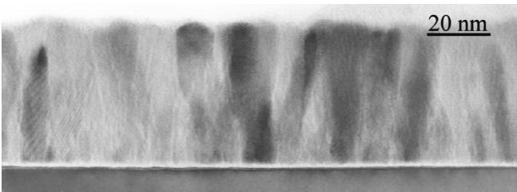
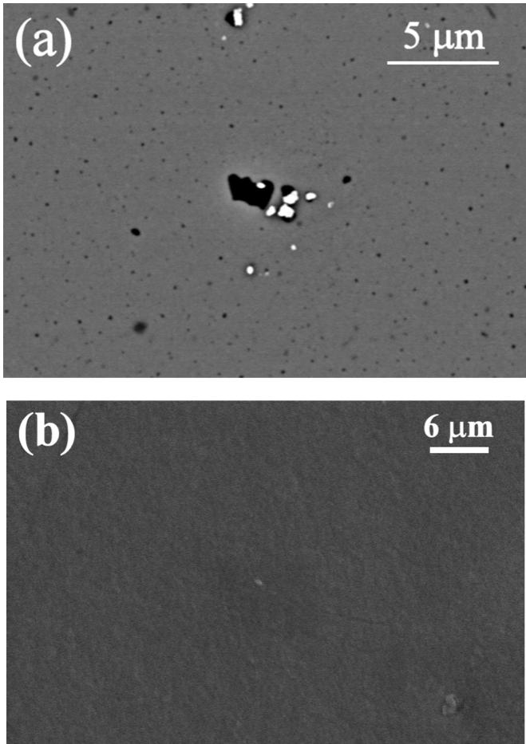
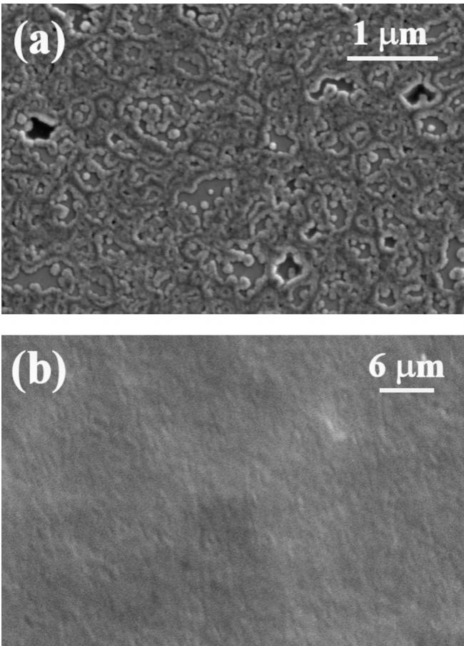
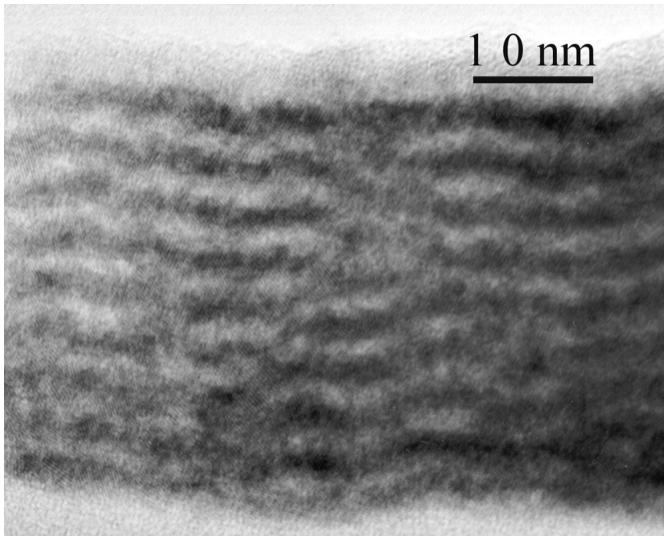
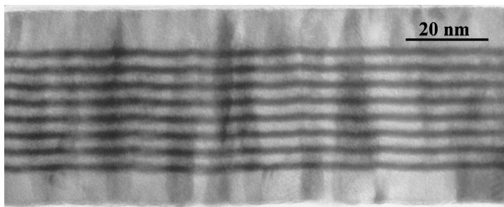
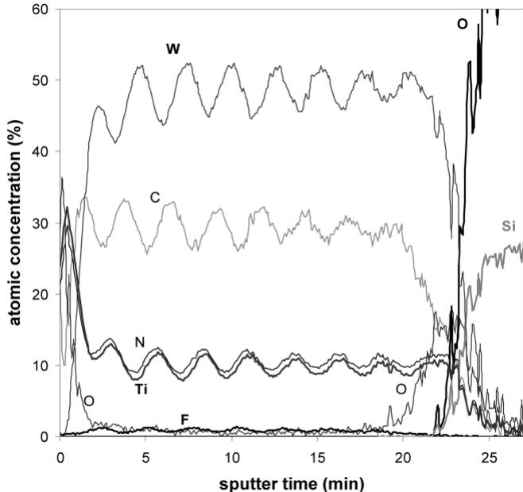

# Atomic layer deposition of  $\mathrm{W}_x\mathrm{N} / \mathrm{TiN}$  and  $\mathrm{WN}_x\mathrm{C}_y / \mathrm{TiN}$  nanolaminates

K.-E. Elers $^{a,\ast}$ , 
V. Saanila $^{b}$ , 
W.-M. Li $^{b}$ , 
P.J. Soininen $^{b}$ , 
J.T. Kostamo $^{b}$ , 
S. Haukka $^{b}$ , 
J. Juhanoja $^{c}$ , 
W.F.A. Beoling $^{d}$

$^{a}$ ASM America Ltd/North Western Service Office, 3935NW Aloclek Place, Building #C300, Hillsboro, OR 27124- 7114, USA  $^{b}$ ASM Microchemistry Ltd., P.O. Box 132, FIN- 02631 Espoo, Finland  $^{c}$ Top Analytica Oy, Ruukkakatu 4, 20540 Turku, Finland  $^{d}$ Philips Semiconductors, 850 Rue Jean Monnet, 38926 Crolles, France

Received 28 October 2002; received in revised form 13 February 2003; accepted 4 March 2003

# Abstract

Diffusion barrier materials, such as TiN,  $\mathrm{W}_x\mathrm{N}$ ,  $\mathrm{WN}_x\mathrm{C}_y$  and their nanolaminates were deposited by atomic layer deposition method. TiN film exhibited excellent properties, but  $\mathrm{W}_x\mathrm{N}$  film exhibited high resistivity despite the low residue concentration. Both TiN and  $\mathrm{W}_x\mathrm{N}$  films suffered from serious incompatibility with the copper metal.  $\mathrm{WN}_x\mathrm{C}_y$  film was deposited by introducing triethylboron as a reducing agent for tungsten. Excellent film properties were obtained, including very good compatibility with the copper metal, evident as strong adhesion and no pitting on the copper surface. Nanolaminate barrier stacks of  $\mathrm{W}_x\mathrm{N} / \mathrm{TiN}$  and  $\mathrm{WN}_x\mathrm{C}_y / \mathrm{TiN}$  were successfully deposited. TiN deposition did not cause copper pitting when thin  $\mathrm{WN}_x\mathrm{C}_y$  film was deposited underneath.

$(\widehat{\Xi})$  2003 Elsevier Science B.V. All rights reserved.

Keywords: Atomic layer deposition; Titanium nitride; Tungsten nitride; Diffusion barrier

# 1. Introduction

Copper dual- damascene processes are a new technology in the IC industry creating new challenges for conventional metallization processes. The new diffusion barrier films are required to prevent copper diffusion into the insulator, and the diffusion of impurities into the copper metal. Demanding film properties of the diffusion barrier are especially required when the films with sub- 10- nm thickness are expected in sub- 100- nm node [1]. For the manufacture of reliable devices the barrier film must exhibit excellent step coverage and uniformity. The film must be continuous over all structures and the film density must not vary on the sidewalls of vias or trenches. The resistivity should be below 500  $\mu \Omega$  cm and free carbon or halide residues from the precursors should be minimal. The processing must meet several requirements including processing temperatures below  $400^{\circ}\mathrm{C}$ , good growth, and adhesion to the different surface materials present in the dual- damascene structure. The film also has to be compatible with the chemical mechanical polishing process.

The best diffusion barrier properties will be obtained with an amorphous film, given that the grain boundaries in polycrystalline film are the most probable diffusion path for impurities. Because the grain size is very small in thin films, the density of boundaries is relatively high. Grain boundary diffusion has been found to dominate over lattice and dislocation diffusion under nearly all conditions [2]. In general, amorphous structure can be achieved at low deposition temperature. Unfortunately, the film properties strongly depend on the deposition temperature, and the lower the temperature is used the worse are the film properties. To obtain reasonable film properties, the deposition temperature must usually be so high that polycrystalline film growth takes place. Typically, polycrystalline metal nitride films have columnar grain structure as a consequence of the limited mobility of the deposited atoms. The columnar growth takes place at the very beginning of the film growth, and the grain boundaries, which are between 5 and  $15\mathrm{\AA}$  wide, can be observed throughout the film.

In the present work all films were deposited by atomic

layer deposition (ALD) method, a method based on sequential self- saturated surface reactions, which lead to controlled layer- by- layer growth of thin film [3]. The self- saturation offers superior via/trench filling capabilities and makes it possible to deposit highly uniform films over large substrate areas. ALD has proved itself the ultimate method to prepare transition metal nitride films with close to bulk density [4]. Because of the high density, these films could be expected to be very good diffusion barriers for copper metallization. Nevertheless, in most studies so far the films have been found to be polycrystalline and to exhibit grain boundaries [5- 9]. Although there is no proof yet that grain boundaries are responsible for the diffusion problem in the film, the boundaries are clearly a factor for unreliability in regard to the diffusion barrier properties. In view of this, one of the objectives of our present work was to deposit nanolaminate film stacks consisting of multiple thin films and constructed so as to create highly complicated diffusion paths for impurities. In the nanolaminates, continuous grain boundaries are avoided by successively depositing thin films of different materials. Mismatch of the grain boundaries can be increased by utilizing materials, which have very different lattice parameters. Grain boundary formation can also be diminished by depositing very thin layers. Then the grain growth will be disturbed and the grain boundary formation will remain weak.

Our previous studies revealed a serious incompatibility to deposit TiN or  $\mathrm{W}_x\mathrm{N}$  films on the copper metal [10]. Marked copper pitting occurred during the deposition, probably caused by reaction by- products. Furthermore, the  $\mathrm{W}_x\mathrm{N}$  film suffered from relatively high resistivity, which reduces its usefulness as a diffusion barrier film. Ways of avoiding the problems of polycrystallinity and grain boundary diffusion mentioned above, and the problems of incompatibility with copper and high resistivity, we sought in the present investigations.

# 2. Experimental details

The barrier depositions were made using ASM Microchemistry's commercial flow- type single wafer reactor, PULSAR 2000, which has been optimized for Atomic Layer CVDTM (ALCVDTM) processes. The operating pressure was kept below 10 mbar with the balance of a dry pump (Alcatel ADP 122P) and a continuous nitrogen flow (400 sccm). After reactive filtering of the nitrogen purge gas in the front of the reactor, the impurity concentration of the nitrogen is at ppb level. A wafer size of  $200~\mathrm{mm}$  was used in the experiments. TiN films were deposited using  $\mathrm{TiCl_4}$  and ammonia  $(\mathrm{NH}_3)$  as precursors.  $\mathrm{TiCl_4}$ $99\%$  Fluka) evaporated at room temperature  $(21^{\circ}\mathrm{C})$  was pulsed onto the substrate using nitrogen as carrier gas (400 sccm). Ammonia

  
Fig.1. TiN film on native silicon oxide.

(5.0; Praxair) was conducted to the reactor under its own pressure with a mass flow rate of 100- 600 sccm.  $\mathrm{W}_x\mathrm{N}$  films were deposited from tungsten hexafluoride  $(\mathrm{WF}_6)$  and ammonia. Tungsten hexafluoride (99%; Messer Nippon) flow was set to 30 sccm. When the third precursor, triethylboron was included in the  $\mathrm{W}_x\mathrm{N}$  process,  $\mathrm{WN}_x\mathrm{C}_y$  growth took place. Triethylboron  $(\mathrm{B}(\mathrm{C}_2\mathrm{H}_5)_3, 95 + \%$  Aldrich) was conducted to the reactor like  $\mathrm{TiCl_4}$  with its own vapor pressure (40 Torr at  $20^{\circ}\mathrm{C}$ ). Because no further heating or cooling was required, it was very easy to use this precursor in the ALD process. Copper metal compatibility studies were made on blanket wafers coated with  $1 - \mu \mathrm{m}$ - thick electrochemically deposited (ECD) copper film. Under the ECD copper there was a 150- nm- thick PVD copper seed layer and a thin TaN film.

The four- point resistivity measurements were made with a commercial Jandel four- point probe. The film thickness, impurities and the pitting pictures were characterized with a Link ISIS energy dispersive X- ray spectrometer connected to a Zeiss DMS 962 scanning electron microscope (SEM). The SEM pictures of the copper surfaces were taken with a Philips XL30 SEM. The transmission electron microscope (TEM) picture of the  $\mathrm{W}_x\mathrm{N} / \mathrm{TiN}$  stack was taken with an FEI Tecnai 12 working at  $120\mathrm{kV}$  acceleration voltages. The cross- section was cut from foils, embedded in epoxy, with a Leica Ultracut UCT ultramicrotome. TEM cross- section pictures of TiN film and  $\mathrm{WN}_x\mathrm{C}_y / \mathrm{TiN}$  film stack were obtained with a Philips CM30 operating at  $200\mathrm{kV}$  acceleration voltages. The Auger analysis of the nanolaminate structure was done with a Scanning Auger Microprobe PHI- 4300. Thermodynamic calculations were made using the software of HSC CHEMISTRY 4.1 for Windows (Outokumpu Research Oy).

# 3. Results and discussion

# 3.1. Deposition of TiN

The growth rate of TiN was  $0.17\mathrm{\AA}$  per cycle at 400  $^\circ \mathrm{C}$ . The film quality was excellent: chlorine residues were as low as  $1.2\mathrm{at}.\%$ , step coverage was superior, and resistivity was below  $200\mu \Omega \mathrm{cm}$  [10]. Fig. 1 depicts a cross- section of TiN film where the grain size

  
Fig. 2. Linear relation of thickness and number of deposition cycles.

of the film is approximately  $20 \mathrm{nm}$ . The film is continuous and appears visually very dense. In the studies of Satta et al. [4] the density was found to be very close to bulk density  $(10.6 \times 10^{22}$  at.  $\mathrm{cm}^{- 3}$  indicating very narrow grain boundaries. This suggests that TiN film deposited by ALD could exhibit good barrier film properties for copper metallization.

# 3.2. Deposition of  $W_{x}N$  and  $WN_{x}C_{y}$

In earlier work [10], we deposited tungsten nitride film with tungsten hexafluoride and ammonia as precursors. A growth rate as high as  $0.4 \mathrm{\AA}$  per cycle was achieved at  $400^{\circ}\mathrm{C}$ . The films were polycrystalline, however, as were TiN films, exhibiting columnar grain structure. Even though the fluorine concentration in the film was only  $2.4 \mathrm{at.\%}$ , the resistivity was as high as  $4500 \mu \Omega \mathrm{cm}$ , which is far beyond the acceptable range for copper metallization. We suspected that the oxidation state of the tungsten in tungsten nitride was too high. Achieving lower resistivity evidently requires a stronger reducing agent than ammonia.

The insufficient reducing capability of ammonia is well known and has been demonstrated in related studies [5,6,8]. There are two major approaches to improving the reduction of a metal precursor: (1) use a more reductive nitrogen precursor such as dimethylhydrazine [7] or plasma- enhanced radicals  $(\mathrm{NH}_{3 - x})$  [11], (2) introduce of a third precursor, which is pulsed either between the metal and the nitrogen precursor or after the nitrogen precursor. Such precursors as zinc metal [5,6] and trimethylaluminum  $(\mathrm{Al}(\mathrm{CH}_3)_3)$  [12] have been successfully used as reducing agents in transition metal nitride depositions.

We chose to introduce a third precursor. Tungsten nitride carbide  $(\mathrm{WN}_{x}C_{y})$  film was deposited utilizing triethylboron as reducing agent for tungsten and gettering agent for halogens where the two other precursors were  $\mathrm{WF}_6$  and  $\mathrm{NH}_3$ . A self- saturated growth mechanism was achieved below  $350^{\circ}\mathrm{C}$ . At higher deposition temperature the triethylboron decomposed. Fig. 2 depicts a characteristic ALD curve where the thickness is in linear relationship to the number of deposition cycles. These depositions were made at  $350^{\circ}\mathrm{C}$  and the cycle time was less than  $4.5 \mathrm{s}$ . The growth rate of the film is approximately  $0.8 \mathrm{\AA}$  per cycle and it remains almost constant from 300 to  $350^{\circ}\mathrm{C}$  indicating the 'ALD window' [13]. XPS analysis revealed the composition  $\mathrm{W:N:C} \approx 55:15:30$  where the N:C ratio varied slightly with the pulse lengths of ammonia and triethylboron [14]. Boron residues were below the detection limit of  $0.5 \mathrm{at.\%}$ . The fluorine concentration was also very low. Fig. 3 depicts the fluorine concentration between 225 and  $400^{\circ}\mathrm{C}$ . (Without triethylboron the fluorine concentration in the  $\mathrm{W}_{x}\mathrm{N}$  film was  $2.4 \mathrm{at.\%}$  when the film was deposited at  $400^{\circ}\mathrm{C}$ ). Because the film was exposed to air, oxygen residues were detected on the surface. The oxygen content in the bulk film was below  $1 \mathrm{at.\%}$ . XRD analysis suggests the form in which carbon exists in the film. The  $\mathrm{WN}_{x}\mathrm{C}_{y}$  film is evidently nanocrystalline and the most probable crystalline phase is cubic  $\mathrm{WC}_{1 - x}$  [14]. Also, very low resistivity, as low as  $210 \mu \Omega \mathrm{cm}$ , indicates that the carbon does not behave in the film as a harmful impurity. Possibly all the carbon is bound in the form of metal carbide.

As can be seen in Fig. 4, and unlike in our previous studies, the growth of  $\mathrm{WN}_{x}\mathrm{C}_{y}$  film did not cause pitting on the copper surface.  $\mathrm{WN}_{x}\mathrm{C}_{y}$  film also exhibited good copper compatibility, with excellent adhesion to copper. The film passed the scotch tape test; when the wafer was cut into pieces, the film peeled off from the copper seed interface rather than the barrier film.

In our previous study [10], marked copper pitting was found in both  $\mathrm{W}_{x}\mathrm{N}$  and TiN depositions. Most likely the pitting was due to the reaction by- products of the film deposition rather than to the precursors themselves. It was speculated then that hydrogen chloride (HCl) and hydrogen fluoride (HF) by- products might react with the copper surface causing the pitting. Eq. (1) describes the TiN deposition on copper where an ammonia pulse is conducted to the  $\mathrm{TiCl}_4$ - terminated surface. Because no thermodynamic data are available for  $\mathrm{W}_{x}\mathrm{N}$  equation, TiN equation is presented instead. The relatively low Gibb's energy reveals the favorableness of the  $\mathrm{CuCl}_2$

  
Fig. 3. Fluorine content between 225 and  $400^{\circ}\mathrm{C}$ .

  
Fig. 4. Marked copper pitting when  $\mathbf{W}_{x}\mathbf{N}$  film is deposited on copper (a). No copper pitting when  $\mathrm{WN}_x\mathrm{C}_y$  film is deposited on copper (b).

(g) formation.

$$
\begin{array}{rl} & {\mathrm{Cu(s)} + 2\mathrm{TiCl}_4(\mathrm{s}) + 8\mathrm{NH}_3(\mathrm{g})\rightarrow \mathrm{CuCl}_2(\mathrm{g})}\\ & {\quad +2\mathrm{TiN(s)} + 6\mathrm{NH}_3^*\mathrm{HCl}(\mathrm{g})}\\ & {\quad \Delta \mathrm{G}(350^\circ \mathrm{C})\approx 40\mathrm{kJ}} \end{array} \tag{1}
$$

Although in situ analyses were not carried out in the present work, some proposals can be made, on the basis of the film composition, residues, growth on the copper surface and thermodynamic calculations, as to why pitting does not occur when  $\mathrm{B(C_2H_5)_3}$  is added as precursor. There is good reason to believe that HF formation does not take place as dramatically in  $\mathrm{WN}_x\mathrm{C}_y$  as in  $\mathbf{W}_x\mathbf{N}$  deposition. Eq. (2) depicts some chemical reactions that may occur when a  $\mathrm{B(C_2H_5)_3}$  pulse is introduced to the  $\mathrm{WF}_6$ - terminated surface. Possibly boron bonds with fluorine and  $\mathrm{BF}_3$  vaporizes off. The reaction between boron trifluoride and copper is less favorable than the reaction between HF and copper and thus no copper pitting is observed Eq. (3).

$$
\begin{array}{rl} & {-\mathbf{W}\mathbf{F}_{6 - x}(\mathbf{s}) + \mathbf{B}(\mathbf{C}_2\mathbf{H}_5)_3(\mathbf{g})\rightarrow}\\ & {-\mathbf{W}\mathbf{F}_y(\mathbf{C}_2\mathbf{H}_5)_z(\mathbf{s}) + \mathbf{B}\mathbf{F}_z(\mathbf{C}_2\mathbf{H}_5)_3 - _z(\mathbf{g}) + \mathbf{B}\mathbf{F}_3(\mathbf{g})} \end{array} \tag{2}
$$

$$
1 / 3\mathrm{BF}_3(\mathrm{g}) + \mathrm{Cu(s)}\rightarrow \mathrm{CuF(g)} + 1 / 3\mathrm{B(s)},\quad \Delta \mathrm{G}(350^\circ \mathrm{C}) = 298\mathrm{kJ}
$$

Study of the reaction represented by Eq. (2) but without ammonia suggested that tungsten carbide deposits during the reaction. Instead of the reaction of Eq. (2), where ethyl ligands attach to tungsten, this reaction might occur via radical formation, as in Eq. (4). Such a reaction was considered to occur in  $\mathrm{Ti(Al)N}$  deposition where a trimethylaluminum  $(\mathrm{Al(CH}_3)_3)$  pulse was introduced to a  $- \mathrm{Ti(NO}_x\mathrm{)Cl}_x$ - terminated surface [12]. Possibly a small amount of HF gas forms in this reaction, particularly when the ammonia pulse is conducted over the substrate Eq. (5). Probably, however, the HF concentration remains relatively low in each pulse and does not cause the copper pitting.

$$
\begin{array}{rl} & {-\mathbf{W}\mathbf{F}_{6 - x}(\mathbf{s}) + \mathbf{B}(\mathbf{C}_2\mathbf{H}_5)_3(\mathbf{g})\rightarrow -\mathbf{W}\mathbf{F}_y + (\mathbf{\cdot C}_2\mathbf{H}_5)_z(\mathbf{g})}\\ & {+\mathbf{B}\mathbf{F}_z(\mathbf{C}_2\mathbf{H}_5)_{3 - z}(\mathbf{g}) + \mathbf{B}\mathbf{F}_3(\mathbf{g})\rightarrow -\mathbf{W}\mathbf{C}_k\mathbf{F}_m + \ldots} \end{array} \tag{4}
$$

Quite another mechanism might also be responsible for the copper pitting although we think it's improbable: some  $- \mathrm{NH}_{3 - x}$  ligands formed in the surface reactions of  $\mathrm{TiCl}_4 / \mathrm{NH}_3$  and  $\mathrm{WF}_6 / \mathrm{NH}_3$  might form a stable complex with copper and vaporize off. A closer study of the pitting mechanism needs to be made, where in situ characterizations are included in the experiments.

The  $\mathrm{WN}_x\mathrm{C}_y$  film was found to be an excellent protective layer for copper, hindering the by- products of the TiN growth from attacking the copper. Even though TiN film was found to have appropriate properties for use as a barrier film in copper dual- damascene structures, its incompatibility with copper presents a challenge in copper metallization. We deposited  $\mathrm{WN}_x\mathrm{C}_y$  films of different thickness between the TiN film and the copper substrate to determinate an appropriate thickness for avoiding the copper pitting. Fig. 5 shows that when the  $\mathrm{WN}_x\mathrm{C}_y$  film is approximately 40- Å- thick, no copper pitting occurs after TiN deposition. The pitting phenomenon gradually began to appear with thinner  $\mathrm{WN}_x\mathrm{C}_y$  films.

# 3.3. Nanolaminates  $W_{x}N / TiN$  and  $WN_{x}C_{y} / TiN$

Nanolaminate structures were made by growing TiN and  $\mathrm{W}_{x}\mathrm{N}$  layers repeatedly. The desired thickness of each layer was obtained by repeating the right number of reaction cycles. Fig. 6 depicts the nanolaminate film stack of  $(\mathrm{TiN}(10~\mathrm{nm}) / 8\times (\mathrm{W}_{x}\mathrm{N}(2~\mathrm{nm}) + \mathrm{TiN}(2~\mathrm{nm})) / \mathrm{TiN}(10~\mathrm{nm}))$ . In most parts the grain boundaries appears to be continuous, though it is also possible that the boundary formation is disturbed at the interfaces.

  
Fig. 5. Left figure depicts copper after TiN deposition; marked pitting can be observed (a). Right figure depicts a copper surface where TiN film is deposited on top of 50 cycles  $\mathrm{WN_xC_y}$  film (b).

Resistivity of the film was approximately  $600\mu \Omega \mathrm{cm}$  when the deposition was made at  $360^{\circ}\mathrm{C}$ . At this temperature the film contained  $2.6\mathrm{at.\%}$  fluorine and  $2.4\mathrm{at.\%}$  chlorine. The higher deposition temperature could be utilized because triethylboron was not used. When the deposition temperature was raised to  $400^{\circ}\mathrm{C}$ , the resistivity of the stack dropped to  $360\mu \Omega \mathrm{cm}$ , which is surprisingly low considering the resistivity of  $\mathrm{W_xN}$

  
Fig. 7. Nanolaminate film stack of  $(9\times (\mathrm{WN_xC_y}(2\mathrm{nm}) + \mathrm{TiN}(2\mathrm{nm})))$ .

$(4500\mu \Omega \mathrm{cm})$  [10]. The fluorine and chlorine residues were  $2.3$  and  $1.0\mathrm{at.\%}$ , respectively.

Fig. 7 depicts the nanolaminate film stack of  $(9\times (\mathrm{WN_xC_y}(2\mathrm{nm}) + \mathrm{TiN}(2\mathrm{nm})))$ . Clearly, it is difficult to draw conclusions approximately grain boundaries on the basis of this picture, even though the layers are clearly visible. Surprisingly, the resistivity was as high as  $1420\mu \Omega \mathrm{cm}$  for the film deposited at  $350^{\circ}\mathrm{C}$ . There is no easy explanation as to why the resistivity was so high considering the resistivity of the TiN and  $\mathrm{WN_xC_y}$  films above. Possibly the electron scattering at the interfaces is playing a role.

Fig. 8 depicts an Auger depth profile of the nanolaminate film stack  $(9\times (\mathrm{WN_xC_y}(2\mathrm{nm}) + \mathrm{TiN}(2\mathrm{nm})))$ . The layers of the stack are clearly visible and the phase of the waves is fully opposite for Ti and W revealing the separate layers. The fluorine concentration was  $2.5$  at.\% and the chlorine concentration was below  $0.1\mathrm{at.\%}$ , which is significantly lower than in the TiN film itself.

  
Fig. 6. Nanolaminate film stack of (TiN  $(10\mathrm{nm}) / 8\times (\mathrm{W_xN}(2\mathrm{nm}) + \mathrm{TiN}(2\mathrm{nm})) / \mathrm{TiN}(10\mathrm{nm}))$ .

  
Fig. 8. Auger depth profile of the nanolaminate film stack  $(9 \times (\mathrm{WN}_{\mathrm{x}} \mathrm{C}_{\mathrm{y}} (2 \mathrm{~nm}) + \mathrm{TiN} (2 \mathrm{~nm}))$ .

# 4. Conclusions

Excellent barrier films were introduced by the ALD method. The density of polycrystalline TiN film was close to bulk density. The resistivity was below 200  $\mu \Omega$  cm and the film exhibited excellent step coverage. A copper- compatible  $\mathrm{WN}_{\mathrm{x}} \mathrm{C}_{\mathrm{y}}$  process was developed. The process fulfilled all basic requirements of the copper dual- damascene process, including good growth rate, low resistivity and low residue concentration.

ALD was shown to be an excellent method for preparing nanolaminate diffusion barrier film stacks.  $\mathrm{W}_{\mathrm{x}} \mathrm{~N} / \mathrm{TiN}$  and  $\mathrm{WN}_{\mathrm{x}} \mathrm{C}_{\mathrm{y}} / \mathrm{TiN}$  nanoplaminates were prepared as examples of the many possibilities. The multi layer film stack was demonstrated to be a good solution, allowing the use of diffusion barrier materials such as TiN, which are incompatible when deposited directly on copper surface.

# References

[1] The International Technology Roadmap for Semiconductors (ITRS), 2002 Update Conference Tokyo, Japan, December 4, 2002, ITRS- 2002 Update, Interconnect, p. 89. [2] A.E. Kaloyeros, E. Eisenbraun, Annu. Rev. Mater. Sci. 30 (2000) 363. [3] T. Suntola, Mater. Sci. Rep. 4 (1989) 261. [4] A. Satta, G. Beyer, K. Maex, K. Elers, S. Haukka, A. Vantomme, Materials, technology, and reliability for advanced interconnects and low- k dielectrics, Mater. Res. Soc. Symp. Proc. 612 (2000) D6.5. [5] M. Ritala, M. Leskelä, E. Rauhala, P. Haussalo, J. Electrochem. Soc. 142 (1995) 2731. [6] K.- E. Elers, M. Ritala, M. Leskelä, E. Rauhala, Appl. Surf. Sci. 82/83 (1994) 468. [7] M. Juppo, M. Ritala, M. Leskelä, J. Electrochem. Soc. 147 (2000) 3377. [8] M. Ritala, P. Kalsi, D. Riiheliä, K. Kukli, M. Leskelä, J. Jokinen, Chem. Mater. 11 (1999) 1712. [9] J.V. Klaus, S.J. Ferris, S.M. George, J. Electrochem. Soc. 147 (2000) 1175. [10] K.- E. Elers, V. Saanila, P.J. Soininen, W.- M. Li, J.T. Kostamo, S. Haukka, J. Juhanoja, W.F.A. Besling, Adv. Mater. Chem. Vap. Depositions 8 (2002) 4. [11] K.- E. Elers, S. Haukka, V. Saanila, S. Kaipio, P. J. Soininen, Patent application No. WO 01/27347, 19 April 2001. [12] M. Juppo, A. Rahtu, M. Ritala, Chem. Mater. 14 (1) (2002) 281. [13] T. Suntola, Handbook of Crystal Growth 3, Thin Films and Epitaxy, Part B: Growth Mechanism and Dynamics, Elsevier, Amsterdam, 1994, Chapter 14. [14] W.- M. Li, K. Elers, J. Kostamo, S. Kaipio, H. Huotari, M. Soininen, P.J. Soininen, M. Tuominen, S. Haukka, S. Smith, W. Besling, Proceedings of the 2002 International Interconnect Technology Conference, San Francisco, June 3- 5, 2002, pp. 191- 193.