# Atomic layer deposition of tungsten using sequential surface chemistry with a sacrificial stripping reaction

J.W. Klaus, 
S.J. Ferro, 
S.M. George*

Department of Chemistry and Biochemistry, University of Colorado, Boulder, CO 80309, USA

Received 21 June 1999; received in revised form 8 October 1999; accepted 16 November 1999

# Abstract

Tungsten (W) films were grown with atomic layer control using a novel sequence of self- limiting surface reactions. The tungsten film growth was achieved by dividing the binary reaction  $\mathrm{WF}_6 + \mathrm{Si}_2\mathrm{H}_6\rightarrow \mathrm{W} + 2\mathrm{SiHF}_3 + 2\mathrm{H}_2$  into two separate half- reactions. Alternating exposures to  $\mathrm{WF}_6$  and  $\mathrm{Si}_2\mathrm{H}_6$  in an  $\mathrm{ABAB}_{\mathrm{L}}$  sequence produced tungsten deposition at temperatures between 425 and  $600~\mathrm{K}$ . The  $\mathrm{Si}_2\mathrm{H}_6$  reactant served only a sacrificial role to strip fluorine from tungsten without incorporating into the film. FTIR spectroscopic investigations demonstrated that the  $\mathrm{WF}_6$  and  $\mathrm{Si}_2\mathrm{H}_6$  half- reactions were complete and self- limiting at  $T > 400\mathrm{K}$ . In situ spectroscopic ellipsometry measurements determined a tungsten growth rate of  $2.5\mathrm{\AA / AB}$  cycle with  $\mathrm{WF}_6$  and  $\mathrm{Si}_2\mathrm{H}_6$  reactant exposures sufficient for complete half- reactions. The surface topography of the deposited tungsten films was flat indicating smooth film growth. The tungsten films were either amorphous or composed of very small crystalline grains and contained no measurable silicon or fluorine. These results represent the first demonstration of atomic layer deposition of smooth single- element metal films using sequential surface chemistry. © 2000 Elsevier Science S.A. All rights reserved.

Keywords: Chemical vapor deposition; Ellipsometry; Fourier transform infrared spectroscopy (FTIR); Tungsten

# 1. Introduction

The atomic layer controlled growth or atomic layer deposition (ALD) of single- element films is important for thin film device fabrication [1]. As component sizes shrink to nanometer dimensions, ultrathin metal films are necessary as diffusion barriers to prevent interlayer and dopant diffusion [2]. Conformal metal films are needed as conductors on high aspect ratio interconnect vias and memory trench capacitors [3]. The ALD of single- element semiconductor films may also facilitate the fabrication of quantum confinement photonic devices [4].

Thin films can be grown with atomic layer control using sequential self- limiting surface reactions [5,6]. This ALD technique has recently been employed to deposit a variety of binary materials including oxides [7- 11], nitrides [12,13], sulfides [14,15] and phosphides [16]. In contrast, the atomic layer growth of single- element films has never been achieved using this approach. Earlier efforts to deposit copper with atomic layer control were unsuccessful because the surface chemistry was not self- limiting and the resulting copper films displayed coarse polycrystalline grains [17,18]. Previous attempts to achieve silicon ALD with sequential surface chemistry could not find a set of reactions that were both self- limiting [19]. Germanium ALD has been accomplished using self- limiting surface reactions only in conjunction with a temperature transient [20].

Tungsten is a hard, refractory, relatively inert metal that has found widespread use in making filaments and filling contact holes and vias in microelectronic circuits [21]. This paper demonstrates that single- element tungsten films can be deposited with atomic layer control using sequential self- limiting surface reactions at a constant temperature. This demonstration of W ALD implements a new method to grow single- element films. This new technique relies on a reaction sequence where one reactant serves a sacrificial role to remove surface species without incorporating in the film. This novel strategy should facilitate the ALD of various other metal and semiconductor single- element films.

The binary chemical vapor deposition (CVD) reaction  $\mathrm{WF}_6(\mathrm{g}) + \mathrm{Si}_2\mathrm{H}_6(\mathrm{g})\rightarrow \mathrm{W}(\mathrm{s}) + 2\mathrm{SiHF}_3(\mathrm{g}) + 2\mathrm{H}_2(\mathrm{g})$  has been used previously to deposit tungsten [22].  $\mathrm{SiH_4}$  has also been employed instead of  $\mathrm{Si}_2\mathrm{H}_6$  [2,3,22- 25]. To deposit tungsten with atomic layer control, we separated this CVD reaction into the following two self- limiting half- reactions:

$$
\mathrm{W - SiH_yF_z^* + WF_6(g)\longrightarrow W - WF_z^* + SiH_aF_b(g)} \tag{1}
$$

$$
\mathrm{WF}_x^* +\mathrm{Si}_2\mathrm{H}_6(\mathrm{g})\longrightarrow \mathrm{W - SiH}_y\mathrm{F}_z^* +2\mathrm{H}_2(\mathrm{g}) + \mathrm{SiH}_a\mathrm{F}_b(\mathrm{g})
$$

where the asterisks designate the surface species. A similar strategy was also employed recently to examine surface reactions during tungsten CVD with  $\mathrm{WF}_6$  and  $\mathrm{SiH_4}$  [26]. The stoichiometry of the surface species and gas products is kept indefinite because there are several reaction pathways. Successive application of the  $\mathrm{WF}_6$  and  $\mathrm{Si}_2\mathrm{H}_6$  halfreactions in an ABAB... binary reaction sequence produced W ALD.

In this study, we performed two experiments that verified the sequential self- limiting surface reactions and monitored the atomic layer controlled growth of tungsten films. In the first set of experiments, vibrational spectroscopic studies were performed on high surface area silica powders using transmission Fourier transform infrared (FTIR) investigations. FTIR spectroscopy measured the coverage of fluorine and silicon species during the  $\mathrm{WF}_6$  and  $\mathrm{Si}_2\mathrm{H}_6$  half- reactions. In the second set of experiments, tungsten films were deposited on Si(100) substrates and examined using in situ spectroscopic ellipsometry. The ellipsometry measurements determined the tungsten film thickness and index of refraction versus deposition temperature and reactant exposure.

Additional atomic force microscopy studies characterized the flatness of the tungsten films relative to the initial Si(100) substrate. The tungsten film properties were also evaluated by X- ray photoelectron spectroscopy (XPS) depth- profiling to determine film stoichiometry and X- ray diffraction experiments to ascertain film structure. These studies all indicate that sequential surface chemistry techniques should be useful to deposit ultrathin and smooth tungsten films for thin film device fabrication.

# 2. Experimental details

# 2.1. FTIR spectroscopy studies on silica powder

The FTIR spectroscopy experiments were performed in a high- vacuum chamber built for in situ transmission FTIR spectroscopic investigations [27]. A schematic of this chamber is displayed in Fig. 1. The chamber was equipped with a  $200\mathrm{l / s}$  turbomolecular pump, CsI windows, an ion gauge, a capacitance manometer, and a quadrupole mass spectrometer. The chamber had a base pressure of  $5\times 10^{- 8}$  Torr. The vibrational spectra were recorded with a Nicolet 740 FTIR spectrometer using an MCT- B detector.

High surface area silica powder was used to achieve sufficient surface sensitivity for the FTIR investigations. High surface area fumed silica powder was obtained from

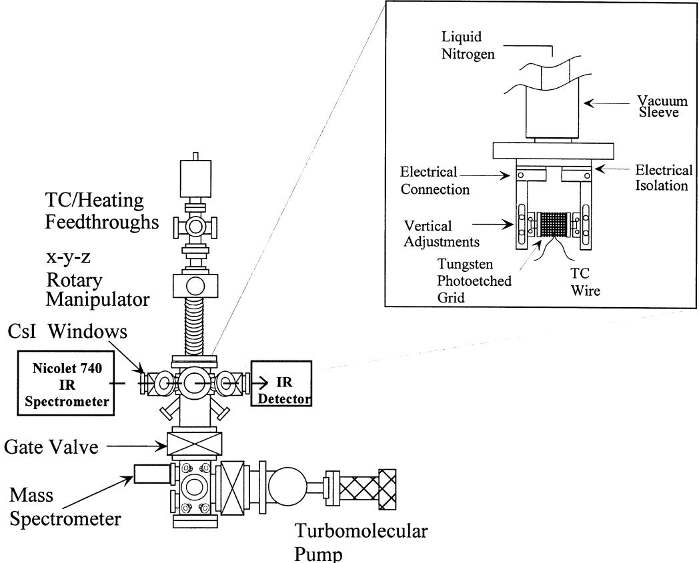  
Fig.1. t sample holder.  $\mathrm{SiO}_2$  particles are pressed into a tungsten grid and positioned in the infrared beam.

Aldrich. This silica powder had a surface area of  $380~\mathrm{m}^2 /\mathrm{g}$ . The silica powder was pressed into an tungsten photoetched grid [28]. This tungsten grid from Buckbee- Mears was 0.002 inch thick and contained 100 lines per inch. The tungsten was then suspended between copper posts on the sample mount. This sample could be resistively heated to  $\sim 1000\mathrm{K}$ . A tungsten- rhenium thermocouple spot- welded to the grid provided accurate sample temperature measurement.

The FTIR spectrum of the silica powder recorded immediately after loading into vacuum exhibited a pronounced surface vibrational feature that extended from 3750 to 3000  $\mathrm{cm}^{- 1}$ . This feature is attributed to  $\mathrm{SiOH^{*}}$  species [29]. To prepare the  $\mathrm{SiO}_2$  surface for tungsten film deposition, the hydroxylated  $\mathrm{SiO}_2$  (silanol) surface was first exposed to  $\sim 1$  Torr of  $\mathrm{Si}_2\mathrm{H}_6$  for  $30\mathrm{min}$  at  $650~\mathrm{K}$ . Fig. 2 displays a FTIR difference spectrum recorded after this  $\mathrm{Si}_2\mathrm{H}_6$  exposure.

The negative absorbance features in Fig. 2 are consistent with the  $\mathrm{Si}_2\mathrm{H}_6$  reaction removing  $\sim 90\%$  of the  $\mathrm{SiOH^{*}}$  species. The  $\mathrm{Si}_2\mathrm{H}_6$  exposure also produced positive absorbance features that are assigned to  $\mathrm{Si - H}$  stretching features at 2270, 2203 and  $2100~\mathrm{cm}^{- 1}$  as well as a  $\mathrm{Si - H}$  scissors mode at  $990~\mathrm{cm}^{- 1}$  [24,25,30,31]. A few  $\mathrm{WF}_6$  and  $\mathrm{Si}_2\mathrm{H}_6$  reaction cycles were subsequently performed to transform the  $\mathrm{SiO}_2$  surface to a tungsten surface. The  $\mathrm{WF}_6$  and  $\mathrm{Si}_2\mathrm{H}_6$  sequential surface reactions were then examined on this tungsten film.

Additional FTIR difference spectra were utilized to measure the  $\mathrm{WF}_x^*$  species and  $\mathrm{SiH}_x\mathrm{F}_z^*$  species during the  $\mathrm{WF}_6$  and  $\mathrm{Si}_2\mathrm{H}_6$  half- reactions. The FTIR spectra were recorded at  $340~\mathrm{K}$  after various  $\mathrm{WF}_6$  or  $\mathrm{Si}_2\mathrm{H}_6$  exposures at different temperatures. Gate valves protected the CsI windows during the reactant exposures. The  $\mathrm{WF}_x^*$  surface species were monitored using the W- F stretching mode located at  $\sim 680~\mathrm{cm}^{- 1}$  [24]. The surface silicon coverage was monitored using the  $\mathrm{Si - H}$  stretch,  $\mathrm{Si - H}$  scissors and  $\mathrm{Si - F}$  stretch at  $\sim 2150$ , 910 and  $830~\mathrm{cm}^{- 1}$ , respectively [24,25,30,31].

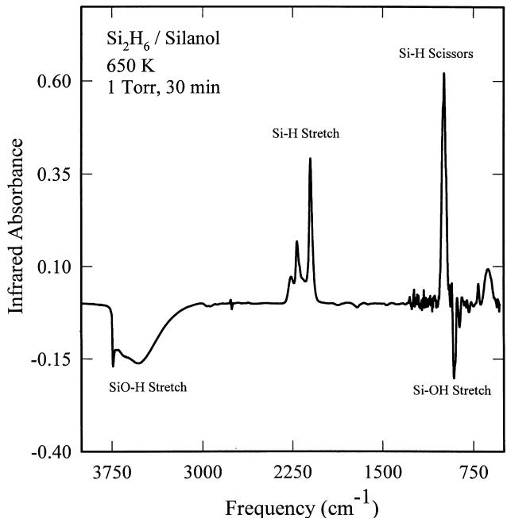  
Fig. 2. FTIR difference spectra recorded after the reaction of  $\mathrm{Si}_2\mathrm{H}_6$  with hydroxylated  $\mathrm{SiO}_2$  particles at  $650~\mathrm{K}$ . The negative absorbance features are consistent with removal of the  $\mathrm{SiOH^{*}}$  species. The positive absorbance features correspond to the deposition of  $\mathrm{SiH^{*}}$  species.

# 2.2. Spectroscopic ellipsometry studies on Si(100)

The tungsten film growth experiments were performed in a high- vacuum apparatus designed for ellipsometric investigations of thin film growth [7]. A schematic of this apparatus is shown in Fig. 3. The apparatus consists of a sample load- lock chamber, a central deposition chamber and a ultra high- vacuum chamber for surface analysis. The central deposition chamber is capable of automated dosing of molecular precursors under a wide variety of conditions. The deposition chamber is pumped with either a  $175~\mathrm{L / s}$  diffusion pump backed by a liquid  $\mathrm{N}_2$  trap and a mechanical pump or two separate liquid  $\mathrm{N}_2$  traps backed by mechanical pumps. This chamber had a base pressure of  $1\times 10^{- 7}$  Torr.

The central deposition chamber is equipped with an in situ spectroscopic ellipsometer (J.A. Woolam Co.; M- 44). This ellipsometer collects data at 44 visible wavelengths simultaneously. The ellipsometer is mounted on ports positioned at  $80^{\circ}$  with respect to the surface normal. Gate valves protect the birefringent- free ellipsometer windows from deposition during the  $\mathrm{WF}_6$  and  $\mathrm{Si}_2\mathrm{H}_6$  exposures. The surface analysis chamber has a UTI- 100C quadrupole mass spectrometer. This analysis chamber is pumped by a  $210~\mathrm{L / s}$  turbomolecular pump to obtain a base pressure of  $1\times 10^{- 9}$  Torr. Mass spectrometric analysis of the gases in the central deposition chamber can be performed using a controlled leak to the surface analysis chamber.

The sample substrate for the ellipsometer studies was a  $\mathrm{Si}(100)$  wafer covered with  $125\mathrm{\AA}$  of  $\mathrm{SiO}_2$  formed by thermal oxidation. The  $\mathrm{Si}(100)$  wafers were p- type boron- doped with a resistivity of  $\rho = 0.01 - 0.03\Omega \mathrm{cm}$ . Square pieces of the  $\mathrm{Si}(100)$  wafer with dimensions of  $0.75\times 0.75$  inch were used as the samples. The highly doped  $\mathrm{Si}(100)$  samples were suspended between copper posts using  $0.25\mathrm{mmMo}$  foil and could be resistively heated to  $>1100\mathrm{K}$ . The sample temperature was determined by a Chromel- Alumel thermocouple pressed onto the  $\mathrm{SiO}_2$  surface using a spring clip.

The  $\mathrm{Si}(100)$  samples were cleaned with methanol, acetone and distilled water before mounting and loading into the chamber. The  $\mathrm{SiO}_2$  surface was further cleaned in vacuum by an anneal at  $900~\mathrm{K}$  for  $5\mathrm{min}$ . This thermal anneal was followed by a high- frequency  $\mathrm{H}_2\mathrm{O}$  plasma discharge at 300 K. This  $\mathrm{H}_2\mathrm{O}$  plasma fully hydroxylated the  $\mathrm{SiO}_2$  surface and removed surface carbon contamination.

To initiate the tungsten film growth, the hydroxylated  $\mathrm{SiO}_2$  surface was first exposed to  $10\mathrm{mTorr}$  of  $\mathrm{Si}_2\mathrm{H}_6$  at  $600~\mathrm{K}$  for  $\sim 5\mathrm{min}$ . FTIR spectroscopy indicates that  $\mathrm{Si}_2\mathrm{H}_6$  reacts with the surface hydroxyl groups and deposits surface

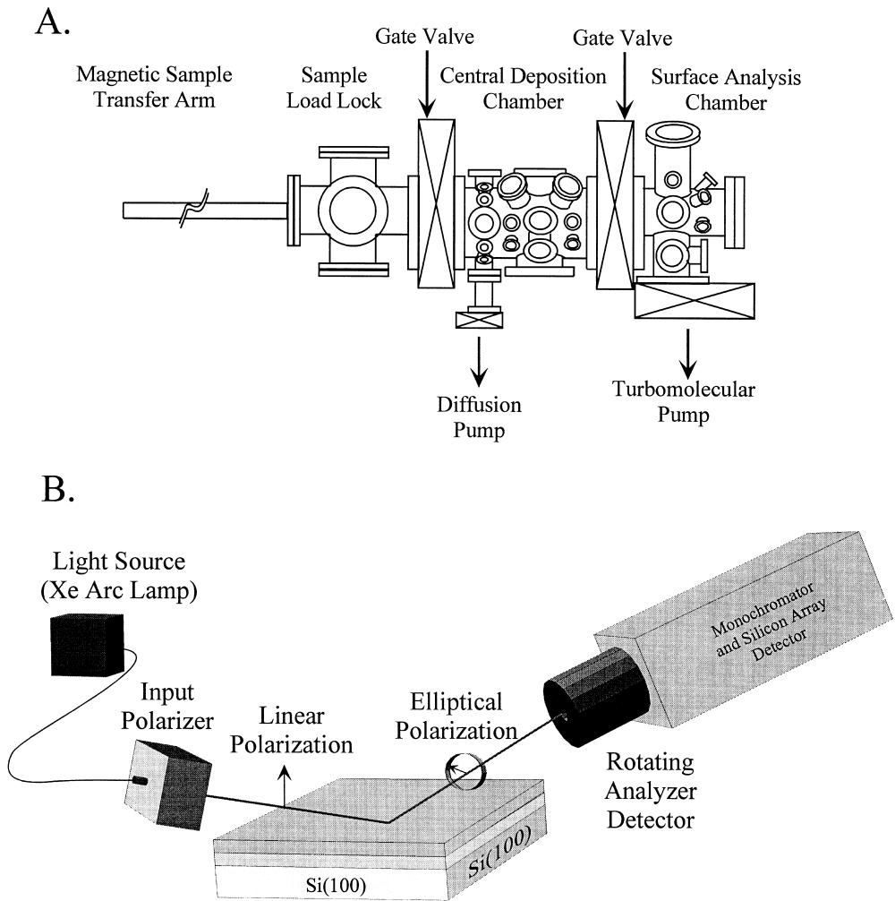  
Fig. 3. (A) Experimental schematic of vacuum apparatus for in situ spectroscopic ellipsometry studies on Si(100) samples. (B) Spectroscopic ellipsometry is conducted in the central deposition chamber using a rotating analyzer detector.

species containing Si- H stretching vibrations: e.g.  $\mathrm{SiOH^{*} + }$ $\mathrm{Si}_2\mathrm{H}_6\rightarrow \mathrm{SiOSiH}_3^*$ $\mathrm{SiH_4}$  . After the initial  $\mathrm{Si}_2\mathrm{H}_6$  treatment, tungsten film growth could be performed at reaction temperatures between 425 and  $600\mathrm{K}$  A few  $\mathrm{WF}_6$  and  $\mathrm{Si}_2\mathrm{H}_6$  reaction cycles were utilized to transform the  $\mathrm{SiO}_2$  surface to a tungsten surface. The dependence of the tungsten growth rate on  $\mathrm{WF}_6$  and  $\mathrm{Si}_2\mathrm{H}_6$  reactant exposure was examined on this tungsten surface.

The  $\mathrm{WF}_6$  and  $\mathrm{Si}_2\mathrm{H}_6$  exposures were controlled by performing various numbers of identical reactant pulses. The  $\mathrm{WF}_6$  or  $\mathrm{Si}_2\mathrm{H}_6$  reactants were introduced by opening automated valves for a few milliseconds. These valve openings create small pressure transients in the deposition chamber. The total exposure of either the  $\mathrm{WF}_6$  or  $\mathrm{Si}_2\mathrm{H}_6$  reactant during one AB cycle was defined in terms of the number of identical reactant pulses. Between the  $\mathrm{WF}_6$  and  $\mathrm{Si}_2\mathrm{H}_6$  reactant exposures, the deposition chamber was purged with  $\mathrm{N}_2$  for several minutes. The pressure transients were recorded with a baratron pressure transducer. The absolute reactant exposures were estimated from the pressure versus time waveform.

# 3. Results and discussion

# 3.1. FTIR spectroscopy studies of surface chemistry

FTIR difference spectra recorded during the  $\mathrm{WF}_6$  half- reaction at  $425\mathrm{K}$  are displayed in Fig. 4. Each spectrum is referenced to the initial surface that had earlier received a saturation  $\mathrm{Si}_2\mathrm{H}_6$  exposure. The spectra are offset from the origin for clarity in presentation. As expected from Eq. (1), the  $\mathrm{SiH}_x\mathrm{F}_z^*$  species react with  $\mathrm{WF}_6$  and desorb as volatile  $\mathrm{SiH}_a\mathrm{F}_b$  molecules. The Si- H stretching region possesses two negative absorbance features located at 2115 and 2275  $\mathrm{cm}^{- 1}$ . These negative absorbance features are assigned to the loss of  $\mathrm{SiH}_x^*$  and  $\mathrm{SiH}_y\mathrm{F}_z^*$  species, respectively [24,25,32]. Other negative spectral features at  $\sim 950$  and  $\sim 840\mathrm{cm}^{- 1}$  are consistent with the loss of  $\mathrm{Si - H}$  scissors and  $\mathrm{Si - F}$  stretching modes [24,25,32]. The  $\mathrm{WF}_x^*$  species are observed in Fig. 4 in the  $\mathrm{W - F}$  stretching region. The  $\mathrm{WF}_x^*$  species appear as a single broad positive absorbance feature at  $600 - 700\mathrm{cm}^{- 1}$  [24,25,32].

The normalized integrated absorbances during the  $\mathrm{WF}_6$

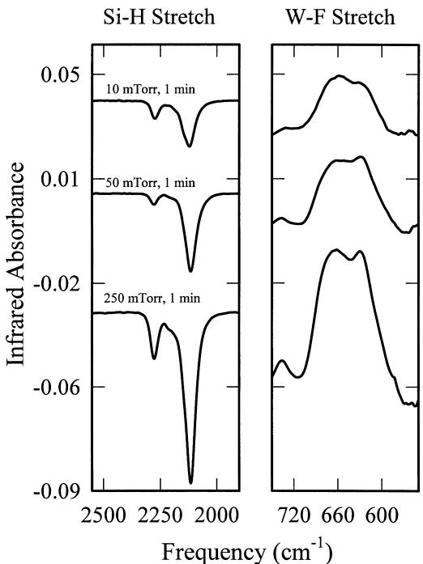  
Fig. 4. FTIR difference spectra recorded versus  $\mathrm{WF}_6$  exposure during the  $\mathrm{WF}_6$  half-reaction at  $425\mathrm{K}$ . Each spectrum is referenced to the initial surface that had received a saturation  $\mathrm{Si}_2\mathrm{H}_6$  exposure.

half- reaction are displayed in Fig. 5. The growth of infrared absorbance attributed to the  $\mathrm{WF}_x^*$  species is concurrent with the loss of infrared absorbance assigned to the  $\mathrm{SiH_yF_z^*}$  species. This behavior is expected from the half- reaction given by Eq. (1). This correlation demonstrates that the  $\mathrm{Si}_2\mathrm{H}_6$  half- reaction occurs by the exchange of surface func tional groups. The  $\mathrm{WF}_6$  half- reaction proceeded to completion in  $\sim 1\mathrm{min}$  at a reactant pressure of 250 mTorr at  $425~\mathrm{K}$

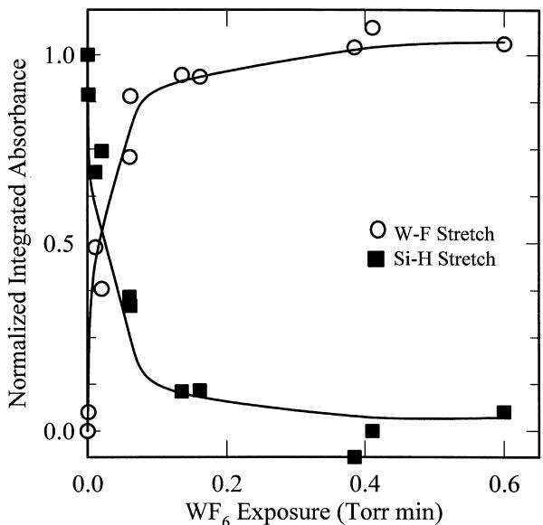  
Fig. 5. Normalized integrated absorbances of the W-F stretching vibration at  $\sim 680~\mathrm{cm^{-1}}$  and the  $\mathrm{Si - H}$  stretching vibrations at 2115 and  $2275~\mathrm{cm^{-1}}$  versus  $\mathrm{WF}_6$  exposure during the  $\mathrm{WF}_6$  half-reaction at  $425\mathrm{K}$ .

The surface resulting from a complete  $\mathrm{WF}_6$  half- reaction was subsequently reacted with  $\mathrm{Si}_2\mathrm{H}_6$ . Fig. 6 shows FTIR difference spectra monitored after various  $\mathrm{Si}_2\mathrm{H}_6$  exposures at  $425~\mathrm{K}$ . Each spectrum is referenced to the initial surface that had earlier received a saturation  $\mathrm{WF}_6$  exposure. The spectra are again offset from the origin for clarity in presentation. During the  $\mathrm{Si}_2\mathrm{H}_6$  half- reaction, the vibrational features in the  $\mathrm{Si - H}$  and  $\mathrm{W - F}$  stretching regions show that the  $\mathrm{WF}_x^*$  species react with the  $\mathrm{Si}_2\mathrm{H}_6$  precursor to produce  $\mathrm{SiH_yF_z^*}$  species.

Fig. 7 displays the normalized integrated absorbances recorded during the  $\mathrm{Si}_2\mathrm{H}_6$  reaction. The growth of the  $\mathrm{Si - H}$  absorbance features is coincident with the reduction of  $\mathrm{W - F}$  absorbance features. This correlation is expected from the half- reaction given by Eq. (2) and indicates that the  $\mathrm{Si}_2\mathrm{H}_6$  half- reaction occurs by the exchange of surface functional groups. The  $\mathrm{Si}_2\mathrm{H}_6$  half- reaction proceeded to completion in  $\sim 2\mathrm{min}$  with a reactant pressure of 100 mTorr at  $425~\mathrm{K}$ .

The role of the  $\mathrm{Si}_2\mathrm{H}_6$  reactant in the sequential surface chemistry is only sacrificial. The  $\mathrm{Si}_2\mathrm{H}_6$  precursor reduces the  $\mathrm{WF}_x^*$  species by stripping fluorine. Subsequently, the  $\mathrm{SiH_yF_z^*}$  species is lost as a volatile  $\mathrm{SiH}_a\mathrm{F}_b$  reaction product during the next  $\mathrm{WF}_6$  half- reaction. When the  $\mathrm{Si}_2\mathrm{H}_6$  half- reaction reaches completion, the  $\mathrm{SiH_yF_z^*}$  coverage is equivalent to the  $\mathrm{SiH_yF_z^*}$  coverage measured after the previous  $\mathrm{Si}_2\mathrm{H}_6$  half- reaction. Similarly, the loss of  $\mathrm{SiH_yF_z^*}$  coverage during the  $\mathrm{WF}_6$  half- reaction results in the growth of  $\mathrm{WF}_x^*$  coverage that becomes equivalent to the  $\mathrm{WF}_x^*$  coverage measured after the previous  $\mathrm{WF}_6$  half- reaction.

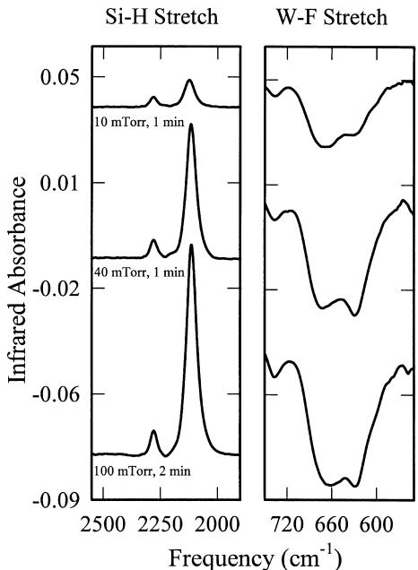  
Fig. 6. FTIR difference spectra recorded versus  $\mathrm{Si}_2\mathrm{H}_6$  exposure during the  $\mathrm{Si}_2\mathrm{H}_6$  half-reaction at  $425~\mathrm{K}$ . Each spectrum is referenced to the initial surface that had received a saturation  $\mathrm{WF}_6$  exposure.

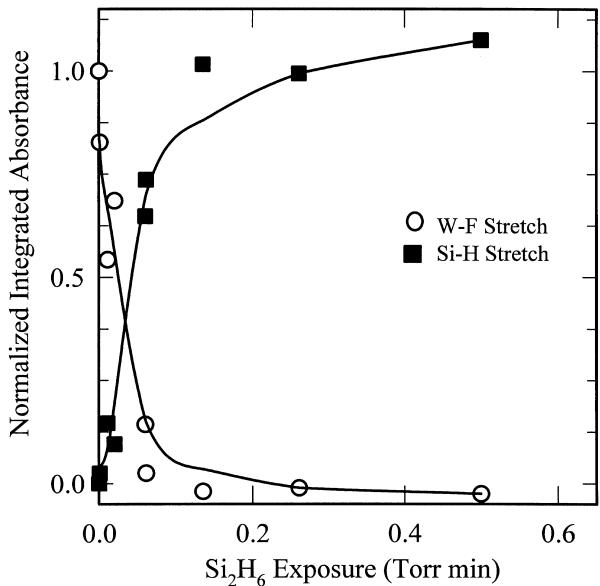  
Fig. 7. Normalized integrated absorbances of the W-F stretching vibration at  $\sim 680 \mathrm{cm}^{-1}$  and the  $\mathrm{Si - H}$  stretching vibrations at 2115 and  $2275 \mathrm{cm}^{-1}$  versus  $\mathrm{Si}_2\mathrm{H}_6$  exposure during the  $\mathrm{Si}_2\mathrm{H}_6$  half-reaction at  $425 \mathrm{K}$ .

# 3.2. Spectroscopic ellipsometry investigations of film growth

The dependence of the tungsten growth rate on the  $\mathrm{WF}_6$  and  $\mathrm{Si}_2\mathrm{H}_6$  reactant exposures was examined by measuring the tungsten film thickness deposited on an underlying  $\mathrm{Si}(100)$  substrate after three AB cycles at  $425 \mathrm{K}$ . The  $\mathrm{WF}_6$  and  $\mathrm{Si}_2\mathrm{H}_6$  reactant exposures were controlled by performing various numbers of identical reactant pulses. Figs. 8 and 9 display ellipsometry results that demonstrate the self- limiting nature of the  $\mathrm{WF}_6$  and  $\mathrm{Si}_2\mathrm{H}_6$  half- reactions at  $425 \mathrm{K}$ . The corresponding  $\mathrm{Si}_2\mathrm{H}_6$  and  $\mathrm{WF}_6$  exposures during each AB cycle were sufficient for a complete half- reaction.

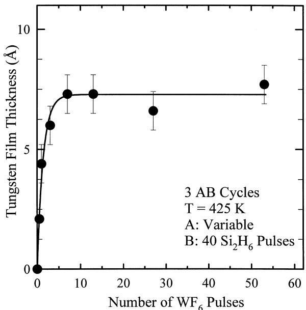  
Fig. 8. Tungsten film thickness deposited after three AB cycles versus number of  $\mathrm{WF}_6$  pulses at  $425 \mathrm{K}$ . The  $\mathrm{Si}_2\mathrm{H}_6$  exposure of  $40 \mathrm{Si}_2\mathrm{H}_6$  pulses during each AB cycle was sufficient for a complete  $\mathrm{Si}_2\mathrm{H}_6$  half-reaction.

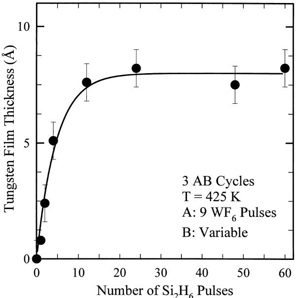  
Fig. 9. Tungsten film thickness deposited after three AB cycles versus number of  $\mathrm{Si}_2\mathrm{H}_6$  pulses at  $425 \mathrm{K}$ . The  $\mathrm{WF}_6$  exposure of nine  $\mathrm{WF}_6$  pulses during each AB cycle was sufficient for a complete  $\mathrm{WF}_6$  half-reaction.

Once a half- reaction reaches completion, Figs. 8 and 9 show that additional reactant exposure produces no additional film growth. This behavior is the characteristic signature of self- limiting surface chemistry. The  $\mathrm{WF}_6$  and  $\mathrm{Si}_2\mathrm{H}_6$  half- reactions reach completion after approximately  $5 \mathrm{WF}_6$  reactant pulses and  $20 \mathrm{Si}_2\mathrm{H}_6$  reactant pulses, respectively. We estimate that these exposures correspond to absolute exposures of  $\sim 750 \mathrm{L}$  for  $\mathrm{WF}_6$  and  $\sim 2700 \mathrm{L}$  for  $\mathrm{Si}_2\mathrm{H}_6$ .

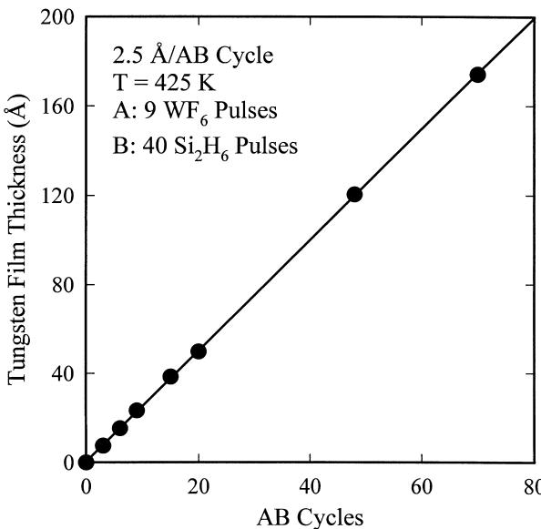  
Fig. 10. Tungsten film thickness deposited at  $425 \mathrm{K}$  versus number of AB cycles. The  $\mathrm{WF}_6$  and  $\mathrm{Si}_2\mathrm{H}_6$  reactant exposures of nine pulses and 40 pulses, respectively, were sufficient for complete half-reactions. The least squares linear fit to the data yields a tungsten growth rate of  $2.5 \mathrm{\AA / AB}$  cycle.

Fig. 10 shows the ellipsometric measurements of the tungsten film thickness versus number of AB cycles at  $425~\mathrm{K}$ .  $\mathrm{WF}_6$  and  $\mathrm{Si}_2\mathrm{H}_6$  reactant exposures of nine reactant pulses and 40 reactant pulses, respectively, were more than sufficient for complete half- reactions. The tungsten film thickness is proportional to the number of AB cycles and displays a growth rate of  $2.5\mathrm{\AA / AB}$  cycle. The linear growth rate argues that the number of reactive surface sites remains constant during the deposition. The constant growth rate also suggests that the tungsten film is growing uniformly with no surface roughening.

The measured tungsten growth rate of  $2.5\mathrm{\AA}$  per AB cycle agrees with the expected thickness of a tungsten monolayer. The density of tungsten is  $\rho = 19.3\mathrm{g / cm}^3$  or  $\rho = 6.32\times 10^{22}$  atoms  $/\mathrm{cm}^3$  . Based on this density and assuming a simple cubic packing of tungsten atoms, the predicted thickness of a tungsten monolayer is  $\rho^{1 / 3} = 2.51\mathrm{\AA}$  . Likewise, the predicted coverage of tungsten atoms in one monolayer is  $\rho^{2 / 3} = 1.59\times 10^{15}$  atoms  $/\mathrm{cm}^2$

The ellipsometric measurements also yield the refractive index  $(\bar{n} = n + ik)$  for the tungsten films. This refractive index was observed to vary with film thickness. A refractive index of  $n = 2.4\pm 0.6$  and  $k = 0.8\pm 0.3$  was measured at a film thickness of  $45\mathrm{\AA}$  . The refractive index increased to  $n = 3.66\pm 0.41$  and  $k = 2.95\pm 0.22$  at film thicknesses  $\geq 300$ $\mathring{\mathrm{A}}$  . The measured optical constants for the thicker tungsten films compare well with literature values of  $n = 3.6$  and  $k = 2.9$  [33].

The ellipsometric measurements of the tungsten film thickness deposited by three AB reaction cycles versus substrate temperature are displayed in Fig. 11. The  $\mathrm{WF}_6$  and  $\mathrm{Si}_2\mathrm{H}_6$  reactant exposures at each temperature were sufficient for complete half- reactions. Fig. 11 shows that the tungsten film thickness deposited by three AB cycles increases from 300 to  $400\mathrm{K}$  In this temperature regime, the FTIR spectroscopy measurements determined that the surface half- reactions did not proceed to completion. A tungsten growth rate of  $1.1\mathrm{\AA / AB}$  cycle was measured at  $300~\mathrm{K}$

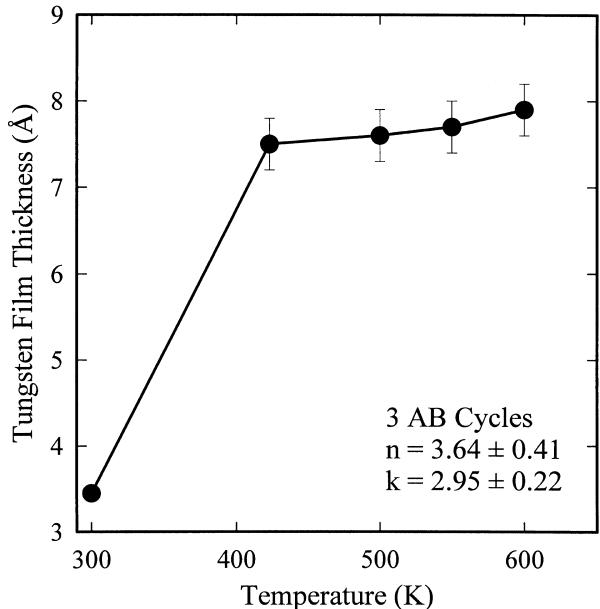  
Fig. 11. Tungsten film thickness deposited after three AB cycles versus substrate temperature. The  $\mathrm{WF}_6$  and  $\mathrm{Si}_2\mathrm{H}_6$  reactant exposures at each temperature were sufficient for complete half-reactions.

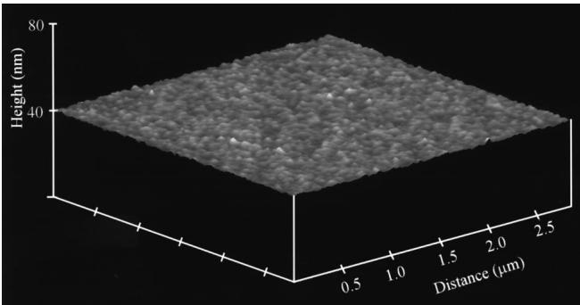  
Fig. 12. Atomic force microscope image of a  $\sim 320\mathrm{A}$  thick tungsten film deposited at  $425\mathrm{K}$  after 125 AB cycles. The  $\mathrm{WF}_6$  and  $\mathrm{Si}_2\mathrm{H}_6$  reactant exposures were sufficient for complete half-reactions. The light-to-dark range is  $25\mathrm{\AA}$

Fig. 11 reveals that the tungsten deposition rate is constant at  $\sim 2.5\mathrm{\AA}$  per AB cycle for substrate temperatures  $\geq 425\mathrm{K}$  . These temperatures are sufficient for complete half- reactions according to the FTIR vibrational studies. A constant deposition rate versus temperature was not observed in earlier studies of  $\mathrm{Al}_2\mathrm{O}_3$  and  $\mathrm{SiO}_2$  ALD [7,10]. This earlier temperature dependence was attributed to the loss of hydroxyl groups on the  $\mathrm{Al}_2\mathrm{O}_3$  and  $\mathrm{SiO}_2$  surface by dehydroxylation [34,35]. The constant tungsten deposition rate versus temperature may result from the high stability of the  $\mathrm{WF}_x^*$  and  $\mathrm{SiH_yF_z^*}$  species at  $425\mathrm{- }600\mathrm{K}$  If the  $\mathrm{WF}_x^*$  and  $\mathrm{SiH_yF_z^*}$  coverages remain constant, the same number of tungsten atoms should be deposited during each AB cycle.

# 3.3. AFM, XPS and X-ray analysis of deposited films

The surface topography of the deposited tungsten films was examined using a Nanoscope III atomic force microscope (AFM) from Digital Instruments operating in tapping mode. Fig. 12 shows an AFM image of a  $\sim 320\mathrm{\AA}$  thick tungsten film deposited by 125 AB cycles at  $425\mathrm{K}$ .  $\mathrm{WF}_6$  and  $\mathrm{Si}_2\mathrm{H}_6$  reactant exposures of nine reactant pulses and 40 reactant pulses, respectively, were sufficient for complete half- reactions.

The AFM image shows that the tungsten surface morphology is very smooth. The light- to- dark gray scale spans  $< 25\mathrm{\AA}$  and the tungsten films exhibit a surface root- mean- square (rms) roughness of  $\pm 4.8\mathrm{\AA}$ . In comparison, the roughness of the initial  $\mathrm{Si}(100)$  substrate was  $\pm 2.5\mathrm{\AA}$  (rms). The power spectral density of the surface roughness also exhibited the same statistical characteristics as the initial  $\mathrm{SiO}_2$  surface on  $\mathrm{Si}(100)$  [7]. This smooth surface topography indicates that the tungsten film grows uniformly over the initial substrate with negligible roughening. These

results are in marked contrast with earlier attempts to deposit metallic copper films using sequential surface reactions. These previous efforts obtained copper films that were rough and displayed coarse polycrystalline grains [17,18].

The tungsten film composition was evaluated using X- ray photoelectron spectroscopy (XPS) depth- profiling. After sputtering through the surface region, the elemental concentrations in the tungsten film were constant until encountering the  $\mathrm{SiO_2}$  layer on the Si(100) substrate. The tungsten films contained no measurable silicon or fluorine. These results demonstrate that  $\mathrm{Si}_2\mathrm{H}_6$  strips fluorine from  $\mathrm{WF}_x^*$  species and the resulting  $\mathrm{SiH}_x\mathrm{F}_z$  species are subsequently removed by the next  $\mathrm{WF}_6$  exposure. Only small carbon and oxygen impurities were observed with atomic percentage compositions of  $\sim 4\%$  C and  $\sim 3\%$  O. These impurities do not result from the  $\mathrm{WF}_6$  and  $\mathrm{Si}_2\mathrm{H}_6$  precursors for W ALD. The small carbon and oxygen concentrations may be attributed to CO dissociation [36] resulting from the small CO partial pressures in our deposition chamber. Alternatively, the impurities may result from artifacts often encountered during  $\mathrm{Ar}^+$  sputtering of metal and metal nitride films [37].

Glancing angle  $\textrm{X}$  - ray diffraction experiments were performed to evaluate the crystallographic structure of the tungsten films. Using Cu  $\mathbb{K}_{\alpha}$  radiation incident at  $4^{\circ}$  the tungsten films produced very broad  $2\theta$  diffraction peak widths (fwhm) of  $\sim 5^{\circ}$  . These broad diffraction peaks indicate that the tungsten films are either amorphous [38] or are composed of very small crystalline grains. In addition, the adhesion of the tungsten films to the starting Si(100) substrate was examined using the 'scratch and peel' tests [39]. The tungsten films survived these tests with no evidence of delamination.

The electrical resistivity of tungsten films with a thickness of  $\sim 320\mathrm{\AA}$  was also measured using the four point probe technique with silver paint electrical contacts [40]. The electrical resistivity was determined to be  $122\mu \Omega$  cm. In comparison, the resistivity is  $5\mu \Omega$  cm for pure tungsten metal [41] and  $16\mu \Omega$  cm for crystalline tungsten films grown using  $\mathrm{WF}_6 + \mathrm{SiH}_4$  chemical vapor deposition [38]. The higher resistivity of  $122\mu \Omega$  cm is attributed to the amorphous structure of the tungsten film. A resistivity of  $160\mu \Omega$  cm was measured recently for an amorphous tungsten film [38].

# 4.Conclusions

The atomic layer deposition (ALD) of single- element tungsten films was demonstrated using self- limiting sequential surface reactions. Alternating exposures of  $\mathrm{WF}_6$  and  $\mathrm{Si}_2\mathrm{H}_6$  in an ABAB... reaction sequence were used to deposit the tungsten films. The role of the  $\mathrm{Si}_2\mathrm{H}_6$  reactant was only sacrificial.  $\mathrm{Si}_2\mathrm{H}_6$  acted to strip fluorine from tungsten with out incorporating into the growing film. Transmission FTIR spectroscopy studies indicated that the  $\mathrm{WF}_6$  and  $\mathrm{Si}_2\mathrm{H}_6$  surface reactions were complete and self- limiting at  $T\geq$ $425\mathrm{K}$  . In situ spectroscopic ellipsometry measurements determined that the tungsten growth per AB cycle was extremely linear with growth rates of  $\sim 2.5\mathrm{\AA / AB}$  cycle at  $425\mathrm{- }600\mathrm{K}$  A growth rate of  $2.5\mathrm{\AA}$  per AB cycle is consistent with the thickness of one tungsten monolayer.

AFM images revealed that the surface topography of the deposited tungsten films was very flat. A surface roughness of only  $\pm 4.8\mathrm{\AA}$  (rms) was measured for a deposited tungsten film thickness of  $\sim 320\mathrm{\AA}$  . This roughness was similar to the roughness of the initial  $\mathrm{SiO_2}$  surface on Si(100). X- ray diffraction experiments revealed very broad diffraction peaks consistent with tungsten films that were either amorphous or composed of very small crystalline gratings. XPS depth- profiling analysis of the tungsten films observed only low carbon and oxygen impurity concentrations and no measurable silicon or fluorine.

This successful demonstration of W ALD suggests that other single- element films may be deposited using sequential surface chemistry with a sacrificial stripping reaction. Other volatile fluorides, such as  $\mathrm{MoF}_6$  and  $\mathrm{ReF}_6$  may be reduced by  $\mathrm{Si}_2\mathrm{H}_6$  in a similar reaction sequence for the ALD of molybdenum and rhenium metal films. Germanium semiconductor films may be deposited with atomic layer control using  $\mathrm{GeF}_4$  and  $\mathrm{Si}_2\mathrm{H}_6$  in an analogous reaction sequence. Strategies for the ALD of other single- element films may also be devised where  $\mathrm{Si}_2\mathrm{H}_6$  serves a sacrificial role to strip fluorine without directly affecting the film composition.

# Acknowledgements

This work was supported by a grant from the Air Force Office of Scientific Research. This project was also sponsored by DARPA, in conjunction with the U.S. Army Research Office, under contract number DAAG55- 98- C0036. The views and conclusions in this document are those of the authors and do not necessarily reflect the position of the Government, and no official endorsement should be inferred.

# References

[1] Semiconductor Industry Association, The National Technology Roadmap for Semiconductors, SIA, 4300 Stevens Creek Boulevard, San Jose, CA 95129, 1997 (http://www.sematech.org/public/roadmap/index.htm). [2] K.- M. Chang, T.- H. Yeh, I.- C. Deng, C.- W. Shih, J. Appl. Phys. 82 (1997) 1469. [3] W.- K. Yeh, M.- C. Chen, P.- J. Wang, L.- M. Liu, M.- S. Lin, Thin Solid Films 270 (1995) 462. [4] Z.H. Lu, D.J. Lockwood, J.M. Baribeau, Nature 378 (1995) 258. [5] S.M. George, A.W. Ott, J.W. Klaus, J. Phys. Chem. 100 (1996) 13121.

[6] T. Suntola, Thin Solid Films 216 (1992) 84. [7] A.W. Ott, J.W. Klaus, J.M. Johnson, S.M. George, Thin Solid Films 292 (1996) 135. [8] H. Kumagai, M. Matsumoto, M. Obara, M. Suzuki, Thin Solid Films 263 (1995) 47. [9] H. Kumagai, K. Toyoda, K. Kobayashi, M. Obara, Y. Iimura, Appl. Phys. Lett. 70 (1997) 2338. [10] J.W. Klaus, A.W. Ott, J.M. Johnson, S.M. George, Appl. Phys. Lett. 70 (1997) 1092. [11] M. Ritala, M. Leskela, Thin Solid Films 225 (1993) 288. [12] S. Morishita, S. Sugahara, M. Matsumura, Appl. Surf. Sci. 112 (1997) 198. [13] J.W. Klaus, A.W. Ott, A.C. Dillon, S.M. George, Surf. Sci. 418 (1998) L14. [14] M. Han, Y. Luo, J.E. Moryl, J.G. Chen, R.M. Osgood, Surf. Sci. 415 (1998) 251. [15] M. Ritala, H. Saloniemi, M. Leskela, T. Prohaska, G. Friedbacher, M. Grasserbauer, Thin Solid Films 286 (1996) 54. [16] M. Ishii, S. Iwai, H. Kawata, T. Ueki, Y. Aoyagi, J. Cryst. Growth 180 (1997) 15. [17] M. Juppo, M. Ritala, M. Leskela, J. Vac. Sci. Technol. 15 (1997) 2330. [18] P. Martensson, J. Carlsson, Chem. Vapor Deposition 22 (1997) 333. [19] S.M. Gates, D.D. Koleske, J.R. Heath, M. Copel, Appl. Phys. Lett. 62 (1993) 510. [20] Y. Takahashi, H. Ishii, K. Fujinaga, J. Electrochem. Soc. 136 (1989) 1826. [21] P.J. Ireland, Thin Solid Films 304 (1997) 1. [22] T. Kodas, M. Hampden- Smith, The Chemistry of Metal CVD, VCH, New York, 1994.

[23] D.A. Bell, C.M. McConica, K.L. Baker, E. Kuchta, J. Electrochem. Soc. 143 (1996) 296. [24] N. Kobayashi, Y. Nakamura, H. Goto, Y. Homma, J. Appl. Phys. 73 (1993) 4637. [25] N. Kobayashi, H. Goto, M. Suzuki, J. Appl. Phys. 69 (1991) 1013. [26] Y. Yamamoto, T. Matsura, J. Murota, Surf. Sci. 408 (1998) 190. [27] A.C. Dillon, M.B. Robinson, M.Y. Han, S.M. George, J. Electrochem. Soc. 139 (1992) 537. [28] P. Basu, T.H. Ballinger, J.T. Yates Jr., Rev. Sci. Instrum. 59 (1988) 1321. [29] O. Sneh, M.L. Wise, A.W. Ott, L.A. Okada, S.M. George, Surf. Sci. 334 (1995) 135. [30] P. Gupta, V.L. Colvin, S.M. George, Phys. Rev. 37 (1988) 8234. [31] Y.J. Chabal, K. Raghavachari, Phys. Rev. Lett. 54 (1985) 1055. [32] K. Nakamoto, Infrared Spectra of Inorganic and Coordination Compounds, Wiley- Interscience, New York, 1970. [33] E. Palik, Handbook of Optical Constants of Solids, Vol. 1, Academic, Orlando, 1985. [34] A.C. Dillon, A.W. Ott, J.D. Way, S.M. George, Surf. Sci. 322 (1995) 230. [35] O. Sneh, S.M. George, J. Phys. Chem. 99 (1995) 4639. [36] E. Umbach, D. Menzel, Surf. Sci. 135 (1983) 199. [37] S. Ingrey, M. Johnson, R. Streater, G. Sproule, J. Vac. Sci. Technol. 20 (1982) 968. [38] K.M. Chang, I.C. Deng, H.Y. Lin, J. Electrochem. Soc. 146 (1999) 3092. [39] B.N. Chapman, J. Vac. Sci. Technol. 11 (1974) 106. [40] A. Uhlir, Bell Sys, Tech. 35 (1956) 333. [41] American Institute of Physics Handbook, in: D.E. Gray (Ed.), 3rd Edition, McGraw- Hill, New York, 1982.