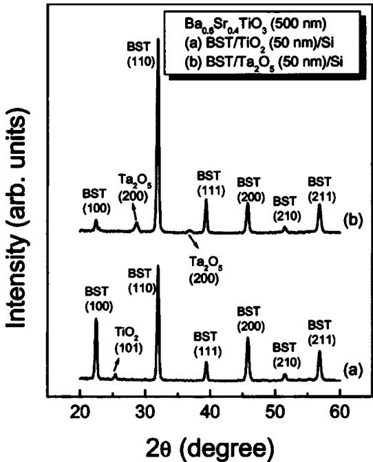
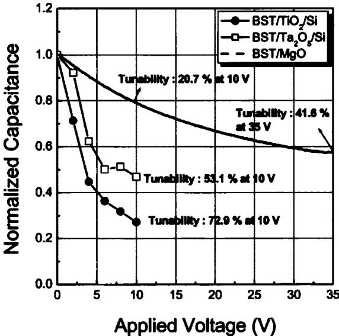
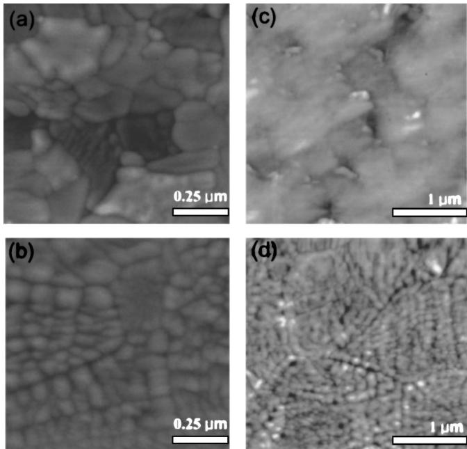
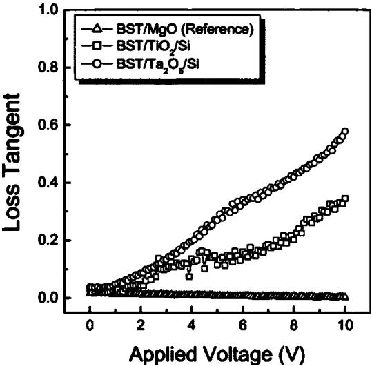

RESEARCH ARTICLE | NOVEMBER 15 2004

# High tunability (Ba, Sr)  $\mathrm{TiO_3}$  thin films grown on atomic layer deposited  $\mathrm{TiO_2}$  and  $\mathrm{Ta_2O_5}$  buffer layers  $\odot$

II- Doo Kim; Harry L. Tuller; Hyun- Suk Kim; Jin- Seong Park

Check for updates

Appl. Phys. Lett. 85, 4705- 4707 (2004) https://doi.org/10.1063/1.1821656

# Articles You May Be Interested In

Characterization of Pt / Bi 3.15 Nd 0.85 Ti 3 O 12 / HfO 2 / Si structure using a hafnium oxide as buffer layer for ferroelectric- gate field effect transistors

J. Appl. Phys. (December 2009)

Study of orientation effect on nanoscale polarization in Ba Ti O 3 thin films using piezoresponse force microscopy

Appl. Phys. Lett. (May 2004)

Atomic layer deposition of Ta- based thin films: Reactions of alkylamide precursor with various reactants J. Vac. Sci. Technol. B (September 2006)

# High tunability  $(\mathsf{Ba},\mathsf{Sr})\mathsf{TiO}_3$  thin films grown on atomic layer deposited  $\mathsf{TiO}_2$  and  $\mathsf{Ta}_2\mathsf{O}_5$  buffer layers

II- Doo Kima) and Harry L. Tuller Department of Materials Science and Engineering, Massachusetts Institute of Technology, Cambridge, Massachusetts 02139

Hyun- Suk Kim Department of Materials Science and Engineering, Korea Advanced Institute of Science and Technology, Daejeon, 305- 701, South Korea

Jin- Seong Park Department of Chemistry and Chemical Biology, Harvard University, Cambridge, Massachusetts 02138

(Received 6 July 2004; accepted 30 September 2004)

In this letter, we report on increased tunability of  $\mathrm{Ba_{0.6}Sr_{0.4}TiO_3}$  (BST) thin films by use of  $\mathrm{Ta}_2\mathrm{O}_5$  and  $\mathrm{TiO_2}$  films as buffer layers between BST and Si substrates.  $\mathrm{Ta}_2\mathrm{O}_5$  and  $\mathrm{TiO_2}$  buffer layers were grown by atomic layer deposition (ALD) onto Si substrates followed by pulsed laser deposition of  $\mathrm{Ba_{0.6}Sr_{0.4}TiO_3}$  thin films onto the buffer layers. The randomly oriented BST films deposited on  $\mathrm{TiO}_2 / \mathrm{Si}$  substrates exhibited a broader grain size distribution than the (110) textured BST films grown on  $\mathrm{Ta}_2\mathrm{O}_5 / \mathrm{Si}$  substrates. At an applied voltage of  $10\mathrm{V},$  the BST films grown on  $\mathrm{Ta}_2\mathrm{O}_5 / \mathrm{Si}$  and  $\mathrm{TiO}_2 / \mathrm{Si}$  substrates showed much enhanced tunability values of  $53.1\%$  and  $72.9\%$  , respectively, as compared to the  $20.7\%$  value obtained with BST films grown on  $\mathrm{MgO}$  single crystal substrates. Successful integration of BST low voltage microwave tunable devices onto Si substrates thus appears possible with the aid of ALD grown  $\mathrm{Ta}_2\mathrm{O}_5$  or  $\mathrm{TiO_2}$  buffer layers.  $(\widehat{\mathbf{C}})$  2004 American Institute of Physics. [DOI: 10.1063/1.1821656]

The rapid worldwide growth of wireless communications, radar, and digital electronics has been a key driver in stimulating developments in the field of f/microwave electronics with demands for ever higher frequencies, bandwidths, and data rates. Tunable high frequency devices are key components for the next generation of communications and radar systems. Baum strontium titanate's (BST) capacitive properties can be tuned by more than  $50\%$  in metalinsulator- metal structures with low bias levels resulting in similar percentage changes in the frequency of tuned circuits.2 Currently, BST- based tunable devices are typically fabricated on small area  $(1\times 1\mathrm{in.}^{2})$  single crystal substrates such as  $\mathrm{LaAlO_3}$  and  $\mathrm{MgO}$  providing good lattice match and low substrate dielectric loss. By replacing bulky hybrid tuned circuits with thin film elements directly integrated onto silicon chips, one reduces size and power consumption and promises improved reliability, reduced cost, and high volume production by use of large diameter Si wafers. However, BST films grown directly onto Si suffer from low tunability due to the formation of low- K  $\mathrm{SiO}_2$  thin layers between BST and Si during the requisite high temperature BST deposition process. Furthermore, high microwave losses related to low resistivity Si have served as a barrier against the realization of BST and related device integration with Si microelectronics. To solve these problems, we introduce suitable oxide buffer layers  $\mathrm{Ta}_2\mathrm{O}_5$  and  $\mathrm{TiO}_2$  ) with high dielectric constants between the BST layers and the Si substrate. The buffer layers serve multiple purposes including electrical isolation, templates for high quality BST growth, stress control for crack- free films, and prevention of chemical reactions.4,5 In order to obtain high quality buffer layers, we utilize atomic layer deposition (ALD), which is very suitable for forming very thin, smooth and conformal layers at low deposition temperatures.  ${}^{6}\mathrm{Ta}_{2}\mathrm{O}_{5}$  and  $\mathrm{TiO_2}$  thin films have been investigated for numerous integrated microelectronic device applications such as high- K materials and gate dielectrics. Results of these studies have shown  $\mathrm{Ta}_2\mathrm{O}_5$  and  $\mathrm{TiO_2}$  thin films to possess, in addition to a high dielectric constants, low dielectric loss, leakage currents, and defect densities. However, few reports exist relative to the potential of using such buffer layers for tunable microwave applications.

In this letter, we report the influence of ALD- grown  $\mathrm{Ta}_2\mathrm{O}_5$  and  $\mathrm{TiO_2}$  buffer layers on the tunability and dielectric loss of BST thin films grown onto Si substrates.  $50 - \mathrm{nm}$  - thick  $\mathrm{Ta}_2\mathrm{O}_5$  and  $\mathrm{TiO_2}$  buffer layers were deposited onto Si substrates using penta- dimethylamino tantalum  $([\mathrm{Ta}(\mathrm{NMe}_2)_5]$  . DMAT) and water at  $250^{\circ}\mathrm{C}$  and titanium ethoxide  $\mathrm{[Ti(OCH_2CH_3)_4]}$  and water at  $220^{\circ}\mathrm{C}$  respectively. (100)  $n$  - type Si substrates with resistivity of  $\rho = 10\Omega \mathrm{cm}$  were etched in  $10\%$  HF solution for  $1\mathrm{min}$  to remove the native oxide and treated by ozone to increase nucleation sites. PD- MAT and titanium ethoxide were held at 85 and  $90^{\circ}\mathrm{C}$  respectively, to achieve desired vapor pressures. The water was maintained at  $20^{\circ}\mathrm{C}$  One cycle consists of injection of PD- MAT or titanium ethoxide, purging with nitrogen, injection of water, and then purging with nitrogen. Each buffer layer was grown by repeating the above- mentioned cycles until the desired thickness was achieved. In order to improve the crystallinity and electrical properties of the  $\mathrm{TiO_2 / Si}$  and  $\mathrm{Ta}_2\mathrm{O}_5 / \mathrm{Si}$  structures, the buffer layers were annealed at 700 and  $800^{\circ}\mathrm{C}$  respectively, in an oxygen atmosphere for 30 min. After annealing the buffer layer,  $\mathrm{Ba_{0.6}Sr_{0.4}TiO_3}$  thin films  $500~\mathrm{nm}$  thick were grown onto the  $\mathrm{Ta}_2\mathrm{O}_5(50\mathrm{nm}) / \mathrm{Si}$  and  $\mathrm{TiO}_2(50\mathrm{nm}) / \mathrm{Si}$  substrates by pressed laser deposition

  
FIG. 1. X-ray diffraction patterns of BST films grown on (a)  $\mathrm{TiO_2 / Si}$  and (b)  $\mathrm{Ta}_2\mathrm{O}_5 / \mathrm{Si}$  substrates.

PLD). The substrate temperature and oxygen ambient pressure during PLD were  $750^{\circ}\mathrm{C}$  and  $50\mathrm{mTorr}$  respectively. Laser ablation was carried out at a laser fluence of  $1.5\mathrm{J} / \mathrm{cm}^2$  and a repetition rate of  $5\mathrm{Hz}$  using a KrF excimer source  $\lambda = 248 \mathrm{nm}$ . A  $200 \mathrm{nm}$  Pt electrode was deposited onto the BST film to complete the circuit fabrication. To enhance the adhesion between the BST thin film and the platinum electrode, a thin Ti adhesion layer  $(25~\mathrm{nm})$  was deposited prior to Pt deposition. The IDC (interdigital capacitor) structure was designed to have 10 pairs of fingers  $50~\mu \mathrm{m}$  wide and 1000  $\mu \mathrm{m}$  long each spaced  $50~\mu \mathrm{m}$  apart. The crystallinity and the structure of the BST films were determined by  $\mathbf{X}$  - ray diffractometry (XRD, Rigaku D/max- rc) excited with  $\mathrm{Cu}K\alpha$  radiation. The microstructure and roughness of the BST films was investigated by atomic force microscopy (AFM). The low- frequency tuning properties of BST films were measured with an HP 4194A impedance analyzer at a frequency of 100 kHz.

Figure 1 shows the XRD patterns of  $500~\mathrm{nm}$  BST films grown on  $\mathrm{TiO_2 / Si}$  and  $\mathrm{Ta}_2\mathrm{O}_5 / \mathrm{Si}$  substrates, respectively. The BST film on  $\mathrm{TiO_2 / Si}$  showed typical polycrystalline perovskite BST. In contrast to the film grown on  $\mathrm{TiO_2}$  the BST film deposited on  $\mathrm{Ta}_2\mathrm{O}_5 / \mathrm{Si}$  had highly (110) preferred orientation. X- ray diffraction also showed that the  $\mathrm{Ta}_2\mathrm{O}_5$  and  $\mathrm{TiO_2}$  films became single phase crystalline following annealing (not shown).

The tuning properties of BST films at  $100\mathrm{kHz}$  were investigated by examining interdigital capacitors with configurations  $\mathrm{Pt / Ti / BST / Ta_2O_5 / Si}$  and  $\mathrm{Pt / Ti / BST / TiO_2 / Si}$  Figure 2 shows the normalized capacitance dependence of the BST thin films grown on  $\mathrm{Ta}_2\mathrm{O}_5 / \mathrm{Si}$ $\mathrm{TiO_2 / Si}$  and  $\mathrm{MgO}$  substrates as a function of bias voltage from O to  $35\mathrm{V}.$  In general, tunability  $\%$  is defined as  $[\epsilon_{\mathrm{max}} - \epsilon_{\mathrm{min}}) / \epsilon_{\mathrm{max}}]$  ,where  $\epsilon_{\mathrm{max}}$  and  $\epsilon_{\mathrm{min}}$  are the maximum and minimum permittivities within the voltage range examined. At an applied voltage of  $10\mathrm{V},$  the tunability values of BST films grown on  $\mathrm{Ta}_2\mathrm{O}_5 / \mathrm{Si}$  and  $\mathrm{TiO_2 / Si}$  were  $53.1\%$  and  $72.9\%$  , respectively. These values are much larger than that of BST films grown on a  $\mathrm{MgO}$  single crystal substrate  $(20.7\%)$  at  $10\mathrm{V}$ . BST films grown on  $\mathrm{MgO}$  single crystal substrates showed highly (100) preferred orientation and reached a tunability of only  $41.6\%$  with a much higher applied voltage of  $35\mathrm{V}$ . The measured capacitance of BST grown on  $\mathrm{TiO_2 / Si}$ $\mathrm{Ta}_2\mathrm{O}_5 / \mathrm{Si}$  and  $\mathrm{MgO}$  substrates at zero bias voltage was 125.8, 30.8, and  $9.95\mathrm{pF}$  respectively. In comparison to parallel- plate capacitors, coplanar designs generally require higher control voltages and offer lower tunability, potential disadvantages of the IDC structure. The drive voltage needed to obtain appropriate tunability is very high in the  $\mathrm{BST / MgO}$  structure given the low dielectric constant of the  $\mathrm{MgO}$  single crystal substrate. Improved tunability and, thus, higher frequency tuning ability, has been shown to be possible in this study by incorporating  $\mathrm{TiO_2}$  or  $\mathrm{Ta}_2\mathrm{O}_5$  buffer layers which increase the overall average dielectric constant and thereby minimize electric field attenuation in coplanar designs as found in the interdigital capacitor structures. If we assume that we can ignore the formation of a  $\mathrm{SiO}_2$  layer between Si and the buffer layer during the annealing process in the case in which a high-  $K$  buffer layer is utilized, then the measured capacitance,  $C_{\mathrm{measured}}$  can be evaluated from the series connection of the bulk film capacitance,  $C_{\mathrm{bulk}}$  and buffer layer capacitance,  $C_{\mathrm{buffer}}$ :

  
FIG. 2. Normalized capacitance of BST films grown on  $\mathrm{MgO}$ $\mathrm{TiO_2 / Si}$  and  $\mathrm{Ta}_2\mathrm{O}_5 / \mathrm{Si}$  substrates.

$$
\frac{1}{C_{\mathrm{measured}}} = \frac{1}{C_{\mathrm{bulk}}} +\frac{1}{C_{\mathrm{buffer}}}. \tag{1}
$$

Thus, the average dielectric constant  $(\epsilon_{\mathrm{average}})$  can be expressed by

$$
\frac{d_{\mathrm{total}}}{\epsilon_{\mathrm{average}}} = \frac{d_{\mathrm{bulk}}}{\epsilon_{\mathrm{bulk}}} +\frac{d_{\mathrm{buffer}}}{\epsilon_{\mathrm{buffer}}}, \tag{2}
$$

where  $d_{\mathrm{total}}d_{\mathrm{bulk}}d_{\mathrm{buffer}}$  are the total film thickness, bulk BST film thickness, and buffer layer thickness, respectively. The increased capacitance of BST films grown on  $\mathrm{TiO_2 / Si}$  and  $\mathrm{Ta}_2\mathrm{O}_5 / \mathrm{Si}$  compared with BST film grown on  $\mathrm{MgO}$  substrate can be understood by examination of Eqs. (1) and (2).

In addition, high permittivity buffer layers with low loss currents can minimize the power loss via the Si substrates. The dielectric constant of  $\mathrm{Ta}_2\mathrm{O}_5$  films is reported to be 25. In ALD grown  $\mathrm{TiO_2}$  layers, the dielectric constant was 100. The

  
FIG. 3. AFM images of surface morphology for (a)  $700^{\circ}\mathrm{C}$  annealed  $\mathrm{TiO_2 / Si}$  b  $800^{\circ}\mathrm{C}$  annealed  $\mathrm{Ta}_2\mathrm{O}_5 / \mathrm{Si}$  cBST  $\mathrm{TiO_2 / Si}$  and d  $\mathrm{BST / Ta}_2\mathrm{O}_5 / \mathrm{Si}$  structures.

advantages of using a  $\mathrm{TiO_2}$  layer are twofold; increased tunability of the BST film and minimized power loss via the Si substrate, consistent with Fig. 2. Figure 3 shows the surface morphologies of  $\mathrm{Ta}_2\mathrm{O}_5$  and  $\mathrm{TiO_2}$  films on Si substrates.  $\mathrm{Ta}_2\mathrm{O}_5$  on Si exhibited a roughness value of  $3.57 \mathrm{nm} \mathrm{rms}$  and  $\mathrm{TiO_2}$  a value of  $5.12 \mathrm{nm}$ . As shown in Figs. 3(a) and 3(b), larger grain growth was observed in the  $\mathrm{TiO_2}$  as compared to the  $\mathrm{Ta}_2\mathrm{O}_5$  film. The  $\mathrm{Ta}_2\mathrm{O}_5$  buffer layer showed a uniform matrix of round and dense grains. The change in surface roughness and grain size distribution can affect the nucleation and subsequent grain size of BST thin films. Two- dimensional atomic force microscopy images of BST films prepared on  $\mathrm{Ta}_2\mathrm{O}_5 / \mathrm{Si}$  and  $\mathrm{TiO_2 / Si}$  substrates are shown in Figs. 3(c) and 3(d). Roughness values were  $1.81 \mathrm{nm}$  for  $\mathrm{BST / Ta}_2\mathrm{O}_5 / \mathrm{Si}$  and  $2.28 \mathrm{nm}$  for  $\mathrm{BST / TiO_2 / Si}$ . The slightly higher BST film roughness on  $\mathrm{TiO_2 / Si}$  presumably originated from the greater roughness of the annealed  $\mathrm{TiO_2}$  layer as compared with that of the annealed  $\mathrm{Ta}_2\mathrm{O}_5$  on Si. The larger grains in BST films grown on  $\mathrm{TiO_2 / Si}$  are likely the source of the increased tunability.

For microwave device applications, Si is normally not viewed as being compatible given its high dielectric losses at microwave frequencies. Figure 4 shows the loss tangent of BST films grown on  $\mathrm{MgO}$ ,  $\mathrm{TiO_2 / Si}$ , and  $\mathrm{Ta}_2\mathrm{O}_5 / \mathrm{Si}$  substrates, respectively. BST films grown on  $\mathrm{MgO}$  showed, as expected, the lowest loss tangent. The loss tangent of BST grown on  $\mathrm{TiO_2 / Si}$  and  $\mathrm{Ta}_2\mathrm{O}_5 / \mathrm{Si}$  is high, presumably due to the lossy Si substrate. The figure of merit (FOM), ratio of tunability to dielectric loss, is very important for microwave tunable device applications. At an applied voltage of  $5 \mathrm{V}$ , the FOM of  $\mathrm{BST / TiO_2}$  and  $\mathrm{BST / Ta}_2\mathrm{O}_5$  were  $5.22$  and  $1.57$ , respectively. The BST films grown on  $\mathrm{TiO_2}$  and  $\mathrm{Ta}_2\mathrm{O}_5$  buffered Si substrates showed relatively lower FOM values as compared to the FOM (11.87) of  $\mathrm{BST / MgO}$  due to the lossy Si substrate in the former case. To reduce the loss tangent, one can increase the buffer layer thickness or use a higher resistance substrate. Further studies are under way for the integration of BST microwave devices using GaAs,  $\mathrm{SiO_2 / Si}$ , and high resistivity Si substrates (more than  $10 \mathrm{k\Omega cm}$ ). In summary,  $\mathrm{TiO_2}$  and  $\mathrm{Ta}_2\mathrm{O}_5$  films, as buffer layers for the integration of BST films, were grown onto Si substrates by atomic layer deposition. BST films grown on  $\mathrm{TiO_2 / Si}$  and  $\mathrm{Ta}_2\mathrm{O}_5 / \mathrm{Si}$  by PLD showed remarkably high tunability at low applied voltage. This work demonstrates the potential feasibility of integrating BST films as microwave interdigital capacitors and/or coplanar waveguide tunable devices by use of thin film buffer layers of  $\mathrm{TiO_2}$  and  $\mathrm{Ta}_2\mathrm{O}_5$ .

  
FIG. 4. Loss tangent of BST film grown on  $\mathrm{MgO}$ ,  $\mathrm{TiO_2 / Si}$ , and  $\mathrm{Ta}_2\mathrm{O}_5 / \mathrm{Si}$  substrates.

The authors would like to thank Dr. YongWoo Choi and Dr. Ytshak Avrahami for their helpful discussion during this research work.