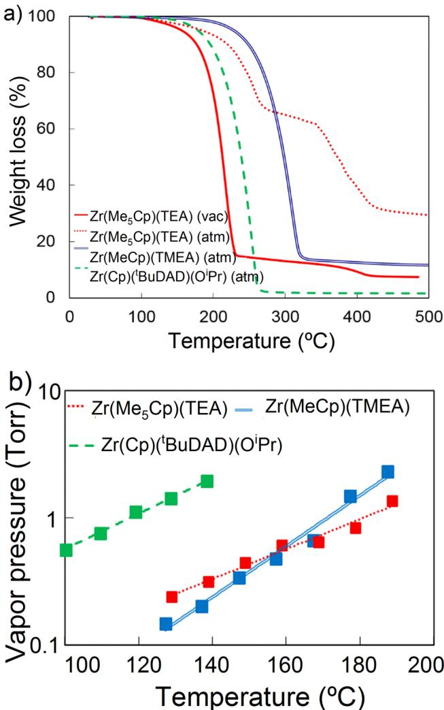
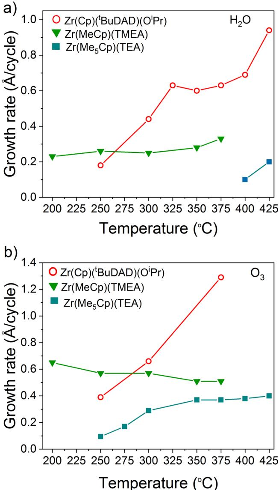
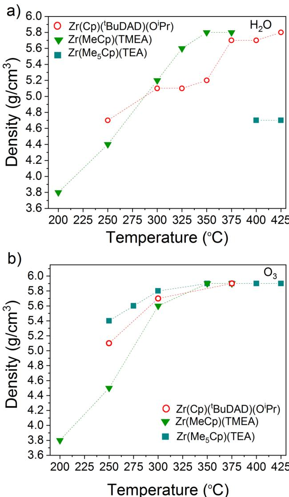
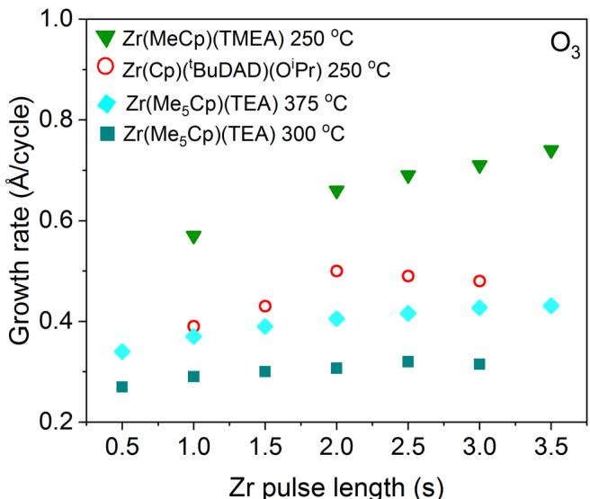
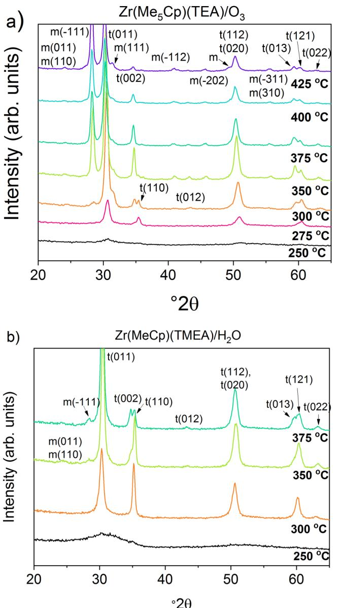
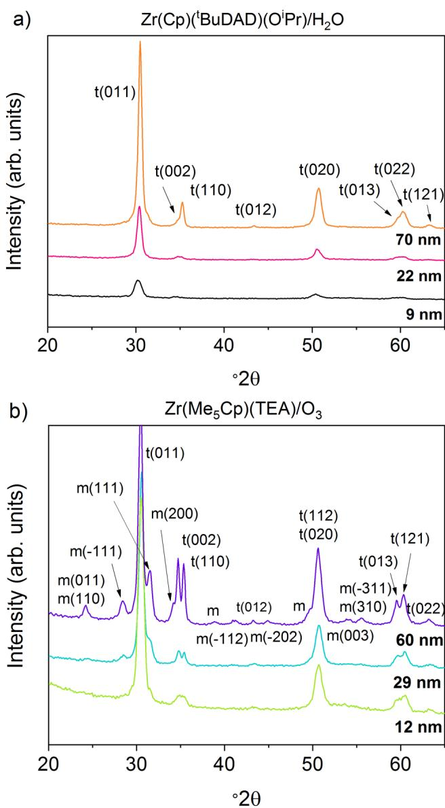
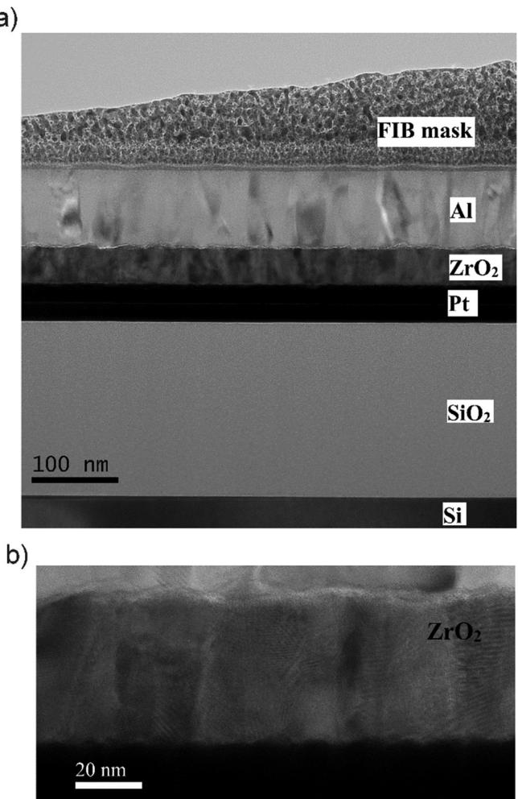

# Comparative study on the use of novel heteroleptic cyclopentadienyl-based zirconium precursors with  $H_{2}O$  and  $O_{3}$  for atomic layer deposition of  $ZrO_{2}$

Special Collection: 2019 Special Collection on Atomic Layer Deposition (ALD)

Sanni Seppala  $\oplus$  Marko Vehkamaki; Kenichiro Mizohata; Wontae Noh; Jyrhi Ratsanen; Mikko Ritala  $\oplus$  Markku Leskela  $\oplus$

# Check for updates

J. Vac. Sci. Technol. A 37, 020912 (2019) https://doi.org/10.1161/16079539

# Articles You May Be Interested In

Role of a cyclopentadienyl ligand in a heteroleptic alkoxide precursor in atomic layer deposition

J. Chem. Phys. (January 2024)

Recent trends in thermal atomic layer deposition chemistry

J. Vac. Sci. Technol. A (March 2025)

In situ reaction mechanism studies on the Ti(NMe  $_2$ )2(O'Pr $_2$ - D $_2$ O and Ti(O'Pr) $_3$ [MeC(N'Pr) $_2$ ]- D $_2$ O atomic layer deposition processes

J. Vac. Sci. Technol. A (December 2013)

# Comparative study on the use of novel heteroleptic cyclopentadienyl-based zirconium precursors with  $\mathsf{H}_2\mathsf{O}$  and  $\mathbf{O}_3$  for atomic layer deposition of  $\mathbf{ZrO}_2$

Sanni Seppala,1,a) Marko Vehkamaki, Kenichiro Mizohata,2 Wontae Noh,3 Jyrki Raisanen,2 Mikko Ritala,' and Markku Leskelal 1Department of Chemistry, University of Helsinki, P.O. Box 55, FI- 00014 Helsinki, Finland 2Division of Materials Physics, Department of Physics, University of Helsinki, P.O. Box 43, FI- 00014 Helsinki, Finland 3Air Liquide Laboratories Korea, Yonsei Engineering Research Park, 50 Yonsei- ro, Seodaemun- gu, Seoul 03722, South Korea

(Received 31 October 2018; accepted 3 January 2019; published 28 January 2019)

Three heteroleptic  $\mathrm{Zr}$  precursors were studied for atomic layer deposition (ALD) of  $\mathrm{ZrO_2}$  .Films were deposited from  $\mathrm{Zr(Cp)(^tBuDAD)(O^iPr)}$ $\mathrm{Zr(MeOp)(TMEA)}$  ,and  $\mathrm{Zr(Me_5Cp)(TEA)}$  with either water or ozone as the oxygen source  $\mathrm{^tBuDAD = N,N}$  - bis(tertbutyl)ethene- 1,2- diaminato, TMEA  $=$  tris[2- (methylamino)ethyl]aminate,  $\mathrm{TEA} =$  triethoanolaminate}. Self- limiting film growth was confirmed for the  $\mathrm{Zr(Cp)(^tBuDAD)(O^iPr) / O_3}$  process at  $250^{\circ}\mathrm{C}$  and for the  $\mathrm{Zr(Me_5Cp)(TEA) / O_3}$  process at  $375^{\circ}C$  which is among the highest temperatures for advanced heteroleptic precursors. Excellent film purity with C, H, and  $Nu$  levels below the detection limit of the elastic recoil detection analysis was obtained with ozone as the oxygen source. All the studied processes showed the same trend that at low deposition temperatures films were tetragonal  $\mathrm{ZrO_2}$  and at higher temperatures mixtures of tetragonal and monoclinic  $\mathrm{ZrO_2}$  . With water, the monoclinic phase appeared at higher temperatures than with ozone. In addition to the deposition temperature, the film thickness affected the phase; thinner films favored the tetragonal phase and monoclinic peaks were more clearly seen in thicker films. The high thermal stability and excellent film purity show that from the three studied  $\mathrm{Zr}$  precursors,  $\mathrm{Zr(Me_5Cp)(TEA)}$  is a noteworthy precursor candidate for ALD of  $\mathrm{ZrO_2}$  .Published by the AVS. https://doi.org/10.1116/1.5079539

# I. INTRODUCTION

Zirconium dioxide is a very interesting material as an dielectric for micro- electronics, and it has been studied extensively particularly for memory applications.1,2 Other applications include electrolytes and interlayers for solid oxide fuel cells (SOFCs),34 and lately  $\mathrm{ZrO_2}$  films have also been studied for antibacterial purposes.5 Zirconium dioxide has a bandgap of  $5.8\mathrm{eV}$  and a suitable band offset of  $1.4\mathrm{eV}$  to Si. The relative permittivity of  $\mathrm{ZrO_2}$  in the bulk form is between 20 (monoclinic  $\mathrm{ZrO_2}$  and 47 (tetragonal  $\mathrm{ZrO_2}$  ). The monoclinic phase is stable at room temperature and the change from the monoclinic phase to the most desired high permittivity tetragonal phase occurs above  $1100^{\circ}\mathrm{C}$  7 However, in thin films, tetragonal, cubic, and orthorhombic  $\mathrm{ZrO_2}$  have been identified.8- 10 The effect of the surface energy is enhanced in thin films, making the appearance of high pressure and temperature phases possible.

Atomic layer deposition (ALD) is the method of choice to produce highly conformal and uniform thin films, especially for the microelectronic applications.11 The first  $\mathrm{ZrO_2}$  process for ALD was  $\mathrm{ZrCl_4 / H_2O}$  12- 15 Since then, various  $\mathrm{Zr}$  precursors have been studied extensively, including amidinates,  $\beta$  - diketonates, and alkylamides.9,16,17 Unfortunately, all these have drawbacks regarding either growth rate or thermal stability.

Heteroleptic precursors, i.e., precursors with more than one type of ligands in the metal complex, have been widely studied for  $\mathrm{Zr}$  .Possible benefits include better thermal stability, volatility, and reactivity compared to the homoleptic counterparts.18 However, it is not always easy to predict the properties of the heteroleptic compounds and sometimes the result can be a combination of the undesirable properties of the ligands. Thus, it is important to study different heteroleptic compounds to understand the benefits they can offer compared to the traditional ALD precursors.

Advanced heteroleptic zirconium precursors applied in ALD most often have cyclopentadienyl  $(\mathrm{Cp})$  ring as one of the ligands. Cyclopentadienyls are good electron donors and form stable bonds with metals, which ensure good thermal stability of the compounds.19 Also, the properties of the  $\mathrm{Cp}$  ligands can easily be tuned by varying the number and composition of the substitutes on the ring. Examples of heteroleptic precursors with  $\mathrm{Cp}$  ligands are  $\mathrm{RCpZr(NMe_2)_3}$ $\mathbf{R} = \mathbf{H}$  ethyl or methyl),20  $\mathrm{RCp_2ZrMe_2}$ $\mathbf{R} = \mathbf{H}$  or methyl),21 and  $\mathrm{MeCpZrCHT}$ $\mathrm{CHT} =$  cycloheptatrienyl).22 Many of the heteroleptic precursors have been reported to exhibit selflimiting growth at  $300^{\circ}\mathrm{C}$  including the  $\mathrm{CpZr(NMe_2)_3}$  that is widely used in industry.23  $\mathrm{RCp_2ZrMe_2}$  has a higher thermal stability of  $350^{\circ}\mathrm{C}$  but the as- deposited films consist of the low permittivity monoclinic  $\mathrm{ZrO_2}$

In this work, three heteroleptic zirconium precursors were studied as  $\mathrm{Zr}$  sources in the atomic layer deposition of  $\mathrm{ZrO_2}$  These compounds were cyclopentadienyl N,N- bis(tertbutyl) ethene- 1,2- diaminato isopropylalkoxo zirconium  $\mathrm{Zr(Cp)}$

  
FIG. 1. Schematic structures of the zirconium precursors  $\mathrm{Zr(Cp)(BuDAD)(O^iPr)}$ ,  $\mathrm{Zr(MeCp)(TMEA)}$ , and  $\mathrm{Zr(MeS_Cp)(TEA)}$ .

$\mathrm{^tBuDAD)(O^iPr)}$ , methylcyclopentadienyl tris[2- (methylamino) ethyl]aminate zirconium  $\mathrm{Zr(MeCp)(TMEA)}$ , and pentamethylcyclopentadienyl triethoanolaminate zirconium  $\mathrm{Zr(Me_5Cp)}$  (TEA) (Fig. 1). All three precursors have a  $\mathrm{Cp}$  ring as one of the ligands but the number of substituents in the ring varies.  $\mathrm{^tBuDAD}$ , TMEA, and TEA ligands were used to attain better thermal stability compared to the state- of- the- art heteroleptic precursors and at the same time to retain reasonable volatility for the precursors.

# II. EXPERIMENT

# A. Precursor characterization

Thermogravimetric analyses (TGAs) and precursor vapor pressure studies were carried out in a Mettler Toledo TGA/DSC 1 STARe System. Measurements were done under nitrogen atmosphere with a nitrogen flow of  $220\mathrm{scm / min}$  at atmospheric pressure.  $\mathrm{Zr(Me_5Cp)(TEA)}$  was also studied under vacuum with a pressure of 20 Torr. A heating program of  $10^{\circ}\mathrm{C / min}$  was used in all the measurements. Vapor pressures were estimated by using evaporation rate at each temperature.

# B. Film deposition

Films were deposited in a hot- wall cross- flow F- 120 ALD reactor (ASM Microchemistry) from  $\mathrm{Zr(Cp)(^tBuDAD)(O^iPr)}$ $\mathrm{Zr(MeCp)(TMEA)}$ , and  $\mathrm{Zr(Me_5Cp)(TEA)}$  precursor (all from Air Liquide) with either water or ozone as the oxygen source. The  $\mathrm{Zr}$  precursors were solid at room temperature, but  $\mathrm{Zr(Cp)(^tBuDAD)(O^iPr)}$  and  $\mathrm{Zr(MeCp)(TMEA)}$  melted in the reactor at their source temperature. The evaporation temperatures for the precursors were  $65^{\circ}\mathrm{C}$  for  $\mathrm{Zr(Cp)(^tBuDAD)(O^iPr)}$ ,  $115^{\circ}\mathrm{C}$  for  $\mathrm{Zr(Me_5Cp)(TEA)}$ , and  $120^{\circ}\mathrm{C}$  for  $\mathrm{Zr(MeCp)(TMEA)}$ . The deposition temperatures were varied in the range of  $200 - 425^{\circ}\mathrm{C}$ . The reactor pressure was  $\sim 5$  mbar. Water was kept in a container at room temperature outside the reactor and the vapor flow was controlled by a needle valve. Ozone with a concentration of  $100\mathrm{g / m}^3$  was generated from  $\mathrm{O}_2$  (AGA  $99.999\%$  in an ozone generator (Wedeco Modular  $4\mathrm{HC}$ ). Nitrogen (AGA  $99.999\%$ $\mathrm{H}_2\mathrm{O}\leq 3\mathrm{ppm}$ ,  $\mathrm{O}_2\leq 3\mathrm{ppm}$ ) was used as the carrier and purging gas.  $\mathrm{Si}(100)$  wafers cut to  $5\times 5\mathrm{cm}^2$  pieces were used as substrates. Native oxide was not removed prior to deposition. For electrical measurements, films were deposited on  $\mathrm{Pt}$  substrates.

# C. Film characterization

Film thicknesses were measured with  $\mathbf{X}$  - ray reflectivity using a Rigaku SmartLab  $\mathbf{X}$  - ray diffractometer. Film densities were obtained by fitting the XRR data. Crystallinity and phase of the films were determined by glazing incidence  $\mathbf{X}$  ray diffraction (GIXRD) with a PANalytical X'Pert Pro MPD diffractometer.

TEM specimens were prepared with the focused ion beam (FIB) lift- out method, with an FEI Quanta 3D 200i DualBeam instrument. Bright- field TEM images were collected with a  $200\mathrm{kV}$  Tecnai F20 transmission electron microscope.

Film compositions were examined with time- of- flight elastic recoil detection analysis (TOF- ERDA) at a detection angle of  $40^{\circ}$  by  $40\mathrm{MeV}^{79}\mathrm{Br}^{7 + }$  ions obtained from a  $5\mathrm{MV}$  tandem accelerator EGP- 10- II.

For the electrical measurements, metal- insulator- metal (MIM) plate capacitors with  $\mathrm{Pt / ZrO_2 / Al}$  structures were made.  $\mathrm{ZrO_2}$  films were deposited on  $\mathrm{Pt}$  evaporated on  $\mathrm{Si}$  wafer. Aluminum dots with an area of  $0.204\mathrm{mm}^2$  were e- beam evaporated through a shadow mask on the top of the  $\mathrm{ZrO_2}$  films. The dot diameter used for calculating the area was obtained from SEM images. The  $\mathrm{Pt}$  electrode thickness was  $40\mathrm{nm}$ , and the  $\mathrm{Al}$  dot thicknesses were approximately  $90\mathrm{nm}$ . There were vacuum breaks between all depositions. Current- voltage (I- V) characteristics were measured with a Keithley 2400 source meter with a step size of  $0.2\mathrm{V / step}$ . The capacitance values were measured with a HP4284A LCR meter with a frequency of  $10\mathrm{kHz}$ . Relative permittivities were calculated from the mean capacitances.

# III. RESULTS AND DISCUSSION

# A. Precursor properties

The TG curves of the three precursors are depicted in Fig. 2(a).  $\mathrm{Zr(Cp)(tBuDAD)(OiPr)}$  and  $\mathrm{Zr(MeCp)(TMEA)}$  showed a single step weight loss in atmospheric pressure. The residue for the  $\mathrm{Zr(Cp)(tBuDAD)(OiPr)}$  precursor was very low, below  $2\%$ , indicating evaporation without decomposition. For the  $\mathrm{Zr(MeCp)(TMEA)}$  precursor, the residue was around  $15\%$  which means that the precursor is also decomposing.

$\mathrm{Zr(Me_5Cp)(TEA)}$  showed a two- step weight loss process with a residue of  $65\%$  after the first step and  $30\%$  at the end of the measurement  $(500^{\circ}\mathrm{C})$  at atmospheric pressure. Because of the high residues, also a measurement under vacuum was conducted. The results in vacuum were clearly better than in atmospheric pressure as the residue after the first step at  $230^{\circ}\mathrm{C}$  was  $15\%$ . Despite the decomposition seen in the TG analysis, in the ALD experiments, the first signs of precursor decomposition were seen only at  $400^{\circ}\mathrm{C}$ . Differences in the decomposition temperature between TG analysis and ALD deposition

  
FiG. 2. (a) Thermogravimetric analysis and (b) vapor pressures of the  $\mathrm{Zr}$  precursors.

experiments have previously been reported, for example, in ALD of CoO from  $\mathrm{CoCl_2(TMEDA)}$ $\mathrm{(TMEDA = N,N,N^{\prime}}$ $N^{\prime}$  - tetramethylethylenediamine)24 and the probable cause for this comes from the differences in interactions in the gas phase and on the surface during the ALD process as compared to the interactions in the condensed phase in TG.

Vapor pressure studies of the precursors were in line with the TG results and showed that  $\mathrm{Zr(Cp)(^tBuDAD)(O^iPr)}$  is substantially more volatile than the  $\mathrm{Zr(MeCp)(TMEA)}$  and  $\mathrm{Zr(Me_5Cp)(TEA)}$  precursors [Fig. 2(b)]. Based on the vapor pressure, the evaporation temperatures for the ALD experiments were chosen to be  $65^{\circ}C$  for  $\mathrm{Zr(Cp)(^tBuDAD)}$ $(\mathrm{O^iPr})$  and  $120^{\circ}\mathrm{C}$  for  $\mathrm{Zr(MeCp)(TMEA)}$  . Sublimation temperature of  $115^{\circ}C$  was chosen for the  $\mathrm{Zr(Me_5Cp)(TEA)}$  precursor.

# B. Film deposition

The reactivities of the  $\mathrm{Zr}$  precursors especially toward water varied largely [Fig. 3(a)].  $\mathrm{Zr(Me_5Cp)(TEA)}$  did not react with water below  $400^{\circ}\mathrm{C}$  and at  $400^{\circ}\mathrm{C}$  the growth rate was very low,  $0.1\mathrm{\AA / cycle}$

With the  $\mathrm{Zr(MeCp)(TMEA) / H_2O}$  process, films were deposited at  $200 - 375^{\circ}C$  Almost constant growth rate around

  
FiG. 3. (a) Film growth rates at different temperatures with (a) water and (b) ozone as the oxygen source. Pulse times for  $\mathrm{Zr}$  precursors,  $\mathrm{H}_2\mathrm{O}$  and  $\mathrm{O_3}$  were  $1.0\mathrm{s}$  and purge times for all pulses  $1.5\mathrm{s}$

$0.3\mathrm{\AA / cycle}$  was obtained at  $250–350^{\circ}\mathrm{C}$  Slight increase in the growth rate was observed at  $375^{\circ}C$  With the  $\mathrm{Zr(Cp)}$ $\mathrm{(^tBuDAD)(O^iPr) / H_2O}$  process, films were deposited at  $250-$ $425^{\circ}C$  A temperature range with a constant growth rate of around  $0.65\mathrm{\AA / cycle}$  was seen from 325 to  $400^{\circ}\mathrm{C}$  [Fig. 3(a)].

All three precursors had higher growth rates with ozone than with water [Fig. 3(b)].  $\mathrm{Zr(Me_5Cp)(TEA) / O_3}$  had a constant growth rate of  $0.4\mathrm{\AA / cycle}$  at  $350–400^{\circ}\mathrm{C}$  The growth rate slightly increased at  $425^{\circ}C$  because of the precursor decomposition. This decomposition was clearly observed from the appearance of some film deposits in the hot end of the source tube and it was not visible at lower deposition temperatures. The rather slow growth rates with  $\mathrm{Zr(Me_5Cp)(TEA)}$  are probably caused by the bulky ligands that shield the  $\mathrm{Zr}$  atoms and prevent reactions. TEA is also a chelating ligand with three oxygen donor atoms that are expected to bond stronger to  $\mathrm{Zr}$  than the nitrogen donors in TMEA and  $\mathrm{^tBuDAD}$ $\mathrm{[Zr - O}$  bond strength is  $\sim 760\mathrm{kJ / mol}$  and

  
FIG. 4. Film densities at different deposition temperatures with (a) water and (b) ozone as the oxygen source.

$\mathrm{Zr - N}\sim 560\mathrm{kJ / mol}$  Ref.25)].The advantage of the  $\mathrm{Zr(Me_5Cp)}$  (TEA) precursor is its excellent thermal stability compared to the other two precursors.

With the  $\mathrm{Zr(MeCp)(TMEA) / O_3}$  process, the growth rate decreased with increasing temperature from  $0.65\mathrm{\AA}$  cycle at  $200^{\circ}\mathrm{C}$  to  $0.50\mathrm{\AA}$  cycle at  $375^{\circ}C$ $\mathrm{Zr(Cp)(^tBuDAD)(O^iPr)}$  with  $\mathrm{O_3}$  showed the opposite behavior as the growth rates increased from  $0.40\mathrm{\AA}$  cycle at  $250^{\circ}C$  to  $1.3\mathrm{\AA}$  cycle at  $375^{\circ}C$

The deposition temperature affected the film density as depicted in Fig. 4. The bulk density of  $\mathrm{ZrO_2}$  is around  $6\mathrm{g / cm^3}$  depending on the phase. With  $\mathrm{Zr(MeCp)(TMEA)}$  and  $\mathrm{Zr(Cp)(^tBuDAD)(O^iPr)}$  a considerable increase in the density was seen with increasing deposition temperature regardless of the oxygen source. With water, the film densities ranged from 5.7 to  $5.9\mathrm{g / cm^3}$  at the highest deposition temperatures, whereas at  $250^{\circ}\mathrm{C}$  the density decreased to  $4.4\mathrm{g / cm^3}$  for  $\mathrm{Zr(MeCp)(TMEA)}$ $(3.8\mathrm{g / cm^3}$  at  $200^{\circ}\mathrm{C})$  and  $4.7\mathrm{g / cm^3}$  for  $\mathrm{Zr(Cp)(^tBuDAD)(O^iPr)}$  [Fig. 4(a)]. With ozone, slightly higher densities compared to water processes were observed at  $250^{\circ}\mathrm{C}$ . Because of the changes in the film density, the amount of material deposited, for example, in the  $\mathrm{Zr(MeCp)(TMEA)}$  processes is much higher at  $350^{\circ}\mathrm{C}$  (1.47 and  $0.79\mathrm{Zr}$  atoms/  $\mathrm{nm^2}$  cycle with  $\mathrm{O_3}$  and  $\mathrm{H}_2\mathrm{O}$  and  $375^{\circ}C$  1.47 and  $0.93~\mathrm{Zr}$  atoms  $/\mathrm{nm}^2$  - cycle with  $\mathrm{O_3}$  and  $\mathrm{H}_2\mathrm{O}$  compared to  $250^{\circ}\mathrm{C}$  1.30 and  $0.55~\mathrm{Zr}$  atoms  $/\mathrm{nm}^2$  cycle with  $\mathrm{O_3}$  and  $\mathrm{H}_2\mathrm{O}$  even though the growth rates are close to each other. Likewise, taking the density increase into account, the increase of the growth rate with increasing temperature in the  $\mathrm{Zr(Cp)}$ $(^t\mathrm{BuDAD})(\mathrm{O^iPr}) / \mathrm{O_3}$  process gets even stronger:  $1.0~\mathrm{Zr}$  atoms  $/\mathrm{nm}^2$  cycle at  $250^{\circ}\mathrm{C}$ $1.8~\mathrm{Zr}$  atoms  $/\mathrm{nm}^2$  cycle at  $300^{\circ}\mathrm{C}$  and 3.9 atoms  $/\mathrm{nm}^2$  cycle at  $375^{\circ}C$

Films deposited with  $\mathrm{Zr(Me_5Cp)(TEA)}$  and ozone showed only a small decrease in density from 5.9 to  $5.4\mathrm{g / cm^3}$  while decreasing the deposition temperature [Fig. 4(b)]. The thickness of the films did not affect the density: films with thicknesses around  $10\mathrm{nm}$  showed densities similar to  $40\mathrm{nm}$  thick films at  $300–375^{\circ}\mathrm{C}$ . With water, density was very low  $(4.7\mathrm{g / cm^3})$  compared to the ozone process despite the high deposition temperatures of 400 and  $425^{\circ}\mathrm{C}$  [Fig. 4(a)]. The film thicknesses were similar in both processes. The low density appears to be due to the low reactivity of the  $\mathrm{Zr(Me5Cp)(TEA)}$  precursor with water which is seen in the low growth rate [Fig. 3(a)] and high impurity concentrations (Table I) in the films. Because of the low densities and very low growth rates, only a few films with the  $\mathrm{Zr(Me_5Cp)(TEA)}$ $\mathrm{H}_2\mathrm{O}$  process were deposited.

The effect of the  $\mathrm{Zr}$  precursor pulse length on the growth rate was studied to reveal the true, self- limiting ALD- type growth processes. Self- limiting growth mode was confirmed for the  $\mathrm{Zr(Me_5Cp)(TEA) / O_3}$  process at 300, 350 (not shown), and  $375^{\circ}C$  (Fig. 5). The growth rate was  $0.3\mathrm{\AA}$  cycle at  $300^{\circ}\mathrm{C}$  and  $0.4\mathrm{\AA}$  cycle at 350 and  $375^{\circ}C$ . At  $400^{\circ}\mathrm{C}$ , the growth rate increased slightly with increasing pulse length from  $0.38\mathrm{\AA}$  cycle at  $1.0\mathrm{s}$  pulse length to  $0.46\mathrm{\AA}$  cycle at  $3.5\mathrm{s}$ $\mathrm{Zr}$  precursor pulse. This result demonstrates that the thermal stability of the  $\mathrm{Zr(Me_5Cp)(TEA)}$  precursor is one of the highest among zirconium precursors and clearly higher than the thermal stability of the industrially dominant  $\mathrm{CpZr(NMe_2)_3}$  precursor which saturates at  $300^{\circ}\mathrm{C}$ . Despite the very strong temperature dependence, self- limiting growth was also observed in the  $\mathrm{Zr(Cp)(^tBuDAD)(O^iPr) / O_3}$  process at  $250^{\circ}\mathrm{C}$ $(0.5\mathrm{\AA}$  cycle) but not at higher deposition temperatures. However, at this low deposition temperature, the film density was somewhat lower than the bulk value of  $\mathrm{ZrO_2}$ .  $\mathrm{Zr(MeCp)(TMEA)}$  did not show saturation of the growth with ozone and none of the  $\mathrm{Zr}$  precursors saturated when water was used as the oxygen source. The saturation studies for the ozone processes are shown in Fig. 5.

# C. Film characterization

All the three studied precursors showed similar trends regarding film crystallinity: The films were crystalline  $\mathrm{ZrO_2}$ , and the phase was either tetragonal  $\mathrm{ZrO_2}$  (ICDD 50- 1089) or a mixture of tetragonal and monoclinic (ICDD 37- 1484)  $\mathrm{ZrO_2}$  depending on the growth temperature and oxygen source. At low deposition temperatures, only tetragonal phase was seen. With water, the temperature at which the monoclinic phase appeared was higher than with ozone. The

TABLE I. TOF-ERDA results from selected samples.  

<table><tr><td>Zr source</td><td>O source</td><td>Tdep(℃)</td><td>Zr (at. %)</td><td>O (at. %)</td><td>Zr:O ratio</td><td>H (at. %)</td><td>C (at. %)</td><td>N (at. %)</td></tr><tr><td rowspan="3">Zr(Me5Cp)(TEA)</td><td rowspan="2">O3</td><td>375</td><td>32.1</td><td>67.9</td><td>0.47</td><td>N.D.</td><td>N.D.</td><td>N.D.</td></tr><tr><td>300</td><td>32.5</td><td>67.3</td><td>0.48</td><td>N.D.</td><td>0.3</td><td>N.D.</td></tr><tr><td>H2O</td><td>425</td><td>29.3</td><td>59.3</td><td>0.49</td><td>3.5</td><td>6.5</td><td>1.3</td></tr><tr><td rowspan="5">Zr(Cp)(BuDAD)(O4Pr)</td><td rowspan="3">O3</td><td>375</td><td>32.0</td><td>67.2</td><td>0.48</td><td>0.4</td><td>0.3</td><td>0.1</td></tr><tr><td>300</td><td>31.3</td><td>67.7</td><td>0.46</td><td>0.4</td><td>0.5</td><td>0.1</td></tr><tr><td>250</td><td>30.1</td><td>67.2</td><td>0.45</td><td>1.0</td><td>1.4</td><td>0.2</td></tr><tr><td rowspan="2">H2O</td><td>375</td><td>31.7</td><td>65.0</td><td>0.49</td><td>0.4</td><td>2.4</td><td>0.5</td></tr><tr><td>300</td><td>31.0</td><td>65.4</td><td>0.47</td><td>0.8</td><td>2.5</td><td>0.4</td></tr><tr><td rowspan="4">Zr(MeCp)(TMEA)</td><td rowspan="2">O3</td><td>375</td><td>32.2</td><td>67.0</td><td>0.48</td><td>0.5</td><td>0.1</td><td>0.1</td></tr><tr><td>300</td><td>29.7</td><td>64.8</td><td>0.46</td><td>4.1</td><td>0.8</td><td>0.4</td></tr><tr><td rowspan="2">H2O</td><td>375</td><td>31.4</td><td>64.3</td><td>0.49</td><td>2.2</td><td>1.7</td><td>0.4</td></tr><tr><td>300</td><td>28.8</td><td>59.0</td><td>0.49</td><td>8.8</td><td>2.6</td><td>0.7</td></tr></table>

first small peaks from the monoclinic phase were visible at  $300^{\circ}\mathrm{C}$  with all  $\mathrm{Zr}$  precursors when ozone was used as the oxygen source. With water, monoclinic peaks were first seen at  $400^{\circ}\mathrm{C}$  with the  $\mathrm{Zr(Cp)(BuDAD)(O^4Pr)}$  and at  $350^{\circ}\mathrm{C}$  with the  $\mathrm{Zr(MeCp)(TMEA)}$  precursor, whereas only tetragonal phase was seen with the  $\mathrm{Zr(Me_5Cp)(TEA)}$  precursor (at 400 and  $425^{\circ}C$  .The intensity of the monoclinic peaks increased with increasing temperature. The effect of the deposition temperature on the crystalline phase of the films is exemplified in Fig. 6 by  $\mathrm{Zr(Me_5Cp)(TEA) / O_3}$  and  $\mathrm{Zr(MeCp)(TMEA) / H_2O}$  processes.

In addition to the deposition temperature, the film thickness affected the phase composition. It has been reported before that in ALD of  $\mathrm{ZrO_2}$  very thin films favor the tetragonal phase and with increasing film thickness the intensity of the monoclinic peaks increases.26 The stabilization of the tetragonal phase in thin films has been attributed to the lower

  
FIG. 5. Film growth rates as a function of  $\mathrm{Zr}$  precursor pulse length with ozone as the oxygen source. The pulsing sequence was  $\mathrm{x}$ $\mathrm{slx} + 0.5$  sl1.0 sl1.5 s for  $\mathrm{Zr}$  pulselpurgel  $\mathrm{O_3}$  pulselpurge.

  
FIG. 6. X-ray diffractograms of the films deposited with (a)  $\mathrm{Zr(Me_5Cp)(TEA) / O_3}$  at  $250–425^{\circ}\mathrm{C}$  and (b)  $\mathrm{Zr(MeCp)TMEA) / H_2O}$  process at  $250–375^{\circ}\mathrm{C}$ . Film thicknesses were in (a)  $30–40\mathrm{nm}$  and in (b)  $50\mathrm{nm}$  except at  $375^{\circ}\mathrm{C}$ $43\mathrm{nm}$ .

surface- free energy of the tetragonal phase compared to the monoclinic phase, which is more prominent in nanometer size. $^{27}$  With all three  $\mathrm{Zr}$  precursors, thicker films could be deposited with water than with ozone without the monoclinic phase visible in the diffractograms. For example, films with thicknesses between 9 and  $70\mathrm{nm}$  deposited with  $\mathrm{Zr(Cp)(^tBuDAD)(O^iPr) / H_2O}$  at  $375^{\circ}C$  were all tetragonal  $\mathrm{ZrO_2}$  [Fig. 7(a)]. With the  $\mathrm{Zr(MeCp)(TMEA) / H_2O}$  process at  $350^{\circ}\mathrm{C}$ , the first small monoclinic peaks were seen with a film thickness of  $50\mathrm{nm}$ . With ozone, only very thin films were tetragonal: with the  $\mathrm{Zr(MeCp)(TMEA)}$  at  $350^{\circ}\mathrm{C}$ , only the tetragonal phase was detected for a  $4\mathrm{nm}$  thick film, but monoclinic peaks were visible in a  $9\mathrm{nm}$  thick film. For  $\mathrm{Zr(Me_5Cp)(TEA) / O_3}$  process at  $300^{\circ}\mathrm{C}$ ,  $12\mathrm{nm}$  thick film was tetragonal  $\mathrm{ZrO_2}$  but monoclinic peaks could be seen in a  $29\mathrm{nm}$  thick film [Fig. 7(b)]. At  $375^{\circ}\mathrm{C}$ , a small peak assigned to the monoclinic phase was visible already in the diffractogram of a  $10\mathrm{nm}$  thick film meaning that the deposition temperature seems to have a stronger impact on the phase composition than the film thickness.

  
Fig. 7. X-ray diffractograms of films with different thicknesses deposited with (a)  $\mathrm{Zr(Cp)(^tBuDAD)(O^iPr) / H_2O}$  process at  $375^{\circ}\mathrm{C}$  and (b)  $\mathrm{Zr(Me_5Cp)(TEA) / O_3}$  process at  $300^{\circ}\mathrm{C}$ .

Impurities and film compositions were studied with TOF- ERDA. The results are collected in Table I. In general, the films deposited with ozone had lower impurity contents than the films deposited with water. This kind of trend has been seen previously in oxide ALD depositions. $^{10}$  The high purity is attributed to the more efficient removal of the ligands by combustion with ozone than by hydrolysis reactions with water. $^{28}$  Exceptionally pure films were obtained with the  $\mathrm{Zr(Me_5Cp)(TEA) / O_3}$  process at  $300 - 375^{\circ}\mathrm{C}$  where the carbon, hydrogen, and nitrogen content were below or slightly over the detection limit of TOF- ERDA. In this precursor,  $\mathrm{Zr}$  is already attached to three oxygen atoms which may explain the high purity. The films deposited with  $\mathrm{Zr(MeCp)(TMEA)}$  which did not show saturation of the growth rate (Fig. 5), had higher impurity levels than the others, especially at low deposition temperatures where the hydrogen levels with both water and ozone were considerable.

Capacitor structures were constructed to compare the electrical properties of the different  $\mathrm{ZrO_2}$  processes.  $\mathrm{ZrO_2}$  films

  
FiG. 8. (a) TEM image of the MIM stack and (b) a close-up of the  $\mathrm{ZrO_2}$  film.  $\mathrm{ZrO_2}$  was deposited with the  $\mathrm{Zr(Me_5Cp)(TEA) / O_3}$  process at  $300^{\circ}\mathrm{C}$ .

TABLE II. Relative permittivities and leakage current densities at  $1\mathrm{MV / cm}$  for different  $\mathrm{ZrO_2}$  processes.  

<table><tr><td rowspan="2">Zr source</td><td rowspan="2">source</td><td rowspan="2">Film thickness (nm)</td><td rowspan="2">εr</td><td rowspan="2">Leakage current density at 1 MV/cm (A/cm2)</td></tr><tr></tr><tr><td rowspan="3">Zr(Me5Cp)(TEA)</td><td rowspan="3">O3</td><td>375</td><td>45</td><td>24</td></tr><tr><td>350</td><td>44</td><td>28</td></tr><tr><td>300</td><td>42</td><td>29</td></tr><tr><td rowspan="2">Zr(Cp)(BuDAD)(O3Pr)</td><td>O3</td><td>300</td><td>53</td><td>24</td></tr><tr><td>H2O</td><td>300</td><td>42</td><td>23</td></tr><tr><td rowspan="2">Zr(MeCp)(TMEA)</td><td>O3</td><td>300</td><td>51</td><td>23</td></tr><tr><td>H2O</td><td>300</td><td>62</td><td>23</td></tr></table>

for the capacitors were deposited at  $300^{\circ}\mathrm{C}$  with all processes. For  $\mathrm{Zr(Me_5Cp)(TEA) / O_3}$  process, also capacitors with  $\mathrm{ZrO_2}$  films deposited at 350 and  $375^{\circ}C$  were studied. TEM images of the stack structure are depicted in Fig. 8. Relative permittivities  $\epsilon_0$  of the films were calculated from the capacitances using the equation for a parallel plate capacitor [Eq. (1)]:

$$
C = \epsilon_0\epsilon_{\mathrm{r}}\frac{A}{d}, \tag{1}
$$

where  $C$  is the capacitance,  $\epsilon_0$  is the permittivity of the vacuum,  $A$  is the area of the capacitor, and  $d$  is the thickness of the  $\mathrm{ZrO_2}$  layer.

The permittivity values for the  $\mathrm{ZrO_2}$  films deposited at  $300^{\circ}\mathrm{C}$  with different deposition processes ranged from 23 to 29. The highest permittivity was calculated for the film deposited with the  $\mathrm{Zr(Me_5Cp)(TEA) / O_3}$ . TEM image showed that the lateral grain size in this film is  $20 - 30\mathrm{nm}$  [Fig. 8(b)]. The permittivities for the other processes remained clearly lower, being 23 or 24 (Table II). The permittivities of the films deposited at 350 and  $375^{\circ}C$  with the  $\mathrm{Zr(Me_5Cp)(TEA) / O_3}$  process were lower than at  $300^{\circ}\mathrm{C}$  probably because of the increasing amount of monoclinic phase in the films. The dielectric loss values were 0.01 or lower in all the samples. Permittivity values reported before for cubic/tetragonal  $\mathrm{ZrO_2}$  range from 20 to 40.29- 31 However, comparison between the studies is often difficult because of the differences in film thicknesses, electrodes, thermal treatment, and preparation of the capacitors (i.e., vacuum breaks, use of clean room, etc.).

  
FIG. 9. Leakage current density curves of the  $\mathrm{ZrO_2}$  films deposited with  $\mathrm{O_3}$  at  $300^{\circ}\mathrm{C}$ . The polarity of the electric field indicates the potential applied to the top electrode.

The leakage current density- electric field curves are shown in Fig. 9 for the films deposited at  $300^{\circ}\mathrm{C}$  by the three processes using ozone as the oxygen source. When the electrons were injected from the bottom electrode (positive electric field), the film deposited with the  $\mathrm{Zr(MeCp)(TMEA) / O_3}$  process had clearly higher leakage current density compared

TABLE III. Key properties for the studied  $\mathrm{ZrO_2}$  processes and some previously published processes for comparison.  

<table><tr><td>Zr source</td><td>O source</td><td>Tzr (°C)</td><td>Tsat (°C)</td><td>Growth rate at Tsat or Tssat (Å/cycle)</td><td>C (at. %)a</td><td>Crystalline phaseb</td><td>Reference</td></tr><tr><td rowspan="2">Zr(Me5Cp)(TEA)</td><td>O3</td><td>115</td><td>300–375</td><td>0.3–0.4</td><td>&amp;lt;0.1–0.3</td><td>t or t+m</td><td></td></tr><tr><td>H2O</td><td></td><td>—</td><td>0.1 (400 C)</td><td>—e</td><td>t</td><td></td></tr><tr><td rowspan="2">Zr(Cp)(BuDAD) (O3Pr)</td><td>O3</td><td>65</td><td>250</td><td>0.5</td><td>1.4</td><td>t or t+m</td><td></td></tr><tr><td>H2O</td><td></td><td>—</td><td>0.45 (300 C)</td><td>2.5</td><td>t</td><td></td></tr><tr><td rowspan="2">Zr(MeCp)(TMEA)</td><td>O3</td><td>120</td><td>—</td><td>0.5 (300 C)</td><td>0.8</td><td>t or t+m</td><td></td></tr><tr><td>H2O</td><td></td><td>—</td><td>0.25 (300 C)</td><td>2.6</td><td>t (m)</td><td></td></tr><tr><td>ZrCp(NMe2)3</td><td>O3</td><td>60</td><td>300</td><td>0.9</td><td>&amp;lt;1</td><td>c</td><td>20</td></tr><tr><td>Zr(NEtMe)4</td><td>O3</td><td>110</td><td>275</td><td>1.0</td><td>&amp;gt;1 (300 C)</td><td>c+m</td><td>20</td></tr><tr><td rowspan="2">ZrCp2(CH3)2</td><td>O3</td><td>70</td><td>350</td><td>0.55</td><td>0.2</td><td>m+o</td><td>9</td></tr><tr><td>H2O</td><td></td><td>350</td><td>0.43</td><td>&amp;lt;0.1</td><td>m+o</td><td>21</td></tr><tr><td>Cp2ZrCl2</td><td>O3</td><td>140</td><td>300</td><td>0.53</td><td>&amp;lt;0.5</td><td>m+o</td><td>9</td></tr><tr><td>ZrCl4</td><td>H2O</td><td>155</td><td>500</td><td>0.50</td><td>Cl&amp;lt;0.5</td><td>a (m/t)</td><td>12</td></tr><tr><td>Zr(thd)4</td><td>O3</td><td>170</td><td>375</td><td>0.24</td><td>&amp;lt;0.5</td><td>m+o</td><td>9</td></tr></table>

$^{\mathrm{a}}\mathrm{H}$  is also a common impurity, but it was not reported for all processes. bCrystalline phase depends on the deposition temperature and film thickness.  $^c\mathrm{No}$  compositional analysis was done.

to the other processes whereas from the opposite direction, there is no difference. The higher leakage current could be caused by hydrogen impurities or lower quality of the film/ bottom electrode interface compared to the other processes. In the case of  $\mathrm{Zr(Cp)(^tBuDAD)(O^iPr)}$ , clearly higher leakage current densities were obtained with water than with ozone as the oxygen source. The higher impurity content (especially carbon) and lower density of the films deposited with water compared to ozone are a likely cause for the higher leakage current density. With  $\mathrm{Zr(MeCp)(TMEA)}$ , the values were in the same range with both oxygen sources. With the  $\mathrm{Zr(Me_5Cp)(TEA) / O_3}$  process, leakage current densities were in the order of  $10^{- 6}\mathrm{A / cm^2}$  at  $1\mathrm{MV / cm}$ . Very low leakage current of  $2\cdot 10^{- 8}\mathrm{A / cm^2}$  was also measured for the  $\mathrm{Zr(Cp)(^tBuDAD)(O^iPr) / O_3}$  process, whereas with  $\mathrm{Zr(MeCp)(TMEA)}$ , the leakage current densities were in the order of  $10^{- 7}$  and  $10^{- 6}\mathrm{A / cm^2}$  for both water and ozone deposited films. Leakage current densities for the different capacitors measured at  $1\mathrm{MV / cm}$  are shown in Table II.

# IV. SUMMARY AND CONCLUSIONS

Three heteroleptic  $\mathrm{Zr}$  precursors,  $\mathrm{Zr(Me_5Cp)(TEA)}$ ,  $\mathrm{Zr(Cp)(^tBuDAD)(O^iPr)}$ , and  $\mathrm{Zr(MeCp)(TMEA)}$ , were studied for the ALD of  $\mathrm{ZrO_2}$  using water or ozone as the oxygen source. The growth rates, crystal phases, impurity contents, and electrical properties were evaluated. Excellent film purity was achieved with all the  $\mathrm{Zr}$  precursors with ozone and especially with the  $\mathrm{Zr(Me_5Cp)(TEA)}$  precursor where pure  $\mathrm{ZrO_2}$  films were deposited with impurity levels below or at the detection limit (0.1 at.  $\%$  ) of TOF- ERDA. With water, higher impurity levels were detected compared to ozone, but water favored the formation of the high-  $\kappa$  tetragonal  $\mathrm{ZrO_2}$  phase. With ozone, most films were mixtures of tetragonal and monoclinic phases with the monoclinic peak intensity increasing with increasing deposition temperature. The best precursor was found to be  $\mathrm{Zr(Me_5Cp)(TEA)}$  with excellent thermal stability; self- limiting growth was achieved at as high as  $375^{\circ}\mathrm{C}$  with a growth rate of  $0.4\mathrm{\AA / cycle}$ . These films also had low leakage current densities in the order of  $10^{- 8}\mathrm{A / cm^2}$  at  $1\mathrm{MV / cm}$ . Key features of the processes are collected in Table III and compared with selected processes from the literature.

# ACKNOWLEDGMENTS

Funding from the Finnish Centre of Excellence in Atomic Layer Deposition (Academy of Finland) is gratefully acknowledged. The authors thank the Electron Microscopy Unit of the Institute of Biotechnology, University of Helsinki for TEM instrument access.

$^1$ D. Panda and T.- Y. Tseng, Thin Solid Films 531, 1 (2013).  $^2$ L. Fu, Y. Li, G. Han, X. Gao, C. Chen, and P. Yuan, Microelectron. Eng. 172, 26 (2017).  $^3$ J. H. Shim, C.- C. Chao, H. Huang, and F. B. Prinz, Chem. Mater. 19, 3850 (2007).  $^4$ P.- C. Su, C.- C. Chao, J. H. Shim, R. Fasching, and F. B. Prinz, Nano Lett. 8, 2289 (2008).  $^5$ M. Godlewski, S. Gieraltowska, L. Wachnicki, R. Pietuszka, B. S. Witkowski, A. Slonska, Z. Gajewski, and M. M. Godlewski, J. Vac. Sci. Technol. A 35, 021508 (2017).  $^6$ J. Robertson, J. Vac. Sci. Technol. B 18, 1785 (2000).  $^7$ K. Negita, Acta Metall. 37, 313 (1989).  $^8$ C. L. Dezelah, J. Niinisto, K. Kukli, F. Munnik, J. Lu, M. Ritala, M. Leskelä, and L. Niinisto, Chem. Vap. Deposition 14, 358 (2008).  $^{10}$ M. Putkonen and L. Niinisto, J. Mater. Chem. 11, 3141 (2001).  $^{11}$ T. Blanquart et al., Chem. Mater. 25, 3088 (2013).  $^{12}$ M. Ritala and M. Leskelä, Handbook of Thin Film Materials, edited by H. S. Nalwa (Academic, San Diego, CA, 2002), Vol. 1, Chap. 2, pp. 103- 159.  $^{13}$ M. Ritala and M. Leskelä, Appl. Surf. Sci. 75, 333 (1994).  $^{14}$ S.- Y. Lee, H. Kim, P. C. McIntyre, K. C. Saraswat, and J.- S. Byun, Appl. Phys. Lett. 82, 2874 (2003).  $^{15}$ M. Copel, M. Gribelyuk, and E. Gusev, Appl. Phys. Lett. 76, 436 (2000).  $^{16}$ C. M. Perkins, B. B. Triplett, P. C. McIntyre, K. C. Saraswat, S. Haukka, and M. Tuominen, Appl. Phys. Lett. 78, 2357 (2001).  $^{17}$ D. M. Hausmann, E. Kim, J. Becker, and R. G. Gordon, Chem. Mater. 14, 4350 (2002).  $^{18}$ B. Lee et al., Microelectron. Eng. 86, 272 (2009).  $^{19}$ J. Niinisto, T. Blanquart, S. Seppala, M. Ritala, and M. Leskelä, ECS Trans. 64, 221 (2014).  $^{20}$ C. Musgrave and R. Gordon, Future Fab Int. 18, 126 (2005).  $^{21}$ J. Niinisto et al., J. Mater. Chem. 18, 5243 (2008).  $^{22}$ M. Putkonen, J. Niinisto, K. Kukli, T. Sajavaara, M. Karppinen, H. Yamauchi, and L. Niinisto, Chem. Vap. Deposition 9, 207 (2003).  $^{23}$ J. Niinisto, T. Hatanpaa, M. Kariniemi, M. Mantymaki, L. Costelle, K. Mizokata, K. Kukli, M. Ritala, and M. Leskelä, Chem. Mater. 24, 2002 (2012).  $^{24}$ Air Liquide press release 21 March 2013, see: https://www.airliquide.com/united- states- america/air- liquide- electronics- strengthens- patent- portfolio- zirconium- based- high- k- , accessed 28 June 2018.  $^{25}$ K. Väyrynen, T. Hatanpaa, M. Mattinen, M. Heikkilä, K. Mizohata, K. Meinander, J. Räisänen, M. Ritala, and M. Leskelä, Chem. Mater. 30, 3499 (2018).  $^{26}$ Y. R. Luo, Comprehensive Handbook of Chemical Bond Energies (CRC, Boca Raton, FL, 2007, revised 2009).  $^{27}$ J. Niinisto et al., J. Mater. Chem. 18, 3385 (2008).  $^{28}$ A. Navrotsky, J. Mater. Chem. 15, 1883 (2005).  $^{29}$ K. Knapas and M. Ritala, Chem. Mater. 20, 5698 (2008).  $^{30}$ S. K. Kim and C. S. Hwang, Electrochem. Solid- State Lett. 11, G9 (2008).  $^{31}$ A. Lamperti, L. Lamagna, G. Congedo, and S. Spiga, J. Electrochem. Soc. 158, G221 (2011).  $^{32}$ I. Kärkkänen, A. Shkabko, M. Heikkilä, J. Niinisto, M. Ritala, M. Leskelä, S. Hoffmann- Eifert, and R. Waser, Phys. Status Solidi A 211, 301 (2014).