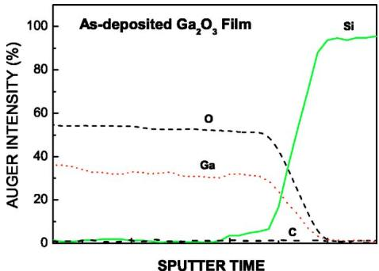
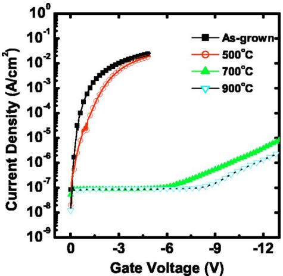
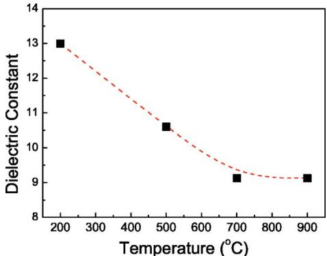
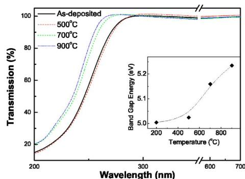
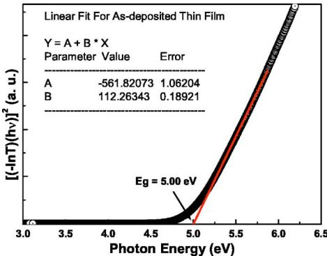
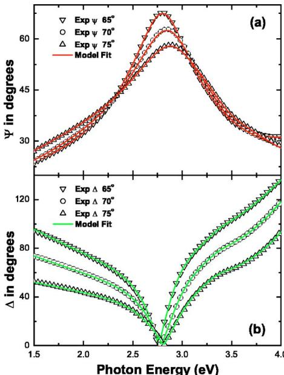
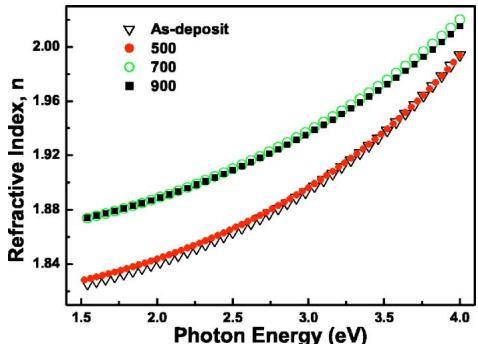

# Structural, electrical, and optical properties of transparent gallium oxide thin films grown by plasma-enhanced atomic layer deposition  $\odot$

F. 
K. Shan; 
G. 
X. Liu; 
W. 
J. Lee; 
G. 
H. Lee; 
I. 
S. Kim; 
B. 
C. Shin

Check for updates J. Appl. Phys. 98, 023504 (2005) https://doi.org/10.1063/1.1980535

# Articles You May Be Interested In

Electrical characteristics of Ga 2 O 3 – TiO 2 nanomixed films grown by plasma- enhanced atomic- layer deposition for gate dielectric applications

Appl. Phys. Lett. (August 2005)

Low temperature  $\mathrm{SiO}_x$  thin film deposited by plasma enhanced atomic layer deposition for thin film encapsulation applications

J. Vac. Sci. Technol. A (June 2017)

Low- temperature growth of gallium oxide thin films by plasma- enhanced atomic layer deposition

J. Vac. Sci. Technol. A (January 2020)

# Journal of Applied Physics Special Topics Open for Submissions

Learn More

# Structural, electrical, and optical properties of transparent gallium oxide thin films grown by plasma-enhanced atomic layer deposition

F. 
K. Shan, $^{a)}$  
G. 
X. Liu, 
W. 
J. Lee, $^{b)}$  
G. 
H. Lee, 
I. 
S. Kim, and 
B. 
C. Shin  Electronic Ceramics Center, DongEui University, Busan 614-714, South Korea

(Received 1 March 2005; accepted 27 May 2005; published online 20 July 2005)

Gallium oxide  $(\mathrm{Ga}_{2}\mathrm{O}_{3})$  thin films were deposited on silicon (100) and sapphire (001) substrates using the plasma- enhanced atomic layer deposition (PEALD) technique with an alternating supply of reactant source,  $[(\mathrm{CH}_3)_2\mathrm{GaNH}_2]_3$ , and oxygen plasma. The thin films were annealed at different temperatures (500, 700, and  $900^{\circ}\mathrm{C}$ , respectively) in a rapid thermal annealing system for  $1\mathrm{min}$ . It was found that  $\mathrm{Ga}_{2}\mathrm{O}_{3}$  thin films deposited by PEALD showed excellent step coverage characteristics. X- ray diffraction measurements showed that the as- deposited thin film was amorphous. However, the thin films annealed at temperatures higher than  $700^{\circ}\mathrm{C}$  showed a (400) orientation of the monoclinic structure. An atomic force microscope was used to investigate the surface morphologies of the thin films. The thin films showed very smooth surfaces; the roughness of the as- deposited thin film was about  $4\mathrm{\AA}$ . With increasing annealing temperature, the thin film became rougher compared with that annealed at lower temperatures. A double- beam spectrophotometer was used to measure the transmittances of the thin films on the sapphire substrates. The thin films showed a very high transmittance (nearly  $100\%$ ). The band- gap energies of the thin films were determined by a linear fit of the transmittance spectra and were calculated to be between 5.0 and  $5.24\mathrm{eV}$ . The electrical properties of thin films of Pt/film/Si structure were also investigated. It was found that, with increasing annealing temperature, the insulating characteristics of the  $\mathrm{Ga}_{2}\mathrm{O}_{3}$  thin films were significantly improved. Spectroscopic ellipsometry was used to derive the refractive indices and the thicknesses of the thin films. The refractive indices of the thin films showed normal dispersion behavior. The refractive indices of the thin films annealed at low temperatures were smaller than those annealed at high temperatures. © 2005 American Institute of Physics. [DOI: 10.1063/1.1980535]

# I. INTRODUCTION

Gallium oxide  $(\mathrm{Ga}_{2}\mathrm{O}_{3})$  is a wide- band- gap  $(\sim 5\mathrm{eV})$  material with good chemical and thermal stabilities.  $\mathrm{Ga}_{2}\mathrm{O}_{3}$  thin films have been used as luminescent phosphors, hightemperature oxygen sensors,' and deep- ultraviolet (UV) transparent oxides.  $\beta$  - phase  $\mathrm{Ga}_{2}\mathrm{O}_{3}$  can be applied in textured dielectric coatings for solar cells. The value of the refractive index close to  $\sqrt{n_{\mathrm{GaAs}}}$  allows the preparation of efficient single- layer antireflection coatings for GaAs. The various device applications require systematic research into  $\mathrm{Ga}_{2}\mathrm{O}_{3}$  thin films. However, despite their potential optical and optoelectronic applications, the optical and electrical properties of  $\mathrm{Ga}_{2}\mathrm{O}_{3}$  have not been thoroughly investigated.

Since the thickness of thin films is scaled down to nanometer scale for industrial technologies, thin- film deposition methods for precisely controlled thickness, composition, conformal step coverage, good uniformity, and high throughput are highly desirable. Atomic layer deposition (ALD) has been confirmed to be a very successful method in meeting such requirements. Due to the inherent atomic- level control and self- saturation chemistry, films deposited by ALD are highly conformal and uniform. Moreover, a lower deposition temperature is also required because interlayer diffusion could destroy the properties of nano scale devices. The introduction of plasma during deposition in the ALD system makes the low- temperature deposition of high- quality thin films possible. The chemical composition of a thin film deposited by ALD has been proved to be uniform in a multicomponent system.3,4 Furthermore, since plasma introduction into the ALD process, in comparison with conventional ALD film, can enlarge the process window of ALD in the lower temperature direction through the enhancement of the chemical reaction, plasma- enhanced atomic layer deposition (PEALD) has recently received much attention.

Several techniques have already been used to prepare  $\mathrm{Ga}_{2}\mathrm{O}_{3}$  thin films. These methods include sputtering, spray pyrolysis, pulsed laser deposition, and electron- beam evaporation. However, there has been no report of  $\mathrm{Ga}_{2}\mathrm{O}_{3}$  thin films deposited by PEALD. In this study, high- quality  $\mathrm{Ga}_{2}\mathrm{O}_{3}$  thin films were prepared using the PEALD process. Thin- film properties including stoichiometrical, microstructural, phase, homogeneity, and uniformity properties as well as electrical and optical properties were investigated systematically.

# II. EXPERIMENT

Dielectric  $\mathrm{Ga}_{2}\mathrm{O}_{3}$  thin films were deposited on  $p$ - type Si (100) and sapphire (001) substrates by PEALD with an alternating supply of  $[(\mathrm{CH}_{3})_{2}\mathrm{GaNH}_{2}]_{3}$  source and  $\mathrm{O}_{2}$  plasma. The PEALD system used in this study consists of a warm-

  
FIG. 1. (Color online) Schematic diagram of thin film deposition. One deposition cycle consisted of four pulses:  $\mathrm{[(CH_3)_2GaNH_2]_3}$  vapor pulse with 100 SccM Ar carrier gas for  $0.1\mathrm{s}$  an Ar purge gas pulse for  $2\mathrm{s}$  an  $\mathrm{O}_2$  plasma gas pulse for  $1\mathrm{s}$  and an Ar purge gas pulse for  $0.4\mathrm{s}$  The period cycle was repeated until the desired thickness was obtained.

wall reactor, a gas- switching system, pumping systems, an rf- generating system, and an injector (manufactured by Genitech Co. Ltd, Korea). The plasma was generated to activate oxygen gas during the  $\mathrm{O}_2$  gas pulse, and the rf plasma power was  $60~\mathrm{W}$  . The deposition temperature was maintained at a substrate temperature of  $200^{\circ}\mathrm{C}$  and the pressure inside the chamber was maintained at 3.0 Torr.

During the thin- film deposition, as shown in Fig. 1, one deposition cycle consisted of four pulses in sequence:  $\mathrm{[(CH_3)_2GaNH_2]_3}$  vapor pulse with 100- standard cubic centimeter per minute (SCCM) Ar carrier gas for  $0.1\mathrm{s}$  an Ar purge gas pulse for  $2\mathrm{s}$  an  $\mathrm{O}_2$  plasma gas pulse for  $1\mathrm{s}$  and an Ar purge gas pulse for  $0.4\mathrm{s}$  These four pulses were defined as one deposition cycle. A schematic diagram of the deposition process is shown in Fig. 1. During deposition, this cycle was repeated until the desired thickness was obtained. In this experiment, a  $\mathrm{Ga}_2\mathrm{O}_3$  thin film was deposited in 1000 cycles on Si (100) and sapphire (001) substrates by PEALD. After deposition, the as- deposited  $\mathrm{Ga}_2\mathrm{O}_3$  thin films were annealed in a rapid thermal annealing (RTA) system in ambient oxygen gas for  $1\mathrm{min}$  . The annealing temperatures were 500, 700, and  $900^{\circ}\mathrm{C}$  respectively.

The coverage properties and surface morphologies of the films- were investigated by field- emission scanning electron microscopy (FE- SEM, HITACHI S- 4200, Hitachi Co.) and atomic force microscopy (AFM, SPA- 400, Seiko Instruments), respectively. The scanning area in AFM measurements was  $500\times 500\mathrm{nm}^2$  . The composition of the thin film was investigated by Auger electron spectroscopy (AES, MICROLAB 350, VG Scientific Co.). An  $\mathbf{X}$  - ray diffractometer (D/MAX 2100H, Rigaku, Japan,  $40\mathrm{kV}$ $30~\mathrm{mA}$  was used to investigate the structural properties of the thin films.

To investigate the electrical properties of the metal- filmsubstrate (MFS) structures, the Pt top electrodes were prepared by dc magnetron sputtering and then patterned using lift- off lithography. The measured capacitor size was 100  $\times 100\mu \mathrm{m}^2$  . The leakage current characteristics and dielectric constants were measured using an HP 4145B semiconductor parameter analyzer and an HP 4275A LCR meter at the frequency of  $100\mathrm{kHz}$  ,respectively.

To measure the transmittances, the  $\mathrm{Ga}_2\mathrm{O}_3$  thin films were deposited on a sapphire substrate. The optical transmittances at the normal incident angle were measured with a double- beam spectrophotometer (Cary- 5, Varian, Australia) in the UV- visible range  $(200 - 700\mathrm{nm})$  . Spectroscopic ellipsometry (SE) measurements were carried out to obtain the refractive indices and the thicknesses of the thin films. The system used in this study was variable- angle phase- modulated SE (UNISEL, Jobin- Yvon). It consisted of a 300 - W Xe arc lamp as the light source, a dual- grating scanning monochromator  $(250 - 1700\mathrm{nm})$  coupled to a dual photodetector [photomultiplier tube (PMT) and InGaAs], and a high- precision automated goniometer. The average bandwidth of the monochromator was  $2\mathrm{nm}$  . An optically autocollimating device was used to confirm reproducible sample alignments. The measurements were carried out at an incident angle of  $65^{\circ}$  in the spectral range of  $1.5 - 4.0\mathrm{eV}$  with a  $0.2\mathrm{eV}$  step. The incident angles of  $70^{\circ}$  and  $75^{\circ}$  were also used for confirmation. A small beam spot  $(< 1\mathrm{mm})$  was used, and the azimuthal beam direction in the plane of each sample was carefully selected to minimize the depolarizing effect from the possible film thickness gradient. All of the measurements were performed at room temperature in ambient.

  
FIG.2. Cross-sectional FE-SEM image of as-deposited  $\mathrm{Ga}_2\mathrm{O}_3$  thin film on patterned  $\mathrm{SiO}_2 / \mathrm{Si}$  substrate deposited at  $200^{\circ}\mathrm{C}$  using PEALD.

# III. RESULTS AND DISCUSSION

# A. Structural properties

# 1. Coverage property of PEALD

Good step coverage is of major importance in device fabrication. When the thickness of a thin film is decreased to nanometer scale, poor step coverage can lead to structures containing voids. Voids are generally unacceptable, since they can be opened during etching. The best way to avoid such problems is to use a deposition method that can produce a step coverage as high as possible. The step coverage property of PEALD was studied by depositing  $\mathrm{Ga}_2\mathrm{O}_3$  on a patterned  $\mathrm{SiO}_2 / \mathrm{Si}$  substrate.

Figure 2 shows a cross- sectional FE- SEM image of the as- deposited  $\mathrm{Ga}_2\mathrm{O}_3$  thin film on the patterned  $\mathrm{SiO}_2 / \mathrm{Si}$  substrate using PEALD. The film morphology is completely continuous and the film coverage is conformal around the sidewall and bottom of the patterned structure. The step coverage of  $\mathrm{Ga}_2\mathrm{O}_3$  films produced by PEALD is excellent above  $90\%$  . As can be seen in Fig. 2, the PEALD process has great potential for step coverage and conformal coating procedures, which are often required in ultralarge- scale- integrity (ULSI) device manufacturing due to the nature of the re

  
FIG. 3. (Color online) Auger depth profile of as-deposited  $\mathrm{Ga}_{2}\mathrm{O}_{3}$  thin film. The analysis was done by using  $4\mathrm{keV}$  As-ions. The nominal steh rate was  $0.2\mathrm{\AA / s}$ . The film is homogeneous and stoichiometric.

quired surface control. Due to the limited surface reaction in the PEALD process, the reaction was controlled mainly by adsorption of the reactant sources on the surfaces. Particles generated by the gas- phase reactions between  $\left[(\mathrm{CH}_3)_2\mathrm{GaNH}_2\right]_3$  and  $\mathrm{O}_2$  were almost absent. The thickness of the thin film was estimated to be  $600 - 800\mathrm{\AA}$  by SEM measurements.

# 2. Depth profile

The AES depth profiles presented in Fig. 3 were obtained with a sputtering rate of  $\sim 0.2\mathrm{\AA / s}$  for the as- deposited  $\mathrm{Ga}_{2}\mathrm{O}_{3}$  thin film. The profiles show the distribution of gallium, oxygen, silicon, and carbon with depth for the thin film. This result demonstrates that, within the limits of Auger spectroscopy, the  $\mathrm{Ga}_{2}\mathrm{O}_{3}$  thin film deposited by PEALD is of stoichiometric and excellent depth homogeneity. No impurities, including carbon, which is thought to be the dominant impurity in  $\mathrm{Ga}_{2}\mathrm{O}_{3}$  thin film, could be detected by Auger analysis. According to the literature,  $\mathrm{Ga}_{2}\mathrm{O}_{3}$  has a band- gap energy of about  $5\mathrm{eV}$ . Its semiconducting or insulating nature in this material is mainly due to the stoichiometry between gallium and oxygen.  $\mathrm{Ga}_{2}\mathrm{O}_{3}$  exhibits an  $n$ - type semiconductor property in the high- temperature range over  $600^{\circ}\mathrm{C}$  due to the deficiency of oxygen.  $\mathrm{Ga}_{2}\mathrm{O}_{3}$  thin film deposited by PEALD is insulating due to its stoichiometric characteristics.

# 3. Crystal structure

Figure 4 shows the  $\mathbf{X}$  - ray- diffraction (XRD) patterns of the as- deposited and annealed  $\mathrm{Ga}_{2}\mathrm{O}_{3}$  thin films (500, 700, and  $900^{\circ}\mathrm{C}$ , respectively) on Si substrates. It was found that the annealing temperature played an important role in determining the crystal structure of  $\mathrm{Ga}_{2}\mathrm{O}_{3}$  thin films. The as- deposited and the  $500^{\circ}\mathrm{C}$ - annealed films were amorphous. Except for the high Si peak, no  $\mathrm{Ga}_{2}\mathrm{O}_{3}$  peak was observed in either film. However, with increasing annealing temperature up to  $700^{\circ}\mathrm{C}$ , the structure of the film changed to  $\beta$ - phase  $\mathrm{Ga}_{2}\mathrm{O}_{3}$  with a preferred orientation of (400). The intensity of the (400) orientation increased with increasing annealing temperature. The thin film annealed at  $900^{\circ}\mathrm{C}$  showed more orientations of (002) and/or (202). These orientations also belonged to monoclinic  $\beta$ - phase  $\mathrm{Ga}_{2}\mathrm{O}_{3}$ . There was no observable secondary phase in the XRD patterns of the thin films.

  
FIG. 4. XRD patterns of as-deposited  $\mathrm{Ga}_{2}\mathrm{O}_{3}$  thin film and of those annealed at various RTA temperatures.

# 4. Surface morphology

The surface morphologies of the thin films were measured using a scanning probe microscope (SPA- 400) in the AFM mode. Figure 5 shows the AFM images of the as- deposited thin film and of the annealed ones. It was found that the surfaces of the thin films deposited by PEALD were absolutely smooth. With increasing annealing temperature, the grain size became larger; the surface roughness showed only a small change. The surface roughness of the thin film annealed at  $500^{\circ}\mathrm{C}$  was smaller than that of the as- deposited one. The values of the root- mean- square (rms) of the as- deposited thin film and of the thin films annealed at 500, 700, and  $900^{\circ}\mathrm{C}$  were 4.6, 4.1, 5.1, and  $4.6\mathrm{\AA}$ , respectively.

# B. Electrical properties

To investigate the electrical properties of the  $\mathrm{Ga}_{2}\mathrm{O}_{3}$  thin films, Pt top electrodes patterned with lift- off lithography processes were deposited. Figure 6 shows the leakage current- voltage  $(I - V)$  characteristics at various annealing temperatures for the  $\mathrm{Ga}_{2}\mathrm{O}_{3}$  thin films deposited on Si substrates. As can be seen in Fig. 6, the leakage current of the  $\mathrm{Ga}_{2}\mathrm{O}_{3}$  thin films annealed at low temperatures were leaky, but a 1- min annealing in  $\mathrm{O}_2$  ambient gas at 700 or  $900^{\circ}\mathrm{C}$  resulted in a dramatic improvement. The leakage current densities for the thin film annealed at  $700^{\circ}\mathrm{C}$  were approximately  $1\times 10^{- 7}\mathrm{A / cm}^2$  and were maintained up to an applied field of about  $1000\mathrm{kV / cm}$ . They then increased slowly above  $1\mathrm{MV / cm}$ . For the thin film annealed at  $900^{\circ}\mathrm{C}$ , the leakage current densities of  $1\times 10^{- 7}\mathrm{A / cm}^2$  were maintained up to an applied field of about  $1.5\mathrm{MV / cm}$ . These good insulating properties might have resulted from an improved film quality after RTA annealing.

The dielectric response at a frequency of  $100\mathrm{kHz}$  was measured by applying a small signal of  $10\mathrm{- mV}$  amplitude. After the thicknesses of the thin films were determined by SE measurements (listed in Table I), the dielectric constants of the Pt/film/Si structure at different annealing temperatures were calculated and are shown in Fig. 7. It was found that, with increasing annealing temperature, the dielectric constant of the thin film decreased from 13 to 9.

  
FIG. 5. (Color online) AFM images of as-deposited  $\mathrm{Ga}_{2}\mathrm{O}_{3}$  thin film (a) and of those annealed at  $500^{\circ}\mathrm{C}$  (b),  $700^{\circ}\mathrm{C}$  (c), and  $900^{\circ}\mathrm{C}$  (d) in RTA system for  $1\mathrm{min}$ . The RMS values were 46, 4.1, 5.1, and  $4.6\mathrm{\AA}$  for as-deposited thin film and the thin films annealed at 500, 700, and  $900^{\circ}\mathrm{C}$ , respectively.

# C. Optical properties

# 1. Transmittance

Figure 8 shows the transmittances of the  $\mathrm{Ga}_{2}\mathrm{O}_{3}$  thin film deposited at  $200^{\circ}\mathrm{C}$  and those of the ones annealed at different temperatures. All of the thin films show a nearly  $100\%$  optical transmission in the pertinent wavelength. This is very important for applications such as antireflection coatings and dielectric coatings for solar cells.

$\mathrm{Ga}_{2}\mathrm{O}_{3}$  is a material with a direct band gap. The absorption coefficient of the direct band- gap material is $^{10}$

$$
\alpha (h\nu)\propto (h\nu -E_g)^{1 / 2}, \tag{1}
$$

according to  $I = AI_0e^{- \alpha d}$ , the absorption coefficient  $\alpha \propto - \ln T$ . As an example, shown in Fig. 9, of the as- deposited thin film, we made a plot of the relative absorption coefficient  $[\alpha (h\nu)]^2$  against the photon energy  $h\nu$ . A sharp absorption edge is clearly observed. The sharp absorption edge can be accurately determined for a high- quality thin film by a linear fit. The optical band- gap energies determined from the obtained transmission spectra are shown in the inset of Fig. 8. It was found that the band- gap energy increased from 5.00 to  $5.24\mathrm{eV}$  with increasing annealing temperature in the temperature range studied. The band- gap energy of the  $\mathrm{Ga}_{2}\mathrm{O}_{3}$  thin film deposited by PEALD was higher than that deposited by sputtering, pulsed laser deposition, or electron- beam evaporation methods. $^{5,8,9}$  The reported values of the band gap of  $\mathrm{Ga}_{2}\mathrm{O}_{3}$  lie in the range from 4.23 to  $4.99\mathrm{eV}$  for thin films $^{5 - 8,11 - 13}$  and from 4.7 to  $5.1\mathrm{eV}$  for single crystals. $^{14,15}$  The increase of band- gap energy with increasing annealing temperature is consistent with the improvement of the film quality (as can be seen from the XRD result).

  
FIG. 6. (Color online) Leakage current curves of the  $\mathrm{Pt / Ga}_{2}\mathrm{O}_{3} / \mathrm{Si}$  structured thin films.

# 2. Refractive indices

SE was performed to derive the refractive index and the thickness of the thin film. In the SE measurements, two parameters  $\Psi$  and  $\Delta$  were measured as functions of wavelength (or photon energy) for a given sample. These two parameters were related to the optical and structural properties of the sample through the following expression:

$$
\rho = R_{p} / R_{s} = \tan \Psi \exp i\Delta , \tag{2}
$$

where  $R_{p}$  and  $R_{s}$  are the complex reflection coefficients for the light polarized parallel  $(p)$ , respectively, and perpendicular  $(s)$  to the plane of incidence. Note that both  $R_{p}$  and  $R_{s}$  contain information on the optical and structural properties of the sample.

The procedure of modeling and fitting to determine the optical constants of the samples is based on the procedure by

TABLE I. Thicknesses of  $\mathrm{Ga}_{2}\mathrm{O}_{3}$  thin films on Si substrates deposited by PEALD.  

<table><tr><td>Sample (°C)</td><td>200</td><td>500</td><td>700</td><td>900</td></tr><tr><td>Thickness (Å)</td><td>709.3</td><td>679.9</td><td>647.2</td><td>666.0</td></tr></table>

  
FIG. 7. (Color online) Dielectric constants of the as-deposited  $\mathrm{Ga}_2\mathrm{O}_3$  thin film and of those annealed at various RTA temperatures.

Kim and Vedam.16 The dispersion behavior of the dielectric constant can be expressed by a Lorentz dispersion relation,

$$
\epsilon (h\nu) = \epsilon_{1\infty} + \sum_k\frac{A_k}{E_k^2 - (h\nu)^2 - iB_kh\nu}, \tag{3}
$$

for the  $k$  th oscillator, where  $A_{k}$  is the amplitude,  $E_{k}$  is the center energy,  $B_{k}$  is the broadending of each oscillator,  $h\nu$  is the photon energy in eV, and  $\epsilon_{1\infty}$  is an additional offset term defined in the model.

To obtain the refractive index, the dielectric function  $\epsilon$  is related to the complex index of refraction  $n + ik$  by the relationship,

$$
\epsilon = \epsilon_{1} + i\epsilon_{2} = (n + ik)^{2}, \tag{4}
$$

where  $\epsilon_{1}$  and  $\epsilon_{2}$  are the real and imaginary parts. Note that  $\epsilon_{2}$  equals the power absorbed per unit volume. We can obtain the values for  $n$  and  $k$  according to the values of  $\epsilon_{1}$  and  $\epsilon_{2}$ . The relationships are

$$
\begin{array}{r}n(\lambda) = \sqrt{\frac{1}{2}[(\epsilon_1^2 + \epsilon_2^2)^{1 / 2} + \epsilon_1]},\\ k(\lambda) = \sqrt{\frac{1}{2}[(\epsilon_1^2 + \epsilon_2^2)^{1 / 2} - \epsilon_1]}. \end{array} \tag{5}
$$

In the Lorentz model, the thin films correspond to a collection of oscillators grouped together in the UV, visible, and IR ranges. The Lorentz oscillator is useful to illustrate the qualitative aspects of insulators, semiconductors, and con ductors by observing where the absorption peak lies in the spectral range. The Lorentz dispersion relation is Kramers- Kronig consistent.

  
FIG. 8. (Color online) Transmission spectra of as-deposited  $\mathrm{Ga}_2\mathrm{O}_3$  thin film and of those annealed at various RTA temperatures. The inset is the bandgap energies of the thin films.

  
FIG. 9. (Color online) Calculation method of band-gap energy by the linear fit of the relative absorption edge.

For clearance, the measured quantities of  $\Psi$  and  $\Delta$  at different incident angles  $(65^{\circ},70^{\circ}$  and  $75^{\circ}$  for the  $\mathrm{Ga}_2\mathrm{O}_3$  thin film annealed at  $500^{\circ}\mathrm{C}$  are plotted in Figs. 10(a) and 10(b). The solid lines in Figs. 10(a) and 10(b) are the theoretical fittings of SE parameters  $\Psi$  and  $\Delta$  using the Lorentz oscillator dispersion relation. In the fitting process, a simple optical model of the optical function with a rapidly increasing extinction coefficient near the optical band edge is adopted for the purpose of fitting only.

Through the fitting procedure, the refractive indices of the  $\mathrm{Ga}_2\mathrm{O}_3$  thin films on Si substrates were derived and are shown in Fig. 11. As can be seen in Fig. 11, all of the thin films showed the normal dispersion behavior in the pertinent wavelength range. The refractive indices of the thin film annealed at  $500^{\circ}\mathrm{C}$  were exactly the same as those of the as- deposited ones. The value of the refractive index  $n$  was 1.84 at  $\lambda = 6328\mathrm{\AA}$ . The refractive indices of the thin films an

  
FIG. 10. (Color online) The raw SE data (experimental) and the fit (simulated by Lorentz model) for  $\Delta$  and  $\Psi$  are shown as a function of photon energy for  $\mathrm{Ga}_2\mathrm{O}_3$  thin film deposited by PEALD at  $200^{\circ}\mathrm{C}$  and annealed at the temperature of  $500^{\circ}\mathrm{C}$ .

  
FIG. 11. (Color online) Extracted refractive indices of  $\mathrm{Ga}_{2}\mathrm{O}_{3}$  thin films deposited by PEALD at  $200^{\circ}\mathrm{C}$  and annealed at various RTA temperatures by Lorentz simulation.

nealed at temperatures higher than  $700^{\circ}\mathrm{C}$  were nearly the same and higher than those annealed at low temperatures. The refractive index  $n$  was 1.89 at  $\lambda = 6328\mathrm{\AA}$ . The curves obtained using the ellipsometric data were between 1.5 and  $4.0\mathrm{eV}$ . Ortiz et al. reported that the refractive index of  $\mathrm{Ga}_{2}\mathrm{O}_{3}$  thin film deposited by periodic lattice- distortion (PLD) is about 1.85 at  $\lambda = 6328\mathrm{\AA}$ . Passalack et al. reported a refractive index of 1.84- 1.88 at  $9800\mathrm{\AA}$  wavelength. This difference varies with the method of preparing thin films.

The phase transition in the thin film might be one of the reasons why the refractive index increases with increasing annealing temperature. As can be seen from the XRD results, the as- deposited and  $500^{\circ}\mathrm{C}$  annealed  $\mathrm{Ga}_{2}\mathrm{O}_{3}$  thin films were amorphous; the thin films annealed at high temperatures were  $\beta$ - phase  $\mathrm{Ga}_{2}\mathrm{O}_{3}$ . With increasing annealing temperature, the thin film became  $\beta$  phase and the refractive index increased.

During the fitting processes, the film thicknesses were also obtained as by- products and are listed in Table I. It can be seen that the thickness of the thin film depends on the annealing temperature. With increasing annealing temperature, the thickness of the thin film decreased, owing to the densification of the thin film after annealing. The densification of such film might be the other reason for the increase of the refractive index. The low- density thin film had lower refractive index. The air trapped in a film's pores (lower refractive index compared with that of the thin film) will effectively decrease the refractive index.

However, the thickness of the thin film annealed at  $900^{\circ}\mathrm{C}$  increased compared with that of the thin film annealed at  $700^{\circ}\mathrm{C}$ . This increasing of thickness at  $900^{\circ}\mathrm{C}$  was thought to arise from the oxidation of the interface between the thin film and the substrate. The thickness of the thin film was calculated to be approximately  $67~\mathrm{nm}$ . This result coincides with that estimated by SEM, as shown in Fig. 2.

# IV. CONCLUSIONS

High- quality  $\mathrm{Ga}_{2}\mathrm{O}_{3}$  thin films were deposited on silicon (100) and sapphire (001) substrates using PEALD technique with an alternating supply of reactant source,  $\mathrm{[(CH_3)_2GaNH_2]_3}$ , and oxygen plasma. Films deposited by PEALD showed excellent step coverage characteristics.

XRD measurements indicated that the as- deposited and low- temperature- annealed  $\mathrm{Ga}_{2}\mathrm{O}_{3}$  thin films were amorphous. However, the thin film annealed at temperatures higher than  $700^{\circ}\mathrm{C}$  showed a (400) orientation of monoclinic structure ( $\beta$ - phase  $\mathrm{Ga}_{2}\mathrm{O}_{3}$ ). The surface morphology investigated by AFM showed a very smooth surface. The roughness of the as- deposited thin film was about  $4\mathrm{\AA}$ . The electrical properties of the thin films of the Pt/film/Si structure were also investigated. It was found that, with increasing annealing temperature, the insulating characteristics of  $\mathrm{Ga}_{2}\mathrm{O}_{3}$  thin films were significantly improved; the dielectric constant decreased from 13 to 9.

The thin films deposited on sapphire substrates showed very high transmittances (nearly  $100\%$ ). The band- gap energies of the thin films were determined by a linear fit of the transmittance spectra and were calculated to be approximately  $5.00 - 5.24\mathrm{eV}$ . Through the fitting of ellipsometry angles ( $\Psi$  and  $\Delta$ ), the optical constants and the thicknesses of the thin films were calculated. The refractive indices of the thin films showed normal dispersion behavior. The refractive indices of the thin films annealed at low temperatures were smaller than those annealed at higher temperatures.

# ACKNOWLEDGMENTS

This work was supported by a Korea Research Foundation grant (KRF- 2004- 042- D00095). The authors would like to thank Dr. C. R. Cho (KBSI, Busan Branch, South Korea) for profile measurements, Professor S. G. Yoon (Department of Materials Science and Engineering, Chungnam National University, Daejeon, South Korea) for the electrical property measurements, and Professor S. Y. Kim (Department of Molecular Science and Technology, Ajou University, Suwon, South Korea) for the ellipsometry measurements, respectively.

$^1\mathrm{M}$  Fleischer, W. Hanrieder, and H. Meixner, Thin Solid Films 190, 93 (1990).  $^2\mathrm{I}$  Hamberf and C.G. Granqvist, J.Appl.Phys. 60, R123 (1986).K.L. Chopra, S. Major, and D. K. Pandya, Thin Solid Films 102, 1 (1983).  $^3\mathrm{W}$  J. Lee, I. K. You, S. O. Ryu, B. G. Yu, K. I. Cho, S. G. Yoon, and C. S. Lee, Jpn. J. Appl. Phys., Part 1 40, 6941 (2001).  $^4\mathrm{W}$  J. Lee, W. C. Shin, B. G. Chae, S. O. Ryu, T. K. You, S. M. Cho, B. G. Yu, and B. C. Shin, Integr. Ferroelectr. 46, 273 (2002).  $^5\mathrm{M}$  Rebien, W. Henrion, M. Hong, J. P. Mamaerts, and M. Fleischer, Appl. Phys. Lett. 81, 250 (2002).  $^6\mathrm{H}$  Kim and W. Kim, J. Appl. Phys. 62, 2000 (1987).  $^7\mathrm{A}$  Ortiz, J. C. Alonso, E. Andrade, and C. Urbiola, J. Electrochem. Soc. 148, F26 (2001).  $^8\mathrm{M}$  Orita, H. Ohta, and M. Hirano, Appl. Phys. Lett. 77, 4166 (2000).  $^9\mathrm{M}$  F. Al- Kuhaili, S. M. A. Durrani, and E. E. Khawaja, Appl. Phys. Lett. 83, 4533 (2003).  $^{10}\mathrm{J}$  I. Pankove, Optical Processes in Semiconductors (Dover, New York, 1971), p. 35.  $^{11}\mathrm{M}$  Passalack, E. F. Schubert, W. S. Hobson, M. Hong, N. Moriya, and S. G. Chu, J. Appl. Phys. 77, 686 (1995).  $^{12}\mathrm{J}$  Hao and M. Cocivera, J. Phys. D 35, 433 (2002).  $^{13}\mathrm{P}$  Wu, Y. M. Gao, R. Kershaw, K. Dwight, and A. wold, Mater. Res. Bull. 25, 357 (1990).  $^{14}\mathrm{N}$  Ueda, H. Hosono, R. Waseda, and H. Kawazoe, Appl. Phys. Lett. 70, 3561 (1997).  $^{15}\mathrm{H}$  H. Tippins, Phys. Rev. 140, A316 (1965).  $^{16}\mathrm{S}$  Y. Kim and K. Vedam, Thin Solid Films 166, 325 (1988).