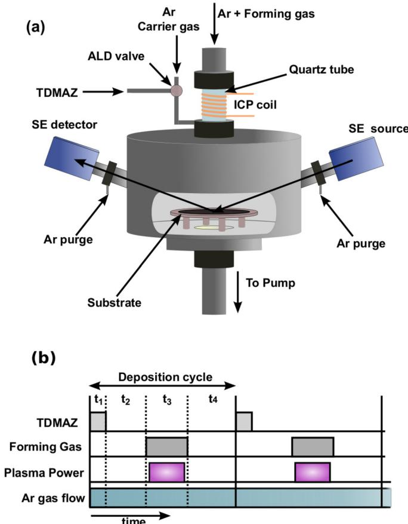
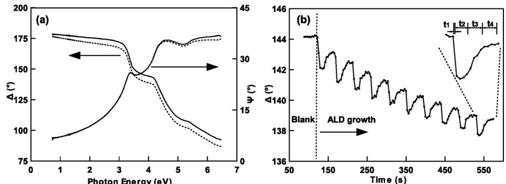
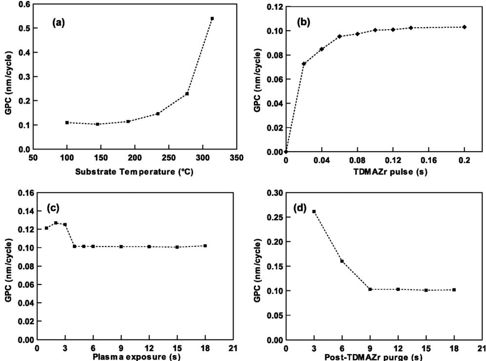
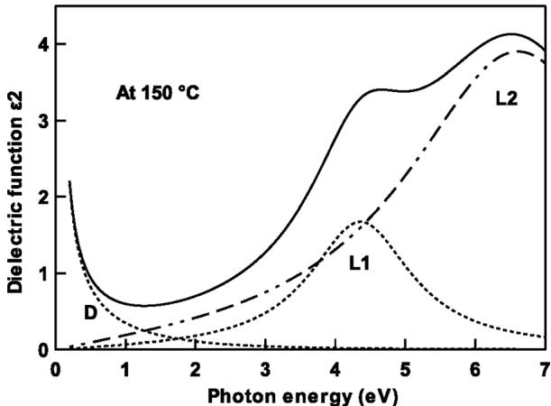
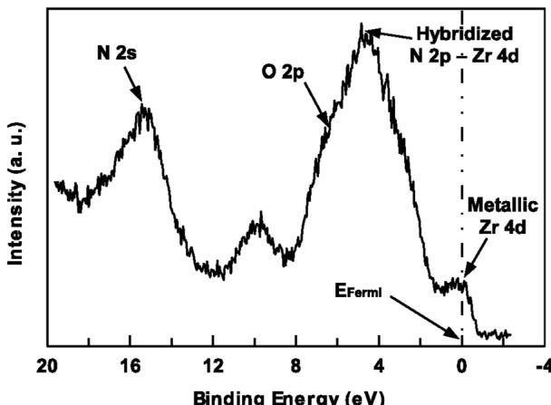
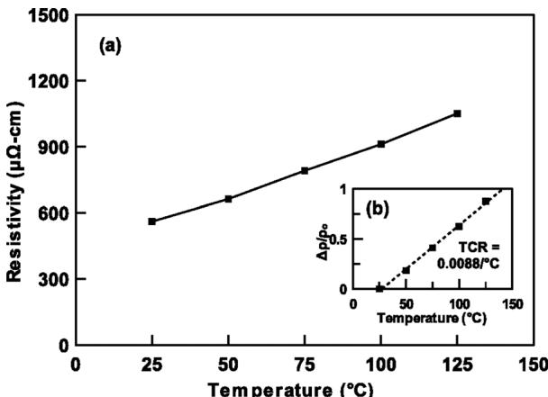

# Low temperature plasma enhanced atomic layer deposition of conducting zirconium nitride films using tetrakis (dimethylamido) zirconium and forming gas  $(5\% \text{H}_2 + 95\% \text{N}_2)$  plasma  $\odot$

Triratna Muneshwar; Ken Cadien

Check for updates

J. Vac. Sci. Technol. A 33, 031502 (2015) https://doi.org/10.1116/14915122

# Articles You May Be Interested In

Role of trace moisture in low temperature thermal ALD of titanium dioxide using tetrakis(dimethylamido) titanium (IV) and molecular oxygen

J. Vac. Sci. Technol. A (May 2025)

Surface spectroscopic studies of the deposition of TiN thin films from tetrakis-(dimethylamido)- titanium and ammonia

J. Vac. Sci. Technol. A (May 1995)

Time- resolved surface infrared spectroscopy during atomic layer deposition of  $\mathrm{TiO}_2$  using tetrakis(dimethylamido)titanium and water

J. Vac. Sci. Technol. A (April 2014)

# Low temperature plasma enhanced atomic layer deposition of conducting zirconium nitride films using tetrakis (dimethylamido) zirconium and forming gas  $(5\% \text{H}_2 + 95\% \text{N}_2)$  plasma

Triratna Muneshwar $^{a)}$  and Ken Cadien  Department of Chemical and Materials Engineering, University of Alberta, Edmonton, Alberta T6G 2V4, Canada

(Received 21 December 2014; accepted 2 March 2015; published 17 March 2015)

Zirconium nitride  $(\mathrm{ZrN})$  has the lowest bulk electrical resistivity and high thermal stability among group IV and V transition metal nitrides, which makes it a promising material for ULSI applications such as a diffusion barrier for  $\mathrm{Cu}$  interconnects, contact metal in III- V semiconductor devices, and in high density memory structures. Plasma enhanced atomic layer deposition (PEALD) of conducting  $\mathrm{Zn}$  thin films using  $\mathrm{Zr[N(CH_3)_2]_4}$  and forming gas  $(5\% \mathrm{H}_2 + 95\% \mathrm{N}_2)$  plasma is reported in this article. The growth per cycle (GPC) for every deposition was determined from analysis of dynamic in- situ spectroscopic ellipsometry  $(d - iSE)$  measurements. An experimental design is proposed for faster determination of ALD growth saturation curves. At substrate temperature of  $150^{\circ}\mathrm{C}$ , a GPC of  $0.10\mathrm{nm}$  cycle was observed for self- limiting  $\mathrm{Zn}$  PEALD growth. The electrical resistivity of  $\mathrm{ZnN}$  films deposited on  $\mathrm{SiO}_2$  substrate was found to be  $559.5\pm 18.5\mu \Omega$  cm with negligible change in resistivity even after  $\sim 1000\mathrm{h}$  exposure to air. The metallic behavior of our  $\mathrm{ZnN}$  films was evident from the free electron dispersion component in dielectric response, the broad band of photoelectron emission across Fermi level and the positive temperature coefficient for resistivity of  $0.0088 / ^{\circ}\mathrm{C}$ . © 2015 American Vacuum Society. [http://dx.doi.org/10.1116/1.4915122]

# I. INTRODUCTION

Zirconium nitride, a group- IV transition metal nitride, is an interesting material because of its exceptional mechanical, chemical, and electrical properties. The metallic mononitride  $(\mathrm{ZrN})$  with bulk resistivity  $\sim 13.6\mu \Omega \mathrm{cm}$  is the most stable phase; however, a metastable nitrogen- rich  $(\mathrm{Zr}_3\mathrm{N}_4)$  phase with bandgap of  $\sim 2.2\mathrm{eV}$  have also been reported. Conventionally,  $\mathrm{ZnN}$  films have been investigated as wear resistant coatings, optical coatings, functional multilayers, high- temperature superconductors, thermoelectrics, etc. The lowest bulk electrical resistivity and high thermal stability among group IV and V transition metal nitrides makes  $\mathrm{ZnN}$  a promising material for ULSI applications like diffusion barrier for  $\mathrm{Cu}$  interconnects, as contact metal in III- V semiconductor devices, and in high density memory structures. These modern applications require deposition of only few nanometers thick  $\mathrm{ZnN}$  films over nonplanar high- aspect ratio features spread over large substrate area. With atomic layer deposition (ALD) technique, uniform thin films deposition with excellent step- coverage could be realized over large area substrates. Also, as the ALD growth occurs from the repetition of alternating complementary surface reactions, the film thickness could be precisely controlled within a fraction of a nanometer. In comparison with physical vapor and chemical vapor techniques for  $\mathrm{ZnN}$  deposition, very limited data are available on  $\mathrm{ZnN}$  growth by ALD.

Amine based metal- organic precursors are extensively applied in ALD because of their higher reactivity and noncorrosive by- products from their surface reactions. Moreover, for deposition of conducting  $\mathrm{ZnN}$  films, reduction of the zirconium atom is required from  $\mathrm{Zr^{4 + }}$  state in  $\mathrm{Zr[N(CH_3)_2]_4}$  (TDMAZr) precursor to  $\mathrm{Zr^{3 + }}$  in ALD grown films. Use of ammonia or  $\mathrm{N}_2$  plasma in ALD of similar metal nitrides was found to be less effective in the reduction of metal atom, resulting in growth of N- rich high resistivity phase. Deposition of conducting nitride phase using H- containing reactant plasma has been reported. Hence, the application of  $5\%$ $\mathrm{H}_2$  containing forming gas plasma was expected to enable deposition of conducting  $\mathrm{ZnN}$  PEALD films at low temperatures and also suppress carbide phase formation.

Thin film growth in ALD is characterized by growth per cycle (GPC), typically of the order  $0.01 - 0.10\mathrm{nm}$  cycle, is determined from a linear fit between ALD grown film thickness and the number of deposition cycles. In- situ characterization techniques have been shown to be beneficial in the study of ALD reaction mechanism and rapid process development.

Determination of ALD cycle parameters for self- limiting growth is crucial in the development of new deposition recipes. A grid- search approach, considering all possible combinations of deposition cycle parameters would be a strenuous task. Moreover, these parameters exhibit interdependence in the nonsaturated surface reaction regime and at temperatures where the surface reactions are not the primary mechanism for film growth. Hence, a systematic scheme of experiments is desired for simultaneous determination of growth saturation conditions with respect to precursor/reactant doses, inert gas purges, and ALD temperature window from reduced number of experiments for faster ALD process development.

In this article, we present recipe development and material characterization of plasma- enhanced ALD (PEALD)  $\mathrm{ZnN}$  films using TDMAZr precursor and forming gas

$(5\% \mathrm{H}_2 + 95\% \mathrm{N}_2)$  reactant plasma. GPC for every deposition was determined from the analysis of dynamic in- situ SE data. Based on the fundamental self- limiting nature of ALD reactions at sufficiently long precursor/reactant exposures and inert gas purges, an experimental design is presented for rapid process development. The ZrN PEALD films deposited with growth saturation conditions were characterized using in- situ SE, x- ray reflectivity (XRR), valence band x- ray photoelectron spectroscopy (VB- XPS), and van der Pauw sheet resistance measurements.

# II. EXPERIMENTAL SETUP AND CHARACTERIZATION

ZrN films were grown in continuous flow ALD reactor as shown in Fig. 1(a) (Kurt J. Lesker, ALD150LX), using TDMAZr (Sigma Aldrich) and forming gas  $(5\% \mathrm{H}_2 - 95\% \mathrm{N}_2$  gas, Praxair) reactant plasma. During deposition, a continuous  $\sim 1000$  sccm flow of Ar  $(99.999\%$  purity, Praxair) was maintained through the reactor using mass flow controllers (MKS Instrument), leading to a total pressure of 1.04 Torr, to facilitate and confine transport of TDMAZr molecules and plasma radicals at the substrate. For in- situ growth characterization, the reactor chamber is provided with optical ports that are maintained clean by continuous Ar purging. The precursor pulse and plasma exposure sequence used for ZrN PEALD growth is schematically represented in Fig. 1(b).

  
FIG. 1. (Color online) (a) ALD150LX reactor design schematic highlighting TDMAZr and forming gas delivery lines and the M2000DI spectroscopic ellipsometer for in-situ ALD growth characterization. (b) Precursor and plasma pulsing sequence for a ZrN PEALD cycle.

For the precursor half- reaction, a precise dose (pulse length  $= \mathrm{t}_1$ ) of TDMAZr molecules from stainless steel ampoule  $(75^{\circ}\mathrm{C})$  was introduced into the reactor through delivery line  $(110^{\circ}\mathrm{C})$  under continuous carrier gas flow (40 sccm Ar) using an electronically controlled three- port ALD diaphragm valve at  $75^{\circ}\mathrm{C}$  (Swagelok). In the plasma half- reaction step, 60 sccm flow of forming gas was released into the reactor under continuous carrier gas flow (100 sccm Ar) through the quartz tube as shown in Fig. 1(a). On reactor pressure stabilization, the remote inductively coupled plasma (ICP) was ignited (exposure length  $= \mathrm{t}_3$ ) using  $13.56\mathrm{MHz}$  RF power source in combination with a matching network. After every precursor and plasma half- reactions, the reactor was purged with continuous Ar flow for duration  $\mathrm{t}_2$  and  $\mathrm{t}_4$  respectively, thus preventing undesired gas- phase reactions because of the residual reactive species. The possibility of secondary precursor source resulting from condensed TDMAZr molecules within the reactor was eliminated by maintaining delivery lines and reactor walls at higher temperatures.

The ZrN films were deposited on p- type Si (111) and thermally grown  $\sim 500\mathrm{nm}$  thick  $\mathrm{SiO}_2$  substrates. The diced substrates were cleaned in a Piranha solution, a mixture of concentrated  $\mathrm{H}_2\mathrm{SO}_4$  and  $\mathrm{H}_2\mathrm{O}_2$  in 2:1 volume ratio and securely stored in air- tight containers until deposition. Since RF treatment was not performed, presence of a native  $\mathrm{SiO}_2$  layer over Si (111) substrates was accounted for in the growth characterization. For deposition these substrates were placed on substrate holder (4- in. dia.) and transferred into the ALD reactor through a load- lock evacuated down to  $5\times 10^{- 5}$  Torr. Prior to ZrN deposition, the substrate surface was treated with  $30\mathrm{s}$  reactant gas plasma.

The ALD growth was monitored in real- time with dynamic in- situ spectroscopic ellipsometry (d- iSE) measurements at fixed angle of  $70^{\circ}$  using a rotating- compensator ellipsometer (J. A. Woollam, M2000DI) in the spectral range of  $0.73 - 6.4\mathrm{eV}$ . Accounting for the substrate temperature effects in the d- iSE data analysis, the determined film thickness against the number of deposition cycle was used in GPC calculation and applied for process development.

At a constant  $600\mathrm{W}$  plasma, the ZrN PEALD process was studied for growth saturation with respect to substrate temperature  $(\mathrm{T}_{\mathrm{sub}})$ , TDMAZr pulse  $(\mathrm{t}_1)$ , plasma exposure  $(\mathrm{t}_3)$ , and inert gas purges  $(\mathrm{t}_2$  and  $\mathrm{t}_4$ . With the process parameters for self- limiting growth, thicker ZrN films  $(\geq 30\mathrm{nm})$  were characterized for their material properties. The complex dielectric function  $(\epsilon)$  and thickness  $(d)$  of PEALD grown ZrN film was determined from the iSE measurement. The Fermi level electronic structure of ZrN films was analyzed from VB- XPS spectrum measured using Axis Ultra Spectrometer (140 W, 1486.6 eV Al  $K\alpha$  source) from Kratos Analytical. To corroborate iSE data analysis, thickness of ZrN films was also determined from XRR measurements on Rigaku Ultima IV (Ref. 45) using Cu  $K\alpha$  x- rays  $(\lambda = 0.1542\mathrm{nm})$  and analyzed with the GenX software. The electrical sheet resistance  $(R_S)$  for ZrN PEALD films grown on thermal  $\mathrm{SiO}_2$  substrate was determined from van der Pauw measurements using Keithley 4200 SCS parameter

analyzer. Electrical resistivity of  $\mathrm{ZrN}$  films was obtained from the product of sheet resistance  $(R_{S})$  and film thickness  $(d)$ . The temperature coefficient of resistivity (TCR) was also determined to investigate electrical conduction in PEALD grown  $\mathrm{ZrN}$  films.

# III. RESULTS AND DISCUSSION

# A. Dynamic in-situ se data and analysis

Spectroscopic ellipsometry is a powerful surface sensitive characterization technique47,48 widely applied for simultaneous determination of film thickness and its dielectric constants.49- 59 As the surface chemistry changes with every precursor and plasma half- reactions during ALD, it was essential to use short acquisition times for dynamic iSE  $(d - iSE)$  measurements. The  $d - iSE$  parameters  $(\Psi ,\Delta)$  were acquired at 712 wavelengths over entire spectral range of M2000DI using two- zone measurements51 with total acquisition time of  $3\mathrm{s}$  per SE spectrum. The SE parameter  $(\Psi ,\Delta)$  spectrum measured on blank Si substrate and after 10 cycles of sample  $\mathrm{ZrN}$  deposition  $(\mathrm{t}_1 = 0.12\mathrm{s}$ $\mathrm{t}_2 = 15\mathrm{s}$ $\mathrm{t}_3 = 15\mathrm{s}$  ,and  $\mathrm{t}_4 = 15\mathrm{s}$  on Si substrate at  $150^{\circ}\mathrm{C}$  is shown in Fig.2(a). The measured iSE parameter  $\Delta$  at single wavelength corresponding to  $4.0\mathrm{eV}$  as a function of deposition time is illustrated in Fig.2(b) for the first ten deposition cycles. As  $\Delta$  is more sensitive to surface conditions than  $\Psi ,^{52}$  with every TDMAZr pulse and plasma exposure, systematic variations in  $\Delta$  were observed as emphasized in Fig.2(b). Since the steady  $d - iSE$  parameters measured during postplasma Ar purge  $(\mathrm{t}_4)$  strictly represent the SE response from ALD grown material, only these spectra were analyzed for growth characterization.

The thin film dielectric constants differ from the bulk values because of finite size effects.53,54 Hence, a parameterized dielectric function55- 57 expressed as

$$
\epsilon = \epsilon_{\infty} - \frac{E_p^2}{E^2 - i\cdot\Gamma_rE} +\sum_{n = 1}^{2}\frac{f_nE_n^2}{E_n^2 + i\cdot\Gamma_nE - E^2} \tag{1}
$$

was used for  $\mathrm{ZrN}$  PEALD films, where free electron absorption is expressed by Drude dispersion (plasma energy  $E_{p}$  and relaxation energy  $\Gamma_r)$  and the interband optical transitions are represented by the Lorentz oscillators (oscillator strength

$f,$  dampening coefficient  $\Gamma$  and center energy  $E_{o}$  ).A constant  $\epsilon_{\infty}$  is used to account for other optical transitions not included in Eq.1).

Although the term ALD suggests a complete monolayer formation with every deposition cycle, in reality only a partial monolayer forms at the surface.24,58 Analysis of SE data considering submonolayer ALD growth is beyond scope of this article and was reported in our recent publication.59

However, following47,48 the partial surface monolayer was approximated as a continuous film with coverage dependent average thickness in the analysis. The  $\mathrm{ZrN}$  PEALD film/substrate was modeled as a three- layered stack consisting of  $\mathrm{ZrN}$  films  $(\epsilon_{\mathrm{ZrN}},d_{\mathrm{ZrN}})$  , native  $\mathrm{SiO}_2$  layer  $(\epsilon_{\mathrm{ox}},d_{\mathrm{ox}})$  and semiinfinite Si substrate  $(\epsilon_{\mathrm{Si}})$  with their respective dielectric function  $\epsilon$  and thickness  $d$  . Native  $\mathrm{SiO}_2$ $(d_{\mathrm{ox}})$  layer thickness was determined from the iSE measurement prior to deposition. Applying model based iSE data analysis,49,50 the dielectric function  $(\epsilon)$  and thickness  $(d)$  of  $\mathrm{ZrN}$  film was determined using Completeease software package (ver. 4.48, J. A. Woollam). Thickness of  $\mathrm{ZrN}$  PEALD film determined from the d- iSE data analysis against the number of deposition cycles is shown in Fig. 3(a). When incorporated within iSE data analysis, the surface roughness was found to be  $\sim 0.01\mathrm{nm}$  without significant improvement in data fitting, and hence was neglected from the analysis.

In the early stages of  $\mathrm{ZrN}$  film growth, the ALD surface reactions takes place on the native  $\mathrm{SiO}_2$  surface layer of Si substrate initiated by the adsorption of TDMAZr molecules at the surface - OH sites, a heterogeneous or substrate- dependent ALD. Since HF treatment was not performed on the Si substrates, ample surface - OH active sites are readily available for  $\mathrm{ZrN}$  PEALD growth initiation, hence nucleation delay was not observed in Fig. 3(a). Whereas in the later stages of  $\mathrm{ZrN}$  PEALD, the film growth is sustained by the surface reactions on underlying ALD grown film, a homogeneous or substrate- independent ALD. This transition from substrate- dependent growth to substrate- independent growth is observed as a nonlinear growth over first 25 deposition cycles in agreement with the other reported ALD studies.60- 62

Figure 3(b) also shows comparison between the  $\mathrm{ZrN}$  PEALD thickness determined from the in- situ SE measurements (at  $150^{\circ}\mathrm{C}$ ) and ex- situ XRR measurements (at  $25^{\circ}\mathrm{C}$ )

  
FIG. 2. (a) SE parameters  $(\Psi ,\Delta)$  measured on blank Si substrate (solid line) and after 10 cycles  $\mathrm{ZrN}$  deposition (dotted line). (b) The dynamic SE parameter  $\Delta$  measured at  $4.0\mathrm{eV}$  for 10 cycles  $\mathrm{ZrN}$  deposition. Systematic variation in  $\Delta$  with precursor pulse  $(\mathrm{t}_1)$ , plasma exposure  $(\mathrm{t}_3)$ , and inert gas purges  $(\mathrm{t}_2$  and  $\mathrm{t}_4)$  are highlighted.

  
FIG. 3. (a) Film thickness vs number of PEALD cycles as determined from d-iSE data analysis for  $\mathrm{ZrN}$  deposition on Si substrate at  $\mathrm{T_{sub} = 150^{\circ}C}$ $\mathrm{t_1 = 0.12s}$ $\mathrm{t_2 = 15s}$ $\mathrm{t_3 = 15s}$  and  $\mathrm{t_4 = 15s}$  In a steady growth regime, GPC of  $0.10\mathrm{nm}$  cycle was determined from the linear fit (dashed lines). (b) Comparison between the film thicknesses determined from iSE at  $150^{\circ}\mathrm{C}$  and ex-situ XRR at room temperature on identical samples.

performed on identical samples. Both SE and XRR measurements showed that the film thickness was found to linearly increase with the number of deposition cycles. However, the difference in their respective thicknesses is attributed to the thermal expansion induced change in film thickness at different measurement temperatures as demonstrated in Ref. 63.

# B. ZrN peald growth saturation

An ideal ALD film growth occurs from repetition of complementary surface reaction sequence alone with each reaction allowed to attain surface saturation. Hence, for ALD, the substrate temperature should be such that it overcomes the activation barrier for surface reaction and also prevents condensation, desorption, or thermal decomposition of the reacting molecules at the substrate surface. A sufficiently large dose of precursor and reactant molecules in the respective reactions ensures that self- limiting surface saturation is achieved. Purging of ALD reactor following every surface reaction assures that excess unreacted molecules and the reaction by- products are successfully driven out of the reactor and prevents gas phase reactions during the next reaction step. Under self- limiting growth conditions, the substrate temperature  $(\mathrm{T_{sub}})$  and deposition cycle parameters  $(\mathrm{t_1 - t_4})$  are such that the material growth is preferential because of

ALD surface reactions; using the shortest precursor and reactant pulses  $(\mathrm{t_1}$  and  $\mathrm{t}_3$  for surface saturation; and with minimum inert gas purges  $\mathrm{t}_2$  and  $\mathrm{t}_4$  to prevent gas phase reactions.

While determining the temperature window for  $\mathrm{ZrN}$  PELALD growth, it is required to ensure that the surface reaction is neither affected by the limited dose of TDMAZr or plasma exposure nor by the insufficient inert gas purging. Also, to determine the effect of a single parameter  $(\mathrm{t_1},\mathrm{t_2},\mathrm{t_3}$  or  $\mathrm{t_4}$  on ALD growth saturation requires that the ALD growth is in steady- state with respect to other parameters. In the absence of a priori knowledge about the ALD surface reaction kinetics and/or molecular transport within the reactor, an initial "guess cycle" consisting of an arbitrarily high dose of TDMAZr  $(\mathrm{t_1 = 0.2s})$  long plasma exposure  $(\mathrm{t}_3 = 15\mathrm{s})$  and exceedingly long inert gas purges  $(\mathrm{t}_2 = 15\mathrm{s}$  and  $\mathrm{t}_4 = 15\mathrm{s}$  is selected such that surface saturation conditions and adequate reactor purging could be reasonably assumed. The deposition experiments were designed (see Table I) starting with the "guess cycle" and varying single test parameter in every set of experiments. Application of this "top- down" approach eliminates interdependence between cycle parameters caused by limited TDMAZr, short plasma exposure or insufficient purging, thus enabling rapid ALD process development from lesser number of experiments. The assumed saturation growth condition with selected guess cycle was later verified.

In first set of experiments (set 1 in Table I) using the guess cycle, ZrN PEALD films were deposited at substrate temperatures varied between 100 and  $350^{\circ}\mathrm{C}$ . A steady GPC of  $0.11\mathrm{nm}$  cycle in Fig. 4(a) at substrate temperatures below  $200^{\circ}\mathrm{C}$  shows that the  $\mathrm{ZrN}$  growth is primarily driven by surface reaction alone. The observed increase in GPC at temperatures above  $200^{\circ}\mathrm{C}$  indicates the onset of thermal self- deposition for TDMAZr molecules. The optimal temperature window of  $100 - 200^{\circ}\mathrm{C}$  determined for  $\mathrm{ZrN}$  PEALD growth is consistent with the similar reported studies. In the following experiments, the substrate temperature was fixed at  $150^{\circ}\mathrm{C}$ .

In the next set of experiments (set 2 in Table I), the minimum precursor dose for surface saturation was determined from  $\mathrm{ZrN}$  deposition with  $\mathrm{T_{sub} = 150^{\circ}C}$  and TDMAZr pulse  $(\mathrm{t_1})$  varied between 0.02 and 0.20 s. As shown in Fig. 4(b), the GPC was found to increase with TDMAZr dose until a

TABLE I. ALD process development for self-limiting  $\mathrm{ZrN}$  growth with respect to, substrate temperature  $(\mathrm{T_{sub}})$  , TDMAZr pulse  $(\mathrm{t_1})$  , Ar purge  $(\mathrm{t}_2)$  , plasma exposure  $(\mathrm{t}_3)$  , and Ar purge  $(\mathrm{t_4})$  . From the characteristic ALD growth curves with single variable parameter  $(^{*})$  , its optimum range for self-limiting growth is determined and used in following experiments.  

<table><tr><td># Set</td><td>Test parameter</td><td>Test range</td><td>ALD cyclea t1 - t2 - t3 - t4 (s)</td><td>Tsub(℃)</td><td>Parameter rangeb</td></tr><tr><td>1</td><td>Tsub</td><td>100–350℃</td><td>0.20 – 15 – 15 – 15</td><td>(Tsub)*</td><td>100℃ ≤ Tsub ≤ 200℃</td></tr><tr><td>2</td><td>t1</td><td>0.02–0.20 s</td><td>(t1)* – 15 – 15 – 15</td><td>150</td><td>t1 ≥ 0.10 s</td></tr><tr><td>3</td><td>t3</td><td>1–8 s</td><td>0.10 – 15 – (t3)* – 15</td><td>150</td><td>t3 ≥ 4 s</td></tr><tr><td>4</td><td>t2</td><td>3–18 s</td><td>0.10 – (t2)* – 9 – 15</td><td>150</td><td>t2 ≥ 9 s</td></tr><tr><td>5</td><td>t4</td><td>3–18 s</td><td>0.10 – 12 – 9 – (t4)*</td><td>150</td><td>t4 ≥ 3 s</td></tr></table>

aIn each set of experiment, the test parameter (marked with \*) was varied within the test range. bALD cycle with  $\mathrm{t_1 = 0.10s}$ $\mathrm{t}_2 = 12\mathrm{s}$ $\mathrm{t_3 = 9s}$  ,and  $\mathrm{t_4 = 9s}$  , was chosen for self-limiting  $\mathrm{ZrN}$  PEALD growth.

  
FiG.4. rPRA  t  t  t  t cursor Ar purge. The process parameters for these depositions are stated in Table I.

steady value of  $0.10\mathrm{nm}$  cycle and showed that a minimum TDMAZr pulse of  $0.10\mathrm{s}$  is required to attain growth saturation with respect to TDMAZr surface reaction.

The active plasma species  $\mathrm{(H^*,N^*,NH^*,}$  etc.) in the forming gas ICP glow reacts with the surface chemisorbed TDMAZr molecules removing organic ligands with formation of  $\mathrm{ZrN}$  film. In the third set of experiments (set 3 in Table I), a minimum plasma exposure necessary for this reaction was determined from  $\mathrm{ZrN}$  depositions with  $\mathrm{T_{sub} = 150^{\circ}C}$ $\mathrm{t_1 = 0.10s}$  varying the plasma exposure between 1 and  $18\mathrm{s}$  As seen in Fig.4(c), the GPC value was higher at plasma exposures below  $4\mathrm{s}$  but attained a steady value of  $0.10\mathrm{nm}$  cycle at longer exposures. Higher GPC at short plasma exposures are attributed to the inclusion of partially removed organic ligands within growing film.65,66 Although  $4\mathrm{s}$  plasma exposure was sufficient for plasma reaction, plasma exposure of  $9\mathrm{s}$  was used in the following experiments.

In the fourth set of experiments (set 4 in Table I), a minimum of Ar purge following a TDMAZr pulse necessary for preventing gas- phase reaction was determined from  $\mathrm{ZrN}$  deposition with  $\mathrm{T_{sub} = 150^{\circ}C}$ $\mathrm{t_1 = 0.10s}$ $\mathrm{t_3 = 9s}$  varying the postprecursor Ar purge between 3 and  $18\mathrm{s}$  As shown in Fig.4(d), the GPC was found to decrease with the purge duration but attained a steady value of  $0.10\mathrm{nm}$  cycle at longer purges. Higher GPC at shorter purge lengths are attributed to the inclusion of products from gas- phase reaction into growing film. Although a  $9\mathrm{s}$  Ar purge was found to be sufficient for effective removal of excess unreacted TDMAZr molecules from reactor along with their reaction by- products, post- TDMAZr purge of  $12\mathrm{s}$  was used in the following experiments.

In the following set of experiments (set 5 in Table I), the effect of postplasma purge on the GPC was studied for  $\mathrm{ZnN}$  depositions with  $\mathrm{T_{sub} = 150^{\circ}C}$ $\mathrm{t_1 = 0.10s}$ $\mathrm{t_2 = 12s}$ $\mathrm{t_3 = 9s}$  varying the postplasma Ar purge between 3 and  $18\mathrm{s}$  Negligible effect of postplasma Ar purge duration was observed on  $\mathrm{ZrN}$  PEALD growth with GPC of  $0.10\mathrm{nm}$  cycle, which is attributed to the short life- time of plasma radicals and efficient removal of their reaction by- products.67 However, a  $9\mathrm{s}$  long postplasma Ar purge was used to allow multiple  $d$ - iSE measurements at the end of every ALD cycle.

Comparing the initial guess cycle  $\mathrm{t_1 = 0.20s}$ $\mathrm{t_2 = 15s}$ $\mathrm{t_3 = 15s}$  and  $\mathrm{t_4 = 15s}$  with experimentally determined deposition cycle  $\mathrm{t_1 = 0.10s}$ $\mathrm{t_2 = 12s}$ $\mathrm{t_3 = 9s}$  and  $\mathrm{t_4 = 9s}$  for self- limiting growth, the guess cycle was found to be a reasonably good assumption for  $\mathrm{ZnN}$  PEALD process development. Also, in the selected PEALD cycle, the respective TDMAZr pulse, plasma exposure and Ar purges are kept longer than necessary to account for any run- to- run variations in the deposition conditions.

# C. Characterization of ZRN PEALD films

Thicker  $\mathrm{ZnN}$  PEALD films were deposited under self- limiting growth conditions at  $150^{\circ}\mathrm{C}$  substrate temperature for material characterization. The imaginary part of complex dielectric function  $\epsilon = \epsilon_{1} - i\cdot \epsilon_{2}$  for  $35.3\mathrm{nm}$  thick  $\mathrm{ZnN}$  PEALD film determined from iSE film at  $150^{\circ}\mathrm{C}$  is shown in Fig. 5. The Drude component of dielectric function representing free electron dispersion was characterized by plasma energy of  $E_{p} = 0.92\pm 0.13\mathrm{eV}$  and relaxation energy of  $\Gamma_{r} = 1.95\pm 0.31\mathrm{eV}$ . The Lorentz oscillators representing the dielectric response from the bound charges were found

  
FIG. 5. Imaginary part of the complex dielectric function  $(\epsilon_{2})$  for  $35.3\mathrm{nm}$  thick  $\mathrm{ZrN}$  PEALD film at  $150^{\circ}\mathrm{C}$  determined from in-situ SE measurements. The free electron and bound electron contributions to the dielectric function of  $\mathrm{ZrN}$  film are represented by Drude (D) and Lorentz oscillators (L1 and L2), respectively.

to be centered at  $E_{1} = 4.45\pm 0.02\mathrm{eV}$  and  $E_{2} = 6.89$ $\pm 0.05\mathrm{eV}$  with  $f_{1} = 0.66\pm 0.07$ $\Gamma_{1} = 1.77\pm 0.09\mathrm{eV}$ $f_{2} = 2.17\pm 0.14$  ,and  $\Gamma_{2} = 3.92\pm 0.25\mathrm{eV}$  ,respectively. The Drude- Lorentz parameters determined at  $150^{\circ}\mathrm{C}$  for  $35.5\mathrm{nm}$  thick  $\mathrm{ZrN}$  PEALD films are in good agreement with the reported room- temperature dielectric function for  $\sim 500\mathrm{nm}$  thick sputtered  $\mathrm{ZrN}$  films with difference attributed to different sample preparation technique as described in Ref. 53.

The broad band of photoelectron emissions across Fermi level in the VB- XPS spectrum as shown in Fig. 6 represents the metallic behavior of  $\mathrm{ZrN}$  PEALD films and is in agreement with the VB spectrum reported for sputtered  $\mathrm{ZrN}$  films. Earlier reported studies states that the emission at Fermi level results from the pure metallic  $\mathrm{Zr4d}$  states, while the emission peaks at binding energy of 4 and  $15\mathrm{eV}$  were assigned to hybridized  $\mathrm{Zr4d - N2p}$  and  $\mathrm{N2s}$  states, respectively. The  $\mathrm{O2p}$  states in VB spectrum are associated with the surface oxidation of  $\mathrm{ZrN}$  PEALD films as were reported in Ref. 71. An emission peak at  $10\mathrm{eV}$  binding energy, also observed in Ref. 68, coincides with the C 2s states and shows presence of either carbide phase or

  
FIG. 6. Valence Band photoelectron emission spectrum measured for  $35.3\mathrm{nm}$  thick  $\mathrm{ZrN}$  PEALD film grown at  $150^{\circ}\mathrm{C}$ . Before XPS measurement  $\mathrm{ZrN}$  film surface was sputter cleaned for  $180\mathrm{s}$  with  $4.0\mathrm{keV}$ $\mathrm{Ar}^{+}$ ions.

interstitial C. Discussion and analysis of core- level XPS emission features from  $\mathrm{ZrN}$  PEALD film is beyond the scope of this paper and would be covered in later publications.

The electrical resistivity measurements of  $\mathrm{ZrN}$  PEALD films deposited on thermal  $\mathrm{SiO_2}$  substrates at  $150^{\circ}\mathrm{C}$  was found to be  $559.5\pm 18.5\mu \Omega \mathrm{cm}$  at ambience. The electrical resistivity showed negligible change even after  $\sim 1000\mathrm{h}$  exposure to air, similar to other PEALD studies. The measured resistivity for our films is comparable with the lowest reported resistivity  $\sim 400\mu \Omega \mathrm{cm}$  for  $\mathrm{ZrN}$  PEALD on Si at  $300^{\circ}\mathrm{C}$  using TDEAZr and  $\mathrm{N}_2$  plasma. The electrical resistivity of  $\mathrm{ZrN}$  films determined at different measurement temperatures are plotted in Fig. 7(a). The temperature dependent change in electrical resistivity,  $\Delta \rho = \rho (\mathrm{T}) - \rho (\mathrm{T}_o)$ , is expressed as  $\rho (\mathrm{T}) = \rho (\mathrm{T}_o)(1 + \alpha (\mathrm{T} - \mathrm{T}_o))$ , where  $\alpha$  is the TCR and  $\mathrm{T}_o$  is the reference temperature. The relative change in the resistivity for  $\mathrm{ZrN}$  PEALD films with respect to resistivity measured at  $25^{\circ}\mathrm{C}$  is plotted in Fig. 7(b). The positive TCR of  $0.0088 / ^{\circ}\mathrm{C}$  indicates metallic conduction in  $\mathrm{ZrN}$  PEALD films.

# IV. CONCLUSION

Self- limiting  $\mathrm{ZrN}$  PEALD growth with TDMAZr precursor and forming gas reactant plasma using dynamic in- situ SE measurements has been reported. A scheme for rapid ALD process development from a reduced number of depositions is proposed. In the temperature range of  $100 - 200^{\circ}\mathrm{C}$ , the  $\mathrm{ZrN}$  growth was found to be primarily driven by surface reactions. At  $600\mathrm{W}$  plasma and deposition temperature of  $150^{\circ}\mathrm{C}$ , a  $\mathrm{ZrN}$  PEALD growth saturation at  $\mathrm{GPC}$  of  $0.10\mathrm{nm / cycle}$  was observed for deposition cycle:  $\mathrm{t}_1 = 0.10\mathrm{s}$ $\mathrm{t}_2 = 12\mathrm{s}$ $\mathrm{t}_3 = 9\mathrm{s}$ , and  $\mathrm{t}_4 = 9\mathrm{s}$ . The metallic behavior of grown  $\mathrm{ZrN}$  films was evident from the dielectric constants, the valence- band XPS spectrum, and positive temperature coefficient of electrical resistivity. For  $\mathrm{ZrN}$  PEALD films grown on  $\mathrm{SiO_2}$  substrates at  $150^{\circ}\mathrm{C}$ , electrical resistivity was found to be  $559.5\pm 18.5\mu \Omega$  cm with negligible change even after  $\sim 1000\mathrm{h}$  exposure to air. The  $5\%$ $\mathrm{H}_2$  containing forming gas reactant plasma was found to be effective in the reduction of  $\mathrm{Zr^{4 + }}$  in TDMAZr to  $\mathrm{Zr^{3 + }}$  in

  
FiG. 7. (a) Electrical resistivity of  $\mathrm{ZrN}$  PEALD films deposited on thermal  $\mathrm{SiO_2}$  substrate at  $150^{\circ}\mathrm{C}$ , as a function of measurement temperature. (b) Plot of  $\Delta \rho /\rho_{\mathrm{o}}$  vs measurement temperature showing TCR of  $0.0088 / ^{\circ}\mathrm{C}$  for  $\mathrm{ZrN}$  films.

ZrN films. Process optimization using variables such as plasma power and substrate temperature is expected to significantly improve electrical conduction in ZrN PEALD films.

# ACKNOWLEDGMENTS

The authors would like to thank Alberta Innovates Technology Futures Scholar Award and NSERC Discovery Grant for funding this research.

$^1\mathrm{H}$  O. Pierson, Handbook of Refractory Carbides and Nitrides: Properties, Characteristics, Processing, and Applications (Noyes Publications, Park Ridge, NJ, 1996).  $^2\mathrm{E}$  Gribaudo, D. Arias, and J. Abolata, J. Phase Equilib. 15, 441 (1994).  $^3\mathrm{T}$  Chihi, M. Fatmi, B. Ghebouli, and M. Guemmaz, Solid State Sci. 13, 1414 (2011).  $^4\mathrm{D}$  I. Bazhanov, A. A. Knizhnik, A. A. Safonov, A. A. Bagatur'yants, M. W. Stoker, and A. A. Korkin, J. Appl. Phys. 97, 044108 (2005).  $^5\mathrm{L}$  Porte, Solid State Commun. 50, 303 (1984).  $^6\mathrm{P}$  Prieto, J. Vac. Sci. Technol., A 14, 3181 (1996).  $^7\mathrm{J}$  Sanz, L. Soriano, P. Prieto, G. Tyuliev, C. Morant, and E. Elizalde, Thin Solid Films 332, 209 (1998).  $^8\mathrm{A}$  Fragiel, M. H. Staia, J. Munioz- Saldania, E. S. Puchi- Cabrera, C. CortesEscobedo, and L. Cota, Surf. Coat. Technol. 202, 3653 (2008).  $^9\mathrm{V}$  Braic, M. Balaceanu, and M. Braic, International Semiconductor Conference (IEEE, 2008), pp. 267- 270.  $^{10}\mathrm{W}$  Meng, G. Eesley, and K. Svinarich, Phys. Rev. B 42, 4881 (1990).  $^{11}\mathrm{W}$  J. Meng, D. T. Morelli, D. M. Roessler, and J. Heremans, J. Appl. Phys. 69, 846 (1991).  $^{12}\mathrm{W}$  J. Meng, J. Vac. Sci. Technol., A 10, 1610 (1992).  $^{13}\mathrm{I}$  Hase and Y. Nishihara, Phys. Rev. B 60, 1573 (1999).  $^{14}\mathrm{J}$  Adachi, K. Kurosaki, M. Uno, and S. Yamanaka, J. Alloys Compd. 399, 242 (2005).  $^{15}\mathrm{B}$  Saha, J. Acharya, T. D. Sands, and U. V. Waghmare, J. Appl. Phys. 107, 033715 (2010).  $^{16}\mathrm{M}$  B. Takeyama, A. Noya, and K. Sakanishi, J. Vac. Sci. Technol., B 18, 1333 (2000).  $^{17}\mathrm{C}$  S. Chen, C.- P. Liu, H.- G. Yang, and C. Y. A. Tsao, J. Vac. Sci. Technol., B 22, 1075 (2004).  $^{18}\mathrm{L}$  C. Leu, P. Sadik, D. P. Norton, L. McElwee- White, and T. J. Anderson, J. Vac. Sci. Technol., B 26, 1723 (2008).  $^{19}\mathrm{S}$  E. Mohney, B. P. Luther, S. D. Wolter, T. N. Jackson, R. F. Karlicek, and R. S. Kern, Fourth International High Temperature Electronics Conference, HITEC (IEEE, 1998), pp. 134- 137.  $^{20}\mathrm{J}$  Westlinder, J. Malmstrom, G. Sjoblom, and J. Olsson, Solid- State Electron. 49, 1410 (2005).  $^{21}\mathrm{S}$  Horita, T. Toda, and H. Kasagawa, J. Korean Phys. Soc. 42, 1142 (2003).  $^{22}\mathrm{V}$  Miikkulainen, M. Keskelä, M. Ritala, and R. L. Puurunen, J. Appl. Phys. 113, 021301 (2013).  $^{23}\mathrm{S}$  M. George, Chem. Rev. 110, 111 (2010).  $^{24}\mathrm{R}$  L. Puurunen, J. Appl. Phys. 99, 121301 (2005).  $^{25}\mathrm{N}$  Farkas, G. Zhang, R. D. Ramsier, E. A. Evans, and J. A. Dagata, J. Vac. Sci. Technol., A 26, 297 (2008).  $^{26}\mathrm{K}$  DongHo, K. ChulMin, K. EunHong, S. YoungChul, K. TaeGeun, R. CheongHyun, and H. Cheol- Koo, J. Korean Phys. Soc. 55, 1149 (2009).  $^{27}\mathrm{B}$  O. Johansson, H. T. G. Hentzell, J. M. E. Harper, and J. J. Cuomo, J. Mater. Res. 1, 442 (2011).  $^{28}\mathrm{R}$  P. Netterfield, P. J. Martin, and D. R. McKenzie, J. Mater. Sci. Lett. 9, 972 (1990).  $^{29}\mathrm{A}$  Straboni, L. Pichon, and T. Girardeau, Surf. Coat. Technol. 125, 100 (2000).  $^{30}\mathrm{K}$  Sugiyama, J. Electrochem. Soc. 122, 1545 (1975).  $^{31}\mathrm{D}$  M. Hoffman, Polyhedron 13, 1169 (1994).  $^{32}\mathrm{R}$  Fix, R. G. Gordon, and D. M. Hoffman, Chem. Mater. 3, 1138 (1991).  $^{33}\mathrm{H}$  Wendel and H. Suhr, Appl. Phys. A 54, 389 (1992).  $^{34}\mathrm{J}$  S. Becker, E. Kim, and R. G. Gordon, Chem. Mater. 16, 3497 (2004).  $^{35}\mathrm{S}$  Cho, K. Lee, P. Song, H. Jeon, and Y. Kim, Jpn. J. Appl. Phys., Part 1 46, 4085 (2007).

$^{36}\mathrm{M}$  Ritala, P. Kalsi, D. Riihelä, K. Kuki, M. Leskelä, and J. Jokinen, Chem. Mater. 11, 1712 (1999).  $^{37}\mathrm{H}$  Kim, C. Detavenier, O. van der Straten, S. M. Rossnagel, A. J. Kellock, and D.- G. Park, J. Appl. Phys. 98, 014308 (2005).  $^{38}\mathrm{P}$  Caubet et al., J. Electrochem. Soc. 155, H625 (2008).  $^{39}\mathrm{E}$  J. Kim and D.- H. Kim, Electrochem. Solid- State Lett. 9, C123 (2006).  $^{40}\mathrm{E}$  Langereis, H. C. M. Knoops, A. J. M. Mackus, F. Roozeboom, M. C. M. van de Sanden, and W. M. M. Kessels, J. Appl. Phys. 102, 083517 (2007).  $^{41}\mathrm{J}$  S. Park, M.- J. Lee, C.- S. Lee, and S.- W. Kang, Electrochem. Solid- State Lett. 4, C17 (2001).  $^{42}\mathrm{K}$  Knapas and M. Ritala, Crit. Rev. Solid State Mater. Sci. 38, 167 (2013).  $^{43}\mathrm{J}$  Niinisto, A. Rahtu, M. Putkonen, M. Ritala, M. Leskelä, and L. Niinisto, Langmuir 21, 7321 (2005).  $^{44}\mathrm{E}$  Langereis, S. B. S. Heil, H. C. M. Knoops, W. Keuning, M. C. M. van de Sanden, and W. M. M. Kessels, J. Phys. Appl. Phys. 42, 073001 (2009).  $^{45}\mathrm{M}$  Yasaka, Rigaku J. 26, 1 (2010).  $^{46}\mathrm{M}$  Bjorck and G. Andersson, J. Appl. Crystallogr. 40, 1174 (2007).  $^{47}\mathrm{G}$  A. Bootsma and F. Meyer, Surf. Sci. 14, 52 (1969).  $^{48}\mathrm{F}$  H. P. M. Habraken, O. L. J. Gijzeman, and G. A. Bootsma, Surf. Sci. 96, 482 (1980).  $^{49}\mathrm{H}$  Fujiwara, Spectroscopic Ellipsometry: Principles and Applications (Wiley, West Sussex, UK, 2007).  $^{50}\mathrm{H}$  G. Tompkins and E. A. Irene, Handbook of Ellipsometry (William Andrew, New York, 2005).  $^{51}\mathrm{R}$  Kleim, L. Kuntzler, and A. E. Ghemmaz, J. Opt. Soc. Am. A 11, 2550 (1994).  $^{52}\mathrm{A}$  V. Tikhonravov, M. K. Trubetskov, E. Masetti, A. V. Krasilnikova, and J. V. Kochikov, Advances in Optical Interference Coating, edited by C. Amra and H. A. Macleod (1999), pp. 173- 182.  $^{53}\mathrm{A}$  Lehmuskero, M. Kuittinen, and P. Vahinmaa, Opt. Express 15, 10744 (2007).  $^{54}\mathrm{S}$  A. Kovalenko and M. P. Lisitsa, Semicond. Phys., Quantum Electron. Optoelectron. 4, 352 (2001), available at http://journal- spgeo.org.ua/n4_001/352_401. htm.  $^{55}\mathrm{C}$  G. Ribbing and A. Roos, Handbook of Optical Constants of Solids (Academic Press, Burlington, 1997), pp. 351- 369.  $^{56}\mathrm{D}$  Valerini, M. A. Signore, A. Rizzo, and L. Tapfer, J. Appl. Phys. 108, 083536 (2010).  $^{57}\mathrm{M}$  A. Signore, D. Valerini, L. Tapfer, G. Caretto, and A. Rizzo, J. Vac. Sci. Technol., A 29, 061507 (2011).  $^{58}\mathrm{R}$  L. Puurunen et al., J. Appl. Phys. 96, 4878 (2004).  $^{59}\mathrm{T}$  Muneshwar and K. Cadien, Appl. Surf. Sci. 328, 344 (2015).  $^{60}\mathrm{M}$  A. Alam and M. L. Green, J. Appl. Phys. 94, 3403 (2003).  $^{61}\mathrm{R}$  L. Puurunen and W. Vandervorst, J. Appl. Phys. 96, 7686 (2004).  $^{62}\mathrm{J}$  W. Lim, H.- S. Park, and S.- W. Kang, J. Electrochem. Soc. 148, C403 (2001).  $^{63}\mathrm{C}$  E. Bouldin, W. E. Wallace, G. W. Lynn, S. C. Roth, and W. L. Wu, J. Appl. Phys. 88, 691 (2000).  $^{64}\mathrm{I}$  W. Kim, S.- J. Kim, D.- H. Kim, H. Woo, M.- Y. Park, and S.- W. Rhee, Korean J. Chem. Eng. 21, 1256 (2004).  $^{65}\mathrm{Z}$  Fang, P. A. Williams, R. Odedra, H. Jeon, and R. J. Potter, J. Cryst. Growth 338, 111 (2012).  $^{66}\mathrm{H}$  Kim, A. J. Kellock, and S. M. Rossnagel, J. Appl. Phys. 92, 7080 (2002).  $^{67}\mathrm{J}$  Swerts, A. Delabie, M. M. Salimullah, M. Popovici, M.- S. Kim, M. Schaekers, and S. Van Elshocht, ECS Solid State Lett. 1, P19 (2012).  $^{68}\mathrm{I}$  Milošev, Surf. Sci. Spectra 5, 152 (1998).  $^{69}\mathrm{P}$  Prieto, L. Galán, and J. Sanz, Phys. Rev. B 47, 1613 (1993).  $^{70}\mathrm{A}$  L. Ivanovskii, N. I. Medvedeva, and S. V. Okatov, Inorg. Mater. 37, 459 (2001).  $^{71}\mathrm{P}$  Prieto, L. Galán, and J. M. Sanz, Surf. Interface Anal. 21, 395 (1994).  $^{72}\mathrm{K}$  Håkansson, H. Johansson, and L. Johansson, Phys. Rev. B 48, 2623 (1993).  $^{73}\mathrm{H}$  Ihara, M. Hirabayashi, and H. Nakagawa, Phys. Rev. B 14, 1707 (1976).  $^{74}\mathrm{J}$  S. Park, H.- S. Park, and S.- W. Kang, J. Electrochem. Soc. 149, C28 (2002).