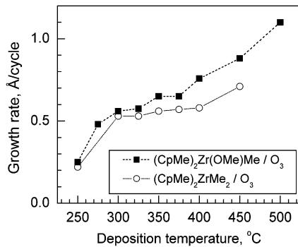
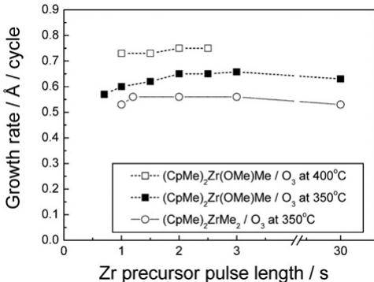
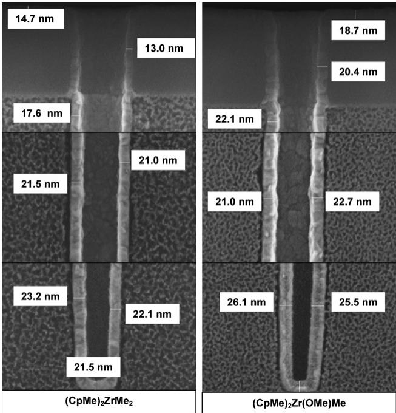
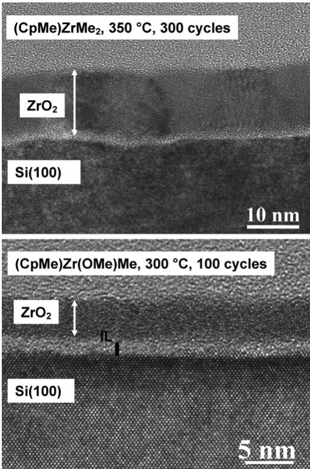
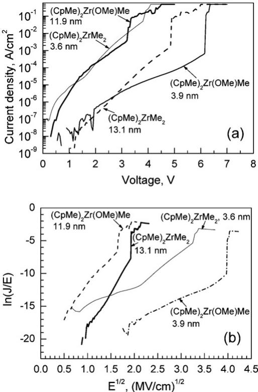

# Advanced cyclopentadienyl precursors for atomic layer deposition of  $\mathbf{ZrO}_2$  thin films

Jaakko Niinisto,\*a Kaupo Kukli,\*b Aile Tamm,\*b Matti Putkonen,\*c Charles L. Dezelah, IV,\*d Lauri Niinisto,\*e Jun Lu,\*f Fuquan Song,\*g Paul Williams,\*g Peter N. Heys,\*g Mikko Ritala\* and Markku Leskelaa

Received 13th February 2008, Accepted 6th May 2008 First published as an Advance Article on the web 10th June 2008 DOI: 10.1039/b802523a

$\mathrm{ZrO}_2$  thin films were grown onto silicon (100) substrates by atomic layer deposition (ALD) using novel cyclopentadienyl- type precursors, namely  $(\mathrm{CpMe})_2\mathrm{ZrMe}_2$  and  $(\mathrm{CpMe})_2\mathrm{Zr(OMe)Me}$ $\mathrm{Cp =}$  cyclopentadienyl,  $\mathrm{C}_5\mathrm{H}_5$  ) together with ozone as the oxygen source. Growth characteristics were studied in the temperature range of 250 to  $500^{\circ}\mathrm{C}$  An ALD- type self- limiting growth mode was verified for both processes at  $350^{\circ}\mathrm{C}$  where highly conformal films were deposited onto high aspect ratio trenches. Signs of thermal decomposition were not observed at or below  $400^{\circ}\mathrm{C}$  , a temperature considerably exceeding the thermal decomposition temperature of the  $\mathrm{Zr}$  - alkylamides. Processing parameters were optimised at  $350^{\circ}\mathrm{C}$  where deposition rates of 0.55 and  $0.65\mathrm{\AA}\mathrm{cycle}^{- 1}$  were obtained for  $(\mathrm{CpMe})_2\mathrm{ZrMe}_2 / \mathrm{O}_3$  and  $(\mathrm{CpMe})_2\mathrm{Zr(OMe)Me / O}_3$  , respectively. The films grown from both precursors were stoichiometric and polycrystalline with an increasing contribution from the metastable cubic phase with decreasing film thickness. In the films grown from  $(\mathrm{CpMe})_2\mathrm{ZrMe}_2$  , the breakdown field did not essentially depend on the film thickness, whereas in the films grown from  $(\mathrm{CpMe})_2\mathrm{Zr(OMe)Me}$  the structural homogeneity and breakdown field increased with decreasing film thickness. The films exhibited good capacitive properties that were characteristic of insulating oxides and did not essentially depend on the precursor chemistry.

# 1. Introduction

$\mathrm{ZrO}_2$  is a high permittivity (high- k) and high band gap thin film material which has attracted considerable interest in microelectronics as alternative gate oxide as well as non- volatile and dynamic random access memory (DRAM) dielectric.1- 7 Some papers have reported the growth of zirconia on complex- shaped, i.e. trenched, substrates for DRAM capacitor applications.2,8

Atomic layer deposition  $(\mathrm{ALD})^{9 - 11}$  has been successfully employed for the deposition of  $\mathrm{ZrO}_2$  by exploiting different types of metal precursors.12 The unique feature of the ALD method, viz. its self- limiting growth, affords uniform and conformal thin film deposition onto large area, complex high aspect ratio structures. Thus in microelectronics ALD has been recognized as the leading candidate to process the high-  $k$  dielectrics.13

Although there are several inorganic, alkoxide,  $\beta$  - diketonate, alkylamide and organometallic precursors for ALD of  $\mathrm{ZrO}_2$  11 some limitations for an optimal ALD process still need to be overcome. For example, low thermal stability of the precursor or increased impurity contents in the films may limit the applicability of certain processes. Solid  $\mathrm{ZrCl_4}$  together with water is an applicable process for zirconia in a wide range of deposition temperatures, i.e.  $180–600^{\circ}\mathrm{C}$  but chlorine contamination14 and particle incorporation into the films as well as the corrosive by- product HCl can cause problems.15 On the other hand, chlorine- free precursors containing oxygen, such as alkoxides, have been prone to thermal decomposition causing thickness inhomogeneities, increased impurity content and reduced film density.16,17 The widely applied liquid and volatile alkylamide precursors, e.g.  $\mathrm{Zr(NEtMe)_4}$  suffer also from limited thermal stability, and as a result the applicable deposition temperature remains below  $300^{\circ}\mathrm{C}$  18 Higher deposition temperatures have been reported to have a beneficial effect on the film properties, as more dense films with less impurities and defects can be grown.10 For these reasons alternative  $\mathrm{Zr}$  precursors for ALD are being sought.

We have recently reported ALD processes based on the organometallic  $\mathrm{Cp}_2\mathrm{ZrMe}_2$ $\mathrm{Cp =}$  cyclopentadienyl,  $\mathrm{C}_5\mathrm{H}_5$ $\mathrm{Me =}$  methyl,  $\mathrm{CH}_3$  precursor together with  $\mathrm{H}_2\mathrm{O}$  or  $\mathrm{O}_3$  as the oxygen source.19,20 These processes produce films with low contamination levels at reasonable deposition rates of around  $0.5\mathrm{\AA}\mathrm{cycle}^{- 1}$  within the preferred temperature window of  $300–350^{\circ}\mathrm{C}$  Unfortunately, the  $\mathrm{Cp}_2\mathrm{ZrMe}_2$  precursor is solid, thus potentially generating particles on the surface of the growing films. Furthermore, a wider deposition temperature range with enhanced growth rate would be desirable. We have recently demonstrated that slight modifications in the ligand configuration of the cyclopentadienyl precursors can cause significant

effects on ALD processing of  $\mathrm{ZrO_2}$  and  $\mathrm{HfO_2}$  thin films, including strongly enhanced thermal stability. $^{21,22}$  In addition to our previous results, novel cyclopentadienyl precursors have been applied in liquid injection ALD. $^{23}$  In this paper we report ALD of  $\mathrm{ZrO_2}$  films by using modified forms of  $\mathrm{Cp_2ZrMe_2}$ , namely bis (methylcyclopentadienyl)dimethylzirconium(iv),  $(\mathrm{CpMe})_2\mathrm{ZrMe}_2$ , and bis(methylcyclopentadienyl)methoxymethylzirconium(iv),  $(\mathrm{CpMe})_2\mathrm{Zr(OMe)Me}$ . These novel precursors are liquids at the evaporation temperature, offering easier handling with reduced risk of particle incorporation into the films. To obtain the best possible film properties, ozone instead of water was applied as the oxygen source. This study comprises, in addition to the ALD growth characteristics and properties of the deposited films, conformal growth onto high aspect ratio structures as well as dielectric and structural properties of very thin ( $< 20 \mathrm{nm}$ ) films.

# 2. Experimental

# Synthesis of the precursors

All manipulations were performed under dry nitrogen gas using standard Schlenk techniques. Solvents were purified by distillation under nitrogen from sodium (hexane) or sodium- benzophenone (diethyl ether, toluene).  $\mathrm{ZrCl_4}$  (Aldrich) was used without further purification. n- BuLi (1.6 M in hexane), MeLi (1.6 M in diethyl ether) and methanol were also purchased from Aldrich. Methylcyclopentadiene monomer was obtained by cracking its dimer at about  $200^{\circ}\mathrm{C}$  and collecting at a temperature range of 90 to  $100^{\circ}\mathrm{C}$ .  $\mathrm{C_6D_6}$  was degassed and dried over activated  $4\mathrm{\AA}$  molecular sieves before use. NMR (1H) spectra were recorded on a Bruker 250 spectrometer. Chemical shifts were referenced to residual solvent peaks ( $^1\mathrm{H}$ ). Vapour pressures were recorded on a vapour pressure measurement system (MKS Instruments).

# Synthesis of  $(\mathrm{CpMe})_2\mathrm{ZrMe}_2$

Methylcyclopentadiene (102.4 g, 1.28 moles) was dissolved in diethyl ether  $(300~\mathrm{cm}^3)$  and slowly added to a stirred hexane solution of n- BuLi  $(800~\mathrm{cm}^3$  1.28 moles,  $1.6\mathrm{M}$  in hexane) at  $\sim 15^{\circ}\mathrm{C}$  with the formation of a white precipitate. Following the addition of the methylcyclopentadiene solution the reaction mixture was stirred for  $1\textrm{h}$  at room temperature. The reaction mixture was then cooled to  $0^\circ \mathrm{C}$  and solid zirconium chloride  $(149.2\mathrm{g},0.64$  moles) was slowly added to the stirred solution. Following the addition of zirconium chloride, the reaction mixture was further stirred at room temperature for two hours. Into the resulting reaction mixture a diethyl ether solution of methyllithium (1.28 moles,  $800~\mathrm{cm}^3$ $1.6\mathrm{M}$  in diethyl ether) was added at  $20^{\circ}\mathrm{C}$ . This was then stirred for two hours at room temperature after which the solids were removed by filtration. Volatiles were removed in vacuo followed by vacuum distillation  $128^{\circ}\mathrm{C}$  at  $0.62\mathrm{mmHg}$  to yield a partly solid pale yellow product  $(117.3\mathrm{g},65.6\%)$ .  ${}^{1}\mathrm{H}$  NMR  $[\mathrm{C_6D_6}$ $\delta$  ppm)]  $- 0.19$  s,6H,  $\mathrm{HfCH}_3)$  1.98s,6H,  $\mathrm{CH}_3\mathrm{Cp}$  5.46m,4H aromatic protons in  $\mathrm{Cp}$  ring);5.66 (m,4H aromatic protons in  $\mathrm{Cp}$  ring). ICP- MS:  $[\mathrm{Cl}^{- }] = 14$  ppm,  $[\mathrm{Li}]< 0.01$  ppm,  $[\mathrm{Hf}]< 0.01$  ppm,  $[\mathrm{Ti}] =$ $0.33\mathrm{ppm}$ . Vapour pressure at  $P\mathrm{mmHg}$ $T\mathrm{K}$ $\log_{10}P = 7.1955$ $- 2755.8 / T$

# Synthesis of  $(\mathrm{CpMe})_2\mathrm{Zr(OMe)Me}$

Methanol  $(11.5\mathrm{g},0.36\mathrm{moles})$  dissolved in hexane  $(100~\mathrm{cm}^3)$  was slowly added under stirring at a temperature of  $20^{\circ}\mathrm{C}$  to  $(\mathrm{CpMe})_2\mathrm{ZrMe}_2$ $(100.6\mathrm{g},0.36$  moles) which was also dissolved in hexane  $(500\mathrm{cm}^3)$ . The reaction mixture was then stirred for three hours. The volatiles were removed in vacuo followed by vacuum distillation  $110^{\circ}\mathrm{C}$  at  $0.5\mathrm{mmHg}$  to give a colourless liquid  $(82.6\mathrm{g},77.7\%)$ .  ${}^{1}\mathrm{H}$  NMR  $[\mathrm{C_6D_6}$ $\delta$  ppm)]0.26s,3H,  $\mathrm{HfCH}_3)$  1.96s,6H,  $\mathrm{CH}_3\mathrm{Cp}$  3.69s,3H,  $\mathrm{OCH}_3$  5.52- 5.68m8H aromatic protons in  $\mathrm{Cp}$  ring). ICP- MS:  $[\mathrm{Cl}^{- }] = 29.7$  ppm,  $[\mathrm{Li}]<$ $0.01\mathrm{ppm}$ $[\mathrm{Hf}]< 0.01$  ppm,  $[\mathrm{Ti}] = 0.13$  ppm. Vapour pressure at  $P\mathrm{mmHg}$ $T\mathrm{K}$ $\log_{10}P = 7.2474 - 2586.4 / T$

# Film growth

Zirconium oxide thin films were deposited using a commercial flow- type hot- wall ALD reactor $^{24}$  (MC- 120 by ASM Microchemistry Ltd.) operating at a pressure of 2- 3 mbar. The precursors applied, viz.  $(\mathrm{CpMe})_2\mathrm{ZrMe}_2$  and  $(\mathrm{CpMe})_2\mathrm{Zr(OMe)Me}$  were evaporated from open crucibles kept at 64 and  $68^{\circ}\mathrm{C}$  respectively. Both precursors were liquids at the evaporation temperature. Ozone, used as the oxygen source, was generated from  $\mathrm{O}_2$ $(99.999\%)$  in an ozone generator (Fischer model 502). Nitrogen  $(>99.999\%)$  Schmidlin UHPN  $3000~\mathrm{N}_2$  generator) was used as carrier and purging gas. Films were deposited onto (100) oriented silicon measuring  $10\times 5\mathrm{cm}^2$ . The substrates used for the examination of the growth characteristics were ultrasonically cleaned in ethanol and water without removing the native oxide. Samples for electrical and cross- sectional transmission electron microscopy (TEM) characterisation were treated with HF in order to remove the native oxide.

# Analysis of physical and chemical properties

For thickness measurements, reflectance spectra of the thicker films  $(>50~\mathrm{nm})$  were measured in a Hitachi U- 2000 double beam spectrophotometer. Thicknesses were then evaluated by the optical fitting method originally described by Ylilammi and Ranta- aho. $^{25}$  The thickness and density of the thinner films  $(< 40~\mathrm{nm})$  as well as their crystal structure were evaluated by X- ray reflectometry (XRR) and by grazing incidence X- ray diffraction using a Bruker D8 Advance X- ray diffractometer. TEM was applied for imaging the cross- section of representative  $3.6 - 13\mathrm{nm}$  thick  $\mathrm{ZrO_2}$  samples. The high- resolution TEM images were obtained using a field emission gun TECHNAI F30 ST, operating at  $300\mathrm{kV}$

Dielectric properties were measured after e- beam evaporation of a shadow masked array of aluminium electrodes with an area of  $0.204\mathrm{mm}^2$ . After film deposition, the backsides of the silicon substrates were etched in hydrofluoric acid and metallized by evaporating a  $100 - 150\mathrm{nm}$  thick Al layer. The electrical measurements were carried out on  $\mathrm{Al / ZrO_2 / p - Si(100) / Al}$  capacitor structures at room temperature. Capacitance- voltage  $(C - V)$  curves were recorded using a HP4284A precision LCR- meter in a two- element series circuit mode. The stair- sweep voltage step was  $0.05\mathrm{V}$ . The period between voltage steps was  $0.5\mathrm{s}$ . The AC voltage applied to the capacitor was  $0.05\mathrm{V}$  while the frequency of the ac signal was varied between  $100\mathrm{kHz}$  and  $1\mathrm{MHz}$ . The current- voltage curves were measured with

a Keithley 2400 Source Meter in the stair sweep voltage mode while the voltage step used was  $0.05\mathrm{V}$  and Al dots were biased negatively in relation to the Si substrate, i.e. electrons were injected from the Al electrode.

# 3. Results and discussion

The thermogravimetric analyses of the  $(\mathrm{CpMe})_2\mathrm{Zr(OMe)Me}$  and  $(\mathrm{CpMe})_2\mathrm{ZrMe}_2$  have been reported earlier.26 The nonvolatile residue for  $(\mathrm{CpMe})_2\mathrm{Zr(OMe)Me}$  is below  $5\mathrm{wt.\%}$  indicating that no significant decomposition occurs. However, the amount of residue in the case of  $(\mathrm{CpMe})_2\mathrm{ZrMe}_2$  is very high suggesting poor ALD characteristics. On the other hand, in another recent study Rushworth et al. performed TG analysis at a constant temperature of  $100^{\circ}\mathrm{C}$  whereupon no decomposition was observed.27 The decomposition rate of  $(\mathrm{CpMe})_2\mathrm{ZrMe}_2$  is extremely slow at lower temperatures and decomposition is seen e.g. at  $130^{\circ}\mathrm{C}$  only after  $51\mathrm{h}$  26 However, at  $160^{\circ}\mathrm{C}$  after  $4\mathrm{h}$  rapid decomposition was observed resulting in destruction of the sample and sample tube.26 Thus, it can be concluded that as long as the precursor is kept in the vicinity of its evaporation temperature spontaneous decomposition can be avoided.

The  $\mathrm{ZrO_2}$  deposition rate was studied with both zirconium precursors as a function of the deposition temperature (Fig. 1) keeping the precursor pulsing times sufficiently long in order to obtain complete surface saturation.  $(\mathrm{CpMe})_2\mathrm{ZrMe}_2$  and  $(\mathrm{CpMe})_2\mathrm{Zr(OMe)Me}$  pulsing times were  $1.0~\mathrm{s}$  while the  $\mathrm{O}_3$  pulse time was kept constant at  $2.0~\mathrm{s}$ . Although no distinct temperature- independent plateau was observed in the growth rate versus temperature curve for the  $(\mathrm{CpMe})_2\mathrm{Zr(OMe)Me} / \mathrm{O}_3$  process, the films were uniform when deposited at or below  $400^{\circ}\mathrm{C}$ . The thickness varied not more than  $1 - 2\%$  along the flow direction at  $10~\mathrm{cm}$  length of the substrate. Thickness nonuniformity and growth rate were gradually increasing when the deposition temperature was further increased which clearly indicates decomposition of the precursor. It may be noted that the deposition rates achieved in this study were slightly higher than those  $(0.55\mathrm{\AA}^{\circ}\mathrm{cycle}^{- 1}$  at  $350^{\circ}\mathrm{C}$  observed with the  $\mathrm{Cp}_2\mathrm{ZrMe}_2 / \mathrm{O}_3$  process.19 No thermal decomposition of  $(\mathrm{CpMe})_2\mathrm{Zr(OMe)Me}$  was seen at  $350~\mathrm{or}$  at  $400^{\circ}\mathrm{C}$  but a saturative, ALD- type growth mode was verified by increasing the pulsing time (Fig. 2). At $350^{\circ}\mathrm{C}$  the growth rate remained constant at  $0.6\mathrm{\AA}^{\circ}\mathrm{cycle}^{- 1}$  even when the pulsing time was increased to  $30~\mathrm{s}$ .

  
Fig.1 Deposition rate of  $\mathrm{ZrO_2}$  thin films from the  $(\mathrm{CpMe})_2\mathrm{Zr(OMe)Me}$  and  $(\mathrm{CpMe})_2\mathrm{ZrMe}_2$  precursors and ozone as function of the deposition temperature. Pulsing times were  $1.0$  and  $2.0~\mathrm{s}$  for the  $\mathrm{Zr}$  precursor and  $\mathrm{O}_3$  respectively. Lines are guides to the eye.

  
Fig.2 Deposition rate of  $\mathrm{ZrO_2}$  thin films grown from  $(\mathrm{CpMe})_2\mathrm{Zr(OMe)Me}$  and  $(\mathrm{CpMe})_2\mathrm{ZrMe}_2$  as function of the  $\mathrm{Zr}$  precursor pulse length at the substrate temperatures indicated. Pulsing time was  $2.0~\mathrm{s}$  for  $\mathrm{O}_3$ . Lines are guides to the eye.

The second precursor applied,  $(\mathrm{CpMe})_2\mathrm{ZrMe}_2$ , produced uniform films with a deposition rate of about  $0.50 - 0.55\mathrm{\AA}^{\circ}\mathrm{cycle}^{- 1}$  at  $300 - 400^{\circ}\mathrm{C}$  (Fig. 1). The self- limiting growth mechanism was verified at  $350^{\circ}\mathrm{C}$  and, similarly to  $(\mathrm{CpMe})_2\mathrm{Zr(OMe)Me}$ , an increase of the  $(\mathrm{CpMe})_2\mathrm{ZrMe}_2$  pulsing time did not increase the growth rate (Fig. 2), clearly indicating that no thermal decomposition occurred. However, above  $400^{\circ}\mathrm{C}$  a sudden increase in the growth rate suggests thermal decomposition (Fig. 1). With these novel precursors ALD growth of zirconia can be performed at approximately  $100^{\circ}\mathrm{C}$  higher temperature than that possible with the  $\mathrm{Zr}$  alkylamides.18 However, the thermal decomposition of the  $(\mathrm{CpMe})_2\mathrm{ZrMe}_2$  when held at elevated temperatures for very long periods of time (e.g.  $51\mathrm{h}$  at  $130^{\circ}\mathrm{C}$ ) as reported by Rushworth et al.26 may limit the suitability of this precursor especially in view of industrial applications. In the present study this slow decomposition was not observed, however, as the precursor was kept at significantly lower source temperature (below  $70^{\circ}\mathrm{C}$ ) and the exposure to higher temperatures in the gas phase inside the reaction chamber was only a few seconds or less.

$(\mathrm{CpMe})_2\mathrm{Zr(OMe)Me} / \mathrm{O}_3$  and  $(\mathrm{CpMe})_2\mathrm{ZrMe}_2 / \mathrm{O}_3$  processes were applied onto trenches (aspect ratio  $60:1$ ) at  $350^{\circ}\mathrm{C}$  in order to check the conformality of the deposited  $\mathrm{ZrO_2}$  films (Fig. 3).  $30~\mathrm{s}$  pulse times were used for the zirconium precursors and ozone in order to ensure that there is high enough precursor flux into the  $6.75\mu \mathrm{m}$  deep trench.  $40~\mathrm{s}$  purge times were used between the precursor pulses. Long pulse and purge times enabled good step coverage to be achieved. It can be observed that the films have not only been grown at the bottom of the deep trenches but the thickness deep down in the trenches actually exceeds slightly the thickness of the films on planar substrates, i.e. on the wafer surface on the top of the trench. Such "overconformality" is indicative of the length of purging periods being insufficient for complete removal of excess precursor from the trench depth. The thickness uniformity is, however, adjustable by increasing the purge time between the precursor pulses. If decomposition of the precursor and thus CVD- type growth would prevail severe thickness nonuniformity, especially a thick film at the upper part of the trench, should be clearly visible with long pulsing times but this was not the case in the present study.

  
Fig. 3 Representative scanning electron microscope images of  $\mathrm{ZrO_2}$  thin films from  $(\mathrm{CpMe})_2\mathrm{Zr(OMe)Me / O_3}$  and  $(\mathrm{CpMe})_2\mathrm{ZrMe}_2 / \mathrm{O}_3$  grown into deep trenches with aspect ratio  $\sim 60:1$ . The upper images show the top part of the trenches (opening diameter  $115~\mathrm{nm}$ ), those below the middle and the bottom parts to a depth of  $6.75\mu \mathrm{m}$ .  $\mathrm{ZrO_2}$  film thicknesses are denoted by labels.

According to TEM images,  $\mathrm{ZrO_2}$  films on planar silicon substrate were quite uniform (Fig. 4). The thinnest films  $(3 - 5\mathrm{nm})$  grown were obviously amorphous as no ordered regions were detected. The films with thicknesses close to  $10\mathrm{nm}$  were, on the other hand, crystalline and the crystals extended throughout the whole film thickness from the oxide/silicon interface to the film surface. No amorphous  $\mathrm{ZrO_2}$  layer was observed between the crystalline film and the interfacial layer, as found in some high-  $k$ $(\mathrm{HfO_2})$  materials grown by ALD using chloride- based chemistry.28 Possibly, the longer deposition time required for the growth of thicker films induced structural ordering upon growing the film. The grains were well ordered, though showing distinguishable boundaries between ordered regions. The composition of interface layers is not exactly known and would require specific studies but, nevertheless, the existence of silicon- rich zirconium oxide layers between  $\mathrm{ZrO_2}$  and Si should be considered. However, considering the strong oxidation power of ozone, the surface of H- terminated Si is possibly oxidized leading to an interfacial layer of  $\mathrm{SiO}_x$ .

Crystallinity and crystallite orientation of the films with thicknesses around  $50\mathrm{- }60\mathrm{nm}$  were evaluated by XRD. The monoclinic phase prevailed in the films deposited from both  $(\mathrm{CpMe})_2\mathrm{ZrMe}_2$  and  $(\mathrm{CpMe})_2\mathrm{Zr(OMe)Me}$  precursors (Fig. 5). The monoclinic  $(- 111)$  reflection at  $2\Theta = 28.2^{\circ}$  was the most intense one in films deposited at  $300 - 400^{\circ}\mathrm{C}$  (JCPDS Card No. 37- 1484,  $(- 111)$  reflection,  $28.175^{\circ}$ $d = 2.84\mathrm{\AA}$ ). Also the 220 diffraction peak of the monoclinic polymorph  $(50.116^{\circ}$ $d = 1.819\mathrm{\AA}$  was observed, although this peak was already too broad for an exact phase determination due to an overlapping peak of an orthorhombic (022) reflection. The formation of a well- defined polycrystalline monoclinic structure in the relatively thick films serves as an indication of growth of dense solid layers with low contribution from residual hydrogen and carbon. It should be noticed that also the cubic phase is clearly observable (Fig. 5). Due to the nanocrystalline structure of thin layers and possible presence of oxygen vacancies, the stabilization of the cubic polymorph needs to be considered. One cannot fully exclude the presence of orthorhombic  $\mathrm{ZrO_2}$  either as the peak apparent at  $30.2^{\circ}$  may correspond to the (111) reflection from the

  
Fig. 4 Transmission electron microscopy images of  $\mathrm{ZrO_2}$  thin films grown from  $(\mathrm{CpMe})_2\mathrm{Zr(OMe)Me}$  and  $(\mathrm{CpMe})_2\mathrm{ZrMe}_2$ . Growth temperatures and the number of deposition cycles are indicated by labels. Interface layer is denoted by IL.

  
Fig. 5 Grazing incidence X-ray diffraction patterns of selected  $\mathrm{ZrO_2}$  thin films grown from  $(\mathrm{CpMe})_2\mathrm{Zr(OMe)Me}$  and  $(\mathrm{CpMe})_2\mathrm{ZrMe}_2$ . The deposition temperature was  $350^{\circ}\mathrm{C}$  and film thickness  $60 - 70\mathrm{nm}$ . Miller indices are assigned to correspond the monoclinic and cubic phases of  $\mathrm{ZrO_2}$ .

orthorhombic  $\mathrm{ZrO_2}$  [JCPDS Card No. 37- 1413,  $30.168^{\circ}$ $d = 2.96$ $\mathrm{\AA}]$  . However, the orthorhombic phase is the high- pressure phase of  $\mathrm{ZrO_2}$  which probably will not be stabilized under the deposition conditions prevailing in a low pressure reactor. However, effects of strain cannot be ruled out. It is also worth noting that in the thinner films  $(< 20\mathrm{nm})$  grown in this study, metastable cubic or tetragonal phases prevail. Phase content and metastability can influence the physical properties giving rise to dielectric permittivity.29 The thinnest films grown in the present study  $(< 4\mathrm{nm})$  remained X- ray amorphous.

According to Rutherford backscattering spectroscopy (RBS), the oxygen to zirconium atomic ratio varied between 1.99 and 2.07 while carbon as an impurity was not detected (C detection limit about 1 atom  $\%$  .The films grown with the  $(\mathrm{CpMe})_2\mathrm{Zr}$ $(\mathrm{OMe})\mathrm{Me} / \mathrm{O}_3$  process at 350 and  $400^{\circ}\mathrm{C}$  were stoichiometric, but at a lower temperature of  $300^{\circ}\mathrm{C}$  a slight excess of oxygen was detected. In the case of  $(\mathrm{CpMe})_2\mathrm{ZrMe}_2 / \mathrm{O}_3$  the oxygen excess was evident also at 350 to  $400^{\circ}\mathrm{C}$  as the measured oxygen to zirconium ratio was 2.06. The oxygen excess may originate at low deposition temperatures from hydroxyl impurities and at higher temperatures from carbon in the form of carbonates. The values obtained agree well with those of the earlier studies where cyclopentadienyl- type  $\mathrm{Zr}$  precursors together with ozone were applied.19

Some films were subjected to a comparative electrical evaluation as  $\mathrm{Al / ZrO_2 / p - Si(100) / Al}$  capacitor structures demonstrating capacitance- voltage  $(C - V)$  behaviour characteristic of insulating dielectrics (Fig. 6). Calculating the capacitance equivalent oxide thickness (CET) from the accumulation capacitance, i.e. the thickness of a  $\mathrm{SiO_2}$  film with permittivity of 3.9 giving the same capacitance density as a  $\mathrm{ZrO_2}$  film under study, one obtains CET values of 3.9 and  $4.3 \mathrm{nm}$  for the 11.9 and  $13.1 \mathrm{nm}$  thick  $\mathrm{ZrO_2}$  films, respectively (Fig. 6). These values include also the contribution of the interfacial oxide (Fig. 4). Considering the differences in film thicknesses, one can see that the capacitance of  $\mathrm{ZrO_2}$  films was not essentially process dependent.

In several cases, a "hump" in the  $C - V$  curves in the depletion region was observed, arising from the influence of interface traps.30- 32 The dissipation factor (Fig. 6), which is related to the conductance of the capacitor stack and which was moderately low in the accumulation region—below 0.1 at 100 and  $500 \mathrm{kHz}$  measurement frequency—demonstrated well- defined maxima close to the flat- band voltage. These maxima can serve as a frequency- dependent measure of the capture of charge carriers at interface trap levels.33 The average trap densities in  $13.1 - 3.6 \mathrm{nm}$  thick films grown from  $(\mathrm{CpMe})_2\mathrm{ZrMe}_2$  and  $(\mathrm{CpMe})_2\mathrm{Zr(OMe)Me}$  were at  $500 \mathrm{kHz}$  in the range of 6.7- 8.9 and  $6.1 - 8.1 \times 10^{12} \mathrm{eV}^{- 1} \mathrm{cm}^{- 2}$ , respectively. These observations were qualitatively similar regardless of the zirconium precursor and film thickness.

The analysis of leakage currents showed that the importance of interface quality, i.e. the injection of electrons over the interfacial barrier (Schottky emission), is to be considered in the voltage ranges of 1.2- 2.8 and  $2.1 - 3.5 \mathrm{V}$  for the  $12 - 13 \mathrm{nm}$  thick films as- deposited from  $(\mathrm{CpMe})_2\mathrm{ZrMe}_2$  and  $(\mathrm{CpMe})_2\mathrm{Zr(OMe)Me}$ , respectively. In the thinnest  $(3.6 - 3.9 \mathrm{nm}) \mathrm{ZrO_2}$  films, the Schottky emission was generally dominant in the range of

  
Fig. 6 Selected representative capacitance-voltage and dissipation-voltage curves of  $\mathrm{ZrO_2}$  thin films deposited from  $(\mathrm{CpMe})_2\mathrm{ZrMe}_2$  at  $350^{\circ}\mathrm{C}$  (upper panel) and  $(\mathrm{CpMe})_2\mathrm{Zr(OMe)Me}$  at  $300^{\circ}\mathrm{C}$  (lower panel).

  
Fig. 7 Current density-voltage (a) and Poole-Frenkel (b) plots of the current-voltage dependences measured on some representative  $\mathrm{ZrO_2}$  films deposited from precursors indicated by labels. Layer thicknesses are also given in the labels.

0.35–1.7 V. At somewhat higher voltages, the properties of the "bulk" film began to determine the conduction behaviour. The bulk conduction mechanism, i.e. Poole- Frenkel field assisted excitation of carriers from the oxide traps in the band gap, probably became dominant in the voltage ranges of  $4 - 5\mathrm{V}$  and  $1.8 - 3.8\mathrm{V}$  for the 12–13 and  $3.6 - 3.9\mathrm{nm}$  thick films, respectively (Fig. 7). These properties were rather insensitive to the precursor. Inspection of simple current density versus electric field plots revealed that in the films grown from  $(\mathrm{CpMe})_2\mathrm{ZrMe}_2$  the critical dielectric breakdown field, approximately  $4\mathrm{MVcm}^{- 1}$ , was rather insensitive to the film thickness which varied between 3.6 and  $13.1\mathrm{nm}$ , whereas in the films deposited from  $(\mathrm{CpMe})_2\mathrm{Zr}(\mathrm{OMe})\mathrm{Me}$  an increase in the breakdown field, upon decreasing film thickness, became evident being 4–5, 7.0 and  $8.5\mathrm{MVcm}^{- 1}$  in the films with thicknesses of 11.9, 8.0 and  $3.9\mathrm{nm}$ , respectively. The films grown from  $(\mathrm{CpMe})_2\mathrm{Zr}(\mathrm{OMe})\mathrm{Me}$  appeared to be more insulating and the regions characteristic of distinctive conduction mechanisms appeared at slightly higher voltages, compared to the films grown from  $(\mathrm{CpMe})_2\mathrm{ZrMe}_2$ . This refers to the probability that the films grown from  $(\mathrm{CpMe})_2\mathrm{Zr}(\mathrm{OMe})\mathrm{Me}$  tend to exhibit bulk- determined conduction more readily than the films grown from  $(\mathrm{CpMe})_2\mathrm{ZrMe}_2$ .

# 4. Conclusions

Stoichiometric  $\mathrm{ZrO}_2$  thin films can be grown by ALD using novel liquid zirconium precursors,  $(\mathrm{CpMe})_2\mathrm{ZrMe}_2$  or  $(\mathrm{CpMe})_2\mathrm{Zr}(\mathrm{OMe})\mathrm{Me}$ , together with ozone as the oxygen source. With both processes the ALD- type growth mode was verified at  $350^{\circ}\mathrm{C}$  and signs of thermal decomposition was not observed at or below  $400^{\circ}\mathrm{C}$ . However,  $(\mathrm{CpMe})_2\mathrm{Zr}(\mathrm{OMe})\mathrm{Me}$  as precursor showed slightly better thermal stability and a self- limiting deposition rate of  $0.65\mathrm{\AA}$  cycle was obtained at  $350^{\circ}\mathrm{C}$ . Films deposited at  $300 - 400^{\circ}\mathrm{C}$  with both processes consisted predominantly of the monoclinic phase with  $(- 111)$  as the most intense reflection. Upon decreasing the film thickness, the significance of metastable cubic or tetragonal phases increased. The most uniform  $\mathrm{ZrO}_2$  films could be deposited onto planar Si(100) and patterned trench (aspect ratio  $60:1$ ) substrates at  $350^{\circ}\mathrm{C}$ . Conduction mechanisms were essentially alike in films grown from the different precursors, but the ultrathin films grown from  $(\mathrm{CpMe})_2\mathrm{Zr}(\mathrm{OMe})\mathrm{Me}$  appeared more insulating possessing higher breakdown fields. The dominant conduction mechanism was bulk- limited field- assisted excitation of charge carriers, although at low voltages thermal excitation over interfacial barriers could also be accounted for. Among these novel ALD processes of  $\mathrm{ZrO}_2$  reported herein in detail, the  $(\mathrm{CpMe})_2\mathrm{Zr}(\mathrm{OMe})\mathrm{Me} / \mathrm{O}_3$  process in particular offers a feasible solution for producing high- quality  $\mathrm{ZrO}_2$  films for demanding applications, such as in microelectronics.

# Acknowledgements

The study was partially supported by the Estonian Science Foundation (Grant No. 5861) as well as by the Academy of Finland (Projects 204742 and 205777).

# References

1 J.- P. Locquet, C. Marchiori, M. Sousa, J. Fompeyrine and J. W. Seo, J. Appl. Phys., 2006, 100, 051610. 2 J. Chang and Y.- C. Lin, J. Appl. Phys., 2001, 90, 2964. 3 C. K. Maiti, G. K. Dalapati, S. Chatterjee, S. K. Samanta, S. Varma and S. Patil, Solid- State Electron., 2004, 48, 2235. 4 V. A. Gritsenko, K. A. Nasyrov, Y. N. Novikov, A. L. Aseev, S. Y. Yoon, J.- W. Lee, E.- H. Lee and C. W. Kim, Solid- State Electron., 2003, 47, 1651. 5 F. Sacconi, J. M. Jancu, M. Povolenskyi and A. Di Carlo, Microelectron. Reliab., 2007, 47, 694. 6 G. Lucovsky and J. L. Whitten, Microelectron. Eng., 2007, 84, 2259. 7 S. Ferrari, D. T. Dekadjevi, S. Spiga, G. Tallarida, C. Wiemer and M. Fanciulli, J. Nan. Cryst. Solids, 2003, 203, 29. 8 Y. Akiyama, N. Imaishi, Y.- S. Shin and S.- C. Jung, J. Cryst. Growth, 2002, 241, 352. 9 L. Niinisto, Curr. Opin. Solid State Mater. Sci., 1998, 3, 147. 10 M. Ritala and M. Leskelä, in Handbook of Thin Film Materials, ed. H. S. Nalwa, Academic Press, San Diego, 2002, vol. 1, pp. 103–159. 11 L. Niinisto, J. Paivasaari, J. Niinisto, M. Putkonen and M. Nieminen, Phys. Status Solidi A, 2004, 201, 1443. 12 K. Kukli, M. Ritala and M. Leskelä, in New Materials and Processes for Incoming Semiconductor Technologies, ed. S. Dueñas and H. Castan, Transworld Research Network, Kerala, 2006, pp. 1–40. 13 International Technology Roadmap for Semiconductors, Front end processes, 2007, http://public.itrs.net/ 14 P. S. Lysaght, B. Foran, G. Bersuker, P. J. J. Chen, R. W. Murto and H. R. Huff, Appl. Phys. Lett., 2003, 82, 1266. 15 C. Musgrave and R. G. Gordon, Future Fab. Int., 2005, 18, 126. 16 R. Matero, M. Ritala, M. Leskelä, A. C. Jones, P. A. Williams, J. F. Bickley, A. Steiner, T. J. Leedham and H. O. Davies, J. Non- Cryst. Solids, 2002, 303, 24. 17 R. Matero, M. Ritala, M. Leskelä, T. Sajavaara, A. C. Jones and J. L. Roberts, Chem. Mater., 2004, 16, 5630. 18 D. M. Hausmann, E. Kim, J. Becker and R. G. Gordon, Chem. Mater., 2002, 14, 4550. 19 M. Putkonen and L. Niinisto, J. Mater. Chem., 2001, 11, 3141. 20 J. Niinisto, M. Putkonen, L. Niinisto, K. Kukli, M. Ritala and M. Leskelä, J. Appl. Phys., 2004, 95, 84. 21 J. Niinisto, M. Putkonen, L. Niinisto, F. Song, P. Williams, P. N. Heys and R. Odedra, Chem. Mater., 2007, 19, 3319. 22 K. Kukli, J. Niinisto, A. Tamm, J. Lu, M. Ritala, M. Leskelä, M. Putkonen, L. Niinisto, F. Song, P. Williams and P. N. Heys, Microelectron. Eng., 2007, 84, 2010. 23 J. M. Gaskell, A. C. Jones, K. Black, P. R. Chalker, T. Leese, A. Kingsley, R. Odedra and P. N. Heys, Surf. Coat. Technol., 2007, 201, 9095. 24 T. Suntola, Thin Solid Films, 1992, 216, 84. 25 M. Ylilammi and T. Ranta- aho, Thin Solid Films, 1993, 232, 56. 26 S. Rushworth, K. Coward, H. Davies, P. Heys, T. Leese, L. Kempster, R. Odedra, F. Song and P. Williams, Surf. Coat. Technol., 2007, 201, 9060. 27 S. Rushworth, H. Davies, A. Kingsley, T. Leese and R. Odedra, Microelectron. Reliab., 2007, 47, 718. 28 K. Kukli, J. Aarik, M. Ritala, T. Uustare, T. Sajavaara, J. Lu, J. Sundqvist, A. Aidla, L. Pung, A. Hårsta and M. Leskelä, J. Appl. Phys., 2004, 96, 5298. 29 D. P. Thompson, A. M. Dickins and J. S. Thorp, J. Mater. Sci., 1992, 25, 2267. 30 R. Mahapatra, S. Maikap, G. S. Kar and S. K. Ray, Solid- State Electron., 2005, 49, 449. 31 Y. Gomeniuk, A. Nazarov, Y. Vovk, Y. Lu, O. Buiu, S. Hall, J. K. Efavai and M. C. Lemme, Mater. Sci. Semicond. Process., 2006, 2, 980. 32 P. K. Hurley, K. Cherkaoui, S. McDonnell, G. Hughes and A. W. Groenland, Microelectron. Reliab., 2006, 47, 1195. 33 M. K. Bera, S. Chakraborty, S. Saha, D. Paramanik, S. Varma, S. Bhattacharya and C. K. Maiti, Thin Solid Films, 2005, 504, 183.