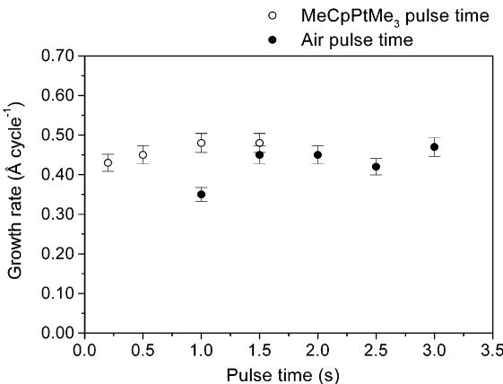
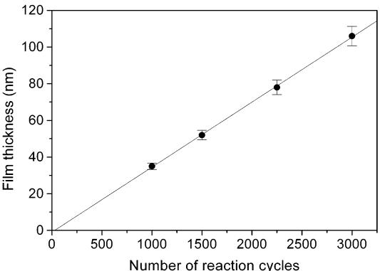
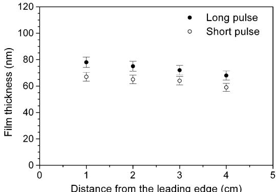
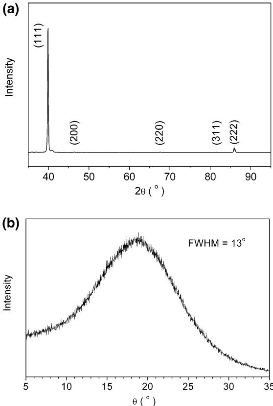
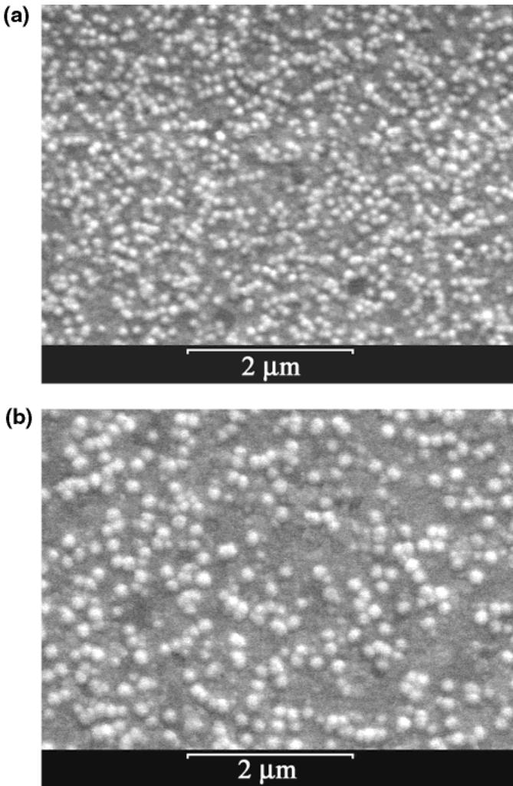
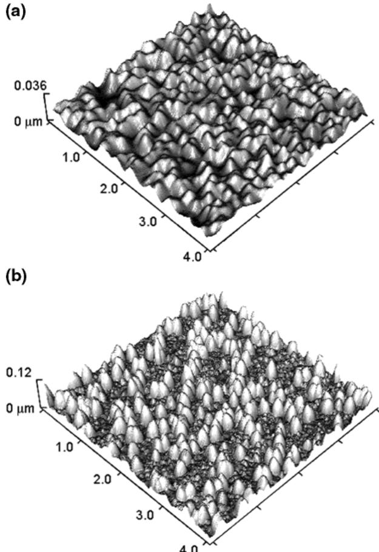

# Atomic Layer Deposition of Platinum Thin Films

Titta Aaltonen,\*, Mikko Ritala, Timo Sajavaara, Juhani Keinonen, and Markku Leskelat

Laboratory of Inorganic Chemistry, Department of Chemistry, P.O. Box 55, FIN- 00014 University of Helsinki, Finland, and The Accelerator Laboratory, Department of Physical Sciences, P.O. Box 43, FIN- 00014 University of Helsinki, Finland

Received October 8, 2002. Revised Manuscript Received February 10, 2002

Platinum thin films were grown at  $300^{\circ}\mathrm{C}$  by atomic layer deposition (ALD) using (methylcyclopentadienyl)trimethylplatinum  $\mathrm{(MeCpPtMe_3)}$  and oxygen as precursors. The films had excellent uniformity, low resistivity, and low- impurity contents. Structural studies by X- ray diffraction showed that the films were strongly (111) oriented. Growth rates of  $0.45\mathrm{\AA}$  cycle- 1 were obtained with 4 s total cycle times. The film thickness was found to linearly depend on the number of the reaction cycles. Also, the possible reaction mechanism is discussed.

# Introduction

Noble metals and their conducting oxides are potential metallization materials for microelectronic applications. Platinum is a potential capacitor electrode material for dynamic random access memories (DRAMs) because of its high chemical stability in an oxidizing atmosphere and its excellent electrical properties.1,2 A deposition process producing highly conformal platinum films is, however, needed when fabricating threedimensional storage nodes. Platinum is also applicable as a gate metal in the future metal- oxide- semiconductor field effect transistors (MOSFETs) because of its high work function (5.6 eV).3

Platinum thin films can be deposited by physical vapor deposition (PVD) and chemical vapor deposition (CVD) techniques. Films deposited by CVD usually have better conformality than films deposited by PVD and therefore CVD is preferred when conformal platinum films are needed. Precursors such as  $\mathrm{CpPtMe_3}$ $\mathbf{Cp} =$  cyclopentadienyl),4,5  $\mathrm{MeCpPtMe_3,^{2,5 - 8}Pt(acac)_2}$  (acac  $=$  acetylacetonate),9,10 and  $\mathrm{Pt(hfa)_2}$ $\mathrm{(hfa =}$  hexafluoroacetylacetonate)11,12 are, for example, available for CVD of platinum thin films.  $\mathrm{MeCpPtMe_3}$  is a widely studied CVD precursor because of its low melting point of 30  $^\circ \mathrm{C}$  6 Both hydrogen5,6 and oxygen2,7,8 have been used for decomposing the ligands of the  $\mathrm{MeCpPtMe_3}$  .Although CVD has been shown to be capable of producing highquality platinum films, atomic layer deposition (ALD)13- 15 would be an attractive alternative as it could show significant advantages such as perfect conformality and good large area uniformity of the films.16 These properties gain increasing importance as the dimensions of the surface structures to be covered decrease.

ALD can be considered as a special modification of CVD. The main difference to the conventional CVD is that in ALD the precursors are introduced to the reactor in alternate pulses that are separated by inert gas purging. The film growth proceeds in a layer- by- layer manner; that is, maximally one monolayer, but usually less, is formed during each growth cycle. The film growth is controlled by saturative precursor chemisorption on the growth surface or by saturative reactions of the precursor with reactive surface groups making the process self- limiting. As far as the surface saturation is achieved, the process is insensitive to small changes in the precursor doses, thus simplifying also the use of solid precursors. The thickness of the deposited films can be controlled accurately simply by the number of growth cycles applied.

There are only a few studies on noble metal deposition by ALD. Platinum film deposition by ALD has been studied by using Pt(acac) and hydrogen as precursors.17

However,  $\mathrm{Pt(acac)}_2$  was found to be an unsuitable precursor for ALD due to its thermal decomposition at low temperatures. Sufficient thermal stability is required for the ALD precursors since thermal decomposition of the precursors destroys the self- limiting growth mechanism. The physical state of the precursor, on the other hand, is not of great importance since also solid precursors can easily be used in ALD. Recently, we successfully deposited ruthenium thin films by ALD.18 The films showed excellent conformality and uniformity as characteristic to ALD. In that process the ligands of the ruthenium precursor were oxidatively decomposed by oxygen. In the present study, a similar process has been developed for deposition of platinum by ALD. In this paper we report the deposition of platinum from (methylcyclopentadienyl)trimethylplatinum [MeCpPt-  $\mathrm{Me}_3$ $(\mathrm{CH}_3\mathrm{C}_5\mathrm{H}_4)\mathrm{Pt}(\mathrm{CH}_3)_3]$  and oxygen.

# Experimental Section

The films were deposited in a flow- type F- 120 ALD reactor (ASM Microchemistry Ltd.) operated under a pressure of about 10 mbar. Nitrogen  $(99.9995\%)$  generated by a NITROX UHPN 3000 nitrogen generator was used as a carrier and purging gas. About 2- nm- thick amorphous  $\mathrm{Al}_2\mathrm{O}_3$  film was deposited by ALD from  $\mathrm{AlCl}_3$  and water on  $5\times 5$  cm borosilicate glass substrates right before the platinum deposition. Platinum films were grown also directly on borosilicate and on silicon with native oxide. The solid platinum precursor  $\mathrm{MeCpPtMe}_3$  (Strem Chemicals) was evaporated from an open boat held at room temperature inside the reactor. Because  $\mathrm{MeCpPtMe}_3$  is air- sensitive, it was loaded to the boat in a glovebox and was only shortly exposed to air while transferring the boat into the reactor. Air as an oxygen source was pulsed into the reactor through a needle valve and a solenoid valve with a flow rate of 40 standard cubic centimeters per minute (sccm) during a continuous flow. The  $\mathrm{MeCpPtMe}_3$  pulse time was varied between 0.2 and  $1.5\mathrm{s}$  and the air pulse time between 1.0 and  $3.0\mathrm{s}$ . The purge times used in the experiments were 1.0 and  $2.0\mathrm{s}$ .

Film morphology was studied by a Zeiss DSM 962 scanning electron microscope (SEM) and film thickness was determined by energy- dispersive X- ray spectroscopy (EDX) using a Link ISIS EDX spectrometer installed to the SEM equipment. The error in the thickness measurement was estimated to be  $\pm 5\%$ . The EDX results were analyzed using a GMR electron probe thin- film microanalysis program.19 Platinum bulk density (21.5  $\mathrm{gcm}^{- 3}$ ) was used in the thickness calculations. Since the density of the deposited films is very likely to be lower than the bulk density, the actual film thicknesses probably are somewhat higher. Atomic force microscopy (AFM) was also used for surface morphology studies. The measurements were carried out in tapping mode using a ThermoMicroscopes AutoProbe CP Research AFM. The root- mean- square (RMS) values were obtained from  $10\times 10\mu \mathrm{m}$  scans using the software of the microscope. The impurity contents in the platinum films were analyzed by time- of- flight elastic recoil detection analysis (TOF- ERDA)20,21 using 5B- MeV  $^{127}\mathrm{II}^{1 + }$  ions. The crystal structure of the films was determined using a Bruker AXS D8 advance X- ray diffractometer (XRD) using Cu Kα radiation. The film resistivity was calculated from the sheet resistance measured by the standard four- point probe method and from the film thickness determined by the EDX analysis.

  
Figure 1. Dependence of the platinum film growth rate on the  $\mathrm{MeCpPtMe}_3$  and air pulse times. The air pulse time in the  $\mathrm{MeCpPtMe}_3$  experiments was  $1.5\mathrm{s}$  and the  $\mathrm{MeCpPtMe}_3$  pulse time in the air pulse experiments was  $0.5\mathrm{s}$ .

  
Figure 2. Film thickness vs the number of reaction cycles completed.

# Results and Discussion

First, the optimal deposition temperature was selected. Uniform and mirrorlike platinum films were obtained at 300 and  $350^{\circ}\mathrm{C}$ . There were, however, platinum deposits on the walls of the platinum precursor inlet tube after the growth experiments at  $350^{\circ}\mathrm{C}$ , indicating that the platinum precursor was thermally decomposing. At  $300^{\circ}\mathrm{C}$  still some platinum was deposited in the inlet tube but to a much lesser extent than that at  $350^{\circ}\mathrm{C}$ . Extensive thermal decomposition of the precursors must be avoided in ALD, because it destroys the self- limiting growth mechanism and therefore  $300^{\circ}\mathrm{C}$  can be considered to be close to the upper limit for the deposition temperature in this process. On the other hand, since only very thin films were obtained at  $250^{\circ}\mathrm{C}$ , the deposition temperature of  $300^{\circ}\mathrm{C}$  was used in further experiments.

Figure 1 shows the effect of the precursor pulse times on the film growth rate. As the  $\mathrm{MeCpPtMe}_3$  pulse time is increased from  $0.2\mathrm{s}$ , the growth rate slightly increases and saturates to  $0.48\mathrm{\AA}$  cycle $^{- 1}$  with pulse times longer than  $0.5\mathrm{s}$ . Saturation is also observed with air pulse times longer than  $1.5\mathrm{s}$ . The self- limiting growth mechanism is thus reasonably well verified, even if a minor effect of thermal decomposition of  $\mathrm{MeCpPtMe}_3$  cannot be completely excluded. Figure 2 shows that the film thickness depends linearly on the number of reaction cycles, that is, the growth rate remains constant through the process. However, the growth rate may be lower during the nucleation of the platinum film

  
Figure 3. Thickness profiles of platinum films grown with short and long  $\mathrm{MeCpPtMe_3}$  pulses of 0.2 and  $1.5\mathrm{s}$ , respectively. The profile is measured along the gas flow direction at various distances from the leading edge of the substrate, that is, the edge closest to the precursor inlet.

on the  $\mathrm{Al_2O_3}$  surface at the beginning of the film growth, which could explain why the extrapolated line in Figure 2 does not go through the origin. On the other hand, this deviation is inside the error limits of the thickness determination.

The uniformity of the films was excellent. Thickness variation of films grown with short and long  $\mathrm{MeCpPtMe_3}$  pulses of 0.2 and  $1.5\mathrm{s}$  respectively, are shown in Figure 3. Since the  $\mathrm{MeCpPtMe_3}$  pulse time of  $0.2\mathrm{s}$  is not within the saturated growth rate range, the film is thinner than the film grown with a  $\mathrm{MeCpPtMe_3}$  pulse time of  $1.5\mathrm{s}$ . The thickness profiles of the films are, however, quite similar. The uniformity of the films further support the self- limiting growth mechanism since extensive self- decomposition of  $\mathrm{MeCpPtMe_3}$  would cause the film to be significantly thicker at the leading edge of the substrate.

All the films were polycrystalline metallic platinum as examined by XRD. A typical diffractogram showing the preferred (111) orientation is presented in Figure 4a. A rocking curve of the (111) reflection (Figure 4b) has a clear maximum with a full- width at half- maximum (fwhm) of  $13^{\circ}$ . The curve is asymmetric because the volume of the film being illuminated is larger at small incoming angles. The preferred (111) orientation is typical for the face- centered cubic (fcc) metals and has been reported also for CVD- grown platinum films. Since the growth rate  $(40\mathrm{nm}\mathrm{h}^{- 1})$  of the ALD platinum films is relatively low, the platinum atoms have enough time to migrate on the surface and to arrange in the (111) orientation with the lowest surface energy.

While the films were macroscopically uniform, the SEM images in Figure 5 show that the surface roughness and the grain size increase with increasing film thickness. AFM measurements verify the changes in the surface morphology (Figure 6) and show that the RMS values of the films increase from  $4.0\pm 0.4 \mathrm{nm}$  for the  $50 - \mathrm{nm}$  film to  $17\pm 1\mathrm{nm}$  for the  $110 - \mathrm{nm}$  film. The higher RMS value of the thicker film is due to the large grains that cover most of the surface while substantially smaller grains cover the rest of the surface. The change in the surface morphology suggests that in the thicker film some of the initially formed grains have grown at the expense of the others. The relatively long pulse and purge times used in the experiments may further promote the grain growth.

  
Figure 4. (a) XRD pattern of a  $110$ -nm-thick platinum film and (b) rocking curve of the (111) reflection  $(2\theta = 39.9^{\circ})$ .

Adhesion of the platinum films was studied on bare borosilicate glass, on borosilicate with a thin  $\mathrm{Al_2O_3}$  layer, and on silicon with a native oxide layer. All the films were uniform and specular but adhesion of the films on these substrates was modest. The films did not peel off from the substrate but they did not pass the routine tape test. The ruthenium films grown by ALD in our previous study instead adhered well to  $\mathrm{Al_2O_3}$  and ruthenium could therefore be used as an adhesion layer for platinum. Ruthenium has a higher tendency to oxidation, which could explain the better adhesion of ruthenium on a freshly deposited oxide surface.

The impurity contents of the platinum films were low as analyzed by TOF- ERDA. The amounts of all impurities decreased as the air pulse time increased. When the air pulse time was increased from 1.0 to  $2.0\mathrm{s}$ , the maximum hydrogen content decreased from 1.0 to 0.5 at.  $\%$ , the maximum carbon content from 1.0 to 0.5 at.  $\%$ , and the maximum oxygen content from 2.0 to 1.0 at.  $\%$ . The results show that the ligands of the  $\mathrm{MeCpPtMe_3}$  molecule are more effectively removed with long oxygen pulses. The low oxygen content of the films verifies that platinum is not oxidized during the process.

The resistivity of the platinum films was low and it decreased with increasing film thickness. A  $110 - \mathrm{nm}$  platinum film had a resistivity of  $12\mu \Omega$  - cm that is only slightly higher than the bulk value  $(10.8\mu \Omega \text{- cm})$  . Since the actual thickness of the films is probably higher than the thickness values obtained by using the bulk density of platinum, the actual resitivities of the films are also slightly higher. Still, the resistivities of the ALD platinum films are very low as compared to the resistivity values of  $13 - 30\mu \Omega$  - cm measured for the platinum films grown by CVD at the same temperatures.2,8,12 The low

  
Figure 5. SEM images of (a) 50- and (b) 110-nm-thick platinum films.

resistivities of the ALD platinum films are probably due to a high degree of crystallization and low- impurity contents.

The following reaction mechanism has been proposed for the oxidative decomposition of  $\mathrm{MeCpPtMe_3}$  in the temperature range of  $200 - 350^{\circ}\mathrm{C}$  in the respective CVD process:2

$$
\mathrm{Pt(s)} + \mathrm{O}_2(\mathrm{g})\rightarrow \mathrm{Pt} - \mathrm{O}_x \tag{1}
$$

$$
\mathrm{CH}_3\mathrm{C}_5\mathrm{H}_4\mathrm{Pt}(\mathrm{CH}_3)_3 + \mathrm{Pt} - \mathrm{O}_x\rightarrow
$$

$\mathrm{Pt(s)} + \mathrm{CO}_2(\mathrm{g}) + \mathrm{H}_2\mathrm{O}(\mathrm{g})+$  other byproducts (2)

The  $\mathrm{Pt} - \mathrm{O}_x$  species represents oxygen that is adsorbed on the platinum surface.2 Surface studies have shown that at ultrahigh vacuum (UHV) conditions oxygen atomically adsorbs on the platinum surface already at room temperature.22- 24 The adsorbed oxygen atoms participate in surface reactions at temperatures below  $530^{\circ}\mathrm{C}$  and a subsurface layer of nonreactive oxygen is formed only at temperatures higher than  $530^{\circ}\mathrm{C}$ .22,25 Oxygen desorption from a platinum surface starts at a temperature of  $330^{\circ}\mathrm{C}$ .24,26 Therefore, it is likely that an adsorbed oxygen layer is formed on the platinum surface during the air pulse and that the adsorbed oxygen layer is stable during the purge period in the ALD process. We suggest that during the following  $\mathrm{MeCpPtMe_3}$  pulse the ligands react with the adsorbed oxygen layer, liberating  $\mathrm{CO_2}$ ,  $\mathrm{H_2O}$ , and possibly other byproducts as presented in eq 2. However, because of the limited amount of oxygen in the adsorption layer, the ligands may not be completely oxidized. The remaining hydrocarbon species are then oxidized during the following air pulse. After complete oxidation of the ligands, a new layer of adsorbed oxygen should thus form on the platinum surface. This cycle is then repeated during the film growth. Preliminary in situ studies with a quadrupole mass spectrometer (QMS) revealed that the reaction byproducts  $\mathrm{CO_2}$  and  $\mathrm{H_2O}$  are released during both  $\mathrm{MeCpPtMe_3}$  and oxygen pulses. These observations are consistent with the above- presented reaction mechanism.

  
Figure 6. AFM images of (a) 50- and (b) 110-nm-thick platinum films. Please note that the images have different  $\mathcal{Z}$  -axis scales.

In conclusion, polycrystalline platinum thin films having low resistivity were grown by ALD at  $300^{\circ}\mathrm{C}$  using  $\mathrm{MeCpPtMe_3}$  and oxygen as precursors. Reasonably good saturation with respect to both precursors was achieved and the film thickness was found to depend linearly on the number of growth cycles applied. The uniformity of the films was excellent, but adhesion to the underlying oxide film was only modest. The impurity contents of the films were low.

Acknowledgment. Facilities provided by the Electron Microscopy Unit at the Institute of Biotechnology at the University of Helsinki were used for the SEM and EDX analysis. This work was supported in part by the Finnish National Technology Agency (TEKES) and the Academy of Finland (Project Nos. 43329 and 44215).

CM021333T