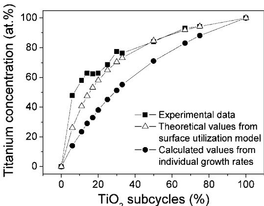
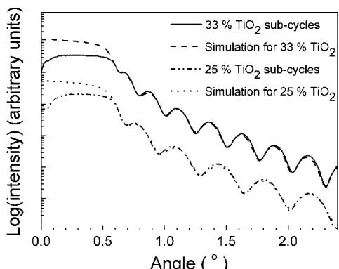
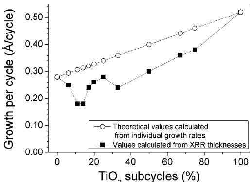
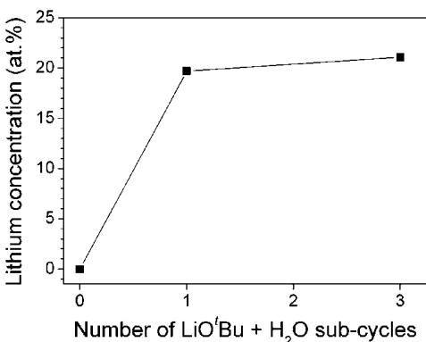
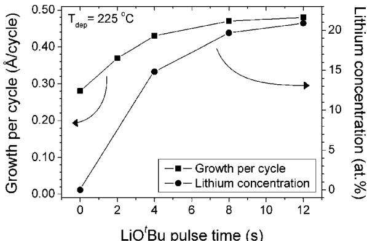
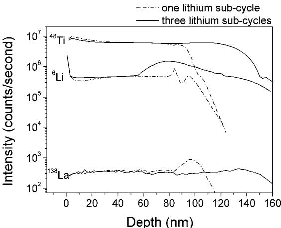
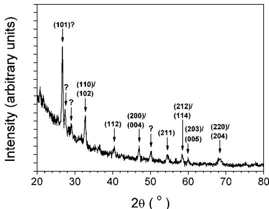
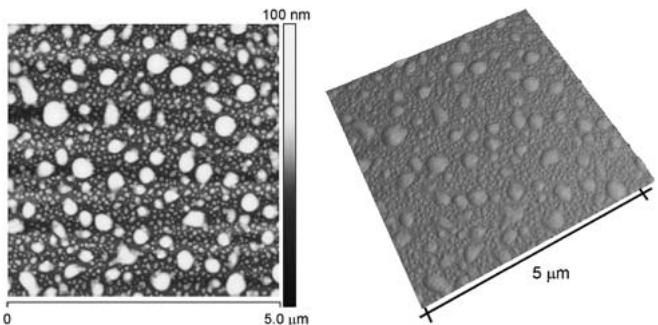

# Lanthanum titanate and lithium lanthanum titanate thin films grown by atomic layer deposition†

Titta Aaltonen,\*a Mari Alnes,a Ola Nilsen,a Leila Costelleb and Helmer Fjellvaga

Received 9th November 2009, Accepted 13th January 2010 First published as an Advance Article on the web 11th February 2010 DOI: 10.1039/b923490j

Thin films of lanthanum titanate and lithium lanthanum titanate (LLT) have been grown by atomic layer deposition (ALD). Studies on the growth of lanthanum titanates showed that the lanthanum deposition rate is reduced when the titanium oxide and lanthanum oxide processes are combined, leading to higher titanium contents in the films. The precursor systems used for deposition of lanthanum titanates were  $\mathrm{TiCl_4 + }$  water and  $\mathrm{La(thd)_3}$ $\mathrm{thd} = 2,2,6,6$  - tetramethyl- 3,5- heptanedione)  $^+$  ozone. Lithium was introduced into the material in order to deposit LLT by using lithium tert- butoxide  $\mathrm{(LiO^{\prime}Bu)}$  and water as precursors. The deposited films were analyzed by time- of- flight elastic recoil detection analysis (TOF- ERDA), secondary ion mass spectrometry (SIMS), X- ray fluorescence (XRF), X- ray reflectivity (XRR) and X- ray diffraction (XRD). TOF- ERDA gave the film composition of  $\mathrm{Li_{0.32}La_{0.30}TiO_z}$  at saturation conditions.

# Introduction

Lithium lanthanum titanates  $\mathrm{(Li,La)_xTi_1O_2}$  LLT] are considered as very promising solid- state lithium ion conductors and are foreseen to replace lithium phosphorus oxynitride (LIPON) in all- solid- state lithium ion thin film batteries. Crystalline LLT, having the perovskite structure  $\mathrm{Li_2L_3O_{20}}$ $\square_{\mathrm{XO_2}}$ $\mathrm{TiO_2}$ $0< x<$  0.16), has been reported to have a much higher bulk lithium ion conductivity than  $\mathrm{LIPON^*}$  which leads to decreased internal resistance and thus increased performance of the batteries. The energy and power densities of the all- solid- state lithium ion batteries can be improved by moving from planar battery structures to three- dimensional structures.2 Fabrication of these three- dimensional structures sets special requirements for the thin film deposition techniques; the films need to be uniform both in thickness and composition across the three- dimensional surface structures. In addition, the films need to be pin hole free. Atomic layer deposition (ALD), which is a thin film deposition technique based on a self- limiting film growth mechanism, gives films with excellent conformality and uniformity. Therefore, ALD is a very promising technique for depositing thin films for three- dimensional all- solid- state lithium ion batteries.

There are reports on deposition of LLT by techniques such as sol- gel deposition, radio frequency (RF) magnetron sputtering, electron beam evaporation and pulsed laser deposition (PLD).7,8,9 The sol- gel technique is not suitable for deposition of LLT into battery structures because it requires high- temperature annealing steps and readily produces porous films4 leading to decreased ionic conductivity of the films and risk for short circuits in the battery. Furusawa et al.5 reported difficulties in preparing LLT films by RF sputtering and focused instead on PLD. However, a drawback of the PLD technique is its limitation with substrate size. Tailoring the film composition is, in general, difficult when using the above mentioned vapor- phase methods, especially when taking into consideration the large difference in atomic mass of lithium compared to the other elements involved. For electron beam evaporation, some control of the film composition can be achieved by varying the electron beam power. However, all of these physical deposition techniques are unsuitable for deposition into complex three- dimensional structures.

ALD has many advantages for the preparation of LLT thin films. One major advantage of ALD is the self- limiting growth mechanism that enables growth of uniform films on large substrate areas and into complex three- dimensional structures. With ALD, the composition of the films can be adjusted by varying the pulsing ratio of the different precursors, as demonstrated for other quaternary systems.10 Furthermore, ALD often enables film growth at low temperatures, typically below  $300^{\circ}\mathrm{C}$

To our knowledge, the only previous report on ALD of lithium is ALD of lithium containing thin films using Li(thd)  $\mathrm{(thd = 2,2,6,6}$  - tetramethyl- 3,5- heptanedione),  $\mathrm{LiO^{\prime}Bu}$ $\mathrm{^{\prime}BuO =}$  tert- butoxide), and  $\mathrm{LiCp}$ $\mathrm{Cp =}$  cyclopentadienyl) as precursors.11 Although the  $\beta$  - diketonate compound Li(thd) has been studied as an ALD precursor in more detail,  $\mathrm{LiO^{\prime}Bu}$  has several benefits over Li(thd); alkoxides are often reactive towards water and therefore, lithium oxide or hydroxide films are likely to be deposited instead of lithium carbonate. In addition, the alkoxide precursor,  $\mathrm{LiO^{\prime}Bu}$  , contains less carbon than Li(thd) which also reduces the likeliness of carbon incorporation into the films. Self- decomposition of  $\mathrm{LiO^{\prime}Bu}$  has been reported to take place at temperatures above  $350^{\circ}\mathrm{C}$  12 Therefore,  $\mathrm{LiO^{\prime}Bu}$  is a suitable ALD precursor at temperatures below  $350^{\circ}\mathrm{C}$  In this paper we

first present results from our studies on ALD of lanthanum titanates and then report our results from ALD of LLT using  $\mathrm{LiO}^{\prime}\mathrm{Bu}$  as the lithium source.

# Experimental

The films were grown in an F- 120 Sat reactor ASM Microchemistry Ltd.) using La(and)  $3\mathrm{TiCl}_4$ $\mathrm{LiO}^{\prime}\mathrm{Bu}$ $\mathrm{H}_2\mathrm{O}$  and  $\mathrm{O}_3$  as precursors.  $\mathrm{La(thd)_3}$  was made in- house as described in ref. 13.  $\mathrm{TiCl_4}$ $(99.9\%)$  and  $\mathrm{LiO}^{\prime}\mathrm{Bu}$ $(97\%)$  were purchased from Sigma Aldrich. Ozone was generated by feeding pure  $\mathrm{O}_2$  AGA  $99.999\%$  into an ozone generator (OT- 020, OzoneTechnology). The flow rate of ozone was  $500~\mathrm{cm^3~min^{- 1}}$  . The source temperature for  $\mathrm{La(thd)_3}$  was  $185^{\circ}C$  and for  $\mathrm{LiO}^{\prime}\mathrm{Bu}160^{\circ}\mathrm{C}$ $\mathrm{TiCl_4}$ $\mathrm{O_3}$  and  $\mathrm{H}_2\mathrm{O}$  were introduced into the reactor at room temperature. The reactor pressure was ca. 3 mbar and a  $\mathbf{N}_2$  flow  $(99.9995\%)$  of  $300\mathrm{cm}^3\mathrm{min}^{- 1}$  was used as a carrier gas. The films were grown on Si(111) and soda lime glass substrates.

The LLT depositions consisted of a combination of sub- cycles of the individual oxide components. The  $\mathrm{TiO_2}$  sub- cycle consisted of alternate pulsing of  $\mathrm{TiCl_4}$  and water; the  $\mathrm{La}_2\mathrm{O}_3$  subcycle of alternate pulsing of  $\mathrm{La(thd)_3}$  and  $\mathrm{O_3}$  and the  $\mathrm{Li}_2\mathrm{O}$  (or  $\mathrm{LiOH}$  ) sub- cycle of alternate pulsing of  $\mathrm{LiO}^{\prime}\mathrm{Bu}$  and  $\mathrm{H}_2\mathrm{O}$  .All the precursor pulses were separated by a nitrogen purge. These subcycles were combined in optimal ratios to deposit the LLT films. The deposition parameters for the  $\mathrm{TiO_2}$  and  $\mathrm{La}_2\mathrm{O}_3$  were chosen based on previous studies10,11 and are presented in Table 1. The pulse time for  $\mathrm{LiO}^{\prime}\mathrm{Bu}$  was varied between 2 and  $12\mathrm{s}$  while the purge time was kept constant at  $2\mathrm{s}$  The pulse and purge times for the subsequent water pulse were 2 and  $2\mathrm{s}$  Table 1.

The deposition temperature for all the films was  $225^{\circ}C$  The deposited films were analyzed by  $\mathbf{X}$  - ray diffraction (XRD) using a Siemens D5000 diffractometer equipped with a Gobel mirror that produces parallel  $\mathrm{Cu - K}\alpha$  radiation. The same tool was also used for thickness and roughness measurements with  $\textrm{X}$  - ray reflectometry (XRR) configuration. The lanthanum to titanium ratio in the lanthanum titanate films was determined by  $\textrm{X}$  - ray fluorescence (XRF) measurements using a Philips PW2400 spectrometer and UniQuant analysis software14 to interpret the data. The composition of LLT films was analyzed by time- offlight elastic recoil detection analysis (TOF- ERDA) using 30  $\mathrm{MeV}^{79}\mathrm{Br}^{9 + }$  ions. The depth distribution of the elements in the films was studied by secondary ion mass spectrometry (SIMS) using a CAMECA IMS 7f instrument. An area of  $150\times 150\mu \mathrm{m}^2$  was sputtered by a  $10\mathrm{keV}\mathrm{O}^{2 + }$  primary ion beam. The crater depths were measured by Dektak8 surface profilometer (Dektak,

Table 1 Pulsing parameters and source temperatures for the different oxide sub-cycles  

<table><tr><td>Sub-cycle</td><td>Precursor</td><td>Pulse time/s</td><td>Purge time/s</td><td>Source T/°C</td></tr><tr><td rowspan="2">TiO2</td><td>TiCl4</td><td>0.5</td><td>1</td><td>RT</td></tr><tr><td>H2O</td><td>2</td><td>2</td><td>RT</td></tr><tr><td rowspan="2">La2O3</td><td>La(thd)3</td><td>2</td><td>2</td><td>185</td></tr><tr><td>O3</td><td>6</td><td>3</td><td>RT</td></tr><tr><td rowspan="2">Li2O</td><td>LiO&#x27;Bu</td><td>2–12</td><td>2</td><td>160</td></tr><tr><td>H2O</td><td>2</td><td>2</td><td>RT</td></tr></table>

$^a\mathrm{RT} =$  room temperature.

Veeco Instruments Ltd) in order to calibrate the depth scale. Atomic force microscopy (AFM) measurements were performed with a Dimension 3100 unit (Digital Instruments).

# Results and discussion

As the first step, we studied the combination of the  $\mathrm{La}_2\mathrm{O}_3$  and the  $\mathrm{TiO}_2$  processes to deposit La- Ti- O films. The cation stoichiometry of the La- Ti- O films was varied by depositing films with different percentages of titanium, sub- cycles and the film composition was determined by XRF. Fig. 1 shows the dependence of the titanium content of the deposited films on the percentage of the titanium oxide sub- cycles. A model based on a concept of surface utilization10 was fitted to the experimental data and a good fit was obtained by using the utilization coefficients of  $U_{\mathrm{Ti}} = 1$  and  $U_{\mathrm{La}} = 0.18$  . The expected compositions of the films were also calculated based on the individual growth rates of the two oxide films. The results show that the films contain less lanthanum than expected on the basis of the individual growth rates for the binary oxides.

The film thicknesses were obtained from XRR measurements. Fig. 2 shows experimental data from XRR measurements of two

  
Fig. 1 Composition of deposited films versus percentage of titanium oxide sub-cycles. Experimental data are compared with a model based on surface utilization10 and the growth rates of the individual binary oxides.

  
Fig. 2 XRR measurements of the two selected films with fitted simulations giving thicknesses of 32 and  $23~\mathrm{nm}$  and surface roughnesses of 0.7 and  $0.6 \mathrm{nm}$  for lanthanum titanate films with  $33\%$  and  $25\%$  of  $\mathrm{TiO_2}$  subcycles, respectively.

  
Fig. 3 Growth per cycle as a function of the percentage of  $\mathrm{TiO_2}$  subcycles.

selected lanthanum titanate films and simulations fitted to the experimental data. One of the films was deposited with  $33\%$  of  $\mathrm{TiO_2}$  sub- cycles and the other one with  $25\%$  of  $\mathrm{TiO_2}$  sub- cycles. The surface roughness, as obtained from the simulations, were 0.7 and  $0.6 \mathrm{nm}$  for films with  $33\%$  and  $25\%$  of  $\mathrm{TiO_2}$  sub- cycles, respectively. The XRR analysis thus shows that the lanthanum titanate films are rather smooth.

The average growth per cycle as a function of the percentage of titanium oxide sub- cycles (Fig. 3) was calculated on the basis of the film thicknesses as measured by XRR. The growth per cycle for pure  $\mathrm{La_2O_3}$  ( $0\%$ $\mathrm{TiO_2}$  sub- cycles) was  $0.28 \mathrm{A / cycle}$ , whereas the growth per cycle for pure  $\mathrm{TiO_2}$  ( $100\%$ $\mathrm{TiO_2}$  sub- cycles) was  $0.52 \mathrm{A / cycle}$ . Fig. 3 shows that the growth per cycle is lower for the combined oxide processes than what is expected from a linear combination of growth per cycle of the binary oxides. This phenomenon has also been reported for other ternary ALD processes. It may be explained by differences in the chemistry of the terminating surface after the preceding oxide sub- cycle which then leads to lower growth per cycle for one or both of the components when the processes are combined. It may also be due to a denser structure of the complex oxide as compared to a combination of the binary oxides  $[\rho (\mathrm{TiO_2}) = 4.23 \mathrm{g} \mathrm{cm}^{- 3}$ ,  $\rho (\mathrm{La_2O_3}) = 6.51 \mathrm{g} \mathrm{cm}^{- 3}]$ .

In order to grow LLT films, a lithium process was combined with the above described  $\mathrm{La - Ti - O}$  system. Pure lithium oxide films were first grown from  $\mathrm{LiO'Bu}$  and water before the process was combined with the titanium oxide and lanthanum oxide processes. When three different binary processes are combined, the pulsing order of the sub- cycles may have an effect on the growth mechanism, especially if the precursors are of different chemical nature. In ALD, the chemical groups terminating the surface after each sub- cycle are important because they form the basis of the self- limiting growth and act as functional sites for reaction with the subsequent precursors. The influence of the pulsing order was studied by investigating two different pulsing sequences. In the first experiment (pulsing order 1) the  $\mathrm{LiO'Bu + }$  water sub- cycle was introduced after the  $\mathrm{La(thd)_3 + O_3}$  sub- cycle  $(\mathrm{TiO_2 - La_2O_3 - Li_2O})$  and in the second experiment (pulsing order 2) it was introduced after the  $\mathrm{TiCl_4 + H_2O}$  sub- cycle  $(\mathrm{TiO_2 - Li_2O - La_2O_3})$ . The films deposited according to pulsing order 1 showed lower surface roughness and were more uniform than the films deposited according to pulsing order 2. The pulsing order 1 was therefore chosen for the remaining study. The pulsing order also affected the composition of the films where pulsing order 1 gave slightly lower lithium and slightly higher titanium content as measured by TOF- ERDA than the films deposited according to pulsing order 2. The carbon impurity content was also slightly higher in the films grown with pulsing order 2.

Based on the composition analysis of the  $\mathrm{La - Ti - O}$  films (Fig. 1), a pulsing scheme consisting of one  $\mathrm{TiCl_4 + H_2O}$  sub- cycle and three  $\mathrm{La(thd)_3 + O_3}$  sub- cycles was chosen for deposition of LLT films. The pulsing scheme was thus  $1 \times \mathrm{TiO_2} + 3 \times \mathrm{La_2O_3} + n \times \mathrm{Li_2O}$  where  $n$  is the number of the  $\mathrm{LiO'Bu + }$  water sub- cycles. The number of the  $\mathrm{LiO'Bu + }$  water sub- cycles was varied and the lithium content of the films was analyzed by TOF- ERDA (Fig. 4). The results of this experiment show that the lithium content of the films does not depend on the number of the  $\mathrm{LiO'Bu + }$  water sub- cycles in a linear manner. This may indicate that there are more reactive sites available on the surface after the  $\mathrm{La(thd)_3 + O_3}$  cycle than after a  $\mathrm{LiO'Bu + }$  water cycle. That is, the reactivity of  $\mathrm{LiO'Bu}$  towards lithium oxide or hydroxide surface seems to be low and therefore, the lithium content does not increase significantly although the number of lithium sub- cycles is increased. However, it should be possible to increase the lithium content by adding a lithium sub- cycle after both the  $\mathrm{La(thd)_3 + O_3}$  and the  $\mathrm{TiCl_4 + H_2O}$  sub- cycles.

The effect of the  $\mathrm{LiO'Bu}$  pulse time on the growth per cycle of the LLT films is shown in Fig. 5. The growth per cycle is calculated as the average for the binary cycles in the pulsing scheme. The growth per cycle increases with pulse times up to  $8 \mathrm{s}$  where it stabilizes to about  $0.48 \mathrm{A / cycle}$ . Also the amount of lithium incorporated into the films stabilizes to about  $20 \mathrm{at.\%}$  at pulse times of  $8 \mathrm{s}$  or longer as analyzed by TOF- ERDA (Fig. 5). Variation of the  $\mathrm{LiO'Bu}$  pulse time did not affect the lanthanum content of the films which was about  $18 \mathrm{at.\%}$ . The titanium content, on the other hand, decreased with increasing lithium content in the films. The results in Fig. 5 indicate that at  $\mathrm{LiO'Bu}$  pulse times of  $8 \mathrm{s}$  and higher the film growth is self- limiting. In order to avoid decomposition of the precursor during sublimation, the  $\mathrm{LiO'Bu}$  source temperature was kept as low as possible, which partly explains the relatively long pulse time of  $8 \mathrm{s}$  needed to obtain saturation.

The TOF- ERDA analysis showed that the composition of the films at saturation conditions is  $\mathrm{Li_{0.32}La_{0.30}TiO_2}$ . The films also

  
Fig. 4 Lithium content of the films, as measured by TOF-ERDA, as a function of number of subsequent lithium sub-cycles  $n$  in the pulsing scheme of  $400 \times (1 \times \mathrm{TiO_2} + 3 \times \mathrm{La_2O_3} + n \times \mathrm{Li_2O})$ .

  
Fig. 5 Average growth per cycle and lithium concentration of LLT films as a function of  $\mathrm{LiO}^{\prime}\mathrm{Bu}$  pulse time. The pulsing scheme was  $400 \times (1 \times \mathrm{TiO}_{2} + 3 \times \mathrm{La}_{2}\mathrm{O}_{3} + 1 \times \mathrm{Li}_{2}\mathrm{O})$ .

contained some chlorine (3.0- 3.7 at.  $\%$  carbon 1.9- 3.0 at.  $\%$  and hydrogen (0.7- 2.5 at.  $\%$  as impurities. The presence of chlorine is likely to originate from the titanium precursor which was  $\mathrm{TiCl_4}$  . The carbon impurities may stem from the lanthanum precursor  $\mathrm{La(thd)_3}$  and/or the lithium precursor  $\mathrm{LiO}^{\prime}\mathrm{Bu}$  .The hydrogen impurities may be present as water or as hydrocarbons or hydroxyls.

The compositions of the amorphous LLT films grown by ALD deviate from the composition of crystalline LLT with the general defect perovskite structure  $\mathrm{Li}_{3x}\mathrm{La}_{2 / 3 - x}\square_{1 / 3 - 2x}\mathrm{TiO}_{3}$ . The  $\mathrm{Li}:\mathrm{La}$  ratio in the film grown at saturation conditions is  $1:0.94$  which is close to the  $1:1$  ratio when  $x = 0.17$ . This suggests that the films contain excess titanium, that is, that the film composition could be given as  $\mathrm{Li}_{0.5}\mathrm{La}_{0.47}\mathrm{Ti}_{1.6}\mathrm{O}_{z}$ . High ionic conductivities have been reported for LLT thin films having Li to La ratio close to one.7,8 We therefore expect the obtained composition to be suitable for applications in all- solid- state lithium ion batteries.

The depth profile of the distribution of lithium, titanium, and lanthanum in the LLT films was studied by SIMS. Fig. 6 and 7 show SIMS intensity for the masses 6, 48, and 138 amu that correspond to  ${}^{6}\mathrm{Li}$ ,  ${}^{48}\mathrm{Ti}$ , and  ${}^{138}\mathrm{La}$ , respectively. Due to lack of proper reference samples, absolute concentrations of the elements in the films cannot be determined from the SIMS analysis. Fig. 6 shows the signals for Li, Ti and La for LLT films grown with different  $\mathrm{LiO}^{\prime}\mathrm{Bu}$  pulse times. It is evident that the intensity of the lithium signal for the films grown with a 2- s  $\mathrm{LiO}^{\prime}\mathrm{Bu}$  pulse is lower than for films grown with an 8- s and a 12- s  $\mathrm{LiO}^{\prime}\mathrm{Bu}$  pulse. This shows that a 2- s  $\mathrm{LiO}^{\prime}\mathrm{Bu}$  pulse is insufficient to achieve saturation of the lithium content as also observed from the growth per cycle vs.  $\mathrm{LiO}^{\prime}\mathrm{Bu}$  pulse time data (Fig. 5).

  
Fig. 6 SIMS depth profiles of LLT films grown with  $\mathrm{LiO}^{\prime}\mathrm{Bu}$  pulse times of 2, 8, and  $12\mathrm{s}$ .

  
Fig. 7 SIMS depth profiles of lithium, titanium, and lanthanum in the LLT films with one and three  $\mathrm{LiO}^{\prime}\mathrm{Bu}+$  water sub-cycles.

Fig. 6 shows that the concentrations of the elements remain relatively constant throughout the film thickness. At the film- to- substrate interface the lithium concentration profile shows rapid variations in a region with a thickness of about  $20 \mathrm{nm}$  (Fig. 6). Also, the lanthanum concentration changes in this region; the lanthanum concentration is higher at the film- to- substrate interface than in the bulk of the film. The variations may be due to changes in the ionization efficiencies caused by variations in the material composition (a matrix effect).

The SIMS depth profiles for LLT films grown with one and three  $\mathrm{LiO}^{\prime}\mathrm{Bu}+$  water sub- cycles are shown in Fig. 7. In the LLT film grown with three  $\mathrm{LiO}^{\prime}\mathrm{Bu}+$  water sub- cycles, the lithium concentration is higher in an about  $60 - \mathrm{nm}$  thick region at the substrate than in the surface region of the film. In the LLT film grown with one  $\mathrm{LiO}^{\prime}\mathrm{Bu}+$  water sub- cycle, the lithium concentration remains more constant throughout the film thickness. The lanthanum concentration, on the other hand, shows a slight maximum at the film- to- substrate interface. This is not observed in the LLT film grown with three  $\mathrm{LiO}^{\prime}\mathrm{Bu}+$  water sub- cycles.

The SIMS results indicate that there is some variation in the lithium and lanthanum contents of the films at the beginning of the film growth but that the lithium and lanthanum concentrations stabilize to a constant level at a later stage of the film growth.

The as- grown films were amorphous as analyzed by XRD. LLT films grown by PLD have been reported to become crystalline only after annealing at temperatures of  $800^{\circ}\mathrm{C}$  or higher.9 Therefore, LLT films grown by ALD were annealed in oxygen at  $800^{\circ}\mathrm{C}$  in order to identify their crystalline phases. Fig. 8 shows a grazing incidence X- ray diffractogram of an about  $100 - \mathrm{nm}$ - thick LLT film with the composition of  $\mathrm{Li}_{0.32}\mathrm{La}_{0.30}\mathrm{TiO}_{z}$  that has been annealed in oxygen at  $800^{\circ}\mathrm{C}$  for  $3 \mathrm{h}$ . The reflections match very well with those reported for LLT films with a composition of  $\mathrm{Li}_{0.33}\mathrm{La}_{0.557}\mathrm{TiO}_{3}$ ,15 as shown in Table 2. However, the reflection

  
Fig. 8 Grazing incidence X-ray diffractogram of an about  $100\mathrm{-nm}$  -thick LLT film annealed in oxygen at  $800^{\circ}\mathrm{C}$  for  $3\mathrm{h}$ . The reflections are labeled according to ref. 15.

Table 2 Measured angles of reflections from the annealed LLT film as compared to reflections reported for  $\mathrm{Li_{0.33}La_{0.557}TiO_3}$  15  

<table><tr><td>Measured angle (°)</td><td>Angle reported in literature15 (°)</td><td>Difference (°)</td><td>Miller index of the reflection</td></tr><tr><td>26.7</td><td>25.69</td><td>1.0</td><td>101</td></tr><tr><td>27.5</td><td>—</td><td>—</td><td>—</td></tr><tr><td>29.1</td><td>—</td><td>—</td><td>—</td></tr><tr><td>32.7</td><td>32.67</td><td>0.1</td><td>110/102</td></tr><tr><td>36.4</td><td>—</td><td>—</td><td>—</td></tr><tr><td>40.4</td><td>40.29</td><td>0.1</td><td>112</td></tr><tr><td>47.0</td><td>46.87</td><td>0.1</td><td>200/004</td></tr><tr><td>50.1</td><td>—</td><td>—</td><td>—</td></tr><tr><td>54.4</td><td>54.21</td><td>0.2</td><td>211</td></tr><tr><td>58.4</td><td>58.30</td><td>0.1</td><td>212/114</td></tr><tr><td>59.9</td><td>59.26</td><td>0.3</td><td>203/005</td></tr><tr><td>68.2</td><td>68.45</td><td>-0.3</td><td>220/204</td></tr></table>

  
Fig. 9 AFM images of a  $100\mathrm{-nm}$  thick LLT film deposited at  $225^{\circ}\mathrm{C}$  on silicon.

at  $2\theta = 26.7^{\circ}$  differs significantly  $(1.0^{\circ})$  in position from that reported for the LLT (101) reflection (Table 1). This difference is significant and cannot be explained only by the difference in the film composition. In the measured diffraction pattern there are also three reflections that do not originate from LLT. The origin of these reflections is not clear. Since the film composition does not fully match the perovskite composition  $\mathrm{Li}_{3x}\mathrm{La}_{2 / 3 - x}\square_{1 / 3 - 2x}\mathrm{TiO}_3$  but there is an excess titanium in the film, it is likely that a titanium containing second phase is present in the annealed film. However, we have not been able to identify this phase.

The topography of the as- grown films was studied by AFM. Fig. 9 shows AFM images of a  $100\mathrm{- nm}$  thick LLT film on silicon substrate. The film surface is covered by small grains with a diameter of about  $50\mathrm{- }100\mathrm{nm}$  and large grains with a diameter of about  $200\mathrm{- }500\mathrm{nm}$ . The root mean square (RMS) roughness of the film is  $8.6\mathrm{nm}$ .

# Conclusions

We have demonstrated ALD of amorphous LLT films at a deposition temperature of  $225^{\circ}\mathrm{C}$ . The growth per cycle and lithium content of the films reached a saturation level as characteristic of the ALD type of growth. The film composition was  $\mathrm{Li}_{0.32}\mathrm{La}_{0.30}\mathrm{TiO}_z$  as analyzed by TOF- ERDA. SIMS analysis showed that the film composition is uniform throughout the film thickness except for some deviations at the film interfaces. The present work represents a starting point for applying solid state electrolytes made by ALD in all- solid- state thin film batteries.

# Notes and references

1 V. Thangadurai and W. Weppner, Ionics, 2006, 12, 81. 2 P. H. Notten, F. Roozeboom, R. A. H. Niessen and L. Baggetto, Adv. Mater., 2007, 19, 4564; M. Armand and J.- M. Tarascon, Nature, 2008, 451, 652. 3 M. Ritala and M. Leskelä, in Handbook of Thin Film Materials, ed. H. S. Nalwa, Academic Press, San Diego, CA, 2001, vol. 1, pp. 155- 166; R. L. Puurunen, J. Appl. Phys., 2005, 97, 121301. 4 K. Kitaoka, H. Kozuka, T. Hashimoto and T. Yoko, J. Mater. Sci., 1997, 32, 2063. 5 J. M. Lee, S. H. Kim, Y. Tak and Y. S. Yoon, J. Power Sources, 2006, 163, 173. 6 C.- L. Li, B. Zhang and Z.- W. Fu, Thin Solid Films, 2006, 515, 1886. 7 J.- K. Ahn and S.- G. Yoon, Electrochem. Solid- State Lett., 2005, 8, A75. 8 S.- I. Furusawa, H. Tabuchi, T. Sugiyama, S. Tao and J. T. S. Irvine, Solid State Ionics, 2005, 176, 553. 9 O. Maqueda, F. Sauvage, L. Laffont, M. L. Martinez- Sarrión, L. Mestres and E. Baudrin, Thin Solid Films, 2008, 516, 1651. 10 O. Nilsen, E. Rauwel, H. Fjellvag and A. Kjekshus, J. Mater. Chem., 2007, 17, 1466. 11 M. Putkonen, T. Aaltonen, M. Alnes, T. Sajavaara, O. Nilsen and H. Fjellvag, J. Mater. Chem., 2009, 19, 8767. 12 D. Saulys, V. Joshkin, M. Khoudiakov, T. F. Kuech, A. B. Ellis, S. R. Oktyabrsky and L. McCaughan, J. Cryst. Growth, 2000, 217, 287. 13 G. S. Hammond, D. C. Nonhebel and C.- H. S. Wu, Inorg. Chem., 1963, 2, 73. 14 UniQuant Version 2 User Manual, Omega Data Systems, Veldhoven, The Netherlands, 1994. 15 J. L. Fourquet, H. Duroy and M. P. Crosnier- Lopez, J. Solid State Chem., 1996, 127, 283.