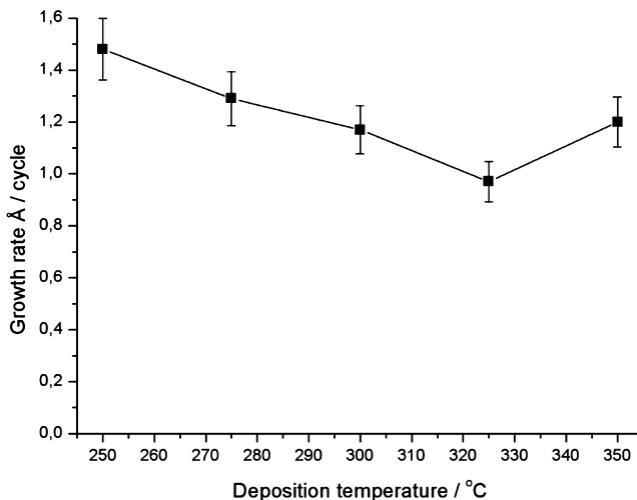
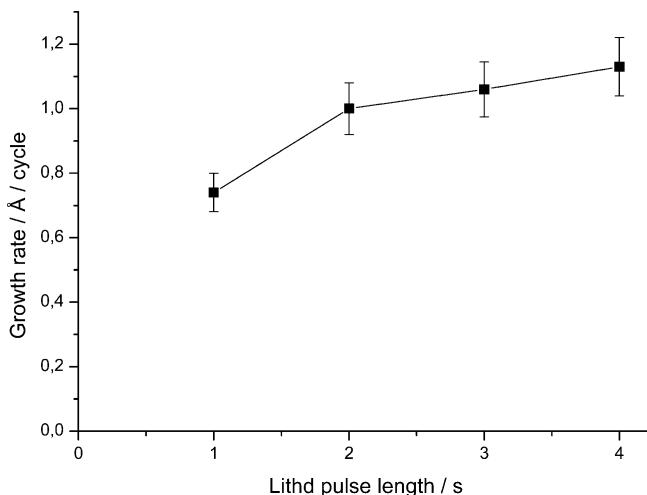
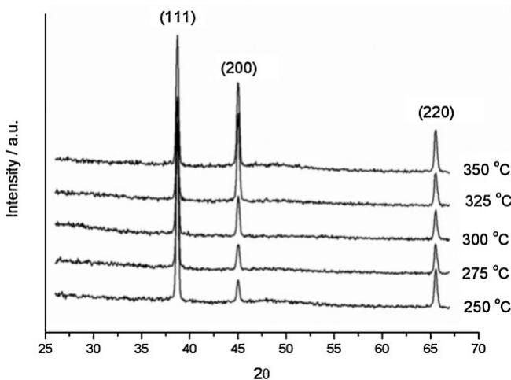
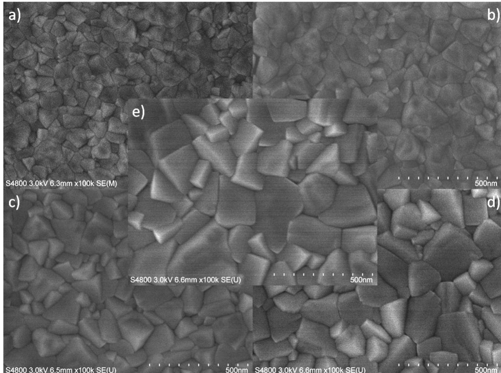
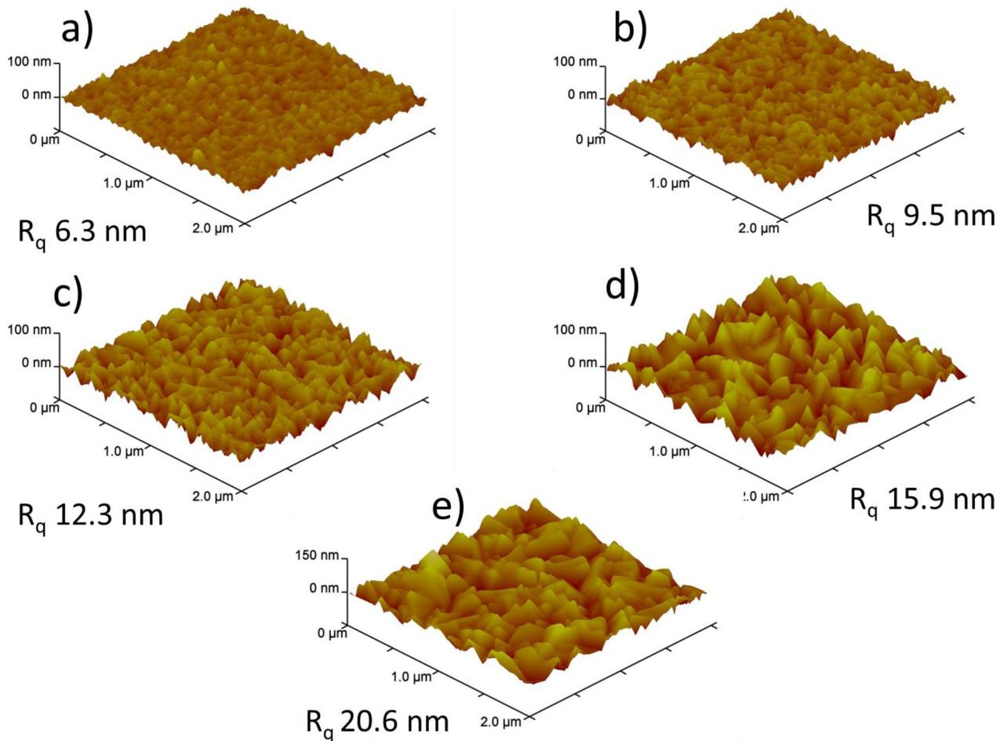

# Atomic Layer Deposition of LiF Thin Films from Lithd and  $\mathbf{TiF_4}$  Precursors**

By Miia Mantymaki,\* Jani Hamalainen, Esa Puukilainen, Frans Munnik, Mikko Ritala, and Markku Leskelai

Lithium fluoride (LiF) is an important optical material with a low refractive index and a large band gap. In this study, thin films of LiF are deposited using atomic layer deposition (ALD). Lithd and  $\mathrm{TiF_4}$  are used as precursors, and they produce crystalline LiF in the temperature range  $250–350^{\circ}\mathrm{C}$ . The films are studied with UV- Vis spectrometry, field emission scanning electron microscopy (FESEM), X- ray diffraction (XRD), atomic force microscopy (AFM) and elastic recoil detection analysis (ERDA). Adhesion of the films is tested by a Scotch tape test. This ALD process results in LiF films with a growth rate of approximately 1 Å per cycle at  $325^{\circ}\mathrm{C}$ . According to ERDA measurements, the films are pure LiF with only small O, C, and H impurities.

Keywords: Atomic layer deposition, Lithium fluoride, Thin films

# 1. Introduction

LiF is an interesting material with various applications. Its large band gap  $(\approx 14\mathrm{eV})$  and low refractive index  $(n\approx 1.39$  at  $580\mathrm{nm}$  ) make it a good window material in the ultraviolet region of electromagnetic radiation.[1,2] LiF is sensitive to both high energy electromagnetic radiation, such as X- rays and gamma rays, and low- energy electrons and ions, easily forming color centers, which can be utilized in imaging detectors and dosimetry.[2- 7] In addition, LiF has been used in organic plastic solar cells to improve the contact between the Al electrode and the organic layer,[8] and in organic light- emitting devices (OLEDs) as a cathode material, combined with Al.[9- 12]

Thus far, thin films of LiF have been deposited using a rather narrow selection of methods. Thermal evaporation of solid LiF is an often used deposition method,[1,2,4,6,7,13] sometimes being assisted by low- energy ions such as Xe or Ar.[3,14] Pulsed laser deposition has also been utilized,[15,16] as well as electron beam evaporation,[17- 19] and DC magnetron sputtering.[20] Chemical methods, such as CVD and ALD have, to our knowledge, not been reported. ALD in particular is an interesting method for LiF deposition, as this technique is known for producing uniform and conformal thin films with precise thickness control.[21] The absence of LiF among materials deposited by ALD is most likely due to the limited number of lithium precursors available for both CVD and ALD,[22- 24] and the hazardous nature of the two simple fluoride precursors, HF and  $\mathrm{F}_2$ . Several other metal fluorides have previously been deposited by ALD with the method introduced by Pilvi and coworkers, i.e., using metal  $\beta$ - diketonates and titanium or tantalum fluorides as precursors.[25- 29] These solid fluoride precursors have volatility in the proper range so that they can be efficiently transported by modest heating. Furthermore, they can be safely handled and condensed from exhaust gases at room temperature. They are also thermally stable and undergo surprisingly clean exchange reactions with many metal- thd complexes, producing corresponding metal fluoride films. Therefore, in these experiments, Lithd (lithium 2,2,6,6- tetramethyl- 3,5- heptanedionate) was chosen as the lithium precursor and TiF4 was used as the fluoride source.

In this paper, a method for depositing LiF thin films by ALD is described. The method uses Lithd and  $\mathrm{TiF_4}$  precursors and produces highly crystalline, pure LiF in the temperature range  $250–350^{\circ}\mathrm{C}$ . The characterization results obtained by various analytical methods are presented.

# 2. Results and Discussion

# 2.1. Film Deposition

LiF thin films were deposited by pulsing Lithd and  $\mathrm{TiF_4}$  precursors onto Si(111) substrates. The growth rate and characteristics of this material, in the deposition

# Chemical Vapor Deposition

temperature range  $250–350^{\circ}\mathrm{C}$  were evaluated. The upper limit of deposition temperature experiments was chosen to be  $350^{\circ}\mathrm{C}$  because of Lithd decomposition at  $375^{\circ}C$  and above. The lower limit for the deposition temperature was chosen to maintain the temperature gradient around the Lithd source essentially constant. Already during the first experiments it was noted that the process is extremely sensitive with regard to the temperature gradient within close proximity to the precursor boats. Changing the gradient resulted in highly profiled films with large, flaky deposits. With careful control of the reactor temperatures, uniform films could be deposited and the experiments were reproducible. To obtain uniform films, it was necessary to use Lithd doses of the order of  $600\mathrm{mg}$  per 750 cycles. By contrast, only a rather small amount of  $\mathrm{TiF_4}$  was needed per one deposition experiment.

Figure 1 shows the growth rate of the LiF films as a function of temperature. The growth rate does not show a plateau typical for most binary ALD processes.[21] Rather, the growth rate decreases when going from 250 to  $325^{\circ}C$  and increases again at  $350^{\circ}C$  A decreasing growth rate with increasing deposition temperature has previously been seen in other fluoride processes,[25- 27] possibly due to a decreasing density of  $\mathrm{TiF}_x$  groups formed on the film surface. However, the increase of the growth rate at  $350^{\circ}\mathrm{C}$  is more unusual. Usually a rising growth rate at high temperatures indicates decomposition of precursors but, in this case, this is highly unlikely as both precursors have been confirmed to stand temperatures up to  $350^{\circ}\mathrm{C}$ $\mathrm{TiF_4}$  has been used at temperatures as high as  $450^{\circ}\mathrm{C}$  [25] and our own experiments demonstrated that Lithd showed decomposition only at  $375^{\circ}C$  It is possible that the high roughness of these films (to be discussed later) affects the thickness measurement somewhat, leading to an apparent higher growth rate. Due to the roughness of these films and consequent challenges in fitting the UV- Vis spectra, the error bars in Figure 1 are  $8\%$

  
Fig. 1. Growth rate of LiF thin films as a function of deposition temperature. Lithd and  $\mathrm{TiF_4}$  pulse lengths were 2 s and purge times between these pulses were 4 s.

Saturation of the growth rate with increasing pulse lengths was also studied (Figs. 2 and 3). Due to the lack of a temperature region with a constant growth rate, the growth temperature for the saturation experiment was chosen as  $325^{\circ}C$  based on the following considerations: Firstly, higher deposition temperatures usually lead to films with less impurities.[26- 28] Secondly, deposition at  $350^{\circ}\mathrm{C}$  showed an increase in the growth rate that could not be properly explained. Lastly, fluoride thin films deposited by ALD at high temperatures often show large root mean square (rms) roughnesses,[26- 28] which can lead to challenges in film characterization. Therefore,  $325^{\circ}C$  was chosen as a compromise. Purge times used were 4 s after both precursor pulses. These purge times are rather long for the reactor type

  
Fig. 2. Growth rate of LiF thin films as a function of  $\mathrm{TiF_4}$  pulse length at  $325^{\circ}C$  The Lithd pulse was kept at 2 s and purge times were 4 s.

  
Fig. 3. Growth rate of LiF thin films as a function of Lithd pulse length at  $325^{\circ}C$  The  $\mathrm{TiF_4}$  pulse was kept at 1 s and purge times were 4 s.

  
Fig. 4. X-Ray diffractograms of LiF thin films deposited at various temperatures. Lithd and  $\mathrm{TiF_4}$  pulse lengths were  $2\mathrm{s}$ , and purge times between these pulses were  $4\mathrm{s}$ .

used in these experiments, however the choice was made based on the sensitivity of the growth to the Lithd dose. The growth rate of the films stays constant for short  $\mathrm{TiF_4}$  pulses  $(0.5 - 2.0\mathrm{s})$ , being approx.  $1\mathrm{\AA}$  per cycle. Longer pulses, on the other hand, result in an almost linearly increasing growth rate. The same increase in growth rate was also observed with longer purge times after the  $\mathrm{TiF_4}$  pulse, which indicates that the increased growth rate is not due to insufficient purging. No complete saturation was seen with different Lithd pulse lengths. The growth rate increases with longer Lithd pulse times, being  $0.7\mathrm{\AA}$  per cycle with  $1\mathrm{s}$  pulses and  $1.1\mathrm{\AA}$  per cycle at  $4\mathrm{s}$  pulses (Fig. 3). In this experiment  $4\mathrm{s}$  was the upper limit due to the high Lithd consumption; the amount of Lithd that can be loaded into the reactor readily became a limiting factor in these experiments.

In typical ALD processes, the thickness of the films increases linearly with the number of cycles.[21] This behavior was studied by depositing LiF films over  $750$ ,  $850$ , and  $1000$  cycles at  $325^{\circ}\mathrm{C}$ . In these experiments the high lithium consumption defined the upper limit for the cycle number. The lower limit was chosen so that the film thickness could still be reliably fitted from the UV- Vis measurements. It was found that the thickness of the  $750$  cycle film was  $73\%$  of that of the  $1000$  cycle film. The  $850$  cycle film, on the other hand, produced a film with thickness of  $87\%$  of the  $1000$  cycle film. The thickness of the LiF films can thus be reasonably well controlled by choosing an

  
Fig. 5. FESEM images of LiF films deposited at various temperatures on  $\mathrm{SiO_2 / Si(111)}$  substrates. Deposition temperatures and film thicknesses are; a)  $250^{\circ}\mathrm{C}$ $111\mathrm{nm}$ , b)  $275^{\circ}\mathrm{C}$ $97\mathrm{nm}$ , c)  $300^{\circ}\mathrm{C}$ $88\mathrm{nm}$ , d)  $325^{\circ}\mathrm{C}$ $73\mathrm{nm}$ , and e)  $350^{\circ}\mathrm{C}$ $90\mathrm{nm}$ . Lithd and  $\mathrm{TiF_4}$  pulse lengths were  $2\mathrm{s}$  and purge times between these pulses were  $4\mathrm{s}$ .

Table 1. Surface roughness of LiF films on  $\mathrm{SiO_2 / Si(111)}$  determined by AFM measurements.  

<table><tr><td>Deposition temp [°C]</td><td>Thickness [nm]</td><td>Roughness [nm]</td></tr><tr><td>250</td><td>111</td><td>6.3</td></tr><tr><td>275</td><td>97</td><td>9.5</td></tr><tr><td>300</td><td>88</td><td>12.3</td></tr><tr><td>325</td><td>73</td><td>15.9</td></tr><tr><td>350</td><td>90</td><td>20.6</td></tr></table>

appropriate cycle number, as the growth rate does not change with larger cycle numbers.

# 2.2. Film Characteristics

In addition to film thicknesses, the fitting of UV- Vis spectra provided tentative values for the refractive indices of the LiF films. At  $580\mathrm{nm}$  LiF has a refractive index of approx. 1.39.30] The deposited films had refractive indices in the range 1.37- 1.43, where the highest values were obtained from the films deposited with long  $\mathrm{TiF_4}$  pulses. Using 2s pulses for both Lithd and  $\mathrm{TiF_4}$  resulted in a narrower refractive index range of 1.37- 1.39. It is common that thin films have somewhat lower refractive index values than the bulk material.[31]

The deposited films were studied by grazing incidence X- ray diffraction (GIXRD) experiments and found to be highly crystalline (Fig. 4). Reflections corresponding to the LiF crystal planes (111), (200), and (220) were recognized, with no detectable crystalline impurity phases present. FESEM images in Figure 5 corroborate the XRD results; all the films were crystalline, showing larger crystals at higher deposition temperatures. The change in the crystal size is considerable. The same phenomenon has previously been observed for evaporated LiF thin films, as well as other fluorides deposited by ALD.[18,25- 28,32,33] In addition, it has been noted that the mean grain size in evaporated LiF films increases linearly with respect to film thickness at approx.  $300^{\circ}\mathrm{C}$ .[34] This could not, however, be observed with the 750, 850, and 1000 cycle films deposited at  $325^{\circ}\mathrm{C}$ , possibly due to the small thickness range achieved in these experiments.

The morphology of the LiF films was studied in more detail with AFM measurements (Table 1, Fig. 6). The rms

  
Fig. 6. AFM images of LiF films deposited at various temperatures. Deposition temperatures, films thicknesses, and rms roughnesses are; a)  $250^{\circ}\mathrm{C}$  111 nm 6.3 nm, b)  $275^{\circ}\mathrm{C}$  97 nm 9.5 nm, c)  $300^{\circ}\mathrm{C}$  88 nm 12.3 nm, d)  $325^{\circ}\mathrm{C}$  73 nm 15.9 nm, and e)  $350^{\circ}\mathrm{C}$  90 nm 20.6 nm. Notice that the vertical axis has a different scale in image e). Lithd and  $\mathrm{TiF_4}$  pulse lengths were 2 s and purge times between these pulses were 4 s.

roughness of the films increases with increasing deposition temperature, being  $6.3\mathrm{nm}$  for the film deposited at  $250^{\circ}\mathrm{C}$ $(111\mathrm{nm})$  and  $20.6\mathrm{nm}$  for the film deposited at  $350^{\circ}\mathrm{C}$ $(90\mathrm{nm})$ . The rms roughnesses of films deposited at the lowest temperatures can be considered quite reasonable for films showing such high crystallinity. The change in the roughness as a function of deposition temperature is almost linear, showing no large increase at deposition temperatures higher than  $300^{\circ}\mathrm{C}$ , despite the fact that the morphology could be seen to change considerably in the FESEM images. Such a linear increase in rms roughness has not been seen before in ALD fluorides. Usually the roughness stays rather constant until a certain threshold deposition temperature, after which it increases dramatically.[26- 28]

The impurity contents of the films deposited at various temperatures was analyzed by ERDA measurements (Table 2). The films show carbon and hydrogen impurities of the order of  $0.5\mathrm{at. - \%}$  at all deposition temperatures. The somewhat larger oxygen impurity originates partly from the native  $\mathrm{SiO}_2$  layer of the substrate, as the oxygen concentrations were not corrected for the oxygen in this layer. The hydrogen, carbon, and oxygen impurity levels were too low for depth profiling. As a result, it is difficult to say whether these impurities originate from the lithium precursor or if they are simply surface contamination from long storage and handling in air. In any case, the films are very pure LiF, with the lithium to fluoride ratio close to unity in all the films except the one deposited at  $275^{\circ}\mathrm{C}$ . This deviation, however, remains within the statistical uncertainty. One sample, deposited with a 6 s TiF4 pulse, was also studied to determine whether the larger refractive index of this film was due to varying impurity levels, but no differences could be found. It is noteworthy that no titanium could be detected in the films (detection limit  $0.1\mathrm{at. - \%}$ ). In other fluoride materials utilizing the same titanium(IV)fluoride precursor, some titanium impurities have been present.[25- 28]

Adhesion of the films to the  $\mathrm{SiO}_2 / \mathrm{Si}(111)$  substrate was tested with the Scotch tape test. The films tested were deposited at  $325^{\circ}\mathrm{C}$  and at  $250^{\circ}\mathrm{C}$ . A  $100\mathrm{nm}$  film deposited at  $325^{\circ}\mathrm{C}$  peeled almost completely off the substrate, whereas less damage was noted for a  $73\mathrm{nm}$  film deposited at the same temperature. The poor adhesion of the thicker films could also be noticed during normal handling, as scratch marks were easily formed in the films. In contrast, the same could not be detected for the thinner samples. The  $111\mathrm{nm}$  sample deposited at  $250^{\circ}\mathrm{C}$  showed very little damage. Possibly the better adhesion is related to the smaller roughness of the film deposited at lower temperature. Evaporated  $500\mathrm{nm}$  LiF films have been reported to adhere well to silicon substrates when the substrate temperature is kept above room temperature during the evaporation.[32]

Table 2. Composition [at.  $\%$  of LiF films deposited at various temperatures on  $\mathrm{SiO_2 / Si(111)}$  as determined by ERDA measurements. Lithd and  $\mathrm{TiF_4}$  pulse lengths were 2s and purge times between these pulses were 4 s. In one sample the  $\mathrm{TiF_4}$  pulse was 6s, with Lithd and purges being the same as in the others.  

<table><tr><td></td><td>250℃</td><td>275℃</td><td>300℃</td><td>325℃</td><td>325℃ [a]</td><td>350℃</td></tr><tr><td>Li</td><td>49.2</td><td>52.2</td><td>49.3</td><td>47.3</td><td>48.0</td><td>48.3</td></tr><tr><td>F</td><td>48.9</td><td>46.2</td><td>48.7</td><td>49.8</td><td>50.4</td><td>49.6</td></tr><tr><td>O</td><td>0.9</td><td>0.7</td><td>1.1</td><td>1.5</td><td>0.7</td><td>1.1</td></tr><tr><td>C</td><td>0.5</td><td>0.4</td><td>0.4</td><td>0.7</td><td>0.5</td><td>0.6</td></tr><tr><td>H</td><td>0.52</td><td>0.45</td><td>0.53</td><td>0.65</td><td>0.44</td><td>0.44</td></tr><tr><td>Li/F</td><td>1.01</td><td>1.13</td><td>1.01</td><td>0.95</td><td>0.95</td><td>0.97</td></tr></table>

$\mathrm{[a]6s}$ $\mathrm{TiF_4}$  pulse.

# 3. Conclusions

We have demonstrated, for the first time, a method of depositing LiF by ALD. This method utilizes Lithd and  $\mathrm{TiF_4}$  as precursors, and results in highly crystalline LiF films in the temperature range  $250–350^{\circ}\mathrm{C}$ . The process does not show a temperature range of constant growth rate typical for many ALD processes. Still, the film thickness can be easily controlled by changing the number of deposition cycles. The films show an increasing rms roughness and grain size when going to higher deposition temperatures, as has previously been seen in LiF processes using other deposition methods. The high surface roughness can be a problem in optical applications of LiF. Also, the adhesion of the films to the substrate is rather poor, especially with thicker films deposited at higher temperatures. The films are pure LiF according to both XRD and ERDA, showing oxygen impurities of the order of  $1\mathrm{at. - \%}$ . Both carbon and hydrogen impurities are below  $1\mathrm{at. - \%}$  at all growth temperatures.

# 4. Experimental

Film Deposition: LiF films were deposited in a hot- wall, flow- type F- 120 ALD reactor (ASM Microchemistry Ltd.). Deposition temperatures were varied between 250 and  $350^{\circ}\mathrm{C}$ . The pressure inside the reactor was of the order of 5 mbar during depositions. The films were deposited onto  $5\mathrm{cm}\times 5\mathrm{cm}$  Si(111) substrates with native  $\mathrm{SiO}_2$  on top. Lithd (Volatec Oy, Finland), and  $\mathrm{TiF_4}$  (Strem Chemicals Inc.,  $98\%$ ) were evaporated inside the reactor from open glass boats at 180 and  $135^{\circ}\mathrm{C}$ , respectively. Pulsing of the precursors was done by inert gas valving. The  $\mathrm{TiF_4}$  pulse length was varied between  $0.5$  and  $6\mathrm{s}$ , and the Lithd pulse was  $1$  and  $4\mathrm{s}$ . Nitrogen produced by a Parker domnick hunter G21000 nitrogen generator, was used as the carrier and purging gas. A purge time of  $4\mathrm{s}$  was used between the precursor pulses to separate these pulses and remove gaseous reaction side products.

Film Characterization: The film thickness was evaluated by UV- Vis spectroscopy from reflection spectra, measured by a Hitachi U2000 spectrophotometer. The wavelength range was  $390 - 1050\mathrm{nm}$  and a fitting program developed by Yilammi and Ranta- aho [35] was used to analyze the spectra. Growth rates calculated from these measurements include error bars of  $8\%$ .

Crystallinity of the films was assessed by GIXRD measurements conducted with a PANalytical X'Pert Pro MPD X- ray diffractometer. Film morphology was examined both by SEM with a Hitachi S4800 FESEM instrument, and by AFM with a Multimode V AFM equipped with a Nanoscope V controller (Veeco Instruments). For roughness analysis with AFM, the samples were measured in a tapping mode in air using a phosphorous- doped silicon probe (RTESP) delivered by Veeco Instruments. Adhesion of the films to the Si substrate was evaluated qualitatively by the Scotch tape test.

The samples were analyzed with ERDA using a  $43\mathrm{MeV}\mathrm{Cl}^{7 + }$  ion beam. The angle between the sample normal and the incoming beam was  $75^{\circ}$ , and the scattering angle was  $31^{\circ}$ . The analyzed area was about  $1.5\mathrm{mm}\times 1.5\mathrm{mm}$ .

# Chemical Vapor Deposition

The recoil ions were detected with a Bragg Ionization Chamber using a full energy detection circuit and a fast timing circuit to obtain a Z- dependent signal to separate ion species. He and Li were detected with a separate solid state detector at a scattering angle of  $41^{\circ}$ , preceded by an Al- coated Mylar foil to stop other scattered and recoiled ions. The solid angles of both detectors were calibrated using a mono- crystalline thick LiF sample.

Received: October 16, 2012  Revised: January 23, 2013

[1] D. A. Lapiano- Smith, E. A. Eklund, F. J. Himpsel, L. J. Terminello, Appl. Phys. Lett. 1991, 59, 2174.  [2] T. Mazur, L. Markowski, M. Grodzicki, Vacuum 2010, 64, 622.  [3] R. M. Montereali, F. Bonfigli, V. Mussi, E. Nichelatti, A. Santoni, S. Scaglione, IOP Conf. Ser.: Mater. Sci. Eng. 2010, 15, 012017.  [4] S. Almaviva, F. Bonfigli, I. Franzini, A. Lai, R. M. Montereali, D. Pelliccia, A. Cedola, S. Lagomarsino, Appl. Phys. Lett. 2006, 89, 054102.  [5] M. Fragopoulou, V. Konstantakos, M. Zamani, S. Siskos, T. Laopoulos, G. Sarrabayrouse, Nucl. Instrum. Meth. A 2010, 621, 611.  [6] E. Nichelatti, S. Almaviva, F. Bonfigli, I. Franzini, R. M. Montereali, M. A. Vincenti, Nucl. Instrum. Meth. B 2010, 268, 3035.  [7] R. M. Montereali, T. Marolo, M. Montecchi, E. Nichelatti, Nucl. Instrum. Meth. B 2010, 268, 2866.  [8] S. E. Shaheen, C. J. Brabec, N. S. Sariciftci, F. Padinger, T. Fromherz, J. C. Hummelen, Appl. Phys. Lett. 2001, 78, 841.  [9] B. J. Chen, X. W. Sun, K. S. Wong, X. Hu, Opt. Express 2005, 13, 26.  [10] B. J. Chen, X. W. Sun, S. C. Tan, Opt. Express 2005, 13, 937.  [11] Y. Kim, Nanotechnology 2008, 19, 355207.  [12] K. Tanaka, M. Amou, H. Usui, J. Vac. Sci. Technol. B. 2004, 22, L1.  [13] J. Stuchlik, M. Ledinský, S. Honda, I. Drbohlav, T. Mates, A. Fejfar, K. Hruška, T. H. Stuchlikova, J. Kočka, Thin Solid Films 2009, 517, 6829.  [14] A. Cricenti, R. M. Montereali, V. Mussi, E. Nichelatti, L. Pilloni, S. Scaglione, F. Somma, J. Non-Cryst. Solids 2003, 322, 111.  [15] A. Perea, J. Gonzalo, C. N. Afonso, S. Martelli, R. M. Montereali, Appl. Surf. Sci. 1999, 138- 139, 533.

[16] W. S. Tsang, C. L. Mak, K. H. Wong, Appl. Phys. A. 2003, 77, 693.  [17] M. Kumar, S. A. Khan, P. Rajput, F. Singh, A. Tripathi, D. K. Avasthi, A. C. Pandey, J. Appl. Phys. 2007, 102, 083510.  [18] M. Cremona, M. H. P. Mauricio, L. C. Scavarda do Carmo, R. Prioli, V. B. Nunes, S. I. Zanette, A. O. Caride, M. P. Albuquerque, J. Microsc. 2000, 197, 260.  [19] M. Kumar, P. Rajput, S. A. Khan, D. K. Avasthi, A. C. Pandey, Appl. Surf. Sci. 2010, 256, 2199.  [20] G. B. Thompson, D. D. Allred, J. X- ray Sci. Technol. 1997, 7, 159.  [21] M. Ritala, M. Leskelä, in Handbook of Thin Film Materials, Vol 1: Deposition and Processing of Thin Films (Ed: H. S. Nalwa), Academic Press, San Diego, CA 2002.  [22] M. Patkonen, T. Almaviva, M. Almos, T. Sajavaara, O. Nilsen, H. Fjellvag, J. Mater. Chem. 2009, 19, 8767.  [23] A. S. Cavanagh, Y. Lee, B. Yoon, S. M. George, ECS Trans. 2010, 33, 223.  [24] J. Hämäläinen, J. Holopainen, F. Munnik, T. Hatanpää, M. Heikkilä, M. Ritala, M. Leskelä, J. Electrochem. Soc. 2012, 159, A259.  [25] T. Pilvi, K. Arstila, M. Leskelä, M. Ritala, Chem. Mater. 2007, 19, 3387.  [26] T. Pilvi, T. Hatanpää, E. Puukilainen, K. Arstila, M. Bischoff, U. Kaiser, N. Kaiser, M. Leskelä, M. Ritala, J. Mater. Chem. 2007, 17, 5077.  [27] T. Pilvi, E. Puukilainen, K. Arstila, M. Leskelä, M. Ritala, Chem. Vap. Deposition 2008, 14, 85.  [28] T. Pilvi, E. Puukilainen, F. Munnik, M. Leskelä, M. Ritala, Chem. Vap. Deposition 2009, 15, 27.  [29] T. Pilvi, E. Puukilainen, U. Kreissig, M. Leskelä, M. Ritala, Chem. Mater. 2008, 20, 5023.  [30] H. H. Li, J. Phys. Chem. Ref. Data 1976, 5, 329.  [31] H. K. Pulker, Appl. Opt. 1979, 18, 1969.  [32] F. Cosset, A. Celerier, B. Barelaud, J.- C. Vareille, Thin Solid Films 1997, 303, 191.  [33] H. Kim, A. H. King, J. Mater. Res. 2008, 23, 452.  [34] U. Kaiser, N. Kaiser, P. Weißbrodt, U. Mademann, E. Hacker, H. Müller, Thin Solid Films 1992, 217, 7.  [35] M. Ylilammi, T. Ranta- aho, Thin Solid Films 1993, 232, 56.