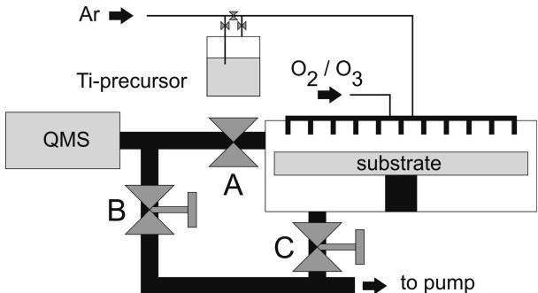
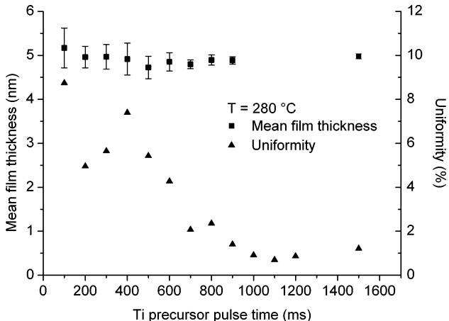
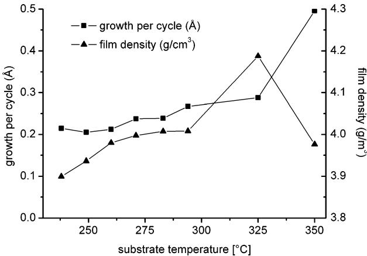
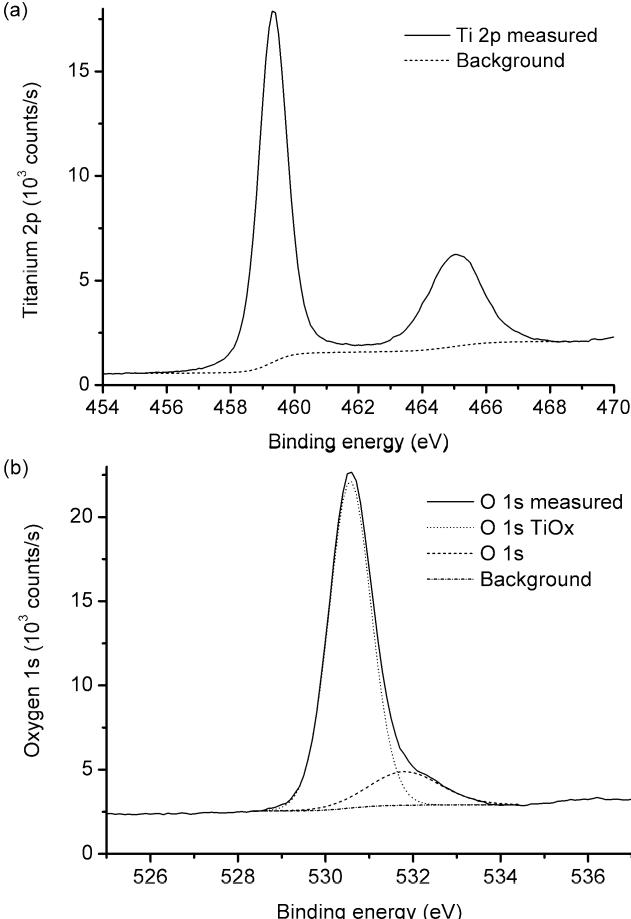
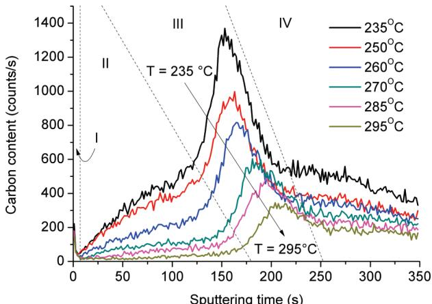
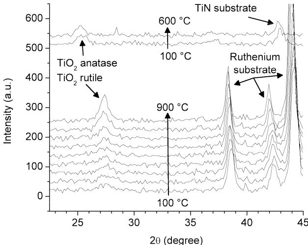
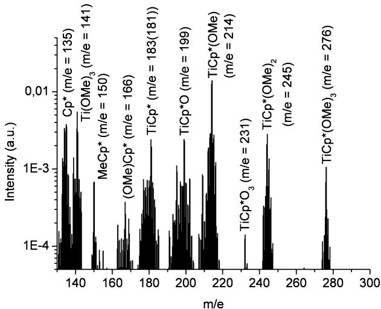
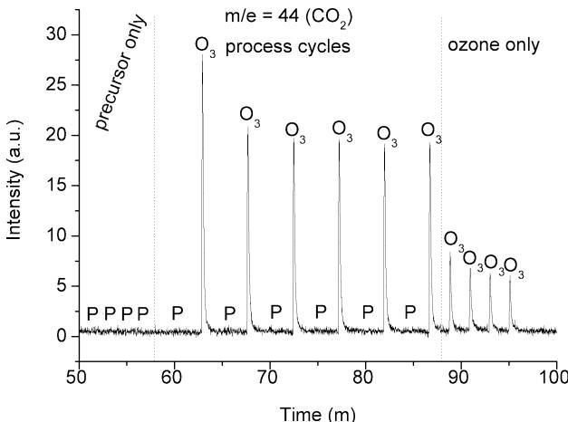
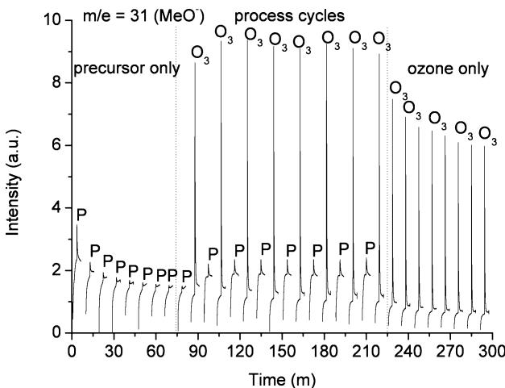

# Atomic Layer Deposition of Titanium Dioxide Thin Films from  $\mathrm{Cp^{*}Ti(OMe)_{3}}$  and Ozone

Martin Rose,\*,† Jaakko Niinisto,\*,§ Pawel Michalowski,\* Lukas Gerlich,\* Lutz Wilde,\* Ingolf Endler, $^\dagger$  and Johann W. Barthall

Fraunhofer IKTs, 01277 Dresden, Germany, Fraunhofer CNT, 01099 Dresden, Germany, Department of Chemistry, University of Helsinki, FI- 00014 Helsinki, Finland, and Department of Electrical Engineering and Information Technology, IHM, Technische Universitat Dresden, 01062 Dresden, Germany

Received: August 17, 2009; Revised Manuscript Received: October 6, 2009

The thermal atomic layer deposition of  $\mathrm{TiO_2}$  from  $\mathrm{Cp^{*}Ti(OMe)_{3}}$  and ozone was studied in a  $300~\mathrm{mm}$  wafer reactor by quadrupole mass spectrometry (QMS). The deposited thin films were analyzed by X- ray reflectivity (XRR), X- ray photoelectron spectroscopy (XPS), grazing incident X- ray diffraction, and time- of- flight secondary ion mass spectrometry (ToF- SIMS). The XRR and XPS measurements revealed that nearly stoichiometric  $\mathrm{TiO_2}$  films were grown in a self- limiting growth mode. The growth per cycle increased from  $0.22\mathrm{\AA}$  at 235  $^\circ \mathrm{C}$  to  $0.29\mathrm{\AA}$  at  $330^{\circ}\mathrm{C}$ . Films deposited on titanium nitride showed an anatase crystal structure, while films deposited on ruthenium crystallized in the rutile phase. The ToF- SIMS analysis indicated that the carbon contamination reduced to very low levels at a deposition temperature of  $295~^\circ \mathrm{C}$ . The QMS studies revealed the release of MeOH during the precursor pulse.  $\mathrm{CO_2}$  and  $\mathrm{H}_2\mathrm{O}$  were released during the ozone pulse at a process pressure of 7 mbar. At a pressure of  $3\times 10^{- 3}$  mbar, the release of the  $\mathrm{Cp^{*}}$  ligand and the remaining OMe ligands during the ozone pulse could be observed. It was demonstrated that QMS studies can be used in a  $300~\mathrm{mm}$  reactor at very low pressures to study the process chemistry.

# 1. Introduction

Titanium dioxide has a wide range of applications in thin film technology due to its attractive properties such as a refractive index above 2.3, good transparency to visible light, photocatalytic activity, chemical stability, and high permittivity of  $\sim 100$  (rutile phase). For microelectronic applications pure  $\mathrm{TiO_2}$  as a capacitor or gate dielectric suffers from a narrow band gap of  $3.3\mathrm{eV}^2$  leading to unacceptable high leakage current of, e.g.,  $10^{- 5}\mathrm{Acm}^{- 2}$  at  $0.8\mathrm{V}$ . However, alkaline earth titanates, such as  $\mathrm{SrTiO_3}$ , are considered as the most promising candidates for very high- permittivity (high-  $k$ ) dielectrics for dynamic random access memories (DRAMs).

Atomic layer deposition (ALD) has emerged as a leading candidate to deposit thin dielectric layers with excellent conformity as well as composition and thickness control on demanding high aspect ratio substrate features. These characteristic properties of the ALD method result from the self- limiting growth mode via alternative, surface saturating precursor pulses separated by inert gas purging. To achieve an ALD- type reaction mechanism, the choice of the precursors is of utmost importance. The key requirements for a good ALD precursor include sufficient volatility, high reactivity, and thermal stability. Especially in the case of  $\mathrm{TiO_2}$  and thus  $\mathrm{SrTiO_3}$ , the need for better ALD precursors is evident. In the recent years, many different ALD processes for  $\mathrm{TiO_2}$  have been developed. Titanium halides exhibit high thermal stability, but the formation of corrosive reaction byproducts, e.g., HCl, can cause problems. Chloride precursors form stable alkaline earth metal chlorides that are incorporated in the deposited film.

Reactive titanium alkylamides such as  $\mathrm{Ti(NMe)_4}$  suffer from self- decomposition at relatively low temperatures, which destroys the ALD- type growth mode. From the group of titanium alkoxides, e.g.,  $\mathrm{Ti(OPr)_4}$  is widely applied, but again, thermal stability is limited and temperatures approaching  $300^{\circ}\mathrm{C}$  result in precursor decomposition. On the other hand,  $\mathrm{Ti(OMe)_4}$  has somewhat higher thermal stability than  $\mathrm{Ti(OPr)_4}$  and has been reported to give very promising results when applied together with  $\mathrm{Sr(Bu_3Cp)_2}$  and water to form high-  $k\mathrm{SrTiO_3}$  films on TiN at  $250 - 300^{\circ}\mathrm{C}$ . However, solid  $\mathrm{Ti(OMe)_4}$  can increase the risk of particle incorporation, and thus liquid precursors are usually preferred. Organometallic group precursors, namely, the cyclopentadienyls  $(\mathrm{Cp} = \mathrm{C}_5\mathrm{H}_5)$ , have gained interest recently, especially in the ALD of the other group 4 oxides,  $\mathrm{ZrO_2}$  and  $\mathrm{HfO_2}$ . Increased thermal stability can be considered as a clear advantage for the  $\mathrm{Cp}$  precursors. In the case of titanium  $\mathrm{Cp}$  precursors, the thermal stability enhancement seems to be clear when compared to the pure alkylamides; e.g., changing one  $\mathrm{NMe_2}$  ligand to a  $\mathrm{CpMe}$  ligand increases the thermal stability. In that study the applied heteroleptic alkylamido- cyclopentadienyl precursor, namely,  $\mathrm{CpMeTi(NMe_2)_3}$ , provides self- limiting ALD- type growth characteristics up to around  $300^{\circ}\mathrm{C}$ .

Another option is to form a mixed alkoxide- cyclopentadienyl titanium compound to gain even higher thermal stability. This liquid precursor,  $\mathrm{Cp^{*}Ti(OMe)_3}$ $(\mathrm{Cp^{*}} =$  pentamethylcyclopentadienyl,  $\mathrm{C}_5(\mathrm{CH}_3)_5)$ , was introduced very recently by Blasco et al. Their report concentrated on the precursor synthesis and characterization. Initial ALD investigations revealed a very wide ALD process window with deposition temperatures up to  $375 - 400^{\circ}\mathrm{C}$ . In the present paper we have studied the ALD growth of  $\mathrm{TiO_2}$  using  $\mathrm{Cp^{*}Ti(OMe)_3}$  and ozone on  $300~\mathrm{mm}$  wafers in detail. An important part of this study was to investigate the ALD growth mechanism in situ, using a quadrupole mass spectrometer (QMS). In situ QMS studies, performed under similar conditions as used in the actual film

  
Figure 1. ALD reactor and QMS setup.

depositions, give valuable information on the surface reactions. $^{18 - 21}$  Ozone- based ALD processes have only rarely been studied by in situ QMS $^{22 - 25}$  and not with an industrial scale reactor as in the present paper.

# 2. Experimental Section

The samples were prepared in a custom- built  $300\mathrm{mm}$  showerhead ALD reactor (FHR Anlagenbau GmbH, ALD300). The reactor and the experimental setup are shown in Figure 1. During the film deposition, valve A was closed and the pressure in the ALD chamber was regulated by throttle valve C. The in situ QMS studies were conducted in the same reactor setup. However, valve A was opened, while throttle valve C was closed completely. The pressure in the ALD chamber was then regulated by throttle valve B. The QMS was connected to the side of the ALD chamber so that the distance between the substrate and the sampling inlet is minimized. This setup was chosen to reduce the amount of byproduct that originates from the reactor wall.

The  $\mathrm{Cp^{*}Ti(OMe)_{3}}$  Air Liquide, StarTi) precursor was evaporated in a bubbler type canister at  $90^{\circ}\mathrm{C}$ . The vapor pressure was 0.8 mbar. Argon was used as carrier and purging gas at a flow rate of 500 sccm. Ozone (MKS, AX8560) in a concentration of  $250~\mathrm{g / m^3}$  was delivered at a flow rate of 1000 sccm. For the deposition of titanium dioxide on planar wafers, the metal precursor pulse time was varied between 100 and 1500 ms. The ozone pulse time was  $2\mathrm{s}$  for all film depositions. The process pressure was 1 mbar. Single crystal silicon wafers with a diameter of  $300~\mathrm{mm}$  were used. The substrate surface was a  $\{100\}$  crystal plane. For selected samples also TiN and Ru covered Si substrates were used. The substrate temperature was varied between 235 and  $350~\mathrm{^\circ C}$ . The reactor wall temperature was  $150^{\circ}\mathrm{C}$  for all experiments.

The mean film thickness and the film uniformity were determined from a 13 point X- ray reflectivity (XRR) measurement (Jordan Valley, JYX 5200T). A single layer model has was used to model the XRR data in order to extract the film thickness and the film density.

The film composition was analyzed by X- ray photoelectron spectroscopy (XPS). The measurements were performed on a Thermo Fisher Scientific Theta 300 spectrometer. The base pressure in the analysis chamber was in the range of  $10^{- 9}$  mbar. A high- resolution monochromatic Al Kα X- ray source was used with a spot diameter of  $400\mu \mathrm{m}$ . The core energy spectra of carbon 1s, oxygen 1s, silicon  $2\mathrm{p}_{3 / 2}$ , and titanium  $2\mathrm{p}_{3 / 2}$  were obtained at a pass energy of  $80\mathrm{eV}$  and a step size of  $0.1\mathrm{eV}$ . For the peak fitting procedure, a mixture of Lorentzian and Gaussian functions were used together with the Shirley background subtraction method. The analysis was performed using Avantage 3.97 by Thermo Fisher Scientific. The measured intensities were corrected by the corresponding Scofield cross sections, the lens transmission function, and the energy correction factor as a function of the resulting kinetic energy of each element. The spectrum was calibrated by shifting the carbon 1s peak of the surface contamination to  $285.0\mathrm{eV}$ .

  
Figure 2. Film thickness and film uniformity on a  $300~\mathrm{mm}$  wafer for different precursor pulse times. The error bars indicate the minimum and maximum thickness as measured by XRR. The half range is defined as the thickness range divided by two divided by the mean thickness.

Time- of- flight secondary ion mass spectrometry (ToF- SIMS) measurements were performed in negative mode (ION- TOF, ToF- SIMS 300R) in order to determine the level and the distribution of contaminations. A  $0.3\mathrm{keV}\mathrm{Cs}^{+}$  ion beam was used for sputtering, and  $25\mathrm{keV}\mathrm{Bi}^{+}$  ions were used as the analyzing beam. All signals were normalized to the  ${}^{30}\mathrm{Si}^{- }$  signal originating from the substrate after the layer of interest was sputtered away.

Grazing incident X- ray diffraction (GIXRD) diffractograms were recorded (Bruker AXS, D8 Discover) at different temperatures. The constant angle of incidence was  $0.65^{\circ}$ , while  $2\theta$  scans were performed in the range from  $22^{\circ}$  to  $45^{\circ}$  with a step size of  $0.15^{\circ}$  and a counting time of  $1.9\mathrm{s}$ . The samples were heated in a nitrogen atmosphere at a rate of  $5\mathrm{K / min}$  from room temperature to  $900^{\circ}\mathrm{C}$ . During the heating the presence of traces of oxygen could not be ruled out.

The QMS experiments were performed using a MKS Microvision- IP. The mass spectrometer is differentially pumped. Inlet A was configured for a maximum pressure of 10 mbar, and inlet B was configured for a maximum pressure of  $10^{- 2}$  mbar. The electron current was  $1\mathrm{mA}$  and the electron energy was  $40\mathrm{eV}$ . Mass spectra were recorded at a process pressure of  $7\mathrm{mbar}$  using inlet A and  $6\times 10^{- 5}$  mbar using inlet B. The substrate temperature was  $320^{\circ}\mathrm{C}$  for the high- pressure experiments and  $215^{\circ}\mathrm{C}$  for the low- pressure experiments. For the QMS studies  $300~\mathrm{mm}$  silicon wafers containing a high density of cylindrical trenches with an aspect ratio of 60:1 were used. The total reactive surface increases by a factor of 30 to about  $2\mathrm{m}^2$  when using structured substrates. The increased reactive surface generates more byproduct during the surface reactions, which results in a stronger QMS signal.

# 3. Results and Discussion

3.1. Film Growth and Characterization. The mean film thickness and the film uniformity for different metal precursor pulse times are shown in Figure 2. The films used in this analysis were deposited at a substrate temperature of  $280^{\circ}\mathrm{C}$ , and the ozone pulse time was  $2\mathrm{s}$ . The graph shows that the mean film thickness is almost independent of the metal precursor pulse time. Even for pulse times as short as  $100~\mathrm{ms}$ , an average film

  
Figure 3. Growth per cycle and film density for substrate temperatures between 235 and  $350^{\circ}\mathrm{C}$ .

thickness of  $5\mathrm{nm}$  was obtained after 200 ALD cycles. For long pulse times of  $1.5\mathrm{s}$  no increase in the film thickness can be observed. In addition, the layer uniformity increased with increasing pulse time. The uniformity is defined as the range of the film thickness divided by the mean film thickness divided by two. Therefore, the ALD- type self- limiting film growth mode was verified.

In order to study the growth per cycle (GPC) at different substrate temperatures, thin titanium dioxide films were deposited on  $300~\mathrm{mm}$  silicon wafer. The substrate temperature was increased from 235 to  $350^{\circ}\mathrm{C}$ . At each temperature three samples were prepared using 200, 250, and 300 ALD cycles, respectively. The GPC was obtained from the linear interpolation of the mean thicknesses. The obtained GPC at various substrate temperatures is shown in Figure 3. The GPC is  $0.22\mathrm{\AA}$  for temperatures between 235 and  $260^{\circ}\mathrm{C}$ . For higher temperatures the GPC increases gradually to  $0.29\mathrm{\AA}$  at a temperature of  $330^{\circ}\mathrm{C}$ . For even higher temperature of  $350^{\circ}\mathrm{C}$ , the GPC increases to  $0.50\mathrm{\AA}$ . It should be noted that even at the highest substrate temperature the film growth was linear. The linear interpolation revealed a positive  $y$ - axis offset of about  $0.4\mathrm{nm}$  for all samples, which indicates the presence of a thin interface layer or an accelerated growth during the incubation phase. The thickness of the films grown from 300 ALD cycles increased from 7.5 to  $8.5\mathrm{nm}$  with increasing substrate temperature. The thickness half range of all those films was below  $2.5\%$ , while the film deposited at the lowest temperature had the best uniformity. The thickness uniformity could be improved with longer metal precursor pulse times.

The film density at different substrate temperatures is shown in Figure 3. The density increases with increasing substrate temperature and reaches a maximum of  $4.19\mathrm{g}\mathrm{cm}^{- 3}$  at  $325^{\circ}\mathrm{C}$ . The decrease of the film density at  $350^{\circ}\mathrm{C}$  can be explained by partial precursor decomposition and the increased incorporation of precursor fragments.

The XPS spectra shown in Figure 4 revealed a slightly higher oxygen amount than for stoichiometric titanium dioxide. For titanium 32 at  $\%$ $\pm 0.5$  at  $\%$  Figure 4a and for oxygen 68 at  $\%$ $\pm 0.5$  at  $\%$  Figure 4b) were obtained. The titanium  $2\mathrm{p}_{3 / 2}$  peak at  $459.3\mathrm{eV}$  with a spin orbital splitting difference of 5.75 eV and the oxygen 1s peak at  $530.5\mathrm{eV}$  correspond to the literature findings for titanium dioxide.26 Carbon contamination could only be found on the surface of the sample as indicated by angle resolved measurements and XPS spectra recorded after sputtering.

As  $\mathrm{Cp^{*}Ti(OMe)_{3}}$  contains an abundant amount of carbon, the carbon content of  $8\mathrm{nm}$  thick films was studied by ToF

  
Figure 4. XPS core energy spectra for (a) titanium  $2\mathrm{p}$  orbital and (b) oxygen 1s orbital.

  
Figure 5. TOF-SIMS profiles of carbon contamination for films deposited between 235 and  $295^{\circ}\mathrm{C}$ . The deposition temperature increases along the arrow. The decrease of carbon contamination with increasing deposition temperature can be observed. The sample is divided into regions: the surface (I), the thin film region (II), the interface between the thin film and the substrate (III), and the bulk substrate (IV).

SIMS. Figure 5 shows depth profiles of the carbon contamination of titanium dioxide films deposited from 300 ALD cycles at different substrate temperatures. The substrate temperature increases along the arrow from 235 to  $295^{\circ}\mathrm{C}$ . The profiles can be divided into four regions, i.e., the surface (I), the thin film region (II), the interface between the thin film and the substrate (III), and the bulk substrate (IV). A significant amount of carbon was detected on the sample surface. However, the level of contamination decreases rapidly inside the film. The surface

  
Figure 6. GI-XRD spectra of  $\mathrm{TiO_2}$  films on ruthenium and titanium nitride at different temperatures. The films have an anatase crystal structure when deposited on TiN, and the crystal structure does not change with increasing temperature. Films deposited on ruthenium are amorphous. With increasing temperature the films crystallize in the rutile structure.

contamination is common for all samples examined in this setup with this tool and cannot be attributed to the ALD process. The thin film region shows the actual contamination level in the dielectric. The contamination level decreases with increasing deposition temperature. While the level of contamination is high for depositions at  $235^{\circ}C$  the level is very low for deposition temperatures above  $270^{\circ}C$  The peak at the interface that is visible for all samples originates from the surface contamination on the silicon substrate. The position of the peak shifts toward higher sputtering times for higher deposition temperatures as the film thickness increases with increasing deposition temperature. The bulk substrate shows standard contamination levels.

In order to study the crystal structure of the  $\mathrm{TiO_2}$  films,470 ALD cycles were deposited at  $280^{\circ}C$  on TiN and Ru substrates resulting in  $12\mathrm{nm}$  thick films. Figure 6 shows the results of the GI- XRD measurements. The  $\mathrm{TiO_2}$  films deposited on TiN have an anatase structure as indicated by the peak at  $25.30^{\circ}$  The peak at  $42.63^{\circ}$  originates from the TiN substrate. The crystal structure does not change for temperatures up to  $600^{\circ}\mathrm{C}$  At higher temperatures (not shown here), the TiN peak disappears and a peak corresponding to rutile  $\mathrm{TiO_2}$  at  $27.47^{\circ}$  appears. This indicates the oxidation of the TiN electrode. Films deposited on Ru are partially amorphous and partially crystalline with a rutile structure. With increasing temperature the peak at  $27.47^{\circ}$  becomes more pronounced, which indicates a crystallization of the film in the rutile structure. The peaks at  $38.42^{\circ}$ $42.19^{\circ}$  and  $44.05^{\circ}$  originate from the Ru substrate. The slight shift of the observed peaks with increasing temperature is caused by thermal expansion of the films.

3.2. Quadrupole Mass Spectrometry. The fragmentation of  $\mathrm{Cp^{*}Ti(OMe)_{3}}$  in the ion source shown in Figure 7 was observed at a pressure of  $3\times 10^{- 3}$  mbar. In the mass to charge ratio  $(m / e)$  range from 130 to 300, the titanium containing species, including the molecular peak of  $\mathrm{Cp^{*}Ti(OMe)_{3}}$ $(m / e =$  276), were clearly seen. The  $\mathrm{Cp^{*}}$  radical cation at  $m / e = 135$  was observed as well. The release of methoxy radicals results in stronger intensity than the molecular peak, reaching the strongest intensity at  $m / e = 214$  where the molecule had lost two methoxy groups. It should be noted that  $\mathrm{Cp^{*}Ti(OMe)_{3}}$  was quite heavily fragmented essentially at  $m / e$  values lower than depicted in Figure 7, and additional peaks originating from ions

  
Figure 7. Fragmentation of  $\mathrm{Cp^{*}Ti(OMe)_{3}}$  in the ionizator. Highest intensity for  $m / e = 214$

$[\mathrm{CH}_3]^+$ $[\mathrm{OMe}]^+$ $[\mathrm{TiO}]^+$ $[\mathrm{Ti}]^+$  as well as various  $\mathrm{Cp}$  ring containing species were detected. The fragmentation of  $\mathrm{Cp^{*}Ti(OMe)_{3}}$  in the ion source contributes to the background observed during the metal precursor pulses.

In order to maximize the amount of reaction byproduct, and thus to obtain a better QMS signal originating from the surface reactions on the substrate, large area substrates should be used. Considering our standard reactor setup described in the experimental part, the surface area of a planar  $300~\mathrm{mm}$  wafer was not sufficient to distinguish the signals originating from the byproduct and the background. These weak background signals arising also even when no exchange reactions should have taken place are subtracted from the signals obtained during the actual ALD process, as described earlier.20 In the current study, structured wafers with a reactive surface area of about  $2\mathrm{m}^2$  were applied. The increased surface resulted in a 15 times higher intensity during the surface reactions compared to planar wafers. In addition, it was confirmed that the peaks obtained during the ALD process were originating from the heated substrate and not from the warm reactor walls by comparing experiments performed under the same conditions with planar wafers and structured wafers. Besides that, the reactor wall temperature is much lower than the substrate temperature, and therefore the contribution from the growth on the wall can be neglected. However, it should be noted that applying high aspect ratio trench wafer forced the lengthening of the purge times in order to avoid overlapping of the precursor pulses. On the other hand, in microelectronic applications where ALD is applied, aspect ratios are often comparable to those used in this work. Therefore, this unique setup can give valuable information. For example, gaseous byproduct, such as water, can have an effect on the growth mechanism if the time for purging is too short.

The main byproducts obtained in the  $\mathrm{Cp^{*}Ti(OMe)_{3}}$  /ozone ALD process are  $\mathrm{CO_2}$ $(m / e = 44$  Figure 8  $\mathrm{H}_2\mathrm{O}$ $(m / e = 18)$  and MeOH  $(m / e = 31)$  ). The deposition process temperature was  $320^{\circ}\mathrm{C}$  and the pressure inside the ALD reactor was about 7 mbar. This pressure is somewhat higher than standard processing pressure of 1 mbar, but it was essential to slightly increase the pressure in order to obtain a higher intensity response. The MeOH is released during the  $\mathrm{Cp^{*}Ti(OMe)_{3}}$  pulse. Other byproducts, such as  $\mathrm{HCp^{*}}$  were not found under these conditions. From this observation it can be concluded that the precursor chemisorbs onto the surface, via methoxy ligands rather than via the bulky  $\mathrm{Cp^{*}}$  ligand. Following the purge, ozone as

  
Figure 8. Intensity of  $\mathrm{CO_2}$  during background cycles and process cycles.  $\mathrm{CO_2}$  is released during the ozone pulse but not during the metal precursor pulse.

  
Figure 9. Intensity of  $\mathrm{MeOH}$  during background cycles and process cycles at a pressure of  $3\times 10^{-3}$  mbar. MeOH is released during the precursor pulse and during the ozone pulse.

the oxygen source combusts the chemisorbed  $\mathrm{Cp^{*}Ti(OMe)_{x}}$  releasing  $\mathrm{CO_2}$  as shown in Figure 8, and also  $\mathrm{H}_2\mathrm{O}$  as the reaction byproduct. The signal for  $\mathrm{CO_2}$  and its fragmentation product CO  $(m / e = 28)$  was very clear with a signal- to- noise ratio (SNR) of 3.2, but for  $\mathrm{H}_2\mathrm{O}$  was considerably weaker with a SNR of 1.2. It is possible that upon the reaction with ozone, titanium is oxidized, leaving reactive active oxygen, which is instantly reacting with released  $\mathrm{H}_2\mathrm{O}$  forming a  $- \mathrm{OH}$  terminated surface, ready for the next ALD cycle. As the metal precursor pulse did not create  $\mathrm{CO_2}$  or  $\mathrm{H}_2\mathrm{O}$ , it is likely that a similar mechanism as recently reported with the  $(\mathrm{CpMe})_2\mathrm{Zr(OMe)Me / O},^{16}$  is not present. In that investigation it was concluded that chemisorbed active oxygen forms after the ozone pulse. The active oxygen reacts with the following metal precursor pulse forming  $\mathrm{CO_2}$  and  $\mathrm{H}_2\mathrm{O}$ . On the other hand, it is important to study this possibility in more detail. By decreasing the process pressure to around  $3\times 10^{- 3}$  mbar, the mean free path of the species in the gas phase is considerably increased. In other words, intermediate unstable byproducts can possibly be detected before they react with other byproducts or the oxygen source. The temperature of the substrate heater was not changed, but the substrate temperature decreased to  $210^{\circ}\mathrm{C}$  due to the lack of heat transfer by the carrier gas. As the experiments were repeated at this lower pressure, the MeOH signal during the metal precursor pulse was again visible as shown in Figure 9. In addition, diminutive traces of  $\mathrm{H}_2\mathrm{O}$  were detected. Water could be a reaction product between active oxygen chemisorbed during the ozone and metal precursor. However, as  $\mathrm{CO_2}$  is not detected at all at this stage, a more likely source for  $\mathrm{H}_2\mathrm{O}$  is, e.g., the reactor wall. During the ozone pulse, in addition to  $\mathrm{H}_2\mathrm{O}$  and  $\mathrm{CO_2}$ , also a very weak signal at  $m / e = 135$  was detected. This originates from the  $[\mathrm{Cp^{*}}]^{+}$ ion, which is a fragmentation product of  $\mathrm{HCp^{*}}$ . Thus it is possible that  $\mathrm{O_3}$  cleaves the  $\mathrm{Cp^{*}}$  ligand which is eager to form  $\mathrm{HCp^{*}}$ . In a similar way, also signs of MeOH were detected as shown in Figure 9. At the higher process pressure and thus higher temperature, these were not detected. It is most likely that the  $\mathrm{O_3}$  pulse combusts  $\mathrm{HCp^{*}}$  and  $\mathrm{MeOH}$  into  $\mathrm{CO_2}$  and  $\mathrm{H}_2\mathrm{O}$ . At the lower pressure, the mean free path of a molecule is longer so that it is possible to detect some of these intermediate reaction byproducts.

# 4. Conclusions

We have investigated the deposition of  $\mathrm{TiO_2}$  thin films in a production- like  $300\mathrm{mm}$  ALD reactor using liquid  $\mathrm{Cp^{*}Ti(OMe)_{3}}$  as the titanium precursor and  $\mathrm{O_3}$  as the oxygen source. The physical film analysis showed that uniform and nearly stoichiometric thin films containing very low levels of carbon contamination could be grown in a self- limiting mode. High- quality films can be deposited using the investigated process without generating problematic byproducts like HCl.

The in situ QMS studies revealed that the  $\mathrm{Cp^{*}Ti(OMe)_{3}}$  molecule chemisorbs to the surface via the OMe ligand and not via the  $\mathrm{Cp^{*}}$  ligand. The ozone pulse combusts the  $\mathrm{Cp^{*}}$  ligand and the remaining methoxy groups releasing  $\mathrm{CO_2}$  and  $\mathrm{H}_2\mathrm{O}$  at a process pressures of 7 mbar. We demonstrated that QMS studies can also be performed at pressures as low as  $3\times 10^{- 3}$  mbar. At this low pressure, the release of the  $\mathrm{Cp^{*}}$  ligand during the ozone pulse could be observed. The bulky  $\mathrm{Cp^{*}}$  ligand causes steric hindrance during the metal precursor pulse which explains the relatively small growth per cycle.

Acknowledgment. This work was financially supported by the Sächsische Aufbaubank (Project No. 12458/2043). The authors are responsible for the content of the paper.

# References and Notes

(1) Aarik, J.; Aidla, A.; Kiisler, A.; Uustare, T.; Sammelselg, V. Thin Solid Films 1997, 305, 270. 
(2) Kim, S. K.; Kim, W.; Kim, K.; Hwang, C. S. Appl. Phys. Lett. 2004, 85, 4112. 1997, 305, 270. 
(3) Kim, S. K.; Choi, G.-J.; Lee, S. Y.; Seo, M.; Lee, S. W.; Han, J. H.; Ahn, H.-S.; Han, S.; Hwang, C. S. Adv. Mater. 2008, 20, 1429. 
(4) Leskelä, M.; Ritala, M.; Angew. Chem., Int. Ed. 2003, 42, 5548. 
(5) Ritala, M.; Niinistö, J. Chem. Vapour Deposition: Precursors and Processes; Royal Society of Chemistry: Cambridge, U.K., 2009; pp 158-206. 
(6) Ritala, M.; Leskelä, M.; Nykänen, E.; Soininen, P.; Niinistö, L. Thin Solid Films 1993, 225, 288. 
(7) Matero, R.; Rahtu, A.; Ritala, M. Chem. Mater. 2001, 13, 4506. 
(8) Lehkamäki, M.; Hatanpää, T.; Ritala, M.; Leskelä, M.; Väyrynen, S.; Rauvala, E. Chem. Vap. Deposit. 2007, 13, 239. 
(9) Elam, J. W.; Schuisky, M.; Ferguson, J. D.; George, S. M. Thin Solid Films 2003, 43, 145. 
(10) Rahtu, A.; Ritala, M. Chem. Vap. Deposit. 2002, 8, 21. 
(11) Pore, V.; Rahtu, A.; Leskelä, M.; Ritala, M.; Sajavaara, T.; Keinonen, J. Chem. Vap. Deposit. 2004, 10, 143. 
(12) Menou, N.; Wang, X. P.; Kaczer, B.; Polspoel, W.; Popovici, M.; Opsomer, K.; Pawlak, M. A.; Knapen, W.; Detavernier, C.; Blomberg, T.; Pierreux, D.; Swerts, J.; Maes, J. W.; Favia, P.; Bender, H.; Brijs, B.; Vandervorst, W.; Van Eleschoet, S.; Wouters, D. J.; Biesemand, S.; Kittl, J. A. IEEE Electron Device Meet. 2008, 929. 
(13) Niinistö, J.; Kukli, K.; Heikkilä, M.; Ritala, M.; Leskelä, M. Adv. Eng. Mater. 2009, 11, 223. 
(14) Niinistö, J.; Putkonen, M.; Niinistö, P.; Song, F.; Williams, P.; Heys, P. N.; Odedra, R. Chem. Mater. 2007, 19, 3319.

(15) Williams, P.; Kingsley, A.; Leese, T.; Heys, P. N.; Otsuka, Y.; Uotani, K. AVS 8th International Conference on Atomic Layer Deposition, Bruges, Belgium, 2008; AVS: New York; Presentation available on DVD. 
(16) Blasco, N.; Pinchart, A.; Lachaud, C.; Zauner, A.; Gatineau, J.; Ogava, S.; Feist, B.; Katamreddy, R.; Stafford, N.; Wang, Z.; Omarjee, V.; Dussarrat, C. AVS 8th International Conference on Atomic Layer Deposition, Bruges, Belgium, 2008; AVS: New York; Presentation available on DVD. 
(17) Katamreddy, R.; Omarjee, V.; Feist, B.; Dussarrat, C. ECS Trans. 2008, 16, 113. 
(18) Rahtu, A.; Kukli, K.; Ritala, M. Chem. Mater. 2001, 13, 817. 
(19) Henn-Lecordier, L.; Lei, W.; Anderle, M.; Rubloff, G. W. J. Vac. Sci. Technol., B 2007, 25, 130. 
(20) Elam, J. W.; Pellin, M. J.; Elliot, S. D.; Zydor, A.; Faia, M. C.; Hupp, J. T. Appl. Phys. Lett. 2007, 91, 253123.

(21) Elam, J. W.; Baker, D. A.; Hryn, A. J.; Martinson, A. B. F.; Pellin, M. J.; Hupp, J. T. J. Vac. Sci. Technol., A. 2008, 26, 244. 
(22) Liu, X.; Ramanathan, S.; Londergan, A.; Srivastava, A.; Lee, E.; Seidel, T. E.; Barton, J. T.; Pang, D.; Gordon, R. G. J. Electrochem. Soc. 2005, 152, G213. 
(23) Elam, J. W.; Martinson, A. B. F.; Pellin, M. J.; Hupp, J. T. Chem. Mater. 2006, 18, 3571. 
(24) Knapas, K.; Ritala, M. Chem. Mater. 2008, 20, 5698. 
(25) Goldstein, D. N.; McCormick, J. A.; George, S. M. J. Phys. Chem. C 2008, 112, 19530. 
(26) Diebold, U. Surf. Sci. Rep. 2003, 48, 58.

JP907940U