# Atomic Layer Deposition of Indium Tin Oxide Thin Films Using Nonhalogenated Precursors

Jeffrey W. Elam,\*,† David A. Baker,† Alex B. F. Martinson,†,‡ Michael J. Pellin,† and Joseph T. Hupp‡

Energy Systems Division, Argonne National Laboratory, 9700 South Cass Avenue, Argonne, Illinois 60439, and Department of Chemistry, Northwestern University, 2145 Sheridan Road, Evanston, Illinois 60208

Received: October 4, 2007; In Final Form: November 8, 2007

This article describes a new atomic layer deposition (ALD) method for preparing indium tin oxide (ITO) thin films using nonhalogenated precursors. The indium oxide  $\mathrm{(In_2O_3)}$  was deposited using alternating exposures to cyclopentadienyl indium  $\mathrm{(InCp)}$  and ozone, and the tin oxide  $\mathrm{(SnO_2)}$  used alternating exposures to tetrakis(dimethylamino) tin (TDMASn) and hydrogen peroxide. By adjusting the relative number of  $\mathrm{In}_2\mathrm{O}_3$  and  $\mathrm{SnO_2}$  ALD cycles, we deposited ITO films with well- controlled  $\mathrm{SnO_2}$  content. The ITO films were examined using four- point probe and Hall probe measurements: spectrophotometry, ellipsometry, scanning electron microscopy, atomic force microscopy, X- ray fluorescence, and  $\textrm{X}$  - ray diffraction. The lowest resistivity  $(3\times 10^{- 4}\Omega \mathrm{cm})$  and highest optical transparency  $(92\%)$  were obtained for films containing  $5\%$ $\mathrm{SnO_2}$  . The ITO films were slightly thinner and contained more  $\mathrm{SnO_2}$  than expected on the basis of rule- of- mixtures predictions. In situ measurements revealed that these discrepancies result from an inhibition of the  $\mathrm{In}_2\mathrm{O}_3$  growth following the  $\mathrm{SnO_2}$  doping layers. This new ALD method is suitable for applying ITO layers on very high aspect ratio nanoporous membranes to be used in photovoltaic or spectroelectrochemical applications.

# Introduction

Indium tin oxide (ITO) is a transparent conducting oxide material with a wide range of uses. Thin films of ITO are used in transparent electrodes for flat panel displays, light- emitting diodes, and solar cells. ITO is also used as a heat- reflecting layer to improve the energy efficiency of architectural glass. ITO thin films can be deposited in a variety of ways including sputtering, spray pyrolysis, sol- gel methods, chemical vapor deposition, pulsed laser deposition, and atomic layer deposition (ALD). ALD is a thin film growth method utilizing alternating, self- limiting chemical reactions between gaseous precursors and a solid surface to deposit materials in an atomic layer- by- layer fashion. This method can produce films with exquisite control over thickness and composition and allows precise coatings to be applied on all exposed surfaces of nanoporous substrates such as aerogels or mesoporous membranes.

ALD ITO films have been prepared previously using  $\mathrm{InCl}_3$ $\mathrm{SnCl_4}$  and either  $\mathrm{H}_2\mathrm{O}^7$  or  $\mathrm{H}_2\mathrm{O}_3$  as the oxygen source. However, this method suffers from limitations including low growth rates, high deposition temperatures, low volatility of  $\mathrm{InCl}_3$  and the inconvenience of using halogenated precursors. The chlorinated precursors as well as the HCl byproduct are corrosive and can etch the substrates and damage the deposition equipment. For instance, large exposures to  $\mathrm{InCl}_3$  can etch the deposited  $\mathrm{In}_2\mathrm{O}_3$  6 This behavior is especially problematic when trying to infiltrate porous substrates where large reactant exposures are needed to ensure diffusion throughout the substrate. Finally, halogenated precursors can form agglomerates during large exposures, leading to nonuniform deposits.13

We have recently started using ALD techniques to apply metal oxide coatings onto porous supports such as anodic aluminum oxide (AAO) membranes to synthesize dye- sensitized solar cells. As part of this effort, we have developed new methods for depositing ALD  $\mathrm{In}_2\mathrm{O}_3$  films using alternating exposures to cyclopentadienyl indium  $\mathrm{(InCp)}$  and ozone and also  $\mathrm{SnO_2}$  films using alternating exposures to tetrakis(dimethylamino) tin (TDMASn) and  $\mathrm{He}_2\mathrm{O}_2$  In this article, we demonstrate how the ALD procedures for  $\mathrm{In}_2\mathrm{O}_3$  and  $\mathrm{SnO_2}$  can be combined to make ITO thin films. We use in situ quartz crystal microbalance (QCM) and quadrupole mass spectrometry (QMS) measurements to investigate the ALD growth mechanism. ITO films are deposited onto Si(100) and glass substrates and examined using variable- angle spectroscopic ellipsometry (VASE), optical transmittance, four- point probe and Hall probe measurements, atomic force microscopy (AFM), scanning electron microscopy (SEM), X- ray fluorescence (XRF), and X- ray diffraction (XRD). Finally, we demonstrate that these methods are capable of conformally coating very high aspect ratio AAO membranes suitable for solar cell electrodes.

# Experimental Section

The ALD experiments used a viscous flow reactor constructed from a circular, stainless steel flow tube with an inside diameter of  $5\mathrm{cm}$  to hold the substrates for film growth as well as the QCM. Ultrahigh purity  $(99.999\%)$  nitrogen carrier gas continuously passed through the flow tube at a mass flow rate of 360 sccm and a pressure of 1 Torr. A constant reactor temperature was maintained by temperature controllers connected to resistive heaters attached to the outside of the reactor. Four separate heating zones were used to establish a uniform temperature profile along the length of the flow tube to minimize artifacts caused by temperature transients during the QCM measurements.

$\mathrm{SnO_2}$  ALD was performed using alternating exposures to TDMASn (Gelest,  $>95\%$  purity) and hydrogen peroxide  $\mathrm{(H_2O_2}$  Aldrich, 50 wt  $\%$  in water).  $\mathrm{In}_2\mathrm{O}_3$  ALD was performed using alternating exposures to InCp (Strem, electronic grade  $99.999 + \%$  In) and ozone. The ozone was produced using a commercial ozone generator (Ozone Engineering L11) using a feed of ultrahigh purity oxygen at a flow rate of 400 sccm to produce  $\sim 10\%$  ozone in oxygen. The TDMASn and InCp were held in separate stainless steel bubblers maintained at  $40^{\circ}\mathrm{C}$  and the tubing connecting the bubblers to the ALD reactor was heated to  $150^{\circ}\mathrm{C}$  to prevent condensation of the precursors on the reactor walls. Ultrahigh purity nitrogen at a mass flow rate of 60 sccm was sent through the bubblers during the reactant exposures and wasdivered to bypass the bubblers following the reactant exposures.

The ALD timing sequences can be expressed as  $t1 - t2 - t3-$ $t4$  where  $t1$  is the exposure time for the first precursor,  $t2$  is the purge time following the first exposure,  $t3$  is the exposure time for the second precursor, and  $t4$  is the purge time following the exposure to the second precursor with units in seconds. On the basis of our previous studies, the timing sequence used for  $\mathrm{In}_2\mathrm{O}_3$  ALD was  $2 - 4 - 2 - 2$  and the timing sequence used for  $\mathrm{SnO_2}$  ALD was  $1 - 5 - 1 - 5$  .ITO ALD was accomplished by alternating between the  $\mathrm{InCp / O_3}$  cycles for  $\mathrm{In}_2\mathrm{O}_3$  ALD and the  $\mathrm{TDMASn / H_2O_2}$  cycles for  $\mathrm{SnO_2}$  ALD. The composition of the films was controlled by adjusting the percentage of  $\mathrm{SnO_2}$  cycles that were substituted for  $\mathrm{In}_2\mathrm{O}_3$  cycles.

To enable in situ measurements during the ITO ALD, a QCM was installed in the ALD reactor in place of the substrates. These studies utilized a Maxtek BSH- 150 bakeable sensor, AT- cut quartz sensor crystals with a polished front surface (Colorado Crystal Corporation, part no. CCAT1BK- 1007- 000), and a Maxtek TM400 film thickness monitor interfaced to a personal computer. The ALD reactor was also equipped with a QMS (Stanford Research Systems RGA300) located downstream of the QCM in a differentially pumped chamber separated from the reactor tube by a  $35 - \mu \mathrm{m}$  orifice and evacuated using a 50 L/s turbomolecular pump.

The ALD films were deposited on  $2\times 2\mathrm{cm}^2\mathrm{Si}(100)$  and glass substrates. Before loading, the substrates were cleaned in an ultrasonicator using acetone and then 2- propanol and blown dry using nitrogen. After loading, the substrates were allowed to outgas in the ALD reactor for  $10~\mathrm{min}$  at the deposition temperature (typically  $275^{\circ}C$  in 1 Torr of flowing ultrahigh purity nitrogen. Next, the substrates were cleaned in situ using a 60- s exposure to  $10\%$  ozone in oxygen at a pressure of 2 Torr and a mass flow rate of 400 sccm.

In our previous study of  $\mathrm{In}_2\mathrm{O}_3$  ALD, we observed a reactor conditioning effect in which the thicknesses of  $\mathrm{In}_2\mathrm{O}_3$  films deposited immediately following the growth of a different material, such as  $\mathrm{Al}_2\mathrm{O}_3$  or  $\mathrm{SnO_2}$  were thinner than expected.15 To compensate for this effect, we always deposited an  $\mathrm{In}_2\mathrm{O}_3$  buffer layer on the inside of the reactor using  $\sim 100\mathrm{InCp / O_3}$  cycles following deposition of a different material. After depositing this buffer layer, we proceeded with the ITO deposition experiments.

SEM images were acquired using a Hitachi S4700 with a field emission gun electron beam source. AFM measurements were performed on a Digital Instruments Dimension 3000 with a NanoScope IIIa controller operated in tapping mode. XRD measurements were taken on a Rigaku Miniflex Plus diffractometer. Ellipsometric measurements were performed using a J.A.Woolam Co.M2000V VASE to determine the thickness and refractive index of the ITO films deposited on  $\mathrm{Si(100)}$  substrates. Optical absorption spectra were acquired from ALD ITO films deposited on glass using the M2000V operated in transmission mode. The resistivities of the ALD ITO films deposited on glass were determined using a four- point probe, and the carrier concentration and mobility were evaluated using a Hall effect measurement system (Ecopia HMS- 3000).

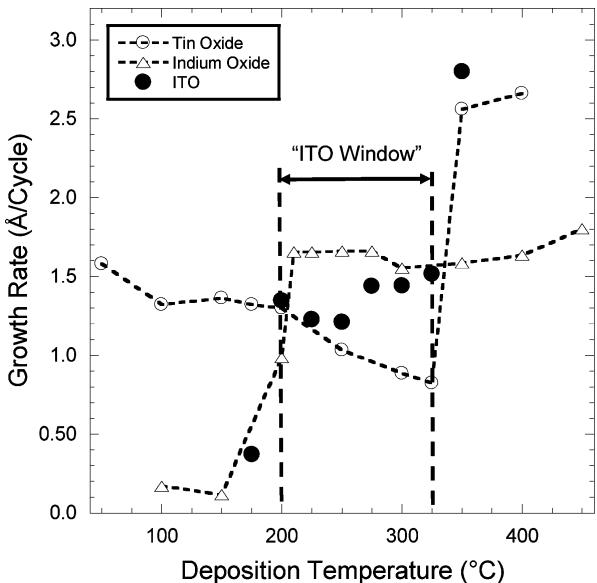  
Figure 1. ALD growth rates for  $\mathrm{In}_2\mathrm{O}_3$ $(\Delta)$ $\mathrm{SnO_2}$ $(\Omega)$  and ITO  $(\bullet)$  versus deposition temperature. Potential ALD window for ITO growth is indicated.

XRF measurements were performed using an Oxford Instruments ED2000 to determine the Sn and In contents of the ALD ITO films. To calibrate the XRF signals, a series of pure  $\mathrm{SnO_2}$  and  $\mathrm{In}_2\mathrm{O}_3$  films were prepared on  $\mathrm{Si(100)}$  substrates and the thicknesses of these films were determined using VASE measurements. Next, the Sn and In signals from these films were measured by XRF. By plotting the XRF signals for Sn and In versus the corresponding  $\mathrm{SnO_2}$  and  $\mathrm{In}_2\mathrm{O}_3$  film thicknesses measured using VASE, we obtained the calibration factors (XRF counts/A) for Sn and In. These calibration factors were used to extract the effective thicknesses of  $\mathrm{SnO_2}$  and  $\mathrm{In}_2\mathrm{O}_3$  from XRF measurements performed on the ITO films, and the Sn and In contents were calculated using the known atomic densities of these materials.

AAO membranes (Whatman Andisc 13) were also coated by ITO to evaluate the suitability of the new ALD ITO technique to conformally coat porous materials. The AAO membranes had a thickness of  $70\mu \mathrm{m}$  and a pore diameter  $d = 200 \mathrm{nm}$  across most of the membrane thickness which transitioned to a  $1 - 2-$ $\mu \mathrm{m}$  thick layer with  $d = 20 \mathrm{nm}$  pores. Cross- sectional SEM analysis was performed on cleaved specimens of the coated AAO membranes.

# Results and Discussion

A. Growth of ITO Films. To deposit a mixed-oxide material such as ITO by ALD, it must be possible to deposit the component oxides  $\mathrm{In}_2\mathrm{O}_3$  and  $\mathrm{SnO_2}$  at a common temperature or range of temperatures. In other words, the ALD temperature "windows" for the component materials must overlap. Figure 1 shows that  $\mathrm{In}_2\mathrm{O}_3$  can be deposited between 200 and  $450^{\circ}\mathrm{C}$ .15 At lower temperatures the  $\mathrm{O_3}$  decomposition shuts off, thereby preventing deposition, and at higher temperatures the  $\mathrm{InCp}$  decomposes.  $\mathrm{SnO_2}$  can be deposited between 50 and  $325^{\circ}\mathrm{C}$ .16 The lower temperature limit is fixed by the TDMASn vaporization temperature of  $40^{\circ}\mathrm{C}$ , while at higher temperatures the

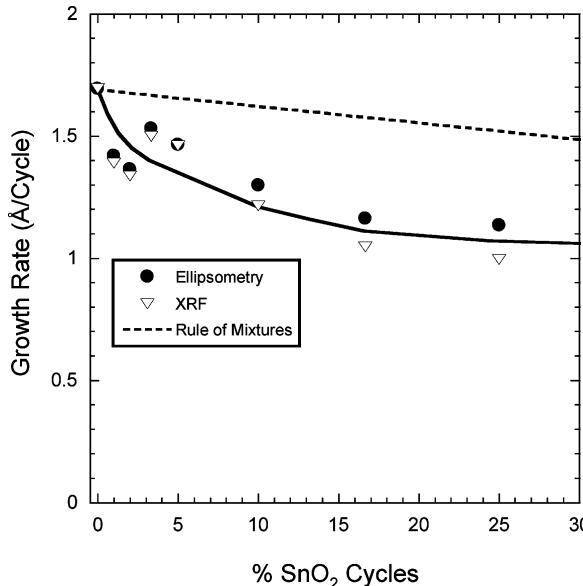  
Figure 2. Growth rate for ALD ITO versus percentage of  $\mathrm{SnO_2}$  cycles determined using VASE  $(\bullet)$  and XRF  $(\nabla)$ . Solid line guides the eye, and dashed line shows expected growth rates calculated using a rule-of-mixtures formula.

TDMASn begins to decompose. As Figure 1 shows, there should be a temperature window for ITO ALD between 200 and  $325^{\circ}C$  Consequently, a depression temperature of  $275^{\circ}C$  was selected for the initial experiments.

A series of ITO films were prepared on Si(100) using 300 ALD cycles at  $275^{\circ}C$  in which the percentage of  $\mathrm{SnO_2}$  cycles was varied between 0 and  $25\%$ . The total thicknesses of these films were determined using VASE measurements, and the effective thicknesses of  $\mathrm{SnO_2}$  and  $\mathrm{In}_2\mathrm{O}_3$  for the films were calculated from XRF measurements using the calibration procedure described in the Experimental Section. The ITO growth rates determined from the VASE and XRF results are given by the circles and triangles, respectively, in Figure 2, and the solid line guides the eye. The ITO growth rate decreases steadily from  $1.69\mathrm{\AA}$  cycle for  $0\%$ $\mathrm{SnO_2}$  to  $1.07\mathrm{\AA}$  cycle for  $25\%$ $\mathrm{SnO_2}$ . There is fairly good agreement between the VASE and XRF growth rate measurements for these ITO films. The dashed line in Figure 2 shows the anticipated ITO growth rates based on a rule- of- mixtures formula and reveals that the measured growth rates are below the rule- of- mixture estimates for all of the ITO films.

Figure 3 presents the  $\mathrm{SnO_2mol\%}$  for the ITO films versus the percentage of  $\mathrm{SnO_2}$  cycles as determined by XRF. The  $\mathrm{SnO_2}$  content increases steadily from  $1.2\mathrm{mol}\%$ $\mathrm{SnO_2}$  at  $2\%$ $\mathrm{SnO_2}$  cycles to  $41\mathrm{mol}\%$ $\mathrm{SnO_2}$  at  $25\%$ $\mathrm{SnO_2}$  cycles. The dashed line in Figure 3 shows the expected  $\mathrm{SnO_2}$  content based on a rule- of- mixtures formula. Over the entire range of  $\mathrm{SnO_2}$  cycles, the  $\mathrm{SnO_2}$  content is higher than the predicted values.

In situ QCM and QMS measurements were performed to investigate the discrepancies in thickness and composition. Figure 4 shows the QCM signals recorded during the ALD of ITO using  $10\%$ $\mathrm{SnO_2}$  cycles at  $275^{\circ}C$ . This figure plots the growth rate measured during each ALD cycle assuming densities of 7.19 and  $6.95~\mathrm{g / cm^3}$  for the  $\mathrm{In}_2\mathrm{O}_3$  and  $\mathrm{SnO_2}$ , respectively. Although the steady- state growth rate measured for  $\mathrm{In}_2\mathrm{O}_3$  using the QCM is  $\sim 1.4\mathrm{\AA}$  cycle, the  $\mathrm{In}_2\mathrm{O}_3$  growth rate drops to  $\sim 1$ $\mathrm{\AA}$  cycle after each  $\mathrm{SnO_2}$  cycle. Following the  $\mathrm{SnO_2}$  cycles, the  $\mathrm{In}_2\mathrm{O}_3$  growth rate increases toward the steady- state value over the following 5- 7 cycles. Apparently, the  $\mathrm{SnO_2}$  temporarily inhibits the  $\mathrm{In}_2\mathrm{O}_3$  growth.

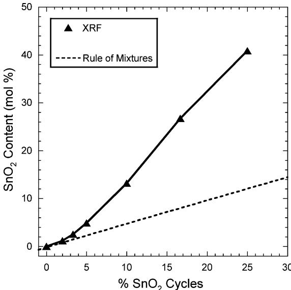  
Figure 3.  $\mathrm{SnO_2}$  content versus percentage of  $\mathrm{SnO_2}$  cycles for ALD ITO films determined by XRF. Dashed line shows expected  $\mathrm{SnO_2}$  content as calculated using a rule-of-mixtures formula.

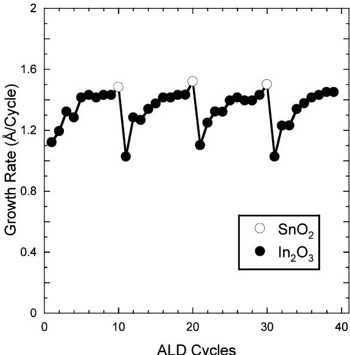  
Figure 4. Growth rate versus ALD cycles measured using in situ QCM during ITO growth using  $10\%$ $\mathrm{SnO_2}$  cycles.

Next, QMS experiments were performed to explore the origin for the inhibited  $\mathrm{In}_2\mathrm{O}_3$  growth following the  $\mathrm{SnO_2}$  cycles. Figure 5a shows the  $m = 66$  signal from cyclopentadiene versus time measured during the ALD of ITO using  $5\%$ $\mathrm{SnO_2}$  cycles at  $275^{\circ}C$ . The TDMASn exposures for each  $\mathrm{SnO_2}$  cycle are indicated in the figure. Cyclopentadiene is released exclusively during the  $\mathrm{InCp}$  exposures, and the magnitude of the  $m = 66$  signal is proportional to the amount of  $\mathrm{In}_2\mathrm{O}_3$  deposited during each ALD cycle. In agreement with the QCM measurements, Figure 5a shows that the  $\mathrm{In}_2\mathrm{O}_3$  growth rate decreases substantially following each  $\mathrm{SnO_2}$  cycle, and  $8 - 12\mathrm{In}_2\mathrm{O}_3$  cycles are required for the  $\mathrm{In}_2\mathrm{O}_3$  growth rate to recover to the steady- state value.

Figure 5b presents the  $m = 48$  signal for  $\mathrm{O_3}$  that was recorded simultaneously with the  $m = 66$  data in Figure 5a. No  $\mathrm{O_3}$  is observed during the  $\mathrm{In}_2\mathrm{O}_3$  ALD when the  $\mathrm{In}_2\mathrm{O}_3$  growth rate has reached the steady- state value. This observation is consistent with our previous finding that  $\mathrm{O_3}$  decomposes on the  $\mathrm{In}_2\mathrm{O}_3$  very efficiently, and this decomposition is necessary for the  $\mathrm{In}_2\mathrm{O}_3$  growth. Curiously, the  $m = 48$  signal returns during the  $\mathrm{O_3}$

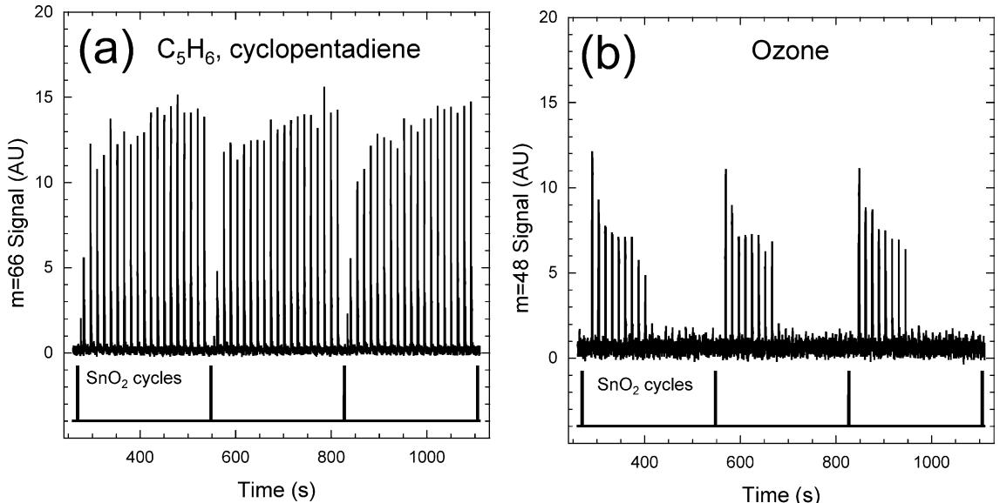  
Figure 5. In situ QMS measurements for (a)  $m = 66$  from cyclopentadiene and (b)  $m = 48$  from ozone, measured during ITO ALD using  $5\%$ $\mathrm{SnO_2}$  cycles. The application of the  $\mathrm{SnO_2}$  ALD cycles is indicated.

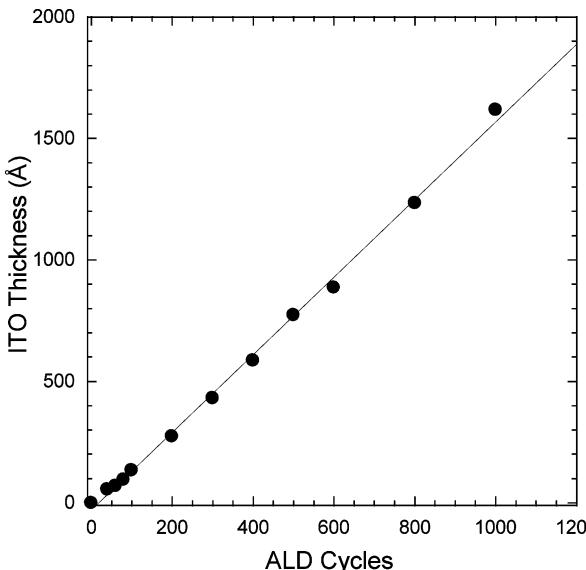  
Figure 6. Thickness of ALD ITO films versus number of cycles determined using VASE for films deposited on Si(100) at  $275^{\circ}C$  using  $5\%$ $\mathrm{SnO_2}$  cycles.

exposures that immediately follow the  $\mathrm{SnO_2}$  ALD cycles, and this  $\mathrm{O_3}$  signal persists for approximately 8- 10 cycles.

Figures 4 and 5 demonstrate that the  $\mathrm{SnO_2}$  cycles inhibit the subsequent  $\mathrm{In}_2\mathrm{O}_3$  ALD, and this may result from the suppression of  $\mathrm{O_3}$  decomposition by the  $\mathrm{SnO_2}$ . In our previous  $\mathrm{In}_2\mathrm{O}_3$  ALD study, we observed a reactor conditioning effect in which the thicknesses of  $\mathrm{In}_2\mathrm{O}_3$  films deposited immediately following  $\mathrm{Al}_2\mathrm{O}_3$  growth were thinner than expected. To compensate for this effect, we always deposited an  $\mathrm{In}_2\mathrm{O}_3$  buffer layer on the inside of the reactor following deposition of a different material. Evidently, the  $\mathrm{SnO_2}$  deposited during a single  $\mathrm{SnO_2}$  cycle is sufficient to suppress the  $\mathrm{O_3}$  decomposition necessary to sustain the  $\mathrm{In}_2\mathrm{O}_3$  growth. The reduced  $\mathrm{In}_2\mathrm{O}_3$  growth observed using QCM and QMS explains why the ITO films are thinner than expected (Figure 2), and also why the ITO films contain more  $\mathrm{SnO_2}$  than expected (Figure 3).

Despite the peculiar effect of the  $\mathrm{SnO_2}$  on the  $\mathrm{In}_2\mathrm{O}_3$  ALD, it is still possible to deposit ITO films with excellent control over film thickness and  $\mathrm{SnO_2}$  content. Figure 6 shows the ITO thickness versus the number of ALD cycles measured using

VASE for films prepared with  $5\%$ $\mathrm{SnO_2}$  cycles at  $275^{\circ}C$ . This plot yields a growth rate for ITO of  $1.60\mathrm{\AA / cycle}$ . This value is substantially larger than the growth rates of  $0.20 - 0.32\mathrm{\AA / cycle}$  measured previously for the ALD of ITO using halogenated precursors. A more detailed examination of the thickness data in Figure 6 reveals that the ITO growth rate increases slightly with the number of ALD cycles from  $1.35\mathrm{\AA / cycle}$  at 50 cycles to  $1.65\mathrm{\AA / cycle}$  at 1000 cycles. Gradual changes in ALD growth rates have been observed previously for nanocrystalline materials in which the morphology or crystal size evolves with film thickness.

The filled circles in Figure 1 show the ITO growth rate versus the deposition temperature measured by VASE for films prepared using 300 cycles with  $5\%$ $\mathrm{SnO_2}$  cycles. Figure 1 demonstrates that the experimentally determined temperature window for ITO ALD matches very closely with the temperature range predicted from the component oxides. In particular, the ITO growth rate remains nearly constant at  $1.35 - 1.51\mathrm{\AA / cycle}$  in the temperature range  $200 - 325^{\circ}C$ . The ITO growth rate falls off below  $200^{\circ}\mathrm{C}$ , and this probably results from the abrupt onset of  $\mathrm{O_3}$  decomposition at  $200^{\circ}\mathrm{C}$ . The ITO growth rate increases substantially above  $325^{\circ}C$  and this undoubtedly signals the TDMASn thermal decomposition.

B. Properties of ITO Films. Once the growth behavior of the ALD ITO films was understood, we proceeded to measure the properties of the films to determine the effect of the deposition conditions on the resistivity, transparency, and morphology of the ITO. Figure 7a shows the ITO resistivity versus percent  $\mathrm{SnO_2}$  cycles determined using four-point probe measurements of films prepared on glass at  $275^{\circ}C$  using 300 ALD cycles. Initially, the ITO resistivity decreases dramatically from  $1.4\times 10^{-2}\Omega \mathrm{cm}$  at  $0\%$ $\mathrm{SnO_2}$  cycles to  $3.9\times 10^{-4}\Omega \mathrm{cm}$  at  $5\%$ $\mathrm{SnO_2}$  cycles, and then increases slightly to  $1.1\times 10^{-3}$ $\Omega \mathrm{cm}$  at  $25\%$ $\mathrm{SnO_2}$  cycles.

Hall probe measurements performed on the samples prepared on glass confirmed that the ITO films are n- doped, and the Hall probe resistivity values were nearly identical to those obtained using the four- point probe. The carrier concentration and mobility values obtained using the Hall probe (Figure 7b) reveal that the decrease in resistivity with  $\mathrm{SnO_2}$  doping can be mostly attributed to an increase in carrier concentration. The carrier concentration increases from  $1.3\times 10^{19}\mathrm{cm}^{- 3}$  at  $0\%$ $\mathrm{SnO_2}$  cycles to  $4.0\times 10^{20}\mathrm{cm}^{- 3}$  at  $5\%$ $\mathrm{SnO_2}$  cycles. In contrast, the mobility

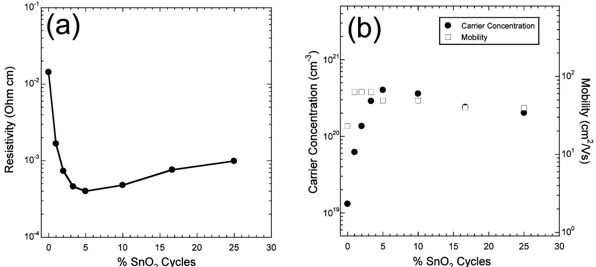  
Figure 7. (a) Resistivity versus percentage of  $\mathrm{SnO_2}$  cycles measured using four-point probe for ALD ITO films prepared on glass at  $275^{\circ}C$  using 300 cycles. (b) Hall probe measurements of the same ITO films showing carrier concentration and mobility.

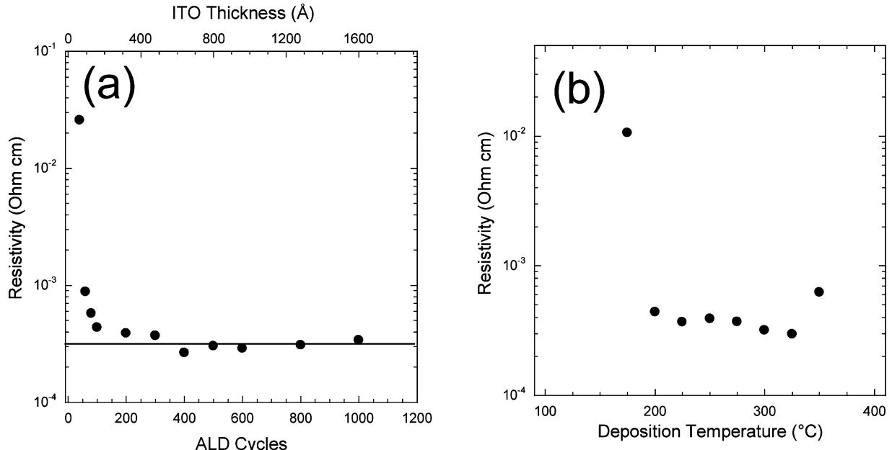  
Figure 8. Resistivity of ALD ITO films prepared on glass using  $5\%$ $\mathrm{SnO_2}$  cycles measured by four-point probe versus (a) number of cycles at  $275^{\circ}C$  and (b) deposition temperature using 300 cycles.

only increases from 23 to  $49~\mathrm{cm^2 / Vs}$  over this range. The mobility of the undoped  $\mathrm{In}_2\mathrm{O}_3$  is unusually low; however, this film is only  $51 - \mathrm{nm}$  thick and  $\mathrm{In}_2\mathrm{O}_3$  mobilities are thickness- dependent.21 We measure a more typical mobility of  $72~\mathrm{cm^2 / }$  Vs for an  $\mathrm{In}_2\mathrm{O}_3$  with a thickness of  $200 \mathrm{nm}$ . The electrical characteristics of the ITO films prepared using  $5\%$ $\mathrm{SnO_2}$  cycles in this study are comparable to values obtained for ALD ITO films deposited previously using metal chloride precursors.7 In addition, these electrical transport values are very similar to the values measured for commercially available ITO films prepared using sputtering.

It is interesting to compare the carrier concentration determined by the Hall probe measurements with the actual concentration of Sn atoms in the ITO films measured by XRF. The ratio of these values is known as the doping efficiency, where a value of  $100\%$  implies that every Sn atom contributes one free electron. For the ITO film prepared using  $5\%$ $\mathrm{SnO_2}$  cycles, the Hall probe measured a carrier concentration  $n =$ $4.0\times 10^{20}\mathrm{cm}^{- 3}$  while XRF yielded  $4.9\%$ $\mathrm{SnO_2}$  for this film. Using the atomic density of bulk  $\mathrm{In}_2\mathrm{O}_3$  this composition corresponds to a Sn atom density of  $7.6\times 10^{20}\mathrm{cm}^{- 3}$  so that the doping efficiency is  $53\%$  . This number compares favorably with ITO films of similar Sn content prepared by sol- gel techniques.3 It is thought that the remaining  $47\%$  of the Sn atoms forms neutral clusters such as  $\mathrm{Sn}_2\mathrm{O}_3$  that do not contribute to the ITO conductivity.22 Perhaps by doping the  $\mathrm{In}_2\mathrm{O}_3$  using a different  $\mathrm{SnO_2}$  precursor with a lower growth rate than TDMASn, the Sn atoms could be spaced farther apart to avoid forming neutral clusters, thereby increasing the doping efficiency.

Next, the ITO resistivity was evaluated versus the film thickness and deposition temperature. The resistivity of the ITO films prepared on glass at  $275^{\circ}C$  using  $5\%$ $\mathrm{SnO_2}$  cycles was measured by four- point probe versus the number of ITO cycles as shown in Figure 8a. The ITO resistivity remains relatively constant at  $2.7\times 10^{- 4}$  to  $4.4\times 10^{- 4}\Omega \mathrm{cm}$  over the range  $100-$  1000 ALD cycles. This range corresponds to ITO thicknesses of  $13\mathrm{- }162\mathrm{nm}$  Only at very small numbers of ALD cycles does the resistivity of the ITO increase, and for 40 cycles (5.6 nm) the resistivity reaches  $2.6\times 10^{- 5}\Omega \mathrm{cm}$  . The ITO resistivity

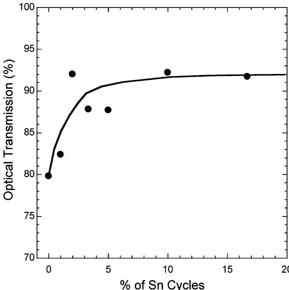  
Figure 9. Optical transmittance for ALD ITO films prepared on glass using 300 ALD cycles with  $5\%$ $\mathrm{SnO_2}$  cycles versus deposition temperature. Optical transmittance is given as the average transmission over the wavelength range  $370 - 1000\mathrm{nm}$ .

  
Figure 10. X-ray diffraction profile measured for ALD ITO film deposited on glass using 1000 cycles with  $5\%$ $\mathrm{SnO_2}$  cycles at  $275^{\circ}C$ . The indices and peak positions are taken from PDF No. 00-006-0416 for cubic  $\mathrm{In}_2\mathrm{O}_3$ .

was also measured by four- point probe as a function of the deposition temperature for films deposited on glass using 300 ALD cycles with  $5\%$ $\mathrm{SnO_2}$  cycles. Figure 8b demonstrates that the ITO resistivity decreases slightly with increasing deposition temperature from  $4.4\times 10^{- 4}$  to  $3.0\times 10^{- 4}\Omega \mathrm{cm}$  between 225 and  $350^{\circ}C$ . The increase in resistivity observed at higher temperatures probably results from impurities caused by the TDMASn decomposition. At temperatures below  $225^{\circ}C$ , the films are much thinner and probably contain little indium, and thus the resistivity is closer to that of  $\mathrm{SnO_2}$ .

Figure 9 shows optical transmission measurements for the ITO films prepared on glass as a function of the percentage of  $\mathrm{SnO_2}$  cycles obtained by integrating the transmission spectra over the wavelength range  $370 - 1000\mathrm{nm}$ . The transmission spectra were referenced to an uncoated glass substrate. These films were deposited at  $275^{\circ}C$  using 300 ALD cycles. Although the data are somewhat scattered, the overall trend is an increase in transmittance from  $\sim 80\%$  at  $0\%$ $\mathrm{SnO_2}$  cycles to an average value of  $\sim 90\%$  at  $16\%$ $\mathrm{SnO_2}$  cycles. The increased transmittance is due in part to a blue shift in the absorption edge of the transmission curves with increasing  $\mathrm{SnO_2}$  content known as the Burstein- Moss effect. As the conduction band fills, the Fermi level exceeds the conduction band minimum and a larger photon energy is required for absorption. Alternatively, a decrease in surface roughness with increasing Sn content might reduce optical scattering and produce the effect shown in Figure 9. VASE measurements for the  $5\%$  ITO films deposited on Si- (100) yielded a refractive index at  $633~\mathrm{nm}$  of  $n = 1.89$ .

  
Figure 11. AFM image for  $89\mathrm{-nm}$  ALD ITO film deposited on Si-100 at  $275^{\circ}C$  using 600 cycles with  $5\%$ $\mathrm{SnO_2}$  cycles.

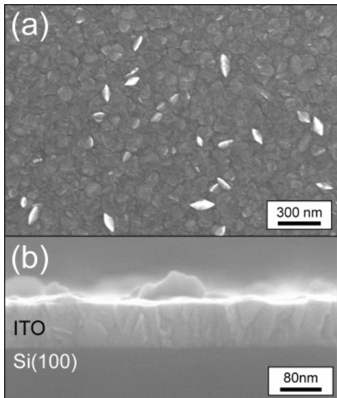  
Figure 12. SEM plan-view (a) and cross-sectional (b) images of ALD ITO film deposited on Si(100) using 600 cycles with  $5\%$ $\mathrm{SnO_2}$  cycles at  $275^{\circ}C$ .

Figure 10 shows the X- ray diffraction profile measured for an ITO film deposited on glass using 1000 ALD cycles with  $5\%$ $\mathrm{SnO_2}$  cycles at  $275^{\circ}C$ . The indices and peak positions in Figure 10 are taken from PDF No. 00- 006- 0416 for cubic  $\mathrm{In}_2\mathrm{O}_3$ . The ITO deposits in a polycrystalline form with a cubic  $\mathrm{In}_2\mathrm{O}_3$  structure, and the most prominent orientation is the [111] direction. Figure 11 shows an AFM image of an ITO film with a thickness of  $89~\mathrm{nm}$  deposited at  $275^{\circ}C$  using 600 cycles with  $5\%$ $\mathrm{SnO_2}$  and yields an rms roughness of  $8.9 \mathrm{nm}$ . As expected from the XRD measurements, Figure 11 shows a polycrystalline morphology. In addition, a small number of unusually tall features  $(10 - 40 \mathrm{nm})$  are seen on the surface. These large

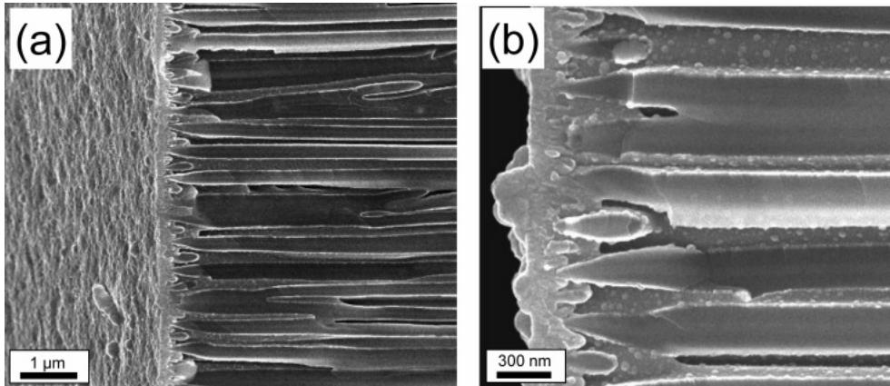  
Figure 13. (a) Cross-sectional SEM image of AAO membrane coated conformally with  $9.7\mathrm{-nm}$  ALD ITO film, and also with  $161\mathrm{-nm}$  ALD ITO film deposited selectively on the AAO front surface visible on the left side of the image. (b) Higher-resolution SEM image of AAO membrane showing that the  $20\mathrm{-nm}$  pores are sealed, and ITO nanocrystals decorate the inner walls of the  $200\mathrm{-nm}$  pores.

crystals might explain the dominant (222) peak seen in XRD. Previous ALD studies of ITO observed neither the large crystals nor the dominant (222) peak.7

Figure 12 shows SEM images of an ALD ITO film prepared on Si(100) using 600 cycles with  $5\%$ $\mathrm{SnO_2}$  cycles at  $275^{\circ}C$  The plan- view image (Figure 12a) shows a surface that is uniformly decorated with platelike crystals in addition to taller, diamond- shaped crystals that correspond to the tall features in the AFM image. Additional SEM and AFM measurements showed that the height and number of these tall, diamond- shaped crystals increased with increasing ITO film thickness. The cross- sectional SEM image (Figure 12b) yields an ITO film thickness of  $82\pm 8 \mathrm{nm}$  in good agreement with the thickness of 88.7 nm obtained using VASE.

C. Fabrication of High Surface Area ITO. We used the ALD methods described in the preceding sections to synthesize high surface area transparent, conducting electrodes that could be used in nanostructured photovoltaic14 or spectrophotochemi $\mathrm{cal^{24}}$  applications. First, a thin ITO coating was deposited on a commercial AAO membrane that completely infiltrated the AAO pores to create a conformal, uniform coating with a thickness of  $9.7 \mathrm{nm}$  This process used 58 ALD cycles with  $10\%$ $\mathrm{SnO_2}$  cycles at a temperature of  $275^{\circ}C$  with the timing sequence  $12\mathrm{-}10\mathrm{-}60\mathrm{-}5$  for  $\mathrm{In}_2\mathrm{O}_3$  and  $10\mathrm{-}10\mathrm{-}10\mathrm{-}10$  for  $\mathrm{SnO_2}$  Next, the AAO was mounted in a fixture that limited deposition to the front,  $20 - \mathrm{nm}$  pore side of the membrane, and an ITO film with a thickness of  $161~\mathrm{nm}$  was deposited. The function of this thick layer was to step off the small pores and also to provide a low resistance contact to the electrode. The thick layer used 1000 cycles with  $5\%$ $\mathrm{SnO_2}$  cycles at a temperature of  $275^{\circ}C$  with the timing sequence  $2 - 4 - 2 - 2$  for  $\mathrm{In}_2\mathrm{O}_3$  and  $1 - 5 - 1 - 5$  for  $\mathrm{SnO_2}$

Cross- sectional SEM images of the resulting electrode are shown in Figure 13. Figure 13a demonstrates that the  $20 - \mathrm{nm}$  pores of the membrane are completely sealed, while the underlying  $200\mathrm{- nm}$  pores are still open beneath the thick coating. Figure 13b is a higher resolution image showing that the inside surfaces of the pores are decorated with ITO nanocrystals. The coated membrane had a  $5\Omega$  resistance through the membrane, a  $15\Omega /\square$  sheet resistance on the thickly coated side, and an optical transparency of  $\sim 70\%$

# Conclusions

We have demonstrated a new method for depositing ITO thin films by ALD using alternating  $\mathrm{InCp / O_3}$  exposures for  $\mathrm{In}_2\mathrm{O}_3$  and  $\mathrm{TDMASn / H_2O_2}$  exposures for  $\mathrm{SnO_2}$  By adjusting the relative number of  $\mathrm{In}_2\mathrm{O}_3$  and  $\mathrm{SnO_2}$  ALD cycles, we deposited ITO films with precise control over the thickness and  $\mathrm{SnO_2}$  content. ITO films with a thickness of  $42~\mathrm{nm}$  deposited on glass using  $5\%$ $\mathrm{SnO_2}$  cycles exhibited a resistivity of  $3\times 10^{- 4}\Omega \mathrm{cm}$  and an optical transparency of  $92\%$  . The ITO films were slightly thinner and contained more  $\mathrm{SnO_2}$  than predicted, and in situ measurements revealed that these discrepancies result from an inhibition of the  $\mathrm{In}_2\mathrm{O}_3$  growth following the  $\mathrm{SnO_2}$  cycles. We have used this new ALD method to apply conformal ITO layers on very high aspect ratio nanoporous membranes.

Acknowledgment. The work at Argonne is supported by the U.S. Department of Energy, BES- Materials Sciences under Contract W- 31- 109- ENG- 38. The work at Northwestern University is supported by the U.S. Department of Energy, Basic Energy Sciences Program under Grant No. DE- FG02- 87ER13808. Electron microscopy was performed at the Electron Microscopy Center for Materials Research at Argonne National Laboratory, a U.S. Department of Energy Office of Science Laboratory operated under Contract No. DE- AG02- 06CH11357 by UChicago Argonne, LLC.

# References and Notes

(1) Calnan, S.; Upadhyaya, H. M.; Thwaites, M. J.; Tiwari, A. N. Thin Solid Films 2007, 515, 6045. 
(2) Rozati, S. M.; Ganj, T. Renewable Energy 2004, 29, 1671. 
(3) Tahar, R. B. H.; Ban, T.; Ohya, Y.; Takahashi, Y. J. Appl. Phys. 1998, 83, 2139. 
(4) Suzuki, A.; Maki, K. Chem. Vap. Deposition 2006, 12, 608. 
(5) Gupta, R. K.; Mamidi, N.; Ghosh, K.; Mishra, S. R.; Kahol, P. K. J. Optoelectron. Adv. Mater. 2007, 9, 221. 
(6) Asikainen, T.; Ritala, M.; Leskela, M. J. Electrochem. Soc. 1994, 141, 3210. 
(7) Asikainen, T.; Ritala, M.; Leskela, M. J. Electrochem. Soc. 1995, 142, 3538. 
(8) Ritala, M.; Asikainen, T.; Leskela, M. J. Electrochem. Solid State Lett. 1998, 1, 156. 
(9) Ritala, M.; Leskela, M. Atomic Layer Deposition. In Handbook of Thin Film Materials; Nalwa, H. S., Ed.; Academic Press: San Diego, CA, 2001; Vol. 1, p 103. 
(10) Kucheyev, S. O.; Biener, J.; Wang, Y. M.; Baumann, T. F.; Wu, K. J.; van Buuren, T.; Hamza, A. V.; Satcher, J. H., Jr.; Elam, J. W.; Pellin, M. J. Appl. Phys. Lett. 2005, 86, 083108. 
(11) Pellin, M. J.; Stair, P. C.; Xiong, G.; Elam, J. W.; Birrell, J.; Curtiss, L.; George, S. M.; Han, C. Y.; Iton, L.; Kung, H.; Kung, M.; Wang, H. H. Catal. Lett. 2005, 102, 127. 
(12) Elam, J. W.; Routkevitch, D.; Mandilovich, P. P.; George, S. M. Chem. Mater. 2003, 15, 3507. 
(13) Puurunen, R. L. Chem. Vap. Deposition 2005, 11, 79. 
(14) Martinson, A. B. F.; Elam, J. W.; Hupp, J. T.; Pellin, M. J. Nano Lett. 2007, 2183. 
(15) Elam, J. W.; Martinson, A. B. F.; Pellin, M. J.; Hupp, J. T. Chem. Mater. 2006, 18, 3571.

(16) Elam, J. W.; Baker, D. A.; Hryn, A. J.; Martinson, A. B. F.; Pellin, M. J.; Hupp, J. T. J. Vac. Sci. Technol., A, Accepted, 2007.  
(17) Elam, J. W.; Groner, M. D.; George, S. M. Rev. Sci. Instrum. 2002, 73, 2981.  
(18) Rocklein, M. N.; George, S. M. Anal. Chem. 2003, 75, 4975.  
(19) Ritala, M.; Leskela, M.; Nykanen, E.; Soininen, P.; Niinisto, L. Thin Solid Films 1993, 225, 288.  
(20) Elam, J. W.; George, S. M. Chem. Mater. 2003, 15, 1020.

(21) Suzuki, T.; Yamazaki, T.; Takizawa, M.; Kawasaki, O. J. Mater. Sci. 1989, 24, 187.  
(22) Frank, G.; Kostlin, H. Appl. Phys. A 1982, 27, 197.  
(23) Gupta, L.; Mansingh, A.; Srivastava, P. K. Thin Solid Films 1989, 176, 33.  
(24) Doherty, W. J.; Wysocki, R. J.; Armstrong, N. R.; Saavedra, S. S. J. Phys. Chem. B 2006, 110, 4900.