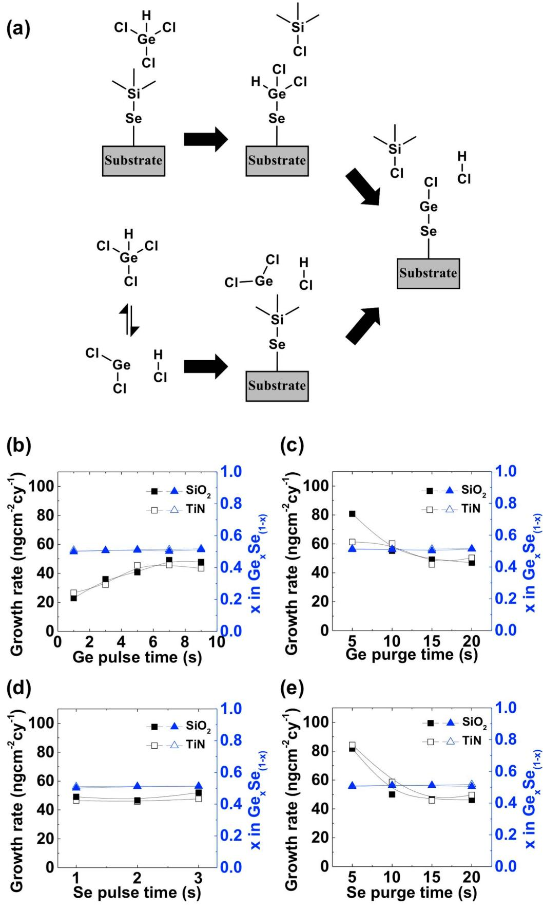
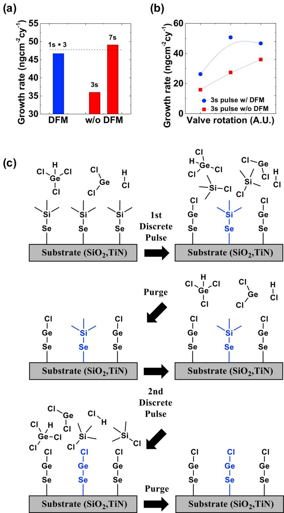
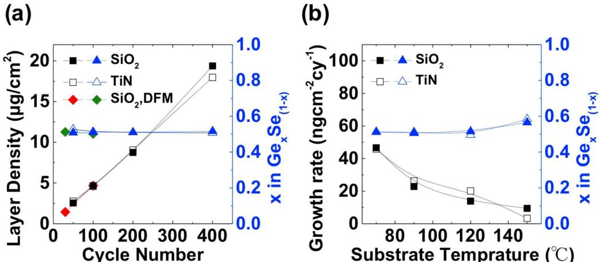
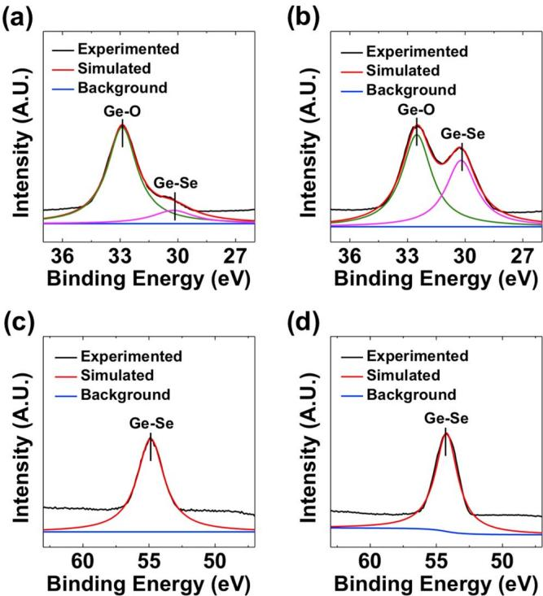
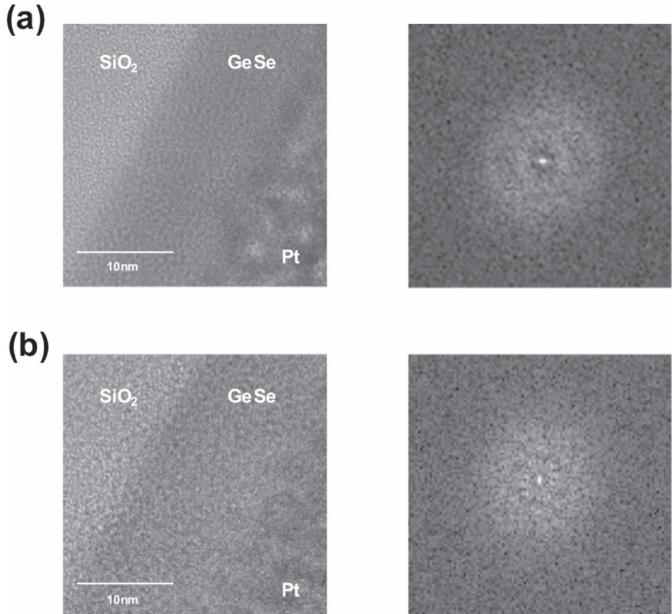
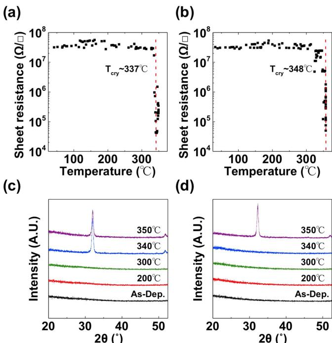
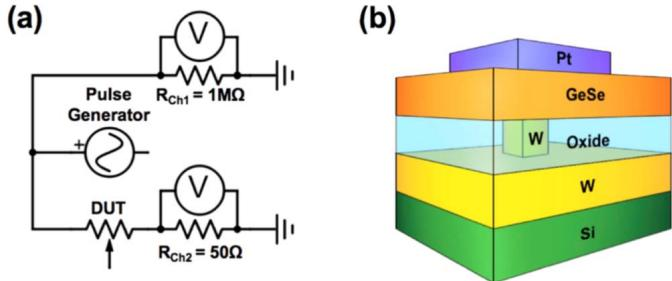
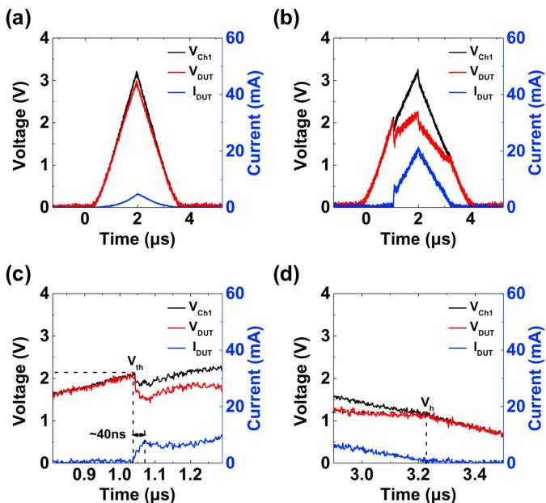
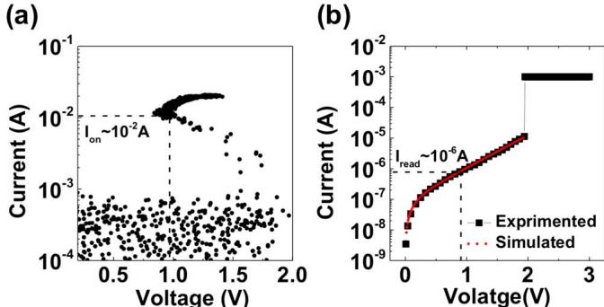

PAPER

# Atomic layer deposition of GeSe films using  $\mathsf{HGeCl}_3$  and  $[(\mathsf{CH}_3)_3\mathsf{Si}]_2\mathsf{Se}$  with the discrete feeding method for the ovonic threshold switch

To cite this article: Woohyun Kim et al 2018 Nanotechnology 29 365202

View the article online for updates and enhancements.

# You may also like

- Defect physics of the quasi-two-dimensional photovoltaic semiconductor GeSe Saichao Yan, Jinchen Wei et al. Controllable epitaxial growth of GeSe nanostructures and nonlinear optical properties Weiqi Gao, Guoliang Zhou, Jin Li et al. Direction and strain controlled anisotropic transport behaviors of 2D GeSe-phosphorene vdW heterojunctions Tong Chen, Liang Xu, Quan Li et al.

# Atomic layer deposition of GeSe films using  $\mathsf{HGeCl}_3$  and  $[(\mathsf{CH}_3)_3\mathsf{Si}]_2\mathsf{Se}$  with the discrete feeding method for the ovonic threshold switch

Woohyun Kim  $\oplus$ , Sijung Yoo, Chanyoung Yoo, Eui- Sang Park, Jeongwoo Jeon, Young Jae Kwon, Kyung Seok Woo, Han Joon Kim, Yoon Kyeung Lee $^1$  and Cheol Seong Hwang $^1$

Department of Materials Science and Engineering, and Inter- University Semiconductor Research Center, Seoul National University, Seoul 08826, Republic of Korea

E- mail: greense9@snu.ac.kr and cheolsh@snu.ac.kr

Received 29 March 2018, revised 27 May 2018 Accepted for publication 19 June 2018 Published 2 July 2018

# Abstract

The ovonic threshold switch (OTS) based on the voltage snapback of amorphous chalcogenides possesses several desirable characteristics: bidirectional switching, a controllable threshold voltage  $(V_{\mathrm{th}})$  and processability for three- dimensional stackable devices. Among the materials that can be used as OTS, GeSe has a strong glass- forming ability  $(\sim 350^{\circ}\mathrm{C}$  crystallization temperature), with a simple binary composition. Described herein is a new method of depositing GeSe films through atomic layer deposition (ALD), using  $\mathrm{HGeCl}_3$  and  $[(\mathsf{CH}_3)_3\mathsf{Si}]_2\mathsf{Se}$  as Ge and Se precursors, respectively. The stoichiometric GeSe thin films were formed through a ligand exchange reaction between the two precursor molecules, without the adoption of an additional reaction gas, at low substrate temperatures ranging from  $70^{\circ}\mathrm{C} - 150^{\circ}\mathrm{C}$ . The pseudo- saturation behavior required a long time of Ge precursor injection to achieve the saturation growth rate. This was due to the adverse influence of the physisorbed precursor and byproduct molecules on the efficient chemical adsorption reaction between the precursors and reaction sites. To overcome the slow saturation and excessive use of the Ge precursor, the discrete feeding method (DFM), where  $\mathrm{HGeCl}_3$  is supplied multiple times consecutively with subdivided pulse times, was adopted. DFM led to the saturation of the GeSe growth rate at a much shorter total injection time of the Ge precursor, and improved the film density and oxidation resistance properties. The GeSe film grown via DFM exhibited a short OTS time of  $\sim 40$  ns, a  $\sim 10^{7}\mathrm{ON / OFF}$  current ratio, and  $\sim 10^{4}$  selectivity. The OTS behavior was consistent with the modified Poole- Frenkel mechanism in the OFF state. In contrast, the similar GeSe film grown through the conventional ALD showed a low density and high vulnerability to oxidation, which prevented the OTS performance. The ALD method of GeSe films introduced here will contribute to the fabrication of a three- dimensionally integrated memory as a selector device for preventing sneak current.

Keywords: atomic layer deposition, discrete feeding method, phase change material, ovonic threshold switch, germanium selenide

(Some figures may appear in colour only in the online journal)

# 1.Introduction

Phase- change random access memory (PcRAM) is a strong candidate for the next- generation memory, with characteristics of non- volatility, fast operating speed, and low power consumption [1- 5]. The three- dimensional- (3D)- stackable memory of the crossbar array has been proposed as a promising solution to overcome the existing limitations in the memory density of the PcRAM in a 2D planar integration structure. Despite the advances in 3D structural designs to scale down the memory, sneak current, which frustrates the accurate reading/writing of data in each cell, has remained a critical issue. Selector devices like the P- N junction diodes, metal- insulator- metal diodes, and ovonic threshold switch (OTS) have been devised to minimize these errors in operation [6]. Among the options for the selector device, the OTS using amorphous chalcogenides has the preferable property of a bidirectional, controllable threshold voltage  $(V_{\mathrm{th}})$  and process compatibility with chalcogenide- based phase change materials. The material properties required in OTS, however, are different from those needed in PcRAM. For the memory element, both the appropriate crystallization speed and amorphous stability are among the essential requirements since the memory operation is based on the reversible change between the crystal and amorphous phases. The pseudo- binary system of  $\mathrm{GeTe - Sb_2Te_3}$  has shown to possess the desirable properties. In the case of OTS, only the latter requirement on the amorphous stability is critical since the threshold switching is the characteristics of the amorphous phase, and no crystallization is involved for the material function as a selector.

Recent studies have shown that GeSe is one of the strongest candidates for OTS owing to its high amorphous stability (with a crystallization temperature  $[T_{\mathrm{cry}}]$  as high as  $\sim 350^{\circ}\mathrm{C})$  ,with a simple binary composition [7, 8]. The GeSe- based OTS device is often used as a selector component in a 1- selector- 1- resistor 1s1R) structure for the stable operation of the crossbar arrays of random access memory. Previous studies successfully demonstrated a the 1s1R structure consisting of the stacking layers of the GeSe and resistive memory layer as a selector and memory element, respectively [9, 10]. Researchers also investigated the dependence of thermal stability and  $V_{\mathrm{th}}$  on the Ge concentration in  $\mathrm{Ge}_x\mathrm{Se}_{(1 - x)}$  compounds [11]. Additionally, Sband N- doped Se- rich GeSe films have been proven to improve the performance of OTS [12]. Although the previous studies provided valuable information on the relation between the compositions and the OTS behavior, the adopted physical vapor deposition methods have limited applicability in the fabrication of 3D- stackable- matrix- integrated devices, due to their limited step coverage.

Atomic layer deposition (ALD), by comparison, possesses ideal properties, such as excellent conformality for the construction of complex, high- aspect- ratio structures [13]. The authors reported several ALD cases of  $\mathrm{GeTe}_2$  or GeTe films using  $\mathrm{Ge(IV)}$  or  $\mathrm{Ge(II)}$  precursors such as  $\mathrm{Ge(OEt)_4}$ $\mathrm{Ge\{N|Si(CH_3)_3|_2\}_2}$  and  $\mathrm{HGeCl}_3$  [14- 17]. In the case of the alkoxy- Ge precursor, non- ideal physisorption (lack of strong chemical adsorption) and the high oxidation state  $(+4)$  limit its use in the deposition of GeSe [18]. Recently,  $\mathrm{HGeCl}_3$  was reported to have shown a prominent ALD behavior in the deposition of GeTe as it acted as a  $\mathrm{Ge(II)}$  source without requiring an additional gas for its reaction, and no incubation cycles were involved [16, 17]. Despite the achievement in the conformal and uniform morphologies of the  $\mathrm{GeTe}_2$  and GeTe films in previous studies, these unconventional precursors may cause complicated ALD growth behaviors due to the steric hindrance from the physisorbed molecules (i.e., precursors, byproducts). Various modified ALD methods have been suggested to be used to address this undesirable phenomenon. The discrete feeding method (DFM) has been shown to efficiently remove the physisorbed molecules in a  $\mathrm{HfO_2}$  deposition by subdividing the precursor pulse and purge times [19]. It has also contributed to the improved film properties, such as a higher film density and a low impurity concentration, owing to the more fluent ALD reaction steps.

In this work, ALD of binary GeSe using  $\mathrm{HGeCl}_3$  and  $[(\mathrm{CH}_3)_3\mathrm{Si})]_2\mathrm{Se}$  as the Ge and Se precursors, respectively, was studied. The 1:1 stoichiometry of GeSe was achieved by the ligand exchange reaction between the Se precursor and the  $\mathrm{GeCl}_2$  produced by the decomposition of  $\mathrm{HGeCl}_3$  .DFM was introduced for the Ge deposition steps, to overcome the extended Ge pulse and purge times for the saturation of the growth rate in the conventional ALD process. The method resulted in great improvements in the saturation behavior, surface morphology, and film density. The additional effects on the chemical and amorphous phase stability were also investigated. The GeSe film grown via DFM exhibited a short OTS time of  $\sim 40$  ns,a  $\sim 10^{7}\mathrm{ON / OFF}$  current ratio, and  $\sim 10^4$  selectivity. The OTS behavior was consistent with the modified Poole- Frenkel (PF) mechanism, with the fitting parameters of  $5.36\times 10^{20}\mathrm{cm}^{- 3}$  charge trap density and  $1.41\times 10^{- 7}\mathrm{cm}$  inter- trap distance.

# 2.Experiment

2. ExperimentThe deposition of GeSe films was performed using a showerhead-type ALD tool with a 6 inch-wafer chamber (CN-1, atomic-premium). All the ALD lines where the precursor passed were maintained at  $100^{\circ}\mathrm{C}$ . The substrate temperature of the deposition stage was  $70^{\circ}\mathrm{C}$ , except for the experiments that were performed to determine the effect of the temperature. The Ge and Se precursors were  $\mathrm{HGeCl}_3$  and  $[(\mathrm{CH}_3)_3\mathrm{Si}]_2\mathrm{Se}$ , respectively. Each of the precursors was placed in a separate stainless steel canister. The Ge precursor was maintained at  $3^{\circ}\mathrm{C}$ , and the Se precursor, at  $30^{\circ}\mathrm{C}$ . The vapor pressures of  $\mathrm{HGeCl}_3$  and  $[(\mathrm{CH}_3)_3\mathrm{Si}]_2\mathrm{Se}$  were approximately 30 and 2 Torr at their respective canister temperatures. Due to the high vapor pressure of  $\mathrm{HGeCl}_3$ , the pulsed amount of the Ge precursor was regulated using a manually operated metering valve, and was diluted with 50 standard cubic centimeters per minute (sccm) Ar gas. It was delivered through the vapor draw method rather than through the bubble-type method. On the other hand, the Se precursor was carried into the chamber by being made to pass 50 sccm Ar gas using the bubble-type method. After each

precursor injection sequence, the excess precursors and byproducts were purged out using 200 sccm Ar gas. The process recipes of the ALD sequence were designed to prevent a gas phase reaction between the precursors. The precursor sequence of the conventional ALD was determined as follows, through the ALD saturation experiments: Ge precursor pulse (7 s)—purge (15 s)—Se precursor pulse (2 s)—purge (15 s). To confirm the ALD- type saturation behavior, the process time of each step was varied while the other process time was kept constant. The recipe for ALD- DFM is Ge precursor pulse (1 s)—purge (5 s)—pulse (1 s)—purge (5 s)—pulse (1 s)—purge (5 s)—Se precursor (2 s)—purge (15 s). In this case, the 7 s long Ge precursor pulse time was shortened to 3 s but was divided into three 1 s's, and the 15 s long purge time was divided into three 5 s's while the Se precursor pulse and purge times remained unchanged. For comparison, the conventional ALD process with 3 s long Ge precursor pulses was also tested. The reaction mechanism between  $\mathrm{HGeCl}_3$  and  $[(\mathrm{CH}_3)_3\mathrm{Si}]_2\mathrm{Se}$  was similar to that of the previously reported  $[(\mathrm{CH}_3)_3\mathrm{Si}]_2\mathrm{Te}$  [17]. The DFM, however, effectively removed the physisorbed molecules. Thermally oxidized  $200\mathrm{nm}$  thick  $\mathrm{SiO}_2 / \mathrm{Si}$  and  $\mathrm{TiN / Ti / SiO}_2 / \mathrm{Si}$  were used as substrates, in which 50 and  $5\mathrm{nm}$  thick TiN and Ti films, respectively, were deposited via reactive and direct- current (DC) sputtering.

The layer densities of the deposited films were measured via x- ray fluorescence spectroscopy (Thermo Scientific, Quant'X EDXRF), and the growth rate was the layer density value divided by the number of cycles. A resistivity- temperature experiment was performed using the real- time resistivity- temperature measurement system (homemade). Both the crystallinity and density of the films were measured with  $\mathbf{X}$  - ray equipment (glancing angle incidence  $\mathbf{X}$  - ray diffraction GAXRD) and  $\mathbf{X}$  - ray reflectivity (XRF), respectively), using an  $\mathbf{X}$  - ray diffractometer (PANalytical, X'Pert PRO MPD). The impurity level of each film was confirmed via Auger electron spectroscopy (AES, ULVAC- PHI, PHI- 700). Scanning electron microscopy (SEM, Hitachi, S- 4800) and atomic force microscopy (AFM, JEOL, JSPM 5200) were used to observe the morphology of the film surface. X- ray photoelectron spectroscopy (XPS, UK VG, Sigma Probe) was used to confirm the chemical states of the elements in the films. The fast Fourier transform (FFT) image was analyzed via transmission electron microscopy (TEM, JEOL, JEM- 2100F), using a specimen prepared with a focused ion beam (FEI, Helios 650).

The OTS devices were fabricated using hole pattern substrates and while proceeding with each 100 cycles sequence of the conventional ALD process, and with the DFM process (where the hole diameter and depth were  $2\mu \mathrm{m}$  and  $50\mathrm{nm}$  , respectively) formed in a  $\mathrm{SiO}_2$  layer. The hole was filled with W, which played the role of the bottom electrode. The schematic diagram of this OTS device will be shown later. A pulse generator (Agilent, 81110A) and an oscilloscope (Tektronix, TDS 684 C) were used to observe the TS behavior of the films. The DC characteristics of the device were measured using a semiconductor parameter analyzer (Hewlett Packard, 4145B). Both experiments were conducted using a probe station (Cascade, REL- 5500).

  
Figure 1. (a) Conventional ALD sequence and (b) ALD sequence with DFM for the deposition of GeSe films.

# 3. Results and discussion

# 3.1. ALD behavior of GeSe films

GeSe films were deposited by ALD sequence with and without DFM using  $\mathrm{HGeCl}_3$  and  $[(\mathrm{CH}_3)_3\mathrm{Si}]_2\mathrm{Se}$ . The conventional ALD process refers to the ALD without the DFM process, where Ge and Se pulse and purge were injected alternatively (figure 1(a)). The ALD with DFM, by comparison, divides the total Ge pulse and purge times into several shorter times. Figure 1(b) describes the ALD- DFM sequence, where the Ge purge and pulse injection was subdivided into three consecutive pulses while keeping the total injection time the same as that in the conventional ALD process.

Figure 2 shows the growth behavior of the GeSe film deposited through the conventional ALD method using  $\mathrm{HGeCl}_3$  and  $[(\mathrm{CH}_3)_3\mathrm{Si}]_2\mathrm{Se}$  as Ge and Se precursors, respectively. As previously reported,  $\mathrm{HGeCl}_3$  is known to readily decompose into  $\mathrm{GeCl}_2$  and  $\mathrm{HCl}$  at the relevant process temperatures. Under the adopted experiment conditions (canister temperature:  $3^{\circ}\mathrm{C}$ ; ALD line temperature:  $100^{\circ}\mathrm{C}$ ), the Ge precursor is pulsed into the chamber as coexisting three molecules ( $\mathrm{HGeCl}_3$ ,  $\mathrm{GeCl}_2$ ,  $\mathrm{HCl}$ ). Figure 2(a) show two reaction mechanisms between the Ge and Se precursors during the deposition [17].

The reactions follow mechanisms similar to the reactions between  $\mathrm{HGeCl}_3$  and  $[(\mathrm{CH}_3)_3\mathrm{Si}]_2\mathrm{Te}$ , as identified in the previous work on the ALD deposition of the GeTe film [17]. According to the reaction mechanisms presented in figure 2(a), the deposition is expected to result in the stoichiometric GeSe film, which was indeed the case, as discussed below. The saturation growth rate  $(48.1\pm 1.8\mathrm{ngcm}^{- 2}\mathrm{cy}^{- 1})$  and the 1:1 stoichiometric GeSe composition were achieved for the Ge and Se precursors' pulse and purge times (Ge pulse: 7 s; Ge purge: 15 s; Se pulse: 2 s; Se purge: 15 s). The self- limiting growth behavior revealed that ligand exchange reaction occurred on the growing surface. Compared to the short injection time of the Se precursor for the saturation growth rate (2 s), however, the Ge precursor requires a 7 s injection time to achieve the saturation growth rate (figure 2(b)). This pseudo- saturation behavior is also reflected in the long Ge and Se purge times ( $\sim 15\mathrm{s}$ ) for

  
Figure 2. (a) Proposed deposition mechanism of GeSe films from  $\mathrm{HGeCl}_3$  and  $\mathrm{GeCl}_2$  with  $\mathrm{HCl}$  on the film surface. (b)-(e) Saturation behavior in the conventional ALD through the Ge and Se precursors' pulse and purge time split.

saturation, as shown in figures 2(c) and (e). This is inconsistent with the previous report on the ALD or GeTe, where the growth rate is saturated with a 5 s purge time [17]. A possible reason for this discrepancy will be discussed later.

Figure 3 shows that DFM can improve the pseudo- saturation behavior. Here, a Ge precursor was injected through three 1 s consecutive pulses (total pulse time: 3 s) to compare its growth rate with the growth rate from the conventional ALD process. In DFM, the purge was also adjusted to three 5 s consecutive Ar pulses (total purge time: 15 s). Figure 3(a) shows that the growth rate reaches the saturation level with three 1 s Ge pulses  $(46.7\mathrm{ngcm}^{- 2}\mathrm{y}^{- 1})$ . The rate is significantly larger than that from the conventional ALD process with a 3 s Ge pulse, and is comparable to the saturated value of the conventional ALD (7 s) within an error range. Figure 3(b) compares the growth rates of the GeSe film depending on the relative amount of Ge precursor injection with a given Ge pulse time (3 s). Due to the high vapor pressure of  $\mathrm{HGeCl}_3$  the amount of the Ge precursor injection was adjusted by limiting the opening of a metering valve manually. The injection amount was reduced through the partial closure of the valve by changing the valve rotation number from the initial 3 to 2 and 1. It should be noted that the input amount control is only relative and not absolute because the information on the absolute amount depending on the valve rotation was not available. In all the cases, the DFM resulted in higher growth rates than with the conventional method, and showed a saturated growth rate with a reduced precursor amount (blue circle data in figure 3(b)). Therefore, the DFM with the present conditions (three- time rotation of the manual valve and 1 s injection x 3) represents the fully saturated ALD growth despite its much shorter total Ge precursor pulse time. An even more important finding is that this faster saturation in DFM drastically enhanced the film quality and the OTS performance of the device compared with the similar film prepared through the conventional ALD process, as will be shown later. The conventional ALD method, however, showed a proportionally decreasing growth rate as the injection amount was reduced, consistent with the undersaturated condition of the 3 s Ge pulse time (red square data in figure 3(b)).

The larger amount of precursor injection and the longer extended time required for its saturated growth in the conventional ALD process can be attributed to the screening of the reaction sites by the physisorbed molecules and reaction byproducts. Figure 3(c) shows the mechanism of the efficient removal of the physisorbed molecules through the DFM process. In the proposed mechanism, the same ligand exchange reaction occurs as the conventional ALD process in the DFM, but the discretized feeding of the precursor can efficiently remove the steric hindrance from the physical absorption of the precursor molecules or byproducts (i.e., HCl,  $(\mathrm{CH}_3)_3\mathrm{Si - Cl})$  during the intermittent purge steps. The results are consistent with those of the previous study on DFM for the ALD of  $\mathrm{HfO_2}$  [19]. In this ALD equipment, 1 s is the lower limit of the ALD valve opening with accurate flow control. Therefore, the further subdivision of the 1 s long pulse was not attempted. The data in figures 3(a) and (b) demonstrate, however, that the observed growth rate was the DFM- saturated growth rate.

The proposed mechanism of the efficient removal of the physisorbed molecules helps in the understanding of the difference in the ALD behaviors of GeTe and GeSe films with the conventional feeding method. In the previous report on GeTe, the growth rate saturated rapidly with only a 5 s purge time [17]. The different bonding type can explain the different saturation behavior in the conventional ALD of Ge- Te and Ge- Se films. The deposited GeTe has a non- polar bonding nature due to the minimal difference in electronegativity between Ge and Te (0.09, in the Pauling electronegativity scale) while GeSe has a polar bonding nature due to the larger difference in electronegativity (0.54) [20]. The polarity of the Ge- Se bonds induces a stronger dipole- dipole interaction between the film surface and the pulsed  $\mathrm{HGeCl}_3$  and other byproducts, possibly leading to the stronger (physical) adsorption of the molecules compared to the non- polar van der Waals forces [21]. This stronger attraction can screen the reaction sites of the growing surface much more efficiently compared with the ALD in the GeTe case, and requires extended pulse and purge injection times to complete the reaction.

Figure 4(a) shows the layer densities of the GeSe films grown at a substrate temperature of  $70^{\circ}\mathrm{C}$  as a function of the number of cycles, to determine the saturation growth rate and incubation cycles. Here, both the conventional ALD and ALD- DFM methods adopted saturated conditions for the precursor and purge injection times (conventional ALD: Ge precursor pulse (7 s)- purge (15 s)- Se precursor pulse (2 s)- purge (15 s); ALD- DFM: Ge precursor pulse (1 s)- purge (5 s)- pulse (1 s)- purge (5 s)- pulse (1 s)- purge (5 s)- Se precursor (2 s)- purge (15 s)). The graphs for the conventional ALD reveal that the film grows linearly with the cycle number, without significant incubation cycles. From the linear fitting, the 48.26 and  $43.84\mathrm{ngcm}^{- 2}\mathrm{cy}^{- 1}$  growth rates on the  $\mathrm{SiO}_2$  and TiN substrates, respectively, were confirmed. The growth rate of the film thickness can be calculated by dividing the growth rate in  $\mathrm{ngcm}^{- 2}\mathrm{cy}^{- 1}$  by the film density obtained from XRR measurement, and the converted rate of  $1.12\mathrm{\AA}\mathrm{cy}^{- 1}$  was obtained. The  $x$  value in  $\mathrm{Ge}_x\mathrm{Se}_{(1 - x)}$  was also shown to be  $\sim 0.5$  regardless of the number of cycles. Overall, the results suggest a reasonable growth rate and a stoichiometry consistent with the reaction mechanism expected for normal ALD [22, 23]. The saturated growth rate from the DFM cannot be similarly estimated because only two data points are available (25 and 100 cycles). These data points (red diamond), however, precisely lie on the graphs from the conventional ALD process, suggesting a similar growth behavior.

Figure 4(b) shows the effect of the substrate temperature on the film growth in the conventional ALD process. The rates decreased from 46.5 to  $3.2\mathrm{ngcm}^{- 2}\mathrm{cy}^{- 1}$  on the  $\mathrm{SiO}_2$  as the temperature changed from  $70^{\circ}\mathrm{C}$  to  $150^{\circ}\mathrm{C}$ . The  $x$  value in  $\mathrm{Ge}_x\mathrm{Se}_{(1 - x)}$  was shown to be  $\sim 0.5^{\circ}\mathrm{C}$  at  $120^{\circ}\mathrm{C}$  but to have a slight increased at  $140^{\circ}\mathrm{C}$ . The change in the Ge content was possibly due to the desorption of the volatile Se at a high temperature. The higher Ge content at a higher temperature

  
Figure 3. (a) Growth rates of the GeSe films grown via the ALD-DFM and conventional ALD process. (b) Growth rates according to the pulse pressure adjusted through the metering valve. (c) Model for the film growth during the ALD-DFM process for the efficient removal of the physisorbed molecules.

  
Figure 4. (a) Layer densities versus cycle number to confirm the saturation growth rate without an incubation cycle. (b) Effect of the substrate temperature on the growth rate.

  
Figure 5. SEM (top) and AFM (bottom) images of the samples grown through (a), (c) the conventional ALD process and (b), (d) the ALD-DFM process on a  $\mathrm{SiO}_2$  substrate.

suggests that the oxidation state of Ge remains close to  $+2$  even under a high- temperature condition that could have led its oxidation to  $\mathrm{Ge(IV)}$ . The results confirm that even if the undissociated  $\mathrm{HGeCl}_3$  participated in the reaction, it did not directly affect the composition. After the ligand exchange reaction, H with the  $- 1$  oxidation state in the reaction site  $(\mathrm{HCl}_2\mathrm{- Ge - Se})$  is changed to the  $+1$  oxidation state by a redox reaction with  $\mathrm{Ge(IV)}$  and eliminated as HCl after binding with Cl [17]. If the Ge precursors were already dissociated into  $\mathrm{GeCl}_2$  and HCl, only the  $+2$  oxidation form of the Ge precursor  $(\mathrm{GeCl}_2)$  reacted in the chamber to form GeSe films.

Figure 5 compares the surface morphology of the GeSe film deposited through 100 cycles of the conventional ALD or ALD- DFM processes. Figure 5(a) shows that the film deposited through the conventional method did not uniformly cover the substrate. The local variation in the amount of deposition indicates the existence of screened reactive sites during the deposition. The surface morphology was significantly improved by the DFM, as shown in the SEM and AFM images in figures 5(b) and (d), respectively. The root mean square roughness was determined to be 4.41 and  $6.42\mathrm{nm}$  for the films grown through the conventional ALD process on  $\mathrm{SiO}_2$  and TiN substrates, respectively, and were changed into 0.350 and  $0.514\mathrm{nm}$  for the films grown through the ALD- DFM process (figures 5(c) and (d)). This is a more- than- one- order- of- magnitude improvement in surface roughness, which already implies that the film quality can be quite different.

  
Figure 6. XRR result (top) and AES analysis (bottom) for the films grown through (a), (c) the conventional ALD process and (b), (d) the ALD-DFM process.

XRR and AES depth profiling were performed on GeSe films grown with the 100 cycles of the conventional ALD and ALD- DFM processes on  $\mathrm{SiO}_2$  substrates. Figures 6(a) and (b)

  
Figure 7. XPS results of the films grown through (a), (c) the conventional ALD process and (b), (d) the ALD-DFM process.

show the XRR measurements and fittings with a  $\mathrm{Si / SiO_2 / GeSe}$  sample structure. The densities and thicknesses of the films were  $11.5\mathrm{nm}$  and  $3.27\mathrm{gcm}^{- 3}$  in the conventional ALD process, respectively, and  $10.4\mathrm{nm}$  and  $4.17\mathrm{gcm}^{- 3}$  in the ALD- DFM process, respectively. The lower density of the film grown through the conventional ALD process may have been due to its susceptibility to oxidation under ambient conditions, which will be discussed subsequently in this paper. The density values were lower than that of the bulk crystalline GeSe but similar to the value of the amorphous GeSe deposited through the sputtering method [24]. The comparably larger deviation in the fitting of the XRR for the conventional ALD film originated from the roughness of the GeSe film.

The AES depth profiles in figures 6(c) and (d) confirm the stoichiometric composition of GeSe (1:1) for both films. A higher level of oxygen impurity is evident for the film grown through the conventional ALD process compared to the film grown via the ALD- DFM process. The results imply that the oxidation progressed less for the film grown through the ALD- DFM process than for the film grown through the conventional ALD process. The oxidation resistance of the DFM film will be shown, with the XPS analysis results, in figure 7. The thickness of the films  $(- 10\mathrm{nm})$  has exaggerated the concentration of impurities (O, O) present on the surface after the exposure to the ambient condition. Nonetheless, it is necessary to examine this thickness region because the fabricated OTS device had a similar thickness.

The XPS analysis result presented in figure 7 supports the difference in the chemical stability of the films against oxidation depending on the deposition method used. For this comparison, the XPS measurements were done without surface etching. (When in situ etching was performed to remove the surface contaminants, the XPS peaks were unstable for the short etching times. After the extended etching times, the film recovered the original peaks due to the immediate reoxidation of the exposed surface.) Consistent with the AES result in figure 6, the Ge- oxide peaks in figures 7(a) and (b) show that almost the entire thickness of the films was contaminated by oxygen, possibly during the air exposure. The 1:1 stoichiometry of GeSe observed in the AES depth profiles also supports this idea because the higher binding energy between Ge and O than that between Ge and Se would have led to a higher Ge/Se ratio, which is inconsistent with the AES results. Figure 7(a) shows that the Ge- oxide peak was substantially larger than the Ge- Se peak for the conventional ALD process. In the case of the ALD- DFM process, the Ge- Se peak was significant (figure 7(b)). The locations of the Ge 3d and Se 3d peaks well match the binding energy in GeSe (Ge 3d B.E.:  $\sim 30.7\mathrm{eV}$ ; Se 3d B.E.:  $\sim 54.3\mathrm{eV}$ ) [25, 26]. As the Se 3d peak was observed at the previously reported binding energy without a significant shift (figures 7(c) and (d)), it can be concluded that Se was always bonded to two Ge atoms, consistent with the stoichiometric composition of GeSe. The results indicate that oxidation progressed less for the film grown through the ALD- DFM process than for the films grown through the conventional ALD process. It is possible that the lower density of the conventional ALD film allowed the easier penetration of the film by oxygen during the air exposure due to the highly porous surface. In either case, the observations suggest that the screening effect of the physisorbed molecules deteriorates the film quality, and that DFM can improve the quality by increasing the frequency of purging.

For the detailed amorphous structure, the FFT analysis results were obtained from the TEM images of the GeSe samples. It was confirmed that the thickness of the GeSe films was similar to that in the XRR data for both deposition methods (figures 8(a) and (b)). In addition, the structural order was slightly observed in the GeSe film deposited through the conventional ALD process (right panel of figure 8(a), where the FFT indicates some ordered phase rather than the perfect amorphous phase) while the case of the ALD- DFM process showed a perfect amorphous phase.

The crystallization behavior of the GeSe film was studied before testing the OTS devices. A resistivity- temperature experiment was carried out to confirm the feasibility of GeSe as OTS for the films deposited through the conventional ALD process and the ALD- DFM process shown in figures 9(a) and (b), respectively. The transition temperatures to the low resistance state appeared at  $\sim 337^{\circ}\mathrm{C}$  for the conventional ALD process and at  $\sim 348^{\circ}\mathrm{C}$  for the ALD- DFM process due to the crystallization of the films. The GAXRD results in figures 9(c) and (d) confirmed the crystallization temperature of GeSe consistent with the resistivity- temperature results. In the film deposited through the conventional ALD process, crystallization of the GeSe film was observed at  $340^{\circ}\mathrm{C}$ , but in the case of the film deposited through the ALD- DFM process, the film was crystallized at  $350^{\circ}\mathrm{C}$ . The results of the GeSe films grown through the ALD- DFM process corresponded

  
Figure 8. TEM images (left) and associated FFT analysis (right) of the samples grown through (a) the conventional ALD process and (b) the ALD-DFM process.

  
Figure 9. Resistivity-temperature experiments (top) and GAXRD patterns (bottom) of the as-deposited and annealed GeSe films grown through (a), (c) the conventional ALD process and (b), (d) the ALD-DFM process to verify the crystallization temperature.

well to the crystallization temperature of the bulk GeSe  $(\sim 350^{\circ}\mathrm{C})$  [7]. The higher crystallization temperature of the ALD- DFM film suggests that DFM enhances the amorphous stability of the GeSe film, as supported by the TEM results in figure 8.

  
Figure 10. (a) Schematic of the set-up for TS measurement. (b) Structure of the GeSe selector device.

  
Figure 11. Time-resolved TS behavior of the GeSe selector devices through fabrication using (a) the conventional ALD process and (b) the ALD-DFM process. Magnified view of the transition region in (b) to the (c) ON-state and (d) OFF-state.

# 3.2. OTS behavior of the GeSe films

Figure 10 shows the experiment set- up for the electrical measurement using a pulse generator (figure 10(a)). The results of the measurements of the reference voltage  $V_{\mathrm{Ch1}}$  at channel 1 and  $V_{\mathrm{Ch2}}$  at channel 2 were used to calculate the voltage  $(V_{\mathrm{DUT}})$  of the device- under- test (DUT). The  $R_{\mathrm{Ch1}} = 1 \mathrm{M}\Omega$  and the  $R_{\mathrm{Ch2}} = 50 \Omega$ . Figure 10(b) shows the device structure on a hole- patterned substrate. The  $\mathrm{Si / W / GeSe(\sim 10 nm) / Pt(\sim 50 nm)}$  structure was constructed from the ALD deposition of the GeSe film with the conventional or ALD- DFM processes (100 cycles) and based on the subsequent lift- off pattern of the electron- beam- deposited Pt electrode.

Time- resolved  $I - V$  measurement was performed to confirm the OTS behavior of the GeSe selector devices. First, the rising and falling times of the voltage pulse were set to  $2 \mu \mathrm{s}$  for creating a triangle wave with a pulse amplitude  $V_{\mathrm{Ch1}}$  of  $\sim 3 \mathrm{V}$ , as shown in figures 11(a) and (b). Figure 11(a) shows that the device constructed from the conventional ALD process did not exhibit the OTS behavior, but only leakage current appeared, possibly due to the distribution of Ge oxide

throughout the GeSe films, as shown above. The following mechanism can be suggested as the reason for such behavior. Many types of research have suggested that electronic switching of the chalcogenide materials occurs via the involvement of the valence alternation pairs (VAPs). The group VI element chalcogens (C) readily undergo a disproportionate reaction, as follows [27- 30]:

$$
2\mathrm{C}_2^0\rightarrow \mathrm{C}_3^+ +\mathrm{C}_7^-. \tag{1}
$$

The disproportionation reaction from the neutral atoms  $(\mathbf{C}_2^0)$  to two charged chalcogen atoms  $\mathrm{C}_3^+$  and  $\mathrm{C_1^- }$  is energetically favorable. (The subscripts and superscript of C represent the coordination number and the charge of the chalcogen atom (C), respectively.) These charged defects form localized states acting as deep and shallow traps near the Fermi level and the conduction band, respectively. When a voltage is applied, the traps provide a current path with a lowered energy barrier. It is hard for devices fabricated through the conventional ALD process, however, to possess such traps due to the stronger binding energy of Ge- O. For disproportionation to occur, the Coulombic repulsion energy  $(U_{c})$  should be compensated for by polaron shift  $(w)$ . In particular, the negative- U model can be established when  $w > U_{c} / 2$  is satisfied [31]. The polaron shift is defined as  $Q^2 /2k$  in the mechanical analogy of the negative- U effect (Q: deformation potential for the localized carriers;  $k$  spring constant), where  $k$  can be considered the binding energy value [31]. The model can explain the difference between  $\mathrm{SiO}_2$  and SiTe in VAPs formation. In  $\mathrm{SiO}_2$  (B.E.  $\sim 799.6\mathrm{kJ}\mathrm{mol}^{- 1}$ ), polaron shift cannot proceed due to the difficulty in lattice deformation; as such, the formation of VAPs is suppressed. The lower binding energy of SiTe (B.E.  $\sim 425\mathrm{kJ}\mathrm{mol}^{- 1}$ ), however, allowed the OTS behavior in it. In this study, Ge- O (B.E.  $\sim 659.4\mathrm{kJ}\mathrm{mol}^{- 1}$ ) had a stronger bond than GeSe (B.E.  $\sim 484.7\mathrm{kJ}\mathrm{mol}^{- 1}$ ), making it difficult to form VAPs [32- 35]. As a result, OTS behavior could not occur due to the high level of oxygen in the film deposited through the conventional ALD process.

Figures 11(b)- (d) show the OTS behavior of the device fabricated through the ALD- DFM process. A sudden decrease in  $V_{\mathrm{DUT}}$  called 'voltage snapback' can be observed in figure 11(c) due to the sudden reduction in the resistance of the GeSe films at  $\sim 1.04\mu \mathrm{s}$ . The  $V_{\mathrm{th}}$  at this point can be defined as the threshold voltage  $(V_{\mathrm{th}})$ . The device exhibited a short switching time of  $\sim 40\mathrm{ns}$  (figure 11(c)) [8]. Low resistance (on- state) was maintained until the voltage dropped to the holding voltage  $(V_{h})$  and switching to the off- state occurred again at about  $3.23\mu \mathrm{s}$  due to the increase in resistance of the GeSe films (figure 11(d)).

Figure 12(a) presents an  $I_{\mathrm{DUT}} - V_{\mathrm{DUT}}$  curve of the device obtained from the pulse response measurement. The curve clearly shows the threshold switching of the device resistance to around  $1.9\mathrm{V}$ . At the low resistance state, a  $\sim 10^{- 2}$  A on- state current  $(I_{\mathrm{on}})$  measurement was obtained. Figure 12(b) presents a similar result, but the response was measured using a voltage sweep method with a compliance current of  $10^{- 3}$  A. The off- state current  $(I_{\mathrm{off}})$  and reading current  $(I_{\mathrm{read}})$  were about  $\sim 10^{- 9}$  and  $\sim 10^{- 6}$  A, respectively, when the reading voltage for  $I_{\mathrm{read}}$  was one half of  $V_{\mathrm{th}}$ . Based on the  $I_{\mathrm{on}}$  measurement value shown in figure 12(a), the ON/OFF current ratio of the device was calculated as  $\sim 10^7$ . The reading selectivity defined as the current ratio between the cells under operation and the other cells in passive arrays were estimated to be  $\sim 10^4$  when the selected cell for operation was assumed to be under an operation voltage while the remaining cells were under a half of the operation voltage. This value is among the best- reported selectivity values of OTS devices [10]. The red line in figure 12(b) shows a simulation fit to a modified PF model proposed by Ielmini et al to describe the off- state current density  $(J)$  of the amorphous chalcogenides under the applied electric field  $F$  [36, 37]:

  
Figure 12. Experimental and simulated  $I - V$  curves of the OTS device. (a)  $I - V$  characteristics by plotting  $I_{\mathrm{DUT}} - V_{\mathrm{DUT}}$ . (b)  $I - V$  characteristics for the  $I_{\mathrm{off}}$  region by voltage sweep. Both experiments were performed using devices fabricated via the ALD-DFM process.

$$
J = 2qN_{T}\frac{\Delta z}{\pi} e^{-\frac{E_{c^{\prime}} - E_{F0}}{kT}}\sinh \left(\frac{qF\Delta z}{2kT}\right). \tag{2}
$$

Here,  $q$  is the elementary charge;  $N_{T}$  is the density of traps between the conduction band and the Fermi level  $(E_{c^{\prime}}$  and  $E_{F0}$ ); and  $\Delta z$  and  $\tau_0$  are the inter- trap distance between the localized states and the attempt- to- escape time for the trapped electrons, respectively. In the low- voltage range, (in the off- state)  $N_{T}$  and  $\Delta z$  can be obtained by fitting through equation (2). The value of  $E_{c^{\prime}} - E_{F0}$  was assumed to be  $0.54\mathrm{eV}$ , as reported by Naga et al, and  $\tau_0$  is assumed to be 1 fs [38]. The fitted values were  $N_{T} = 5.36\times 10^{20}\mathrm{cm}^{- 3}$  and  $\Delta z = 1.41\times 10^{- 7}\mathrm{cm}$ .

# 4. Conclusions

In this work, GeSe films were deposited through the ALD method to fabricate an OTS selector device for the phase- change- memory- based crossbar array.  $\mathrm{HGeCl}_3$  and  $[(\mathrm{CH}_3)_3\mathrm{Si}]_2\mathrm{Se}$  were used as Ge and Si precursors, respectively, and the typical ALD temperature was  $10^{\circ}\mathrm{C}$ . The 1:1 stoichiometric composition of GeSe was achieved by the decomposition of  $\mathrm{HGeCl}_3$  into divalent  $\mathrm{GeCl}_2$  and the subsequent ligand exchange reaction with the  $[(\mathrm{CH}_3)_3\mathrm{Si}]_2\mathrm{Se}$ . This is a mechanism similar to the previously reported GeTe ALD using an identical Ge precursor and  $[(\mathrm{CH}_3)_3\mathrm{Si}]_2\mathrm{Te}$ . Nonetheless, the much higher polar nature of the Ge- Se bond compared with the Ge- Te bond induced an inefficient purging of the physisorbed Ge precursor molecules, which

subsequently induced a very long purge time. This process showed problems in guaranteeing a high- quality film, and the resulting films were highly vulnerable to the oxidation during the air exposure after the ALD. The adverse oxidation totally prohibited the desired OTS switching behavior of the fabricated device. In contrast, the film grown through the ALD- DFM process, which effectively purged out the excessive Ge precursor molecules during the ALD, resulted in a much denser and smooth film. DFM induced a growth rate at a total Ge precursor pulse time of  $3\mathrm{s}$  that was identical to that at a total Ge precursor pulse time of  $7\mathrm{s}$  in the conventional ALD process. This higher density film effectively suppressed the adverse oxidation of the film, which allowed the fluent operation of the device in the OTS mode. The achieved switching time was as short as  $40\mathrm{ns}$  and the selectivity was as high as  $10^{4}$ , among the highest reported for the chalcogenide- based OTS selectors. The fitting of the current- voltage curve to the modified PF equation revealed that the trap density was  $5.36 \times 10^{20}\mathrm{cm}^{- 3}$ .

# Acknowledgments

This work was supported by the Global Research Laboratory Program (2012K1A1A2040157) of the Ministry of Science, ICT, and Future Planning of Korea. Authors would like to acknowledge Versum Materials, Inc. for the kind supply of  $\mathrm{HGeCl}_3$  precursor.

# ORCID iDs

Woohyun Kim  $\oplus$  https://orcid.org/0000- 0001- 7578- 4813 Cheol Seong Hwang  $\oplus$  https://orcid.org/0000- 0002- 6254- 9758

# References

[1] Burr G W et al 2010 Phase change memory technology J. Vac. Sci. Technol. B 28 223- 62 [2] Raoux S, Welnic W and Ielmini D 2010 Phase change materials and their application to nonvolatile memories Chem. Rev. 110 240- 67 [3] Lacaita A L and Wouters D J 2008 Phase- change memories Phys. Status Solidi a 205 2281- 97 [4] Burr G W et al 2016 Recent progress in phase- change memory technology IEEE J. Emerg. Sel. Top. Circuits Syst. 6 146- 62 [5] Raoux S, Xiong F, Wuttig M and Pop E 2014 Phase change materials and phase change memory MRS Bull. 39 703- 10 [6] Burr G W, Shenoy R S, Virwani K, Narayanan P, Padilla A, Kurdi B and Hwang H 2014 Access devices for 3D crosspoint memory J. Vac. Sci. Technol. B 32 040802 [7] Sarrach D J, Deneufville J P and Haworth W L 1976 Studies of amorphous Ge- Se- Te alloys 1. Preparation and calorimetric observations J. Non- Cryst. Solid. 22 245- 67 [8] Jeong D S, Lim H, Park G H, Hwang C S, Lee S and Cheong B K 2012 Threshold resistive and capacitive switching behavior in binary amorphous GeSe J. Appl. Phys. 111 102807 [9] Navarro G et al 2017 Innovative  $\mathrm{PCM} + \mathrm{OTS}$  device with high sub- threshold non- linearity for non- switching reading operations and higher endurance performance Symp. VLSI Technology (https://doi.org/10.23919/VLSIT:2017.7998208) [10] Alayan M et al 2017 In- depth investigation of programming and reading operations in RRAM cells integrated with ovonic threshold switching (OTS) selectors IEEE International Electron Devices Meeting (IEDM) (https://doi.org/ 10.1109/IEDM.2017.8268311) [11] Kim S D, Ahn H W, Shin S Y, Jeong D S, Son S H, Lee H, Cheong B K, Shin D H and Lee S 2013 Effect of Ge concentration in  $\mathrm{Ge}_2\mathrm{Se}_{2 + x}$  chalcogenide glass on the electronic structures and the characteristics of ovonic threshold switching (OTS) devices ECS Solid State Lett. 2 Q75- 7 [12] Verdy A, Navarro G, Sousa V, Noë P, Bernard M, Fillot F, Bourgeois G, Garrione J and Perniola L 2017 Improved electrical performance thanks to Sb and N doping in Se- rich GeSe- based OTS selector devices IEEE International Memory Workshop (IMW) (https://doi.org/10.1109/ IMW.2017.7935988) [13] Kim J Y, Ahn J H, Kang S W and Kim J H 2007 Step coverage modeling of thin films in atomic layer deposition J. Appl. Phys. 101 073502 [14] Eom T, Gwon T, Yoo S, Choi B J, Kim M S, Buchanan I, Ivanov S, Xiao M C and Hwang C S 2015 Combined ligand exchange and substitution reactions in atomic layer deposition of conformal  $\mathrm{Ge}_2\mathrm{Sb}_2\mathrm{Te}_5$  film for phase change memory application Chem. Mater. 27 3707- 13 [15] Eom T et al 2012 Conformal formation of  $(\mathrm{GeTe}_2)((1 - x)(\mathrm{Sb}_2\mathrm{Te}_3)(x)$  layers by atomic layer deposition for nanoscale phase change memories Chem. Mater. 24 2099- 110 [16] Gwon T, Eom T, Yoo S, Lee H K, Cho D Y, Kim M S, Buchanan I, Xiao M C, Ivanov S and Hwang C S 2016 Atomic layer deposition of GeTe films using Ge{N{Si(CH3) (3)}(2)}(2), {(CH3)(3)Si} (2)Te, and methanol Chem. Mater. 28 7158- 66 [17] Gwon T et al 2017 Atomic layer deposition of GeTe and GeSb- Te films using HGeCl3, Sb(OC2H5)(3), and {(CH3)(3) Si} (2)Te and their reaction mechanisms Chem. Mater. 29 8065- 72 [18] Eom T, Gwon T, Yoo S, Choi B J, Kim M S, Buchanan I, Xiao M C and Hwang C S 2014 Influence of the kinetic adsorption process on the atomic layer deposition process of  $(\mathrm{GeTe}_2)((1 - x)(\mathrm{Sb}_2\mathrm{Te}_3)(x)$  layers using Ge4+ alkoxide precursors Chem. Mater. 26 1583- 91 [19] Park T J, Kim J H, Jang J H, Kim U K, Lee S Y, Lee J, Jung H S and Hwang C S 2011 Improved growth and electrical properties of atomic- layer- deposited metal- oxide film by discrete feeding method of metal precursor Chem. Mater. 23 1654- 8 [20] Murphy L R, Meeh T L, Allred A L and Allen L C 2000 Evaluation and test of Pauling's electronegativity scale J. Phys. Chem. A 10 55867- 71 [21] Antoniew P 1974 Surface- induced dipole- moments of adsorbed atoms Phys. Rev. Lett. 32 1424- 5 [22] George S M 2010 Atomic layer deposition: an overview Chem. Rev. 110 111- 31 [23] Dasgupta N P, Lee H B R, Bent S F and Weiss P S 2016 Recent advances in atomic layer deposition Chem. Mater. 28 1943- 7 [24] Popescu M A 2000 Non- Crystalline Chalcogenides vol 8 (Dordrecht: Kluwer Academic) [25] Ueno T 1983 X- ray photoelectron and auger- electron spectroscopic studies of chemical- shifts in amorphous Ge- Se system Japan J. Appl. Phys. 1 22 1349- 52 [26] Rumble J R, Bickham D M and Powell C J 1992 The NIST x- ray photoelectron- spectroscopy database Surf. Interface Anal. 19 241- 6

[27] Kim Y S, Park J W, Lee J H, Choi I A, Heo J and Kim H J 2017 Analysis of the threshold switching mechanism of a Te- SbO selector device for crosspoint nonvolatile memory applications Appl. Phys. Lett. 111 183501[28] Kastner M, Adler D and Fritzsche H 1976 Valence- alternation model for localized gap states in lone- pair semiconductors Phys. Rev. Lett. 37 1504- 7[29] Kastner M 1972 Bonding bands, lone- pair bands, and impurity states in chalcogenide semiconductors Phys. Rev. Lett. 28 355[30] Pirovano A, Lacaita A L, Benvenuti A, Pellizzer F and Bez R 2004 Electronic switching in phase- change memories IEEE Trans. Electron Devices 51 452- 9[31] Nardone M, Simon M, Karpov V and Karpov V G 2012 Electrical conduction in chalcogenide glasses of phase change memory J. Appl. Phys. 112 071101[32] Pedley J B and Marshall E M 1983 Thermochemical data for gaseous monoxides J. Phys. Chem. Ref. Data 12 967- 1031[33] OHare P A G 1993 Thermodynamic properties of gaseous silicon monotelluride and the bond- dissociation enthalpy

D- M(O)(Site) at T- J0 J. Phys. Chem. Ref. Data 22 1455- 8[34] OHare P A G, Zywocinski A and Curtiss L A 1996 Thermodynamics of (germanium plus selenium): a review and critical assessment J. Chem. Thermodyn. 28 459- 80[35] Koo Y, Lee S, Park S, Yang M and Hwang H 2017 Simple binary ovonic threshold switching material SiTe and its excellent selector performance for high- density memory array application IEEE Electron Device Lett. 38 568- 71[36] Ielmini D and Zhang Y G 2007 Analytical model for subthreshold conduction and threshold switching in chalcogenide- based memory devices J. Appl. Phys. 102 054517[37] Ielmini D 2008 Threshold switching mechanism by high- field energy gain in the hopping transport of chalcogenide glasses Phys. Rev. B 78 035308[38] Avasarala N S et al 2017 Doped GeSe materials for selector applications 47th European Solid- State Device Research Conference (ESSDERC) (https://doi.org/10.1109/ESSDERC.2017 8066618)