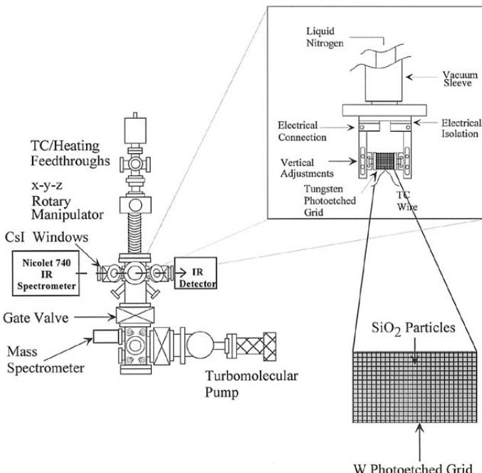
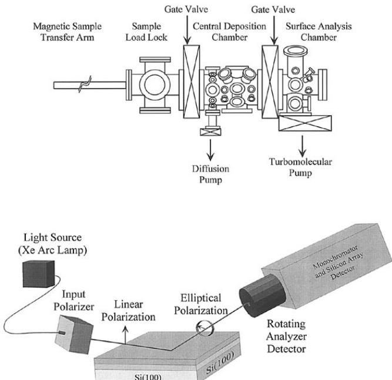
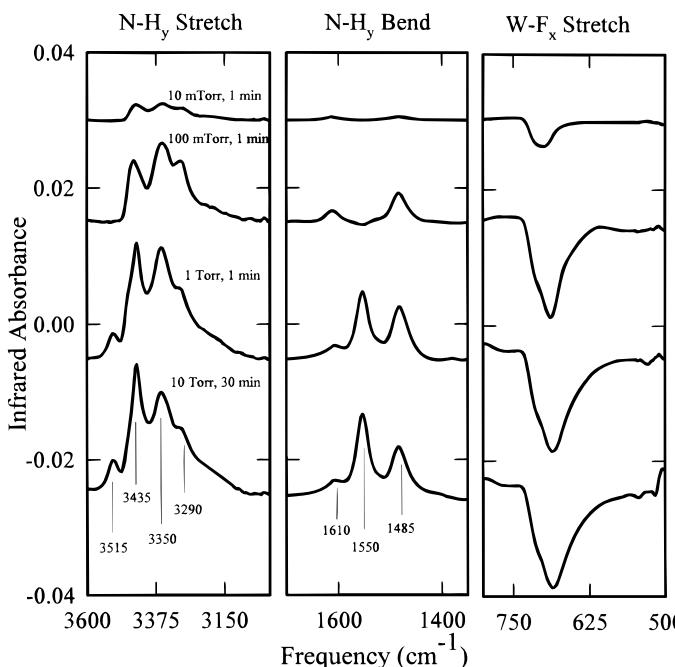
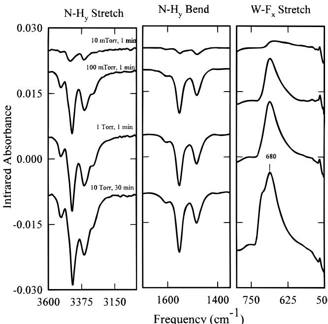
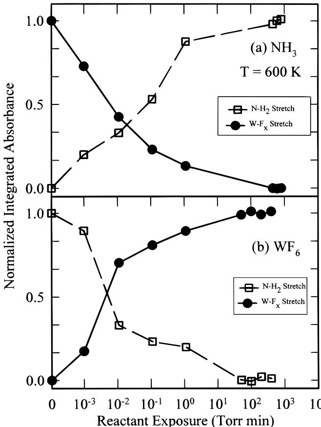
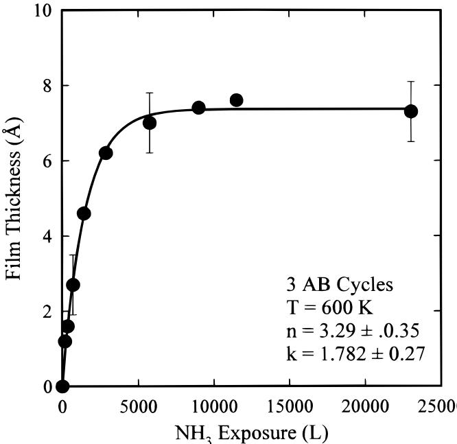
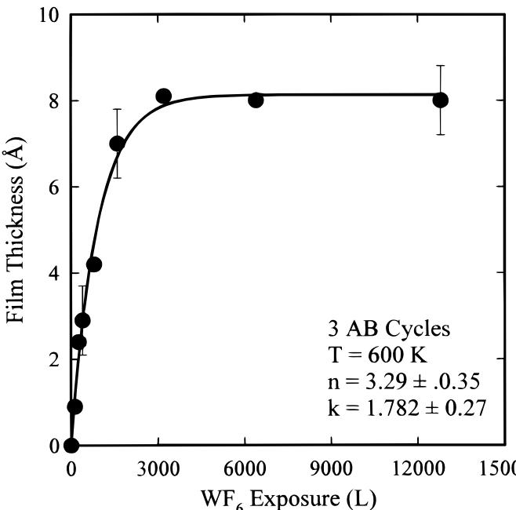
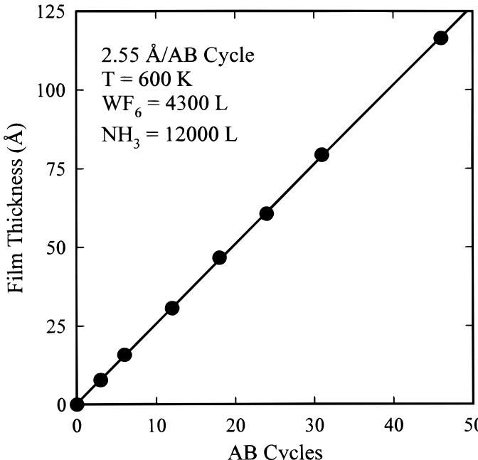
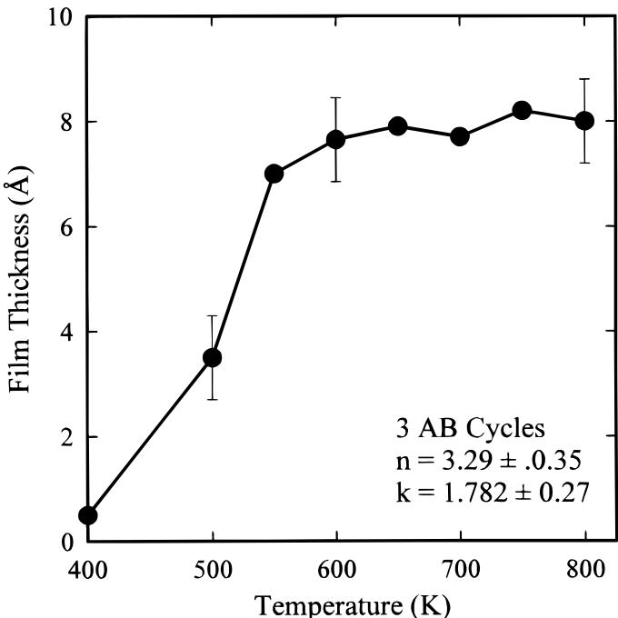
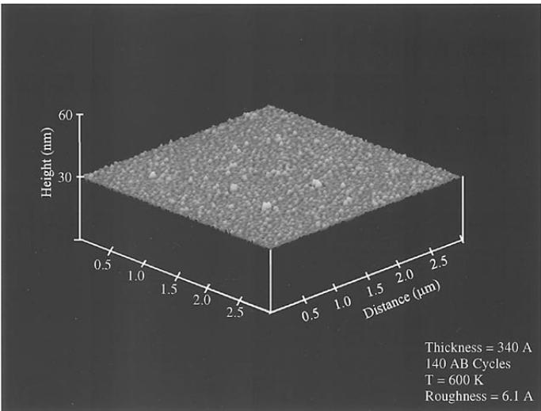

# You may also like

# Atomic Layer Deposition of Tungsten Nitride Films Using Sequential Surface Reactions

- Modeling and Optimization of the Step Coverage of Tungsten LPCVD in Trenches and Contact Holes  A. Hasper, J. Holleman, J. Middelhoek et al.

To cite this article: J. W. Klaus et al 2000 J. Electrochem. Soc. 147 1175

- Formation of Complex Tungsten-Silica Microstructures by Ar-Laser Processing  Zsolt Tóth and Klaus Piglmayer

View the article online for updates and enhancements.

- The Effect of Doping Atoms on the Kinetics of Self-Limiting Tungsten Film Growth on Silicon by Reduction of Tungsten Hexafluoride  C. A. van der Jeugd, G. J. Leusink, T. G. M. Oosterlaken et al.

# ECC-Opto-10 Optical Battery Test Cell: Visualize the Processes Inside Your Battery!

- Battery Test Cell for Optical Characterization  Designed for light microscopy, Raman spectroscopy and XRD.

- Optimized, Low Profile Cell Design (Device Height 21.5 mm)  Low cell height for high compatibility, fits on standard samples stages.

- High Cycling Stability and Easy Handling  Dedicated sample holders for different electrode arrangements included!

- Cell Lids with Different Openings and Window Materials Available

Contact us:  +49 40 79012- 734  sales@tel- cell.com  www.ell- cell.com

# Atomic Layer Deposition of Tungsten Nitride Films Using Sequential Surface Reactions

J.W.Klaus,S.J.Ferro, and 
S.M.George

Department of Chemistry and Biochemistry, University of Colorado, Boulder, Colorado 80309, USA

Tungsten nitride films were deposited with atomic layer control using sequential surface reactions. The tungsten nitride film growth was accomplished by separating the binary reaction  $2\mathrm{WF}_6 + \mathrm{NH}_3\rightarrow \mathrm{W}_2\mathrm{N} + 3\mathrm{HF} + 9 / 2\mathrm{F}_2$  into the half- reactions. Successive application of the  $\mathrm{WF}_6$  and  $\mathrm{NH}_3$  half- reactions in an ABAB... sequence produced tungsten nitride deposition at substrate temperatures between 600 and  $800~\mathrm{K}$ . Transmission Fourier transform infrared (FTIR) spectroscopy monitored the coverage of  $\mathrm{WF}_x^*$  and  $\mathrm{NH}_y^*$  surface species on high surface area particles during the  $\mathrm{WF}_5$  and  $\mathrm{NH}_3$  half- reactions. The FTIR spectroscopic results demonstrated that the  $\mathrm{WF}_6$  and  $\mathrm{NH}_3$  half- reactions were complete and self- limiting at temperatures  $\geq 600~\mathrm{K}$ . In situ spectroscopic ellipsometry monitored the film growth on Si(100) substrates vs. temperature and reactant exposure. A tungsten nitride deposition rate of  $2.55\mathrm{\AA / AB}$  cycle was measured at  $600 - 800\mathrm{K}$  for  $\mathrm{WF}_6$  and  $\mathrm{NH}_3$  reactant exposures  $\geq 3000\mathrm{L}$  and  $10,000\mathrm{L}$ , respectively. X- ray photoelectron spectroscopy depth- profiling experiments determined that the films had a  $\mathrm{W}_2\mathrm{N}$  stoichiometry with low C and O impurity concentrations. X- ray diffraction investigations revealed that the tungsten nitride films were microcrystalline. Atomic force microscopy measurements of the deposited films observed remarkably flat surfaces indicating smooth film growth. These smooth tungsten nitride films deposited with atomic layer control should be useful as diffusion barriers for  $\mathrm{Cu}$  on contact and via holes. © 2000 The Electrochemical Society. S0013- 4651(99)05- 028- 4. All rights reserved.

Manuscript submitted May 6, 1999; revised manuscript received November 21, 1999.

The deposition of diffusion barriers is an important processing challenge in semiconductor device manufacturing. Diffusion barriers become increasingly important as device dimensions approach the nanometer scale and the need to prevent intralayer and dopant diffusion becomes more urgent. Refractory metal nitrides are leading candidates for diffusion barriers because of their high stability at temperatures  $>450^{\circ}\mathrm{C}$ . In particular, tungsten nitride has generated considerable interest because tungsten nitride is an excellent barrier for  $\mathrm{Cu}$  diffusion into  $\mathrm{Si}$  at elevated temperatures. The conformal deposition of ultrathin tungsten nitride films on high aspect ratio structures is required for the most critical applications. Ultrathin tungsten nitride deposition on contact holes is necessary to prepare stable  $\mathrm{Cu / Si}$  contacts with extremely low resistance. Conformal tungsten nitride deposition on via holes of multiple level interconnects is needed to provide a barrier for  $\mathrm{Cu}$  diffusion into  $\mathrm{SiO}_2$  or other low  $k$  dielectrics.

Self- terminating surface reactions applied in a sequential manner can be used to achieve conformal and atomic layer controlled thin film growth. This sequential surface reaction approach has been used to grow a variety of oxide, nitride, sulfide, and phosphide thin films. Smooth single- element metallic tungsten thin films have also been deposited recently with atomic layer control. Atomic layer controlled growth using sequential surface reactions is ideal for precise and conformal deposition on both flat and high aspect ratio structures. This method is known to produce pinhole- free films and is easily extended to large substrate areas.

The thermal chemical vapor deposition (CVD) reaction

$$
2\mathrm{WF}_6(\mathrm{g}) + \mathrm{NH}_3(\mathrm{g})\rightarrow \mathrm{W}_2\mathrm{N}(\mathrm{s}) + 3\mathrm{HF}(\mathrm{g}) + 9 / 2\mathrm{F}_2(\mathrm{g}) \tag{[1]}
$$

has been used previously to deposit tungsten nitride. Plasma- enhanced CVD with  $\mathrm{WF}_6$  and  $\mathrm{NH}_3$  has also been employed to grow tungsten nitride films. To deposit tungsten nitride films with atomic layer control, the thermal CVD reaction was split into the following two half- reactions

$$
\begin{array}{r}\mathrm{WF}_x^* +\mathrm{NH}_3(\mathrm{g})\rightarrow \mathrm{W - NH}_y^* +a\mathrm{HF}(\mathrm{g}) + b\mathrm{F}_2(\mathrm{g})\\ \mathrm{W - NH}_y^* +\mathrm{WF}_6(\mathrm{g})\rightarrow \mathrm{WN - WF}_x^* +c\mathrm{HF}(\mathrm{g}) + \mathrm{dF}_2(\mathrm{g}) \end{array} \tag{[2]}
$$

The asterisks in the above reactions designate the surface species. The stoichiometry is kept indefinite because our surface chemistry studies indicate that there are several possible reaction pathways.

In each half- reaction, the  $\mathrm{WF}_x^*$  and  $\mathrm{WNH}_y^*$  surface species react with the gas- phase precursors. The surface reactions continue until all of the initial surface species have been converted to new surface species and volatile product molecules. The surface reactions self- terminate after the consumption of all the initial surface species and additional reactant exposure results in no additional growth. Application of the half- reactions in a ABAB... reaction sequence results in atomic layer deposition. If the surface half- reactions are allowed to reach completion everywhere on the substrate, changes in reactant pressure or total reactant exposure will not change the growth per AB cycle.

The atomic layer deposition of tungsten nitride was investigated using two sets of experiments. In the first set of experiments, in situ transmission Fourier transform infrared (FTIR) spectroscopy experiments were performed on high surface area particles to monitor the surface chemical reactions during the tungsten nitride film growth. The coverages of  $\mathrm{WF}_x^*$  and  $\mathrm{NH}_y^*$  surface species were monitored vs. time by observing the  $\mathrm{W - F}_x$  stretching mode and the  $\mathrm{N - H}_y$  stretching and bending modes. In the second set of experiments, tungsten nitride films were deposited on  $\mathrm{Si}(100)$  substrates and examined using in situ spectroscopic ellipsometry. The ellipsometry measurements determined the tungsten nitride film thickness and index of diffraction vs. deposition temperature and reactant exposure.

These two sets of experiments revealed that atomic layer controlled growth of tungsten nitride can be attained using sequential exposures to  $\mathrm{WF}_6$  and  $\mathrm{NH}_3$ . Additional atomic force microscopy studies characterized the flatness of the tungsten nitride films relative to the initial  $\mathrm{Si}(100)$  substrate. The tungsten nitride film properties were also evaluated by X- ray photoelectron spectroscopy (XPS) depth- profiling to determine film stoichiometry and X- ray diffraction experiments to ascertain film structure. These studies all indicate that atomic layer deposition techniques should be useful in depositing ultrathin and conformal tungsten nitride diffusion barriers in semiconductor device fabrication.

# Experimental

FTIR spectroscopy studies on silica powder. The FTIR spectroscopy experiments were conducted in a high vacuum chamber designed for in situ transmission FTIR spectroscopic investigations. A schematic of this apparatus is shown in Fig. 1. The chamber has a base pressure of  $5\times 10^{- 8}$  Torr. The chamber is equipped with a  $200\mathrm{L / s}$  turbomolecular pump, CsI windows, a Bayard- Alpert ionization gauge, a capacitance manometer and a Dycor quadrupole mass spectrometer. The vibrational spectra were recorded with a

  
Figure 1. Experimental schematic of vacuum chamber for transmission FTIR studies on high surface area samples.  $\mathrm{SiO}_2$  particles with a surface area of  $380\mathrm{m}^2 /\mathrm{g}$  are pressed into a tungsten grid and positioned in the infrared beam.

Nicolet 740 FTIR spectrometer and an MCT- B detector. To achieve sufficient surface sensitivity, high surface area silica powder (Aldrich fumed silica,  $380~\mathrm{m^2 / g}$ ) was pressed into a tungsten photoetched screen (Buckbee- Mears, 100 LPI, 0.002 in. thick) and suspended between copper posts on the sample mount.25 This sample could be resistively heated to  $\sim 1000\mathrm{K}$

The IR spectrum of the silica powder recorded immediately after loading into vacuum exhibited a pronounced surface vibrational feature that extended from  $3750 - 3000\mathrm{cm}^{- 1}$ . This feature is attributed to  $\mathrm{SiOH^{*}}$  surface species.26 The hydroxylated  $\mathrm{SiO}_2$  surface is very stable and does not react directly with  $\mathrm{WF}_6$ .27 To facilitate the nucleation of the tungsten nitride films, the  $\mathrm{SiO}_2$  surface was first exposed to 10 Torr of  $\mathrm{SiCl}_4$  at  $600~\mathrm{K}$  for  $30\mathrm{min}$ . This reaction produced a Cl- terminated  $\mathrm{SiO}_2$  surface characterized by a strong Si- Cl stretching vibration at  $\sim 650~\mathrm{cm}^{- 1}$ .26

The surface terminated with  $\mathrm{SiCl^{*}}$  species was further exposed to 10 Torr of  $\mathrm{NH}_3$  at  $700~\mathrm{K}$  for  $30\mathrm{min}$ . This reaction results in replacement of the  $\mathrm{SiCl^{*}}$  species with  $\mathrm{SiNH}_2^*$  amino groups.15 The  $\mathrm{SiNH}_2^*$  amino groups were then allowed to react with  $\sim 1$  Torr of  $\mathrm{WF}_6$  for  $30\mathrm{min}$ . This reaction produced a surface terminated with  $\mathrm{WF}_x^*$  species. A few  $\mathrm{WF}_6$  and  $\mathrm{NH}_3$  reaction cycles were subsequently performed on this surface to transform the  $\mathrm{SiO}_2$  surface into a tungsten nitride surface. The  $\mathrm{WF}_6$  and  $\mathrm{NH}_3$  surface reactions were examined on this tungsten nitride surface.

Transmission FTIR spectroscopy was utilized to measure the  $\mathrm{WF}_x^*$  species and  $\mathrm{NH}_y^*$  species during the  $\mathrm{WF}_6$  and  $\mathrm{NH}_3$  half- reactions. The FTIR spectra were recorded at  $340\mathrm{K}$  after various  $\mathrm{WF}_6$  or  $\mathrm{NH}_3$  exposures at different temperatures. Gate valves protected the CsI windows during the reactant exposures. The  $\mathrm{WF}_x^*$  surface species were monitored using the W- F stretching mode located at  $\sim 680~\mathrm{cm}^{- 1}$ .28 The  $\mathrm{NH}_y^*$  surface species were monitored by observing the dominant  $\mathrm{N} - \mathrm{H}_2$  stretching modes and  $\mathrm{N} - \mathrm{H}_2$  scissors mode centered at  $\sim 3400$  and  $1500~\mathrm{cm}^{- 1}$ , respectively.29- 31

Spectroscopic ellipsometry studies on Si(100). The tungsten nitride film growth experiments were performed in a high vacuum apparatus that has been described in detail elsewhere.10 A schematic of this experimental setup including the in situ ellipsometer is illustrated in Fig. 2. In brief, the apparatus consists of a sample load lock chamber, a central deposition chamber, and an ultrahigh vacuum chamber for surface analysis. The central deposition chamber is capable of automated dosing of molecular precursors under a wide variety of conditions. The deposition chamber is pumped with either a  $175~\mathrm{L / s}$  diffusion pump backed by a liquid  $\mathrm{N}_2$  trap and a mechanical pump or two separate liquid  $\mathrm{N}_2$  traps backed by mechanical pumps. This chamber has a base pressure of  $1\times 10^{- 7}$  Torr.

  
Figure 2. Experimental schematic of vacuum apparatus for in situ spectroscopic ellipsometry studies on Si(100) samples. This apparatus contains a sample load lock, a central deposition chamber equipped with the spectroscopic ellipsometer, and a surface analysis chamber.

The central deposition chamber is equipped with an in situ spectroscopic ellipsometer (J.A. Woolam Co. M- 44) that collects ellipsometric data at 44 visible wavelengths simultaneously. The spectroscopic ellipsometric measurements determined the refractive index and thickness of the tungsten nitride films using a Lorentz oscillator model.32,33 The 88 data points  $\Psi$  and  $\Lambda$  for the 44 individual wavelengths were fit using two oscillators and the film thickness. Each oscillator has a central energy, amplitude, and width. The weak coupling between the real and imaginary refractive index  $(\bar{n} = n + ik)$  and the thickness allowed the unique determination of these parameters.

The ellipsometer is mounted on the central deposition chamber employing ports positioned at  $80^{\circ}$  with respect to the surface normal. Gate valves protect the birefringent- free ellipsometer windows from deposition during the  $\mathrm{WF}_6$  and  $\mathrm{NH}_3$  exposures. The surface analysis chamber contains a UTI- 100C quadrupole mass spectrometer and a Bayard- Alpert ionization gauge. Mass spectometric analysis of the gases in the central deposition chamber is performed using a controlled leak to the surface analysis chamber. The surface analysis chamber is pumped by a  $210\mathrm{L / s}$  turbomolecular pump to obtain a base pressure of  $1\times 10^{- 9}$  Torr.

The sample substrate was a Si(100) wafer covered with  $125\mathrm{\AA}$  of  $\mathrm{SiO}_2$  formed by thermal oxidation. The Si(100) wafers were p- type boron- doped with a resistivity of  $\rho = 0.01 - 0.03\Omega \mathrm{cm}$ . Square pieces of the Si(100) wafer with dimensions of  $0.75\times 0.75$  in. were used as the samples. The highly doped Si(100) samples were suspended between copper posts using  $0.25\mathrm{mmMo}$  foil and could be resistively heated to  $>1100\mathrm{K}$ . The sample temperature was determined by a Chromel- Alumel thermocouple pressed onto the  $\mathrm{SiO}_2$  surface using a spring clip.

The Si(100) samples were cleaned with methanol, acetone, and distilled water before mounting and loading into the chamber. The  $\mathrm{SiO}_2$  surface was further cleaned in vacuum by an anneal at  $900~\mathrm{K}$  for  $5\mathrm{min}$ . This thermal anneal was followed by a high frequency  $\mathrm{H}_2\mathrm{O}$  plasma discharge at  $300~\mathrm{K}$ . This  $\mathrm{H}_2\mathrm{O}$  plasma fully hydroxylated the  $\mathrm{SiO}_2$  surface and removed surface carbon contamination.

To initiate the tungsten nitride film growth, the hydroxylated  $\mathrm{SiO}_2$  surface was first exposed to  $10\mathrm{mTorr}$  of  $\mathrm{Si}_2\mathrm{H}_6$  at  $600~\mathrm{K}$  for  $\sim 5\mathrm{min}$ . Under these conditions, FTIR spectroscopy indicates that  $\mathrm{Si}_2\mathrm{H}_6$  reacts with the surface hydroxyl groups and deposits surface species containing Si- H stretching vibrations: e.g.,  $\mathrm{SiOH^{*} + Si_2H_6\rightarrow SiOSiH_3^* + SiH_4}$ . After the initial  $\mathrm{Si}_2\mathrm{H}_6$  treatment, tungsten nitride film growth could be performed at reaction temperatures between  $550–800\mathrm{K}$ . A few  $\mathrm{WF}_6$  and  $\mathrm{NH}_3$  reaction cycles were utilized to transform the  $\mathrm{SiO}_2$  surface to a tungsten nitride surface. The dependence of the tungsten nitride growth rate on  $\mathrm{WF}_6$  and  $\mathrm{NH}_3$  reactant exposure was examined on this tungsten nitride surface.

# Results

FTIR spectroscopy studies of surface chemistry. Several infrared difference spectra recorded during the  $\mathrm{NH}_3$  half- reaction at  $600~\mathrm{K}$  are displayed in Fig. 3. These infrared difference spectra are referenced to a tungsten nitride surface that had earlier received a saturation exposure of  $\mathrm{WF}_6$  at  $600~\mathrm{K}$ . The spectra after various  $\mathrm{NH}_3$  exposures are offset for clarity in presentation. The infrared spectra show  $\mathrm{N - H}_2$  stretching vibrations at  $\sim 3450\mathrm{cm}^{- 1}$  and  $\mathrm{N - H}_2$  scissors vibrations at  $\sim 1500\mathrm{cm}^{- 1}$ . These results indicate that the  $\mathrm{NH}_3^*$  surface species is primarily a  $\mathrm{NH}_2^*$  surface species. The infrared spectra also display  $\mathrm{W - F}_x$  stretching vibrations at  $680~\mathrm{cm}^{- 1}$ . The spectra reveal a gradual increase in the dominant  $\mathrm{NH}_2^*$  surface species that is coupled with a corresponding loss in  $\mathrm{WF}_x^*$  surface species vs.  $\mathrm{NH}_3$  exposure. The loss of  $\mathrm{WF}_x^*$  surface species appears as a negative absorbance.

Figure 4 displays infrared difference spectra recorded during the subsequent  $\mathrm{WF}_6$  exposure at  $600~\mathrm{K}$ . The difference spectra are again offset to display the changes vs.  $\mathrm{WF}_6$  exposure. Each difference spectrum displays the change in the infrared absorbance referenced to a tungsten nitride surface that had received a saturation  $\mathrm{NH}_3$  exposure at  $600~\mathrm{K}$ . The gain of  $\mathrm{WF}_x^*$  surface species is concurrent with a loss of  $\mathrm{NH}_2^*$  surface species. The loss of  $\mathrm{NH}_2^*$  surface species appears as a negative absorbance.

The normalized integrated absorbances during the  $\mathrm{NH}_3$  and  $\mathrm{WF}_6$  half- reactions are displayed in Fig. 5. The loss of  $\mathrm{WF}_x^*$  surface species during the  $\mathrm{NH}_3$  half- reaction occurs more rapidly than the corresponding gain of the  $\mathrm{NH}_2^*$  surface species. This behavior indi

  
Figure 3. FTIR difference spectra in the  $\mathrm{N - H}_y$  stretch,  $\mathrm{N - H}_y$  bend, and  $\mathrm{W - F}_x$  stretch regions recorded after various  $\mathrm{NH}_3$  exposures during the  $\mathrm{NH}_3$  half-reaction at  $600~\mathrm{K}$ . Each difference spectrum is referenced to a surface that had earlier received a saturation  $\mathrm{WF}_6$  exposure at  $600~\mathrm{K}$ .

  
Figure 4. FTIR difference spectra in the  $\mathrm{N - H}_y$  stretch,  $\mathrm{N - H}_y$  bend, and  $\mathrm{W - F}_x$  stretch regions recorded after various  $\mathrm{WF}_6$  exposures during the  $\mathrm{WF}_6$  half-reaction at  $600~\mathrm{K}$ . Each difference spectrum is referenced to a tungsten nitride surface that had earlier received a saturation  $\mathrm{NH}_3$  exposure at  $600~\mathrm{K}$ .

cates that each  $\mathrm{NH}_3$  molecule may initially react with multiple  $\mathrm{WF}_x^*$  surface species. In contrast, the gain of  $\mathrm{WF}_x^*$  surface species during the  $\mathrm{WF}_6$  half- reaction is concurrent with the loss of  $\mathrm{NH}_2^*$  surface

  
Figure 5. Normalized integrated absorbances for the  $\mathrm{W - F}_x$  stretching mode  $(\sim 680~\mathrm{cm}^{-1})$  and the  $\mathrm{N - H}_2$  stretching mode  $(\sim 3400~\mathrm{cm}^{-1})$  vs. reactant exposure during the (a)  $\mathrm{NH}_3$  and (b)  $\mathrm{WF}_6$  half-reactions at  $600~\mathrm{K}$ .

species. This behavior indicates a 1:1 reaction between  $\mathrm{WF}_6$  and  $\mathrm{NH}_2^*$  surface species.

The loss of  $\mathrm{NH}_2^*$  surface coverage during the  $\mathrm{WF}_6$  half- reaction results in the growth of  $\mathrm{WF}_x^*$  surface coverage. When the  $\mathrm{WF}_6$  half- reaction reaches completion, this  $\mathrm{WF}_x^*$  surface coverage is equivalent to the  $\mathrm{WF}_x^*$  surface coverage measured prior to the  $\mathrm{NH}_3$  half- reaction. Similarly, the loss of  $\mathrm{WF}_x^*$  surface coverage during the  $\mathrm{NH}_3$  half- reaction results in the growth of  $\mathrm{NH}_2^*$  surface coverage that becomes equivalent to the  $\mathrm{NH}_2^*$  surface coverage measured prior to the  $\mathrm{WF}_6$  half- reaction. These results indicate that the  $\mathrm{NH}_3$  and  $\mathrm{WF}_6$  surface reactions proceed to completion at  $600~\mathrm{K}$  with sufficient reactant exposure. In addition, each reaction is self- limiting and terminates with the consumption of the initial surface functional groups.

Infrared difference spectra were also recorded during the  $\mathrm{WF}_6$  and  $\mathrm{NH}_3$  half- reactions at 700 and  $500~\mathrm{K}$ . At  $700~\mathrm{K}$ , the  $\mathrm{WF}_6$  and  $\mathrm{NH}_3$  half- reactions were observed to be faster than at  $600~\mathrm{K}$ . However, conductance limitations in the high surface area silica powder prevented a quantitative description of the relative reaction rates. The half- reactions at  $700~\mathrm{K}$  were self- limiting and terminated with the consumption of the initial surface species. The integrated absorbances for the  $\mathrm{WF}_6$  and  $\mathrm{NH}_3$  half- reactions at  $700~\mathrm{K}$  showed that the initial loss of  $\mathrm{WF}_x^*$  surface species during the  $\mathrm{NH}_3$  half- reaction did not correspond with a concurrent growth of  $\mathrm{NH}_2^*$  surface species. This behavior is consistent with each  $\mathrm{NH}_3$  molecule initially reacting with even more  $\mathrm{WF}_x^*$  surface species at 700 than at  $600~\mathrm{K}$ . In contrast, the  $\mathrm{WF}_6$  half- reaction at  $700~\mathrm{K}$  occurred with a concurrent gain of  $\mathrm{WF}_x^*$  surface species and loss of  $\mathrm{NH}_2^*$  surface species.

At  $500~\mathrm{K}$ , the  $\mathrm{NH}_3$  half- reaction was observed to saturate after removing only  $\sim 60\%$  of the  $\mathrm{WF}_x^*$  surface species. Larger  $\mathrm{NH}_3$  reactant exposures did not remove additional  $\mathrm{WF}_x^*$  surface species. This behavior indicates that the  $\mathrm{NH}_3$  half- reaction does not proceed to completion at  $500~\mathrm{K}$ . In contrast, the  $\mathrm{WF}_6$  half- reaction was observed to consume all of the surface  $\mathrm{NH}_3^*$  species resulting from the  $\mathrm{NH}_3$  reaction at  $500~\mathrm{K}$ . The  $\mathrm{WF}_6$  half- reaction at  $500~\mathrm{K}$  was also performed on a tungsten nitride surface that had earlier received a saturation exposure of  $\mathrm{NH}_3$  at  $600~\mathrm{K}$ . This experiment revealed that sufficient  $\mathrm{WF}_6$  exposures can consume all the  $\mathrm{NH}_y^*$  surface species at  $500~\mathrm{K}$ . The inability of the  $\mathrm{NH}_3$  half- reaction to react with all  $\mathrm{WF}_x^*$  surface species at  $500~\mathrm{K}$  indicates that tungsten nitride film growth should be performed at temperatures  $\geq 600~\mathrm{K}$  to obtain the best tungsten nitride films.

Spectroscopic ellipsometry studies of film growth. The dependence of the half- reactions on the  $\mathrm{WF}_6$  and  $\mathrm{NH}_3$  reactant exposures was examined by measuring the tungsten nitride film thickness deposited by 3 AB cycles at  $600~\mathrm{K}$ . A typical AB cycle occurred with the following sequence: expose  $\mathrm{WF}_6$  (1- 10 mTorr)  $\mathrm{N}_2$  purge  $1 - 3\mathrm{min}/$  expose  $\mathrm{NH}_3$  (1- 10 mTorr)  $\mathrm{N}_2$  purge  $1 - 3\mathrm{min}$ . The ellipsometric measurements shown in Fig. 6 and 7 demonstrate that the  $\mathrm{WF}_6$  and  $\mathrm{NH}_3$  half- reactions are self- limiting at  $600~\mathrm{K}$ . Once a half- reaction reaches completion, additional reactant exposure produces no additional film growth.

Figure 6 displays the tungsten nitride film thickness obtained vs.  $\mathrm{NH}_3$  reactant exposure with a  $\mathrm{WF}_6$  reactant exposure of  $4300~\mathrm{L}$ . This  $\mathrm{WF}_6$  exposure is sufficient for a complete  $\mathrm{WF}_6$  half- reaction. Figure 6 shows that the  $\mathrm{NH}_3$  half- reaction is incomplete and the tungsten nitride film thickness deposited by three AB cycles is dependent on  $\mathrm{NH}_3$  reactant exposure for  $\mathrm{NH}_3$  exposures  $< 10,000~\mathrm{L}$ . In contrast, additional  $\mathrm{NH}_3$  exposure results in no further tungsten nitride deposition for  $\mathrm{NH}_3$  exposures  $\geq 10,000~\mathrm{L}$ . The surface reactions are complete and self- limiting in this regime. The error bars represent the  $90\%$  confidence limits determined by the uncertainty in the ellipsometric data. The solid line is intended only to guide the eye.

The film thicknesses measured in Fig. 7 were obtained with a variable  $\mathrm{WF}_6$  exposure and a  $\mathrm{NH}_3$  reactant exposure of  $12,000~\mathrm{L}$ . This  $\mathrm{NH}_3$  exposure is sufficient for a complete  $\mathrm{NH}_3$  half- reaction. Figure 7 shows that the tungsten nitride film thickness deposited by 3 AB cycles is dependent on the  $\mathrm{WF}_6$  reactant exposure for  $\mathrm{WF}_6$  exposures  $< 3000~\mathrm{L}$ . In contrast, additional  $\mathrm{WF}_6$  reactant exposure results in no additional tungsten nitride deposition for  $\mathrm{WF}_6$  reactant exposures  $\geq 3000~\mathrm{L}$ .

  
Figure 6. Ellipsometric measurements of the tungsten nitride film thickness deposited by three AB cycles vs.  $\mathrm{NH}_3$  exposure at  $600~\mathrm{K}$ . A  $\mathrm{WF}_6$  exposure of  $4300~\mathrm{L}$  was sufficient for a complete  $\mathrm{WF}_6$  half- reaction at  $600~\mathrm{K}$ .

Figure 8 shows the ellipsometric measurements of the tungsten nitride film thickness vs. the number of AB cycles at  $600~\mathrm{K}$ . The  $\mathrm{WF}_6$  reactant exposure of  $4300~\mathrm{L}$  and  $\mathrm{NH}_3$  reactant exposure of  $12,000~\mathrm{L}$  were sufficient for complete half- reactions during each AB cycle. The film thickness is directly proportional to the number of AB cycles. The solid line displays the least squares linear fit to the data.

The tungsten nitride film thickness vs. number of AB cycles is extremely linear. The least squares fit yields a growth rate of  $2.55\mathrm{\AA}/$  AB cycle at  $600~\mathrm{K}$ . This growth rate agrees well with the  $\mathrm{W}_2\mathrm{N}$  lattice constant of  $2.4\mathrm{\AA}$  obtained by the X- ray diffraction (XRD) meas

  
Figure 7. Ellipsometric measurements of the tungsten nitride film thickness deposited by three AB cycles vs.  $\mathrm{WF}_6$  exposure at  $600~\mathrm{K}$ . A  $\mathrm{NH}_3$  exposure of  $12,000~\mathrm{L}$  was sufficient for a complete  $\mathrm{NH}_3$  half- reaction at  $600~\mathrm{K}$ .

  
Figure 8. Tungsten nitride film thickness measured by ellipsometry vs. number of AB cycles at  $600~\mathrm{K}$ . The  $\mathrm{NH_3}$  exposure of  $12,000\mathrm{L}$  and  $\mathrm{WF_6}$  exposure of  $4300\mathrm{L}$  were sufficient for complete half-reactions during each AB cycle.

Measurements. The linear growth rate indicates that the number of reactive surface sites remains constant during tungsten nitride deposition. The constant growth rate also argues that the tungsten nitride films are growing with no surface roughening.

The ellipsometric measurements of the tungsten nitride film thickness deposited by three AB reaction cycles vs. substrate temperature are displayed in Fig. 9. The  $\mathrm{WF_6}$  and  $\mathrm{NH_3}$  reactant exposures at each temperature were sufficient for complete half- reactions and additional reactant exposure resulted in no further deposition. The solid line connects the data points, and the error bars represent the  $90\%$  confidence limits. Figure 9 shows that the tungsten nitride film thickness deposited by three AB cycles increases rapidly with substrate temperature from 400 to  $600~\mathrm{K}$ . In this temperature regime, the FTIR spectroscopy measurements indicate that the surface half- reactions do not proceed to completion and may produce a  $\mathrm{WF_6}$ :  $\mathrm{NH_3}$  adduct species.

  
Figure 9. Ellipsometric measurements of the tungsten nitride film thickness deposited by three AB cycles at various substrate temperatures. Reactant exposures were sufficient for complete half-reactions at each temperature.

After the rapid rise vs. temperature from 400 to  $600~\mathrm{K}$ , the tungsten nitride film thickness deposited by 3 AB cycles increases only very slightly for substrate temperatures between  $600–800\mathrm{K}$ . These temperatures are sufficient for complete half- reactions according to the FTIR vibrational studies. The nearly constant tungsten nitride deposition rate of  $\sim 2.5\mathrm{\AA}$  cycle for temperatures between 600 and  $800~\mathrm{K}$  is consistent with the thickness of a  $\mathrm{W}_2\mathrm{N}$  monolayer.

The surface topography of the deposited tungsten nitride films was examined with an atomic force microscope (AFM) operating in tapping mode (Digital Instruments- Nanoscope III). Figure 10 shows a 3.0 by  $3.0~\mu \mathrm{m}$  scan of a  $\sim 350\mathrm{\AA}$  thick tungsten nitride film deposited by  $140\mathrm{AB}$  cycles at  $600~\mathrm{K}$ . The reactant exposures were sufficient for both half- reactions to reach completion for all  $140\mathrm{AB}$  cycles. The light- to- dark gray scale in Fig. 10 spans less than  $25\mathrm{\AA}$ .

The AFM images of the deposited tungsten nitride films exhibit a surface roughness of  $\pm 6.1\mathrm{\AA}$  (root- mean- square). In comparison, the surface roughness of the initial  $\mathrm{SiO_2}$  surface on  $\mathrm{Si}(100)$  was  $\pm 2.5\mathrm{\AA}$ . The power spectral density of the surface roughness also exhibited the same statistical characteristics as the initial  $\mathrm{SiO_2}$  surface on  $\mathrm{Si}(100)$ . This smooth surface topography with a roughness comparable to the initial surface indicates that the tungsten nitride films are growing with negligible roughening.

The tungsten nitride film composition was evaluated using X- ray photoelectron spectroscopy (XPS) depth- profiling. The XPS depth- profiling experiments employed a  $4\mathrm{kV}\mathrm{Ar}^{+}$  ion beam operating with a  $10\mathrm{mA / cm^2}$  ion current to sputter slowly through the  $350\mathrm{\AA}$  thick tungsten nitride film. The surface of the tungsten nitride film exhibited characteristic signals for W, C, N, F, and O atoms. After several minutes of sputtering through the surface region, the elemental concentrations in the bulk tungsten nitride film were constant until encountering the underlying  $\mathrm{SiO_2}$  film.

The XPS depth- profiling results revealed that the bulk tungsten nitride films had a W to N ratio of  $\sim 3:1$ . The films also contained small atomic percentage concentrations of  $\sim 5\%$  C and  $\sim 3.6\%$  O. These impurities may be attributed to CO dissociation resulting from the CO partial pressures in our diffusion- pumped central deposition

These experiments were performed by Eli Marieva of the Department of Metallurgical and Materials Engineering at the Colorado School of Mines.

  
Figure 10. AFM image of a  $350\mathrm{\AA}$  thick tungsten nitride film deposited at  $600~\mathrm{K}$  after  $140\mathrm{AB}$  cycles on a  $125\mathrm{\AA}$  thick  $\mathrm{SiO_2}$  film on  $\mathrm{Si}(100)$ . The reactant exposures of  $12,000\mathrm{L}\mathrm{NH_3}$  and  $4300\mathrm{L}\mathrm{WE_2}$  were sufficient for complete half-reactions during each AB cycle. The light-to-dark range is  $25\mathrm{\AA}$ .

chamber.34 Alternatively, the impurities may result from artifacts encountered during  $\mathrm{Ar^{+}}$  sputtering of metal and metal nitride films.35 The large W:N ratio may result from the preferential removal of N atoms by  $\mathrm{Ar^{+}}$  sputtering that is often observed for metal nitrides.35

Glancing angle XRD experiments were also performed to evaluate the crystallographic structure of the tungsten nitride films. [See footnote a on the previous page.] Using  $\mathrm{CuK}\alpha$  radiation incident at  $4^{\circ}$  the tungsten nitride films displayed several diffraction peaks at angles 20 equal to 37,43,and  $63^{\circ}$  .The most dominant peak was observed at  $37^{\circ}$  .These diffraction peaks are consistent with the (111), (200), (220) reflections of cubic  $\mathrm{W}_2\mathrm{N}$  36,37 The estimated grain size of the  $\mathrm{W}_2\mathrm{N}$  crystallites determined from the width of the (111) diffraction peak was  $\sim 110\mathrm{\AA}$

The adhesion of the tungsten films to the starting  $\mathrm{SiO}_2$  surface was qualitatively examined with the "adhesive tape test procedure.38 The tungsten nitride films survived the test with no evidence of delamination. The resistivity of the tungsten nitride films was also determined using a four- point probe apparatus with silver paint electrical contacts.39 The measured resistivity was  $4500\mathrm{m}\Omega$  cm.

# Discussion

Surface chemistry of tungsten nitride deposition.- The surface chemistry of tungsten nitride deposition can be studied by monitoring the vibrational absorption features of the  $\mathrm{NH_y^*}$  and  $\mathrm{WF}_x^*$  surface species. The  $\mathrm{N - H_y}$  vibrational stretching region of the infrared spectra exhibits significant changes with reaction temperature. At  $700\mathrm{K}$  the  $\mathrm{N - H_y}$  stretching region exhibited two sharp features at 3435 and  $3515~\mathrm{cm^{- 1}}$  that are assigned to the asymmetric and symmetric stretching modes of  $\mathrm{NH}_2^*$  surface species. The  $\mathrm{N - H_y}$  bending region displayed a strong peak at  $1550~\mathrm{cm^{- 1}}$  that is attributed to the  $\mathrm{N - H}_2$  scissors mode.29,30 The frequencies of these three modes are consistent with  $\mathrm{NH}_2^*$  surface species with three- coordinate  $\mathrm{N}$  atoms (W $\mathrm{NH}_2$ ).29,30 A small peak also appeared at  $1485~\mathrm{cm^{- 1}}$  that can be assigned to four- coordinate surface  $\mathrm{N}$  atoms  $(\mathrm{W}_2\mathrm{- NH}_2)$ .29,30

Reduction of the reaction temperature to  $600~\mathrm{K}$  resulted in several new spectral features that are shown in Fig. 3 and 4. In addition to the 3435 and  $3515~\mathrm{cm^{- 1}}$  features observed at  $700\mathrm{K}$  the  $\mathrm{N - H}_2$  stretching region also displays two new features located at 3350 and  $3290~\mathrm{cm^{- 1}}$ . In addition to the  $1550~\mathrm{cm^{- 1}}$  peak observed at  $700\mathrm{K}$  the  $\mathrm{N - H_y}$  bending region also reveals a prominent  $1485~\mathrm{cm^{- 1}}$  feature and a weak  $1610~\mathrm{cm^{- 1}}$  feature. The additional infrared features at  $600~\mathrm{K}$  are attributed to  $\mathrm{NH}_2^*$  surface species with four- coordinate  $\mathrm{N}$  atoms  $(\mathrm{W}_2\mathrm{- NH}_2)$ .29,30 These four- coordinate surface  $\mathrm{N}$  atoms exist together with the three- coordinate surface  $\mathrm{N}$  atoms. The  $1610~\mathrm{cm^{- 1}}$  feature is attributed to a small  $\mathrm{NH}_3^*$  surface coverage.29- 31

Further changes in the  $\mathrm{N - H_y}$  stretching and bending regions occur when the reaction temperature is lowered to  $500~\mathrm{K}$ . The three- coordinate  $\mathrm{N - H}_2$  stretching and bending modes are nearly extinguished at 3515, 3435, and  $1550~\mathrm{cm^{- 1}}$  in addition, the four- coordinate  $\mathrm{N - H}_2$  stretching and bending modes are persistent at 3350, 3290, and  $1485~\mathrm{cm^{- 1}}$ . Two prominent spectral features are also observed at 3455 and  $1610~\mathrm{cm^{- 1}}$ . These new features are attributed to molecular  $\mathrm{NH}_3^*$  surface species.29- 31 The presence of molecular  $\mathrm{NH}_3^*$  surface species may indicate the formation of an  $\mathrm{WF}_x\mathrm{:NH}_3$  adduct. This adduct has been observed earlier when using  $\mathrm{WF}_6$  and  $\mathrm{NH}_3$  reactants.20 Tungsten nitride films that have incorporated the  $\mathrm{WF}_x\mathrm{:NH}_3$  adduct exhibit poor adhesion and electrical properties.20

The  $\mathrm{W - F}_x$  stretching vibration in Fig. 3 and 4 is observed at  $\sim 680~\mathrm{cm^{- 1}}$ . This vibrational feature exhibited only subtle changes with reaction temperature. The  $\mathrm{W - F}_x$  stretching mode broadened and shifted to slightly higher frequencies as the reaction temperature was lowered from 700 to  $500~\mathrm{K}$ . This frequency shift may be consistent with a higher coverage of surface fluorine species at lower reaction temperatures.

An analysis of the normalized integrated absorbance data presented in Fig. 5 yields additional details about the reactions at  $600~\mathrm{K}$ . In Fig. 5a, loss of  $\mathrm{WF}_x^*$  surface coverage during the  $\mathrm{NH}_3$  half- reaction is coincident with the gain of  $\mathrm{NH}_2^*$  surface coverage. Likewise, the loss of  $\mathrm{NH}_2^*$  surface coverage in Fig. 5b is always concurrent with the growth of  $\mathrm{WF}_x^*$  surface coverage. This symmetry between loss and gain suggests that both the half- reactions occur in an approximately 1:1 fashion. The  $\mathrm{NH}_3$  reactant consumes  $\mathrm{WF}_x^*$  surface species and deposits  $\mathrm{NH}_2^*$  surface species. The  $\mathrm{WF}_6$  reactant consumes  $\mathrm{NH}_2^*$  surface species and deposits  $\mathrm{WF}_x^*$  surface species.

The FTIR spectra are consistent with self- limiting surface chemistry and the atomic layer controlled growth of tungsten nitride. The FTIR spectra do display some temperature dependence that may affect the deposited film stoichiometry. At  $700~\mathrm{K}$  during the  $\mathrm{NH}_3$  half- reaction, the  $\mathrm{WF}_x^*$  surface coverage initially decreases with very little corresponding increase in the  $\mathrm{NH}_2^*$  surface coverage. This observation suggests that each  $\mathrm{NH}_3$  molecule can react initially with multiple  $\mathrm{WF}_x^*$  surface species at  $700~\mathrm{K}$ . During the  $\mathrm{WF}_6$  half- reaction at  $700~\mathrm{K}$ , the loss of  $\mathrm{NH}_2^*$  surface coverage and gain of  $\mathrm{WF}_x^*$  surface coverage are symmetrical and similar to the behavior observed at  $600~\mathrm{K}$ .

When the reaction temperature is lowered to  $500~\mathrm{K}$ , the  $\mathrm{NH}_3$  precursor cannot react with all of the  $\mathrm{WF}_x^*$  surface species. This  $\mathrm{NH}_3$  half- reaction saturates after removing only  $\sim 60\%$  of the initial  $\mathrm{WF}_x^*$  surface coverage. In contrast, the  $\mathrm{WF}_6$  half- reaction displays very symmetrical behavior at  $500~\mathrm{K}$ . The loss of  $\mathrm{N - H}_y$  absorbance features and gain of  $\mathrm{W - F}_x$  absorbance features are in close correspondence.

The temperature dependence of the  $\mathrm{NH}_3$  half- reaction suggests that the  $\mathrm{N}$  content of the deposited tungsten nitride films may change with reaction temperature. A lower  $\mathrm{N}$  content may be observed at  $700~\mathrm{K}$  because each  $\mathrm{NH}_3$  molecule can initially react with multiple  $\mathrm{WF}_x^*$  surface species. This prediction is consistent with other studies that observe lower  $\mathrm{N}$  concentrations in tungsten nitride films deposited at higher reaction temperatures.19,32,37 Likewise, a lower  $\mathrm{N}$  content may also be measured at  $500~\mathrm{K}$  because the  $\mathrm{NH}_3$  half- reaction does not proceed to completion. These predictions should be tested by evaluating the stoichiometry of tungsten nitride films deposited at different substrate temperatures.

Tungsten nitride film growth on  $\mathrm{Si}(100)$ . Figures 6 and 7 demonstrate the self- limiting nature of the  $\mathrm{NH}_3$  and  $\mathrm{WF}_6$  half- reactions at  $600~\mathrm{K}$ . These results reveal that  $\mathrm{NH}_3$  exposures of  $10,000~\mathrm{L}$  and  $\mathrm{WF}_6$  exposures of  $3000~\mathrm{L}$  are needed for complete surface half- reactions at  $600~\mathrm{K}$ . Using saturation exposures of  $\mathrm{NH}_3$  and  $\mathrm{WF}_6$ , the deposited tungsten nitride thickness vs. number of AB reaction cycles was examined in Fig. 8. The film growth was extremely linear with a tungsten nitride deposition rate of  $2.55\mathrm{\AA / AB}$  cycle.

The linear growth observed in Fig. 8 indicates that the tungsten nitride films are growing very smoothly on the  $\mathrm{Si}(100)$  substrate. The AFM image in Fig. 10 confirms the deposition of very smooth and uniform tungsten nitride films. The surface roughness of this tungsten nitride film is only  $\pm 6.1\mathrm{\AA}$  (root- mean- square). The slight roughness of this film may be attributed in part to the presence of small tungsten nitride crystallites.

Figure 9 reveals that the tungsten nitride deposition is very constant for temperatures  $\geq 600~\mathrm{K}$ . This constant deposition rate vs. temperature was not observed in earlier studies of  $\mathrm{Al}_2\mathrm{O}_3$  and  $\mathrm{SiO}_2$  atomic layer controlled growth.10,11 This earlier temperature dependence was attributed to the loss of hydroxyl groups on  $\mathrm{Al}_2\mathrm{O}_3$  and  $\mathrm{SiO}_2$  by dehydroxylation.40,41 The constant tungsten nitride deposition rate vs. temperature may result from the higher thermal stability of the  $\mathrm{WF}_x^*$  and  $\mathrm{NH}_2^*$  surface species. If the  $\mathrm{WF}_x^*$  and  $\mathrm{NH}_2^*$  surface coverages remain constant at  $\geq 600~\mathrm{K}$ , the same number of tungsten and nitrogen atoms should be deposited each AB cycle.

The spectroscopic ellipsometric measurements determined that the real and imaginary refractive index  $(\bar{n} = n + ik)$  varied with film thickness. The refractive index was  $n = 2.2\pm 0.6$  and  $k = 0.7\pm 0.3$  at  $\lambda = 632\mathrm{nm}$  for a  $45\mathrm{\AA}$  thick tungsten nitride film. The refractive index was  $n = 3.29\pm 0.35$  and  $k = 1.78\pm 0.27$  at  $\lambda = 632\mathrm{nm}$  for a  $275\mathrm{\AA}$  thick film. Tungsten nitride film thicknesses  $\geq 275\mathrm{\AA}$  resulted in no further change in the refractive index.

The changing refractive index with film thickness may simply result from the evolution of the electronic band structure with film thickness. The film composition is not believed to vary vs. film

thickness because the tungsten nitride deposition rate per AB cycle remained constant vs. film thickness. The measured optical constants for the thick tungsten nitride films  $\geq 275\mathrm{\AA}$  are consistent with tungsten nitride films that have a W:N ratio between 2:1 and 1:1.42 Tungsten nitride films thicker than  $\sim 500\mathrm{\AA}$  could not be measured using ellipsometry because of strong light absorption by the metallic film.

Tungsten nitride films commonly exist as  $\mathrm{W}_2\mathrm{N}$  or WN with a 2:1 or  $1:1\mathrm{W / N}$  stoichiometry.36 A:  $1:2\mathrm{W / N}$  stoichiometry is unlikely because the  $\mathrm{WN}_2$  structure is very unstable. The tungsten nitride crystal structure consists of a face centered cubic (fcc) sublattice of W atoms. Half of the octahedral holes are filled with N atoms in the  $\mathrm{W}_2\mathrm{N}$  structure. All of the octahedral holes are filled with N atoms in the WN structure. These arrangements produce a cubic crystal lattice for  $\mathrm{W}_2\mathrm{N}$  and a hexagonal lattice structure for WN.43 The cubic crystal lattice for  $\mathrm{W}_2\mathrm{N}$  is the most stable structure and is almost always observed in tungsten nitride film growth studies.6,20,23 The heat of formation of  $- 5.3\mathrm{kcal / mol}$  for  $\mathrm{W}_2\mathrm{N}$  is slightly more exothermic than the heat of formation of  $- 3.6\mathrm{kcal / mol}$  for WN.5

The XRD measurements of the tungsten nitride films revealed mainly cubic  $\mathrm{W}_2\mathrm{N}$  with a dominant (111) peak. The lattice constant derived from the (111) peak was  $\sim 2.4\mathrm{\AA}$ . This lattice constant agrees with the tungsten nitride growth rate of  $2.55\mathrm{\AA / AB}$  cycle obtained from the measurements shown in Fig. 8. The grain size of the tungsten nitride films was estimated to be  $\sim 110\mathrm{\AA}$  from the (111) diffraction peak. These X- ray results indicate that the tungsten nitride films have not developed a large grain crystallized structure. The AFM measurements shown in Fig. 10 may be observing some small crystallites on the tungsten nitride surface that are consistent with the XRD results. Small crystalline grains are commonly observed in tungsten nitride films grown at low temperature.2,6

The  $3:1\mathrm{W / N}$  stoichiometry determined by the XPS sputter depth- profiling measurements is in disagreement with the XRD analysis that indicated a  $\mathrm{W}_2\mathrm{N}$  film stoichiometry. Similar disagreement has been observed in other tungsten nitride film growth studies.19,37 These studies have also observed  $\mathrm{W}_2\mathrm{N}$  by XRD and measured either higher or lower W/N stoichiometry by  $\mathrm{Ar^{+}}$  sputter profiling.19,37  $\mathrm{Ar^{+}}$  ion beam sputtering usually results in preferential removal of  $\mathrm{N}$  atoms that yields artificially high W:N ratios.35 Extra  $\mathrm{N}$  atoms are also believed to exist at grain boundaries between tungsten nitride crystallites.2,37 These extra  $\mathrm{N}$  atoms at the grain boundaries are not observed by the XRD experiment and may contribute to a lower W:N ratio measured during sputter depth- profiling.

# Conclusions

The atomic layer deposition of tungsten nitride films was demonstrated using self- limiting sequential surface reactions. Alternating exposures of  $\mathrm{NH}_3$  and  $\mathrm{WF}_6$  in an ABAB... reaction sequence were used to deposit the tungsten nitride films. Transmission FTIR spectroscopy studies indicated that the  $\mathrm{NH}_3$  and  $\mathrm{WF}_6$  surface reactions were complete and self- limiting at  $T\geq 600\mathrm{K}$ . In situ spectroscopic ellipsometry measurements determined that the tungsten nitride growth per AB cycle was extremely linear with growth rates of  $\sim 2.5\mathrm{\AA / AB}$  cycle at  $600 - 800\mathrm{K}$ .

AFM images revealed that the deposited tungsten nitride films were exceptionally flat with a roughness similar to the initial surface. XRD experiments revealed the films consisted of small  $\mathrm{W}_2\mathrm{N}$  crystallites with a diameter  $\sim 110\mathrm{\AA}$  and a preferred (111) orientation. XPS depth- profiling measurements of the tungsten nitride films observed only low C, O, and F impurity concentrations. The atomic layer deposition of smooth tungsten nitride films should find many applications and may be particularly important as a diffusion barrier for  $\mathrm{Cu}$  on contact and via holes.

# Acknowledgments

This work was supported in part by Advanced Micro Devices through a graduate student fellowship for J.W.K. Additional support was received from the Air Force Office of Scientific Research. Some of the equipment utilized in this investigation was provided by earlier support from the Office of Naval Research. The authors thank Dr. Tom Seidel of Genus, Inc., in Sunnyvale, CA, for motivating this research and contributing many helpful suggestions.

The University of Colorado at Boulder assisted in meeting the publication costs of this article.

# References

1. The National Technology Roadmap for Semiconductors, SIA Semiconductor Industry Association, San Jose, CA (1997). 
2. M. Takeyama and A. Noya, Jpn. J. Appl. Phys., 36, 2261 (1997). 
3. U. Masaki, O. Takeo, M. Masanori, T. Katsumi, Y. Sadae, N. Tadashi, and O. Tomohiro, Thin Solid Films, 286, 170 (1996). 
4. M. Mekumo and N. Atsushi, Jpn. J. Appl. Phys., 36, 2261 (1997). 
5. T. Uayubi, T. Oku, K. Nii, M. Murakami, K. Takahiro, S. Yamaguchi, T. Nakano, and T. Ohta, Thin Solid Films, 286, 170 (1996). 
6. B. Park, D. Ko, Y. Kim, J. Ha, Y. Park, S. Lee, H. Lee, M. Lee, U. Chung, Y. Koh, and M. Lee, J. Appl. Mater., 26, L1 (1997). 
7. S. and M. George, A. W. Ott, and J. W. Klaus, J. Phys. Chem., 100, 13121 (1996). 
8. C. H. L. Goodman and M. V. Pessa, Appl. Phys., 60, R65 (1986). 
9. T. Suntola, Thin Solid Films, 216, 84 (1992). 
10. A. W. Ott, J. W. Klaus, J. M. Johnson, and S. M. George, Thin Solid Films, 292, 135 (1996). 
11. J. W. Klaus, A. W. Ott, J. M. Johnson, and S. M. George, Appl. Phys. Lett., 70, 1092 (1997). 
12. J. W. Klaus, O. Sneh, and S. M. George, Science, 278, 1934 (1997). 
13. H. Kumagai, K. Toyoda, K. Kobayashi, M. Obara, and Y. Iimura, Appl. Phys. Lett., 70, 2338 (1997). 
14. K. Kukli, J. Ihanus, M. Ritala, and M. Leskela, Appl. Phys. Lett., 68, 3737 (1996). 
15. J. W. Klaus, A. W. Ott, A. Dillon, and S. M. George, Surf. Sci. Lett., 418, L14 (1998). 
16. M. Han, Y. Luo, J. E. Moryl, J. G. Chen, and R. M. Osgood, Surf. Sci., 415, 251 (1998). 
17. M. Ishii, S. Iwai, H. Kawata, T. Ueki, and Y. Aoyagi, J. Cryst. Growth, 180, 15 (1997). 
18. J. W. Klaus, S. J. Ferro, and S. M. George, Thin Solid Films, In press (2000). 
19. S. Marcus and R. Foster, Thin Solid Films, 226, 330 (1993). 
20. T. Nakajima, K. Watanabe, and N. Watanabe, J. Electrochem. Soc., 134, 3175 (1987). 
21. C. Meunier, C. Monteil, C. Savall, F. Palmino, J. Weber, R. Berjoan, and J. Durand, Appl. Surf. Sci., 125, 313 (1998). 
22. C. W. Lee, Y. T. Kim, and S. K. Min, Appl. Phys. Lett., 62, 3312 (1993). 
23. Y. T. Kim and S. K. Min, Appl. Phys. Lett., 59, 929 (1991). 
24. A. C. Dillon, M. B. Robinson, M. Y. Han, and S. M. George, J. Electrochem. Soc., 139, 537 (1992). 
25. P. Basu, T. H. Ballinger, and J. T. Yates Jr., Rev. Sci. Instrum., 59, 1321 (1988). 
26. O. Sneh, M. L. Wise, A. W. Ott, L. A. Okada, and S. M. George, Surf. Sci., 334, 135 (1995). 
27. J. R. Creighton, J. Vac. Sci. Technol. A, 7, 621 (1989). 
28. N. Kobayashi, Y. Nakamura, H. Goto, and Y. Homma, J. Appl. Phys., 73, 4637 (1993). 
29. M. Bartram, T. Michalske, J. Rogers, and T. Matsen, Chem. Mater., 3, 953 (1991). 
30. D. Bertolet and J. Rogers, Chem. Mater., 5, 391 (1993). 
31. K. Nakamoto, Infrared Spectra of Inorganic and Coordination Compounds, Wiley-Interscience, New York (1970). 
32. G. E. Jellison, Jr., Thin Solid Films, 234, 416 (1993). 
33. Guide to Using WVASF32, J. A. Woollam Co., Inc., Lincoln, NE 6850 (1994). 
34. E. Umbach and D. Menzel, Surf. Sci., 135, 199 (1983). 
35. S. Ingrey, M. Johnson, R. Streater, and S. G., J. Vac. Sci. Technol., 20, 968 (1982). 
36. H. T. Chiu and S. H. Chuang, J. Mater. Res., 8, 1353 (1993). 
37. M. Tsai, S. Sun, H. Chiu, and S. Chuang, Appl. Phys. Lett., 68, 1412 (1996). 
38. B. N. Chapman, J. Vac. Sci. Technol., 11, 106 (1974). 
39. I. B. Valdes, Proc. Inst. Radio Engrs., 42, 420 (1954). 
40. A. W. Ott, K. C. McCarley, J. W. Klaus, J. D. Way, and S. M. George, Appl. Surf. Sci., 107, 128 (1996). 
41. O. Sneh and S. M. George, J. Phys. Chem., 99, 4639 (1994). 
42. P. Boher, P. Houdy, P. Kaikati, and L. J. Van Ijzendoorn, J. Vac. Sci. Technol. A, 8, 846 (1989). 
43. International Tables for X-Ray Crystallography, D. Reidel, Dordrecht (1983).