# Atomic Layer Deposition of Hafnium and Zirconium Oxides Using Metal Amide Precursors

Dennis M. Hausmann, Esther Kim, Jill Becker, and Roy G. Gordon*

Harvard University Chemical Laboratories, Cambridge, Massachusetts 02138

Received May 13, 2002. Revised Manuscript Received August 13, 2002

Atomic layer deposition (ALD) of smooth and highly conformal films of hafnium and zirconium oxides was studied using six metal alkylamide precursors for hafnium and zirconium. Water was used as an oxygen source during these experiments. As deposited, these films exhibited a smooth surface with a measured roughness equivalent to that of the substrate on which they were deposited. These films also exhibited a very high degree of conformality:  $100\%$  step coverage on holes with aspect ratios greater than 35. The films were completely uniform in thickness and composition over the length of the deposition reactor. The films were free of detectable impurities and had the expected (2:1) oxygen- to- metal ratio. Films were deposited at substrate temperatures from 50 to  $500^{\circ}\mathrm{C}$  from precursors that were vaporized at temperatures from 40 to  $140^{\circ}\mathrm{C}$ . The precursors were found to be highly reactive with hydroxylated surfaces. Their vapor pressures were measured over a wide temperature range. Deposition reactor design and ALD cycle design using these precursors are discussed.

# I. Introduction

Hafnium and zirconium oxides  $\mathrm{(HfO_2}$  and  $\mathrm{ZrO_2}$  respectively) have been extensively studied for use as silicon dioxide  $\mathrm{(SiO_2)}$  replacements in the gate oxide insulating layer in complementary metal oxide semiconductor (CMOS) devices. The same properties of zirconium and hafnium oxide that make them leading candidates for a gate oxide replacement also give them a high potential for application as insulating dielectrics in the capacitive elements in many memory devices such as DRAM. Both hafnium and zirconium oxides have high dielectric constants (at least 4 times that of silicon dioxide); thus, a thick film of hafnium or zirconium oxide can be used to achieve the high performance resulting from a thin silicon dioxide layer without the high leakage current associated with a thin layer of material. Thermal instability might render thin silicon dioxide layers unusable even for applications in which a high leakage current is acceptable.

In addition to having higher dielectric constants, hafnium and zirconium oxides are also thermodynamically stable with respect to the silicon surface with which they would be in contact in a semiconductor application. Thermal stability is an important consideration for a gate oxide replacement material as current CMOS and DRAM processing involves high temperatures (ca.  $1000^{\circ}\mathrm{C}$ ) for several seconds. Thermodynamic considerations indicate that both zirconium and hafni um oxides should be stable in contact with a silicon surface, although one report suggests that zirconium oxide on silicon might produce zirconium silicide  $(\mathrm{ZrSi_2})$  after  $30~\mathrm{s}$  of heating at  $1000^{\circ}\mathrm{C}$ . High refractory oxides such as those of zirconium and hafnium also find uses in optical applications as catalysts and, because of their hardness and thermal stability, as protective coatings. Future DRAM designs might use capacitors made from long narrow holes with high aspect ratios in place of conventional flat surface capacitors. Atomic layer chemical vapor deposition (ALD) is an ideal method for depositing smooth, conformal films, and it offers the additional benefit of precise thickness and composition control.

Thin hafnium and zirconium oxide films have been prepared by a variety of physical vapor deposition (PVD) methods, including laser pulse ablation and sputtering. Although PVD methods typically allow for a high degree of control over composition, they do not deposit conformal films over high- aspect- ratio structures and typically do not offer precise control of thickness.

Chemical vapor depositions (CVDs) from  $\beta$ - diketonate precursors, $^{16 - 18}$  alkoxide precursors, $^{19}$  and chloride precursors $^{20}$  have all been studied. These CVD processes all require a relatively high (typically greater than 300  $^\circ \mathrm{C}$ ) deposition temperature, which results in rough films because of their high crystallinities. ALD has been used to prepare films using both chloride $^{5,21 - 24}$  and iodide $^{25,26}$  precursors. Although the ALD processes can be run as low as  $180^{\circ}\mathrm{C}$ , this typically results in the incorporation of impurities (chlorine or iodine) into the film. As for the aforementioned CVD processes, the high temperatures needed to prevent this contamination result in the formation of highly crystalline films with obvious surface roughness, $^{21,27}$  Etching of the growing oxide surface by the precursors themselves also causes additional surface roughening and nonconformality. $^{23}$  This etching might also explain the difficulty in depositing a conformal coating on high- aspect- ratio structures using these halide precursors. ALD of hafnium oxide from the anhydrous metal nitrate precursor of hafnium $^{28}$  has also been recently reported.

To achieve high- conformality and low- temperature deposition, very reactive precursors with completely self- limiting surface reactions are needed. Compared to metal halides, metal amides should be significantly more reactive toward a hydroxylated surface (such as the native oxide on silicon) because the metal- halide bond is significantly stronger than the metal- nitrogen bond (both are weaker than the metal- oxygen bond). $^{29}$  Metal amides of zirconium and hafnium have been known for over four decades, $^{30}$  are thermally stable, $^{31}$  and have sufficient volatility to be used in vapor deposition processes. $^{30,32}$

The goal of this study was to investigate ALD deposition using several of the alkylamides of hafnium and zirconium and to study the properties of oxide films made from them. We were able to deposit metal oxide films at temperatures as low as  $50^{\circ}\mathrm{C}$  that were

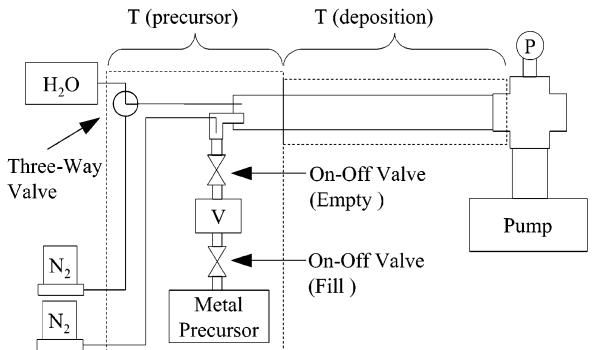  
Figure 1. Schematic diagram of the deposition system showing the location of the nitrogen mass flow controllers  $(\mathbb{N}_2)$  the water vapor reservoir  $(\mathrm{H_2O})$  , the metal precursor reservoir (Metal Precursor), the three-way gas-chromatography valve, the two two-way diaphragm valves, the metal precursor dose volume (V), the pressure measurement location (P), and the rotary vane pump (Pump) with respect to the precursor [T(precursors)] and deposition [T(deposition)] heating zones.

impurity- free, conformal, and smooth. The conformality of these films was tested using patterned substrates with very high aspect ratio holes and  $100\%$  step coverage was achieved for all six precursors tested. As with the aforementioned halide precursors, the films deposited at higher temperatures were found to be rough. The amide precursors were found to be very reactive with hydroxylated surfaces and with water. This high reactivity was exploited to estimate the vapor pressure and sticking coefficient of each precursor using a quartz crystal microbalance (QCM).

# II. Experimental Section

A. Reactor Description. Atomic layer depositions were carried out in a flow reactor (Figure 1). The reactor was a stainless steel tube (76 cm in length and 3.7 cm in diameter) heated in a tube furnace. Precursors and nitrogen gas were introduced into the reactor through a bored-out flange at one end of the tube. Nitrogen gas was purified using Millipore inert gas purifier model VPMV200SI, ratioed to reduce water and oxygen to less than 1 ppb each. Unreacted precursors and reaction products were removed through the opposite end (exhaust) of the reactor with a rotary vane vacuum pump. Substrates were also introduced into and removed from the reactor via a removable flange at the exhaust end of the reactor. The deposition zone of the reactor was 46 cm long and was defined by the heated zone of the tube furnace (the surface area of the reactor wall in this region is  $549~\mathrm{cm^2}$ ). Both precursors were introduced into the reactor at the beginning of this heated zone. A 12-cm-long stainless steel Kenics static mixer (surface area of  $89~\mathrm{cm^2}$ ) was placed in front of the substrate holder. The substrate holder was a half-round (32 cm in length, 3.6 cm in diameter) aluminum block (surface area of  $306~\mathrm{cm^2}$ ). The total surface area in the deposition zone was  $944~\mathrm{cm^2}$ . Under deposition conditions, material was deposited on all surfaces in this region. Metal amide precursors were purchased from Aldrich Chemical Co. Prior to use in a deposition experiment, 1 mL of precursor was transferred to and stored in a 100-mL stainless steel reservoir under a nitrogen atmosphere. The precursors studied in this report are summarized in Table 1.

A set volume, 10 or  $20~\mathrm{mL}$ , of metal amide vapor was introduced into the reactor through an electronically controlled diaphragm valve (referred to as the empty valve). A separate electronically controlled diaphragm valve (referred to as the fill valve) separated the defined volume from the precursor reservoir. This assembly (empty valve, fill valve, and precursor reservoir) was heated in an oven to a temperature such that the precursor attained a vapor pressure of at least 1 Torr. Prior

Table 1.Summary of the Precursors under Investigation in This Report  

<table><tr><td>precursor</td><td>chemical formula</td></tr><tr><td>tetrakis(dimethylamido)zirconium</td><td>Zr(NMe2)4</td></tr><tr><td>tetrakis(diethylamido)zirconium</td><td>Zr(NMeEt)4</td></tr><tr><td>tetrakis(dimethylamido)hafnium</td><td>Hf(NMe2)4</td></tr><tr><td>tetrakis(diethylamido)hafnium</td><td>Hf(NMeEt)4</td></tr><tr><td>tetrakis(diethylamido)hafnium</td><td>Hf(NEt2)4</td></tr></table>

to opening the fill valve, the empty valve was opened to reduce the pressure of the set volume between the two valves. Opening the fill valve for 1 s (while the empty valve was closed) charged the volume between the two valves with a known volume of vapor (10 or  $20~\mathrm{mL}$  at a known temperature and pressure (and thus a known mass). Opening the empty valve for 1 s (while the fill valve was closed) emptied this dose into the reactor, which was at a pressure well below 1 Torr. At a vapor pressure of 1 Torr and a temperature of  $75^{\circ}C$  a  $10 - \mathrm{mL}$  dose delivered  $0.46\mu \mathrm{mol}$  assuming that the entire contents of the vapor space were delivered). Nitrogen gas flow (constant during the deposition) was directed at the reactor side end of the empty valve to assist in the complete emptying of the vapor space.

Water vapor was introduced into the reactor by the action of a three- way gas chromatography (GC) valve connected to the reactor by a stainless steel feed- through  $(0.04 - \mathrm{cm}$  inner diameter). The GC valve was controlled electronically and could be positioned in two states to allow either nitrogen gas (purge state) or water vapor (dose state) to flow into the reactor. The water vapor was kept at room temperature and thus had a vapor pressure of approximately 24 Torr. A single water dose consisted of positioning the GC valve in the dose state for  $0.5\mathrm{s}$  and then returning it to the purge state. (When the metal amide vapor volume was set at  $20~\mathrm{mL}$  the water dose was increased to  $2\mathrm{s}$  .The GC valve was always kept (during the deposition) in the purge state except during the dose state.

During a deposition experiment, the total nitrogen mass flow into the reactor was O.025 SLPM (standard liters per minute), and the pressure of nitrogen in the reactor was maintained at O.25 Torr a gas flow rate of 130 LPM in the reactor). The deposition temperature was varied from 50 to  $500^{\circ}\mathrm{C}$  At least  $5\mathrm{~s~}$  of purging was allowed between the introductions of the precursors. Under these conditions, one ALD reaction cycle was defined as one dose of the metal precursor followed by a 5- s purge and then one dose of water followed by another 5- s purge. At all times during the deposition, the nitrogen flow was kept constant. During a purge, no precursors were introduced into the reactor.

All substrates were exposed to a UV lamp (in air to generate ozone) for  $3\mathrm{min}$  (sufficient to restore the hydrophilic character of a HF- dipped silicon wafer) immediately prior to deposition. Silicon substrates were cut from prime- grade wafers (100) and cleaned in a  $48\%$  HF solution for  $5\mathrm{~s~}$  prior to UV/ozone treatment. Glassy carbon substrates, for Rutherford backscattering spectra (RBS), were cut from sheets purchased from Alfa and mechanically polished with diamond powder. Patterned silicon substrates for step coverage measurements were cut from a wafer donated by Infineon.

B.Film Characterization.The film composition and area density were determined from Rutherford backscattering spectra (RBS) obtained with a General Ionics model 4117 spectrometer. The helium ion beam energy was  $2.0\mathrm{MeV}$  .RBS analysis was performed on films deposited on both carbon and silicon substrates. RBS data were analyzed using RUMP software from Computer Graphic Service (CGS). The thickness and refractive index were determined with a Rudolph Research AutoEl-II ellipsometer at a wavelength of  $632.8~\mathrm{nm}$  with the incident angle set at  $70^{\circ}$

The film thickness and density were also determined by X- ray reflectivity (XRR) measurements using a Scintag XDS 2000 instrument with copper K radiation  $1.54\mathrm{- nm}$  wavelength).Low- angle XRR data were collected at  $0.005^{\circ}$  incre

Table 2.Summary of the Temperature of Each Metal Precursor Needed to Produce an Exactly Saturating Dose for an Area of  $944~\mathrm{cm^2}$  from a 10-mL Vapor Space  

<table><tr><td>precursor</td><td>precursor temperature (°C)</td></tr><tr><td>Zr(NMe2)4</td><td>75 ± 1</td></tr><tr><td>Zr(NEtMe)4</td><td>110 ± 1</td></tr><tr><td>Zr(NEt2)4</td><td>110 ± 1</td></tr><tr><td>Hf(NMe2)4</td><td>75 ± 1</td></tr><tr><td>Hf(NEtMe)4</td><td>115 ± 1</td></tr><tr><td>Hf(NEt2)4</td><td>130 ± 1</td></tr></table>

ments and 100- s count times on films deposited on silicon substrates. XRR data was analyzed using the Experimental Reflectivity Modeling Program, version II, provided by Scintag, Inc.

Cross- sectional images were obtained with a scanning electron microscope (SEM) using the FEI Strata DB235 dualbeam focused ion beam system. Samples were cleaved just before being loaded into the SEM chamber to maintain a fresh cross- sectional surface. To reduce significant sample- charging problems caused by the nonconducting nature of the oxide film, images were captured in the charge- reduction mode [throughlens- detector- grounded (TLD- C)]. The applied electron beam energy was in the range  $3 - 5\mathrm{keV}$

The film surface morphology on silicon was analyzed with a Nanoscope VI (Digital Instruments) atomic force microscope (AFM) with a silicon tip  $10 - \mathrm{nm}$  radius of curvature) in the tapping mode. One- micron areas were scanned at a rate of 2  $\mathrm{Hz}$  at a resolution of 8 bits. The rms roughness of the silicon substrate was typically  $0.15\mathrm{nm}$  before deposition.

In situ mass measurements were made using an Inficon Technologies bakeable quartz crystal microbalance (QCM). The QCM was used to study the reactivity and vapor pressure of each precursor. During QCM experiments, the substrate holder was replaced by a mass sensor suspended in the center of the tube,  $27~\mathrm{cm}$  from the precursor introduction end of the tube  $8\mathrm{cm}$  from the static mixer). The total surface area up to this measured region was  $435~\mathrm{cm^2}$  . During QCM experiments, material was deposited on all surfaces in this region.

# III. Result and Discussion

A. Film Depositions. The metal precursors were found to be very reactive with water, and under conditions where an exactly saturating dose of metal precursor was used, no unreacted precursor was observed. An exactly saturating dose of the precursor resulted in film deposition on every surface in the deposition zone (944  $\mathrm{cm^2}$  with no film, powder, or residual precursors detected on any of the surfaces beyond the deposition zone. A dose was determined to be greater than exactly saturating (but still saturating) when deposition was observed beyond the deposition zone. A dose was less than saturating when the dose did not produce a film on the entire deposition zone. The temperature of each metal precursor needed to produce an exactly saturating dose from a  $10 - \mathrm{mL}$  vapor space is summarized in Table 2. Film deposition on reactor surfaces was easily confirmed by visual observation of interference fringes.

Similarly, it was found by varying the time for which the three- way GC valve (for water) was placed the dose state that a  $0.5 - s$  dose was saturating.

The mass of precursor in the reservoir was determined before and after a deposition experiment. On average, each dose consumed  $0.45\pm 0.05\mu \mathrm{mol}$  of zirconium precursor and  $0.41\pm 0.04\mu \mathrm{mol}$  of hafnium precursor, which were precisely the doses that would have been required to produce films with the observed area densities (2.69 metal atoms  $\mathrm{nm^2}$  for zirconium

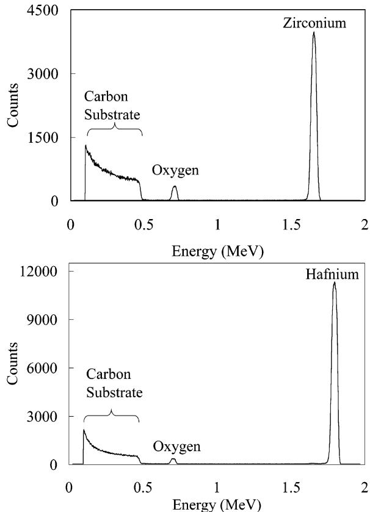  
Figure 2. RBS data for zirconium oxide (top) and hafnium oxide (bottom).

oxide films and 2.45 metal atoms  $/\mathrm{nm}^2$  for the hafnium oxide films from both XRR and RBS). The deposition efficiency of each precursor is thus very nearly  $100\%$

B. Film Properties. The deposition rate for the zirconium oxide films (from all three precursors) was  $0.096\pm 0.002 \mathrm{nm}$  per cycle. The hafnium oxide (from all three precursors) was found to deposit at a rate of  $0.093\pm 0.001 \mathrm{nm}$  per cycle. Film thickness was highly uniform (less than  $1\%$  variation) along the length (46 cm) of the heated deposition zone. The growth rate was constant (independent of the number of cycles) at least from 10 to 1000 cycles. The refractive index (at a wavelength of  $633 \mathrm{nm}$ ) for the as-deposited hafnium oxide films was  $2.05\pm 0.02$  and for the zirconium oxide films was  $2.10\pm 0.01$ . RBS analysis (Figure 2) showed the expected 1:2 metal-to-oxygen ratio. The area density per ALD cycle was determined to be  $2.69\pm 0.03$  metal atoms  $/\mathrm{nm}^2$  for the zirconium oxide films and  $2.45\pm 0.03$  metal atoms  $/\mathrm{nm}^2$  for the hafnium oxide films.

XRR analysis (Figure 3) was used to measure the film thickness and determine the film density for each metal oxide. The zirconium oxide films were determined to have a bulk density of  $5.85 \mathrm{g} / \mathrm{cm}^3$  (96% of the density of bulk tetragonal zirconium oxide) and the hafnium oxide films a bulk density of  $9.23 \mathrm{g} / \mathrm{cm}^3$  (95% of the density of bulk monoclinic hafnium oxide). The ratio of the area density (measured by RBS) to the film thickness (from ellipsometry) verified the bulk density of the film measured using XRR. Thickness determinations with the ellipsometer were typically  $2 - 3 \mathrm{nm}$  greater than those from XRR. Predeposition treatments on silicon (HF followed by UV) resulted in oxidation of the substrate surface consistent with the observed differ ence in thickness from XRR (which allows the heavy metal oxide films and the less dense silicon dioxide layer to be easily distinguished) and from single- wavelength ellipsometry (which reports an average for multilayer films).

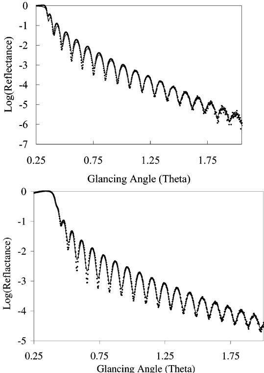  
Figure 3. XRR data for a thin zirconium oxide film (top) and a thin hafnium oxide film (bottom). Also shown overlaid on the data (solid line) are the theoretical points. The results are a thickness of  $39 \mathrm{nm}$  with a density of  $5.89 \mathrm{g} / \mathrm{cm}^3$  for zirconium oxide and a thickness of  $43 \mathrm{nm}$  with a density of  $9.23 \mathrm{g} / \mathrm{cm}^3$  hafnium oxide.

The step coverage was determined using a patterned wafer with elliptical holes  $0.17 \mu \mathrm{m}\times 0.30 \mu \mathrm{m}\times 7.3 \mu \mathrm{m}$  deep etched in silicon. All six precursors gave  $100\%$  step coverage at exposures greater than  $6\times 10^3$  langmuir (Figure 4). This high exposure was achieved by increasing the dose (allowing a greater number of moles of precursor to enter the reactor), increasing the time spent in the reactor (lowering the gas flow rate), or a combination of the two. Exposures of less than  $4\times 10^3$  langmuir had coating only on the upper parts of the holes.

AFM analysis of the as- deposited hafnium oxide films showed an rms roughness that was less than  $1\%$  of the film thickness (smooth films) at low deposition temperatures (Figures 5 and 6). The rms roughness reached as much as  $5\%$  of the film thickness for the thickest films deposited at higher temperatures (Figures 5 and 6). Similar observations were made with the zirconium oxide; however, roughness was observed at much lower deposition temperatures. Zirconium oxide films thinner than  $25 \mathrm{nm}$  were smooth (rms roughness of less than  $1\%$  of film thickness) when grown at temperatures up to  $100^{\circ}\mathrm{C}$ . Smooth films thinner than  $20 \mathrm{nm}$  could be deposited at temperatures up to  $150^{\circ}\mathrm{C}$ , and smooth films thinner than  $15 \mathrm{nm}$  could be deposited at temperatures up to  $250^{\circ}\mathrm{C}$ .

C. Effects of Nitrogen Purging on Film Properties. To study the effects of deposition temperature and

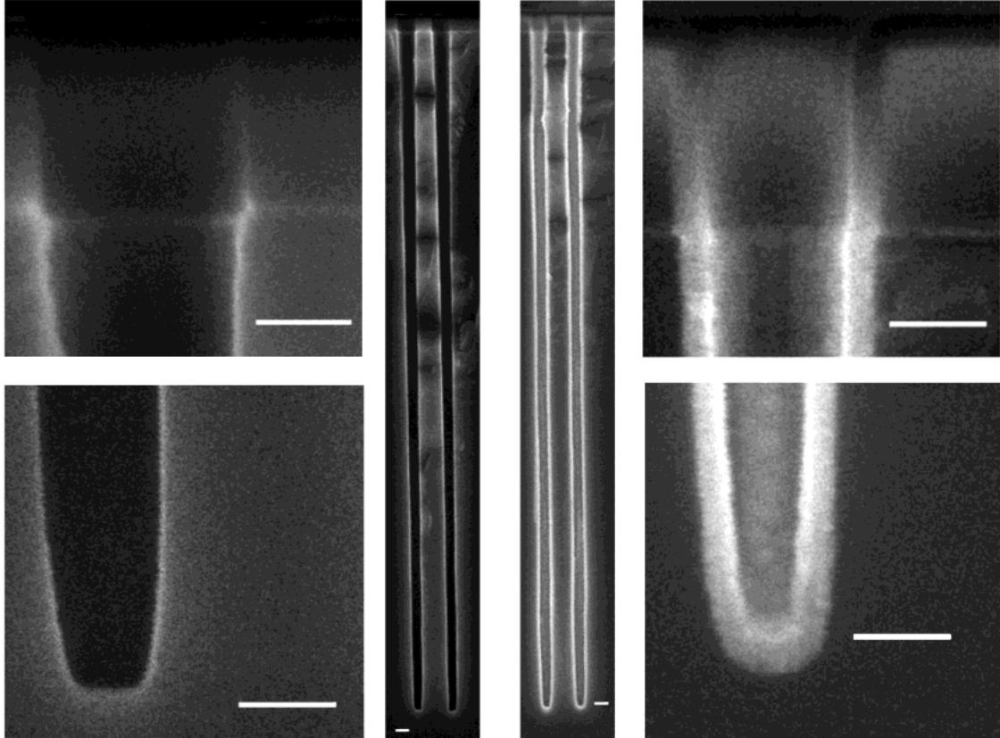  
Figure 4. SEM images of uncoated (left) and coated (right) high-aspect-ratio holes. The white bar in the bottom of each image measures  $100~\mathrm{nm}$

to determine optimal purging conditions, films were made using twice an exactly saturating dose (a 2- fold excess) of each precursor. A 2- fold excess of the metal precursor was obtained by using a  $20 - \mathrm{mL}$  vapor dose and for the water by increasing the length of time the GC valve was in the dose state to  $1\mathrm{~s}$ . Purge times of less than  $5\mathrm{~s}$  resulted in a thickness gradient along the length of the deposition zone. Films deposited in this manner were thicker (as much as  $0.2\mathrm{~nm}$  per cycle) near the beginning of the deposition region and thinner (in some cases, no growth was observed) near the end of the deposition region. This thickness gradient is likely caused by non- self- limiting CVD- like reactions or by multilayer physisorption. As shown in Table 3, increasing the gas flow speed (by increasing the pump capacity) allowed for purge times as low as  $2\mathrm{~s}$  while maintaining thickness uniformity. It should be noted that a consequence of increasing the gas flow speed was a reduction in the exposure (partial pressure times contact time) of the precursor to the substrate.

At temperatures lower than  $200^{\circ}\mathrm{C}$ , an increase in thickness (up to  $0.2\mathrm{~nm}$  per cycle) was observed (Figure 7). High thickness uniformity along the length of the deposition zone was maintained provided that a sufficient purge was performed (as dictated by the flow speed). Increasing the purge time restored the expected  $0.096\mathrm{~nm}$  (or  $0.093\mathrm{~nm}$ ) per cycle thickness (Figure 8). The water vapor required a longer purge time than the metal precursors at temperatures lower than  $200^{\circ}\mathrm{C}$  (Figure 8). The purge time required to achieve the saturated thickness per cycle was not found to vary with metal precursor used. Uniform films resulting from purging that was insufficient (but greater than that dictated by the pumping speed in Table 3) were gener

ally found to contain more mass (consistent with the observed increase in thickness) but also were found to be less dense (by as much as  $10\%$ ). It is important to note that, under conditions where exactly saturating doses were used with the minimum required purge, thickness uniformity was not attained. Under exactly saturating dose conditions, the film was thicker (up to  $0.2\mathrm{~nm}$  per cycle) near the beginning of the deposition region and thinner (in some cases, no deposition) near the end of the deposition region. The uniformity and saturated per cycle thickness of films produced using exactly saturating doses was restored by an increase in the purge time. This minimum increase in purge time was similar to the minimum purge time needed to restore the saturating per cycle thickness of films produced with twice an exactly saturating dose.

D. Effects of Deposition Temperature on Film Properties. At the highest deposition temperatures used, the as-deposited films were found to contain nitrogen and carbon attributed to precursor decomposition (on the film surface and/or in the gas phase). Decreasing the purge time reduced the time the chemisorbed metal precursor amide ligands spent at high a temperature and produced pure films with the expected composition (less than  $1\%$  carbon and  $0.25\%$  nitrogen). A summary of the highest deposition temperatures without decomposition (within  $5\mathrm{~s}$  purge time) for the six metal-precursors is shown in Table 4. At these deposition temperatures, purge times longer than  $5\mathrm{~s}$  resulted in films containing nitrogen and carbon.

In all cases where the purge time was  $5\mathrm{~s}$  or less and the deposition temperatures were below those listed in Table 4, carbon and nitrogen were found to be below detectable limits (less than  $1\%$  for carbon and less than

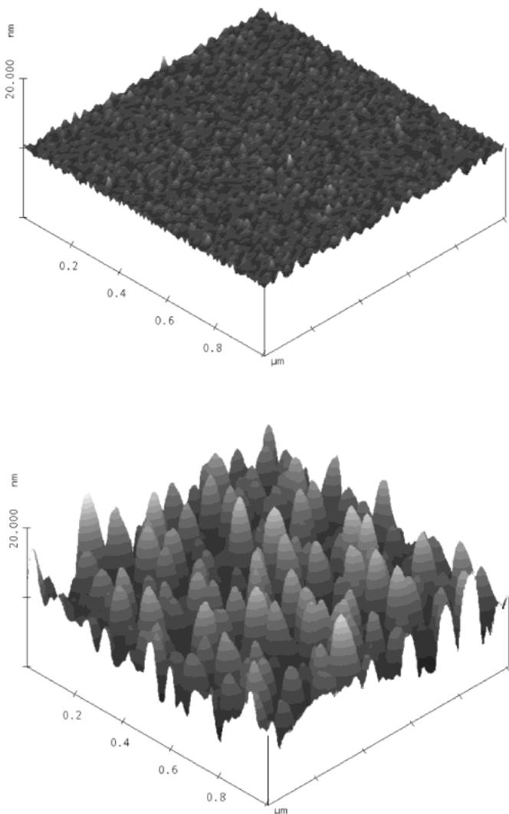

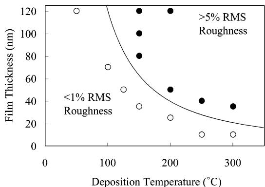  
Figure 5. AFM images of a smooth film (top) and a rough film (bottom). The area is  $1\mu \mathrm{m}\times 1\mu \mathrm{m}$ . The height scale is from 0 to  $20 \mathrm{nm}$ . The total film thickness is  $50 \mathrm{nm}$ .  
Figure 6. Film roughness of hafnium oxide thin films as a function of deposition temperature and thickness.

$0.25\%$  for nitrogen). In the RBS spectra for the films deposited at higher temperatures, the carbon and nitrogen contaminations in the film could be clearly seen (Figure 9). Under these decomposition conditions, the films were notably thicker near the beginning of the deposition region and thinner near the end. This variation is attributed to non- self- limiting CVD- like reactions (decomposition). It is important to note that, under conditions where exactly saturating doses were used at high temperatures and with insufficient purge times, Exposure expressed in Langmuirs per nanomole of precursor.

Table 3.Summary of the Effect of Gas Flow Speed on the Minimum Required Purge and on the Precursor Exposurea  

<table><tr><td>flow speed (L/min)</td><td>required purge (s)</td><td>precursor exposure (langmuir/nmol)</td></tr><tr><td>440</td><td>2</td><td>0.2</td></tr><tr><td>200</td><td>5</td><td>0.4</td></tr><tr><td>130</td><td>10</td><td>0.6</td></tr><tr><td>50</td><td>15</td><td>1.4</td></tr></table>

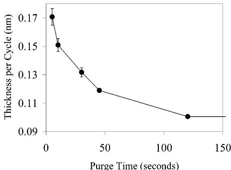  
Figure 8. Purge times required to achieve  $0.096\mathrm{-nm}$  per cycle thickness for zirconium oxide films  $\mathrm{0.093 - nm}$  for the hafnium oxide) at low deposition temperatures.

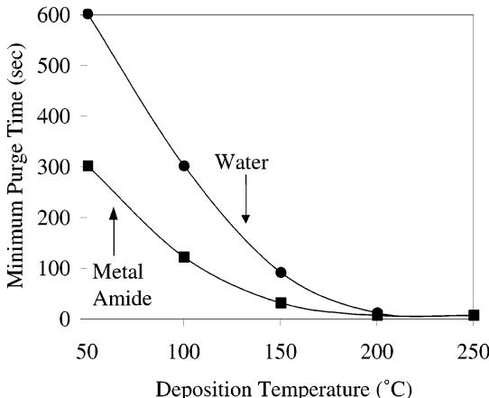  
Figure 7. Thickness per cycle as a function of nitrogen purging for the reaction of tetrakis(dimethylamido)zirconium with water at a deposition temperature of  $100^{\circ}\mathrm{C}$ .

Table 4. Summary of the Highest Deposition Temperature without Decomposition for the Six Metal Precursorsa  

<table><tr><td>precursor</td><td>maximum ALD temperature (°C)</td></tr><tr><td>Zr(NMe2)4</td><td>250</td></tr><tr><td>Zr(NMeEt)4</td><td>300</td></tr><tr><td>Zr(NEt2)4</td><td>350</td></tr><tr><td>Hf(NMe2)4</td><td>350</td></tr><tr><td>Hf(NMeEt)4</td><td>400</td></tr><tr><td>Hf(NEt2)4</td><td>450</td></tr></table>

a For a purge time of  $5\mathrm{s}$

film deposition was rarely observed in the actual deposition region. It was later found that, under these conditions, the majority of the deposition occurred on the static mixer (in front of the location of substrates).

E. Mass Balance Studies. In situ film deposition at  $200^{\circ}\mathrm{C}$  was studied in real time using a quartz crystal microbalance (QCM) (Figure 10). A mass increase after introduction of the metal precursor was observed within the sampling time of the QCM (0.2 s), indicating a fast

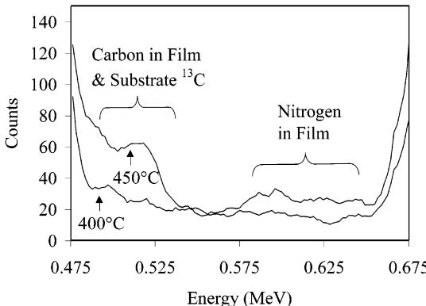  
Figure 9. Portion of the RBS spectra for hafnium oxide deposited from tetrakis(ethylmethylamido)hafnium at 400 and  $450^{\circ}\mathrm{C}$ .

reaction between the metal amide and the surface (assumed to be hydroxylated). Additional metal doses (beyond a saturating dose) did not produce a further mass increase, demonstrating that the reaction of the metal precursor is self- limiting. A mass decrease was observed immediately after the introduction of water. The water- associated mass decrease also occurred more rapidly than the time resolution of the QCM. Additional water doses (beyond a saturating dose) did not produce a net mass change, showing that the water reaction is also self- limiting.

To study the deposition kinetics, the dose was reduced from a single saturating dose (e.g.,  $17~\mathrm{mL}$  of vapor at  $60^{\circ}\mathrm{C}$ ) to 12 consecutive undersaturating doses (e.g., 1.4  $\mathrm{mL}$  of vapor at  $60^{\circ}\mathrm{C}$ ) (Figure 11). The first 10 pulses and the 12th did not cause a mass gain, whereas the 11th pulse resulted in the entire mass gain observed after the metal precursor pulse. This result further emphasizes the high rate of the reaction, and it was used to measure the vapor pressure and place an upper limit on the minimum exposure required for substrate saturation. The small perturbations observed after every precursor dose (even those not contributing a net mass increase) are due to temperature alterations of the QCM probe caused by gas flow variations occurring during precursor introduction.

F. Proposed Deposition Mechanism. The mechanism proposed here for the reactions leading to film growth (Figure 12) is consistent with simple bond-energy considerations and acid-base theory. The first step of the proposed reaction is the chemical absorption

F. Proposed Deposition Mechanism. The mechanism proposed here for the reactions leading to film growth (Figure 12) is consistent with simple bond-energy considerations and acid-base theory. The first step of the proposed reaction is the chemical absorption of the metal amide  $\mathrm{[M(NR_2)_4]}$  onto the hydroxide-terminated surface  $(- \mathrm{OH})$ . This first step involves the breakage of the metal-nitrogen bond and the formation of a metal-oxygen bond concomitant with the deprotonation of the surface hydroxyl by the amide (the metal ligand) to form a volatile dialkylamine byproducts. Both events are highly exothermic as amines are orders of magnitude less acidic than alcohols (hence more basic) and metal nitrogen bonds are much weaker than metal oxygen bonds. The second step of the proposed reaction involves the same energetic considerations as the first step. In the second step, water reacts with the surface-bound metal amides to regenerate the surface hydroxyls and form additional dialkylamines. The QCM data are consistent with the proposed mechanism, as the first step results in a mass increase [two hydrogen atoms being replaced by a metal atom and two dialkylamides  $(- \mathrm{NR_2})$ ] and the second step results in a mass decrease [two dialkylamides  $(- \mathrm{NR_2})$  replaced by two hydroxides  $(- \mathrm{OH})$ ]. Consistent with this mechanism, which predicts that the ratio of the mass increase after the metal dose to the mass decrease after the water dose should be 3.28 for the reaction of tetrakis(dimethylamido)zirconium precursor and water at  $200^{\circ}\mathrm{C}$ , this ratio was found to be approximately 3.3 (see Figures 10 and 11). Similar results were found for the other five precursors.

The duration of the nitrogen purge after the introduction of a precursor plays a critical role in the thickness and chemical composition of the as- deposited films. Although nitrogen gas was constantly flowing during the course of all depositions, no precursors were introduced into the reactor during the purge. At all deposition temperatures, it was found that, when the purge was below a minimum time (dependent on the gas flow rate), thicker film was deposited at the reactor entrance and thinner film near the exit. The minimum purge time required to maintain thickness uniformity is indicative of the time required to remove unreacted gas- phase and surface- physisorbed precursors from the reactor. Gas- phase (and non- self- limiting) reactions are prevalent in CVD processes, and in the limit of no purge, an ALD process becomes CVD. As is to be expected during a CVD process using highly reactive precursors, the film thickness is usually greater where the precursors are first introduced into the reactor. An increase in the gas flow speed is effectively a decrease in the time required to remove gas from the reactor; thus, higher gas flow

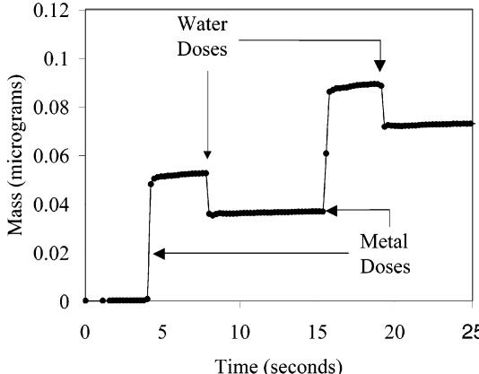  
Figure 10. QCM mass changes during two ALD cycles using saturating doses of the tetrakis(dimethylamido)zirconium precursor and water at  $200^{\circ}\mathrm{C}$ .

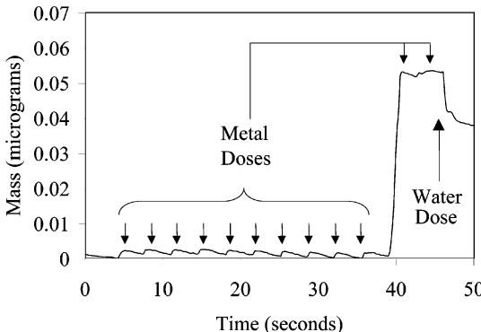  
Figure 11. QCM mass changes during one ALD cycle using undersaturating doses of the tetrakis(dimethylamido)zirconium precursor and water at  $200^{\circ}\mathrm{C}$ .

Metal Precursor Dose:

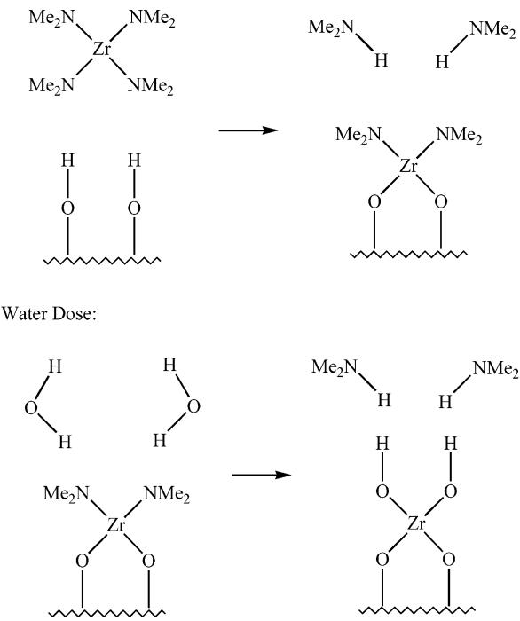  
Figure 12. Schematic of each step in the proposed mechanism.

speeds allow for shorter purge times, consistent with the conclusion that the observed film thickness gradient is the result of non- self- limiting/CVD- like reactions. Improvements in reactor design that reduce turbulence further decreased the time necessary for removal of excess precursor molecules. Preliminary results with a flow reactor where the precursor introduction into the deposition zone is through a gradual increase in the flow path diameter (instead of an abrupt transition) allows for yet faster removal (shorter purge time) of unreacted vapor and physically adsorbed precursor.

At low deposition temperatures (less than  $200^{\circ}\mathrm{C}$ ), it was found that inadequate purging also resulted in an increased film thickness; however, provided that enough precursor was introduced into the reactor, these films were found to be uniform. This increase in thickness while uniformity is maintained is best taken into account by a model in which the first precursor molecules entering the reactor chemically adsorb (effectively irreversibly) on all reactive (hydroxyl- terminated) surfaces while additional precursor molecules only physi cally adsorb on the first chemically adsorbed layer. Consistent with this model (increased thickness due to physically adsorbed species), it was found that heating or prolonged purging restored the normal saturated thickness per cycle growth rate. As might be expected because of the potential for hydrogen bonds, water vapor required a longer purge time than the metal precursors at low temperatures. Reduction of the surface area of this reactor (using the previously mentioned improved design of the reactor inlet) also contributed to a decrease in the amount of time needed for purging.

At high substrate temperatures, extending the purge time beyond that needed to remove physically adsorbed precursor resulted in decomposition of the chemically adsorbed precursor. This is evident in the carbon and nitrogen (from the metal precursor ligands) observed in the films. The observation of both carbon and nitrogen in the films produced at high temperatures is consistent with thermal decomposition studies of the pure precursors. Films deposited at this threshold of decomposition ( $50^{\circ}\mathrm{C}$  higher than the highest deposition temperature without observed decomposition as reported in Table 4) were found to have a normal thickness per cycle (albeit with detectable levels of nitrogen and carbon) consistent with surface decomposition. At still higher temperatures ( $100^{\circ}\mathrm{C}$  higher than the highest deposition temperature without observed decomposition), the films were found to be thicker near the entrance of the reactor than at the exit, consistent with rapid decomposition.

G. Vapor Pressure Measurements. Two independent methods were used to probe the vapor pressure of each precursor. The first method measured the volume of precursor (at a set temperature) required to saturate a defined surface area. The second method measured the point at which the reactor pressure became higher than the vapor pressure of the precursor.

As observed in the data from QCM experiments, the reaction between the metal amide precursor and the hydroxylated surface is extremely fast. The exposed surface area of the reactor up to and including the QCM probe is  $435~\mathrm{cm}^2$ , requiring a dose of  $1.17\times 10^{17}$  zirconium precursor molecules or  $1.07\times 10^{17}$  hafnium precursor molecules to saturate this exposed surface (measured using RBS and XRR). The temperature and volume of an exactly saturating dose were measured using the described experimental setup; thus, the vapor pressure of each precursor can be measured using simple kinetic theory. The vapor pressure  $(P)$  is simply the product of the number density  $(n)$  of the dose, the temperature  $(T)$  of the dose, and Boltzmann's constant  $(k)$ . The number density of the vapor in the dose (when confined to the volume  $V$ ) is the ratio of the number of molecules in the dose  $(N)$  to their volume  $(V)$ ; thus, the vapor pressure (for a saturating dose) is simply

$$
\mathrm{vapor~pressure} = \frac{NkT}{V}
$$

The saturation was determined using the QCM. A saturating volume is just large enough to cause a mass gain at the QCM probe; a lower volume elicits no mass gain at the probe, and a higher volume does not increase

Table 5.Results of Vapor-Pressure Measurements for Each Precursor Fit to the Clausius-Clapeyron Equationa  

<table><tr><td>precursor</td><td>melting point (°C)</td><td>temp (0.1 Torr) (°C)</td><td>temp (1 Torr) (°C)</td><td>decomp temp (°C)</td><td>ΔH(vap) (kJ/mol)</td><td>ΔS(vap) (J/K·mol)</td></tr><tr><td>Hf(NMe2)4</td><td>30</td><td>48</td><td>75</td><td>90</td><td>78</td><td>168</td></tr><tr><td>Hf(NETMe)4</td><td>liq</td><td>83</td><td>113</td><td>140</td><td>88</td><td>173</td></tr><tr><td>Hf(NETe)4</td><td>liq</td><td>93</td><td>126</td><td>150</td><td>92</td><td>165</td></tr><tr><td>Zr(NMe2)4</td><td>60</td><td>49</td><td>77</td><td>80</td><td>77</td><td>176</td></tr><tr><td>Zr(NETe)4</td><td>liq</td><td>76</td><td>106</td><td>130</td><td>85</td><td>169</td></tr><tr><td>Zr(NEt)4</td><td>liq</td><td>79</td><td>108</td><td>140</td><td>89</td><td>177</td></tr></table>

Also reported are the normal melting point (for solid precursors) and the temperature at which slight decomposition of the precursor was readily apparent after  $1\mathrm{h}$  (determined by discoloration of the precursor).

the mass measured by the probe beyond the mass gained from a saturating volume. It is assumed that all surfaces in front of the probe will have been saturated before the probe is saturated and that every molecule entering the reactor contributes to the film (  $100\%$  yield). The complete saturation of this area  $(435~\mathrm{cm^2})$  was verified by placing silicon substrates both within the area in front of the QCM and outside this area. Films within the area received saturating doses, whereas films outside this area had no film deposited on them. For example, tetrakis(dimethylamido)hafnium vapor at a temperature of  $70^{\circ}\mathrm{C}$  exactly saturated the probe only when the volume of the dose was  $5.6~\mathrm{mL}$  the vapor pressure of that dose (at  $70^{\circ}\mathrm{C})$  was thus  $90.5\mathrm{Pa}$  or 0.68 Torr).

A complementary method for measuring vapor pressure was developed on the basis of simple fluid transport theory. The velocity at which a gas moves through a pipe is proportional to the pressure gradient along the pipe. If the pressures at both ends of the pipe are the same, then fluid (continuum) flow will cease. Diffusional flow from the precursor vessel to the QCM probe was on the order of minutes at the operating pressure used to measure the vapor pressure. If the probe were saturated within a few seconds, it could be concluded that the vapor pressure in the precursor source was greater than the reactor pressure. During this experiment, both valves between the precursor reservoir and the reactor were in the open state. For example, tetrakis(dimethylamido)hafnium(IV) vapor at a temperature of  $70^{\circ}\mathrm{C}$  saturates the probe (with both valves open) within seconds at reactor pressures lower than 0.65 Torr, but at reactor pressures greater than 0.70 Torr, saturation was not observed within 1 min; thus, the vapor pressure was between 0.65 and 0.70 Torr. Vapor pressure data from both types of vapor pressure determinations were combined and fit to the following form of the Clausius- Clapeyron equation

$$
\ln (\mathrm{vapor~pressure}) = -\frac{\Delta H}{RT} +\frac{\Delta S}{R}
$$

Here,  $R$  is the ideal gas constant  $(8.314\mathrm{J / K}\cdot \mathrm{mol})$ $T$  is the absolute temperature (K),  $\Delta H$  is the enthalpy of vaporization  $(\mathrm{kJ / mol})$  ,and  $\Delta S$  is the entropy of vaporization  $(\mathrm{K}\cdot \mathrm{mol} / \mathrm{J})$  . Table 5 shows the results of fitting the data to this equation.

H. Sticking Probability. The sticking probability of a precursor molecule on a surface is a measure of its

reactivity with that surface. One measure of the sticking probability is the ratio of the number of molecules that impinge on the surface in a single dose to the number of molecules that actually adsorb on the surface (stick) per dose. The observation that a single microdose saturates the QCM probe allows for the estimation of a lower limit to the sticking probability of the metal amide precursors on a hydroxylated surface. The RBS and XRR data both indicate that, for the zirconium oxide films, 5.7 metal atoms  $/\mathrm{nm}^2$  corresponding to a minimum exposure of 3 langmuir) stick to the surface per dose.

The actual number of atoms that impinged on the surface per dose was calculated using the vapor pressure of the precursor. For tetrakis(dimethylamido)zirconium, it was found that the probe was exactly saturated after 11 doses (each dose was  $1.4~\mathrm{mL}$  of vapor at  $60^{\circ}\mathrm{C}$  of precursor. Assuming a vapor pressure of 0.258 Torr,  $1.15\times 10^{17}$  molecules are introduced into the reactor during these doses. Under these conditions (reactor temperature of  $200^{\circ}\mathrm{C}$  and flow rate of  $295\mathrm{L / min}$  approximately 1250 molecules  $/\mathrm{nm}^2$  impinged on the surface during these 11 doses. Assuming that 10/11 of these molecules were adsorped on all reactor surfaces before reaching the probe, only 114 molecules  $/\mathrm{nm}^2$  impinged on the probe during the 11th dose. This puts a lower limit on the sticking probability at 0.025. If this dose is exactly half- depleted as it crosses halfway through the reactor (57 molecules  $/\mathrm{nm}^2$  or an exposure of approximately 68 langmuir), the average sticking probability is at least 0.05. Similar measurements with smaller doses gave a lower bound to the sticking probability of 0.07, equivalent to chemisorption within an average of 14 collisions. A smaller QCM probe would be able to raise this lower limit to the sticking probability.

# IV. Conclusions

The results reported here show that the alkylamides of hafnium and zirconium provide convenient and effective ALD precursors to hafnium and zirconium oxide thin films. The deposition of metal oxide from these precursors was done at unprecedented low temperatures, yet the films produced had no detectable impurities. These surface reactions are extremely rapid, irreversible, and self- limiting. These precursors are also more volatile than any other reported hafnium or zirconium precursors. In addition to their high volatility, all of the amide precursors are liquid under the vaporization conditions described; this is a clear advantage over solid precursors in that the synthesis, purification, and handling of the precursor is simplified, the vaporization is more reproducible, and no dust or powder contamination of substrates occurs. Also, alkylamides produce less corrosive byproducts compared to chloride precursors, which produce hydrochloric acid. The ALD promise of smooth, pure, and highly conformal films of hafnium and zirconium oxides has been realized using these amide precursors.

Acknowledgment. The etched wafer used for the SEM images shown in Figure 4 was supplied by Dr. Martin Gutsche of Infineon Technologies.