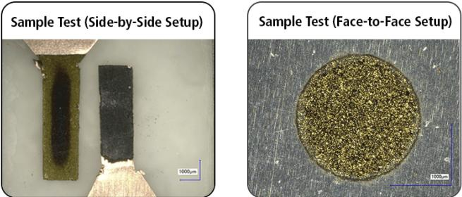
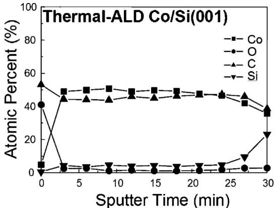
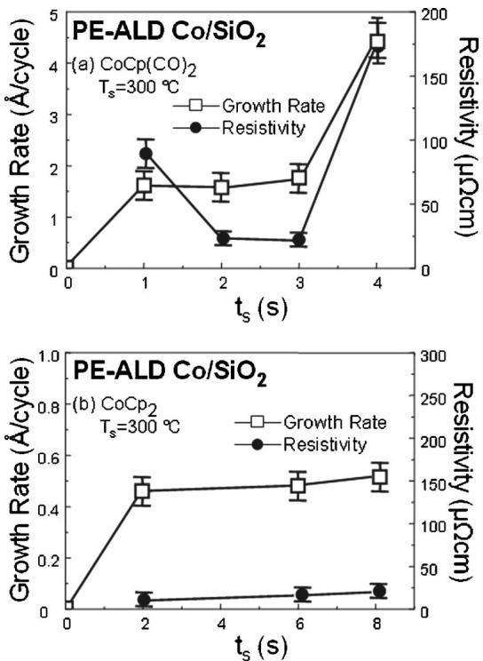
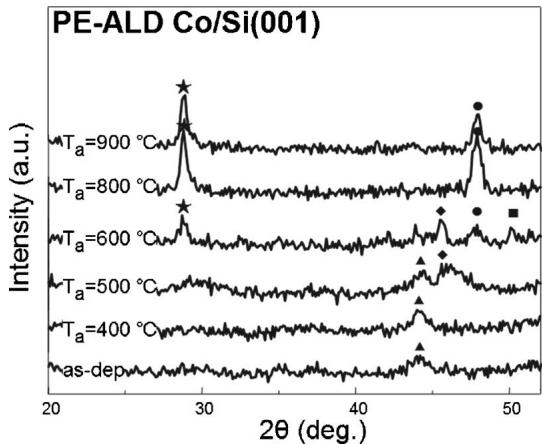

# You may also like

# High-Quality Cobalt Thin Films by Plasma-Enhanced Atomic Layer Deposition

- Atomic Layer Deposition of  $\mathrm{LiCoO_2}$  Thin- Film Electrodes for All-Solid-State Li-Ion Micro-Batteries  
M. E. Donders, W. M. Arnoldbik, H. C. M. Knoops et al.

To cite this article: Han- Bo- Ram Lee and H. Kim 2006 Electrochem. Solid- State Lett. 9 G323

- Synthesis and Magnetic Properties of the Intercalation Compound  $\mathrm{FePS_3}$ $\mathrm{CoCo_2O_4}$   Lin can, Dui Yao Dong, Ho Yun et al.

View the article online for updates and enhancements.

- Remote Plasma Atomic Layer Deposition of Co-Q, Thin Films  
M. E. Donders, H. C. M. Knoops, M. C. M. van et al.

# ECC-Opto-10 Optical Battery Test Cell: Visualize the Processes Inside Your Battery!

- Battery Test Cell for Optical Characterization  Designed for light microscopy, Raman spectroscopy and XRD.

- Optimized, Low Profile Cell Design (Device Height 21.5 mm)  Low cell height for high compatibility, fits on standard samples stages.

- High Cycling Stability and Easy Handling  Dedicated sample holders for different electrode arrangements included!

- Cell Lids with Different Openings and Window Materials Available

Contact us:  +49 40 79012- 734  sales@el- cell.com  www.el- cell.com

# High-Quality Cobalt Thin Films by Plasma-Enhanced Atomic Layer Deposition

Han- Bo- Ram Lee and H. Kim

Department of Material Science and Engineering, Pohang University of Science and Technology, San 31, Hyeon Dong, Nam- Gu, Pohang, Korea 790- 784

High- quality Co films with low resistivity  $(10\mu \Omega \mathrm{cm})$  were deposited by plasma- enhanced atomic layer deposition (PE- ALD) from metallogenic precursors and  $\mathrm{NH_3}$  plasma. The deposition characteristics and film properties were investigated. Especially, we compared the results using two cyclopentadienyl Co precursors,  $\mathrm{CoCp(CO)_2}$  and  $\mathrm{CoCp_2}$ . While low resistivity Co films were deposited by both precursors, much better self- limiting behaviors was observed for  $\mathrm{CoCp_2}$ . Putherford backscattering and X- ray photoelectron spectroscopy analysis have shown that the impurity contents in PE- ALD Co film were very low.  $\mathrm{CoSi_2}$  formation by post deposition annealing with Ti capping layer was studied by synchrotron X- ray diffraction. © 2006 The Electrochemical Society. [DOI: 10.1149/1.2338777] All rights reserved.

Manuscript submitted June 11, 2006; revised manuscript received July 17, 2006. Available electronically August 29, 2006.

The contact resistance increase with decreasing line width for the source/drain contact using  $\mathrm{TiSi_2}$  as a contact material poses a serious problem with device scaling.  ${}^{1}\mathrm{CoSi}_{2}$  has been studied as an alternative due to its immunity to the shrinkage of line width, low resistivity, and thermal stability.23 In other words, the sheet resistance of  $\mathrm{CoSi_2}$  remains almost constant with scaling down while that of  $\mathrm{TiSi_2}$  steeply increases. The effect is routinely mentioned as a fine line effect. Sputtering has been a standard deposition technique for Co, which is annealed to form  $\mathrm{CoSi_2}$  contact through self- aligned silicide process. In current dynamic random access memory (DRAM) technology, stacked capacitor structure has benefits over trench capacitor for abiding by the scaling down of the memory devices. For stacked capacitor structure, however, the capacitor- over- bitline (COB) requires that the contact material should be formed in deep contact holes with high aspect ratio. Thus, inherent poor step coverage of sputtering is becoming more problematic for sub-  $50~\mathrm{nm}$  technology node high density DRAM fabricaiton.6,7

Atomic layer deposition (ALD) is a promising deposition technique in the nanoscale regime due to its excellent conformality and thickness controllability at atomic scale. However, ALD of Co has rarely been reported except for recent reports using laboratory- synthesized acetamidinate precursor, without detailed film properties.8,9 The ALD of high- quality Co using commercially available Co precursors is important for the implementation of Co ALD for nanoscale device contact fabrication. In this study, we developed a plasma- enhanced ALD (PE- ALD) process using metallorganic (MO) precursors and  $\mathrm{NH_3}$  plasma. High purity Co thin films with low resistivity, close to the bulk value, were successfully deposited using various metallorganic Co precursors, including biscyclopentadienyl Co  $(\mathrm{CoCp_2})$  and cyclopentadienyl dicarbonyl Co  $(\mathrm{CoCp(CO)_2})$ . We compared the growth characteristics and film properties of PE- ALD from these two cyclopentadienyl Co precursors.

A remote plasma- enhanced ALD system was built and used in this study. A detailed configuration of the chamber can be found in our previous report.10 To produce adequate vapor pressure, the temperature of the bubbler containing  $\mathrm{CoCp_2}$  (solid) was maintained at  $78^{\circ}C$  while a cooling unit was used for  $\mathrm{CoCp(CO)_2}$  (liquid) to keep the temperature at  $0^{\circ}C$  to avoid excessive vapor pressure buildup. The reactant gas,  $\mathrm{NH_3}$  was flown into the chamber through remote plasma generation system located at the center of the wafer for obtaining better uniformity. The plasma generator is composed of a quartz tube wrapped by Au coated stainless steel coil and auto matching network. The standard PE- ALD process was composed of precursor exposure time  $t_\mathrm{s} = 2\mathrm{s}$  and reactant exposure time  $t_\mathrm{r} = 6\mathrm{s}$  with purging time  $t_\mathrm{p} = 3\mathrm{s}$  between these two steps. The typical growth temperature,  $T_{\mathrm{g}}$  was  $300^{\circ}C$ .  $\mathrm{NH_3}$  flow and plasma power were constant for all the experiments at 200 sccm and  $300~\mathrm{W}$  for  $\mathrm{CoCp_2}$ . Similar growth conditions were used for  $\mathrm{CoCp(CO)_2}$ . A sputtering chamber, connected to PE- ALD chamber through loadlock, was used for deposition of Ti capping layer on PE- ALD Co for postdeposition thermal annealing. Postdeposition annealing was done at rapid thermal annealing (RTA) system in  $\mathbb{N}_2$  environment.

Si(001) and  $\mathrm{SiO_2}$  were used as substrates. The Si substrate was cleaned by dipping in diluted HF solution  $(1\%)$  for  $30~\mathrm{s}$  followed by dry  $\mathbb{N}_2$  blowing and loaded into the chamber immediately to prevent the formation of native oxide. The  $\mathrm{SiO_2}$  substrates were cleaned by dipping in acetone, isopropyl alcohol, and deionized DI water sequentially, followed by  $\mathbb{N}_2$  blowing. The thickness of the films was routinely measured by profilometer or scanning electron microscopy (SEM) and the resistivity by four- point probe. Synchrotron radiation X- ray diffraction (Pohang Light Source, 3C2 beam line) with  $2^{\circ}$  glancing angle was used for the microstructure analysis of Co and  $\mathrm{CoSi_2}$  films. The chemical bonding and impurity level of Co films were investigated by Rutherford backscattering (RBS), X- ray photoelectron spectroscopy (XPS, Al Kα), and secondary ion mass spectrometry (SIMS). The samples were in situ cleaned by Ar sputtering right before XPS analysis.

At initial experiments, we tried thermal ALD of Co using  $\mathrm{CoCp(CO)_2}$  as a precursor and  $\mathrm{H}_2$  as a reactant. Irrespective of the substrates, however, highly carbon contaminated amorphous Co- C films were deposited. Figure 1 shows the depth profile by XPS of thermal ALD Co deposited on Si(001) at  $\mathrm{H}_2$  flow of 200 sccm. It is shown that the carbon content in the film was as high as 50 atom % and the resistivity was over  $2000\mu \Omega \mathrm{cm}$ . Moreover, the XRD results have shown that the thermal ALD Co has amorphous structure. Based on the XPS and XRD results, we can infer that the thermal

  
Figure 1. XPS depth profile of thermal ALD Co on Si(001) substrate from  $\mathrm{CoCp(CO)_2}$  and  $\mathrm{H}_2$  showing the Co, C, O, and Si contents in the film.

ALD Co film is amorphous Co- C. The carbon might be incorporated as hydrocarbon, which requires more analysis of the films. The growth rate increases almost monotonically with increasing precursor exposure time indicating that the saturation adsorption of  $\mathrm{CoCp(CO)_2}$  molecules does not occur. Also, Co- C thin film was deposited even without any reactant at  $T_{\mathrm{s}} = 300^{\circ}\mathrm{C}$ . Similarly, for thermal ALD of Co using  $\mathrm{CoCp_2}$  and  $\mathrm{H}_{2}$ , highly C- contaminated amorphous phase was deposited on  $\mathrm{SiO_2}$  substrate. In contrast, however, no deposition occurred on HF- dipped Si substrate. Co chemical vapor deposition (CVD) using  $\mathrm{CoCp(CO)_2}$  or  $\mathrm{CoCp_2}$  was reported to produce highly carbon contaminated Co on  $\mathrm{SiO_2}$  and  $\mathrm{Si}_3\mathrm{N}_4$  surfaces when the hydrogen pressure during deposition was low, because the carbon was incorporated into the film through disproportionation reaction. Thermal disproportion of  $\mathrm{C}_5\mathrm{H}_5$  results in unstable and nonvolatile cyclopentadienyl radical such as dihydrofulvalene leading to high C incorporation. Meanwhile, on H- terminated Si surface, very low reactivity of  $\mathrm{CoCp_2}$  causes nucleation problem resulting in no deposition, which agrees with our result.

To effectively remove  $\mathrm{Cp}$  ligands without carbon incorporation, we deposited Co by PE- ALD using  $\mathrm{NH_3}$  plasma as a reactant. This process produced metallic, low resistivity films at a temperature range of  $250 - 400^{\circ}\mathrm{C}$  on both Si and  $\mathrm{SiO_2}$ , irrespective of Co precursors. In contrast to thermal ALD producing amorphous phase, XRD analysis on PE- ALD Co thin films has clearly shown diffraction peak at  $44.2^{\circ}$ , which is indexed as  $\beta - \mathrm{Co}(111)$  peak. High- resolution transmission electron microscopy analysis also has shown that the PE- ALD Co film is composed of polycrystalline grains. RBS and SIMS were used to analyze the film composition of PE- ALD Co. Besides Co, no impurity related feature was observed for PE- ALD Co films prepared at  $T_{\mathrm{s}} = 300^{\circ}\mathrm{C}$  by standard RBS. Oxygen or nitrogen was not detected even with oxygen and nitrogen resonance enhanced measurement. Only small carbon peak was observed by carbon resonance enhanced RBS, mostly due to the surface contamination. The purity of the PE- ALD Co films was also confirmed by SIMS measurement. The N and O concentrations in the PE- ALD Co films were even lower than those in sputtered Co film, which was prepared as a reference.

More detailed compositional analysis including chemical bonding state was carried out by XPS. Figure 2 shows the typical XPS spectra of PE- ALD Co from  $\mathrm{CoCp(CO)_2}$  prepared at  $T_{\mathrm{s}} = 300^{\circ}\mathrm{C}$ . Figure 2a shows that the binding energy difference between Co  $2\mathrm{p}_{3 / 2}$  peak and  $2\mathrm{p}_{1 / 2}$  peak is  $14.97\mathrm{eV}$  and the peak positions of  $2\mathrm{p}_{3 / 2}$  and  $2\mathrm{p}_{1 / 2}$  are 778.18 and  $793.15\mathrm{eV}$ , respectively. These peak positions and peak to peak width imply that the XPS spectrum of PE- ALD Co film is composed of single metallic Co peak and the films are very pure. No nitrogen and carbon related feature was observed, indicating the carbon contaminants detected by RBS is due to surface contamination. For  $\mathrm{CoCp_2}$ , similar spectra were obtained.

Note that although we used  $\mathrm{NH_3}$  as a reactant, the nitrogen incorporation is minimal. From the compositional analysis by XPS for PE- ALD Co films prepared at lower growth temperatures than  $300^{\circ}\mathrm{C}$ , it was found that the growth temperature is critical to obtain pure Co films without N incorporation. For example, at  $T_{\mathrm{s}} = 250^{\circ}\mathrm{C}$ , clear nitrogen XPS peak was detected. However, even for this sample, the resistivity was relatively low at  $51\mu \Omega \mathrm{cm}$ , implying the nitrogen content is not very high. Thus, at proper growth conditions producing pure Co films, N atoms function as a catalyst to successfully preventing disproportionation of  $\mathrm{Cp}$  ligand leading to pure Co film deposition without being incorporated into films. Because PE- ALD using H plasma as a reactant also produced highly C- contaminated films, the existence of N is thought to be essential in obtaining high- purity Co films. Additionally, the nitrogen seems to play another important role in the PE- ALD of Co on H- terminated Si surface. For  $\mathrm{CoCp_2}$  precursor, Co films were not deposited on H- terminated substrate by thermal ALD process using  $\mathrm{H}_{2}$  as a reactant due to the difficulty in nucleation, while little nucleation prob lem was observed for  $\mathrm{NH_3}$  plasma PE- ALD. This is probably due to the formation of  $\mathrm{Si - N_x}$  or  $\mathrm{Si - NH_x}$  terminated surface by  $\mathrm{NH_3}$  plasma exposure on H- terminated Si surface, providing reaction sites for nucleation. Previous study on CVD of Co using  $\mathrm{CoCp_2}$  and  $\mathrm{H}_{2}$  reported deposition of Co on silicon nitride surface while no deposition on H- terminated surface.

  
Figure 2. XPS spectra of PE-ALD Co on  $\mathrm{Si(001)}$  substrate from  $\mathrm{CoCp(CO)_2}$  and  $\mathrm{NH_3}$  plasma showing the energy range for (a) Co-2p, (b) Co 1s, (c) N 1s, and (d) C 1s.

Figure 3 shows the growth characteristics of PE- ALD Co from  $\mathrm{CoCp(CO)_2}$  (Fig. 3a) and  $\mathrm{CoCp_2}$  (Fig. 3b) with  $\mathrm{NH_3}$  plasma at growth temperature  $T_{\mathrm{s}} = 300^{\circ}\mathrm{C}$  on  $\mathrm{SiO_2}$ . Almost the same results were obtained on Si. The growth rate vs  $\mathrm{CoCp(CO)_2}$  exposure time,  $t_{\mathrm{s}}$ , shows apparent saturation at  $t_{\mathrm{s}} = 1\sim 3$  s range, but rapidly increases at longer exposure time. This indicates that the  $\mathrm{CoCp(CO)_2}$  absorption does not occur with good saturation. Also, as mentioned above, the ALD using  $\mathrm{CoCp(CO)_2}$  was found to produce highly carbon contaminated film with high resistivity even without reactant. These observations can be explained by low thermal stability of  $\mathrm{CoCp(CO)_2}$ . The  $\mathrm{CoCp(CO)_2}$  is reported to be thermally decomposed at as low temperature as  $140^{\circ}\mathrm{C}$ . This low thermal stability is probably because the carbonyl ligand is easily removed from  $\mathrm{CoCp(CO)_2}$  by thermal energy. Thus, at  $T_{\mathrm{s}} = 300^{\circ}\mathrm{C}$ , the thermal decomposition of  $\mathrm{CoCp(CO)_2}$  leads to highly carbon contaminated films without reactant. Note that Co precursor with carbonyl ligand, for example  $\mathrm{Co_2(CO)_8}$ , would not be a proper precursor for ALD of Co, as the thermal decomposition is expected to occur at low temperature and no self- saturation is expected. Note also that even with this low thermal stability, there is a limited self- saturation region between 1- 3 s. This should be related to the existence of  $\mathrm{Cp}$  ligand bonded to Co surface after  $\mathrm{CoCp(CO)_2}$  adsorption, but the weak saturation behavior is disturbed leading to CVD- like reaction at high dose of  $\mathrm{CoCp(CO)_2}$  leading to rapid increase in growth rate. However, the growth rate versus  $\mathrm{CoCp_2}$  exposure time (Fig. 3b) shows different behavior. The growth rate shows typical behavior of

  
Figure 3. Growth rate and resistivity vs precursor exposure time of PE-ALD Co using (a)  $\mathrm{CoCp(CO)_2}$  and (b)  $\mathrm{CoCp_2}$  as a Co precursor, respectively.

ALD, with good saturation of growth rate at  $t_\mathrm{s} > 2$  s. The growth rate at saturation conditions was measured to be  $0.48\mathrm{\AA / cycle}$  In contrast to  $\mathrm{CoCp(CO)_2}$  no deposition occurs without reactant. From these results, we can conclude  $\mathrm{CoCp_2}$  is more proper precursor for Co ALD. This good saturation behavior of  $\mathrm{CoCp_2}$  is attributed to strong Co- Cp bond. The step coverage of the PE- ALD Co film from  $\mathrm{CoCp_2}$  was better than  $80\%$  for 5:1 aspect ratio trench with less than  $100\mathrm{nm}$  width.

Figure 3 also shows the resistivity of deposited Co thin films as a function of precursor exposure time. For PE- ALD of Co from  $\mathrm{CoCp_2}$  Fig.3b),the resistivity was low below  $20\mu \Omega$  cm for all range of exposure time, with the lowest resistivity of about  $10\mu \Omega$  cm, which is close to the bulk resistivity  $(6\mu \Omega \mathrm{cm})$  .This is one of the lowest values reported so far for vapor phase deposition of Co. For example, the resistivity of CVD Co from  $\mathrm{Co(CO)_8}$  and  $\mathrm{Co(CO)_3(NO)}$  precursors was 11 and  $15\mu \Omega \mathrm{cm}$  respectively.15,16 In contrast, the PE- ALD Co from  $\mathrm{CoCp(CO)_2}$  Fig.3a shows low resistivity  $(20\mu \Omega \mathrm{cm})$  at only limited exposure time range, where the ALD saturation behavior is observed.

Finally, Co silicide formation by annealing the PE- ALD Co film was studied.  $20 \mathrm{nm}$  thick PE- ALD Co films from  $\mathrm{CoCp_2}$  and  $\mathrm{NH_3}$  plasma with  $20 \mathrm{nm}$  thick PVD Ti capping layer were annealed by RTA for  $30 \mathrm{s}$  at various annealing temperature,  $T_{\mathrm{a}}$  The synchrotron radiation XRD spectra of PE- ALD Co on  $\mathrm{Si(001)}$  annealed at  $T_{\mathrm{a}}$  between 400 and  $900^{\circ}\mathrm{C}$  are shown in Fig.4 together with that of as- deposited PE- ALD Co. Basically, the silicide formation of PEALD Co with Ti cap layer follows similar trends as that of previous reported sputtered or evaporated Co films.17,18 While CoSi peaks are observed for annealing temperature between 500 and  $600^{\circ}\mathrm{C}$  clear  $\mathrm{CoSi_2(111)}$  and (220) peaks are observed at above annealing temperature of  $700^{\circ}\mathrm{C}$

  
Figure 4. Synchrotron radiation XRD results of  $\mathrm{CoSi_2}$  from PE-ALD Co by rapid thermal annealing at various annealing temperature.  $[\star \mathrm{CoSi_2(111)}$ $\bullet$ $\mathrm{CoSi_2(220)}$ $\bullet$ $\mathrm{CoSi(210)}$ $\blacksquare$ $\mathrm{CoSi(211)}$ $\pmb{\Delta}$ $\beta$  Co(111)].

In conclusion, Co PE- ALD processes were investigated using commercially available metallorganic precursors and  $\mathrm{NH_3}$  plasma. The PE- ALD Co film has very low resistivity with high purity in contrast to thermal ALD Co using  $\mathrm{H}_{2}$  as a reactant. While PE- ALD process using  $\mathrm{CoCp(CO)_2}$  has shown incomplete self- saturation due to weak bonding of carbonyl ligand,  $\mathrm{CoCp_2}$  has shown good saturation behavior. The formation of  $\mathrm{CoSi_2}$  by post deposition annealing PE- ALD Co with Ti cap layer was also successfully demonstrated.

# Acknowledgments

The authors gratefully acknowledge the financial support of Samsung Electronics, Korea Electronic Technology Institute, and POSTECH. This work was partially supported by Korea Research Foundation Grant funded by Korea Government (MOEHRD, Basic Research Promotion Fund, KRF- 2005- 003- 5NH0501301). The synchrotron radiation XRD analysis was performed at Pohang Light Source beam line 3C2. The RBS analysis was carried out at Korea Institute of Science and Technology.

Pohang University of Science and Technology assisted in meeting the publication costs of this article.

# References

1. T.Ohguro, S.Nakamura, and M.Koike, IEEE Trans.Electron Devices,41,2305 (1994). 
2. H.ZhangJ.Poole, and R.EllerJ.Vac.Sci.Technol.A171904 1999. 
3. S.L.Zhang and M.OstlingCrit.Rev.Solid State Mater.Sci.2812003. 
4. S.L.Whal, Silicon Processing for the VLSI Trans.Lattice Press,New York (2002). 
5. D.H. D.Silhin and G.H. KohIEEE Trans.Electronics Devices471499 2000. 
6. J.H.Lee and J.H.ChaMicroelectron.Eng.723210004. 
7. C.FitzM.Goldbach and A.DupontMicroelectron.Eng.82460 2005. 
8. B.S.LimA.Rahtu and R.G.GordonNat.Mater.27492003. 
9. B.S.LimA.Rahtu and J.S.ParkInorg.Chem.427951 2003. 
10. W.J.Maeng and H.KimElectrochem.Solid State Lett.9G191 2006. 
11. G.J.M.DominusG.J.R.M.MatthesandG.J.T. SteigerJ.Curr.Gasystem 114, 364 (1991). 
12. H.S.RheeB.T.Ahn and D.K.SohnJ.Appl.Phys.863452 1999. 
13. J.F.MoulderW.F.Stickle, and P.E.SobolHandbook of X-Ray Photoelectron Spectroscopy,Perkin-Elmer,Eden Prairie,MN (1992). 
14. I.Y.HwangJ.H.Kim and S.K.OhSurf.Interfurface Anal.35184 2003. 
15. M.E.GrossK.Schnoes Kranz and D.BrasenJ.Vac.Sci.Technol.B61548 1988. 
16. A.R.LonderganG.Nuesca, and C.GoldbergJ.Electrochem.Soc.148C21 (2001). 
17. C.Detavernier, R.L.Van Meirhaeghe, and W.Vandervorst, Microelectron. Eng. 71,252 (2004). 
18. K.MaexMater.Sci.Eng.R.117 1993.