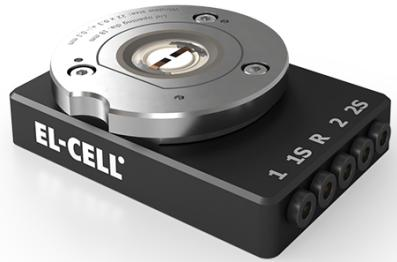
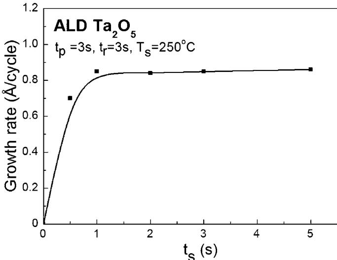
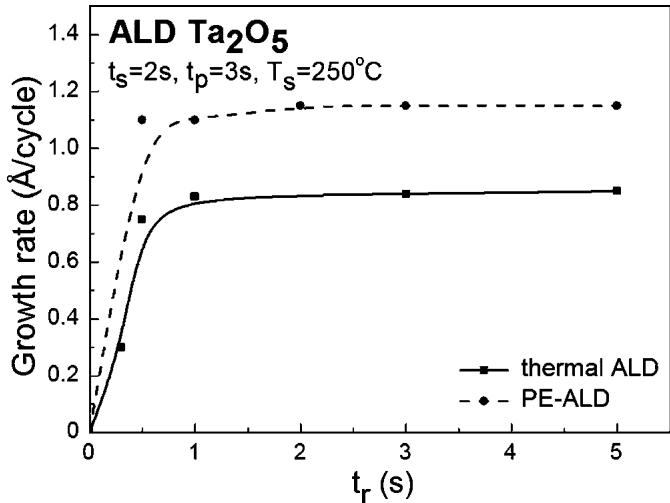
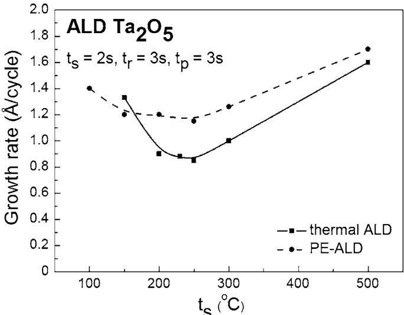
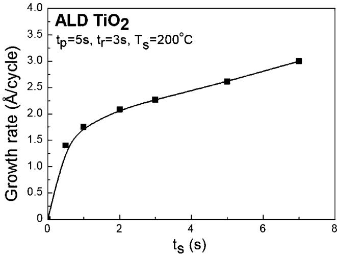
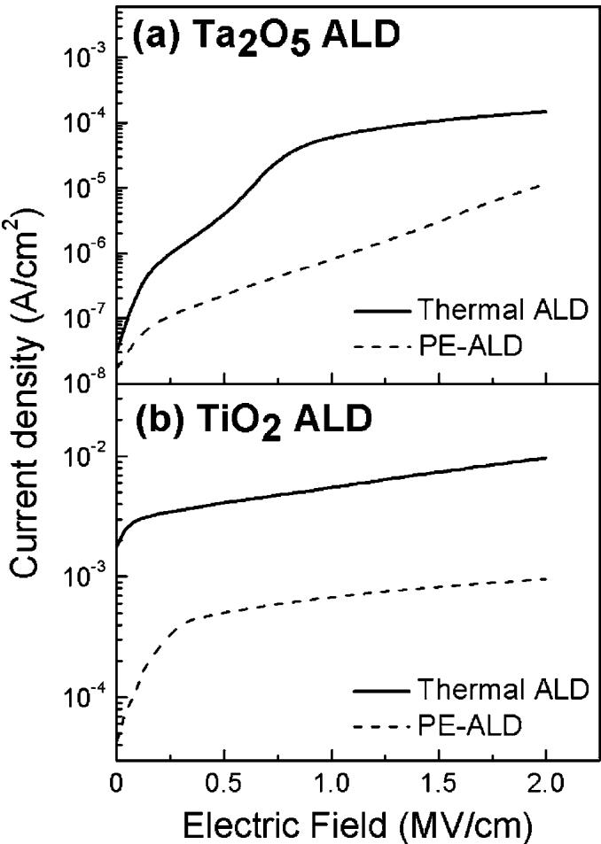

# You may also like

# Thermal and Plasma-Enhanced ALD of Ta and Ti Oxide Thin Films from Alkylamide Precursors

- Charge Density in Atmospheric Pressure Chemical Vapor Deposition TiO₂ on SiO₂ Passivated Silicon Keith R. McIntosh, Simeon C. Baker- Finch, Nicholas E. Grant et al.

To cite this article: W. J. Maeng and H. Kim 2006 Electrochem. Solid- State Lett. 9 G191

- Moisture Uptake and Outgassing in Patterned and Capped Porous Low-k Dielectric Films Junipri Tuo, Ahmad Iqbal, Haripreet Junioja et al.

View the article online for updates and enhancements.

- A MONOS-Type Flash Memory Using a High-k HFAIO Charge Trapping Layer Y. N. Tan, W. K. Chim, B. J. Cho et al.

# ECC-Opto-10 Optical Battery Test Cell: Visualize the Processes Inside Your Battery!

- Battery Test Cell for Optical Characterization Designed for light microscopy, Raman spectroscopy and XRD.

- Optimized, Low Profile Cell Design (Device Height 21.5 mm) Low cell height for high compatibility, fits on standard samples stages.

- High Cycling Stability and Easy Handling Dedicated sample holders for different electrode arrangements included!

- Cell Lids with Different Openings and Window Materials Available

Contact us: +49 40 79012- 734 sales@tel- cell.com www.ell- cell.com

# Thermal and Plasma-Enhanced ALD of Ta and Ti Oxide Thin Films from Alkylamide Precursors

W. 
J. Maeng and 
H. Kim

Department of Materials Science and Engineering, Pohang University of Science and Technology, Pohang 790- 784, Korea

We investigated the thermal and plasma- enhanced atomic layer deposition (PE- ALD) of tantalum and titanium oxides from representative alkylamide precursors,  $\mathrm{Ta(NMe_2)_5}$  (pentakis(dimethylamino)Ta, PDMAT) and  $\mathrm{Ti(NMe_2)_4}$  [tetrakis(dimethylamido)Ti, TDMAT]. ALD of  $\mathrm{Ta_2O_5}$  by PDMAT with water or oxygen plasma produced pure  $\mathrm{Ta_2O_5}$  films with good self- saturation growth characteristics. However, incomplete self- saturation was observed for  $\mathrm{TiO_2}$  ALD from TDMAT. The film properties including microstructure, chemical composition, and electrical properties are discussed focusing on the comparative studies between thermal and PE- ALD processes for both oxides. The results indicate that the PDMAT is a promising precursor for both thermal and PE- ALD of  $\mathrm{Ta_2O_5}$

$\mathfrak{G}$  2006 The Electrochemical Society.[DOI: 10.1149/1.2186427] All rights reserved.

Manuscript submitted December 27, 2005; revised manuscript received February 3, 2006. Available electronically March 28, 2006.

Atomic layer deposition (ALD) is a gas- phase thin- film deposition method characterized by the alternate exposure of chemical species with self- limiting surface reactions, producing films with accurate thickness control, excellent conformality, and uniformity over large areas. Due to these benefits, ALD is becoming one of the most promising thin- film deposition methods in the fabrication of nanoscale microelectronic devices, for which thickness controllability at atomic level and high conformality are required. One of the critical issues for a successful ALD process is a proper selection of precursors and reactants. Among many metal precursors, alkylamide precursors have been widely used for ALD since they have suitable vapor pressure and  $\mathrm{Cl^- }$  and O- free ligands producing noncorrosive products and require relatively low growth temperatures.

ALD of high-  $k$  dielectrics have been extensively studied using a variety of precursors and reactants. As representative high  $k$  oxides,  $\mathrm{Ta_2O_5}$  and  $\mathrm{TiO_2}$  have been studied for various applications including capacitor and gate dielectrics for the semiconductor industry and chemical sensors. Although various precursors have been studied for ALD of Ta and Ti- based materials, alkylamide precursors have been widely used for deposition of  $\mathrm{TaN^{13}}$  or TiN. For example, plasma- enhanced ALD (PE- ALD) of TaN from (pentakis(dimethylamino)Ta (PDMAT) and hydrogen plasma produced good quality TaN, showing very robust characteristics as a diffusion barrier for Cu interconnects. However, the alkylamide precursors have rarely been used for deposition of Ta or Ti oxide, except in a couple of very recent reports. This is quite contrary to other high-  $k$  materials such as  $\mathrm{ZrO_2}$  and  $\mathrm{HfO_2}$  for which extensive studies have been reported by thermal and PE- ALD from various alkylamide precursors. Especially, no comparative study between thermal and PE- ALD from alkylamide precursors for Ta and Ti oxides has been reported yet. In this study, we investigated the thermal and PE- ALD processes of both oxides using representative alkylamide precursors,  $\mathrm{Ta(NMe_2)_5}$  [pentakis(dimethylamino)Ta, PDMAT] and  $\mathrm{Ti(NMe_2)_4}$  [tetrakis(dimethylamido)Ti, TDMAT], which have the same dimethylamino ligands. The film properties including microstructure, chemical composition, and electrical properties are discussed focusing on the comparative studies between thermal and PE- ALD processes for both oxides.

A homemade cold- wall- type remote PE- ALD chamber was built and used for this study. Sample sizes up to  $200~\mathrm{mm}$  in diameter can be loaded into the chamber pumped by a turbomolecular pump producing a working base pressure of middle  $10^{- 7}$  Torr. The sample was heated using a resistive heating plate, providing growth temperatures of up to  $400^{\circ}\mathrm{C}$ . The temperature was measured using a thermocouple attached to the heater, and calibrated against another thermocouple attached to the sample. The bubbler temperature containing PDMAT (solid) was set at  $65^{\circ}\mathrm{C}$  to develop adequate vapor pressure while the delivery lines were heated to above  $70^{\circ}\mathrm{C}$  to prevent condensation of the precursor. To improve gas delivery, Ar was used as a carrier gas and the flow was controlled by a massflow controller (MFC) upstream of the bubbler. For TDMAT, which has high enough vapor pressure, the bubbler remains at room temperature without the use of a carrier gas. For thermal ALD, the water vapor was used as a reactant. The bubbler containing water was immersed in silicone oil for better temperature control, and the water vapor flow was controlled by a leak valve. For PE- ALD, oxygen gas flowed into an rf plasma source, which consisted of a quartz tube wrapped with a multiple- turn coil set at  $13.56\mathrm{MHz}$  providing a power level of up to  $600~\mathrm{W}$ . The distance between the remote plasma source and the sample during deposition is  $20~\mathrm{cm}$ . For the current experiments, the flow of oxygen, controlled by MFC, was set at  $130~\mathrm{scm}$ , resulting in  $10\mathrm{mTorr}$  of working pressure and the plasma power was  $300~\mathrm{W}$ . The chamber was purged by  $75~\mathrm{scm}$  Ar gas between the precursor and reactant exposure step.

ALD oxide thin films were deposited on  $\mathrm{Si(001)}$  substrates. For routine experiments, the substrates were cleaned by dipping in  $1\%$  HF solution for  $1\mathrm{min}$  to remove the native oxide without a further cleaning process. However, the Si substrates for electrical property measurements were cleaned by the RCA method. After deposition, the thickness was routinely measured by ellipsometry (Rudolph auto ELII). The stoichiometry and impurity content in the thin films were analyzed by Rutherford backscattering (RBS) and X- ray photoemission spectroscopy (XPS). The microstructures of the films were determined by X- ray diffraction (XRD). For electrical measurements, a metal- oxide- semiconductor (MOS) capacitor structure was fabricated by evaporating  $30~\mathrm{nm}$  thick Al contact on  $10~\mathrm{nm}$  thick ALD oxide thin films through a shadow mask. For back contact, Au was evaporated on the back side and current- voltage characteristics were determined using HP4156 precision semiconductor parameter analyzer.

First,  $\mathrm{Ta_2O_5}$  thin films were deposited by thermal ALD from PDMAT and water vapor at a growth temperature of  $T_{\mathrm{s}} = 250^{\circ}\mathrm{C}$ . The reactant (water) exposure time,  $t_{\mathrm{r}}$ , was set as  $3\mathrm{~s}$  and the purging time,  $t_{\mathrm{p}}$ , as  $3\mathrm{~s}$ . The growth rates, routinely measured by ellipsometry, are presented as a function of PDMAT exposure time,  $t_{\mathrm{s}}$ , in Fig. 1. The growth rate increases rapidly with increasing  $t_{\mathrm{s}}$  and saturates at  $\sim 0.85\mathrm{\AA}$  /cycle above  $t_{\mathrm{s}} = 1\mathrm{~s}$ . The saturation of the growth rate indicates that a typical ALD mode growth is achieved by self- limited adsorption of PDMAT. This growth rate was almost two times higher than the previously reported values from other precursors including ethoxide  $(0.45\mathrm{\AA}$  /cycle) and chloride  $(0.45\mathrm{\AA}$  /cycle). From the thickness vs growth cycles data (not shown), almost no nucleation delay was observed on  $\mathrm{Si(001)}$ .

  
Figure 1. Growth rates of thermal ALD  $\mathrm{Ta_2O_5}$  as a function of PDMAT exposure time  $(t_{\mathrm{s}})$  on  $\mathrm{Si(001)}$  substrate at  $T_{\mathrm{s}} = 250^{\circ}\mathrm{C}$ .

Next,  $\mathrm{Ta_2O_5}$  films were deposited by PE- ALD using  $\mathrm{O_2}$  plasma as a reactant and the growth characteristics were compared with those of thermal ALD. We did not perform detailed analysis on the reactive species of oxygen plasma. However, in a previous study on ALD  $\mathrm{ZrO_2}$  using a similar PE- ALD system, it was reported that the main species in the remote oxygen plasma are atomic oxygen and activated oxygen molecules by optical emission spectroscopy (OES). Figure 2 shows the growth rates as a function of reactant exposure time,  $t_{\mathrm{r}}$  at  $T_{\mathrm{s}} = 250^{\circ}\mathrm{C}$  for both thermal and PE- ALD of  $\mathrm{Ta_2O_5}$ . The figure shows good saturation behavior at  $t_{\mathrm{r}} > \sim 1$  s for both cases, again indicating good saturation behavior of the PDMAT precursor. The growth rate of PE- ALD at saturation condition is about  $1.2\mathrm{\AA}$  cycle, which is slightly higher than that of thermal ALD.

Figure 3 shows the growth rates of  $\mathrm{Ta_2O_5}$  thermal and PE- ALD at various growth temperature from  $T_{\mathrm{s}} = 100$  to  $500^{\circ}\mathrm{C}$  with  $t_{\mathrm{s}} = 2$  s and  $t_{\mathrm{r}} = 3$  s. For both cases, three distinguished regions can be identified in the figure. In the middle temperature region, the growth rates remain almost constant, indicating the existence of a process window. For thermal ALD this region is from 200 to  $250^{\circ}\mathrm{C}$  while for PE- ALD it is from 150 to  $250^{\circ}\mathrm{C}$ . In other words, the ALD can be achieved at almost  $50^{\circ}\mathrm{C}$  lower temperature by PE- ALD than by thermal ALD. This lower growth temperature is usually attributed to the higher reactivity of radicals, in this case atomic O or activated  $\mathrm{O_2}$ . In fact, in a separate experiment,  $\mathrm{Ta_2O_5}$  film was not deposited without the use of plasma at  $T_{\mathrm{s}} = 250^{\circ}\mathrm{C}$ , indicating that the activated species generated by plasma are necessary to deposit  $\mathrm{Ta_2O_5}$ . In the high temperature region, the growth rates increase with increasing growth temperature. This behavior is due to the disturbance of self- limitation caused by thermal decomposition of precursors leading to partially CVD- like growth. In the low growth temperature region, the growth rates increase with decreasing growth temperature for both thermal and PE- ALD. One of the plausible explanations proposed for this phenomenon is that the concentration of surface OH groups becomes higher with decreasing growth temperature, which leads to a larger number of active sites resulting in a higher growth rate in the low growth temperature region. This explanation could be generally applied for thermal ALD of oxide using water as a reactant. However, for PE- ALD using oxygen plasma as a reactant, the formation of an OH- terminated surface has not been clearly identified yet. In a more recent report, OES analysis of oxygen plasma indicated the presence of hydrogen radicals, which could result in OH- terminated surface by reaction of oxygen radicals with hydrogen likely to originate from precursors. Thus, the same explanation would be applicable for PE- ALD of oxides, but more detailed experiments on the reaction mechanism of PE- ALD from oxygen plasma would be required to determine the exact reason for this behavior.

  
Figure 2. Growth rates of thermal and PE-ALD  $\mathrm{Ta_2O_5}$  as a function of water and oxygen plasma exposure time  $(t_{\mathrm{r}})$  on  $\mathrm{Si(001)}$  substrate at  $T_{\mathrm{s}} = 250^{\circ}\mathrm{C}$ .

  
Figure 3. Growth rates of thermal and PE-ALD  $\mathrm{Ta_2O_5}$  as a function of growth temperature  $T_{\mathrm{s}}$ .

Next,  $\mathrm{TiO_2}$  films were deposited by thermal ALD from TDMAT and water. The growth rates as a function of TDMAT exposure time at  $T_{\mathrm{s}} = 200^{\circ}\mathrm{C}$  are shown in Fig. 4. In contrast to  $\mathrm{Ta_2O_5}$  ALD from PDMAT, the growth rate did not saturate with increasing TDMAT exposure time, although some slow down of the growth rate at  $t_{\mathrm{s}} > 1$  s was observed. A possible explanation for this behavior is that the TDMAT molecules do not adsorb on the surface with perfect self- saturation, probably due to the low decomposition temperature of the TDMAT precursor, which is reported to be about  $180^{\circ}\mathrm{C}$ . Similar behavior was reported for TiN ALD from TDMAT and  $\mathrm{NH_3}$ . However, we cannot exclude other possibilities for this nonideal ALD growth, since the TiN ALD from TDMAT reported that the nonideal ALD mode was observed even at growth temperatures as low as  $120^{\circ}\mathrm{C}$ . In any case, this nonideal ALD growth characteristic may limit the use of TDMAT as a precursor for  $\mathrm{TiO_2}$  ALD.

Based upon these results, the standard conditions were set as  $t_{\mathrm{s}} = 2$  s,  $t_{\mathrm{p}} = 5$  s, and  $t_{\mathrm{r}} = 3$  s for convenience sake. At this condition, the growth rate was about  $2.1\mathrm{\AA}$  cycle, which was much higher than those from other previously reported precursors including

  
Figure 4. Growth rates of  $\mathrm{TiO_2}$  as a function of TDMAT exposure time on Si(001) substrate at  $T_{\mathrm{s}} = 200^{\circ}\mathrm{C}$ .

methoxide  $(0.5\mathrm{\AA / cycle})^{7}$  and chloride  $(0.75\mathrm{\AA / cycle})$  .10 As a function of growth temperatures, similar growth characteristics as thermal ALD of  $\mathrm{Ta}_2\mathrm{O}_5$  from PDMAT were observed for  $\mathrm{TiO_2}$  thermal ALD (data not shown). The growth rates of thermal ALD  $\mathrm{TiO_2}$  from TDMAT and water remained almost constant at  $T_{\mathrm{s}} = 150–250^{\circ}\mathrm{C}$  PE- ALD of  $\mathrm{TiO_2}$  was also performed, and the typical growth rate was  $2.17\mathrm{\AA / cycle}$  which is slightly higher than that of thermal ALD.

The microstructures of thermal and PE- ALD  $\mathrm{Ta}_2\mathrm{O}_5$  and  $\mathrm{TiO_2}$  films were analyzed by XRD. For thermal and PE- ALD  $\mathrm{Ta}_2\mathrm{O}_5$  the films were all amorphous in the growth temperature region studied  $(150 - 350^{\circ}\mathrm{C})$  .For thermal ALD  $\mathrm{TiO_2}$  films, a however, a small anatase peak began to appear at  $T_{\mathrm{s}} = 250^{\circ}\mathrm{C}$  and the intensity of the peak grew with an additional small rutile phase diffraction feature at  $T_{\mathrm{s}} = 300^{\circ}\mathrm{C}$  while no diffraction peak was observed up to growth temperatures of  $200^{\circ}\mathrm{C}$  .Similar results were reported for ALD  $\mathrm{TiO_2}$  from  $\mathrm{TiI}_4$  and  $\mathrm{H}_2\mathrm{O}_2$  11 However, for an ALD of  $\mathrm{TiO_2}$  from  $\mathrm{Ti(OMe)_4}$  and water, only anatase peaks were observed at  $T_{\mathrm{s}} > 250^{\circ}\mathrm{C}$  without any rutile peak up to  $T_{\mathrm{s}} = 350^{\circ}\mathrm{C}$  while no diffraction peak was observed for ALD  $\mathrm{TiO_2}$  thin film from  $\mathrm{Ti(O^iPr)_2(dmae)_2}$  and water up to  $T_{\mathrm{s}} = 400^{\circ}\mathrm{C}$  27

Chemical compositions and biding states were analyzed by XPS for thermal and PE- ALD of Ta and Ti oxides. For both thermal and PE- ALD  $\mathrm{Ta}_2\mathrm{O}_5$  the only observed Ta- related XPS peaks were the standard Ta  $4\mathrm{f}_{7 / 2}$  peak (located at  $26.5\mathrm{eV}$  and Ta  $4\mathrm{f}_{5 / 2}$  peak (located at  $28.4\mathrm{eV}$  of Ta- O band without any other Ta- related peaks such as Ta- N or metallic Ta. Besides, impurity- related peaks were not observed, indicating that the deposited  $\mathrm{Ta}_2\mathrm{O}_5$  films are very pure  $(\mathbb{C},\mathbb{N}< 1\%)$  .Similarly, XPS results of  $\mathrm{TiO_2}$  thermal and PE- ALD have shown that the films are quite pure. For  $\mathrm{TiO_2}$  however, a small nitrogen- related peak was observed, by which the nitrogen content was evaluated as  $\sim 1.5\%$  for the samples grown at  $T_{\mathrm{s}} = 200^{\circ}\mathrm{C}$  .For more compositional information, RBS analysis was performed using oxygen, carbon, and nitrogen resonance. Agreeing with XPS analysis, no nitrogen or carbon- related feature were observed for  $\mathrm{Ta}_2\mathrm{O}_5$  thin films.

As a representative electrical property of the deposited oxide films the leakage current density was estimated for thermal and PEALD of  $\mathrm{Ta}_2\mathrm{O}_5$  and  $\mathrm{TiO_2}$  deposited at standard growth conditions on Si(001) substrate. Figure 5a and b present current density- electrical field plots for  $10\mathrm{nm}$  thick, as- deposited  $\mathrm{Ta}_2\mathrm{O}_5$  and  $\mathrm{TiO_2}$  ALD films, respectively. As Fig.5a shows, the leakage current density of thermal ALD  $\mathrm{Ta}_2\mathrm{O}_5$  film is  $\sim 6\times 10^{- 5}\mathrm{A / cm^2}$  at  $1\mathrm{MV / cm}$  . This value is comparable to that of CVD  $\mathrm{Ta}_2\mathrm{O}_5$  using the same precursor and oxygen, which was grown at a much higher temperature,  $450^{\circ}\mathrm{C}$  28

  
Figure 5. Leakage current densities vs electric fields of thermal and PEALD (a)  $\mathrm{Ta}_2\mathrm{O}_5$  and (b)  $\mathrm{TiO_2}$  thin film. The film thickness was  $10\mathrm{nm}$  for all films, and the growth temperatures were  $250^{\circ}\mathrm{C}$  for  $\mathrm{Ta}_2\mathrm{O}_5$  and  $200^{\circ}\mathrm{C}$  for  $\mathrm{TiO_2}$  respectively.

In a previous report, a lower leakage current density was reported for ALD  $\mathrm{Ta}_2\mathrm{O}_5$  from PDMAT and water  $(1\mu \mathrm{A} / \mathrm{cm}$  for  $10\mathrm{- }100\mathrm{nm}$  thick films), but direct comparison with our result is difficult since the exact thickness and annealing conditions were not described.15 The leakage current density of our PE- ALD  $\mathrm{Ta}_2\mathrm{O}_5$  is  $\sim 8$ $\times 10^{- 7}\mathrm{A / cm^2}$  which is about two orders of magnitude lower than that of thermal ALD. Also, this value is lower than that of previously reported PE- ALD  $\mathrm{Ta}_2\mathrm{O}_5$  from ethoxide and oxygen plasma, 1  $\times 10^{- 6}\mathrm{A / cm^2}$  at  $1\mathrm{MV / cm}$  for  $15\mathrm{nm}$  thickness, indicating that high quality PE- ALD  $\mathrm{Ta}_2\mathrm{O}_5$  films can be deposited from PDMAT and oxygen plasma.29

Meanwhile, the leakage current densities of as- deposited  $\mathrm{TiO_2}$  thin films were  $5\times 10^{- 3}\mathrm{A / cm^2}$  for thermal ALD and 7  $\times 10^{- 4}\mathrm{A / cm^2}$  for PE- ALD. A slightly higher leakage current density  $(1\times 10^{- 3}\mathrm{A / cm^2}$  at  $1\mathrm{MV / cm})$  was reported for ozone- based ALD  $\mathrm{TiO_2}$  from the titanium isopropoxide precursor.30 Moreover, a previous report using TDMAT and oxygen plasma produced  $\mathrm{TiO_2}$  films with a much higher leakage current density, larger than  $1\mathrm{A / cm}$  for  $1\mathrm{MV / cm}$  as- deposited sample.16

The results indicate that PE- ALD produced films with lower leakage current densities thermal ALD for both  $\mathrm{Ta}_2\mathrm{O}_5$  and  $\mathrm{TiO_2}$  even though the same metal precursor was used for each oxide. Similarly, it was reported that PE- ALD from zirconium  $t\cdot$  - but oxide produces of  $\mathrm{ZrO_2}$  films with two orders of magnitude lower leakage current density than thermal ALD.31 It was reported that defects such as an oxygen vacancy or C, a contamination causes leakage currents in  $\mathrm{Ta}_2\mathrm{O}_5$  films.32 Thus, a possible explanation for smaller leakage of PE- ALD oxides is smaller oxygen vacancy concentra

tions or lower contamination (although the concentrations were below the detection limit in our experimental results) in PE- ALD films than in thermal ALD film. Additionally, smoother interface for PEALD than thermal ALD, observed by transmission electron microscopy (data not shown), might be partly responsible for this. However, further investigation will be necessary to clarify this.

In conclusion, tantalum and titanium oxide thin films were deposited by thermal and PE- ALD from PDMAT and TDMAT. The growth process was characterized as a function of various key growth parameters. For both cases, PE- ALD shows a higher growth rate at a lower growth temperature with better film quality. Pure  $\mathrm{Ta}_2\mathrm{O}_5$  films were successfully deposited by thermal and PE- ALD from PDMAT with a good self- saturation property. Thus, PDMAT was found to be a promising precursor for both thermal and PEALD of  $\mathrm{Ta}_2\mathrm{O}_5$  while TDMAT has shown nonideal growth with imperfect self- saturation behavior.

# Acknowledgments

This work was supported by POSTECH, Korea Research Foundation, Korea Ministry of Industry and Energy. The authors are deeply thankful to Professor Shi Woo Rhee, Professor Wang Chul Zin, Professor Jong- Lam Lee, and co- workers at POSTECH for their contributions to this study. The RBS analysis was performed at Korea Institute of Science and Technology.

Pohang University of Science and Technology assisted in meeting the publication costs of this article.

# References

1. M.Leskela and M.RitalaAngew.Chem.Int.Ed.42,5548 2003. 
2. H.KimJ.Vac.Sci.Technol.B.21,2231 (2003. 
3. J.SundqvistH.Hogberg and A.HarstaChem.Vap.Deposition9245 2003. 
4. V.PoreA.RathuM.LeskelaM.RitalaT. Sajavaara and J. KeinonenChem. Vap.Deposition10,143 (2004. 
5. J.KimJ.KimH.SeonM.H.ChoR.B.Chang and C.BaeAppl.Phys.Len. 87,053108 (2005). 
6. H.ZhangR.SolankiaB.RoberdsG.Bai and I.BanerjeeJ.Appl.Phys.87 1921 (2000). 
7. K.W.KwonC.S.KangS.O.ParkH.K.Kang and S.T.AhnIEEE Trans.

Electron Devices,43,919 (1996). 8. G. Eranna, B.C. Joshi, D. P. Runthala, and R. P. Gupta, Crit. Rev. Solid State Mater. Sci.,29,111 (2004). 9. K.Kukli, M. Leskela, and M. Ritala, Chem. Mater., 12, 1914 (2000). 10. J. Aarik, A. Aidla, H. Mandara, T. Uustare, M. Schuisky, and A. Harsta, J. Cryst. Growth,242,189 (2002). 11. K. Kukli, M. Ritala, M. Schuisky, M. Leskela, T. Sajavara, J. Keinonen, T. Uustare, and A. Harsta, Chem. Vap. Deposition,6,303 (2000). 12. C.W. Hill, G. J. Derderian, and G. Sanju, J. Electron. Soc., 152, G386 (2005). 13. H. Kim, C. Detavenier, O. van der Straten, S. M. Rossnagel, A. J. Kellock, and D. G. Park, J. Appl. Phys., 98, 014308 (2005). 14. J. W. Elam, M. Schuisky, J. D. Ferguson, and S. M. George, Thin Solid Films, 436, 145 (2003). 15. D. M. Hausmann, P. Bouffignac, A. Smith, R. Gordon, and D. Monsmeh, Thin Solid Films, 443, 1 (2003). 16. J. J. Park, W. J. Lee, G. H. Lee, I. S. Kim, B. C. Shin, and S. G. Yoon, Integr. Ferroelectr. 68, 129 (2004). 17. X. Liu, S. Ramanathan, A. Longdergan, A. Srivastava, E. Lee, T. E. Seidel, J. T. Barton, D. Pang, and R. G. Fordon, J. Electrochem. Soc., 152, G213 (2005). 18. A. Despande, R. Inman, G. Jursich, and C. Takoidis, J. Vac. Sci. Technol. A, 22, 2035 (2004). 19. J. Y. Kim, S. H. Kim, H. Seo, J. H. Kim, and H. Jeon, Electrochem. Solid- State Lett., 8, G82 (2005). 20. S. J. Yung, J. W. Lim, and J. H. Lee, Electrochem. Solid- State Lett., 7, F81 (2004). 21. K. Kukli, M. Ritala, R. Matero, and M. Leskela, J. Cryst. Growth, 212, 459 (2000). 22. J. C. Kwak, Y. H. Lee, and B. H. Choi, Appl. Surf. Sci., 230, 249 (2004). 23. K. E. Elers, J. Winkler, K. Weeks, and S. Marcus, J. Electrochem. Soc., 152, G589 (2005). 24. R. Puurunen, Chem. Vap. Deposition, 9, 327 (2003). 25. J. Aarik, A. Aidla, V. Sammelselg, H. Siimon, and T. Uustare, J. Cryst. Growth, 169, 496 (1996). 26. S. X. Lao, R. M. Martin, and J. P. Chang, J. Vac. Sci. Technol. A, 23, 488 (2005). 27. J. P. Lee, M. H. Park, T. M. Chung, Y. S. Kim, and M. M. Sung, Bull. Korean Chem. Soc., 25, 475 (2004). 28. K. A. Son, A. Y. Mao, Y. M. Sun, B. Y. Kim, F. Liu, A. Kamath, J. M. White, D. L. Kwong, D. A. Roberts, and R. N. Vrtis, Appl. Phys. Lett., 72, 1187 (1998). 29. H. J. Song, C. S. Lee, and S. W. Kang, Electrochem. Solid- State Lett., 4, F13 (2001). 30. S. J. Yung, W. D. Kim, K. M. Kim, C. S. Hwang, and J. Jeong, Appl. Phys. Lett., 85, 4112 (2004). 31. K. Endo and T. Tatsumi, Jpn. J. Appl. Phys., Part 2, 42, L685 (2003). 32. W. S. Lau, L. L. Leng, T. Han, and N. P. Sandler, Appl. Phys. Lett., 83, 2835 (2003).