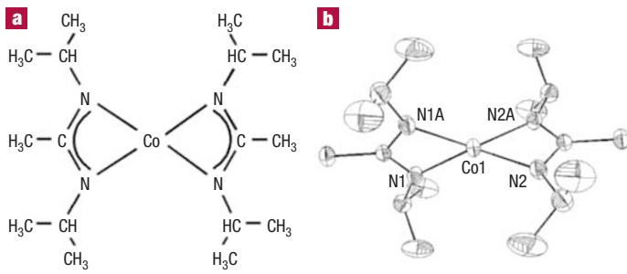
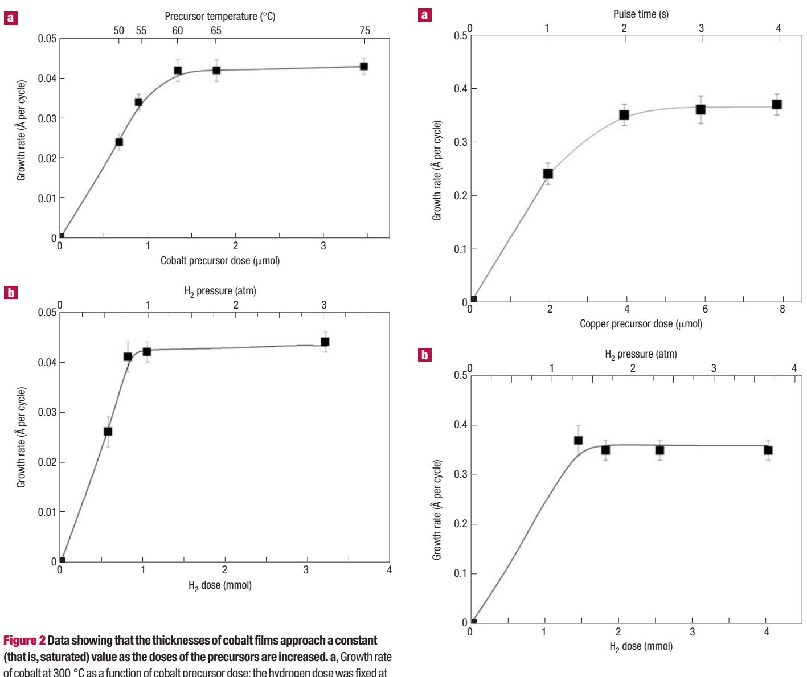
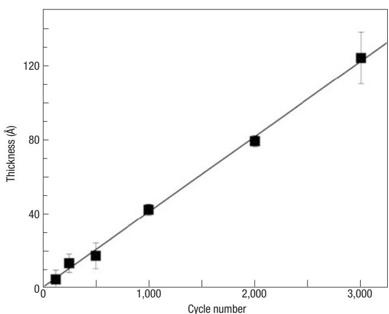
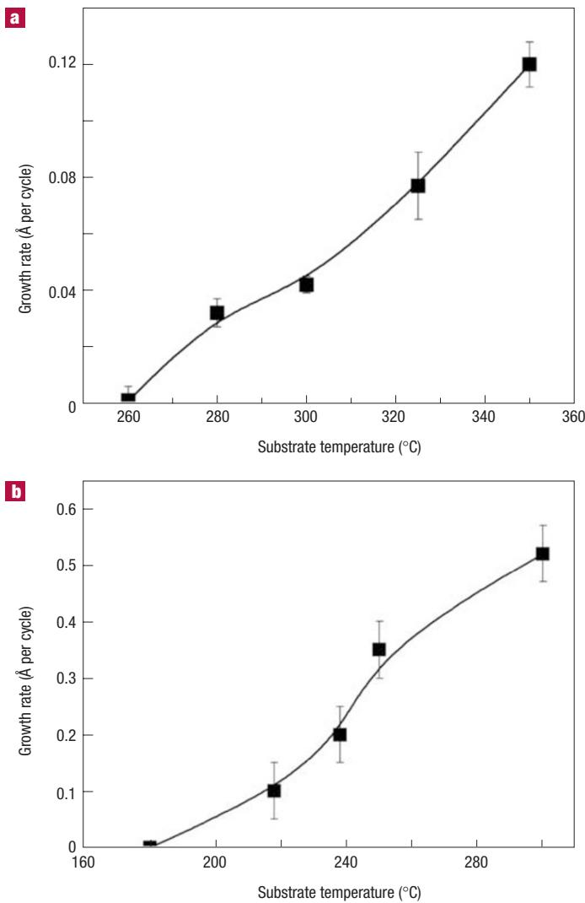
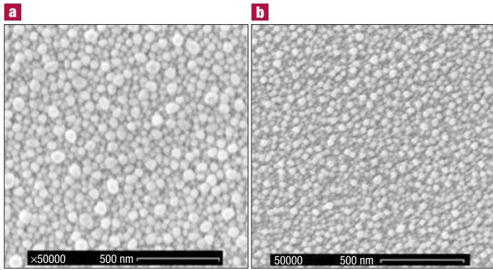
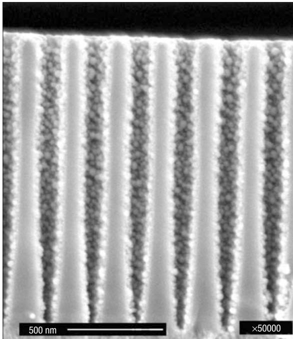

# Atomic layer deposition of transition metals

BOOYONG S. LIM, ANTTI RAHTU AND ROY G. GORDON*  Department of Chemistry and Chemical Biology, Harvard University, 12 Oxford Street, Cambridge, Massachusetts 02138, USA  *e- mail: gordon@chemistry.harvard.edu

Atomic layer deposition (ALD) is a process for depositing highly uniform and conformal thin films by alternating exposures of a surface to vapours of two chemical reactants. ALD processes have been successfully demonstrated for many metal compounds, but for only very few pure metals. Here we demonstrate processes for the ALD of transition metals including copper, cobalt, iron and nickel. Homoleptic  $N,N^{\prime}$ - dialkylacetamidinato metal compounds and molecular hydrogen gas were used as the reactants. Their surface reactions were found to be complementary and self- limiting, thus providing highly uniform thicknesses and conformal coating of long, narrow holes. We propose that these ALD layers grow by a hydrogenation mechanism that should also operate during the ALD of many other metals. The use of water vapour in place of hydrogen gas gives highly uniform, conformal films of metal oxides, including lanthanum oxide. These processes should permit the improved production of many devices for which the ALD process has previously not been applicable.

uniform, conformal thin films have a wide variety of applications in modern technology, including semiconductor microelectronics, displays, optical filters, magnetic information storage and catalysis. One method that is particularly suitable for making uniform conformal layers is atomic layer deposition (ALD), also known as atomic layer epitaxy. An ALD process deposits thin layers of solid materials by using two or more different vapour- phase reactants. First, a dose of vapour from one precursor is brought to the surface of a substrate onto which a film is to be deposited. Then any excess unreacted vapour of that reactant is pumped away. Next, a vapour dose of the second reactant is brought to the surface and allowed to react, and the excess is pumped away. This cycle of steps normally deposits a monolayer or less of material, although one case of a multilayer ALD process has been reported. These cycles can be repeated to build up thicker films.

Two particularly important aspects of an ALD process are that the surface reactions must be complementary and self- limiting. Complementarity of the surface reactions means that each of the two reactants must prepare the surface for its reaction with the other vapour, so that the deposition cycles can be repeated. Self- limiting means that the amount of material deposited in each of the reaction steps is uniform over the surface, provided that at least a minimum, that is, saturating, amount reaches each part of the surface. Because of this self- limiting character, ALD reactions produce coatings with very uniform thickness even if the flux of vapour is distributed non- uniformly over the surface. The uniformity of an ALD film thickness extends not only over flat substrate surfaces but also into very narrow holes and trenches; that is, the films are highly conformal. ALD reactions also ensure reproducible control of thickness, by counting the number of reaction cycles.

ALD processes have been developed for many metal oxides, sulphides, nitrides and fluorides. Many potential applications of ALD are, however, frustrated by the lack of ALD processes for most pure metals. Tungsten, ruthenium and platinum are the only metals that have been successfully deposited from molecular precursors by complementary, self- limiting ALD reactions. ALD copper grew only on platinum substrates. ALD of titanium, tantalum and aluminium uses atomic hydrogen as a reactant, which limits the step coverage attainable in deep trenches because of the rapid recombination of hydrogen atoms on surfaces. It is also difficult to design an ALD apparatus to deliver hydrogen atoms over large substrate areas without plasma damage to the substrates and without causing long cycle times because of inefficient paths for gas flow.

We now report ALD of the transition metals iron, cobalt, nickel and copper by complementary, self- limiting reactions, using molecular

  
Figure 1 Structural formula for bis(N,N'-diisopropylacetamidinato)cobalt(II) (a) and its molecular structure as determined by X-ray crystallography (b).

hydrogen gas and vapours of previously unreported metal acetamidinate compounds. ALD using water vapour in place of hydrogen gas produced the oxides of these transition metals and lanthanum oxide. Similar processes should be applicable to numerous other metals and metal oxides throughout the periodic table. The metal acetamidinates were prepared by the reaction of lithium  $N_{2}N^{\prime}$ - dialkylacetamidinate with the appropriate metal chloride. Selected properties of the acetamidinates are given in Table 1. A typical formula and structure are given in Fig. 1 for the case of bis(N,N'- diisopropylacetamidinato)cobalt(II). Details of the synthesis and properties of these new compounds will be reported elsewhere. All the compounds in Table 1 are monomeric except for copper, which is a dimer, and silver, which is a mixture of dimers and trimers. All of these precursors are sufficiently volatile for use as vapour sources at temperatures below  $130^{\circ}\mathrm{C}$ .

For all the metal films studied (Fe, Co, Ni and Cu), both the metal precursor and the hydrogen reactions are self- limiting. Saturation of the growth rate was shown in two different ways: increasing the dose delivered during a fixed time, and increasing the lengths of time at a fixed delivery rate. The first method is illustrated by the data for cobalt in Fig. 2, in which the Co precursor dose was delivered during 1 s from the precursor reservoir at various temperatures in the range  $50 - 75^{\circ}\mathrm{C}$ ; the Co thickness did not change for doses above about  $1.5\times 10^{- 9}\mathrm{molcm}^{- 2}$ . In the second method, the growth rate per cycle also saturated with increasing dose time at a fixed dose rate, as illustrated by the data for Cu in Fig. 3; saturation was achieved for Cu precursor dose times of more than  $2\mathrm{s}$ , during which time  $4\times 10^{- 9}\mathrm{molcm}^{- 2}$  was delivered. These results show that these metal precursors undergo self- limiting reactions with metal surfaces prepared by reaction with hydrogen. Saturation also occurs for increasing hydrogen dose, as illustrated in Figs 2 and 3, but at much higher doses than required for the metal precursors.

As expected in an ALD process, all the metal films from saturating doses were deposited with uniform thickness along the whole length of the deposition zone. Doses less than the saturating values coated only the inlet region of the reactor with the same saturated thickness. This observation shows that the reactions of the metal precursors with the surface are rapid, in agreement with the modest exposures needed for saturation (Table 2). In contrast, under- saturating doses of hydrogen produced thinner films over the whole deposition zone, showing that the reaction of hydrogen with the surface is slower than the reactions of the metal precursors. This observation corroborates the fact that much higher hydrogen exposures are needed to saturate the ALD reactions (Table 2).

The saturated thickness grew linearly with the number of cycles, as shown in Fig. 4 for Co films, demonstrating the complementary nature of the reactions. The zero intercept at the origin in Fig. 4 shows that there is no delay before film growth starts. Films nucleated and grew on ultraviolet- ozone- treated silicon, glassy carbon, glass and ALD tungsten nitride (WN)- coated substrates, except for copper, which did not nucleate or grow on air- exposed WN unless it was precoated with cobalt.

Figure 5a shows the temperature dependence of the deposition rate for the Co ALD process. Deposition on substrates between 260 and  $350^{\circ}\mathrm{C}$  showed ideal ALD behaviour (self- limiting, complementary reactions). No films were formed at substrate temperatures below  $260^{\circ}\mathrm{C}$ . This behaviour is very convenient for preventing unwanted film deposition on warm reactor walls kept between  $65^{\circ}\mathrm{C}$  (the vaporization temperature of the precursor) and  $260^{\circ}\mathrm{C}$ . Control experiments with no hydrogen showed no film deposition on substrates in the temperature range tested  $(250 - 350^{\circ}\mathrm{C})$ . ALD of copper showed no deposition below  $180^{\circ}\mathrm{C}$  (Fig. 5b), indicating that reactor walls held at temperatures between 95 and  $180^{\circ}\mathrm{C}$  remain free of unwanted deposits. Films of other

Table 1 Properties of volatile metal acetamidinates, [MRNC(CH)NR),]  

<table><tr><td>Metal (M)</td><td>Alkyl group (R)</td><td>Oxidation state, x</td><td>Oligomerization degree, y</td><td>Field (%)</td><td>Colour</td><td>Melting point (°C)</td><td>Vapour pressure (°C; Torr)</td></tr><tr><td>Mn</td><td>t-Butyl</td><td>2</td><td>1</td><td>80</td><td>Yellow</td><td>100</td><td>55; 0.06</td></tr><tr><td>Fe</td><td>t-Butyl</td><td>2</td><td>1</td><td>77</td><td>White</td><td>107</td><td>55; 0.06</td></tr><tr><td>Co</td><td>Isopropyl</td><td>2</td><td>1</td><td>77</td><td>Green</td><td>84</td><td>40; 0.05</td></tr><tr><td>Ni</td><td>Isopropyl</td><td>2</td><td>1</td><td>70</td><td>Brown</td><td>69</td><td>35; 0.07</td></tr><tr><td>Cu</td><td>Isopropyl</td><td>1</td><td>2</td><td>83</td><td>White</td><td>147</td><td>70; 0.05</td></tr><tr><td>Ag</td><td>Isopropyl</td><td>1</td><td>2 and 3</td><td>90</td><td>White</td><td>95</td><td>80; 0.04</td></tr><tr><td>La</td><td>Isopropyl</td><td>3</td><td>1</td><td>77</td><td>White</td><td>-</td><td>80; 0.04</td></tr></table>

The degre f oizion is  thn  - dttion f t sttr  th  p  t  t  th  t  th  t  th  t  th  t  th  t  th  t  th  t  th  t  th  t  th  t  th  t  th  t  th  t  th  t  th  t  th  t  th  t  th  t  th  t  th  t  th  t  th  t  th  t  th  t  th  t  t  th  t  th  t  th  t  th  t  th  t  th  t  th  t  th  t  th  t  th  t  th  t  th  t  th  t  th  t  th  t  th  t  th  t  th  t  th  t  th  t  th  t  th  t  th  t  th  th  th  th  th  th  th  th  th  th  th  th  th  th  th  th  th  th  th  th  th  th  th  th  th  th  th  th  th  th  th  th  th  th  th  th  th  th  th  th  th  th  th  th  th  th  th  th  th  th  ch  th  th  th  th  th  th  th  th  th  th  th  th  th  th  th  th  th  th  th  th  th  th  th  th  th  th  th  th  th  th  th  th  th  th  th  th  th  th  th  th  th  th  th  th  th  th  th  th  th  t  th  th  th  th  th  th  th  th  th  th  th  th  th  th  th  th  th  th  th  th  th  th  th  th  th  th  th  th  th  th  th  th  th  th  th  th  th  th  th  th  th  th  th  th  th  th  th  ch  th  ch  th  th  th  th  th  th  th  th  th  th  th  th  th  th  th  th  th  th  th  th  th  th  th  th  th  th  th  th  th  th  th  th  th  th  th  th  th  th  th  th  th  th  th  th  th  th  th  ch  th  c  th  th  th  th  th  th  th  th  th  th  th  th  th  th  th  th  th  th  th  th  th  th  th  th  th  th  th  th  th  th  th  th  th  th  th  th  th  th  th  th  th  th  th  th  th  th  th  th  th  c  th  th  th  th  th  th  th  th  th  th  th  th  th  th  th  th  th  th  th  th  th  th  th  th  th  th  th  th  th  th  th  th  th  th  th  th  th  th  th  th  th  th  th  th  th  th  th  ch  th  t  th  th  th  th  th  th  th  th  th  th  th  th  th  th  th  th  th  th  th  th  th  th  th  th  th  th  th  th  th  th  th  th  th  th  th  th  th  th  th  th  th  th  th  th  th  th  th  c  th  c  th  th  th  th  th  th  th  th  th  th  th  th  th  th  th  th  th  th  th  th  th  th  th  th  th  th  th  th  th  th  th  th  th  th  th  th  th  th  th  th  th  th  th  th  th  th  th  c  th  ch  th  th  th  th  th  th  th  th  th  th  th  th  th  th  th  th  th  th  th  th  th  th  th  th  th  th  th  th  th  th  th  th  th  th  th  th  th  th  th  th  th  th  th  th  th  th  th  c  th  t  th  th  th  th  th  th  th  th  th  th  th  th  th  th  th  th  th  th  th  th  th  th  th  th  th  th  th  th  th  th  th  th  th  th  th  th  th  th  th  th  th  th  th  th  th  th  th  tr  th  th  th  th  th  th  th  th  th  th  th  th  th  th  th  th  th  th  th  th  th  th  th  th  th  th  th  th  th  th  th  th  th  th  th  th  th  th  th  th  th  th  th  th  th  th  th  th  th  tr  th  c  th  th  th  th  th  th  th  th  th  th  th  th  th  th  th  th  th  th  th  th  th  th  th  th  th  th  th  th  th  th  th  th  th  th  th  th  th  th  th  th  th  th  th  th  th  th  th  tr  th  ch  th  th  th  th  th  th  th  th  th  th  th  th  th  th  th  th  th  th  th  th  th  th  th  th  th  th  th  th  th  th  th  th  th  th  th  th  th  th  th  th  th  th  th  th  th  th  th  tr  th  t  th  th  th  th  th  th  th  th  th  th  th  th  th  th  th  th  th  th  th  th  th  th  th  th  th  th  th  th  th  th  th  th  th  th  th  th  th  th  th  th  th  th  th  th  th  th  th  t  th  c  th  th  th  th  th  th  th  th  th  th  th  th  th  th  th  th  th  th  th  th  th  th  th  th  th  th  th  th  th  th  th  th  th  th  th  th  th  th  th  th  th  th  th  th  th  th  th  t  th  ch  th  th  th  th  th  th  th  th  th  th  th  th  th  th  th  th  th  th  th  th  th  th  th  th  th  th  th  th  th  th  th  th  th  th  th  th  th  th  th  th  th  th  th  th  th  th  th  t  th  t  th  th  th  th  th  th  th  th  th  th  th  th  th  th  th  th  th  th  th  th  th  th  th  th  th  th  th  th  th  th  th  th  th  th  th  th  th  th  th  th  th  th  th  th  th  ch  th  th  th  ch  th  th  th  th  th  th  th  th  th  th  th  th  th  th  th  th  th  th  th  th  th  th  th  th  th  th  th  th  th  th  th  th  th  th  th  th  th  th  th  th  th  th  th  th  th  ch  th  th  th  c  th  th  th  th  th  th  th  th  th  th  th  th  th  th  th  th  th  th  th  th  th  th  th  th  th  th  th  th  th  th  th  th  th  th  th  th  th  th  th  th  th  th  th  th  th  c  th  th  th  c  th  th  th  th  th  th  th  th  th  th  th  th  th  th  th  th  th  th  th  th  th  th  th  th  th  th  th  th  th  th  th  th  th  th  th  th  th  th  th  th  th  th  th  th  th  ch  th  th  th  t  th  th  th  th  th  th  th  th  th  th  th  th  th  th  th  th  th  th  th  th  th  th  th  th  th  th  th  th  th  th  th  th  th  th  th  th  th  th  th  th  th  th  th  th  th  c  th  th  th  ch  th  th  th  th  th  th  th  th  th  th  th  th  th  th  th  th  th  th  th  th  th  th  th  th  th  th  th  th  th  th  th  th  th  th  th  th  th  th  th  th  th  th  th  th  th  c  th  th  th  t  th  th  th  th  th  th  th  th  th  th  th  th  th  th  th  th  th  th  th  th  th  th  th  th  th  th  th  th  th  th  th  th  th  th  th  th  th  th  th  th  th  th  th  th  th  ch  th  c  th  c  th  th  th  th  th  th  th  th  th  th  th  th  th  th  th  th  th  th  th  th  th  th  th  th  th  th  th  th  th  th  th  th  th  th  th  th  th  th  th  th  th  th  th  th  th  c  th  c  th  c  th  th  th  th  th  th  th  th  th  th  th  th  th  th  th  th  th  th  th  th  th  th  th  th  th  th  th  th  th  th  th  th  th  th  th  th  th  th  th  th  th  th  th  th  th  ch  th  c  th  ch  th  th  th  th  th  th  th  th  th  th  th  th  th  th  th  th  th  th  th  th  th  th  th  th  th  th  th  th  th  th  th  th  th  th  th  th  th  th  th  th  th  th  th  th  th  c  th  c  th  ch  th  th  th  th  th  th  th  th  th  th  th  th  th  th  th  th  th  th  th  th  th  th  th  th  th  th  th  th  th  th  th  th  th  th  th  th  th  th  th  th  th  th  th  th  th  ch  th  c  th  t  th  th  th  th  th  th  th  th  th  th  th  th  th  th  th  th  th  th  th  th  th  th  th  th  th  th  th  th  th  th  th  th  th  th  th  th  th  th  th  th  th  th  th  th  th  c  th  c  th  t  th  th  th  th  th  th  th  th  th  th  th  th  th  th  th  th  th  th  th  th  th  th  th  th  th  th  th  th  th  th  th  th  th  th  th  th  th  th  th  th  th  th  th  th  th  ch  th  ch  th  c  th  th  th  th  th  th  th  th  th  th  th  th  th  th  th  th  th  th  th  th  th  th  th  th  th  th  th  th  th  th  th  th  th  th  th  th  th  th  th  th  th  th  th  th  th  c  th  ch  th  c  th  th  th  th  th  th  th  th  th  th  th  th  th  th  th  th  th  th  th  th  th  th  th  th  th  th  th  th  th  th  th  th  th  th  th  th  th  th  th  th  th  th  th  th  th  ch  th  ch  th  ch  th  th  th  th  th  th  th  th  th  th  th  th  th  th  th  th  th  th  th  th  th  th  th  th  th  th  th  th  th  th  th  th  th  th  th  th  th  th  th  th  th  th  th  th  th  c  th  ch  th  ch  th  th  th  th  th  th  th  th  th  th  th  th  th  th  th  th  th  th  th  th  th  th  th  th  th  th  th  th  th  th  th  th  th  th  th  th  th  th  th  th  th  th  th  th  th  ch  th  ch  th  t  th  th  th  th  th  th  th  th  th  th  th  th  th  th  th  th  th  th  th  th  th  th  th  th  th  th  th  th  th  th  th  th  th  th  th  th  th  th  th  th  th  th  th  th  th  c  th  ch  th  t  th  th  th  th  th  th  th  th  th  th  th  th  th  th  th  th  th  th  th  th  th  th  th  th  th  th  th  th  th  th  th  th  th  th  th  th  th  th  th  th  th  th  th  th  th  ch  th  t  th  c  th  th  th  th  th  th  th  th  th  th  th  th  th  th  th  th  th  th  th  th  th  th  th  th  th  th  th  th  th  th  th  th  th  th  th  th  th  th  th  th  th  th  th  th  th  c  th  t  th  c  th  th  th  th  th  th  th  th  th  th  th  th  th  th  th  th  th  th  th  th  th  th  th  th  th  th  th  th  th  th  th  th  th  th  th  th  th  th  th  th  th  th  th  th  th  ch  th  t  th  ch  th  th  th  th  th  th  th  th  th  th  th  th  th  th  th  th  th  th  th  th  th  th  th  th  th  th  th  th  th  th  th  th  th  th  th  th  th  th  th  th  th  th  th  th  th  c  th  t  th  ch  th  th  th  th  th  th  th  th  th  th  th  th  th  th  th  th  th  th  th  th  th  th  th  th  th  th  th  th  th  th  th  th  th  th  th  th  th  th  th  th  th  th  th  th  th  ch  th  t  th  t  th  th  th  th  th  th  th  th  th  th  th  th  th  th  th  th  th  th  th  th  th  th  th  th  th  th  th  th  th  th  th  th  th  th  th  th  th  th  th  th  th  th  th  th  th  c  th  t  th  t  th  th  th  th  th  th  th  th  th  th  th  th  th  th  th  th  th  th  th  th  th  th  th  th  th  th  th  th  th  th  th  th  th  th  th  th  th  th  th  th  th  th  th  th  th  t  th  th  th  c  th  th  th  th  th  th  th  th  th  th  th  th  th  th  th  th  th  th  th  th  th  th  th  th  th  th  th  th  th  th  th  th  th  th  th  th  th  th  th  th  th  th  th  th  th  t  th  th  th  ch  th  th  th  th  th  th  th  th  th  th  th  th  th  th  th  th  th  th  th  th  th  th  th  th  th  th  th  th  th  th  th  th  th  th  th  th  th  th  th  th  th  th  th  th  th  t  th  th  th  t  th  th  th  th  th  th  th  th  th  th  th  th  th  th  th  th  th  th  th  th  th  th  th  th  th  th  th  th  th  th  th  th  th  th  th  th  th  th  th  th  th  th  th  th  th  t  th  c  th  th

  
$0.9\mu \mathrm{mol}\mathrm{cm}^{-2}$  .b, Growth rate of cobalt at  $300^{\circ}C$  as a function of hydrogen dose; the cobalt dose was fixed at 2 nmol  $\mathbb{C}\mathbb{m}^{-2}$  
Figure 3 Data showing that the thicknesses of copper films approach a saturated value as the doses of the precursors are increased. a, Growth rate of copper at  $250^{\circ}C$  as a function of copper precursor dose; the hydrogen dose was fixed at  $3\mu \mathrm{mol}\mathrm{cm}^{-2}$ . b, Growth rate of copper at  $250^{\circ}C$  as a function of hydrogen dose; the copper dose was fixed at  $4\mathrm{nmol}\mathrm{cm}^{-2}$ .

metals and metal oxides were deposited by analogous ALD experiments, under the conditions given in Table 2.

The films were found to be pure metal or metal oxide by X- ray photoelectron spectroscopy and by Rutherford backscattering spectroscopy (RBS). The stoichiometries of the metal oxides reported in Table 2 were determined by RBS. The densities of the films were found to be very close to the bulk values by combining RBS data (number of atoms per unit area) and thicknesses from atomic force microscopy (AFM) on etched steps. The Fe, Co, Ni and Cu films are shiny metallic and specular in reflection, and are electrically conductive. For example, a 40- nm- thick cobalt film has a resistivity of  $46\mu \mathrm{ohm}$  cm, even though the surface of the film is oxidized in air. Even very thin cobalt  $(0.8\mathrm{nm})$  and copper  $(7\mathrm{nm})$  films on glass are conductive, indicating that the nucleation density is very high so that the films coalesce at an early stage of growth. (The resistances of the copper films were measured in situ to avoid oxidation.) The Fe, Co and Ni films are ferromagnetic. Typical hysteresis curves are included in the Supplementary Information.

The metal films are polycrystalline. X- ray diffraction data for a Cu film deposited at  $250^{\circ}C$  (Supplementary Information) show that its crystallites are predominantly oriented with their (111) axes normal to the surface. The Fe, Co and Ni films have very smooth surfaces as shown by AFM (r.m.s. roughness  $= 0.8 \mathrm{nm}$  for a  $15\mathrm{- nm}$ - thick Co film). Cu films were rougher (r.m.s. roughness  $= 6 \mathrm{nm}$  for a  $40\mathrm{- nm}$ - thick Cu film) probably because of their low nucleation density on glass or  $\mathrm{SiO}_2$ . The roughness of a Cu film was reduced to  $2 \mathrm{nm}$  and the grain size decreased from  $47 \mathrm{nm}$  to  $28 \mathrm{nm}$  by using ALD Co as a substrate on which the nucleation density of Cu is higher (Fig. 6). The cobalt was also found to increase the adhesion strength of the Cu: a Cu/Co bilayer, deposited on an ALD WN diffusion barrier passed a tape adhesion test. The cobalt layers could be handled or stored in ambient air, and the cobalt still functioned as an effective adhesion layer for ALD copper. The surface oxide on cobalt was reduced to cobalt metal by exposure to molecular hydrogen in the heated reactor just before ALD of copper. ALD of the structure  $\mathrm{Cu / Cu / WN}$  is a promising way

  
Figure 4 The linear relationship between Co film thickness on  $\mathrm{SiO}_2$  and the number of deposition cycles at  $300^{\circ}\mathrm{C}$ .

to meet the future requirements of the semiconductor industry for the deposition of copper conductors on a conformal seed/adhesion/ barrier layer.

The metal films are highly conformal. Figure 7 shows a cross- sectional scanning electron micrograph (SEM) of holes with an aspect ratio of about 10:1 coated conformally with cobalt  $(10\mathrm{~nm})$  and then copper  $(40\mathrm{~nm})$ . Holes with an even higher aspect ratio, greater than 40:1, were coated with Co and then cleaved to show a cross- section of the coated holes. An SEM showed that the walls of the narrow hole are covered with a conformal coating. To test still higher aspect ratios, a fused silica capillary tube with an inner diameter of  $20\mu \mathrm{m}$  was used as a test structure. The metal coating on the outside of the capillary tube was then removed by burning off the protective polyimide coating on the tube.

  
Figure 5 Dependence of the saturated ALD cobalt (a) and copper (b) thicknesses per cycle, as a function of the substrate temperature.

Table 2 Conditions for ALD of metals and metal oxides using the precursors described in Table 1.  

<table><tr><td>Film</td><td>Precursor temperature (°C)</td><td>Deposition temperature (°C)</td><td>Growth rate (Å per cycle)</td><td>Metal dose (mol cm-2)</td><td>Hydrogen dose (mol cm-2)</td><td>Metal exposure (Langmuirs)</td><td>Hydrogen exposure (Langmuirs)</td></tr><tr><td>Fe</td><td>75</td><td>250</td><td>0.08</td><td>2 × 10-9</td><td>4 × 10-6</td><td>4 × 104</td><td>4 × 107</td></tr><tr><td>FeO</td><td>75</td><td>250</td><td>0.2</td><td>2 × 10-9</td><td>-</td><td>4 × 104</td><td>-</td></tr><tr><td>Co</td><td>65</td><td>350</td><td>0.12</td><td>2 × 10-9</td><td>9 × 10-7</td><td>5 × 104</td><td>2 × 107</td></tr><tr><td>CoO</td><td>65</td><td>250</td><td>0.4</td><td>2 × 10-9</td><td>-</td><td>2 × 104</td><td>-</td></tr><tr><td>Ni</td><td>55</td><td>250</td><td>0.04</td><td>2 × 10-9</td><td>4 × 10-6</td><td>5 × 104</td><td>4 × 107</td></tr><tr><td>Cu</td><td>95</td><td>280</td><td>0.5</td><td>4 × 10-9</td><td>3 × 10-6</td><td>9 × 104</td><td>6 × 107</td></tr><tr><td>La2O3</td><td>130</td><td>300</td><td>0.9</td><td>&amp;gt;2 × 10-10</td><td>-</td><td>5 × 104</td><td>-</td></tr></table>

The total pressure (including the nitrogen carrier gas) during depositions was about 0.3 torr. The dose is the amount of precursor that was supplied in each cycle to complete the reaction with the surface. The exposure is the flux of precursor to the surface that causes the reaction with the surface to go to competition. The exposure is thus inersely related to the speed of the reaction between the precursor and the surface. The units of exposure are pressure multiplied by the duration of exposure. When the pressure units are too high the time units are microseconds, the units of exposure are called Langmuirs.

  
Figure 6 Plane-view SEM of ALD Cu on  $\mathrm{SiO}_2$  substrate (a) and  $\mathrm{Co / SiO}_2$  substrate (b).

Then the tube was filled with a fluid whose refractive index matched that of the fused silica tubing, to render the uncoated part of the hole invisible. An optical microscope was used to image the film inside of the tube, demonstrating a cobalt coating inside a hole with an aspect ratio of 220:1 (Supplementary Information). To coat this hole of very high aspect ratio, a higher exposure was needed. We used about  $1.1 \times 10^{5}$  Langmuirs per cycle for the cobalt precursor and  $2.9 \times 10^{7}$  Langmuirs per cycle of hydrogen. Valves were open for 1 s to deliver each dose of precursor. The transport of precursor down this capillary tube is by molecular diffusion, just as in the submicrometre 40:1 holes in the wafer mentioned above, because at the process pressure (about 0.3 torr), the mean free path of molecules is much larger than the  $20\mu \mathrm{m}$  diameter of the capillary tube.

The ALD growth rates of the metals described here are low but are still within a practical range for use in applications requiring thin films. For example, a cobalt adhesion layer between a diffusion barrier and a copper seed layer could be about a nanometre thick. Similarly, microelectronic interconnects require copper seed layers about  $5 - 10\mathrm{nm}$  thick for electrodeposition of copper onto the sidewalls of holes and trenches. Even thinner copper layers are sufficient for initiating chemical vapour deposition (CVD) or electroless (chemical reduction from liquid solution) copper deposition. Magnetic layers required for magnetic memory are usually only about  $1 - 7\mathrm{nm}$  thick. The ALD processes described here can produce these thicknesses with a throughput sufficient for practical use in the semiconductor industry.

More evidence will be needed to formulate a detailed mechanism for these ALD processes. However, it is well known that molecular hydrogen dissociates as it chemisorbs on clean transition metal surfaces without any appreciable activation energy (except for copper, which does have an activation energy of about  $60\mathrm{kJ}\mathrm{mol}^{- 1}$ ). The increasing growth rate for cobalt as a function of growth temperature (Fig. 5) suggests that hydrogen adsorption is not the rate- determining step. A similar temperature dependence has been observed for ALD of W (refs 6, 7) and Ru (ref. 8) metals, even though the chemistry of these ALD processes is quite different. During the ALD of the pure metals, the chemisorption of the metal acetamidinate precursors must involve the chemisorbed hydrogen atoms, because without the hydrogen pretreatment the metal precursors do not chemisorb on the clean metal surfaces, as shown by quartz crystal microbalance measurements in situ. The chemisorbed hydrogen atoms then react with the metal precursors to cleave the metal- ligand bonds; this step might involve an energy barrier that contributes to the temperature dependence in Fig. 5. In addition, the released ligands are at least partly hydrogenated, because some lines in the NMR spectra of the volatile reaction byproducts can be assigned to hydrogenated ligands. In the metal oxides, water creates a hydroxylated surface with which the metal precursors react. We found that these metal acetamidinates are very reactive with water vapour, so their rapid reaction with a hydroxylated surface is a plausible step in the formation of the metal oxides and also the nucleation step in metal film growth.

  
Figure 7 Cross-sectional SEM of ALD Cu/Co inside holes with an aspect ratio of about 10:1.

We conclude that the surface reactions of metal acetamidinates and molecular hydrogen or water vapour are self- limited and complementary, permitting the ALD of many metals and metal oxides. Because of their outstanding uniformity and extreme conformality, we expect that the ALD coatings introduced here will find many new applications.

# Received 21 May 2003; accepted 22 September 2003; published 26 October 2003.

# References

1. Kingon, A. I., Maria, J.-P. & Streiffer, S. K. Alternative dielectric to silicon dioxide for memory and logic devices. Nature 406, 1032-1038 (2000). 
2. Suntola, T. & Simpson, M. (eds) Atomic Layer Epitaxy (Blackfield, Glasgow, 1990). 
3. Hausmann, D., Becker, J., Wang, S. & Gordon, R. G. Rapid vapor deposition of highly conformal silica nanolaminates. Science 298, 402-406 (2002). 
4. Gordon, R. G., Hausmann, D., Kim, E. & Shepard, J. A kinetic model for step coverage by alternating layer deposition (ALD) in narrow holes or trenches. Chem. Vapor Depos. 9, 73-78 (2003). 
5. Ritala, M. & Leskela, M. in Handbook of Thin Film Materials vol. 1 (ed. Nalwa, H. S.) 103-159 (Academic, New York, 2001). 
6. Klaus, J. W., Ferro, S. J. & George, S. M. Atomic layer deposition of tungsten using sequential surface chemistry with a sacrificial stripping reaction. Thin Solid Films 360, 145-153 (2000). 
7. Elam, J. W., Nelson, C. E., Grubbs, R. K. & George, S. M. Kinetics of the  $\mathrm{WF}_6$  and  $\mathrm{Si}_2\mathrm{H}_6$  surface reactions during tungsten layer deposition. Surf. Sci. 479, 121-135 (2001). 
8. Aaltonen, T., Alén, P., Ritala, M. & Leskela, M. Ruthenium thin films grown by atomic layer deposition. Chem. Vapor Depos. 9, 45-49 (2003). 
9. Aaltonen, T., Ritala, M., Sajavaara, T., Keinonen, J. & Leskela, M. Atomic layer deposition of platinum thin films. Chem. Mater. 15, 1924-1928 (2003). 
10. Märtensson, P. & Carlsson, J.-O. Atomic layer epitaxy of copper. J. Electrochem. Soc. 145, 2926-2931 (1998). 
11. Kim, H. & Rossnagel, S. M. Growth kinetics and initial stage growth during plasma-enhanced Ti atomic layer deposition. J. Vacuum Sci. Technol. A 20, 802-808 (2002). 
12. Rossnagel, S. M., Sherman, A. & Turner, F. Plasma-enhanced atomic layer deposition of Ta and Ti for interconnect diffusion barriers. J. Vacuum Sci. Technol. B 18, 2016-2020 (2000). 
13. Kim, H., Cabral, C. Jr., Lavoie, C. & Rossnagel, S. M. Diffusion barrier properties of transition metal

thin films grown by plasma- enhanced atomic- layer deposition. J. Vacuum Sci. Technol. B 20, 1321- 1326 (2002). 14. Lee, Y. J. & Kang, S.- W. Study on the characteristics of aluminum thin films prepared by atomic layer deposition. J. Vacuum Sci. Technol. A 20, 1983- 1988 (2002). 15. Coles, M. P., Swensen, D. C., Jordan, R. K. & Young, V. G. Jr. Synthesis and structures of mono- and bis(amidinate) complexes of aluminum. Organometallics 16, 5183- 5194 (1997). 16. Lim, B. S., Rahtu, A., Park, J.- S. & Gordon, R. G. Synthesis and characterization of volatile, thermally stable and reactive transition metal amidinates. Inorg. Chem. (in the press). 17. Becker, J. S. & Gordon, R. G. Diffusion barrier properties of tungsten nitride films grown by atomic layer deposition from bis(tert- butylimido)bis(dimethylamido)tungsten and ammonia. Appl. Phys. Lett. 82, 2239- 2241 (2003). 18. Hayward, D. O. & Trapnell, B. M. W. Chemisorption (Butterworths, London, 1964). 19. Henrich, V. E. & Cox, P. A. The Surface Science of Metal Oxides (Cambridge Univ. Press, 1994).

# Acknowledgements

We thank Jill S. Becker and Philippe P. de Rouffignac for providing WN- coated substrates and for helpful assistance in the film deposition; Damon Farmer for help with the AFM measurements; Ming Mao (Veeco) and Douwe Monsma for making magnetic measurements of the films; and Martin Gutsche (Infineon Technologies) for supplying a wafer with holes with a 40:1 aspect ratio. This work was supported in part by the National Science Foundation (grant no. ECS 9975504). Correspondence and requests for materials should be addressed to R.G.G. Supplementary Information accompanies the paper on www.nature.com/naturematerials

# Competing financial interests

The authors declare that they have no competing financial interests.