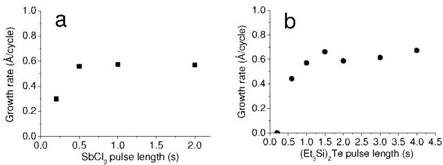
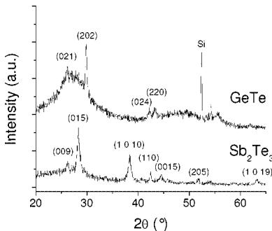
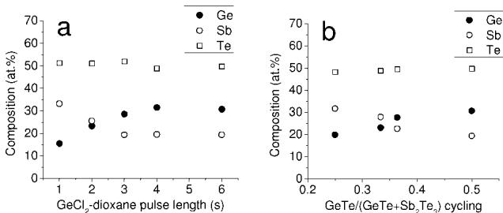

# JACIS COMMUNICATIONS

Published on Web 01/05/2009

# Atomic Layer Deposition of Metal Tellurides and Selenides Using Alkylsilyl Compounds of Tellurium and Selenium

Viljami Pore,\* Timo Hatanpaa, Mikko Ritala, and Markku Leskelaa Laboratory of Inorganic Chemistry, Department of Chemistry, FI- 00014 University of Helsinki, Finland

Received November 18, 2008. E- mail: viljami.pore@helsinki.fi

Compounds with a general formula  $(\mathrm{R}_3\mathrm{Si})_2\mathrm{Te}$  and  $(\mathrm{R}_3\mathrm{Si})_2\mathrm{Se}$  react efficiently with various metal halides to produce telluride and selenide materials. By using this chemistry in atomic layer deposition (ALD), various metal selenide and telluride thin films including the phase change material germanium antimony telluride (GST) can be deposited in a highly controlled manner.

Metal selenide and telluride thin films have been gaining continuously increasing interest. Two well- known examples are  $\mathrm{CuInSe_2}$  solar cell absorber and  $\mathrm{Ge}_2\mathrm{Sb}_2\mathrm{Te}_5$  phase change material. Phase- change random- access memory (PCRAM) is a promising technology for future nonvolatile data storage. To be successful PCRAM must be scaled down to dimensions on the order of a few tens of nanometers or less, and the material has to be deposited conformally.1b,c,2 Therefore chemical deposition techniques, preferably ALD, are needed.

ALD is a unique modification of the chemical vapor deposition method for highly controlled deposition of thin films. Unique to ALD is that precursor vapors are brought onto the substrates alternately, one at a time, separated by purging periods with inert gas. The film grows via saturative surface reactions between the incoming precursor and the surface species left from the previous precursor. When all the reactions are saturative and no precursor decomposition takes place, the film growth is self- limiting providing a number of attractive features, such as easy and accurate film thickness control down to an atomic layer level, excellent large area uniformity, and unrivaled conformality on complex- shaped substrates.

The success of ALD depends strongly on appropriate precursor compounds. Reaching the self- limiting growth conditions places strict demands on the precursors. Besides volatile, they should be thermally stable against self- decomposition but at the same time also show high reactivity toward surface species formed by the other precursor. As decomposition cannot be exploited for the ligand elimination, the precursors must be chosen so that the ligands will be effectively eliminated by exchange reactions. Considering nonmetals, and the group 16 elements in particular, hydrides are often an ideal choice as they allow clean ligand elimination by protonation. However, hydrides of many nonmetals are highly toxic. In group 16 water of course is without this concern, and  $\mathrm{H}_2\mathrm{S}$  can be used with appropriate precautions because its odor threshold limit is much lower than the harmful level. By contrast, the hydrides of selenium and tellurium would require extensive safety systems and exhaust gas treatment. Alkyl compounds of selenium and tellurium have been quite widely used in  $\mathrm{CVD}^6$  but it appears that in ALD they cannot provide efficient exchange reactions with the common metal precursors. Therefore ALD of metal selenides and tellurides has been scarce, and mostly limited to selenides and tellurides of zinc and cadmium because these are the rare cases where elements can be used as precursors for both constituents.7a- e In addition, for GST, plasma enhanced ALD has been attempted but the outcome has been a combination of CVD and ALD growth at best. Thus there is an obvious need to develop efficient ALD processes for metal selenides and tellurides. In this paper we show a breakthrough in metal selenide and telluride ALD by exploiting alkylsilyl compounds  $(\mathrm{R}_3\mathrm{Si})_2\mathrm{Se}$  and  $(\mathrm{R}_3\mathrm{Si})_2\mathrm{Te}$  as precursors.

  
Figure 1. Molecular structure of  $(\mathrm{BuMe}_2\mathrm{Si})_2\mathrm{Te}$  (thermal ellipsoids at  $50\%$ ). Te to Si distances are 2.5141(13)  $\mathring{\mathrm{A}}$  and  $\mathrm{Si - Te - Si}$  angle is  $101.51(6)^{\circ}$

Compared to alkyls and alkylamides of Se and Te,  $(\mathrm{R}_3\mathrm{Si})_2\mathrm{Se}$  and  $(\mathrm{R}_3\mathrm{Si})_2\mathrm{Te}$  offer a much more straightforward reaction route for the elimination of ligands of the metal precursors. In  $(\mathrm{R}_3\mathrm{Si})_2\mathrm{Se}$  and  $(\mathrm{R}_3\mathrm{Si})_2\mathrm{Te}$  silicon, a hard Lewis acid is bonded to the heavy group 16 elements which are soft Lewis bases, thus forming an unfavorable hard- soft Lewis acid- base pair. Upon exchange reaction with metal chlorides, for example, silicon becomes bonded to the harder base:

$$
(\mathrm{R}_3\mathrm{Si})_2\mathrm{Te}(\mathrm{g}) + \mathrm{MCl}_2(\mathrm{g})\longrightarrow \mathrm{MTe}(\mathrm{s}) + 2\mathrm{R}_3\mathrm{SiCl}(\mathrm{g}) \tag{1}
$$

Further, if the metal of the metal chloride is soft Lewis acid, the other product of the exchange reaction will form a favorable soft- soft Lewis acid- base combination (M- Se or M- Te). Indeed, Groshens et al. reported that  $(\mathrm{Me}_3\mathrm{Si})_2\mathrm{Te}$  together with  $\mathrm{Sb(NMe_2)_3}$  deposit stoichiometric  $\mathrm{Sb}_2\mathrm{Te}_3$  in CVD at very low temperatures and that the growth occurs, quite untropical for CVD, through stoichiometric exchange reactions between the two precursors. These observations are very promising in what comes to the reactivity requirements of ALD precursors.

$(\mathrm{Et}_3\mathrm{Si})_2\mathrm{Se}$ ,  $(\mathrm{Et}_3\mathrm{Si})_2\mathrm{Te}$ , and  $(\mathrm{BuMe}_2\mathrm{Si})_2\mathrm{Te}$  were synthesized in good yields by reacting  $\mathrm{Na}_2\mathrm{Se}^{\mathrm{tot}}$  or  $\mathrm{Li}_2\mathrm{Te}^{\mathrm{tot}}$  with  $\mathrm{Et}_3\mathrm{SiCl}$  or  $\mathrm{BuMe}_2\mathrm{SiCl}$  following literature methods. Chlorosilanes larger than  $\mathrm{Me}_3\mathrm{SiCl}$  were chosen to make less volatile tellurium/selenium compounds for safety reasons during the synthesis and use.  $(\mathrm{Et}_3\mathrm{Si})_2\mathrm{Se}$  and  $(\mathrm{Et}_3\mathrm{Si})_2\mathrm{Te}$  are liquids at room temperature while  $(\mathrm{BuMe}_2\mathrm{Si})_2\mathrm{Te}$  is a low melting solid (mp  $44^{\circ}\mathrm{C}$ ). The compounds prepared were analyzed with  ${}^{1}\mathrm{H}$  NMR,  ${}^{13}\mathrm{C}$  NMR, MS, and TGA. Crystal structure of the only solid  $(\mathrm{BuMe}_2\mathrm{Si})_2\mathrm{Te}$  (CCDC 708333) was solved using single crystal X- ray diffraction. Molecular structure of the strictly monomeric compound is shown in Figure 1. TGA ( $\mathrm{N}_2$ , normal pressure) revealed that all the compounds prepared evaporate completely. Thermal stability of the compounds was found to be remarkably high in ALD deposition tests conducted. The compounds prepared seem to be stable at least up to  $400^{\circ}\mathrm{C}$ .

  
Figure 2. Growth rate as a function of (a)  $\mathrm{SbCl}_3$  and (b)  $(\mathrm{Et}_3\mathrm{Si})_2\mathrm{Te}$  pulse length for  $\mathrm{Sb}_2\mathrm{Te}_3$  films deposited at  $60^{\circ}\mathrm{C}$ . The other precursor pulse lengths were kept at  $1.0~\mathrm{s}$  and all the purge lengths at  $2.0~\mathrm{s}$ .

  
Figure 3. Gracing incidence X-ray diffractograms of a  $\mathrm{Sb}_2\mathrm{Te}_3$  film deposited at  $60^{\circ}\mathrm{C}$  and a GeTe film deposited at  $90^{\circ}\mathrm{C}$ .

ALD film growth experiments were performed in a flow type F120 ALD reactor (ASM Microchemistry) operated at a pressure of about 10 mbar. First binary antimony and germanium telluride processes were examined with  $\mathrm{SbCl}_3$  and  $\mathrm{GeCl}_2\cdot \mathrm{C}_4\mathrm{H}_8\mathrm{O}_2$  as precursors.

Both synthesized Te precursors were shown to result in  $\mathrm{Sb}_2\mathrm{Te}_3$  film growth, but  $(\mathrm{Et}_3\mathrm{Si})_2\mathrm{Te}$  was chosen for further studies because of its easier handling (liquid). The saturative growth of  $\mathrm{Sb}_2\mathrm{Te}_3$  from  $\mathrm{SbCl}_3$  and  $(\mathrm{Et}_3\mathrm{Si})_2\mathrm{Te}$  on native silicon oxide is demonstrated in Figure 2. As characteristic to ALD, the growth rate clearly saturates to around  $0.6\mathrm{\AA}$  cycle when both pulse lengths are increased. An exceptionally low deposition temperature of  $60^{\circ}\mathrm{C}$  was possible because  $\mathrm{SbCl}_3$  and  $(\mathrm{Et}_3\mathrm{Si})_2\mathrm{Te}$  show high reactivity and evaporate sufficiently from open vessels inside the reactor at 30 and  $40^{\circ}\mathrm{C}$  respectively. The composition of the films was very close to  $\mathrm{Sb}_2\mathrm{Te}_3$  and no chlorine could be detected by EDX. The reaction thus appears to be very efficient at such a low temperature. When the deposition temperature was raised the growth rate started to decrease. With  $1\mathrm{s}$  pulse times the growth rate dropped to  $0.17\mathrm{\AA}$  cycle at  $90^{\circ}\mathrm{C}$  and further to only  $0.02\mathrm{\AA}$  cycle at  $140^{\circ}\mathrm{C}$ . The films were crystalline showing the reflections of rhombohedral  $\mathrm{Sb}_2\mathrm{Te}_3$  (ICDD- PDF- 015- 0874) (Figure 3).

Next, GeTe films were grown using  $(\mathrm{Et}_3\mathrm{Si})_2\mathrm{Te}$  and a germanium dichloride dioxane complex  $\mathrm{GeCl}_2\cdot \mathrm{C}_4\mathrm{H}_8\mathrm{O}_2$ . The evaporation temperature for the Ge precursor was  $70^{\circ}\mathrm{C}$  which allowed the use of a low deposition temperature in this case also. A growth rate of  $0.42\mathrm{\AA}$  cycle was obtained for the GeTe films at a deposition temperature of  $90^{\circ}\mathrm{C}$ . According to EDX the films were slightly Ge rich with a composition of  $54\%$  Ge and  $46\%$  Te. XRD indicated that the films were crystalline rhombohedral GeTe (ICDD- PDF- 047- 1079) with a noticeable fraction of amorphous phase (Figure 3).

In addition to  $\mathrm{SbCl}_3$  and  $\mathrm{GeCl}_2\cdot \mathrm{C}_4\mathrm{H}_8\mathrm{O}_2$ , other antimony and germanium precursors that resulted in film growth with  $(\mathrm{Et}_3\mathrm{Si})_2\mathrm{Te}$  at a growth temperature of  $140^{\circ}\mathrm{C}$  were  $\mathrm{Sb(OEt)}_3$  and  $\mathrm{GeBr}_3$ . Film growth was not observed with  $\mathrm{Sb(NMe}_2\mathrm{)}_3$ ,  $\mathrm{Ge(N(SiMe}_3\mathrm{)}_2)_2$ ,  $\mathrm{Ge(O^t - Bu)_2}$ ,  $\mathrm{GeCl}_4$ , or  $\mathrm{GeBr}_4$  at the same temperature but a wider range of deposition temperatures should of course be covered before these compounds can be completely excluded.

  
Figure 4. Composition of GST films as a function of (a)  $\mathrm{GeCl}_2\cdot \mathrm{C}_4\mathrm{H}_8\mathrm{O}_2$  pulse length and (b)  $\mathrm{GeTe / (GeTe + Sb_2Te_3)}$  cycling ratio.  $\mathrm{SbCl}_3$  and  $(\mathrm{Et}_3\mathrm{Si})_2\mathrm{Te}$  pulse lengths were always  $1.0~\mathrm{s}$  and purges were  $2.0~\mathrm{s}$ .

  
Figure 5. (a) Gracing incidence X-ray diffractograms of as-deposited and  $\mathrm{N}_2$ -annealed GST films. (b) Cross-section FESEM image of a GST film deposited on a high aspect-ratio trench pattern. Scale bar  $= 600~\mathrm{nm}$ .

The  $\mathrm{Sb}_2\mathrm{Te}_3$  and GeTe processes using  $\mathrm{SbCl}_3$ ,  $\mathrm{GeCl}_2\cdot \mathrm{C}_4\mathrm{H}_8\mathrm{O}_2$ , and  $(\mathrm{Et}_3\mathrm{Si})_2\mathrm{Te}$  as precursors were combined in order to prepare the technologically important GST films. On the basis of the results obtained with the GeTe and  $\mathrm{Sb}_2\mathrm{Te}_3$  binary processes the lowest possible deposition temperature, that is,  $90^{\circ}\mathrm{C}$ , was chosen for the experiments. Figure 4a depicts the composition of GST films as a function of the  $\mathrm{GeCl}_2\cdot \mathrm{C}_4\mathrm{H}_8\mathrm{O}_2$  pulse length when GeTe and  $\mathrm{Sb}_2\mathrm{Te}_3$  cycles were applied in a  $1:1$  ratio. With increasing  $\mathrm{GeCl}_2\cdot \mathrm{C}_4\mathrm{H}_8\mathrm{O}_2$  pulse length the Ge content increases and then saturates with pulse lengths of  $4\mathrm{s}$  and more. The growth rate in these films saturated to around  $0.3\mathrm{\AA}$  cycle which is in line with the growth rates of the individual binary processes at  $90^{\circ}\mathrm{C}$  (0.17 A/cycle for  $\mathrm{Sb}_2\mathrm{Te}_3$  and  $0.42\mathrm{\AA}$  cycle for GeTe).

Based on the saturative behavior of all the precursors, it appears possible to prepare  $\mathrm{Ge}_x\mathrm{Sb}_y\mathrm{Te}_z$  films of various compositions by ALD in a controlled manner just by adjusting the GeTe and  $\mathrm{Sb}_2\mathrm{Te}_3$  cycling ratio. Figure 4b shows the variation of film composition when different  $\mathrm{GeTe / (GeTe + Sb}_2\mathrm{Te}_3$ ) cycling ratios were used. The  $\mathrm{Ge / Sb}$  ratio in the films increases linearly as the  $\mathrm{GeTe / (GeTe + Sb}_2\mathrm{Te}_3$ ) cycling ratio is increased. To get equal amounts of Ge and Sb in the films, a  $\mathrm{GeTe / (GeTe + Sb}_2\mathrm{Te}_3$ ) cycling ratio of  $\sim 0.35$  is required.

A GST film with a composition of  $23\%$  Ge,  $28\%$  Sb, and  $49\%$  Te was subjected to high temperature XRD measurements where the sample is annealed under  $\mathrm{N}_2$  flow and measured with XRD in

Table 1. Process Parameters and Characteristics of Tellurides and Selenides Prepared by ALD Using  $(\mathsf{Et}_3\mathsf{Si})_2\mathsf{Te}$  and  $(\mathsf{Et}_3\mathsf{Si})_2\mathsf{Se}$  as Precursorsa  

<table><tr><td>material</td><td>metal precursor/evaporation temperature</td><td>growth temperature (°C)</td><td>growth rate by EDX (Å/cycle)</td><td>composition by EDX</td></tr><tr><td>ZnTe</td><td>ZnCl3/360 °C</td><td>400</td><td>0.61 ± 0.05</td><td>Zn 47%, Te 53%</td></tr><tr><td>Bi2Te3</td><td>BiCl3/140 °C</td><td>165</td><td>1.21 ± 0.08</td><td>Bi 40%, Te 60%</td></tr><tr><td>ZnSe</td><td>ZnCl3/360 °C</td><td>400</td><td>0.55 ± 0.04</td><td>Zn 48%, Se 50%, Te 2%b</td></tr><tr><td>Bi2Se3</td><td>BiCl3/140 °C</td><td>165</td><td>0.97 ± 0.07</td><td>Bi 41%, Se 59%</td></tr><tr><td>In2Se3</td><td>InCl3/285 °C</td><td>295</td><td>0.55 ± 0.04</td><td>In 41%, Se 59%</td></tr><tr><td>CuSe</td><td>Cu(II) pivalate/155 °C</td><td>165</td><td>0.63 ± 0.06</td><td>Cu 50%, Se 50%</td></tr><tr><td>Cu2-xSe</td><td>Cu(II) pivalate/165 °C</td><td>200</td><td>0.48 ± 0.05</td><td>Cu 61%, Se 39%</td></tr><tr><td>Cu2Se</td><td>Cu(II) pivalate/165 °C</td><td>300</td><td>0.16 ± 0.03</td><td>Cu 69%, Se 31%</td></tr><tr><td>Cu2Se</td><td>CuCl3/360 °C</td><td>400</td><td></td><td></td></tr></table>

Native silicon oxide and glass were used as the substrates. b Te contamination from previous runs.

site at  $15^{\circ}\mathrm{C}$  intervals. The initially amorphous film started to crystalize at  $130^{\circ}\mathrm{C}$  showing reflections belonging to the metastable rock salt structure.11 Further increase in temperature transformed the film gradually at around  $250 - 300^{\circ}\mathrm{C}$  to the stable hexagonal phase.11 These observations are consistent with earlier studies on the crystallization of GST.12 The cubic and hexagonal phases can be clearly distinguished in Figure 5a.

Many of the potential PCRAM structures call for deposition of GST films conformally in deep trenches and pores.1b,c,2 To study the conformality of the GST ALD process, a GeTe/(GeTe  $+\mathrm{Sb}_2\mathrm{Te}_3$  cycling ratio of 0.33 was used to deposit a film on a high aspectratio trench pattern. The FESEM image in Figure 5b shows that the film thickness  $\sim 65 \mathrm{nm}$  is virtually the same in the different parts of the structure. It can be concluded that with this precursor combination GST films can be grown conformally on complex shaped substrates in a typical ALD fashion.

In addition to  $\mathrm{Sb}_2\mathrm{Te}_3$  GeTe, and GST many other tellurides and selenides can be deposited by ALD using alkylsilanes of tellurium and selenium as precursors. Table 1 shows all the materials and precursor combinations that have so far been demonstrated. These include ZnTe,  $\mathrm{Bi}_2\mathrm{Te}_3$ $\mathrm{ZnSe}$ $\mathrm{Bi}_2\mathrm{Se}_3$ $\mathrm{In}_2\mathrm{Se}_3$  and  $\mathrm{Cu_xSe_y}$  .Higher deposition temperatures were required for these materials to ensure sufficient evaporation of the metal precursors. It is noteworthy that the deposition of ZnTe and ZnSe at as high temperature as  $400^{\circ}\mathrm{C}$  was possible. The applicable temperature range for  $(\mathrm{Et}_3\mathrm{Si})_2\mathrm{Te}$  and  $(\mathrm{Et}_3\mathrm{Si})_2\mathrm{Se}$  is thus wide and the deposition of various metal tellurides and selenides is possible. The growth rate is also very good in many cases. The dramatic decrease in the growth rate of  $\mathrm{Sb}_2\mathrm{Te}_3$  with increasing temperature (see above) thus seems to be related to the Sb precursor and not to the tellurium precursor. The range of materials in Table 1 represents successful single growth experiments and the saturative ALD growth behavior of these processes is still to be verified. The general appearance of the films was however quite good with relatively little variations apparent across the substrate. All films were crystalline as verified by XRD.

Metal chlorides seem to react very efficiently with  $(\mathrm{Et}_3\mathrm{Si})_2\mathrm{Te}$  and  $(\mathrm{Et}_3\mathrm{Si})_2\mathrm{Se}$  but also other precursors, such as carboxylates and alkoxides were shown to result in film growth. Growth experiments using copper(II) pivalate and  $(\mathrm{Et}_3\mathrm{Si})_2\mathrm{Se}$  seemed especially interesting because depending on the deposition temperature the stoichiometry could be controlled between  $\mathrm{CuSe}$  and  $\mathrm{Cu}_2\mathrm{Se}$  . This process combined with  $\mathrm{In}_2\mathrm{Se}_3$  could allow the ALD of  $\mathrm{CuInSe}_2$  a wellknown solar cell absorber, and is currently under further study.

In summary, by using alkylsilyl compounds of tellurium and selenium as precursors the ALD of many tellurides and selenides is possible, and it seems that a whole new class of ALD processes has been found.

Acknowledgment. ASM Microchemistry Oy is acknowledged for the financial support and Mr. Mikko Heikkila for the in situ XRD studies.

Supporting Information Available: Description of the precursor synthesis, film characterization, crystallographic data file (CIF) of  $(\mathrm{BuMe}_2\mathrm{Si})_2\mathrm{Te}$  and complete ref 2b. This material is available free of charge via the Internet at http://pubs.acs.org.

# References

(1) (a) Ovshinsky, S. R. Phys. Rev. Lett. 1968, 21, 1450-1453. (b) Lacaita, A. L. Solid-State Electron. 2006, 50, 24-31. (c) Raoux, S.; Burr, G. W.; Breitwisch, M. J.; Rettner, C. T.; Chen, Y. C.; Shelby, R. M.; Salinga, M.; Krebs, D.; Chen, S.-H.; Lung, H.-L.; Lam, C. H. IBM J. Res. Dev. 2008, 52, 465-479. 
(2) (a) Breitwisch, M. J. Phase Change Memory; IEEE: Interconnect Technology Conference, 2008, Burlingame, CA, 1-4 June 2008, 219-221. (b) Breitwisch, M.; et al. Novel Lithography-Independent Pore-Phase Change Memory; IEEE: Symposium on VLSI Technology, Digest of Technical Papers; 2007, 100-101. 
(3) (a) Ritala, M.; Leskelä, M. In Handbook of Thin Film Materials; Nalwa, H. S., Ed., Academic Press: San Diego, CA, 2002; Vol. 1, pp 103-159. (b) Leskelä, M.; Ritala, M. Angew. Chem. Int. Ed. 2003, 42, 5548-5554. 
(4) Leskelä, M.; Ritala, M. Thin Solid Films 2002, 409, 138-146. 
(5) Amoore, J. E.; Hautala, E. J. Appl. Toxcol. 1983, 3, 272-290. 
(6) (a) Singh, H. B.; Sudha, N. Polyhedron 1996, 15, 745. (b) Kim, R.-Y.; Kim, H.-G.; Yoon, S.-G. Appl. Phys. Lett. 2006, 89, 102107. (c) Boscher, N. D.; Carmalt, C. J.; Parkin, I. P. Chem. Vap. Deposition 2006, 12, 54. 
(7) (a) Ponsa, M.; Mäkelä, R.; Suntola, T. Appl. Phys. Lett. 1981, 38, 131. (b) Ahonen, M.; Pissa, M.; Suntola, T. Thin Solid Films 1980, 65, 301. (c) Kytokivi, A.; Koskinen, Y.; Rautiainen, A.; Skarp, J. Mater. Res. Soc. Symp. Proc. 1991, 222, 269. (d) Godlewski, M.; Guziewicz, E.; Kopalko, K.; Lusakowska, E.; Dynowska, E.; Godlewski, M. M.; Goldys, E. M.; Phillips, M. J. J. Lumin. 2003, 102-103, 455-459. (e) Herman, M. A.; Sadowski, J. T. Electron Technol. 1997, 30, 115. (f) Yoshikawa, A.; Kobayashi, M.; Tokita, S. Phys. Status Solidi B 1995, 187, 315. (g) Yokoyama, M.; Chen, N.-T.; Ueng, H. Y. J. Cryst. Growth 2000, 212, (9). (h) Lee, C. D.; Kim, B. K.; Kim, J. W.; Chang, S. K.; Suh, S. H. J. Appl. Phys. 1994, 76, 928. (i) Karam, N. H.; Linden, K.; Ehsani, H.; Bhat, I. B. Proc. SPIE-Int. Soc. Opt. Eng. 1993, 2021, 46. 
(8) (a) Choi, B. J.; Choi, S.; Shin, Y. C.; Kim, K. M.; Hwang, C. S.; Kim, Y. J.; Son, Y. J.; Hong, K. S. Chem. Mater. 2007, 19, 4387-4389. (b) Lee, J.; Choi, S.; Lee, C.; Kang, Y.; Kim, D. Appl. Sci. Sci. 2007, 253, 3969. 
(9) (a) Groshens, T. J.; Gedridge, R. W.; Jr.; Lowe-Ma, C. K. Chem. Mater. 1994, 6, 727. (b) Groshens, T. J.; Gedridge, R. W., Jr.; Scheri, R.; Cole, T. Low Temperature MOCVD growth of VVI Materials via a  $Me_3SiNMe_2$  Elimination Reaction; IEEE: 15th International Conference on Thermoelectrics, 1996, 430. 
(10) (a) Bhasin, K. K.; Gupta, V.; Sharma, R. P. Indian J. Chem. 1991, 30A, 632. (b) Detty, M. R.; Seider, M. D. J. Org. Chem. 1982, 47, 1354. 
(11) Matsunaga, T.; Yamada, N.; Kubota, Y. Acta Crystallogr. B 2004, 60, 685. 
(12) Friedrich, I.; Weidenhof, V. J. Appl. Phys. 2000, 87, 4130-4134.