# Atomic Layer Deposition of Gallium Oxide Films as Gate Dielectrics in AlGaN/GaN Metal-Oxide-Semiconductor High-Electron-Mobility Transistors

Huan- Yu Shih1, Fu- Chuan Chu2, Atanu Das2, Chia- Yu Lee2, Ming- Jang Chen1 and Ray- Ming Lin2*

# Abstract

In this study, films of gallium oxide  $(Ga_{2}O_{3})$  were prepared through remote plasma atomic layer deposition (RP- ALD) using triethylgallium and oxygen plasma. The chemical composition and optical properties of the  $Ga_{2}O_{3}$  thin films were investigated; the saturation growth displayed a linear dependence with respect to the number of ALD cycles. These uniform ALD films exhibited excellent uniformity and smooth  $Ga_{2}O_{3}$ - GaN interfaces. An ALD  $Ga_{2}O_{3}$  film was then used as the gate dielectric and surface passivation layer in a metal- oxide- semiconductor high- electron- mobility transistor (MOS- HEMT), which exhibited device performance superior to that of a corresponding conventional Schottky gate HEMT. Under similar bias conditions, the gate leakage currents of the MOS- HEMT were two orders of magnitude lower than those of the conventional HEMT, with the power- added efficiency enhanced by up to  $9\%$ . The subthreshold swing and effective interfacial state density of the MOS- HEMT were  $78 \text{mV} \text{decade}^{- 1}$  and  $3.62 \times 10^{11} \text{eV}^{- 1} \text{cm}^{- 2}$ , respectively. The direct- current and radio- frequency performances of the MOS- HEMT device were greater than those of the conventional HEMT. In addition, the flicker noise of the MOS- HEMT was lower than that of the conventional HEMT.

Keywords: GaN,  $Ga_{2}O_{3}$ , Remote plasma atomic layer deposition (RP- ALD), Metal- oxide- semiconductor high- electron- mobility transistor (MOS- HEMT), MOCVD

# Background

Gallium nitride (GaN)- based semiconductor materials are useful not only in optoelectronic devices but also in millimeter- wave power devices, especially for the fabrication of high- electron- mobility transistors (HEMTs) [1, 2]. For microwave power applications, an AlGaN/ GaN HEMT must exhibit high speed, high radiofrequency (RF) power performance, and a high breakdown voltage [3]. Nevertheless, a high gate leakage current is the factor most responsible for limiting the direct- current (DC) and RF power performances of conventional Schottky gate HEMTs [4]. Metal- oxide- semiconductor HEMTs (MOS- HEMTs) can decrease the gate leakage current when incorporating a variety of gate oxide/insulators, including electron beam (EB)- evaporated  $\mathrm{Pr}_2\mathrm{O}_3$  and  $\mathrm{Er}_2\mathrm{O}_3$  [5, 6], thermally oxidized  $\mathrm{TiO_2 / NiO}$  [7], sputtered  $\mathrm{Al}_2\mathrm{O}_3$  [8], and atomic layer- deposited  $\mathrm{HfO_2}$  and  $\mathrm{Al}_2\mathrm{O}_3$  [9, 10].

Among the established dielectric deposition methods, atomic layer deposition (ALD)- a low- temperature chemical vapor deposition technique in which layer- by- layer deposition occurs based on surface- limited reactions- is attractive because of its accurate control over thickness, excellent step coverage, conformity, high uniformity over large areas, low- defect density, good reproducibility, and low deposition temperatures arising from the self- limiting reactions [11]. These features make ALD a strong candidate for manufacturing nanoscale dielectric layers for electronic devices. Indeed, ALD has been exploited to prepare a variety of high- dielectric- constant (high-  $k$ ) materials (e.g.,  $\mathrm{Al}_2\mathrm{O}_3$  [12],  $\mathrm{HfO}_2$  [13],  $\mathrm{ZrO}_2$  [14]) that are used widely in Si- based devices.

ALD- deposited high-  $k$  materials, including  $\mathrm{HfO_2}$ ,  $\mathrm{Sc_2O_3}$ , and  $\mathrm{Al_2O_3}$ , have been employed as gate dielectric and surface passivation layers to improve the properties of HEMTs [15]. In addition, such binary oxides are thermodynamically stable when they are contacted with III- V semiconductors. Among the high-  $k$  materials, trivalent  $\mathrm{Ga_2O_3}$  is a promising material for application as a gate dielectric and passivation layer in III- V semiconductor- based devices because its large band gap  $(4.9\mathrm{eV})$  and moderate dielectric constant (10.6) can help to decrease the leakage current [16]. It was also reported that  $\mathrm{Ga_2O_3}$  could be a good candidate as a gate dielectric of AlGaN/GaN HEMTs due to the good interface characteristics [17].

Several groups have reported the ALD growth of  $\mathrm{Ga_2O_3}$ . Shan et al. performed thermal ALD of GaN using  $\mathrm{[(CH_3)_2GaNH_2]_3}$  and  $\mathrm{O_2}$  plasma as precursors [18]. In 2012, Comstock and Elam described the ALD of  $\mathrm{Ga_2O_3}$  films from trimethylgallium and ozone [19]. In 2013, Donmez et al. applied low- temperature ALD to grow  $\mathrm{Ga_2O_3}$  thin films from trimethylgallium and  $\mathrm{O_2}$  plasma [20]. A temperature window of  $100 - 400^{\circ}\mathrm{C}$  has been reported for this process.

In this present study, we prepared high- quality  $\mathrm{Ga_2O_3}$  thin films through remote plasma atomic layer deposition (RP- ALD) using trimethylgallium (TEG) and  $\mathrm{O_2}$  plasma. The remote plasma configuration avoided plasma- induced damage because the wafer was not exposed directly to the plasma, and low- temperature growth mode could realize selective growth by the lift- off method, it made the process much easier and convenient. After investigating the ALD window and characteristics of the  $\mathrm{Ga_2O_3}$  films, we examined their deposition on AlGaN Schottky layers. Comparing the DC and RF characteristics with those of conventional systems, our proposed ALD  $\mathrm{Ga_2O_3}$  dielectrics on AlGaN/GaN HEMTs appear to be very promising devices.

# Methods

$\mathrm{Ga_2O_3}$  was prepared through remote plasma ALD (Fiji F202, Cambridge Nanotech) using TEG and  $\mathrm{O_2}$  plasma as precursors. The remote  $\mathrm{O_2}$  plasma was generated by an RF coil under an alternative RF power at  $300\mathrm{W}$ . Figure 1 provides a schematic representation of the ALD cycles during the  $\mathrm{Ga_2O_3}$  deposition process. Each ALD cycle comprised four steps: (1) TEG pulse, (2) Ar purge, (3)  $\mathrm{O_2}$  plasma, and (4) Ar purge. The films were deposited at a temperature of  $250^{\circ}\mathrm{C}$  with a base pressure of approximately 0.4 Torr.

The thickness and optical characteristics of the  $\mathrm{Ga_2O_3}$  thin films were measured through spectroscopic ellipsometry (SE, Elli- SE, Ellipso Technology) in the wavelength range  $280 - 980\mathrm{nm}$  at an incident angle of  $70^{\circ}$ . The film thickness was confirmed using high- resolution transmission electron microscopy (HRTEM). The chemical compositions and bonding states in the films were characterized using X- ray photoelectron spectrometry (XPS) with Al Kα (1486.6 eV) radiation; pre- sputtering was performed for  $10\mathrm{s}$  to remove any contamination from the surface. The crystal structure of the  $\mathrm{Ga_2O_3}$  films were characterized by high- power grazing incidence the X- ray diffractometer (GI- XRD; Rigaku TTRAX 3,  $18\mathrm{kW}$ ) in  $\theta - 2\theta$  mode with Cu Kα radiation. Atomic force microscopy (AFM; Bruker, Edge) was used to evaluate the roughness of the  $\mathrm{Ga_2O_3}$  surface and interface.

The epitaxial structure was grown on a 2- in silicon carbide substrate using a Nippon Sanso SR- 2000 metalorganic chemical vapor deposition system (MOCVD). The epilayer consisted of a 26- nm  $\mathrm{Al_{0.275}Ga_{0.725}N}$  barrier layer, a 1- nm AlN inter layer, a 2- μm GaN layer, a 0.7- μm  $\mathrm{Al_{0.07}Ga_{0.93}N}$  transition layer, and a 300- nm AlN buffer layer. All epitaxial layers were unintentionally doped. The HEMT structure exhibited a sheet charge density of  $1.02\times 10^{13}\mathrm{cm}^{- 2}$  and a Hall electron mobility of  $1880\mathrm{cm}^2\mathrm{V}^{- 1}\mathrm{s}^{- 1}$  at  $300\mathrm{K}$ .

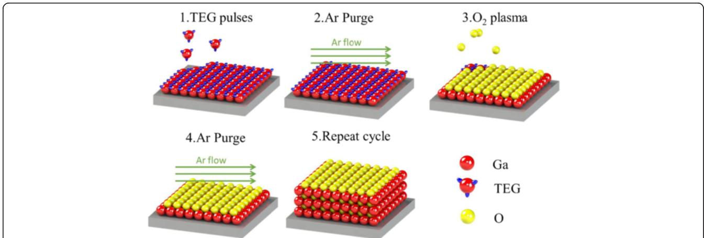  
Fig. 1 Schematic representation of the ALD process during  $\mathrm{Ga_2O_3}$  deposition

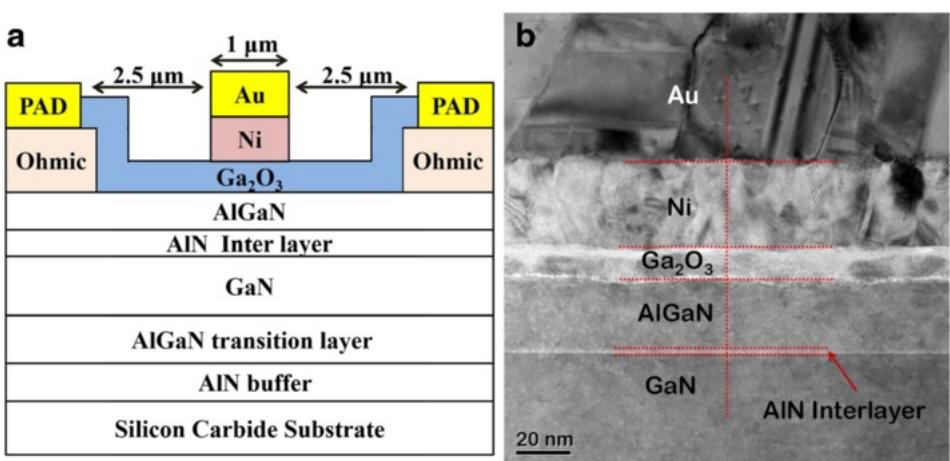  
Fig. 2 a Schematic representation of the cross-sectional structure of a  $\mathrm{Ga}_{2}\mathrm{O}_{3}$ /AlGaN/AlN/GaN HEMT. b Cross-sectional TEM image of a GaN/AlN/AlGaN/ $\mathrm{Ga}_{2}\mathrm{O}_{3}$ /Ni/Au structure

Devices were processed using conventional optical lithography and lift- off technology. Device isolation was accomplished through mesa dry etching down to the unintentionally doped GaN layer in a  $\mathrm{BCl}_{3}$  plasma reactive ion etching chamber. Ohmic contacts of Ti/Al/Ni/Au  $(19 / 120 / 30 / 75 \mathrm{nm})$  metals were deposited through EB evaporation, followed by rapid thermal annealing at  $850^{\circ}\mathrm{C}$  for  $30 \mathrm{s}$  in a  $\mathrm{N}_{2}$ - rich chamber. After gate lithography pattern formation and surface cleaning, the samples were loaded into the ALD chamber, and a  $10 \mathrm{nm}$ $\mathrm{Ga}_{2}\mathrm{O}_{3}$  layer was deposited at  $250^{\circ}\mathrm{C}$  to function as the gate dielectric and passivation layer between the source and drain contact. Ni/Au  $(70 / 140 \mathrm{nm})$  gate metals were then deposited. For comparison, a conventional Ni/Au

Schottky gate AlGaN/GaN HEMT was also fabricated. The Ti/Au  $(50 / 1100 \mathrm{nm})$  metals were deposited as interconnection and probe pads. A schematic cross- sectional structure and a cross- sectional TEM image of a  $\mathrm{Ga}_{2}\mathrm{O}_{3}$ /AlGaN/AlN/GaN HEMT are presented in Fig. 2a, b, respectively. The gate dimensions of each device were  $1 \times 100 \mu \mathrm{m}^{2}$  with a source- to- drain spacing of  $6 \mu \mathrm{m}$ . The microstructures of the fabricated devices were characterized using high- resolution transmission electron microscopy (HRTEM, FEI TecnaiG2 F20), DC characterization of the HEMT devices was performed using an Agilent B1500A semiconductor device analyzer; microwave power measurements were conducted using an ATN load- pull system.

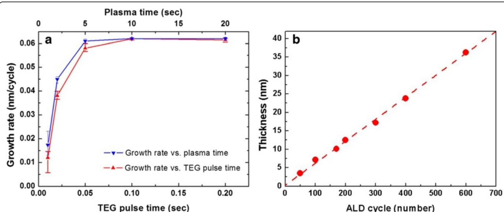  
Fig. 3 a Growth rate of the  $\mathrm{Ga}_{2}\mathrm{O}_{3}$  thin films plotted with respect to the TEG pulse time and plasma time. b Film thickness plotted with respect to the number of applied ALD cycles

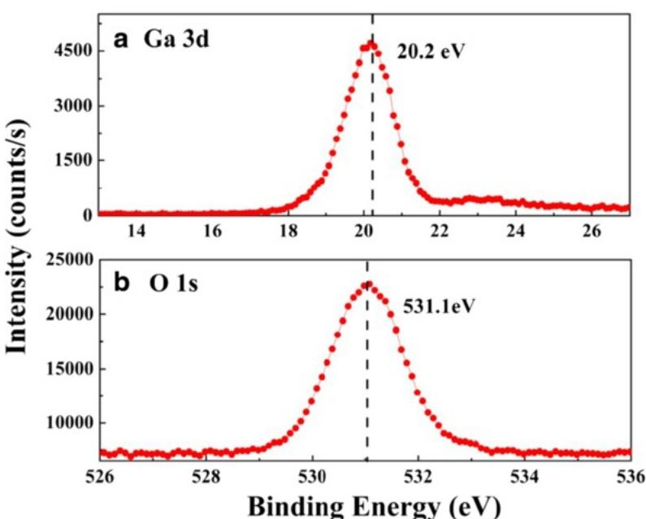  
Fig. 4 a Ga 3d and b O 1 s XPS spectra of the  $\mathrm{Ga}_{2}\mathrm{O}_{3}$  thin film

# Results and Discussion Characteristics of ALD  $\mathrm{Ga}_{2}\mathrm{O}_{3}$

Figure 3a displays the growth rate of the  $\mathrm{Ga}_{2}\mathrm{O}_{3}$  thin films as a function of the TEG pulse time and plasma time, at a deposition temperature of  $250^{\circ}\mathrm{C}$ . The  $\mathrm{O}_{2}$  flow rate was fixed at 20 sccm. The growth rate is defined here in terms of the film thickness divided by the total number of applied ALD cycles. We observed that the growth rate increased initially upon increasing the TEG dose, but then remained constant at  $0.062 \mathrm{nm / cycle}$  when the TEG pulse time was greater than  $0.1 \mathrm{s}$ . The growth rate became saturated at plasma times of longer than  $5 \mathrm{s}$ . These results suggest that the  $\mathrm{Ga}_{2}\mathrm{O}_{3}$  thin films were grown in a self- limiting manner when using the RP- ALD technique. Figure 3b presents the film thickness plotted with respect to the number of applied ALD cycles; the linear dependence implies that the deposition followed the ALD mode and that the film thickness could be control precisely by varying the number of ALD cycles.

Figure 4 displays the XPS spectra of a  $\mathrm{Ga}_{2}\mathrm{O}_{3}$  thin film. A single binding energy (BE) peak for the Ga 3d core level, situated at  $20.1 \mathrm{eV}$ , confirmed the presence of  $\mathrm{Ga} - \mathrm{O}$  bonds [21] in the sample and the absence of elemental Ga in the film. A single, sharp O 1 s peak, centered at a BE of  $531.0 \mathrm{eV}$ , is consistent with previously reported values for the oxide [21]. Taken together, these features confirm that the RP- ALD system facilitated the successful deposition of  $\mathrm{Ga}_{2}\mathrm{O}_{3}$  thin films. By measuring relative areas under the curves of the XPS spectra, we calculated average atomic compositions for Ga, O, and C of 41.53, 58.26, and  $0.21 \%$ , respectively, in the  $\mathrm{Ga}_{2}\mathrm{O}_{3}$  thin film.

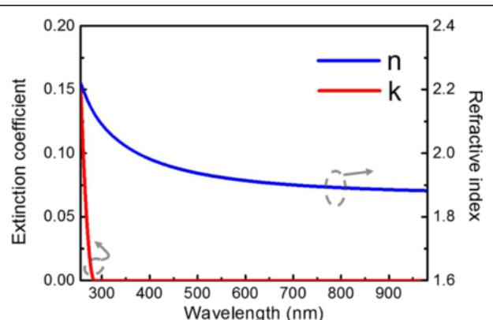  
Fig. 5 Refractive index and extinction coefficient of the  $\mathrm{Ga}_{2}\mathrm{O}_{3}$  thin film plotted with respect to the wavelength

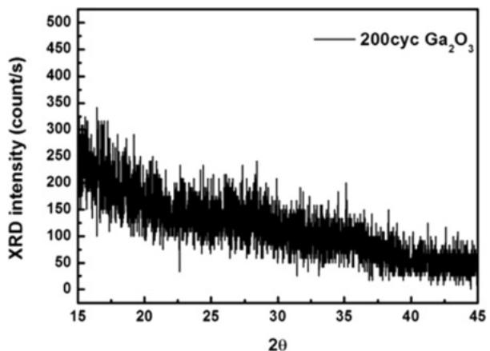  
Fig. 6 The GI-XRD pattern of the  $\mathrm{Ga}_{2}\mathrm{O}_{3}$  films

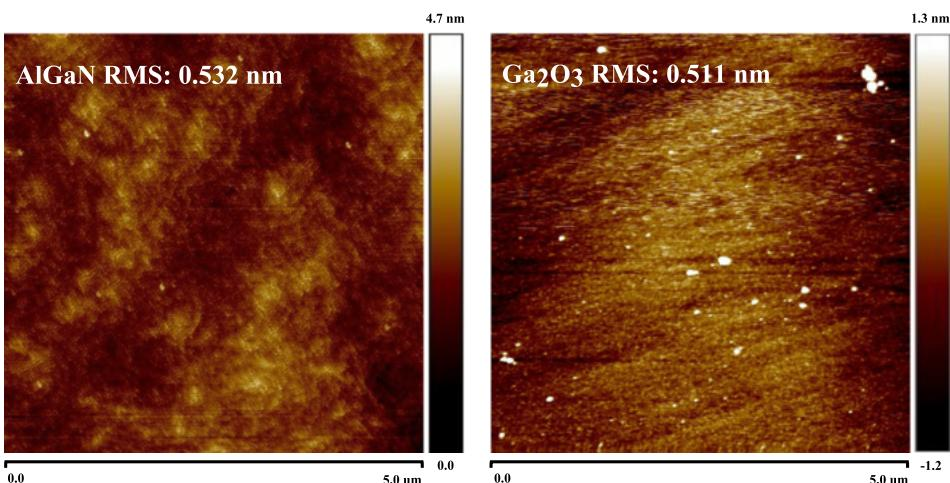  
Fig. 7 Atomic force microscopy images of the conventional HEMT and the  $\mathrm{Ga}_{2}\mathrm{O}_{3}$  MOS-HEMT

The molecular ratio of Ga and O in the ALD thin film was slightly higher than ideal (2:3), suggesting the existence of a Ga- rich  $\mathrm{Ga}_{2}\mathrm{O}_{3}$  film featuring some O vacancies. The content of carbon atoms was negligible, suggesting that the ethyl groups of TEG had been removed almost completely during exposure to the remote  $\mathrm{O}_{2}$  plasma.

We used SE to investigate the optical properties of the  $\mathrm{Ga}_{2}\mathrm{O}_{3}$  thin film. Figure 5 displays the dispersion of the refractive index and extinction coefficient at wavelengths in the range  $280 - 980\mathrm{~nm}$ . We fitted the SE data to the Tauc- Lorentz model, which is widely used for amorphous semiconductors [22]. The measured refractive index of our ALD  $\mathrm{Ga}_{2}\mathrm{O}_{3}$  at a wavelength of  $633\mathrm{~nm}$  was 1.91, and its band gap was  $4.51\mathrm{eV}$ ; these values are close to those reported [23] for amorphous  $\mathrm{Ga}_{2}\mathrm{O}_{3}$ . Figure 6 shows the GI- XRD pattern of the  $\mathrm{Ga}_{2}\mathrm{O}_{3}$  films. The result was performed with a low- grazing angle of incidence in order to obtain the signal from the thin film. There are no obvious peaks of  $\mathrm{Ga}_{2}\mathrm{O}_{3}$  so that the crystal structure was amorphous which was consistent with the SE results.

To investigate the interface quality, the roughness of the HEMT structure before and after  $\mathrm{Ga}_{2}\mathrm{O}_{3}$  grown by ALD were measured by atomic force microscopy (AFM), as shown in Fig. 7. The roughness remained the same order after deposition, this result indicated that the interface between AlGaN and  $\mathrm{Ga}_{2}\mathrm{O}_{3}$  should be smooth.

# Characteristics of  $\mathrm{Ga}_{2}\mathrm{O}_{3}$  MOS-HEMT

The capacitance- voltage (C- V) characteristic measured at  $1\mathrm{MHz}$  is shown Fig. 8. The  $C_{ox}$  value come from MOS capacitance; the calculated  $C_{ox}$  values of the conventional HEMT and the  $\mathrm{Ga}_{2}\mathrm{O}_{3}$  MOS- HEMT were  $28\mathrm{pF}$  and  $14.7\mathrm{pF}$ , respectively.

Figure 9 displays the measured  $I_{\mathrm{DS}} - V_{\mathrm{DS}}$  characteristics of the conventional HEMT and the  $\mathrm{Ga}_{2}\mathrm{O}_{3}$  MOS- HEMT; they both exhibited good gate modulation and pinch- off characteristics. The measured drain current of the conventional HEMT at a value of  $V_{\mathrm{G}}$  of  $0\mathrm{V}$  ( $I_{\mathrm{DSS}}$ ) was  $609\mathrm{~mA~mm}^{- 1}$ ; it was slightly higher ( $720\mathrm{~mA~mm}^{- 1}$ ) for the  $\mathrm{Ga}_{2}\mathrm{O}_{3}$  MOS- HEMT.

Figure 10a presents the transconductance  $(g_{\mathrm{m}})$  and drain current  $(I_{\mathrm{DS}})$  characteristics for these devices. The maximum transconductances  $(g_{\mathrm{mmax}})$  of the conventional HEMT and  $\mathrm{Ga}_{2}\mathrm{O}_{3}$  MOS- HEMT when biased at a value of  $V_{\mathrm{DS}}$  of  $8\mathrm{~V}$  were 179 and  $200\mathrm{~mS~mm}^{- 1}$ , respectively; their maximum drain currents  $(I_{\mathrm{DSmax}})$  were 921 and  $1123\mathrm{~mA~mm}^{- 1}$ , respectively. Thus, the values of  $I_{\mathrm{DSmax}}$  and  $g_{\mathrm{mmax}}$  of the MOS- HEMT were relatively high, presumably the result of enhanced mobility caused by decreased carrier scattering, due to surface passivation [24, 25]. In addition, the slight increase in the gate- to- channel separation, resulting from the presence

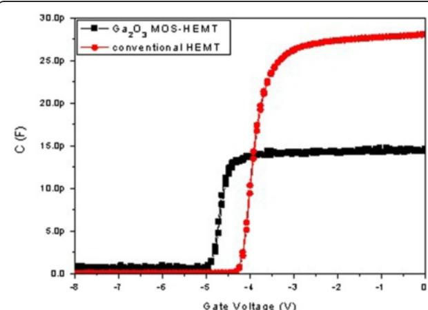  
Fig. 8 The capacitance-voltage (C-V) characteristics of the conventional HEMT and the  $\mathrm{Ga}_{2}\mathrm{O}_{3}$  MOS-HEMT

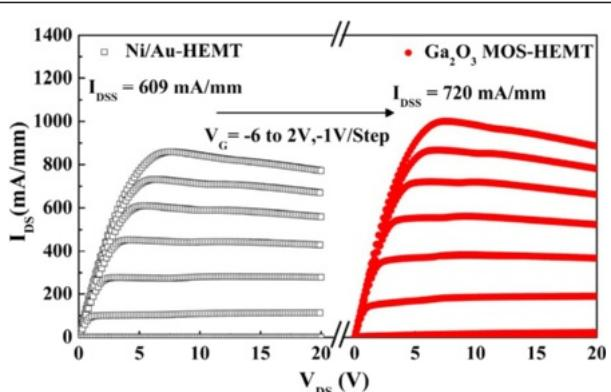  
Fig.9  $I_{DS} - V_{DS}$  characteristics of the conventional HEMT and the  $\mathrm{Ga_2O_3}$  MOS-HEMT upon varying the value of  $V_{G}$  from  $-6$  to  $+2\mathrm{V}$  at a step of  $+1\mathrm{V}$

of the  $\mathrm{Ga_2O_3}$  gate oxide layer, was responsible for the threshold voltage shifting from  $- 3.8$  to  $- 4.2\mathrm{V}$ . For the HEMT with  $\mathrm{Ga_2O_3}$ , the threshold voltage  $(V_{\mathrm{th}})$  shift, which was generally resulted from the defects in interface and gate oxide, was smaller than that with  $\mathrm{Al}_2\mathrm{O}_3$  [26] and  $\mathrm{HfO_2}$  [27]. The result may be caused by the excellent interface between  $\mathrm{Ga_2O_3}$  and AlGaN, optimized RP- ALD process condition, and the use of TEG (reduce defects in  $\mathrm{Ga_2O_3}$ ). To further investigate the gate control characteristics of both devices, we studied the region near the cut- off voltage. The subthreshold swing (SS) is a parameter that indicates how effectively a device can be turned off; it is defined as the decrease in the  $\log (I_{\mathrm{DS}}) - V_{\mathrm{GS}}$  plot near the cut- off voltage as shown in Fig. 10b. We measured the values of  $I_{\mathrm{DS}}$  with respect to  $V_{GS}$  for both devices biased at a value of  $V_{\mathrm{DS}}$  of  $8\mathrm{V}$ . The  $I_{\mathrm{ON}} / I_{\mathrm{OFF}}$  ratio and SS of the  $\mathrm{Ga_2O_3}$  MOS- HEMT  $(1.5\times 10^{7}$  and  $78\mathrm{mV}$  decade $^{- 1}$ , respectively) were superior to those of the conventional HEMT  $(2.4\times 10^{5}$  and  $188\mathrm{mV}$  decade $^{- 1}$ , respectively). Figure 10b also displays the values of the OFF- state  $I_{\mathrm{DS}}$ , revealing that the leakage current  $(3.3\times 10^{- 3}\mathrm{mA}\mathrm{mm}^{- 1})$  of the conventional HEMT decreased (to  $7.45\times 10^{- 5}\mathrm{mA}\mathrm{mm}^{- 1}$ ) after deposition of the  $\mathrm{Ga_2O_3}$  thin layer. We calculated the effective interfacial state density from the SS [6]. By neglecting the depletion capacitance in the active layer, the value of  $N_{\mathrm{t}}$  can be estimated as

$$
N_{t} = \left(\frac{SS}{ln10}\frac{q}{KT} -1\right)\frac{C_{ox}}{q}, \tag{1}
$$

where  $K$  is the Boltzmann constant,  $T$  is the temperature,  $C_{ox}$  is the capacitance of the gate oxide and  $q$  is the quantity of one electron, respectively. The effective interfacial states density  $(4.77\times 10^{12}\mathrm{eV}^{- 1}\mathrm{cm}^{- 2})$  of the conventional HEMT decreased to  $3.62\times 10^{11}\mathrm{eV}^{- 1}$ $\mathrm{cm}^{- 2}$  for the  $\mathrm{Ga_2O_3}$  MOS- HEMT.

Figure 11a presents the gate leakage current densities of the two devices. Under reverse bias conditions, the leakage current density of the  $\mathrm{Ga_2O_3}$  MOS- HEMT reached as low as  $7.8\times 10^{- 6}\mathrm{mA}\mathrm{mm}^{- 1}$  at a value of  $V_{\mathrm{GD}}$  of  $- 10\mathrm{V}$ ; this leakage current density is two order of magnitude lower than that of the conventional HEMT  $(8.59\times 10^{- 4}\mathrm{mA}\mathrm{mm}^{- 1})$ . Figure 11b displays the three- terminal off- state breakdown characteristics of the conventional HEMT and  $\mathrm{Ga_2O_3}$  MOS- HEMT measured at a value of  $V_{\mathrm{GS}}$  of  $- 6\mathrm{V}$ . The drain breakdown voltage of the  $\mathrm{Ga_2O_3}$  MOS- HEMT  $(170\mathrm{V})$  was  $44\mathrm{V}$  larger than that of the conventional HEMT fabricated on the same wafer. The high quality of the ALD  $\mathrm{Ga_2O_3}$  film effectively suppressed the gate leakage current density and improved the breakdown voltage because of its large band gap [16].

We conducted  $1 / f$  noise measurements to elucidate the relationship between the low- frequency noise and the gate electrode interface; here, we varied the frequency from  $1$  to  $100\mathrm{kHz}$  and the gate overdrive bias

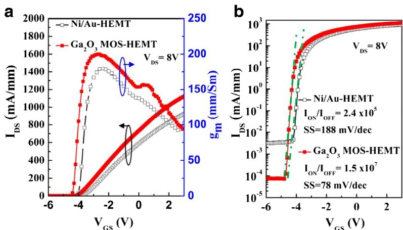  
Fig. 10 a Transfer characteristics and b log  $I_{\mathrm{DS}}$  vs  $V_{\mathrm{GS}}$  plots of the conventional HEMT and the  $\mathrm{Ga_2O_3}$  MOS-HEMT

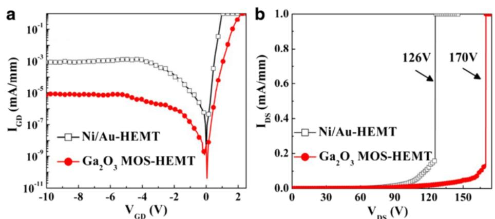  
Fig. 11 a Gate leakage current and b three-terminal off-state breakdown characteristics of the conventional HEMT and the  $\mathrm{Ga}_{2}\mathrm{O}_{3}$  MOS-HEMT

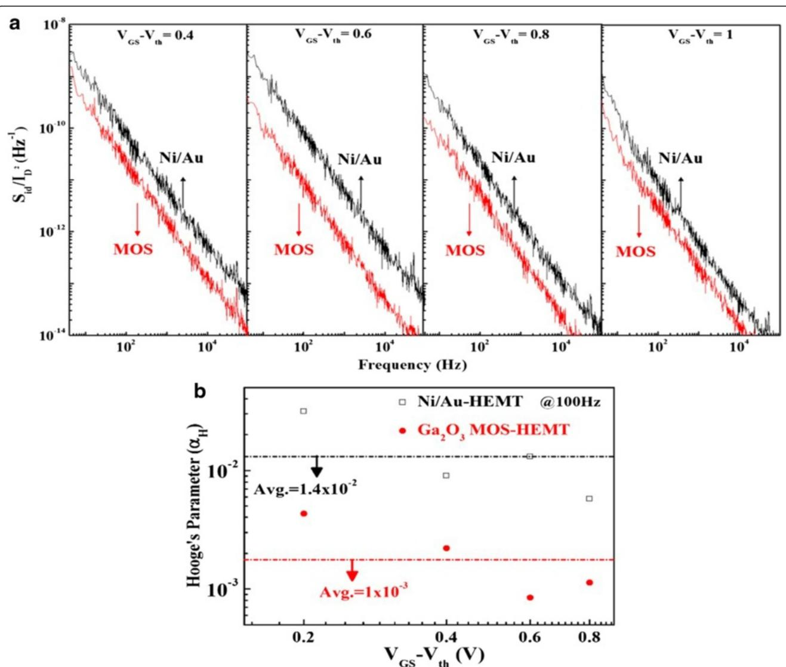  
Fig. 12 a Normalized values of  $S_{ID} / I_{ID}^{2}$  plotted at various values of  $(V_{GS} - V_{th})$ ; b Hooge's coefficient  $(a_{\parallel})$  plotted with respect to  $(V_{GS} - V_{th})$  for the conventional HEMT and the  $\mathrm{Ga}_{2}\mathrm{O}_{3}$  MOS-HEMT

$(V_{\mathrm{GS}} - V_{\mathrm{th}})$  from 0.4 to  $1\mathrm{V}$  in steps of  $0.2~\mathrm{V}$ . Figure 12a displays the gate bias dependence of the normalized drain current noise spectral density  $(S_{\mathrm{ID}} / I_{\mathrm{D}}^2)$  of both devices at a value of  $V_{\mathrm{DS}}$  of  $2\mathrm{V}$ . The  $1 / f$  noise spectrum of the  $\mathrm{Ga_2O_3}$  MOS- HEMT was lower than that of the conventional HEMT, due to its lower gate leakage current.

Our findings indicate that lower interfacial states can be achieved when using this ALD- deposited  $\mathrm{Ga_2O_3}$  film as a gate dielectric and passivation layer. Furthermore, Hooge's coefficient  $(\alpha H)$  is another noise parameter that quantifies the  $1 / f$  noise; it can provide a measure of the total number of active traps causing the noise and can be used as a rough figure of merit for both devices. Hooge's coefficient can be expressed as follows [28]:

$$
\alpha H = \left(\frac{fWLC_i(V_{\mathrm{GS}} - V_{\mathrm{th}})S_{\mathrm{ID}}}{qI^2D}\right), \tag{2}
$$

where  $f$  is the measurement frequency,  $C_i$  is the unit capacitance of the gate material, and  $q$  is the elementary electron charge.

Figure 12b presents the values of  $\alpha H$  plotted with respect to  $(V_{\mathrm{GS}} - V_{\mathrm{th}})$ , measured at a value of  $f$  of  $100\mathrm{Hz}$ . The average values of  $\alpha H$  for the conventional HEMT and  $\mathrm{Ga_2O_3}$  MOS- HEMT were  $1.4\times 10^{- 2}$  and  $1\times 10^{- 3}$ , respectively. The flicker noise spectral density of the  $\mathrm{Ga_2O_3}$  MOS- HEMT was lower than that of the conventional HEMT because of its lower number of interfacial states.

Figure 13 displays the microwave output power  $(P_{\mathrm{out}})$ , power gain  $(G_{\mathrm{p}})$ , and power- added efficiency (PAE) characteristics for both devices determined at  $2.4\mathrm{GHz}$  with a drain bias of  $16\mathrm{V}$ , measured on- wafer by the load- pull ATN system with automatic tuners measuring the optimum- load impedance for maximum output power. The conventional HEMT exhibited an output power of  $25.6\mathrm{dBm}$ ; the associated power- added efficiency was  $40\%$  and the power gain was  $21.9\mathrm{dB}$ . For the  $\mathrm{Ga_2O_3}$  MOS- HEMT, the output power was  $27.3\mathrm{dBm}$ ; the associated power- added efficiency was  $49\%$  and the power gain was  $23.6\mathrm{dB}$ . Output power and PAE can be expressed as

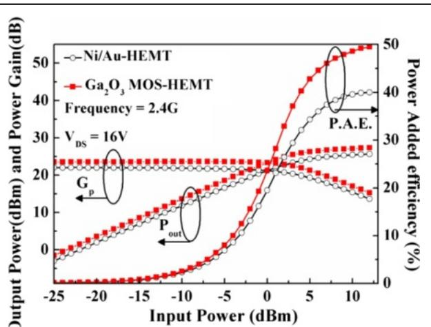  
Fig. 13 Microwave power characteristics of the conventional HEMT and the  $\mathrm{Ga_2O_3}$  MOS-HEMT

$$
P_{\mathrm{out}} = \frac{1}{8}\big(V_{\mathrm{DS}} - V_{\mathrm{Kness}}\big)\times I_{DS} \tag{3}
$$

and

$$
\mathrm{PAE} = \frac{P_{\mathrm{out}} - P_{\mathrm{in}}}{P_{\mathrm{DC}}}\times 100\% , \tag{4}
$$

where  $V_{\mathrm{knee}}$  is the knee voltage,  $P_{\mathrm{out}}$  is the output power,  $P_{\mathrm{in}}$  is the input power, and  $P_{\mathrm{DC}}$  is the DC power supply. The relatively high RF power performance of the  $\mathrm{Ga_2O_3}$  MOS- HEMT resulted from its higher current drive, lower  $P_{\mathrm{DC}}$  dissipation, and lower gate leakage current, all arising from the good passivation and gate insulation effects of the  $\mathrm{Ga_2O_3}$  film prepared through remote plasma ALD [5, 25, 29].

# Conclusions

We have used remote plasma ALD to deposit  $\mathrm{Ga_2O_3}$  films that we then applied in AlGaN/AlN/GaN HEMTs on silicon carbide substrates. The thin  $\mathrm{Ga_2O_3}$  films prepared through RP- ALD exhibited saturation of the growth rate upon increasing the TEG pulse time and plasma time. The film thickness varied linearly with respect to the number of ALD cycles. This behavior is consistent with the growth of  $\mathrm{Ga_2O_3}$  following the ALD mode. The ALD  $\mathrm{Ga_2O_3}$  films possessed excellent uniformity and the  $\mathrm{Ga_2O_3}$ - GaN interfaces were smooth. The fabricated  $\mathrm{Ga_2O_3}$  MOS- HEMT exhibited enhanced gate insulating and surface passivation effects, resulting in superior DC and RF performance relative to those of the conventional HEMT. Moreover, the low leakage current and low interfacial state density of the  $\mathrm{Ga_2O_3}$  MOS- HEMT provided a measured SS of  $78\mathrm{mV}$  decade $^{- 1}$  and an  $I_{\mathrm{ON}} / I_{\mathrm{OFF}}$  ratio that was greater than  $10^{7}$  times that of the conventional HEMT. These attractive features of the HEMT incorporating the ALD- prepared  $\mathrm{Ga_2O_3}$  gate dielectric suggest that ALD- prepared  $\mathrm{Ga_2O_3}$  might find further applicability in other high- power devices in the near future.

# Competing interests

The authors declare that they have no competing interests.

# Authors' contributions

MJC conceived the idea and project. MJC and RML designed the experiments. HYS optimized the growth of the ALD GaN compliant buffer layer. FCC and CYL optimized the MOCVD epitaxy. CYL achieved the fabrication of HEMT devices. HYS and AD carried out the material analyses and device's electrical measurements. MJC provided the RP- ALD, and RML provided the MOCVD. HYS wrote the paper. All authors commented on the manuscript.

# Acknowledgements

AcknowledgementsWe thank Nano Device Labs (NDL), Hsinchu, Taiwan, for the low- frequency noise and load- pull measurements. This study was supported financially by the National Science Council (NSC), Taiwan, under contract no. NSC- 102- 2221- E- 182- 060 and Chang Gung Memorial Hospital BMRP 591.

# Author details

Author details $^{1}$ Department of Material Science and Engineering, National Taiwan University, Taipei 10617, Taiwan.  $^{2}$ Department of Electronic Engineering, Chang Gung University, Taoyuan 333, Taiwan.

Received: 29 January 2016 Accepted: 20 April 2016 Published online: 30 April 2016

# References

1. Yu SF, Lin RM, Chang SJ, Chu FC. Efficiency droop characteristics in InGaN-based near ultraviolet-to-blue light-emitting diodes. Appl Phys Express. 2012;5(2):022102. 
2. Kim DH, Kumar V, Chen G, Dabiran AM, Wowchak AM, Osinsky A, et al (2007) ALD Al2O3 passivated MBE-grown AlGaN/GaN HEMTs on 6H-SiC. Electron Lett 43(2):127-8 
3. Lu W, Yang JW, Khan MA, Adesida I (2001) AlGaN/GaN HEMTs on SiC with over 100 GHz f(T) and low microwave noise. IEEE T Electron Dev 48(3):581-5 
4. Saadat OI, Chung JW, Piner EL, Palacios T (2009) Gate-first AlGaN/GaN HEMT technology for high-frequency applications. IEEE Dev Device L 30(12):1254-6 
5. Chiu H-C, Yang C-W, Lin YH, Lin R-M, Chang L-B, Horr K-Y (2008) Device characteristics of AlGaN/GaN MOS-HEMTs using high-praseodymium oxide layer. IEEE Trans Electron Devices 55(11):3305-9 
6. Lin RM, Chu FC, Das A, Liao SY, Chou ST, Chang LB (2013) Physical and electrical characteristics of AlGaN/GaN metal-oxide-semiconductor high-electron-mobility transistors with rare earth  $\mathsf{Er}_2\mathsf{O}_3$  as a gate dielectric. Thin Solid Films 544:526-9 
7. Meng D, Lin SX, Wen CP, Wang MJ, Wang JY, Hao YL, et al (2013) Low leakage current and high-autof frequency AlGaN/GaN MOSHEMT using submicrometer-footprint thermal oxidized  $\mathsf{TiO_2 / NIO}$  as gate dielectric. IEEE Electro Device L 34(6):738-40 
8. Quah HJ, Cheong KY (2013) Surface passivation of gallium nitride by ultrathin RF-magnetron suntered  $\mathsf{Al}_2\mathsf{O}_3$  gate. ACS Appl Mater Inter 5(15):6860-3 
9. Liu C, Chor EF, Tan LS. Investigations of  $\mathsf{HfO_2 / AlGaN / GaN}$  metal-oxide-semiconductor high electron mobility transistors. Appl Phys Lett. 2006;88(17): 3504. 
10. Zhou H, Ng Gl, Liu ZH, Arulkumaran S. Improved device performance by post-oxide annealing in atomic-layer-deposited  $\mathsf{Al}_2\mathsf{O}_3 / \mathsf{AlGaN} / \mathsf{GaN}$  metal-insulator-semiconductor high electron mobility transistor on Si. Appl Phys Express. 2011;4(10):104102. 
11. George SM (2010) Atomic layer deposition: an overview. Chem Rev 110(1):111-31 
12. Gusev E, Copel M, Cartier E, Baumvoll I, Krug C, Gribelyuk M (2000) High-resolution depth profiling in ultrathin Al2O3 films on Si. Appl Phys Lett 76(2):176-8 
13. Lee BH, Kang LG, Nieh R, Q WJ, Lee JC (2000) Thermal stability and electrical characteristics of ultrathin hafnium oxide gate dielectric reoxidized with rapid thermal annealing. Appl Phys Lett 76(14):1926-8 
14. Coper M, Gribelyuk M, Gusev E (2000) Structure and stability of ultrathin zirconium oxide layers on Si(001). Appl Phys Lett 76(4):436-8 
15. Wang XW, Saadat OI, Xi B, Lou XB, Molnar RJ, Palacios T, et al. Atomic layer deposition of  $\mathrm{SC}_2\mathrm{O}_3$  for passivating AlGaN/GaN high electron mobility transistor devices. Appl Phys Lett. 2012;101(23):232109. 
16. Choi DW, Chung KB, Park JS (2013) Low temperature  $\mathrm{Ga}_2\mathrm{O}_3$  atomic layer deposition using gallium tris-isopropoxide and water. Thin Solid Films 546:31-4 
17. Lee SA, Hwang JY, Kim JP, Cho CR, Lee WJ, Jeong SY (2005) Metal/insulator/ semiconductor structure using Ga2O3 layer by plasma enhanced atomic layer deposition. J Korean Phys Soc 47:S292-S295. 
18. Shan FK, Liu GX, Lee WJ, Lee GH, Kim IS, Shin BC. Structural, electrical, and optical properties of transparent gallium oxide thin films grown by plasma-enhanced atomic layer deposition. J Appl Phys. 2005;98(2):023504. 
19. Comstock DJ, Elam JW (2012) Atomic layer deposition of  $\mathrm{Ga}_2\mathrm{O}_3$  films using trimethylgallium and ozone. Chem Mater 24(21):4011-8

20. Donmez I, Ozgit-Akgun C, Biyikli N. Low temperature deposition of  $\mathrm{Ga}_2\mathrm{O}_3$  thin films using trimethylgallium and oxygen plasma. J Vac Sci Technol A. 2013;31(1):01A110. 
21. Moulder JF, Chastain J. Handbook of X-ray photoelectron spectroscopy: a reference book of standard spectra for identification and interpretation of XPS data. Waltham, Massachusetts 02451, USA: Physical Electronics Division: Perkin-Elmer Corporation; 1992. 
22. Osipov A, Schmitt F, Hess P (2005) Real-time analysis of wetting-layer evolution and island nucleation using spectroscopic ellipsometry with Tauc-Lorentz parametrization. Thin Solid Films 472(1):31-6 
23. Passlack M, Schubert EF, Hobson WS, Hong M, Moriya N, Chu SNG, et al (1995)  $\mathrm{Ga}_2\mathrm{O}_3$  films for electronic and optoelectronic applications. J Appl Phys 77(2):686-93 
24. Liu XK, Low EKF, Pan JS, Liu W, Teo KL, Tan LS, et al. Impact of In situ vacuum anneal and  $\mathrm{SiH}_4$  treatment on electrical characteristics of AlGaN/GaN metal-oxide-semiconductor high-electron mobility transistors. Appl Phys Lett. 2011;99(9):093504. 
25. Liu HY, Chou BY, Hsu WC, Lee CS, Sheu JK, Ho CS (2013) Enhanced AlGaN/GaN MOS-HEMT performance by using hydrogen peroxide oxidation technique. IEEE T Electron Dev 60(1):213-20 
26. Ye PD, Yang B, Ng KK, Bude J, Wilk GD, Halder S, Hwang JCM (2005) GaN metal-oxide-semiconductor high-electron mobility-transistor with atomic layer deposited  $\mathrm{Al}_2\mathrm{O}_3$  as gate dielectric. Appl Phys Lett 86(6):63501-63501 
27. Liu C, Eng FC, Leng ST (2006) Investigations of  $\mathrm{HfO}_2 / \mathrm{AlGaN} / \mathrm{GaN}$  metal-oxide-semiconductor high electron mobility transistors. Appl Phys Lett 88(17):3504 
28. Chiu HC, Yang CW, Chen CH, Wu CH (2012) Quality of the oxidation interface of AlGaN in enhancement-mode AlGaN/GaN high-electron mobility transistors. IEEE T Electron Dev 59(12):344-8 
29. Xu D, Chu K, Diaz J, Zhu W, Roy R, Pleasant LM, et al (2013) 0.2-μm AlGaN/GaN high electron-mobility transistors with atomic layer deposition passivation. IEEE Electron Device Lett 34(6):744-6

# Submit your manuscript to a SpringerOpen journal and benefit from:

Convenient online submission  $\nvdash$  Rigorous peer review  $\nvdash$  Immediate publication on acceptance  $\nvdash$  Open access: articles freely available online  $\nvdash$  High visibility within the field Retaining the copyright to your article

Submit your next manuscript at springeropen.com