# Intercalation of Lithium Ions from Gaseous Precursors into  $\beta$ -MnO $_2$  Thin Films Deposited by Atomic Layer Deposition

Heta- Elisa Nieminen, $^{\dagger ,\#}$  Ville Miikkulainen, $^{\dagger ,\#}$  Daniel Settipani, $^{\ddagger ,\parallel}$  Laura Simonelli, $^{\S ,\mathbb{D}}$  Philipp Hönicke, $^{\parallel}$  Claudia Zech, $^{\parallel}$  Yves Kayser, $^{\parallel}$  Burkhard Beckhoff, $^{\parallel}$  Ari- Pekka Honkanen, $^{\ddagger}$  Mikko J. Heikkila, $^{\dagger}$  Kenichiro Mizohata, $^{\ddagger}$  Kristoffer Meinander, $^{\ddagger ,\nabla}$  Oili M.E. Ylivaara, $^{\perp}$  Simo Huotari, $^{\ddagger}$  and Mikko Ritala $^{*,\dagger ,\mathbb{D}}$

$^{\dagger}$ Department of Chemistry and  $^{\ddagger}$ Department of Physics, University of Helsinki, P.O. Box 64, FI- 00014 Helsinki, Finland  $^{\S}$ CELLS- ALBA Synchrotron Radiation Facility, Carrer de la Llum 2- 26, Cerdanyola del Vallès, ES- 08290 Barcelona, Spain  $^{\parallel}$ Physikalisch- Technische Bundesanstalt, Abbestr. 2- 12, DE- 10587 Berlin, Germany  $^{\perp}$ VTT Technical Research Centre of Finland Limited, P.O. Box 1000, FI- 02044 Espoo, Finland

Supporting Information

ABSTRACT:  $\mathrm{LiMn}_2\mathrm{O}_4$  is a promising candidate for a cathode material in lithium- ion batteries because of its ability to intercalate lithium ions reversibly through its three- dimensional manganese oxide network. One of the promising techniques for depositing  $\mathrm{LiMn}_2\mathrm{O}_4$  thin- film cathodes is atomic layer deposition (ALD). Because of its unparalleled film thickness control and film conformality, ALD helps to fulfill the industry demands for smaller devices, nanostructured electrodes, and all- solid- state batteries. In this work, the intercalation mechanism of  $\mathrm{Li^{+}}$  ions into an ALD- grown  $\beta - \mathrm{MnO}_2$  thin film was studied. Samples were prepared by pulsing  $\mathrm{LiO^{\prime}Bu}$  and  $\mathrm{H}_2\mathrm{O}$  for different cycle numbers onto about 100 nm thick  $\mathrm{MnO}_2$  films at  $225^{\circ}\mathrm{C}$  and characterized with X- ray absorption spectroscopy, X- ray diffraction, X- ray reflectivity, time- of- flight elastic recoil detection analysis, and residual stress measurements. It is proposed that for  $< 100$

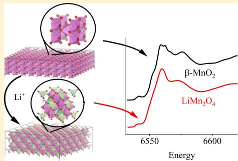

cycles of  $\mathrm{LiO^{\prime}Bu / H_{2}O}$  the  $\mathrm{Li^{+}}$  ions penetrate only to the surface region of the  $\beta - \mathrm{MnO}_2$  film, and the samples form a mixture of  $\beta - \mathrm{MnO}_2$  and a lithium- deficient nonstoichiometric spinel phase  $\mathrm{Li}_x\mathrm{Mn}_2\mathrm{O}_4$ $(0< x< 0.5)$ . When the lithium concentration exceeds  $x\approx 0.5$  in  $\mathrm{Li}_x\mathrm{Mn}_2\mathrm{O}_4$  (corresponding to 100 cycles of  $\mathrm{LiO^{\prime}Bu / H_{2}O}$ ), the crystalline phase of manganese oxide changes from the tetragonal pyrolusite to the cubic spinel, which enables the  $\mathrm{Li^{+}}$  ions to migrate throughout the whole film. Annealing in  $\mathrm{N}_2$  at  $600^{\circ}\mathrm{C}$  after the lithium incorporation seemed to convert the films completely to the pure cubic spinel  $\mathrm{LiMn}_2\mathrm{O}_4$ .

# INTRODUCTION

Lithium- ion batteries (LIBs) are used for power storage in portable electronic devices, electric cars, and many other cutting- edge applications. LIBs are rechargeable batteries, which mean that  $\mathrm{Li^{+}}$  ions migrate between the anode and cathode reversibly. For the battery to work and maintain its capacity, the electrodes need to be stable when  $\mathrm{Li^{+}}$  ions are intercalated to and extracted from the structure upon charge- discharge cycling. With the advent of technologies such as wearable electronics, there is an urgent need for the development of new concepts for the LIBs to meet the increasing demands on energy density, mechanical properties, and capacity retention of the batteries. These demands can be met with nanostructured electrodes and all- solid- state battery architectures. $^{1 - 4}$

All- solid- state batteries require the electrode and electrolyte materials to be deposited as thin films. Atomic layer deposition (ALD) is a gas- phase thin- film deposition technique where the substrate is exposed to precursors alternately for self- limiting reaction steps. $^{5}$  Reactions occur only between the precursor gas molecules and the surface species formed by the other precursor, so that the film thickness increases with an increasing number of reaction cycles. As no chemical reactions take place in the gas phase, the film growth is highly controllable, and the resulting films have excellent uniformity and conformality even on demanding, nanostructured surface topologies. $^{6}$  These qualities make ALD an ideal technique to deposit electrode materials for LIBs. $^{7}$

The stoichiometric cubic spinel  $\mathrm{LiMn}_2\mathrm{O}_4$  crystallizes in a space group  $Fd3m$  (Figure 1). The oxygen anions arrange in a cubic closed- packed structure, leaving two possible interstitial sites for the metal cations (denoted by Wyckoff symbols $^{8}$ ): tetrahedral  $8\mathrm{a}$ , which are occupied by lithium ions, and octahedral  $16\mathrm{d}$ , which are filled with manganese cations.  $\mathrm{LiMn}_2\mathrm{O}_4$  is a superb cathode material because of its three- dimensional manganese oxide network which enables the intercalation of lithium ions also beyond the  $1:1\mathrm{Li} / \mathrm{Mn}$  stoichiometry, resulting in compositions in the range of  $\mathrm{Li}_x\mathrm{Mn}_2\mathrm{O}_4$ ,  $0\leq x\leq 2$ . $^{9 - 11}$  The nonstoichiometric behavior of the oxide improves the specific capacity of the material by

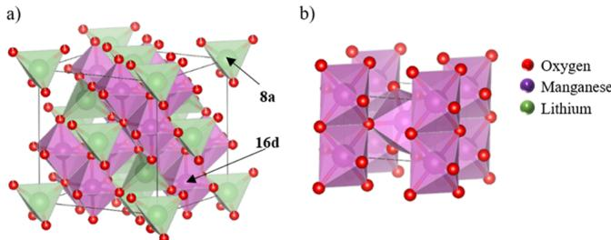  
Figure 1. Crystal structures of (a) spinel  $\mathrm{LiMn}_2\mathrm{O}_4$  and (b)  $\beta -\mathrm{MnO}_2$ . The interstitial sites of tetrahedral 8a and octahedral 16d are pointed. VESTA software was used to visualize the crystal structures of  $\mathrm{LiMn}_2\mathrm{O}_4$  (ICDD PDF 35-0782) and  $\beta -\mathrm{MnO}_2$  (ICDD PDF 24-0735).

$10\%$  12 Furthermore, the low- volume changes upon charge- - discharge cycling make it an ideal electrode material for allsolid- state thin- film batteries where the battery structure is rigid.

Generally, the challenge with  $\mathrm{LiMn}_2\mathrm{O}_4$  has been that the material experiences capacity fading rather easily because of the distortion of the bonds between oxygen and the JahnTeller (JT)- active  $\mathrm{Mn^{3 + }}$  ions.11,13 The JT effect deforms the cubic spinel structure to tetragonal14- 17 or orthorhombic,18- 22 which can destroy the operation of the  $\mathrm{LiMn}_2\mathrm{O}_4$  cathode. Because  $\mathrm{LiMn}_2\mathrm{O}_4$  has a critical 1:1 balance of  $\mathrm{Mn^{4 + }}$  and  $\mathrm{Mn^{3 + }}$  ions, the distortion and phase change occur already at relatively low temperatures of  $280 - 293\mathrm{K}$  when cooling.14- 20,23 However, it was previously reported that the ALD  $\mathrm{Li}_x\mathrm{Mn}_2\mathrm{O}_4$  thin films, prepared by the approach studied also in this paper, show unexpectedly high capacity retention.24 The capacity of the  $\mathrm{Li}_x\mathrm{Mn}_2\mathrm{O}_4$  electrodes remained high even when they were. cycled over a larger voltage range than that is usually applied, which furthermore provides higher gravimetric capacities than what is usually accessible with this material. These properties make the ALD  $\mathrm{LiMn}_2\mathrm{O}_4$  thin film a very promising cathode material for LIBs and generate questions regarding the mechanism of the intercalation.

Miikkulainen et al.24 reported a full conversion of  $\mathrm{MnO}_2$  thin films to  $\mathrm{LiMn}_2\mathrm{O}_4$  thin films by pulsing  $\mathrm{LiO}^{\mathrm{f}}\mathrm{Bu}$  and  $\mathrm{H}_2\mathrm{O}$  sequentially on the  $\mathrm{MnO}_2$  film at  $225^{\circ}C$  Interestingly,  $\mathrm{Li}^+$  ions intercalated throughout the whole  $\mathrm{MnO}_2$  film depth of  $100\mathrm{nm}$  Normally, the  $\mathrm{LiO}^{\mathrm{f}}\mathrm{Bu} - \mathrm{H}_2\mathrm{O}$  process deposits  $\mathrm{Li}_2\mathrm{O}$  or LiOH films,26- 28 but on  $\mathrm{MnO}_2$  it led into a direct intercalation of Li ions into the  $\mathrm{MnO}_2$  films. Similar lithiation was attempted also on several other metal oxides  $(\mathrm{V}_2\mathrm{O}_5,$ $\mathrm{TiO}_2,$ $\mathrm{Al}_2\mathrm{O}_3,$ $\mathrm{ZrO}_j$ $\mathrm{Co}_3\mathrm{O}_4,$ $\mathrm{Fe}_2\mathrm{O}_3,$ $\mathrm{NiO}_j$  and  $\mathrm{MoO}_3$  but was observed to occur only on  $\mathrm{V}_2\mathrm{O}_5$  As ALD thin- film battery materials are likely to be vital contributors toward future portable devices, understanding the Li intercalation process into  $\mathrm{MnO}_2$  is a critical step toward the application of the thin- film  $\mathrm{LiMn}_2\mathrm{O}_4$  cathode material. In this work, we aim to understand the intercalation of  $\mathrm{Li}^+$  ions further by studying the phase and a local crystal structure together with the electronic structure of a series of thin- film samples using X- ray absorption spectroscopy (XAS), X- ray diffraction (XRD), X- ray reflectivity (XRR), and time- offlight elastic recoil detection analysis (TOF- ERDA) techniques.

# EXPERIMENTAL SECTION

All  $\mathrm{MnO}_2$  and  $\mathrm{Li}_x\mathrm{Mn}_2\mathrm{O}_4$  samples were deposited in a PICOSUN SUNALE R- 150 ALD reactor. The deposition processes have been published earlier by Miikkulainen et al.24

and Nilsen et al.29 The depositions took place in two steps: first,  $\mathrm{MnO}_2$  was deposited using  $\mathrm{Mn(thd)}_3$ $\mathrm{(thd = 2,2,6,6 - }$  tetramethyl- 3,5- heptanedionato) (Volatec Oy) and ozone (AGA,  $99.999\%$  .Lithium was added into the  $\mathrm{MnO}_2$  films by pulsing  $\mathrm{LiO}^{\mathrm{f}}\mathrm{Bu}$  (lithium tert- butoxide) (Acros Organics,  $99\%$  and water alternately. The amount of lithium was controlled by the number of  $\mathrm{LiO}^{\mathrm{f}}\mathrm{Bu} - \mathrm{H}_2\mathrm{O}$  cycles. The deposition temperature in both the processes was  $225^{\circ}C$  as in the study published earlier.24  $\mathbf{N}_2$  gas (AGA,  $99.999\%$  was used for purging and as a carrier gas.

The  $\mathrm{MnO}_2$  films were deposited on  $\mathrm{Si}(100)$  wafers with a pulsing sequence of  $0.5\mathrm{~s~}$  pulse and  $3.0\mathrm{~s~}$  purge for  $\mathrm{Mn(thd)}_3$  and  $3.0\mathrm{~s~}$  pulse and  $3.0\mathrm{~s~}$  purge for  $\mathrm{O}_3$  . The pulsing sequence was repeated for 5000 times resulting in around an  $86 - 100\mathrm{~nm}$  thick  $\mathrm{MnO}_2$  film. The source temperature for the  $\mathrm{Mn(thd)}_3$  powder precursor was  $160^{\circ}\mathrm{C}$ $\mathrm{O}_3$  was made by feeding  $\mathrm{O}_2$  (AGA,  $99.999\%$  into a Modular  $4\mathrm{H}C$  ozone generator from Wedeco giving an ozone concentration of about  $165~\mathrm{g / m^3}$  .A needle valve was used to control the  $\mathrm{O}_3$  flow into the reactor. A specific nozzle was used in the  $\mathrm{O}_3$  inlet to ensure gas distribution over the whole wafer.

Lithium was inserted into the film by a pulsing sequence of  $0.5\mathrm{~s~}$  pulse and  $5\mathrm{~s~}$  purge for  $\mathrm{LiO}^{\mathrm{f}}\mathrm{Bu}$  and  $0.1\mathrm{~s~}$  pulse and  $10\mathrm{~s~}$  purge for  $\mathrm{H}_2\mathrm{O}$  . The source temperature of  $\mathrm{LiO}^{\mathrm{f}}\mathrm{Bu}$  was  $160^{\circ}\mathrm{C}$  The  $\mathrm{LiO}^{\mathrm{f}}\mathrm{Bu} - \mathrm{H}_2\mathrm{O}$  sequence was repeated for 10, 50, 100, 200, or 300 times, creating a set of samples with increasing lithium concentration. The samples with the highest lithium concentration, that is, the samples with 200 and 300  $\mathrm{LiO}^{\mathrm{f}}\mathrm{Bu} - \mathrm{H}_2\mathrm{O}$  cycles, were also annealed at 400 and/or 600  $^\circ \mathrm{C}$  under  $\mathrm{N}_2$  gas (AGA,  $99.999\%$  . For clarity, the samples are named based on their preparation processes (Table 1).

Table 1.Names and Preparation Methods of the Samples in This Study  

<table><tr><td>name</td><td>preparation method</td><td>annealing</td></tr><tr><td>MnO2</td><td>MnO2film</td><td>no</td></tr><tr><td>10cLi-MnO2</td><td>MnO2film + 10 LiO4Bu-H2O cycles</td><td>no</td></tr><tr><td>50cLi-MnO2</td><td>MnO2film + 50 LiO4Bu-H2O cycles</td><td>no</td></tr><tr><td>100cLiMnO2</td><td>MnO2film + 100 LiO4Bu-H2O cycles</td><td>no</td></tr><tr><td>200cLi-MnO2</td><td>MnO2film + 200 LiO4Bu-H2O cycles</td><td>no</td></tr><tr><td>300cLi-MnO2</td><td>MnO2film + 300 LiO4Bu-H2O cycles</td><td>no</td></tr><tr><td>200cLi-MnO2-400</td><td>MnO2film + 200 LiO4Bu-H2O cycles</td><td>at 400 °C for 10 min</td></tr><tr><td>200cLi-MnO2-600</td><td>MnO2film + 200 LiO4Bu-H2O cycles</td><td>at 600 °C for 10 min</td></tr><tr><td>300cLi-MnO2-600</td><td>MnO2film + 300 LiO4Bu-H2O cycles</td><td>at 600 °C for 10 min</td></tr></table>

The film thicknesses were analyzed with XRR using a PANalytical X'pert Pro MPD diffractometer or a Rigaku SmartLab diffractometer. Both the diffractometers use Cu Kα radiation with a wavelength  $\lambda = 1.5419\mathrm{~Å}$ . The compositions of the films were characterized with TOF- ERDA. The measurements were done with  $^{79}\mathrm{Br}^{7 + }$  ions obtained from a 5 MV tandem accelerator (model EGP- 10-II) at the University of Helsinki.

The crystalline phases of the samples were analyzed with XRD. The measurements were done in two geometries. Out- of- plane  $\theta - 2\theta$  diffraction was measured with the PANalytical

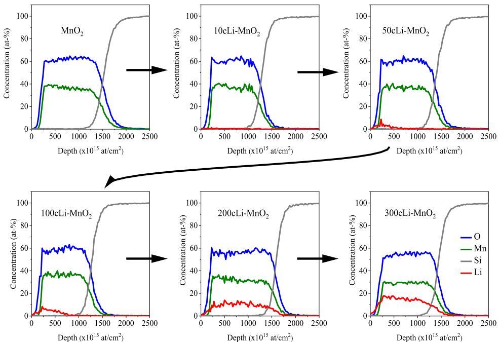  
Figure 2. Elemental depth profiles of the samples with increasing number of  $\mathrm{LiO}^{\prime}\mathrm{Bu} - \mathrm{H}_{2}\mathrm{O}$  cycles.

Table 2. Results of the Compositional Analysis of the Films  

<table><tr><td>sample</td><td>composition</td><td>Li/Mn/O (at. %)</td><td>H (at. %)</td><td>C (at. %)</td><td>F (at. %)</td></tr><tr><td>MnO2</td><td>Mn1.0O2</td><td>0:33.1:65.6</td><td>0.3</td><td>0.1</td><td>0.2</td></tr><tr><td>10cLi-MnO2</td><td>Li0.025Mn2.1O4</td><td>0.4:34.1:33.8</td><td>0.5</td><td>0.3</td><td>0.2</td></tr><tr><td>50cLi-MnO2</td><td>Li0.11Mn2.0O4</td><td>1.8:32.1:64.5</td><td>0.4</td><td>0.1</td><td>0.2</td></tr><tr><td>100cLi-MnO2</td><td>Li0.52Mn2.1O4</td><td>7.8:31:62:97</td><td>0.6</td><td>0.1</td><td>0.2</td></tr><tr><td>200cLi-MnO2</td><td>Li0.65Mn2.0O4</td><td>9.7:29.6:59.7</td><td>0.3</td><td>0.1</td><td>0.2</td></tr><tr><td>300cLi-MnO2</td><td>Li1.1Mn2.0O4</td><td>14.9:28.4:55.5</td><td>0.6</td><td>0.2</td><td>0.2</td></tr><tr><td>Annealed Samples</td><td></td><td></td><td></td><td></td><td></td></tr><tr><td>200cLi-MnO2-400</td><td>Li0.70Mn2.1O4</td><td>10.2:30.3:58.4</td><td>0.4</td><td>0.2</td><td>0.2</td></tr><tr><td>200cLi-MnO2-600</td><td>Li0.78Mn2.1O4</td><td>11.2:30.1:57.8</td><td>0.2</td><td>0.2</td><td>0.2</td></tr><tr><td>300cLi-MnO2-600</td><td>Li0.97Mn1.8O4</td><td>14.1:26.8:58.2</td><td>0.4</td><td>0.2</td><td>0.1</td></tr></table>

The composition is an average throughout the whole film thickness.

diffractometer using programmable divergence and antiscatter slits as focusing optics and a PIXcel 1D detector. In- plane  $2\theta_{\chi}$  diffraction was measured using the Rigaku diffractometer and a Rigaku Dtex250 detector with a parallel multilayer mirror and parallel slit collimator optical system. The constant  $\omega$  and  $2\theta$  angles were  $0.3^{\circ}$ .

The residual stresses of the films were assessed using a Toho Technology FLX- 2320- S instrument by measuring the curvature of the sample before and after the film deposition and lithium intercalation. The results were analyzed with a Toho Technology Thin Film Stress Measurement System software.

The electronic structure and the local crystal structure of the samples were studied with the X- ray absorption near- edge structure (XANES) and extended X- ray absorption fine structure (EXAFS) techniques. The measurements were performed for the K- and L- edges of manganese and for the K- edge of oxygen. The K- edge of manganese was studied at the CLESS beamline 22 of ALBA synchrotron. During operation, electrons were at  $3\mathrm{GeV}$  in the booster with a current of around  $150\mathrm{mA}$ . The measurements were done at room temperature  $(27.7^{\circ}\mathrm{C})$  under  $10^{- 2}$  bar pressure. The primary beam size was  $1.5\times 0.5\mathrm{mm}^2$ , and it was set to  $45^{\circ}$  angle with respect to the samples. The samples were measured continuously in total fluorescence yield (TFY) and in total electron yield (TEY) modes. The TFY signal was collected with an XR- 100SDD detector located at  $90^{\circ}$  with respect to the incoming beam and the TEY signal by measuring the drain current of the samples. The data were collected up to  $k = 18$ $\mathrm{\AA}^{- 1}$  with the scanning sequence:  $6400 - 6520\mathrm{eV}$  with steps of  $1\mathrm{eV}$  (total of 120 points in  $60~\mathrm{s}$ ),  $6521 - 6582\mathrm{eV}$  with steps of  $0.2\mathrm{eV}$  (total of 306 points in  $153~\mathrm{s}$ ), and  $6582.2 - 7782.8$  with steps of  $1\mathrm{eV}$  (total of 1200 points in  $600~\mathrm{s}$ ). The XANES data analysis was done using the ATHENA program within the IFEFFIT software package together with the curve and peak fitting software Fityk. The EXAFS data were least- square fitted to a theoretical model using ARTEMIS, also within the IFEFFIT package. A k range of  $2.912 - 11.671\mathrm{\AA}^{- 1}$  was used in the Fourier transform (FT) of the EXAFS data. Three powder standards of  $\mathrm{MnO}$ ,  $\mathrm{MnO}_{2}$ , and  $\mathrm{LiMnO}_{4}$  were used.

The L- edge of manganese and the K- edge of oxygen were studied with XANES at the plane grating monochromator beamline at the laboratory of Physikalisch- Technische Bundesanstalt (PTB) at the synchrotron radiation source BESSY II. The measurement was performed using PTB's ultrahigh vacuum instrument for X- ray spectrometry and

related techniques.32 The three powder standards of  $\mathrm{MnO}_2$ ,  $\mathrm{Mn}_2\mathrm{O}_3$ , and  $\mathrm{LiMn}_2\mathrm{O}_4$  that were placed on Si wafer pieces were used. The incident beam angles were  $0.5^{\circ}$ ,  $1^{\circ}$ , and  $45^{\circ}$ .

# RESULTS AND DISCUSSION

The samples were prepared by ALD in two steps. First an  $\mathrm{MnO}_2$  film was deposited with  $\mathrm{Mn(thd)}_3$  and  $\mathrm{O}_3$  as precursors, and second, after characterization of the  $\mathrm{MnO}_2$  film, lithium was intercalated by pulsing  $\mathrm{LiO}^4\mathrm{Bu}$  and  $\mathrm{H}_2\mathrm{O}$  alternately so that the composition of the sample changed from  $\mathrm{MnO}_2$  to  $\mathrm{LiMn}_2\mathrm{O}_4$ . A set of partially lithiated samples with average stoichiometries through the whole film thickness in the range of  $\mathrm{Li}_x\mathrm{Mn}_2\mathrm{O}_4$ $0< x< 1$  was prepared by increasing the number of  $\mathrm{LiO}^4\mathrm{Bu} / \mathrm{H}_2\mathrm{O}$  ALD cycles from 10 to 300.

Composition, Thickness, and Residual Stress. Compositional analysis was done with TOF- ERDA. Figure 2 shows the elemental depth profiles, and Table 2 reports the average compositions obtained by integrating over the whole film thickness. The  $\mathrm{MnO}_2$  film had an  $\mathrm{Mn / O}$  stoichiometry of 33:66, and the film contained only small amounts of impurities. Fluorine was found from all the samples and it most probably comes from fluoroelastomer gaskets that were in use in the reactor and in the  $\mathrm{O}_3$  line. The amount of lithium in the films increased as the number of  $\mathrm{LiO}^4\mathrm{Bu} - \mathrm{H}_2\mathrm{O}$  cycles increased, as expected. Stoichiometric  $\mathrm{LiMn}_2\mathrm{O}_4$  was achieved after 300 ALD cycles of  $\mathrm{LiO}^4\mathrm{Bu}$  and  $\mathrm{H}_2\mathrm{O}$  on a  $100\mathrm{nm}$  thick  $\mathrm{MnO}_2$  film. The depth profiles (Figure 2) reveal that lithium is distributed only in the top part of the film in the samples  $10\mathrm{cLi} - \mathrm{MnO}_2$ ,  $50\mathrm{cLi} - \mathrm{MnO}_2$ , and  $100\mathrm{cLi} - \mathrm{MnO}_2$ , that is, when the average composition of the material is  $\mathrm{Li}_x\mathrm{Mn}_2\mathrm{O}_4$ $x\leq 0.5$ . In the lithiated top parts of the films in these samples, the lithium concentrations were 0.6, 3.2, and 9.6 at.  $\%$ , respectively. In the samples  $200\mathrm{cLi} - \mathrm{MnO}_2$  and  $300\mathrm{cLi} - \mathrm{MnO}_2$ , lithium is penetrated throughout the whole film thickness. Judged by visual inspection, the lithiation appeared to occur homogeneously over the whole substrate. The easy and highly controllable gas- phase lithiation process provides films with excellent purity, as the samples contained only small amounts of impurities.

The film thickness was measured by XRR before and after the lithium intercalation (Table 3). For the  $\mathrm{MnO}_2$  film, a thickness nonuniformity of around  $10\%$  on a  $150\mathrm{mm}$  Si wafer The thicknesses of the lithiated layer were analyzed with TOF- ERDA and XRR. The film thickness analysis was done with XRR.

Table 3. Thicknesses of the Lithiated Layer and Overall Film Thicknesses before and after Lithium Insertion  

<table><tr><td rowspan="2">sample</td><td colspan="2">thickness of the lithiated layer</td><td colspan="2">film thickness</td></tr><tr><td>TOF-ERDA (nm)</td><td>XRR (nm)</td><td>before lithium insertion (nm)</td><td>after lithium insertion (nm)</td></tr><tr><td>MnO2</td><td>no lithium</td><td>no lithium</td><td>86</td><td></td></tr><tr><td>10cLi-MnO2</td><td>~10</td><td>~5</td><td>100</td><td>98 (-2%)</td></tr><tr><td>50cLi-MnO2</td><td>~20</td><td>~16</td><td>96</td><td>100 (+4%)</td></tr><tr><td>100cLi-MnO2</td><td>~50</td><td>~60</td><td>97</td><td>109 (+11%)</td></tr><tr><td>200cLi-MnO2</td><td>the whole film</td><td>the whole film</td><td>96</td><td>112 (+14%)</td></tr><tr><td>300cLi-MnO2</td><td>the whole film</td><td>the whole film</td><td>92</td><td>108 (+15%)</td></tr></table>

was achieved at best. The thinnest part of the film was at the opposite side of the wafer with respect to the  $\mathrm{O}_3$  inlet. The suggested reason for the nonuniformity is that  $\mathrm{MnO}_2$  catalyzes the decomposition reaction of  $\mathrm{O}_3$  and thus causes a nonuniform  $\mathrm{O}_3$  distribution across the substrate.33 XRR measurements were best fitted by modeling the film structure as a double layer of  $\mathrm{MnO}_2$  and  $\mathrm{LiMn}_2\mathrm{O}_4$  (an example of the XRR fit is shown in Supporting Information Figure S1). The film thickness increased by  $4 - 15\%$  during lithium insertion. The surface roughness of the films varied randomly between 3.3 and  $5.5 \mathrm{nm}$  (see Supporting Information Table S1). The depth of the lithium- containing layer increases through the sample series, and in most of the samples the lithiated layer thicknesses are essentially the same as those estimated from the TOF- ERDA depth profiles.

Residual stress was analyzed after the  $\mathrm{MnO}_2$  film deposition as well as after 300 cycles of lithium insertion. The films for the residual stress measurements were deposited on one side of the  $50 \mathrm{mm}$  double- side- polished Si wafers. The residual stress of the  $\mathrm{MnO}_2$  film was  $560 \mathrm{MPa}$  in the tensile direction. The stress changed compressive and increased to  $- 2300 \mathrm{MPa}$  after the 300 cycles of lithium insertion. As seen in the thickness analysis of  $300\mathrm{cLi} - \mathrm{MnO}_2$ , the film expands during the lithium insertion, which is thought to be the origin for the high compressive stress.

Phase Identification, Electronic Structure, and Local Structure. The phase change from the pyrolusite  $\beta - \mathrm{MnO}_2$  to the spinel  $\mathrm{LiMn}_2\mathrm{O}_4$  is clearly visible in the XRD and XAS measurements. The samples are divided into three groups with increasing progress in the phase change: when the average composition of the sample is  $x< 0.5$  in  $\mathrm{Li}_x\mathrm{Mn}_2\mathrm{O}_4$  when  $x\geq 0.5$  in  $\mathrm{Li}_x\mathrm{Mn}_2\mathrm{O}_4$ , and after the samples are annealed. The following paragraphs explain the details of each of the steps according to the XRD and XAS results.

Phase Change When the Average Composition is below  $x = 0.5$  in  $\mathrm{Li}_x\mathrm{Mn}_2\mathrm{O}_4$ . The in- plane  $2\theta_{\chi}$  and out- of- plane  $\theta - 2\theta$  XRD measurements of the samples  $\mathrm{MnO}_2 - 50\mathrm{cLi} - \mathrm{MnO}_2$  are shown in Figure 3a,b. The samples are mixtures of two phases: the pyrolusite  $\beta - \mathrm{MnO}_2$  (ICDD PDF 24- 0735), with a space group of  $P42 / \mathrm{mm}$ , and the spinel  $\mathrm{Li}_{1 - x}\mathrm{Mn}_2\mathrm{O}_4$  (ICDD PDF 38- 0789), with a space group of  $Fd3m$ . In these samples, the reflections from  $\mathrm{Li}_{1 - x}\mathrm{Mn}_2\mathrm{O}_4$  are significantly lower in intensity compared to the reflections from  $\beta - \mathrm{MnO}_2$ . The sharp reflection at  $33.0^{\circ}$  in the out- of- plane  $\theta - 2\theta$  measurements is from the Si substrate. In the  $\theta - 2\theta$  diffractogram of the  $\mathrm{MnO}_2$  sample, there is a reflection at  $41.3^{\circ}$ , which is identified as the (200) reflection of the tetragonal pyrolusite  $\mathrm{MnO}_2$ . In addition, the sample has a reflection at  $20.3^{\circ}$ , which is indexed as (100). The (100) reflection is forbidden for symmetry reasons in the tetragonal pyrolusite space group  $P42 / \mathrm{mm}$ , but it may appear if the residual stress in the film deforms the structure to be slightly orthorhombic instead of tetragonal. This was suggested earlier by Nilsen et al.29,34 See Supporting Information Figure S2 for more details of the phase identification of the  $\mathrm{MnO}_2$  sample.

In the beginning of the lithium intercalation, three reflections of  $\mathrm{Li}_{1 - x}\mathrm{Mn}_2\mathrm{O}_4$  are somehow visible, the reflection at an angle  $44.4^{\circ}$  being the strongest one. The reflection is indexed as (400), and it decreases in intensity as the lithium intercalation proceeds. The other two reflections at  $17.7^{\circ}$  and  $35.9^{\circ}$  are lower in intensity in these samples. At around  $32.6^{\circ}$  in the out- of- plane  $\theta - 2\theta$  measurements of  $10\mathrm{cLi} - \mathrm{MnO}_2$ , there is an additional "impurity" reflection (marked with an asterisk

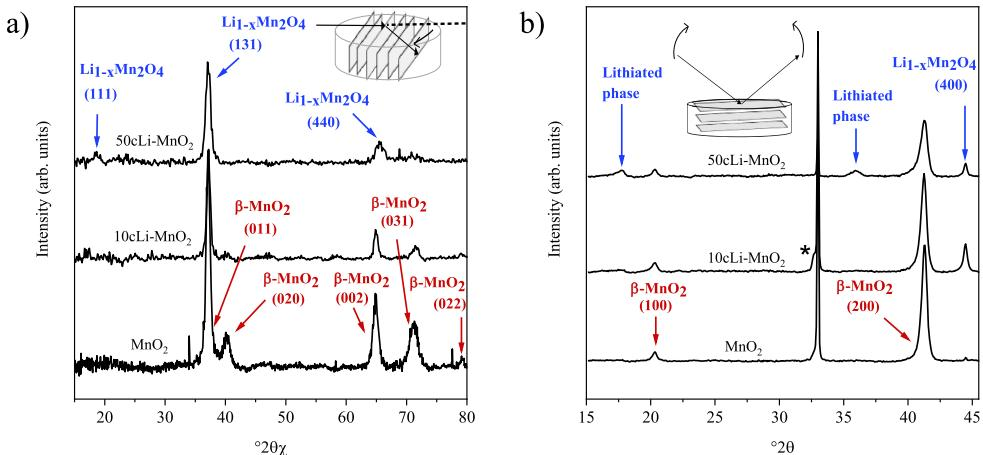  
Figure 3. XRD diffractograms of the samples  $\mathrm{MnO}_2 - 50\mathrm{Li} - \mathrm{MnO}_2$ . (a)  $2\theta_{\chi}$  and (b)  $\theta -2\theta$  measurements. The reflections are assigned to  $\mathrm{Li}_{1 - x}\mathrm{Mn}_2\mathrm{O}_4$  and  $\beta -\mathrm{MnO}_2$ . An impurity phase  $\mathrm{Li}_{2 - x}\mathrm{MnO}_2$  is marked with an asterisk. The insets clarify the measurement geometries. The graphs are shifted and the backgrounds have been subtracted.

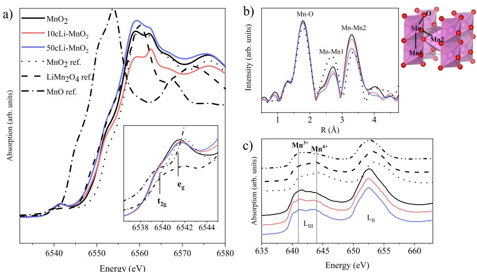  
Figure 4. (a) Mn K-edge XANES of samples  $\mathrm{MnO}_2$ ,  $10\mathrm{Li} - \mathrm{MnO}_2$ , and  $50\mathrm{Li} - \mathrm{MnO}_2$  measured in the TEY mode. (b) FT of the Mn K-edge EXAFS of the same samples. Crystal structures of  $\beta -\mathrm{MnO}_2$  (ICDD PDF 24-0735) visualized with the VESTA software. (c) Mn L-edge XANES measured in  $45^{\circ}$  incident angle. The graphs have been rescaled.

in Figure 3b). As shown later, the same reflection is visible in the  $100\mathrm{cLi - MnO}_2$  sample, and the  $200\mathrm{cLi - MnO}_2$  sample has a clear additional reflection at  $47.4^{\circ}$  in the in- plane  $2\theta_{\chi}$  diffractogram. These reflections are most likely caused by a lithium- rich  $\mathrm{Li}_{2 - z}\mathrm{MnO}_2$  (ICDD PDF 38- 1282) impurity phase, which has (100) reflection at  $32.5^{\circ}$  and (012) reflection at  $47.6^{\circ}$ .

Mn K- edge XANES was measured from every sample in the TEY and TFY (Supporting Information Figure S4) modes. The Mn K- edge EXAFS was measured in the TFY mode. TEY gives information only on the surface of the film, whereas TFY probes the whole film. Although the partially lithiated samples have evident compositional variation in their depth profiles (Figure 2), the TEY and TFY graphs looked surprisingly similar to each other.

The  $\mathrm{Mn - O}$ ,  $\mathrm{Mn - Mn1}$ , and  $\mathrm{Mn - Mn2}$  bonds are readily detected in the Mn K- edge EXAFS of  $\beta - \mathrm{MnO}_2$  and  $\mathrm{LiMn}_2\mathrm{O}_4$ . The  $\mathrm{Mn - O}$  distance means the bond length between Mn and O. The  $\mathrm{Mn - Mn1}$  distance is the shortest one between two manganese atoms in the centers of edge- sharing octahedrons, and  $\mathrm{Mn - Mn2}$  is the distance between the Mn atoms in the centers of the corner- sharing octahedrons in the  $\beta - \mathrm{MnO}_2$  structure. The longer  $\mathrm{Mn - Mn2}$  distance does not exist in the  $\mathrm{LiMn}_2\mathrm{O}_4$  structure.

The manganese K- edge XANES and XAFS measurements support the XRD results, showing that the samples  $\beta - \mathrm{MnO}_2 - 50\mathrm{cLi - MnO}_2$  have features comparable to the  $\beta - \mathrm{MnO}_2$  reference (Figure 4a,b). Immediate reduction of manganese occurs as soon as lithium is inserted, as the absorption edge shifts to lower energy in the Mn K- edge XANES (Figure 4a). The fine structures of the pre- edge regions of the samples resemble the  $\mathrm{MnO}_2$  powder reference (close- up in Figure 4a). The FT EXAFS spectra show that the samples have all the three peaks of  $\mathrm{Mn - O}$ ,  $\mathrm{Mn - Mn1}$ , and  $\mathrm{Mn - Mn2}$  visible in the same way as the  $\mathrm{MnO}_2$  reference (Figure 4b).

The L- edge XANES of Mn was studied in addition to the K- edge because the L- edge studies give direct information on the bonding in the samples. The L- edge XANES measures the absorption by the electric dipole- allowed transition from the 2p orbital to the unfilled 3d orbital of a transition metal resulting in an intense and feature- rich  $\mathrm{L_{II,III}}$ - edge XANES spectra. In comparison, the K- edge XAS measures the electric

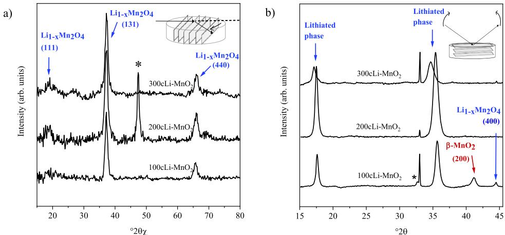  
Figure 5. XRD (a)  $2\theta_{\chi}$  and (b)  $\theta -2\theta$  measurements of the samples  $100\mathrm{cLi - MnO}_2 - 300\mathrm{cLi - MnO}_2$ . The reflections are assigned to  $\mathrm{Li}_{1 - x}\mathrm{Mn}_2\mathrm{O}_4$  and  $\beta -\mathrm{MnO}_2$ . An impurity phase  $\mathrm{Li}_{2 - z}\mathrm{MnO}_2$  is marked with an asterisk. The insets clarify the measurement geometries. The graphs are shifted and the backgrounds have been subtracted.

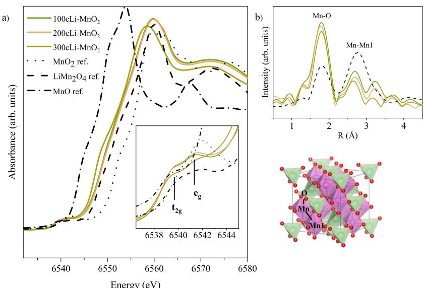  
Figure 6. (a) Mn K-edge XANES of samples  $100\mathrm{cLi - MnO}_2 - 300\mathrm{cLi - MnO}_2$  measured in TEY mode. (b) FT of the Mn K-edge EXAFS of the same samples. The crystal structure of  $\mathrm{LiMn}_2\mathrm{O}_4$  (ICDD PDF 35-0782) is visualized with the VESTA software.25

dipole- forbidden transition from the 1s orbital to the 3d orbital, and hence the pre- edge features in the K- edge XANES spectra are usually with lower intensity. The L- edge of Mn was measured at incident angles of  $0.5^{\circ}$ ,  $1^{\circ}$ , and  $45^{\circ}$ . The penetration depth of X- rays is dependent on both the photon energy and the incident angle of the X- ray beam. The measurement performed at the  $45^{\circ}$  incident angle probes the whole film depth, whereas the measurements done with the  $0.5^{\circ}$  and  $1^{\circ}$  incident angles are mostly surface- sensitive.

In the Mn L- edge XANES spectrum, the first region comes as a result of  $\mathrm{Mn}^{3 + }$  and the second one as a result of  $\mathrm{Mn}^{4 + }$ .35,36 When the bulk films are compared (Figure 4c), the reduction of Mn is again notable already from the  $10\mathrm{cLi - MnO}_2$  sample onward as the absorption increases at around  $641~\mathrm{eV}$ . Similar comparisons of the measurements done with the  $1^{\circ}$  and  $0.5^{\circ}$  incident angles are shown in Supporting Information Figure S5a,b.

Phase Change When the Average Composition Exceeds  $x = 0.5$  on  $\mathrm{Li}_x\mathrm{Mn}_2\mathrm{O}_4$ . Figure 5a,b show the in- plane  $2\theta_{\chi}$  and out- of- plane  $\theta - 2\theta$  measurements of the samples  $100\mathrm{cLi - MnO}_2 - 300\mathrm{cLi - MnO}_2$ . As seen from the TOF- ERDA results, in the samples  $200\mathrm{cLi - MnO}_2$  and  $300\mathrm{cLi - MnO}_2$ , lithium has penetrated throughout the whole film thickness. These samples do not anymore have the  $\beta - \mathrm{MnO}_2$  phase in the XRD patterns. The reflections from  $\beta - \mathrm{MnO}_2$  disappear even before the structure has reached the stoichiometric  $\mathrm{LiMn}_2\mathrm{O}_4$  composition.

The two reflections from the lithiated phase shift to lower  $2\theta$  values from  $17.7^{\circ}$  to  $17.1^{\circ}$  and from  $35.8^{\circ}$  to  $34.7^{\circ}$  as the concentration of lithium is increased. In all the samples, the  $d$ - spacing of the latter reflection is half of the first reflection, indicating that the reflection on the higher angle is a multiple of the first one. Yet another multiple of the peaks was detected at  $75.0^{\circ}$  with a  $d$ - spacing value of one- quarter of the first peak (see Supporting Information Figure S3). However, these peaks cannot be indexed to the cubic  $\mathrm{Li}_{1 - x}\mathrm{Mn}_2\mathrm{O}_4$  phase. It could be that the samples have a mixture of the cubic and some other lithiated phase, but because no additional phase was recognized in the in- plane diffractograms, even more probable is that the cubic crystal structure is distorted by stress and deformed in one dimension. In addition to stress, the films clearly contain microstrain which is evident from the much

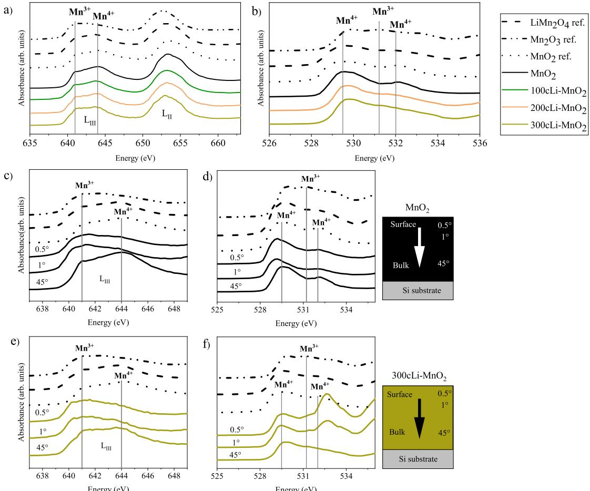  
Figure 7. Comparison of (a) Mn L-edge and (b) O K-edge XANES measured at an incident angle of  $45^{\circ}$ . (c) Mn L-edge XANES and (d) O K-edge XANES of the  $\mathrm{MnO_2}$  sample measured at incident angles of  $0.5^{\circ}$ ,  $1^{\circ}$ , and  $45^{\circ}$ . (e) Mn L-edge XANES and (f) O K-edge XANES of the  $300\mathrm{cLi - MnO_2}$  sample measured at incident angles of  $0.5^{\circ}$ ,  $1^{\circ}$ , and  $45^{\circ}$ . A higher incident angle probes deeper into the film as schematically shown on the right. The graphs have been rescaled.

larger full width at half- maximum (fwhm) of the reflection at the higher angle than the fwhm of the one at the lower angle. Stress and strain could break the  $Fd3m$  space group symmetry and unveil forbidden reflections. Still more studies are required to reach a complete and thorough phase identification of these samples.

The fine structures of the pre- edge of the Mn K- edge XANES of the samples  $100\mathrm{cLi - MnO_2}$  and  $200\mathrm{cLi - MnO_2}$  resemble that of the  $\mathrm{LiMn}_2\mathrm{O}_4$  reference (Figure 6a). In addition, the reduction of Mn is again noted as the absorption edge continues its shift to lower energy as the concentration of lithium is increased. The Mn K- edge EXAFS results of all the samples in Figure 6b show only the peaks  $\mathrm{Mn - O}$  and  $\mathrm{Mn - Mn1}$ . The absence of the  $\mathrm{Mn - Mn2}$  peak supports the XANES results, as it indicates that  $\mathrm{LiMn}_2\mathrm{O}_4$  is the dominant phase in these samples. The  $300\mathrm{cLi - MnO_2}$  sample has an overall different shape in the pre- edge region in the XANES spectra compared to the references and to the earlier published results on the shape of the K- edge for octahedrally coordinated transition metals; therefore, the environment around manganese is probably not octahedral in the  $300\mathrm{cLi - MnO_2}$  sample.

All the thin- film samples had their absorption edges at lower energies than that of the reference  $\mathrm{MnO_2}$  powder, and most of the lithiated samples had their absorption edges at lower energies than that of the reference  $\mathrm{LiMn}_2\mathrm{O}_4$  powder (Figure 6a). The peaks in the pre- edge region have also higher intensities compared to the references. The higher intensity most likely comes as a result of the JT- active  $\mathrm{Mn^{3 + }}$  ions; so, both features indicate that the average oxidation state of manganese in the samples is lower than  $+3.5$ .

The determination of the average oxidation state of manganese will be discussed later in detail, but the presence of the  $\mathrm{Mn^{3 + }}$  ions is noticeable in the EXAFS graphs as well because diminishing of the peaks  $\mathrm{Mn - O}$  and  $\mathrm{Mn - Mn1}$  occurs as a result of the increasing local distortion around the manganese atoms (Figure 6b). Also, the  $\mathrm{Mn - O}$  bond length seems to increase slightly as the concentration of Li increases in the samples. The lengthening of the bond can occur because of the reduction of  $\mathrm{Mn^{4 + }}$  to  $\mathrm{Mn^{3 + }}$ , as the ionic radius of the manganese cation increases and the JT- active  $\mathrm{Mn^{3 + }}$  can distort the structure and thereby lengthen the  $\mathrm{Mn - O}$  bond even further.

The electrons on the  $2\mathrm{p}$  orbitals of oxygen participating in the bonding in the  $\mathrm{Mn - O}$  octahedral and therefore the oxygen K- edge XANES, which probe the electric dipole- allowed  $1\mathrm{s} \rightarrow 2\mathrm{p}$  transition of oxygen, make an interesting addition to the Mn L- edge XAS measurements. The oxygen K- edge was measured for the  $\mathrm{MnO_2}$ ,  $200\mathrm{cLi - MnO_2}$ ,  $300\mathrm{cLi - MnO_2}$ ,  $200\mathrm{cLi - MnO_2 - 600}$ , and  $300\mathrm{cLi - MnO_2 - 600}$  samples at  $0.5^{\circ}$ ,  $1^{\circ}$ , and  $45^{\circ}$  incident angles.

Both the Mn L- edge and the O K- edge XANES of the  $100\mathrm{cLi - MnO_2 - 300\mathrm{cLi - MnO_2}}$  samples have features that show the presence of  $\mathrm{Mn^{3 + }}$  in the film bulk (Figure 7a,b). In

the literature of the Mn L- edge XANES on  $\mathrm{LiMn}_2\mathrm{O}_{4},$  mostly  $\mathrm{Mn^{4 + }}$  was found,40 but the samples as well as the  $\mathrm{MnO}_2,$ $\mathrm{Mn}_2\mathrm{O}_3,$  and  $\mathrm{LiMn}_2\mathrm{O}_4$  reference powders measured here showed different fine structures compared to the literature results.40- 43 The literature data were however measured in the TEY mode and are thus surface- sensitive, whereas our data were measured in the TFY mode and are thus bulk- sensitive. The results of the Mn L- edge and O K- edge XANES measured at  $0.5^{\circ}$  and  $1^{\circ}$  incident angles are presented in Supporting Information Figures S5 and S6.

All the samples, even  $\mathrm{MnO}_2,$  show  $\mathrm{Mn^{3 + }}$  features on the surface of the film in both the Mn L- edge and in the O K- edge XANES  $\mathrm{MnO}_2$  sample in Figure 7c,d and  $300\mathrm{cL}i - \mathrm{MnO}_2$  in Figure 7e,f). These features can be exhibited because of the surface contamination or oxygen vacancies that result in a reduced octahedral symmetry of oxygen atoms at the surface.44 The  $300\mathrm{cL}i - \mathrm{MnO}_2$  sample also has an additional resonance at around  $532\mathrm{eV}$  in the O K- edge XANES (Figure 7f). On the basis of the peak shape, the manganese and oxygen atoms do not form an octahedron. The sample may have carbon contamination because according to the literature the K- edge of oxygen bonded to carbon has features similar to that of the surface of the  $300\mathrm{cL}i - \mathrm{MnO}_2$  sample.45 However, because TOF- ERDA shows a low carbon content, the odd fine structure could be a result of oxygen vacancies on the very surface of the film.

The amount of  $\mathrm{Mn^{4 + }}$  and  $\mathrm{Mn^{3 + }}$  in the film bulk was roughly estimated by calculating the different linear combinations of the  $\mathrm{Mn^{4 + }}$  and  $\mathrm{Mn^{3 + }}$  references and comparing them to the measured Mn  $\mathrm{L_{III}}$  - edge XANES (Figure 8). The  $\mathrm{MnO}_2$  sample resembles the  $\mathrm{Mn^{4 + }}$  reference, as expected, and so do the  $10\mathrm{cL}i - \mathrm{MnO}_2$  and  $50\mathrm{cL}i - \mathrm{MnO}_2$  samples. The  $100\mathrm{cL}i - \mathrm{MnO}_2$  and  $200\mathrm{cL}i - \mathrm{MnO}_2$  samples match the reference calculated with the  $\mathrm{Mn^{4 + } / Mn^{3 + }}$  ratio of  $80\% /20\%$  . The  $300\mathrm{cL}i - \mathrm{MnO}_2$  sample resembles mostly the reference where the ratio of  $\mathrm{Mn^{4 + } / Mn^{3 + }}$  is  $60\% /40\%$  which is in line with the expectation for this sample with the almost stoichiometric composition of  $\mathrm{Li}_{1.1}\mathrm{Mn}_2\mathrm{O}_4$

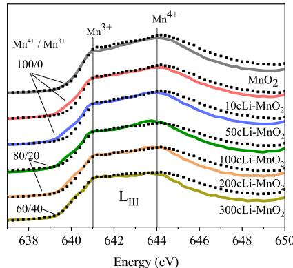  
Figure 8. Mn  $\mathrm{L_{III}}$  -edge XANES of the samples (solid lines) compared to the linear combinations of  $\mathrm{Mn^{4 + }}$  and  $\mathrm{Mn^{3 + }}$  references (dotted lines). The graphs have been rescaled.

Effect of Annealing. After 300 ALD cycles of  $\mathrm{LiO^{\prime}Bu - }$ $\mathrm{H}_2\mathrm{O}_r$  the films have a remarkably high compressive stress of  $2300\mathrm{MPa}_i$  which is thought to cause a peak shift in the  $\theta - 2\theta$  measurements. After annealing at  $600^{\circ}C$  for  $10~\mathrm{min}$  the diffraction patterns of  $200\mathrm{cL}i - \mathrm{MnO}_2\cdot 600$  and  $300\mathrm{cL}i - \mathrm{MnO}_2$  600 match better with the stoichiometric cubic  $\mathrm{LiMn}_2\mathrm{O}_4$  reference (ICDD PDF 35- 0782) than with the lithium- deficient  $\mathrm{Li}_{1 - x}\mathrm{Mn}_2\mathrm{O}_4$  reference (Figure 9). The in- plane  $2\theta_{\chi}$  measurements show how a very clear (111) reflection appears at  $18.5^{\circ}$  and the already existing peaks shift toward lower angles and thereby match better with the reflections of the reference (Figure  $9\mathrm{a},\mathrm{c}$  . The two out- of- plane reflections have shifted to higher  $2\theta$  angles and can now be indexed well as (111) and (311) of the  $\mathrm{LiMn}_2\mathrm{O}_4$  phase (Figure  $9\mathrm{b},\mathrm{d}$

In the  $200\mathrm{cL}i - \mathrm{MnO}_2\cdot 600$  sample, the reflections of the  $\mathrm{MnO}_2$  phase become visible again after annealing (Figure 9b). Similar behavior was not noticed for the  $300\mathrm{cL}i - \mathrm{MnO}_2\cdot 600$  sample. It had, however, an additional reflection at  $32.6^{\circ}$  (marked with an asterisk in Figure 9d), which is thought to be caused by the earlier discussed impurity phase  $\mathrm{Li}_{2 - z}\mathrm{MnO}_2$  Annealing at a temperature higher than that used in the lithium intercalation enables the structure to overcome diffusion energy barriers, which in our samples results in a more complete  $\mathrm{LiMn}_2\mathrm{O}_4$  crystal structure, but on the other hand also to the recurrence of additional  $\mathrm{MnO}_2$  and  $\mathrm{Li}_{2 - z}\mathrm{MnO}_2$  phases.

The Mn K- edge XANES measured in the TEY mode for the annealed samples are shown in Figure 10a,b. (See Supporting Information Figure S4 for the TFY spectra of the annealed samples). The  $200\mathrm{cL}i - \mathrm{MnO}_2\cdot 400$  not- shown) and  $200\mathrm{cL}i-$ $\mathrm{MnO}_2\cdot 600$  (Figure 10a) samples did not have major differences compared to the corresponding unannealed sample. The absorption edge shifted to lower values, but the pre- edge region remained similar in both samples. The Mn K- edge EXAFS spectrum of the  $200\mathrm{cL}i - \mathrm{MnO}_2\cdot 600$  sample resembles the reference  $\mathrm{LiMn}_2\mathrm{O}_4$  even better than the corresponding unannealed  $200\mathrm{cL}i - \mathrm{MnO}_2$  sample (Figure 10c). This result agrees well with XRD in that the annealing completes the phase change.

In the  $300\mathrm{cL}i - \mathrm{MnO}_2\cdot 600$  sample, the  $\mathrm{e_g}$  resonance has diminished and the pre- edge region resembles more of the  $\mathrm{MnO}$  reference in the Mn K- edge XANES (Figure 10b). The effect seems to be stronger on the surface of the film (TEY), but it is notable in the bulk measurements (TFY) as well. The sample also has an additional resonance at around  $3.5\mathrm{\AA}$  in the Mn K- edge EXAFS (Figure 10d), which should not appear for octahedrally coordinated Mn in the spinel  $\mathrm{LiMn}_2\mathrm{O}_4$  structure. If the impurity phase was  $\mathrm{Li}_{2 - z}\mathrm{MnO}_2$  as suggested earlier, the oxidation state of Mn would be close to  $+2$  . This would explain the similarity of the pre- edge to the  $\mathrm{MnO}$  reference in the K- edge XANES and also the unexpected local structure in the K- edge EXAFS.

Annealing seems to remove the  $\mathrm{Mn^{3 + }}$  features in the fine structure of the Mn L- edge XANES as well as that of the O K- edge XANES (Figure  $10\mathrm{c},\mathrm{f})$  . In both cases, the spectra resemble the  $\mathrm{LiMn}_2\mathrm{O}_4$  reference.

Average Oxidation State of Manganese. The determination of the average oxidation state of manganese was attempted from the XANES results.59 The energy shifts of several absorption features measured from the reference samples were plotted against the formal oxidation states of manganese. As a result, the half- height of the absorption edge showed the best linear correlation with the oxidation state and was used for determining the average oxidation states in the samples. The analysis was done from both the TEY and TFY measurements, and the oxidation states were similar or at least within the measurement error (see Supporting Information Figure S7 for more details).

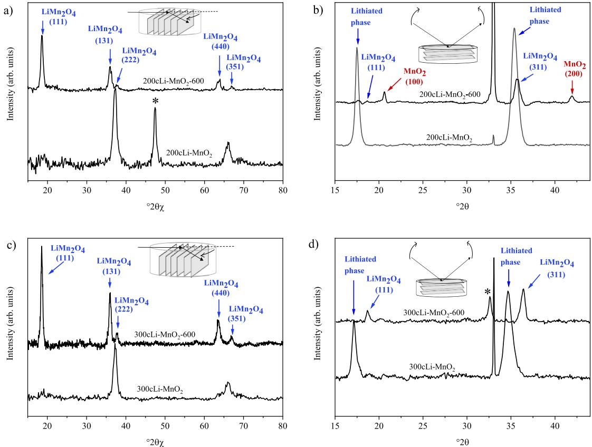  
Figure 9. XRD diffractograms of  $200\mathrm{cLi - MnO_2 - 600}$  a  $2\theta_{\chi}$  and (b)  $\theta -2\theta_{j}$  and  $300\mathrm{cLi - MnO_2 - 600}$  c  $2\theta_{\chi}$  and (d)  $\theta -2\theta_{j}$  compared to the corresponding unannealed samples. The reflections are assigned to  $\mathrm{LiMn}_2\mathrm{O}_4$  An impurity phase  $\mathrm{Li}_{2 - x}\mathrm{MnO}_2$  is marked with an asterisk. The graphs are rescaled and have subtracted backgrounds.

The oxidation states show a clear decreasing trend from around  $+3.7$  to around  $+2.5$  as the lithium concentration is increasing (Figure 11). Although the trend is as expected, the measured oxidation states are unrealistically low. However, in addition to the valence of the absorbing atom, structural variations, ligand type, geometry, coordination number, bond lengths, and the covalent or ionic character of the bonds are known to have effects on the chemical shifts in the absorption spectra, which might affect the results and cause the unrealistically low oxidation states.46- 49 The very low oxidation states of  $300\mathrm{cLi - MnO_2}$  and  $300\mathrm{cLi - MnO_2 - 600}$  could arise from some unexpected behavior related to  $300\mathrm{cLi - }$ $\mathrm{MnO}_2,$  which was also noticed earlier in the shape of the XAS spectrum. More accurate estimation of the oxidation state would require additional studies of the local magnetic properties and site symmetries of manganese, which remains for now beyond the scope of this study.

The determination of the oxidation states was also attempted from the average  $\mathrm{Mn - O}$  bond lengths obtained from the EXAFS results. The analysis was based on the bond valence model50,51 where the oxidation state of an ion is correlated to the nearest neighbor distance in the metal- ligand bond. The oxidation states determined by this method varied in the range of  $+4$  to  $+3.5,$  but without any correlation to the lithium concentration.

Proposed Mechanism for the  $\mathbf{Li}^{+}$  Ion Intercalation. The present results indicate that upon lithiation of the ALDMnO2 film, the phase change seems to take place via one spinel lithium manganese oxide phase  $\mathrm{Li}_{1 - x}\mathrm{Mn}_2\mathrm{O}_4$  to another one  $\mathrm{LiMn}_2\mathrm{O}_4$  In the beginning of the lithium insertion, that is, in the samples  $10\mathrm{cLi - MnO}_2$  and  $50\mathrm{cLi - MnO}_2,$  lithium pene

trated only to the top part of the films where the phase changed to  $\mathrm{Li}_{1 - x}\mathrm{Mn}_2\mathrm{O}_4$  The K absorption edge of Mn shifted to a higher energy as soon as lithium was inserted, which is a result of immediate reduction of  $\mathrm{Mn^{4 + }}$  to  $\mathrm{Mn^{3 + }}$  . The reduction from  $\mathrm{Mn^{4 + }}$  to  $\mathrm{Mn^{3 + }}$  was notable in the fine structure of the Ledge XANES of Mn as well. At this stage, the fine structure of the Mn K- edge XANES still resembled that of  $\beta - \mathrm{MnO}_2$  .The EXAFS of Mn K- edge showed all three bonds  $\mathrm{Mn - O}$  MnMn1, and  $\mathrm{Mn - Mn2}$  that are characteristic for  $\beta - \mathrm{MnO}_2$

When the lithium insertion proceeded and the stoichiometry exceeded  $x = 0.5$  in  $\mathrm{Li}_x\mathrm{Mn}_2\mathrm{O}_4,$  the out- of- plane orientation of the lithiated phase changed as strong reflections appeared in the  $\theta - 2\theta$  XRD measurements. The TOF- ERDA depth profiles revealed that in this state lithium had diffused throughout the whole film thickness. Features of  $\mathrm{LiMn}_2\mathrm{O}_4$  started to appear in the fine structure of Mn K- edge XANES in the sample  $100\mathrm{cLi - MnO}_2$  and onward. The Mn K- edge EXAFS of the samples  $100\mathrm{cLi - MnO}_2 = 300\mathrm{cLi - MnO}_2$  showed only the bonds between Mn and O and the Mn- Mn1 distance, which are related to the spinel  $\mathrm{LiMn}_2\mathrm{O}_4$  After annealing at 600  $^\circ \mathrm{C},$  the samples were phase- pure  $\mathrm{LiMn}_2\mathrm{O}_4$  according to XRD.

It has been noted in the intercalation studies on powders that as soon as lithium intercalates to  $\beta - \mathrm{MnO}_2,$  manganese reduces from  $\mathrm{Mn^{4 + }}$  to  $\mathrm{Mn^{3 + }}$  37,41,42,52- 60 The first intercalation site of lithium is sharing the edges of oxygen octahedron with the  $\mathrm{Mn^{3 + }}$  ions. This intercalation site causes a strong repulsive force and pushes the oxide ions to the cubic close- packed structure, manganese cations to the octahedral 16d interstitial sites, and lithium into the 8a interstitial site, where it is tetrahedrally coordinated. In this structure, the oxygen tetrahedron around the  $\mathrm{Li^{+}}$  ion is only sharing corners with

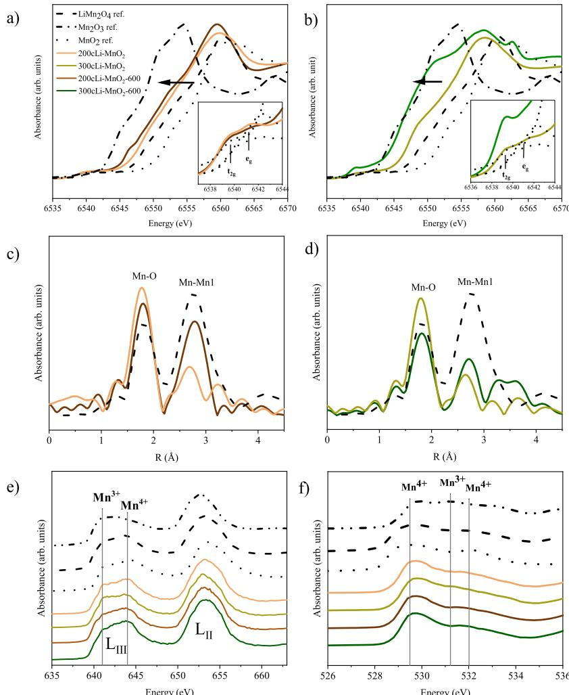  
Figure 10. Mn K-edge XANES of (a) annealed  $200\mathrm{cLi - MnO_2}$  -600 sample compared to the corresponding unannealed one and (b)  $300\mathrm{cLi - }$ $\mathrm{MnO}_2\cdot$  -600 sample compared to the corresponding unannealed one. Mn K-edge EXAFS of (c)  $200\mathrm{cLi - MnO_2}$  -600 sample and the corresponding unannealed one and (d)  $300\mathrm{cLi - MnO_2}$  -600 sample with the corresponding unannealed one. Comparison of (e) Mn K-edge XANES and (f) O Kedge XANES measurements done in  $45^{\circ}$  incident angle. The graphs have been rescaled.

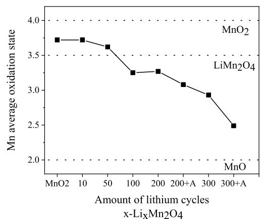  
Figure 11. Average oxidation state of manganese determined from the TEY XANES (black squares).

the oxygen octahedron around the  $\mathrm{Mn}^{3 + }$  ions and is hence energetically a more favorable structure.

The proposed mechanism for the intercalation of  $\mathrm{Li^{+}}$  ions to  $\beta - \mathrm{MnO}_2$  thin films in this study is as follows. When the lithium concentration is low, that is, when the stoichiometry is  $x< 0.5$  in  $\mathrm{Li}_x\mathrm{Mn}_2\mathrm{O}_4,$  the lithium ions are distributed only in the surface part of the film, and the phase in this part changes to  $\mathrm{Li}_{1 - x}\mathrm{Mn}_2\mathrm{O}_4$  In the rest of the film, the crystal structure resembles still  $\beta - \mathrm{MnO}_2$  When the lithium insertion is continued and  $x\approx 0.5,$  the phase of the manganese oxide framework appears to change from  $\beta - \mathrm{MnO}_2$  to spinel  $[\mathrm{Mn}_2\mathrm{O}_4]$  .The phase change occurs even before the composition of the film reaches the stoichiometric spinel  $\mathrm{LiMn}_2\mathrm{O}_4$  composition, that is, before  $300\mathrm{LiO}^t\mathrm{Bu - H}_2\mathrm{O}$  ALD cycles, presumably because  $\beta - \mathrm{MnO}_2$  can accept only a certain amount of  $\mathrm{Li^{+}}$  ions to its square channels, whereas in spinel  $[\mathrm{Mn}_2\mathrm{O}_4]$ $\mathrm{Li^{+}}$  ions can intercalate via a three- dimensional manganese oxide framework. The phase change enables  $\mathrm{Li^{+}}$  ions to intercalate throughout the whole film, but it is not until the samples are annealed that the phase changes completely to phase- pure  $\mathrm{LiMn}_2\mathrm{O}_4$  This is because the annealing enables lithium to overcome the diffusion energy barriers and to complete the  $\beta - \mathrm{MnO}_2 / \mathrm{LiMn}_2\mathrm{O}_4$  phase change.

# CONCLUSIONS

In this work, the intercalation mechanism of  $\mathrm{Li^{+}}$  ions to  $\mathrm{MnO}_2$  thin films was studied. The films were deposited by ALD in two steps: first,  $\mathrm{MnO}_2$  films were deposited starting from  $\mathrm{Mn(thd)}_3$  and  $\mathrm{O}_3$  and second, lithium was intercalated by pulsing  $\mathrm{LiO}^t\mathrm{Bu}$  and  $\mathrm{H}_2\mathrm{O}$  on top of the  $\mathrm{MnO}_2$  films. The phase

change and lithium intercalation were studied by preparing a set of samples with increasing lithium concentration from  $\mathrm{Li_{0.025}Mn_{2.1}O_4}$  to  $\mathrm{Li_{1.1}Mn_2O_4}$ . The samples were studied with XAS, XRD, XRR, TOF- ERDA, and residual stress measurements. On the basis of the results, a stepwise model was proposed for the lithium intercalation. Before the lithium concentration reaches  $x \approx 0.5$  in  $\mathrm{Li_xMn_2O_4}$  ( $< 100\mathrm{LiO}^{\prime}\mathrm{Bu} - \mathrm{H}_2\mathrm{O}$  ALD cycles), the samples are mixtures of  $\beta - \mathrm{MnO}_2$  and  $\mathrm{Li_{1 - x}Mn_2O_4}$ , and after further lithium insertion, the manganese oxide network changes from the tetragonal pyrolusite to the cubic spinel, which enables lithium to penetrate throughout the whole film and the material to achieve the stoichiometric  $\mathrm{LiMn_2O_4}$  structure. Annealing at  $600^{\circ}\mathrm{C}$  for  $10\mathrm{min}$  under  $\mathrm{N}_2$  gas completes the phase change.

# ASSOCIATED CONTENT

# $\circledcirc$  Supporting Information

The Supporting Information is available free of charge on the ACS Publications website at DOI: 10.1021/acs.jpcc.9b03039.

roughness analysis by XRR, phase analysis by XRD, Mn K- edge XANES, Mn L- edge XANES, O K- edge XANES, and oxidation state of Mn determined from Mn K- edge XANES TFY (PDF)

# AUTHOR INFORMATION

Corresponding Author \*E- mail: mikko.ritala@helsinki.fi.

# ORCID

Heta- Elisa Nieminen: 0000- 0003- 1361- 3829 Laura Simonelli: 0000- 0001- 5331- 0633 Mikko Ritala: 0000- 0002- 6210- 2980

# Present Addresses

Beneq Oy, P.O. Box 4, FI- 02201 Espoo, Finland. Electrochemical Energy Conversion Group, Department of Chemistry and Materials Science, School of Chemical Engineering, Aalto University, P.O. Box 16100, FI- 00076 Aalto, Finland. Aalto University, P.O. Box 16100, FI- 00076 Aalto, Finland.

# Author Contributions

V.M and 
M.R. planned and supervised the project. 
V.M. and 
H.E.N. performed the sample preparation and analysis. 
D.S., 
L.S., and 
A.P.H. contributed to the conduction of the Mn Kedge XANES and EXAFS measurements and to the analysis and interpretation of the data. 
P.H., 
C.Z., 
Y.K., and 
B.B. performed the Mn L-edge and O K-edge XANES measurements and contributed to their analysis and interpretation. 
S.H. supervised the XAS measurements and the analysis of the data overall. 
M.J.H. contributed to the XRD measurements and to the analysis of the data. 
K.M. performed the TOF-ERDA measurements and carried out the data analysis. 
O.M.E.Y. performed the wafer curvature measurements and the residual stress analysis. 
K.M. performed XPS measurements and carried out the data analysis. All authors took part in the discussion of the results as well as to the writing process of the manuscript and have given approval to the final version of the manuscript.

# Funding

The work has been supported by the Finnish Centre of Excellence in ALD and COST Action MP1402 HERALD: Hooking together European research in ALD.

# Notes

The authors declare no competing financial interest.

# ACKNOWLEDGMENTS

The research has been conducted within the Finnish Centre of Excellence in ALD. Mn K- edge XANES and EFAXS experiments were performed at CLAXS beamline at ALBA Synchrotron with the collaboration of ALBA staff.

# REFERENCES

(1) Oudenhoven, J. F. M.; Baggetto, L.; Matken, P. H. L. All-solid-state Lithium-ion Microbatteries: A Review of Various Three-dimensional Concepts. Adv. Energy Mater. 2011, 1, 10-33. 
(2) Roberts, M.; Johns, P.; Owen, J.; Brandell, D.; Edstrom, K.; El Enany, G.; Guery, C.; Golodnitsky, D.; Lacey, M.; Lecoeur, C.; et al. 3D lithium ion batteries-from fundamentals to fabrication. J. Mater. Chem. 2011, 21, 9876-9890. 
(3) Golodnitsky, D.; Nathan, M.; Yufie, V.; Strauss, E.; Freedman, K.; Burstein, L.; Gladkich, A.; Peled, E. Progress in Three-dimensional (3D) Li-ion Microbatteries. Solid State Ionics 2006, 177, 2811-2819. 
(4) Munshi, M. Handbook of Solid State Batteries and Capacitors; World Scientific Publishing Co. Pvt Ltd., 1995. 
(5) Ritala, M.; Niinisto, J. Chemical Vapor Deposition: Precursors, Processes and Applications, Chapter 4 Atomic Layer Deposition; The Royal Society of Chemistry, 2008; Vol. 158. 
(6) Knez, M.; Nielsch, K.; Niinisto, L. Synthesis and Surface Engineering of Complex Nanostructures by Atomic Layer Deposition. Adv. Mater. 2007, 19, 3425-3438. 
(7) Mattelaer, F. Atomic Layer Deposition for Lithium Ion Batteries; Ghent University, Department of Solid State Sciences, 2017. 
(8) Haghi, A. K.; Zachariah, A. K.; Kalandrakal, N. Nanomaterials: Synthesis, Characterization, and Applications; Apple Academic Press Inc.: Canada, 2013. 
(9) Sharma, N.; Yu, D.; Zhu, Y.; Wu, Y.; Peterson, V. K. Nonequilibrium Structural Evolution of the Lithium-rich Li1+yMn2O4 Cathode Within a Battery. Chem. Mater. 2013, 25, 75-4. 
(10) Berg, H.; Goransson, K.; Nolang, B.; Thomas, J. O. Electronic Structure and Stability of the LiMn2O4  $(0 < x < 2)$  system. J. Mater. Chem. 1999, 9, 2813. 
(11) Dahlin, G. R.; Strom, K. E. Lithium Batteries: Research, Technology and Applications; Nova Science Publishers, Incorporated: Hauppauge, 2010. 
(12) Tarascon, J. M.; Guyomard, D. The Li1+xMn2O4/C Rockingchair System: A Review. Electrochim. Acta 1993, 38, 1221-1231. 
(13) Thackeray, M. M. Manganese Oxides for Lithium Batteries. Prog. Solid State Chem. 1997, 25, 1-71. 
(14) Gummow, R. J.; de Kock, A.; Thackeray, M. M. Improved Capacity Retention in Rechargeable 4 V Lithium/Lithium-manganese Oxide (Spinel) Cells. Solid State Ionics 1994, 69, 59-67. 
(15) Yamada, A.; Tanaka, M. Jahn-Teller Structural Phase Transition Around 280K in LiMn2O4. Mater. Res. Bull. 1995, 30, 715-721. 
(16) Wills, A. S.; Raju, N. P.; Greedan, J. E. Low-Temperature Structure and Magnetic Properties of the Spinel LiMn2O4: A Frustrated Antiferromagnet and Cathode Material. Chem. Mater. 1999, 11, 1510-1518. 
(17) Masquelier, C.; Tabuchi, M.; Ado, K.; Kanno, R.; Kobayashi, Y.; Maki, Y.; Nakamura, O.; Goodenough, J. B. Chemical and Magnetic Characterization of Spinel Materials in the LiMn2O4- Li2Mn4O9-Li4Mn5O12System. J. Solid State Chem. 1996, 123, 255-266. 
(18) Rodríguez-Carvajal, J.; Rousse, G.; Masquelier, C.; Hervieu, M. Electronic Crystallization in a Lithium Battery Material: Columnar Ordering of Electrons and Holes in the SpinelLiMn2O4. Phys. Rev. Lett. 1998, 81, 4660. 
(19) Tomeno, I.; Kasuya, Y.; Tsudona, Y. Charge and Spin Ordering in LiMn2O4. Phys. Rev. B: Condens. Matter Mater. Phys. 2001, 64, 094422. 
(20) Takada, T.; Hayakawa, H.; Enoki, H.; Akiba, E.; Slegr, H.; Davidson, I.; Murray, J. Structure and electrochemical characterization of Li1+xMn2-xO4 spinels for rechargeable lithium batteries. J. Power Sources 1999, 81-82, 505-509.

(21) Oikawa, K.; Kamiyama, T.; Izumi, F.; Chakoumakos, B. C.; Ikuta, H.; Wakihara, M.; Li, J.; Matsui, Y. Structural Phase Transition of the Spinel-Type Oxide LiMn2O4. Solid State Ionics 1998, 109, 35-41.  
(22) Rousse, G.; Masquelier, C.; Rodríguez-Carvajal, J.; Elkaim, E.; Lauriat, J.-P.; Martinez, J. L. X-ray Study of the Spinel LiMn2O4at Low Temperatures. Chem. Mater. 1999, 11, 3629-3635.  
(23) Ouyang, C. Y.; Shi, S. Q.; Lei, M. S. Jahn-Teller distortion and electronic structure of LiMn2O4. J. Alloys Compd. 2009, 474, 370-374.  
(24) Miikkulainen, V.; Ruud, A.; Østreng, E.; Nilsen, O.; Laitinen, M.; Sajavaara, T.; Fjellvag, H. Atomic Layer Deposition of Spinel Lithium Manganese Oxide by Film-Body-Controlled Lithium Incorporation for Thin-film Lithium Ion Batteries. J. Phys. Chem. C 2014, 118, 1258-1268.  
(25) Momma, K.; Izumi, F. VESTA 3 for Three-dimensional Visualization of Crystal, Volumetric and Morphology data. J. Appl. Crystallogr. 2011, 44, 1272.  
(26) Aaltonen, T.; Nilsen, O.; Magrasó, A.; Fjellvag, H. Atomic Layer Deposition of Li2O-Al2O3Thin Films. Chem. Mater. 2011, 23, 4669-4675.  
(27) Comstock, D. J.; Elam, J. W. Mechanistic Study of Lithium Aluminum Oxide Atomic Layer Deposition. J. Phys. Chem. C 2013, 117, 1677-1683.  
(28) Kozen, A. C.; Pearse, A. J.; Lin, C.-F.; Schroeder, M. A.; Noked, M.; Lee, S. B.; Rubloff, G. W. Atomic Layer Deposition and In Situ Characterization of Ultraclean Lithium Oxide and Lithium Hydroxide. J. Phys. Chem. C 2014, 118, 27749-27753.  
(29) Nilsen, O.; Fjellvag, H.; Kjekshus, A. Growth of Manganese Oxide Thin Films by Atomic Layer Deposition. Thin Solid Films 2003, 444, 44-51.  
(30) Simonelli, L.; Marini, C.; Olszewski, W.; Pérez, M. A.; Ramanan, N.; Guilera, G.; Cuartero, V.; Klementiev, K. CLESS: The Hard X-ray Absorption Beamline of the ALBA CELLS Synchrotron. Cogent Phys. 2016, 3, 1231987.  
(31) Senf, F.; Flechsig, U.; Eggenstein, F.; Gudat, W.; Klein, R.; Rabus, H.; Ulm, G. A Plane-grating Monochromator Beamline for the PTB Undulators at BESSY II. J. Synchrotron Radiat. 1998, 5, 780.  
(32) Lubeck, J.; Beckhoff, B.; Fliegauf, R.; Holfelder, I.; Honicke, P.; Müller, M.; Pollakowski, B.; Reinhardt, F.; Weser, J. A Novel Instrument for Quantitative Nanoanalytics Involving Complementary X-ray Methodologies. Rev. Sci. Instrum. 2013, 84, 045106.  
(33) Oyama, S. T. Chemical and Catalytic Properties of Ozone. Catal. Rev. 2000, 42, 279-322.  
(34) Nilsen, O.; Foss, S.; Fjellvag, H.; Kjekshus, A. Effect of Substrate on the Characteristics of Manganese (IV) Oxide Thin Films Prepared by Atomic Layer Deposition. Thin Solid Films 2004, 468, 65-74.  
(35) Chen, J. G. NEXAFS Investigations of Transition Metal Oxides, Nitrides, Carbides, Sulfides and Other Interstitial Compounds. Surf. Sci. Rep. 1997, 30, 1-152.  
(36) de Groot, F. M. F.; Hu, Z. W.; Lopez, M. F.; Kaindl, G.; Guillot, F.; Tronc, M. Differences between L3 and L2 x-ray absorption spectra of transition metal compounds. J. Chem. Phys. 1994, 101, 6570-6576.  
(37) Horne, C. R.; Bergmann, U.; Grush, M. M.; Perera, R. C. C.; Ederer, D. L.; Calcott, T. A.; Cairns, E. J.; Cramer, S. P. Electronic Structure of Chemically-Prepared LiXm2O4Determined by Mn X-ray Absorption and Emission Spectroscopies. J. Phys. Chem. B 2000, 104, 9587-9596.  
(38) Pickering, I. J.; George, G. N.; Lewandowski, J. T.; Jacobson, A. J. Nickel K-edge X-ray Absorption Fine Structure of Lithium Nickel Oxides. J. Am. Chem. Soc. 1993, 115, 4137-4144.  
(39) Settipani, D. ALD-Grown Cathode Material for Thin-film Li-ion Batteries: Structural and Electronic Analysis of Lithium Manganese Oxide Spinel  $\left(\mathrm{Li}_{x}\mathrm{Mn}_{2}\mathrm{O}_{4}\right)$  by X-ray Absorption Spectroscopy. M.S. Thesis, University of Rennes, 2017.  
(40) Liu, R. S.; Jang, L. Y.; Chen, J. M.; Tsai, Y. C.; Hwang, Y. D.; Liu, R. G. X-ray Absorption Studies in Spinel-type LiMn2O4. J. Solid State Chem. 1997, 128, 326-329.

(41) Okumura, T.; Fukutsuka, T.; Matsumoto, K.; Orikasa, Y.; Arai, H.; Ogumi, Z.; Uchimoto, Y. Role of Local and Electronic Structural Changes with Partially Anion Substitution Lithium Manganese Spinel Oxides on Their Electrochemical Properties: X-ray Absorption Spectroscopy Study. Dalton Trans. 2011, 40, 9752.  
(42) Zhuo, Z.; Olalde-Velasco, P.; Chin, T.; Battaglia, V.; Harris, S. J.; Pan, F.; Yang, W. Effect of Excess Lithium in LiMn2O4 and Li1.15Mn1.85O4 Electrodes Revealed by Quantitative Analysis of Soft X-ray Absorption Spectroscopy. Appl. Phys. Lett. 2017, 110, 093902.  
(43) Yoon, W.-S.; Chung, K.-Y.; Oh, K.-H.; Kim, K.-B. Changes in Electronic Structure of the Electrochemically Li-ion Deintercalated LiMn2O4 System Investigated by Soft X-ray Absorption Spectroscopy. J. Power Sources 2003, 119-121, 706-709.  
(44) Ouyang, C. Y.; Zeng, X. M.; Slijvancanin, Z.; Baldereschi, A. Oxidation States of Mn Atoms at Clean and Al2O3-covered LiMn2O4(001) Surfaces. J. Phys. Chem. C 2010, 114, 4756-4759.  
(45) Kim, K.; Zhu, P.; Li, N.; Ma, X.; Chen, Y. Characterization of Oxygen Containing Functional Groups on Carbon Materials with Oxygen K-edge X-ray Absorption Near Edge Structure Spectroscopy. Carbon 2011, 49, 1745-1751.  
(46) Luo, K.; Roberts, M. R.; Hao, R.; Guerrini, N.; Pickup, D. M.; Liu, Y.-S.; Edström, K.; Guo, J.; Chadwick, A. V.; Duda, L. C.; et al. Charge-compensation in 3d-transition-metal-oxide Intercalation Cathodes Through the Generation of Localized Electron Holes on Oxygen. Nat. Chem. 2016, 8, 684-691.  
(47) Koga, H.; Croguennec, L.; Menétrier, M.; Mannessiez, P.; Weill, F.; Delmas, C.; Belin, S. Operando X-ray Absorption Study of the Redox Processes Involved Upon Cycling of the Li-rich Layered Oxide Li1.20Mn0.54Co0.13Ni0.13O2 in Li Ion Batteries. J. Phys. Chem. C 2014, 118, 5700-5709.  
(48) Teo, B. K. EXAFS: Basic Principles and Data Analysis; Springer Science & Business Media, 2012.  
(49) Zhou, D.; Jia, H.; Rana, J.; Placke, T.; Scherb, T.; Kloepisch, R.; Schumacher, G.; Winter, M.; Banhart, J. Local structural changes of nano-crystalline ZnFe 2 O 4 during lithiation and de-lithiation studied by X-ray absorption spectroscopy. Electrochim. Acta 2017, 246, 699-706.  
(50) Brown, I. D. The Chemical Bond in Inorganic Chemistry: The Bond Valence Mode; Oxford University Press: The United States, 2002.  
(51) Urusov, V. S. Semi-empirical Groundwork of the Bond-valence Model. Acta Crystallogr., Sect. B: Struct. Sci. 1995, 51, 641.  
(52) Thackeray, M. M.; David, W. I. F.; Bruce, P. G.; Goodenough, J. B. Lithium Insertion Into Manganese Spinels. Mater. Res. Bull. 1983, 18, 461-472.  
(53) David, W. I. F.; Thackeray, M. M.; Bruce, P. G.; Goodenough, J. B. Lithium insertion into  $\beta$ -MnO2 and the rutile-spinel transformation. Mater. Res. Bull. 1984, 19, 99-106.  
(54) Shinshu, F.; Kaida, S.; Nagayama, M.; Nitta, Y. X-ray Absorption Fine Structure Study on Li-Mn-O Compounds: LiMn2O4, Li4Mn5O12 and Li2MnO3. J. Power Sources 1997, 68, 609-612.  
(55) Kwon, O.-S.; Kim, M.-S.; Kim, K.-B. A study on the effect of lithium insertion-extraction on the local structure of lithium manganese oxides using X-ray absorption spectroscopy. J. Power Sources 1999, 81-82, 510-516.  
(56) Choy, J.-H.; Kim, D.-H.; Kwon, C.-W.; Hwang, S.-J.; Kim, Y.-I. Physical and Electrochemical Characterization of Nanocrystalline LiMn2O4 Prepared by a Modified Citrate Route. J. Power Sources 1999, 77, 1-11.  
(57) Ammundsen, B.; Jones, D. J.; Rozière, J. X-ray Absorption Fine Structure Spectroscopy as a Probe of Local Structure in Lithium Manganese Oxides. J. Solid State Chem. 1998, 141, 294-297.  
(58) Shiraishi, Y.; Nakai, I.; Tsubata, T.; Himeda, T.; Nishikawa, F. In situ Transmission X-Ray Absorption Fine Structure Analysis of the Charge-Discharge Process in LiMn2O4, a Rechargeable Lithium Battery Material. J. Solid State Chem. 1997, 133, 587-590.

(59) Kobayashi, S.; Usui, T.; Ikuta, H.; Uchimoto, Y.; Wakihara, M. Soft X-ray Absorption Near Edge Structure Analysis on Lithium Manganese Oxide Prepared by Microwave Heating. J. Am. Ceram. Soc. 2004, 87, 1002–1007.  
(60) Braun, A.; Seifert, S.; Thiyagarajan, P.; Cramer, S. P.; Cairns, E. J. In situ anomalous small angle X-ray scattering and absorption on an operating rechargeable lithium ion battery cell. Electrochem. Commun. 2001, 3, 136–141.