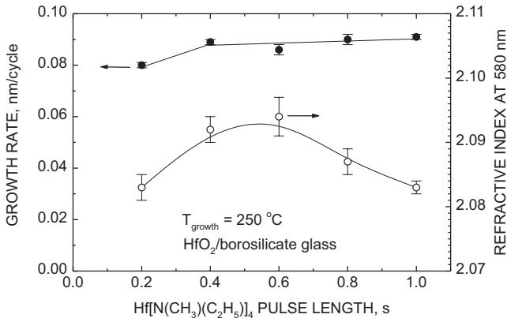
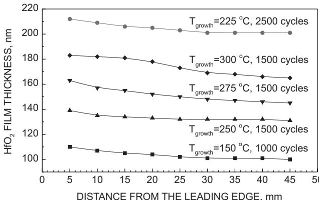
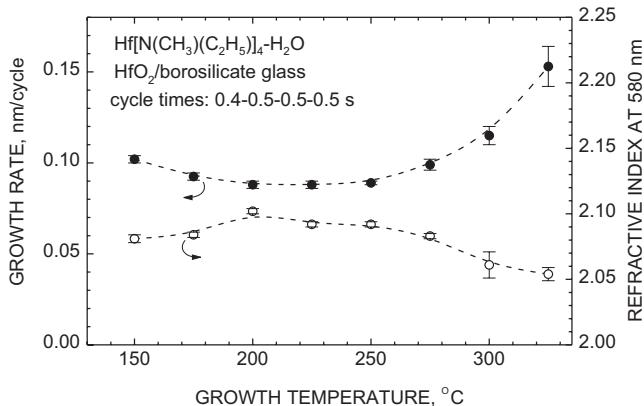
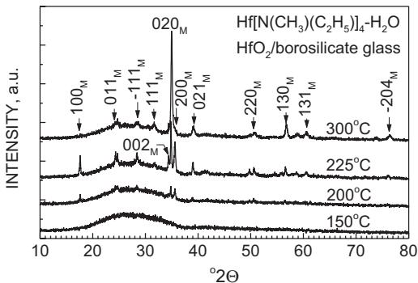
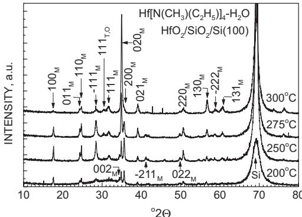
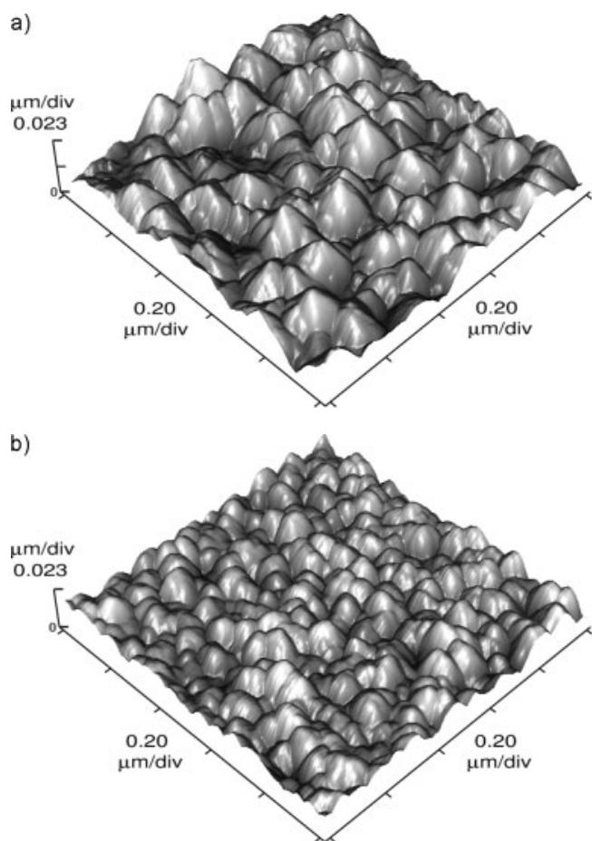
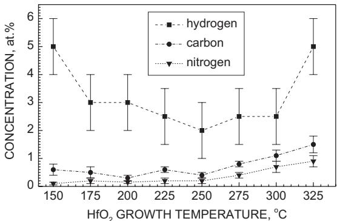
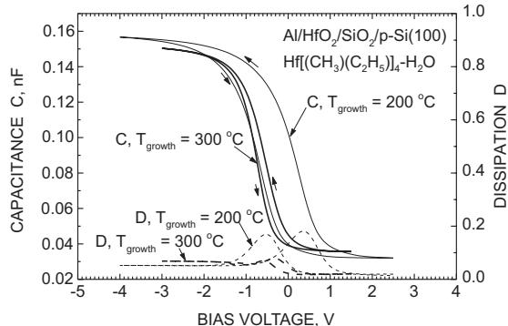

# Full Paper

# Atomic Layer Deposition of Hafnium Dioxide Films from Hafnium Tetrakis(ethylmethylamide) and Water**

By Kaupo Kukli,* Mikko Ritala, Timo Sajavaara, Juhani Keinonen, and Markku Leskelä

$\mathrm{HfO_2}$  films were produced from  $\mathrm{Hf}[\mathrm{N}(\mathrm{CH}_3)(\mathrm{C}_2\mathrm{H}_5)]_4$  and  $\mathrm{H}_2\mathrm{O}$ , on borosilicate glass, indium- tin- oxide (ITO), and  $\mathrm{Si(100)}$  substrates, in the temperature range  $150 - 325^{\circ}\mathrm{C}$ , using atomic layer deposition (ALD). In the temperature range  $200 - 250^{\circ}\mathrm{C}$ , the growth rate of the  $\mathrm{HfO_2}$  films was  $0.09 \mathrm{nm}$  per cycle, but increased with both increasing and decreasing temperatures. The self- limiting adsorption of  $\mathrm{Hf}[\mathrm{N}(\mathrm{CH}_3)(\mathrm{C}_2\mathrm{H}_5)]_4$  at  $250^{\circ}\mathrm{C}$  was verified. The films were stoichiometric dioxides with an  $\mathrm{O / Hf}$  ratio of  $2.0\pm 0.1$ . The concentrations of residual carbon, nitrogen, and hydrogen, determined using ion beam analysis, were  $0.3 - 0.6$  at.  $\%$ $0.1 - 0.2$  at.  $\%$  and  $2 - 3$  at.  $\%$  respectively. The films crystallized at growth temperatures exceeding  $150 - 175^{\circ}\mathrm{C}$  and consisted mainly of the monoclinic  $\mathrm{HfO_2}$  phase. The refractive index of the films varied between  $2.08$  and  $2.10$ . The effective permittivities of the  $\mathrm{HfO_2}$  films grown in the temperature range  $200 - 300^{\circ}\mathrm{C}$  varied between  $11$  and  $14$ .

Keywords: Atomic layer deposition, Dielectrics, Hafnium dioxide, Ion beam analysis

# 1. Introduction

$\mathrm{HfO_2}$  is a potential candidate for several applications such as high- permittivity dielectric oxide in metal oxide semiconductor (MOS) devices[1- 3] thin film capacitors,[4] gas- sensing devices,[5] tunnel junctions,[6] and laser damage- resistant optical coatings.[7] The maximum dielectric constant value for  $\mathrm{HfO_2}$  (30) may exceed that of  $\mathrm{ZrO_2}$  (25),[8] another prospective candidate for metal oxide semiconductor field effect transistor (MOSFET) gate oxides.[3] However, relatively low values  $(15.7\pm 0.5$ , measured at  $100 \mathrm{kHz}$  of the dielectric constant have been reported for  $\mathrm{HfO_2}$  films.[9] The optical energy gap is reported to be higher in  $\mathrm{HfO_2}$ , compared to  $\mathrm{ZrO_2}$ .[5,10] The refractive index of  $\mathrm{HfO_2}$  films is in the range  $2.08 - 2.15$ ,[7- 9,11] slightly lower than that of  $\mathrm{ZrO_2}$  (2.2).[8]

$\mathrm{HfO_2}$  thin films have often been grown using physical vapor deposition methods, such as sputtering or e- beam evaporation,[6- 9,12- 15] while in the CVD routes to  $\mathrm{HfO_2}$  films,  $\beta$ - diketonate precursors have been exploited.[16,17] In recent studies, the use of hafnium nitrate,  $\mathrm{Hf}(\mathrm{NO}_3)_4$ ,[1,18] and hafnium tetrakis(ethylamide),  $\mathrm{Hf}[\mathrm{N}(\mathrm{C}_2\mathrm{H}_5)_2]_4$ ,[19,20] were described.

Hafnium halides, especially  $\mathrm{HfCl_4}$ , have been the common Hf precursors in the ALD process. In ALD, a substrate surface is alternately exposed to highly reactive metal and oxygen precursors, and the solid film forms as a result of successive surface reactions between (sub)monolayers of precursor molecules alternately adsorbed.  $\mathrm{HfCl_4}$  and  $\mathrm{H}_2\mathrm{O}$  have been applied to grow binary  $\mathrm{HfO_2}$ ,[2,11,21,22] or  $\mathrm{HfO_2}$ -  $\mathrm{Ta}_2\mathrm{O}_5$  nanolaminate films.[4,23] Recently,  $\mathrm{HfI_4}$  and  $\mathrm{H}_2\mathrm{O} - \mathrm{H}_2\mathrm{O}_2$  have also been applied in an ALD process.[24] The permittivity of the  $150 - 170 \mathrm{nm}$  thick films grown from  $\mathrm{HfCl_4}$  and  $\mathrm{H}_2\mathrm{O}$  at  $325^{\circ}\mathrm{C}$  on ITO substrates was  $16$ , measured at  $10 \mathrm{kHz}$ .[23] The refractive index of ALD  $\mathrm{HfO_2}$  films was  $2.10$ , measured at  $580 \mathrm{nm}$ .[11] Gordon et al.[25] have noted that it is possible to grow  $\mathrm{HfO_2}$  films in ALD mode from hafnium tetrakis(dimethylamide), and  $\mathrm{H}_2\mathrm{O}$ , with a growth rate of  $0.1 \mathrm{nm}$  per cycle. However, the properties of these films were not described. It is to be noted that the reproducibility of  $\mathrm{HfO_2}$  capacitors grown from  $\mathrm{HfCl_4}$  may sometimes suffer from particle transport, originating from the hafnium precursor,[11] therefore the exploitation of liquid precursors, ensuring uniform precursor delivery, is recommended.

In the present study,  $\mathrm{HfO_2}$  films were grown by ALD from a novel hafnium precursor, hafnium tetrakis(ethylmethylamide), and  $\mathrm{H}_2\mathrm{O}$  in order to investigate the basic features of the film growth in this new precursor combination. The dependence of the growth rate on the substrate temperature and ALD cycle time parameters was investigated. In addition, the effect of substrate temperature on the film structure and composition will be described. Preliminary results on the dielectric properties of the films grown at various temperatures will be reported.

# 2.Results and Discussion

# 2.1.Film Growth

The length of the  $\mathrm{Hf[N(CH_3)(C_2H_5)]_4}$  pulse was varied at  $250^{\circ}C$  in order to study the self- limiting nature of the  $\mathrm{Hf[N(CH_3)(C_2H_5)]_4}$  adsorption. Figure 1 shows that a pulse length of  $0.4\mathrm{s}$  was sufficient to achieve maximum growth rate, no marked increase in the growth rate being observed for greater pulse lengths. It can also be seen that the refractive index of the resulting films reaches maximum value in the  $\mathrm{Hf[N(CH_3)(C_2H_5)]_4}$  pulse length range  $0.4 - 0.6\mathrm{s}$  while increasing the pulse length somewhat reduces the refractive index. This can arise from the thermal decomposition of  $\mathrm{Hf[N(CH_3)(C_2H_5)]_4}$  which may become more significant during longer exposure times, slightly reducing the film density or changing the film composition. It is to be noted that the changes in refractive index are very small, although clearly measurable. In most of the depositions, the  $\mathrm{Hf[N(CH_3)(C_2H_5)]_4}$  pulse length was  $0.4\mathrm{s}$

  
Fig. 1. Growth rate and refractive index of  $\mathrm{HfO_2}$  films as a function of hafnium precursor pulse length. The water pulse and purge times were  $0.5\mathrm{s}$ . The error bars express the variation of the refractive index in each sample.

Figure 2 depicts the thickness profiles of the films grown on glass substrates. It can be seen that the films show quite uniform thickness over a large substrate area. Somewhat decreased uniformity can be observed at  $275^{\circ}C$  and above, very possibly indicating an increasing effect of the thermal decomposition of  $\mathrm{Hf[N(CH_3)(C_2H_5)]_4}$  .It is to be noted that  $\mathrm{HfO_2}$  films of similar uniformity can be grown by ALD from  $\mathrm{HfCl_4}$  and  $\mathrm{H}_2\mathrm{O}$  at  $500^{\circ}\mathrm{C}$  [11] but the application of lower growth temperatures in the case of  $\mathrm{HfCl_4}$  has resulted in a stronger thickness profile exceeding  $10 - 15\%$  deviations over the substrate.

  
Fig. 2. Thickness profile of selected  $\mathrm{HfO_2}$  films grown from  $\mathrm{Hf[N(CH_3) - }$ $(\mathrm{C}_2\mathrm{H}_5)]_4$  and  $\mathrm{H}_2\mathrm{O}$  on borosilicate glass substrates. Growth temperatures and numbers of growth cycles applied are indicated by labels. Thicknesses are measured at variable distance from the leading edge of the substrate, which is the edge closest to the precursor inlet.

In Figure 3, the film growth rate and refractive index are plotted against the substrate temperature. It is obvious that between  $200^{\circ}\mathrm{C}$  and  $250^{\circ}\mathrm{C}$  the growth rate is almost inde

  
Fig. 3. Growth rate and refractive index of  $\mathrm{HfO_2}$  films as a function of growth temperature.

pendent of the growth temperature. In this range, the adsorption of  $\mathrm{Hf[N(CH_3)(C_2H_5)]_4}$  molecules may be expected to be a self- limiting process during  $0.4\mathrm{s}$  long precursor pulses. In the case of self- limitation and absence of thermal decomposition, adsorption proceeds until all the reactive, functional groups on the surface (such as  $- \mathrm{OH}$  groups) are used up.

A separate experiment was carried out to examine the thermal decomposition of the hafnium precursor.  $\mathrm{Hf[N(CH_3)(C_2H_5)]_4}$  was pulsed 1500- 2750 times with a pulse length of  $0.6\mathrm{s}$  and without an intermittent hydrolysis step, i.e., a water pulse. At  $205^{\circ}\mathrm{C}$ , film growth was negligible. At  $250^{\circ}\mathrm{C}$ , ultrathin, brownish layers of unknown composition were formed on the glass substrates, indicating weak thermal decomposition. Thus, the growth cannot be expected to be perfectly self- limiting. The increase in growth rate at lower temperatures may be due to the increased density of functional adsorption sites  $(- \mathrm{OH}$  groups) or the molecular adsorption of the precursor. At higher temperatures, the growth rate can be enhanced by intense thermal decomposition of the hafnium precursor.

The growth rate of the films in the present study increases rather rapidly from  $0.09\mathrm{nm}$  per cycle at  $250^{\circ}\mathrm{C}$  to  $0.15\mathrm{nm}$  per cycle at  $325^{\circ}\mathrm{C}$ , while the growth rate reported for the  $\mathrm{Hf[N(CH_3)_2]_4}$  and  $\mathrm{H}_2\mathrm{O}$  precursors[25] was about  $0.1\mathrm{nm}$  per cycle in the temperature range  $250 - 350^{\circ}\mathrm{C}$ . The difference in growth rates may be connected, no only to the properties of  $\mathrm{Hf}$  precursors, but also to differences in

gas flow rate and processing time parameters, depending on the reactor used. In terms of precursor properties,  $\mathrm{Hf[N(CH_3)(C_2H_5)]_4}$  is more volatile than  $\mathrm{Hf[N(CH_3)_2]_4}$  but can also be somewhat less stable at higher temperatures. However, considering the interatomic distances in  $\mathrm{HfO_2}$ $0.2086 - 0.2197\mathrm{nm}$  for Hf- O and  $0.3547 - 0.3386\mathrm{nm}$  for  $\mathrm{Hf - Hf})^{[26]}$  as well as the lattice parameters,[27] it is still obvious that the average growth rate remains below one monolayer of hafnium oxide.

The refractive index of  $\mathrm{HfO_2}$  measured in this study, agrees with the literature values.[7,9,13- 15] From Figure 3, it can be seen that the maximum values of refractive index coincide with the region of temperature- independent growth rate, whereas too low or too high temperatures are likely to result in films of reduced density or changed composition, as well as decreased refractive index. It is still important to mention that the changes in refractive index values are really small, therefore no substantial changes in film quality are expected over the whole temperature range studied.

# 2.2.Film Structure

Figures 4 and 5 demonstrate selected X- ray diffraction (XRD) patterns of the  $\mathrm{HfO_2}$  films deposited at varying temperatures on glass and silicon substrates, respectively. Because the intensity of the diffraction peaks is generally higher, it can be seen that the films grown at relatively high temperatures are more crystalline. Otherwise, no particular differences between the phase contents of the films grown on both types of substrate were observed. In the films grown on ITO, the dominant peaks belonged to the 111 and 111 reflections of the monoclinic phase[27] (not shown), whereas on Si substrates, the most intense reflections (such as 020 and 200), were essentially weaker in the films grown on ITO. The monoclinic  $\mathrm{HfO_2}$  phase was predominant in all the films, except those grown below  $200^{\circ}\mathrm{C}$  where the temperature was obviously too low to initiate noticeable crystallization (Fig. 4). In the films grown on silicon, trace reflections from tetragonal or orthorhombic phases were also detected at a  $2\Theta$  value of 30.41 (Fig. 5). This is characteristic of ALD  $\mathrm{HfO_2}$  since similar minor reflections from metastable phases were also seen in the films grown from  $\mathrm{HfCl_4}$  and  $\mathrm{H}_2\mathrm{O}$ .[11,22]

Three films, grown at  $200^{\circ}\mathrm{C}$ $250^{\circ}\mathrm{C}$  and  $300^{\circ}\mathrm{C}$  were evaluated by atomic force microscopy AFM).The AFM measurements revealed that the root- mean- square (rms) roughness of the film surface was  $7.9\pm 0.4\mathrm{nm}$ $4.6\pm$ $0.4~\mathrm{nm}$  and  $3.7\pm 0.4 \mathrm{nm}$  respectively. The respective film thicknesses were  $132\mathrm{nm}$ $132\mathrm{nm}$  and  $170\mathrm{nm}$  .This is an interesting result because the roughness actually decreased with the increase in the deposition temperature, although, simultaneously, the crystallinity increased with the growth temperature (Fig.5).From the AFM images of the samples grown at  $200^{\circ}\mathrm{C}$  and  $300^{\circ}\mathrm{C}$  in Figure 6,it can be seen that the grain size decreases considerably with the growth temperature, resulting in reduced roughness. This may be due to the increased nucleation density at  $300^{\circ}\mathrm{C}$ . At the same time, neither crystal size (possibly increasing with temperature and larger in the film bulk), nor film thickness affected the surface smoothness.

  
Fig.4. XRD patterns of selected  $\mathrm{HfO_2}$  films grown on glass substrates. Growth temperatures are indicated by labels. Reflections are indexed as monoclinic  $\mathrm{HfO_2}$ . The film thicknesses are 170, 200, 132, and  $101~\mathrm{nm}$  for patterns counted from top to bottom.

  
Fig.5. XRD patterns of selected  $\mathrm{HfO_2}$  films grown on silicon substrates. Growth temperatures are indicated by labels. Subscripts M, T, and O at indexed reflections denote monoclinic, tetragonal, and orthorhombic phases, respectively. The film thicknesses are 170, 150, 132, and  $132\mathrm{nm}$  for patterns counted from top to bottom.

# 2.3.Film Composition

According to time- of- flight elastic recoil detection analysis (TOF- ERDA), the hafnium and oxygen concentrations were  $33\pm 2$  at.  $\%$  and  $63\pm 2$  at.  $\%$  respectively, in the films grown in the temperature range  $175 - 300^{\circ}\mathrm{C}$ . Thus the oxygen to hafnium ratio in these samples was  $2.0\pm 0.1$ . In the films grown at  $130^{\circ}\mathrm{C}$  and  $325^{\circ}\mathrm{C}$ , the hafnium and oxygen concentrations were  $30\pm 2$  at.  $\%$  and  $63\pm 3$  at.  $\%$  respectively. Within the accuracy limits of TOF- ERDA, all the samples were evidently stoichiometric dioxides.

Figure 7 depicts the concentrations of residual impurities in the  $\mathrm{HfO_2}$  films as a function of growth temperature. In the films grown below  $275^{\circ}\mathrm{C}$ , carbon and nitrogen levels remained in the ranges  $0.3 - 0.6$  at.  $\%$  and  $0.1 - 0.2$  at.  $\%$

  
Fig. 6. AFM images of the  $\mathrm{HfO_2}$  films grown onto Si(100) at a)  $200^{\circ}\mathrm{C}$ , and b)  $300^{\circ}\mathrm{C}$ .

  
Fig. 7. Concentrations of hydrogen, carbon, and nitrogen residues versus growth temperature. Lines are guides for the eye.

respectively, whereas a slight increase in the contamination level occurred at higher deposition temperatures. The hydrogen content in the films grown in the temperature range  $175 - 300^{\circ}\mathrm{C}$  was quite stable at 2- 3 at.  $- \%$  whereas increased amounts of hydrogen were found in the films grown at both lower and higher temperatures. Generally, the contaminants were distributed homogeneously throughout the film thickness. In some samples, a hydrogen peak was detected at the film surface, possibly coming from adsorbed water. Zirconium was also found in all of the

$\mathrm{HfO_2}$  films in concentrations not exceeding 0.2- 0.4 at.  $- \%$  Zirconium is the common impurity in hafnium- based compounds and hafnium precursors.

For comparison, Ohshita et al.[19] obtained sub- stoichiometric oxides from  $\mathrm{Hf}[\mathrm{N}(\mathrm{C}_2\mathrm{H}_5)_2]_4$  and  $\mathrm{O_2}$  in a CVD process, where the  $\mathrm{O / Hf}$  ratio was 1.5 at a deposition temperature of  $300^{\circ}\mathrm{C}$ . Stoichiometric dioxides could be obtained at  $350^{\circ}\mathrm{C}$ . At  $300^{\circ}\mathrm{C}$ , the carbon impurities were strongly dependent on the  $\mathrm{O_2}$  dose and varied between 1 at.  $- \%$  and 11 at.  $- \%$  . Nitrogen content remained at the 5- 7 at.  $- \%$  level. Evidently, the precursors,  $\mathrm{Hf}[\mathrm{N}(\mathrm{CH}_3)(\mathrm{C}_2\mathrm{H}_5)]_4$  and  $\mathrm{H}_2\mathrm{O}$ , used in the ALD process in this study, enable the deposition of stoichiometric  $\mathrm{HfO_2}$  at lower temperatures than so far reported for alkylamide- based CVD.

# 2.4. Dielectric Behavior

Some capacitor structures were fabricated in order to verify the dielectric behavior of  $\mathrm{HfO_2}$  films grown in this study. Figure 8 demonstrates capacitance- voltage  $(CV)$  and dissipation behavior, measured at  $500\mathrm{kHz}$  for the films deposited at  $200^{\circ}\mathrm{C}$  on HF- etched Si, and at  $300^{\circ}\mathrm{C}$  on a Si substrate with a ca.  $1.1\mathrm{nm}$  thick chemically grown  $\mathrm{SiO_2}$  overlayer. The film thicknesses were  $133\mathrm{nm}$  and  $178\mathrm{nm}$ , respectively, and the films were not heat treated before measurements. All the  $CV$  curves demonstrated counterclockwise hysteresis when swept from positive to negative bias forward, and from negative to positive bias backwards.

The flat- band voltage in typical  $\mathrm{Al / HfO_2 / Si}$  capacitors remains at  $- 1\mathrm{V}$ . The  $CV$  curves exhibited a shift in flat- band voltage towards positive bias (Fig. 8) during the forward sweep. This is due to the intense injection of negative charge from the substrate under positive bias. The hysteresis width is noticeably larger in the films grown at lower temperature. This may be due to the (assumed to be) thinner  $\mathrm{SiO_2}$  interface layer, but perhaps also to the more homogeneous nature (i.e., crystalline phase dominating

  
Fig. 8. Selected  $CV$  and dissipation curves measured for  $\mathrm{Al / HfO_2 / Si}$  capacitor structures at  $AC$  signal frequency of  $500\mathrm{kHz}$ . Labels indicate  $\mathrm{HfO_2}$  growth temperatures. The thickness of the films grown at  $200^{\circ}\mathrm{C}$  and  $300^{\circ}\mathrm{C}$  are  $133\mathrm{nm}$  and  $178\mathrm{nm}$ , respectively.

over an amorphous phase) of the film grown at  $300^{\circ}\mathrm{C}$ . The hysteresis width can be estimated using the difference between dissipation maxima occurring near flat- band conditions. The density of the oxide rechargeable traps may then be calculated from the hysteresis width.[28] For the  $CV$  curves depicted in Figure 8, one obtains the oxide trap densities  $1.1\times 10^{12}\mathrm{cm}^{- 2}$  and  $4.0\times 10^{12}\mathrm{cm}^{- 2}$  for the films grown at  $300^{\circ}\mathrm{C}$  and  $200^{\circ}\mathrm{C}$ , respectively.

The  $CV$  curves exhibit clear accumulation under strongly negative bias voltage. The effective permittivity of the dielectric oxide layer(s) can be calculated from the accumulation capacitance by using the simple parallel plate capacitor model. This gives effective permittivity values of  $11.3\pm 0.5$  and  $14.5\pm 0.5$  for the  $\mathrm{HfO_2}$  films grown at  $200^{\circ}\mathrm{C}$  and  $300^{\circ}\mathrm{C}$  respectively. In the latter case, the effect of the  $1.1\mathrm{nm}\mathrm{SiO}_2$  interface layer has been taken into account by using the series connection of parallel plate capacitors with  $\mathrm{SiO_2}$  and  $\mathrm{HfO_2}$  dielectric layers.

The permittivity values calculated for the  $\mathrm{Al / HfO_2 / ITO}$  capacitors compared favorably with the effective permittivities of the films on silicon. The sample films were deposited on ITO at arbitrarily chosen temperatures of  $205^{\circ}\mathrm{C}$  and  $250^{\circ}\mathrm{C}$ . The corresponding film thicknesses were  $135\mathrm{nm}$  and  $127~\mathrm{nm}$ . The respective permittivities were  $12.3\pm 0.3$  and  $14.0\pm 0.1$ , independent of the measurement frequency (varied between  $10\mathrm{kHz}$  and  $500~\mathrm{kHz}$ ).

The current- voltage behavior of these capacitors was also examined. The leakage current density versus electric field curves (not shown) demonstrated that the current density remained below  $1\times 10^{- 5}\mathrm{Acm}^{- 2}$  until the dielectric breakdown. Typically, the breakdown occurred at  $2.5 - 2.6\mathrm{MVcm}^{- 1}$  and  $2.8 - 2.9\mathrm{MVcm}^{- 1}$  in the  $\mathrm{Al / HfO_2 / }$  ITO capacitors with dielectric layers grown at  $250^{\circ}\mathrm{C}$  and  $205^{\circ}\mathrm{C}$  respectively. The difference in the breakdown resistance in the films grown at higher temperature can be explained by somewhat higher polycrystallinity and some contribution from the grain boundary conductivity. In the  $\mathrm{Al / HfO_2 / Si}$  capacitors, the breakdown occurred at  $3.5\mathrm{MVcm}^{- 1}$  and  $3.7\mathrm{MVcm}^{- 1}$  with dielectric layers grown at  $200^{\circ}\mathrm{C}$  and  $300^{\circ}\mathrm{C}$ . At  $300^{\circ}\mathrm{C}$ , the film was grown onto  $1.1\mathrm{nm}\mathrm{SiO}_2$  formed on  $\mathrm{Si(100)}$  and this can give rise to breakdown resistance. In these particular samples, the pre- breakdown leakage current was between  $1\times 10^{- 6}\mathrm{Acm}^{- 2}$  and  $1\times 10^{- 5}\mathrm{Acm}^{- 2}$  in the field range  $2.0 - 3.5\mathrm{MVcm}^{- 1}$  measured for the film grown at  $200^{\circ}\mathrm{C}$ , whereas for the film grown at  $300^{\circ}\mathrm{C}$ , the pre- breakdown current remained between  $1\times 10^{- 7}\mathrm{Acm}^{- 2}$  and  $5\times 10^{- 7}\mathrm{Acm}^{- 2}$  in the electric field range  $2.0 - 3.7\mathrm{MVcm}^{- 1}$ . More detailed study on the dielectric properties is beyond the scope of the present paper. Possible formation and effect of interface layers on HF- etched Si, as well as its increase during deposition and storage in ambient air, remains a matter for future investigation. Further, the effect of growth and annealing temperatures, film thickness, and structure on the permittivity and interface quality should also be studied.

# 3. Summary

Stoichiometric  $\mathrm{HfO_2}$  films can be grown by ALD from  $\mathrm{Hf[N(CH_3)(C_2H_5)]_4}$  and  $\mathrm{H}_2\mathrm{O}$  in the temperature range  $150 - 325^{\circ}\mathrm{C}$ . The adsorption of  $\mathrm{Hf[N(CH_3)(C_2H_5)]_4}$  is a self- limiting process, as confirmed at  $250^{\circ}\mathrm{C}$ . In the temperature range  $200 - 250^{\circ}\mathrm{C}$ , the film growth is quite independent of the growth temperature. The growth rate and residual hydrogen contamination increase towards both lower and higher temperatures outside this range. The hydrogen concentration at  $200 - 500^{\circ}\mathrm{C}$  was  $2 - 3\mathrm{at. - \%}$ . The carbon and nitrogen concentrations were  $0.3 - 0.6\mathrm{at. - \%}$  and  $0.1 - 0.2\mathrm{at. - \%}$ , respectively, increasing somewhat with the deposition temperature. The films crystallize when growing at temperatures exceeding  $150 - 175^{\circ}\mathrm{C}$ . The refractive index of the  $\mathrm{HfO_2}$  films grown on glass substrates was  $2.08 - 2.10$ . The dominant phase in the films is monoclinic  $\mathrm{HfO_2}$  with a somewhat preferred (020) texture on  $\mathrm{Si(100)}$  and glass, and with most intense  $\mathrm{T11}$  and (111) orientations when grown on polycrystalline ITO. The effective permittivities of  $\mathrm{HfO_2}$  in  $\mathrm{Al / HfO_2 / Si}$  capacitor structures were  $11.3$  and  $14.5$ , measured for the films grown at  $200^{\circ}\mathrm{C}$  and  $300^{\circ}\mathrm{C}$ , respectively. The permittivities of  $\mathrm{HfO_2}$  in  $\mathrm{Al / HfO_2 / ITO}$  capacitor structures were  $12.3$  and  $14.0$ , measured for the films grown at  $205^{\circ}\mathrm{C}$  and  $250^{\circ}\mathrm{C}$ , respectively. The breakdown in  $\mathrm{HfO_2}$  films occurred at  $2.6 - 2.9\mathrm{MVcm}^{- 1}$  in the films grown on ITO, and at  $3.53.7\mathrm{MVcm}^{- 1}$  in the films grown on Si.

# 4. Experimental

The films were grown in a hot- wall horizontal flow- type ALD reactor [29] onto borosilicate glass, Si(100), and glass substrates covered by patterned ITO electrodes. The substrate temperature was varied in the range  $150 - 325^{\circ}\mathrm{C}$ . The pressure in the reactor was about  $10\mathrm{mbar}$ .  $\mathrm{Hf[N(CH_3) - (C_2H_5)]_4}$  [30] (Aldrich,  $99.99 + \%$  product number 553 123) was evaporated from an open boat at  $60^{\circ}\mathrm{C}$  inside the reactor.  $\mathrm{H}_2\mathrm{O}$  vapor was generated in an external reservoir at room temperature and led into the reactor through needle and solenoid valves. Metal precursor pulse length was varied between  $0.2\mathrm{s}$  and  $1.0\mathrm{s}$ , while the water pulse length was held at  $0.5\mathrm{s}$ . Constant purge times of  $0.5\mathrm{s}$  were used after each precursor pulse to separate the precursor flows in the gas phase and to remove the excess reactants and gaseous reaction by- products from the system. Nitrogen was used as both precursor carrier and purge gas.

The film thickness and optical properties were calculated from optical transmission spectra [31] measured by a Hitachi U- 2000 spectrophotometer. The structure of the films was determined by means of a Philips MPD 1880 powder X- ray diffractometer using  $\mathrm{CuK}\alpha$  radiation and the Bragg- Brentano geometry. The surface roughness of some selected samples was evaluated using a ThermoMicroscopes CP Research AFM. The film composition and residual contamination level were evaluated by TOF- ERDA [32]. A  $53\mathrm{MeV}^{127}\mathrm{I}^{10 + }$  beam for TOF- ERDA was obtained from a  $5\mathrm{MV}$  tandem accelerator EGP- 10- II, and forward scattered iodine ions and recoiled target atoms were used for the determination of  $\mathrm{Hf}$  and lighter elements, respectively. Dielectric properties were measured after e- beam evaporation of aluminum electrodes with an effective electrode area of  $0.204\mathrm{mm}^2$ . After film deposition, the reverse of the silicon substrates were etched in hydrofluoric acid and metallized by evaporating a  $100\mathrm{nm}$  thick Al layer. Thus, the electrical measurements were carried out on  $\mathrm{Al / HfO_2 / p - Si(100) / Al}$ ,  $\mathrm{Al / HfO_2 / SiO_2 / p - Si(100) / Al}$ , or  $\mathrm{Al / HfO_2 / ITO}$  capacitor structures.  $CV$  curves were recorded using a HP 4284a, precision LCR meter. The stair- sweep voltage step was  $0.05\mathrm{V}$ , and the period between voltage steps was  $0.5\mathrm{s}$ . The AC

voltage applied to the capacitor was  $0.05\mathrm{V}$  or  $0.005\mathrm{V}$  while the frequency of the AC signal was held at either  $100\mathrm{kHz}$  or  $500\mathrm{kHz}$ . The current- voltage curves were measured with a Keithley 2400 Source Meter in the stair- sweep voltage mode, while the voltage step used was  $0.02 - 0.05\mathrm{V}$ . All measurements were carried out at room temperature.

Received: December 19, 2001  Final version: March 18, 2002

[1] S. A. Campbell, T. Z. Ma, R. Smith, W. L. Gladfelter, F. Chen, Microelectron. Eng. 2001, 59, 361.  [2] E. P. Gusev, E. Cartier, D. A. Buchanan, M. Gribelyuk, M. Copel, H. Obser, Smith, C. D'Emis, Microelectron. Eng. 2001, 59, 241.  [3] L. Peters, Semicond. Int. 2001, 24, 61.  [4] T. Kanniainen, H. Kattelus, J. Skarp, Electrochem. Soc. Proc. 1997, 97- 31, 36.  [5] S. Capone, G. Leo, R. Rella, P. Siciliano, L. Vasanelli, M. Alvisi, J. Vac. Sci. Technol. A 1998, 16, 3564.  [6] C. L. Platt, B. Dieny, A. E. Berkowitz, Appl. Phys. Lett. 1996, 68, 2291.  [7] M. Alvisi, M. Di Giulio, S. G. Marrone, M. R. Perrone, M. L. Protopapa, A. Valentini, L. Vasanelli, Thin Solid Films 2000, 358, 250.  [8] W.- J. Qi, B. H. Lee, R. Nieh, L. Kang, Y. Jeon, K. Onishi, J. C. Lee, Proc. SPIE- Int. Soc. Opt. Eng. 1999, 388, 24.  [9] A. N. Saxena, K. L. Mittal, J. Appl. Phys. 1975, 46, 2788.  [10] J. G. Bendoraitis, R. E. Salomon, J. Phys. Chem. 1965, 69, 3666.  [11] M. Ritala, M. Leskelä, L. Niinisto, T. Prohaska, G. Friedbacher, M. Grasserbauer, Thin Solid Films 1994, 250, 72.  [12] B. H. Lee, L. Kang, R. Nieh, W.- J. Qi, J. C. Lee, Appl. Phys. Lett. 2000, 76, 1926.  [13] M. Fadel, O. A. Azim, O. A. Omer, R. R. Basti, Appl. Phys. A- Mater. Sci. Process. 1998, 66, 335.  [14] J. Leng, S. Li, J. Opsal, D. Aspnes, B. H. Lee, J. Lee, Proc. SPIE- Int. Soc. Opt. Eng. 2000, 4099, 228.

[15] Z. Czigany, D. Mademann, P. Weißbrodt, E. Hacker, Solid State Phenom. 1997, 56, 233.  [16] M. Balog, M. Schrieber, S. Patai, M. Michman, J. Cryst. Growth 1972, 17, 298.  [17] M. Balog, M. Schrieber, M. Michman, S. Patai, Thin Solid Films 1977, 41, 247.  [18] R. C. Smith, T. Ma, N. Hoijen, L. Y. Tsung, M. J. Bevan, L. Colombo, J. Roberts, S. A. Campbell, N. L. Gladfelter, Adv. Mater. Opt. Electron. 2000, 10, 105.  [19] Y. Ohshita, A. Ogura, A. Hoshiro, S. Hiiro, H. Machida, J. Cryst. Growth 2001, 233, 292.  [20] Y. Ohshita, A. Ogura, A. Hoshiro, T. Suzuki, S. Hiiro, H. Machida, J. Cryst. Growth 2002, 235, 265.  [21] J. Aarik, A. Aidla, A.- A. Kuisler, T. Uustare, V. Sammelselg, Thin Solid Films 1999, 340, 110.  [22] J. Aarik, A. Aidla, H. Mandar, T. Uustare, K. Kukli, M. Schuisky, Appl. Surf. Sci. 2001, 113, 15.  [23] K. Kukli, J. Ihanus, M. Ritala, M. Leskelä, Appl. Phys. Lett. 1996, 68, 3737.  [24] K. Forsgren, Comprehensive Summaries of Uppsala Dissertations from the Faculty of Science and Technology, 665, Acta Univ. Upsaliensis 2001, p. 37.  [25] R. G. Gordon, J. Becker, D. Hausmann, S. Suh, Chem. Mater. 2001, 13, 2463.  [26] J. Wang, H. P. Li, R. Stevens, J. Mater. Sci. 1992, 27, 5397.  [27] International Centre for Diffraction Data (ICDD), Newtown Square, PA, Powder Diffraction File, card 43- 1017.  [28] D. K. Schroder, Semiconductor Material and Device Characterization, 2nd ed., J. Wiley and Sons, Inc., New York 1998, p. 350.  [29] T. Suntola, Thin Solid Films 1992, 216, 84.  [30] R. G. Gordon, Electrochem. Soc. Proc. 2000, 13, 248.  [31] M. Yilammii, T. Rantanaho, Thin Solid Films 1993, 232, 56.  [32] J. Jokinen, P. Haussala, J. Keinonen, M. Ritala, D. Riihela, M. Leskelä, Thin Solid Films 1996, 289, 159.