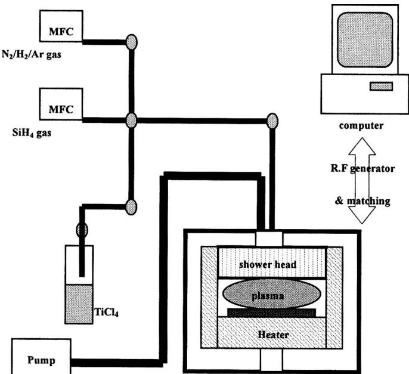
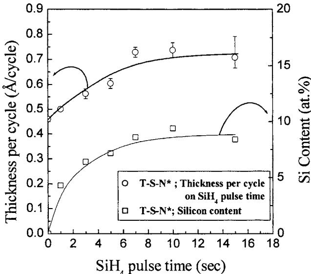
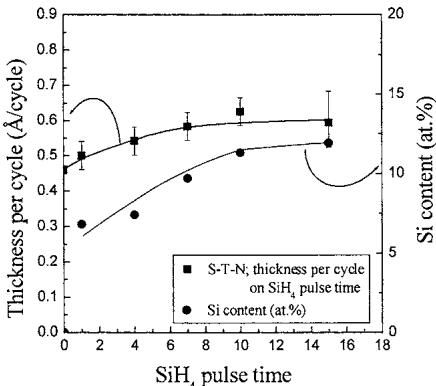
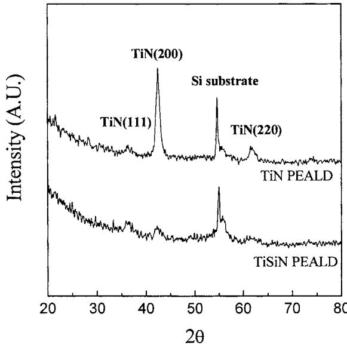
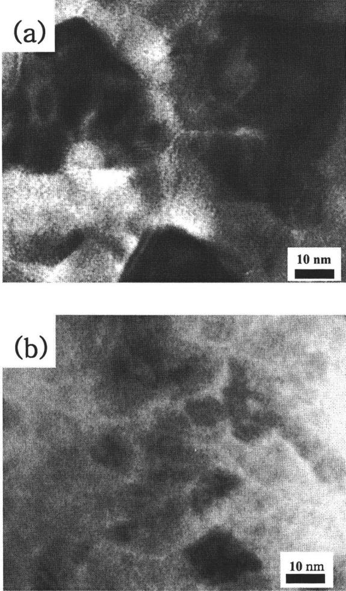
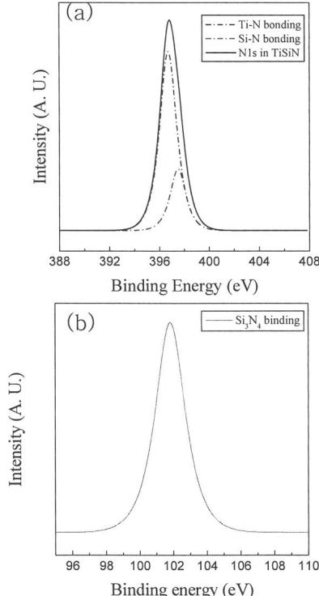
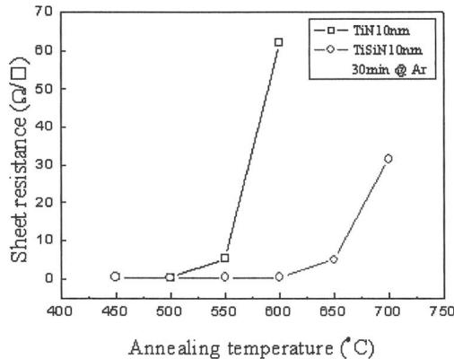
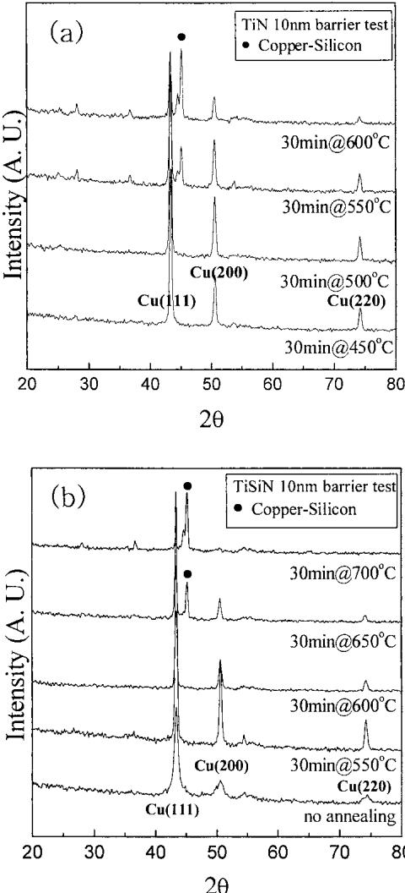

# Growth mechanism and diffusion barrier property of plasma-enhanced atomic layer deposition Ti-Si-N thin films  $\odot$

Jin- Seong Park; Sang- Won Kang; H. Kim

Check for updates

J. Vac. Sci. Technol. B 24, 1327-1332 (2006) https://doi.org/10.1116/12198846

# Articles You May Be Interested In

Remote plasma enhanced atomic layer deposition of TiN thin films using metalorganic precursor

J. Vac. Sci. Technol. A (November 2003)

Ultrahigh purity conditions for nitride growth with low oxygen content by plasma- enhanced atomic layer deposition

J. Vac. Sci. Technol. A (November 2020)

Plasma enhanced atomic layer deposition of HfO 2 and ZrO 2 high- k thin films

J. Vac. Sci. Technol. A (April 2005)

# Growth mechanism and diffusion barrier property of plasma-enhanced atomic layer deposition Ti-Si-N thin films

Jin- Seong Park and Sang- Won Kang  Department of Materials Science and Engineering, Korean Advanced Institute of Science and Technology (KAIST), 373- 1, Guseong- dong, Yuseong- gu, Deajeon 305- 701, South Korea

H. Kima)  Department of Materials Science and Engineering, Pohang University of Science and Technology (POSTECH), San 31, Hyoja-Dong, Nam-Gu, Pohang 790-784, South Korea

(Received 27 December 2005; accepted 29 March 2006; published 10 May 2006)

Ti- Si- N thin films were deposited by plasma- enhanced atomic layer deposition from  $\mathrm{TiCl_4}$ ,  $\mathrm{SiH_4}$ , and  $\mathrm{N}_2 / \mathrm{H}_2 / \mathrm{Ar}$  plasma at  $350^{\circ}\mathrm{C}$ . For comparison, TiN plasma- enhanced atomic layer deposition (PEALD) was also performed from  $\mathrm{TiCl_4}$ . The effects of growth parameters on film properties were studied. Especially, the changes in sequences of precursor- reactant exposure steps were found to produce large change in the growth rates and Si concentration in the films. The results are discussed based upon the molecule- surface reaction mechanisms. Also, the Cu diffusion barrier properties of the PEALD Ti- Si- N films were investigated. PEALD Ti- Si- N films have shown better diffusion barrier properties than PEALD TiN films and can be a promising candidate for future Cu interconnect technology beyond  $65~\mathrm{nm}$  technology node. © 2006 American Vacuum Society. [DOI: 10.1116/1.2198846]

# I. INTRODUCTION

Copper is the most promising material for the next generation (beyond  $65~\mathrm{nm}$ ) interconnect technology due to its lower resistivity and larger electro- stress- migration resistance than Al- based materials. However, copper atoms easily diffuse into silicon devices at low temperature, which could cause critical degradation of device performance.1 For successful implementation of copper interconnect technology, it is essential to utilize highly reliable diffusion barrier. Especially, as the minimum feature size of silicon devices shrinks, copper diffusion barriers should scale down accordingly. The reason for this is that thick diffusion barriers would leave little space for Cu, nullifying the advantage of Cu metallization.2,3 Thus, more effective but thinner Cu diffusion barrier materials are required as device scaling continues. Various materials, including Ta, Ti, TaN, TiN, Ta- Si- N, Ti- Si- N, and WN, have been investigated as copper diffusion barriers. Among these, Ti- Si- N, one of amorphous refractory materials, is a promising candidate for this application since it does not have fast diffusion paths, such as grain boundary, which is present in polycrystalline materials.4- 7

Until now, Ti- Si- N films have been deposited using an rf reactive sputtering technique.8 Although physical vapor deposition (PVD) including sputtering produces good quality films with reasonable barrier properties, it will soon reach critical limits in silicon device application with increasing aspect ratio and decreasing size of contact, via, and trench, etc., due to its inherent poor conformality. To overcome this problem, other deposition techniques including chemical vapor deposition (CVD) and atomic layer deposition (ALD) have been investigated to deposit Ti- Si- N films. CVD of

Ti- Si- N thin films were reported from as early as 1980's.  $\mathrm{TiCl_4}$  was employed as metal precursor, which reacted with Si source such as  $\mathrm{SiH_2Cl_2}$  or  $\mathrm{SiCl_4}$ , and nitrogen source such as  $\mathrm{NH_3}$  or  $\mathrm{N}_2 / \mathrm{H}_2$  at temperatures above  $1000^{\circ}\mathrm{C}$ .9,10 However, the requirement of very high temperature makes it undesirable for silicon device fabrication. Later, Si alloying of TiN has been carried out by plasma- assisted chemical vapor deposition (PACVD) from  $\mathrm{TiCl_4}$ ,  $\mathrm{N}_2$ , and  $\mathrm{SiH_4}$  in argon at lower temperatures  $(\leqslant 500^{\circ}\mathrm{C})$ .11 However, lower temperature deposition process is required for application as interconnect, for which the process temperature is limited to below  $400^{\circ}\mathrm{C}$ . More recently, metal- organic CVD (MOCVD) (Ref. 12) and ALD (Ref. 13) processes have been developed, using tetrakis(dimethylamino) titanium (TDMAT),  $\mathrm{NH_3}$ , and  $\mathrm{SiH_4}$  at temperature below  $400^{\circ}\mathrm{C}$ . Despite lower deposition temperature, these processes have problems of significant C contamination, uncontrollable film composition, inaccurate thickness control, poor resistivity, etc.

In this article, we have developed plasma- enhanced atomic layer deposition (PEALD) process of Ti- Si- N films from  $\mathrm{TiCl_4}$  precursor. The effects of Si incorporation in Ti- Si- N film properties such as microstructure and diffusion barrier properties and the deposition mechanism were investigated by changing the precursor- reactant supplying sequence. The focus was on a development of a promising ALD process to overcome the limitations of conventional ALD process, such as poor resistivity, deficiency of reactants, etc., and to inherit the benefits of ALD such as accurate thickness control, excellent conformality, digital controllable composition, and so on.

# II. EXPERIMENTAL PROCEDURE

Ti- Si- N films were deposited on  $\mathrm{SiO_2}$  by the alternate supply of  $\mathrm{TiCl_4}$  as a Ti precursor,  $\mathrm{SiH_4}$  as a Si precursor, and

  
FiG. 1. Schematic diagram of plasma-enhanced atomic layer deposition apparatus.

$\mathrm{N}_2 / \mathrm{H}_2 / \mathrm{Ar}$  plasma as a nitrogen source/reducing agent. For comparison, TiN PEALD was also performed from  $\mathrm{TiCl_4}$  and  $\mathrm{N}_2 / \mathrm{H}_2 / \mathrm{Ar}$  plasma. The deposition temperature and pressure were set as  $350^{\circ}\mathrm{C}$  and 3 torr, respectively. The schematic diagram of apparatus used is shown in Fig. 1. This deposition apparatus consists of a double chamber structure which includes hot wall inner chamber, cold wall outer chamber, a gas switching system, a pumping system, and a radio frequency (rf) generator  $(13.56\mathrm{MHz})$ . The reactor in the inner chamber is a vertical flow type to improve a gas switching timing and uniform plasma density. The shower head was used not only as the distributor of gases but also as the electrode to generate plasma.

Nitrogen [200 SCCM (SCCM denotes cubic centimeter per minute at STP)],  $\mathrm{H}_2$  (20 SCCM), and Ar (200 SCCM) were mixed in the showerhead and passed over the wafer during processing. Various precursor- reactant exposure sequences were used and  $\mathrm{N}_2$  purge period was inserted be tween each reactant gas pulse to isolate the reactant gases from each other. As an example,  $\mathrm{T - S - N^{*}}$  sequence consisted of exposure to  $\mathrm{TiCl_4}$ , a purge period with  $\mathrm{N}_2$ , exposure to  $\mathrm{SiH_4}$ , a purge period with  $\mathrm{N}_2$ , and exposure to  $\mathrm{N}_2 / \mathrm{H}_2 / \mathrm{Ar}$  plasma. Here, T, S, and  $\mathrm{N}^*$  represent  $\mathrm{TiCl_4}$ ,  $\mathrm{SiH_4}$ , and  $\mathrm{N}_2 / \mathrm{H}_2 / \mathrm{Ar}$  plasma supplies (the asterisk means plasma ignition), respectively. Other exposure sequences are summarized in Table I. To ignite and maintain the  $\mathrm{N}_2 / \mathrm{H}_2 / \mathrm{Ar}$  plasma synchronized with the deposition cycle, a rectangular electrical power wave was applied between the upper (showerhead) and lower (substrate) electrodes. The plasma source operated at a power of  $150\mathrm{W}$  for  $10\mathrm{s}$ , capacitively coupled with a radio frequency  $(13.56\mathrm{MHz})$ .

The film thickness and resistivity were analyzed with a surface profile meter (TENCOR Ins. 200) and four point probe, respectively. X- ray diffraction (XRD) was performed to determine the microstructure. The composition and silicon content in  $\mathrm{Ti - Si - N}$  films were determined using  $9.0\mathrm{MeV}$ $\mathrm{Cl}^{5 + }$  elastic recoil detection time of flight (ERD- TOF),  $2.43\mathrm{MeV}$ $\mathrm{He}^{2 + }$  Rutherford backscattering spectroscopy (RBS), and Auger electron spectroscopy (AES). Electron spectroscopy for chemical analysis (ESCA,  $\mathrm{Mg}K\alpha$ $= 1253.6\mathrm{eV}$ ) was used to analyze the chemical bonding status of the  $\mathrm{Ti - Si - N}$  in the films. Transmission electron microscopy (TEM) was performed to examine the size and microstructure of the  $\mathrm{Ti - Si - N}$  thin film.

For the diffusion barrier test,  $100\mathrm{nm}$  thick  $\mathrm{Cu}$  films were deposited by dc rotating sputter system on PEALD TiN and  $\mathrm{Ti - Si - N}$  films ( $10\mathrm{nm}$  thickness)/ $p$ - type Si substrate. The condition of  $\mathrm{Cu}$  sputtering was  $2000\mathrm{W}$  of power with 8 SCCM Ar flow. Rapid thermal annealing (RTA) system was used to anneal the prepared samples with a temperature ramping rate of  $150^{\circ}\mathrm{C / min}$  in Ar circumstance. The diffusion barrier properties of all the samples were studied by monitoring the sheet resistance and phase change by four point probe and XRD.

# III. RESULTS AND DISCUSSIONS

As a preliminary experiment, we investigated the reactivity between each reactant,  $\mathrm{TiCl_4}$ ,  $\mathrm{SiH_4}$ , and  $\mathrm{N}_2 / \mathrm{H}_2 / \mathrm{Ar}$  plasma at typical growth conditions of  $350^{\circ}\mathrm{C}$  and 3 torr

TABLE I. Summary of PEALD Ti-Si-N from various exposure sequences using  $\mathrm{TiCl_4}$ $\mathrm{SiH_4}$  and  $\mathrm{N}_2 / \mathrm{H}_2 / \mathrm{Ar}$  plasma.  

<table><tr><td>Material/precursor</td><td>Precursor sequence condition (scheme of one cycle)</td><td>Growth rate (Å/cycle)</td><td>Si content (at. %)</td></tr><tr><td>TiN (TN*)/TiCl4, 
N2/H2/Ar plasma</td><td>TiCl4: N2 purge: N2/H2/Ar plasma: N2 purge</td><td>0.46</td><td>0</td></tr><tr><td>Si3N4 (SN*)/SiH4, 
N2/H2/Ar plasma</td><td>SiH4: N2 purge: N2/H2/Ar plasma: N2 purge</td><td>0.1</td><td>≈ 40</td></tr><tr><td>TiSiN (TN*SN*)/TiCl4, 
SiH4, N2/H2/Ar plasma</td><td>TiCl4: N2 purge: N2/H2/Ar plasma: N2 purge: SiH4: N2 purge: N2/H2/Ar plasma: N2 purge</td><td>0.89</td><td>10.8</td></tr><tr><td>TiSiN (TSN*)/TiCl4, 
SiH4, N2/H2/Ar plasma</td><td>TiCl4: N2 purge: SiH4: N2 purge: N2/H2/Ar plasma: N2 purge</td><td>0.73</td><td>8.8</td></tr></table>

  
FIG. 2. Dependence of the growth rate and silicon content in the  $\mathrm{Ti - Si - N}$  films on the  $\mathrm{SiH_4}$  pulse time. The films were grown on  $\mathrm{SiO_2}$  at  $350^{\circ}\mathrm{C}$  with the sequential supply of  $\mathrm{TiCl_4}$  for  $1\mathrm{s}$ ,  $\mathrm{SiH_4}$  for  $0\mathrm{s}\sim 15\mathrm{s}$ , and  $\mathrm{N}_2 / \mathrm{H}_2 / \mathrm{Ar}$  plasma for  $10\mathrm{s}$ . The partial pressure of  $\mathrm{SiH_4}$  was fixed at 0.1 torr.

(Table I). Firstly, the reaction between  $\mathrm{TiCl_4}$  and  $\mathrm{N}_2 / \mathrm{H}_2 / \mathrm{Ar}$  plasma  $(\mathrm{TN}^*)$  was investigated by performing PEALD of TiN films. TiN thin films were successfully grown, indicating strong reaction between these. The growth rate was saturated at about  $0.46\mathrm{\AA}$  cycle and the resistivity of thin film was about  $80\mu \Omega \mathrm{cm}$ . Second set,  $\mathrm{SiH_4}$  and  $\mathrm{N}_2 / \mathrm{H}_2 / \mathrm{Ar}$  plasma  $(\mathrm{SN}^*)$  indicates weak reaction between these. Although  $\mathrm{Si}_3\mathrm{N}_4$  thin film was deposited on Si substrate, the growth rate was very small as about  $0.1\mathrm{\AA}$  cycle. Meanwhile,  $\mathrm{TiCl_4}$  and  $\mathrm{SiH_4}$  molecules did not react together at  $350^{\circ}\mathrm{C}$ .

Ti- Si- N PEALD was performed by using various exposure sequences of  $\mathrm{TiCl_4}$ ,  $\mathrm{SiH_4}$ , and  $\mathrm{N}_2 / \mathrm{H}_2 / \mathrm{Ar}$  plasma, as summarized in Table I. Figure 2 shows the dependence of the growth rate  $(\mathrm{\AA} / \mathrm{cycle})$  and silicon content in  $\mathrm{Ti - Si - N}$  thin films on the  $\mathrm{SiH_4}$  pulse time for the first sequence studied,  $\mathrm{T - S - N}^*$  sequence. In this case,  $\mathrm{Ti - Si - N}$  films were grown by a sequential supplying of  $\mathrm{TiCl_4}$  for  $1\mathrm{s}$ ,  $\mathrm{SiH_4}$  for  $0 - 15\mathrm{s}$ , and  $\mathrm{N}_2 / \mathrm{H}_2 / \mathrm{Ar}$  plasma for  $10\mathrm{s}$ . The partial pressure of  $\mathrm{SiH_4}$  during exposure was fixed at 0.1 torr. When the  $\mathrm{SiH_4}$  pulse time exceeded  $7\mathrm{s}$ , the growth rate and silicon content in  $\mathrm{Ti - Si - N}$  thin films were saturated at  $0.73\mathrm{\AA}$  cycle and  $8.8\mathrm{at}.\%$ $(\mathrm{Cl}$  content  $\leq 0.5$  at.  $\%$  ), respectively. The resistivity of  $\mathrm{Ti - Si - N}$  thin films was also higher at about  $500\mu \Omega \mathrm{cm}$  (the resistivity in  $\mathrm{Ti - N}$  PEALD was  $80\mu \Omega \mathrm{cm}$ ). The saturation of the growth rate and the Si content indicates that  $\mathrm{SiH_4}$  is incorporated by a self- limiting reaction and that  $\mathrm{N}_2 / \mathrm{H}_2 / \mathrm{Ar}$  plasma is capable of acting as a reducing agent during this reaction.

In the current experiments, the growth rate was higher than that of TiN PEALD, which was about  $0.46\mathrm{\AA}$  cycle as mentioned above. In the previous work on  $\mathrm{Ti - Si - N}$  ALD using TDMAT  $(\mathrm{Ti}[\mathrm{N}(\mathrm{CH}_3)_2]_4)$ ,  $\mathrm{SiH_4}$ , and  $\mathrm{NH_3}$ , however, the growth rate was smaller than that of  $\mathrm{Ti - N}$  ALD. It was proposed that the  $\mathrm{SiH_4}$  molecules block the available adsorption sites of TDMAT molecule resulting in growth rate reduction.13 Thus, the higher growth rate of  $\mathrm{Ti - Si - N}$  PEALD than TiN indicates that the growth mechanism is quite different than  $\mathrm{Ti - Si - N}$  ALD from TDMAT. We propose that for  $\mathrm{Ti - Si - N}$  from  $\mathrm{TiCl_4}$ , the number of  $\mathrm{TiCl_4}$  molecules adsorbed on  $\mathrm{S - N}^*$  terminated surface is more than that on  $\mathrm{T - N}^*$  terminated surface resulting in growth rate increase.

  
FiG. 3. Dependence of the growth rate and silicon content in the  $\mathrm{Ti - Si - N}$  films on the  $\mathrm{SiH_4}$  pulse time by different reactant exposure sequence. The reactants were supplied in the sequence of  $\mathrm{SiH_4}$  for  $0\mathrm{s} - 15\mathrm{s}$ ,  $\mathrm{TiCl_4}$  for  $1\mathrm{s}$ , and  $\mathrm{N}_2 / \mathrm{H}_2 / \mathrm{Ar}$  plasma for  $10\mathrm{s}$ .

Next,  $\mathrm{TN}^*\mathrm{SN}^*$  sequence was performed by sequential supply of  $\mathrm{TiCl_4}$  for  $1\mathrm{s}$ ,  $\mathrm{N}_2$  purge for  $10\mathrm{s}$ ,  $\mathrm{N}_2 / \mathrm{H}_2 / \mathrm{Ar}$  plasma for  $10\mathrm{s}$ ,  $\mathrm{N}_2$  purge for  $1\mathrm{s}$ ,  $\mathrm{SiH_4}$  pulse for  $10\mathrm{s}$ ,  $\mathrm{N}_2$  purge for  $10\mathrm{s}$ ,  $\mathrm{N}_2 / \mathrm{H}_2 / \mathrm{Ar}$  plasma for  $10\mathrm{s}$ , and  $\mathrm{N}_2$  purge for  $1\mathrm{s}$ . This sequence is composed of alternate deposition step of  $\mathrm{Ti - N}$  and  $\mathrm{Si}_3\mathrm{N}_4$  PEALD growth sequence. However, the growth rate  $(0.89\mathrm{\AA} / \mathrm{cycle})$  was turned out to be higher than the summation of growth rate of  $\mathrm{Ti - N}$ $(0.46\mathrm{\AA} / \mathrm{cycle})$  and  $\mathrm{Si}_3\mathrm{N}_4$  PEALD  $(0.1\mathrm{\AA} / \mathrm{cycle})$ , respectively. This result again can be explained by the same proposition mentioned above, in other words, the  $\mathrm{S - N}^*$  terminated surface provides higher adsorption site density for  $\mathrm{TiCl_4}$  molecules than  $\mathrm{T - N}^*$  terminated surface  $(\mathrm{Ti - N}$  film).

Finally,  $\mathrm{S - T - N}^*$  sequence was investigated and compared with  $\mathrm{T - S - N}^*$  sequence shown in Fig. 2. For  $\mathrm{S - T - N}^*$  sequence, the reactants were supplied in the sequence of  $\mathrm{SiH_4}$  for  $10\mathrm{s}$ ,  $\mathrm{TiCl_4}$  for  $1\mathrm{s}$ , and  $\mathrm{N}_2 / \mathrm{H}_2 / \mathrm{Ar}$  plasma for  $10\mathrm{s}$ . The growth rates and Si composition for this case are shown in Fig. 3. The overall trends are similar to the results shown in Fig. 2. However, the growth rates of the  $\mathrm{Ti - Si - N}$  PEALD at saturation condition was about  $0.60\mathrm{\AA} / \mathrm{cycle}$ , which is significantly smaller than that from the  $\mathrm{T - S - N}^*$  sequence. The saturation occurs when the  $\mathrm{SiH_4}$  pulse time exceeds  $10\mathrm{s}$ . At this saturation condition, the Si content was about  $13\mathrm{at}.\%$  Here, it should be noted that the growth rate and silicon content is different between  $\mathrm{TSN}^*$ $(0.73\mathrm{\AA} / \mathrm{cycle}$ ,  $8.8\mathrm{at}.\%)$  and  $\mathrm{STN}^*$ $(0.6\mathrm{\AA} / \mathrm{cycle}$ ,  $13\mathrm{at}.\%)$  sequences. This difference may be explained by the changes in  $\mathrm{TiCl_4}$  and  $\mathrm{SiH_4}$  molecules' adsorption reaction depending on the exposure sequence. In  $\mathrm{TSN}^*$  sequence,  $\mathrm{TiCl_4}$  molecules would adsorb on  $\mathrm{S - N}^*$  terminated surface while in  $\mathrm{STN}^*$  sequence, they would adsorb on  $\mathrm{Si - H}$  terminated surface. Since  $\mathrm{TiCl_4}$  and  $\mathrm{SiH_4}$  molecules do not react each other at deposition temperature,  $350^{\circ}\mathrm{C}$ , the blockade of  $\mathrm{SiH_4}$  molecules in  $\mathrm{STN}^*$

  
FIG. 4. XRD patterns obtained from the TiN and Ti-Si-N films deposited by PEALD.

sequence gives low adsorption amount of  $\mathrm{TiCl_4}$  molecules resulting in lower growth rate  $(0.60\mathrm{\AA / cycle})$  for  $\mathrm{STN}^*$  sequence than that  $(0.73\mathrm{\AA / cycle})$  for  $\mathrm{TSN}^*$  sequence. Also, for  $\mathrm{TSN}^*$  sequence, where  $\mathrm{SiH_4}$  molecules adsorb in Ti- Cl terminated surface, the adsorption amount of  $\mathrm{SiH_4}$  is smaller (8.8 at.  $\%$  than that for  $\mathrm{STN}^*$  sequence (13 at.  $\%$  ),where  $\mathrm{SiH_4}$  molecules adsorb on  $\mathrm{Ti - N}^*$  terminated surface. However, more detailed surface reaction chemistry should be investigated to obtain more decisive and quantitative explanation.

X- ray diffraction profiles of Ti- Si- N and TiN thin films formed by PEALD are shown in Fig.4. Well- resolved XRD peaks including (111), (200), and (220) diffraction peaks from cubic TiN were detected for PEALD TiN films. While the XRD spectrum of the Ti- Si- N thin film is similar to that of the Ti- N PEALD, but has much weaker and broader peaks than that of Ti- N PEALD at the same deposition temperatures. Thus, the crystallinity of the film is much poor for Ti- Si- N films. To obtain more information on the microstructure of Ti- Si- N and TiN PEALD thin films, TEM planview analysis was performed (Fig.5). Agreeing with XRD results, PEALD TiN film is composed of well- developed polycrystalline grains with size above  $30~\mathrm{nm}$  while the PEALD Ti- Si- N films is composed of nanocrystalline grains with below  $10\mathrm{nm}$  size embedded in amorphous matrix. The cross- sectional TEM (not shown) indicates that the TiN films appear to be a columnar structure while Ti- Si- N has a randomly oriented structure. It is reported that the partial replacement of the Ti atoms by Si atoms in TiN films disturbs the smooth growth of the columnar grains resulting in nanocrystalline structure.14

Figure 6 shows the ESCA spectra showing the chemical bonding states of the  $\mathrm{N}1s$  [Fig.6a)] and Si  $2p$  [Fig.6b)] and in Ti- Si- N thin films deposited by  $\mathrm{TSN}^*$  sequence. The deposition conditions consisted of sequential supplying of  $\mathrm{TiCl_4}$  for  $1\mathrm{s}$ $\mathrm{SiH_4}$  for  $10~\mathrm{s}$  and  $\mathrm{N}_2 / \mathrm{H}_2 / \mathrm{Ar}$  plasma for  $10~\mathrm{s}$  at  $350^{\circ}\mathrm{C}$  3 torr, and  $150~\mathrm{W}$  . The binding energy of the Si  $2p$  was  $101.8\mathrm{eV}$  indicating that the silicon in Ti- Si- N thin film exists as a  $\mathrm{Si}_3\mathrm{N}_4$  and the binding energy of the  $\mathrm{N}1s$  is shown as two peaks centered at 396.7 and  $397.5\mathrm{eV}$  which are Ti- N and  $\mathrm{Si}_3\mathrm{N}_4$  bonding, respectively. This suggests that Ti- Si- N thin films consist of TiN and  $\mathrm{Si}_3\mathrm{N}_4$  bonding because the chemical binding of Ti  $2p$  only involves Ti- N bonding without any Ti- Si bonding (not shown). This result is consistent with other previous reported results on CVD and PECVD Ti- Si- N. On the other hand, the previous report on Ti- Si- N MOALD using TDMAT,  $\mathrm{SiH_4}$  and  $\mathrm{NH}_3$ $\mathrm{Si}_3\mathrm{N}_4$  phase was not observed because  $\mathrm{SiH_4}$  and  $\mathrm{NH}_3$  did not react at  $180^{\circ}\mathrm{C}$  of deposition temperature.15 The formation of  $\mathrm{Si}_3\mathrm{N}_4$  phase, observed in the current study, would give to increase resistivity in Ti- Si- N thin films and improve Cu diffusion barrier properties.16 Based upon these  $\mathbf{X}$  - ray photoemission spectroscopy (XPS) results together with XRD and TEM results, we can infer that the PEALD Ti- Si- N is composed of TiN nanocrystalline grains embedded in  $\mathrm{Si}_3\mathrm{N}_4$  - like amorphous matrix.

  
Fig. 5. Plan-view TEM micrographs of (a) TiN and (b) Ti-Si-N prepared by PEALD at  $350^{\circ}\mathrm{C}$

To evaluate the Cu diffusion barrier properties, test structures composed of Cu films deposited on top of either the TiN or Ti- Si- N thin films (thickness of  $10\mathrm{nm}$  on Si substrates were prepared. Figure 7 shows the variation in the

  
FIG. 6. XPS peaks of (a) nitrogen  $1s$  and (b) silicon  $2p$  measured for Ti-Si-N films by PEALD.

sheet resistance as a function of the annealing temperature for the Cu  $100 \mathrm{nm} / \mathrm{TiN}$  PEALD  $10 \mathrm{nm} / \mathrm{Si}$  and Cu  $100 \mathrm{nm} / \mathrm{Ti} - \mathrm{Si} - \mathrm{N}$ $10 \mathrm{nm} / \mathrm{Si}$ . The sheet resistance of both samples was measured by four point probe after  $30 \mathrm{min}$  of heat treatment at a temperature between 450 and  $700^{\circ} \mathrm{C}$ . The sheet resistance was initially  $0.47 \Omega /\square$  for the  $\mathrm{Cu / TiN}$  PEALD/Si, which slowly decreases to  $0.41 \Omega /\square$  by  $500^{\circ} \mathrm{C}$ , and then increased sharply at above  $550^{\circ} \mathrm{C}$ . On the other hand, the sheet resistance of  $\mathrm{Cu / Ti} - \mathrm{Si} - \mathrm{N}$  PEALD/Si slowly decreased to  $0.30 \Omega /\square$  by  $600^{\circ} \mathrm{C}$ , and then drastically increased above  $650^{\circ} \mathrm{C}$ . The large increase of sheet resistance is due to the formation of  $\mathrm{Cu} - \mathrm{Si}$  compounds following  $\mathrm{Cu}$  diffusion through barrier (TiN and  $\mathrm{Ti} - \mathrm{Si} - \mathrm{N}$  in this case), and this temperature can be considered as the  $\mathrm{Cu}$  diffusion barrier failure temperature.

  
FIG. 7. Change of sheet resistance on  $\mathrm{Cu / PEALD}$  TiN  $10 \mathrm{nm} / \mathrm{Si}$  and  $\mathrm{Cu / PEALD}$  Ti-Si-N  $10 \mathrm{nm} / \mathrm{Si}$  as a function of annealing temperature.

  
FIG. 8. XRD patterns of  $\mathrm{Cu / PEALD}$  TiN  $10 \mathrm{nm} / \mathrm{Si}$  and  $\mathrm{Cu / PEALD}$  Ti-Si-N  $10 \mathrm{nm} / \mathrm{Si}$  as a function of annealing temperature.

For further information, XRD analysis has been performed for both samples and the results are shown in Fig. 8. Three  $\mathrm{CuXRD}$  peaks near  $43^{\circ}$ ,  $50^{\circ}$ , and  $75^{\circ}$  grew gradually with increasing the annealing temperature by  $500^{\circ} \mathrm{C}$  in Ti- N PEALD and  $600^{\circ} \mathrm{C}$  in Ti- Si- N PEALD. A further increase of the  $\mathrm{Cu}$ - related peaks accompanied by the evolution of new peaks near  $44^{\circ} - 46^{\circ}$ , as indicated in Fig. 8. This indicates the formation of  $\mathrm{Cu} - \mathrm{Si}$  compound  $(\mathrm{Cu}_3\mathrm{Si})$  phase formed by the  $\mathrm{Cu}$  diffusion through diffusion barrier. The results in Fig. 8, together with those in Fig. 7, indicate that the PEALD Ti- Si- N has a better diffusion barrier property than that of PEALD TiN, with at least  $100^{\circ} \mathrm{C}$  higher diffusion barrier failure temperature.

Previous report indicates that the microstructure of diffusion barrier might affect the diffusion barrier property significantly. The microstructure of PEALD Ti- Si- N is nanocrystalline embedded in amorphous matrix, while that of PEALD TiN is columnar polycrystalline. For polycrystalline PEALD TiN, the grain boundary provides easy path for

Cu diffusion while the amorphous  $\mathrm{Si}_3\mathrm{N}_4$ - like matrix prevent the diffusion of  $\mathrm{Cu}$  atoms for PEALD Ti- Si- N. Thus, the better performance of PEALD Ti- Si- N compared to TiN is attributed to the formation of  $\mathrm{Si}_3\mathrm{N}_4$ - like amorphous phase. With decreasing device size requiring ultrathin diffusion barrier, the amorphous- like Ti- Si- N would be a good diffusion barrier material. Together with good conformality of ALD process, the PEALD Ti- Si- N could be a potentially essential component for successful fabrication of semiconductor device beyond  $65~\mathrm{nm}$  technology node.

# IV. CONCLUSION

Ti- Si- N and TiN thin films have been deposited by PEALD using  $\mathrm{TiCl}_4$ ,  $\mathrm{SiH}_4$ , and  $\mathrm{N}_2 / \mathrm{H}_2 / \mathrm{Ar}$  plasma using various precursor- reactant exposure sequences. The growth characteristics and film properties were largely dependent on the exposure sequences, which were explained by the differences in reactant molecule adsorption reactions. With the incorporation of Si atoms, the microstructure of the films changed to amorphous with the increase in resistivity. The PEALD Ti- Si- N films were composed of TiN nanocrystalline grains and  $\mathrm{Si}_3\mathrm{N}_4$ - like amorphous phase. Due to the amorphous microstructure and existence of  $\mathrm{Si}_3\mathrm{N}_4$ - like amorphous phase, the diffusion barrier property against  $\mathrm{Cu}$  has been greatly improved.

# ACKNOWLEDGMENT

This work was supported through the project of National Research Laboratory and Brain Korea 21 foundation.

$^1$ A. A. Istratov and E. R. Weber, J. Electrochem. Soc. 149, G21 (2002).  $^2$ A. Broniatowski, Phys. Rev. Lett. 62, 3074 (1989).  $^3$ R. J. Gutmann, T. P. Cow, A. E. Kaloyeros, W. A. Lanford, and S. P. Muraka, Thin Solid Films 262, 177 (1995).  $^4$ X. Sun, J. S. Reid, E. Kolawa, and M.- A. Nicolet, J. Appl. Phys. 81, 664 (1997).  $^5$ J. T. No, J. H. O, and C. Lee, Mater. Chem. Phys. 63, 44 (2000).  $^6$ C. Marcadal, M. Eizenberg, A. Yoon, and L. Chen, J. Electrochem. Soc. 149, C52 (2002).  $^7$ J. S. Min, H. S. Park, and S. W. Kang, Appl. Phys. Lett. 75, 1521 (1999).  $^8$ X. Sun, J. S. Reid, E. Kolawa, and M. A. Nicolet, J. Appl. Phys. 81, 656 (1997).  $^9$ H. Toshino and H. Shinsuke, J. Mater. Sci. 17, 1320 (1982).  $^{10}$ G. Llauro, R. Hillel, and F. Sibuede, Chem. Vap. Deposition 4, 247 (1999).  $^{11}$ S. Veprek, S. Reiprich, and L. Shizhi, Appl. Phys. Lett. 66, 2540 (1995).  $^{12}$ P. M. Smith and J. S. Custer, Appl. Phys. Lett. 70, 3116 (1997).  $^{13}$ J. S. Min, J. S. Park, and S. W. Kang, J. Electrochem. Soc. 147, 3868 (2000).  $^{14}$ W. He, C. D. Bai, K. W. Xu, and N. S. Hu, Surf. Coat. Technol. 74- 75, 387 (1995).  $^{15}$ J. S. Min, Ph.D. thesis, 1999.  $^{16}$ J. S. Park, D. K. Sohn, B. H. Lee, J. U. Bae, J. S. Byun, and J. W. Park, J. Electrochem. Soc. 146, 1579 (1999).  $^{17}$ A. Cros, M. O. Aboelfotoh, and K. N. Tu, J. Appl. Phys. 67, 3328 (1990).  $^{18}$ S. Hymes, K. S. Kumar, and S. P. Muraka, J. Appl. Phys. 83, 4507 (1998).  $^{19}$ H. Kim, C. Detavenier, O. Straten, S. M. Rossnagel, A. J. Kellock, and D.- G. Park, J. Appl. Phys. 98, 14308 (2005).