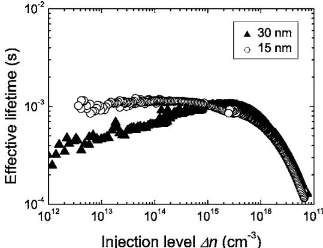
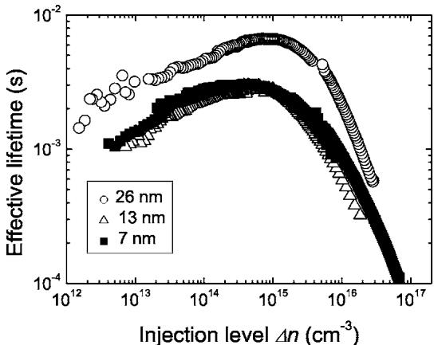
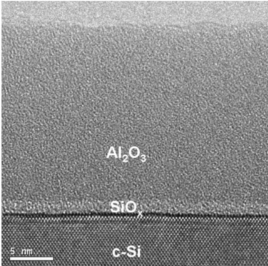

RESEARCH ARTICLE | JULY 27 2006

# Ultralow surface recombination of  $c$ -Si substrates passivated by plasma-assisted atomic layer deposited  $\mathrm{Al}_2\mathrm{O}_3$

B. Hoex; 
S. 
B. 
S. Heil; 
E. Langereis; 
M. 
C. 
M. van de Sanden; 
W. 
M. 
M. Kessels

Check for updates

Appl. Phys. Lett. 89, 042112 (2006) https://doi.org/10.1063/1.2240736

# Articles You May Be Interested In

Surface recombination velocity of phosphorus- diffused silicon solar cell emitters passivated with plasma enhanced chemical vapor deposited silicon nitride and thermal silicon oxide

J. Appl. Phys. (April 2001)

Stability of Al 2 O 3 and Al 2 O 3 / a - SiN x : H stacks for surface passivation of crystalline silicon

J. Appl. Phys. (December 2009)

Surface passivation of n - type Czochralski silicon substrates by thermal- SiO 2 /plasma- enhanced chemical vapor deposition SiN stacks

Appl. Phys. Lett. (January 2010)

# Ultralow surface recombination of c-Si substrates passivated by plasma-assisted atomic layer deposited  $\mathrm{Al}_2\mathrm{O}_3$

B. Hoex, 
S. 
B. 
S. Heil, 
E. Langereis, 
M. 
C. 
M. van de Sanden, and 
W. 
M. 
M. Kesselsa)  Department of Applied Physics, Eindhoven University of Technology, P.O. Box 513, 5600 MB  Eindhoven, The Netherlands

(Received 19 April 2006; accepted 9 June 2006; published online 27 July 2006)

Excellent surface passivation of  $c$  - Si has been achieved by  $\mathrm{Al}_2\mathrm{O}_3$  films prepared by plasma- assisted atomic layer deposition, yielding effective surface recombination velocities of 2 and  $13~\mathrm{cm / s}$  on low resistivity  $n$  and  $p$  - type  $c$  - Si, respectively. These results obtained for  $\sim 30 \mathrm{nm}$  thick  $\mathrm{Al}_2\mathrm{O}_3$  films are comparable to state- of- the- art results when employing thermal oxide as used in record- efficiency  $c$  - Si solar cells. A  $7\mathrm{nm}$  thin  $\mathrm{Al}_2\mathrm{O}_3$  film still yields an effective surface recombination velocity of  $5\mathrm{cm / s}$  on  $n$  - type silicon.  $(\widehat{\Xi})$  2006 American Institute of Physics. [DOI: 10.1063/1.2240736]

Surface passivation of crystalline silicon  $(c - \mathrm{Si})$  is of key importance for the performance of high efficiency industrial solar cells. The surface to volume ratio is increasing due to the cost- driven reduction of the solar cell thickness, which makes surface passivation a decisive factor for the final solar cell efficiency. Hydrogenated amorphous silicon nitride  $(a\mathrm{- SiN}_x\mathrm{:H})$  is routinely applied in solar cell production as an antireflection coating on the front side and provides good surface passivation of low resistivity  $n$  and  $p$  - type  $c$  - Si. However, the surface passivation of  $a\mathrm{- SiN}_x\mathrm{:H}$  on highly doped  $p$  - type silicon (e.g.,  $p$  - type emitters) is rather poor. When  $a\mathrm{- SiN}_x\mathrm{:H}$  is applied on the back of a  $p$  - type solar cell the high positive built- in charge induces a parasitic junction, limiting the solar cell efficiency. Thermally grown oxide is the state- of- the- art surface passivation layer for  $n$  and  $p$  - type  $c$  - Si of arbitrary doping level and is used in the record- efficiency passivated emitter and rear localy- diffused (PERL)  $c$  - Si solar cell. The surface passivation of the asgrown thermal oxide is moderate, but is significantly improved by a subsequent annealing in a forming gas  $\mathrm{H}_{2}$  in  $\mathbf{N}_2$  ). The best results are obtained by the so- called alneal scheme, where a sacrificial layer of Al is evaporated on the film prior to annealing. The oxidation of the Al film during the annealing releases atomic hydrogen that strongly reduces the number of interface defect states. However, the high processing temperatures  $(\sim 950 - 1100^{\circ}\mathrm{C})$  and elaborate processing necessary to obtain such a high quality thermal oxide are not always desirable. Therefore considerable effort is put in the development of low temperature surface passivation schemes that do not show the limitations of thermal oxide and  $a\mathrm{- SiN}_x\mathrm{:H}$  . Materials such as amorphous silicon carbide  $(a\mathrm{- SiO}_x\mathrm{:H})$  and hydrogenated amorphous silicon  $(a\mathrm{- Si:H})$  have recently demonstrated a good level of surface passivation on both  $n$  and  $p$  - type  $c$  - Si. However, both materials have significant absorption in the visible part of the solar spectrum. These films are also thermally unstable; hence, only steps with a low thermal budget can be used after deposition of these films.

Another interesting option is the use of the high bandgap dielectric  $\mathrm{Al}_2\mathrm{O}_3$  as a surface passivation layer. With a refractive index of  $\sim 1.65$  and no significant absorption in the visible part of the solar spectrum,  $\mathrm{Al}_2\mathrm{O}_3$  is well suited to improve the optical quality at the front or the back of the solar cell. Hezel and Jaeger already demonstrated that  $\mathrm{Al}_2\mathrm{O}_3$  grown by the pyrolysis of aluminium- tri- isopropoxide can show a reasonable level of surface passivation. More recently, Agostinelli et al. have shown that  $\mathrm{Al}_2\mathrm{O}_3$  films grown by thermal atomic layer deposition provide a good level of surface passivation on  $p$  - type  $c$  - Si.

In this letter we will show that ultrathin films of  $\mathrm{Al}_2\mathrm{O}_3$  exhibit a similar level of surface passivation as alnealed thermal silicon oxide on both  $n$  and  $p$  - type silicon. These films were prepared by plasma- assisted atomic layer deposition (PA- ALD) allowing monolayer growth control of high quality thin films, while the plasma step enables the use of relatively short purging times and low deposition temperatures.

$\mathrm{Al}_2\mathrm{O}_3$  films with a thickness of  $7 - 30 \mathrm{nm}$  were grown in a homebuilt PA- ALD reactor at a substrate temperature of  $200^{\circ}\mathrm{C}$ . The films were prepared by alternating trimethylaluminium exposure and a remote  $\mathrm{O}_2$  plasma with a total cycle time of  $\sim 30 \mathrm{s}$ . The film growth was monitored by means of in situ spectroscopic ellipsometry  $(250 - 1000 \mathrm{nm}$  range) and revealed a growth rate in the  $1.2 \mathrm{\AA}$  range per cycle. The atomic composition of the films was determined by means of Rutherford backscattering (RBS) and elastic recoil detection (ERD). The films were oxygen rich (Al:O = 2:3.14), and a small amount of hydrogen  $(\sim 3$  at.  $\%$  ) was detected in the films. The carbon content was below the detection limit of RBS  $(< 2$  at.  $\%$  ). The surface passivation was tested by depositing identical  $\mathrm{Al}_2\mathrm{O}_3$  films on both sides of low resistivity  $p$ - type  $(300 \mu \mathrm{m}, \langle 111 \rangle , 2.0 \Omega \mathrm{cm})$  and  $n$ - type  $(275 \mu \mathrm{m}, \langle 100 \rangle , 1.9 \Omega \mathrm{cm})$  float zone  $c$ - Si substrates. The substrates received a standard RCA clean with a final HF dip prior to deposition to remove the native oxide. After deposition, the lifetime samples were annealed in a  $\mathrm{N}_2$  environment for  $30 \mathrm{min}$  at  $425^{\circ}\mathrm{C}$  in a rapid thermal annealing furnace. The effective lifetime  $\tau_{\mathrm{eff}}$  was measured using a lifetime tester (Sinton WCT- 100) in both the quasi- steady- state and transient mode. The level of surface passivation is quantified by the effective surface recombination velocity. Assuming an infinite bulk lifetime, the upper limit of the effective surface recombination velocity  $S_{\mathrm{eff}}$  can be calculated by

  
FIG. 1. Effective lifetime as a function of the excess carrier density for low resistivity  $p$ -type  $(300\mu \mathrm{m}$ ,  $(111)$ ,  $2.0\Omega \mathrm{cm}$  float zone  $c$ -Si substrate passivated with 30 and  $15\mathrm{nm}$  thick  $\mathrm{Al}_2\mathrm{O}_3$  films.

$$
S_{\mathrm{eff}}\leqslant \frac{W}{2\cdot\tau_{\mathrm{eff}}}, \tag{1}
$$

with  $W$  the substrate thickness.

In Fig. 1 the effective lifetime as a function of the injection level is shown for the low resistivity  $p$ - type substrates passivated by 15 and  $30\mathrm{nm}$  thin  $\mathrm{Al}_2\mathrm{O}_3$  films. The postdeposition annealing was necessary to obtain the reported effective lifetimes, as the effective lifetime of the samples with the as- deposited  $\mathrm{Al}_2\mathrm{O}_3$  films was only in the range of  $2 - 8\mu \mathrm{s}$ . Effective lifetimes up to  $1.2\mathrm{ms}$  were measured for a  $p$ - type substrate passivated by  $30\mathrm{nm}$ $\mathrm{Al}_2\mathrm{O}_3$  film corresponding to a  $S_{\mathrm{eff}}\leqslant 13\mathrm{cm / s}$ . No difference in effective lifetime is observed when a  $15\mathrm{nm}$ $\mathrm{Al}_2\mathrm{O}_3$  film is used instead of a  $30\mathrm{nm}$ $\mathrm{Al}_2\mathrm{O}_3$  film, except for the behavior for lower injection levels.

The surface passivation of  $\mathrm{Al}_2\mathrm{O}_3$  was also tested on  $n$ - type  $c$ - Si. In Fig. 2 the effective lifetime for  $1.9\Omega \mathrm{cm}$ $n$ - type silicon passivated by 7, 14, and  $26\mathrm{nm}$ $\mathrm{Al}_2\mathrm{O}_3$  is shown. A maximum lifetime of  $6.6\mathrm{ms}$  was measured for an  $n$ - type substrate passivated by a  $26\mathrm{nm}$ $\mathrm{Al}_2\mathrm{O}_3$  film corresponding to a  $S_{\mathrm{eff}}\leqslant 2\mathrm{cm / s}$ . For  $\mathrm{Al}_2\mathrm{O}_3$  film thicknesses of 7 and  $15\mathrm{nm}$  comparable results were obtained and effective lifetimes up to  $3.0\mathrm{ms}$  were measured, corresponding to a  $S_{\mathrm{eff}}\leqslant 5\mathrm{cm / s}$ .

The postdeposition annealing was essential for a good level of surface passivation; however, from RBS/ERD no significant changes could be detected in the atomic composition of the annealed  $\mathrm{Al}_2\mathrm{O}_3$  films. From high resolution transmission electron microscopy (HR- TEM) it was found that both the as- deposited and annealed  $\mathrm{Al}_2\mathrm{O}_3$  films are amorphous in composition, as shown in Fig. 3 for the annealed film. An interfacial oxide layer of  $\sim 1.5\mathrm{nm}$ $(\sim 1.2\mathrm{nm}$  prior to anneal) is present between the  $c$ - Si and  $\mathrm{Al}_2\mathrm{O}_3$  as a result of the deposition process, possibly from the exposure of the substrate to the  $\mathrm{O}_2$  plasma in the first ALD cycles. In a separate experiment it was verified that the oxide layer formed during the  $\mathrm{O}_2$  plasma exposure in itself does not yield any surface passivation, also not after annealing.

  
FIG. 2. Effective lifetime as a function of the excess carrier density for low resistivity  $n$ -type  $(275\mu \mathrm{m}$ ,  $(100)$ ,  $1.9\Omega \mathrm{cm}$  float zone  $c$ -Si substrate passivated with 30, 15, and  $7\mathrm{nm}$  thick  $\mathrm{Al}_2\mathrm{O}_3$  films.

  
FIG. 3. High resolution TEM image showing a  $20\mathrm{nm}$  thick  $\mathrm{Al}_2\mathrm{O}_3$  film on  $c$ -Si after a  $30\mathrm{min}$  annealing at  $425^{\circ}\mathrm{C}$  in a  $\mathrm{N}_2$  environment.

The effective lifetimes measured for a  $p$ - type  $c$ - Si substrate passivated by a  $15\mathrm{nm}$ $\mathrm{Al}_2\mathrm{O}_3$  film in this study are significantly higher compared to the results reported for substrates passivated by  $a$ -  $\mathrm{SiC}_x$ :H films or  $\mathrm{Al}_2\mathrm{O}_3$  films grown by thermal ALD. The results are comparable to the best results obtained for alnealed thermal  $\mathrm{SiO}_2$  and nearly stoichiometric  $a$ -  $\mathrm{SiN}_x$ :H and approach the results obtained for  $a$ - Si:H. It should be noted that the reported literature values were obtained for films with thicknesses in the range of  $20\mathrm{- }100\mathrm{nm}$  and that the level of surface passivation of  $a$ -  $\mathrm{SiC}_x$ :H and  $a$ -  $\mathrm{SiN}_x$ :H is reported to deteriorate for films with thicknesses below 40 and  $20\mathrm{nm}$ , respectively. On the other hand, the effective lifetimes for  $n$ - type  $c$ - Si passivated with a  $26\mathrm{nm}$ $\mathrm{Al}_2\mathrm{O}_3$  film are comparable to the best results obtained for alnealed thermal  $\mathrm{SiO}_2$ ,  $a$ -  $\mathrm{SiN}_x$ :H, and  $a$ - Si:H films and significantly higher than reported for  $a$ -  $\mathrm{SiC}_x$ :H films.

All lifetime curves in Figs. 1 and 2 show the expected decrease in effective lifetime at higher injection levels due to Auger recombination. For the  $p$ - type wafer in Fig. 1 passivated with a  $30\mathrm{nm}$ $\mathrm{Al}_2\mathrm{O}_3$ , the effective lifetime shows the typical injection level dependence also reported for  $p$ - type wafers passivated by  $a$ -  $\mathrm{SiN}_x$ :H,  $a$ -  $\mathrm{SiC}_x$ :H, or thermal oxide, probably caused by Shockley- Read- Hall (SRH) recombination in the bulk or at the surface through a midgap defect. Remarkably, the lifetime curve for the  $p$ - type wafer passivated by a  $15\mathrm{nm}$  film is constant for lower injection level. For the  $n$ - type wafers passivated by  $7\mathrm{- }26\mathrm{nm}$ $\mathrm{Al}_2\mathrm{O}_3$ , the effective lifetime slightly decreases for lower injection level comparable to results obtained for  $n$ - type wafers passi

vated by  $a\text{- SiC}_x\colon \mathrm{H}$  and  $a\text{- Si}\colon \mathrm{H}$  3.5 This decrease can again be attributed to SRH recombination in the bulk or at the surface.

The excellent surface passivation by the  $\mathrm{Al}_2\mathrm{O}_3$  film is mainly determined by the field effect passivation due to a large  $(\sim 10^{13}\mathrm{cm}^{- 2})$  built- in negative charge as indicated by  $C - V$  measurements. This negative built- in charge for  $\mathrm{Al}_2\mathrm{O}_3$  was also reported by Hezel and Jaeger and Agostinelli et al. The negative charge in  $\mathrm{Al}_2\mathrm{O}_3$  is suggested to be present at the unique tetrahedrally coordinated Al site present at the interface that has a net negative charge, in contrast to the octahedrally coordination site where Al has a charge of  $3+$  17 For the commonly used thermal oxide and  $a\text{- SiN}\colon \mathrm{H}$  positive built- in charges in the range of  $10^{10} - 10^{12}\mathrm{cm}^{- 2}$  are reported,6,18 and for  $a\text{- SiC}\colon \mathrm{H}$  the sign of the built- in charge is reported to depend on the wafer doping type.45 A negative built- in charge is especially beneficial for passivation of highly doped  $p$  - type silicon.

The fact that the high level of surface passivation could only be obtained by a postdeposition annealing of the  $\mathrm{Al}_2\mathrm{O}_3$  films (deposited at  $200^{\circ}\mathrm{C}$ ) could be caused by a local reconstruction of the  $\mathrm{Al}_2\mathrm{O}_3$  at the interface, consequently increasing the negative built- in charge. In addition, hydrogen from the  $\mathrm{Al}_2\mathrm{O}_3$  bulk could diffuse and provide chemical passivation at the  $c\text{- Si / Al}_2\mathrm{O}_3$  interface, thereby reducing defect related recombination. A factor of 10 reduction of the interface defect density was reported for a metal- insulator- semiconductor structure with  $\mathrm{Al}_2\mathrm{O}_3$  as the insulator after a 15 min annealing at  $500^{\circ}\mathrm{C}$ .

In conclusion, we have shown that excellent surface passivation, similar to alnealed thermal oxide, can be obtained on  $n$  and  $p$  - type  $c$  Si by thin  $\mathrm{Al}_2\mathrm{O}_3$  films prepared by the PA- ALD technique. An ultrathin film of  $7\mathrm{nm}$  thick  $\mathrm{Al}_2\mathrm{O}_3$  yields a  $S_{\mathrm{eff}}\leqslant 5\mathrm{cm / s}$  on  $n$  - type  $c$  Si. By optimization process, cycle times could be reduced to a (sub) second level and the total process, growth, and annealing would be significantly faster compared to the state- of- the- art passivation schemes applied presently.

The authors thank M. J. F. van de Sande, J. F. C. Jansen, and J. J. A. Zeebregts for their skillful technical assistance,

H. 
C. 
M. Knoops and 
P. Kudlacek for their help with the depositions, and 
Dr. 
F. Roozeboom and 
Dr. 
J. Klootwijk from Philips Research for the HR-TEM measurements. 
Dr. 
J. Schmidt from ISFH is thanked for the insightful discussions. This work is supported by the Netherlands Technology Foundation STW. The work of one of the authors (B.H.) is financially supported by OTB Solar. The research of another author (W.M.M.K.) has been made possible by a fellowship of the Royal Netherlands Academy of Arts and Sciences (KNAW).

$^1\mathrm{S}$  Dauwe, 
L. Mittelstadt, 
A. Metz, and 
R. Hezel, Prog. Photovoltaics 10, 271 (2002).  $^2\mathrm{J}$  
H. Zhao, 
A. 
H. Wang, 
M. 
A. Green, and 
F. Ferrazza, Appl. Phys. Lett. 73, 1991 (1998).  $^3\mathrm{S}$  Dauwe, 
J. Schmidt, and 
R. Hezel, Proceedings of the 29th IEEE Photovoltaic Specialist Conference, Orlando, Florida (IEEE, New York, 2002), p. 1246.  $^4\mathrm{I}$  Martin, 
M. Vetter, 
A. Orpella, 
J. Puigdollers, 
A. Cuevas, and 
R. Alcubilla, Appl. Phys. Lett. 79, 2199 (2001).  $^5\mathrm{I}$  Martin, 
M. Vetter, 
A. Orpella, 
C. Voz, 
J. Puigdollers, and 
R. Alcubilla, Appl. Phys. Lett. 81, 4461 (2002).  $^6\mathrm{R}$  Hezel and 
K. Jaeger, 
J. Electrochem. Soc. 136, 518 (1989).  $^7\mathrm{G}$  Agostinelli, 
P. Vitanov, 
Z. Alexieva, 
A. Harizanova, 
H. 
F. 
W. Dekkers, 
S. De Wolf, and 
G. Beaucarne, Proceedings of the 19th European PVSEC, (WIP, Paris, 2004), p. 132.  $^8\mathrm{S}$  
B. 
S. Heil, 
E. Langereis, 
A. Kemmeren, 
F. Roozeboom, 
M. 
C. 
M. van de Sanden, and 
W. 
M. 
M. Kessels, 
J. Vac. Sci. Technol. A 23, L5 (2005).  $^9\mathrm{R}$  
A. Sinton and 
A. Cuevas, Appl. Phys. Lett. 69, 2510 (1996).  $^{10}\mathrm{M}$  
J. Kerr and 
A. Cuevas, Semicond. Sci. Technol. 17, 166 (2002).  $^{11}\mathrm{M}$  
J. Kerr and 
A. Cuevas, Semicond. Sci. Technol. 17, 35 (2002).  $^{12}\mathrm{J}$  Schmidt and 
M. Kerr, Sol. Energy Mater. Sol. Cells 65, 585 (2001).  $^{13}\mathrm{R}$  Fene, 
I. Martin, 
M. Vetter, 
M. Gairig, and 
R. Alcubilla, Appl. Phys. Lett. 87, 202109 (2005).  $^{14}\mathrm{T}$  Lauinger, 
J. Moschner, 
A. 
G. Aberle, and 
R. Hezel, 
J. Vac. Sci. Technol. A 16, 530 (1998).  $^{15}\mathrm{R}$  
N. Hall, Phys. Rev. 87, 387 (1952).  $^{16}\mathrm{W}$  Shockley and 
W. 
T. Read, Phys. Rev. 87, 835 (1952).  $^{17}\mathrm{R}$  
S. Johnson, 
G. Lucovsky, and 
I. Baumvol, 
J. Vac. Sci. Technol. A 19, 1353 (2001).  $^{18}\mathrm{A}$  
G. Aberle, 
S. Glunz, and 
W. Warta, 
J. Appl. Phys. 71, 4422 (1992).  $^{19}\mathrm{M}$  
J. Cho, 
H. 
B. Park, 
J. Park, 
C. 
S. Hwang, 
J. 
C. Lee, 
S. 
J. Oh, 
J. Jeong, 
K. 
S. Hyun, 
H. 
S. Kang, 
Y. 
W. Kim, and 
J. 
H. Lee, 
J. Appl. Phys. 94, 2563 (2003).