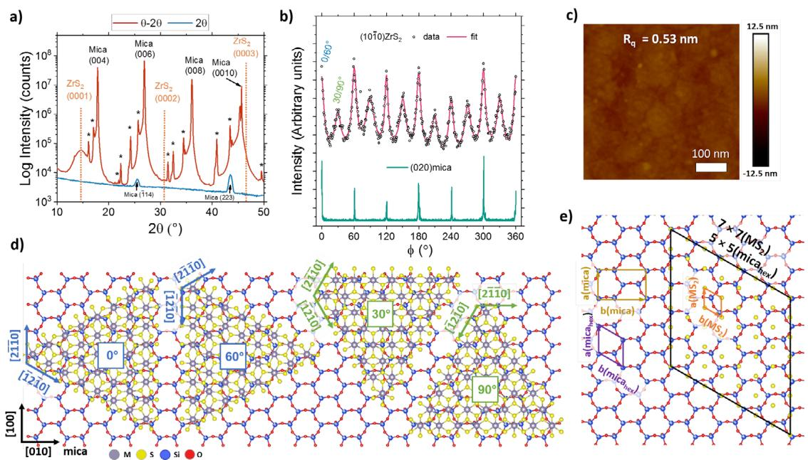
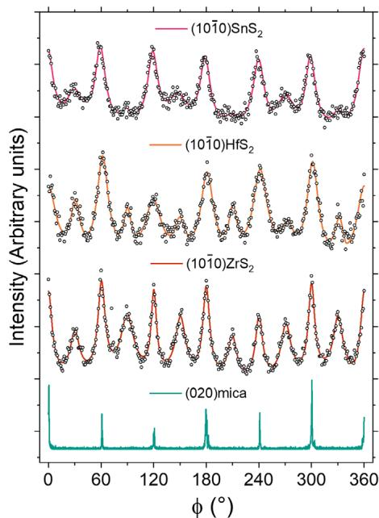
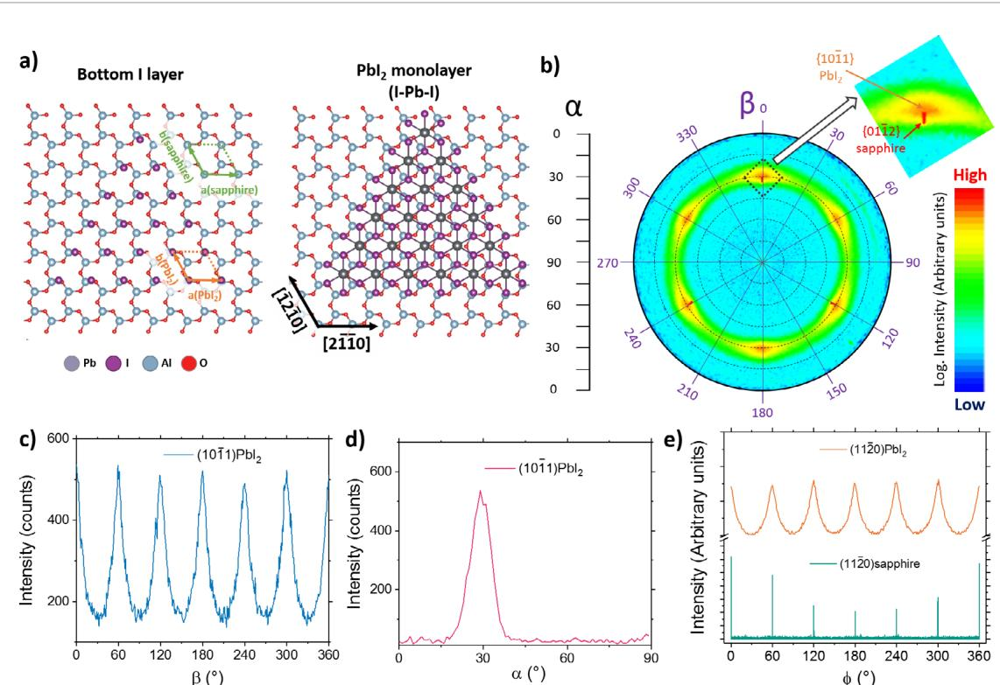

LETTER

# Van der Waals epitaxy of continuous thin films of 2D materials using atomic layer deposition in low temperature and low vacuum conditions

To cite this article: Milka Mattinen et al 2020 ZD Mater. 7 011003

View the article online for updates and enhancements.

# You may also like

- Multimodal spectromicroscopy of monolayer WS $_6$  enabled by ultra-clean van der Waals epitaxy  C Kastl, C T Chen, R J Koch et al.

- Vicinal GaAs(111)B substrates suppress rotational domains in InSe van der Waals epitaxy  Koji Onomitsu, Hiroki Hibino, Hideki Yamamoto et al.

- Heterostructures containing dichalcogenides-new materials with predictable nanoarchitectures and novel emergent properties  Danielle M Hamann, Erik C Hadland and David C Johnson

# LETTER

# Van der Waals epitaxy of continuous thin films of 2D materials using atomic layer deposition in low temperature and low vacuum conditions

RECEIVED 29 July 2019

REVISED 26 September 2019

ACCEPTED FOR PUBLICATION 8 October 2019

PUBLISHED 29 October 2019

Miika Mattinen  $^{\oplus}$ , Peter J King  $^{1,2}$ , Georgi Popov  $^{1}$ , Jani Hamalainen  $^{1,3}$ , Mikko J Heikkila  $^{1}$ , Markku Leskela  $^{1}$  and Mikko Ritala  $^{1}$

$^{1}$  Department of Chemistry, University of Helsinki, PO Box 55, FI- 00014, Finland  $^{2}$  Present address: Picosun Oy, Masalantie 365, FI- 02430, Masala, Finland

E- mail: miika.mattinen@helsinki.fi (M Mattinen) and mikko.ritala@helsinki.fi (M Ritala)

Supplementary material for this article is available online

Keywords: 2D materials, TMDCs, vdW epitaxy, atomic layer deposition

# Abstract

Van der Waals epitaxy holds great promise in producing high- quality films of 2D materials. However, scalable van der Waals epitaxy processes operating at low temperatures and low vacuum conditions are lacking. Herein, atomic layer deposition is used for van der Waals epitaxy of continuous multilayer films of 2D materials  $\mathrm{HfS}_2$ ,  $\mathrm{MoS}_2$ ,  $\mathrm{SnS}_2$ , and  $\mathrm{ZrS}_2$  on muscovite mica and  $\mathrm{PbI}_2$  on sapphire at temperatures between  $75^{\circ}\mathrm{C}$  and  $400^{\circ}\mathrm{C}$ . For the metal sulfides on mica, the main epitaxial relation is  $(0 0 0 1) [2 \bar{1} 0] \mathrm{MS}_2 \| (0 0 1) [1 0 0] \mathrm{mica}$ . Some domains rotated by  $30^{\circ}$  are also observed corresponding to the  $(0 0 0 1) [1 1 0] \mathrm{MS}_2 \| (0 0 1) [1 0 0] \mathrm{mica}$  alignment. In both cases, the presence of domains rotated by  $60^{\circ}$  (mirror twins) is also expected. For  $\mathrm{PbI}_2$  on sapphire, the epitaxial relation is  $(0 0 0 1) [2 \bar{1} 0] \mathrm{PbI}_2 \| (0 0 0 1) [2 \bar{1} 0] \mathrm{Al}_2\mathrm{O}_3$  with no evidence of  $30^{\circ}$  domains. For all of the studied systems there is relatively large in- plane mosaicity and in the  $\mathrm{PbI}_2 / \mathrm{Al}_2\mathrm{O}_3$  system some non- epitaxial domains are also observed. The study presents first steps of an approach towards a scalable and semiconductor industry compatible van der Waals epitaxy method.

2D materials are one of the most active research areas of today due to their unique properties and behavior as well as the potential for ultimate dimensional scaling at (sub)- nanometer level, all arising from their layered crystal structures. After initial groundbreaking studies on first graphene [1, 2] and then  $\mathrm{MoS}_2$  [1, 3], now tens of different 2D materials are being actively explored and scrutinized for a large variety of applications [4- 8]. Currently, semiconducting 2D materials in particular transition metal dichalcogenides (TMDCs) such as  $\mathrm{HfS}_2$ ,  $\mathrm{MoS}_2$ ,  $\mathrm{MoSe}_2$ ,  $\mathrm{ZrS}_2$ ,  $\mathrm{WS}_2$ , and  $\mathrm{WSe}_2$  are of great interest due to the instrumental role of semiconductors in (opto)electronics and photovoltaics [5, 9- 12].

A major obstacle in the industrial application of 2D materials, however, is the difficulty in controlling thickness and crystal quality over wafer- scale dimensions. Ideally, monolayer- level thickness control and thickness uniformity on large as well as three dimensionally structured substrates should be achieved at low temperatures and at reasonable cost. The quality and domain size of the material should preferably be tunable to cater the needs of different applications. Morphology also plays a crucial role: depending on the substrate and growth conditions 2D materials are commonly observed to grow either flat or tilted at a random angle with respect to the substrate [13- 17].

So far, the highest quality 2D materials are usually produced by mechanically exfoliating natural or high- temperature grown single crystals, but scaling the method for industrial applications is practically impossible. Chemical vapor deposition (CVD) processes operating at high temperatures, often  $600^{\circ}\mathrm{C} - 1000^{\circ}\mathrm{C}$ , enable deposition of high- quality, monolayer to few- layer 2D materials [18- 20]. Amorphous substrates, in particular  $\mathrm{SiO}_2$ , are usually used for CVD and a large grain size is pursued through a decrease of the nucleation density by surface treatments and careful control of precursor doses. An alternative approach to minimize grain boundaries uses single crystalline substrates, such as sapphire and mica, in order to enable epitaxial growth of 2D materials.

This approach has been inspired by molecular beam epitaxy (MBE) growth of TMDCs under ultra- high vacuum (UHV) conditions pioneered by Koma [21] in the 1980s and termed van der Waals (vdW) epitaxy.

vdW epitaxy can occur when both the film and the substrate have inert, either 2D or passivated 3D surfaces. The presence of only weak van der Waals interactions between the film and the substrate instead of strong covalent or ionic bonding enables growth of epitaxial films of materials with dissimilar lattice constants and even different crystal structures than the substrate without a buildup of strain in the film [22- 24]. Epitaxial nuclei that share the same orientation can stitch together to effectively form a wafer- scale single crystal. However, as outlined above, vdW epitaxy has been mostly limited to UHV (MBE) or high temperature (CVD) conditions, which are difficult or costly to integrate into existing process flows. Atomic layer deposition (ALD) is a thin film deposition technique based on surface reactions of alternately supplied vapor- phase precursors that offers accurate control over film thickness as well as excellent thickness uniformity, conformality, scalability, and repeatability [25- 27]- attributes which are difficult to achieve with most of the current CVD TMDC processes. Furthermore, ALD processes typically operate at relatively low temperatures from room temperature to  $500^{\circ}\mathrm{C}$  and mbar vacuum levels. ALD has already proven its capabilities in depositing various thin films in the semiconductor and other industries [28, 29]. ALD has also emerged as a promising method for the deposition of 2D materials. However, there are still several challenges, such as control of morphology and grain size as summarized in recent reviews [15- 17].

Herein, we deposited several vdW epitaxial 2D materials, including metal sulfides  $\mathrm{HfS}_2$  [30],  $\mathrm{MoS}_2$  [31],  $\mathrm{ReS}_2$  [32],  $\mathrm{SnS}_2$  [33], and  $\mathrm{ZrS}_2$  [30] as well as a 2D metal halide  $\mathrm{PbI}_2$  [34], by ALD using previously reported processes that operate at relatively low temperatures of  $75^{\circ}\mathrm{C}$  to  $400^{\circ}\mathrm{C}$ . The processes have been previously shown to exhibit self- limiting ALD reactions and typical ALD characteristics including excellent thickness uniformity and conformality, reproducibility, and accurate thickness control. Experimental details are available in supporting information (stacks.iop.org/TDM/7/011003/mmedia). The multilayer,  $3 - 25\mathrm{nm}$  thick films, were deposited on two common vdW epitaxy substrates,  $c$ - plane sapphire and muscovite mica, with  $\mathrm{SiO}_2$ - terminated silicon as a reference substrate. Uniform films were prepared on up to  $5\times 5\mathrm{cm}^2$  substrates. Remarkably, all of the tested trigonal 1T phase metal sulfides  $\mathrm{(HfS_2,SnS_2,}$  and  $\mathrm{ZrS}_2$  grew vdW epitaxially on mica but not on sapphire. Using sapphire instead of silicon strengthened the (0 0 0 1) out- of- plane texture but did not induce the in- plane registration needed for the vdW epitaxy. The situation for the 1T phase  $\mathrm{PbI}_2$  deposited at a very low temperature of  $75^{\circ}\mathrm{C}$  was the reverse compared to the 1T phase sulfides. The  $\mathrm{PbI}_2$  films were non- epitaxial on mica, whereas mostly epitaxial films with some non- epitaxial domains were deposited on sapphire. The hexagonal 2H phase  $\mathrm{MoS}_2$  also exhibited vdW epitaxial growth on mica.  $\mathrm{ReS}_2$  which crystallizes in the unique, distorted triclinic  $1\mathrm{T}^{\prime}$  phase, could not be grown epitaxially on mica or sapphire (see section S9 for more details). The results including the epitaxial relationships are summarized in table 1 and will be discussed in detail below.

The epitaxy of the trigonal 1T metal sulfides on mica is discussed using  $\mathrm{ZrS}_2$  as an example. XRD measurements showed excellent  $(0 0 0 1)\mathrm{ZrS}_2\parallel (0 0 0 1)$  mica out- of- plane alignment, as only the  $(0 0 0 1)$  reflections of both the film and the substrate were seen in a symmetric  $\theta - 2\theta$  measurement and no peaks of the film were observed in an asymmetric grazing incidence (20) measurement (figure 1(a)). A rocking curve of the  $(0 0 0 1)\mathrm{ZrS}_2$  reflection confirmed the strong  $(0 0 0 1)$  texture with a full- width at half- maximum (FWHM) of only  $0.16^{\circ}$  (figure S1, the instrumental broadening was approximately  $0.05^{\circ}$ ).

The in- plane alignment was studied by in- plane XRD measurements of planes perpendicular to the  $(0 0 0 1)$  plane [35]. A  $\phi$  scan of the  $(1 0 \bar{1} 0)\mathrm{ZrS}_2$  reflection resulted in twelve peaks over a full  $360^{\circ}$  rotation, while six peaks were observed for the  $(0 2 0)$  mica reflection (figure 1(b)). Normally, peaks are expected every  $\frac{360}{n}$  degrees for a plane of  $n$ - fold symmetry. The observation of six peaks every  $60^{\circ}$  from mica, which has only mirror symmetry, has been explained by the presence of different stacking orientations [36]. Although the 1T metal sulfides have only three- fold rotational symmetry around the  $c$ - axis, the  $(1 0 \bar{1} 0)$  plane has six- fold symmetry, which results in six peaks from a single in- plane orientation. Thus, at least two orientations of  $\mathrm{ZrS}_2$  were present in rather similar amounts, one with  $[2 \bar{1} \bar{1} 0]\mathrm{ZrS}_2\parallel [1 0 0]$  mica alignment and the other one rotated by  $30^{\circ}$  with respect to the first one, i.e.  $[1 \bar{1} 0 0]\mathrm{ZrS}_2\parallel [1 0 0]$  mica. Rotation by  $60^{\circ}$ , which in this case is equivalent to the formation of mirror twins, is likely to occur considering the mirror symmetry of the mica surface as well as the mismatch in the symmetry between  $\mathrm{ZrS}_2$  and mica [37]. Thus,  $[1 \bar{2} 1 0]\mathrm{ZrS}_2(60^{\circ})$  or  $[0 \bar{1} 1 0]\mathrm{ZrS}_2(90^{\circ})\parallel [1 0 0]$  mica domains are expected to be present.

The  $\mathrm{ZrS}_2$  as well as  $\mathrm{HfS}_2$  and  $\mathrm{SnS}_2$  films deposited on mica were smooth with no clear evidence of the different domains offered by the morphology (figure 1(c)). However, an epitaxial  $\mathrm{SnS}_2$  sample prepared under conditions favoring island- like growth confirmed the presence of four main orientations at  $30^{\circ}$  intervals (figure S2). Fortunately, the twin grain boundaries occurring between 0, 30, 60, and  $90^{\circ}$  domains have not been observed to degrade the electrical properties of 2D dichalcogenides dramatically [38, 39]. The relatively large FWHMs of approximately 9 and  $14^{\circ}$  for the in- plane peaks of the  $0^{\circ} / 60^{\circ}$  and  $30^{\circ} / 90^{\circ}$  domains suggest considerable rotational disorder of the nominally epitaxial  $\mathrm{ZrS}_2$  domains.

r orientation. vdW epi means in-plane registration in addition to the  $(0\textbf{0} I)$  or  $(0\textbf{0} 0\textbf{I})$  out-of-plane orientation (the four-index notation is used for trigonal and hexagonal materials).  

<table><tr><td>Material (structure)</td><td>Films on silicon (native SiO2)</td><td>Films on sapphire</td><td>Films on mica</td></tr><tr><td>HfS2(1T)</td><td>Weak (0 0 0 1) fiber texture</td><td>Weak (0 0 0 1) fiber texture</td><td>vdW epi: mostly [2 1 1 0] or [1 2 1 0]HfS2 || [1 0 0] mica (0°/60°), some [1 1 0 0] or [0 1 1 0]HfS2 || [1 0 0] mica (30°/90°)</td></tr><tr><td>MoS2(2H)</td><td>Weak (0 0 0 1) fiber texture</td><td>Weak (0 0 0 1) fiber texture</td><td>vdW epi: equally [2 1 1 0] or [1 2 1 0]MoS2 || [1 0 0] mica (0°/60°) and [1 1 0 0] or [0 1 1 0]MoS2 || [1 0 0] mica (30°/90°)</td></tr><tr><td>PbI2(1T)</td><td>(0 0 0 1) fiber texture</td><td>vdW epi: [2 1 1 0]PbI2 || [2 1 1 0] sapphire (0°), some non-epitaxial domains, possibly 60° domains</td><td>Weak (0 0 0 1) fiber texture</td></tr><tr><td>SnS2(1T)</td><td>Weak (0 0 0 1) fiber texture</td><td>Weak (0 0 0 1) fiber texture</td><td>vdW epi: mostly [2 1 1 0] or [1 2 1 0]SnS2 || [1 0 0] mica (0°/60°), some [1 1 0 0] or [0 1 1 0]SnS2 || [1 0 0] mica (30°/90°)</td></tr><tr><td>ReS2(1T&#x27;)</td><td>Weak (0 0 0 1) fiber texture</td><td>Weak (0 0 0 1) fiber texture</td><td>Strong (0 0 1) fiber texture</td></tr><tr><td>ZrS2(1T)</td><td>Weak (0 0 0 0 1) fiber texture</td><td>(0 0 0 0 1) fiber texture</td><td>vdW epi: equally [2 1 1 0] or [1 2 1 0]ZrS2 || [1 0 0] mica (0°/60°) and [1 1 0 0] or [0 1 1 0]ZrS2 || [1 0 0] mica (30°/90°)</td></tr></table>

  
Figure 1. vdW epitaxy of  $\mathrm{MS}_2$  films on mica with  $\mathrm{ZrS}_2$  as an example. (a) Out-of-plane x-ray diffractograms (2 $\theta$  and  $\theta -2\theta$  measurements) with the (0 0 0 I)  $\mathrm{ZrS}_2$  (dashed lines) and substrate reflections marked (asterisks mark substrate peaks originating from W L $\alpha$  and Cu K $\beta$  radiation, see section S1). (b) In-plane  $\phi$  scans of (1 0 1 0)  $\mathrm{ZrS}_2$  (28.2° 20 $\chi$ ) and (0 0 0) mica (19.7° 20 $\chi$ ) reflections. The data have been offset vertically for clarity. (c) AFM image of a 7 nm  $\mathrm{ZrS}_2$  film grown on mica at  $400^{\circ}\mathrm{C}$  using 1000 ALD cycles. (d) Schematic of the possible  $\mathrm{MS}_2$  ( $\mathrm{M} = \mathrm{Hf}, \mathrm{Sn}, \mathrm{Zr}$ ) domains on mica (for clarity, only one  $\mathrm{MS}_2$  layer is shown). (e) Schematic of a possible CSL between mica and a  $0^\circ \mathrm{MS}_2$  domain (only bottom colour layer is shown).

The island size in the aforementioned discontinuous  $\mathrm{SnS}_2$  film was approximately  $200\pm 100\mathrm{nm}$  according to AFM (figure S2). For a smooth,  $5\mathrm{nm}$  thick  $\mathrm{SnS}_2$  film on mica, the domain size was estimated as  $70\mathrm{nm}$  using in- plane XRD (figure S3). Comparable  $\mathrm{SnS}_2$  films deposited on sapphire and  $\mathrm{SiO}_2 / \mathrm{Si}$  had average domain (crystallite) sizes of  $23\mathrm{nm}$  and  $14\mathrm{nm}$ . Similarly, the average domain sizes of  $7\mathrm{nm}$  thick  $\mathrm{ZrS}_2$  films were estimated at 40, 17, and  $11\mathrm{nm}$  on mica, sapphire, and  $\mathrm{SiO}_2 / \mathrm{Si}$ , respectively. Thus, using mica improves film quality not only through the epitaxial arrangement but also by the increase of domain size.

Figure 1(d) schematically illustrates the different orientations of the IT phase metal sulfides on the mica surface (additional views are given in figures S4 and S5). Despite different crystal structures, similarities in the mica (monoclinic, space group 15,  $C2 / c$ , JCPDS- ICDD PDF 72- 1503) and  $\mathrm{MS}_2$  (trigonal, space group 164,  $P\bar{3} m1$ , JCPDS- ICDD PDF 28- 444, 23- 677, and 11- 679 for  $\mathrm{HfS}_2$ ,  $\mathrm{SnS}_2$ , and  $\mathrm{ZrS}_2$ ) surfaces can be observed. The bottom sulfur layer of  $\mathrm{MS}_2$  has six- fold symmetry in contrast to three- fold symmetry of a  $\mathrm{MS}_2$  monolayer, i.e. a S- M- S trilayer. The cleaved muscovite mica surface consists of silicon and oxygen atoms and is nearly hexagonal, although strictly speaking it only has mirror symmetry due to small corrugations and variations in atomic positions [36, 40].

Approximating the mica surface as hexagonal allows finding coincidence site lattices (CSLs), where only some of the lattice points of  $\mathrm{MS}_2$  and mica coincide. Due to the weak interactions between the film and the substrate, the CSL concept is particularly relevant for the vdW epitaxy [41- 43]. For the  $0^\circ /60^\circ$  domains, a  $7\times 7$  supercell of  $\mathrm{MS}_2$  shows only a  $- 1.0\%$ $(\mathrm{ZrS}_2)$  to  $- 1.8\%$ $(\mathrm{HfS}_2)$  lattice mismatch with a  $5\times 5$  hexagonal supercell of mica (figures 1(e) and S6) compared to a lattice mismatch of approximately  $- 30\%$  for the unit cells of  $\mathrm{MS}_2$  and mica. For the  $30^\circ /90^\circ$  domains, CSL with less than  $2\%$  mismatch can also be

  
Figure 2. Comparison of different  $\mathrm{MS}_2$  films on mica. In-plane  $\phi$  scans of the (1 0 1 0) reflections of  $\mathrm{SnS}_2$  (28.35° 20 $\chi$ ),  $\mathrm{HfS}_2$  (28.6° 20 $\chi$ ), and  $\mathrm{ZrS}_2$  (28.2° 20 $\chi$ ) films. For clarity, only a single measurement of the (0 2 0) mica reflection is shown (19.7° 20 $\chi$ ), although the registration was individually checked for each sample. The data has been offset vertically.

  
Figure 3. vdW epitaxy of  $\mathrm{PbI}_2$  on sapphire. (a) Schematic of the epitaxial alignment of  $\mathrm{PbI}_2$  on sapphire with either the bottom iodine layer or a  $\mathrm{PbI}_2$  monolayer shown on the  $(0\mathrm{001})$  sapphire surface. Characterization of an epitaxial  $\mathrm{PbI}_2$  film on sapphire. (b) In-plane pole figure at  $25.95^{\circ}2\theta$  inset showing a zoomed view of the dashed area with both the  $\{0\mathrm{1}\bar{1} 2\}$  sapphire and  $\{1\bar{0}\bar{1}\bar{1}\}$ $\mathrm{PbI}_2$  reflections visible. Extracted (c)  $\beta$  scan along  $\alpha = 29^{\circ}$  and (d)  $\alpha$  scan along  $\beta = 180^{\circ}$  . (e) In-plane  $\phi$  scans of the  $(1\bar{1} 20)\mathrm{PbI}_2$ $(39.45^{\circ}2\theta \chi)$  and  $(1\bar{1}\bar{2} 0)$  sapphire  $(37.65^{\circ}2\theta \chi)$  reflections. The data in (e) has been offset vertically for clarity.

found (figure S6). The lattice mismatches were calculated using reported lattice parameters. Previously, the mica surface has been observed to relax once cleaved [44, 45]. Furthermore, Kuwahara [45] observed approximately  $\pm 5\%$  variation in the unit cell dimensions across a cleaved mica surface. The first  $\mathrm{MS}_2$  layer may also be strained to better match the mica surface, although no obvious strain was observed in the bulk of the films. Thus, it is difficult to predict the actual interface structure.

Films of all of the studied 1T phase metal sulfides, i.e.  $\mathrm{HfS}_2$ ,  $\mathrm{SnS}_2$ , and  $\mathrm{ZrS}_2$ , were epitaxial on mica with the same in- plane alignments for the majority of the crystallites (figure 2). In terms of the out- of- plane orientation, all of these materials were strongly  $(0\mathrm{001})$  oriented with FWHMs of  $0.15^{\circ} - 0.17^{\circ}$  (figures S1, S7 and S8). In- plane, both  $0^{\circ} / 60^{\circ}$  and  $30^{\circ} / 90^{\circ}$  domains were observed for all of the materials, although in different amounts. For  $\mathrm{SnS}_2$ , the amount of the  $30^{\circ} / 90^{\circ}$  domains was the lowest, whereas for  $\mathrm{ZrS}_2$  nearly identical amounts of the  $0^{\circ} / 60^{\circ}$  and  $30^{\circ} / 90^{\circ}$  domains were observed. The intensity ratios of the  $0^{\circ} / 60^{\circ}$  to  $30^{\circ} / 90^{\circ}$  domains obtained by integrating the peak areas were approximately 4:1, 3:1, and 1:1 for  $\mathrm{SnS}_2$ ,  $\mathrm{HfS}_2$ , and  $\mathrm{ZrS}_2$ , respectively. Furthermore, differences in the FWHMs were observed. The  $0^{\circ} / 60^{\circ}$  domains of  $\mathrm{ZrS}_2$  exhibited the smallest, although still quite large, mosaicity with a FWHM of approximately  $9^{\circ}$  compared to  $14^{\circ}$  and  $19^{\circ}$  for  $\mathrm{SnS}_2$  and  $\mathrm{HfS}_2$ . Similar in- plane FWHMs have been observed in several reports on vdW epitaxy [46- 48]. However, using a three- step CVD process at  $800^{\circ}\mathrm{C}$ ,

Zhang et al [49] obtained an in- plane FWHM of only  $0.28^{\circ}$  for  $\mathrm{WSO}_2$  on sapphire. Thus, we believe that the in- plane disorder can be decreased by further optimization of our process.

$\mathrm{MoS}_2$  crystallizes in the hexagonal 2H structure (space group 194, P63/mmc, JCPDS- ICDD PDF 37- 1492) and has a much smaller in- plane lattice constant  $(a,b = 3.16\mathrm{\AA})$  compared to  $\mathrm{HfS}_2$ ,  $\mathrm{SnS}_2$ , and  $\mathrm{ZrS}_2$ .  $\mathrm{MoS}_2$  films grew vdW epitaxially on mica, although with somewhat weaker  $(0\mathrm{001})$  out- of- plane texture and rougher surface as compared to the 1T metal sulfides studied above (figures S9- S11). Non- epitaxial, rough films were deposited on sapphire and  $\mathrm{SiO}_2 / \mathrm{Si}$  (figure S12). Approximately equal amounts of  $[2\bar{1}\bar{1} 0]$  or  $[1\bar{2} 10]\mathrm{MoS}_2\parallel [1\bar{0} 0]\mathrm{mica}(0^{\circ} / 60^{\circ})$  and  $[1\bar{1} 00]$  or  $[0\bar{1} 10]\mathrm{MoS}_2\parallel [1\bar{0} 0]\mathrm{mica}(30^{\circ} / 90^{\circ})$  orientations were observed (figures S13- S15). The nearly  $- 40\%$  lattice mismatch is reduced to  $- 2.4\%$  for  $8\times 8$ $\mathrm{MoS}_2$  supercell on a  $5\times 5$  hexagonal mica supercell for the  $0^{\circ} / 60^{\circ}$  domains, whereas a  $\sqrt{3}\times \sqrt{3}\mathrm{MoS}_2$  supercell on a  $1\times 1$  hexagonal mica unit cell results in a relatively small mismatch of  $5.8\%$  for the  $30^{\circ} / 90^{\circ}$  domains (figure S16).

On the  $\alpha$ - plane sapphire, i.e.  $(0\mathrm{001})\alpha \mathrm{- Al}_2\mathrm{O}_3$ , only the  $\mathrm{PbI}_2$  films could be grown epitaxially, whereas all of the other materials formed non- epitaxial films that were more strongly  $(0\mathrm{001})$  textured compared to the amorphous  $\mathrm{SiO}_2 / \mathrm{Si}$  (see section S10). The failure to obtain epitaxial growth might be ascribed to the relatively low deposition temperatures compared to the earlier reports of vdW epitaxy on sapphire (see

section S13 for a literature survey). It has been suggested that epitaxy of TMDCs on sapphire is enabled by chemical reduction of the sapphire surface in a chalcogen environment at high temperatures [50], or by formation of a chalcogen- terminated surface layer on the sapphire [51]. Both are be unlikely to occur under our mild ALD conditions. Further comparing  $\mathrm{PbI}_2$  to the studied 1T sulfides, it is interesting that  $\mathrm{PbI}_2$  films on mica, unlike the 1T sulfides, were not epitaxial but composed of rather randomly oriented domains (figure S24).

In literature, the (0 0 0 1) sapphire surface is suggested to be Al- terminated over a range of preparation conditions [52, 53]. Thus, we consider an Al- terminated surface with bulk atomic positions, i.e. with a somewhat corrugated hexagonal Al layer on top and a slightly distorted hexagonal oxygen layer beneath it. The successful epitaxy of  $\mathrm{PbI}_2$  on sapphire might be due to the large in- plane lattice constants of  $\mathrm{PbI}_2$  ( $a,b = 4.56\mathrm{\AA}$ ; trigonal, space group 164,  $P\bar{3} m1$ , JCPDS- ICDD PDF 7- 235), which are approximately  $25\%$  larger compared to  $\mathrm{HfS}_2$ ,  $\mathrm{SnS}_2$ , and  $\mathrm{ZrS}_2$  and only  $4.2\%$  smaller than those of  $\alpha - \mathrm{Al}_2\mathrm{O}_3$  ( $a,b = 4.76\mathrm{\AA}$  using the conventional hexagonal unit cell; trigonal, space group 167,  $R\bar{3} c$ , JCPDS- ICDD PDF 46- 1212). This enables epitaxial growth with a simple 1:1 relationship between the unit cells of  $\mathrm{PbI}_2$  and sapphire as shown in figure 3(a) (tilted view in figure S25).

The  $\mathrm{PbI}_2$ /sapphire system was initially studied by an in- plane pole figure measured at  $25.95^{\circ}2\theta$  (figure 3(b)), which corresponds to the asymmetric  $(1\mathrm{0}\bar{1}\mathrm{1})\mathrm{PbI}_2$  reflection but is also close enough to the asymmetric  $(0\mathrm{1}\bar{1} 2)$  sapphire reflection to yield information on the film/substrate registration. Three sharp peaks over a  $360^{\circ}$  rotation were observed for the sapphire reflection, whereas six broader peaks were seen for  $\mathrm{PbI}_2$ , both being as expected for a single in- plane orientation considering the symmetry of the reflections. The alignment of the  $(1\mathrm{0}\bar{1}\mathrm{1})\mathrm{PbI}_2$  and  $(0\mathrm{1}\bar{1} 2)$  sapphire reflections corresponds to the  $(0\mathrm{0}\mathrm{1})[2\bar{1}\bar{1} 0]\mathrm{PbI}_2\parallel (0\mathrm{0}\mathrm{1})[2\bar{1}\bar{1} 0]\mathrm{Al}_2\mathrm{O}_3$  epitaxial relation, i.e. parallel alignment of all the unit cell axes of  $\mathrm{PbI}_2$  and sapphire as expected from the relatively small lattice mismatch between the film and the substrate. Presence of  $\mathrm{PbI}_2$  mirror twins, i.e.  $(0\mathrm{0}\mathrm{1})[1\bar{2}\mathrm{1}0]\mathrm{PbI}_2\parallel (0\mathrm{0}\mathrm{1})[2\bar{1}\bar{1} 0]\mathrm{Al}_2\mathrm{O}_3$ , could not be ruled out, however. Contrary to the metal sulfides grown on mica, no  $30^{\circ} / 90^{\circ}$  domains were observed. The relatively broad peaks in  $\beta$  (FWHM  $13^{\circ}$ , figure 3(c)) and  $\alpha$  scans (FWHM  $9^{\circ}$ , figure 3(d)) extracted from the in- plane pole figure suggest disorder in both the in- plane and out- of- plane orientations, respectively. The elevated background in the in- plane  $\beta$  direction as well as out- of- plane XRD and the presence of some vertical flakes on the film surface show that some of the domains are not epitaxially aligned (see also figures S26- S28). The epitaxial  $\mathrm{PbI}_2$  films on sapphire are much rougher compared to the 1T sulfides on mica due to the pyramidal shape of the  $\mathrm{PbI}_2$  grains (figure S28). In- plane XRD measurements confirmed the in- plane alignment, the absence of  $30^{\circ} / 90^{\circ}$  domains and the presence of some non- epitaxial domains (figure 3(e)). Considering the very low deposition temperature of  $75^{\circ}C$ , there is further room for improvement of the epitaxial quality by post- deposition annealing, although the easy sublimation of  $\mathrm{PbI}_2$  should be kept in mind. To the best of our knowledge, epitaxy in the  $\mathrm{PbI}_2$ /sapphire system has not been reported before, whereas  $\mathrm{PbI}_2$  has been grown epitaxially on mica, Se- terminated GaAs(111), and various TMDCs (table S2).

In conclusion, we have achieved vdW epitaxial growth of various 2D metal sulfides ( $\mathrm{HfS}_2$ ,  $\mathrm{MoS}_2$ ,  $\mathrm{SnS}_2$ , and  $\mathrm{ZrS}_2$ ) on muscovite mica and  $\mathrm{PbI}_2$  on sapphire using ALD. The films were deposited at low temperatures ( $75^{\circ}\mathrm{C} - 400^{\circ}\mathrm{C}$ ) and low vacuum conditions ( $\sim 5\mathrm{mbar}$ ) in contrast to the previously used high temperatures and/or UHV conditions. Furthermore, using our approach, it is possible to benefit from the favorable characteristics of ALD including accurate and reproducible control of thickness, scalability, and excellent thickness uniformity and conformality. Epitaxial growth was observed using different classes of ALD precursors at different temperatures, which shows the generality of the approach and opens new avenues for the future research, including growth of heterostructures. In the future, we envision tuning the growth conditions, pre- and post- treatments as well as testing different substrates in order to reduce the number of different epitaxial orientations and in- plane mosaicity.

# Acknowledgments

The research was supported by ASM Microchemistry.

# Associated content

# Supporting information

Experimental details of film deposition and characterization, additional XRD characterization and schematics on the epitaxy of  $\mathrm{HfS}_2$ ,  $\mathrm{SnS}_2$ , and  $\mathrm{ZrS}_2$  films on mica, characterization of  $\mathrm{MoS}_2$  and  $\mathrm{ReS}_2$  films on Si, sapphire, and mica including details on the vdW epitaxy of  $\mathrm{MoS}_2$  on mica, additional characterization of  $\mathrm{PbI}_2$  films on sapphire, and discussion of previously reported vdW epitaxy processes.

# ORCID iDs

Miika Mattinen https://orcid.org/0000- 0003- 4837- 1823 Georgi Popov https://orcid.org/0000- 0003- 1233- 8327 Mikko J Heikkila https://orcid.org/0000- 0002- 6027- 2089 Markku Leskela https://orcid.org/0000- 0001- 5830- 2800 Mikko Ritala https://orcid.org/0000- 0002- 6210- 2980

# References

[1] Novoselov K S, Geim A K, Morozov S V, Jiang D, Zhang Y, Dubonos S V, Grigorieva I V and Firsov A A 2004 Electric field effect in atomically thin carbon films Science 306 666- 9 [2] Allen M J, Tung V C and Kaner R B 2010 Honeycomb carbon: a review of graphene Chem. Rev. 110 132- 45 [3] Radisavljevic B, Radenovic A, Brivio J, Giacometti V and Kis A 2011 Single- layer  $\mathrm{MoS_2}$  transistors Nat. Nanotechnol. 6 147- 50 [4] Zhang K, Feng Y, Wang F, Yang Z and Wang J 2017 Two dimensional hexagonal boron nitride (2D- hBN): synthesis, properties and applications J. Mater. Chem. C 5 11992- 2022 [5] Samadi M, Sarikhani N, Zirak M, Zhang H, Zhang H- L and Moshfegh A Z 2018 Group 6 transition metal dichalcogenide nanomaterials: synthesis, applications and future perspectives Nanoscale Horizons 3 90- 204 [6] Han G H, Duong D L, Keum D H, Yun S J and Lee Y H 2018 Van Der Waals metallic transition metal dichalcogenides Chem. Rev. 118 6297- 36 [7] Hossain M, Zhao Z, Aven W, Wang X, Wu J and Xie L 2017 Recent advances in two- dimensional materials with charge density waves: synthesis characterization and applications Crystals 7 298 [8] Dai J, Li M and Zeng X C 2016 Group IVB transition metal trichalcogenides: a new class of 2D layered materials beyond graphene Wiley Interdiscip. Rev. 6 211- 22 [9] Song X, Guo Z, Zhang Q, Zhou P, Bao W and Zhang D W 2017 Progress of large- scale synthesis and electronic device application of two- dimensional transition metal dichalcogenides Small 13 1700098 [10] Yan C et al 2018 2D group IVB transition metal dichalcogenides Adv. Funct. Mater. 28 1803305 [11] Das S, Pandey D, Thomas J and Roy T 2018 The role of graphene and other 2D materials in solar photovoltaics Adv. Mater. 31 1802722 [12] Schwierz F, Pezoldt J and Granzner R 2015 Two- dimensional materials and their prospects in transistor electronics Nanoscale 7 8261- 86 [13] Pakdel A, Bando Y and Golberg D 2014 Nano boron nitride flatland Chem. Soc. Rev. 43 934- 59 [14] You J, Hossain M D and Luo Z 2018 Synthesis of 2D transition metal dichalcogenides by chemical vapor deposition with controlled layer number and morphology Nano Converg. 5 26 [15] Hao W, Marichy C and Journet C 2019 Atomic layer deposition of stable 2D materials 2D Mater. 6 012001 [16] Leskela M, Mattinen M and Ritala M 2019 Review article: atomic layer deposition of optoelectronic materials J. Vac. Sci. Technol. B 37 030801 [17] Huang Y and Liu J 2019 Recent progress in atomic layer deposition of molybdenum disulfide: a mini review Sci. China Mater. 62 913- 24 [18] Ji Q, Zhang Y, Zhang Y and Liu Z 2015 Chemical vapour deposition of group- VIII metal dichalcogenide monolayers: engineered substrates from amorphous to single crystalline Chem. Soc. Rev. 44 2587- 602 [19] Cai Z, Liu B, Zou X and Cheng H- M 2018 Chemical vapor deposition growth and applications of two- dimensional materials and their heterostructures Chem. Rev. 118 6091- 133 [20] Bosi M 2015 Growth and synthesis of mono and few- layers transition metal dichalcogenides by vapour techniques: a review RSC Adv. 8 75500- 18 [21] Koma A, Sunouchi S and Miyajima T 1984 Fabrication and characterization of heterostructures with subnanometer thickness Microelectron. Eng. 2 129- 36 [22] Koma A 1992 Van Der Waals epitaxy—a new epitaxial growth method for a highly lattice- mismatched system Thin Solid Films 216 72- 6 [23] Walsh L A and Hinkle C L 2017 Van Der Waals epitaxy: 2D materials and topological insulators Appl. Mater. Today 9 504- 15 [24] Walsh L A, Addou R, Wallace R M and Hinkle C L 2018 Molecular beam epitaxy of transition metal dichalcogenides Molecular Beam Epitaxy ed M Henini (Amsterdam: Elsevier) pp 515- 31

[25] George S M 2010 Atomic layer deposition: an overview Chem. Rev. 110 111- 31 [26] Ritala M and Niinisto J 2009 Atomic layer deposition Chemical Vapour Deposition: Precursors, Processes and Applications ed A C Jones and M L Hitchman (Cambridge, MA: Royal Society of Chemistry) pp 158- 206 [27] Leskela M, Niinisto J and Ritala M 2014 Atomic layer deposition Comprehensive Materials Processing vol 4, ed S Hashmi and D Cameron (Amsterdam: Elsevier) pp 101- 23 [28] Ritala M and Niinisto J 2009 Industrial applications of atomic layer deposition ECS Trans. 25(8) 641- 52 [29] Raaijmakers I J 2011 Current and future applications of ALD in micro- electronics ECS Trans. 41(2) 3- 17 [30] Mattinen M, Popov G, Vehkamaki M, King P J, Mizohata K, Jalkanen P, Raisanen J, Leskela M and Ritala M 2019 Atomic layer deposition of emerging 2D semiconductors,  $\mathrm{HIS}_2$  and  $\mathrm{ZrS}_2$ , for optoelectronics Chem. Mater. 31 5713- 24 [31] Mattinen M, Hatanpaa T, Sarnet T, Mizohata K, Meinander K, King P J, Khriachtchev L, Raisanen J, Ritala M and Leskela M 2017 Atomic layer deposition of crystalline  $\mathrm{MoS_2}$  thin films: new molybdenum precursor for low- temperature film growth Adv. Mater. Interfaces 4 1700213 [32] Hamalainen J, Mattinen M, Mizohata K, Meinander K, Vehkamaki M, Raisanen J, Ritala M and Leskela M 2018 Atomic layer deposition of rhenium disulfide Adv. Mater. 30 1703622 [33] Mattinen M, King P J, Khriachtchev L, Meinander K, Gibbon J T, Dhanak V R, Raisanen J, Ritala M and Leskela M 2018 Low- temperature Wafer- scale deposition of continuous 2D  $\mathrm{SnS_2}$  films Small 14 1800547 [34] Popov G, Mattinen M, Hatanpaa T, Vehkamaki M, Kemell M, Mizohata K, Raisanen J, Ritala M and Leskela M 2019 Atomic layer deposition of  $\mathrm{PbI}_2$  thin films Chem. Mater. 31 1101- 9 [35] Kobayashi S 2010 X- ray thin film measurements techniques IV, in- plane XRD measurements Rigaku J 26 3- 11 [36] Simbrunner C, Hernandez- Sosa G, Oehzelt M, Djuric T, Salzmann I, Brinkmann M, Schwabegger G, Watzinger I, Sitter H and Resel R 2011 Epitaxial growth of sexithiophene on mica surfaces Phys. Rev. B 83 115443 [37] Grundmann M, Bontgen T and Lorenz M 2010 Occurrence of rotation domains in heteroepityaxy Phys. Rev. Lett. 105 146102 [38] van der Zande A M, Huang P Y, Chenet D A, Berkelbach T C, You Y, Lee G H, Heinz T F, Reichman D R, Muller D A and Hone J C 2013 Grains and grain boundaries in highly crystalline monolayer molybdenum disulphide Nat. Mater. 12 554- 61 [39] Dumcenco D et al 2015 Large- area epitaxial monolayer  $\mathrm{MoS_2}$  ACS Nano 9 4611- 20 [40] Christenson H K and Thomson N H 2016 The nature of the air- cleaved mica surface Surf. Sci. Rep. 71 367- 90 [41] Boschker J B, Galves L A, Flissikowski T, Lopes J M J, Riechert H and Calarco R 2016 Coincident- site lattice matching during van Der Waals epitaxy Sci. Rep. 5 18079 [42] Wang S F, Feng W K, Wang W and Surya C 2014 Growth of highly textured SnS on mica using an SnSe buffer layer Thin Solid Films 64 206- 12 [43] Koda D S, Barchstedt F, Marques M and Teles L K 2016 Coincidence lattices of 2D crystals: heterostructure predictions and applications J. Phys. Chem. C 120 10895- 908 [44] Fukuma T, Neda Y, Yoshioka S and Asakawa H 2010 Atomic- scale distribution of water molecules at the mica- water interface visualized by three- dimensional scanning force microscopy Phys. Rev. Lett. 104 016101 [45] Kuwahara Y 2001 Comparison of the surface structure of the tetrahedral sheets of muscovite and phlogopite by AFM Phys. Chem. Miner. 28 1- 8 [46] Cattelan M, Markman B, Lucchini G, Das P K, Vobornik I, Robinson J A, Agnoli S and Granozzi G 2015 New strategy for the growth of complex heterostructures based on different 2D materials Chem. Mater. 27 4105- 13 [47] Nakano M, Wang Y, Kashiwabara Y, Matsuoka H and Iwasa Y 2017 Layer- by- layer epitaxial growth of scalable  $\mathrm{WSe_2}$  on sapphire by molecular beam epitaxy Nano Lett. 17 5595- 9

[48] Klein A, Tiefenbacher S, Eyert V, Pettenkofer C and Jaegermann W 2001 Electronic band structure of single- crystal and single- layer  $\mathrm{WS}_2$ : influence of interlayer van der Waals interactions Phys. Rev. B 64 205416[49] Zhang X, Choudhury T H, Chubarov M, Xiang Y, Jariwala B, Zhang F, Alem N, Wang G- C, Robinson J A and Redwing J M 2018 Diffusion- controlled epitaxy of large area coalesced  $\mathrm{WSe}_2$  monolayers on sapphire Nano Lett. 18 1049- 56[50] Suenaga K et al 2018 Surface- mediated aligned growth of monolayer  $\mathrm{MoS}_2$  and in- plane heterostructures with graphene on sapphire ACS Nano 12 10032- 44

[51] Lin Y- C et al 2018 Realizing large- scale, electronic- grade two- dimensional semiconductors ACS Nano 12 965- 75[52] Soares E A, Van Hove M A, Walters C F and McCarty K F 2002 Structure of the  $\alpha - \mathrm{Al}_2\mathrm{O}_3(0001)$  surface from low- energy electron diffraction: Al termination and evidence for anomalously large thermal vibrations Phys. Rev. B 65 195405[53] Walters C F, McCarty K F, Soares E A and Van Hove M A 2000 The structure of the  $\alpha - \mathrm{Al}_2\mathrm{O}_3(0001)$  surface from low- energy electron diffraction: Al termination and evidence for large thermal vibrations Surf. Sci. 464 L732- 8