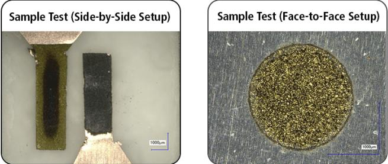

# OPEN ACCESS

# You may also like

# Atomic Layer Deposition of Nanolaminate Structures of Alternating PbTe and PbSe Thermoelectric Films

- (Invited) Phonon Engineering for Improved Seebeck Coefficient and Thermal Conductivity of Thermoelectric Nanolaminate Films Synthesized on Porous Templates Helmut Baumgart, Xin Chen and Kai Zhang

To cite this article: K. Zhang et al 2014 ECS J. Solid State Sci. Technol. 3 P207

- ALD Growth of PbTe and PbSe Superlattices for Thermoelectric Applications Kai Zhang, Arun Deepak Ramalingom Pillai, David Nminibapiel et al.

View the article online for updates and enhancements.

- Influence of Crystal Size on the Spectral Response Limit of Evaporated PbTe and PbSe Photoconductive Cells W. D. Lawson, F. A. Smith and A. S. Young

# ECC-Opto-10 Optical Battery Test Cell: Visualize the Processes Inside Your Battery!

- Battery Test Cell for Optical Characterization Designed for light microscopy, Raman spectroscopy and XRD.

- Optimized, Low Profile Cell Design (Device Height 21.5 mm) Low cell height for high compatibility, fits on standard samples stages.

- High Cycling Stability and Easy Handling Dedicated sample holders for different electrode arrangements included!

# Cell Lids with Different Openings and Window Materials Available

Contact us: +49 40 79012- 734 sales@tel- cell.com www.ell- cell.com

# Atomic Layer Deposition of Nanolaminate Structures of Alternating PbTe and PbSe Thermoelectric Films

K. Zhang a,b,\* 
A. 
D. Ramalingom Pillai,a,b 
K. Bollenbach a,b,\*\* 
D. Nminibapiel,a,b,\*\* 
W. Cao,a,b 
H. Baumgart,a,b,\* 
T. Scherer,c,d 
V. 
S. 
K. Chakravadhanula,c,d,e Christian Kubel,c,e and 
V. Kochergin

aDepartment of Electrical and Computer Engineering, Old Dominion University, Norfolk, Virginia 23529, USA  bApplied Research Center at Thomas Jefferson National Accelerator Laboratories, Newport News, Virginia 23606, USA  cKarlsruhe Nano Micro Facility, 76344 Eggenstein- Leopoldshafen, Germany  dInstitute for Nanotechnology (INT), Karlsruhe Institute of Technology (KIT) - Campus Nord, 76344 Eggenstein- Leopoldshafen, Germany  eHehnschele Institute of (HHU) Electrochemical Energy Storage, 89801 Ulm, Germany  fMicroXact Inc., Christiansburg, Virginia 24073, USA

For this study PbTe and PbSe thin film nanolaminates have been prepared on silicon substrates with native oxide by Atomic Layer Deposition (ALD) using lead(II)bis(2,2,6,6- tetramethyl- 3,5- heptanedionato)  $(\mathrm{Pb(C_1H_{11}H_9O_2)_2})$  (trimethylsilyl) telluride  $((\mathrm{Me}_3\mathrm{Si})_2\mathrm{Te})$  and bis- (triethyl silyl) selane  $((\mathrm{Et}_3\mathrm{Si})_2\mathrm{Se})$  as ALD precursors for lead, tellurium and selenium. The experimental evidence revealed the ALD growth of lead telluride and lead selenide followed the Vollmer- Weber island growth mode. We found a strong dependence of the nucleation process on the temperature. In this paper, we present the optimized conditions for growing PbTe and PbSe thin film nanolaminates within the ALD process window range of  $170^{\circ}\mathrm{C}$  to  $210^{\circ}\mathrm{C}$  and discuss an early nano- scale PbTe/PbSe bilayer structure. Results of various physical and characterizations techniques and analysis are reported.

$\mathfrak{G}$  The Author(s) 2014. Published by ECS. This is an open access article distributed under the terms of the Creative Commons Attribution Non- Commercial No Derivatives 4.0 License (CC BY- NC- ND, http://creativecommons.org/licenses/by- nc- nd/4.0/), which permits non- commercial reuse, distribution, and reproduction in any medium, provided the original work is not changed in any way and is properly cited. For permission for commercial reuse, please email: oa@electrochem.org. [DOI: 10.1149/2.014406jss] All rights reserved.

Manuscript submitted January 14, 2014; revised manuscript received April 17, 2014. Published May 10, 2014. This was Paper 1857 presented at the San Francisco, California, Meeting of the Society, October 27- November 1, 2013.

Lead chalcogenides such as PbTe, PbSe and PbS have attracted considerable attention over the past few years, because of their superior optical, electrical and mechanical properties. The efficiency of a thermoelectric material is determined by the dimensionless thermoelectric figure of merit,  $ZT = \sigma S^2 T / \kappa$  ,where  $S$  is the Seebeck coefficient,  $\sigma$  is the electrical conductivity, and  $\kappa$  is the thermal conductivity. The thermal conductivity actually is consisting from electron and phonon contributions  $\kappa = \kappa e + \kappa p$  2 To improve upon the  $ZT$  the Seebeck coefficient and electrical conductivity must increase, whereas the thermal conductivity  $\kappa$  must decrease. The ZT of the material is related to the efficiency of the TE device,

$$
\eta = \gamma \frac{(1 + ZT)^{1 / 2} - 1}{(1 + ZT)^{1 / 2} + T_{hot} / T_{cold}}
$$

where  $\gamma$  is the Carnot efficiency and  $T_{hot}$  and  $T_{cold}$  are temperatures (in K) of the hot and cold side of the TE material.

By using ALD, such ZT improvement can be achieved, because it is possible to modulate the materials properties at the nanoscale level, which constitutes a low dimensional structure. The characteristics of bulk materials are different from that of thin films for every material. By ALD deposition of alternating PbTe and PbSe thin films we are able to create superlattice (SL) structures. These structures may significantly enhance ZT as the electrons were confined to move in two dimensions. In addition, the improvement of ZT is resulted from the fact that the interfaces between layers in the superlattice structures could increase the phonon scattering and consequently decrease the phonon thermal conductivity. Low dimensional material systems3- 5 were shown to exhibit significantly higher ZT values than that in bulk materials. In bulk thermoelectric materials the quantities  $S,\sigma$  and  $\kappa$  are interrelated in such a way as to make independent control of these variables to increase ZT very difficult. However, this correlation between  $S,\sigma$  and  $\kappa$  is not maintained in materials with reduced dimensionality, such as quantum wells (superlattices), quantum wires and quantum dots, where introduction of a new variable (length scale) permits decoupling of the aforementioned parameters and allows them to be optimized simultaneously.

PbTe is a useful narrow bandgap thermoelectric material that can operate at comparatively higher temperatures in the range of  $600\sim 850\mathrm{K}$  due to its better chemical stability and high melting point.6,7 PbTe and PbSe present a good choice for thermoelectric energy harvesting devices, especially in the automobile sector and power plants, if its thermoelectric efficiency ZT can be significantly improved. The state- of- the- art power generation efficiency of thermoelectric devices is currently approximately  $12\%$ . The heat wasted in many machines could thus be converted into useful renewable energy and thereby contribute to reducing global warming and reducing pollution by saving gasoline in automobiles. Besides, this material can also be used in infrared imaging applications or cooling devices. Although various deposition techniques like Molecular Beam Epitaxy (MBE),8 Chemical Vapor Deposition (CVD),9 RF magnetron sputtering,10 Pulsed Laser Deposition (PLD)11 and Electrochemical ALD (E- ALD)12,13 have been applied in the past for thermoelectric materials, very little is known about the potential of ALD synthesis of PbTe and PbSe. ALD is considered a promising method to synthesize PbTe/PbSe nanolaminate structures. Atomic Layer Deposition technology has numerous advantages over conventional thin film deposition techniques. It can precisely control the film layer thickness, the stoichiometry, the composition, the uniformity, and produce sharp interfaces in nanolaminate structures. ALD is a self- limiting surface saturating atomic layer reaction and can also be used to deposit conformal films onto very complex structures. In general ALD has been shown to be able to generate reproducible and well- defined nanolaminate structures.14,15 In this study the relatively new thermal ALD technology has been used for the first time for PbTe and PbSe thin film synthesis.

# Experimental

The PbTe films were grown on a Si (100) wafer covered with native oxide by ALD using lead(II)bis(2,2,6,6- tetramethyl-

Table I. Experimental details of process development for ALD PbTe films. Samples indicated with \* have been analyzed by SEM, TEM, XRD and/or EDS.  

<table><tr><td>Sample #</td><td>Te Precursor</td><td>Precursor Temp. (°C)</td><td>Pulse time (s)</td><td>Pb Precursor</td><td>Precursor Temp. (°C)</td><td>Pulse time (s)</td><td>Dep. Temp. (°C)</td><td># of ALD Cycles</td></tr><tr><td>PbTe-1</td><td>(Me3Si)2Te</td><td>40</td><td>0.02</td><td>Pb(C11H19O2)2</td><td>140</td><td>0.5</td><td>150</td><td>500</td></tr><tr><td>PbTe-2</td><td>(Me3Si)2Te</td><td>40</td><td>0.02</td><td>Pb(C11H19O2)2</td><td>140</td><td>0.5</td><td>170</td><td>500</td></tr><tr><td>PbTe-3</td><td>(Me3Si)2Te</td><td>40</td><td>0.02</td><td>Pb(C11H19O2)2</td><td>140</td><td>0.5</td><td>210</td><td>500</td></tr><tr><td>PbTe-4</td><td>(Me3Si)2Te</td><td>40</td><td>0.02</td><td>Pb(C11H19O2)2</td><td>140</td><td>0.5</td><td>230</td><td>500</td></tr><tr><td>PbTe-5</td><td>(Me3Si)2Te</td><td>40</td><td>0.02</td><td>Pb(C11H19O2)2</td><td>140</td><td>0.5</td><td>250</td><td>500</td></tr><tr><td>PbTe-6</td><td>(Me3Si)2Te</td><td>40</td><td>0.03</td><td>Pb(C11H19O2)2</td><td>140</td><td>0.5</td><td>170</td><td>500</td></tr><tr><td>PbTe-7</td><td>(Me3Si)2Te</td><td>40</td><td>0.01</td><td>Pb(C11H19O2)2</td><td>140</td><td>0.5</td><td>170</td><td>500</td></tr><tr><td>PbTe-8</td><td>(Me3Si)2Te</td><td>40</td><td>0.1</td><td>Pb(C11H19O2)2</td><td>140</td><td>0.5</td><td>170</td><td>500</td></tr><tr><td>PbTe-9*</td><td>(Me3Si)2Te</td><td>40</td><td>0.02</td><td>Pb(C11H19O2)2</td><td>140</td><td>0.5</td><td>170</td><td>700</td></tr><tr><td>PbTe-10*</td><td>(Me3Si)2Te</td><td>40</td><td>0.02</td><td>Pb(C11H19O2)2</td><td>140</td><td>0.5</td><td>170</td><td>2000</td></tr><tr><td>PbTe-11*</td><td>(Me3Si)2Te</td><td>40</td><td>0.02</td><td>Pb(C11H19O2)2</td><td>140</td><td>0.5</td><td>170</td><td>3000</td></tr><tr><td>PbTe-12</td><td>(Me3Si)2Te</td><td>40</td><td>0.02</td><td>Pb(C11H19O2)2</td><td>140</td><td>0.5</td><td>170</td><td>5000</td></tr><tr><td>PbTe-13</td><td>(Me3Si)2Te</td><td>40</td><td>0.02</td><td>Pb(C11H19O2)2</td><td>140</td><td>0.5</td><td>170</td><td>9000</td></tr></table>

3,5- heptanedionato)  $(\mathrm{Pb}(\mathrm{C}_{11}\mathrm{H}_{19}\mathrm{O}_2)_2)$  and (trimethylsilyl) telluride  $(\mathrm{Me}_3\mathrm{Si})_2\mathrm{Te})$  as precursors for lead and telluride respectively. PbSe films were grown by using lead (II) bis(2,2,6,6- tetramethyl3,5- heptanedionato)  $(\mathrm{Pb}(\mathrm{C}_{11}\mathrm{H}_{19}\mathrm{O}_2)_2)$  and bis- (triethyl silyl) selane  $((\mathrm{Et}_3\mathrm{Si})_2\mathrm{Se})$  as precursors for lead and selenide respectively. The native oxide surface was exposed to  $\mathrm{H}_2\mathrm{O}$  vapor before ALD PbTe or PbSe thin film deposition to ensure a hydroxyl group  $\mathrm{(OH^{- })}$  terminated native oxide surface, which aids the reproducible chemisorption of the ALD precursor compounds. The ALD experiments were carried out by thermal ALD in a cross- flow reactor from Cambridge Nanotech. For our experiments, 20 sccm  $\mathbb{N}_2$  was used as a carrier gas for the precursors. This carrier gas flow enabled proper transport of precursors from the precursor cylinder to the reaction chamber. The growth temperature during ALD varied at a range from  $150^{\circ}\mathrm{C}$  to  $250^{\circ}\mathrm{C}$  .The lead precursor was volatilized at a temperature of  $140^{\circ}\mathrm{C}$  and the Te precursor was heated at  $40^{\circ}\mathrm{C}$  . The Se precursor was not heated as it had enough vapor pressure at room temperature. The chamber base pressure was kept at 40 mTorr. The ALD PbTe and PbSe film samples are listed in Table I and Table II, respectively. Table I shows the range of the experimental ALD parameter settings for PbTe thin film deposition that were systematically varied and compared for this study. Table II shows the same for PbSe films.

Several physical characterization techniques have been employed to determine the ALD PbTe and PbSe thin film characteristics. The crystal structure and phase purity of samples of PbTe and PbSe films were analyzed by X- ray diffraction (XRD). The film morphology and structure of the products were determined by field emission scanning electron microscopy (FE- SEM) and scanning transmission electron microscopy (S TEM). The TEM characterization was performed on a FEI Titan 80- 300 aberration corrected microscope at an operating voltage of  $300\mathrm{kV}.$  Lamellae for the TEM studies were prepared using a focused ion beam (FIB) system (FEI Strata 400S). The samples were covered with carbon deposition before the FIB milling. Elemental mapping was carried out in STEM mode with an energy- dispersive X- ray detector.

# Results and Discussion

The deposition of PbTe and PbSe thin film nanolaminates was carried over a wide range of temperatures on the Si (100) wafer covered with native oxide. The reaction involved between the precursors for PbTe is shown below:16

$$
\begin{array}{rl} & {\mathrm{Pb(C_{11}H_{19}O_2)_2(g) + (Me_3Si)_2Te(g) = PbTe(s) + 2Me_3SiC_{11}H_{19}O_2(g)}}\\ & {\mathrm{Pb(C_{11}H_{19}O_2)_2(g) + (Et_3Si)_2Se(g) = PbSe(s) + 2Et_3SiC_{11}H_{19}O_2(g)}} \end{array}
$$

In our study, deposition temperatures from below  $150^{\circ}\mathrm{C}$  to  $250^{\circ}\mathrm{C}$  were investigated and an ALD process window was established for PbTe. The various ALD pulse durations for these experiments are provided in Table I. In order to experimentally establish the ALD process window numerous ALD PbTe films deposited at different temperatures starting below  $150^{\circ}\mathrm{C}$ $170^{\circ}\mathrm{C}$ $190^{\circ}\mathrm{C}$ $210^{\circ}\mathrm{C}$ $230^{\circ}\mathrm{C}$  and  $250^{\circ}\mathrm{C}$  were studied by FE- SEM to study the resulting crystallization quality and film morphologies. At very low temperatures below  $150^{\circ}\mathrm{C}$  no film deposition at all was observed and thus establishes the process cliff at the lower temperature end. This is attributed to the precursor molecules not having sufficient energy to interact and chemisorb with the substrate surface. The PbTe thin film coverage diminishes significantly with increasing ALD deposition temperature. This effect is especially apparent for the highest ALD deposition temperature at  $250^{\circ}\mathrm{C}$  where practically no PbTe film was detected but only a few isolated PbTe islands were remaining. At high surface temperatures over  $210^{\circ}\mathrm{C}$  this loss in PbTe material may be either due to decomposition

Table II. Experimental details of process development for ALD PbSe films.  

<table><tr><td>Sample #</td><td>Se Precursor</td><td>Precursor Temp. (°C)</td><td>Pulse time (s)</td><td>Pb Precursor</td><td>Precursor Temp. (°C)</td><td>Pulse time (s)</td><td>Dep. Temp. (°C)</td><td># of ALD Cycles</td></tr><tr><td>PbSe-1</td><td>(Et3Si)2Se</td><td>25</td><td>0.03</td><td>Pb(C11H19O2)2</td><td>140</td><td>0.5</td><td>150</td><td>500</td></tr><tr><td>PbSe-2</td><td>(Et3Si)2Se</td><td>25</td><td>0.03</td><td>Pb(C11H19O2)2</td><td>140</td><td>0.5</td><td>170</td><td>500</td></tr><tr><td>PbSe-3</td><td>(Et3Si)2Se</td><td>25</td><td>0.03</td><td>Pb(C11H19O2)2</td><td>140</td><td>0.5</td><td>190</td><td>500</td></tr><tr><td>PbSe-4</td><td>(Et3Si)2Se</td><td>25</td><td>0.03</td><td>Pb(C11H19O2)2</td><td>140</td><td>0.5</td><td>210</td><td>500</td></tr><tr><td>PbSe-5</td><td>(Et3Si)2Se</td><td>25</td><td>0.03</td><td>Pb(C11H19O2)2</td><td>140</td><td>0.5</td><td>230</td><td>500</td></tr><tr><td>PbSe-6</td><td>(Et3Si)2Se</td><td>25</td><td>0.03</td><td>Pb(C11H19O2)2</td><td>140</td><td>0.5</td><td>250</td><td>500</td></tr><tr><td>PbSe-7</td><td>(Et3Si)2Se</td><td>25</td><td>0.01</td><td>Pb(C11H19O2)2</td><td>140</td><td>0.5</td><td>170</td><td>500</td></tr><tr><td>PbSe-8</td><td>(Et3Si)2Se</td><td>25</td><td>0.04</td><td>Pb(C11H19O2)2</td><td>140</td><td>0.5</td><td>170</td><td>500</td></tr><tr><td>PbSe-9*</td><td>(Et3Si)2Se</td><td>25</td><td>0.03</td><td>Pb(C11H19O2)2</td><td>140</td><td>0.5</td><td>170</td><td>1000</td></tr><tr><td>PbSe-10*</td><td>(Et3Si)2Se</td><td>25</td><td>0.03</td><td>Pb(C11H19O2)2</td><td>140</td><td>0.5</td><td>170</td><td>2000</td></tr><tr><td>PbSe-11*</td><td>(Et3Si)2Se</td><td>25</td><td>0.03</td><td>Pb(C11H19O2)2</td><td>140</td><td>0.5</td><td>170</td><td>4000</td></tr><tr><td>PbSe-12*</td><td>(Et3Si)2Se</td><td>25</td><td>0.03</td><td>Pb(C11H19O2)2</td><td>140</td><td>0.5</td><td>170</td><td>6000</td></tr></table>

  
Figure 1. FE-SEM images of surface morphology of ALD thin films synthesized at  $170^{\circ}\mathrm{C}$  for (a) 700 cycles (sample # PbTe-9), (b) 3000 cycles (sample # PbTe-11), (c) 1000 cycles (sample # PbSe-9), and (d) 4000 cycles (sample # PbSe-11). Sample numbers are indicated by  $*$  in Tables I and II.

or desorption of the ALD precursor. Based on numerous experimental ALD runs, it was observed that the optimum temperature range for the process window was from  $170^{\circ}\mathrm{C}$  to  $190^{\circ}\mathrm{C}$ , where a stable ALD growth rate of  $0.25\mathrm{\AA}$  cycle was achieved. At this temperature, good nucleation and smoother surfaces were obtained with good overall coverage. Also different precursor pulse times were investigated and finally the optimum pulse time was chosen by studying the ALD film morphologies from Field Emission SEM images obtained. Some of the representative FE- SEM images obtained for the PbTe and PbSe thin films are shown in Figure 1.

As seen from the FE- SEM images of Figure 2, the surface coverage improves with an increase in the number of cycles. It is also clear from the images obtained that the growth does not follow the classical growth mode of monolayer upon monolayer which is normally expected from ALD but follows an island growth mode. The appearance of Volmer- Weber growth mode instead of Frank- Van der Merwe can be primarily attributed to dominant atom- to- atom interaction and to the presence of unevenly distributed nucleation sites on the native oxide and the elevated ALD temperature that causes polycrystalline ALD PbTe and PbSe deposition instead of amorphous films. These nucleation sites may be dangling bonds or microscopic surface defects. The Volmer- Weber mode is accompanied by heterogeneous nucleation where atom- to- atom interaction dominates over atom- to- surface interaction. As this process gets repeated over and over for every ALD cycle, the islands grow in size with the smaller islands getting consumed by the bigger ones and they finally conglomerate to form clusters. Finally, as the island conglomerates grow large enough, they cover the entire substrate surface in a randomly oriented polycrystalline structure. This phenomenon can be clearly understood by observing the images shown in Figure 1. It is noted that the four big grains visible in Figure 1c are uncharacterized defects, which are not representative. The cross- sectional FE- SEM images shown in Figure 2 further prove this concept and a growth rate of  $\sim 0.25\mathrm{\AA}$  cycle has been deduced for PbTe. It was also observed that ALD PbSe films grew at a faster growth rate and exhibit a better surface coverage with higher nucleation density compared to the ALD PbTe case. The island

  
Figure 2. FE-SEM micrograph showing a cross-sectional view of cleavage side of ALD at  $170^{\circ}\mathrm{C}$ ; (a) 3000 cycles (sample # PbTe-11, Table I), and (b) 4000 cycles (sample # PbSe-12, Table II).

  
Figure 3. TEM cross-sectional images of ALD deposited PbTe film (sample # PbTe-9, Table I); (a) low magnification overview of the film, nucleating in a Volmer-Weber type of island growth mode, and (b) high resolution microstructure of individual PbTe crystallite.

growth mode facilitates growth of quantum dot superlattice structures of alternative PbSeTe/PbSe. The reduced dimensional structures could greatly improve the thermoelectric ZT due to the effects of confinement on the electronic density of state and enhancement of the phonon scattering at multiple interface boundaries.

The TEM images obtained for PbTe thin films help us in understanding the microstructure of the PbTe ALD films and the interface with Si substrate. It gives an idea about the structure, texture and crystalline information of the thin film. Figure 3a and 3b show the TEM cross- sectional images of ALD PbTe crystallites nucleated on the Si substrates. These TEM images further revealed that the dominant growth mode of PbTe films follows the Volmer- Weber island growth. This growth mechanism eventually results in the formation of numerous isolated PbTe crystallites. The TEM cross- sectional micrographs delineating the polycrystalline texture of the synthesized PbTe demonstrate that the ALD growth temperature of  $170^{\circ}\mathrm{C}$  lies above the crystallization temperature of PbTe.

To determine the crystal structure, grain size and stoichiometry, additional characterizations like X- ray Diffraction (XRD) and Energy Dispersive Spectroscopy (EDS) were performed for the ALD PbTe and PbSe films. Figure 4 shows the X- ray diffraction patterns of ALD (a) PbTe thin films for 2000 cycles and PbSe thin films for 6000 cycles prepared at  $170^{\circ}\mathrm{C}$ , respectively. The XRD pattern proves that both PbTe and PbSe films have face-centered cubic (FCC) crystal structure. XRD measurements show that the growth direction is predominantly along the cubic (200) crystallographic orientation although other orientations are also present. This is due to the lower interface energy along the (200) direction when compared to the others. It can also be observed that the peak intensity in XRD becomes sharp and strong, especially along (200) orientation, this is attribute to that highly crystalline structure can be obtained with longer heating time and higher number of cycles. The lattice parameter of the ALD PbTe thin films were calculated using the formula  $1 / \mathrm{d}^2 = (\mathrm{h}^2 + \mathrm{k}^2 + \mathrm{l}^2) / \mathrm{a}^2$ , where  $\mathrm{d}$  is the interplanar distance,  $\mathrm{h}$ ,  $\mathrm{k}$ , and  $\mathrm{l}$  are the Miller Indices, and  $\mathrm{a}$  is the lattice parameter. Based on the (200) crystallographic planes, the lattice parameter is  $\mathrm{a} = 6.440 \mathrm{\AA}$ , which closely matches the reference value of  $\mathrm{a} = 6.438 \mathrm{nm}$ . The lattice parameter of the ALD PbSe films is  $\mathrm{a} = 6.126 \mathrm{\AA}$  (the reference value of  $\mathrm{a} = 6.128 \mathrm{\AA}$  for PbSe).

  
Figure 4. X-ray diffraction patterns of ALD (a) PbTe thin films for 2000 cycles (sample # PbTe-10) and PbSe thin films for 4000 cycles (sample # PbSe-13) prepared at  $170^{\circ}\mathrm{C}$ , respectively.

Figure 5 shows the results of high- angle annular dark- field (HAADF)- scanning transmission electron microscopy image with the corresponding elemental maps through an energy- dispersive spectrometer (EDS) for Pb and Se of PbSe ALD films and for Pb and Te of PbTe ALD films. It is observed that both Pb and Se signals are detected. It also reveals that the elemental distribution is uniform through the whole cross- section in the samples of PbSe and PbTe films as shown in Figure 5. STEM- EDS elemental mapping and EDS spectra measurement demonstrate that PbSe and PbTe thin films were successfully synthesized by atomic layer deposition technology.

All these characterizations confirm the formation of PbTe thin films by atomic layer deposition. PbSe thin films also have almost the same characteristics. The complete physical characterization for PbSe and the nanolaminate superlattice structure is work in progress. However, we have experimentally demonstrated the feasibility of the basic unit cell of superlattice structures by growing double layers of alternating PbTe and PbSe ALD films. In our experiments we have grown superlattice structures with 5000 ALD cycles of PbTe and another 4000 cycles of PbSe on top of it. Figure 6 provides proof of concept that nanolaminate superlattice structures with complete coverage of the underlying substrate are feasible. In the future this can be repeated n- times for the fabrication of thermoelectric devices.

Figure 7 shows the HAADF- STEM image with the corresponding EDS elemental maps for PbSe and Se of PbTe/PbSe ALD nanolaminates. The cross- sectional EDS elemental maps prove we succeeded

  
Figure 5. HAADF-STEM image and the corresponding EDS elemental maps of Pb, Se and Te from individual films of ALD PbTe and ALD PbSe. The orange window marks the area mapped and the yellow window represents the drift correction are used.

in growing a distinct second layer of PbSe on top of the first layer composed of PbTe, constituting the basic unit cell of a thermoelectric nanolaminate structure by growing a double layer of alternating PbTe and PbSe ALD films. It also reveals that the elemental distribution is uniform through the whole cross- section in the samples. STEM- EDS elemental mapping demonstrates that PbSe covers PbTe nanolaminates uniformly and is according to the deposition conditions. Large scale thermoelectric nanolaminate structures comprised of PbTe/PbSe can be fabricated by ALD synthesis repeating n- times basic double layer unit cell described in Figure 7.

  
Figure 7. HAADF-STEM image and the corresponding EDS elemental maps of Pb, Se and Te from the PbTe/PbSe clearly delineates two distinct layers of a basic nanolaminate composite with ALD PbSe on top of ALD PbTe. The orange window marks the area mapped and the yellow window represents the drift correction are used.

# Conclusion

In conclusion, we have successfully performed ALD growth experiments of PbTe and PbSe nanolaminates on Si substrates covered with native oxide and established the basic unit cell of nanolaminate structures by growing these two compounds on top of each other. Our work on PbTe and PbSe revealed a deviation from the classic layer- by- layer ALD growth. During the nucleation phase, lasting at least a few hundred cycles, the individual ALD PbTe and PbSe thin films establish a Volmer- Weber type of island growth pattern. The optimized ALD deposition temperature window appears to lie in the range of  $170^{\circ}\mathrm{C}$  to  $210^{\circ}\mathrm{C}$  for PbTe and PbSe, which produced relatively smoother polycrystalline thin films of both the compounds.

In addition, we have identified the considerable surface texture roughness resulting from Volmer- Weber island growth mode. Thus PbTe and PbSe nanolaminates have the potential to serve in thermoelectric applications if further optimized. More research and development is needed for process optimization to achieve smoother ALD films and good surface coverage with lower number of deposition cycles. Progress is being made to obtain better thermoelectric efficiencies by decreasing the thermal conductivity  $\kappa$  and achieving promising Seebeck measurements. This can contribute to energy savings globally if translated into energy harvesting thermoelectric devices in the future.

# Acknowledgments

This work is supported by the US Air Force Office of Scientific Research (AFOSR) under subcontract No. 01_AFOSRTE2 and Prime

  
Figure 6. FE-SEM images of basic unit cell for nanolaminate superlattice structures consisting of 5000 ALD cycles (PbTe) plus 4000 cycles (PbSe) on top of it (a) surface morphology (b) cross-sectional view.

Contract FA9550- 12- C- 0076; project title: "Next Generation Thermoelectric Devices II". We acknowledge the support of Robby Prang at KIT in the sample preparation.

# References

1. R. Jin, G. Chen, J. Pei, and C. Yan, New J. Chem., 36, 2574 (2012).  
2. H. J. Goldsmid, Thermoelectric Refrigeration, Plenum Press, New York (1964).  
3. L. D. Hicks, T. C. Harman, X. Sun, and M. S. Dresselhaus, Phys. Rev. B: Condens. Matter Mater. Phys., 53, R10493 (1996).  
4. J. Heremans, in Thermoelectric Materials 2003—Research and Applications, MRS Symp. Proc., 3 (2004).  
5. T. Koga et al, in Thermoelectric Materials—The Next Generation Materials for Small-Scale Refrigeration and Power Generation Applications, MRS Symp., MRS Press, Pittsburgh, PA, 743.1 (2000).  
6. F. Xiao, B. Yoo, K. N. Bozhilov, K. H. Lee, and N. V. Myung, J. Phys. Chem. C, 111, 11397 (2007).

7. Y. Ni, Y. Zhang, and J. Hong, Cryst. Eng. Comm., 13, 1910 (2011).  
8. H. Wu, C. Cao, J. Si, T. Xu, H. Zhang, and H. Wu, J. Appl. Phys., 101, 103505 (2007).  
9. B. Zhang, J. He, and T. M. Tritt, Appl. Phys. Lett., 88, 043119 (2006).  
10. A. Jdanov, J. Pelleg, Z. Dasshevsky, and R. Shneck, Materials Science and Engineering B, 106, 89 (2004).  
11. A. Dauscher, M. Dinescu, O. M. Boffoue, A. Jacquot, and B. Lenoir, Thin Solid Films, 497, 170 (2006).  
12. D. Bangya, Y. G. Kim, and J. Stickney, J. Electrochem. Soc., 158, D99 (2011).  
13. H. Saloniemi, T. Kanniainen, M. Ritala, and M. Leskelä, Thin Solid Films, 326, 78 (1998).  
14. D. Gu, H. Baumgart, K. Täppler, P. Shrestha, G. Namkoong, X. Ao, and F. Muller, Nano Res., 4(2), 164 (2012).  
15. D. Gu, H. Baumgart, T. M. Abdel-Fattah, and G. Namkoong, ACS Nano, 4(2), 753 (2010).  
16. V. Pore, T. Hatanpää, M. Ritala, and M. Leskelä, J. Am. Chem. Soc., 131(10), 3478 (2009).  
17. K. Zhang, D. Nminibapiel, M. Tangirala, H. Baumgart, and V. Kochergin, ECS Trans., 50(13), 175 (2013).