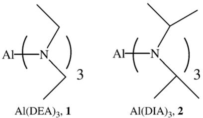
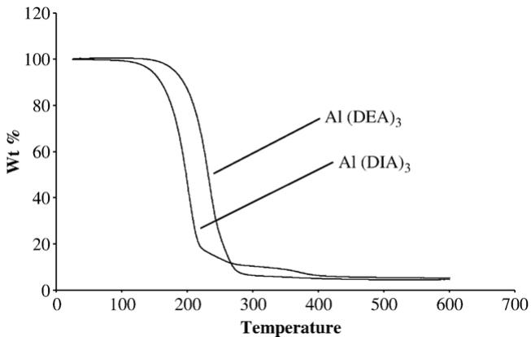
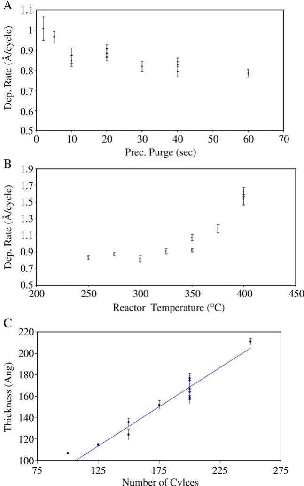

# Tris(dialkylamino)aluminums: Syntheses, characterization, volatility comparison and atomic layer deposition of alumina thin films

Casey R. Wade b, Carter Silvernail b, Chiranjib Banerjee b, Axel Soulet a, James McAndrew a, John A. Belot b,\*

a American Air Liquide, 5230 S. East Ave., Countryside IL 60525, USA  b Department of Chemistry and Center for Materials Research, University of Nebraska- Lincoln, Lincoln, NE 68588- 0304, USA

Received 16 November 2006; accepted 1 April 2007  Available online 19 April 2007

# Abstract

The syntheses and characterization of both tris(diethylamino)aluminum and tris(diisopropylamino)aluminum are presented in this letter. Characterization includes vapor pressure measurements and comparisons of the two non- pyrophoric precursors showing them to be viable alternatives to trimethylaluminum. Ultimately, tris(diisopropyl)aluminum was successful in the atomic layer deposition of alumina thin films.  $(\widehat{\Xi})$  2007 Elsevier B.V. All rights reserved.

Keywords: Aluminum, Precursors, Alumina, Vapor pressure, Thin films, Atomic layer deposition

# 1. Introduction

The search for  $\mathrm{SiO_2}$  high  $\kappa$  replacements (  $\kappa$  is the dielectric constant) continues to receive considerable attention as complementary metal- oxide semiconductor (CMOS) technology shrinks [1- 5]. Advancements in this area, pertaining to materials chemistry, test the requirements of ultra- thin film processing of insulating binary or higher order oxides, devoid of impurity atoms (e.g. halides) [1]. The numerous attributes of these layers (thinness, conformal coverage, compatibility with terminated silicon surfaces, abrupt interfaces, thermal processing, etc.) necessitate both new material developments as well as novel deposition techniques. Concerning the former, various Group III oxides are currently being explored, from  $\mathrm{Al}_2\mathrm{O}_3$  to its heavier congeners  $\mathrm{Ln}_2\mathrm{O}_3$  (lanthanide $^{3 + }$  ions). For the latter one promising growth method is atomic layer deposition (ALD) whose layer- by- layer, self- terminating mechanisms ideally offer exquisite control over thin film thickness, interfaces, stoichiometry, and surface roughness to mention only a few possible advantages [6,7].

ALD (and chemical vapor deposition, CVD) may also benefit from new chemical precursor design. Although the desired properties of ALD precursors remain debatable [7], each source must be volatile and show appropriate reactivity at the growth surface. Furthermore, liquid or gaseous sources offer certain industrial and academic advantages. For example, liquids often exhibit weaker intermolecular forces than solids, suggesting higher volatility, and always provide constant surface areas minimizing changes in vapor flux over time and are easier to handle and transfer. Although numerous alumina source molecules have been evaluated,  $\mathrm{Al}_2(\mathrm{CH}_3)_6$  (and select hydrides) is the most common starting material [3- 5,8,9]. However, as a hypergolic gas it is not without drawbacks most important industrially are its dangerous, explosive properties. Thus, novel aluminum sources of similar volatility, decreased ambient atmosphere reactivity, and applicability to ALD or CVD are desirable.

To assess potential alternatives to trimethylaluminum (TMA) we began investigating homoleptic  $\mathrm{Al}^{3 + }$  aminos as ALD precursors [10- 12]. Previously, this general class of molecules received only modest attention from the thin film community, mostly for the growth of nitrides (or oxides) from solid, crystalline sources [13,14]. This led us to the development of

  
Fig. 1. Structures of tris(diethylamino)aluminum and tris(diisopropyl) aluminum.

ultrapure tris(diethylamino)aluminum  $(\mathrm{Al(DEA)}_3,1)$ , a liquid, and solid tris(diisopropylamino)aluminum  $(\mathrm{Al(DIA)}_3,2)$  and tris (bis(trimethylsilyl)amino)aluminum  $(\mathrm{Al(TMSA)}_3)$  (Fig. 1). These materials were hypothesized to show appropriate reactivity for ALD and oxide growth and 1. ) their steric bulk should trigger the self- terminating paths and 2. ) thermodynamics favor formation of an Al- O bond over the Al- N bond [15]. In addition, 1 and 2 show appreciable volatility (vide infra) - comparable to that of  $\mathrm{Al}_2(\mathrm{CH}_3)_6$  and were successfully implemented in the growth of amorphous alumina using  $\mathrm{H}_2\mathrm{O}$  as a coreactant.

# 2. Experimental

All manipulations were carried out using standard Schlenk techniques. Lithium aluminum hydride (95%,  $\mathrm{LiAlH_4}$ ), aluminum chloride (99.99%,  $\mathrm{AlCl}_3$ ), diethylamine (redistilled, 99.5%), and diisopropylamine (redistilled, 99.95%) were purchased from Aldrich and used as received.  $\mathrm{AlH}_3\cdot \mathrm{N}(\mathrm{CH}_3)_3$  was purchased from Gelest and used as received. Benzene and tetrahydrofuran (THF) were dried and distilled from sodium prior to use. Elemental analyses were performed by Midwest Microlabs (Indianapolis, IN, USA) and  ${}^{1}\mathrm{H}$  NMR was recorded at  $400~\mathrm{MHz}$ . The ALD chamber has been previously described [16].

# 2.1. Synthesis of tris(diethylamino)aluminum  $(Al(DEA)_3,1)$

A  $250~\mathrm{mL}$ , 2- neck, round bottom flask charged with a stir bar and  $\mathrm{LiAlH_4}$  (2.0 g, 0.053 mol) was sealed with a reflux condenser and a  $100~\mathrm{mL}$  addition funnel. Sequentially, the vessel was removed from the glove box, interfaced to a  $\mathrm{N}_2$ - containing Schlenk line and  $60~\mathrm{mL}$  of THF was introduced via syringe. Diethylamine (22 mL, 0.21 mol) was then added dropwise (1 drop/s) while stirring at ambient temperature.

  
Fig. 2. Thermogravimetric analysis of  $\mathrm{Al(DEA)}_3$  and  $\mathrm{Al(DIA)}_3$  at atmospheric pressure and  $50~\mathrm{cc / min}$  He purge gas at a  $10^{\circ}\mathrm{C / min}$  heating rate.

  
Fig. 3. ALD growth parameters for  $\mathrm{Al(DEA)}_3$ . Precursor purge time (A), substrate temperature (B), and growth rate versus the number of cycles with linear fit (C).

  
Fig. 4. Atomic force micrographs of two  $\mathrm{Al}_2\mathrm{O}_3$  films of 211 Å and 157 Å thicknesses both having RMS roughnesses of  $5^{\circ}$ .

Following complete evolution of  $\mathrm{H}_{2}$ $(\sim 30 \mathrm{min})$ $\mathrm{AlCl}_3$ $(2.4 \mathrm{g},$ $0.018 \mathrm{mol})$  in  $26 \mathrm{mL}$  of THF was added dropwise (2 drops/s) and the mixture heated at reflux for  $1 \mathrm{h}$ . Upon cooling to room temperature, the THF was removed via a zeotrope distillation with benzene  $(125 \mathrm{mL})$  and the mixture concentrated to  $\sim 50 \mathrm{mL}$ . The reaction was filtered through a fine porosity fritted funnel and dried in vacuo  $(25^{\circ}\mathrm{C}, 0.15 \mathrm{Torr})$  resulting in an orange oil. Pure  $\mathrm{Al(DEA)_3}$  was isolated as a colorless oil via vacuum distillation  $(150^{\circ}\mathrm{C}, 10^{- 4} \mathrm{Torr})$ . Yield  $60\%$ $(7.7 \mathrm{g})$ ;  ${}^{1}\mathrm{H}$  NMR  $(\delta , \mathrm{C}_6\mathrm{D}_6)$  1.15  $(\mathrm{m}, 3 \mathrm{H})$ ; 1.38  $(\mathrm{m}, 3 \mathrm{H})$ , 3.1  $(\mathrm{m}, 2 \mathrm{H})$ , 3.35  $(\mathrm{m}, 2 \mathrm{H})$ ; Elem. Anal. Found: C 59.52, H 12.18, Calcd. C 59.22, H 12.42.

# 2.2. Synthesis of tris(diisopropylamino)aluminum  $(Al(DIA)_3, 2)$

$63 \mathrm{mL}$ $(8.8 \mathrm{eq}, 0.45 \mathrm{mol})$  of diisopropylamine was slowly added  $(2 \mathrm{drops / s})$  to a cooled (liquid  $\mathrm{N}_2$ $250 \mathrm{mL}$  flask containing  $4.5 \mathrm{g} \mathrm{AlH}_3 \cdot \mathrm{N}(\mathrm{CH}_3)_3$ $(0.051 \mathrm{mol})$ .  $\mathrm{H}_2$  evolution was immediately apparent. After amine addition the flask warmed to ambient temperature  $(2 \mathrm{h})$  and subsequently heated at reflux overnight. Excess amine was removed in vacuo and the crude product sublimed at  $85^{\circ}\mathrm{C}$  and  $10^{- 4}$  Torr to yield colorless crystals  $(6.9 \mathrm{g}, 42\%)$ .  ${}^{1}\mathrm{H}$  NMR  $(\delta , \mathrm{C}_6\mathrm{D}_6)$  1.3  $(\mathrm{d}, 6 \mathrm{H})$ , 3.4 (sept., 1H); Elem. Anal. Found: C 65.84, H 12.82; Calcd. C 66.01, H 12.92.

# 3. Results and discussion

The synthetic methods utilized to arrive at these novel alumina precursors have one commonality — to minimize halide content and cost [10- 12]. The preparation of  $\mathrm{Al(DEA)_3}$  uses inexpensive  $\mathrm{LiAlH}_4$  as the aluminum source whereas  $\mathrm{Al(DEA)_3}$  employs the alane,  $\mathrm{AlH}_3 \cdot \mathrm{NMe}_3$ . The purpose of these routes was to ultimately reduce contamination and charge carriers in the derived dielectric layer [1]. From the atmospheric pressure thermogravimetric analysis (TGA, Fig. 2) both precursors evaporate with onset temperatures of  $200^{\circ}\mathrm{C}$  and  $150^{\circ}\mathrm{C}$  for 1 and 2, respectively. Although counterintuitive since 1 is a liquid, it is believed to exist as a dimer in this phase but evaporates as the monomer requiring more energy to break its dimeric structure [10,15,17]. This is unlike 2 which exists as a monomer, in both the solid and vapor phase [12]. The TGA data also supports nearly complete evaporation with little residue at ambient pressure and a  $50 \mathrm{cc}$ $\mathrm{N}_2$  flow.  $\mathrm{Al(DEA)_3}$  leaves less than  $4\%$  residue while under identical conditions  $\mathrm{Al(DEA)_3}$  has an initially higher residual of  $\sim 10\%$ . This suggests that 2 is more susceptible to atmospheric contamination rather than decomposition, since the percentage varied amongst runs and approaches zero at reduced pressures.

To evaluate the vapor pressure of these new precursors versus the industry standard trimethylaluminum  $(\mathrm{Al}_2(\mathrm{CH}_3)_6)$  measurements were undertaken and fit to a modified Clausius- Clapeyron equation (supplemental information). From these data TMA is significantly more volatile than both  $\mathrm{Al(DEA)_3}$  and  $\mathrm{Al(DEA)_3}$ , however  $\mathrm{Al(DEA)_3}$  is one to two orders of magnitude more volatile than  $\mathrm{Al(DEA)_3}$  in the high  $(>70^{\circ}\mathrm{C})$  and low temperature  $(< 70^{\circ}\mathrm{C})$  regimes, respectively. At higher temperatures these values become less disparate but do not cross; thus 2 is always more volatile than 1. Surprisingly both TMA and  $\mathrm{Al(DEA)_3}$  are liquids and dinuclear, making them structurally and chemically similar. From this observation we postulate that the greater vapor pressure of  $\mathrm{Al(DEA)_3}$  over  $\mathrm{Al(DEA)_3}$  is due to its mononuclear character. Although it is typical for liquids to exhibit weaker intermolecular forces, in this case it is a compromise between similar dispersive forces, molecular weight, and the energy required to break dimeric  $\mathrm{Al(DEA)_3}$ .

All films were deposited on cleaned  $\mathrm{Si}(100)$  coupons in a previously described hot- walled ALD reactor [16]. Initially films were grown to optimize suitable delivery conditions for the ALD growth regime using 2 at a constant precursor source temperature of  $70^{\circ}\mathrm{C}$  (where the vapor pressures of  $\mathrm{Al(DEA)_3}$  and  $\mathrm{Al(DEA)_3}$  become least disparate). This resulted in a usable parameter of  $3, 2 \mathrm{~s}$  "plugs" of compound 2. These "plugs" consist of the precursor vessel being slightly pressurized with carrier gas  $(\mathrm{N}_2, 240 \mathrm{mTorr}$  from  $100 \mathrm{mTorr})$  and then the metal- organic being evacuated into the growth chamber at  $100 \mathrm{mTorr}$ . To verify precursor purge time and self limiting growth film, thickness was monitored as a function of seconds, and after  $20 \mathrm{~s}$  found to be stable and linear (Fig. 3A).

Two additional contributing factors that were investigated were substrate temperature and oxidizer purge time. First it was found that growth became nonlinear beyond  $325^{\circ}\mathrm{C}$  at which point  $\mathrm{Al}_2\mathrm{O}_3$  thickness per cycles increased, presumably due to decomposition at the silicon substrate (Fig. 3B). The second factor was oxidizer delivery, for  $2 \mathrm{a} 50 \mathrm{~ms}$  pulse (carrier gas passed through a water bubbler cooled in an ice bath) followed by a  $30 \mathrm{~s}$  purge yielded optimal conditions and growth. These  $\mathrm{H}_2\mathrm{O}$  values are nearly identical to those found for 1 [16]. Using these conditions the thickness versus number of cycles was linear from  $100 \mathrm{\AA}$  to  $220 \mathrm{\AA}$  with an incubation period of  $13 \mathrm{\AA}$  before growth stabilized at  $0.73 \mathrm{\AA} / \mathrm{cycle}$  (Fig. 3C). Granted these data points do not include thicknesses below  $100 \mathrm{\AA}$  because reliable values in this regime are hard to obtain in our system.

The amorphous films were characterized by PXRD and AFM. All attempts to find diffraction peaks failed, even on thicker films, yielding us to conclude they are amorphous despite the complications associated with thinner films and diffraction. The AFM images (Fig. 4) of two thin films having thicknesses of  $211 \mathrm{\AA}$  and  $157 \mathrm{\AA}$  both have RMS identical roughnesses of  $5 \mathrm{\AA}$ , over a  $1 \mu \mathrm{m}^2$  area, at an abrupt atmospheric interface.

# 4. Summary

This letter presents the synthesis and characterization of two, non- pyrophoric alternatives for the industry standard TMA  $\mathrm{Al(DEA)_3}$  and  $\mathrm{Al(DEA)_3}$ . The compounds were designed to minimize halide content and were synthesized from aluminum hydrides instead of chlorides or hexavier halides. The latter was used in the ALD growth of alumina on  $\mathrm{Si}(100)$  whose conditions are explicitly given for a previously described hot- walled reactor. The derived films were amorphous by PXRD and have abrupt, uniform surfaces with RMS roughnesses of  $5 \mathrm{\AA}$ .

# Acknowledgments

This work was supported by a Research Corporation Innovation Award, an IBM Faculty Award, Air Liquide, in part by the MRSEC program of the NSF under Award Number DMR 0213808, and NSF CHE- 0415938.

# References

[1] G.D. Wilk, R.M. Wallace, J.M. Anthony, J. Appl. Phys. 89 (2001) 5243. [2] R.B. van Dover, Appl. Phys. Lett. 74 (1999) 3041.

[3] M. Copel, E. Cartier, E.P. Gusev, S. Guha, N. Bojarczuk, M. Poppeller, Appl. Phys. Lett. 78 (2001) 2670.  [4] P.I. Raisanen, M. Ritala, M. Leskala, J. Mater. Chem. 12 (2002) 1415.  [5] P. de Rouffignac, R.G. Gordon, Chem. Vap. Depos. 12 (2006) 152.  [6] M. Leskala, M. Ritala, Angew. Chem., Int. Ed. Engl. 42 (2003) 5548.  [7] M. Leskala, M. Ritala, Thin Solid Films 409 (2002) 138.  [8] Y.S. Min, Y.J. Cho, C.S. Hwang, Chem. Mater. 17 (2005) 626.  [9] R. Matero, A. Rahtu, M. Ritala, Langmuir 21 (2005) 3498.  [10] J.K. Ruff, J. Am. Chem. Soc. 83 (1961) 2835.  [11] R.A. Kovar, E.C. Ashby, Inorg. Chem. 10 (1971) 893.  [12] P.J. Brothers, R.J. Wehmschulte, M.M. Olmstead, K. Ruhlandt- Senge, S.P. Parkin, P.P. Power, Organometallics 13 (1994) 2792.

[13] D.M. Hoffman, S.P. Rangarajan, S.D. Athavale, D.J. Economou, J.R. Liu, Z. Zheng, W.K. Chu, J. Vac. Sci. Technol. A. 14 (1996) 306.  [14] J.P. Endle, Y.M. Sun, J. Silverman, N. Nguyen, A.H. Cowley, J.M. White, J.G. Ekerdt, Thin Solid Films 385 (2001) 66.  [15] P. Fleurat- Lessard, F. Volatron, Inorg. Chem. 39 (2000) 1849.  [16] R. Katamreddy, R. Inman, G. Jursich, A. Soulet, C. Takoudis, J. Electrochem. Soc. 153 (2006) C701.  [17] C.C. Chang, M.D. Li, M.Y. Chiang, S.M. Peng, Y. Wang, G.H. Lee, Inorg. Chem. 36 (1997) 1955.