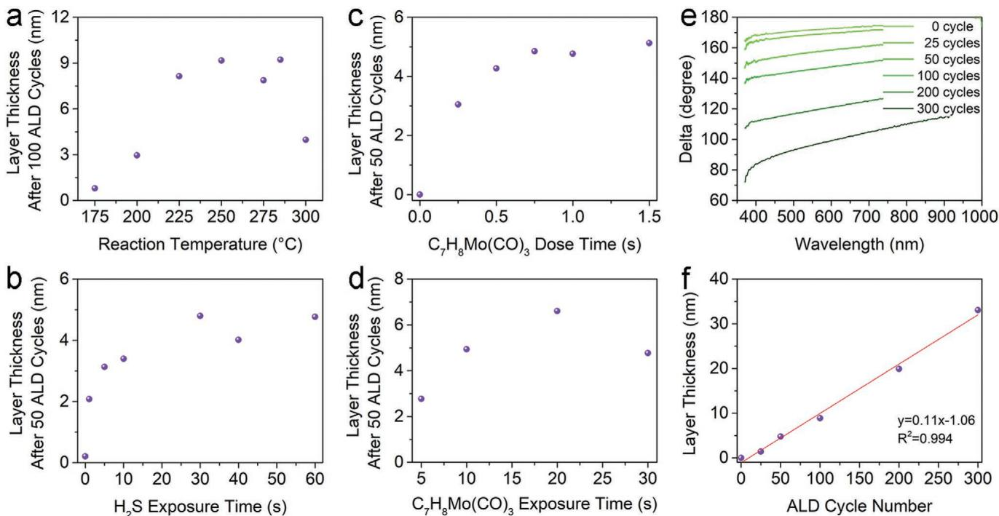
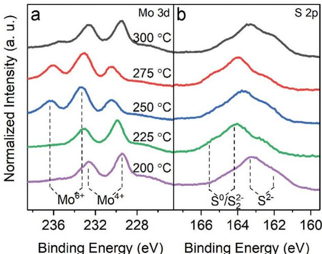
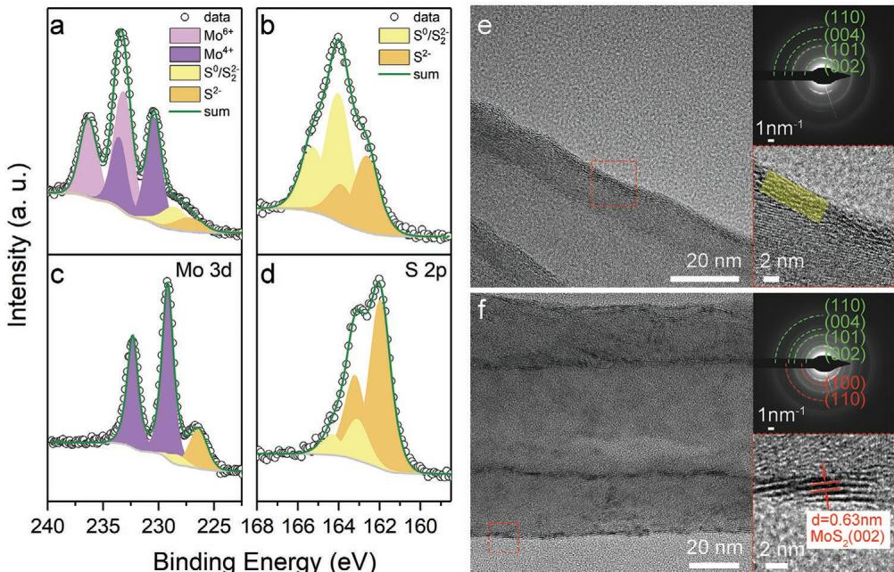
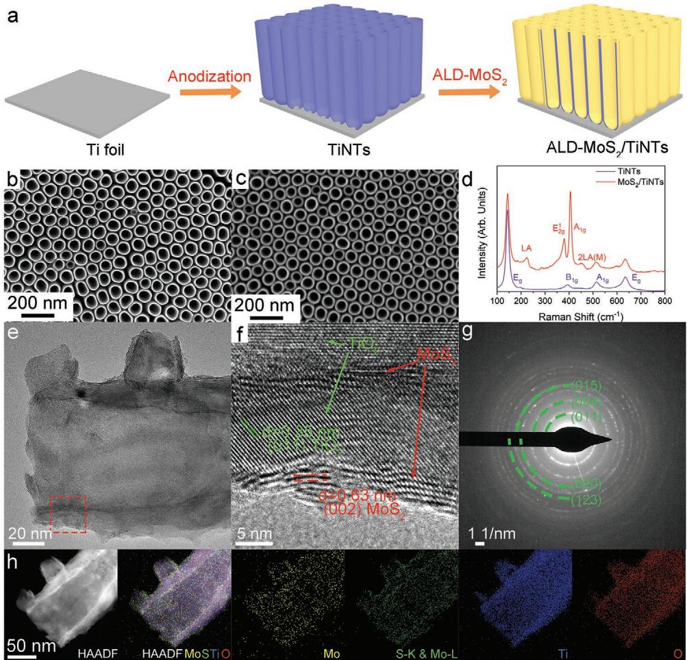
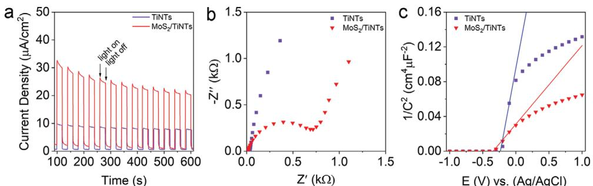
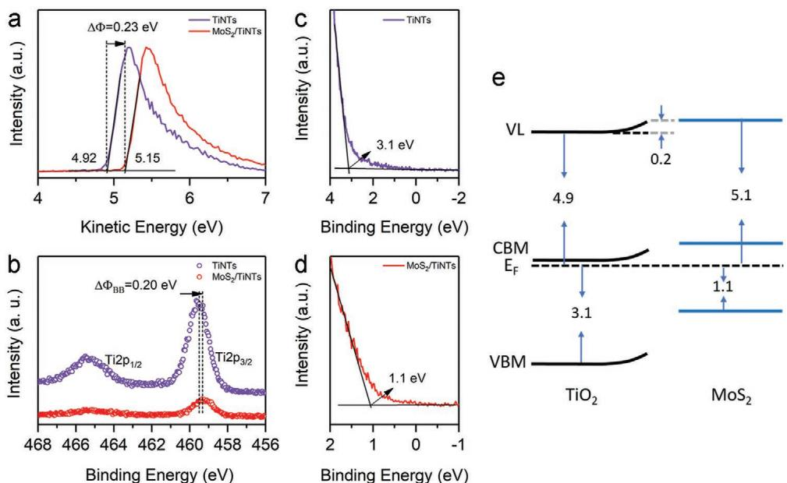

# Atomic Layer Deposition of  $\mathrm{MoS}_2$  Decorated  $\mathrm{TiO}_2$  Nanotubes for Photoelectrochemical Water Splitting

Chengxu Shen, Ewa Wierzbicka,* Thorsten Schultz, Rongbin Wang, Norbert Koch, and Nicola Pinna*

A thermal atomic layer deposition (ALD) process to fabricate  $\mathrm{MoS}_2$  thin films is successfully demonstrated by using cycloheptatriene molybdenum tricarbonyl  $(\mathsf{C}_7\mathsf{H}_8\mathsf{Mo}(\mathsf{CO})_3)$  and  $\mathsf{H}_2\mathsf{S}$  as precursors at an ALD temperature below  $300^{\circ}C$ . The process is systematically investigated, showing a typical self- limiting characteristic within an ALD temperature window of  $225 - 285^{\circ}C$  and a high growth- per- cycle of  $0.11\mathrm{nm}$ . The as- deposited films are amorphous while they can be crystallized in situ by sulfurization with  $\mathsf{H}_2\mathsf{S}$  at a low temperature of  $300^{\circ}C$ . A prototypical application of the developed ALD process is demonstrated by constructing a  $\mathrm{MoS}_2 / \mathrm{TiO}_2$  heterostructure through depositing  $\mathrm{MoS}_2$  onto anodized  $\mathrm{TiO}_2$  nanotubes for photoelectrochemical water splitting. The  $\mathrm{MoS}_2 / \mathrm{TiO}_2$  heterostructures exhibit approximately three times superior photoelectrochemical performance than the pristine  $\mathrm{TiO}_2$  nanotubes. This is attributed to an enhanced visible light- harvesting ability of  $\mathrm{MoS}_2$  and an improved separation of the photo- generated charge carriers at the heterostructure interface, which is affirmed by a staggering gap (type II) between  $\mathrm{MoS}_2$  and  $\mathrm{TiO}_2$  as probed by ultraviolet photoelectron spectroscopy.

$\mathrm{MoS}_2 / \mathrm{CdS},^{[15]}$  have demonstrated a high PEC performance. It was proven that the formation of such heterostructures is beneficial for the separation of photo- generated excitons (hole- electron pairs).[13,14,16,17] In particular,  $\mathrm{MoS}_2 / \mathrm{TiO}_2$  heterostructures have attracted significant interest, as  $\mathrm{MoS}_2$  can be used as a photosensitizer for chemically stable but wide- bandgap  $\mathrm{TiO}_2$  semiconductor.[18] The respective bandgap edge positions of the two semiconductors form a charge- transfer cascade, which significantly increases the separation of the photogenerated charge carriers.[19,20] Overall, both the photosensitizing properties of  $\mathrm{MoS}_2$  and the electronic structure of the heterojunction create a suitable platform for UV and visible light utilization resulting in high PEC performance.

It should be noticed that the electronic and catalytic properties of  $\mathrm{MoS}_2$  are highly dependent on the film thickness and mor

# 1. Introduction

Molybdenum disulfide  $(\mathrm{MoS}_2)$  with an intrinsic semiconducting property, has attracted considerable interest and has been widely applied in various areas such as field- effect transistors, phototransistors, gas sensors, and (photo)electrocatalysts.[1- 7] Particularly,  $\mathrm{MoS}_2$  has become a desirable candidate in photoelectrochemical (PEC) applications due to its tunable bandgap and excellent visible light- harvesting ability.[6,8- 11] Besides pure  $\mathrm{MoS}_2$ ,[6] plenty of  $\mathrm{MoS}_2$ - based heterostructures, like  $\mathrm{MoS}_2 / \mathrm{ZnO}$ ,[10]  $\mathrm{MoS}_2 / \mathrm{WS}_2$ ,[13]  $\mathrm{MoS}_2 / \mathrm{WSe}_2$ ,[14] and phology,[21] as well as the architecture of the substrates.[22,23] Therefore, various nanostructured architectures of  $\mathrm{TiO}_2$  (e.g.,  $\mathrm{TiO}_2$  nanorods and nanotubes) have been applied as a scaffold to construct  $\mathrm{MoS}_2 / \mathrm{TiO}_2$  heterostructures because the increased surface area can efficiently promote their (photo)electrochemical performance.[7,16- 20] However, these general synthesis methods (e.g., hydrothermal synthesis, chemical vapor deposition, chemical exfoliation, etc.) suffer from the limitation of the complicated synthesis process, poor film thickness control and uniform coverage on high aspect ratio structures,[17,19,20,24,25] which seriously suppress the investigation and promotion of

the catalytic properties of  $\mathrm{MoS}_2$  [26] Therefore, it is extremely meaningful and challenging to deposit well- controlled  $\mathrm{MoS}_2$  onto high aspect ratio nanostructured substrates for promoted PEC performance.

Atomic layer deposition (ALD), an advanced film deposition technique, has attracted great interest in preparing high- quality films such as metal oxides, nitrides, and chalcogenides because of its high conformality and precise control of film thickness.[27,28] Compared to other synthesis routes, ALD shows great advantages in depositing high- quality films onto complex nanostructures with uniform coverage due to its self- limiting surface reactions.[27] Up to now,  $\mathrm{MoS}_2$  has been fabricated by ALD with different metal precursors, such as  $\mathrm{Mo(CO)_6}$  [29- 31]  $\mathrm{MoCl}_5$  [32]  $\mathrm{Mo(thd)_3}$  (thd = 2,2,6,6- tetramethylheptane- 3,5- dionato),[33] tetrakis(dimethylamino)molybdenum  $(\mathrm{(NMe_2)_4Mo)}$  [34] and bis(t- butylimino)bis(dimethylamino)molybdenum  $(\mathrm{N^+Bu_2(NMe_2)_2Mo})$  [35] The chemisorption of a molybdenum precursor species onto the surface is critical for the second ALD half- reaction. However, incomplete coverage during the metal precursor half- reaction is often attributed to a limited number of reactive sites on the surface and the steric hindrance of chemisorbed precursors on adjacent active sites. In some cases, pre- treatment or enrichment of the surface- active species is essential for improving ALD processes.[36,37] Thus, precursors which promote facile adsorption onto substrates may greatly improve ALD processes.[38]

$\mathrm{Mo(CO)_6}$  is one of the most commonly used Mo precursors for ALD, given its high volatility at low temperatures and small ligands. In addition, facile chemisorption of  $\mathrm{Mo(CO)_6}$  proceeds via a series of decarbonylation reactions to yield the subcarbonyl surface species  $\mathrm{Mo(CO)_x}$ $(x\leq 5)$ , which can occur even at room temperature.[39,40] Due to the excellent surface coverage of the chemisorbed  $\mathrm{Mo(CO)_x}$  and small steric hindrance caused by carbonyl ligands, the ALD processes for  $\mathrm{MoS}_2$  films from  $\mathrm{Mo(CO)_6}$  show high growth per cycle (GPC) of up to  $0.11\mathrm{nm}$  at as low temperature as  $155^{\circ}\mathrm{C}$  [29,41,42] However, the low thermal stability of  $\mathrm{Mo(CO)_6}$  results in a narrow ALD window of  $155 - 175^{\circ}\mathrm{C}$ , which restricts its use in practical applications, particularly in preparing multinary dichalcogenides components like  $\mathrm{Mo_xW_1 - xS_2}$  [30,31,42- 44] Compared to the carbonyl group, the Mo complexes with some alternative ligands such as alkylamides and diketonates show efficiently improved thermal stability, thus broadening the ALD window. For example, the ALD of  $\mathrm{MoS}_2$  from  $(\mathrm{N^+Bu_2(NMe_2)_2Mo}$  exhibits a broad ALD window of  $125 - 225^{\circ}\mathrm{C}$  and  $275 - 350^{\circ}\mathrm{C}$  for that from  $\mathrm{Mo(thd)_3}$  [33,45] However, these precursors exhibit lower growth per cycle  $(0.08\mathrm{nm}$  for  $(\mathrm{N^+Bu_2(NMe_2)_2Mo}$  and  $0.0025\mathrm{nm}$  for  $\mathrm{Mo(thd)_3}$ , which can be ascribed to the lower density of precursor molecules in the chemisorption layer.[38] Therefore, we come up with the idea that a heteroleptic molybdenum precursor bearing both carbonyl and substitutive ligands may be a promising ALD precursor since it integrates properties of both facile adsorption and better thermal stability.

Ideal representatives are heteroleptic complexes composed of both carbonyl and cycloalkene ligands, which possess better thermal stability and higher volatility than the components containing only carbonyl groups.[46- 48] Therefore, molybdenum complexes with these ligands have been considered as good candidates for the ALD of molybdenum oxides and nitrides.[48] For instance, cycloheptatriene molybdenum tricarbonyl  $(\mathrm{C_7H_8Mo(CO)_3})$ , a heteroleptic molybdenum carbonyl complex with cycloalkene ligand,[49,50] has been applied for the vapor synthesis of  $\mathrm{MoO}_3$  at low temperature  $(100^{\circ}\mathrm{C})$  due to its high volatility, indicating a good potential for applying as ALD precursor.[51]

Herein, a low- temperature ALD process was demonstrated for the deposition of  $\mathrm{MoS}_2$  from  $\mathrm{C_7H_8Mo(CO)_3}$  and  $\mathrm{H}_2\mathrm{S}$ , respectively. Besides planar substrates (e.g., Si,  $350\mathrm{nm}$  thermally oxidized  $\mathrm{SiO}_2 / \mathrm{Si}$ , sapphire wafer, and glass),  $\mathrm{MoS}_2$  was also successfully deposited onto high aspect ratio substrates such as carbon nanotubes (CNTs) and anodized titanium dioxide nanotube arrays (TiNTs). The crystallinity and purity of the as- deposited  $\mathrm{MoS}_2$  films are efficiently improved by an in situ post- deposition sulfurization at  $300^{\circ}\mathrm{C}$  with  $\mathrm{H}_2\mathrm{S}$ . Furthermore,  $\mathrm{MoS}_2 / \mathrm{TiNTs}$  heterostructures exhibit a trifold enhanced photoelectrochemical performance under visible light irradiation compared to pristine TiNTs. Compared to visible light irradiation, the heterostructures also display an improved PEC performance under UV excitation, but within a lower number of optimal ALD cycles applied for the highest PEC performance since they exhibit different excitation models and charge- transfer pathways. Finally, the electronic structure of the  $\mathrm{MoS}_2 / \mathrm{TiNT}$  heterostructures and the charge- transfer mechanisms are systematically discussed.

# 2. Results and Discussion

# 2.1.  $\mathrm{MoS}_2$  ALD Process Development

The ALD process was systematically studied in a homemade ALD reactor at a temperature ranging between 175 and  $300^{\circ}\mathrm{C}$ . CNTs, Si wafer, thermally oxidized  $\mathrm{SiO}_2 / \mathrm{Si}$  wafer, sapphire, and glass were utilized as substrates for the deposition. Figure 1a shows the thickness of the deposited films on the Si wafer for 100 ALD cycles as a function of the reaction temperature. For the reaction temperature of  $175^{\circ}\mathrm{C}$ , there is almost no  $\mathrm{MoS}_2$  deposition, which could be attributed to slow reaction thermodynamics between  $\mathrm{C_7H_8Mo(CO)_3}$  and  $\mathrm{H}_2\mathrm{S}$  at such a low temperature. While the temperature increases, the film thickness increases to  $3\mathrm{nm}$  at  $200^{\circ}\mathrm{C}$ , and  $\approx 9\mathrm{nm}$  at  $225^{\circ}\mathrm{C}$  for 100 ALD cycles. Then it stays constant at  $\approx 9\mathrm{nm}$  until the reaction temperature reaches  $285^{\circ}\mathrm{C}$ , indicating an optimal ALD window for the reaction between 225 and  $285^{\circ}\mathrm{C}$ . While temperature further increases up to  $300^{\circ}\mathrm{C}$ , the film thickness decreases, probably on account of the desorption of the precursors from the substrates. The  $\mathrm{MoS}_2$  films deposited onto thermally oxidized  $\mathrm{SiO}_2 / \mathrm{Si}$  wafers at varying temperatures were investigated by atomic force microscopy (AFM, Figure S1, Supporting Information). The AFM results show that the as- deposited films exhibit a low root- mean- square surface roughness of  $\approx 2\mathrm{nm}$  for the films deposited at  $250^{\circ}\mathrm{C}$  (Figure S2, Supporting Information), indicating that the deposited films are rather smooth. Therefore, to keep low film roughness, the following ALD process was carried out at  $250^{\circ}\mathrm{C}$ , at the temperature in the middle of the ALD window.

The dose and exposure time of the precursors were further studied at  $250^{\circ}\mathrm{C}$ . Figure 1b presents the relationship between

  
Figure 1. a) The film thickness of the  $\mathrm{MoS_2}$  film deposited at different temperatures ranging from 175 to  $300^{\circ}C$  The thickness of 50 ALD cycles  $\mathrm{MoS_2}$  film as a function of the b)  $\mathsf{H}_2\mathsf{S}$  exposure time, c) dose time, and d) exposure time of  $\mathsf{C}_7\mathsf{H}_8\mathsf{Mo}(\mathsf{CO})_3$  e) Spectroscopic ellipsometry curves for  $\mathrm{MoS_2}$  films deposited with varying ALD cycles (25, 50, 100, 200, and 300). f) There is a linear dependence between the number of ALD cycles and the deposited film thickness. The ALD reaction temperature was  $250^{\circ}C$  for all parameter variations except (a).

the film thickness with 50 ALD cycles as a function of the  $\mathrm{H}_2\mathrm{S}$  exposure time, which varied from 0 to  $60~\mathrm{s}$ . The results suggest that the second half- reaction is saturated when the exposure time of  $\mathrm{H}_2\mathrm{S}$  was set to  $30~\mathrm{s}$ . Figure 1c,d shows the effect of dose and exposure time of  $\mathrm{C}_7\mathrm{H}_8\mathrm{Mo}(\mathrm{CO})_3$  on the film thickness after 50 ALD cycles. The results indicate that a minimum dose time of  $0.75\mathrm{~s~}$  (Figure 1c) and exposure time of  $10\mathrm{~s~}$  for  $\mathrm{C}_7\mathrm{H}_8\mathrm{Mo}(\mathrm{CO})_3$  are required to complete the self- limiting surface reaction during the first half cycle (Figure 1d). Considering the large steric requirements of the metal precursor and the slow saturation, the optimal ALD parameters, dose/exposure/purge time, have been defined as  $1.5\mathrm{~s} / 40\mathrm{~s} / 30\mathrm{~s~}$  for  $\mathrm{C}_7\mathrm{H}_8\mathrm{Mo}(\mathrm{CO})_3$  and  $0.2\mathrm{~s} / 30\mathrm{~s} / 30\mathrm{~s~}$  for  $\mathrm{H}_2\mathrm{S}$ , respectively.

  
Figure 2. XPS spectra of a) Mo 3d and b) S 2p for the  $\mathrm{MoS_2}$  films deposited on  $\mathrm{SiO_2}$  at varying temperatures. The different oxidation states and compounds are indicated by dashed lines.

The relationship between film thickness and the number of ALD cycles at  $250^{\circ}C$  is shown in Figure 1e,f. Figure 1e shows the original spectroscopic ellipsometry data recorded on natively oxidized Si wafers. The curves gradually shift to lower delta values with the increase of the ALD cycles, indicating an increase in the film thickness. The film thickness increases linearly  $(\mathrm{R}^2 = 0.99)$  with a growth per cycle (GPC) of  $0.11~\mathrm{nm}$  (Figure 1f). All in all, the results presented in Figure 1 demonstrate angstrom- scale control of the thickness of the films deposited with our new process and its self- limiting nature. Noticeably, the GPC of this novel process is higher than the GPC we recently reported for  $\mathrm{MoS_2}$  from  $(\mathrm{N}^{\mathrm{t}}\mathrm{Bu})_2(\mathrm{NMe}_2)_2\mathrm{Mo}$  and  $\mathrm{H}_2\mathrm{S}$ $(0.08~\mathrm{nm})$ .[45] Additionally,  $\mathrm{MoS_2}$  films were successfully deposited with the established ALD process on a glass substrate with an area of  $5\times 2.5\mathrm{~cm}^2$ , indicating the potential for large- scale fabrication (Figure S3, Supporting Information).

The chemical composition of the as- deposited films was investigated by X- ray photoelectron spectroscopy (XPS). A typical survey spectrum shown in Figure S4 (Supporting Information) confirms the presence of oxygen, molybdenum, carbon, sulfur in the sample, and silicon from the underlying substrate. The Mo 3d spectra consist of one doublet at  $\approx 229$  and  $\approx 232\mathrm{eV}$  with a  $3.15\mathrm{eV}$  separation, corresponding to  $\mathrm{Mo^{4 + }}$  (Figure 2a).[52] A second doublet at  $\approx 233$  and  $236\mathrm{eV}$  can be assigned to the  $\mathrm{Mo^{6 + }}$  of  $\mathrm{MoO_3}$ . This higher BE peak is more pronounced in the films deposited at 250 and  $275^{\circ}C$ , which could be attributed to the increased

surface roughness (Figures S1 and S2, Supporting Information) that could lead to faster oxidation of the as- deposited film when it is exposed to air. The  $S2p$  spectra suggest that the as- deposited films contain a larger amount of  $\mathbf{S}_2^2$  or  $\mathbf{S}^0$  species (Figure 2b), which indicates the presence of amorphous  $\mathrm{MoS}_3$  or unreacted sulfur,[9,48] similar to  $\mathrm{MoS}_2$  previously grown by low- temperature ALD.[43,45,53] Furthermore, the C 1s spectra of the deposited films were recorded before and after Ar sputtering, as shown in Figure S5 (Supporting Information). All samples show carbon on the surface of the films, whilst almost no carbon signal can be observed after sputtering. This indicates that the ligands of  $\mathrm{C_7H_8Mo(CO)_3}$  were entirely removed during the ALD process, and the detected carbon is typical surface contamination.

Based on the growth parameters, self- limiting nature of the process, and available inorganic chemistry literature on molybdenum complexes, we propose a growth mechanism to further understand the potential of our new ALD process.[30,46,54]

First,  $\mathrm{C_7H_8Mo(CO)_3}$  chemisorbs on the surface of pristine substrates (here depicted as  $- \mathrm{OH}$  species) or onto the growing  $\mathrm{MoS_x}$ , similar to most ALD reactions using  $\mathrm{Mo(CO)_6}$  as molybdenum precursor, resulting in a substituted molybdenum surface species,

$$
\begin{array}{rl} & {(-\mathbf{OH})_3 + \mathbf{C}_7\mathbf{H}_8\mathbf{Mo}(\mathbf{CO})_3 = (-\mathbf{O})_3}\\ & {\quad -\mathbf{MoC}_7\mathbf{H}_8 + 3\mathbf{CO}(\mathbf{g}) + 3 / 2\mathbf{H}_2(\mathbf{g})} \end{array} \tag{1a}
$$

or

$$
\begin{array}{rl} & {(-\mathbf{OH})_{(3 - \mathbf{x})} + \mathbf{C}_7\mathbf{H}_8\mathbf{Mo}(\mathbf{CO})_3 = (-\mathbf{O})_{3 - \mathbf{x}} - \mathbf{MoC}_7\mathbf{H}_8(\mathbf{CO})_\mathbf{x}}\\ & {\quad +(3 - \mathbf{x})\mathbf{CO}(\mathbf{g}) + (3 - \mathbf{x}) / 2\mathbf{H}_2(\mathbf{g})} \end{array} \tag{1b}
$$

Here, the black  $- \mathrm{OH}$  group refers to the active site on the initial surface of substrates.

Then, the rest organic ligands are fully released when the coreactant  $\mathrm{H}_2\mathrm{S}$  reacts with the adsorbed surface species and then producing  $\mathrm{MoS_x}$ . Thermodynamics calculations have indicated that the reaction of  $\mathrm{H}_2\mathrm{S}$  with various valence molybdenum species (e.g., metallic Mo and  $\mathrm{MoO_3}$ ) under our experimental conditions has a negative Gibbs free energy, suggesting a thermodynamically favorable process.[55] Therefore, the second half- reaction could be proposed as

$$
\begin{array}{rl} & {(-\mathbf{O})_3 - \mathbf{MoC}_7\mathbf{H}_8 + \mathbf{H}_2\mathbf{S} = (-\mathbf{O})_3 - \mathbf{Mo}}\\ & {\quad -\mathbf{SH} + \mathbf{C}_7\mathbf{H}_8(\mathbf{g}) + 1 / 2\mathbf{H}_2(\mathbf{g})} \end{array} \tag{2a}
$$

or

$$
\begin{array}{rl} & {(-\mathbf{O})_{3 - \mathbf{x}} - \mathbf{MoC}_7\mathbf{H}_8(\mathbf{CO})_\mathbf{x} + \mathbf{H}_2\mathbf{S} = (-\mathbf{O})_\mathbf{3}}\\ & {\quad -\mathbf{Mo} - \mathbf{SH} + \mathbf{C}_7\mathbf{H}_8(\mathbf{g}) + (1 + \mathbf{x}) / 2\mathbf{H}_2(\mathbf{g}) + \mathbf{x}\mathbf{CO}(\mathbf{g})} \end{array} \tag{2b}
$$

The full reaction for the ALD process is expected as follows

$$
\begin{array}{rl} & {\mathrm{C}_7\mathrm{H}_8\mathrm{Mo}(\mathrm{CO})_3 + 2\mathrm{H}_2\mathrm{S} = -\mathrm{S} - \mathrm{Mo}}\\ & {\quad -\mathrm{S}] - + \mathrm{C}_7\mathrm{H}_8(\mathrm{g}) + 3\mathrm{CO}(\mathrm{g}) + 2\mathrm{H}_2(\mathrm{g})} \end{array} \tag{3}
$$

The hypothesized mechanism is proposed under the following considerations. First, the absorption of molybdenum components on the surface is critical for the full ALD reaction. It has been demonstrated that  $\mathrm{Mo(CO)_6}$  is easily physisorbed on surfaces and decarbonylated to form chemisorbed molybdenum subcarbonyls.[30,39] The CO group is easily disassociated from the adsorbed surface molybdenum components at a relatively low temperature  $(150 - 170^{\circ}\mathrm{C})$ .[54] Second,  $\mathrm{Si(CH_3)_2CpMo(CO)_2}(\eta^3 - 2$  methylallyl), a molybdenum carbonyl precursor with a similar structure as  $\mathrm{C_7H_8Mo(CO)_3}$ , has been demonstrated for  $\mathrm{MoO_3}$  deposition by ALD at a reaction temperature of  $250^{\circ}\mathrm{C}$ .[46] In that reaction, carbonyl groups and  $\eta^3$ - 2- methylallyl are released during the first half- reaction whilst the  $\mathrm{Si(CH_3)_3Cp}$  is removed after  $\mathrm{O_3}$  exposures, forming  $\mathrm{Mo}(= \mathrm{O})_2$  bonds. This result may reflect that the carbonyl ligand is more easily released from the metal components than the cycloakene ligand during the first ALD half- reaction. Third, the bond between Mo and the cycloheptatriene group is stronger than between Mo and the carbonyl group. The disassociated energy of the molybdenum- cycloheptatriene bond is  $251\mathrm{kJ}\mathrm{mol}^{- 1}$ , which is higher than that of  $152\mathrm{kJ}\mathrm{mol}^{- 1}$  for a molybdenum- carbonyl bond, indicating that the CO ligand is more easily released than cycloheptatriene.[47] This also explains why the ALD window for the reaction of  $\mathrm{C_7H_8Mo(CO)_3}$  and  $\mathrm{H}_2\mathrm{S}$  is higher than that of  $\mathrm{Mo(CO)_6}$  and  $\mathrm{H}_2\mathrm{S}$ .[42] Therefore, we hypothesize that the CO groups are preferentially released during the first half- reaction (chemisorption of the molybdenum complex), and the cycloheptatriene ligand is removed during the second half- reaction ( $\mathrm{H}_2\mathrm{S}$  exposure). An in situ FT- IR study for the elucidation of the reaction mechanism will be carried out in a follow- up study.

The broad, multi- component S 2p core- level X- ray photoemission spectra reflect that the as- deposited  $\mathrm{MoS_2}$  films are of low quality and contain an amount of amorphous species (Figure 2b), which is further evidenced by Raman spectroscopy. There is no pronounced Raman peak of  $\mathrm{MoS_2}$  observable in the as- deposited films (Figure S6, Supporting Information), which may suggest a low  $\mathrm{MoS_2}$  film crystallinity or the predominant presence of amorphous  $\mathrm{MoS_3}$ , in line with the XPS results. Post- annealing at a relatively low temperature with  $\mathrm{H}_2\mathrm{S}$  has been proven to be an efficient route to improve the crystallinity of the as- deposited ALD- chalcogenide films.[45,56] Therefore, an in situ post- annealing with  $\mathrm{H}_2\mathrm{S}$  was carried out at  $300^{\circ}\mathrm{C}$  for  $4\mathrm{h}$  to increase the crystallinity of the deposited films. Different from the as- deposited films, two characteristic Raman peaks at 406.7 and  $380.6\mathrm{cm}^{- 1}$ , corresponding to the  $\mathrm{A_{1g}}$  and  $\mathrm{E_{2g}^{1}}$  peaks of  $\mathrm{MoS_2}$ , are observed in the sulfurized films, indicating improved crystallinity of the as- deposited  $\mathrm{MoS_2}$  films after post- deposition annealing (Figure S6, Supporting Information). The peak distance of  $\approx 26\mathrm{cm}^{- 1}$  suggests that the film comprises more than six monolayers.[57] The same phenomenon was observed in the film deposited on sapphire substrates (Figure S6, Supporting Information). Noticeably, an experiment in which  $\mathrm{H}_2\mathrm{S}$  was replaced with an inert gas ( $\mathrm{N}_2$ ) shows that the  $\mathrm{H}_2\mathrm{S}$  atmosphere is critical to conducting the conversion reaction to pure  $\mathrm{MoS_2}$  and improving the crystallinity of the films at the mild temperature sulfurization (Figure S7, Supporting Information).

The sulfurized film was also characterized by XPS to further understand the influence of the in situ post- deposition annealing process. Compared to the as- deposited film, only

  
Figure 3. XPS spectra of a,c) Mo 3d and b,d) S 2p for the as-deposited  $\mathrm{MoS_2}$  film on  $\mathrm{SiO_2}$  a,b) before and c,d) after in situ sulfurization at  $300^{\circ}C$  with  $\mathsf{H}_2\mathsf{S}$  TEM images (left and right down) and SAED pattern (right up) of  $\mathrm{MoS_2}$  deposited onto CNTs e) before and f) after in situ sulfurization at  $300^{\circ}C$  with  $\mathsf{H}_2\mathsf{S}$  The green arcs indicate graphite carbon, while the red ones indicate the 2H  $\mathrm{MoS_2}$  The yellow mark in (e) suggests the as-deposited amorphous  $\mathrm{MoS_2}$  film, while the lattice fringes in (f) suggest the (002) plane of crystalline  $\mathrm{MoS_2}$  layers.

one sharp doublet of Mo 3d at  $229.2\mathrm{eV}$  can be observed in the annealed film, which is ascribed to  $\mathrm{Mo^{4 + }}$  in  $\mathrm{MoS_2}$ , in agreement with the literature.[20] The disappearance of  $\mathrm{Mo^{6 + }}$  components at higher binding energies suggests that all Mo was fully converted to  $\mathrm{Mo^{4 + }}$  in  $\mathrm{MoS_2}$  by post sulfurization (Figure 3c). The same trend is observed in the S 2p spectrum. In contrast to the broad S 2p spectrum in the as- deposited films, here, the pronounced doublet peak at  $162.0\mathrm{eV}$  (S  $2\mathrm{p}_{3 / 2}$ ) and  $163.2\mathrm{eV}$  (S  $2\mathrm{p}_{1 / 2}$ ) corresponds to the plane  $\mathrm{S}^{2 - }$  in  $\mathrm{MoS_2}$  (Figure 3d). The  $\mathrm{S}_{2}^{2 - } / \mathrm{S}^{0}$  peaks corresponding to amorphous  $\mathrm{MoS_3}$  or unreacted sulfur are strongly reduced and can be entirely removed at higher annealing temperatures (Figure S8, Supporting Information).

After optimizing the growth conditions on smooth and planar substrates, the growth of  $\mathrm{MoS_2}$  onto nanostructured substrates with high aspect ratios was further investigated. A prototypical representative of these materials is carbon nanotubes (CNTs). To examine the morphology of the  $\mathrm{MoS_2}$  film and the influence of the post- annealing process, the  $\mathrm{MoS_2}$  films deposited onto CNTs were characterized by high- resolution transmission electron microscopy (HR- TEM) and selected area electron diffraction (SAED). Although both CNTs are entirely coated with a smooth film, the SAED patterns suggest that the as- deposited  $\mathrm{MoS_2}$  film is amorphous (Figure 3e), while the film after post- deposition sulfurization is polycrystalline (Figure 3f). Moreover, compared with the as- deposited amorphous films (light yellow mark in Figure 3e, right down), the sulfurized films exhibit clear lattice fringes associated with a d- spacing of  $0.63\mathrm{nm}$ , which are assigned to the (002) planes of  $\mathrm{MoS_2}$  (Figure 3f, right down). Consequently, all of the above results evidence the successful deposition of high conformal  $\mathrm{MoS_2}$  by ALD at relatively low temperatures  $(< 300^{\circ}\mathrm{C})$  using  $\mathrm{C_7H_8Mo(CO)_3}$  and  $\mathrm{H}_2\mathrm{S}$  as precursors, with an improved film purity and crystallinity obtained by the following in situ post- deposition sulfurization at  $300^{\circ}\mathrm{C}$  with  $\mathrm{H}_2\mathrm{S}$ . Moreover, the successful development of this ALD process suggests that heteroleptic cycloalkenes metal carbonyl complexes can be considered as promising metal precursors for the ALD of metal chalcogenides.

# 2.2.  $\mathrm{MoS_2}$  Coated  $\mathrm{TiO_2}$  Nanotubes for Photoelectrochemical Applications

Our novel ALD process has been applied to synthesize  $\mathrm{MoS_2 / }$ $\mathrm{TiO_2}$  heterojunctions and elucidate their PEC performance. As discussed in the introduction,  $\mathrm{MoS_2 / TiO_2}$  heterostructure constructed by combining  $\mathrm{TiO_2}$  nanotubes and ALD-  $\mathrm{MoS_2}$  is expected to be an efficient photoelectrode. Figure 4a schematically illustrates the archetypical fabrication process of ALD-  $\mathrm{MoS_2 / TiO_2}$  nanotube array (denoted as  $\mathrm{MoS_2 / TiNTs}$ ) heterostructures constructed by depositing  $\mathrm{MoS_2}$  onto  $\mathrm{TiO_2}$  nanotube arrays (marked as TiNTs) with the established ALD process. Figure 4b,c shows the scanning electron microscopy (SEM) top view of the anodized  $\mathrm{TiO_2}$  nanotube arrays before (Figure 4b) and after coating with 200 ALD cycles of  $\mathrm{MoS_2}$  (Figure 4c). SEM cross- section images are shown in Figure S9 (Supporting Information). Both samples show similar morphology but significantly decreased pore diameters, with the average hole diameter decreasing from  $62\mathrm{nm}$  for pristine TiNTs to  $54\mathrm{nm}$  for  $\mathrm{MoS_2 / TiNTs}$  (Figure S10, Supporting Information).

The composition of the TiNTs substrates before and after ALD-  $\mathrm{MoS_2}$  coating was confirmed by Raman spectroscopy, shown in Figure 4d. For the pristine TiNTs sample, the intense Raman peak at  $\approx 144\mathrm{cm}^{- 1}$  and three strong vibrational peaks

  
Figure 4. a) Schematic illustration of the fabrication process for the  $\mathrm{MoS_2 / TiNTs}$  heterostructure. SEM images of TiNTs (top-view b) before and c) after 200 ALD-  $\mathrm{MoS_2}$  coating. d) Raman spectrum of the TiNTs before and after ALD-  $\mathrm{MoS_2}$  deposition. e,f) TEM and high-resolution TEM images, g) SAED, and h) HAADF-STEM and EDX element mapping of  $\mathrm{MoS_2 / TiNTs}$  heterostructure.

observed at 394, 515, and  $635~\mathrm{cm^{- 1}}$  can be assigned to  $\mathrm{E_{1g},B_{1g},}$ $\mathrm{A_{1g},}$  and  $\mathrm{E_g}$  vibration modes of anatase  $\mathrm{TiO_2}$  respectively. Apart from the signal of anatase  $\mathrm{TiO_2}$  the  $\mathrm{MoS_2 / TiNTs}$  sample shows two characteristic Raman peaks of  $\mathrm{A_{1g}}$  and  $\mathrm{E_{1g}}$  vibration modes of  $\mathrm{MoS_2}$  at  $\approx 408$  and  $382~\mathrm{cm^{- 1}}$  , suggesting the successful deposition of ALD-  $\mathrm{MoS_2}$  onto TiNTs. The morphology and structure of  $\mathrm{MoS_2 / TiNTs}$  were further demonstrated by TEM. After ALD, the  $\mathrm{TiO_2}$  nanotubes were homogeneously coated with  $\mathrm{MoS_2}$  inside and outside (Figure 4e,f; Figure S11, Supporting Information). The clear lattice fringes of 0.63 and  $0.35 \mathrm{nm}$  reflect the (002) planes of  $\mathrm{MoS_2}$  and the (101) planes of anatase  $\mathrm{TiO_2}$  (Figure 4f), respectively. The SAED pattern of  $\mathrm{MoS_2 / TiNTs}$  (Figure 4g) indicates that the  $\mathrm{TiO_2}$  is polycrystalline. No obvious diffraction signal assigned to  $\mathrm{MoS_2}$  can be observed from the pattern due to the low mass loading of  $\mathrm{MoS_2}$  and strong diffraction of  $\mathrm{TiO_2}$  . However, strong S and Mo signals from  $\mathrm{MoS_2}$  are observed on the energy- dispersive X- ray spectroscopy (EDX) spectrum (Figure S12, Supporting Information). The high- angle annular dark- field scanning transmission electron microscopy (HAADF- STEM) images and the corresponding element maps, as shown in Figure 4h, further reveal a homogeneous distribution of Mo and S elements throughout the inner and outer TiNTs wall.

The PEC performance of the  $\mathrm{MoS_2 / TiNTs}$  electrode was tested to prove the beneficial influence of the heterojunction. A LED visible- light source with  $430 \mathrm{nm}$  wavelength (energy lower than  $\mathrm{TiO_2}$  bandgap) was applied for the PEC testing to ensure excitation of  $\mathrm{MoS_2}$  . The applied potential dependent photocurrent densities of the pristine TiNTs and  $\mathrm{MoS_2 / TiNTs}$  (with 200 ALD cycles  $\mathrm{MoS_2}$  heterostructure were recorded in the dark and under light irradiation (Figure S13, Supporting Information). The registered responses show that both electrodes excited under the  $430 \mathrm{nm}$  LED irradiation are stable in the whole potential range, and that the  $\mathrm{MoS_2 / TiNTs}$  heterostructure exhibits significantly enhanced PEC performance than the pure TiNTs. Figure 5a shows the chopped photocurrent density versus time curves of the pristine TiNTs and  $\mathrm{MoS_2 / }$  TiNTs heterostructure with an external bias potential of  $0.5 \mathrm{V}$  The  $\mathrm{MoS_2 / TiNTs}$  heterostructure displays an improved photocurrent density of  $\approx 30 \mu \mathrm{A} \mathrm{cm}^{- 2}$  corresponding to an incident- photon- to- current- conversion efficiency (IPCE) of  $\approx 0.247\%$  which is three times higher than pristine TiNTs (photocurrent density of  $\approx 10 \mu \mathrm{A} \mathrm{cm}^{- 2}$  and IPCE of  $\approx 0.082\%$  ). The significant improvement in the photocurrent density of the  $\mathrm{MoS_2 / TiNTs}$  heterostructure could be attributed to the enhanced visible light- harvesting of  $\mathrm{MoS_2}$  and further evidence the successful

  
Figure 5. a) Photocurrent density and response of the TiNTs (purple) and  $\mathrm{MoS_2 / TiNTs}$  (red, with 200 ALD cycles  $\mathrm{MoS_2}$  deposition). The photocurrent was recorded in  $0.5\mathrm{M}$ $\mathrm{Na_2SO_4}$  electrolyte with a  $0.5\mathrm{V}$  external bias potential in the dark and under  $430~\mathrm{nm}$  light irradiation. b) Nyquist and c) MottSchottky plots of TiNTs (purple) and  $\mathrm{MoS_2 / TiNTs}$  heterostructure (red). The Nyquist plots were recorded under  $430~\mathrm{nm}$  light irradiation.

electron transport through the  $\mathrm{MoS_2 / TiNTs}$  junction. Their PEC stabilities were further evaluated during  $80~\mathrm{min}$  long experiment (Figure S14, Supporting Information). Although  $\mathrm{MoS_2 / }$  TiNTs electrode depicts some degradation in the first  $40\mathrm{min}$  of the process, after that the efficiency stabilizes and photocurrents of around  $15\mu \mathrm{Acm}^{- 2}$  are maintained. Clearly, even in the long- time testing, the heterostructure generates more than twice times higher photocurrents than the pristine TiNTs.

Furthermore, a strong correlation has been found between the PEC performance and the number of ALD cycles, ultimately the mass loading of the  $\mathrm{MoS_2}$  (Figure S15, Supporting Information). Under the visible light  $(430~\mathrm{nm})$  illumination, the best PEC performance was obtained for the samples with 100 and 200 ALD cycles of  $\mathrm{MoS_2}$  where the latter shows better stability. In contrast, the samples with either fewer ALD cycles of  $\mathrm{MoS_2}$  (50 ALD cycles) or more ALD cycles (300 ALD cycles) are less stable/efficient. This reflects the optimal tradeoff between the thickness of the light- absorbing layer to collect all incident light and the distance for photogenerated charges to travel through the material (for details, see Supporting Information).

In the next PEC experiment, a UV light source (LED  $365~\mathrm{nm}$  was used to test the photoanodes properties (Figure S16, Supporting Information). The excitation energy is high enough to excite titanium dioxide  $(= 3.2\mathrm{eV}$  for anatase).[58] As shown in Figure S16 (Supporting Information), the presence of  $\mathrm{MoS_2}$  also positively influences PEC light conversion in the UV range. However, the highest performance  $(1.12\mathrm{mAcm}^{- 2}$ $22.44\%$  of IPCE) has already been reached after 5 ALD cycles of  $\mathrm{MoS_2}$ . Compared to the  $\mathrm{MoS_2 / TiO_2}$  heterostructure prepared by other methods for PEC application (Table S1, Supporting Information), our system shows outstanding performance in PEC water splitting reflected in high photocurrents exhibited. The beneficial influence of the deposited  $\mathrm{MoS_2}$  on the PEC process is attributed to a suitable band alignment of both semiconductors that facilitate the separation of photo- generated charge carriers (discussed in detail in the following section). Moreover, it is feasible that the oxidation reaction might occur with higher efficiency at the surface of  $\mathrm{MoS_2}$  instead of  $\mathrm{TiO_2}$  since the potential energy of holes in  $\mathrm{MoS_2}$  is much closer to the water oxidation potential. On the other hand, the optimal thickness of  $\mathrm{MoS_2}$  is much lower than in the case of visible light excitation because the shading effect of  $\mathrm{MoS_2}$  hinders UV light absorption by the internal  $\mathrm{TiO_2}$  layer.

As discussed above, the improved PEC performance might be attributed to the efficient charge separation between the two semiconductors in the  $\mathrm{MoS_2 / TiNTs}$  heterostructure.[19] This hypothesis is further supported by electrochemical impedance spectroscopy (EIS). As shown in Figure 5b and Figure S17 (Supporting Information), the Nyquist plot of  $\mathrm{MoS_2 / TiNTs}$  exhibits a clear semicircle with a lower radius than that of unmodified TiNTs, indicating significantly lower charge transport resistance and facilitated charge separation in the  $\mathrm{MoS_2 / }$  TiNTs heterostructure.[12,59,60]

To further understand the reason for the improved PEC performance of heterojunction electrodes, Mott- Schottky (M- S) measurements were conducted. As shown from the plots in Figure 5c, both TiNTs and  $\mathrm{MoS_2 / TiNTs}$  components display a positive slope in M- S plots, indicating n- type conductivity. Moreover, the plot of  $\mathrm{MoS_2 / TiNTs}$  in Figure 5c depicts a suppressed slope compared to pristine TiNTs, suggesting a higher carrier concentration in the heterostructure than in the pure TiNTs.[59,61] These results, together with EIS analysis, further evidence that not only visible light absorption is the reason for the improvement of PEC performance of heterojunction- based photoanode, but also the increased charge carriers density and lower resistance provided by the presence of  $\mathrm{MoS_2}$ .

The band alignment of the two semiconductors plays a vital role in the charge transfer mechanisms and therefore affects the PEC performance. Ultraviolet photoelectron (UPS) and XPS spectra were acquired to determine the exact band offsets. It is significant for  $\mathrm{MoS_2}$  since the size- related quantum confinement effects can alter the bandgap, and therefore simply considering literature values might lead to wrong conclusions.[9,60] The secondary electron cutoffs (SECOs) were determined as 4.92 and  $5.15\mathrm{eV}$  for TiNTs and  $\mathrm{MoS_2 / TiNTs}$ , respectively (Figure 6a), indicating a  $0.23\mathrm{eV}$  increase of the work function  $(\Delta \Phi)$ . After  $\mathrm{MoS_2}$  ALD, the Ti  $2\mathrm{p}_3 / 2$  core- level shifts to lower binding energy by  $0.20\mathrm{eV}$  (Figure 6b), suggesting an upward band bending  $(\Delta \Phi_{\mathrm{BB}} = 0.20\mathrm{eV})$ . The UPS spectra reveal that the valence band maximum  $(E_{\mathrm{VBM}})$  of  $\mathrm{TiO_2}$  is located at  $3.1\mathrm{eV}$  (below the Fermi level,  $E_{\mathrm{F}}$ ), while the  $E_{\mathrm{VBM}}$  of  $\mathrm{MoS_2}$  is located at  $1.1\mathrm{eV}$  (Figure 6c,d). The obtained results are summarized in a band diagram for the formed heterojunction (Figure 6e), resulting in a type II heterostructure. This means that when both  $\mathrm{TiO_2}$  and  $\mathrm{MoS_2}$  are excited, the photo- generated electrons in the CBM of  $\mathrm{MoS_2}$  will transfer to the CBM of  $\mathrm{TiO_2}$  and then to the external circuit, whilst the photo- generated holes in the

  
Figure 6. a) Secondary electron cutoff and b) Ti 2p spectra of TiNTs (violet) and  $\mathrm{MoS}_2 / \mathrm{TiNTs}$  (red). Valence band spectra of c) TiNTs and d)  $\mathrm{MoS}_2/$  TiNTs. e) Band diagram of the  $\mathrm{MoS}_2 / \mathrm{TiNTs}$  heterojunction.

VBM of  $\mathrm{TiO}_2$  will transfer to the VBM of  $\mathrm{MoS}_2$  for the oxidation reaction (Figure S18, Supporting Information). Therefore, the charge separation is facilitated, ultimately resulting in improved photoelectrochemical performance.

# 3. Conclusion

In summary,  $\mathrm{C_7H_8Mo(CO)_3}$  is successfully employed as a molybdenum precursor for the ALD of  $\mathrm{MoS}_2$  at low temperatures, combined with  $\mathrm{H}_2\mathrm{S}$  as a sulfur source. This process shows a growth per cycle rate of  $\approx 0.11 \mathrm{nm}$  within an ALD window of  $225 - 285^{\circ}C$ . XPS characterization suggests that the as- deposited  $\mathrm{MoS}_2$  films are amorphous with a complete exchange or removal of the carbon- containing ligands during the ALD process. The crystallinity and chemical purity of the as- deposited  $\mathrm{MoS}_2$  films are efficiently improved by in situ post- deposition annealing in the ALD chamber at  $300^{\circ}C$  under an  $\mathrm{H}_2\mathrm{S}$  atmosphere. These observations suggest that heteroleptic cycloalkene carbonyl metal complexes should be considered as one type of promising precursors for the ALD of metal chalcogenides. Moreover, the practical application of the established ALD process is demonstrated by fabricating  $\mathrm{MoS}_2 / \mathrm{TiNTs}$  heterostructures for photoelectrochemical water splitting. The enhanced visible light- harvesting ability, increased carrier concentration, and lower charge transfer resistance of  $\mathrm{MoS}_2 / \mathrm{TiNTs}$  in comparison to pristine TiNTs, result in three times higher PEC performances. UPS and XPS studies confirm the type- II band alignment of the heterostructure, which supports the separation of photogenerated charges. We believe that this work will stimulate more research on establishing novel ALD processes for metal chalcogenides by using heteroleptic cycloalkene carbonyl metal complexes and employing ALD in photoelectrocatalysis applications.

# 4. Experimental Section

ALD-  $MoS_2$  : The nitric acid- treated CNTs were dispersed into ethanol with sufficient sonication and drop- casted onto aluminum foil for  $\mathrm{MoS}_2$  deposition.[45] The (cycloheptatriene) molybdenum tricarbonyl  $(\mathrm{C_7H_8Mo(CO)_3}$ $99.9\%$  ,Strech) was stored in a stainless steel cylinder (kept at  $30^{\circ}C$  as the molybdenum precursor for the  $\mathrm{MoS}_2$  deposition and  $\mathrm{H}_2\mathrm{S}$  Air Liquide, CAS number:7783- 06- 4,  $\mathrm{H}_2\mathrm{S} > 99.5\%$  was used as sulfur source with a pressure of 400 mbar. The  $\mathrm{MoS}_2$  deposition was carried out in a homemade ALD reactor with  $\mathbb{N}_2$  Air Liquide,  $99.99\%$  as carrying and purging gas. Functionalized CNTs,  $350~\mathrm{nm}$  thermal  $\mathrm{SiO}_2 / \mathrm{Si}$  wafer, Si wafer, sapphire, and glass were used as substrates, where the oxidized CNTs were used to perform the TEM, the silicon wafers were used to optimize the ALD parameters, and the silica wafers were used to characterize XPS. The optical characterizations were performed on  $\mathrm{SiO}_2 / \mathrm{Si}$  wafer and glass. The ALD reaction contained dose/exposure/ purge processes with a time of  $1\mathrm{s} / 30\mathrm{s} / 30\mathrm{s}$  for  $\mathrm{C_7H_8Mo(CO)_3}$  and  $0.2\mathrm{s} / 30\mathrm{s} / 30\mathrm{s}$  for  $\mathrm{H}_2\mathrm{S}$  respectively, unless otherwise stated. The dose and exposure time for precursors were varied to study and optimize this ALD reaction by fixing other parameters. The ALD reactions happened under a temperature ranging from  $200 - 300^{\circ}C$ . The pneumatic valves were kept at  $110^{\circ}C$  to avoid condensation of the metal precursor during the ALD reaction.

Post- Sulfurization: The as- deposited  $\mathrm{MoS}_2$  films were in situ sulfurized in the ALD chamber at  $300^{\circ}C$  with  $\mathrm{H}_2\mathrm{S}$  dose followed by the ALD deposition. The  $\mathrm{H}_2\mathrm{S}$  dose process contained a dose/exposure/ purge time of  $0.2\mathrm{s} / 60\mathrm{s} / 30\mathrm{s}$  for 160 cycles (indicating  $4\mathrm{h}$  ). To further understand the influence of the post- sulfurization, the as- deposited  $\mathrm{MoS}_2$  films were post- sulfurized in a tube furnace with sulfur powder. The sulfurized temperature was set as  $700^{\circ}C$  with a ramp of  $10^{\circ}\mathrm{C}\min^{- 1}$ . Ar (Air Liquide,  $99.99\%$  was used as carry gas. Before increasing the temperature to  $700^{\circ}C$ , the tube was purged with Ar for  $30\mathrm{min}$  to remove residual air.

Synthesis of  $\mathrm{TiO}_2$  Nanotubes:  $\mathrm{TiO}_2$  nanotubes were prepared by self- organized anodizing of a Ti substrate (Advent,  $0.125\mathrm{mm}$  thickness, purity  $>99.6\%$ ). Before anodizing, the titanium substrates were degreased by sonication subsequently in acetone, ethanol, and deionized water (15 min for each solvent), followed by drying in a nitrogen stream. Anodizing was a two- step procedure. The first step was carried out in  $3\mathrm{M}$  of HF (48% purity, Sigma- Aldrich) prepared in

melted  $\mathrm{O - H_3PO_4}$  . Before anodizing, the electrolyte was kept at  $100^{\circ}C$  for  $30\min$  to reduce the water content. The temperature was maintained at  $100^{\circ}C$  during anodizing. The first step of the process was carried out for  $3h$  at  $17V$  using a power supply in a two- electrode cell with a platinum counter electrode. The second anodizing step was conducted in ethylene glycol- based (Sigma- Aldrich) electrolyte consisting of deionized water  $(3\%)$  vol.)and  $\mathrm{NH_4F}$ $0.15m$  Sigma- Aldrich,  $98\%$  for 1 min at  $60V$  This sequential procedure was applied to ensure the open- pores structure of  $\mathrm{TiO_2}$  nanotubes. Thermal annealing was performed in a furnace in air at  $450^{\circ}C$  for  $1h$  to convert the amorphous nanotubes layer to anatase.

Synthesis of  $M o S_{2} / T i N T_{5}$  Heterostructure: The prepared  $\mathrm{TiO_2}$  nanotubes were coated by  $\mathrm{MoS_2}$  with the established ALD process at  $250^{\circ}C$  to construct the  $\mathrm{MoS_2} / \mathrm{TiO_2}$  heterostructure. The dose/exposure/ purge of the precursors were set as  $1.5s / 40s / 30s$  for  $C_2H_8Mo(CO)_3$  and  $0.2s / 30s / 30s$  for  $\mathsf{H}_2\mathsf{S}_i$  respectively. The ALD cycles number varied from 0 to 300.

Characterization: The relative thickness of the deposited thin films was determined by spectroscopic ellipsometry (SENpro Sentech). The data were collected under a  $70^{\circ}$  incidence angle in an energy range from 370- 1000 nm. The thickness value was determined by fitting the measured data using the software SpectraRay 4 and assuming a trilayer model (semiconductor/native oxide/Si), where the native oxide on the single Si substrate is  $\approx 1.6$  nm thick. All the deposited layers are fitted with the same model and parameters. The Raman spectra were collected on an XPLORA plus Raman microscope with a  $532~\mathrm{nm}$  laser and calibrated with the phonon mode of Si at  $520cm^{- 1}$  .An FEI Talos F200S system was used for the transmission electron microscopy (TEM) measurements, as well as the high- resolution transmission electron microscopy (HRTEM), high- angle annular dark- field scanning transmission electron microscopy (HAADF- STEM), and energy dispersive X- ray analysis (EDX) measurements. The operation voltage was set to  $200kV$  ZEISS MERLIN FE- SEM was operated at an accelerating voltage of  $5kV$  for the scanning electron microscopy (SEM) recording. X- ray photoelectron spectroscopy (XPS) data were measured at a JEOL JPS- 9030 setup (base pressure  $10^{- 9}$  mbar), using an Mg X- ray source  $(\mathrm{hv} = 1253.6\mathrm{eV})$  for excitation. A pass energy of  $10~\mathrm{eV}$  was used for the narrow scans, yielding an overall setup resolution of  $0.8~\mathrm{eV},$  as determined from the width of an  $Ag3d_{5 / 2}$  peak  $310\mathrm{meV}$  natural line width assumed). The binding energy scale of the setup was calibrated by setting the  $\mathrm{Au4f_{7 / 2}}$  of a gold foil to  $84.0\text{eV}$  However, since some of the samples were charging, it was chosen to set the binding energy of the  $\sin 2p$  peak from the underlying  $\sin O_2$  substrate to  $103.5\text{eV}$  for better comparison between the samples.[62] There is, therefore, refaninment from an interpretation of the exact binding energy values. The samples were sputtered for  $10s$  at an argon pressure of  $3\times 10^{- 4}$  mbar using the equipped highrate etching source to remove surface contaminants. The ultra- violet photoelectron spectra (UPS) hydrogen Lyman-  $\alpha$  excitation source, hv  $= 10.2\text{eV})$  were recorded on  $\mathrm{TiO_2}$  nanotube arrays before and after ALD-  $\mathrm{MoS_2}$  coating. A bias voltage of- 10 V was applied for the secondary electron cutoff (SECO) measurements. Atomic force microscopy (AFM) measurements were recorded using a Bruker Dimension Icon in Peak Force Tapping  $^+$  ScanAsyst mode and ScanAsyst- Air cantilevers.

Photoelectrochemical Measurements: The photoanodes composed of  $\mathrm{MoS_2}$  thin films deposited onto the anodized  $\mathrm{TiO_2}$  nanotubes array have been used to study the photoelectrochemical (PEC) performance of water splitting in a home- build three- electrode PEC cell with a  $0.785cm^2$  working area. A Pt plate  $(1\times 1cm^2)$  and  $\mathrm{Ag / AgCl}$  electrode were applied as counter and reference electrodes, respectively, and  $0.5\text{m}$ $\mathrm{Na_2SO_4}$  solution was used as electrolyte. A  $20\min$  degassing process with Ar flow was carried out to remove the dissolved oxygen in the electrolyte before PEC testing. The PEC measurements were tested under  $430~\mathrm{nm}$  (M430L4 Spectrum) and  $365~\mathrm{nm}$  (M365L4 Spectrum) LED illumination with a light intensity of 35 and  $17\mathrm{mWcm}^{- 2}$  respectively. The power of the LEDs was measured with Compact Power and Energy Meter (PM100D, ThorLabs). The linear sweep voltammetry (LSV) test was carried with and without irradiation of  $430~\mathrm{nm}$  LED at  $5\mathrm{mV}\mathrm{s}^{- 1}$  .The reversible hydrogen electrode (RHE) potential was calculated according to the Nernst equation:

$$
E_{(RHE)} = E_{(Ag / AgCl)} + 0.059\times pH + E_{0(Ag / AgCl)} \tag{4}
$$

where the  $E_{(Ag / AgCl)}$  was measured potential versus  $\mathrm{Ag / AgCl}$ $E_{0(Ag / AgCl)}$  was  $0.195V$  at  $25^{\circ}C$  and  $\mathsf{pH}$  is 6.8 in the system.

The photocurrent responses were recorded at  $0.5V$  bias potential (vs Ag/AgCl) under on- off illumination cycles. EIS measurements were recorded over a frequency range of  $0.1\text{Hz}$  to  $10\text{kHz}$  at an AC bias potential of  $5\mathrm{mV}$  Mott- Schottky analysis was measured at  $1\text{kHz}$  Frequency without irradiation. The incident- photon- to- current- conversion efficiency (IPCE) was calculated according to the following formula

$$
IPCE = \frac{1240(Vnm)\times|J_{ph}(mAcm^{-2})|}{\lambda(nm)\times P_{\mathrm{light}}(mV / cm^{-2})}\times 100 \tag{5}
$$

where  $J_{ph}$  is the photocurrent density,  $\lambda$  is the wavelength of the light source, and  $P_{\mathrm{light}}$  is the incident irradiance.[60,63]

# Supporting Information

Supporting Information is available from the Wiley Online Library or from the author.

# Acknowledgements

C.S. acknowledges the fellowship from the China Scholarship Council (CSC). 
E.W. thanks the Alexander von Humboldt Foundation, Bonn, Germany, for funding the postdoctoral fellowship. The authors thank 
C. Erdmann for performing the transmission electron microscopy measurements and 
J. 
H. Zhang and 
J. Muller for the scanning electron microscopy measurements. This work was partially funded by the Deutsche Forschungsgemeinschaft (DFG) - Projektnummer PI 762/11.1, Deutsche Forschungsgemeinschaft (DFG) - Projektnummer 182087777-SFB 951.

Open access funding enabled and organized by Projekt DEAL.

# Conflict of Interest

The authors declare no conflict of interest.

# Data Availability Statement

The data that support the findings of this study are available from the corresponding author upon reasonable request.

# Keywords

atomic layer deposition, solar fuels, titania nanotubes, water splitting

Received: March 22, 2022 Revised:May 2,2022 Published online:June 17,2022

[4] W. Wu, C. Niu, C. Wei, Y. Jia, C. Li, Q. Xu, Angew. Chem., Int. Ed. Engl. 2019, 58, 2029.  [5] W. Zhang, J. K. Huang, C. H. Chen, Y. H. Chang, Y. J. Cheng, L. J. Li, Adv. Mater. 2013, 25, 3456.  [6] X. Xu, J. Hu, Z. Yin, C. Xu, ACS Appl. Mater. Interfaces 2014, 6, 5983.  [7] A. D. Nguyen, T. H. Pham, T. K. Nguyen, H. Ullah, Z. Tahir, Y. C. Park, J. Park, J. I. Jang, Y. H. Shin, Y. S. Kim, ACS Appl. Energy Mater. 2020, 3, 10854.  [8] Y. Yoon, K. Ganapathi, S. Salahuddin, Nano Lett. 2011, 11, 3768.  [9] A. M. de Jong, H. J. Borg, L. J. van Ijzendoorn, V. G. F. M. Soudant, V. H. J. de Beer, J. A. R. van Veen, J. W. Niemantsverdriet, J. Phys. Chem. 1999, 97, 6177.  [10] J. Joe, H. Yang, C. Bae, H. Shin, Catalysts 2019, 9, 149.  [11] Z. Yin, B. Chen, M. Bosman, X. Cao, J. Chen, B. Zheng, H. Zhang, Small 2014, 10, 3537.  [12] T. N. Trung, D.- B. Seo, N. D. Quang, D. Kim, E.- T. Kim, Electrochim. Acta 2018, 260, 150.  [13] F. M. Pesci, M. S. Sokolikova, C. Grotta, P. C. Sherrell, F. Reale, K. Sharda, N. Ni, P. Palczynski, C. Mattevi, ACS Catal. 2017, 7, 4990.  [14] J. Xiao, Y. Zhang, H. Chen, N. Xu, S. Deng, Nano- Micro Lett. 2018, 70, 60.  [15] Y. Liu, Y.- X. Yu, W.- D. Zhang, J. Phys. Chem. C 2013, 117, 12949.  [16] Y. Y. Li, J. H. Wang, Z. J. Luo, K. Chen, Z. Q. Cheng, L. Ma, S. J. Ding, L. Zhou, Q. Q. Wang, Sci. Rep. 2017, 7, 7178.  [17] L. Zheng, S. Han, H. Liu, P. Yu, X. Fang, Small 2016, 12, 1527.  [18] X. Zhou, M. Licklederer, P. Schmuki, Electrochem. Commun. 2016, 73, 33.  [19] F. Nan, P. Li, J. Li, T. Cai, S. Ju, L. Fang, J. Phys. Chem. C 2018, 122, 15055.  [20] L. Guo, Z. Yang, K. Marcus, Z. Li, B. Luo, L. Zhou, X. Wang, Y. Du, Y. Yang, Energy Environ. Sci. 2018, 11, 106.  [21] J. Jeon, S. K. Jang, S. M. Jeon, G. Yoo, Y. H. Jang, J. H. Park, S. Lee, Nanoscale 2015, 7, 1688.  [22] Q. Xu, Y. Liu, H. Jiang, Y. Hu, H. Liu, C. Li, Adv. Energy Mater. 2018, 9, 1802553.  [23] Y. Li, H. Wang, L. Xie, Y. Liang, G. Hong, H. Dai, J. Am. Chem. Soc. 2011, 133, 7296.  [24] D. Fu, X. Zhao, Y. Y. Zhang, L. Li, H. Xu, A. R. Jang, S. I. Yoon, P. Song, S. M. Poh, T. Ren, Z. Ding, W. Fu, T. J. Shin, H. S. Shin, S. T. Pantelides, W. Zhou, K. P. Loh, J. Am. Chem. Soc. 2017, 139, 9392.  [25] F. Tumino, C. S. Casari, M. Passoni, V. Russo, A. Li Bassi, Nanoscale Adv. 2019, 1, 643.  [26] B. D. Keller, A. Bertuch, J. Provine, G. Sundaram, N. Ferralis, J. C. Grossman, Chem. Mater. 2017, 29, 2024.  [27] C. Marichy, M. Bechelany, N. Pinna, Adv. Mater. 2012, 24, 1017.  [28] A. S. Asundi, J. A. Raiford, S. T. Bent, ACS Energy Lett. 2019, 4, 908.  [29] D. K. Nandi, S. Sahoo, S. Sinha, S. Yeo, H. Kim, R. N. Bulakhe, J. Heo, J. J. Shim, S. H. Kim, ACS Appl. Mater. Interfaces 2017, 9, 40252.  [30] Z. Jin, S. Shin, D. H. Kwon, S. J. Han, Y. S. Min, Nanoscale 2014, 6, 14453.  [31] C. Maclsaac, J. R. Schneider, R. G. Closser, T. R. Hellstern, D. S. Bergsman, J. Park, Y. Liu, R. Sinclair, S. F. Bent, Adv. Funct. Mater. 2018, 28, 1800852.  [32] T. A. Ho, C. Bae, S. Lee, M. Kim, J. M. Montero- Moreno, J. H. Park, H. Shin, Chem. Mater. 2017, 29, 7604.  [33] M. Mattinen, T. Hatanpää, T. Sarnet, K. Mizohata, K. Meinander, P. J. King, L. Khriachtchev, J. Raisanen, M. Ritala, M. Leskelä, Adv. Mater. Interfaces 2017, 4, 1700123.

[34] T. Jurca, M. J. Moody, A. Henning, J. D. Emery, B. Wang, J. M. Tan, T. L. Lohr, L. J. Lauhon, T. J. Marks, Angew. Chem., Int. Ed. Engl. 2017, 56, 4991.  [35] B. Kalanyan, R. Beams, M. B. Katz, A. V. Davydov, J. E. Maslar, R. K. Kanjolia, J. Vac. Sci. Technol., A 2019, 37, 010901.  [36] Y. Wu, M. H. Raza, Y.- C. Chen, P. Amsalem, S. Wahl, K. Skrodczky, X. Xu, K. S. Lokare, M. Zhukush, P. Graval, N. Koch, E. A. Quadrelli, N. Pinna, Chem. Mater. 2019, 31, 1881.  [37] J. J. P. M. Schulpen, M. A. Verheijen, W. M. M. Kessels, V. Vandalon, A. A. Bol, 2D Mater. 2022, 9, 025016.  [38] M. Knez, K. Nielsch, L. Niinisto, Adv. Mater. 2007, 19, 3425.  [39] K. P. Reddy, T. L. Brown, J. Am. Chem. Soc. 1995, 117, 2845.  [40] H. H. Huang, C. S. Sreckauth, C. S. Sset, X. Jiang, G. Q. Xu, Surf. Sci. 1996, 365, 769.  [41] K. A. Gesheva, T. Ivanova, Chem. Vap. Deposition 2006, 12, 231.  [42] J. J. Pyeon, S. H. Kim, D. S. Jeong, S. H. Baek, C. Y. Kang, J. S. Kim, S. K. Kim, Nanoscale 2016, 8, 10792.  [43] S. Shin, Z. Jin, D. H. Kwon, R. Bose, Y. S. Min, Langmuir 2015, 31, 1196.  [44] W. Alfalasi, I. Al Qasir, N. Tit, New J. Phys. 2021, 23, 103027.  [45] C. Shen, M. H. Raza, P. Amsalem, T. Schultz, N. Koch, N. Pinna, Nanoscale 2020, 12, 20404.  [46] C. E. Nanayakkara, A. Vega, G. Liu, C. L. Dezelah, R. K. Kanjolia, Y. J. Chabal, Chem. Mater. 2016, 28, 8591.  [47] J. A. Connor, Springer, Berlin, Heidelberg, 1977, 71.  [48] R. Odedra, S. Garratt, M. Saly, R. Kanjolia, SIGMA- ALDRICH CO. LLC, St. Louis, MO (US), US9175023, 2013.  [49] I. Ro, I. B. Aragao, Z. J. Brentzel, Y. Liu, K. R. Rivera- Dones, M. R. Ball, D. Zanchet, G. W. Huber, J. A. Dumesic, Appl. Catal. B 2018, 231, 182.  [50] I. Ro, C. Sener, T. M. Stadelman, M. R. Ball, J. M. Venegas, S. P. Burt, I. Hermans, J. A. Dumesic, G. W. Huber, J. Catal. 2016, 344, 784.  [51] T. Cui, X. Pan, J. Dong, S. Miao, D. Miao, X. Bao, Nano Res. 2018, 11, 3132.  [52] Y. Cai, H. Yang, J. Zhou, Z. Luo, G. Fang, S. Liu, A. Pan, S. Liang, Chem. Eng. J. 2017, 327, 522.  [53] S. Ng, R. Zazpe, J. Rodriguez- Pereira, J. Michalička, J. M. Macak, M. Pumera, J. Mater. Chem. A 2021, 99, 11405.  [54] L. Zeng, N. E. Richey, D. W. Palm, J.- K. Oh, J. Shi, C. Maclsaac, T. Jaramillo, S. F. Bent, J. Vac. Sci. Technol., A 2020, 38, 060403.  [55] M. H. Heyne, D. Chiappe, J. Meersschaut, T. Nuytten, T. Conard, H. Bender, C. Huyghebaert, I. P. Radu, M. Caymax, J. F. de Marneffe, E. C. Neyts, S. De Gendt, J. Mater. Chem. C 2016, 4, 1295.  [56] M. Mattinen, T. Hatanpää, P. J. King, K. Meinander, K. Mizohata, P. Jalkanen, J. Raisanen, M. Ritala, M. Leskelä, J. Vac. Sci. Technol., A 2019, 37, 020921.  [57] C. Lee, H. Yan, L. E. Brus, T. F. Heinz, L. Hone, S. Ryu, ACS Nano 2010, 4, 2695.  [58] E. Wierzbicka, X. Zhou, N. Denisov, J. Yoo, D. Fehn, N. Liu, K. Meyer, P. Schmuki, ChemSusChem 2019, 12, 1900.  [59] A. Ali, F. A. Mangoria, X. Chen, Y. Dai, X. Chen, X. Xu, R. Xia, J. Zhu, Nanoscale 2019, 11, 7813.  [60] Y. Pi, Z. Li, D. Xu, J. Liu, Y. Li, F. Zhang, G. Zhang, W. Peng, X. Fan, ACS Sustainable Chem. Eng. 2017, 5, 5175.  [61] B. Bera, A. Chakraborty, T. Kar, P. Leuda, M. Neergat, J. Phys. Chem. C 2017, 121, 20850.  [62] S. Park, T. Schultz, X. Xu, B. Wegner, A. Aljarb, A. Han, L.- J. Li, V. C. Tung, P. Amsalem, N. Koch, Commun. Phys. 2019, 2, 109.  [63] J. Dendooven, C. Detavernier, Atomic Layer Deposition in Energy Conversion Applications (Ed: J. Bachmann), Wiley, Hoboken, NJ 2017, Ch 1.