# Surface chemistry and film growth during TiN atomic layer deposition using TDMAT and  $\mathrm{NH}_3$

J.W. Elamr $^{a}$ , 
M. Schuisky $^{a}$ , 
J.D. Ferguson $^{a}$ , 
S.M. George $^{a,b,*}$

$^{a}$ Department of Chemistry and Biochemistry, University of Colorado, Boulder, CO 80309- 0215, USA   $^{b}$ Department of Chemical Engineering, University of Colorado, Boulder, CO 80309- 0215, USA

Received 8 May 2002; received in revised form 18 February 2003; accepted 12 March 2003

# Abstract

Surface chemistry and film growth were examined during titanium nitride (TiN) atomic layer deposition (ALD) using sequential exposures of tetrakis- dimethylamino titanium (TDMAT) and  $\mathrm{NH}_3$ . This ALD system is shown to be far from ideal and illustrates many potential problems that may affect ALD processing. These studies were performed using in situ Fourier transform infrared (FTIR) techniques and quartz crystal microbalance (QCM) measurements. Ex situ measurements also analyzed the properties of the TiN ALD films. The FTIR studies revealed that TDMAT reacts with  $\mathrm{NH}_x^*$  species on the TiN surface following  $\mathrm{NH}_3$  exposures to deposit new  $\mathrm{Ti(N(CH_3)_2)_2}$  species. Subsequent  $\mathrm{NH}_3$  exposure consumes the dimethylamino species and regenerates the  $\mathrm{NH}_x^*$  species. These observations are consistent with transamination exchange reactions during the TDMAT and  $\mathrm{NH}_3$  exposures. QCM studies determined that the TDMAT and  $\mathrm{NH}_3$  reactions are nearly self- limiting. However, slow continual growth occurs with long TDMAT exposures. In addition, the TiN ALD growth rate increases progressively with growth temperature. The resistivities of the TiN ALD films were  $\geqslant 10^4 \mu \Omega \mathrm{cm}$  and the densities were  $\leqslant 3 \mathrm{g / cm}^3$  corresponding to a porosity of  $\sim 40\%$ . The high porosity allows facile oxidation of the TiN films and lowers the film resistivities. These high film porosities will seriously impair the use of these TiN ALD films as diffusion barriers.

$(\widehat{\Xi})$  2003 Elsevier Science B.V. All rights reserved.

Keywords: Atomic layer deposition; Fourier transform infrared techniques; Quartz crystal microbalance

# 1. Introduction

Thin film diffusion barriers are required in semiconductor devices to prevent the migration of metal atoms from the interconnects into the adjacent dielectric and semiconductor regions [1]. Titanium nitride (TiN) is one of the most widely used diffusion barrier materials [1]. TiN is a hard, refractory material and has a bulk resistivity of  $22 \mu \Omega \mathrm{cm}$ . The shrinking of device dimensions demands thinner diffusion barrier films deposited in higher aspect ratio contact holes and vias. Atomic layer deposition (ALD) can be an ideal technique for growing conformal films on high aspect ratio structures. ALD utilizes two sequential self- limiting reactions that occur between a gaseous precursor and the solid substrate. By repeating these surface reactions in an

ABAB... binary sequence, a thin film can be deposited with atomic layer thickness control [2,3].

A wide variety of materials can be deposited by ALD [4]. Established TiN ALD techniques rely on titanium chloride precursors and are based on the binary chemical vapor deposition (CVD) reaction [5- 7]:

$$
3\mathrm{TiCl}_4 + 4\mathrm{NH}_3\rightarrow 3\mathrm{TiN} + 12\mathrm{HCl} + 1 / 2\mathrm{N}_2 \tag{1}
$$

Unfortunately, titanium chloride precursors are not optimal for the fabrication of diffusion barriers. The high temperatures of  $400^{\circ}\mathrm{C}$  required for TiN ALD growth using titanium chlorides are incompatible with semiconductor backend processing. The HCl reaction product can also combine with the  $\mathrm{NH}_3$  precursor to form a nonvolatile  $\mathrm{NH}_4\mathrm{Cl}$  salt and generate particulate contamination. Incomplete reaction of the  $\mathrm{TiCl}_4$  precursor produces chloride contamination of the TiN film and increases the film resistivity. Furthermore, the corrosive

HCl reaction products can etch the metal interconnects. An alternative TiN ALD surface chemistry utilizing  $\mathrm{TiI_4}$  [8] suffers from similar limitations.

Recently, alternative TiN ALD schemes have been developed employing the non- halogenated precursors tetrakis- ethylmethylamino titanium (TEMAT) [9,10] and tetrakis- dimethylamino titanium (TDMAT) [11]. The TiN CVD reaction using TDMAT and  $\mathrm{NH}_3$  is [12,13]:

$$
\mathrm{Ti(N(CH_3)_2)_4 + 4 / 3NH_3\rightarrow TiN + 4HN(CH_3)_2 + 1 / 6N_2} \tag{2}
$$

Because of their relevance to TiN CVD, the gas phase and surface reactions of TDMAT and  $\mathrm{NH}_3$  have received much attention [12- 19]. The reaction given by Eq. (2) is believed to occur by a combination of transamination exchange and amine elimination reactions [15].

Based on previous TiN CVD studies, TiN ALD may proceed by the following possible binary reaction sequence:

$$
\begin{array}{rl} & {\mathrm{(A)}2\mathrm{NH}^{*} + \mathrm{Ti}(\mathrm{N}(\mathrm{CH}_{3})_{2})_{4}}\\ & {\quad \rightarrow \mathrm{N}_{2}\mathrm{Ti}(\mathrm{N}(\mathrm{CH}_{3})_{2})_{2}^{*} + 2\mathrm{HN}(\mathrm{CH}_{3})_{2}}\\ & {\mathrm{(B)}\mathrm{N}_{2}\mathrm{Ti}(\mathrm{N}(\mathrm{CH}_{3})_{2})_{2}^{*} + 4 / 3\mathrm{NH}_{3}\rightarrow \mathrm{N}_{2}\mathrm{TiNH}_{2}^{*}}\\ & {\quad +2\mathrm{HN}(\mathrm{CH}_{3})_{2} + 1 / 6\mathrm{N}_{2}} \end{array} \tag{4}
$$

where the asterisks designate the surface species. Eqs. (3) and (4) are both transamination exchange reactions in which the  $\mathrm{NH}_x^*$  surface species are replaced by  $\mathrm{Ti(N(CH_3)_2)_y^*}$  surface species and vice versa. Note that the Ti changes its oxidation number from 4 to 3 in Eq. (4). This change is necessary to achieve the correct Ti oxidation number in bulk TiN.

Previous TiN ALD investigations using TEMAT and  $\mathrm{NH}_3$  have concentrated on optimizing the growth conditions to improve the physical properties of the resulting TiN films [9,10]. These TiN ALD studies were presented under the assumption that this system displays ideal ALD behavior. Few studies have been reported for TiN ALD using TDMAT [11]. The present study explores the surface chemistry and film growth of TiN using sequential exposures to TDMAT and  $\mathrm{NH}_3$ . Fourier transform infrared (FTIR) absorption measurements were performed in situ under high vacuum conditions to verify the exchange of surface functional groups. In situ quartz crystal microbalance (QCM) measurements were conducted in a viscous flow ALD reactor to determine the mass changes during the individual TDMAT and  $\mathrm{NH}_3$  sequential exposures. A variety of ex situ techniques were also utilized to determine the properties of the TiN ALD films. These studies illustrate that TiN ALD using TDMAT and  $\mathrm{NH}_3$  does not display ideal ALD behavior.

# 2. Experimental

# 2.1. FTIR studies

In situ FTIR transmission measurements were performed in a vacuum apparatus equipped with a Nicolet Magna 560 spectrometer and an MCT- B detector [20- 22]. The stainless steel chamber was maintained at high vacuum using a turbomolecular pump. The infrared beam entered the vacuum chamber through a CsI window, passed through the sample substrate and exited through a second CsI window. During reactant exposures, the turbomolecular pump and CsI windows were isolated from the chamber by closing gate valves. A Baratron capacitance manometer and leak valves were used for controlling the reactant exposures. In between exposures, the chamber was evacuated to a pressure  $< 5\times 10^{- 7}$  Torr to remove the ALD reaction products and unreacted precursors.

The sample substrate for the FTIR studies consisted of  $\mathrm{ZrO_2}$  powder pressed into a tungsten support grid [21- 23]. Tantalum metal foils spot- welded to each side of the tungsten grid allowed the sample to be suspended by copper clamps and resistively heated. The sample temperature was monitored using a chromel- alumel thermocouple attached to the bottom edge of the tungsten grid using ceramic adhesive. Pressures of  $\sim 0.1$  Torr were used for the exposures of TDMAT (Schumacher electronic grade,  $>99.9999\%$ ). Pressures of 10 Torr were used during the exposures of  $\mathrm{NH}_3$  (Aldrich anhydrous,  $>99.99\%$ ).

# 2.2. QCM studies

The in situ QCM studies were performed in a homebuilt viscous flow ALD reactor [24]. The QCM was housed in a  $3.5\mathrm{- cm}$  diameter stainless steel flow tube that could be resistively heated between 60 and  $240^{\circ}\mathrm{C}$ . An ultrahigh purity nitrogen carrier flow of 200 sccm supplied by a pair of mass flow controllers continuously passed through the flow tube and into a mechanical pump. The nitrogen gas was further purified by an Aeronex gate keeper inert gas purifier. The purifier reduces the contamination level of  $\mathrm{O}_2$ ,  $\mathrm{CO}$ ,  $\mathrm{CO}_2$ ,  $\mathrm{H}_2$  and  $\mathrm{H}_2\mathrm{O}$  in the nitrogen gas to less than 1 ppb. The nitrogen carrier gas transported the precursor vapors to the QCM and swept away the unreacted precursors and reaction products. A steady- state pressure of  $\sim 1$  Torr and a carrier gas velocity of  $\sim 2.5 \mathrm{m / s}$  were maintained in the flow tube by adjusting a throttle valve located above the mechanical pump.

TDMAT and  $\mathrm{NH}_3$  pulses were injected into the nitrogen carrier gas using computer controlled solenoid valves. The TDMAT was held in a stainless steel bubbler maintained at  $36^{\circ}\mathrm{C}$  to provide a TDMAT vapor pressure of  $\sim 0.25$  Torr. During the TDMAT exposures, an

ultrahigh purity nitrogen flow of 100 sccm provided by a separate mass flow controller passed through the TDMAT bubbler and into the flow reactor. Using the conductances of the TDMAT delivery tubes, the nitrogen mass flow rate through the TDMAT bubbler and the total mass flow rate through the reactor, the TDMAT pressure at the QCM is estimated to be  $\sim 0.025$  Torr. At the end of each TDMAT exposure, the nitrogen flow through the TDMAT bubbler was diverted into a separate mechanical pump. During the  $\mathrm{NH}_3$  exposures, the  $\mathrm{NH}_3$  pressure in the flow tube was adjusted to be  $\sim 0.65$  Torr using the  $\mathrm{NH}_3$  pressure regulator and a needle valve located downstream of the  $\mathrm{NH}_3$  solenoid valve.

The viscous flow ALD reactor was equipped with a QCM enabling in situ film growth measurements. Polished QCM sensors from Colorado Crystal Corporation (Part # CCAT1BK- 1007- 000) were mounted in a Maxtek BSH- 150 bakeable sensor head attached to a 2.75- inch conflat flange. The sensor head was modified to provide a nitrogen flow of  $\sim 20$  sccm over the back surface of the sensor crystal to prevent backside deposition [24]. A Maxtek TM400 film thickness monitor interfaced to a computer measured the QCM sensor signals. The thickness monitor allowed mass measurements with a resolution of  $0.375~\mathrm{ng / cm^2}$  at  $10\mathrm{Hz}$ . Assuming a TiN density of  $5.22\mathrm{g} / \mathrm{cm}^3$ , this mass resolution equates to a thickness resolution of  $0.007\mathrm{\AA}$  for TiN. A thermocouple attached to the back of the BSH- 150 sensor head monitored the QCM temperature.

# 2.3. Film property studies

TiN ALD films were deposited in the viscous flow ALD reactor onto  $\mathrm{Si}(100)$  and soda- lime glass substrates. Prior to depositing the TiN ALD films, the substrates were degreased in a  $\mathrm{H}_2\mathrm{SO}_4 / \mathrm{H}_2\mathrm{O}_2$  solution for  $15\mathrm{min}$  rinsed with deionized water and dried with nitrogen gas. The properties of the TiN ALD films were evaluated as a function of the deposition temperature and the ALD cycle timing. These ex situ investigations employed surface profilometry, four- point probe, X- ray photoelectron spectroscopy (XPS), X- ray diffraction (XRD) and atomic force microscopy (AFM) measurements.

The resistivity of the TiN films deposited on glass substrates was measured using a four- point probe. Film thicknesses were determined by measuring step heights on the  $\mathrm{Si}(100)$  substrates using a Dektak- 3 surface profilometer. The chemical composition of the deposited TiN films was analyzed at the Department of Materials Chemistry in the Angstrom Laboratory at Uppsala University. These measurements employed a Perkin Elmer PHI5500 XPS equipped with a hemispherical energy analyzer and a monochromatic X- ray source (Al Kα,  $1486.6\mathrm{eV}$ ). The binding energy scale was calibrated by setting the C 1s peak of carbon at  $284.8\mathrm{eV}$ . The films were sputtered with  $\mathrm{Ar}^+$  ions for  $10\mathrm{s}$  prior to analysis to remove surface contamination.

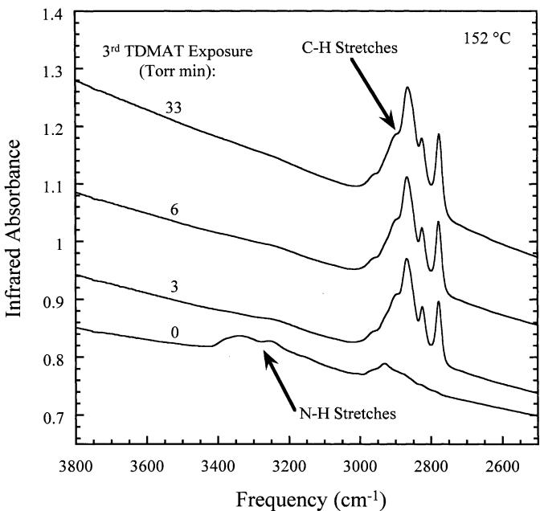  
Fig. 1. FTIR spectra of the initial TiN surface terminated with  $\mathrm{NH}_3$ . species during the third TDMAT exposure at  $152^{\circ}\mathrm{C}$ . The FTIR spectra have been displaced for clarity in presentation.

The phase composition of the TiN ALD films was evaluated by grazing incidence XRD using a Simens D5000 Diffractometer. These XRD measurements were also performed in the Ångstrom Laboratory at Uppsala University. A Thermomicroscopes Autoprobe CP AFM was used in intermittent contact mode to measure the surface morphology and surface roughness of the TiN ALD films.

# 3. Results

# 3.1. FTIR measurements

Transmission FTIR spectroscopy measurements were used to explore the surface chemistry occurring during sequential TDMAT and  $\mathrm{NH}_3$  exposures. The  $\mathrm{ZrO}_2$  surface was first exposed to two TiN ALD AB cycles using saturation TDMAT exposures at  $152^{\circ}\mathrm{C}$  and saturation  $\mathrm{NH}_3$  exposures at  $77 - 227^{\circ}\mathrm{C}$ . This procedure partially converts the  $\mathrm{ZrO}_2$  surface to a TiN surface. FTIR measurements monitored this treatment and the conversion of the initial hydroxylated  $\mathrm{ZrO}_2$  surface to a TiN surface terminated with  $\mathrm{NH}_3$ . species.

The TiN surface following  $\mathrm{NH}_3$  exposures was then exposed to increasing amounts of TDMAT at  $152^{\circ}\mathrm{C}$ . Fig. 1 shows the FTIR spectra vs. TDMAT exposure during the third TDMAT exposure in the ABAB... sequence. This TDMAT exposure produces a loss of absorbance in the  $3100 - 3400\mathrm{cm}^{- 1}$  frequency region

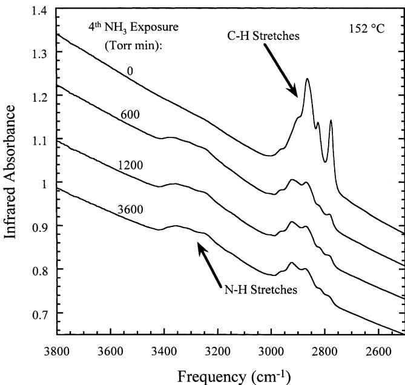  
Fig. 2. FTIR spectra of the initial TiN surface terminated with  $\mathrm{Ti(N(CH_3)_2)_x}^*$  species during the fourth  $\mathrm{NH_3}$  exposure at  $152^{\circ}\mathrm{C}$ . The FTIR spectra are again offset for clarity in presentation.

corresponding with  $\mathrm{N - H}$  stretching vibrations from  $\mathrm{NH}_x^*$  surface species. A concurrent increase in absorbance is observed in the  $2700 - 3000\mathrm{cm}^{- 1}$  frequency region corresponding with a gain in  $\mathrm{C - H}$  stretching vibrations from the dimethylamino species. The spectra in Fig. 1 have been offset for clarity in presentation. A TDMAT exposure of 3 Torr min is sufficient for the TDMAT reaction to proceed nearly to completion at  $152^{\circ}\mathrm{C}$ . Additional TDMAT exposure produces minimal changes in the  $\mathrm{N - H}$  and  $\mathrm{C - H}$  stretching regions of the FTIR spectra. In addition to the exchange between the  $\mathrm{NH}_x^*$  and  $\mathrm{Ti(N(CH_3)_2)_x}^*$  surface species shown in Fig. 1, large TDMAT exposures also produce a continual increase in the background absorbance of the FTIR spectra.

$\mathrm{NH}_3$  was then exposed to the TiN surface following the TDMAT exposures. This surface is terminated with  $\mathrm{Ti(N(CH_3)_2)_x}^*$  species. The  $\mathrm{NH}_3$  exposure removes the dimethylamino surface species. Fig. 2 displays the loss of  $\mathrm{C - H}$  stretching vibrations and gain of  $\mathrm{N - H}$  stretching vibrations vs.  $\mathrm{NH}_3$  exposure at  $152^{\circ}\mathrm{C}$  during the fourth  $\mathrm{NH}_3$  exposure in the ABAB... sequence. The spectra are again offset for clarity.  $\mathrm{NH}_3$  exposures of 600 Torr min displace most of the  $\mathrm{Ti(N(CH_3)_2)_x}^*$  surface species and replace them with  $\mathrm{NH}_x^*$  surface species.

Fig. 2 reveals that additional  $\mathrm{NH}_3$  exposure produces very little change in the FTIR spectra. The FTIR spectrum after an  $\mathrm{NH}_3$  exposure of 3600 Torr min reveals that a residual amount of dimethylamino surface species are not easily reacted by long  $\mathrm{NH}_3$  exposures. A comparison of the initial FTIR spectrum in Fig. 1 after the second  $\mathrm{NH}_3$  exposure and the FTIR spectrum in Fig. 2 after the fourth saturation  $\mathrm{NH}_3$  exposure reveals that the absorbance for the  $\mathrm{C - H}$  stretching vibration has increased nearly a factor of two. This increase may be caused by the buildup of dimethylamino species in the growing TiN film.

The switching behavior vs. TDMAT and  $\mathrm{NH}_3$  exposures shown in Figs. 1 and 2 continues as the TiN film is progressively deposited during TiN ALD. Fig. 3a shows the integrated absorbances for the  $\mathrm{C - H}$  and  $\mathrm{N - H}$  stretching vibrations vs. TDMAT exposure at 0.1 Torr and  $152^{\circ}\mathrm{C}$  during the third TDMAT exposure. Fig. 3b displays the integrated absorbances for the  $\mathrm{C - H}$  and  $\mathrm{N - H}$  stretching vibrations vs.  $\mathrm{NH}_3$  exposure at 10 Torr and  $152^{\circ}\mathrm{C}$  during the fourth  $\mathrm{NH}_3$  exposure. The data points in Fig. 3 have been normalized to their maximum values. The correlation between the loss and gain of the absorbances of the  $\mathrm{C - H}$  and  $\mathrm{N - H}$  stretching vibrations

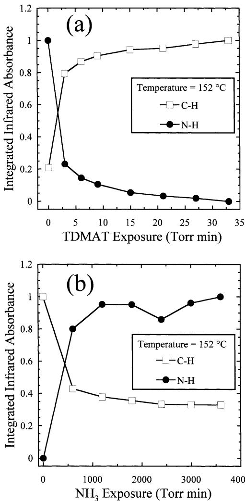  
Fig. 3. Integrated absorbance of  $\mathrm{C - H}$  and  $\mathrm{N - H}$  stretching vibrations vs. TDMAT and  $\mathrm{NH}_3$  exposures at  $152^{\circ}\mathrm{C}$ . (a) Third TDMAT exposure in ABAB... sequence. (b) Fourth  $\mathrm{NH}_3$  exposure in ABAB... sequence.

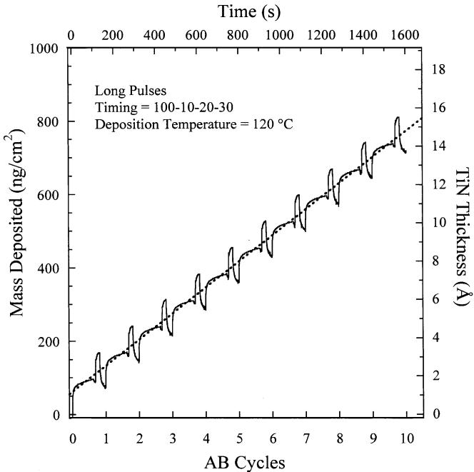  
Fig. 4. Mass deposited vs. number of AB cycles measured using the in situ QCM at  $120^{\circ}\mathrm{C}$  for the long reactant pulses with a timing sequence of (100-10-20-30).

is consistent with the surface chemistry described by Eqs. (3) and (4). Notice that the integrated infrared absorbance for the  $\mathrm{C - H}$  stretching vibrations after the fourth  $\mathrm{NH}_3$  exposure in Fig. 3b has increased relative to the integrated infrared absorbance for the  $\mathrm{C - H}$  stretching vibration prior to the third TDMAT exposure shown in Fig. 3a.

# 3.2. QCM measurements

The QCM displayed extremely linear TiN ALD growth during the sequential TDMAT and  $\mathrm{NH}_3$  exposures. The nomenclature for the ALD pulse sequence is  $t1 - t2 - t3 - t4$  where  $t1$  is the TDMAT exposure time,  $t2$  is the purge time following the TDMAT exposure,  $t3$  is the  $\mathrm{NH}_3$  exposure time and  $t4$  is the purge time following the  $\mathrm{NH}_3$  exposure. Results for TiN growth during a pulse sequence of (100- 10- 20- 30) at a deposition temperature of  $120^{\circ}\mathrm{C}$  are shown in Fig. 4. The stepwise structure of the mass changes correspond with the TDMAT and  $\mathrm{NH}_3$  exposures.

Fig. 5a presents the results of QCM measurements examining the influence of the TDMAT exposure time on the TiN mass deposition rate. These experiments were performed at a deposition temperature of  $120^{\circ}\mathrm{C}$  and a TDMAT pressure of  $\sim 0.025$  Torr using the pulse sequence  $(x - 10 - 6 - 10)$ . The mass deposition rates were obtained by averaging the mass increases produced by 3- 6 separate ALD cycles. Fig. 5a shows that the mass deposition rate initially increases rapidly with increasing

TDMAT exposure time at a pressure of  $\sim 0.025$  Torr. The mass deposition rate is  $29.7~\mathrm{ng / cm^2 / }$  cycle for a 1 s TDMAT exposure and increases to  $51.4~\mathrm{ng / cm^2 / }$  cycle for a  $50~\mathrm{s}$  TDMAT exposure.

For TDMAT exposure times  $\geq 50\mathrm{~s~}$  the mass deposition is not self- limiting. In this regime, the TiN deposition displays a continual slow growth of  $\sim 0.05$ $\mathrm{ng / cm^2 / s}$  .The right axis shows the growth rates that result from assuming a bulk TiN density. Bulk TiN has a Ti atom density of  $d = 5.08\times 10^{22} / \mathrm{cm}^3$  and a mass density of  $5.22\mathrm{g} / \mathrm{cm}^3$  One monolayer (ML) of TiN has an estimated thickness of  $d^{- 1 / 3} = 2.70\times 10^{- 8}$  cm and would yield a mass deposition rate of  $141~\mathrm{ng / cm^2}/$  cycle.

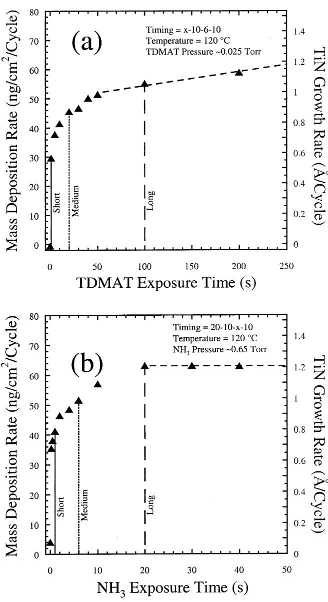  
Fig. 5. (a) Mass deposition rate vs. TDMAT exposure time at  $120^{\circ}\mathrm{C}$  on an initial TiN surface terminated with  $\mathrm{NH}_x^*$  species. (b) Mass deposition rate vs.  $\mathrm{NH}_3$  exposure time at  $120^{\circ}\mathrm{C}$  on an initial TiN surface terminated with  $\mathrm{T}_2(\mathrm{N}(\mathrm{CH}_3)_2)_x^*$  species.

The effect of varying the  $\mathrm{NH}_3$  exposure time on the TiN mass deposition rate is shown in Fig. 5b. The QCM measurements were performed at  $120^{\circ}\mathrm{C}$  using the ALD pulse sequence  $(20 - 10 - x - 10)$ . The mass deposition rate increases very rapidly to  $35.5\mathrm{ng} / \mathrm{cm}^2 /$  cycle for  $0.2\mathrm{sNH}_3$  exposures. The TiN ALD growth rate subsequently is self- limiting at  $63.1~\mathrm{ng} / \mathrm{cm}^2 /$  cycle for  $\mathrm{NH}_3$  exposures  $\geq 20\mathrm{s}$ .

Additional QCM experiments examined the effects of independently varying the TDMAT and  $\mathrm{NH}_3$  purge times. For pulse sequences of  $(20 - x - 6 - 10)$ , the mass deposition rate decreases only slightly with increasing TDMAT purge times from  $57.6~\mathrm{ng} / \mathrm{cm}^2 /$  cycle at  $0.1\mathrm{s}$  to an average value of  $55.8~\mathrm{ng} / \mathrm{cm}^2 /$  cycle for purge times above  $\sim 5\mathrm{s}$ . In contrast, the mass deposition rate decreases much more noticeably with increasing  $\mathrm{NH}_3$  purge times. For pulse sequences of  $(20 - 10 - 6 - x)$ , the TiN ALD growth rate decreases from  $69.8~\mathrm{ng} / \mathrm{cm}^2 /$  cycle at  $2\mathrm{s}$  to  $46.8~\mathrm{ng} / \mathrm{cm}^2 /$  cycle for purge times of  $\geq 30\mathrm{s}$ .

The QCM measurements do not clearly indicate an optimal timing sequence for TiN ALD. Fig. 5a and b exhibit a rapid initial increase in mass deposition followed by regions of slower change. In particular, Fig. 5a does not show self- limiting behavior vs. TDMAT exposure. To explore further the effects of the reactant exposure times, three ALD pulse sequences were selected to investigate the TiN ALD surface chemistry and film growth. The designations and timings for these pulse sequences are: 'short'  $(1 - 0.5 - 1 - 5)$ , 'medium'  $(20 - 10 - 6 - 10)$  and 'long'  $(100 - 10 - 20 - 30)$ . The exposure times for the short, medium and long pulse sequences are indicated by the solid, dotted and dashed lines, respectively, in Fig. 5a and b.

TiN ALD was performed using the short, medium and long timing sequences at deposition temperatures of 60, 90, 120, 150, 180, 210 and  $240^{\circ}\mathrm{C}$ . At each temperature and timing sequence, TiN ALD was performed until the QCM indicated that the TiN film was growing at a constant rate. At this point, the QCM data was recorded for at least 10 ALD cycles. For example, the solid line in Fig. 4 shows the QCM data measured at  $120^{\circ}\mathrm{C}$  using the long pulse sequence. The dotted line in this figure is a linear least squares fit to the QCM data and yields a mass deposition rate of  $71.0~\mathrm{ng} / \mathrm{cm}^2 /$  cycle.

Fig. 6 shows an Arrhenius plot of the mass deposition rates obtained from the QCM measurements. The corresponding TiN growth rates are also given assuming a TiN bulk density of  $5.22~\mathrm{g} / \mathrm{cm}^3$ . For each pulse sequence, the mass deposition rate increases nearly exponentially with deposition temperature. In addition, at a given temperature, the mass deposition rate increases monotonically between the short, medium and long pulse sequences. For the short pulses, the mass deposition rate exhibits an activation energy of  $0.12(\pm 0.01)$

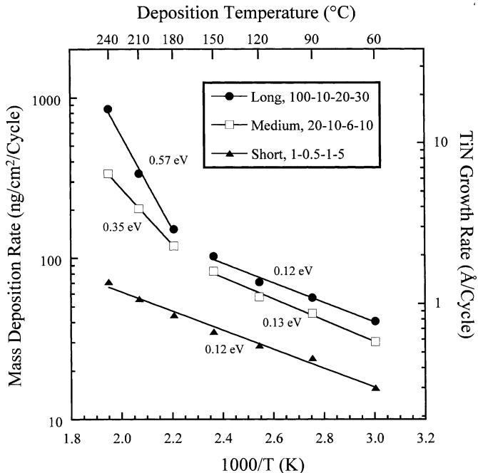  
Fig. 6. Arrhenius plot of TiN ALD mass deposition rates for long, medium and short reactant pulse sequences at deposition temperatures of  $60 - 240^{\circ}\mathrm{C}$ .

eV. The medium and long pulse sequences show activation energies of  $0.13(\pm 0.01)$  and  $0.12(\pm 0.01)$  eV, respectively, between 60 and  $150^{\circ}\mathrm{C}$ . Between 180 and  $240^{\circ}\mathrm{C}$ , the activation energies obtained using the medium and long pulses are  $0.35(\pm 0.07)$  and  $0.57(\pm 0.09)$  eV, respectively.

The QCM measurements also revealed changes in the individual QCM pulse shapes with variations in deposition temperature and pulse timing. For example, Fig. 7 presents the average QCM pulse shape obtained from 10 ALD cycles using the long exposures at  $120^{\circ}\mathrm{C}$ . The ALD timing sequence is indicated above the QCM data. During the TDMAT exposure, there is a rapid increase in apparent mass followed by a long period of much slower apparent mass gain. The term 'apparent' is employed because the QCM is sensitive to both mass and temperature changes [25]. Temperature changes may be initiated by perturbations to the gas flow by introducing reactants and subsequently removing the reactants. During the TDMAT purge, some apparent mass is lost. The  $\mathrm{NH}_3$  exposure causes a large apparent mass gain of  $\sim 80~\mathrm{ng} / \mathrm{cm}^2$ . However, all of this apparent mass is lost during the subsequent  $\mathrm{NH}_3$  purge. In fact, there is a net apparent mass loss between the end of the TDMAT purge and the end of the  $\mathrm{NH}_3$  purge.

As labeled in Fig. 7,  $m_0$  is the net apparent mass deposited by the TDMAT exposure at the end of the TDMAT purge.  $m_0 + m_1$  is the net apparent mass deposited following the  $\mathrm{NH}_3$  purge and  $m_1$  is the apparent mass change produced by the  $\mathrm{NH}_3$  exposure. Fig. 8

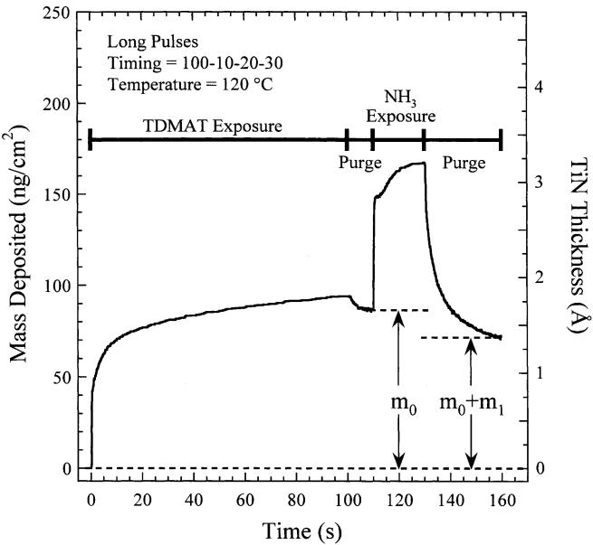  
Fig. 7. Mass deposited during one reactant cycle using the long pulse sequence at  $120^{\circ}\mathrm{C}$ . The quantity  $m_0$  is the mass change resulting from TDMAT exposure and purge. The quantity  $m_0 + m_1$  is the net mass change resulting from one complete TiN ALD cycle.

plots the QCM mass ratio,  $R = (m_0 + m_1) / m_0$ , for each of the timing sequences and temperatures shown in Fig. 6. For the short pulses,  $R$  increases with increasing temperature. The  $R$  values for the medium and long pulse sequences are nearly identical and are consistently larger than the  $R$  values for the short pulse sequence. For the medium and long pulse sequences, the  $R$  values increase with increasing deposition temperature except for an initial drop between 60 and  $90^{\circ}\mathrm{C}$ .

# 3.3. Film properties

The ex situ measurements of film resistivity using the four- point probe are shown in Fig. 9. The resistivity dramatically decreases vs. deposition temperature. The resistivities are also consistently smaller for the short reactant pulses. The smallest resistivity of  $1.4\times 10^{4}$ $\mu \Omega \mathrm{cm}$  is obtained at  $240^{\circ}\mathrm{C}$  with the short reactant pulses. This resistivity is considerably higher than the bulk TiN resistivity of  $22\mu \Omega \mathrm{cm}$ .

The TiN film thicknesses were measured after deposition using a surface profilometer. The in situ QCM results for the deposited film mass were then used together with the ex situ film thicknesses to derive the film density. These film densities are shown in Fig. 10. The densities derived from the QCM and surface profilometer measurements are very small at low deposition temperature and increase progressively at higher deposition temperature. In addition, these densities are consistently higher for the short reactant pulses. The QCM and surface profilometer measurements reveal that the highest density of  $3.0\mathrm{g} / \mathrm{cm}^3$  is obtained at  $240^{\circ}\mathrm{C}$  for the short reactant pulses. This density is considerably smaller than the bulk TiN density of  $5.22\mathrm{g} / \mathrm{cm}^3$ .

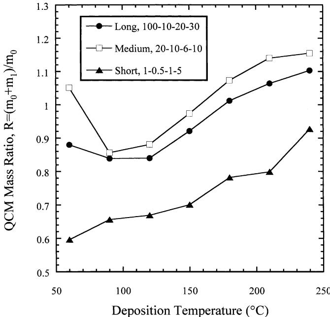  
Fig. 8. QCM mass ratio,  $R = (m_0 + m_1) / m_0$ , measured during TiN ALD using long, medium and short reactant pulse sequences at deposition temperatures of  $60 - 240^{\circ}\mathrm{C}$ .

The low densities observed in Fig. 10 correspond to high film porosity. The right axis of Fig. 10 shows the film porosity vs. deposition temperature for the three

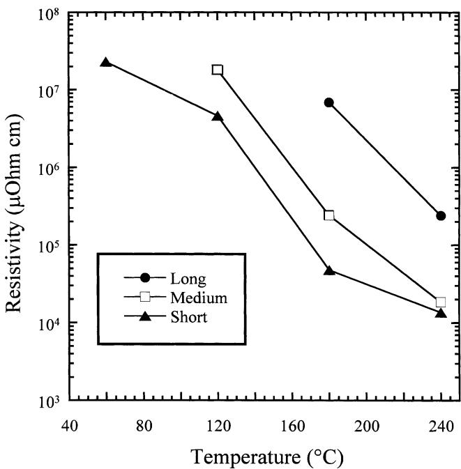  
Fig. 9. Resistivities of TiN ALD films measured using the four-point probe for long, medium and short reactant pulse sequences at deposition temperatures of  $60 - 240^{\circ}\mathrm{C}$ .

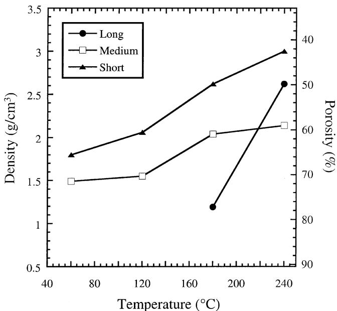  
Fig. 10. Densities of TiN ALD films measured using QCM and surface profilometry measurements for long, medium and short reactant pulse sequences at deposition temperatures of  $60 - 240^{\circ}\mathrm{C}$ .

reactant exposures calculated using: porosity  $(\%) = 100\times (1 - d / 5.22)$  where  $d$  is the corresponding film density. As expected based on the densities, higher porosities are measured at lower deposition temperatures. The lowest porosities are obtained at  $240^{\circ}\mathrm{C}$  for the short reactant pulses.

High film porosity may lead to facile film oxidation. Fig. 11 shows the chemical composition in atomic percentage measured using ex situ XPS analysis. The XPS measurements in Fig. 11a were performed on TiN ALD films deposited on  $\mathrm{Si}(100)$  using the short pulse sequence at deposition temperatures of  $60 - 240^{\circ}\mathrm{C}$ . Fig. 11b shows XPS measurements vs. TDMAT exposure for the short, medium and long pulse sequences measured for TiN ALD films deposited on  $\mathrm{Si}(100)$  at  $180^{\circ}\mathrm{C}$ . These XPS measurements reveal that the TiN films are highly oxidized after TiN growth at low temperature. Oxygen is still the dominant film constituent even after TiN growth at  $240^{\circ}\mathrm{C}$  using the short reactant pulses. This high level of film oxidation may explain the high resistivity values shown in Fig. 9.

Grazing incidence XRD was performed on the TiN ALD films deposited on  $\mathrm{Si}(100)$  and soda- lime glass substrates. Two weak, broad peaks were observed in the diffraction patterns at  $2\theta = 36.5$  and  $42.9^{\circ}$ . Under- stoichiometric  $\mathrm{TiN}_{0.7}$  films exhibit strong reflections at  $2\theta = 36.69$  and  $42.62^{\circ}$ . Consequently, the XRD measurements suggest that the ALD TiN films are weakly crystalline and rich in titanium.

The surface morphology of the TiN ALD films deposited on  $\mathrm{Si}(100)$  substrates was examined using AFM. The TiN ALD films exhibited a topography typical of amorphous films and were relatively smooth. For instance, the root mean squared (RMS) surface roughness of the TiN ALD films with a thickness of  $800\mathrm{\AA}$  deposited using the short reactant pulse sequence at  $180^{\circ}\mathrm{C}$  was  $10\mathrm{\AA}$ . The RMS roughness of the TiN ALD films increased with film thickness, deposition temperature and reactant exposure times.

# 4. Discussion

# 4.1. Surface chemistry during TiN ALD

The proposed reaction mechanism for TiN ALD is given by Eqs. (3) and (4). This reaction mechanism is supported by the FTIR results presented in Figs. 1- 3.

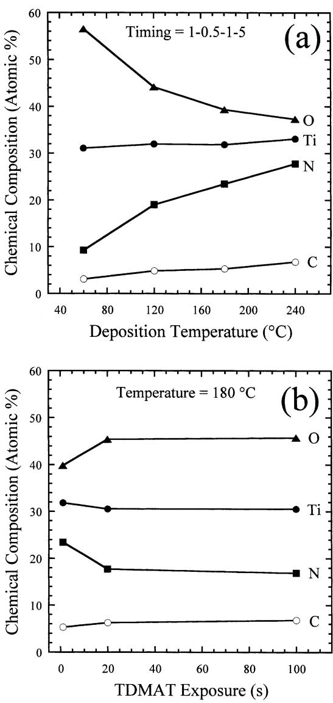  
Fig. 11. Chemical compositions of TiN ALD films measured using XPS techniques. (a) Composition vs. deposition temperature using the short reactant exposure pulse sequence. (b) Composition vs. TDMAT exposure at  $180^{\circ}\mathrm{C}$ .

Fig. 1 shows that when the TiN surface covered with  $\mathrm{NH}_x^*$  species is exposed to TDMAT, the  $\mathrm{NH}_x^*$  species are replaced by  $\mathrm{Ti(N(CH_3)_2)_x^*}$  species. Similarly, Fig. 2 displays that the  $\mathrm{Ti(N(CH_3)_2)_x^*}$  species are exchanged for  $\mathrm{NH}_x^*$  species upon subsequent exposure to  $\mathrm{NH}_3$ . Fig. 3 illustrates that the TDMAT and  $\mathrm{NH}_3$  surface reactions are nearly self- limiting. These findings imply that repeating the reactions given by Eqs. (3) and (4) in a binary ABAB... sequence should produce atomic layer controlled growth of TiN films.

The FTIR spectra also reveal some problems for TiN ALD using TDMAT and  $\mathrm{NH}_3$ . The vibrational spectra reveal that the dimethylamino species are progressively building up in the growing TiN film. The integrated absorbance for the  $\mathrm{C - H}$  stretching vibrations from the  $\mathrm{Ti(N(CH_3)_2)_x^*}$  species increases progressively after each successive  $\mathrm{NH}_3$  exposure in the ABAB... sequence. These residual dimethylamino species may lead to lower film densities and facilitate the oxidation of the TiN film upon air exposure.

The FTIR spectra do not observe the growth of distinct TiN infrared absorption features that increase progressively with the sequential TDMAT and  $\mathrm{NH}_3$  exposures. However, there is a progressive increase in the background infrared absorption that is consistent with the deposition of a conducting TiN film. Evidence for the slow, non- self- limiting adsorption of TDMAT during TiN ALD is also provided by the continuous increase in the background infrared absorption following large TDMAT exposures. This rise in background absorbance persists even after the  $\mathrm{C - H}$  stretching vibrations from the  $\mathrm{Ti(N(CH_3)_2)_x^*}$  species have reached their maximum absorbance values.

The variations in the QCM mass ratio,  $R$  with temperature and exposure shown in Fig. 8 can be employed to evaluate the TiN ALD surface chemistry. Table 1 presents three different possible TiN ALD reaction sequences derived from Eqs. (3) and (4) where the number of dimethylamine molecules produced during the TDMAT reaction is varied from  $x = 1$ , 2 and 3. The Ti atom also changes its oxidation number from 4 to 3 during the  $\mathrm{NH}_3$  reaction to obtain the correct oxidation number in bulk TiN.

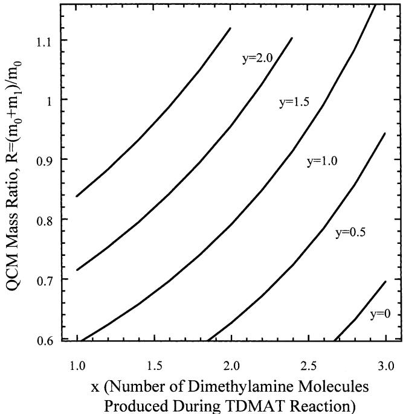  
Fig. 12. QCM mass ratios predicted for TiN ALD vs. the number of dimethylamine molecules produced during the TDMAT reaction,  $x$ , and the number of dimethylamino ligands incorporated per Ti atom,  $y$ .

The surface species remaining after the  $\mathrm{NH}_3$  reaction for  $x = 1$  is given as  $\mathrm{NTiNH^*}$ . This species requires a double bond between the Ti atom and the NH ligand to obtain a Ti oxidation number of 3. However, there should be no double bonds in the TiN film. To avoid the double bond, adjacent  $\mathrm{NTiNH^*}$  species could rearrange to form a ...Ti- NH- Ti- NH- Ti... structure where no double bonds are present. A rearrangement is also required during the  $\mathrm{NH}_3$  reaction for  $x = 3$  to obtain a Ti oxidation number of 3. This rearrangement yields the  $\mathrm{N}_2\mathrm{TiNH}_2^*$  and  $\mathrm{NH^*}$  species.

Table 1 lists the QCM mass ratios,  $R = (m_0 + m_1) / m_0$  corresponding to the three possible reaction sequences. Table 1 illustrates that  $R$  increases with  $x$ . The general formula may be written:  $R = 62 / (224 - 45x)$ . The solid line marked  $y = 0$  in Fig. 12 plots  $R$  vs.  $x$  assuming

Table 1 Possible reaction sequences for TiN ALD and their corresponding QCM mass ratio,  $R = (m_0 + m_1) / m_0$  

<table><tr><td>x</td><td>Reaction sequence</td><td>R = (m0 + m1) / m0</td></tr><tr><td>1</td><td>(A) NH* + Ti(N(CH3)2)4 → NTi(N(CH3)2)3 * + HN(CH3)2
(B) NTi(N(CH3)2)3 * + 4/3NH3 → NTiNH* + 3HN(CH3)2 + 1/6N2</td><td>0.35</td></tr><tr><td>2</td><td>(A) 2NH* + Ti(N(CH3)2)4 → N2Ti(N(CH3)2)2 * + 2HN(CH3)2
(B) N2Ti(N(CH3)2)2 * + 4/3NH3 → N2TiNH2* + 2HN(CH3)2 + 1/6N2</td><td>0.46</td></tr><tr><td>3</td><td>(A) 3NH* + Ti(N(CH3)2)4 → N2Ti(N(CH3)2)2 * + 3HN(CH3)2
(B) N3Ti(N(CH3)2)2 * + 4/3NH3 → N2TiNH2* + NH* + HN(CH3)2 + 1/6N2</td><td>0.70</td></tr></table>

The number of dimethylamine molecules produced during the TDMAT reaction is  $x = 1$  2 or 3.

Table 2 Possible reaction sequences for TiN ALD and their corresponding QCM mass ratio,  $R = (m_0 + m_1) / m_0$  

<table><tr><td>y</td><td>Reaction sequence</td><td>R = (m0+m1)/m0</td></tr><tr><td>0</td><td>(A) 2NH* + Ti(N(CH3)2)4→ N2Ti(N(CH3)2)2* + 2HN(CH3)2
(B) N2Ti(N(CH3)2)2* + 4/3NH4→ N2TiNH2* + 2HN(CH3)2 + 1/6N2</td><td>0.35</td></tr><tr><td>1</td><td>(A) 2NH* + Ti(N(CH3)2)4→ N2Ti(N(CH3)2)2* + 2HN(CH3)2
(B) N2Ti(N(CH3)2)2* + 4/3NH4→ N2Ti(N(CH3)2)2* + NH2* + HN(CH3)2 + 1/6H2 + 1/2H2</td><td>0.79</td></tr><tr><td>2</td><td>(A) 2NH* + Ti(N(CH3)2)4→ N2Ti(N(CH3)2)2* + 2HN(CH3)2
(B) N2Ti(N(CH3)2)2* + 4/3NH4→ NTi(N(CH3)2)2* + 2NH* + 1/6N2 + H2</td><td>1.12</td></tr></table>

The number of dimethylamino ligands incorporated into the film during the  $\mathrm{NH_3}$  reaction is  $y = 0$  1 or 2.

the reaction mechanism given by Eqs. (3) and (4). The vertical axis in Fig. 12 shows the range of  $R$  values observed experimentally in Fig. 8. Fig. 12 demonstrates that the  $R$  values predicted by Eqs. (3) and (4) do not span the observed range of  $R$  values. Predicted QCM mass ratios  $R > 0.6$  are observed only for  $x > 2.6$ . The maximum  $R$  value of  $R \sim 0.7$  is obtained at  $x = 3.0$ .

Alternate reaction mechanisms were evaluated to explain the QCM mass ratio results. The simplest reaction mechanism that explained the observations assumes that some of the dimethylamino ligands on the TDMAT molecule are incorporated into the growing TiN film. Table 2 lists three possible reaction sequences where the number of dimethylamino ligands incorporated into the film is equal to  $y = 0$ , 1 and 2. The number of dimethylamine molecules released during the TDMAT reaction is assumed to be  $x = 2$ . The third column in Table 2 lists the corresponding QCM mass ratios and demonstrates that  $R$  increases with  $y$ .

The general formula for the QCM mass ratio including dimethylamino incorporation is:  $R = (62 + 44y) / (224 - 45x)$  with the constraints:  $1 \leq x \leq 3$  and  $y \leq (4 - x)$ . The  $R$  values predicted by this formula are displayed in Fig. 12 for  $y = 0$ , 0.5, 1.0, 1.5 and 2.0. Fig. 12 shows that the  $R$  values predicted by the dimethylamino ligand incorporation mechanism span the full range of experimentally observed  $R$  values.

The FTIR and QCM measurements both suggest that dimethylamino ligands may be incorporated in the TiN films. Fig. 12 shows that  $R$  is expected to increase with increasing dimethylamino ligand incorporation. Fig. 8 indicates that increasing deposition temperature and exposure times increases  $R$ . These similar trends suggest that TiN ALD performed at higher temperatures and larger exposure times may incorporate more dimethylamino ligands. In agreement with this expectation, Fig. 11a shows that the C and N atomic percentage of the TiN ALD films increase with increasing deposition temperature. Likewise, Fig. 11b displays that the C atomic percentage increases slightly with increasing exposure times.

In addition to dimethylamino incorporation, TiN ALD may be affected by adsorbed  $\mathrm{NH_3}$ . The long purge times required following  $\mathrm{NH_3}$  exposures may result from the adsorption of  $\mathrm{NH_3}$  on the TiN surfaces on the QCM and the reactor walls. Previous laser- induced thermal desorption measurements found that  $\mathrm{NH_3}$  persists on TiN surfaces under UHV conditions to temperatures of  $177 ^\circ \mathrm{C}$  [19]. The mass transient observed during the  $\mathrm{NH_3}$  exposure in Fig. 7 is consistent with the adsorption and desorption of molecular  $\mathrm{NH_3}$ . Assuming a density for condensed  $\mathrm{NH_3}$  of  $0.68 \mathrm{g / cm^3}$  or  $2.41 \times 10^{22}$  molecules/  $\mathrm{cm^3}$  [26], one ML of  $\mathrm{NH_3}$  corresponds to  $23 \mathrm{ng / cm^2}$ /cycle. Therefore, the  $\sim 80 \mathrm{ng / cm^2}$  mass increase corresponds to  $\sim 2.5 \mathrm{ML} \mathrm{NH_3}$ . Fig. 10 demonstrates that the TiN ALD films are porous. Consequently, the  $3.5 \mathrm{ML}$  of  $\mathrm{NH_3}$  may be adsorbed within the porous TiN film.

# 4.2. TiN ALD growth rate

One ML of TiN has an estimated thickness of  $d^{- 1 / 3} = 2.7 \mathrm{\AA}$  and would yield a mass deposition rate of  $141 \mathrm{ng / cm^2}$ /cycle. Fig. 6 reveals that TiN ALD growth rates  $>1 \mathrm{ML}$  are measured for the long exposures at the highest growth temperatures. These large growth rates are attributed to the non- self- limiting adsorption of TDMAT and TiN CVD from TDMAT thermal decomposition that occurs at temperatures  $>180 ^\circ \mathrm{C}$ . Fig. 5a also demonstrates non- self- limiting adsorption of TDMAT at lower temperatures of  $120 ^\circ \mathrm{C}$ . Furthermore, the continual increase in the FTIR background absorption observed following large TDMAT exposures at  $152 ^\circ \mathrm{C}$  also suggests non- self- limited growth.

The activation energies measured for TiN ALD are consistent with previous measurements of the TDMAT surface reactions. Previously, an activation energy of  $0.15 \mathrm{eV}$  was measured for TiN low pressure CVD using TDMAT and  $\mathrm{NH_3}$  [16,17]. This value is similar to the activation energies of  $0.12 - 0.13 \mathrm{eV}$  shown in Fig. 6 for the short reactant pulses and the medium and long reactant pulses below  $150 ^\circ \mathrm{C}$ . This similarity suggests that the TiN ALD and low pressure TiN CVD share a common rate- limiting step. TiN ALD is similar to low pressure TiN CVD because gas phase reactions are not involved during the TiN growth. The larger activation energies measured for the medium and long exposures at temperatures  $>180 ^\circ \mathrm{C}$  are consistent with TiN CVD

by thermal decomposition of TDMAT. Activation energies of  $0.8\mathrm{eV}$  have been previously measured for TiN CVD by TDMAT decomposition [27].

The TiN ALD growth rates can be used to determine the TDMAT reactive sticking coefficient during TiN ALD. The reactive sticking coefficient is given by  $S =$ $\Theta /\Phi$  .  $\Theta$  is the deposited coverage of Ti atoms measured after a TDMAT exposure and  $\Phi$  is the number of TDMAT molecular collisions corresponding to the same TDMAT exposure.  $\Theta$  can be determined from Fig. 5a and  $\Phi$  is obtained from gas kinetics theory. The initial reactive sticking coefficient calculated from Fig. 5a is  $S = 9\times 10^{- 3}$  .In comparison, the reaction probability reported for TDMAT thermal decomposition on a  $\mathrm{TiN}_x\mathrm{C}_y$  surface at  $200^{\circ}\mathrm{C}$  is  $\sim 10^{- 3}$  [28].

The TiN ALD growth rates shown in Fig. 6 can also be compared with earlier TiN ALD growth rates obtained using the titanium halide or titanium organometallic precursors. TiN ALD growth rates of 0.17 and  $0.32\mathrm{\AA}$  /cycle are measured at  $500^{\circ}\mathrm{C}$  using  $\mathrm{TiCl_4}$  [5] and  $\mathrm{TiI_4}$  [8], respectively. In comparison, earlier reports of TiN ALD using TEMAT [9] and TDMAT [11] yielded TiN ALD growth rates of 5.0 and  $4.3\mathrm{\AA}$  /cycle, respectively, at  $180^{\circ}\mathrm{C}$  These large TiN ALD growth rates were interpreted in terms of additional TEMAT or TDMAT reactant adsorption on the growing TiN surface [9,11].

The additional TEMAT or TDMAT reactants are believed to be adsorbed to the TiN surface following the completion of the surface reaction [9,11]. The adsorption of these Lewis bases is reasonable given the strong Lewis acid  $\mathrm{Ti^{3 + }}$  sites on the TiN surface. Earlier studies have also demonstrated that Lewis bases such as  $\mathrm{HN(CH_3)_2}$  and  $\mathrm{NH_3}$  both can adsorb to the growing TiN surface [19]. The adsorbed TEMAT or TDMAT reactants then react with  $\mathrm{NH_3}$  during the subsequent  $\mathrm{NH_3}$  exposure and yield larger TiN ALD growth rates.

Although the adsorption of additional TEMAT or TDMAT reactants on the TiN surface is reasonable, lower TiN ALD growth rates would be predicted at higher temperatures. Lower TiN ALD growth rates are expected because the adsorbed reactant coverage should decrease with temperature. The opposite trend is observed in Fig. 6. In addition, the QCM mass ratios during TDMAT and  $\mathrm{NH_3}$  exposures are inconsistent with additional adsorbed TDMAT reactants persisting on the growing TiN film. Consequently, the large TiN ALD growth rates at higher temperatures are attributed to TDMAT thermal decomposition.

# 4.3. TiN ALD film properties

The TiN ALD films have a very high resistivity that decreases dramatically with growth temperature. The densities of the TiN ALD films are also extremely low. The TiN films have porosities that range from 80 to $42\%$  depending on the growth temperature and reactant exposure length. These high porosities probably lead to the very high oxygen levels observed in the TiN film after air exposure. This assumption could be verified by depositing an  $\mathrm{Al}_2\mathrm{O}_3$  ALD capping layer onto the TiN film prior to air exposure and subsequently analyzing the TiN film using depth- profiling XPS. The high porosity will seriously compromise the ability of these TiN ALD films to serve as effective diffusion barriers. These porous TiN films are not expected to be effective diffusion barriers for copper. Likewise, the high porosities allow easy oxidation of the TiN films and raise the film resistivity. This high resistivity is also not desirable for a diffusion barrier for backend multilevel interconnects.

The earlier studies of TiN ALD using the TEMAT titanium organometallic precursor reported TiN growth rates based on surface profilometry measurements [9]. Related studies using TDMAT implied that the results for TEMAT and TDMAT were similar [11]. Unfortunately, these earlier studies did not measure TiN ALD film densities. In addition, the earlier reports did not report the oxygen levels in the TiN ALD films. Either of these measurements would have been able to uncover the high porosity and facile oxidation of these TiN ALD films.

To examine the differences between TiN ALD using titanium halide and titanium organometallic precursors, a TiN ALD film was grown using 500 cycles of  $\mathrm{TiCl_4}$  and  $\mathrm{NH_3}$  at  $450^{\circ}\mathrm{C}$ . This TiN ALD film was then examined using the four- point probe. The TiN film grown using  $\mathrm{TiCl_4}$  and  $\mathrm{NH_3}$  had a resistivity of  $140 \mu \Omega$  cm. This resistivity compares well with the resistivities measured earlier for TiN films deposited using  $\mathrm{TiCl_4}$  and  $\mathrm{NH_3}$  [5]. This similarity argues that the higher resistivities for the TiN ALD films using TDMAT and  $\mathrm{NH_3}$  result from the surface chemistry of the TDMAT precursor. The higher resistivity cannot be attributed to problems with the viscous flow ALD reactor.

Preliminary results indicate that ex situ hydrogen radical exposure to the TiN ALD films significantly reduces the resistivity. The hydrogen reduction probably partially eliminates oxygen and produces a higher purity TiN film. In situ hydrogen radical exposure may also promote the growth of higher density, lower porosity TiN ALD films. The density of TaN ALD films grown using tantalum organometallics has been reported to be increased using hydrogen radical exposures [29]. The hydrogen radicals may help remove the dimethylamino species and promote the crosslinking of  $- \mathrm{NH_2}$  surface species that would densify the TiN ALD film.

# 5. Conclusions

TiN ALD was examined using sequential exposures to TDMAT and  $\mathrm{NH_3}$ . These investigations reveal that

TiN ALD using TDMAT and  $\mathrm{NH_3}$  does not exhibit ideal ALD behavior. The surface chemistry was investigated using in situ FTIR and QCM techniques. The film properties were explored using ex situ four- point probe, surface profilometry, XPS, XRD and AFM analyses. The FTIR measurements were consistent with TiN ALD occurring via surface exchange reactions. TDMAT molecules react with  $\mathrm{NH_3}$  \* species to deposit new  $\mathrm{Ti(N(CH_3)_2)_x}^*$  surface species. The subsequent exposure to  $\mathrm{NH_3}$  removes most of the  $\mathrm{Ti(N(CH_3)_2)_x}^*$  surface species and restores the initial  $\mathrm{NH_3}^*$  species. However, the inability of the  $\mathrm{NH_3}$  exposure to remove all the dimethylamino species leads to the buildup of carbon species in the TiN film. The FTIR measurements also revealed a progressive increase in the background absorption during TDMAT exposure that was consistent with a slow, non- self- limiting TDMAT reaction.

QCM measurements revealed that sequential TDMAT and  $\mathrm{NH_3}$  exposures allow stepwise TiN film growth. The TDMAT and  $\mathrm{NH_3}$  surface reactions are nearly selflimiting. However, large TDMAT exposures generate a slow, continual growth of  $\sim 0.05\mathrm{ng / cm^2 / s}$  at  $120^{\circ}\mathrm{C}$  QCM studies determined that the activation energy for TiN ALD was  $0.12(\pm 0.01)$  eV using short exposures. Using long exposures at deposition temperatures  $>150$ $^\circ \mathrm{C}$  the activation energy increases to  $0.57(\pm 0.09)\mathrm{eV}$  and approaches the activation energy for TDMAT thermal decomposition. The TiN ALD films displayed a very high resistivity that was correlated with high film porosity and high oxygen content after air exposure. The high porosities may be partially attributed to the incomplete reactivity of  $\mathrm{NH_3}$  with the dimethylamino surface species. These high porosities and high resistivities will compromise the use of TiN ALD from TDMAT and  $\mathrm{NH_3}$  for depositing diffusion barriers.

# Acknowledgments

AcknowledgmentsThis study was funded by the Semiconductor Research Corporation under a directed grant from the Intel Corporation. The authors thank Chih- I. Wu and Paul McGregor of the Intel Corporation for numerous discussions and helpful suggestions. In addition, the authors acknowledge useful conversations with Jim Fair and Narissa Taylor of Novellus.

# References

[1] A.E. Kaloyeros, E. Eisenbraun, Annu. Rev. Mater. Sci. 30 2000363.

[2] T. Suntola, J. Hyyarinen, Annu. Rev. Mater. Sci. 15 (1985) 177. [3] S.M. George, A.W. Ott, J.W. Klaus, J. Phys. Chem. 100 (1996) 13121. [4] M. Ritala, M. Leskela, Atomic layer deposition, in: H.S. Nalwa (Ed.), Handbook of Thin Film Materials, Academic Press, San Diego, 2001. [5] M. Ritala, M. Leskela, E. Rauhala, P. Haussalo, J. Electrochem. Soc. 142 (1995) 2731. [6] M. Ritala, T. Askainen, M. Leskela, J. Jokinen, R. Lappalainen, M. Utriainen, L. Niinisto, E. Ristolainen, Appl. Surf. Sci. 120 (1997) 199. [7] J. Uhm, H. Jeon, Jpn. J. Appl. Phys. 40 (2001) 4657. [8] M. Ritala, M. Leskela, E. Rauhala, J. Jokinen, J. Electrochem. Soc. 145 (1998) 2914. [9] J.- S. Min, Y.- W. Son, W.- G. Kang, S.- S. Chun, S.- W. Kang, Jpn. J. Appl. Phys. 37 (1998) 4999. [10] D.- J. Kim, Y.- B. Jung, M.- B. Lee, Y.- H. Lee, J.- H. Lee, Thin Solid Films 372 (2000) 276. [11] J.- W. Lim, H.- S. Park, S.- W. Kang, J. Electrochem. Soc. 148 (2001) C403. [12] L.H. Dubois, B.R. Zegarski, G.S. Giraoami, J. Electrochem. Soc. 139 (1992) 3603. [13] B.H. Weiller, J. Am. Chem. Soc. 118 (1996) 4975. [14] R.M. Fix, R.G. Gordon, D.M. Hoffman, Chem. Mater. 2 (1990) 235. [15] R. Fix, R.G. Gordon, D.M. Hoffman, Chem. Mater. 3 (1991) 1138. [16] A. Katz, A. Feingold, S. Nakahara, S.J. Pearton, E. Lane, M. Geva, F.A. Stevie, K. Jones, J. Appl. Phys. 71 (1992) 993. [17] I.J. Kaajmakers, Thin Solid Films 247 (1994) 85. [18] J.S. Corneille, P.J. Chen, C.M. Truong, W.S. Oh, D.W. Goodman, J. Vac. Sci. Tech. A 13 (1995) 1116. [19] L.A. Okada, S.M. George, Appl. Surf. Sci. 137 (1999) 113. [20] A.C. Dillon, M.B. Robinson, M.Y. Han, S.M. George, J. Electrochem. Soc. 139 (1992) 537. [21] J.D. Ferguson, A.W. Weimer, S.M. George, Thin Solid Films 371 (2000) 95. [22] J.D. Ferguson, A.W. Weimer, S.M. George, Chem. Mater. 12 (2000) 3472. [23] T.H. Ballinger, J.C.S. Wong, J.T. Yates, Langmuir 8 (1992) 1676. [24] J.W. Elam, M.D. Groner, S.M. George, Rev. Sci. Instrum. 73 (2002) 2981. [25] R. Bechmann, Proc. IFE 44 (1956) 1600. [26] R.C. Weast, M.J. Astle, CRC Handbook of Chemistry and Physics, 63rd ed., CRC Press, Inc., Boca Raton, 1982- 1983. [27] J.- Y. Yun, M.- Y. Park, S.- W. Rhee, J. Electrochem. Soc. 146 (1999) 1804. [28] J.P.A.M. Driessen, J. Schoonman, K.F. Jensen, J. Electrochem. Soc. 148 (2001) G178. [29] J.- S. Park, M.- J. Lee, C.- S. Lee, S.- W. Kang, Electrochem. Solid State Lett. 1 (2001) C17.