# Atomic layer deposition of B-doped ZnO using triisopropyl borate as the boron precursor and comparison with Al-doped ZnO†

Diana Garcia- Alonso,a Stephen E. Potts,ab Cristian A. A. van Helvoirt,a Marcel A. Verheijena and Wilhelmus M. M. Kessels\*ac

Diana Garcia- Alonso,a Stephen E. Potts,ab Cristian A. A. van Helvoirt,a Marcel A. Verheijena and Wilhelmus M. M. Kessels\*acDoped ZnO films are an important class of transparent conductive oxides, with many applications demanding increased growth control and low deposition temperatures. Therefore, the preparation of B- doped ZnO films by atomic layer deposition (ALD) at  $150^{\circ}\mathrm{C}$  was studied. The B source was triisopropyl borate,  $\mathsf{B}(\mathsf{O}^{\dagger}\mathsf{Pr})_{3}$  (TIB), which has a significantly lower vapour pressure and is a safer alternative precursor to highly toxic diborane(6),  $\mathsf{B}_2\mathsf{H}_6$ . The doping fraction (DF) of the films was varied by the ratio of ZnO and dopant ALD cycles. The electrical, structural and optical properties of the ZnO:B films were studied as a function of the dopant concentration and deposition temperature, and were compared with ZnO:Al films, where dimethylaluminium isopropoxide,  $\left[\mathsf{Al}(\mathsf{CH}_3)_2(\mathsf{O}^{\dagger}\mathsf{Pr})\right]_2$  (DMAl) and trimethylaluminium,  $\mathsf{Al}_2(\mathsf{CH}_3)_6$  (TMA) were the Al sources. A low resistivity of  $3.5\mathrm{m}\Omega \mathrm{cm}$  was achieved for  $45\mathrm{nm}$ - thick ZnO:B deposited at  $150^{\circ}\mathrm{C}$  with a doping fraction (DF) of 0.016, which was similar to the results obtained for ZnO:Al films prepared with DMAl and lower compared to the  $8\mathrm{m}\Omega \mathrm{cm}$  achieved for ZnO:Al prepared with TMA at an optimized DF of 0.040. Hence TIB, as well as DMAI, outperformed the conventionally employed TMA in terms of doping efficiency at  $150^{\circ}\mathrm{C}$ . It was found that the optical band gap could be easily tuned over the range of  $\sim 3.2 - 3.7\mathrm{eV}$  by modifying the doping fraction.

# 1 Introduction

Tin- doped indium oxide (ITO) is the most popular transparent conductive oxide (TCO) for optoelectronic devices, but the scarcity and relative expense of indium has led to alternative TCO materials being sought.1,2 ZnO has many intrinsic properties that makes it a good candidate for a TCO material as it has a direct wide band gap of  $\sim 3.4\mathrm{eV}$ , a refractive index of  $\sim 2.0$  and electron mobilities as high as  $50 - 60\mathrm{cm}^2\mathrm{V}^{- 1}\mathrm{s}^{- 1.3 - 6}\mathrm{ZnO}$  films exhibit good optical transparency below the band gap and their conductivity can be increased by doping with a group 13 element (i.e., ZnO:X where  $\mathbf{X} = \mathbf{Al}$ , B, Ga, In).7,8

ZnO (either intrinsic, i.e. without intentional doping, or doped) is especially of interest for application fields with very strict cost requirements, such as the field of photovoltaics (PV).

For example, ZnO is employed on the front and/or rear of silicon heterojunction (SHJ) solar cells,9- 11 used as multifunctional front contact on thin film solar cells such as amorphous silicon,  $\mathrm{Cu(In,Ga)(S,Se)_2}$  (CIGS), CdTe, or organic solar cells,6,12,13 or it acts as a buffer layer or semi- transparent cathode in organic photovoltaics  $\mathrm{(OPV)^{14,15}}$  or as a nanostructured photoanode or interlayer in dye- sensitised solar cells (DSCs).16,17

For many TCO applications, particularly in PV, ultrathin (doped) ZnO films with a low resistivity  $(< 1\mathrm{m}\Omega \mathrm{cm})$  and a high transparency  $(>80\%)$  in the spectral region of interest are required.6,18 Preferably, the low resistivity should be a result of high carrier mobility rather than high free- electron density, the latter resulting in a decrease in transparency, especially in the infrared region.19 Low deposition temperatures  $(< 200^{\circ}\mathrm{C})$  and a tuneable roughness are other requirements for certain types of solar cells, such as CIGS, flexible plastic DSCs and SHJ cells.

ZnO and doped ZnO thin films have been grown by various methods such as spray pyrolysis,20,21 sol- gel deposition,22,23 sputtering,24,25 pulsed laser deposition (PLD),25,26 chemical bath deposition (CBD),27,28 metal- organic chemical vapour deposition (MOCVD),29,30 and atomic layer deposition (ALD).12- 14,31,32 ALD, in particular, is becoming a popular deposition technique as it allows for deposition at low temperatures, it is a 'soft' method without highly energetic species and it is scalable. Furthermore, the fact

that ALD operates via self- limiting surface reactions in cycles means that doping materials can be introduced with greater control and tuning than other deposition methods. Recent reviews emphasise the potential of ALD to contribute towards achieving high- efficiency solar cells.33,34

that ALD operates via self- limiting surface reactions in cycles means that doping materials can be introduced with greater control and tuning than other deposition methods. Recent reviews emphasise the potential of ALD to contribute towards achieving high- efficiency solar cells. $^{33,34}$ Many articles have been published on the ALD of intrinsic  $\mathrm{ZnO}$  and  $\mathrm{ZnO:Al}$ , mostly using TMA as an Al source, but far fewer using other dopant materials. TMA is a highly reactive molecule, which has led to its popularity as an ALD precursor. However, this high reactivity can lead to difficulty in controlling doping levels. Furthermore, it is pyrophoric, making it potentially difficult to handle and dangerous in high quantities such as those used in high- volume manufacturing. In this article, we investigate the ALD of  $\mathrm{ZnO:B}$  using an alternative B source, triisopropyl borate (TIB), in conjunction with a  $\mathrm{ZnO:ALD}$  process comprising diethylzinc (DEZ) and  $\mathrm{H}_2\mathrm{O}$  half- cycles. First, a brief review of the state- of- the- art of ALD  $\mathrm{ZnO:X}$ $\mathbf{X} = \mathbf{Al}$ , B) and the precursors used to date is reported. Second, the electronic, structural and optical properties of the  $\mathrm{ZnO:B}$  films obtained using TIB are presented and compared with the properties of the  $\mathrm{ZnO:Al}$  films obtained using conventional TMA and alternative DMAI precursors under the same conditions. $^{35,36}$

# 2 ALD of ZnO:X and precursors

ALD is an ultrathin film deposition technique comprising alternating exposures of gaseous precursors, known as half- cycles, to a surface (substrate) separated by purging steps to ensure the precursors do not mix. $^{37,38}$  ALD excels in producing highly uniform and conformal films with a precise growth control and is compatible with deposition temperatures from room temperature up to  $\sim 350^{\circ}\mathrm{C},^{39 - 41}$  where the higher end of the temperature range is limited by the decomposition temperature of the metal- organic precursor. $^{40 - 42}$  The cyclic nature of ALD means that doses of dopant sources can easily be incorporated into the process. The technique also allows for the deposition of virtually defect- free films with tailored compositions (via doping) and it can easily be used to produce multilayer structures. $^{43 - 47}$  Doping is often achieved by combining the steps of two normal ALD processes in a supercycle, where  $m$  cycles of the base material process (in this case  $\mathrm{ZnO}$ ) are followed by one cycle of the doping material (Fig. 1). The number of cycles  $m$  is chosen to obtain the desired film composition, and the supercycle  $(m + 1)$  is repeated  $x$  times until the desired film thickness is reached. The value of  $m$  can also be varied in the supercycles throughout the deposition process in order to obtain films with graded doping.

A wide selection of elements with a different valency to Zn can be used to dope  $\mathrm{ZnO}$  such as Al, B, Ga, Ge, H, Hf, Mn, N, P, S, Si, Sn, Ti, and Zr. A complete review of doping materials for  $\mathrm{ZnO}$  by ALD can be found in the recently published review by Tynell et al. $^{32}$

Reported ALD processes for  $\mathrm{ZnO:X}$ $\mathbf{X} = \mathbf{Al}$ , B) are summarised in Table 1. In almost all cases of  $\mathrm{ZnO:ALD}$ , DEZ is used as the Zn source. The most commonly- employed dopant is Al and the most frequently used Al- source for the ALD of  $\mathrm{ZnO:Al}$  is trimethylaluminium (TMA), as evidenced by the large number of publications reporting it. $^{8,43,44,48 - 77}$  The main reason behind this is that TMA is a well- documented precursor and is extensively used within the ALD community. However, TMA is a highly volatile molecule $^{39,78}$  and it is very reactive towards a variety of surface groups, which is ideal for pure  $\mathrm{Al}_2\mathrm{O}_3$  ALD processes but that can make doping using ALD difficult to control because it is too reactive to afford a sufficiently low surface density of Al atoms. Aluminium isopropoxide (AIP) has also been reported as an alternative Al source in the ALD of  $\mathrm{ZnO:Al},^{79}$  where its potential advantage is that AIP is less reactive than TMA towards surface groups, which makes doping potentially easier to control.

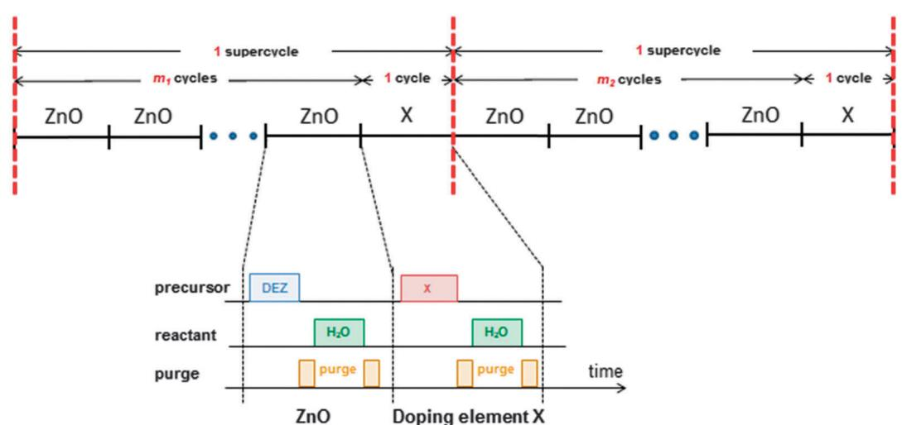  
Fig. 1 A schematic representation of two ALD supercycles used to dope the  $\mathrm{ZnO}$  films with a doping element,  $\mathbf{X}$ $\mathbf{X} = \mathbf{Al}$ , B, Ga, etc.). For uniform doping, a constant value of  $m$  is used  $(m_{1} = m_{2} = \dots = m_{n})$  whereas for films with graded doping, the value of  $m$  can be varied. Details of the ALD processes are shown in the lower part of the figure: the process for the  $\mathrm{ZnO}$  based material comprises two half-cycles in which DEZ and  $\mathrm{H}_2\mathrm{O}$  are dosed; in most cases, the ALD process of the doping material also comprises two doses: dopant precursor dosing and  $\mathrm{H}_2\mathrm{O}$  dosing. Other co-reactants such as  $\mathrm{O}_3$  or  $\mathrm{O}_2$  plasma can also be employed instead of  $\mathrm{H}_2\mathrm{O}$ , for both the  $\mathrm{ZnO}$  and the doping element.

Table 1 Precursors used for the ALD of ZnO:X  $\mathsf{X} = \mathsf{Al},$  B). In each case the co-reactant was the same for both the Zn and X cycles within the supercyclea  

<table><tr><td>Material</td><td>Zn source</td><td>Dopant source</td><td>Co-reactant</td><td>Ref.</td></tr><tr><td rowspan="5">ZnO:Al</td><td rowspan="3">ZnEt2</td><td>[AlMe3]2</td><td>H2O</td><td>8, 43, 44, 48–76 and this work</td></tr><tr><td>[Al(OPr)3]4</td><td>O3</td><td>77</td></tr><tr><td>[AlMe2(OPr)]2</td><td>H2O</td><td>36, 83 and this work</td></tr><tr><td>ZnMe2</td><td>[AlMe3]2</td><td>H2O</td><td>48</td></tr><tr><td>[ZnMe(OPr)]4</td><td>[AlMe2(OPr)]2</td><td>H2O</td><td>84</td></tr><tr><td rowspan="2">ZnO:B</td><td rowspan="2">ZnEt2</td><td>B2H6</td><td>H2O</td><td>85–98</td></tr><tr><td>B(OPr)3</td><td>H2O</td><td>This work</td></tr><tr><td colspan="5">a Me = methyl, CH3; Et = ethyl, CH2CH3; iPr = isopropyl, CH(CH3)2.</td></tr></table>

However, AIP is a solid at room temperature and exists as a tetramer.80 Consequently, the low volatility of AIP could prove to be challenging in some ALD systems as it can require heating up to  $\sim 130^{\circ}\mathrm{C}$  before an optimum vapour pressure for growth is obtained. A compromise in reactivity and volatility between TMA and AIP can be found in the heteroleptic precursor dimethylaluminium isopropoxide,  $[\mathrm{AlMe}_2(\mathrm{O}^{\mathrm{i}}\mathrm{Pr})]_2$  (DMAI), which has been employed as an ALD precursor to both  $\mathrm{Al}_2\mathrm{O}_3^{81,82}$  and ZnO:Al thin films.36,83 We recently reported the ALD of ZnO:Al using DMAI, which led to higher doping efficiencies (i.e., higher active dopant densities) and lower resistivities than those obtained when TMA was used.36 This improved doping efficiency resulted from a lower surface density of Al atoms due to the lower reactivity of DMAI and the steric hindrance caused by the bulky  $\mathrm{O}^{\mathrm{i}}\mathrm{Pr}$  ligands on the precursor.

The most commonly reported B source for thin film deposition is diborane(6)  $(\mathbf{B}_2\mathbf{H}_6)$  , which is an extremely flammable gas at room temperature. It is also highly toxic89 and is consequently typically used as a  $1 - 10\%$  solution in  $\mathrm{H}_{2}$ $\mathrm{B}_2\mathrm{H}_6$  has been the most widely used as a CVD precursor to  $\mathrm{ZnO:B^{90 - 98}}$  with, to date, relatively few reports of its use in ALD.85- 88 We believe that the reason behind this low number of publications on the use of  $\mathrm{B}_2\mathrm{H}_6$  for ALD is its extremely high vapour pressure,99 which is not easy to control under ALD conditions. Furthermore, the highly toxic nature of  $\mathrm{B}_2\mathrm{H}_6$  means it is undesirable to handle, which has led to alternatives being sought.

Potential candidates for the B source were considered based on the precursors that had been used for CVD of B- containing films. CVD processes using precursors such as borazine,100

$B_{\mathrm{r}}B^{\prime},B^{\prime \prime}$  - trichloroborazine101 and tris(dimethylamido)borane102- 106 have been reported, although in those cases the target material was BN. Boron tribromide  $(\mathrm{BBr}_3)$  has been used as an ALD precursor to  $\mathrm{B}_2\mathrm{O}_3^{107}$  and BN;108 however, bromide impurities in the film can be extremely detrimental to its electrical properties. Specifically concerning ZnO:B, a recent study was carried out in order to investigate safer precursors than  $\mathrm{B}_2\mathrm{H}_6$  for CVD,109,110 wherein  $N,N^{\prime},N^{\prime \prime}$  - trimethylborazine, trimethyl borate and trisopropyl borate (TIB) were employed as the B sources. The ZnO:B films deposited using these aforementioned precursors had comparable resistivities to films where  $\mathrm{B}_2\mathrm{H}_6$  was used. Based on these results, the selection of a potential B- source candidate for ALD was done for this work. In terms of their use as an ALD precursor,  $N,N^{\prime},N^{\prime \prime}$  trimethylborazine was not considered because, being isostructural with benzene, it was unclear how it could react with surface groups in an ALD mechanism. Regarding trimethyl borate, its vapour pressure (100 Torr at  $20^{\circ}\mathrm{C}$ )109 was unpractical. On this basis, TIB was chosen as the most promising ALD precursor for ZnO:B.

We report here the use of TIB as an alternative B precursor for the ALD of ZnO:B and we compare the results with ZnO:Al films deposited using DMAI and TMA as Al sources. We extended the temperature range of the recently reported ZnO:Al ALD process using DMAI36 from  $250^{\circ}C$  down to  $150^{\circ}C$  in order to compare the film properties given by the two different dopants. A comparison of these two precursors with their more traditional counterparts is given in Table 2. The TIB and DMAI molecules, which contain  $\mathrm{O}^{\mathrm{i}}\mathrm{Pr}$  ligands, are large compared to TMA. The presence of  $\mathrm{O}^{\mathrm{i}}\mathrm{Pr}$  results in possible steric hindrance, thus affording a lower surface density of the doping element and

Table 2Properties of ZnO:X  $\mathsf{X} = \mathsf{Al},$  B) precursors. The pyrophoricity and some of the properties related to the packing and shipment regulations of each compound are taken from the MSDS documents89,112-115  

<table><tr><td rowspan="2">Properties</td><td rowspan="2">Zn precursor</td><td colspan="2">B precursors</td><td colspan="2">Al precursors</td></tr><tr><td>Traditional</td><td>New</td><td>Traditional</td><td>New</td></tr><tr><td>Abbreviation</td><td>DEZ</td><td>B2H6</td><td>TIB</td><td>TMA</td><td>DMAI</td></tr><tr><td>Full name</td><td>Diethyl zinc</td><td>Diborane(6)</td><td>Triisopropyl borate</td><td>Trimethyl aluminium</td><td>Dimethylaluminium isopropoxide</td></tr><tr><td>Formula</td><td>Zn(CH2CH3)2</td><td>B2H6</td><td>B(OPr)3</td><td>[Al(CH3)3]2</td><td>[Al(CH3)2(OPr)]2</td></tr><tr><td>Physical state (R.T.P.)</td><td>Liquid</td><td>Gas</td><td>Liquid</td><td>Liquid</td><td>Liquid</td></tr><tr><td>Melting point (°C)</td><td>-28</td><td>-165109</td><td>n/a</td><td>15</td><td>&lt;RT82</td></tr><tr><td>Boiling point (°C)</td><td>117</td><td>-92.5118</td><td>140109</td><td>125</td><td>17282</td></tr><tr><td>Decomposition temperature (°C)</td><td>~280116,117</td><td>&amp;gt;200119</td><td>n/a</td><td>~330119</td><td>~370120</td></tr><tr><td>Vapour pressure at 25 °C (Torr)</td><td>~16121</td><td>~35 40099</td><td>~1378</td><td>~13121</td><td>0.85122</td></tr><tr><td>Flammability</td><td>Highly flammable, pyrophoric</td><td>Extremely flammable, non-phyrophoric</td><td>Highly flammable, non-phyrophoric</td><td>Highly flammable, pyrophoric</td><td>Highly flammable, non-phyrophoric</td></tr></table>

hence a better doping efficiency. Additionally, like DMAI, TIB is not pyrophoric, making it safer to handle for high- volume, high- throughput ALD systems, especially operating at atmospheric pressure. $^{111}$

# 3 Experimental

The  $\mathrm{ZnO}$  doping ALD processes were carried out in an open- load ALD reactor  $\mathrm{(OpAL^{\mathrm{TM}}}$ , Oxford Instruments), as reported previously. $^{35,36}$  Samples were deposited with different doping concentrations over a range of substrate temperatures  $(150 - 240^{\circ}\mathrm{C})$ . 7059 corning glass, silicon wafers with a native oxide layer, and silicon wafers with a  $450~\mathrm{nm}$ - thick thermally- grown  $\mathrm{SiO}_2$  layer were used as substrates. Diethyl zinc  $\mathrm{(DEZ > 99.999\%)}$ , Dockweiler Chemicals) and triisopropyl borate  $\mathrm{(TIB > 98\%)}$ , Air Liquide) were used as  $\mathrm{Zn}$  and B- doping precursors respectively. Dimethylaluminium isopropoxide  $\mathrm{(DMAI > 99.999\%)}$ , Air Liquide) and trimethyl aluminium  $\mathrm{(TMA > 99.999\%)}$ , Air Liquide) were used as reference Al doping precursors. Deionized water vapour  $\mathrm{(DI - H_2O)}$  was used as the co- reactant in all cases. The  $\mathrm{ZnO:B}$  ALD process details will follow in Section 4.1. The  $\mathrm{ZnO:Al}$  ALD processes using DMAI and TMA as doping precursors are described elsewhere. $^{35,82}$

Spectroscopic ellipsometry (SE) was used to measure the film thickness and the dielectric function of the films. $^{123}$  The in situ and ex situ measurements were performed using a Woollam, Inc. M2000 visible and near- infrared ellipsometer  $(0.75 - 5\mathrm{eV})$ . The SE data were analysed using a Drude oscillator model. $^{35}$

The film compositions (doping and impurity concentrations) were analysed by X- ray photoelectron spectroscopy (XPS Thermo Scientific K- Alpha KA1066, monochromatic Al  $\mathrm{K}\alpha$ $\left(h\nu = 1486.6\mathrm{eV}\right)$ , X- ray spot:  $400\mu \mathrm{m}$ ). The sensitivity factors used for quantification were: B 1s, 0.470; O 1s, 2.881; Zn  $2\mathrm{p}_{3 / 2}$ , 21.391; Al  $2\mathrm{p}$ , 0.75; C 1s, 0.919. Rutherford backscattering spectrometry (RBS;  $2\mathrm{MeVHe}^{+}$ beam in channelling configuration under perpendicular incidence with the detector at  $170^{\circ}$  scattering angle) and proton- induced gamma ray emission (PIGE; 2700 keV  $\mathrm{H}^{+}$ beam with an angle of incidence of  $6.5^{\circ}$  between the beam and sample surface and the gamma detector at an angle of  $90^{\circ}$  with respect to the beam) were used to calibrate the sensitivity factors used in XPS quantification and to obtain the areal density of the doping elements. The RBS/PIGE measurements were carried out at AccTec B.V. The film composition is presented as the doping fraction (DF) calculated by

$$
\mathrm{DF} = \frac{\mathrm{X}_{\mathrm{at}\%}}{\mathrm{X}_{\mathrm{at}\%} + \mathrm{Zn}_{\mathrm{at}\%}},\mathrm{where~X = Al~or~B.}
$$

The resistivity  $(\rho)$  and sheet resistance  $(R_{\mathrm{s}})$  of all samples were obtained by four- point probe (4pp) measurements using a Keithley 2400 SourceMeter and a Signaton S- 301- 6 probe. The carrier concentration  $(n)$  was extracted from SE data assuming an effective mass of 0.4 and cross- checked using a Hall measurement system (BIO- RAD) using the van der Pauw configuration. The electron mobility  $(\mu)$  of the films was calculated following the formula  $\mu = (n\cdot \rho \cdot e)^{- 1}$ , where  $e$  is the elementary charge.

The structural properties of the samples were studied by X- ray diffraction (XRD; PanAlytical X'pert PRO MRD) and transmission electron microscopy (TEM; JEOL ARM 200 probe corrected TEM, operated at  $200\mathrm{kV}$ ). UV- VIS- NIR spectroscopy (Cary 5000, Agilent Technologies) was used to study the optical transparency of the films. The absorption coefficient  $(\alpha)$  was calculated from the extinction coefficient  $(k)$  of the films as obtained by the SE data. The optical band gap of the films was calculated using the so- called Tauc plots extracted from the SE data as well. $^{35,124}$

# 4 Results and discussion

# 4.1 Process properties and atomic composition of ALD films

The  $\mathrm{ZnO}$  doping ALD processes were carried out using so- called supercycles as illustrated in Fig. 1. In principle, the concept of supercycle is effective when the two individual ALD processes (i.e., the base material ALD process and the dopant ALD process) are compatible with each other. Additionally, the ALD supercycle should be in saturation when the two individual ALD processes are in saturation. This is in fact the case for the  $\mathrm{ZnO}$  and  $\mathrm{Al}_2\mathrm{O}_3$  ALD processes used to obtain Al- doped  $\mathrm{ZnO}$  films that we reported previously. $^{35,36,82}$

Attempts to obtain a  $\mathrm{B}_2\mathrm{O}_3$  ALD process using TIB with either water or an  $\mathrm{O}_2$  plasma as co- reactants resulted in no growth at all temperatures investigated. As part of their studies on the  $\mathrm{BBr}_3\mathrm{- H}_2\mathrm{O}$  ALD process, Putkonen and Ninistö suggested that volatile boric acid,  $\mathrm{B(OH)_3}$ , was formed instead of  $\mathrm{B}_2\mathrm{O}_3$  when the boron precursor came into contact with excess water under reduced pressure. $^{107}$  The boric acid was then carried away in the vacuum rather than being incorporated into a growing film. We believe that a similar mechanism might take place when TIB is the precursor, which would account for the lack of growth of  $\mathrm{B}_2\mathrm{O}_3$ . However, it was still possible to grow  $\mathrm{ZnO:B}$  films using TIB incorporated into a supercycle using the DEZ-  $\mathrm{H}_2\mathrm{O}$  process. For this reason, the parameters of the ALD process for the B dopant were tuned during the  $\mathrm{ZnO}$  doping ALD process at  $150^{\circ}\mathrm{C}$  using a supercycle with  $m = 4$  (i.e., 5 cycles consisting of  $4\mathrm{ZnO} + 1$  TIB) and using the already- optimised  $\mathrm{ZnO}$  ALD process parameters (50 ms DEZ dose, 5 s purge, 20 ms  $\mathrm{H}_2\mathrm{O}$  dose, 6 s purge). $^{35}$  For the process development, in situ spectroscopic ellipsometry (SE) was used to measure the film thickness after every supercycle. Growth per supercycle (GPSC) values were determined from the slope of the graphs of the thickness as a function of the number of supercycles (see Fig. S1 of the ESI†). We report here the GPSC rather than the growth per cycle (GPC) for the doping process, as it takes into account possible atypical interactions that might occur between the DEZ-  $\mathrm{H}_2\mathrm{O}$  and TIB-  $\mathrm{H}_2\mathrm{O}$  ALD processes, for example, nucleation delays or etching. $^{35}$

The saturation curves for the gas exposures and purges of the B cycle of an ALD supercycle corresponding to four DEZ cycles and one TIB cycle for the  $\mathrm{ZnO:B}$  process are depicted in Fig. 2. These data were obtained by varying the duration of one of the ALD cycle steps, while keeping the duration of other steps sufficiently long to ensure either saturation of surface reactions or sufficient purging. The saturation GPSC was

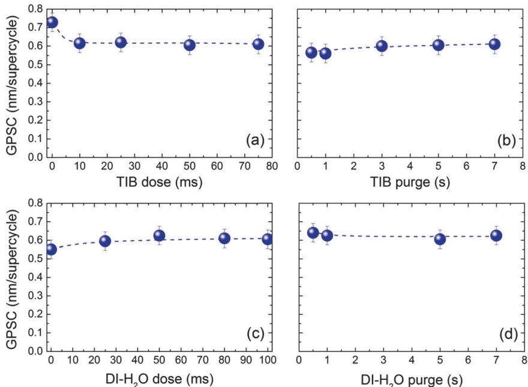  
Fig. 2 Saturation curves of the  $\mathrm{ZnO:}$  B process  $(m = 4)$  at  $150^{\circ}C$  (a) TIB precursor dose, (b) TIB precursor purge, (c)  $\mathsf{DI - H}_2\mathsf{O}$  dose, and (d)  $\mathsf{DI - H}_2\mathsf{O}$  purge. The growth per supercycle (GPSC) for each condition was averaged over 10 supercycles. The  $\mathrm{ZnO}$  standard conditions are specified elsewhere (50 ms DEZ dose, 5 s purge, 20 ms  $\mathsf{H}_2\mathsf{O}$  dose, 6 s purge) and the process saturated at a GPC of  $0.2\mathrm{nm}$  per cycle for an intrinsic  $\mathrm{ZnO}$  film deposited at  $150^{\circ}C$

$\sim 0.61 \mathrm{nm}$  per supercycle. The TIB and  $\mathrm{H}_2\mathrm{O}$  doses (Fig. 2a and c, respectively) both reached saturation at pulse times of  $\sim 50 \mathrm{ms}$ . It would be expected that longer precursor doses would increase the GPSC until the process is saturated. However, the TIB dose (Fig. 2a) showed a drop in GPSC such that, after saturation, it was  $\sim 0.12 \mathrm{nm}$  per supercycle lower than that for the intrinsic  $\mathrm{ZnO}$  process (i.e., TIB dose  $= 0 \mathrm{s}$  in Fig. 2a) at  $150^{\circ}C$  (GPSC  $= 0.73 \mathrm{nm}$  per supercycle, corresponding to 4 DEZ cycles). The water dose (Fig. 2c) showed a gradual increase in GPSC, which is typical of water doses. Purge times of 5 s were necessary to remove the volatile reaction products and the excess precursor (Fig. 2b and d). These dosing/purging times for the B doping process (i.e. TIB and  $\mathrm{DI - H}_2\mathrm{O}$  doses of  $50 \mathrm{ms}$  separated by purge steps of 5 s) were used for all further experiments.

The reduction in GPSC with increasing TIB dose observed in Fig. 2a could be the result of a slight etching of the  $\mathrm{ZnO}$  by the TIB (as observed for  $\mathrm{TMA}^{3,6,7,8,9}$ ) but it could also be due to the inhibition of  $\mathrm{ZnO}$  growth after a TIB pulse, as observed for DMA. To establish which effect played a role, an experiment was carried out in which the film growth after every cycle (either DEZ or TIB cycle) was monitored by spectroscopic ellipsometry. Fig. S1 of the  $\mathrm{ESI}\dagger$  shows the change in thickness as a function of the number of cycles deduced from the measurements obtained using the procedure described by Langereis et al. Although the thickness values should be interpreted with some care, it is clear that the  $\mathrm{ZnO}$  was not etched by TIB (i.e., the film thickness did not decrease after one B cycle) but that the TIB pulse led to an inhibition in the subsequent  $\mathrm{ZnO}$  film growth. This growth inhibition took place during several cycles following the TIB pulse, and could also be seen from a second experiment in which a supercycle with  $m = 19$  was used (i.e., a total of 20 cycles comprising  $19 \mathrm{ZnO} + 1$  TIB) (see Fig. S1,  $\mathrm{ESI}\dagger$ ). From this experiment, it was evident that one TIB pulse affected the  $\mathrm{ZnO}$  during many cycles.

RBS and PIGE analysis of the B- doped  $\mathrm{ZnO}$  films was consistent with the drop in GPSC observed by in situ spectroscopic ellipsometry. The data presented in Table 3 show that approximately 2.7 at per  $\mathrm{nm}^2$  B and 5.8 at per  $\mathrm{nm}^2$  Zn were deposited in each individual respective cycle in a supercycle with  $m = 4$ . The number of  $\mathrm{Zn}$  atoms deposited in this supercycle is therefore overall lower than expected for four cycles of the intrinsic  $\mathrm{ZnO}$  process, which led to 7.1 at per  $\mathrm{nm}^2$  Zn deposited per individual cycle of intrinsic  $\mathrm{ZnO}$ . Furthermore, the number of  $\mathrm{Zn}$  atoms deposited per individual cycle of  $\mathrm{ZnO}$  is higher than this value when employing a supercycle with  $m = 19$ . Similar observations can be noted for  $\mathrm{ZnO:Al}$  when using DMAI or TMA as the doping precursor (see Table 3).

In order to investigate the dopant adsorption, the B doping fraction (DF) was studied at  $150^{\circ}C$  as a function of the dopant ALD cycle fraction  $R_{\mathrm{x}} = (1 / (m + 1))$ , where  $m$  was varied from 3 to 40. The DF was assessed using XPS, where the sensitivity factors for Al and B were calibrated by RBS/PIGE. We benchmarked the developed process with the  $\mathrm{ZnO:Al}$  ALD processes using DMAI and TMA as alternative and conventional sources of Al, respectively. No C impurities were detected within the  $\mathrm{ZnO:X}$ $\mathbf{X} = \mathbf{Al}$ , B) films by RBS and XPS above the detection limit of these methods. Only adventitious C was observed on the surface of the films by XPS. The incorporation of doping elements was the lowest in the case of the TIB and the greatest in the case of TMA for a given cycle ratio  $m$  (Fig. 3). This is in agreement with the data obtained by RBS/PIGE analysis, where the areal densities of B or Al per cycle were, on average,  $\sim 3.2$  at per  $\mathrm{nm}^2$  per supercycle (TIB),  $\sim 4.4$  at per  $\mathrm{nm}^2$  per supercycle (DMAI) and  $\sim 9.0$  at per  $\mathrm{nm}^2$  per supercycle (TMA)

Table 3Rutherford Backscattering Spectrometry (RBS) and Proton-Induced Gamma Ray Emission (PIGE) data of selected  $ZnO:X$  films deposited at  $150^{\circ}C$  

<table><tr><td>Sample</td><td>Doping precursor</td><td>Cycle ratio ZnO:X</td><td>Dopant ALD cycle fraction, Rx</td><td>Doping fraction by RBS/PIGE, DF</td><td>Dopant areal density (at per nm²) per dopant cyclea</td><td>Zn areal density (at per nm²) per ZnO cyclea</td></tr><tr><td>ZnO:B</td><td>TIB</td><td>19:1</td><td>0.05</td><td>0.024 ± 0.002</td><td>3.6 ± 0.1</td><td>7.7 ± 0.2</td></tr><tr><td>ZnO:B</td><td>TIB</td><td>5:1</td><td>0.17</td><td>0.085 ± 0.009</td><td>2.7 ± 0.1</td><td>5.8 ± 0.1</td></tr><tr><td>ZnO:Al</td><td>DMAI</td><td>9:1</td><td>0.15</td><td>0.032 ± 0.003</td><td>4.5 ± 0.2</td><td>7.6 ± 0.2</td></tr><tr><td>ZnO:Al</td><td>DMAI</td><td>18:1</td><td>0.10</td><td>0.065 ± 0.007</td><td>4.3 ± 0.2</td><td>6.9 ± 0.1</td></tr><tr><td>ZnO:Al</td><td>TMA</td><td>17:1</td><td>0.06</td><td>0.064 ± 0.007</td><td>8.0 ± 0.3</td><td>6.9 ± 0.1</td></tr><tr><td>ZnO:Al</td><td>TMA</td><td>8:1</td><td>0.11</td><td>0.17 ± 0.02</td><td>10.0 ± 0.4</td><td>5.8 ± 0.1</td></tr><tr><td>ZnO</td><td>—</td><td>—</td><td>—</td><td>—</td><td>—</td><td>7.1 ± 0.2</td></tr></table>

Note that the dopant areal density per supercycle is equal to the dopant areal density per dopant cycle, as there is one doping cycle per supercycle. The Zn areal density per supercycle is equal to  $m$  times the Zn areal density per ZnO cycle.

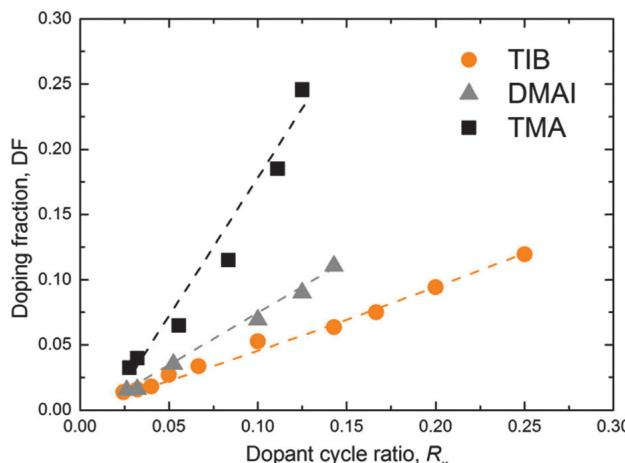  
Fig 3 Doping fraction (DF) as a function of the doping cycle ratio  $R_{x}$  for depositions at  $150^{\circ}C$ , as measured by X-ray photoelectron spectroscopy (XPS). The doping cycle ratio  $R_{x}$  (i.e. the ratio of the number of doping ALD cycles  $(X = \mathsf{Al}, \mathsf{B})$  over the total ALD cycles in one supercycle) is calculated as  $1 / (m + 1)$ . The estimated relative error for the doping fraction is  $\sim 10\%$ . The lines serve as guides to the eye.

(see Table 3 for specific at per  $\mathrm{nm}^2$  values of the individual processes with different values of  $m$ ), for the cycle ratios  $(m)$  investigated. A combination of precursor reactivity and molecule size is most likely the cause of this trend. The bulkier isopropyl ligands in the TIB and DMAI precursors are likely to cause steric hindrance on the film surface, resulting in a more sparse distribution of the dopants on the surface and therefore a lower doping fraction. This is expected from the decreasing size of the monomers  $(\mathrm{TIB} > \mathrm{DMAI} > \mathrm{TMA})$ . It is worth highlighting that the doping concentrations do not relate directly to the doping efficiency, as some of the doping material might have formed metal oxide or alloy clusters  $(e.g. \mathrm{Al}_2\mathrm{O}_3)$  rather than merely doping the film. In this case, the dopant atoms do not contribute donating any electrons to the  $\mathrm{ZnO}$  film, as will be discussed in Section 4.2.

# 4.2. Electrical properties

The electrical properties of the  $45\pm 5$  nm- thick  $\mathrm{ZnO:B}$  films deposited on glass substrates at a temperature of  $150^{\circ}C$  are presented in Fig. 4. The addition of a small amount of B sharply reduced the resistivity of the films to a minimum of  $\sim 3.5 \mathrm{m}\Omega \mathrm{cm}$  for a DF of 0.016 (Fig. 4a). The films were benchmarked with

$\mathrm{ZnO:Al}$  films of the same thickness and deposited at the same temperature using DMAI and TMA as Al precursors. The addition of Al also reduced the resistivity of the films to a minimum in both cases. Doping with DMAI resulted in  $\mathrm{ZnO:Al}$  films with the same minimum resistivity than  $\mathrm{ZnO:B}$  films at the same DF of 0.016, while doping with TMA resulted in  $\mathrm{ZnO:Al}$  films with a higher minimum resistivity of  $8 \mathrm{m}\Omega \mathrm{cm}$  for a higher DF of 0.040. The resistivity of  $\mathrm{ZnO:Al}$  films increased in both cases after achieving the minimum resistivity value, but this increase was more gradual than observed for the  $\mathrm{ZnO:B}$  films.

The carrier concentration extracted from the modelling of the SE data assuming an effective mass of 0.4 (Fig. 4b) was consistent with the carrier concentration obtained by Hall measurements (not shown). The carrier concentration increased with the addition of B until a maximum of  $3.1\times 10^{20}\mathrm{cm}^{- 3}$  for a DF of 0.034 was achieved, after which the carrier concentration decreased abruptly. This trend is consistent with previous reports in the literature for  $\mathrm{ZnO:B}$  layers deposited by chemical spray pyrolysis. In the case of  $\mathrm{ZnO:Al}$  films doped with DMAI, the carrier concentration reached a maximum value of  $2.6\times 10^{20}\mathrm{cm}^{- 3}$  for a DF of 0.016, before gradually decreasing to a value of  $\sim 2.2\times$ $10^{20}\mathrm{cm}^{- 3}$  for higher doping fractions. For  $\mathrm{ZnO:Al}$  films doped with TMA, the carrier concentration reached a maximum value of  $\sim 1.4\times 10^{20}\mathrm{cm}^{- 3}$ , which did not vary significantly at higher DF values than 0.06. Based on literature reports, it is expected that the carrier concentration will decrease abruptly for higher Al doping concentrations than those studied in this work. The increase of the carrier concentration for low doping fractions in the three cases can be assigned to the effective doping of B and Al, respectively (i.e., substitution of  $\mathrm{Zn}^{2 + }$  by  $\mathrm{B}^{3 + }$  or  $\mathrm{Al}^{3 + }$ ). The sharp decrease of the carrier concentration for TIB and the local saturation for DMAI and TMA might occur as a result of dopant occupying interstitial sites, dopant clustering, formation of oxides, or formation of metastable phases, making dopant inactive, which is possibly related to reaching the solubility limit of the B and Al into the  $\mathrm{ZnO}$  lattice. For low doping fractions, the maximum mobility value for the  $\mathrm{ZnO:B}$  films (i.e.,  $11.4 \mathrm{cm}^2 \mathrm{V}^{- 1} \mathrm{s}^{- 1}$ ) was  $57\%$  higher at low doping fractions relative to the maximum values determined for the  $\mathrm{ZnO:Al}$  films. Based on the Masetti model for ionized impurity scattering, a mobility as high as  $42 \mathrm{cm}^2 \mathrm{V}^{- 1} \mathrm{s}^{- 1}$  would be expected for the maximum carrier concentration of  $3.1\times 10^{20} \mathrm{cm}^{- 3}$  in this work (ZnO:B film with  $\mathrm{DF} = 0.034$ ). Therefore, the overall lower values obtained for the

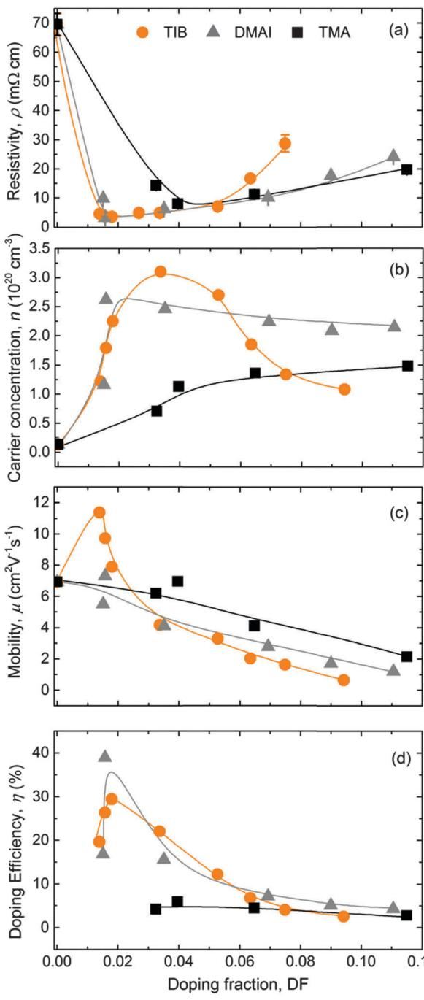  
Fig.4 Resistivity.  $\rho$  a),carrier concentration,  $n$  b),mobility,  $\mu$  c and doping efficiency  $\eta$  (d) of the ZnO:X  $\mathbb{X} = \mathbb{A}\mathbb{I}$  B) films as a function of the doping fraction (DF) measured by XPS. TIB was used as a B source while DMAI and TMA were used as A sources. All films had a thickness of  $45\pm$ $5\mathrm{nm}$  and were deposited on glass substrates at  $150^{\circ}C$  The lines serve as guides to the eye. The error bars for  $\rho$  are plotted in the graph (some of them lying within the data points) and the estimated relative statistical uncertainties for n,  $\mu$  and  $\eta$  are  $3\%$ $5\%$  and  $20\%$  respectively.

three doping materials and the trend of mobility decreasing with increasing doping fraction over the full range studied (Fig. 4c) can most likely be attributed to grain boundary scattering.128 Furthermore, it is rather striking that  $\mu$  increases when going from undoped ZnO to low B- doping concentrations, as one would expect more ionized impurity scattering. Yet a similar trend in mobility was observed for ZnO:B films prepared by the sol- gel technique.129

The doping efficiency  $(\eta)$  i.e., the ratio of the excess carrier density due to doping and the dopant density, is the percentage of dopant atoms that donate a free electron to the ZnO films and it is calculated using the equation

$$
\eta = \frac{n - n_0}{N_{\mathrm{Zn}}\cdot\mathrm{DF}}\times 100\% \tag{1}
$$

In this equation,  $n$  and  $n_0$  are the carrier densities of doped  $\mathbf{X} = \mathbf{A}\mathbf{l}$  B and intrinsic  $\mathrm{ZnO}$  films respectively; and  $N_{\mathrm{Zn}}$  is the atomic density of  $\mathrm{Zn}$  as measured by RBS  $(4.0\times 10^{22}\mathrm{cm}^{- 3})$  .36 As can be seen in Fig. 4d, the alternative precursors, TIB and DMAI, showed the highest doping efficiency at low doping levels, i.e.,  $30–40\%$  for a range of DF of 0.016- 0.018 that resulted in the lowest resistivities for the ZnO:B and ZnO:Al (doped with DMAI) films.130 Both alternative precursors outperformed TMA in terms of doping efficiency, as a maximum doping efficiency of  $6\%$  was achieved using this conventional precursor. This is in line with previously reported results for ZnO:Al films doped with DMAI and TMA deposited at  $250^{\circ}C$  36

Compared to ZnO:Al films deposited at  $250^{\circ}C$  we found that processing at  $150^{\circ}C$  led to lower absolute values of conductivity (i.e. a higher resistivity), carrier concentration, mobility and doping efficiency. For this reason, the effect of deposition temperature on the electrical properties of the ZnO:B films and the doping efficiency was investigated. ZnO:B films with thicknesses of  $45\pm 5\mathrm{nm}$  were deposited at different temperatures  $(150 - 240^{\circ}C)$  using a cycle ratio with  $m = 24$  which led to an optimised resistivity in the ZnO:B doping series shown in Fig. 4. The resistivity of the ZnO:B films decreased from  $3.5\mathrm{m}\Omega \mathrm{cm}$  at  $150^{\circ}C$  to  $2.2\mathrm{m}\Omega \mathrm{cm}$  when deposited at temperatures of  $200 - 240^{\circ}C$  This was due to an increase in carrier concentration from  $2.2\times 10^{20}\mathrm{cm}^{- 3}$  to  $2.8\times 10^{20}\mathrm{cm}^{- 3}$  and an increase in mobility from 8 to  $10.5\mathrm{cm}^2\mathrm{V}^{- 1}\mathrm{s}^{- 1}$  .We would like to underline that the doping fraction increased with increasing deposition temperature, whereas the doping efficiency decreased slightly, despite the slight increase in carrier concentration with temperature. From Fig. 5, it can be concluded that  $\sim 200^{\circ}C$  is the optimum deposition temperature for ZnO:B. However, it should be noted that the deposition temperature that feasible for certain applications can be limited to lower temperatures than  $200^{\circ}C$  Furthermore, a brief study was conducted to assess the thickness dependence of the sheet resistance  $(R_{\mathrm{s}})$  for films up to  $100\mathrm{- }120\mathrm{nm}$  deposited at  $200^{\circ}C$  see Fig.S2 of the  $\mathrm{ESI}\dagger$  . A soft saturation on the  $R_{\mathrm{s}}$  values was observed for thickness above  $\sim 50 \mathrm{nm}$  for the three doping precursors studied showing that a further increase in film thickness has a relatively minor impact on  $R_{\mathrm{s}}$

# 4.3 Structural properties

The crystal structure of the ZnO:B films was characterized by XRD, and selected spectra are presented in Fig. 6. Similar patterns were observed for ZnO:Al doped using the DMAI precursor (see Fig. S3 of the ESI†). The intrinsic ZnO films were polycrystalline and exhibited an hexagonal wurtzite structure with a weak (002)

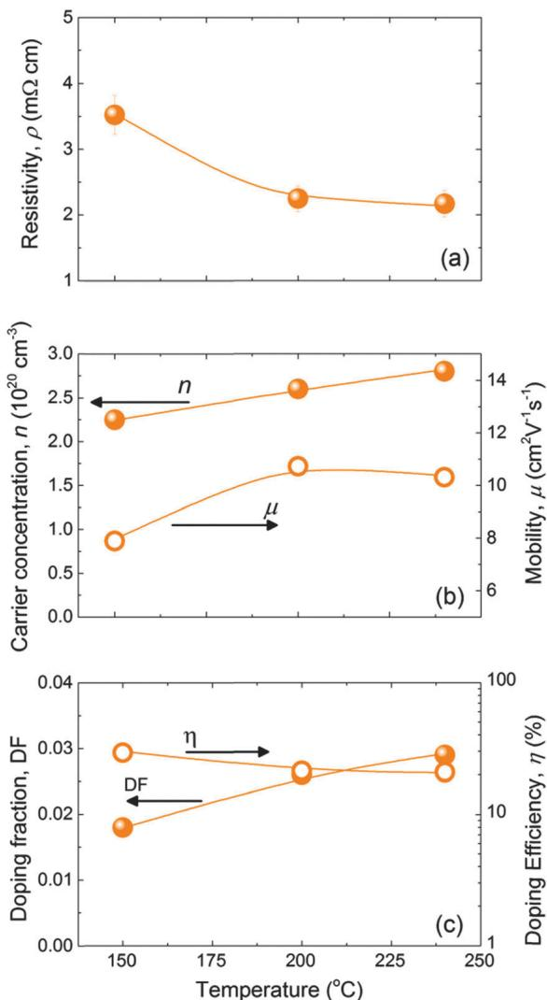  
Fig. 5 Resistivity,  $\rho$  (a), carrier concentration,  $n$ , and mobility,  $\mu$  (b) and doping fraction, DF, and doping efficiency,  $\eta$  (c) of the ZnO:B films as a function of the deposition temperature. The films with thicknesses of  $45 \pm 5 \mathrm{nm}$  were deposited on glass substrates. A cycle ratio of  $m = 24$  was employed as it resulted in optimised resistivity in the doping series at  $150^{\circ}\mathrm{C}$ . The lines serve as guides to the eye. The estimated relative statistical uncertainties for  $n$ ,  $\mu$ , DF and  $\eta$  are  $3\%$ ,  $5\%$ ,  $10\%$  and  $20\%$  respectively.

texture (i.e., preferential growth orientation), consistent with what is reported in the literature. $^{60,131}$  No peaks indicative of (crystalline) boron oxide phases were observed in the studied range of doping fractions. The intensity of the peaks decreased abruptly at a doping fraction of  $\mathrm{DF} > 0.053$  for ZnO:B films as expected for highly- doped ZnO films. Similar observations hold for the ZnO:Al films prepared with DMAI.

The XRD patterns of both the ZnO:B and ZnO:Al films revealed several interesting features. First of all, the intensity of the (002) peak decreased while that of the (100) peak increased for increasing doping fractions, indicating a change in texture of the ZnO:X films. This effect was more pronounced in the case of DMAI than in the case of TIB as shown in Fig. 7a. As a guide to the eye, the ratio  $I_{002} / I_{100}$  for a powder pattern, i.e., the pattern characteristic for a film with randomly oriented crystals, has been included to illustrate the change in texture from  $\langle 002\rangle$  to  $\langle 100\rangle$ . Secondly, a significant shift of the peaks to higher  $2\theta$  values was observed for increasing B fractions, which was likely due to compressive stress in the ZnO unit cell caused by the substitution of  $\mathrm{Zn^{2 + }}$  (ionic radius of  $0.60 \mathrm{\AA}$ , assuming a four- coordinate environment as expected for wurtzite structures) $^{132}$  with smaller  $\mathrm{B^{3 + }}$  ions (four- coordinate ionic radius of  $0.11 \mathrm{\AA}$ ). $^{132}$  This effect was significantly smaller in the case of ZnO:Al films doped by DMAI  $\mathrm{Al^{3 + }}$ , four- coordinate ionic radius of  $0.39 \mathrm{\AA}$ . $^{132}$  Fig. 7b shows the shift of the (002) peak as a function of the doping fraction, as a consequence of the compression of the unit cell (i.e. a decrease of the  $c$ - lattice parameter) with increasing doping fractions. It should be noticed that the  $c$ - lattice parameter for the pure ZnO films (i.e.,  $\mathrm{DF} = 0$ ) was slightly larger  $(5.219 \mathrm{\AA})$  than the value reported for the wurtzite ZnO crystal lattice  $(5.207 \mathrm{\AA})$ . This slight difference could be attributed to a combination of measurement inaccuracies (i.e., scan step size or a small sample misalignment in the  $z$ - direction), and sample conditions (i.e., stress in the film, or relatively small crystals).

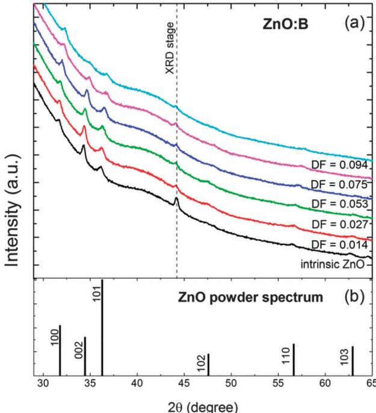  
Fig. 6 (a) XRD patterns of  $45 \mathrm{nm}$ -thick ZnO:B films deposited at  $150^{\circ}\mathrm{C}$  with different doping fractions  $\mathrm{DF} = 0.000 - 0.094$  and (b) ZnO powder spectrum for reference. The peak labelled as 'XRD stage' corresponds to a peak related to the stage onto which the samples are mounted to perform the measurement, and its intensity is inversely proportional to the surface area of the sample.

To further understand the nanostructure of the films, a TEM study was performed on two ZnO:B films with two different cycle ratios  $(m = 30$  and 19) and a ZnO:Al (DMAI) film with  $m = 18$  (Fig. 8). As visible in the bright field (BF) TEM images shown in Fig. 8a, both ZnO:B films were characterized by columnar grains stretching from the substrate to the surface, while the ZnO:Al film showed a somewhat interrupted grain growth, i.e., at several heights within the layer new crystals have

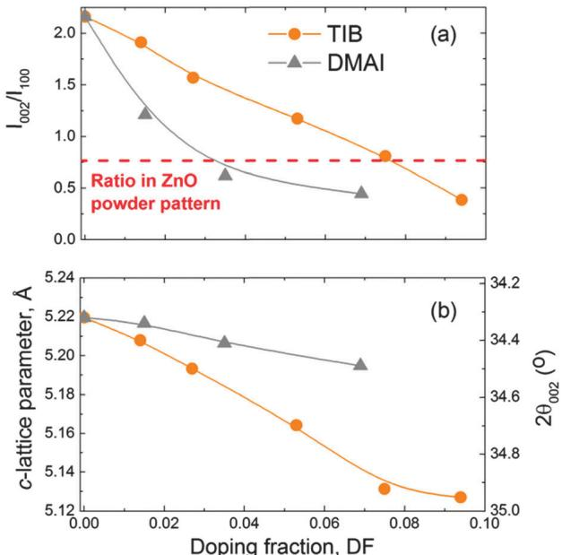  
Fig. 7 (a) Intensity ratio  $I_{002} / I_{100}$  of the (002) and (100) peaks measured by XRD on the ZnO:X  $(X = \mathsf{Al},\mathsf{B})$  films reflecting the change in texture from  $\langle 002\rangle$  to  $\langle 001\rangle$  and (b)  $c$  -lattice parameter of the ZnO wurtzite unit cell and the corresponding  $2\theta$  position of the (002) peak as a function of the doping fraction in the ZnO:X  $(X = \mathsf{Al},\mathsf{B})$  . The films were deposited at  $150^{\circ}C$  on glass substrates. The  $c$  -lattice parameter of the wurtzite ZnO crystal is  $5.207\mathrm{\AA}$  6

nucleated and grown. The latter can most likely be attributed to the local presence of amorphous  $\mathrm{AlO}_x$  preventing epitaxial growth of  $\mathrm{ZnO}$  on the underlying  $\mathrm{ZnO}$  crystals after a DMAI cycle. In both ZnO:B films, it was difficult to distinguish the B- doped layers from the rest of the film, due to limited difference in average atomic number compared to the undoped  $\mathrm{ZnO}$ . Only close to the interface with the substrate, these layers are vaguely discernible, as indicated by the arrows on the high- angle annular dark field (HAADF) STEM images in Fig. 8b. In contrast, the Al- doped layers were more clearly visible in the lower part of the ZnO:Al film than the ZnO:B films. The fact that the doped layers were only visible close to the interface to the substrate can be attributed to the surface roughness of the films, which increases as a function of vertical position in the layer due to the pyramid- shaped top facets of the growing ZnO crystals.

# 4.4 Optical properties

The transmittance spectra of selected ZnO:B layers with different DF  $(0.000 - 0.063)$  are shown in Fig. 9. The transmittance values were over  $90\%$  in the major part of the visible and near- infrared (NIR) range. A decrease in transmittance was observed in the NIR region with increasing doping fraction until  $\mathrm{DF} = 0.034$ . For higher DF values, the transmittance in the NIR increased again. This behaviour can be attributed to free- carrier absorption. Furthermore, a blue shift was observed in the ultraviolet absorption edge with increasing doping concentration from intrinsic  $\mathrm{ZnO}$  to doped  $\mathrm{ZnO:B}$  films with a DF of 0.063. This is due to the increase of the optical band gap. Both these aspects will be considered more in detail below.

The transmittance  $(T)$  of the ZnO:B films deposited on glass does not correct for interference effects in the films nor for the strong absorption peak of the glass substrates. Additionally, the transmittance is a film property and depends therefore on the film thickness. For these reasons, the ALD ZnO:B optical properties were assessed by studying the absorption coefficient

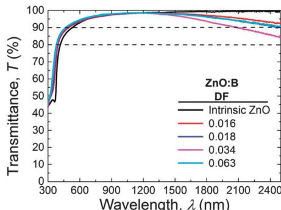  
Fig. 9 Transmittance of selected ZnO:B samples  $(\mathrm{DF} = 0.000 - 0.063)$  deposited at  $150^{\circ}C$  and with thicknesses of  $45\pm 5$  nm.

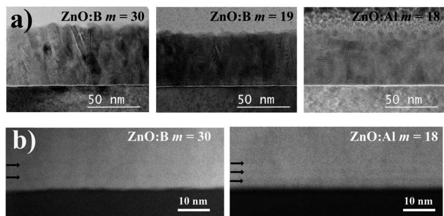  
Fig. 8 Transmission electron microscopy images: (a) bright-field (BF) TEM of two ZnO:B films  $(m = 30$  and  $m = 19)$  and a ZnO:Al film  $(m = 18)$ ; and (b) high-angle annular dark field (HAADF) STEM images of ZnO:B  $(m = 30)$  and ZnO:Al  $(m = 18)$ . The B- and Al-doped layers are indicated by arrows.

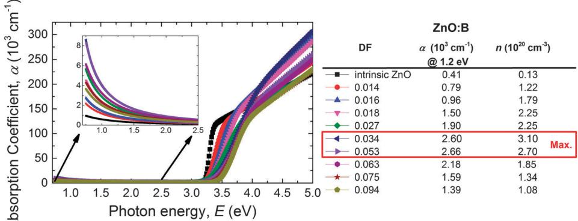  
Fig. 10 Absorption coefficient  $(\alpha)$  as a function of the photon energy  $(E)$  of the ALD ZnO:B films deposited at  $150^{\circ}C$  on glass substrates.

$(\alpha)$  which was calculated from the SE data. Fig. 10 shows  $\alpha$  as a function of the DF for ZnO:B films on a wide DF region  $\mathrm{DF} =$  0.000- 0.094). Clearly in the NIR region, the absorption decreases with increasing DF up to 0.034 whereas it increases again for higher DF values. This can be attributed to the free- carrier absorption in the films as described by the Drude model.133 The correlation of  $\alpha$  with the free carrier density  $(n)$  is shown in the legend of the figure. The absorption coefficient of ZnO:Al films doped with DMAI follows a similar trend with  $n$  (see Fig. S4 for the absorption coefficient, data of ZnO:Al using DMAI and TMA, ESI).

The optical band gap  $(E_{\mathrm{g,opt}})$  of the ZnO:X films was extracted from so- called Tauc plots35,124 (i.e.,  $(\epsilon_{2}E^{2})^{2}$  as a function of the photon energy  $E$  ,where  $\epsilon_{2}$  is the imaginary part of the dielectric function extracted from the SE data) as shown in Fig. S5  $(\mathrm{ESI}\dagger)$  . The optical band gap energies, calculated by linear fits to the data in the Tauc plots, are presented in Fig. 11 as a function of the DF. For ZnO:B, as well as for ZnO:Al, the optical band gap increases with increasing doping fraction. This increase can be attributed to the Burstein- Moss shift, but only for the range of DF values for which the carrier concentration  $n$  increases.60,68 For higher DF values  $\mathrm{(DF > 0.034)}$  , in the case of ZnO:B and ZnO:Al DMAI), the increase in the optical bandgap can be attributed to effects related to the grain size,134 strain and other types of imperfections.135 Additionally, the fact that films start to have a considerable fraction of amorphous oxide with a higher bandgap than intrinsic  $\mathrm{ZnO}$  plays probably a role. This holds especially for the case of Aldoping for which the formation of amorphous  $\mathrm{AlO}_x$  regions has become clear.35

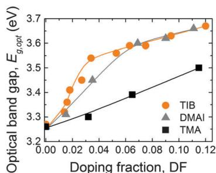  
Fig. 11 Optical band gap  $(E_{\mathrm{g,opt}})$  as a function of DF for ZnO:X  $(X = \mathsf{Al},\mathsf{B})$  TIB was used as a B source while DMAI and TMA were used as Al sources. The films were deposited on  $\mathrm{SiO_2}$  substrates at  $150^{\circ}C$

# 5 Conclusions

Doped zinc oxide is a key transparent conducting oxide (TCO) material for many thin- film- based applications in optoelectronics. Atomic layer deposition (ALD) is a very promising technique to deposit high quality TCOs as doping materials can be introduced with greater control than with other deposition methods. Aluminium is by far the most common element to dope zinc oxide and especially trimethyl aluminium (TMA) is used as a precursor during ALD. The application of other dopants has been far less reported. For instance, B as a dopant has been scarcely reported for ALD probably due to the highly toxic nature of the traditional boron precursor diborane. We report here the feasibility of using a new, relatively safe boron precursor, triisopropyl borate (TIB), for the atomic layer deposition of ZnO:B. To benchmark the properties of the ZnO:B films, we also deposited ZnO:Al films using dimethylaluminium isopropoxide (DMAI) and TMA as alternative and conventional Al sources, respectively.

Process wise, the use of the TIB precursor led to the better control over the doping (i.e. less dopant atoms per doping cycle are deposited) and to very high doping efficiencies, as compared to doping using TMA. The DMAI precursor resulted in similar high doping efficiencies  $(n = 30 - 40\%)$  to TIB. The conductivities and carrier concentrations of the films deposited using TIB and DMAI were significantly higher at lower doping fractions than that of ZnO:Al films where TMA was the aluminium source. The mobilities of ZnO:B films were significantly higher than those of the ZnO:Al films doped with DMAI and TMA at low doping fractions. Additionally, the transparency of the ZnO:B films was very high in most of the visible and near- infrared range. The excellent electrical and optical properties of selected ALD ZnO:B films deposited using TIB can be exploited to prepare, for instance, transparent conductive oxide films for silicon heterojunction solar cells for which the required thickness is  $\sim 80 \mathrm{nm}$  due to the fact that the film acts also as antireflection coating. The results showed that resistivities as low as 1.5 and  $0.9 \mathrm{m}\Omega \mathrm{cm}$  (i.e., sheet resistances  $R_{\mathrm{s}} = 204$  and

$128\Omega \mathrm{sq}^{- 1})$  can be achieved for  $\sim 80 \mathrm{nm}$  - thick ZnO:B films deposited at temperatures of  $150^{\circ}\mathrm{C}$  and  $200^{\circ}\mathrm{C}$  respectively. In both cases, transmittances higher than  $80\%$  for wavelengths  $>370 \mathrm{nm}$  but over  $90\%$  for wavelengths in the range 700-  $1750 \mathrm{nm}$  can be achieved.

In light of these results, it is demonstrated that the use of novel alternative precursors for ALD can open new ways of doping ZnO more efficiently resulting in excellent electrical and optical film properties even at low temperatures.

# Acknowledgements

AcknowledgementsThe authors thank J. W. Weber, Dr H. C. M. Knoops and B. W. H. van de Loo (TU/e) for their invaluable input into the analysis of the SE data. We would also like to thank W. Keuning, B. Macco, and H. Gatz (TU/e) for their help with the XRD, AFM, and transmission measurements, respectively. This work was financially supported by the European Community's 7th Framework Programme through the Marie Curie Intra- European Fellowship of D.G.- A. (AD4PV, FP7- MC- IEF- 272444) and by the Dutch Technology Foundation STW through the Flash Perspectief Programma. The research of W.M.M.K. has been made possible by the Dutch Technology Foundation STW and the Netherlands Organization for Scientific Research (NWO, VICI programme). Air Liquids is acknowledged for the donation of the DMAI and TIB precursors. Solliance, a solar energy R&D initiative of ECN, TNO, Holst, TU/e, imec and Forschungszentrum Julich, and the Dutch province of Noord- Brabant are acknowledged for funding the TEM facility.

# Notes and references

1 A.A.RockettCurr.Opin.Solid State Mater. Sci.201014, 143- 148. 2 C.A.WoldenJ.KurtinJ.B.BaxterI.RepinsS.E.Shaheen, J.T. Torvik, A.A.Rockett,V.M.Fthenakis and E.S.Aydil, J.Vac.Sci.Technol.A,201129,30801. 3 D.Song and B.GuoJ.Phys.D:Appl.Phys.20094225103. 4 A.Janotti and C.G.Van de Walle, Rep.Prog.Phys.2009, 72,126501. 5 C.Y.ChenC.A.LinM.J.ChenG.R.Lin and J.H.He, Nanotechnology,2009,20,185605. 6 K. Ellmer and A. Klein, in Transparent Conductive Zinc Oxide: Basics and Applications in Thin Film Solar Cells, ed. K. Ellmer, A. Klein and B. Rech, Springer, Heidelberg, Germany,2001,pp.1- 34. 7 F. Khan, Vandana, S. N. Singh, M. Husain and P. K. Singh, Sol. Energy Mater. Sol. Cells, 2012, 100, 57- 60. 8 D.- J. Lee, H.- M. Kim, J.- Y. Kwon, H. Choi, S.- H. Kim and K.- B.KimAdv.Funct.Mater.201121448- 455. 9 T. H. Breivik, S. Diplas, A.G. Ulyashin, A.E. Gunnas, B.R.Olaisen, D.N. Wright, A.Holt and A.Olsen, Thin Solid Films,2007,515,8479- 8483. 10 L. Korte, E. Conrad, H. Angermann, R. Stangl and M. Schmidt, Sol. Energy Mater. Sol.Cells, 2009, 93, 905- 910.

11 P. J. Rostan, U. Rau, V. X. Nguyen, T. Kirchartz, M. B. Schubert and J. H. Werner, Sol. Energy Mater. Sol. Cells, 2006, 90, 1345- 1352. 12 M. Godlewski, E. Guziewicz, K. Kopalko, G. Luka, M. I. Łukasiewicz, T. Krajewski, B. Witkowski and S. Gieraltowska, Low Temp. Phys., 2011, 37, 235- 240. 13 M. Godlewski, E. Guziewicz, G. Luka, T. Krajewski, M. Łukasiewicz, L. Wachnicki, A. Wachnicka, K. Kopalko, A. Sarem and B. Dalati, Thin Solid Films, 2009, 518, 1145- 1148. 14 S. Park, S. J. Tark, J. S. Lee, H. Lim and D. Kim, Sol. Energy Mater. Sol. Cells, 2009, 93, 1020- 1023. 15 A. Bauer, T. Wahl, J. Hanisch and E. Ahlswede, Appl. Phys. Lett., 2012, 100, 73307. 16 M. K. Wu, T. Ling, Y. Xie, X. G. Huang and X. W. Du, Semicond. Sci. Technol., 2011, 26, 105001. 17 G. Pérez- Hernández, A. Vega- Poot, I. Pérez- Juárez, J. M. Camacho, O. Arés, V. Rejón, J. L. Peña and G. Oskam, Sol. Energy Mater. Sol. Cells, 2012, 100, 21- 26. 18 W. Beyer, J. Hüpkes and H. Stiebig, Thin Solid Films, 2007, 516, 147- 154. 19 D. K. Schroder, Semiconductor Material and Device Characterization, John Wiley & Sons, Hoboken, NJ, USA, 3rd edn, 2006. 20 M. Krunks and E. Mellikov, Thin Solid Films, 1995, 270, 33- 36. 21 M. Gabás, N. T. Barrett, J. R. Ramos- Barrado, S. Gota, T. C. Rojas and M. C. López- Escalante, Sol. Energy Mater. Sol. Cells, 2009, 93, 1356- 1365. 22 A. Kyaw, X. Sun and C. Jiang, J. Sol- Gel Sci. Technol., 2009, 52, 348- 355. 23 E. D. Spoerke, M. T. Lloyd, E. M. McCready, D. C. Olson, Y.- J. Lee and J. W. P. Hsu, Appl. Phys. Lett., 2009, 95, 213506. 24 J. Herrero and C. Guillén, Thin Solid Films, 2004, 451- 452, 630- 633. 25 T. Minami, T. Mijata, K. Ihara, Y. Minamino and S. Tsukada, Thin Solid Films, 2006, 494, 47- 52. 26 E. M. Kaidashev, M. Lorenz, H. von Wenckstern, A. Rahm, H.- C. Semmelhack, K.- H. Han, G. Benndorf, C. Bundesmann, H. Hochmuth and M. Grundmann, Appl. Phys. Lett., 2003, 82, 3901- 3903. 27 A. Drici, G. Djeteli, G. Tchangbejdi, H. Derouiche, K. Jondo, K. Napo, J. C. Bernède, S. Ouro- Djoko and M. Gbagba, Phys. Status Solidi A, 2004, 201, 1528- 1536. 28 P. K. Nair, M. T. S. Nair, V. M. García, O. L. Arenas, Y. Peña, A. Castillo, I. T. Ayala, O. Gómezdaza, A. Sánchez, J. Campos, H. Hu, R. Suárez and M. E. Rincón, Sol. Energy Mater. Sol. Cells, 1998, 52, 313- 344. 29 M. E. Fragala, G. Malandrino, M. M. Giangregorio, M. Losurdo, G. Bruno, S. Lettieri, L. S. Amato and P. Maddalena, Chem. Vap. Deposition, 2009, 15, 327- 333. 30 A. Hongsingthong, I. A. Yunaz, S. Miyajima and M. Konagai, Sol. Energy Mater. Sol. Cells, 2011, 95, 171- 174. 31 A. Pourret, P. Guyot- Sionnest and J. W. Elam, Adv. Mater., 2009, 21, 232- 235. 32 T. Tynell and M. Karppinen, Semicond. Sci. Technol., 2014, 29, 43001.

33 J. R. Bakke, K. L. Pickrahn, T. P. Brennan and S. F. Bent, Nanoscale, 2011, 3, 3482- 3508.  34 J. A. van Delft, D. Garcia- Alonso and W. M. M. Kessels, Semicond. Sci. Technol., 2012, 27, 074002.  35 Y. Wu, P. M. Hermkens, B. W. H. van de Loo, H. C. M. Knoops, S. E. Potts, M. A. Verheijen, F. Roozeboom and W. M. M. Kessels, J. Appl. Phys., 2013, 114, 24308.  36 Y. Wu, S. E. Potts, P. M. Hermkens, H. C. M. Knoops, F. Roozeboom and W. M. M. Kessels, Chem. Mater., 2013, 25, 4619- 4622.  37 M. Leskelä and M. Ritala, Thin Solid Films, 2002, 409, 138- 146.  38 S. M. George, Chem. Rev., 2010, 110, 111- 131.  39 S. E. Potts, H. B. Proffjt, R. Roelofs and W. M. M. Kessels, Chem. Vap. Deposition, 2013, 19, 125- 133.  40 S. E. Potts and W. M. M. Kessels, Coord. Chem. Rev., 2013, 257, 3254- 3270.  41 S. E. Potts, W. Keuning, E. Langereis, G. Dingemans, M. C. M. van de Sanden and W. M. M. Kessels, J. Electrochem. Soc., 2010, 157, P66- P74.  42 A. Devi, Coord. Chem. Rev., 2013, 257, 3332- 3384.  43 J. W. Elam, Z. A. Sechrist and S. M. George, Thin Solid Films, 2002, 414, 43- 55.  44 A. Abou Chaaya, R. Viter, I. Baleviciute, M. Bechelany, A. Ramanavivius, Z. Gertnere, D. Erts, V. Smyntyna and P. Miele, J. Phys. Chem. C, 2014, 118, 3811- 3819.  45 W. F. A. Besling, E. Young, T. Conard, C. Zhao, R. Carter, W. Vandervorst, M. Caymax, S. De Gendt, M. Heyns, J. Maes, M. Tuominen and S. Haukka, J. Non- Cryst. Solids, 2002, 363, 123- 133.  46 D. R. G. Mitchell, G. Triani, D. J. Attard, K. S. Finnie, P. J. Evans, C. J. Barbe and J. R. Bartlett, Smart Mater. Struct., 2006, 15, S57- S64.  47 S. W. Smith, K. G. MAuliffe and J. F. Conley, Solid- State Electron., 2010, 54, 1076- 1082.  48 V. Lujala, J. Skarp, M. Tammenmaa and T. Suntola, Appl. Surf. Sci., 1994, 82- 83, 34- 40.  49 M. Ceh, H.- C. Chen, M.- J. Chen, J.- R. Yang and M. Shiojiri, Mater. Trans., JIM, 2010, 51, 219- 226.  50 N. P. Dasgupta, S. Neubert, W. Lee, O. Trejo, J.- R. Lee and F. B. Prinz, Chem. Mater., 2010, 22, 4769- 4775.  51 D.- J. Lee, J.- Y. Kwon, S.- H. Kim, H.- M. Kim and K.- B. Kim, J. Electrochem. Soc., 2011, 158, D277- D281.  52 Y. Geng, Z.- Y. Xie, S.- S. Xu, Q.- Q. Sun, S.- J. Ding, H.- L. Lu and D. W. Zhang, ECS J. Solid State Sci. Technol., 2012, 1, N45- N48.  53 Z. Baji, Z. Labadi, Z. R. Horváth and I. Bársony, Thin Solid Films, 2012, 5201, 4703- 4706.  54 P. Genevee, F. Donsanti, G. Renou and D. Lincot, Appl. Surf. Sci., 2013, 264, 464- 469.  55 A. Frolich and M. Wegener, Opt. Mater. Express, 2011, 1, 883- 889.  56 G. Luka, L. Wachnicki, B. S. Witkowski, T. A. Krajewski, R. Jakiena, E. Guziewicz and M. Godlewski, Mater. Sci. Eng., B, 2011, 176, 237- 241.  57 G. Luka, T. A. Krajewski, B. S. Witkowski, G. Wisz, I. S. Virt, E. Guziewicz and M. Godlewski, J. Mater. Sci., 2011, 22, 1810- 1815.

58 Y.- C. Cheng, Appl. Surf. Sci., 2011, 258, 604- 607.  59 T. Dhakal, D. Vanhart, R. Christian, A. Nandur, A. Sharma and C. R. Westgate, J. Vac. Sci. Technol., A, 2012, 30, 021202.  60 P. Banerjee, W.- J. Lee, K.- R. Bae, S. B. Lee and G. W. Rubloff, J. Appl. Phys., 2010, 108, 43504.  61 S. J. Kwon, Jpn. J. Appl. Phys., 2005, 44, 1062- 1066.  62 W. J. Maeng, J.- W. Lee, J. H. Lee, K.- B. Chung and J.- S. Park, J. Phys. D: Appl. Phys., 2011, 44, 445305.  63 W. J. Maeng, S.- J. Kim, J.- S. Park, K.- B. Chung and H. Kim, J. Vac. Sci. Technol., B: Nanotechnol. Microelectron.: Mater., Process., Meas., Phenom., 2012, 30, 31210.  64 Q. Hou, F. Meng and J. Sun, Nanoscale Res. Lett., 2013, 8, 144.  65 R. M. Mundle, H. S. Terry, K. Santiago, D. Shaw, M. Bahoura, A. K. Pradhan, K. Dasari and R. Palai, J. Vac. Sci. Technol., A, 2013, 31, 01A146.  66 T. Tynell, R. Okazaki, I. Terasaki, H. Yamauchi and M. Karppinen, J. Mater. Sci., 2013, 48, 2806- 2811.  67 T. Tynell, H. Yamauchi, M. Karppinen, R. Okazaki and I. Terasaki, J. Vac. Sci. Technol., A, 2013, 31, 01A109.  68 C. H. Ahn, H. Kim and H. K. Cho, Thin Solid Films, 2010, 519, 747- 750.  69 J. W. Elam and S. M. George, Chem. Mater., 2003, 15, 1020- 1028.  70 J. W. Elam, D. Routkevitch and S. M. George, J. Electrochem. Soc., 2003, 150, G339- G347.  71 J.- S. Na, Q. Peng, G. Scarel and G. N. Parsons, Chem. Mater., 2009, 21, 5585- 5593.  72 J.- S. Na, G. Scarel and G. N. Parsons, J. Phys. Chem., 2010, 114, 383- 388.  73 O. Bethge, M. Nobile, S. Abermann, M. Glaser and E. Bertagnolli, Sol. Energy Mater. Sol. Cells, 2013, 117, 178- 182.  74 L. Karvonen, A. Säynätjoki, Y. Chen, H. Jussila, J. Rönn, M. Ruoho, T. Alasaarela, S. Kujala, R. A. Norwood, N. Peyghambarian, K. Kieu and S. Honkanen, Appl. Phys. Lett., 2013, 103, 31903.  75 Y. J. Choi, B. Gong, C.- S. Park, H.- S. Lee, J. G. Jang, H. J. Chang, G. Y. Yeom and H.- H. Park, ACS Appl. Mater. Interfaces, 2013, 5, 3650- 3655.  76 A. Illiberi, R. Scherpenborg, Y. Wu, F. Roozeboom and P. Poodt, ACS Appl. Mater. Interfaces, 2013, 5, 13124- 13128.  77 H. Yuan, B. Luo, D. Yu, A.- J. Cheng, S. A. Campbell and W. L. Gladfelter, J. Vac. Sci. Technol., A, 2012, 30, 01A138.  78 W. M. Haynes, CRC Handbook of Chemistry and Physics, CRC, Boca Raton, 93rd edn, 2012.  79 X. Qian, Y. Cao, B. Guo, H. Zhai and A. Li, Chem. Vap. Deposition, 2013, 19, 180- 185.  80 W. Fieggen, H. Gerding and N. M. M. Nibbering, Recl. Trav. Chim. Pays- Bas, 1968, 87, 377- 383.  81 J. Koo, S. K. Kim, S. Joen, H. Jeon, Y. Kim and Y. Won, J. Korean Phys. Soc., 2006, 48, 131- 136.  82 S. E. Potts, G. Dingemans, C. Lachaud and W. M. M. Kessels, J. Vac. Sci. Technol., A, 2012, 30, 21505.  83 C. R. Ellinger and S. F. Nelson, Chem. Mater., 2014, 26, 1514- 1522.  84 K.- S. An, W. Cho, B. K. Lee, S. S. Lee and C. G. Kim, J. Nanosci. Nanotechnol., 2008, 3, 4856- 4859.

85 B. Sang, A. Yamada and M. Konagai, Jpn. J. Appl. Phys., 1998, 37, 206- 208.  86 A. Yamada, B. Sang and M. Konagai, Appl. Surf. Sci., 1997, 112, 216- 222.  87 Y. Yamamoto, K. Saito, K. Takahashi and M. Konagai, Sol. Energy Mater. Sol. Cells, 2001, 65, 125- 132.  88 B. Sang, A. Yamada and M. Konagai, Sol. Energy Mater. Sol. Cells, 1997, 49, 19- 26.  89 Sigma- Aldrich, MSDS Dilorane, No. 463051.  90 S. Fay, U. Kroll, C. Bucher, E. Vallat- Sauvain and A. Shah, Sol. Energy Mater. Sol. Cells, 2005, 86, 385- 397.  91 X. L. Chen, X. H. Geng, J. M. Xue, D. K. Zhang, G. F. Hou and Y. Zhao, J. Cryst. Growth, 2006, 296, 43- 50.  92 C. Yan, X. Chen, F. H. Wang, J. Sun, D. Zhang, C. Wei, X. Zhang, Y. Zhao and X. Geng, Thin Solid Films, 2012, 521, 249- 252.  93 J. Yin, H. Zhu, Y. Wang, Z. Wang, J. Gao, Y. Mai, Y. Ma, M. Wan and Y. Huang, Appl. Surf. Sci., 2012, 259, 758- 763.  94 I.- H. Choi, J. Korean Phys. Soc., 2013, 63, 1997- 2001.  95 J.- C. Hsiao, C.- H. Chen, H.- J. Yang, C.- L. Wu, C.- M. Fan, C.- F. Huang, C.- C. Lin, P. Yu and J.- C. Hwang, J. Taiwan Inst. Chem. Eng., 2013, 44, 758- 761.  96 Z. Hu, J. Zhang and Y. Zhu, Sol. Energy Mater. Sol. Cells, 2013, 117, 610- 616.  97 J.- W. Schuttauf, G. Bugron, M. Stuckelberger, S. Hanni, M. Boccard, M. Despeisse, F.- J. Haug, F. Meillaud and C. Ballif, IEEE Journal of Photovoltaics, 2014, 4, 757- 762.  98 M. L. Addonizio and A. Antonaia, J. Mater. Chem. C, 2013, 117, 24266- 24276.  99 D. R. Lide and H. V Kehiaian, CRC Handbook of Thermophysical and Thermochemical Data, CRC Press, Boca Raton, FL, 1994.  100 J.- S. Li, C.- R. Zhang, B.- Z. Li, F. Cao and S.- Q. Wang, Surf. Coat. Technol., 2011, 205, 3736- 3741.  101 H. Wu, M. Chen, X. Wei, M. Ge and W. Zhang, Appl. Surf. Sci., 2010, 257, 1276- 1281.  102 W. Kalss, R. Haubner and B. Lux, Int. J. Refract. Met. Hard Mater., 1998, 16, 233- 241.  103 R. Weissenbacher and R. Haubner, Int. J. Refract. Met. Hard Mater., 2002, 20, 135- 141.  104 C. Lorrette, P. Weisbecker, S. Jacques, R. Pailler and J. M. Goyhenche, J. Eur. Ceram. Soc., 2007, 27, 2737- 2743.  105 M. A. Mannan, H. Noguchi, T. Kida, M. Nagano, N. Hirao and Y. Baba, Thin Solid Films, 2010, 518, 4163- 4169.  106 M. A. Mannan, Y. Baba, T. Kida, M. Nagano, I. Shomoyama, N. Hirao and H. Noguchi, Thin Solid Films, 2011, 519, 1780- 1786.  107 M. Putkonen and L. Niinisto, Thin Solid Films, 2006, 514, 145- 149.  108 J. Olander, L. M. Ottosson, P. Heszler, J.- O. Carlsson and K. M. E. Larsson, Chem. Vap. Deposition, 2005, 11, 330- 337.  109 D. Jahan and A. Pinchart, Proc. 25th Eur. Photovolt. Sol. Energy Conf., 2010, pp. 2919- 2923.  110 C. Lachaud, A. Madec, A. Pinchart, S. Nicolay, J. P. Escarre and C. Ballif, Proc. 26th Eur. Photovolt. Sol. Energy Conf., 2011, pp. 2658- 2662.

111 W. M. M. Kessels and M. Putkonen, MRS Bull., 2011, 36, 907- 913.  112 Sigma- Aldrich, MSDS Diethylzinc, No. 668729.  113 Sigma- Aldrich, MSDS Triisopropyl Borate, No. 197335.  114 Sigma- Aldrich, MSDS Trimethylaluminum, No. 597775.  115 Sigma- Aldrich, MSDS Dimethylaluminum Isopropoxide, No. J100047.  116 H. Dumont, A. Marbeuf, J. Bourée and O. Gorochov, J. Mater. Chem., 1992, 2, 923- 930.  117 H. Dumont, A. Marbeuf, J.- E. Bourée and O. Gorochov, J. Mater. Chem., 1993, 3, 1075- 1079.  118 M. Söderlund, P. Mäke- Arvela, K. Eränen, T. Salmi, R. Rahkola and D. M. Murzin, Catal. Lett., 2005, 105, 191- 202.  119 D. W. Squire, C. S. Dulcey and M. C. Lin, J. Vac. Sci. Technol., B: Microelectron. Process. Phenom., 1985, 3, 1513- 1519.  120 S. Y. Lee, B. Luo, Y. Sun, J. M. White and Y. Kim, Appl. Surf. Sci., 2004, 222, 234- 242.  121 M. Fulem, K. Ruzicka, V. Ruzicka, E. Hulicius, T. Simecek, K. Melichar, J. Pangrac, S. A. Rushworth and L. M. Smith, J. Cryst. Growth, 2003, 248, 99- 107.  122 S. S. Lee, E.- S. Lee, S. H. Kim, B. K. Lee, S. J. Jeong, J. H. Hwang, C. G. Kim, T.- M. Chung and K.- S. An, Bull. Korean Chem. Soc., 2012, 33, 2207- 2212.  123 E. Langereis, S. B. S. Heil, H. C. M. Knoops, W. Keuning, M. C. M. van de Sanden and W. M. M. Kessels, J. Phys. D: Appl. Phys., 2009, 42, 73001.  124 J. Tsue, R. Grigorovici and A. Vaneu, Phys. Status Solidi B, 1966, 15, 627- 637.  125 R. L. Puurunen, Appl. Surf. Sci., 2005, 245, 6- 10.  126 B. N. Pawar, S. R. Jadkar and M. G. Takwale, J. Phys. Chem. Solids, 2005, 66, 1779- 1782.  127 G. Masetti, M. Severi and S. Solmi, IEEE Trans. Electron Devices, 1983, 30, 764- 769.  128 K. Ellmer and R. Mientus, Thin Solid Films, 2008, 516, 4620- 4627.  129 R. B. H. Tahar and N. B. H. Tahar, J. Mater. Sci., 2005, 40, 5285- 5289.  130 Because DF is in the denominator in eqn (1), the doping efficiency is extremely sensitive to DF and therefore, the absolute values presented in Fig. 4d should not be overinterpreted, especially for low doping concentrations for which the error in DF is relatively large.  131 V. Khranovsky, U. Grossner, O. Nilsen, V. Lazorenko, G. V. Lashkarev, B. G. Svensson and R. Yakimova, Thin Solid Films, 2006, 515, 472- 476.  132 R. D. Shannon, Acta Crystallogr., Sect. A: Cryst. Phys., Diffr., Theor. Gen. Crystallogr., 1976, 32, 751- 767.  133 V. Kumar, R. G. Singh, L. P. Purohit and R. M. Mehra, J. Mater. Sci. Technol., 2011, 27, 481- 488.  134 X. M. Lu, J. S. Zhu, W. Y. Zhang, G. Q. Ma and Y. N. Wang, Thin Solid Films, 1996, 274, 165- 168.  135 B. Sernelius, K.- F. Berggren, Z.- C. Jin, I. Hamberg and C. Granqvist, Phys. Rev. B: Condens. Matter Mater. Phys., 1988, 37, 10244- 10248.