# Plasma-enhanced atomic-layer-deposited  $\mathbf{MoO}_x$  emitters for silicon heterojunction solar cells

Johannes Ziegler $^1$ $\cdot$  Mathias Mews $^3$ $\cdot$  Kai Kaufmann $^{4,5}$ $\cdot$  Thomas Schneider $^1$ $\cdot$  Alexander N. Sprafke $^1$ $\cdot$  Lars Korte $^3$ $\cdot$  Ralf B. Wehrspohn $^{1,2}$

Received: 3 June 2015/Accepted: 5 June 2015/Published online: 27 June 2015  $(\widehat{\Xi})$  Springer- Verlag Berlin Heidelberg 2015

Abstract A method for the deposition of molybdenum oxide  $(\mathrm{MoO}_x)$  with high growth rates at temperatures below  $200^{\circ}\mathrm{C}$  based on plasma- enhanced atomic layer deposition is presented. The stoichiometry of the overstoichiometric  $\mathrm{MoO}_x$  films can be adjusted by the plasma parameters. First results of these layers acting as hole- selective contacts in silicon heterojunction solar cells are presented and discussed.

# 1 Introduction

Its spectrally broad transparency and high work function make evaporated molybdenum oxide  $(\mathrm{MoO}_x)$  a promising candidate for substituting amorphous silicon emitter in silicon heterojunction (SHJ) solar cells [1]. Thus, the replacement of the p- doped amorphous silicon emitter by higher band gap materials like  $\mathrm{MoO}_x$  can lead to a gain in the photocurrent of such cells [2, 3]. However, a thin intrinsic amorphous silicon ((i)a- Si:H) layer between the oxide and the crystalline silicon (c- Si) is still needed to improve the poor surface passivation quality of the oxide and to fully benefit of the  $\mathrm{MoO}_x$  - induced high open- circuit voltage  $(V_{\mathrm{OC}})$  [3].

Although the hole- selective conductivity mechanism through the  $\mathrm{MoO}_x / (\mathrm{i})\mathrm{a - Si:H / (n)c - Si}$  stack is not fully understood in detail, it is influenced by the defect state density in the  $\mathrm{MoO}_x$  as well as the  $\mathrm{MoO}_x$  layer thickness itself [3, 4].

For depositing very thin  $(< 10~\mathrm{nm})$  conformal oxides on structured silicon surfaces, atomic layer deposition (ALD) is due to its reaction- limited growth process an ideal candidate [5]. Thermal ALD recipes for  $\mathrm{MoO}_x$  are recently reported by different groups, but up to now none of these  $\mathrm{MoO}_x$  layers are tested as emitter alternative in SHJ solar cells [6- 8].

In this work, we introduce an alternative new plasma- enhanced atomic layer deposition (PE- ALD) process for  $\mathrm{MoO}_x$  layers. Influences of the process conditions on the stoichiometry of these layers as well as their performance on cell level are shown.

# 2 Experimental

The  $\mathrm{MoO}_x$  deposition was carried out by a PE- ALD process in a FlexAL ALD reactor (Oxford instruments) with inductively coupled plasma source. Before starting a deposition, the reactor chamber is pumped to a base pressure below  $0.7\mathrm{mPa}$  and the substrate is heated to  $180^{\circ}\mathrm{C}$ . Due to the low vapor pressure of the used liquid Mo precursor  $(\mathrm{NtBu})_2(\mathrm{NMe}_2)_2\mathrm{Mo}$ , the source is heated to  $50^{\circ}\mathrm{C}$  and transported to the reactor chamber by Ar gas (step 1). After the first precursor dose, the reactor chamber is purged

by Ar only (step 2), while later in the purge step the Ar flow through the ICP source is changed to  $\mathrm{O}_2$  to get a stable  $\mathrm{O}_2$  flow trough the plasma source (step 3). In next step (step 4),  $\mathrm{O}_2$  plasma is burned over the substrate with a plasma power of  $300~\mathrm{W}$ . The last step (step 5) in the cycle is done by flowing  $\mathrm{O}_2$  through the ICP source for the  $1\mathrm{s}$  (1- second  $\mathrm{O}_2$  plasma) and the two second  $\mathrm{O}_2$  (2- second  $\mathrm{O}_2$  plasma) plasma processes (Figs. 1, 2). The minimal reactor pressure is set to  $2\mathrm{Pa}$ . The upper limit of each step of the different processes is given in the process cycle overview (see Figs. 1, 2, 3). The PE- ALD plasma step duration is varied between  $1\mathrm{s}$  (Fig. 1) and  $2\mathrm{s}$  (Fig. 2). Additionally, the influence of an Ar plasma on the  $\mathrm{MoO}_x$  layers is tested by inserting a six- second Ar plasma step with  $300~\mathrm{W}$  plasma power (2- second  $\mathrm{O}_2$  plasma and Ar) (compare Fig. 3).

The thicknesses and growth per cycle (GPC) of the produced  $\mathrm{MoO}_x$  layers on silicon substrate are measured by spectral ellipsometry using a Tauc- Lorentz model combined with an Gauss oscillator to model sub- band- gap absorption if necessary [9]. X- ray photoelectrons spectra of the as- deposited  $\mathrm{MoO}_x$  layers are measured by a Kratos Axis Ultra photoelectron spectrometer (X- ray source Al  $\mathrm{E}_{\mathrm{K}_z} = 1486.7\mathrm{eV}$ ).

duration one cycle 7.2s

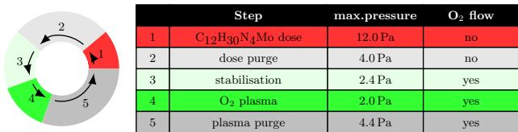  
Fig. 1 Schema PE-ALD  $\mathrm{MoO}_x$  process "1-second  $\mathrm{O}_2$  plasma"

duration one cycle 8.2s

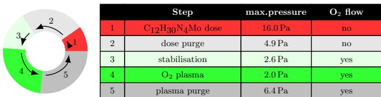  
Fig. 2 Schema PE-ALD  $\mathrm{MoO}_x$  process "2-second  $\mathrm{O}_2$  plasma"

duration one cycle 13.2s

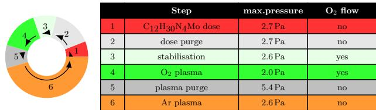  
Fig. 3 Schema PE-ALD  $\mathrm{MoO}_x$  process "2-second  $\mathrm{O}_2$  and Ar plasma"

For the solar cell preparation, polished float- zone- grown phosphorous- doped (100) silicon wafers with a resistivity of  $1 - 5\Omega \mathrm{cm}$  were used. The wafers were cleaned using the RCA process and dipped in diluted hydrofluoric acid (2 min,  $1\%$  vol.) prior to amorphous silicon depositions, and  $5\mathrm{- nm}$  intrinsic amorphous silicon was deposited at the front side of the wafers, and a stack of  $4\mathrm{- nm}$  intrinsic and  $8\mathrm{- nm}$  phosphorous- doped amorphous silicon was deposited on the back side.

Amorphous silicon layers were deposited by plasma- enhanced chemical vapor deposition. The intrinsic amorphous silicon layers were deposited using an excitation frequency of  $13.56\mathrm{MHz}$  and a power density of  $20\mathrm{mW / cm}^2$ . The deposition temperature was  $170^{\circ}\mathrm{C}$ , the pressure was  $0.5\mathrm{mbar}$ , the distance between electrode and substrate on the grounded electrode was  $3\mathrm{cm}$ , and the process gas consisted of pure silane. The intrinsic layers were exposed to a hydrogen plasma treatment [10] in the same reactor at  $1\mathrm{mbar}$ , an electrode substrate distance of  $5\mathrm{cm}$  and a plasma power density of  $60\mathrm{mW / cm}^2$ .

Phosphorous- doped amorphous silicon was grown in a reactor with  $60~\mathrm{MHz}$  excitation, at  $0.5\mathrm{mbar}$ ,  $195^{\circ}\mathrm{C}$ , with an electrode distance of  $2.3\mathrm{cm}$ , at plasma power density of  $20\mathrm{mW / cm}^2$  with a gas- phase doping of  $2000\mathrm{ppm}$  provided by mixing phosphine diluted at  $1\%$  in hydrogen with silane.

Directly after a 1- min dip in  $1\%$  vol. diluted Hf, to remove an potential native oxide from the amorphous silicon, 10- and  $20\mathrm{- nm}$ - thick molybdenum oxide layers have been deposited by the introduced PE- ALD processes with varying plasma steps on the front side of the wafers. Following the molybdenum oxide depositions, indium tin oxide (ITO) was sputtered onto the samples. The ITO layers were RF- sputtered from a ceramic target at a pressure of  $6\mathrm{mbar}$ , a sputtering power of  $70\mathrm{W}$ , a voltage of about  $165\mathrm{V}$  and a gas flow of  $40\mathrm{sccm}$ . The sputter gas consisted of argon with  $0.2\%$  oxygen for the front side ITO and  $0.5\%$  oxygen for the back side layer. The thickness of the front side ITO is about  $80\mathrm{nm}$ , while about  $150\mathrm{nm}$  was deposited on the back side. Since the layers were deposited at room temperature, a two minute post- deposition anneal at  $200^{\circ}\mathrm{C}$  was conducted.

Metal contacts were applied by thermal evaporation of titanium silver stacks. Ten nanometer of titanium was deposited as an adhesion layer, and  $500\mathrm{nm}$  of silver was added on the back side and  $1500\mathrm{nm}$  on the front side. The front side evaporation was conducted through a shadow mask. Afterwards, the solar cell area of  $1\mathrm{cm}^2$  was defined by photolithography and HCl etching of the ITO layer on the front side.

Photoconductance decay measurements were conducted using a Sinton Instruments system to measure the minority

carrier lifetime of the wafers in between different process steps [11]. Bright IV of the solar cells was measured using a class c sun simulator.

# 3 Results and discussion

In Fig. 4, the  $\mathrm{MoO}_x$  film thickness determined by spectral ellipsometry, plotted over the number of performed ALD cycles for the 1- second and 2- second  $\mathrm{O_2}$  plasma processes, is shown. A very similar linear increase in layer thickness with number of cycles is found for both processes. The relatively high growth rate per cycle of  $0.06(5)\pm 0.008\mathrm{nm}$  for both  $\mathrm{O_2}$  plasma durations indicates that oxygen saturation is reached at a plasma power of  $300~\mathrm{W}$  within  $1\mathrm{s}$ . This high growth rate at  $180^{\circ}\mathrm{C}$  is one main benefit compared to the thermal ALD  $\mathrm{MoO}_x$  process reported by Bertuch et al. [8], who use the same Mo precursor but ozone as oxidant. For the thermal ALD  $\mathrm{MoO}_x$  process at temperatures below  $200^{\circ}\mathrm{C}$ , growth rate per cycle below  $0.03\mathrm{nm}$  is reported. By PE- ALD, the activation energy can be delivered by the oxygen reactants from  $\mathrm{O_2}$  plasma. This enables higher growth rates especially for lower deposition temperatures. The growth rates are not significantly influenced by longer purge times or by the integration of an additional Ar plasma step in the cycle, like its done on the process 2- second  $\mathrm{O_2}$  and 6- second Ar plasma (Fig. 3) (not shown).

The optical parameters, estimated from the ellipsometry data of the different  $\mathrm{MoO}_x$  layers, are slightly affected by the duration of the plasma step (compare Fig. 5). While the 2- second  $\mathrm{O_2}$  plasma process shows no subband- gap absorption, the additional argon plasma step leads to small, wide sub- band- gap absorption in the  $\mathrm{MoO}_x$  layers the. For 1- second  $\mathrm{O_2}$  plasma duration, the subband- gap absorption is more pronounced and less wide (Fig. 5).

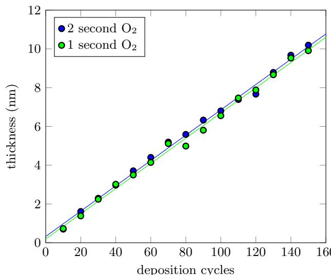  
Fig. 4  $\mathrm{MoO}_x$  thickness measured by spectral ellipsometry data plotted versus the number of ALD cycles

X- ray photoelectron spectroscopy (XPS) was used to identify the core level binding energies and oxidation states of the  $\mathrm{MoO}_x$  layers. The spectra of the films on silicon show characteristic peaks for the oxygen molybdenum. Beside a small carbon peak from surface contamination, no additional peaks can be found in the survey spectra (not shown). In Fig. 6, very similar spectra for all processes can be found in the Mo3d doublet region. Two peaks are observed at 232.5 and  $235.6\mathrm{eV}$  which correspond to the Mo  $3d_{5 / 2}$  and Mo  $3d_{3 / 2}$ , respectively. This values are

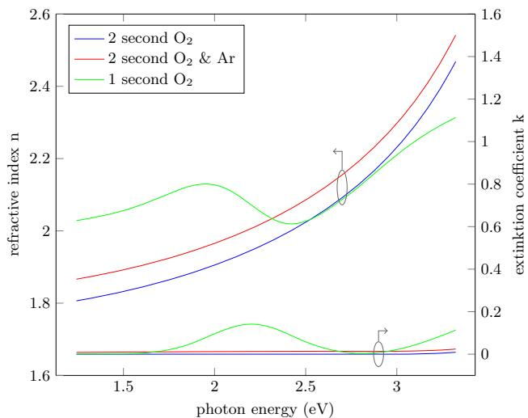  
Fig. 5 Refractive index  $n$  and extinction coefficient  $k$  of the produced  $\mathrm{MoO}_x$  layer as determined from spectroscopic ellipsometry

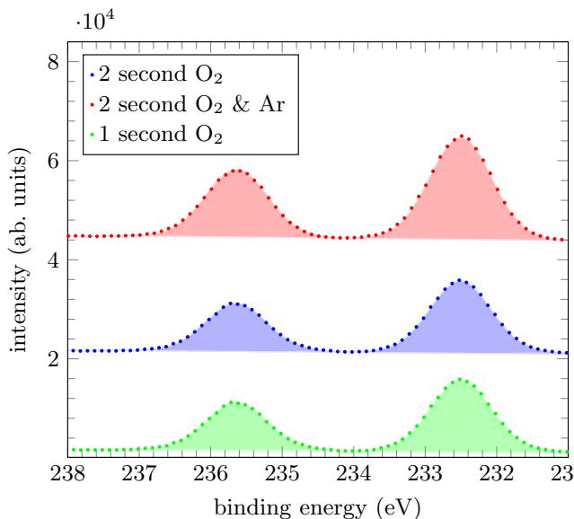  
Fig. 6 XPS spectra of the Mo3d doublet of  $\mathrm{MoO}_x$  films grown in PE-ALD processes with varying plasma step

consistent with reported values for the Mo oxidation state of  $6+$  in literature  $(232.3 - 232.6\mathrm{eV}$  for the Mo  $3d_{5 / 2}$  and  $235.4 - 235.7\mathrm{eV}$  for the Mo  $3d_{3 / 2}$  [4, 6, 8, 12]).

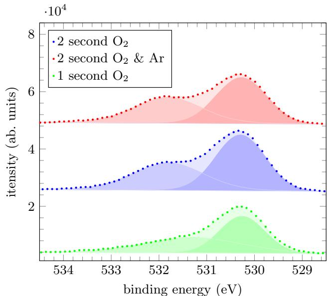  
Fig. 7 XPS spectra of O 1s energy region of  $\mathrm{MoO}_x$  films grown in PE-ALD processes with varying plasma step

A clear difference can be found in the O 1s energy region in Fig. 7. While all measurements show a similar O  $1s$  peak at  $530.3\mathrm{eV}$  a second oxygen- related peak at higher binding energies can be found in the spectra. In the 1- second  $\mathrm{O_2}$  process spectrum, this peak at  $531.3\mathrm{eV}$  is less pronounced, compared with the spectra of 2- second  $\mathrm{O_2}$  processes, in which this peak is located at slightly higher binding energies at  $531.8\mathrm{eV}$  .Chot and coauthors [12] assign a very similar peak in molybdenum oxide to strongly absorbed oxygen as  $\mathrm{O^{- }}$ $\mathrm{HO^{- }}$  or  $\mathrm{H}_2\mathrm{O}$  Although we cannot exclude that this peak is formed by adsorbed air moisture in the layers, as samples were not transferred in vacuo to the spectrometer. It is very likely that this difference is process related, in particular because the samples have been produced after each other and transferred together. It seems plausible that a longer oxygen plasma step leads to a higher content of strongly absorbed oxygen in the  $\mathrm{MoO}_x$  layers itself. However, a stoichiometry analysis of the measured XPS spectra shows over- stoichiometric  $(x > 3)$ $\mathrm{MoO}_x$  for all produced layers. While the O to Mo proportion  $x = 3.15$  is estimated for the 1- second  $\mathrm{O_2}$  layer, a higher oxygen content is measured for 2- second  $\mathrm{O_2}$  plasma processes  $x = 3.62$  without and  $x = 3.55$  with Ar plasma step.

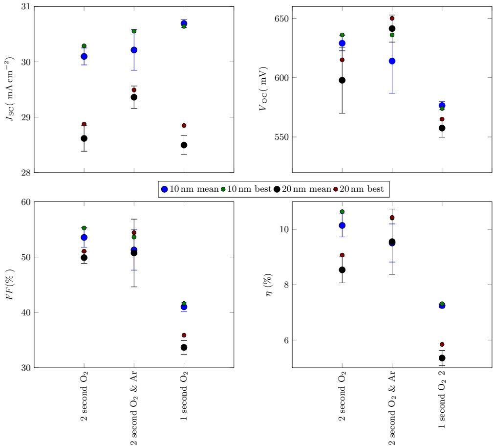  
Fig. 8 Solar cell results plotted versus  $\mathrm{MoO}_x$  processes for 10- and 20-nm-thick oxide layers

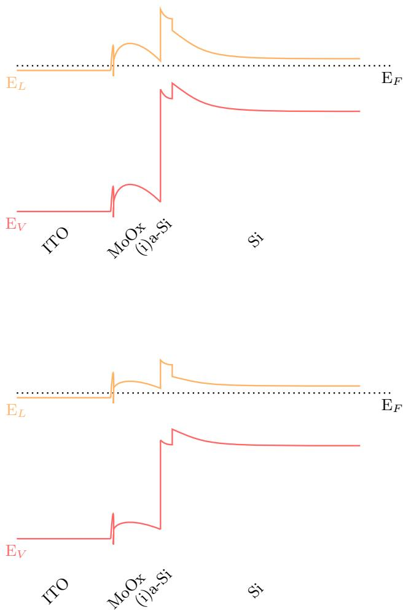  
Fig. 9 Sketch illustrating differences in  $\mathrm{MoO}_x$  induced dark band bending above: high work function  $\mathrm{MoO}_x$ , below: low work function  $\mathrm{MoO}_x$

The performance of the different  $\mathrm{MoO}_x$  processes is tested for 10- and  $20 - \mathrm{nm}$ - thick oxide layers in SHJ solar cells. The cell results (compare Fig. 8) show significant differences mainly in the open- circuit voltage. While the oxides grown in the 2- second  $\mathrm{O}_2$  plasma processes reach best  $V_{\mathrm{OC}}$  values above  $610~\mathrm{mV}$  up to  $650~\mathrm{mV}$ , the best  $V_{\mathrm{OC}}$  values reach by the oxides grown in the 1- second  $\mathrm{O}_2$  plasma processes are below  $580~\mathrm{mV}$ . It is worth mentioning that the low open- circuit voltages in these cells are not limited by enhanced surface recombination. From lifetime measurements of the samples after ITO sputtering and post- anneal (not shown), a quasi- Fermi level splitting at 1 sun (often called implied  $V_{\mathrm{OC}}$ ) well above  $700~\mathrm{mV}$  could be measured for all samples. Both processes without Ar plasma step tend to slightly lower open- circuit voltages for thicker oxide layer. Cells with  $\mathrm{MoO}_x$  layers grown in a process with Ar plasma step show an opposite trend.

The parasitic absorption in the thin oxides is not the only optical loss, shadowing of the ITO itself, as well as differences in the reflection of the front side stacks are also limiting the current. Therefore, the cells with thin  $(10\mathrm{nm})$  oxide layers show very similar currents. A loss in current by doubling the oxide thickness can be seen in all produced cells. As expected the 1- s  $\mathrm{O}_2$  plasma processed  $\mathrm{MoO}_x$  layers show the highest optical loss, by doubling the layer thickness, above  $1.3\mathrm{mAcm}^{- 2}$ . Although the extinction coefficient, determined by spectral ellipsometry on as- deposited oxide layers, is slightly higher for the  $\mathrm{MoO}_x$  process with Ar plasma step, the short- circuit currents do not reflect such tendencies. This could indicate that the ITO sputtering step and the post- deposition anneal determine the optical properties of the  $\mathrm{MoO}_x$  layers. The fill factors and efficiencies of all cells are limited by differently strongly pronounced s- shape in the bright IV curves (compare Figs. 10, 11). Bataglia et al. [3] have reported similar "s- shape" feature, more pronounced for thicker evaporate  $\mathrm{MoO}_x$  layers of SHJ solar cells with  $\mathrm{MoO}_x$  emitter. Same tendencies can be found here for cells with  $\mathrm{MoO}_x$  layers grown in PE- ALD process without additional Ar plasma step. One possible reason for such shape could be the existence of a large barrier for hole transport in SHJ solar cells with sufficient front surface passivation [13]. At first sight, it seems plausible to assume that an insufficient hole transport through the  $\mathrm{MoO}_x$  layers itself is the dominating part of such barrier in the produced cells. The decrease in fill factor for thicker oxide layer seems to support this idea. Anyhow,  $\mathrm{MoO}_x$  layers grown in PE- ALD process with additional Ar plasma step do not show such dependency. On the other hand, the valence band offset on the a- Si:H/c- Si interface could be the dominating part of the barrier, if a tunneling process of holes through this offset is dominating the current a wider barrier leads to a more pronounced s- shape. The width of such barrier is

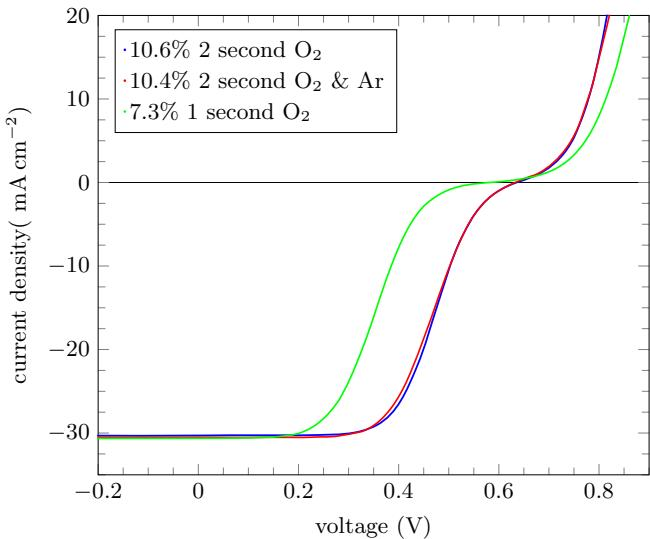  
Fig. 10 Bright IV curves of SHJ cells with  $10\mathrm{nmMoO}_x$

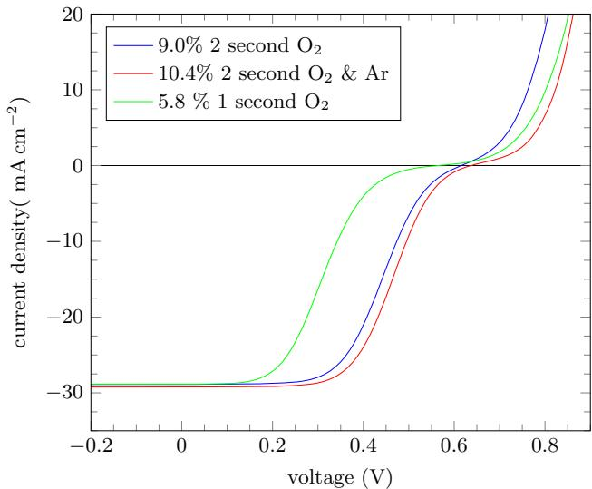  
Fig. 11 Bright IV curves of SHJ cells with  $20 \mathrm{nm} \mathrm{MoO}_x$

working point dependent and directly influenced by the band bending. A lower work function of the  $\mathrm{MoO}_x$  would introduce a lower dark band bending in the c- Si (see schematic sketch in Fig. 9).

Therefore, a lower open- circuit voltage, and as well as more pronounced "s- shape" can be expected. In total, it leads to a significant loss in fill factor and efficiency.

It is known that work function in sub- stoichiometric molybdenum oxide  $(x < 3)$  decrease by the removal of oxygen [14]. Although all as- deposited oxides are overstoichiometric, we speculate that the ITO sputter step and the post- deposition anneal can reduce the oxygen content in the  $\mathrm{MoO}_x$  layers during the cell process. It might be somehow plausible that after these reductions the  $\mathrm{MoO}_x$  layers with initial less oxygen still have a lower content and therefore a lower work function compared to layers with higher initial oxygen content. Such an effect would explain the high decrease in  $V_{\mathrm{OC}}$  and fill factor seen in cells with  $\mathrm{MoO}_x$  layers grown the 1- second  $\mathrm{O}_2$  PE- ALD process, with lower initial oxygen content.

# 4 Conclusions

A new PE- ALD process for the deposition of  $\mathrm{MoO}_x$  with high growth rate at temperatures below  $200^{\circ}\mathrm{C}$  has been presented. XPS measurements show that the stoichiometry of the grown oxides can be influenced by the duration of the oxidizing plasma step. In a first experiment, the integration of these  $\mathrm{MoO}_x$  layers as alternative emitters in SHJ solar cells are tested with efficiencies above  $10\%$ . A strong influence of initial stoichiometry on the open- circuit voltage and on cell performance can be reported. The best cells have a  $10\mathrm{- nmMoO}_x$  layer and a 2- second oxygen plasma step.

Acknowledgments The authors would like to thank Kerstin Jacob and Mona Wittig for wafer cleaning. J. Ziegler acknowledges Martin Rivour (Fraunhofer Institute for Solar Energy Systems) for valuable discussions. Financial support was provided by the European Commission through the FP7- ENERGY Project HERCULES (Grant Agreement No. 608498) and from the German Federal Ministry of Education and Research (BMBF) within the research college STRUKTURSOLAR

# References

1. C. Battaglia, X. Yin, M. Zheng, I.D. Sharp, T. Chen, S. McDonnell, A. Azcatl, C. Carraro, B. Ma, R. Maboudian, R.M. Wallace, A. Javey, Nano Lett. 14(2), 967 (2014). doi:10.1021/ n1404389u  
2. T. Mueller, S. Schwertheim, M. Scherff, W.R. Fahrner, Appl. Phys. Lett. 92(3), 033504 (2008). doi:10.1063/1.2837192. http:// scitation.aip.org/content/aip/journal/apl/92/3/10.1063/1.2837192  
3. C. Battaglia, S.M. de Nicols, S. De Wolf, X. Yin, M. Zheng, C. Ballif, A. Javey, Appl. Phys. Lett. 104(11), 113902 (2014). doi:10.1063/1.4868880. http://scitation.aip.org/content/aip/journal/ apl/104/11/10.1063/1.4868880  
4. M.T. Greiner, L. Chai, M.G. Helander, W.M. Tang, Z.H. Lu, Adv. Funct. Mater. 23(2), 215 (2013). doi:10.1002/adfm.201200 993  
5. M. Otto, M. Kroll, T. Kasebier, R. Salzer, A. Tunnermann, R.B. Wehrspohn, Appl. Phys. Lett. 100(19), 191603 (2012). doi:10. 1063/1.4714546. http://link.aip.org/link/?APL/100/191603/1  
6. M. Diskus, O. Nilsen, H. Fjellvag, J. Mater. Chem. 21, 705 (2011). doi:10.1039/C0JM01099E  
7. Y.C. Tseng, A.U. Mane, J.W. Elam, S.B. Darling, Solar Energy Mater. Solar Cells 99(0), 235 (2012). doi:10.1016/j.solmat.2011. 12.004. http://www.sciencedirect.com/science/article/pii/S09270 24811006854. 9th International Meeting on Electrochromism  
8. A. Bertuch, G. Sundaram, M. Saly, D. Moser, R. Kanjolia, J. Vac. Sci. Technol. A 32(1), 01A119 (2014). doi:10.1116/1.4843595. http://scitation.aip.org/content/avs/journal/jvsta/32/1/10.1116/1. 4843595  
9. G.E. Jellison, F.A. Modine, Appl. Phys. Lett. 69(14), 2137 (1996). doi:10.1063/1.118155. http://scitation.aip.org/content/aip/ journal/apl/69/14/10.1063/1.118155  
10. M. Mews, T.F. Schulze, N. Mingiruki, L. Korte, Appl. Phys. Lett. 102, 122106 (2013). doi:10.1063/1.4798292  
11. R. Sinton, A. Cuevas, M. Stuckings, in Proceedings of the 25th IEEE PVSC pp. 457-460 (1996)  
12. J.G. Choi, L. Thompson, Appl. Surf. Sci. 93(2), 143 (1996). doi:10.1016/0169-4332(95)00317-7. http://www.sciencedirect.com/ science/article/pii/0169433295003177  
13. U. Das, S. Hegedus, L. Zhang, J. Appel, J. Rand, R. Birkmire, in Photovoltaic Specialists Conference (PVSC), 2010 35th IEEE (2010), pp. 001,358-001, 362. doi:10.1109/PVSC.2010.5614372  
14. M.T. Greiner, L. Chai, M.G. Helander, W.M. Tang, Z.H. Lu, Adv. Funct. Mater. 22(21), 4557 (2012). doi:10.1002/adfm. 201200615