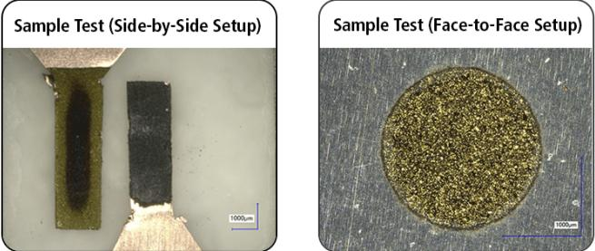
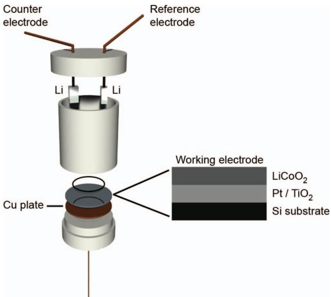
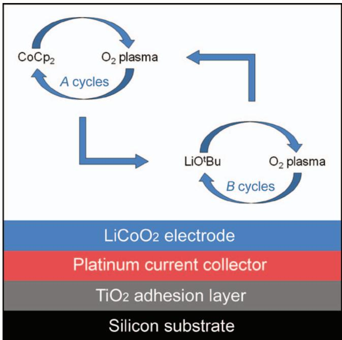
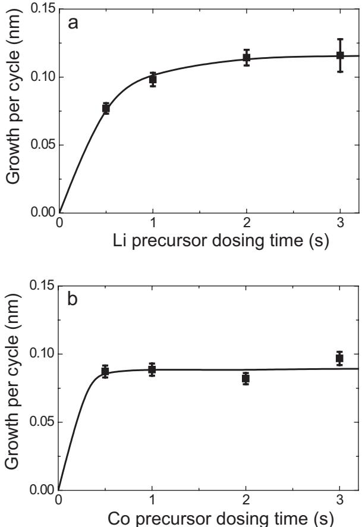
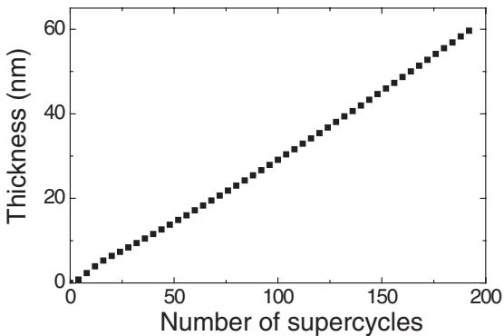
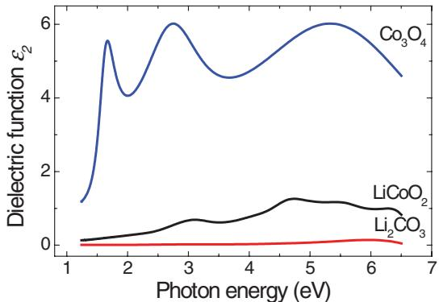
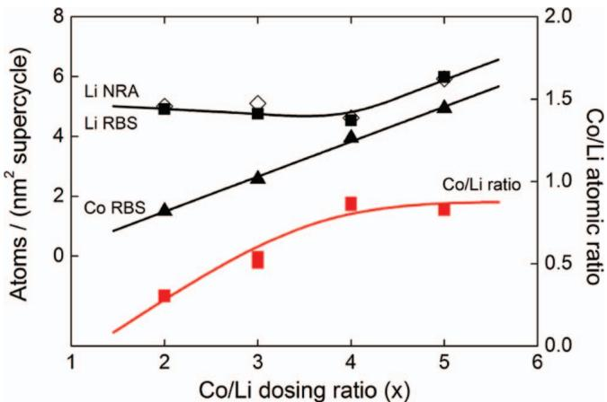
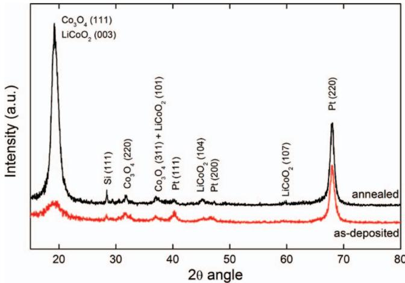
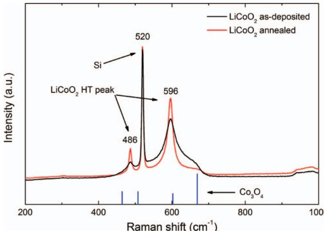
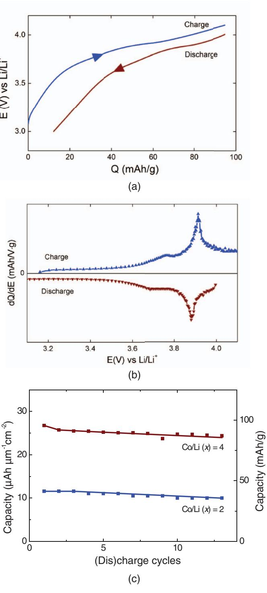

# You may also like

# Atomic Layer Deposition of LiCoO₂ Thin-Film Electrodes for All-Solid-State Li-Ion Micro-Batteries

To cite this article: M. E. Donders et al 2013 J. Electrochem. Soc. 160 A3066

- LiCoO₂-Based Composite Cathode with PO₂-O₂ Hybrid Framework for Lithium Ion Batteries  Sul Hee Min, Mi Ru Jo and Yong-Mook Kang

- Preparation and Electrochemical Evaluation of LiCoO₂ Film Prepared with Cold Spraying for Development of Lithium-Ion Battery  Kohei Okuyama, Naoki Yoshida, Kazuhisa Sato et al.

- Plane-Selective Coating of LiCoO₂ Powders for Li-Ion Batteries  Hanseul Kim and Kyu Tae Lee

# ECC-Opto-10 Optical Battery Test Cell: Visualize the Processes Inside Your Battery!

- Battery Test Cell for Optical Characterization  Designed for light microscopy, Raman spectroscopy and XRD.

- Optimized, Low Profile Cell Design (Device Height 21.5 mm)  Low cell height for high compatibility, fits on standard samples stages.

- High Cycling Stability and Easy Handling  Dedicated sample holders for different electrode arrangements included!

- Cell Lids with Different Openings and Window Materials Available

Contact us:  +49 40 79012- 734  sales@el- cell.com  www.el- cell.com

# Atomic Layer Deposition of  $\mathrm{LiCoO}_2$  Thin-Film Electrodes for All-Solid-State Li-Ion Micro-Batteries

M. 
E. Donders, $^{a,b}$  
W. 
M. Arnoldbik, $^{c}$  
H. 
C. 
M. Knoops, $^{b}$  
W. 
M. 
M. Kessels, $^{b,*}$  and 
P. 
H. 
L. Notten $^{b,*}$ , $^{z}$

$^{a}$ Materials innovation institute M2i, 2600 GA Delft, The Netherlands  $^{b}$ Eindhoven University of Technology, 5600 MB Eindhoven, The Netherlands  $^{c}$ AccTec B.V, Eindhoven University of Technology, 5600 MB Eindhoven, The Netherlands

One of the remaining challenges in the field of portable electronics is the miniaturization of lithium- ion batteries. To prepare all- solid- state batteries with a sufficient high storage capacity it is vital to prepare high quality thin films for battery stacks on 3D- structured substrates. A remote plasma atomic layer deposition (ALD) process has therefore been developed for  $\mathrm{LiCoO}_2$  which can serve as a cathode material. A combination of  $\mathrm{CoCp}_2$  as cobalt precursor,  $\mathrm{LiO}^+\mathrm{Bu}$  as lithium precursor and  $\mathrm{O}_2$  plasma as oxidant source was used to create super- cycles to deposit  $\mathrm{LiCoO}_2$  from  $\mathrm{Co}_3\mathrm{O}_4$  and  $\mathrm{Li}_2\mathrm{CO}_3$  cycles. The thin films were deposited at a temperature of  $325^{\circ}\mathrm{C}$  and showed linear growth with a rate of  $0.06\mathrm{nm / cycle}$ . After annealing the samples at  $70^{\circ}\mathrm{C}$  for 6 minutes high temperature phase  $\mathrm{LiCoO}_2$  was obtained, as was demonstrated by XRD and Raman spectroscopy. A new procedure was proposed to obtain the composition of all three chemical elements in the  $\mathrm{LiCoO}_2$  films. Elastic Backscattering Spectroscopy (EBS) measurements turned out to be very convenient and reliable to obtain the quantities of all chemical elements, including lithium. Moreover, the ALD- deposited  $\mathrm{LiCoO}_2$  thin film electrodes were electrochemically characterized, revealing good electrochemical performance. To the best of our knowledge this paper provides the first evidence that electrochemically active  $\mathrm{LiCoO}_2$  can be deposited by ALD. © 2013 The Electrochemical Society. [DOI: 10.1149/2.011305jes] All rights reserved.

Manuscript submitted December 31, 2012; revised manuscript received February 21, 2013. Published March 12, 2013. This was in part Paper 1848 presented at the Boston, Massachusetts, Meeting of the Society, October 9- 14, 2011. This paper is part of the JES Focus Issue on Intercalation Compounds for Rechargeable Batteries.

During the past decade, portable electronic devices have become considerably more widespread, complex and powerful, and new challenges have been encountered, especially in the field of medical and autonomous devices. To power these future devices, thin- film, all- solid- state, lithium- ion micro- batteries have been proposed. To facilitate the required energy demand, both a high energy- to- weight and energy- to- volume ratio is essential. Lithium- ion batteries fulfill these demands. As packaging requirements become more dominant at smaller dimensions, one of the remaining challenges is miniaturization of lithium- ion batteries without decreasing the storage capacity. This formed the basis of the integrated batteries concept.

Step conformal deposition of films onto etched structures in silicon is an excellent method to tackle this challenge and to facilitate the integration of these high capacity energy storage devices into microelectronics. Chemical vapor deposition (CVD) has been proposed as deposition method. However, CVD has a limited step- conformal deposition capability in highly structured geometries due to the delicate interplay between kinetics and diffusion. By using atomic layer deposition (ALD) this effect can be counteracted as this deposition method is based on a reaction- limited surface saturation, opening up numerous possibilities for the use of more complex substrate structures such as nanowires.

Industrial scale implementation of ALD has already been proven in micro- electronics and this technique is rapidly penetrating new fields, such as solar cells, catalysis and recently also energy storage devices. In the field of battery technology, several interesting materials have been prepared which show much promise. However, work on lithium- containing solid- state electrolytes and electrode materials is still very exploratory. Even though several lithium- containing compounds have recently been prepared by ALD, no reports of electrochemical investigations are available to date. An overview of Li- containing compounds prepared by ALD is presented in Table I. This paper demonstrates the electrochemical activity for ALD- prepared  $\mathrm{LiCoO}_2$  which is, to the best of our knowledge, the first active Li- containing battery material, deposited by ALD, which is electrochemically characterized in detail. Therefore, for reference, also  $\mathrm{LiCoO}_2$  CVD processes are included in Table I.

Evidently, analyzing the chemical composition of thin films is essential to evaluate the electrochemical properties of the  $\mathrm{LiCoO}_2$ . Although it is most uncommon to use backscattering techniques such as Rutherford backscattering spectroscopy (RBS) for the determination of the Li content in thin films, this has been achieved by making use of non- Rutherford cross sections. The as- obtained results will be verified by Nuclear Reaction Analyzes (NRA). This is another novelty within this paper.

# Experimental

Film preparation. The  $\mathrm{LiCoO}_2$  films were deposited using an open- load thermal and remote plasma ALD reactor as described previously for the deposition of  $\mathrm{Co}_3\mathrm{O}_4$ . An inductively coupled plasma (ICP) source that is operated on  $\mathrm{O}_2$  is connected to a deposition chamber along with a pump unit through gate valves. The pump unit consists of a rotary and turbo molecular pump, which can reach a base pressure of  $< 10^{- 5}$  Torr by overnight pumping. The  $\mathrm{CoCp}_2$  and  $\mathrm{LiO}^+\mathrm{Bu}$  precursors (both  $98\%$ , Strength Chemicals) were heated to  $80^{\circ}\mathrm{C}$  and  $120^{\circ}\mathrm{C}$  respectively (Table II) and they were bubbled with Ar at a reactor pressure of  $0.02\mathrm{Torr}$ . The substrate was heated to  $325^{\circ}\mathrm{C}$ , while the reactor walls, Ar lines, and  $\mathrm{CoCp}_2$  precursor lines were maintained at a temperature of  $105^{\circ}\mathrm{C}$ , the  $\mathrm{LiO}^+\mathrm{Bu}$  precursor lines were kept at  $150^{\circ}\mathrm{C}$  to prevent precursor condensation.  $\mathrm{Si(100)}$  with native oxide and  $\mathrm{Si(100)}$  with  $400\mathrm{nm}$  thermally grown  $\mathrm{SiO}_2$  were used as substrates for materials analyzes. For the electrochemical characterization,  $\mathrm{Si / TiO}_2 / \mathrm{Pt}$  substrates were prepared by ALD as described in Ref. 8 and schematically shown in Fig. 1 with thicknesses of 5 and  $20\mathrm{nm}$  for  $\mathrm{TiO}_2$  and  $\mathrm{Pt}$  respectively.

The remote plasma ALD process for  $\mathrm{LiCoO}_2$  consists of the two individual ALD processes for the deposition of  $\mathrm{Co}_3\mathrm{O}_4$  and  $\mathrm{Li}_2\mathrm{CO}_3$  which are combined in a so- called super- cycle (Fig. 2). Here the previously described remote plasma ALD process for  $\mathrm{Co}_3\mathrm{O}_4$  is combined with a novel ALD process, using a lithium precursor reported recently for the deposition of LLT and  $\mathrm{Li}_2\mathrm{CO}_3$ . In this paper a super- cycle is defined as a combination of  $A$  cycles  $\mathrm{Co}_3\mathrm{O}_4$  and  $B$  cycles  $\mathrm{Li}_2\mathrm{CO}_3$  (Fig. 2), resulting in a dosing ratio of  $A:B$  (e.g. 4:1), where  $B$  is consistently kept as 1 throughout the paper.  $x$  is defined as  $A / B$ , e.g. for a dosing ratio of 4:1,  $x$  equals 1. In both processes a precursor dosing time of 2 s is applied combined with an  $\mathrm{O}_2$  plasma at  $100\mathrm{W}$  for 5 s

Table I. Overview of ALD processes for the deposition of lithium-containing compounds and CVD processes for  $\mathbf{LiCoO}_2$  . The growth rates have not been reported for the CVD processes. The abbreviation LLT stands for lithium lanthanum titanate.  

<table><tr><td></td><td>Deposited material</td><td>Lithium precursor</td><td>Other Precursor(s)</td><td>Reactant(s)</td><td>Deposition temperature</td><td>Growth rate</td><td>References</td></tr><tr><td rowspan="4">ALD</td><td>Li2CO3</td><td>LiO&#x27;Bu</td><td>-</td><td>H2O</td><td>225℃</td><td>0.08 nm/cycle</td><td>9,10</td></tr><tr><td>LLT</td><td>LiO&#x27;Bu</td><td>La(thd)3</td><td>O3</td><td>225℃</td><td>0.05 nm/cycle</td><td>10</td></tr><tr><td>LiOH</td><td>LiO&#x27;Bu</td><td>TiCl4</td><td>H2O</td><td>225℃</td><td>0.09 nm/cycle</td><td>9</td></tr><tr><td>LiCoO2</td><td>LiO&#x27;Bu</td><td>CoCp2</td><td>O2 plasma</td><td>325℃</td><td>0.06 nm/cycle</td><td>This work</td></tr><tr><td rowspan="2">CVD</td><td>LiCoO2</td><td>&#x27;BuLi</td><td>CpCo(CO)2</td><td>O2</td><td>300–600℃</td><td>-</td><td>19</td></tr><tr><td>LiCoO2</td><td>Li(TMHD)</td><td>Co(TMHD)3</td><td>O2/N2</td><td>450–550℃</td><td>-</td><td>17</td></tr></table>

Table II. Overview of ALD process parameters for the  $\mathbf{Co}_3\mathbf{O}_4$  and  $\mathbf{Li}_2\mathbf{CO}_3$  sub-cycles used in the super-cycle for the preparation of  $\mathbf{LiCoO}_2$  

<table><tr><td></td><td>Precursor/reactant</td><td>Dosing time</td><td>Pump purge time</td><td>Precursor temperature</td><td>Precursor line temperature</td></tr><tr><td rowspan="2">Co3O4</td><td>CoCp2</td><td>2 s</td><td>3 s</td><td>80℃</td><td>105℃</td></tr><tr><td>O2 plasma</td><td>5 s</td><td>0.5 s</td><td>-</td><td>-</td></tr><tr><td rowspan="2">Li2CO3</td><td>LiO&#x27;Bu</td><td>2 s</td><td>3 s</td><td>120℃</td><td>150℃</td></tr><tr><td>O2 plasma</td><td>5 s</td><td>0.5 s</td><td>-</td><td>-</td></tr></table>

at a pressure of O.01 Torr. During and after the precursor dosing and plasma exposure, the reaction chamber is purged (3 s and  $0.5\mathrm{s}$  respectively) and evacuated.

Film analyzes.- The thickness and dielectric function of the films were monitored during the ALD process by in situ spectroscopic ellipsometry SE) with a J.A.Woollam,Inc.M2000U  $(0.75 - 5.0\mathrm{eV})$  ellipsometer.13 The optical range was extended to  $6.5\mathrm{eV}$  after the deposition process, using ex situ variable angle measurements with a J.A.Woollam, Inc. M2000D ellipsometer. The dielectric function of  $\mathrm{Co}_3\mathrm{O}_4$  has been extracted from the SE measurements using an optical model employing a Gauss, a Tauc- Lorentz, and two Lorentz oscillators, to account for the absorption bands.12 The dielectric functions of  $\mathrm{Li}_2\mathrm{CO}_3$  and  $\mathrm{LiCoO}_2$  were parameterized using a mathematical description in the form of B- splines.14 This is a method that requires no prior knowledge about the dielectric function of deposited films and enables in situ thickness measurements.

The microstructure of the  $\mathrm{LiCoO}_2$  films was studied using Grazing Incidence X- ray diffraction (GI- XRD) with a Philips X'Pert MPD diffractometer equipped with a  $\mathrm{CuK}_{\alpha}$  source  $1.54\mathrm{\AA}$  radiation).The Raman spectra of the samples were recorded using a (in- via Renishaw) micro Raman scattering setup with a wavelength of  $514.5 \mathrm{nm}$  a maximum power density of  $3.2\cdot 10^{5}\mathrm{W / cm}^{2}$  and a resolution of  $1.6~\mathrm{cm^{- 1}}$

The overall composition of the layers has been analyzed at AccTec  $\mathrm{BV}^{15}$  with backscattering spectrometry using a  $2.09\mathrm{MeV}$  proton beam delivered and a scattering angle of  $172^{\circ}$  . Under these circumstances the cross sections of the lighter elements are strongly enhanced with respect to the Rutherford cross sections and strictly spoken the technique should be referred to as Elastic Backscattering (EBS) instead of RBS. The enhancement for the cross sections of  ${}^{7}\mathrm{Li}$ $^{12}\mathrm{C}$ $^{16}\mathrm{O}$  with respect to the Rutherford values is about 55, 5 and 4 respectively. The main advantage is that all elements can now be determined from one single spectrum. The alpha yield was simultaneously measured from the  ${}^{7}\mathrm{Li}(\mathrm{p},\alpha)^{4}\mathrm{He}$  nuclear reaction to confirm the Li content with NRA. The Co, O and C concentrations have been confirmed with conventional RBS measurements using  $2\mathrm{MeVHe}^+$  ions. More details of the EBS analysis will be published in a separate paper.11

Electrochemical analyzes.- The electrochemical analyzes were performed in three- electrode cylindrical electrochemical cells with an effective surface area of  $2\mathrm{cm}^2$  Fig.1).The cells were made of Teflon with a volume of about  $15~\mathrm{ml}$  . The cells were assembled in an argonfilled glove- box. The  $\mathrm{Si / TiO_2 / Pt / LiCoO_2}$  electrodes were mounted as working electrodes and back- contacted, and a direct contact with  $\mathrm{LiCoO}_2$  , with silver paint to facilitate good electrical conductivity. A

Cu plate was used as electrical conductor for the working electrode, while pure lithium foils were used as counter and reference electrodes. 1 molar  $\mathrm{LiClO_4}$  dissolved in Ethyl Carbonate (EC)/Diethyl Carbonate (DEC) was used as liquid electrolyte (Puriel, Techno, Semichem Co., Ltd, Korea). The cells were placed in a stainless steel holder that was thermostatically controlled at room temperature. Contaminants in the glove- box (water and oxygen) were monitored and controlled below 1 ppm. Galvanostatic cycling was performed with a M2300 galvanostat (Maccor, Tulsa, USA), applying a current density of  $0.5\mu \mathrm{Ah} / \mathrm{cm}^2$  between 3.0 and  $4.1\mathrm{V}$  The following definition is adopted throughout the manuscript: charging  $\mathrm{LiCoO}_2$  refers to Li- ion extraction (or delithiation) and discharging to Li- ion insertion (or lithiation). Based on the electrode surface area, the layer thickness as determined by spectroscopic ellipsometry and the density determined by quantitative EBS measurements (Table III), the volumetric and gravimetric capacities were calculated.

  
Figure 1. Schematic representation of the Teflon three-electrode measurement setup. The  $\mathrm{LiCoO}_2$  films under investigation deposited on  $\mathrm{Si / TiO_2 / Pt}$  substrates are used as working electrode during the electrochemical measurements. Layer thicknesses are 5 and  $20 \mathrm{nm}$  for  $\mathrm{TiO_2}$  and  $\mathrm{Pt}$  respectively.

  
Figure 2. Schematic representation of an ALD super-cycle consisting of the two individual ALD processes for  $\mathrm{Co_3O_4}$  and  $\mathrm{Li_2CO_3}$ . A cycles of the  $\mathrm{Co_3O_4}$  process are combined with B cycles of the  $\mathrm{Li_2CO_3}$  process. The film-substrate stack is also shown.

# Results and Discussion

ALD growth.- To investigate the ALD process parameters, the self- limiting behavior of the ALD process was investigated for the  $\mathrm{CoCp_2}$  and  $\mathrm{LiO^4}$  Bu precursors using a Co:Li dosing ratio of 1:1 for the super- cycle as presented in Fig. 2. This means that one cycle of  $\mathrm{Co_3O_4}$  was alternated with one cycle of  $\mathrm{Li_2CO_3}$ . The plasma exposure time was fixed at 5 seconds for both precursors. The Li precursor dosing time was varied while the Co dosing time remained constant at  $2\mathrm{s}$  which is the same dosing time used during the deposition of  $\mathrm{Co_3O_4}$ .12 Saturation of the Li precursor occurs after about  $2\mathrm{s}$  as can be seen in Fig. 3a. The same procedure was conducted for the Co precursor while the Li dosing time was kept constant at  $2\mathrm{s}$ . Proper saturation is also observed in the Co case (Fig. 3b). Note that the growth rates under saturated conditions are slightly different in Fig. 3a and 3b. This can most likely be attributed to the different film thicknesses employed when generating Fig. 3a and 3b. the growth rate was found the change slightly with film thicknesses (see Fig. 4). Dosing times of  $2\mathrm{s}$  for both precursors were therefore fixed for all deposition experiments described.

  
Figure 3. Saturation curves for remote plasma ALD of  $\mathrm{LiCOO_2}$  at  $325^{\circ}C$  (a) Growth rate as a function of  $\mathrm{LiO^4}$  Bu dosing time, while the  $\mathrm{CoCp_2}$  dosing time and the plasma exposure time are kept constant at  $2\mathrm{s}$  and  $5\mathrm{s}$  respectively. (b) Growth rate as a function of  $\mathrm{CoCp_2}$  dosing time, while the  $\mathrm{LiO^4}$  Bu dosing time and the plasma exposure time are kept constant at  $2\mathrm{s}$  and  $5\mathrm{s}$  respectively. The lines serve as guides to the eye.

Applying a Co:Li dosing ratio of 1:1 lead to a slightly higher growth rate than expected on the basis of the individual growth rates for  $\mathrm{Co_3O_4}$ $(0.05\mathrm{nm / cycle})$  and  $\mathrm{Li_2CO_3}$ $(0.08\mathrm{nm / cycle})$ . This could be due to the high growth rate of pure  $\mathrm{Li_2CO_3}$  as compared to pure  $\mathrm{Co_3O_4}$ ,9,12 but

Table III. Material properties and electrochemical results for  $\mathbf{LiCoO_2}$  thin films prepared for various  $\mathbf{Co} / \mathbf{Li}$  dosing ratios. Compositions are measured by EBS. The Co/Li dosing ratio  $(x)$  for the ALD process is defined as the number of  $\mathrm{Co_3O_4}$  sub-cycles divided by the number of  $\mathrm{Li_2CO_3}$  sub-cycles. For the lithium concentration an average is taken of the EBS and NRA measurements. Typical experimental errors are: Co  $(3\%)$  Li  $(5\%)$  O  $(5\%)$  and C  $(7\%)$  

<table><tr><td></td><td>Co/Li dosing ratio (x)</td><td>2</td><td>3</td><td>4</td><td>5</td></tr><tr><td rowspan="3">ALD process</td><td>Super-cycles</td><td>300</td><td>200</td><td>200</td><td>169</td></tr><tr><td>Cycles (total)</td><td>900</td><td>800</td><td>1000</td><td>1014</td></tr><tr><td>Thickness (nm) (± 0.5 nm)</td><td>54</td><td>54</td><td>60</td><td>61</td></tr><tr><td rowspan="8">Composition</td><td>Co(1015 atom/cm2)</td><td>45.3</td><td>51.6</td><td>79.0</td><td>83.6</td></tr><tr><td>Li(1015 atom/cm2)</td><td>149</td><td>98.7</td><td>91.6</td><td>101</td></tr><tr><td>O(1015 atom/cm2)</td><td>353</td><td>210</td><td>266</td><td>315</td></tr><tr><td>C(1015 atom/cm2)</td><td>86</td><td>41</td><td>30</td><td>37</td></tr><tr><td>Average Co/Li ratio</td><td>0.30</td><td>0.52</td><td>0.86</td><td>0.83</td></tr><tr><td>Average O/Co ratio</td><td>7.9</td><td>4.1</td><td>3.5</td><td>3.8</td></tr><tr><td>Composition</td><td>Li3.3CoO7.9</td><td>Li1.2CoO4.1</td><td>Li1.2CoO3.5</td><td>Li1.2CoO3.8</td></tr><tr><td>Density (g·cm-3)</td><td>3.2</td><td>2.6</td><td>2.8</td><td>3.0</td></tr><tr><td rowspan="2">Electrochemical results</td><td>Average Capacity (Ah·μm-1·cm-2)</td><td>12.1</td><td>-</td><td>27.0</td><td>-</td></tr><tr><td>Average Capacity (% of maximum)</td><td>28</td><td>-</td><td>62</td><td>-</td></tr></table>

  
Figure 4. Thickness of  $\mathrm{LiCoO_2}$  on  $\mathrm{Si(100)}$  as a function of the number of ALD super-cycles, as measured with in situ spectroscopic ellipsometry. The used Co:Li dosing ratio is 4:1.

the growth of  $\mathrm{Li}_2\mathrm{CO}_3$  could also be catalyzed by the presence of cobalt atoms. Fig. 4 shows that the thickness was almost linearly dependent on the number of ALD cycles at a dosing ratio of  $\mathrm{Co:Li} = 4:1$  with an overall growth rate of  $\sim 0.06 \mathrm{nm / cycle}$ . It is not expected that a change in Co:Li dosing ratio will significantly affect the saturation behavior for both precursors in the  $\mathrm{Co}_3\mathrm{O}_4$  and  $\mathrm{Li}_2\mathrm{CO}_3$  cycles.

Fig. 5 shows the in situ measured dielectric function  $\epsilon_{2}$  for photon energies between 1.24 and  $6.5\mathrm{eV}$  of the as- deposited  $\mathrm{Co}_3\mathrm{O}_4$ ,  $\mathrm{Li}_2\mathrm{CO}_3$  and  $\mathrm{LiCoO_2}$ . A clear difference is found between the three films. The dielectric function of  $\mathrm{Co}_3\mathrm{O}_4$  has been described in an earlier publication.12 Unfortunately, from the literature not much is known about the dielectric functions of  $\mathrm{Li}_2\mathrm{CO}_3$  and  $\mathrm{LiCoO_2}$ . In order to distinguish between  $\mathrm{Co}_3\mathrm{O}_4$ ,  $\mathrm{Li}_2\mathrm{CO}_3$  and  $\mathrm{LiCoO_2}$  the films of the latter two materials have also been investigated. Fig. 5 clearly shows that  $\mathrm{Li}_2\mathrm{CO}_3$  hardly contributes to the  $\mathrm{LiCoO_2}$  signal and that a typical spectrum for  $\mathrm{LiCoO_2}$  is obtained.

Material properties. Knowledge of the overall film composition is essential in order to evaluate ALD- deposited  $\mathrm{LiCoO_2}$  thin films, especially to properly evaluate the electrochemical results. EBS and NRA are excellent techniques to determine the atomic composition of compounds and can thus be used to reveal the ratio between lithium, cobalt and oxygen in the films (Fig. 6).11 These analyzes show that materials prepared with a Co:Li dosing ratio  $x$  of 4 and higher have more or less the same atomic ratios (Table III). In addition, a Co:Li dosing ratio larger than 4:1 seems to increase the deposition rate of the lithium sub- cycle in the ALD process slightly (Fig. 6), while the deposition rate during the cobalt sub- cycle is unaffected and continues to increase linearly with  $x$ . This effect is not yet fully understood, but limits the ALD process from obtaining the desired  $\mathrm{Co / Li} = 1$  material composition for the range investigated. This illustrates the delicate balance that needs to be taken into account when dealing with the ALD- deposition of ternary compounds.

  
Figure 5. The imaginary part of the dielectric function  $(\epsilon_{2})$  of the  $\mathrm{Co}_3\mathrm{O}_4$ ,  $\mathrm{Li}_2\mathrm{CO}_3$  and  $\mathrm{LiCoO_2}$  films as determined by in situ spectroscopic ellipsometry.

  
Figure 6. Number of atoms deposited per  $\mathrm{nm}^2$  per super-cycle and the Co/Li ratio in the film as a function of the Co/Li dosing ratio  $(x)$  as determined by Nuclear reaction analysis (NRA) and Elastic backscattering spectroscopy (EBS). For the Co/Li dosing ratio the amount of Li cycles per super-cycle is kept constant at 1.

As- deposited samples were investigated by GI- XRD and Raman spectroscopy and subsequently annealed at  $700^{\circ}\mathrm{C}$  for 6 minutes before being measured again with the same techniques. Fig. 7 shows that a large diffraction peak becomes visible after annealing at a  $2\theta$  angle of  $19^{\circ}$ , which has also been reported in the literature for metal organic (MO) CVD deposited  $\mathrm{LiCoO_2}$  at various temperatures.16 This peak can be assigned to either the (111) reflection of  $\mathrm{Co}_3\mathrm{O}_4$  or the (003) reflection of  $\mathrm{LiCoO_2}$ . As both cobalt oxide and lithium cobalt oxide can be present in the deposited thin films it is not possible to unambiguously determine the origin of the diffraction peak and the nature of the film from XRD. Therefore Raman spectroscopy has been used to further investigate these films. Figure 8 shows that the high temperature (HT) hexagonal phase of  $\mathrm{LiCoO_2}$  is observed with two typical phonon modes at 486 and  $596~\mathrm{cm^{- 1}}$  which becomes even more defined after annealing.17 The Raman spectra reveal no significant fraction of  $\mathrm{Co}_3\mathrm{O}_4$  in the films as this would lead to a distinct peak at  $693~\mathrm{cm^{- 1}}$ .

Electrochemical analyzes. It is well- known that a heat- treatment of about  $700^{\circ}\mathrm{C}$  is required to obtain the electrochemically active, crystalline,  $\mathrm{LiCoO_2}$ .18 The annealed  $\mathrm{LiCoO_2}$  films were electrochemically characterized in the experimental three- electrode battery set- up using

  
Figure 7. X-ray diffraction measurements  $(\lambda = 1.54\mathrm{\AA})$  revealing overlapping peaks for  $\mathrm{Co}_3\mathrm{O}_4$  with a preferential (111) orientation and crystalline  $\mathrm{LiCoO_2}$  after annealing at  $700^{\circ}\mathrm{C}$  for 6 minutes. The spectra have been offset vertically for clarity. The Co:Li dosing ratio was 2:1  $(x = 2)$ .

  
Figure 8. Raman measurements for  $\mathrm{LiCoO_2}$  annealed at  $700^{\circ}\mathrm{C}$  for 6 minutes compared to as-deposited  $\mathrm{LiCoO_2}$  and the theoretical spectrum of  $\mathrm{Co_3O_4}$ . The used Co:Li dosing ratio was 2:1  $(x = 2)$ .

constant current (dis)charge cycling. The charge transfer reaction of the  $\mathrm{LiCoO_2}$  electrode can be represented by

$$
\mathrm{LiCoO}_2\rightleftharpoons \mathrm{Li}_{(1 - z)}\mathrm{CoO}_2 + z\mathrm{Li}^+ +z\mathrm{e}^{-} \tag{1}
$$

where  $z\leq 0.5$ . Extracting more than 0.5 lithium atoms per formula unit would irreversibly change the crystal structure of  $\mathrm{LiCoO_2}$ , making the electrode (partly) electrochemically inactive. All electrode films investigated showed electrochemical activity. However, the storage capacity was clearly found to be dependent on the ALD dosing ratio.

Fig. 9a shows the (dis)charge behavior of the  $\mathrm{LiCoO_2}$  electrode for the  $\mathrm{Co:Li}$  dosing ratio  $x$  of 4 which revealed the highest storage capacity. By taking the derivative of the storage capacity with respect to the electrode potential (Fig. 9b), the plateaus in Fig. 9a are transformed into either broad or sharp peaks dependent on the slope of the voltage curves. A clear charge transfer reaction is now visible at  $3.9\mathrm{V}$  as expected for  $\mathrm{LiCoO_2}$ . Also a  $12\%$  capacity loss between the charge and discharge reactions is found (Fig. 9a). A similar effect has been reported before and this has been attributed to irreversible side reactions (e.g. oxidation of the liquid electrolyte, the formation of the less electrochemically active spinel  $\mathrm{LiCo_2O_4}$  phase or mechanical strain- induced degradation of the  $\mathrm{LiCoO_2}$  film, but also the (electro)chemical stability of the impurities found in ALD  $\mathrm{LiCoO_2}$  with respect to the liquid electrolyte could play a role.

The electrochemical storage capacity is, however, lower than theoretically expected for  $\mathrm{LiCoO_2}$  (155 mAh/g), but remained fairly stable upon cycling as shown in Fig. 9c. Over  $60\%$  of the maximum theoretical storage capacity has been obtained with the ALD deposited  $(x = 4)$  thin film electrode (Fig. 9c). This lower capacity can be explained by the presence of  $\mathrm{Li_2CO_3}$  within the thin film as indicated by the increased oxygen over cobalt (O/Co) and decreased cobalt over lithium (Co/Li) ratios and the presence of carbon (Table III). Moreover, Table III shows an abundance of lithium and oxygen which could also indicate the formation of inactive  $\mathrm{Li}_2\mathrm{O}_3$  during the ALD process. These two effects may contribute to the reduced capacity compared to the theoretical maximum. Referring to Table III it is clear that the impurity level of the  $x = 2$  material is significantly higher than the  $x = 4$  material. This is in line with the reduced capacity of the  $x = 2$  material compared to  $x = 4$ . It is expected that further process optimization will yield a higher chemical purity and improved storage capacity.

# Conclusions

A remote plasma ALD process for the preparation of  $\mathrm{LiCoO_2}$  thin films was developed using the combination of  $\mathrm{LiCl_2O_2}$  as cobalt precursor,  $\mathrm{LiO}^*\mathrm{Bu}$  as lithium precursor and a  $\mathrm{O_2}$  plasma as the oxidant source. To the best of our knowledge this paper provides the first evidence that electrochemically active  $\mathrm{LiCoO_2}$  can be deposited by ALD. It was shown that  $\mathrm{LiCoO_2}$  films could be deposited by ALD with the  $\mathrm{Li / Co}$  ratio depending on the  $\mathrm{Co:Li}$  dosing ratio. Moreover, elastic backscattering spectrometry was shown to be an accurate method to analyze the  $\mathrm{Li}$ - content in this type of films, which simplifies the analysis significantly. After heat treatment, the high temperature phase of  $\mathrm{LiCoO_2}$  was obtained as shown by XRD and Raman measurements.

  
Figure 9. Constant current (CC) (dis)charge cycling between  $3.0\mathrm{V}$  and  $4.1\mathrm{V}$  (0.35 C-rate) for an ALD-deposited  $\mathrm{LiCoO_2}$ $(x = 4)$  film on  $\mathrm{Si / TiO_2 / Pt}$ , using  $\mathrm{LiClO_4}$  in ethylene carbonate/diethyl carbonate (EC/DEC 1/1) as liquid electrolyte. (a) (dis)charge of  $\mathrm{LiCoO_2}$ , (b) the derivative of the storage capacity with respect to the electrode potential and (c) the electrochemical storage capacity upon cycling showing data for  $x = 2$  and  $x = 4$ .

Electrochemical charge/discharge cycling experiments showed good reversible electrochemical performance with a significant fraction  $(60\%)$  of active material for the annealed  $\mathrm{LiCoO_2}$  films, revealing that ALD is a promising method to deposit active lithium- containing electrode materials.

# Acknowledgments

AcknowledgmentsThis research was carried out under the project number MC3.06278 in the framework of the Research Program of the Materials innovation institute M2i (www.m2i.nl).

# References

1. P.H.L.NottenF. RoozeboomR.A.H.Niessenand L.BaggettoAdv.Mater19, 4564 (2007). 
2. M.Armand and J.-M.TarasconNature,451,652 (2008. 
3. J.W.LongB.DunnD.R.Rolisonand H.S.WhiteChem.Rev.10444632004. 
4. M.RobertsP. JohnsJ. OwenD.Brandelt K.EdstromG.El. Enany C.GueryD.GolodnitskyM.LaceyC.Lecoeur H.MazorE.PeledE.Perre, M.M.ShaijumonP.Simonand P-L.TabernaJ.Mater.Chem.21,9876 (2011. 
5. S.K.CheahE.PerreM.RoothM.FondellA.HarstaL.NyholmM.Boman J.LuP.Simonand K.EdstromNano Lett.9,3230 (2009. 
6. H.B.ProfijtS.E.PottsM.C.M.van de Sandenand W.M.M.KesselsJ.Vac.Sci. Technol.A.29,050801 (2011. 
7. W.M.M.Kessels and M.PutkonenMRS Bulletin,36,907 (2011.

8. H.C.M.KnoopsM.F.DondersL.BaggettoM.C.M.van de Sanden P.H.L. Notten, and W.M.M. Kessels, J. Vac. Sci. Technol. A., 30, 010801 (2012). 
9. A.S.CavanaghY. LeeB.Yoon and S.M.George, ECS Trans.33,223 (2010). 
10. T. Aaltonen, M. Alnes, O. Nilsen, L. Costelle, and H. Fjellvag, J. Mater. Chem., 20, 2877 (2010). 
11. M.E.DondersW.M.ArnoldbikW.M.M.Kessels, and P.H.L.Notten to be published. 
12. M.E.DondersH.C.M.KnoopsM.C.M.van de SandenW.M.M.Kessels, and P.H.L.NottenJ.Electrochem.Soc.,158,G92 (2011). 
13. E. Langereis, S. B. S. Heit, H. C. M. Knoops, W. Keuning, M. C. M. van de Sanden, and W.M.M.Kessels,J.Phys.D:Appl.Phys.,42,073001 (2009. 
14. J.W. Weber, T. A.R. Hansen, M. C. M. van de Sanden, and R. Engeln, J. Appl. Phys., 106,123503 (2009). 
15. http://www.acctec.pl/iba/. 
16. S.-I. Cho and S.-G.Yoon,J.Electrochem.Soc.,149,A1584 (2002). 
17. W.-G.Choi and S.-G.YoonJ.Vac.Sci.Technol.A,22,2356 (2004). 
18. J.F.M.OudenhovenL.Baggetto and P.H.L.NottenAdv. Energy Mater.1,10 (2011). 
19. J.F.M.OudenhovenT. van DongenR.A.H.NiessenM.H.J.M.de Croon and P.H.L.NottenJ.Electrochem.Soc.,156,D169 (2009). 
20. D.Danilov and P.H.L.Notten, 5th IEEE Vehicle Power and Propulsion Conference, pp.5288935-320 (2009). 
21. H. Porthault, F. Le Cras, and S. Franger, J. Power Sources, 195, 6262 (2010). 
22. K.KanamuraJ.Power Sources,81-82,123 (1999. 
23. H.GabrisichR.Yazami, and B.FultzJ.Power Sources,119-121,674 (2003). 
24. H.WangY.-I.JangB.HuangD.R.Sadoway, and Y.M.ChiangJ.Electrochem. Soc.,146,473 (1999).