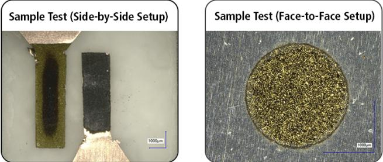
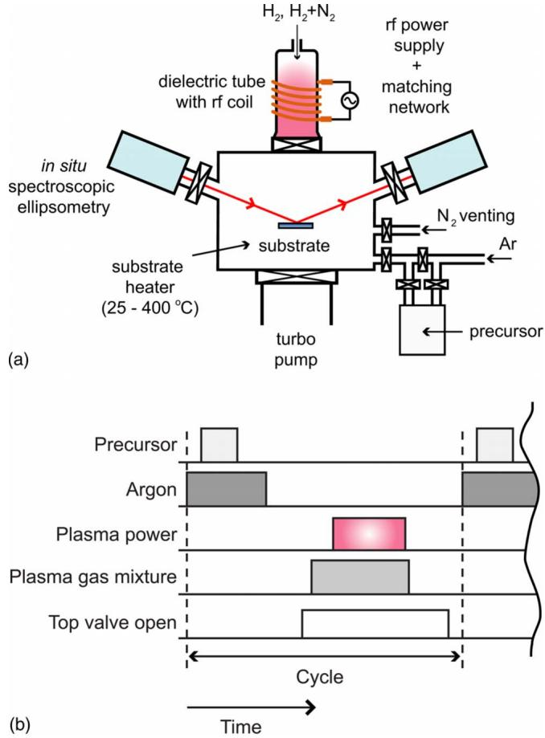
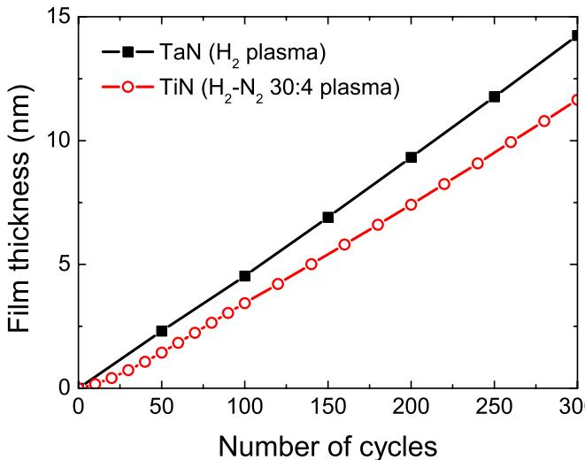
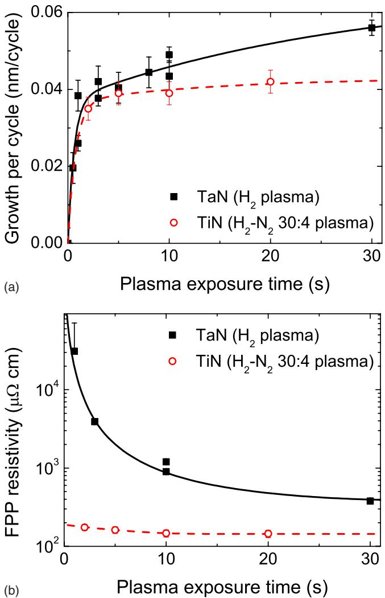
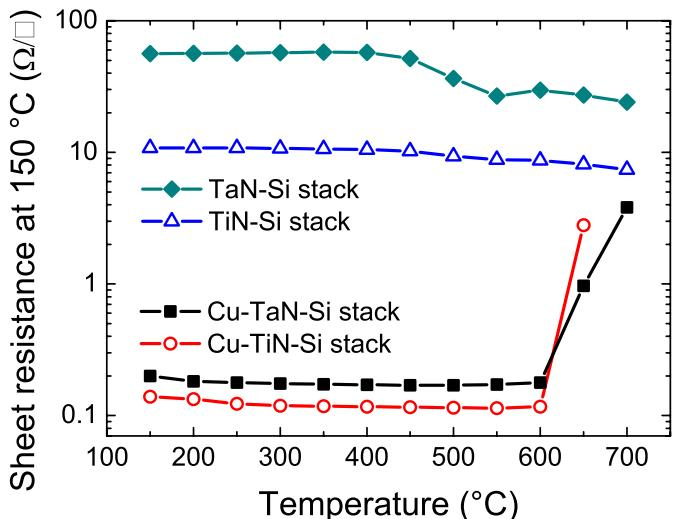
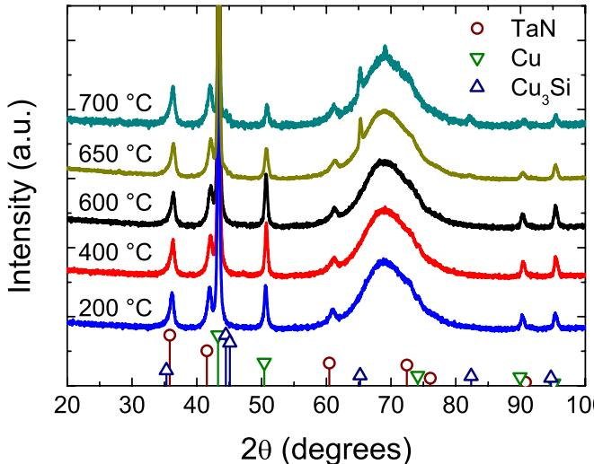
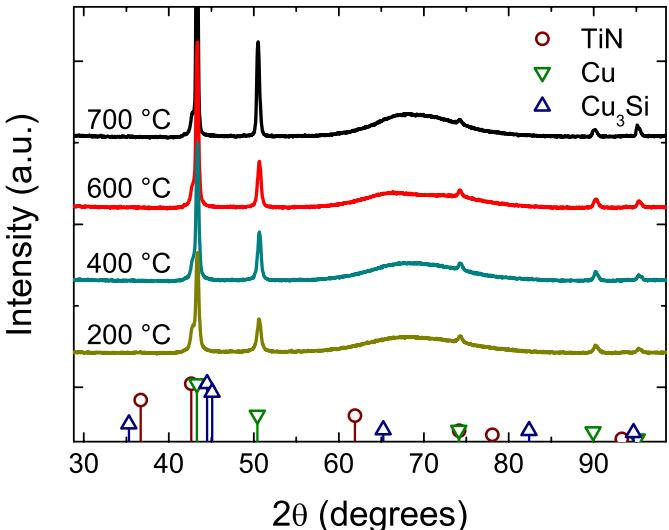
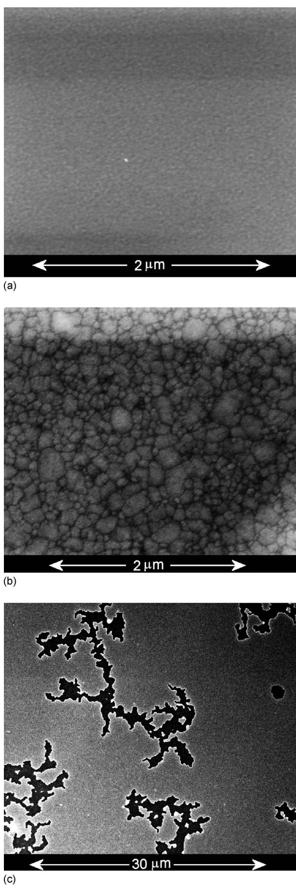
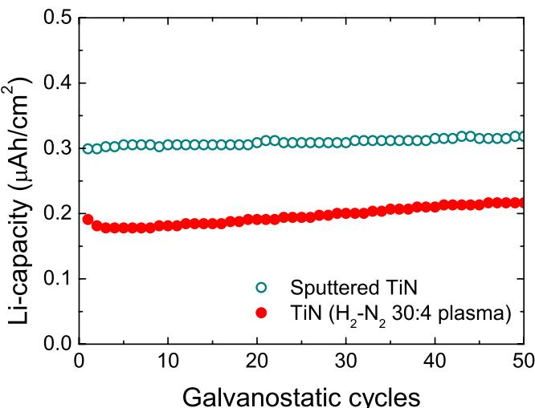

# You may also like

# Deposition of TiN and TaN by Remote Plasma ALD for Cu and Li Diffusion Barrier Applications

Impact of O₂ Concentration on Ultrathin HfO₂ Films Deposited on HF- Cleaned Silicon Using Atomic Layer Deposition with Hf IN (CH₄)₂ (C₂H₅)₂.14 Satoshi Kamiyama, Takayoshi Miura and Yasuo Nara

To cite this article: H. C.M. Knoops et al 2008 J. Electrochem. Soc. 155 G287

Fingering Instability and Maximum Radius at High Rotational Bond Number Ming Wei Wang and J G. Chu Chou

View the article online for updates and enhancements.

A Chemical Reaction Path Design for the Atomic Layer Deposition of Tantalum Nitride Thin Films Jung- Dae Kwon, Jin- Seong Park, Han- Choon Lee et al.

# ECC-Opto-10 Optical Battery Test Cell: Visualize the Processes Inside Your Battery!

Battery Test Cell for Optical Characterization Designed for light microscopy, Raman spectroscopy and XRD.

Optimized, Low Profile Cell Design (Device Height 21.5 mm) Low cell height for high compatibility, fits on standard samples stages.

High Cycling Stability and Easy Handling Dedicated sample holders for different electrode arrangements included!

Cell Lids with Different Openings and Window Materials Available

Contact us: +49 40 79012- 734 sales@tel- cell.com www.ell- cell.com

# Deposition of TiN and TaN by Remote Plasma ALD for Cu and Li Diffusion Barrier Applications

H.C.M.Knoops,a,b,z 
L.Baggetto,b 
E.Langereis,b,\*\*z 
M.C.M.van de Sanden,b 
J.H.Klootwijk,c 
F. Roozeboom,b,\*\* 
R.A.H.Niessen,P.H.L.Notten,b,c,\*\* and 
W.M.M.Kessels\*\*\*

Materials Innovation Institute M2i, 2600 GA Delft, The Netherlands bEindhoven University of Technology, 5600 MB Eindhoven, The Netherlands cPhilips Research, 5656 AE Eindhoven, The Netherlands dNXP- TSMC Research Center, 5656 AE Eindhoven, The Netherlands

TaN and TiN films were deposited by remote plasma atomic layer deposition (ALD) using the combinations of  $\mathrm{Ta[N(CH_3)_2]_5}$  precursor with  $\mathrm{H}_{2}$  plasma and  $\mathrm{TiCl_4}$  precursor with  $\mathrm{H}_{2} - \mathrm{N}_{2}$  plasma, respectively. Both TiN and TiN films had a cubic phase composition with a relatively low resistivity (TaN:  $380~\mu \Omega$  cm; TiN:  $150\mu \Omega$  cm). Dissimilar from the TiN properties, the material properties of the TaN films were found to depend strongly on the plasma exposure time. Preliminary tests on planar substrates were carried out revealing the potential of the TaN and TiN films as Cu and Li diffusion barriers in through- silicon via and silicon- integrated thin- film battery applications, respectively. For the specific films studied, it was found that TiN showed better barrier properties than TaN for both application areas. The TiN films were an effective barrier to Cu diffusion and had no Cu diffusion for anneal temperatures up to  $700^{\circ}\mathrm{C}$ . The TiN films showed low Li intercalation during electrochemical charging and discharging. © 2008 The Electrochemical Society. [DOI: 10.1149/1.2988651] All rights reserved.

Manuscript submitted July 22, 2008; revised manuscript received September 2, 2008. Published October 10, 2008.

Diffusion barrier layers are of key importance to ensure device lifetime and functionality of various components. One area placing stringent demands on the barrier layer is Cu interconnect technology. Here, barrier layers are needed to prevent Cu diffusion into the silicon substrate. Because of scaling down of feature sizes, these films need to be thin  $\sim 5$  to  $10 \mathrm{nm}$  and deposited conformally in features with increasingly higher aspect ratios. Furthermore, the films need to be conductive to maintain sufficient electrical connection to the underlying metallization layer.

Copper diffusion barriers are also needed in the emerging field of three- dimensional (3D) stacked die integration. Here, copper- filled through- silicon vias (TSVs) offer a solution to the "wiring crisis" in next- generation semiconductor devices. 3D integration and, consequently, Cu diffusion barriers are also of strategic relevance for the "More than Moore" approach in which several functionalities and components (computing, processing, storage, transmitting, sensing, etc.) are combined in, for example, "System- in- Package (SiP)" devices.

A development being part of the "More than Moore" approach is research toward 3D integrated solid- state thin- film batteries. These batteries have the potential to provide the high- density storage capacity required for future miniaturized autonomous wireless devices or as a backup power supply in circuits. The batteries are based on Li ions as charge carriers and high aspect ratio structures in silicon to obtain high storage densities. The battery stack consists of several functional layers (diffusion barrier layer, anode, electrode, cathode, current collector) deposited conformally in these 3D structures. Because silicon easily takes up elemental Li, it is an attractive anode material. However, to prevent the loss of Li from the Si anode to the underlying Si substrate while still providing an electrical connection to the anode layer, a conductive and conformal Li diffusion barrier film is required in- between.

As Cu diffusion barrier materials, mainly refractory metallic systems (Ti, Ta, W, Mo, Cr, etc. and their nitrides) are used due to their characteristic chemical inertness and low diffusion rate related to their high melting points. Furthermore, because of the relatively low resistivity of these materials they can be directly used as metal electrodes in capacitor structures and as metal gate electrodes for complementary metal oxide semiconductor. Among these mate rials, TaN and TiN have been considered most often and these materials are known to be good diffusion barriers, especially for Ta. 9,10,12- 14 Both sputtered TaN and TiN have been used as a diffusion barrier for TSV experiments. Note, that the adhesion of Cu on TiN might not be sufficient for the small feature sizes in the more traditional interconnect technology. Nevertheless TiN is considered to be a good candidate for the relatively large vias used in 3D integration.

In this article, we report on TaN and TiN films deposited with remote plasma atomic layer deposition (ALD). In principle, this technique is capable of depositing high- quality films with a good conformality in high aspect ratio structures. Because the microstructure and the composition of the films could have a large influence on the diffusion barrier properties, we have studied the material properties of the deposited TaN and TiN films for various deposition conditions. In addition, preliminary diffusion barrier experiments were carried out on planar wafers to test the performance of TaN and TiN films as Cu and Li diffusion barriers in future SiP applications. Furthermore, by comparing the diffusion barrier properties for both Cu and Li, more insight into the barrier characteristics of TaN and TiN has been obtained.

# Experimental

Remote plasma ALD reactors. The TaN and TiN films investigated and used in the barrier experiments were deposited using two remote plasma ALD reactors. The TaN films were deposited using the homebuilt ALD- I reactor as described extensively by Langereis et al. The TiN films in this work were deposited using the Oxford Instruments FlexAL reactor, and this process is described by Heil et al. In this work, we describe the deposition of both materials and report on the Cu and Li diffusion barrier properties on planar film stacks.

Both ALD reactors have the same basic configuration as schematically represented in Fig. 1a. The reactors consisted of a deposition chamber, a pump unit, an inductively coupled plasma source, and a precursor dosing system. The pump unit and plasma source were connected to the deposition chamber through gate valves. The chamber was pumped by a combination of a turbomolecular pump and a rotary pump reaching a base pressure of  $< 10^{- 5}$  Torr by overnight pumping. The ALD- I reactor was an open- load reactor that could handle wafers with a diameter up to  $100 \mathrm{mm}$ . The FlexAL reactor could handle wafers with diameters up to  $200 \mathrm{mm}$ , and these wafers were loaded through a load lock. Unlike the ALD- I reactor,

  
Figure 1. (Color online) (a) A schematic overview of the basic configuration of the remote plasma ALD reactors. In addition to the different reactor components, the in situ spectroscopic ellipsometer is also shown. (b) A schematic of a typical remote plasma ALD cycle for the deposition of conductive thin films.

the FlexAL reactor had a higher maximum power setting for the plasma source  $600~\mathrm{W}$  instead of  $100~\mathrm{W}$  and was also equipped with mass flow controllers and an automated pressure control valve.

Figure 1b schematically shows a typical ALD cycle used for both processes. The cycle began with the precursor dosage. For the TaN process  $\mathrm{Ta}[\mathrm{N}(\mathrm{CH}_3)_2]_5$  (pentakis(dimethylamino)tantalum, PDMAT) precursor was heated to  $75^{\circ}\mathrm{C}$  and an Ar flow was used to transport the  $\mathrm{Ta}[\mathrm{N}(\mathrm{CH}_3)_2]_5$  vapor into the chamber by bubbling. A dosing time of  $5\mathrm{s}$  was used to obtain saturation. For TiN deposition,  $\mathrm{TiCl_4}$  was dosed using a fast switch valve (minimum switch time was  $10~\mathrm{ms}$ ). Because of the high vapor pressure of  $\mathrm{TiCl_4}$ , only a short dosage time of  $40~\mathrm{ms}$  was required to achieve saturation while keeping the  $\mathrm{TiCl_4}$  at  $30^{\circ}\mathrm{C}$ . After purging with Ar, the gate valve between plasma source and chamber was opened and the plasma ALD half- cycle was started. For the TaN process, an  $\mathrm{H}_2$  plasma was used; for the TiN process, we used an  $\mathrm{H}_2 - \mathrm{N}_2$  plasma. After the plasma step, the next cycle started again with an Ar purge. Table I summarizes the details of the "baseline" conditions used throughout this work.

Thin- film analysis.- In situ spectroscopic ellipsometry (SE) was used to study the thin- film growth during the deposition processes on both ALD reactors. The ellipsometer used was a J.A. Woollam, Inc. M2000U visible and near- infrared  $(0.75 - 5.0\mathrm{eV})$  ellipsometer. A proper modeling of the dielectric function results in an accurate determination of the thickness of the deposited film. Electrical sheet resistance measurements were carried out ex situ at room temperature using a Signatore four- point probe (FPP) in combination with a Keithley 2400 Source Measurement Unit, acting both as cur

Table I. Baseline'deposition conditions for remote plasma ALD of TiN and TaN films.  

<table><tr><td>ALD process</td><td>TiN</td><td>TaN</td></tr><tr><td>ALD reactor</td><td>FlexAL</td><td>ALD-I</td></tr><tr><td>Substrate temperature (°C)</td><td>350</td><td>225</td></tr><tr><td>Precursor:</td><td>TiCl4</td><td>Ta(N(CH3)2)5</td></tr><tr><td>Dosing time (s)</td><td>0.04</td><td>5</td></tr><tr><td>Temperature (°C)</td><td>30</td><td>75</td></tr><tr><td>Ar pressure (mTorr)</td><td>~80</td><td>~30</td></tr><tr><td>Plasma:</td><td></td><td></td></tr><tr><td>Gas mixture</td><td>30 sccm H2</td><td>H2</td></tr><tr><td></td><td>4 sccm N2</td><td></td></tr><tr><td>Pressure (mTorr)</td><td>15</td><td>7.5</td></tr><tr><td>Power (W)</td><td>250</td><td>100</td></tr><tr><td>Exposure time (s)</td><td>5</td><td>10</td></tr></table>

rent source and voltage meter. The resistivity was obtained from the slope of the current- voltage  $(I - V)$  curve, and the film thickness was deduced from the SE measurements. The atomic compositions and areal atomic densities of the films were determined from Rutherford backscattering spectrometry and elastic recoil detection using  $2\mathrm{MeV}^{4}\mathrm{He}^{+}$ ions. Mass densities were calculated from the areal densities using the thickness data obtained by SE. The microstructure of the films was studied using X- ray diffraction (XRD) with a Philips X'Pert MPD diffractometer equipped with a  $\mathrm{CuK}\alpha$  source  $(1.54\mathrm{\AA}$  radiation). The thickness and mass density were corroborated by X- ray reflectometry measurements performed on a Bruker D8 Advance X- ray diffractometer.

Cu and Li diffusion barrier experiments.- For the Cu diffusion barrier experiments, test structures were fabricated by sputter depositing Cu films  $(\sim 50 \mathrm{nm}$  in thickness) onto air exposed barrier films  $(\sim 30 \mathrm{nm}$  in thickness) which were deposited on  $100~\mathrm{mm}$  HF- last n- type silicon wafers (P- doped, resistivity of  $10 - 20\Omega \mathrm{cm}$ ). These stacks were annealed in a vacuum oven  $(< 10^{- 6}$  Torr) together with control stacks that had no Cu film on top. For the FPP resistivity measurements, the samples were heated up to the anneal temperature at a ramp rate of  $5^{\circ}\mathrm{C / min}$ . At the moment the anneal temperature was reached, the samples were cooled down to  $150^{\circ}\mathrm{C}$  at a cooling rate of  $5^{\circ}\mathrm{C / min}$  after which the sample was heated to the next anneal temperature. The anneal temperature was increased in steps of  $50^{\circ}\mathrm{C}$  up to  $700^{\circ}\mathrm{C}$ . During these thermal cycles, the sheet resistance was measured with a FPP from the top side of the test structure. In the analysis of these measurements, the sheet resistance at  $150^{\circ}\mathrm{C}$  was considered to prevent any intrinsic influence of the temperature dependence of the Cu, TaN, TiN, and Si resistivity. The stacks for the XRD measurements were annealed using a slightly different procedure, each stack was individually heated up to the anneal temperature at a ramp rate of  $5^{\circ}\mathrm{C / min}$  and kept at this temperature for  $30\mathrm{min}$ , after which they were slowly cooled inside the furnace.

For the Li diffusion barrier test, cyclic voltammetry was conducted with an Autolab PGSTAT30 (Ecochemie B.V., Utrecht, The Netherlands) and galvanostatic cyclino was performed using a M4300 galvanostat (Maccor, Tulsa, USA). The procedure used was identical to the one described by Baggetto et al. An n- type silicon wafer (Sb- doped, resistivity of  $8 - 22\mathrm{m}\Omega \mathrm{cm}$ ) was used as a substrate to facilitate the electrical connection to the barrier layer. The substrate had a native oxide surface.

# Results and Discussion

Remote plasma ALD of TiN and TaN films.- TiN and TaN films were deposited with various plasma exposure times using the baseline conditions listed in Table I. The resulting material properties are summarized in Table II. The thickness of the TiN and TaN

Table II. The material properties of remote plasma ALD TiN and TaN films for various plasma exposure times. In situ spectroscopic ellipsometry, Rutherford backscattering spectroscopy, and four-point probe measurements were used to determine the material properties. The typical experimental errors are shown in each column; a dash means not measured. The deposition conditions from Table I were used unless indicated otherwise.  

<table><tr><td rowspan="2">Plasma exposure step</td><td rowspan="2">Thickness (nm)</td><td rowspan="2">Growth per cycle (nm/cycle)</td><td rowspan="2">Mass density (g cm-3)</td><td colspan="6">Atomic composition (at %)</td><td rowspan="2">Electrical resistivity (μΩ cm)</td></tr><tr><td>Ti</td><td>Ta</td><td>N</td><td>O</td><td>C</td><td>Cl</td></tr><tr><td>TiN</td><td></td><td></td><td></td><td></td><td></td><td></td><td></td><td></td><td></td><td></td></tr><tr><td>2 s H2-N2</td><td>21.1 ± 0.2</td><td>0.035 ± 0.02</td><td>4.0 ± 0.1</td><td>49 ± 0.1</td><td>—</td><td>46</td><td>2.0</td><td>—</td><td>2.7</td><td>175 ± 15</td></tr><tr><td>5 s H2-N2</td><td>23.2</td><td>0.039</td><td>3.9</td><td>50</td><td>—</td><td>46</td><td>2.0</td><td>—</td><td>1.8</td><td>162</td></tr><tr><td>10 s H2-N2</td><td>23.5</td><td>0.039</td><td>4.0</td><td>50</td><td>—</td><td>47</td><td>2.0</td><td>—</td><td>1.5</td><td>147</td></tr><tr><td>20 s H2-N2</td><td>25.2</td><td>0.042</td><td>—</td><td>—</td><td>—</td><td>—</td><td>—</td><td>—</td><td>—</td><td>145</td></tr><tr><td>10 s H2-N2ac</td><td>31.8</td><td>0.058</td><td>—</td><td>47</td><td>—</td><td>47</td><td>3.5</td><td>—</td><td>1.9</td><td>200</td></tr><tr><td>5 s H2-N2b</td><td>60 ± 0.5</td><td>—</td><td>—</td><td>47</td><td>—</td><td>42</td><td>9</td><td>—</td><td>2</td><td>—</td></tr><tr><td>TaN</td><td></td><td></td><td></td><td></td><td></td><td></td><td></td><td></td><td></td><td></td></tr><tr><td>3 s H2</td><td>26.0 ± 0.5</td><td>0.038 ± 0.02</td><td>9.1 ± 0.5</td><td>—</td><td>42 ± 0.1</td><td>32</td><td>15</td><td>10</td><td>—</td><td>3400 ± 100</td></tr><tr><td>10 s H2</td><td>31.6</td><td>0.049</td><td>10.4</td><td>—</td><td>59</td><td>29</td><td>12</td><td>&amp;lt;2</td><td>—</td><td>1200</td></tr><tr><td>30 s H2</td><td>28.1</td><td>0.056</td><td>12.1</td><td>—</td><td>56</td><td>25</td><td>7</td><td>12</td><td>—</td><td>380</td></tr><tr><td>10 s H2a</td><td>29.2</td><td>0.045</td><td>—</td><td>—</td><td>—</td><td>—</td><td>—</td><td>—</td><td>—</td><td>1550</td></tr><tr><td>10 s H2b</td><td>60</td><td>—</td><td>—</td><td>—</td><td>48</td><td>30</td><td>22</td><td>&amp;lt;2</td><td>—</td><td>—</td></tr></table>

a Films used in Cu-diffusion barrier experiments. b Films used in Li-diffusion barrier experiments. c Film deposited using  $400^{\circ}\mathrm{C}$  substrate temperature and a  $500~\mathrm{W}$  plasma with a  $\mathrm{H}_{2} - \mathrm{N}_{2}$  60-8 sccm) gas mixture at  $\sim 19\mathrm{mTorr}$

films is shown as a function of the number of cycles in Fig. 2. Both TiN and TaN show a linear increase in thickness with the number of cycles.

The TiN properties showed almost no dependence on the plasma exposure time, only a slight decrease in Cl content and decrease in resistivity was observed for longer plasma exposures. The TiN films investigated had an [N]/[Ti] ratio of  $0.93\pm 0.02$  and all contained a relatively low level of impurities.24 This is in agreement with previous work where the combination of  $\mathrm{TiCl_4}$  and  $\mathrm{H}_2\mathrm{- N}_2$  plasma showed excellent material properties compared to other ALD TiN processes.26 Note that, for the Cu diffusion barrier experiments, slightly different deposition conditions were used  $400^{\circ}\mathrm{C}$  substrate temperature and a  $500~\mathrm{W}$  plasma with a  $\mathrm{H}_2\mathrm{- N}_2$  60- 8 sccm) gas mixture), which resulted in a slight increase in growth rate and resistivity.

  
Figure 2. (Color online) The thickness of the TaN and TiN films as a function of number of ALD cycles. The thicknesses have been determined by in situ spectroscopic ellipsometry.

The TaN properties depend strongly on the plasma exposure time. This can be explained by the fact that TaN can exist in many crystal phases, depending on the  $[\mathrm{Ta}] / [\mathrm{N}]$  ratio. Stable crystal phases ranging from conductive  $\mathrm{Ta}_2\mathrm{N}$  to semiconductive  $\mathrm{Ta}_3\mathrm{N}_5$  have been reported.27 The TaN films obtained with a  $3\mathrm{~s~H}_{2}$  plasma were reasonably conductive  $(3400\mu \Omega \mathrm{cm})$  had a relatively low  $Nu$  content of  $32\%$  and had the cubic crystal phase (see below). The  $Nu$  content further reduced down to  $25\%$  when the plasma exposure time was increased, which also resulted in a higher mass density and lower resistivity as low as  $380\mu \Omega \mathrm{cm}$  Table II.  $\mathrm{H}_2\mathrm{- N}_2$  mixtures and  $\mathrm{NH_3}$  were also used as the plasma gasses, but these conditions resulted in a large increase in resistivity (e.g.,  $1.1\times 10^{4}\mu \Omega \mathrm{cm}$  for a  $98:2\mathrm{H}_2\mathrm{- N}_2$  plasma) and even led to the semiconducting  $\mathrm{Ta}_3\mathrm{N}_5$  phase.23 Because our interest lies in conductive barrier films, only films deposited by  $\mathrm{H}_{2}$  plasma were investigated in the current work.

Figures 3a and b show the growth per cycle and FPP resistivity of the films as a function of plasma exposure time. During the first few seconds of plasma exposure, both processes show a large increase in the growth per cycle after which saturation takes place. For TiN a so- called soft saturation behavior is observed while the saturation in growth per cycle is much clearer for the TiN case. This soft saturation can be explained by the aforementioned dependence of the material properties on the plasma exposure time (see Table II).23 The change in material properties for TaN is also evident by the large change in resistivity with plasma exposure time (Fig. 3b). For TiN, only minor changes take place that can be attributed to a small reduction in the Cl- impurity content.

The microstructure of the films was investigated by XRD and the measured spectra for TaN and TiN films deposited under the baseline conditions of Table I are given in Fig.4. For both films, it is clear that the material has a cubic phase structure as can be concluded from the comparison to the powder sample data.28 Both the TaN and TiN films show a strong preferential (200) growth direction compared to the powder sample. Fréty et al. found that sputtered TaN also showed a preferential (200) growth direction depending on the  $\mathbb{N}_2$  pressure during deposition.22 For a TaN film of 800 cycles deposited using  $\mathrm{H}_{2}$  plasma and  $\mathrm{Ta}[\mathrm{N}(\mathrm{CH}_3)_2]_5$  precursor, Kim et al. found no preferential direction,17 while Park et al. reported an increase of the (200) peak intensity using longer plasma exposures and

  
Figure 3. (Color online) (a) The growth per cycle and (b) the FPP resistivity of TaN and TiN films as a function of the plasma exposure time in the ALD cycle. The lines serve as guides to the eyes.

terbutylimidotris(diethylamido)tantalum precursor.19 For sputtered TiN, a strong preferential orientation was found as well but in the (111) direction.14 In previous work, we found that for ALD TiN the preferential (200) growth direction disappears when a lower deposition temperature of  $100^{\circ}\mathrm{C}$  was used.19 As can be seen from these literature comparisons, the microstructure depends largely on the deposition method and the process conditions used.

Cu diffusion barrier properties.- The Cu diffusion barrier properties were studied in an experiment in which Cu diffusion through the barrier layer was monitored as a function of temperature in order to determine the barrier failure temperature. Evidently, a higher failure temperature indicates a higher barrier quality. Test structures were fabricated by sputter depositing Cu films onto the barrier layers as described in the experimental details. The TaN and TiN film were deposited on the Si substrates, where TaN was deposited using the baseline conditions (Table I), and the TiN film was deposited under slightly modified conditions (i.e.,  $400^{\circ}\mathrm{C}$  deposition temperature,  $500~\mathrm{W}$  plasma with 60 sccm  $\mathrm{H}_2$  and 8 sccm  $\mathrm{N}_2$  ). These conditions result in very similar material properties as shown for the baseline conditions (Table II).

For both barrier materials, two different experiments were carried out. First, the sheet resistance of a Cu- barrier- Si stack was monitored as a function of anneal temperature. Variation of Cu sheet resistance with anneal temperature is known to provide a good measure of barrier performance.14,22,29,30 Barrier failure leads to a sig nificant change in resistivity due to the formation of poorly conductive  $\mathrm{Cu}_3\mathrm{Si}$ , 14,20,22,29 which will result in an increase in the sheet resistance due to the concurrent loss of  $\mathrm{Cu}$ . As a reference, the sheet resistance of a barrier- Si stack was also measured to find possible annealing effects and to investigate the thermal stability of the barrier material itself.

  
Figure 4. (Color online) XRD spectra for (a) a  $91~\mathrm{nm}$  thick TaN film and (b) a  $60~\mathrm{nm}$  thick TiN film. The diffraction patterns for cubic powder samples are also given.

Figure 5 shows the sheet resistance at  $150^{\circ}\mathrm{C}$  of the TaN- Si, TiN- Si, Cu- TaN- Si, and the Cu- TiN- Si stacks as a function of anneal temperature. The resistance of the TaN- Si stack decreases for temperatures of  $>400^{\circ}\mathrm{C}$ . The fact that this occurs at  $400^{\circ}\mathrm{C}$  instead of just above the deposition temperature  $(225^{\circ}\mathrm{C})$  demonstrates the thermal stability of the TaN. A similar but less pronounced annealing effect is visible for the TiN- Si stack possibly related to the higher deposition temperature of  $400^{\circ}\mathrm{C}$ . Because of the Cu film, the Cu- TaN- Si and Cu- TiN- Si stacks show a very low sheet resistance  $(0.2\Omega /\square$  and  $0.1\Omega /\square$ , respectively), which is lost for both barriers for annealing temperatures of  $>600^{\circ}\mathrm{C}$ , when the sheet resistance suddenly increases.

To attribute the change in sheet resistance with annealing to barrier failure or another effect, a second experiment was performed; XRD spectra were measured for the stacks after annealing at different temperatures. These spectra should reveal possible  $\mathrm{Cu}_3\mathrm{Si}$  formation and the concurrent loss of  $\mathrm{Cu}$ . For completeness, it should be noted that the XRD spectra for the annealed TaN and TiN films

  
Figure 5. (Color online) The sheet resistance at  $150^{\circ}\mathrm{C}$  of the TaN-Si, TiN-Si, Cu-TaN-Si, and Cu-TiN-Si stacks after heating to the anneal temperature indicated at the horizontal axis. The annealing temperature was increased in steps of  $50^{\circ}\mathrm{C}$  up to a maximum temperature of  $700^{\circ}\mathrm{C}$ .

without a Cu layer (not shown) were indistinguishable from the original (not- annealed) film. This indicates that the reduction in resistivity of the TiN and TaN in the TiN- Si and TaN- Si stacks shown in Fig. 5 is not caused by a measurable change in microstructure.

The XRD spectra for the Cu- TaN- Si stacks annealed at 200, 400, 600, 650, and  $700^{\circ}\mathrm{C}$  are shown in Fig. 6. The most intense lines for the diffraction patterns of powder samples of cubic TaN, Cu, and  $\mathrm{Cu_3Si}$  are also indicated in Fig. 6. Three observations can be made when comparing the XRD spectra: (i) the TaN lines are not affected by the anneal, (ii) the intensity of the Cu lines drops for the samples annealed at 650 and  $700^{\circ}\mathrm{C}$  and, most importantly, (iii)  $\mathrm{Cu_3Si}$  lines appear for the samples annealed above  $600^{\circ}\mathrm{C}$ . These  $\mathrm{Cu_3Si}$  lines are best visible at 20 values of 65 and  $82^{\circ}$ . These observations are therefore in agreement with the result obtained by the sheet resistance measurements (i.e., between 600 and  $650^{\circ}\mathrm{C}$  Cu starts diffusing through the TaN film and the barrier fails).

  
Figure 6. (Color online) XRD spectra of Cu-TaN-Si stacks with  $50~\mathrm{nm}$  of  $\mathrm{Cu}$  and  $29~\mathrm{nm}$  of TaN. Spectra are given for samples annealed at 200, 400, 600, 650, and  $700^{\circ}\mathrm{C}$ . The most intense lines for the diffraction pattern of cubic TaN, Cu, and  $\mathrm{Cu_3Si}$  powder samples are indicated. The spectra are shifted vertically for clarity.

  
Figure 7. (Color online) XRD spectra of Cu-TiN-Si stacks with  $50~\mathrm{nm}$  of  $\mathrm{Cu}$  and  $32~\mathrm{nm}$  of TiN. Spectra are given for samples annealed at 200, 400, 600, and  $700^{\circ}\mathrm{C}$ . The most intense lines for the diffraction pattern of cubic TiN, Cu, and  $\mathrm{Cu_3Si}$  powder samples are indicated. The spectra are shifted vertically for clarity.

For sputtered TaN films ranging from 25 to  $50~\mathrm{nm}$  thick, it has been reported that Cu diffusion starts between 650 and  $700^{\circ}\mathrm{C}$ , where the rate of diffusion is lower for films with higher N content. Kim et al. reported a failure temperature of  $800^{\circ}\mathrm{C}$  for a  $12~\mathrm{nm}$  thick  $\mathrm{TaN_{0.75 - 0.8}}$  film deposited by ALD using a  $5\mathrm{~s~H_2}$  plasma. The same group also reported that similar to sputtered barrier films an increase in N content further increases the failure temperature. However, it should also be noted that increasing the N content of the TaN film increases the resistivity, which can be undesirable in barrier applications. Our results are in qualitative agreement with those reported in literature, considering the fact that a lower failure temperature  $(600 - 650^{\circ}\mathrm{C})$  was observed for TaN films with lower N content  $(\mathrm{TaN_{0.49}}$ , Table II). Moreover, a difference in microstructure can also have a large effect on failure temperature. We observed a preferential (200) growth direction while Kim et al. did not report such a preferential growth direction. This is a factor that likely contributes to the difference in failure temperature because a strong preferential growth can be related to a columnar microstructure, which gives rise to fast diffusion pathways.

The XRD spectra for the Cu- TiN- Si stacks annealed at 200, 400, 600, and  $700^{\circ}\mathrm{C}$  are shown in Fig. 7. The most intense lines for the diffraction patterns of powder samples of cubic TiN, Cu, and  $\mathrm{Cu_3Si}$  are also indicated in Fig. 7. Two conclusions can be drawn when comparing the XRD spectra: the TiN lines are not affected by the anneal and the Cu lines become more intense and narrower for higher anneal temperatures. Most importantly, no Cu- Si lines are observed, which points to no barrier failure up to a temperature of  $700^{\circ}\mathrm{C}$ .

To further investigate the evolution of the Cu in the stack with anneal temperature for both the Cu- TaN- Si and Cu- TiN- Si stacks, the intensity of the strong  $\mathrm{Cu(111)}$  peak  $(2043.3^{\circ})$  was determined and the crystallite size was obtained from the full width at half maximum of this peak using Scherrer's equation. Figures 8a and b show the intensity and the crystallite size vs anneal temperature for  $\mathrm{Cu(111)}$  in the Cu- TaN- Si and Cu- TiN- Si stacks, respectively. The Cu peak intensity shows an increase with anneal temperature for both TaN and TiN up to  $600^{\circ}\mathrm{C}$ , indicating Cu crystallization. The Cu crystallization is in agreement with the FPP results in Fig. 5, showing a small decrease in resistance. Similar increases in  $\mathrm{Cu(111)}$  intensity have been reported in the literature. Above an anneal temperature of  $600^{\circ}\mathrm{C}$ , the Cu peak intensity from the Cu-

  
Figure 8. (Color online) Peak intensity and crystallite size (derived using Scherrer's equation) of the  $\mathrm{Cu(111)}$  peak in the XRD spectra for a  $\mathrm{Cu - }$  TaN-Si (Fig. 6) and b)  $\mathrm{Cu - }$  TiN-Si (Fig. 7) stacks annealed at different temperatures.

$\mathrm{TaN - Si}$  stack shows a strong decrease as also expected from the  $\mathrm{Cu_3Si}$  peak appearance and the strong increase in sheet resistance. A completely different behavior is observed for  $\mathrm{Cu}$  in the  $\mathrm{Cu - TiN - Si}$  stack. The intensity increases strongly while the crystallite size also increases slightly, especially for a temperature of  $>600^{\circ}\mathrm{C}$ . This suggests a strong crystallization behavior that can be related to high bulk diffusion inside the  $\mathrm{Cu}$  above  $600^{\circ}\mathrm{C}$  due to its low melting point  $(1085^{\circ}\mathrm{C})$ .

Because no  $\mathrm{Cu_3Si}$  peaks are formed and the  $\mathrm{Cu}$  peak intensity is not decreasing for the  $\mathrm{Cu - TiN - Si}$  stack, the increase in sheet resistance for temperatures of  $>600^{\circ}\mathrm{C}$  in Fig. 5 cannot be explained by the loss of  $\mathrm{Cu}$ . Figure 9 shows scanning electron microscope (SEM) images of the surface of the  $\mathrm{Cu - TiN - Si}$  stack; the as- deposited film (Fig. 9a) shows a smooth surface compared to the annealed  $(700^{\circ}\mathrm{C})$ $\mathrm{Cu}$  surface (Fig. 9b), which reveals a clear roughening of the  $\mathrm{Cu}$  film. Annealing is reported to cause roughening of  $\mathrm{Cu}$  films on poorly wettable surfaces such as TiN.33,34 When a larger area is observed (30  $\mu \mathrm{m}$  width, Fig. 9c), a discontinuous  $\mathrm{Cu}$  film is visible. The discontinuous  $\mathrm{Cu}$  film explains why the resistance increases for temperatures of  $>600^{\circ}\mathrm{C}$ . Because of the large crystallite growth above  $600^{\circ}\mathrm{C}$ , poorly connected islands are formed, resulting in an increase in sheet resistance. Apparently the  $50\mathrm{nm}$ $\mathrm{Cu}$  film is not thick enough to prevent this effect. Contrary to TiN, Ta- rich  $\mathrm{TaN}$ , which is used for the  $\mathrm{Cu - TaN - Si}$  stacks, has been reported to have excellent wettability for  $\mathrm{Cu}$ . For TiN, the resistance increase is therefore not caused by  $\mathrm{Cu}$ . A diffusion through the barrier, suggesting excellent barrier properties will be method to improve the wettability of TiN by surface treatments will be reported in a future publication.37

For stacks with  $25~\mathrm{nm}$  of sputtered TiN, failure temperatures were reported ranging from  $>550$  to  $>750^{\circ}\mathrm{C}$  for increasing TiN mass density  $(4.99 - 5.12\mathrm{g}\mathrm{cm}^{- 3})$ . It is interesting to note that the density of the films in our work is lower  $(4.0\mathrm{g}\mathrm{cm}^{- 3}$ , Table II) while the barrier properties are still good up to  $700^{\circ}\mathrm{C}$ . Uhm and Jeon reported a resistance increase using FPP measurements at temperatures above  $600^{\circ}\mathrm{C}$ ,  $\mathrm{Cu_3Si}$  peaks in XRD spectra at  $550^{\circ}\mathrm{C}$ , and small defects using an etch pit test at  $500^{\circ}\mathrm{C}$  for ALD TiN films deposited at  $450^{\circ}\mathrm{C}$  using  $\mathrm{TiCl_4}$  and  $\mathrm{NH_3}$ . Comparing these failure temperatures to our results indicate excellent barrier properties for the TiN films deposited by remote plasma ALD.

Li diffusion barrier properties.- In 3D integrated all- solid- state batteries, the barrier layers must prevent diffusion of Li from the active battery layers into the substrate over the entire electrochemical potential range used. A thin barrier layer is desired (10- 100 nm) while maintaining the barrier properties and sufficient electrical conduction. Baggetto et al. reported the feasibility of using sputtered TiN and TiN films as planar Li diffusion barriers. To assess the prospects of using high aspect ratio  $(>5)$  structures in future 3D batteries, TaN and TiN films deposited with ALD were investigated in this work.

To do so, the electrochemical properties of  $60~\mathrm{nm}$  thick planar TiN and TaN films deposited by remote plasma ALD under the baseline conditions were studied (see Table I and II). Figure 10 shows cyclic voltammograms of the films measured in a Li- containing electrolyte solution under the experimental conditions as described by Baggetto et al. The TiN film shows a very low current over the entire potential range, indicating low reactivity toward Li and demonstrating its capability as Li diffusion barrier. The reactivity of the TaN film is much higher than that of the TiN film, as indicated by the intensity of the current peaks at  $- 1$  and  $1.5\mathrm{V}$ . These peaks can be ascribed to tantalate structures, such as  $\mathrm{Ta}_2\mathrm{O}_5$ , which are known to be active intercalation materials below  $1.5\mathrm{V}$ . As can be seen from the atomic composition (Table II), a significant fraction of oxygen is present in the TaN films. When the TaN film is exposed to cycles of constant- current charging and discharging, an experiment that provides information about the amount of charge involved during continuous cycling, an intercalation response into silicon is observed after a few cycles (not presented here). This response means that the actual TaN films do not prevent the penetration of Li ions into the bulk of silicon. For the TiN film, the barrier performs well under this galvanostatic cycling and it has an even lower Li intercalation capacity than a  $70~\mathrm{nm}$  thick sputtered TiN film as shown in Fig. 11.

Obviously, for the TaN film, the reactivity toward Li is too high. However, because TaN can have a wide range of compositions, tuning the composition might provide adequate barrier properties for certain TaN films deposited by ALD. From the current results, it is already clear that TiN deposited by remote plasma ALD is a very promising candidate for Li diffusion barrier applications. For sputtered films, TiN also showed better characteristics than TaN, while the ALD grown TiN films exhibit an even lower Li capacity.

# Conclusions

Remote plasma ALD of TaN and TiN films has been investigated using the combinations of  $\mathrm{Ta[N(CH_3)_2]_5}$  precursor with  $\mathrm{H}_2$  plasma and  $\mathrm{TiCl_4}$  precursor with  $\mathrm{H}_2\mathrm{- N}_2$  plasma, respectively. Cubic metal nitride films with a relatively low electrical resistivity (TaN:  $380\mu \Omega \mathrm{cm}$ ; TiN:  $150\mu \Omega \mathrm{cm}$ ) can be deposited for both materials with the properties of the TaN material strongly depending on the plasma exposure time.

Furthermore, diffusion barrier tests have been carried out with respect to the anticipated application of the materials as  $\mathrm{Cu}$  and  $\mathrm{Li}$  diffusion barriers. TaN films show a good  $\mathrm{Cu}$  barrier performance up to  $600^{\circ}\mathrm{C}$ , as found by FPP and XRD experiments. For TiN films, no  $\mathrm{Cu}$  diffusion was observed up to a temperature of  $700^{\circ}\mathrm{C}$ . However,

  
Figure 9. SEM images of the Cu-TiN-Si stack: (a) the smooth as-deposited Cu film and (b) the roughened Cu film after annealing at  $700^{\circ}\mathrm{C}$ . (c) The as-deposited closed Cu film has become discontinuous after annealing, exposing areas of the underlying surface.

  
Figure 10. (Color online) Cyclic voltammetric scans at  $1\mathrm{mV / s}$  of  $60~\mathrm{nm}$  thick TaN and TiN films showing the reaction of the films toward Li ions.

  
Figure 11. (Color online) Galvanostatic cycling for TiN prepared by sputtering and remote plasma ALD at a constant current of  $3\mu \mathrm{A} / \mathrm{cm}^2$ . The remote plasma ALD TiN film shows a lower capacity for Li, indicating better barrier properties.

In this case the Cu film became discontinuous at annealing temperatures of  $>600^{\circ}\mathrm{C}$  due to roughening, causing a large increase in electrical resistance.

The first Li diffusion barrier experiments show that the TiN film is a very promising Li barrier, whereas the TaN barrier layers need further improvement. Consequently, both Cu and Li diffusion barrier experiments indicate better barrier properties for the TiN films, suggesting that the TiN films prepared by remote plasma ALD yields an overall better barrier performance than the TaN films prepared by remote plasma ALD. Although it is unclear for the moment whether the difference in Cu barrier performance is an intrinsic material property or due to the difference in process conditions used (such as halide precursor at high substrate temperature of  $400^{\circ}\mathrm{C}$  for TiN and metallorganic precursor at lower substrate temperature of  $225^{\circ}\mathrm{C}$  for TaN), future work will focus on TiN addressing its barrier properties when deposited in high aspect ratio structures required for future 3D- SiP devices.

# Acknowledgments

The sputter deposition of thin Cu layers and the diffusion barrier tests were carried out by Philips Research. Determination of the film

composition and microstructure was carried out at the Philips Research Materials Analysis Lab. Dr. S. B. S. Heil and W. Keuning are acknowledged for their contribution to the measurements and for the insightful discussions. This work was sponsored by the Materials Innovation Institute M2i under project no. MC3.06278 (the former Netherlands Institute for Metals Research), and by SenterNovem (project 'INNOVia', no. IS004041).

Eindhoven University of Technology assisted in meeting the publication costs of this article.

# References

1. Handbook of 3-D Integration: Technology and Applications of 3D Integrated Circuits, P. Garrou, C. Bower, and P. Ramm, Editors, John Wiley & Sons, New York (2008). 
2. Spiesshoefer, Z. Rahman, G. Vangara, S. Polamreddy, S. Burkett, and L. Schaper, J. Vac. Sci. Technol. A, 23, 824 (2005). 
3. J. U. Knickerbocker, C. S. Patel, P. S. Andry, C. K. Tsang, L. P. Buchwalter, E. J. Strogis, H. Gan, R. R. Horon, R. J. Polastre, S. L. Wright, et al., IEEE J. Solid-State Circuits, 41, 1718 (2006). 
4. S. L. Burkett, X. Qiao, D. Temple, B. Stoner, and G. McGuire, J. Vac. Sci. Technol. B, 22, 248 (2004). 
5. F. Roozeboom, A. L. A. M. Kemmeren, J. F. C. Verhoeven, F. C. van den Heuvel, J. Klootwijk, H. Kretschman, T. Fric, E. C. E. van Grunsven, S. Bardy, C. Bunel, et al., Thin Solid Films, 504, 391 (2006). 
6. P. H. L. Notten, F. Roozeboom, R. A. H. Niessen, and L. Baggetto, Adv. Mater. (Weinheim, Ger., 19, 4564 (2007). 
7. L. Baggetto, R. A. H. Niessen, F. Roozeboom, and P. H. L. Notten, Adv. Funct. Mater., 18, 1057 (2008). 
8. M. Armand and J. M. Tarazon, Nature (London), 451, 652 (2008). 
9. A. E. Kaloyeros and E. Tarazon, Annu. Rev. Mater. Sci., 30, 363 (2000). 
10. Y. Shacham-Diamand, E. Eisenbraun, Mater., 30, 336 (2001). 
11. F. Fillot, T. Morel, S. Minova, I. Matko, S. Maitrejean, B. Guillaumot, B. Chenevier, and T. Billon, Micromagnetron. Eng., 82, 248 (2005). 
12. H. Kim, J. Vac. Sci. Technol. B, 21, 2231 (2003). 
13. G. S. Chen, P. Y. Lee, and S. T. Chen, Thin Solid Films, 353, 264 (1999). 
14. W. H. Lee, Y. L. Kuo, H. J. Huang, and C. P. Lee, Mater. Chem. Phys., 85, 444 (2004).

15. S. Spiesshoefer, J. Patel, T. Lam, L. Cai, S. Pollamreddy, R. F. Figueroa, S. L. Burkett, L. Schaper, R. Geil, and B. Rogers, J. Vac. Sci. Technol. A, 24, 1277 (2006). 
16. H. Kim, A. J. Kellock, and S. M. Rossnagel, J. Appl. Phys., 92, 7080 (2002). 
17. H. Kim, C. Detavenier, O. van der Straten, S. M. Rossnagel, A. J. Kellock, and D. G. Park, J. Appl. Phys., 98, 014308 (2005). 
18. J. S. Park, M. J. Lee, C. S. Lee, and S. W. Kang, Electrochem. Solid-State Lett., 4, C17 (2001). 
19. J. S. Park, H. S. Park, and S. W. Kang, J. Electrochem. Soc., 149, C28 (2002). 
20. H. Kim, C. Lavoie, M. Copel, V. Narayanan, D. G. Park, and S. M. Rossnagel, J. Appl. Phys., 95, 5848 (2004). 
21. S. M. Rossnagel and H. Kim, J. Vac. Sci. Technol. B, 21, 2550 (2003). 
22. N. Fréty, F. Bernard, J. Nazon, J. Sarradin, and J. C. Tedenac, J. Phase Equilib. Diffus., 27, 590 (2006). 
23. E. Langereis, H. C. M. Knoops, A. J. M. Mackus, F. Roozeboom, M. C. M. van de Sanden, and W. M. M. Kessels, J. Appl. Phys., 102, 083517 (2007). 
24. S. B. S. Heil, J. L. Hemmen, C. J. Hodson, N. Singh, J. H. Klootwijk, F. Roozeboom, M. C. M. van de Sanden, and W. M. M. Kessels, J. Vac. Sci. Technol. A, 25, 1357 (2007). 
25. E. Langereis, S. B. S. Heil, M. C. M. van de Sanden, and W. M. M. Kessels, J. Appl. Phys., 100, 023534 (2006). 
26. S. B. S. Heil, E. Langereis, F. Roozeboom, M. C. M. van de Sanden, and W. M. M. Kessels, J. Electrochem. Soc., 153, G956 (2006). 
27. C. Stampfland, A. J. Freeman, Phys. Rev. B, 67, 064108 (2003). 
28. International Centre for Diffraction Data Powder Diffraction File no. 2 (PDF-2), http://www.icdd.com (2006). 
29. W. L. Yang, W. F. Wu, D. G. Liu, C. C. Wu, and K. L. Ou, Solid-State Electron., 45, 149 (2001). 
30. J. C. Lin and C. Lee, J. Electrochem. Soc., 146, 3466 (1999). 
31. C. Lee and Y. L. Kuo, JOM, 59, 44 (2007). 
32. V. Uvarov and I. Popov, Mater. Charact., 58, 883 (2007). 
33. U. Uvarov, J. M. Peran, Acta Mater., 44, 307 (1996). 
34. P. Xie and B. Dery, Acta T. Mater. Med., Phys. Rev. B, 47, 3868 (1993). 
35. I. M. Rycroft and B. L. Evans, Thin Solid Films, 291, 283 (1996). 
36. A. Furuya, H. Tsuda, and S. Ogawa, J. Vac. Sci. Technol. B, 23, 979 (2005). 
37. M. Saadaoui, H. M. Sarro, F. Roozeboom, and W. M. M. Kessels, To be published. 
38. J. Uhm and H. Jeon, Jpn. J. Appl. Phys., Part 1, 40, 4657 (2001). 
39. Z. W. Fu, F. Huang, Y. Q. Chu, Y. Zhang, and Q. Z. Qin, J. Electrochem. Soc., 150, A776 (2003).