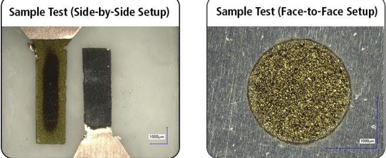
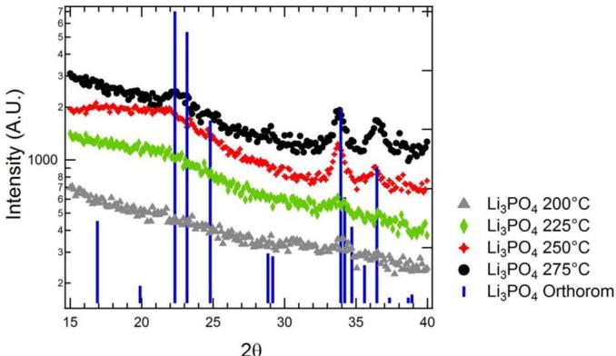
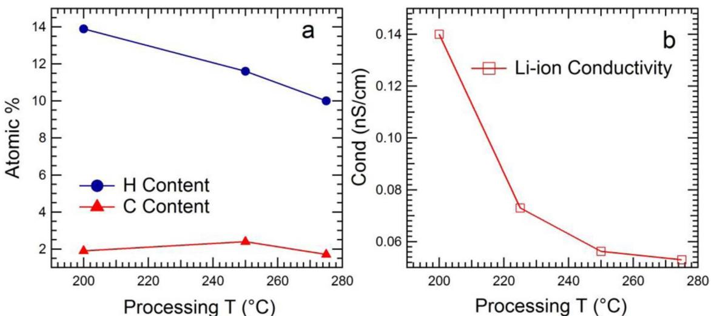
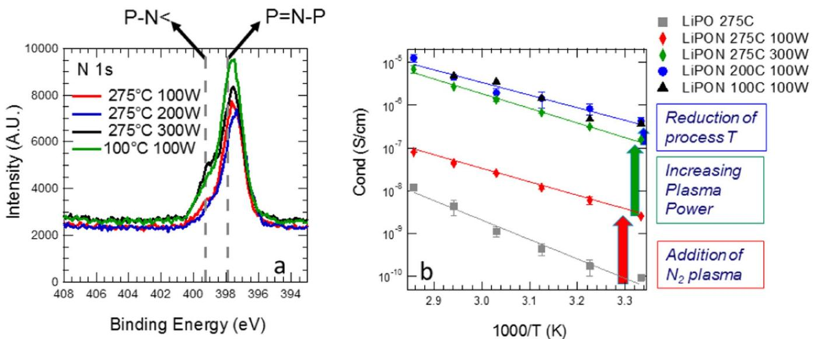
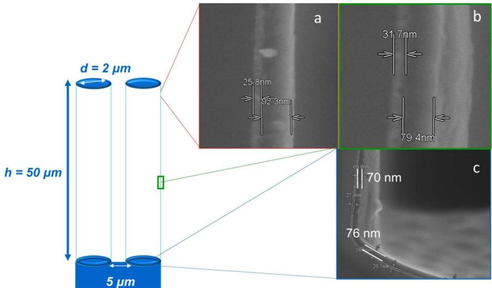
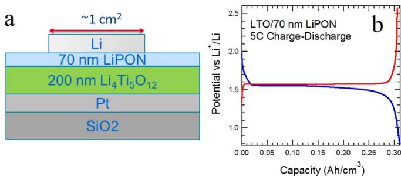

# You may also like

# Plasma-Assisted ALD of LiPO(N) for Solid State Batteries

- All-solid-state thin-film batteries based on lithium phosphorus oxynitrides Wangqi Dai, Yan Qiao, Ziqiang Ma et al.

To cite this article: B. Put et al 2019 J. Electrochem. Soc. 166 A1239

- Thermal Atomic Layer Deposition of Lithium Phosphorus Oxynitride as a Thin- Film Solid Electrolyte Satoshi Shibata

View the article online for updates and enhancements.

- Electro-organic LiPO(N) Thin- Film Coating on Thermal Behavior of Delithiated Li, Ni, Co, Mn, Zr, O₂, Cathode Yoon- Soo Park, Kwari- Ho Choi, Hong- Kyu Park et al.

# ECC-Opto-10 Optical Battery Test Cell: Visualize the Processes Inside Your Battery!

- Battery Test Cell for Optical Characterization Designed for light microscopy, Raman spectroscopy and XRD.

- Optimized, Low Profile Cell Design (Device Height 21.5 mm) Low cell height for high compatibility, fits on standard samples stages.

- High Cycling Stability and Easy Handling Dedicated sample holders for different electrode arrangements included!

- Cell Lids with Different Openings and Window Materials Available

Contact us: +49 40 79012- 734 sales@el- cell.com www.el- cell.com

# Plasma-Assisted ALD of LiPO(N) for Solid State Batteries

B. Put,  $\oplus^{1,2,4}$  
M. 
J. Mees,2 
N. Hornsveld,1 
S. Hollevoet,2,3 
A. Sepulveda,2 
P. 
M. Vereecken,2,3, 
W. 
M. 
M. Kesses,1,\* and 
M. Creatore

$^{1}$ Department of Applied Physics, Eindhoven University of Technology, 5600 MB, Eindhoven, The Netherlands  $^{2}$ imec, Leuven 3001, Belgium  $^{3}$ Centre for Surface Chemistry and Catalysis, Leuven University, Leuven 3001, Belgium

All solid state 3D batteries are pursued for their increased safety and high power capabilities. At present conformal coating of the solid electrolyte remains one of the key hurdles for the implementation of such devices. In the present work we investigate atomic layer deposition (ALD) as means of conformal deposition of lithium phosphate  $(\mathrm{Li}_3\mathrm{PO}_4)$  and nitrogen- doped lithium phosphates (LiPON). These processes are characterized here to obtain the highest possible Li- ion conductivity.  $\mathrm{Li}_3\mathrm{PO}_4$  is shown to yield a conductivity of  $10^{- 10}\mathrm{S / cm}$  at  $25^{\circ}C$ . On the other hand, an optimized LiPON process gave rise to a Li- ion conductivity of  $5\cdot 10^{- 7}\mathrm{S / cm}$  at  $25^{\circ}C$ . In addition, good conformality of the LiPON process was shown on high aspect ratio pillars. Furthermore, a solid state battery device was fabricated comprising a  $\mathrm{Li}_4\mathrm{Ti}_5\mathrm{O}_{12}$  cathode, a  $70~\mathrm{nm}$  thick ALD LiPON solid electrolyte and a metallic lithium anode. This finding indicates that a layer down to  $70~\mathrm{nm}$  can be made pinhole free.  $\odot$  2019 The Electrochemical Society. [DOI: 10.1149/2.1191906jes]

Manuscript submitted December 11, 2018; revised manuscript received March 27, 2019. Published April 12, 2019. This was Paper 347 presented at the Honolulu, Hawaii, Meeting of the Society, October 2- 7, 2016.

Research into solid state 3D batteries has recently attracted a lot of attention as alternative for current liquid battery cells.1,2 This is driven by their high capacity and power density which should enable fast charging rates in combination with high capacity. Furthermore, the all- solid state concept removes the flammable liquid electrolyte from the cell which greatly benefits its safety.

A nanoscale 3D solid state cell was recently demonstrated.3,4 One of the main challenges when fabricating such device is the conformality of the layers on large area substrates. This is especially critical for the solid electrolyte, as a single pinhole will short circuit the entire battery. Atomic layer deposition (ALD) has emerged as one of the candidates to enable conformal coating.5 ALD is a vapor phase deposition technique based on sequential self- limiting surface reactions. It has been demonstrated that ALD enables conformal coating of different large area structures.6

One of the most interesting solid electrolyte candidates is nitrogendoped  $\mathrm{Li}_3\mathrm{PO}_4$  (LiPON). This material is currently the most frequently used solid state electrolyte. The reason for this being its good stability window (0- 5V), low electronic leakage and good Li- ion conductivity  $(10^{- 6}\mathrm{S / cm}$  at  $25^{\circ}C$ ).7 On the other hand, also  $\mathrm{Li}_3\mathrm{PO}_4$  has been shown as solid electrolyte however with a smaller stability window and lower ionic conductivity  $(10^{- 8}\mathrm{S / cm}$  at  $25^{\circ}C$  in amorphous form.7 Crystalline  $\mathrm{Li}_3\mathrm{PO}_4$  on the other hand only provides a conductivity of  $10^{- 18}$ $\mathrm{S / cm}$  at  $25^{\circ}C$ . Recently, ALD depositions of both  $\mathrm{Li}_3\mathrm{PO}_4$  and LiPON have been reported in literature.8,9

The increased ionic conductivity of amorphous LiPON films originates from the shorter phosphate chains compared to  $\mathrm{Li}_3\mathrm{PO}_4$ . This chain shortening is caused by the addition of nitrogen which disrupts the continuous P- O- P chains, present in the  $\mathrm{Li}_3\mathrm{PO}_4$ . In this way a more distorted structure is formed which facilitates easier Li- ion transport.10- 12 Nitrogen can be incorporated in LiPON in different positions: forming a double bond  $\mathrm{P = N - P}$  doubly coordinated nitrogen) or 3 single bonds  $\mathrm{P - N < }$  triply coordinated nitrogen).12

In the present work we demonstrate the ALD deposition of both  $\mathrm{Li}_3\mathrm{PO}_4$  and LiPON. We investigate the impact of different process conditions such as processing temperature and plasma power on the crystallinity and ionic conductivity of the different materials.

# Experimental

All depositions presented here were carried out in a FlexAl ALD system (Oxford instruments, base pressure  $< 1\cdot 10^{- 6}$  Torr). As precursors lithium tert- butoxide (LiO'Bu, Sigma- Aldrich), tri- methyl phosphate (TMP Sigma- Aldrich) and  $\mathrm{H}_2\mathrm{O}$  were used. The  $\mathrm{LiO^{\prime}Bu}$  and

TMP precursors were heated to  $140^{\circ}\mathrm{C}$  and  $70^{\circ}\mathrm{C}$ , respectively. All the precursor lines were heated as well to prevent precursor condensation. Layers were deposited using a pulsing time of 5s for  $\mathrm{LiO^{\prime}Bu}$ ,  $30~\mathrm{ms}$  for  $\mathrm{H}_2\mathrm{O}$  and  $500\mathrm{ms}$  for TMP. In the case of  $\mathrm{H}_2\mathrm{O}$  and TMP a reaction step of 5s is added after the precursor pulse. A 7.5s Ar purge is used to evacuate the unreacted precursor molecules after the  $\mathrm{LiO^{\prime}Bu}$  and TMP steps. After the  $\mathrm{H}_2\mathrm{O}$  step a 15s purge is applied. When depositing LiPON, similar pulsing steps as described for  $\mathrm{Li}_3\mathrm{PO}_4$  were used, however the purging times were extended to 30s and a  $\mathrm{N}_2$  plasma step was added after the TMP.

Depositions were performed on silicon substrates coated with  $70\mathrm{nm}$  - thick sputtered TiN (AMAT, Endura). Film growth was verified by in- situ ellipsometry using a J.A. Woollam, Inc. M2000U (visible and near- infrared  $0.75 - 5.0\mathrm{eV}$ ) ellipsometer. The acquired data were fitted using the Complete Ease software employing a Cauchy model.

Conformality of the depositions was checked by scanning electron microscopy (SEM, FEI Nova) on etched Si micropillar arrays. The stoichiometry of the films was determined by elastic recoil detection (ERD) and X- ray photoelectron spectroscopy (XPS). For XPS a K- Alpha system from Thermo Scientific was used. ERD was conducted using a primary ion beam of  $\mathrm{Cl^{4 + }}$  accelerated to  $8\mathrm{MeV}$  by a  $2\mathrm{MV}$  tandem accelerator. In this setup, the forward recoiled and scattered ions were detected with a time- of- flight energy (ToFE) telescope. Crystallinity of the films was probed by X- ray diffraction (X'pert Panalytical) using Cu Kα radiation in grazing incidence configuration.

For the "dry" electrical characterization of the LiPON layers, metal- electrolyte- metal (MEM) capacitors were fabricated. Gold metal dots were deposited through a shadow mask by thermal evaporation (Alcatel). The dots had diameters varying from 100 to  $500\mu \mathrm{m}$  allowing the determination of perimeter leakage to ensure the contact quality. Electrical measurements were carried out in a micromanipulated cryogenic probe station kept under a vacuum  $(10^{- 4} - 10^{- 5}$  Torr) to avoid effects of moisture during the measurements. Care was taken to avoid exposure of the  $\mathrm{LiPO(N)}$  layers to the ambient for prolonged periods to prevent contamination or reaction of the surface. Heating and cooling (using liquid  $\mathrm{N}_2$ ) was carried out over a range from 200 to  $350~\mathrm{K}$ . Solid- state impedance spectroscopy (SIS) was carried out using an HP4284A precision LCR meter over a frequency range from  $20\mathrm{Hz}$  to  $1\mathrm{MHz}$ . The AC signal was always applied to the bottom contact (TiN or Pt) to limit noise.

Impedance spectroscopy results were analyzed by fitting an equivalent circuit to the data, using MEISP software (Kumho Chemical Laboratories). The obtained fits had a  $\chi 2$  value in the range from  $1\times 10^{- 3}$  to  $1\times 10^{- 5}$ . The relative standard deviation for all fitted values remained below  $5\%$ .

  
Figure 1. XRD patterns of  $40\mathrm{nm}\mathrm{Li}_3\mathrm{PO}_4$  films deposited at different processing temperatures. Crystallinity of the layers is seen to increase with increasing temperature.

For the fabrication of a battery stack a  $200\mathrm{nm}\mathrm{Li}_4\mathrm{Ti}_5\mathrm{O}_{12}$  layer was deposited by RF sputtering (Pfeiffer, Spider) from a 4- in.  $\mathrm{Li}_4\mathrm{Ti}_5\mathrm{O}_{12}$  target on a  $100\mathrm{nm}\mathrm{Pt / TiOx}$  coated  $\mathrm{SiO}_2$  substrate. This layer received a crystallization anneal for  $20\mathrm{min}$  at  $800^{\circ}\mathrm{C}$ . Subsequently a  $70\mathrm{nm}$  ALD LiPON layer is deposited as solid electrolyte. To conclude,  $1\mu \mathrm{m}$  metallic lithium was thermally evaporated and functions here as anode, leading to the formation of a  $1.5\mathrm{V}$  battery. The created battery was characterized using an autolab (Metrohm) potentiostat operated by Nova software (Metrohm Autolab).

# Results and Discussion

$\mathrm{Li}_3\mathrm{PO}_4$  characterization.- As was mentioned before, the ionic conductivity of  $\mathrm{Li}_3\mathrm{PO}_4$  is greatly impacted by the crystallinity of the material. Therefore the crystallinity of layers deposited using different processing temperatures were examined using XRD (Figure 1).

Figure 1 shows a clear reduction of the crystallinity of  $40\mathrm{nm}$ $\mathrm{Li}_3\mathrm{PO}_4$  films when decreasing processing temperature. At  $200^{\circ}\mathrm{C}$  nearly amorphous films are formed. At processing temperatures lower than  $200^{\circ}\mathrm{C}$  the growth per cycle (GPC) drops significantly. These conditions were not further investigated.

The stoichiometry of different  $\mathrm{Li}_3\mathrm{PO}_4$  films was investigated using ERD. This technique allows for highly accurate stoichiometry deter

mination of films constituted of light elements. In addition it can also detect hydrogen, contrary to e.g. XPS. For the different  $\mathrm{Li}_3\mathrm{PO}_4$  layers, stoichiometries were found in the range  $\mathrm{Li}_{24 - 3.2}\mathrm{PO}_{4.3 - 5}$ . However, with decreasing processing temperature an increase of the amount of hydrogen is detected in the layer. This is likely caused by the incomplete reaction between the TMP and the  $\mathrm{LiO}^*\mathrm{Bu}$ .

The ionic conductivity of the material was determined by SIS measurements using a metal- electrolyte- metal device. The obtained impedance spectra were fixed using an equivalent circuit model. This model consisted of a series resistance followed by two R- CPE branches and terminated with another constant phase element (CPE), the model is shown in the supplementary information (SI). As such it can be represented as  $\mathrm{R}_1\mathrm{R}_2\mathrm{CPE}$  ( $\mathrm{R}_2\mathrm{CPE}$ )  $\mathrm{CPE}$ , where the  $\mathrm{R}_1$  corresponds to the series resistance of the contact and wiring, the first  $\mathrm{R}_1$ - CPE branch can be linked to the formation of an interface film, the second  $\mathrm{R}_2$ - CPE to the bulk conductivity. The final CPE element accounts for the usage of a blocking contact and the associated double layer. The total impedance contribution of the solid electrolyte thus consists of the sum of  $\mathrm{R}_1$  and  $\mathrm{R}_2$ . In the present work the ionic conductivity is calculated from the sum of these components.

Figure 2b depicts a strong increase in the Li- ion conductivity with decreasing processing temperature for  $40\mathrm{nm}\mathrm{Li}_3\mathrm{PO}_4$  layers, attributed to the decrease of the crystallinity on reducing the processing temperature. Layers deposited at  $200^{\circ}\mathrm{C}$  exhibit the largest ionic conductivity reaching a value of  $1.4\cdot 10^{- 10}\mathrm{S / cm}$  at  $25^{\circ}\mathrm{C}$ . Note the layers measured here were only  $40\mathrm{nm}$  thick and showed low electronic leakage current.

LiPON characterization.- When a nitrogen plasma is added to the  $\mathrm{Li}_3\mathrm{PO}_4$  deposition process, LiPON (nitrogen doped  $\mathrm{Li}_3\mathrm{PO}_4$  glass) can be formed. In the present work a nitrogen plasma exposure time of  $20\mathrm{s}$  was used in all depositions. Both the effect of processing temperature and plasma power on the Li- ion conductivity were examined.

The incorporation of nitrogen into the  $\mathrm{Li}_3\mathrm{PO}_4$  layers results in shortening of the P- O- P chains as explained above. In this way a more disordered structure is created which increases ion conductivity. The addition of a nitrogen plasma step to the  $\mathrm{Li}_3\mathrm{PO}_4$  process also results in the formation of amorphous material, independent of the deposition temperature (Data not shown).

The ionic conductivity of the LiPON layers depends on the amount of incorporated nitrogen. This was more closely investigated by

  
Figure 2. (a) Amount of hydrogen and carbon impurities in  $40\mathrm{nm}\mathrm{Li}_3\mathrm{PO}_4$  layers deposited at different processing temperatures as determined by ERD. A clear increase of the amount of incorporated hydrogen is seen on reducing the temperature. (b) Shows the dependency of the Li-ion conductivity, as determined by impedance spectroscopy, on the processing temperature. A strong rise in conductivity is seen when reducing the processing temperature, attributed to the reduced crystallinity of the layers.

Table I. N and Li content of LiPON layers deposited under different nitrogen plasma power and processing temperature settings. A clear increase in the amount of nitrogen is seen when increasing the plasma power. Simultaneously, the amount of nitrogen is increased by reducing the processing temperature. As expected, the amount of Li is found to decrease when the amount of nitrogen in the layer increases. This can be understood by the fact that the nitrogen substitutes oxygen in the  $\mathrm{Li_3PO_4}$  and, as oxygen is associated with a lithium ion, its removal also leads to a lower lithium content.  

<table><tr><td>LiPON XPS</td><td>275℃</td><td>275℃</td><td>275℃</td><td>100℃</td></tr><tr><td>Characterization</td><td>100W</td><td>200W</td><td>300W</td><td>100W</td></tr><tr><td>N (%)</td><td>2.9</td><td>3.5</td><td>4.3</td><td>6.3</td></tr><tr><td>Li (%)</td><td>41</td><td>38.7</td><td>35.9</td><td>34.2</td></tr></table>

XPS (results depicted in Table I). As the plasma power increases more nitrogen is incorporated in the layers, increasing from  $2.9\%$  at  $100~\mathrm{W}$  up to  $4.3\%$  at  $300~\mathrm{W}$  Additionally, more nitrogen is also incorporated when the temperature is lowered, reaching a maximum of  $6.3\%$  for a layer deposited at  $100^{\circ}\mathrm{C}$  using a plasma power of  $100\mathrm{W}$

As XPS does not allow the detection of hydrogen, the stoichiometry of the LiPON layers was measured using ERD. A stoichiometry of  $\mathrm{Li_{1.9}PO_{2.6}N_{0.23}}$  was found for a sample deposited at  $275^{\circ}C$  100W and a composition of  $\mathrm{Li_{1.8}PO_{2.5}N_{0.25}}$  was found for a layer deposited at  $200^{\circ}\mathrm{C}$  100W. In these layers the hydrogen content was  $0.5\%$  and carbon content was  $0.1\%$  .This is attributed to the high reactivity of the nitrogen plasma which efficiently removes impurities.

The incorporation of nitrogen into LiPON can occur by forming a double bond  $\mathrm{P = N - P}$  doubly coordinated nitrogen) or 3 single bonds  $\mathrm{P - N<}$  , triply coordinated nitrogen) as explained above. The ratio of triply to doubly coordinated nitrogen has a significant impact on the ionic conductivity. Therefore the effect of the deposition conditions on the nitrogen binding states was investigated using XPS (shown in Figure 3a).

Figure 3a shows that on lowering the processing temperature the amount of incorporated nitrogen increases. Additionally it can be seen that when increasing the plasma power the amount of incorporated nitrogen increases as well but more importantly also the amount in a triply coordinated fashion. As this is most efficient in disrupting the O- P- O chains, increasing the plasma power is expected to lead to an increased Li- ion conductivity.

The ionic conductivity of the fabricated LiPON layers was again investigated using impedance spectroscopy measurements in a MEM- configuration. Fitting of the obtained impedance spectrum was performed using the model described above. The results of the impedance characterization is depicted in Figure 3b.

Figure 3b addresses the changes in Li- ion conductivity of the LiPON films upon addition of a  $\mathbf{N}_2$  plasma, increase in plasma power and decrease in substrate temperature. As predicted by the discussion on the characterization of the material properties (Fig. 3a and Table I), the  $\mathbf{N}_2$  plasma is essential in promoting the increase in Li- ion conductivity up to  $10^{- 8}\mathrm{S / cm}$  at  $25^{\circ}C$  . The increase in plasma power further promotes the conductivity, up to a value of  $2.10 - 7\mathrm{S / cm}$  at  $25^{\circ}C$  as a result of the increase in triple coordination of  $Nu$  with respect to double coordination. Moreover, a decrease in temperature down to  $200^{\circ}\mathrm{C}$  enhances the conductivity up to  $5.10 - 7\mathrm{S / cm}$  at  $25^{\circ}C$  because of further incorporation of N in the layer. No further improvements in conductivity are detected when further lowering the temperature down to  $100^{\circ}\mathrm{C}$

Also the conformality of the deposition was checked using SEM at different positions on a silicon etched pillar. These structures serve as large area structures for usage in 3D all solid state batteries. The used pillars were  $50~\mu \mathrm{m}$  high, had a diameter of  $2\mu \mathrm{m}$  and were coated with a  $\sim 30 \mathrm{nm}$  TiN current collector. On these pillars a  $90\mathrm{nm}$  LiPON layer was deposited at a processing temperature of  $275^{\circ}C$  and a plasma power of  $100~\mathrm{W}$  Figure 4 shows three SEM pictures at different heights along the pillar. Image (a) is taken at the top of the pillar and shows a TiN layer of  $\sim 25 \mathrm{nm}$  and a LiPON layer of  $\sim 90 \mathrm{nm}$  .Image (b) is taken half way the pillar and depicts a  $30~\mathrm{nm}$  TiN layer and  $80~\mathrm{nm}$  LiPON. The final image (c) is taken at the bottom of the pillar and shows a TiN layer of  $28~\mathrm{nm}$  and  $70~\mathrm{nm}$  of LiPON. These results indicate that the conformality for this process is good.

Solid state stack characterization.- To demonstrate the functionality of the LiPON solid electrolyte, a solid state battery was fabricated using  $\mathrm{Li_4Ti_5O_{12}}$  (LTO) as cathode, a lithium metal anode and a  $70\mathrm{nm}$

  
Figure 3. (a) Core level XPS spectra for  $40~\mathrm{nm}$  LiPON films deposited under conditions of varying temperature and plasma power. By reducing the deposition temperature more nitrogen is incorporated in the layer. When increasing the plasma power, more nitrogen becomes incorporated in triply coordinated form. (b) Temperature dependence of conductivity for different LiPON deposition conditions. A clear increase in conductivity is detected by reducing the temperature and increasing the plasma power. However, saturation seems to appear from  $5\times 10^{-7}\mathrm{S / cm}$  on.

  
Figure 4. Investigation of conformality of the LiPON process at  $275^{\circ}C$  using a plasma power of 100w. Micropillars of  $50\mu \mathrm{m}$  high and a diameter of  $2\mu \mathrm{m}$  are used for this purpose. The pillars are coated with a  $30~\mathrm{nm}$  TiN layer on top of which a  $90~\mathrm{nm}$  layer of LiPON was deposited. Images (a), (b) and (c) show the LiPON/TiN layer at respectively the top, middle and bottom of the pillars. Good conformality is obtained for the process, showing a thickness variation from 90 to  $70~\mathrm{nm}$

  
Figure 5. (a) Schematic of the solid state cell fabricated here. The battery constitutes a Li metal anode, a LiPON electrolyte and an LTO cathode. (b) Constant current charge-discharge curve of the solid state battery shown in (a). A capacity of  $0.3\mathrm{Ah} / \mathrm{cm}^3$  is found at rate of 5C.

LiPON solid electrolyte. A schematic of the cell characterized here is shown in Figure 5a.

Constant current charge discharge measurements were performed at 5C, the results of which are shown in Figure 5b.  $5\mathrm{C}$  is here defined as the charging/discharging the battery to full theoretical capacity of  $0.6\mathrm{Ah} / \mathrm{cm}^3$  in  $12\mathrm{min}$ . As expected, the charge discharge plot shows a constant voltage plateau is at  $1.5\mathrm{V}$  associated with Li- ion insertion/extraction in LTO. A capacity of  $0.3\mathrm{Ah} / \mathrm{cm}^3$  is reached in this battery cell. Note that this measurement shows that a  $70~\mathrm{nm}$  LiPON layer is stable versus metallic lithium for prolonged time and the cell could be cycled 50 times without showing lithium dendrite formation. During cell operation  $30\mathrm{nm}$  of lithium metal is reversibly plated and stripped.

# Acknowledgments

S. Hollevoet holds a doctoral grant strategic basic research of the of the Research Foundation - Flanders.

# ORCID

B. Put  $\oplus$  https://orcid.org/0000-0002-1031-0083

# References

1. P. M. Vereecken and C. Huyghebaert, ECS Trans. 58(10), (2013). 
2. M. Letiche, E. Eustache, J. Freixas, A. Demortiere, V. De Andrade, L. Morgenroth, P. Tilmant, F. Vautrette, D. Troadec, P. Roussel, T. Brousse, and C. Lethien, Adv. Energy Mater. (2016). 
3. A. Pearse, T. Schmitt, E. Sahadeo, D. M. Stewart, A. Kozen, K. Gerasopoulos, A. A. Talin, S. B. Lee, G. W. Rubloff, and K. E. Gergorczyk, Three-Dimensional Solid-Nano, 12, 4286 (2015). 
4. M. Nathan, D. Golodnitsky, V. Yufit, E. Strauss, T. Ripenbein, I. Shechtman, S. Menkin, and E. Peled, Three-dimensional thin-film Li-ion microbatteries for autonomous MEMS, 14, 5 (2005). 
5. L. Ma, R. B. Nuwayhid, T. Wu, Y. Lei, K. Amine, and J. Lu, Adv. Mater Interfaces, (2016). 
6. Y. S. Jung, A. S. Cavanagh, L. A. Riley, S. H. Kang, A. C. Dillon, M. D. Groner, S. M. George, and S.-H. Lee, Adv. Mater, 22 (2010). 
7. X. Yu, J. Bates, G. Jellison, and F. Hart, J. Electrochem. Soc., 144, (1997). 
8. A. C. Kozen, A. J. Pearse, C. F. Lin, M. Noked, and G. W. Rubloff, Chem. Mater., 27, (2015). 
9. M. Nisula, Y. Shindo, H. Koga, and M. Karppinen, Chem. Mater., 27, (2015). 
10. Y. A. Du and N. A. W. Holzwarth, Phys. Rev. B, 78, 174301 (2008). 
11. C. Nimisha, K. Y. Rao, G. Venkatesh, G. M. Rao, and N. Munichandraiah, Thin Solid Films, 519, 3401 (2011). 
12. B. Fleutot, B. Pecquenard, H. Martinez, M. Letellier, and A. Levasseur, Solid state ionics, 29(36), (2011). 
13. B. Put, P. M. Vereecken, J. Meersschaut, A. Sepulveda, and A. Stesmans, ACS Appl. Mater. Interfaces, 8(11), (2016)