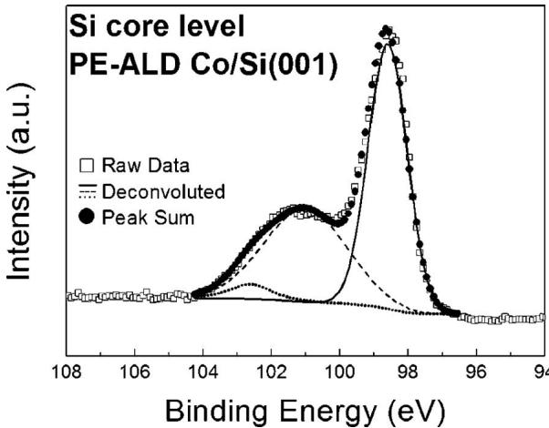
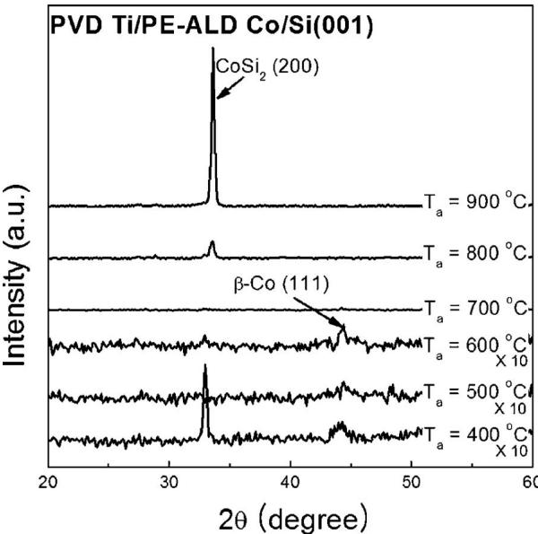
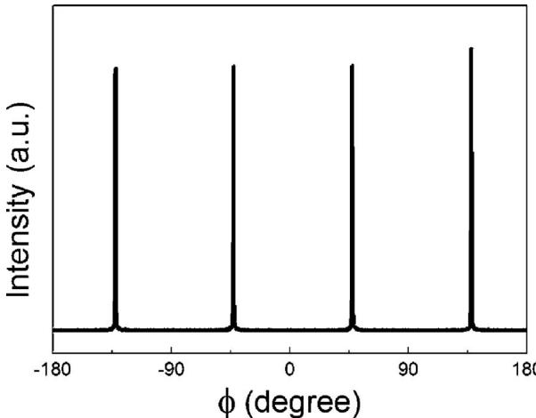

RESEARCH ARTICLE | MAY 23 2007

# Nitride mediated epitaxy of Co  $\mathrm{Si}_2$  through self-interlayer-formation of plasma-enhanced atomic layer deposition Co

Han- Bo- Ram Lee; J.Y. Son; H. Kim

Check for updates

Appl. Phys. Lett. 90, 213509 (2007) https://doi.org/10.1063/1.2742791

# Articles You May Be Interested In

High quality epitaxial CoSi 2 using plasma nitridation- mediated epitaxy: The effects of the capping layer J. Appl. Phys. (November 2007)

The effects of nitrogen profile and concentration on negative bias temperature instability of plasma enhanced atomic layer deposition HfO x N y prepared by in situ nitridation

J. Appl. Phys. (September 2008)

Electrical property improvements of high- k gate oxide by in situ nitrogen incorporation during atomic layer deposition

Appl. Phys. Lett. (February 2007)

# Nitride mediated epitaxy of  $\mathrm{CoSi}_2$  through self-interlayer-formation of plasma-enhanced atomic layer deposition Co

Han- Bo- Ram Lee, J. Y. Son, and H. Kima)  Department of Material Science and Engineering, Pohang University of Science and Technology (POSTECH), San 31, Hyoja- Dong, Nam- Gu, Pohang, Kyungbuk 790- 784, Korea

(Received 21 March 2007; accepted 2 May 2007; published online 23 May 2007)

The silicide formation by annealing plasma- enhanced atomic layer deposition (PE- ALD) Co and physical vapor deposition (PVD) Co was comparatively studied. Very pure Co films were deposited by PE- ALD with  $\mathrm{CoCp}_2$  and  $\mathrm{NH}_3$  plasma. However, various analyses have shown that amorphous  $\mathrm{SiN}_x$  interlayer was formed between PE- ALD Co and Si due to the  $\mathrm{NH}_3$  plasma exposure in contrast with PVD Co. Due to the nitride interlayer,  $\mathrm{CoSi}_2$  was epitaxially grown from PE- ALD Co by rapid thermal annealing through nitride mediated epitaxy. This process scheme is expected to provide a simple route for contact formation in future nanoscale devices. © 2007 American Institute of Physics. [DOI: 10.1063/1.2742791]

$\mathrm{CoSi}_2$  has been widely studied for the contact materials of nanoscale metal- oxide- semiconductor filed effect transistor due to the absence of narrow line effect. However, agglomeration and void formation during the silicidation or postthermal process due to grain grooving and interface roughening of polycrystalline silicide could become a potential problem.1 Epitaxial  $\mathrm{CoSi}_2$  with lower contact resistance is one of the candidates to solve these problems, especially for shallow junction devices due to its good layer uniformity and high thermal stability. Interlayer mediated epitaxy (IME) is one of the promising techniques for  $\mathrm{CoSi}_2$  epitaxy since it is compatible with current Si technology and does not require expensive processing tools. For this purpose, various interlayer materials have been employed including oxide,2 nitride,3 and  $\mathrm{CoN}_x$ .4 So far, additional process step has been carried out to form appropriate interlayer. For example, nitride interlayer was formed by very high temperature  $(900^{\circ}\mathrm{C})$  nitridation.3

We recently developed plasma- enhanced atomic layer deposition (PE- ALD) Co process with high purity and low resistivity.5 In this study, we investigated the interface between PE- ALD Co and Si substrate, comparatively with physical vapor deposition (PVD) Co. Due to the use of  $\mathrm{NH}_3$  plasma as a reactant, a few nanometer thick nitride interlayer was formed during the deposition process. By rapid thermal annealing (RTA) of the PE- ALD Co,  $\mathrm{CoSi}_2$  was formed epitaxially through nitride mediated epitaxy (NME) without separate interlayer formation step.

Co films were deposited on Si(001) substrate by using PE- ALD chamber connected to dc magnetron sputtering chamber via load lock to form a cluster system, enabling the in situ deposition of capping layer.5  $\mathrm{CoCp}_2$  and  $\mathrm{NH}_3$  plasma were used as a Co precursor and a reactant, respectively. The standard  $\mathrm{NH}_3$  plasma exposure time  $(t_r)$  was 6 s and the growth temperature was  $300^{\circ}\mathrm{C}$ . Further details of PE- ALD Co film growth can be found in our previous report.5 For comparison, Co films were also deposited by dc magnetron sputtering at room temperature with plasma power of  $120\mathrm{W}$ . The chemical bonding structure and impurity level of Co films were investigated by Rutherford backscattering, x- ray photoelectron spectroscopy (XPS), and secondary ion mass spectroscopy (SIMS). Synchrotron radiation x- ray diffraction (SR- XRD) and high resolution transmission electron microscope (HR- TEM) were used for microstructure analysis. Postdeposition annealing to form silicide was carried out for  $30~\mathrm{s}$  by a RTA system in  $\mathbf{N}_2$  environment. For silicidation,  $20 \mathrm{nm}$  thick Ti capping layer was deposited by in situ sputtering on PE- ALD and PVD Co without vacuum breaking.

As reported previously, PE- ALD Co films have shown low resistivity of  $10~\mu \Omega$  cm due to high purity.5 Figures 1(a) and 1(b) are cross sectional HR- TEM images of PVD and PE- ALD Co on Si substrates, respectively. Both of PVD and PE- ALD Co films were polycrystalline, which agrees with XRD spectra showing  $\beta$ - Co diffraction peaks.5 Figure 1(a) shows the formation of  $3\mathrm{nm}$  thick interlayer between PVD Co and Si. There have been several reports on the formation of amorphous  $\mathrm{CoSi}_x$  interlayer for PVD Co on Si substrate even at room temperature.6 Similar TEM image to Fig. 1(a) was reported in Ref. 6, indicating that the interlayer for our case is also  $\mathrm{CoSi}_x$ . As shown in Fig. 1(b), however, the  $2 - 3\mathrm{nm}$  thick amorphous interlayer between PE- ALD Co and Si substrate has apparently different contrast and structure from that of PVD Co and Si.

To investigate the interlayer of Co and Si substrate, SIMS depth profiles were obtained (data not shown). The PE- ALD Co was very pure, with very small oxygen and nitrogen contaminations in the film. In fact, the nitrogen and oxygen contents in the film were smaller than those of PVD Co. Significant nitrogen peak intensity, however, was ob

  
FIG. 1. Cross sectional HR-TEM images of (a) PVD Co film grown at  $t_r$  and (b) PE-ALD Co.

  
FIG. 2. XPS spectrum of PE-ALD Co for silicon core-level region after selective etching of Co film.

served only for the interface of PE- ALD Co and Si in contrast to the PVD Co case. For better analysis of this interlayer, XPS analysis was carried out after the Co layer was removed by selective etching  $\mathrm{(H_2SO_4:H_2O_2 = 4:1}$  volume ratio). Figure 2 shows the XPS spectra for Si binding energy region. The deconvolution of the XPS spectrum in Fig.2 shows that it is composed of three peaks at 98.6, 101, and  $102.6\mathrm{eV}$  The peak at  $98.6\mathrm{eV}$  solid line) was assigned to the Si- Si bond from the Si substrate, while two lower energy peaks were assigned to Si- N (dash line) and Si- O (dot line) bonding, respectively. XPS spectrum for N binding energy region was composed mostly of N- Si bond, and the Co peak intensity was very small in contrast to PVD Co for which significant Co XPS peaks were observed. These results, together with SIMS depth profile, strongly suggest that the interlayer for PE- ALD Co is amorphous  $\mathrm{SiN}_x$  not  $\mathrm{CoSi}_x$

One of the plausible reasons for  $\mathrm{SiN}_x$  interlayer formation during the PE- ALD Co is a direct exposure of Si substrate by  $\mathrm{NH}_3$  plasma at initial deposition cycles. In fact, the nitridation process using  $\mathrm{NH}_3$  plasma has been investigated for various applications in microelectronics technology. To estimate the  $\mathrm{SiN}_x$  formation in our experimental conditions, the Si(001) substrates were exposed to  $\mathrm{NH}_3$  plasma at  $300^{\circ}\mathrm{C}$ . A few nanometer thick  $\mathrm{SiN}_x$  film formation was confirmed by spectroscopic ellipsometer. In contrast with  $\mathrm{NH}_3$  plasma, no  $\mathrm{SiN}_x$  film was formed by  $\mathrm{NH}_3$  gas at  $300^{\circ}\mathrm{C}$ . The  $\mathrm{SiN}_x$  layer formation alters the growth characteristics of PE- ALD Co. For Co chemical vapor deposition using  $\mathrm{CoCp}_2$  and  $\mathrm{H}_2$ , the deposition selectivity on several substrates has been reported. For example, the Co films were deposited on  $\mathrm{SiO}_2$  and  $\mathrm{Si}_3\mathrm{N}_4$ , not on Si substrate, which was attributed to the difficulty in  $\mathrm{CoCp}_2$  adsorption on H- terminated surface. In our case, however, Co films were deposited by PE- ALD using  $\mathrm{NH}_3$  plasma without nucleation delay on Si as well as on  $\mathrm{SiO}_2$ . This behavior can be explained by the formation of  $\mathrm{SiN}_x$  on the Si surface by  $\mathrm{NH}_3$  plasma during the initial deposition cycles, which enables the nucleation of Co film and leads to nonselectivity in deposition.

To investigate the effects of  $\mathrm{SiN}_x$  interlayer on solid state reaction between Co and Si, PE- ALD and PVD Co films with in situ PVD Ti capping layer were annealed at various annealing temperatures. For  $20 \mathrm{nm}$  Ti/20 nm PVD  $\mathrm{Co / Si(001)}$  sample, weak CoSi (210) peak was observed at

  
FIG. 3. XRD spectra of  $20 \mathrm{nm}$  Ti/20 nm PE-ALD Co/Si(001) after RTA at various annealing temperatures.

$T_{a} = 600^{\circ}\mathrm{C}$  and strong  $\mathrm{CoSi}_2$  (220) was observed with small (111) peaks at  $T_{a}\geqslant 700^{\circ}\mathrm{C}$ . These results are consistent with previous reports on silicide formation from PVD Co on Si substrate, for which polycrystalline  $\mathrm{CoSi}_2$  were formed at a high enough annealing temperature, while monosilicide phase is formed at a low annealing temperature. In contrast with PVD Co case, however, SR- XRD spectra for the annealed  $20 \mathrm{nm}$  Ti/20 nm PE- ALD Co/Si(001) sample has shown clearly different results, as shown in Fig. 3. First of all, no silicide related peaks were observed at up to  $700^{\circ}\mathrm{C}$ . At  $T_{a} = 800^{\circ}\mathrm{C}$ , only  $\mathrm{CoSi}_2$  (002) diffraction peak was observed at  $2\theta = 33.5^{\circ}$ . With further increase in annealing temperature to  $900^{\circ}\mathrm{C}$ , the  $\mathrm{CoSi}_2$  (002) peak intensity has grown significantly.

Further analysis was carried out for the sample annealed at  $800^{\circ}\mathrm{C}$ . Figure 4 shows the high resolution cross sectional TEM image. We can see a newly formed  $5 \mathrm{nm}$  thick layer with darker contrast than Si substrate was formed.  $\mathrm{SiN}_x$  layer, which was originally located between Co and Si, resides now above this layer. This was confirmed to be a  $\mathrm{CoSi}_2$  layer by energy dispersive spectroscopy analysis during the HR- TEM analysis with  $0.5 \mathrm{\AA}$  spot size. The registry of lat

  
FIG. 4. Cross sectional HR-TEM images of PE-ALD Co film annealed at  $800^{\circ}\mathrm{C}$ .

  
FIG.5.XRD  $\Phi$  scan of  $20 \mathrm{nm}$  Ti/20 nm PE-ALD  $\mathrm{Co / Si(001)}$  annealed at  $800^{\circ}\mathrm{C}$  The capping layer and remaining Co film were selectively etched before analysis.

tice was complete at interface between  $\mathrm{CoSi}_2$  and Si, indicating that the  $\mathrm{CoSi}_2$  was epitaxially grown and fully coherent with  $\mathrm{Si(001)}$  substrate. To check the in- plane orientation, we performed  $\mathbf{X}$  - ray scattering with  $\Phi$  scan geometry along the azimuthal direction with the slant angle of  $45^{\circ}$  on the surface normal using  $\mathrm{Cu}K\alpha$  source. For this analysis, the capping layer and remaining Co film were selectively etched prior to the analysis. Figure 5 shows the  $\Phi$  scans of the (220) peak of the  $\mathrm{CoSi}_2$  thin film on the  $\mathrm{Si(001)}$  substrate. The fourfold symmetry of (220) peak of the  $\mathrm{CoSi}_2$  thin film was observed, and the full width at half maximum of an in- plane (220) peak was equal to  $0.4^{\circ}$  indicating that a high quality  $\mathrm{CoSi}_2$  epitaxial film was formed. The HR- TEM and XRD results indicate that the  $\mathrm{CoSi}_2$  is epitaxial with  $\mathrm{Si(001)}$  substrate with a cube- on- cube relationship,  $\mathrm{CoSi}_2[100]\| \mathrm{Si}[100]$

It is worth noting that no monosilicide phase or other Co rich phase has been formed by annealing the PE- ALD Co sample at a low temperature. This absence of monosilicide or metal rich phase formation is a typical characteristic of IME process. Since we did not intentionally form an interlayer for IME, we attribute this epitaxial growth to NME due to the amorphous  $\mathrm{SiN}_x$  interlayer, formed by  $\mathrm{NH}_3$  plasma reaction with substrate. In NME, the nitride interlayer does not react with Co but limits the Co diffusion when the interlayer is very thin,  $< 5 \mathrm{nm}$

As seen in Fig.4, the interface between  $\mathrm{CoSi}_2$  and Si was relatively nonuniform with {111} facets. These are common observations for IME when the capping layer and Co thickness are not fully optimized. For instance, in a previous report on NME, the  $\mathrm{CoSi}_2$  was grown as an island shape and was not continuous because of nonoptimization of Co thickness. Another study on IME using  $\mathrm{CoN}_x$  interlayer has shown that the interlayer thicknesses and chemical composition affect the thickness and interface of epitaxial  $\mathrm{CoSi}_2$  Thus, the control of interlayer thickness is one of the requirements to control the IME of  $\mathrm{CoSi}_2$  . In a separate experiment, the  $\mathrm{SiN}_x$  interlayer thickness was reduced from 3 to  $1\mathrm{nm}$  by decreasing the plasma expose time  $(t_r)$  from 6 to  $2\mathrm{s}$  .Thus,  $\mathrm{SiN}_x$  interlayer thickness can be readily controlled by changing  $t_r$  for our process scheme. However, since the required junction depth is below  $10 \mathrm{nm}$  which will be decreased to below  $5 \mathrm{nm}$  in 2012 according to the International Technology Roadmap for Semiconductors, even the very thin epitaxial  $\mathrm{CoSi}_2$  layer shown in Fig.4 can be utilized for contact in ultrashallow junction.

So far, the interlayers for IME were fabricated through separate process steps. For example, oxide interlayer was fabricated by wet chemical process, while nitride layer was fabricated by thermal nitridation at annealing temperature over  $900^{\circ}\mathrm{C}$  In another report, the  $\mathrm{CoN}_x$  interlayer for IME was formed by a separate deposition step followed by Co deposition. In the present study, however, the interlayer was formed without additional process through self- interlayer formation during the PE- ALD. Additionally, high conformality of PE- ALD Co film is another big advantage, which cannot be achieved by PVD. Thus, the current process scheme provides a simple route for the formation of epitaxial  $\mathrm{CoSi}_2$  contact for future nanoscale devices.

The authors gratefully acknowledge the financial support of Korea Electronic Technology Institute, BK21 Program, and POSTECH (Core Research Program). Also, this work was partially supported by Korea Research Foundation Grant funded by Korean Government (MDEHRD, KRF- 2005- 003- D00144). The XRD  $\theta - 2\theta$  and  $\Phi$  scans were carried out at Pohang Light Source 5C2 beam line and Yoon Hee Jeong's Laboratory at POSTECH, respectively.

$^1\mathrm{K}$  Maex, Mater. Sci. Eng., R. 11, 7 (1993).  $^2\mathrm{R}$  T. Tung, Appl. Phys. Lett. 68, 3461 (1996).  $^3\mathrm{R}$  K. K. Chong, M. Yeadon, W. K. Choi, E. A. Stach, and C. B. Boothroyd, Appl. Phys. Lett. 82, 1833 (2003).  $^4\mathrm{S}$  I. Kim, S. R. Lee, J. H. Park, and B. T. Ahn, J. Electrochem. Soc. 153, G506 (2006).  $^5\mathrm{H}$  B. R. Lee and H. Kim, Electrochem. Solid State Lett. 9, 323 (2006).  $^6\mathrm{P}$  Ruterana, P. Houdy, and P. Boher, J. Appl. Phys. 68, 1033 (1990).  $^7\mathrm{Y}$  Ze- Qiang, J. Appl. Phys. 78, 2906 (1995).  $^8\mathrm{R}$  Guo, Y. Kurata, T. Inokuma, and S. Hasegawa, J. Non- Cryst. Solids 351, 3006 (2005).  $^9\mathrm{G}$  J. M. Dormans, J. Cryst. Growth 108, 806 (1991).  $^{10}\mathrm{C}$  Detavernier, R. L. Van Meirhaeghe, F. Cardon, K. Maex, W. Vandervorst, and B. Brijs, Appl. Phys. Lett. 77, 3170 (2000).  $^{11}$  International Technology Roadmap for Semiconductors, 2006, p. 13.