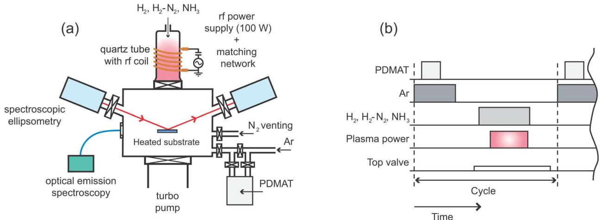
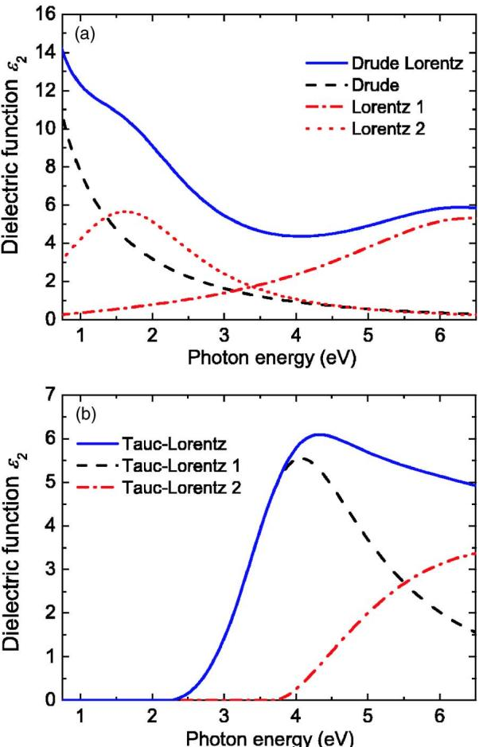
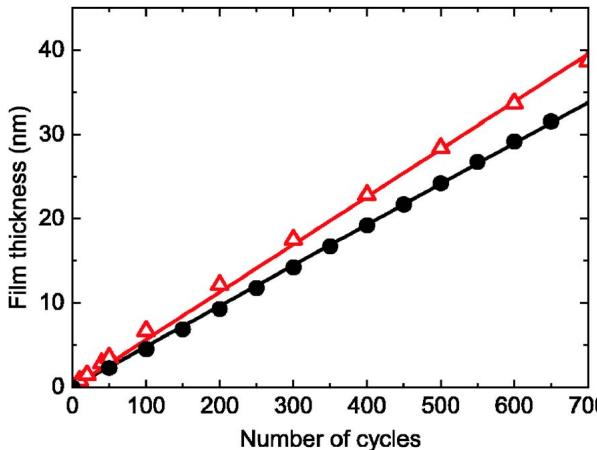
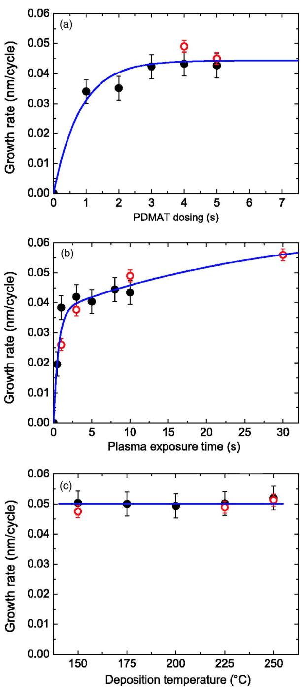
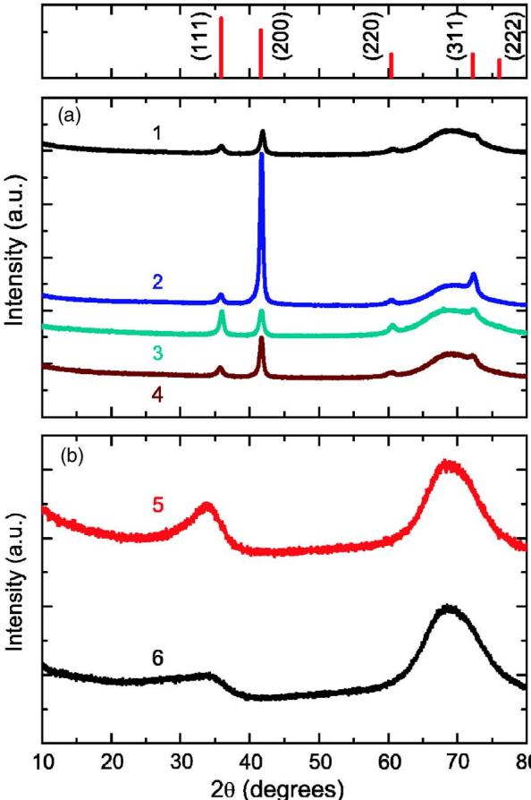
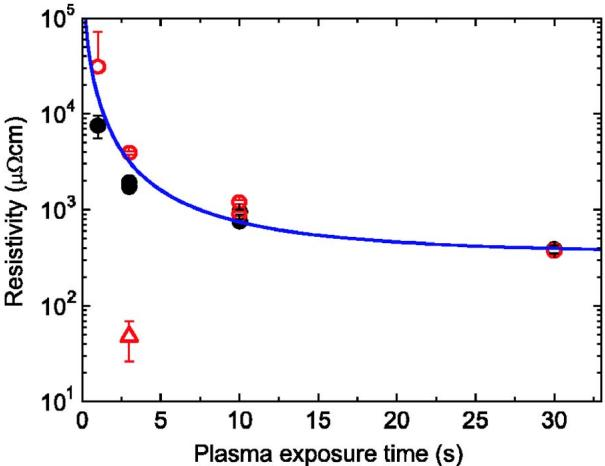
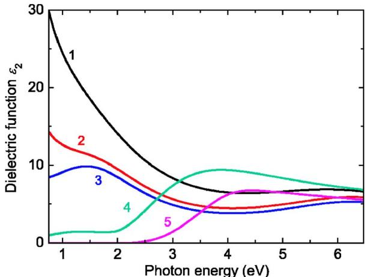
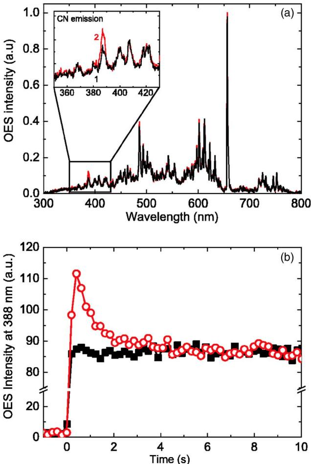
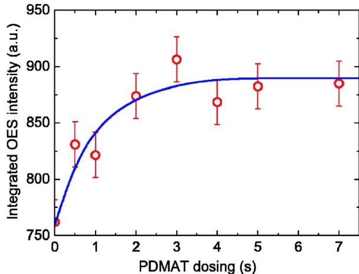

# Synthesis and in situ characterization of low-resistivity Ta  $\mathbf{N}_x$  films by remote plasma atomic layer deposition  $\mathbf{\phi}$

E. Langereis; 
H. 
C. 
M. Knoops; 
A. 
J. 
M. Mackus; 
F. Roozeboom; 
M. 
C. 
M. van de Sanden; 
W. 
M. 
M. Kessels

Check for updates

J. Appl. Phys. 102, 083517 (2007) https://doi.org/10.1063/1.2798598

# Articles You May Be Interested In

Atomic layer deposition of Ta- based thin films: Reactions of alkylamide precursor with various reactants J. Vac. Sci. Technol. B (September 2006)

Nucleation and growth of tantalum nitride atomic layer deposition on Al 2 O 3 using TBTDET and hydrogen radicals

J. Vac. Sci. Technol. A (June 2009)

Characterization of vapor draw vessel performance for low- volatility solid precursor delivery

J. Vac. Sci. Technol. A (December 2020)

# Synthesis and in situ characterization of low-resistivity  $\mathbf{TaN}_x$  films by remote plasma atomic layer deposition

E. Langereis, $^{a)}$  
H. 
C. 
M. Knoops, and 
A. 
J. 
M. Mackus  Department of Applied Physics, Eindhoven University of Technology, P.O. Box 513, 5600 MB Eindhoven, The Netherlands

F. Roozeboom  NXP Semiconductors Research, High Tech Campus 4, 5656 AE Eindhoven, The Netherlands

M. 
C. 
M. van der Sanden and 
W. 
M. 
M. Kessels $^{b)}$   Department of Applied Physics, Eindhoven University of Technology, P.O. Box 513, 5600 MB Eindhoven, The Netherlands

(Received 3 August 2007; accepted 29 August 2007; published online 18 October 2007)

Remote plasma atomic layer deposition (ALD) of  $\mathrm{NaN}_x$  films from  $\mathrm{Ta}[\mathrm{N}(\mathrm{CH}_3)_2]_5$  and  $\mathrm{H}_2$ ,  $\mathrm{H}_2$ -  $\mathrm{N}_2$ , and  $\mathrm{NH}_3$  plasmas is reported. From film analysis by in situ spectroscopic ellipsometry and various ex situ techniques, data on growth rate, atomic composition, mass density,  $\mathrm{NaN}_x$  microstructure, and resistivity are presented for films deposited at substrate temperatures between 150 and  $250^{\circ}\mathrm{C}$ . It is established that cubic  $\mathrm{NaN}_x$  films with a high mass density  $(12.1\mathrm{gcm}^{- 3})$  and low electrical resistivity  $(380~\mu \Omega \mathrm{cm})$  can be deposited using a  $\mathrm{H}_2$  plasma with the density and resistivity of the films improving with plasma exposure time.  $\mathrm{H}_2$ -  $\mathrm{N}_2$  and  $\mathrm{NH}_3$  plasmas resulted in N- rich  $\mathrm{Ta}_3\mathrm{N}_5$  films with a high resistivity. It is demonstrated that the different  $\mathrm{NaN}_x$  phases can be distinguished in situ by spectroscopic ellipsometry on the basis of their dielectric function with the magnitude of the Drude absorption yielding information on the resistivity of the films. In addition, the saturation of the ALD surface reactions can be determined by monitoring the plasma emission, as revealed by optical emission spectroscopy. © 2007 American Institute of Physics. [DOI: 10.1063/1.2798598]

# I. INTRODUCTION

The deposition of nanometer thick conductive tantalum nitride  $(\mathrm{NaN}_x)$  films is relevant for various applications in next- generation semiconductor devices. TaN is considered as a candidate to replace the poly- Si gate in metal- oxide- semiconductor field effect transistors, as metal electrode in high- density three dimensional (3D) capacitors, and as Cu diffusion barrier and possible liner material for interconnect technology. In addition to a high level of growth control, several applications require conformal deposition in high- aspect ratio structures, which is a requirement beyond reach of current physical vapor deposition (PVD) techniques. Due to its layer- by- layer growth, atomic layer deposition (ALD) is believed to be the method of choice for deposition in demanding 3D features. Sequentially employing two self- limiting surface reactions, a submonolayer of material is deposited per ALD cycle and the process is proven to yield excellent uniformity and conformality. Since different  $\mathrm{NaN}_x$  crystal phases exist including low- resistivity cubic TaN and very- high- resistivity  $\mathrm{Ta}_3\mathrm{N}_5$ , successful integration of  $\mathrm{NaN}_x$  films synthesized by ALD requires control over film stoichiometry and composition.

Several precursors are commercially available for ALD of  $\mathrm{NaN}_x$  films, such as  $\mathrm{Ta}[\mathrm{N}(\mathrm{CH}_3)_2]_5$  (PDMAT), Ta  $[\mathrm{N}(\mathrm{C}_2\mathrm{H}_5)_2]_3\mathrm{NC}(\mathrm{CH}_3)_3$  (TBTDET), Ta  $[\mathrm{NC}(\mathrm{CH}_3)_2\mathrm{C}_2\mathrm{H}_5]$ $[\mathrm{N}(\mathrm{CH}_3)_2]_3$ ,  $\mathrm{TaCl}_5$ , and  $\mathrm{TaF}_5$ . For many applications metal- organic precursors are preferred over metal- halide precursors due to potential problems in reliability posed by halide impurities in the film. In order to deposit the conductive  $\mathrm{NaN}_x$  phase, the oxidation state of the Ta atom in the precursor (+5 in most precursors) has to be reduced to oxidation state +3. Using the PDMAT precursor with  $\mathrm{NH}_3$  in a thermal ALD process, Travaly et al. observed that the high- resistivity  $\mathrm{Ta}_3\mathrm{N}_5$  phase was deposited. Ritana et al. showed that the reducing power of  $\mathrm{NH}_3$  is indeed insufficient and thermal ALD using  $\mathrm{TaCl}_5$  precursor resulted in the deposition of the  $\mathrm{Ta}_3\mathrm{N}_5$  phase. They reported that they could only deposit conductive  $\mathrm{NaN}_x$  films by thermal ALD when applying additional zinc dosing during the  $\mathrm{NH}_3$  exposure. Recently, it was demonstrated that low- resistivity TaN films can be deposited by plasma- assisted ALD using the reducing power of a  $\mathrm{H}_2$  plasma in combination with the metal- organic precursors PDMAT (Ref. 4) or TBTDET. Sreenivasan et al. reported the deposition of  $\mathrm{Ta}_3\mathrm{N}_5$  using an amido- based Ta precursor and a  $\mathrm{H}_2$ -  $\mathrm{N}_2$  plasma and they showed that the conductive cubic  $\mathrm{NaN}_x$  phase could be obtained from this material by a postdeposition thermal anneal at  $850^{\circ}\mathrm{C}$ . From the aforementioned results it is clear that plasma- assisted ALD can yield different  $\mathrm{NaN}_x$  compositions which are determined by the plasma conditions and gas mixtures used. Plasma- assisted ALD provides therefore additional freedom to tailor the deposition process and the resulting  $\mathrm{NaN}_x$  film properties to order. However, comprehensive studies on the influence of different plasma conditions and different gas mixtures on the  $\mathrm{NaN}_x$  properties are still lacking.

  
FIG. 1. (Color online) (a) Schematic representation of the remote plasma atomic layer deposition (ALD) setup for  $\mathrm{TaN}_x$  deposition. The optical access on the reactor chamber for in situ spectroscopic ellipsometry and optical emission spectroscopy is indicated. (b) Typical timing scheme for remote plasma ALD of  $\mathrm{TaN}_x$  showing the PDMAT dosing, the Ar carrier and purge gas, the plasma gas  $(\mathrm{H}_2,\mathrm{H}_2 - \mathrm{N}_2$  or  $\mathrm{NH}_3$  ), and the switching of the plasma power and the top valve between plasma source and reactor chamber.

Obviously, accurate and sensitive diagnostics to characterize the film growth process and the resulting material properties are essential for the development of suitable  $\mathrm{TaN}_x$  ALD processes. In particular, in situ diagnostics are generally preferred as they can return immediate information on the process and films deposited while they can also be used for online process control. In previous work, we introduced spectroscopic ellipsometry (SE) for an in situ study of remote plasma ALD of conductive TiN films. It was demonstrated that SE is a powerful tool to investigate ALD processes. It yields thickness information which can, for example, be used to study the growth rate per cycle, nucleation effects, and fast ALD cycle optimization. Moreover, it also gives insight into the material properties. For example, for conductive materials information on the electric film properties such as resistivity and electron mean free path can be extracted during the deposition process. This kind of information has recently also been extracted by SE for sputtered  $\mathrm{TaN}_x$  films, as reported by Aouadi and Debessai and Mistrik et al. The plasma- assisted ALD process also yields the possibility to use plasma- related diagnostics during the plasma exposure step. In our previous work on plasma- assisted ALD of  $\mathrm{Al}_2\mathrm{O}_3$  from a metal- organic precursor and  $\mathrm{O}_2$  plasma, we showed that optical emission spectroscopy can yield information on the ALD reaction mechanisms and the timing of the plasma step. Evidently, similar insight can be expected for plasma- assisted ALD for metal nitrides.

In this article, we report on the plasma- assisted ALD process of  $\mathrm{TaN}_x$  films from PDMAT precursor and different remote plasma conditions. Whereas in PVD processes the  $\mathrm{TaN}_x$  film properties can be tuned by controlling the  $\mathrm{N}_2$  pressure and deposition temperature, we will show that a good control over  $\mathrm{TaN}_x$  properties can be achieved in the plasma- assisted ALD process using different plasma gas compositions  $(\mathrm{H}_2,\mathrm{H}_2 - \mathrm{N}_2$  mixtures, and  $\mathrm{NH}_3$  ) and plasma exposure times. The influence of the plasma exposure time is particularly interesting in this respect since the continuous interaction between the plasma radicals and the growing film can be used to alter the material properties even after completed removal of the precursor ligands, whereas in thermal ALD the material properties depend solely on the chemical reactions between the precursors and reactive surface groups. For the different  $\mathrm{TaN}_x$  films synthesized, the material properties were determined using various ex situ analysis techniques whereas spectroscopic ellipsometry is used to monitor the film growth in situ. It is demonstrated that different  $\mathrm{TaN}_x$  phases can be distinguished during the deposition process by measuring the dielectric function of the films by in situ SE. Furthermore, optical emission spectroscopy (OES) is introduced during plasma- assisted ALD of  $\mathrm{TaN}_x$  to reveal information on the ALD reactions and to determine the required dosing of precursor and plasma step to achieve ALD growth saturation.

First, the experimental configuration and ellipsometry data analysis procedure will be described in detail in Secs. II and III, respectively. In Sec. IV, the ALD film growth and the material properties of the  $\mathrm{TaN}_x$  films for the different deposition conditions, such as deposition temperature, plasma exposure time, and plasma gas composition, will be presented and discussed. Process characterization by in situ SE and OES during the ALD process is also described in Sec. IV. The conclusions of this work are summarized in Sec. V.

# II. EXPERIMENTAL DETAILS

# A. Remote plasma ALD reactor and process conditions

The experimental setup is schematically shown in Fig. 1(a) and consists of a vacuum chamber equipped with a remote plasma source and a precursor dosing system. The configuration is similar to the setup used for the TiN deposition described in previous work and therefore mainly the aspects relevant for remote plasma ALD of  $\mathrm{TaN}_x$  films will be briefly discussed.

The solid metal- organic precursor  $\mathrm{Ta[N(CH_3)_2]_5}$  (PD- MAT, pentakis(dimethylamino)tantalum, Sigma- Aldrich,  $>99.99\%$  purity) was contained in a stainless steel bubbler heated to  $75^{\circ}C$  to reach adequate vapor pressure. Ar was

used as carrier gas  $(>99.999\%)$  purity, working pressure of  $\sim 30$  mTorr) and the flow was controlled using a leak valve upstream. This Ar flow is also used for purging the chamber after precursor dosing using a divert line. In addition, the chamber was pumped down  $(< 10^{- 4}$  Torr) after purging to remove any remaining gaseous precursor and reaction byproducts before plasma excitation. The PDMAT gas lines and vacuum chamber were heated  $(>80^{\circ}\mathrm{C})$  by heating tape to prevent precursor condensation during transport to the substrate. To avoid film deposition in the plasma source, the top valve positioned between the source and chamber was closed during the PDMAT dosing.

The ALD reaction was completed by exposing the substrate to a plasma generated in the remote inductively coupled plasma source. The radio frequency power coupling  $(100~\mathrm{W})$  was optimized by impedance matching.25 Different gases  $[\mathrm{H}_{2}$ $\mathbf{N}_2$  (purities  $>99.999\%$  and  $\mathrm{NH}_3$  (purity  $>99.995\%$  ) and their mixtures can be fed into the plasma source to investigate the effect of the plasma gas composition on the  $\mathrm{TaN}_x$  material properties. The plasma gas pressure was set to 7.5 mTorr for all depositions.

A typical ALD cycle used for the deposition of  $\mathrm{TaN}_x$  films is represented in Fig. 1(b) and the switching on/off of the relevant valves and gas flows is indicated. The  $\mathrm{TaN}_x$  films were deposited on resistively heated substrates in the temperature window of  $150 - 250^{\circ}\mathrm{C}$ . The silicon substrates  $[p$  - type Si  $(10 - 30\Omega \mathrm{cm})]$  did not undergo additional cleaning steps and were covered with a  $1 - 2\mathrm{nm}$  native oxide layer. Typically a 2 in. substrate size was used, but a 4 in. substrate holder could be used for deposition on larger sized substrates.

# B. In situ diagnostics

The ALD film growth was monitored by in situ SE using the two optical viewports on the chamber that allow for SE measurements under a fixed angle of incidence of  $68^{\circ}$  to the substrate normal (Fig. 1). Pneumatic gate valves separated the vacuum chamber and the viewports to prevent film deposition on the optical ports. A visible and near- infrared rotating compensator ellipsometer (J.A. Woollam, Inc., M2000U) was used for the in situ SE measurements such that the  $\mathrm{TaN}_x$  dielectric function could be determined in the photon energy range of  $0.75 - 5.0\mathrm{eV}$ . In addition, a visible and ultraviolet extended (J.A. Woollam, Inc., M2000D,  $1.2 - 6.5\mathrm{eV}$ ) ellipsometer was used ex situ to probe the dielectric function deeper into the ultraviolet. The different parametrizations used to model the conductive and high- resistivity  $\mathrm{TaN}_x$  films will be described in more detail in Sec. III.

An optical viewport on the side of the chamber allowed for OES to study the emission of excited species during the plasma step in the ALD cycle. An Ocean Optics USB2000 spectrometer was used with a wavelength detection range of  $250 - 870\mathrm{nm}$  and a resolution of approximately  $1\mathrm{nm}$ . The light was collected by an optical fiber placed in front of the side viewport of the reactor chamber and was dispersed via a fixed grating across a linear charge coupled device array detector. The typical integration time used was  $100~\mathrm{ms}$ .

# C. Ex situ material analysis

Electrical resistivity measurements were carried out at room temperature using a Signatone four- point probe (FPP) in combination with a Keithley 2400 sourcemeter acting both as current source and as a voltage meter. The sheet resistance was determined from the slope of the  $I - V$  curve and the resistivity was obtained after multiplication by the film thickness deduced from the SE measurements. The film composition was determined from Rutherford backscattering spectroscopy (RBS) and elastic recoil detection (ERD) using  $2\mathrm{MeV}^4\mathrm{He}^+$  ions. The ion beam was targeted at the surface at two different angles  $(- 80^{\circ}$  and  $- 10^{\circ})$  for every sample to get improved sensitivity for both the heavy and light elements, while it also allowed for depth profiling of the  $\mathrm{TaN}_x$  layer. The RBS and ERD data were modeled using the RUMP program.  $^{26}\mathrm{X}$  - ray diffraction (XRD) was performed to determine the film microstructure using a Philips X'Pert MPD diffractometer equipped with a  $\mathrm{CuK}\alpha$  source  $(1.54\mathrm{\AA}$  radiation). To reduce the measurement time a Philips X'Celerator detector was used and to increase the surface sensitivity the measurements were performed under a grazing angle of incidence. The thickness and mass density were also determined from  $\mathbf{X}$  - ray reflectometry (XRR) measurements carried out on a Bruker D8 Advance  $\mathbf{X}$  - ray diffractometer.

# III. SPECTROSCOPIC ELLIPSOMETRY ON  $\mathrm{TaN}_x$  FILMS

# A. Data acquisition and optical model

Spectroscopic ellipsometry data can be acquired in situ after every ALD cycle after opening the gate valves to the light source and detector, but typically data were obtained after 10 completed cycles. A high signal- to- noise ratio was obtained by averaging each SE measurement over 400 data acquisitions, which led to a measurement time of approximately  $45\mathrm{s}$ . After the measurement, the gate valves were closed and the deposition process continued. The WvASE32 software from J.A. Woollam was used to analyze ellipsometry data. In WvASE32 in situ ellipsometry data from the near infrared (NIR)- extended ellipsometer can be combined with ex situ data obtained on the same film by the UV- extended ellipsometer. This makes it possible to determine the dielectric functions of the different  $\mathrm{TaN}_x$  films over the photon energy range from 0.75 to  $6.5\mathrm{eV}$ .

The ellipsometry data can be expressed in terms of the pseudodielectric function  $\langle \epsilon \rangle$ , which is represented in real  $\langle \epsilon_1\rangle$  and imaginary  $\langle \epsilon_2\rangle$  parts. From model- based analysis of the ellipsometry data, the thickness of the film and the optical constants of the  $\mathrm{TaN}_x$  film can be extracted. Prior to the film deposition, the pseudodielectric function of the substrate was determined in order to isolate the starting substrate from the deposited  $\mathrm{TaN}_x$  film. The Si substrates with native oxide were modeled by a semi- infinite Si layer of which the optical constants were obtained by a point- to- point fit and a top oxide layer of  $\sim 1.5 \mathrm{nm}$  as described by the Cauchy relation. The  $\mathrm{TaN}_x$  film deposited was modeled by adding a layer on top of the substrate and various parametrizations were used to describe the different  $\mathrm{TaN}_x$  optical properties. Assumptions within this approach were that the deposition process

does not affect the substrate properties and that a surface roughness layer can be neglected, which was corroborated by the small surface roughness  $(< 0.3 \mathrm{nm})$  measured by atomic force microscopy. More details on the ellipsometer configuration and measurement procedure during remote plasma ALD can be found elsewhere. $^{21}$

# B. Dielectric function of  $\mathrm{TaN}_x$  films

The dielectric functions of the conductive  $\mathrm{TaN}_{x,x\leqslant 1}$  phase and semiconductive  $\mathrm{Ta}_3\mathrm{N}_5$  phase are quite dissimilar and this fact lies at the basis for the distinction between the different  $\mathrm{TaN}_x$  phases by SE. The parametrizations used to describe the dielectric functions of these  $\mathrm{TaN}_x$  films will be introduced below. A comparison between typical parameters derived from the SE data and ex situ analysis is presented in the subsequent section.

# 1. Conductive  $\mathrm{TaN}_x$  films

The low- resistivity  $\mathrm{TaN}_{x,x\leqslant 1}$  films were described by a Drude- Lorentz oscillator parametrization. The Drude oscillator accounts for the intraband absorption by conduction electrons and contains information on the metallic properties of the film. The Lorentz oscillators account for the interband absorption by bound electrons. Following the literature on PVD TaN films, $^{22,23}$  we used a combination of one Drude and two Lorentz oscillators to describe the dielectric function of the conductive  $\mathrm{TaN}_x$  deposited by ALD:

$$
\epsilon (\omega) = \epsilon_{\infty} - \frac{\omega_{\mathrm{pu}}^{2}}{\omega^{2} - i\Gamma_{D}\omega} +\sum_{j = 1}^{2}\frac{f_{j}\omega_{0j}^{2}}{\omega_{0j}^{2} - \omega^{2} + i\gamma_{j}\omega}. \tag{1}
$$

In Eq. (1),  $\epsilon_{\infty}$  is equal or larger than unity to compensate for the contribution of higher- energy transitions that are not taken into account by the Lorentz terms. The Drude term is characterized by the unscreened plasma energy  $\hbar \omega_{\mathrm{pu}}$  and the damping factor  $\Gamma_{D}$ . The Lorentz oscillators were located at energy position  $\hbar \omega_{0j}$ , with strength  $f_{j}$  and damping factor  $\gamma_{j}$ . For  $\mathrm{TaN}_x$ , the two Lorentz oscillators account for interband absorptions around 2.2 and  $6.4 \mathrm{eV}$ . $^{22,23}$

The imaginary  $(\epsilon_{2})$  part of the dielectric function for a typical  $\mathrm{TaN}_x$  film with a low resistivity is shown in Fig. 2(a) and the contributions of the Drude and Lorentz oscillators are indicated. In particular, the NIR extension of the spectroscopic ellipsometer aids to distinguish the Drude absorption from the strong Lorentz oscillator around  $2.2 \mathrm{eV}$ , while the second Lorentz oscillator is determined more accurately using the UV- extended SE.

Several film properties, such as electron density, electrical resistivity, electron mean free path, and mass density, can be calculated from the Drude absorption as was shown for Drude parameters obtained for TiN films. $^{21}$  However, the data modeling of the thin  $\mathrm{TaN}_x$  films revealed that the Drude amplitude and broadening are correlated, which is caused by the large Lorentz oscillator around  $2.2 \mathrm{eV}$ . Consequently, only the ratio of the Drude parameters could be uniquely determined. Since the electrical resistivity is defined by the ratio of Drude fit parameters, $^{21,28}$

  
FIG. 2. (Color online) The imaginary part of the dielectric function  $\epsilon_{2}$  of (a) a conductive, cubic  $\mathrm{TaN}_{x,x\leqslant 1}$  film and (b) a semiconductive  $\mathrm{Ta}_3\mathrm{N}_5$  film as deduced from spectroscopic ellipsometry measurements. The dielectric functions are parametrized using (a) a Drude and two Lorentz oscillators and (b) using two Tauc-Lorentz oscillators. The photon energy ranges from the near infrared  $(0.75 \mathrm{eV})$  to the ultraviolet  $(6.5 \mathrm{eV})$ . The conductive  $\mathrm{TaN}_{x,x\leqslant 1}$  film was deposited using  $10 \mathrm{s} \mathrm{H}_2$  plasma in the ALD cycle, while the  $\mathrm{Ta}_3\mathrm{N}_5$  film was deposited using  $10 \mathrm{s} \mathrm{NH}_3$  plasma.

$$
\rho = \left(\frac{1}{\epsilon_0}\right)\frac{\Gamma_D}{\omega_{\mathrm{pu}}^2}, \tag{2}
$$

where  $\epsilon_0$  is the permittivity of free space, the electrical resistivity can be unambiguously determined from SE measurements.

# 2. Semiconductive  $\mathrm{TaN}_x$  films

The dielectric function of amorphous semiconductors and insulators is often described by the Tauc- Lorentz model. $^{29 - 31}$  When multiple transitions are possible in the material, additional Tauc- Lorentz oscillators can be added to the parametrization. $^{32}$  To model the high- resistive  $\mathrm{Ta}_3\mathrm{N}_5$  phase, we used a double Tauc- Lorentz model with the imaginary part of the dielectric function  $(\epsilon_{2})$  given by

$$
\begin{array}{r}\epsilon_{2}(E) = \sum_{j = 1}^{2}\frac{A_{j}E_{0j}\Gamma_{j}(E - E_{gj})^{2}}{(E^{2} - E_{0j}^{2})^{2} + \Gamma_{j}^{2}E^{2}}\frac{1}{E},E > E_{gj},\\ = 0,E\leqslant E_{gj}. \end{array} \tag{3}
$$

In Eq. (3),  $E_{gj}$  is the band gap,  $E_{0j}$  the peak transition energy,  $\Gamma_{j}$  the broadening parameter, and  $A_{j}$  represents the optical

  
FIG. 3. (Color online) Film thickness as a function of number of remote plasma ALD cycles shown for the growth of cubic  $\mathrm{TaN}_{x,x\leqslant 1}$  (closed symbols) and  $\mathrm{Ta}_3\mathrm{N}_5$  (open symbols) as deduced from in situ spectroscopic ellipsometry measurements. The solid lines are linear fits to the data. The cubic  $\mathrm{TaN}_{x,x\leqslant 1}$  film was deposited using  $10\mathrm{~s~}$  of  $\mathrm{H}_{2}$  plasma in the ALD cycle, while the  $\mathrm{Ta}_3\mathrm{N}_5$  film was deposited using  $10\mathrm{~s~}$  of  $\mathrm{NH}_3$  plasma.

transition matrix elements.31 The real part of the dielectric function  $(\epsilon_{1})$  can be obtained by the Kramers- Kronig integration of  $\epsilon_{2}$ .29 The imaginary part of the dielectric function for a typical  $\mathrm{Ta}_3\mathrm{N}_5$  film is shown in Fig. 2(b) and both Tauc- Lorentz oscillators are indicated. The first oscillator defines the position of the optical band gap of the  $\mathrm{Ta}_3\mathrm{N}_5$  film, while the second oscillator accounts for absorption above the absorption edge, as was also reported for the modeling of  $\mathrm{Ta}_2\mathrm{O}_5$  films.32,33 For a  $\mathrm{Ta}_3\mathrm{N}_{4,6}$  film that was deposited using a  $\mathrm{H}_{2} - \mathrm{N}_{2}$  plasma, an additional Lorentz oscillator was required to account for absorption below the band gap, as will be presented in Sec. IV D.

quired to account for absorption below the band gap, as will be presented in Sec.IV D.

# C. Typical SE results and comparison with ex situ film analysis

A typical example of the film thickness as a function of the number of ALD cycles as obtained from the SE measurements is shown in Fig. 3. Data are presented for both conductive  $\mathrm{TaN}_{x,x\leqslant 1}$  and highly resistive  $\mathrm{Ta}_3\mathrm{N}_5$  films. The ALD process was halted each time after a certain amount of cycles to acquire SE data and to calculate the film thickness employing the appropriate parametrization. The linear growth behavior of the plasma- assisted ALD process can clearly be observed in Fig. 3 for both  $\mathrm{TaN}_x$  phases. The final film thickness deduced from the SE modeling was found to be in good agreement with the thickness determined by XRR (see also Table I). The growth rates were calculated from a linear fit to the data and resulted in  $0.048\pm 0.005 \mathrm{nm / cycle}$  and  $0.056\pm 0.005 \mathrm{nm / cycle}$  for the  $\mathrm{TaN}_{x,x\leqslant 1}$  and  $\mathrm{Ta}_3\mathrm{N}_5$  films, respectively. Note that Fig. 3 also reveals that the thickness of the  $\mathrm{TaN}_x$  films deposited from PDMAT precursor is immediately linear at the onset of growth. Therefore, a distinct nucleation delay was absent as was observed before during the plasma- assisted ALD of TiN using the metal- halide  $\mathrm{TiCl}_4$  precursor and a  $\mathrm{H}_{2} - \mathrm{N}_{2}$  plasma.21

Since data can be obtained after every cycle, in situ SE allows for a fast determination of the ALD saturation curves. For different ALD conditions (as set by the combination of precursor dosing, plasma exposure time, and substrate temperature), the growth rate for each condition was calculated

TABLE I. Material properties of  $\mathrm{TaN}_x$  films deposited at various plasma conditions, substrate temperatures, and plasma gas mixtures. In situ spectroscopic ellipsometry (SE),  $\mathbf{x}$  ray reflectivity (XRR), Rutherford backscattering spectroscopy (RBS), and four-point probe (FPP) were used to determine the material properties. The typical experimental errors are shown in each column; a dash means not measured.  

<table><tr><td colspan="4">Deposition conditions</td><td colspan="9">Material properties</td></tr><tr><td rowspan="2">Plasma condition (s)</td><td rowspan="2">PDMAT dosing (s)</td><td rowspan="2">Deposition temperature (°C)</td><td rowspan="2">Number of cycles</td><td colspan="2">Thickness (nm)</td><td colspan="3">Film composition</td><td colspan="2">Mass density (g cm-3)</td><td colspan="2">Resistivity (μΩ cm)</td></tr><tr><td>SE</td><td>XRR</td><td>[N]/[Ta]</td><td>[O] (at. %)</td><td>[C] (at. %)</td><td>RBS</td><td>XRR</td><td>SE</td><td>FPP</td></tr><tr><td>H2</td><td></td><td></td><td></td><td></td><td></td><td></td><td></td><td></td><td></td><td></td><td></td><td></td></tr><tr><td>1</td><td>4</td><td>225</td><td>1400</td><td>36.9±0.5</td><td>—</td><td>—</td><td>—</td><td>—</td><td>—</td><td>7500±100</td><td>3.3×104</td><td></td></tr><tr><td>3</td><td>4</td><td>225</td><td>700</td><td>26.4</td><td>—</td><td>0.76</td><td>15</td><td>10</td><td>9.1±0.5</td><td>—</td><td>1740</td><td>48±10a</td></tr><tr><td>5</td><td>4</td><td>225</td><td>250</td><td>9.5</td><td>—</td><td>—</td><td>—</td><td>—</td><td>—</td><td>2680</td><td>3400±100</td><td></td></tr><tr><td>10</td><td>5</td><td>150</td><td>650</td><td>30.9</td><td>30.5±0.3</td><td>0.55</td><td>15</td><td>10</td><td>10.5</td><td>10.5±0.5</td><td>1000</td><td>1300</td></tr><tr><td>10</td><td>4</td><td>225</td><td>650</td><td>31.6</td><td>—</td><td>0.49</td><td>12</td><td>&amp;lt;2</td><td>10.4</td><td>12.9</td><td>950</td><td>1200</td></tr><tr><td>10</td><td>4</td><td>225</td><td>2000</td><td>91.1</td><td>93.9</td><td>—</td><td>—</td><td>—</td><td>—</td><td>11.4</td><td>600</td><td>700</td></tr><tr><td>10</td><td>5</td><td>250</td><td>700</td><td>35.6</td><td>35.0</td><td>0.73</td><td>14</td><td>17</td><td>10.8</td><td>11.3</td><td>580</td><td>650</td></tr><tr><td>30</td><td>8</td><td>225</td><td>500</td><td>28.1</td><td>—</td><td>0.45</td><td>7</td><td>12</td><td>12.1</td><td>—</td><td>390</td><td>380</td></tr><tr><td>H2-N2</td><td></td><td></td><td></td><td></td><td></td><td></td><td></td><td></td><td></td><td></td><td></td><td></td></tr><tr><td>5 s (98:2)</td><td>4</td><td>225</td><td>1000</td><td>51.6</td><td>—</td><td>1.0</td><td>15</td><td>&amp;lt;2</td><td>8.9</td><td>—</td><td>3350</td><td>1.1×104</td></tr><tr><td>10 s (1:1)</td><td>4</td><td>225</td><td>1300</td><td>68.1</td><td>67.4</td><td>1.5</td><td>8</td><td>&amp;lt;2b</td><td>9.8</td><td>10.9</td><td>—</td><td>≥5×104c</td></tr><tr><td>NH3</td><td></td><td></td><td></td><td></td><td></td><td></td><td></td><td></td><td></td><td></td><td></td><td></td></tr><tr><td>10</td><td>5</td><td>225</td><td>900</td><td>49.0</td><td>49.6</td><td>—</td><td>—</td><td>—</td><td>—</td><td>9.4</td><td>—</td><td>≥5×104c</td></tr></table>

aTypical error for this film. bElastic recoil detection revealed a H concentration of 9 at.  $\%$  Exceeding FPP measurement range.

  
FIG. 4. (Color online) Growth rate per cycle of  $\mathrm{TaN}_{x,x\leqslant 1}$  films as a function of the ALD process parameters: (a) PDMAT dosing time, (b)  $\mathrm{H}_{2}$  plasma exposure time, and (c) deposition temperature. The growth rates are determined by in situ spectroscopic ellipsometry by varying the process parameters during one deposition run (closed symbols) and by the deposition of a thick film under constant process conditions (open symbols). The lines in (a) and (b) are exponential fits to the data.

from the increase in film thickness determined over 80 cycles by taking SE measurements after every 10 ALD cycles. By a systematic variation of the process parameters, the ALD saturation curves were determined from a single deposition run of one sample. Such saturation curves, shown in Fig. 4, will be discussed in Sec. IV, but here it is already mentioned that the growth rates were found to be similar to the growth rates determined from separate depositions of thick films  $(\sim 30 \mathrm{nm})$  at constant process parameters.

The resistivity determined from the SE data using the Drude- Lorentz model can be compared to the resistivity determined by ex situ FPP measurements. As the FPP yields the resistivity of the  $\mathrm{TaN}_x$  films at room temperature, first the temperature coefficient of resistivity (TCR) of the  $\mathrm{TaN}_x$  film was determined by in situ SE. The change in resistivity as monitored upon cooling down the substrate in the vacuum setup revealed a small TCR of  $- 30\pm 30\mathrm{ppm / K}$  for the  $\mathrm{TaN}_x$  films. Baba and Hatada reported a similar TCR value of  $- 80\pm 30\mathrm{ppm / K}$  which was relatively independent of the  $\mathrm{TaN}_x$  composition. Consequently, within the experimental uncertainty, the resistivity obtained at deposition temperature by in situ SE can be directly compared to the room temperature resistivity obtained by ex situ FPP. It was found that resistivity values obtained by SE and FPP are in relatively good agreement with each other for plasma exposure times longer than  $10~\mathrm{s}$  (see Table I). Only one data point  $(3\mathrm{~s~H}_{2}$  plasma) showed a clear discrepancy but as discussed in Sec. IV C the corresponding sample showed a deviating behavior compared to the rest of the sample set, possibly due to the presence of Ta- C bonds. The SE data for this particular sample were also difficult to fit with the Drude- Lorentz model. Finally, it can be concluded that the generally good agreement between the thickness and resistivity values as extracted from SE with the results of the ex situ film analysis validates the SE data interpretation and modeling employed.

# IV.  $\mathbf{TAN}_x$  FILM GROWTH AND MATERIAL PROPERTIES

The  $\mathrm{TaN}_x$  films were deposited by remote plasma ALD under various process conditions. In particular, the plasma exposure time, the plasma gas composition, and the deposition temperature were varied. Table I summarizes the process conditions and resulting material properties, i.e., film thickness, film composition, electrical resistivity, and mass density. In the following section, first the saturation in growth rate for the various ALD process parameters will be addressed and subsequently, the material properties will be discussed. It will be shown that the  $\mathrm{TaN}_x$  properties can be controlled by the plasma exposure time and by the plasma gas composition. Finally, the characterization of the ALD process by optical emission spectroscopy during the plasma step will be presented.

# A. Growth rate of remote plasma ALD process

The saturation of the growth rate per cycle as being typical for ALD is investigated by varying the process parameters, i.e., PDMAT dosing time, plasma exposure time, and deposition temperature. The results are presented in Fig. 4 for  $\mathrm{TaN}_{x,x\leqslant 1}$  films deposited with a  $\mathrm{H}_{2}$  plasma. During the variation of the PDMAT dosing time, the  $\mathrm{H}_{2}$  plasma exposure time was set to  $10~\mathrm{s}$  and the deposition temperature was  $225^{\circ}\mathrm{C}$ . A clear saturation in growth rate as a function of precursor dosing is observed in Fig. 4(a) and the growth rate saturated at  $0.045\pm 0.004 \mathrm{nm / cycle}$  for PDMAT dosing times exceeding  $3\mathrm{~s}$ . As shown in Fig. 4(a), the data can be fitted with a single exponential function describing the expected saturation behavior during precursor absorption.

A similar experiment was carried out for the  $\mathrm{H}_{2}$  plasma exposure time: the PDMAT dosing time was set to  $4\mathrm{~s~}$  and the temperature to  $225^{\circ}C$  while the plasma exposure time was varied. Figure 4(b) shows a so- called "soft' saturation in growth rate with  $\mathrm{H}_{2}$  plasma exposure time. The data points can be fitted using an exponential function with two time constants. The fast initial increase in growth rate can be attributed to the ligand removal from the surface, whereas the slow increase in growth rate (for plasma exposure time  $>3\mathrm{~s~}$  can be related to a change in  $\mathrm{TaN}_x$  composition (cf. Table I) with increasing plasma exposure time. This effect will be discussed in more detail in Sec. IV B.

Using a PDMAT dosing of  $4\mathrm{~s~}$  and  $\mathrm{H}_{2}$  plasma exposure time of  $10\mathrm{~s~}$  the temperature dependence of the growth rate was studied for deposition temperatures in the range of  $150 - 250^{\circ}\mathrm{C}$  Figure 4(b) shows that the growth rate remained constant at  $0.050\pm 0.004\mathrm{~nm / cycle}$  within the temperature window studied.

The saturated growth rate per cycle can be compared to the results reported by Kim and co- workers obtained with a similar remote plasma ALD process.4,36 They calculated the growth rate  $(0.03\mathrm{~nm / cycle})$  from RBS measurements using the bulk mass density of cubic  $\mathrm{TaN}(15.9\mathrm{~g~cm}^{- 3})$  37 which is expected to be a higher limit for thin  $\mathrm{TaN}_x$  films deposited by ALD. Assuming a similar mass density for their films as obtained by our work (see Table I) leads to growth rates per cycle for their experiments that are in good agreement with our results. Our data do, however, not show a decrease in growth rate for depositions below  $200^{\circ}\mathrm{C}$  as reported by Kim et al. This might be attributed to the the other  $\mathrm{H}_{2}$  plasma exposure time of  $5\mathrm{~s~}$  in their ALD process.4 The growth rate for our  $\mathrm{TaN}_{x,x\leqslant 1}$  films is higher than the growth rate of  $0.02\mathrm{~nm / cycle}$  reported by Furuya et al., who used PDMAT in combination with a  $\mathrm{He - H}_2$  plasma.38 In a plasma- assisted ALD process using TBTDET precursor and a direct  $\mathrm{H}_{2}$  - Ar plasma, Park et al. reported a growth rate of  $0.06\mathrm{~nm / cycle}$  9 Ritala et al. reported a growth rate of  $0.025\mathrm{~nm / cycle}$  for conductive  $\mathrm{TaN}_x$  films deposited in a thermal ALD process from  $\mathrm{TaCl}_5$  precursor and  $\mathrm{NH}_3$  using  $\mathrm{Zn}$  as an additional reducing agent.10

# B. Influence of the deposition temperature

The influence of the deposition temperature on the material properties is studied for depositions at 150, 225, and  $250^{\circ}\mathrm{C}$  using  $4\mathrm{~s~}$  PDMAT dosing and  $10\mathrm{~s~}\mathrm{H}_{2}$  plasma exposure in the ALD cycle. As can be seen from Table I, all films have a  $[\mathrm{N}] / [\mathrm{Ta}]$  ratio  $x< 1$  with the film composition varying slightly with deposition temperature and  $\mathcal{X}$  increasing from 0.55 at  $150^{\circ}\mathrm{C}$  to 0.73 at  $250^{\circ}\mathrm{C}$  The main impurities in the film are oxygen and carbon. The O content remains approximately constant at  $\sim 14$  at.  $\%$  in the temperature range used. The C content does not show a clear trend with temperature; the low and high temperature depositions had a C content  $\geq 10$  at.  $\%$  while the  $255^{\circ}\mathrm{C}$  deposition resulted in a film with a C content below the detection limit  $(< 2$  at.  $\%$  of the RBS. Despite the impurity content, the  $\mathrm{TaN}_x$  films have a high mass density that slightly increased with deposition temperature to  $11.3\mathrm{~g~cm}^{- 3}$  . Furthermore, it is observed from SE and FPP measurements that the electrical resistivity decreases for higher deposition temperatures.

  
FIG. 5. (Color online) Grazing incidence  $\mathbf{x}$  -ray diffraction spectra of  $\mathrm{TaN}_x$  films deposited at different substrate temperatures and using different plasma compositions. (a) Cubic  $\mathrm{TaN}_{x,x\leqslant 1}$  films deposited using  $10\mathrm{~s~}\mathrm{H}_{2}$  plasma exposure: (1)  $31\mathrm{~nm}$  at  $150^{\circ}\mathrm{C}$  2  $94~\mathrm{nm}$  at  $225^{\circ}C$  3  $30~\mathrm{nm}$  at  $225^{\circ}C$  and 4  $35~\mathrm{nm}$  at  $250^{\circ}\mathrm{C}$  b)Amorphous  $\mathrm{Ta}_3\mathrm{N}_5$  -like films:5  $68~\mathrm{nm}$  at  $225^{\circ}C$  using  $10\mathrm{~s~}\mathrm{H}_2\mathrm{-}\mathrm{N}_2$  1:1 plasma exposure and (6  $49~\mathrm{nm}$  at  $225^{\circ}C$  using  $10\mathrm{~s~NH_3}$  plasma exposure. The broad peak between  $60^{\circ}$  and  $80^{\circ}$  originates from the  $c$  -Si substrate. The vertical lines in the top graph indicate the typical diffraction spectrum of a cubic  $\mathrm{TaN}$  powder sample. The data lines are offset vertically for clarity.

The effect of deposition temperature on the microstructure of the  $\mathrm{TaN}_x$  films is presented in Fig. 5. The microstructure was determined by grazing incidence  $\mathbf{x}$  - ray diffraction for  $\mathrm{TaN}_x$  films deposited at the aforementioned temperatures. The diffraction spectra show peaks similar to those of a diffraction spectrum of a cubic  $\mathrm{TaN}$  powder sample indicating that cubic  $\mathrm{TaN}_x$  films were deposited for deposition temperatures between 150 and  $250^{\circ}\mathrm{C}$  Examining the intensities of the diffraction peaks, the films tend to have a small preference for growth along the (200) direction for all deposition temperatures. Figure 5 also shows the diffraction spectra of a  $91~\mathrm{nm}$  thick  $\mathrm{TaN}_x$  film deposited at  $255^{\circ}\mathrm{C}$  and it is clear that the (200) growth direction becomes more preferred for this thicker film. Park et al. also reported the growth of cubic  $\mathrm{TaN}_x$  films by plasma- assisted ALD and observed that the relative intensity of the (200) direction depends on the plasma exposure time in their ALD process.

# C. Influence of the plasma exposure time

The influence of plasma exposure time on the film composition and electrical properties was studied for cubic, low

resistivity  $\mathrm{TaN}_{x,x\leqslant 1}$  films that were deposited employing different  $\mathrm{H}_{2}$  plasma exposure times (1, 3, 10, and 30 s) in the plasma- assisted ALD cycle. Table I shows that the  $[\mathrm{N}] / [\mathrm{Ta}]$  ratio as determined by RBS measurements decreases for longer  $\mathrm{H}_{2}$  plasma exposure times and indicates that the  $\mathrm{TaN}_{x,x\leqslant 1}$  films become more Ta- rich  $(x = 0.45$  for  $30\mathrm{~s~H}_{2}$  plasma). The O content of the films decreased with plasma exposure time (7 at.  $\%$  O for  $30\mathrm{~s~H}_{2}$  plasma), while the C content was approximately 10 at.  $\%$  (except for the  $10\mathrm{~s~H}_{2}$  plasma deposited film for which the RBS measurement was explicitly verified). The mass density of the films as determined by RBS increased with plasma exposure time and a density of  $12.1\mathrm{~g~cm}^{- 3}$  was obtained for the film deposited using  $30\mathrm{~s~H}_{2}$  plasma in the ALD cycle. The mass density of  $12.1\mathrm{~g~cm}^{- 3}$  is the highest reported for an ALD process of  $\mathrm{TaN}_x$  to date, but it is still somewhat lower than the cubic TaN bulk mass density of  $15.9\mathrm{~g~cm}^{- 3}$ . Although still relatively high, the impurity content for the  $\mathrm{TaN}_{x,x\leqslant 1}$  films is lower than the O and C content of 14- 15 at.  $\%$  reported by Kim et al. and the C content of 20 at.  $\%$  reported by Park et al. The C content in the films originates from the PDMAT ligands and could not effectively be reduced by prolonged plasma exposure time as indicated by our experiments. Showing a different trend than the N and O content with  $\mathrm{H}_{2}$  plasma exposure time, the constant C content could be an indication of a redeposition process involving ligand surface reaction products dissociated by the plasma after being released from the surface. The O content in the films can originate from several sources. The O content can be caused by a slightly oxidized precursor in the bubbler due to the precursor synthesis process or handling or due to small oxygen impurities in the Ar purge gas. It is also reported that the  $\mathrm{TaN}_{x,x\leqslant 1}$  films are sensitive to postprocess oxidation and the O content can result from exposure of the films to the ambient.

The influence of the plasma exposure time on the film composition was also observed by the change in electrical resistivity of the films as determined by in situ SE [Eq. (2)] and ex situ four- point probe measurements. Figure 6 shows the electrical resistivity of  $\sim 30 \mathrm{nm}$  thick  $\mathrm{TaN}_x$  films as a function of  $\mathrm{H}_{2}$  plasma exposure time. The electrical resistivity decreased when going to longer  $\mathrm{H}_{2}$  plasma exposure times in the ALD cycle. Using  $30\mathrm{~s~H}_{2}$  plasma in the ALD cycle resulted in a resistivity as low as  $380\mu \Omega \mathrm{cm}$  which is similar to the best values reported in the literature  $(350 - 400\mu \Omega \mathrm{cm})$ . Park et al. reported that the decrease in resistivity relates to an increase in mass density and degree of crystallization of the  $\mathrm{TaN}_x$  films.

We note that one data point  $(3\mathrm{~s~H}_{2}$  plasma) does not follow the general trend and the corresponding film was specifically investigated for its low resistivity (FPP:  $48\mu \Omega \mathrm{cm}$ ). The resistivity of this film was stable and not affected by storage of the sample under ambient conditions, as observed from repetitive FPP measurements over a longer time span. X- ray photoelectron spectroscopy (XPS) revealed the presence of Ta- C bonds in the film, which could account for the low electrical resistivity. This very- low- resistivity value could not be returned from the Drude- Lorentz model which gave a poor fit, but the SE data analysis might require a more dedicated description to account for the highly conductive Ta- C bonding.

  
FIG. 6. (Color online) Resistivity of  $\mathrm{TaN}_{x,x\leqslant 1}$  films with an  $\sim 30 \mathrm{nm}$  thickness deposited by remote plasma ALD using different  $\mathrm{H}_{2}$  plasma exposure times within the cycle. The resistivity is determined from in situ SE (closed symbols) and ex situ FPP measurements (open symbols). The line serves as a guide to the eyes. The low-resistivity  $\mathrm{TaN}_{x,x\leqslant 1}$  film deposited using  $3\mathrm{~s~H}_{2}$  plasma in the ALD cycle has been indicated separately (open triangle).

# D. Influence of the plasma gas composition

The plasma gas composition is an additional parameter that can be used to tune the material composition of the  $\mathrm{TaN}_x$  films. In the previous section it was shown that the use of a  $\mathrm{H}_{2}$  plasma in the ALD cycle resulted in the deposition of conductive  $\mathrm{TaN}_{x,x\leqslant 1}$  films. Adding a small fraction of  $\mathrm{N}_{2}$  gas  $(2\%)$  to the  $\mathrm{H}_{2}$  plasma resulted in a strong increase of the nitrogen content in the film, as shown in Table I. This resulting film contained oxygen impurities (15 at.  $\%$ ), but the carbon content was below the detection limit of the RBS. The SE modeling and FPP measurements showed an increased electrical resistivity when admixing only  $2\% \mathrm{N}_{2}$  to the  $\mathrm{H}_{2}$  plasma and accordingly, a different conductive phase of  $\mathrm{TaN}_x$  was deposited using this plasma condition. It was observed that this film contained negligible C impurities  $(\sim 2$  at.  $\%)$ . Using a higher  $\mathrm{N}_{2}$  fraction in a  $\mathrm{H}_{2}$ -  $\mathrm{N}_{2}$  (1:1) plasma or using an  $\mathrm{NH}_{3}$  plasma in the ALD cycle resulted in a film composition close to the  $\mathrm{Ta}_{3}\mathrm{N}_{5}$  phase. The  $\mathrm{H}_{2}$ -  $\mathrm{N}_{2}$  deposited film had a negligible carbon content and a 9 at.  $\%$  of hydrogen as determined by elastic recoil detection analysis. The films had a very high resistivity that was out of the measurement range of the FPP. The XRR measurements showed that the mass density of these films is close to the bulk mass density of  $\mathrm{Ta}_{3}\mathrm{N}_{5}$  of  $9.9\mathrm{~g~cm}^{- 3}$ . Figure 5 shows the microstructure of these high- resistivity films. Both films are amorphous, although the  $\mathrm{H}_{2}$ -  $\mathrm{N}_{2}$  plasma deposited film seems to contain some nanocrystalline fraction. The microstructure of the film deposited with the  $\mathrm{NH}_{3}$  plasma was in good agreement with the powder spectrum of amorphous  $\mathrm{Ta}_{3}\mathrm{N}_{5}$ . For several thermal ALD processes of  $\mathrm{Ta}_{3}\mathrm{N}_{5}$  films reported in the literature, the amorphous crystal structure was also observed. It is obvious from aforementioned results that (a small fraction of) N- containing plasmas

  
FIG. 7. (Color online) The imaginary part of the dielectric function  $\epsilon_{2}$  of  $\mathrm{TaN}_x$  films deposited under various plasma conditions in the ALD cycle and as determined by in situ spectroscopic ellipsometry: (1)  $30\mathrm{~s~H}_{2}$  plasma  $(x = 0.44)$ , (2)  $10\mathrm{~s~H}_{2}$  plasma  $(x = 0.49)$ , (3)  $5\mathrm{~s~H}_{2} - \mathrm{N}_{2}$  (98:2) plasma  $(x = 1.0)$ , (4)  $10\mathrm{~s~H}_{2} - \mathrm{N}_{2}$  (1:1) plasma  $(x = 1.55)$ , and (5)  $10\mathrm{~s~NH}_{3}$  plasma  $(x = 1.67)$ . The ratio  $x = [\mathrm{N}] / [\mathrm{Ta}]$  of the  $\mathrm{TaN}_x$  films was determined by RBS analysis.

$(\mathrm{H}_{2} - \mathrm{N}_{2}$  or  $\mathrm{NH}_{3}$  ) strongly influences the conductivity properties of the  $\mathrm{TaN}_x$  films and strongly reduces the C content.

The change in film composition (see Table I) and  $\mathrm{TaN}_x$  phase when varying the plasma conditions can also be observed by in situ SE when studying the dielectric functions of the deposited films. Figure 7 shows the imaginary part  $(\epsilon_{2})$  of the dielectric function of the  $\mathrm{TaN}_x$  films for the various plasma conditions used. Admixing little  $\mathrm{N}_{2}$  to the plasma increased the film resistivity, which is clearly visible from the diminishing of the Drude absorption in the infrared part of the spectrum. This conductive film could still be parametrized by the Drude- Lorentz model. However, for the film deposited using a  $\mathrm{H}_{2} - \mathrm{N}_{2}$  (1:1) plasma this was no longer the case. The dielectric function of this film required a double Tauc- Lorentz parametrization, which was extended with an additional Lorentz oscillator to account for small absorption below the band gap of  $\sim 1.9\mathrm{eV}$ . The film deposited with the  $\mathrm{NH}_{3}$  plasma shows negligible absorption below the band gap of  $\sim 2.5\mathrm{eV}$  and could be modeled by the double Tauc- Lorentz model. The optical band gap of the  $\mathrm{Ta}_{3}\mathrm{N}_{5}$  films is in the range of  $2.1 - 2.5\mathrm{eV}$  as reported in the literature.20,44

# E. Remote plasma ALD studied by OES

The saturation in ALD growth rate with precursor dosing and plasma exposure time can also be studied by a careful examination of the plasma emission using OES during the ALD cycle. The plasma emission signal combines contributions from the plasma gas excitation and the interaction of the plasma with the reactor wall leading to possible plasma excitation of (fragmented) surface reaction products. The OES measurements were carried out with the substrate and chamber walls heated to  $150^{\circ}\mathrm{C}$  to ensure that all surfaces contribute in a similar way to the ALD reaction. As a result the film growth is representative for  $\mathrm{TaN}_x$  growth at  $150^{\circ}\mathrm{C}$  (Table I).

An emission spectrum of a steady- state  $\mathrm{H}_{2}$  plasma under non- ALD conditions, but as typically used in the plasma assisted ALD cycle of  $\mathrm{TaN}_x$  is shown in Fig. 8(a). Clearly the atomic hydrogen emission from the Balmer series,  $\mathrm{H}_{\alpha}$ $(656.5\mathrm{~nm})$  and  $\mathrm{H}_{\beta}$ $(485.6\mathrm{~nm})$ , indicates the presence of  $\mathrm{H}$  radicals. Molecular hydrogen emission from the  $d^{3}\Pi_{u} = a^{3}\Sigma_{g}$  transition, the so- called Fullmer bands  $(590 - 640\mathrm{~nm})$ , indicates excited  $\mathrm{H}_{2}$ .

  
FIG. 8. (Color online) Optical emission spectroscopy (OES) during remote plasma ALD: (a) emission from (1) a regular  $\mathrm{H}_{2}$  plasma and (2) a  $\mathrm{H}_{2}$  plasma ignited after a preceding PDMAT dose as recorded in the first  $400\mathrm{~ms}$  after the plasma strike. The inset shows a magnification of the region around  $400\mathrm{~nm}$ . (b) Time-resolved OES at  $388\mathrm{~nm}$  during the  $\mathrm{H}_{2}$  plasma step for an ALD cycle with (open symbols) and without (closed symbols) PDMAT dosing. During the OES measurements the chamber was wall heated to  $150^{\circ}\mathrm{C}$ .

The emission spectrum recorded for the  $\mathrm{H}_{2}$  plasma during the plasma- assisted ALD cycle appeared to be slightly different when compared to the emission spectrum of the  $\mathrm{H}_{2}$  plasma under non- ALD conditions. Careful examination of the plasma emission recorded during the first  $400\mathrm{~ms}$  after the plasma strike in the ALD cycle showed an extra emission peak at  $388\mathrm{~nm}$  [Fig. 8(a)]. This additional emission peak decayed within the plasma exposure step and after a certain time the plasma emission spectrum was similar to that of a  $\mathrm{H}_{2}$  plasma under non- ALD conditions. To further elucidate, Fig. 8(b) shows the intensity of the emission at  $388\mathrm{~nm}$  during the  $10\mathrm{~s}$  of  $\mathrm{H}_{2}$  plasma exposure in the ALD cycle. In this figure, the emission at  $388\mathrm{~nm}$  is monitored with and without PDMAT dosing in the ALD cycle to isolate the effect of PDMAT. The figure shows that a certain level of emission at  $388\mathrm{~nm}$  was always observed in the  $\mathrm{H}_{2}$  plasma caused by the

  
FIG. 9. (Color online) The time-integrated intensity of the OES signal during the plasma step plotted as a function of the PDMAT dosing time in the ALD cycle. The OES signal at  $388~\mathrm{nm}$  is integrated over the  $10\mathrm{~s~H}_2 - \mathrm{N}_2$  (98:2) plasma exposure time in the ALD cycle. The line serves as a guide to the eyes.

broad emission of  $\mathrm{H}_{2}$  molecules [Fig. 8(a)]. However, an increased emission level was present after PDMAT dosing in the ALD cycle, and can be attributed to the dimethylamino ligand removal from the surface by the plasma species. The increased emission level at  $388~\mathrm{nm}$  reveals therefore information on the dynamics of the reaction. The emission at  $388~\mathrm{nm}$  can be assigned to excited  $\mathbb{C}\equiv \mathbb{N}$  species (Violet system  $B^{2}\Sigma - X^{2}\Sigma$ ), which can be created in the plasma by excitation reactions involving the dimethylamino ligand species. The presence of  $\mathbb{C}\equiv \mathbb{N}$  emission during  $\mathrm{H}_{2}$  plasma ALD of  $\mathrm{TaN}_x$  strongly suggests that Ta- N bonds of the adsorbed PDMAT species are broken by the incoming H radicals, which appears to be an essential step in reducing the oxidation state of the adsorbed Ta atoms in order to deposit a conductive  $\mathrm{TaN}_x$  film. Furthermore, the time decay of the intensity of the  $\mathbb{C}\equiv \mathbb{N}$  emission can be directly related to the self- limiting surface reactions during the plasma step and suggests virtually complete removal of the dimethylamino ligands from the surface after  $\sim 6\mathrm{~s~H}_2$  plasma exposure for a deposition temperature of  $150^{\circ}\mathrm{C}$  [and in good agreement with Fig. 4(b) for a pure  $\mathrm{H}_{2}$  plasma].

Since the  $\mathbb{C}\equiv \mathbb{N}$  emission in the plasma originates from the plasma reaction with the surface dimethylamino groups, the amount of  $\mathbb{C}\equiv \mathbb{N}$  emission that is detected by OES during the plasma step yields information on the amount of PDMAT adsorbed during the precursor step, i.e., the amount of dimethylamino groups on the surface. Therefore, the intensity of  $\mathbb{C}\equiv \mathbb{N}$  emission in the plasma can also be used to determine whether the PDMAT dosing was sufficient to react with all the available  $\mathrm{TaN}_x$  surface groups after the plasma exposure. In order to quantify the amount of  $\mathbb{C}\equiv \mathbb{N}$  emission during the plasma step, the emission is integrated over the first  $10\mathrm{~s~}$  of the plasma exposure in successive experiments in which the amount of PDMAT dosing was varied. The data are presented for a  $\mathrm{H}_{2} - \mathrm{N}_{2}$  (98:2) plasma which was generally more stable upon plasma strike than a pure  $\mathrm{H}_{2}$  plasma. In Fig. 9, the integrated emission is shown as a function of the PDMAT dosing time in the ALD cycle. It is evident that the integrated  $\mathbb{C}\equiv \mathbb{N}$  emission becomes constant for PDMAT dosing times larger than  $3\mathrm{~s~}$ . The OES result is in excellent agreement with the SE measurements shown in Fig. 4(a) for a pure  $\mathrm{H}_{2}$  plasma. These experiments thereby corroborate the interpretation of the emission spectrum, despite the slightly different deposition temperatures and plasma conditions used.

# V. CONCLUSIONS

We have reported on the plasma- assisted ALD process of  $\mathrm{TaN}_x$  films using metal- organic  $\mathrm{Ta}[\mathrm{N}(\mathrm{CH}_3)_2]_5$  precursor under various remote plasma operating conditions. The versatility of the plasma- assisted ALD process was demonstrated by the level of control of the atomic composition, microstructure, mass density, and electrical properties of the  $\mathrm{TaN}_x$  films by the plasma condition  $(\mathrm{H}_{2},\mathrm{H}_{2} - \mathrm{N}_{2}$ , and  $\mathrm{NH}_3$ ) applied in the ALD cycle. It was shown that conductive, cubic  $\mathrm{TaN}_x$  films could be deposited for substrate temperatures in the range of  $150 - 250^{\circ}\mathrm{C}$  using a  $\mathrm{H}_{2}$  plasma in the plasma- assisted ALD process. Furthermore, it was shown that the electrical resistivity and mass density of the  $\mathrm{TaN}_x$  films could be controlled by the  $\mathrm{H}_{2}$  plasma exposure time in the ALD cycle. Admixing a small fraction of  $\mathrm{N}_2$  to the  $\mathrm{H}_{2}$  plasma resulted in an increase in resistivity of the  $\mathrm{TaN}_x$  film, while highly resistive, amorphous  $\mathrm{Ta}_3\mathrm{N}_5$  films were deposited when under N- rich plasma conditions  $(\mathrm{H}_2 - \mathrm{N}_2$  (1:1) or  $\mathrm{NH}_3$ .

In situ spectroscopic ellipsometry was used to distinguish the different  $\mathrm{TaN}_x$  phases during growth. Different parametrizations were implemented to follow the clear transition in dielectric function and corresponding phase composition from conductive  $\mathrm{TaN}_{x,x\leqslant 1}$  to semiconductive  $\mathrm{Ta}_3\mathrm{N}_5$  films. Monitoring the magnitude of the Drude absorption in the dielectric function during growth turned out to be an in situ, sensitive measure of the resistivity of the  $\mathrm{TaN}_{x,x\leqslant 1}$  films.

By optical emission spectroscopy, the plasma emission signal during the plasma step was examined. It was shown that the emission spectrum revealed information on the ALD reaction itself due to plasma excitation of the (fragmented) surface reaction products in the plasma. This emission signal was particularly useful to determine the saturation of both ALD half reactions by means of monitoring the time decay and the intensity of a carefully selected emission line.

In summary, an excellent control of the  $\mathrm{TaN}_x$  material properties by the plasma- assisted ALD process was possible. For application of this process in 3D structures with high aspect ratios, it remains an open question to what extent the conductive properties of a  $\mathrm{TaN}_x$  film deposited on the sidewall of a 3D structure will vary with the depth in the structure. Because the impinging H radical flux at the top is substantially higher than at the bottom of the structure, this might cause a change in the material properties throughout the 3D structure. These and other issues with respect to the application of the  $\mathrm{TaN}_x$  films will be addressed in future work.

# ACKNOWLEDGMENTS

Dr. M. Creatore is acknowledged for performing the XPS measurements at the Chemistry Department of Eind

hoven University of Technology. The RBS analysis was carried out by Dr. Y. Tamminga, Dr. P. C. Zalm, and T. Dao, and the XRD measurements by F. Bakker and Dr. H. Wondergem (all Philips Research Eindhoven). M. J. F. van de Sande, J. Jansen, J. J. A. Zeebregts, A. B. M. Husken, and H. M. M. de Jong are thanked for their skillful technical assistance. This work was supported by the Dutch Technology Foundation STW and part of the work took place within the "INNOVia" project financed by SenterNevem, an agency of the Netherlands Ministry of Economic Affairs. The research of one of the authors (W. M. M. K.) was made possible by a fellowship from the Royal Netherlands Academy of Arts and Sciences (KNAW).

M. S. Akbar, 
S. Gopalan, 
H.-J. Cho, 
K. Onishi, 
R. Choi, 
R. Nieh, 
C. 
S. Kang, 
Y. 
H. Kim, 
J. Han, 
S. Krishnan, and 
J. 
C. Lee, Appl. Phys. Lett. 82, 1757 (2003). 
S.-J. Ding, 
Y.-J. Huang, 
Y. Li, 
D. 
W. Zhang, 
C. Zhu, and 
M.-F. Li, 
J. Vac. Sci. Technol. B 24, 2518 (2006). 
K. Holloway, 
P. 
M. Fryer, 
C. Cabral, Jr., 
J. 
M. 
E. Harper, 
P. 
J. Bailey, and 
K. 
H. Kelleher, 
J. Appl. Phys. 71, 5433 (1992). 
H. Kim, 
C. Detavenier, 
O. van der Straten, 
S. 
M. Rossnagel, 
A. 
J. Kellock, and 
D.-G. Park, 
J. Appl. Phys. 98, 014308 (2005). 
S. 
M. Rossnagel and 
H. Kim, 
J. Vac. Sci. Technol. B 21, 2550 (2003). 
D. Edelstein, 
C. Uzoh, 
C. Cabral, Jr., 
P. DeHaven, 
P. Buchwalter, 
A. Simon, 
E. Cooney, 
S. Malhotra, 
D. Klaus, 
H. Rathore, 
B. Agarwala, and 
D. Nguyen, Proceedings of the IEEE 2001 International Interconnect Technology Conference, 2001 (unpublished), p. 9. 
O. van der Straten, 
Y. Zhu, 
K. Dann, 
E. 
T. Eisenbraun, and 
A. 
E. Kaloyeros, 
J. Mater. Res. 19, 447 (2004). 
S. 
M. Rossnagel and 
H. Kim, Proceedings of the IEEE 2001 International Interconnect Technology Conference, 2001 (unpublished), p. 3. 
S.-S. Park, 
H.-S. Park, and 
S.-W. Kang, 
J. Electrochem. Soc. 149, C28 (2002). 
M. Ritala, 
P. Kalsi, 
D. Riihelai, 
K. Kukli, 
M. Leskelai, and 
J. Jokinen, Chem. Mater. 11, 1712 (1999). 
T. Suntola, Mater. Sci. Rep. 4, 261 (1989). 
M. Ritala and 
M. Leskelai, in Handbook of Thin Film Materials, edited by 
H. 
S. Nalwa (Academic, San Diego, CA, 2001), Vol. 1, p. 103. 
H. Kim, 
J. Vac. Sci. Technol. B 21, 2231 (2003). 
C. Stampfl and 
A. 
J. Freeman, Phys. Rev. B 71, 024111 (2005). 
S.-S. Park, 
M. 
J. Lee, 
C. 
S. Lee, and 
S.-W. Kang, Electrochem. Solid-State Lett. 4, C17 (2001). 
J. 
W. Hong, 
K. 
I. Choi, 
Y. 
K. Lee, 
S. 
G. Park, 
S. 
W. Lee, 
J. 
M. Lee, 
S. 
B. Kang, 
G. 
H. Choi, 
S. 
T. Kim, 
U.-I. Chung, and 
J. 
T. Moon, Proceedings of the IEEE 2004 International Interconnect Technology Conference, 2004 (unpublished), p. 9.

J. Liu, 
J. Bao, 
M. Scharnberg, 
W. 
C. Kim, 
P. 
S. Ho, and 
R. Laxman, 
J. Vac. Sci. Technol. A 23, 1107 (2005). 
H.-S. Chung, 
J.-D. Kwon, and 
S.-W. Kang, 
J. Electrochem. Soc. 153, C751 (2006). 
Y. Travaly, 
J. Schuhmacher, 
A. 
M. Hoyas, 
M. Van Hove, 
K. Maex, 
T. Abell, 
V. Sutcliffe, and 
A. 
M. Jonas, 
J. Appl. Phys. 97, 084316 (2005). 
R. Sreenivasan, 
T. Sugawara, 
K. 
C. Saraswat, and 
P. 
C. McIntyre, Appl. Phys. Lett. 90, 102101 (2007). 
E. Langereis, 
S. 
B. 
S. Heil, 
M. 
C. 
M. van de Sanden, and 
W. 
M. 
M. Kessels, 
J. Appl. Phys. 100, 023534 (2006). 
B. 
M. Aouadi and 
M. Debessai, 
J. Vac. Sci. Technol. A 22, 1975 (2004). 
J. Mistrik, 
K. Takahashi, 
R. Antos, 
M. Aoyama, 
T. Yamaguchi, 
Y. Anma, 
Y. Fukuda, 
M. 
B. Takeyama, 
A. Noya, 
Z.-T. Jiang, 
S. 
M. Thurgate, and 
G. 
V. Riessen, Thin Solid Films 455-456, 473 (2004). 
B. 
S. Heil, 
P. Kudlacek, 
E. Langereis, 
R. Engeln, 
M. 
C. 
M. van de Sanden, and 
W. 
M. 
M. Kessels, Appl. Phys. Lett. 89, 131505 (2006). 
S. 
B. 
S. Heil, 
E. Langereis, 
F. Roozeboom, 
M. 
C. 
M. van de Sanden, and 
W. 
M. 
M. Kessels, 
J. Electrochem. Soc. 153, G956 (2006). 
L. Doolittle, Nucl. Instrum. Methods Phys. Res. B 9, 344 (1985). 
A. Woollam, Co., Inc., 650 'J Street, Suite 39, Lincoln, NE 68508 (http://www.jawoollam.com). 
Patsalas and 
S. Logothetidis, 
J. Appl. Phys. 93, 989 (2003). 
G. 
E. Jellison, Jr. and 
F. 
A. Modine, Appl. Phys. Lett. 69, 371 (1996). 
G. 
E. Jellison, Jr., 
V. 
I. Merkulov, 
A. 
A. Puretzky, 
D. 
B. Geohegan, 
G. Eres, 
D. 
H. Lowndes, and 
J. 
B. Caughman, Thin Solid Films 377-378, 68 (2000). 
B. von Blanckenhagen, 
D. Tonova, and 
J. Ullmann, Appl. Opt. 41, 3137 (2002). 
H. Chen and 
W. 
Z. Shen, Eur. Phys. 
J. 
B 43, 503 (2005). 
N. 
V. Nguyen, 
C. 
A. Richter, 
Y. 
J. Cho, 
G. 
B. Alers, and 
L. 
A. Stirling, Appl. Phys. Lett. 77, 3012 (2000). 
R. Baba and 
R. Hatada, Surf. Coat. Technol. 85, 429 (1996). 
R. Puurunen, 
J. Appl. Phys. 97, 121301 (2005). 
W. 
J. Maeng, 
S.-J. Park, and 
H. Kim, 
J. Vac. Sci. Technol. B 24, 2276 (2006). 
International Centre for Diffraction Data Powder Diffraction File No. 2 (PDF-2), 2006 (http://www.icdd.com). 
A. Furuya, 
H. Tsuda, and 
S. Ogawa, 
J. Vac. Sci. Technol. B 23, 979 (2005). 
C. 
S. Kang, 
H.-J. Cho, 
Y. 
H. Kim, 
R. Choi, 
K. Onishi, 
A. Shahriar, and 
J. 
C. Lee, 
J. Vac. Sci. Technol. B 21, 2026 (2003). 
H. Kim, 
A. 
J. Kellock, and 
S. 
M. Rossnagel, 
J. Appl. Phys. 92, 7080 (2002). 
A. Modine, 
R. 
W. Major, 
T. 
W. Haywood, 
G. 
R. Gruzalski, and 
D. 
Y. Smith, Phys. Rev. B 29, 836 (1984). 
S. 
J. Henderson and 
A. 
L. Hector, 
J. Solid State Chem. 179, 3518 (2006). 
Y. 
Y. Wu, 
A. Kohn, and 
M. Eizenberg, 
J. Appl. Phys. 95, 6167 (2004). 
H. Coyne and 
R. 
N. Tauber, 
J. Appl. Phys. 39, 5585 (1968). 
R. 
W. 
B. Pearse and 
A. 
G. Gaydon, The Identification of Molecular Spectra (Chapman and Hall, London, 1976).