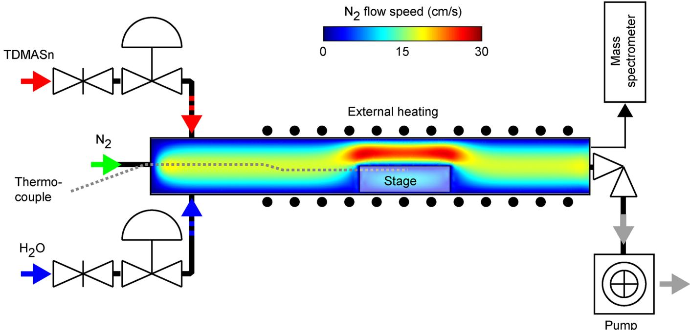
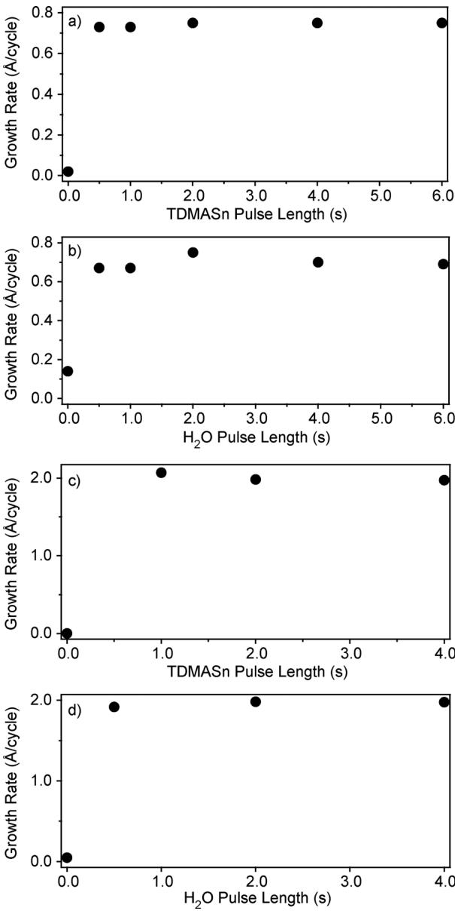
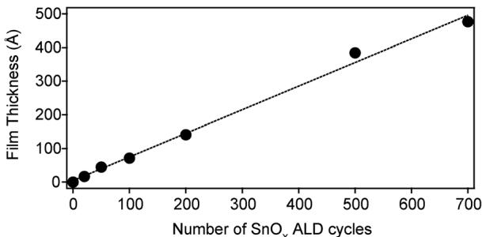
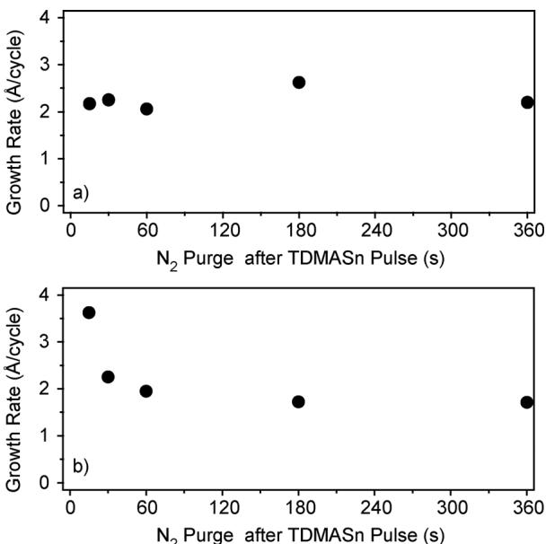
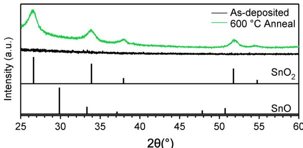
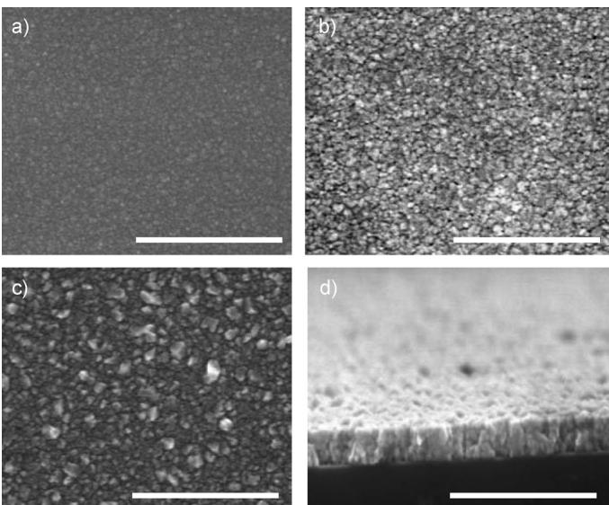
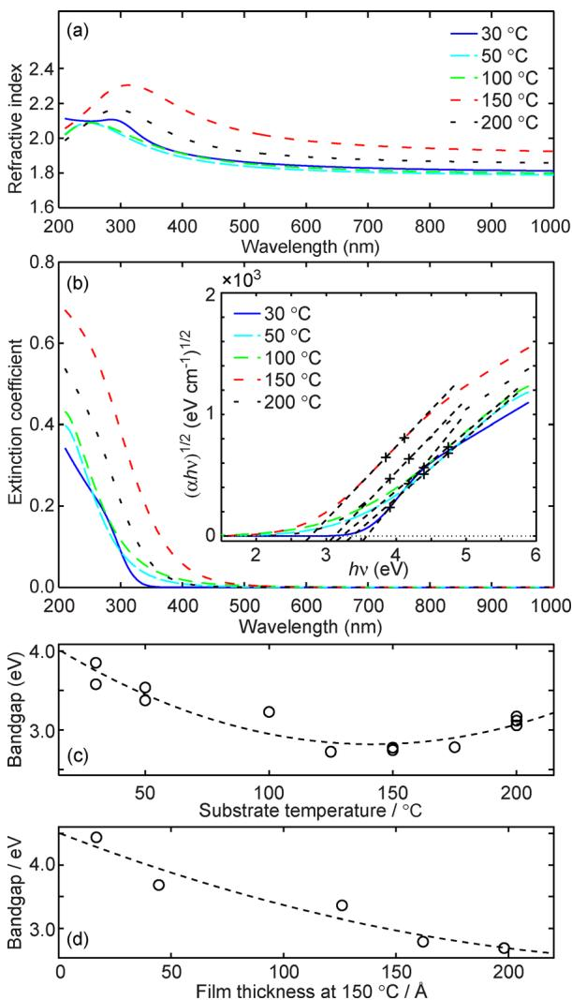

RESEARCH ARTICLE | JULY 09 2013

# Tin oxide atomic layer deposition from tetrakis(dimethylamino)tin and water  $\checkmark$

Marja N. Mullings; Carl Hagglund; Stacey F. Bent

Check for updates

J. Vac. Sci. Technol. A 31, 061603 (2013) https://doi.org/10.1116/1.4812717

# Tin oxide atomic layer deposition from tetrakis(dimethylamino)tin and water

Marja N. Mullings, Carl Hagglund, and Stacey F. Benta)  Department of Chemical Engineering, Stanford University, Stanford, California 94305

(Received 23 March 2013; accepted 18 June 2013; published 9 July 2013)

Due to the abundance and usefulness of tin oxide for applications such as transparent conductors, sensors, and catalysts, it is desirable to establish high quality atomic layer deposition (ALD) of this material. ALD allows for uniform, conformal coating of complex topographies with ultrathin films and can broaden the applicability of tin oxide to systems such as nanostructured solar cells. The present work examines the ALD of tin oxide by means of the precursor tetrakis(dimethylamino)tin and water as a counter- reactant. Low temperature growth in the range of  $30 - 200^{\circ}\mathrm{C}$  on Si(100) and glass substrates is studied. It is found that the growth rate increases with reduced temperature, up to  $\sim 2.0\dot{\mathrm{A}} /$  cycle at  $30^{\circ}\mathrm{C}$  as compared to  $0.70\dot{\mathrm{A}} /$  cycle at  $150^{\circ}\mathrm{C}$ . The ALD process is established to be saturated even at the lowest temperature studied, for which the film contamination levels are below the detection limits of  $\mathbf{X}$  - ray photoelectron spectroscopy. As- deposited films are smooth (rms roughness of  $33\mathrm{\AA}$  for a  $460\mathrm{\AA}$  thick film deposited on Si at  $150^{\circ}\mathrm{C}$  and amorphous according to  $\mathbf{X}$  - ray diffractometry. However, post- annealing to  $600^{\circ}\mathrm{C}$  in nitrogen leads to the formation of polycrystalline rutile  $\mathrm{SnO_2}$ . The optical constants obtained from variable angle spectroscopic ellipsometry suggest that as- deposited films have amorphous type bandgaps, which decrease with increasing temperature and film thickness. High quality, amorphous  $\mathrm{SnO_2}$  films with moderately tunable optical properties are thus obtained by ALD at temperatures as low as  $30^{\circ}\mathrm{C}$  using a commercially available tin precursor and water. © 2013 American Vacuum Society.

[http://dx.doi.org/10.1116/1.4812717]

# I. INTRODUCTION

Tin oxide,  $\mathrm{SnO_x}$ $1\leq x\leq 2$  is a wide bandgap semiconductor material with excellent optical, electrical, and chemical properties.1- 5 As a consequence,  $\mathrm{SnO_x}$  is used in a variety of applications including gas sensing,6- 9 surface coatings for functional glasses,10- 12 field effect transistors,13,14 catalysis,15- 17 and as transparent conducting oxides (TCOs) in photovoltaics and displays.18- 22 As part of the solid solution of indium tin oxide, it produces one of the most commercially important TCOs.23 In parallel with its large number of applications, many deposition techniques exist for thin films of  $\mathrm{SnO_x}$  including chemical vapor deposition (CVD),24- 28 spray- pyrolysis,29,30 sputtering,31 and atomic layer deposition (ALD).28,32- 44 ALD is the focus of this study because it has the potential to enhance the ways  $\mathrm{SnO_x}$  may be integrated with other materials and to broaden its applications.

For the purpose of growing uniform and conformal thin films, ALD is an increasingly popular method.45- 49 This vacuum deposition technique is based on alternating gas- surface reactions separated by inert purges allowing for self- limited growth, ideally yielding uniform and conformal films independent of substrate geometry. ALD has been used to deposit a wide range of materials, including metals,33,47,50- 54 metal oxides,47,53,55- 57 and metal sulfides.58- 61 It has also allowed for the area- selective growth of a variety of materials.45- 49,62- 69 Moreover, conformal coverage of three- dimensional substrates is a characteristic feature resulting from the self- limited growth mechanism of ALD.9,54,70- 74

Starting in the 1990s, ALD was explored as a way to deposit  $\mathrm{SnO_x}$  films.37,42,43 As with many other ALD systems, the choice of precursors for depositing  $\mathrm{SnO_x}$  was derived from related CVD processes.42,43 Depending on growth temperature, some of these films had the advantage of being crystalline as deposited, but yielded corrosive and equipment- damaging byproducts due to the use of halogenated precursors.33,36,42 Elam and coworkers were the first to publish on the development of a  $\mathrm{SnO_2}$  ALD process that used nonhalogenated precursors35 with further developments by Heo and coworkers.32,38 The former work elucidated the ALD process using tetrakis(dimethylamino)tin (TDMASn) and  $\mathrm{H}_2\mathrm{O}_2$  and determined an average growth rate of  $1.2\mathrm{\AA}/$  cycle, a temperature window of  $50 - 200^{\circ}\mathrm{C}$  and an average  $94\%$  transmission of visible light for a film thickness of  $140\mathrm{nm}$ . Growth rates of  $\mathrm{SnO_2}$  using TDMASn and other oxidant counter- reactants of ozone and water were also reported, although these particular ALD processes and the resultant films were not described in detail.

In this work, we build upon these previous results and further elucidate the ALD of  $\mathrm{SnO_x}$  films using the same nonhalogenated precursor, TDMASn, with water as the counter- reactant. We demonstrate the ability to deposit  $\mathrm{SnO_x}$  at temperatures as low as  $30^{\circ}\mathrm{C}$ , at growth rates equaling or exceeding that of ALD with  $\mathrm{H}_2\mathrm{O}_2$  as the counter- reactant. Compared to harsher counter- reactants such as  $\mathrm{H}_2\mathrm{O}_2$  and  $\mathrm{O}_3$ , water can make  $\mathrm{SnO_x}$  ALD more compatible with sensitive applications in, for instance, biological and polymeric systems. The use of water may further reduce operating costs and ease integration into existing processes. Moreover, water is the counter- reactant of the well- studied  $\mathrm{ZnO}$  ALD system based on diethyl zinc.75,76  $\mathrm{SnO_x}$  ALD with water is therefore

  
FIG. 1. (Color online) Schematic of the custom-built, hot-wall ALD reactor. The main part is a cylindrical tube, heated externally. The tube is fitted with inlets for  $\mathrm{N}_2$  carrier gas and precursors close to its upstream end. A sample stage with in-situ temperature monitoring is positioned near the center of the tube. A separately pumped mass spectrometer is used to analyze gas sampled downstream of the stage by means of a needle valve. The calculated carrier gas flow and diffusion through the tube indicate even distribution of the gas. The flow profile in the mid section of the tube is shown.

of potential interest for the development of a thermal zinc tin oxide (ZTO) ALD process, and as such provides an opportunity for ALD of ZTO with regard to its role as a transparent conducting oxide. $^{77}$

# II. EXPERIMENTAL DETAILS

The ALD experiments were carried out in a custom- built, viscous- flow, hot- wall reactor shown schematically in Fig. 1. The substrate was loaded into a tube style body (with  $35\mathrm{mm}$  diameter and  $\sim 300\mathrm{mm}$  length) on a stage with temperature monitoring through an incorporated thermocouple placed close to the substrate position. Nitrogen carrier gas  $(99.999\%)$  Air Products) at 10 sccm was flowed through the tube, enabling efficient transport of the precursors introduced at its upstream end. The reactor was evacuated by a rotary vane pump (Alcatel), resulting in a typical pressure of 100 mTorr during ALD. Precursor pressure pulse amplitudes were in the range of 1- 50 mTorr. Numerical calculations using the finite element method based on software from COMSOL Multiphysics were used to ensure adequate reactor design through modeling of carrier gas flow and diffusion as described elsewhere. $^{78}$  A quadrupole mass spectrometer (SRS RGA200) was used to sample the gas composition through a needle valve downstream of the ALD substrate.

TDMASn (Strem,  $>99\%$  purity) was used as a precursor with deionized water as the counter- reactant. The TDMASn precursor vial was heated to  $45^{\circ}\mathrm{C}$  and the line used to transport it into the reactor was heated to similar or higher temperature to ensure consistent vapor injections for deposition. Due to dilution in the carrier gas and effective pumping of the reactor, precursor condensation on the substrate was avoided even when the substrate temperature was slightly below the precursor vial temperature.

Substrates for  $\mathrm{SnO_x}$  ALD included n- type Si(100) with phosphorous dopant and a resistivity of  $1.0 - 5.0\Omega \text{- cm}$  (WRS Materials) and microscope slide glass (Thermo Scientific, Gold Seal, CAT. NO. 2050). All substrates were precleaned using a Piranha etch  $70\%$ $\mathrm{H}_2\mathrm{SO}_4$  and  $30\%$ $\mathrm{H}_2\mathrm{O}_2$  to remove organics and generate a chemical oxide.  $\mathrm{SnO_x}$  thin films were deposited directly onto this chemical oxide. After loading into the reactor, samples were allowed to outgas for at least  $20\mathrm{min}$  before the reactor was heated to achieve the desired substrate temperature. After injection of a given precursor for a certain pulse time, the excess precursor was purged with nitrogen before the counter- reactant was introduced. The ALD sequence is compactly expressed as  $\mathrm{t_1:t_2:t_3:t_4}$  where  $\mathfrak{t}_1$  and  $\mathfrak{t}_3$  correspond to the pulse lengths of TDMASn and water, respectively, and  $\mathfrak{t}_2$  and  $\mathfrak{t}_4$  to  $\mathrm{N}_2$  purge times following these doses. A typical timing sequence was  $1:30:2:30\mathrm{s}$

The deposited  $\mathrm{SnO_x}$  films were analyzed ex- situ by a variety of methods. A PHI VersaProbe 5000 scanning X- ray photoelectron spectrometer with Al  $\mathrm{K}\alpha$  radiation was used to determine elemental compositions, using the C1s peak at  $285.0\mathrm{eV}$  as a reference. After initial survey scans, adventitious carbon was removed by  $\mathrm{Ar^{+}}$  sputtering for  $12\mathrm{s}$  (1 keV,  $0.5\mu \mathrm{A}$ $1\mathrm{mm}\times 1\mathrm{mm}$  at  $45^{\circ}$  incidence from the sample). As- deposited films were annealed under flow of  $\mathrm{N}_2$ $(1\mathrm{cm}^3 /\mathrm{s})$  in a Mellen Series SC13R-  $1300^{\circ}\mathrm{C}$  single zone, split hinged, round tubular furnace with an Omega 7832 process controller at  $500^{\circ}\mathrm{C}$  and  $600^{\circ}\mathrm{C}$ . X- ray diffraction (XRD) measurements were taken as a function of anneal temperature using the

PANalytical X'Pert PRO system in parallel beam mode with  $\mathrm{CuK}\alpha$  radiation at  $45\mathrm{kV}$  and  $40\mathrm{mA}$ . Film thickness and optical constants of  $\mathrm{SnO_x}$  deposited on Si(100) were determined using a J.A. Woollam 2000 variable angle spectroscopy ellipsometer (VASE). Plan view and cross- sectional images of  $\mathrm{SnO_x}$  film morphology were examined using a FEI Magellan 400 XHR scanning electron microscope (SEM) with a field emission gun source (5kV and  $25\mathrm{pA}$ ). Optical extinction spectra of films deposited on microscope slide glass were recorded using a Varian Cary 6000i UV- Vis- NIR spectrometer. Topographical information for the films was determined by atomic force microscopy using a Park System atomic force microscope (AFM) in tapping mode.

# III. RESULTS AND DISCUSSION

# A. ALD growth characterization

Considering the surface reactions involved in the process is important for understanding the film growth by ALD. A possible mechanism for the  $\mathrm{SnO_2}$  ALD using TDMASn and  $\mathrm{H}_2\mathrm{O}_2$  based on in- situ quartz crystal microbalance analysis was previously suggested.35 The corresponding reaction mechanism with water as the counter- reactant is

$$
\begin{array}{r l} & {(\mathrm{OH})_{x}^{*} + \mathrm{Sn}(\mathrm{DMA})_{4}\longrightarrow (\mathrm{O})_{x}\mathrm{Sn}(\mathrm{DMA})_{4 - x}^{*} + x\mathrm{HDMA}}\\ & {\qquad (0)_{x}\mathrm{Sn}(\mathrm{DMA})_{4 - x}^{*} + 2\mathrm{H}_{2}\mathrm{O}\longrightarrow (\mathrm{OH})_{x}^{*} + \mathrm{SnO}_{2}}\\ & {\qquad +(4 - x)\mathrm{HDMA},} \end{array} \tag{1}
$$

where DMA represents the dimethylamino ligand, HDMA is dimethylamine (released to gas phase), the \* refers to surface- bound species, and  $\mathcal{X}$  is the number of DMA ligands released during the TDMASn pulse. Measurements indicated that  $x\approx 2.5$  with  $\mathrm{H}_2\mathrm{O}$  as the counter- reactant, compared to a higher value of  $x\approx 3$  when using  $\mathrm{H}_2\mathrm{O}_2$  . They suggest that this reaction stoichiometry is consistent with the lower growth rate observed with  $\mathrm{H}_2\mathrm{O}$  at higher temperatures and largely reflects a lower degree of surface hydroxylation.35 Reaction (1) shows the importance of the surface hydroxylation state for the initial adsorption of the precursor.

To determine the conditions for saturated ALD of  $\mathrm{SnO_x}$  in our studies, the growth rate as a function of TDMASn precursor pulse time  $(\mathfrak{t}_1)$  was investigated. Thin films of  $\mathrm{SnO_x}$  were deposited on Si(100) at  $150^{\circ}\mathrm{C}$  for 200 cycles with a timing sequence of  $\mathrm{t}_1{:}30{:}2{:}30\mathrm{s}$  . The purge times of  $30~\mathrm{s}$  were conservatively selected to be long enough to purge away excess reactant, as judged by the downstream gas composition monitored by mass spectroscopy. In this way, contributions from CVD were minimized. Average film thicknesses determined by VASE were used to calculate the  $\mathrm{SnO_x}$  growth rate. Figure 2(a) represents the saturation curve for TDMASn and shows that, within the uncertainty of the experiment, saturated behavior is reached already for the shortest pulse time of  $0.5\mathrm{s}$  at  $150^{\circ}\mathrm{C}$  The TDMASn pulse time was fixed to  $1\mathrm{s}$  to ensure saturation in subsequent experiments. The  $\mathrm{SnO_x}$  growth as a function of water pulse length  $(\mathfrak{t}_3)$  was also investigated following a similar procedure as before but using a pulse- purge sequence of  $1:30:\mathrm{t}_3:30\mathrm{s}$  .Figure 2(b) shows that a relatively steady growth rate is established after  $0.5\mathrm{s}$ $\mathrm{H}_2\mathrm{O}$  pulse times. These precursor saturation studies suggest that saturated growth is accomplished for a broad range of pulse lengths. We obtained growth rates with good reproducibility for a timing sequence of  $1:30{:}2{:}30\mathrm{s}$  at  $150^{\circ}\mathrm{C}$

  
FIG.2.  $\mathrm{SnO_x}$  growth rate determined by VASE, as a function of (a) and (c) TDMASn pulse length  $\mathfrak{t}_1$  for timing sequences of  $\mathrm{t}_1{:}30{:}2{:}30\mathrm{s}$  and (b) and (d)  $\mathrm{H}_2\mathrm{O}$  pulse length  $\mathfrak{t}_3$  for timing sequences of  $1:30:\mathrm{t}_3:30\mathrm{s}$  The substrate was Si(100) at  $150^{\circ}\mathrm{C}$  for (a) and (b) and at  $30^{\circ}\mathrm{C}$  for (c) and (d).

The precise conditions for establishing ALD saturation in terms of precursor exposure time depend on the particular reactor design in addition to the choice of precursor and counter- reactant. The work of Elam and coworkers using the tin precursor, TDMASn, and  $\mathrm{H}_2\mathrm{O}_2$  to deposit  $\mathrm{SnO_x}$  by ALD showed a gradual approach toward saturated growth. To explain this gradual ascent toward saturation, it was proposed that DMA binds strongly to the hydroxylated substrate resulting in slow desorption, thereby limiting the adsorption of further TDMASn for pulse times below  $2\mathrm{s}$ . However, this

  
FIG. 3.  $\mathrm{SnO_x}$  film thickness as a function of number of ALD cycles yielding a growth rate of  $0.70\mathrm{\AA}$  cycle. Thicknesses were obtained using VASE for films deposited on Si(100) at  $150^{\circ}\mathrm{C}$  with a time sequence of  $130:2:30$

effect was not observed in our studies in which water was used as the counter- reactant; for the pulse time intervals explored, there is little difference between growth rates at shorter  $(0.5\mathrm{s})$  and longer pulse times  $(>1.0\mathrm{s})$  suggesting that surface saturation occurred quickly.

Figure 3 presents the  $\mathrm{SnO_x}$  film thickness as a function of number of ALD cycles over the range of 20 to 700 cycles. The data were collected using VASE for deposition on a  $\mathrm{Si}(100)$  substrate at  $150^{\circ}\mathrm{C}$  with a timing sequence of  $1:30:2:30\mathrm{s}$ . The linear dependence of film thickness on cycle number indicates sustained layer- by- layer growth characteristic of ALD. The average growth rate is  $0.70\mathrm{\AA}$  cycle, in close agreement with the previously reported value at this temperature.35

Figure 4 shows the growth rate of  $\mathrm{SnO_x}$  as a function of deposition temperature ranging from 30 to  $200^{\circ}\mathrm{C}$ . The growth rate displays a clearly decreasing trend with increasing deposition temperature over the entire interval, with a slight plateau in the range from 150 to  $175^{\circ}\mathrm{C}$ . The growth rate at  $30^{\circ}\mathrm{C}$  of  $\sim 2.1\mathrm{\AA}$  cycle is about four times higher than that at  $200^{\circ}\mathrm{C}$  where it is  $\sim 0.5\mathrm{\AA}$  cycle. This sensitivity to deposition temperature is much higher than that reported for the TDMASn and  $\mathrm{H}_2\mathrm{O}_2$  ALD system.35 In that system, the growth rate varied only from  $\sim 1.6\mathrm{\AA}$  cycle at  $50^{\circ}\mathrm{C}$  to  $\sim 1.3\mathrm{\AA}$  cycle at  $200^{\circ}\mathrm{C}$ , respectively. Also, a region of near constant growth rate was shown between 100 and  $200^{\circ}\mathrm{C}$ . On the other hand, it is interesting to note that the use of water as a counter- reactant results in a higher growth rate at low temperatures than that previously observed with  $\mathrm{H}_2\mathrm{O}_2$ . Comparing with the data presented by Elam and coworkers, the crossover is around  $80^{\circ}\mathrm{C}$ . So even though the use of water as a TDMASn counter- reactant is expected to result in lower concentration of reactive surface hydroxyl groups at the higher temperatures investigated, the overall  $\mathrm{SnO_x}$  growth rate is higher at the lower temperatures.

  
FIG. 4.  $\mathrm{SnO_x}$  ALD growth rate as a function of temperature determined using VASE for films deposited on Si(100) for 200 cycles with timing sequence  $1:30:2:30\mathrm{s}$

  
FIG. 5.  $\mathrm{SnO_x}$  growth rate at  $30^{\circ}\mathrm{C}$  determined by VASE as a function of nitrogen purge time following (a) TDMASn pulse length and (b)  $\mathrm{H}_2\mathrm{O}$  pulse length for timing sequences of  $1:1:2:1\mathrm{t}_4\mathrm{s}$ . The substrate was Si(100).

Larger coverages of more loosely bound molecular water or water- derived species may be available in this temperature range and capable of contributing to the growth observed. However, measurement of the growth rates at  $30^{\circ}\mathrm{C}$  presented in Figs. 2(c) and 2(d) shows that the reactions still saturate with the water precursor pulse length. Furthermore, at this low temperature, growth rate purge time dependence following the 1s TDMASn pulse [Fig. 5(a)] and 2 s water pulse [Fig. 5(b)] shows saturated growth characteristic of ALD. Taken together, these data imply that the water and water- derived species present at the surface contribute to the growth of the  $\mathrm{SnO_x}$  film at this low temperature. Though in- situ or theoretical studies may be needed to elucidate the detailed nature of the water- derived species responsible for the high growth rate in this regime, it is a significant finding that growth saturation behavior, characteristic of ALD, can be achieved at  $30^{\circ}\mathrm{C}$ .

# B. Film characterization and properties

X- ray photoelectron spectroscopy (XPS) was performed to determine the film composition. Figure 6 shows an XPS survey scan of a  $46\mathrm{nm}\mathrm{SnO_x}$  film deposited at  $150^{\circ}\mathrm{C}$  on Si(100) after removal of adventitious surface carbon by  $\mathrm{Ar}^+$  sputtering. The data show the presence of both Sn and O, confirming the deposition of an oxide of tin; no carbon or nitrogen contamination is observed.

Providing a quantitative stoichiometry of the  $\mathrm{SnO_x}$  film from XPS data is difficult. The atomic ratio of Sn:O before sputtering was close to 1:2, which would suggest a stoichiometry of  $\mathrm{SnO}_2$ . After sputtering the ratio of Sn:O was closer

  
FIG. 6. X-ray photoelectron spectroscopy survey scan of  $46\mathrm{nm}\mathrm{SnO_x}$  film deposited on  $\mathrm{Si(100)}$  at  $150^{\circ}\mathrm{C}$  after  $\mathrm{Ar}^+$  sputtering.

to 1:1 suggesting a stoichiometry of  $\mathrm{SnO}$ . However, the possibility of preferential sputtering of one element over another leads to uncertainty in the compound stoichiometry. Using the core level shifts to determine the oxidation state of as- deposited  $\mathrm{SnO_x}$  using XPS is also challenging due to the closeness in values of the  $\mathrm{Sn3d_{5 / 2}}$  binding energies for  $\mathrm{SnO}$ $(486.8\mathrm{eV})$  and  $\mathrm{SnO_2}$ $(487.2\mathrm{eV})$ .

XPS spectra were also obtained for  $\mathrm{SnO_x}$  films as a function of ALD temperature. The data show that nearly carbon- free films can be deposited at all growth temperatures studied. Carbon levels determined by XPS as a function of deposition temperature are shown in Supporting Information,79 Fig. S1, both before and after  $\mathrm{Ar}^+$  sputtering to remove adventitious carbon. Although carbon is observed in all films before sputtering, the films were solely comprised of Sn and O after sputtering, independent of deposition temperature. Importantly, these data indicate that  $\mathrm{SnO_x}$  ALD films can be deposited without significant carbon contamination even near room temperature. In contrast, nitrogen and carbon contamination was observed by Elam and coworkers when using  $\mathrm{H}_2\mathrm{O}_2$  rather than  $\mathrm{H}_2\mathrm{O}$  at temperatures below  $\sim 100^{\circ}\mathrm{C}$ .

The  $\mathrm{SnO_x}$  films were examined by XRD both as deposited and after annealing in nitrogen. Figure 7 shows the XRD patterns as deposited and after nitrogen annealing to  $600^{\circ}\mathrm{C}$ ; reference diffraction patterns of  $\mathrm{SnO}$  and  $\mathrm{SnO_2}$  are included for comparison. For the as- deposited film at  $150^{\circ}\mathrm{C}$ , the film appears to be amorphous. Patterns appear but exhibit broad peaks upon annealing at  $600^{\circ}\mathrm{C}$ .

  
FIG. 7. (Color online) XRD patterns for a  $130\mathrm{nm}$  film of  $\mathrm{SnO_x}$  deposited on  $\mathrm{Si(100)}$  at  $150^{\circ}\mathrm{C}$  as function of annealing temperature under flow of  $\mathrm{N}_2$ , as-deposited (featureless black curve) and after  $600^{\circ}\mathrm{C}$  anneal (upper curve, with diffraction peaks).

The diffraction pattern after annealing is characteristic of the  $\mathrm{SnO_2}$  phase, including reflection of the (110), (101), (200), and (211) planes at  $26.6^{\circ}$ ,  $33.9^{\circ}$ ,  $37.9^{\circ}$ , and  $51.8^{\circ}$ . The diffraction peaks in Fig. 7 are indexed on the basis of the rutile  $\mathrm{SnO_2}$  unit cell. Patterns indicative of  $\mathrm{SnO}$  for reflection of the (101) and (110) planes at  $29.9^{\circ}$  and  $33.3^{\circ}$  were not evident. The large width and low intensities of the peaks may be the result of small crystallites from incomplete crystallization as well as the relatively low thickness of the films  $(130\mathrm{nm})$ . The data strongly suggest that these films consist of rutile  $\mathrm{SnO_2}$ .

The film morphology as a function of annealing temperature in  $\mathrm{N}_2$  is shown in Fig. 8 for a  $46\mathrm{nm}$  thick  $\mathrm{SnO_x}$  sample deposited at  $150^{\circ}\mathrm{C}$  on  $\mathrm{Si(100)}$ . Figure 8(a) indicates that the as- deposited film morphology is relatively smooth with little variation in features. From AFM (data not shown), the root mean squared (rms) roughness of the as- deposited film was  $3.3\mathrm{nm}$ . Figures 8(b) and 8(c) show plan view SEM images of films annealed at 500 and  $600^{\circ}\mathrm{C}$ , respectively. Upon annealing, the film roughness increases and the crystallite size increases. The appearance of a more crystalline film is consistent with the diffraction pattern from XRD. The cross- sectional image in Fig. 8(d) of the film annealed at  $600^{\circ}\mathrm{C}$  provides more support for polycrystallinity. The rms roughness of this film was  $4.5\mathrm{nm}$  as determined by AFM, which is larger than for the as- deposited case and consistent with the growth of larger crystallites.

The optical properties of the  $\mathrm{SnO_x}$  films were analyzed using variable angle spectroscopic ellipsometry. The ellipsometry data were analyzed using a generalized oscillator model for the  $\mathrm{SnO_x}$  layer. This model included a polynomial spline function (the psemi- m0 oscillator80) and pole terms in the infrared and ultraviolet, outside the measured range. The resulting optical constants are consistent with the Kramers- Kronig relation by construction.

  
FIG. 8. SEM images of a  $46\mathrm{nm}$ $\mathrm{SnO_x}$  film deposited on  $\mathrm{Si(100)}$  at  $150^{\circ}\mathrm{C}$  (a) as-deposited; (b) post-  $500^{\circ}\mathrm{C}$  anneal; (c) post-  $600^{\circ}\mathrm{C}$  anneal; (d) cross-section of film post-  $600^{\circ}\mathrm{C}$  anneal. The scale bars are  $300\mathrm{nm}$ .

The resulting refractive index  $n$  and extinction coefficient  $k$  are displayed in Figs. 9(a) and 9(b), respectively, for films deposited on Si(100) using a fixed number of 200 ALD cycles and varying substrate temperatures  $(30 - 200^{\circ}\mathrm{C})$ . Both optical constants vary with temperature and display maximum values for films deposited around  $150^{\circ}\mathrm{C}$ . In the literature, (poly- ) crystalline  $\mathrm{SnO_2}$  is typically ascribed a direct bandgap in the range of  $3.6 - 4.0\mathrm{eV}$ . In order to analyze the optical bandgaps of the  $\mathrm{SnO_x}$  films produced here, their absorption coefficients were determined from  $\alpha = 4\pi k / \lambda$  where  $\lambda$  is the wavelength of light. However, a direct bandgap dependence was not clear in a plot of  $(\alpha h\nu)^2$  versus photon energy  $(h\nu)$ . Rather, and more characteristic for amorphous and indirect bandgap semiconductors, a plot of the function  $(\alpha h\nu)^{1 / 2}$  versus photon energy revealed a linear segment close to the absorption onset. By extrapolating this segment to its intersection with the energy axis [see inset of Fig. 9(b)], the energy gaps of the  $\mathbf{x}$  - ray amorphous  $\mathrm{SnO_x}$  films were estimated. Figure 9(c) shows these energy gaps as a function of substrate temperature.

  
FIG. 9. (Color online) (a)  $\mathrm{SnO_x}$  film refractive index and (b) extinction coefficient extracted from spectroscopic ellipsometry, as a function of the substrate temperature for films deposited using 200 ALD cycles. The inset in (b) illustrates plots of  $(\alpha h\nu)^{1 / 2}$  with linear fits (dashed lines) to the approximately linear portion of the curve. Bandgaps are estimated from the intersection of the linear fits with  $(\alpha h\nu)^{1 / 2} = 0$ . (c) Estimated bandgaps as a function of temperature, after 200 cycles of ALD. (d) Bandgaps as a function of film thickness for varying number of ALD cycles and a substrate temperature fixed to  $150^{\circ}\mathrm{C}$ . The dashed lines in (c) and (d) represent quadratic fits to the data.

The bandgaps of Fig. 9(c) reveal a significant temperature dependence, with a minimum occurring around  $150^{\circ}\mathrm{C}$ . Because the number of ALD cycles was fixed in this experiment, the varying growth rates (Fig. 4) means that the film thickness were higher for the lower temperatures. To investigate if the observed bandgaps and other properties depend on the film thickness, additional experiments at fixed temperature  $(150^{\circ}\mathrm{C})$  and a varying number of ALD cycles were performed. The results, shown in Fig. 9(d), indicate a monotonic decrease of bandgap with thickness, from  $4.4\mathrm{eV}$  for the thinnest (approximately  $2\mathrm{nm}$ ) film down to  $2.7\mathrm{eV}$  for the thickest  $(20\mathrm{nm})$  film. The film thickness dependence may therefore possibly explain the increasing trend at the highest temperatures of Fig. 9(c). Although the underlying mechanism for this thickness dependence is not yet known, we speculate that the films, rather than being purely amorphous, may form a fine- grained microstructure undetectable to XRD and with feature sizes related to the film thickness. If the grains confine the wave functions of excited states, the bandgap will be affected by their size, with smaller grains exhibiting larger bandgaps. Since the exciton Bohr radius of  $\mathrm{SnO_2}$  quantum dots has been estimated to  $2.7\mathrm{nm}$ , it seems feasible that effects related to quantum confinement could be observed for the range of thicknesses covered here. Similar reasoning could be used to explain the increasing bandgap at lower temperatures, where growth conditions rather than film thickness would favor smaller grain sizes and therefore higher bandgap. The minimum bandgap at  $150^{\circ}\mathrm{C}$  may then plausibly be the result of a maximum grain size, for the particular situation after 200 ALD cycles. Further characterization, for instance by transmission electron microscopy, would be needed to clarify this sensitive dependence of the optical properties on film thickness and substrate temperature in  $\mathrm{SnO_x}$  thin films. In this context, it is also noteworthy that the growth rate increases by more than a factor 2 as the substrate temperature is reduced from 100 to  $30^{\circ}\mathrm{C}$  (Fig. 4). One may suspect that a lower mobility of surface species at low temperature would lead to a more porous film, and perhaps a concomitant higher growth rate. However, as the refractive indices are essentially the same over the whole spectrum in this temperature interval [Fig. 9(a)], film porosity is unlikely to account for increased growth rate, and an explanation based on the surface coverage of hydroxyl groups, outlined above, appears more plausible.

# IV. SUMMARY AND CONCLUSIONS

By exploring in detail the use of water as a counter- reactant, this work expands on the application of TDMASn for the deposition of high quality tin oxide films in a low temperature range of  $30 - 200^{\circ}\mathrm{C}$ . Spectroscopic analyses show no appreciable change in elemental composition as a function of deposition temperature. Morphological and topographical analyses show that as- deposited  $\mathrm{SnO_x}$  film is

relatively smooth, with only small crystalline features. XRD measurements before and after annealing in inert atmosphere show that the deposited films consist of  $\mathbf{X}$  - ray amorphous  $\mathrm{SnO_2}$  which transform to rutile  $\mathrm{SnO_2}$  after annealing. The optical properties of the films display an interesting dependence on both deposition temperature and film thickness. Thin films grown at low temperature  $(30^{\circ}\mathrm{C})$  have relatively high bandgaps in excess of  $4.0\mathrm{eV}$  while thicker films grown at  $150^{\circ}\mathrm{C}$  have bandgaps below  $3\mathrm{eV}$  .Thus,  $\mathrm{SnO_x}$  films of high purity may to some extent be grown with tailored properties using this ALD process. This scheme for  $\mathrm{SnO_x}$  ALD can allow for electrically and optically useful films, such as for transparent conductors and solar cell buffer layers, to be produced from earth abundant and inexpensive raw materials. The ability to grow this important metal oxide at near room temperature may further be favorable for biological applications and in industrial processes where reduced thermal demands are desired.

# ACKNOWLEDGMENTS

The authors thank Han Zhou for AFM measurements. This work was supported by the Center for Nanostructuring for Efficient Energy Conversion, an Energy Frontier Research Center (EFRC) funded by the U.S. Department of Energy, Office of Basic Energy Sciences, Award No. DESC0001060. M.N.M. acknowledges the Bell Labs Graduate Fellowship Research Fellowship Program for graduate fellowship support. C.H. is grateful for financial support from the Marcus and Amalia Wallenberg Foundation.

$^1\mathrm{J}.$  L.G.Fierro, Metal Oxides Chemistry and Applications (CRC/Taylor & Francis, Boca Raton, FL, 2006).  $^2\mathrm{H}$  Ogawa, A. Abe, M. Nishikawa, and S. Hayakawa, J. Electrochem. Soc. 128, 2020 (1981).  $^3\mathrm{K}$  Ishiguro, T. Sasaki, T. Arai, and I. Imai, J. Phys. Soc. Jpn. 13, 296 (1958).  $^4\mathrm{M}$  Batzill and U. Diebold, Prog. Surf. Sci. 79, 47 (2005).  $^5\mathrm{P}$  Cox, The Surface Science of Metal Oxides (Cambridge University Press, Cambridge, NY, 1994).  $^6\mathrm{J}$  Watson, Sens. Actuators 5, 29 (1984).  $^7\mathrm{B}$  Panchapakesan, D. L. DeVoe, M. R. Widmaier, R. Cavicchi, and S. Semancik, Nanotechnology 12, 336 (2001).  $^8\mathrm{C}$  J. Martinez, B. Hockey, C. B. Montgomery, and S. Semancik, Langmuir 21, 7937 (2005).  $^9\mathrm{A}$  Kolmakov, Y. Zhang, G. Chang, and M. Moskovits, Adv. Mater. 15, 997 (2003).  $^{10}\mathrm{H}$  De Waal and F. Simons, Thin Solid Films 77, 253 (1981).  $^{11}\mathrm{M}$  Vergohl, N. Malkomes, T. Matthee, G. Brauer, U. Richter, F. W. Nickol, and J. Bruch, Thin Solid Films 392, 258 (2001).  $^{12}\mathrm{R}$  G. Gordon, J. Proscia, F. B. Ellis, Jr., and A. E. Delahoy, Sol. Energy Mater. 18, 263 (1989).  $^{13}\mathrm{H}$  Klasens, Solid State Electron. 7, 701 (1964).  $^{14}\mathrm{H}$  K. Liao, J. C. Chou, W. Y. Chung, T. P. Sun, and S. K. Hsiung, Sens. Actuators B 50, 104 (1998).  $^{15}\mathrm{F}$  Chen and M. Liu, Chem. Commun. 1999, 1829.  $^{16}\mathrm{P}$  Gao, Y. Ding, and Z. Wang, Nano Lett. 3, 1315 (2003).  $^{17}\mathrm{A}$  Hagemeyer, Z. Hogan, M. Schlichter, B. Smaka, G. Streukens, H. Turner, A. Volpe, H. Weinberg, and K. Yaccato, Appl. Catal., A 317, 139 (2007).  $^{18}\mathrm{S}$  Ferrere, A. Zaban, and B. A. Gregg, J. Phys. Chem. B 101, 4490 (1997).  $^{19}\mathrm{J}$  S. Lee et al., J. Cryst. Growth 254, 443 (2003).  $^{20}\mathrm{R}$  Gordon, J. Non- Cryst. Solids 218, 81 (1997).  $^{21}\mathrm{T}$  Minami, Thin Solid Films 516, 5822 (2008).

$^{22}\mathrm{J}$  Proscia and R. G. Gordon, Thin Solid Films 214, 175 (1992).  $^{23}\mathrm{R}$  B. H. Tahar, T. Ban, Y. Ohya, and Y. Takahashi, J. Appl. Phys. 83, 2631 (1998).  $^{24}\mathrm{G}$  Sanon, R. Rup, and A. Mansingh, Thin Solid Films 190, 287 (1989).  $^{25}\mathrm{J}$  Kane, H. Schweizer, and W. Kern, J. Electrochem. Soc. 122, 1144 (1975).  $^{26}\mathrm{E}$  J. H. Lee, C. Ribeiro, T. R. Giraldi, E. Longo, E. R. Leite, and J. A. Varela, Appl. Phys. Lett. 84, 1745 (2004).  $^{27}\mathrm{R}$  D. Tarey and T. A. Raju, Thin Solid Films 128, 181 (1985).  $^{28}\mathrm{J}$  Sundqvist, J. Lu, M. Ottosson, and A. Harsta, Thin Solid Films 514, 63 (2006).  $^{29}\mathrm{G}$  H. Park, Y. C. Son, W. S. Willis, S. L. Suib, and K. E. Creasy, Chem. Mater. 10, 2389 (1998).  $^{30}\mathrm{V}$  Brinzari, G. Korotcenkov, and V. Golovanov, Thin Solid Films 391, 167 (2001).  $^{31}\mathrm{G}$  Sberveglieri, Sens. Actuators B 6, 239 (1992).  $^{32}\mathrm{J}$  Heo, A. S. Hock, and R. G. Gordon, Chem. Mater. 22, 4964 (2010).  $^{33}\mathrm{G}$  Choi, L. Satyanarayana, and J. Park, Appl. Surf. Sci. 252, 7878 (2006).  $^{34}\mathrm{M}$  Utriainen, H. Lattu, H. Viirola, L. Niinisto, R. Resch, and G. Friedbacher, Mikrochim. Acta 133, 119 (2000).  $^{35}\mathrm{J}$  W. Elam, D. A. Baker, A. J. Hryn, A. B. F. Martinson, M. J. Pellin, and J. T. Hupp, J. Vac. Sci. Technol. A 26, 244 (2008).  $^{36}\mathrm{X}$  Du, Y. Du, and S. George, J. Vac. Sci. Technol. A 23, 581 (2005).  $^{37}\mathrm{C}$  Ducs, N. Q. Khan, Z. Horvath, I. Barsony, M. Utriainen, S. Lehto, M. Nieminen, and L. Niinisto, J. Electrochem. Soc. 143, 683 (1996).  $^{38}\mathrm{J}$  Heo, S. B. Kim, and R. G. Gordon, J. Mater. Chem. 22, 4599 (2012).  $^{39}\mathrm{D}$  H. Kim, J.- H. Kwon, M. Kim, and S.- H. Hong, J. Cryst. Growth 322, 33 (2011).  $^{40}\mathrm{J}$  J. Robbins, R. T. Alexander, M. Bai, Y. J. Huang, T. L. Vincent, and C. A. Wolden, J. Vac. Sci. Technol. A 19, 2762 (2001).  $^{41}\mathrm{J}$  Sundqvist, A. Tarre, A. Rosental, and A. Haruta, Chem. Vap. Deposition 9, 21 (2003).  $^{42}\mathrm{H}$  Virola and L. Niinisto, Thin Solid Films 251, 127 (1994).  $^{43}\mathrm{V}$  E. Drozd and V. B. Aleskovski, Appl. Surf. Sci. 82- 83, 591 (1994).  $^{44}\mathrm{C}$  Marichy, N. Donato, M.- G. Willinger, M. Latino, D. Karpinsky, S.- H. Yu, G. Nei, and N. Pinna, Adv. Funct. Mater. 21, 658 (2011).  $^{45}\mathrm{S}$  M. George, Chem. Rev. 110, 111 (2010).  $^{46}\mathrm{M}$  Leskelai and M. Ritala, Thin Solid Films 409, 138 (2002).  $^{47}\mathrm{T}$  Aaltonen, M. Ritala, T. Sajavaara, J. Keinonen, and M. Leskela, Chem. Mater. 15, 1924 (2003).  $^{48}\mathrm{R}$  L. Puurunen, J. Appl. Phys. 97, 121301 (2005).  $^{49}\mathrm{M}$  Ritala and M. Leskelai, Handbook of Thin Films, edited by H. S. Nalva (Academic Press, San Diego, 2001), Vol. 1, pp. 103.  $^{50}\mathrm{H}$  Kim, Surf. Coat. Technol. 200, 3104 (2006).  $^{51}\mathrm{H}$  Kim, J. Vac. Sci. Technol. B 21, 2231 (2003).  $^{52}\mathrm{B}$  S. Lim, A. Rahti, and R. G. Gordon, Nat. Mater. 2, 749 (2003).  $^{53}\mathrm{T}$  Aaltonen, M. Ritala, V. Sammelselg, and M. Leskela, J. Electrochem. Soc. 151, G489 (2004).  $^{54}\mathrm{D}$  B. Farmer and R. G. Gordon, Electrochem. Solid- State Lett. 8, G89 (2005).  $^{55}\mathrm{X}$  Wang, S. M. Tabakman, and H. Dai, J. Am. Chem. Soc. 130, 8152 (2008).  $^{56}\mathrm{M}$  M. Frank, G. D. Wilk, D. Starodub, T. Gronafsson, E. Garfunkel, Y. J. Chabal, J. Grazul, and D. A. Muller, Appl. Phys. Lett. 86, 152904 (2005).  $^{57}\mathrm{M}$  Ritala, K. Kukli, A. Rahti, P. I. Raishnen, M. Leskelai, T. Sajavaara, and J. Keinonen, Science 288, 319 (2000).  $^{58}\mathrm{J}$  Y. Kim and S. M. George, J. Phys. Chem. C 114, 17597 (2010).  $^{59}\mathrm{L}$  Reijnen, B. Meester, A. Goossens, and J. Schoonman, Chem. Vap. Deposition 9, 15 (2003).  $^{60}\mathrm{P}$  Sinsermsuksakul, J. Heo, W. Noh, A. S. Hock, and R. G. Gordon, Adv. Energy Mater. 1, 1116 (2011).  $^{61}\mathrm{E}$  B. Yousfi, B. Weinberger, F. Donsani, P. Cowache, and D. Lincot, Thin Solid Films 387, 29 (2001).  $^{62}\mathrm{Y}$  Hua, W. P. King, and C. L. Henderson, Microelectron. Eng. 85, 934 (2008).  $^{63}\mathrm{X}$  Jiang and S. F. Bent, J. Electrochem. Soc. 154, D648 (2007).  $^{64}\mathrm{X}$  Jiang and S. F. Bent, J. Phys. Chem. C 113, 17613 (2009).  $^{65}\mathrm{H}$  - B.- R. Lee, K. Jaemin, K. Hyungjun, K. Woo- Hee, L. Jeong Won, and H. Inchan, J. Korean Phys. Soc. 56, 104 (2010).  $^{66}\mathrm{W}$  Lee and F. B. Prinz, J. Electrochem. Soc. 156, G125 (2009).  $^{67}\mathrm{M}$  N. Mullings, H.- B.- R. Lee, N. Marchack, X. Jiang, Z. Chen, Y. Gorlin, K.- P. Lin, and S. F. Bent, J. Electrochem. Soc. 157, D600 (2010).

$^{68}$ R. H. A. Ras, E. Sahramo, J. Malm, J. Raula, and M. Karppinen, J. Am. Chem. Soc. **130**, 11252 (2008).   $^{69}$ A. Sinha, D. W. Hess, and C. L. Henderson, Proc. SPIE **6519**, 65191J (2007).   $^{70}$ D. B. Farmer and R. G. Gordon, Nano Lett. **6**, 699 (2006).   $^{71}$ C. F. Herrmann, F. H. Fabreguette, D. S. Finch, R. Geiss, and S. M. George, Appl. Phys. Lett. **87**, 123110 (2005).   $^{72}$ W.- H. Kim, S.- J. Park, J.- Y. Son, and H. Kim, Nanotechnology **19**, 045302 (2008).   $^{73}$ J. S. King, D. Heineman, E. Graugnard, and C. J. Summers, Appl. Surf. Sci. **244**, 511 (2005).   $^{74}$ I. M. Povey, M. Bardosova, F. Chalvet, M. E. Pemble, and H. M. Yates, Surf. Coat. Technol. **201**, 9345 (2007).   $^{75}$ A. Yamada, B. S. Sang, and M. Konagai, Appl. Surf. Sci. **112**, 216 (1997).

$^{76}$ B. S. Sang and M. Konagai, Jpn. J. Appl. Phys., Part 2 **35**, L602 (1996).   $^{77}$ C. A. Hoel, T. O. Mason, J. F. Gaillard, and K. R. Poeppelmeier, Chem. Mater. **22**, 3569 (2010).   $^{78}$ R. Methaapanon, S. M. Geyer, C. Hägglund, P. A. Pianetta, and S. F. Bent, Rev. Sci. Instrum. **84**, 015104 (2013).   $^{79}$ See supplementary material at http://dx.doi.org/10.1116/1.4812717 for carbon contamination determined by X- ray photoelectron spectroscopy.   $^{80}$ C. Herzinger and B. Johs, *Guide to Using WVASE32* (J.A. Woollam Company, Lincoln, NE, 1996).   $^{81}$ D. Davazoglou, Thin Solid Films **302**, 204 (1997).   $^{82}$ J. Melsheimer and D. Ziegler, Thin Solid Films **129**, 35 (1985).   $^{83}$ J. Tauc, R. Grigorov, and A. Vancu, *Phys. Status Solidi* **15**, 627 (1966).   $^{84}$ M. Orring, *Materials Science of Thin Films* (Stevens Institute of Technology, Hoboken, NJ, 2002).