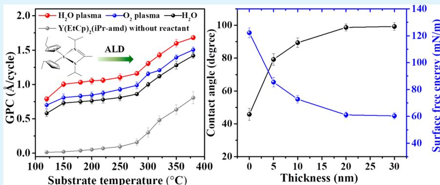
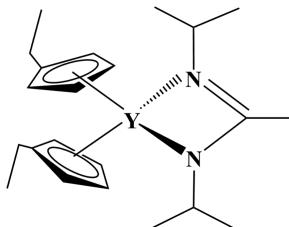
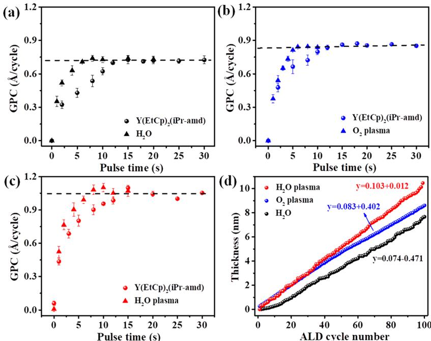
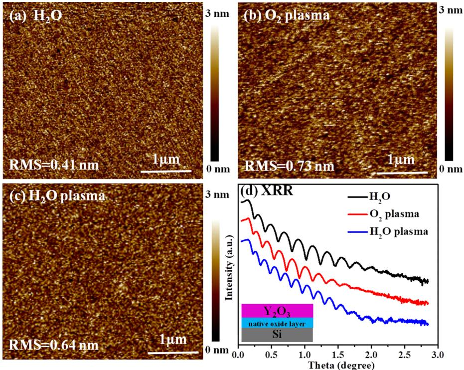
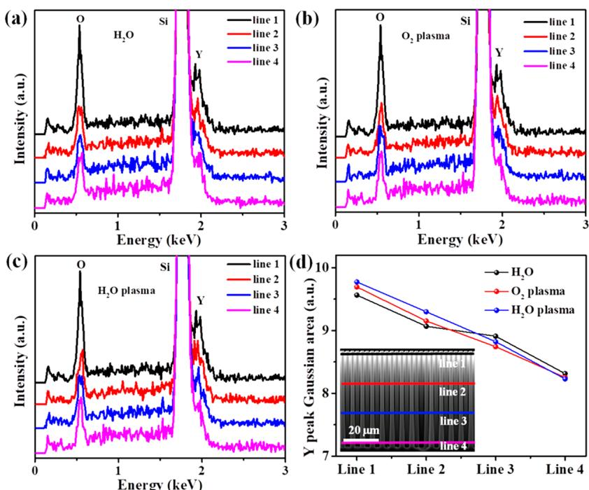
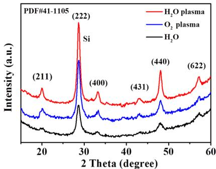
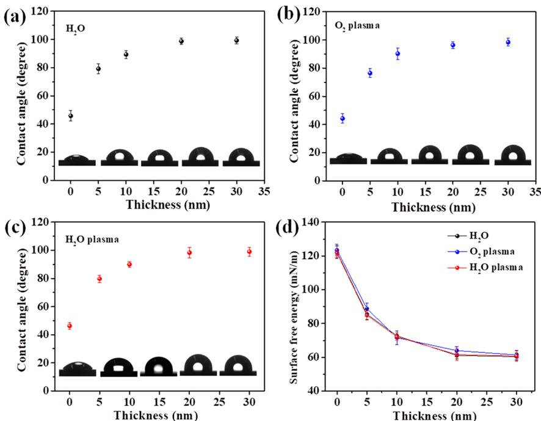
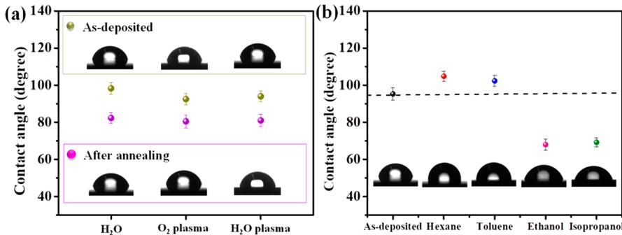

# Thermal and Plasma-Enhanced Atomic Layer Deposition of Yttrium Oxide Films and the Properties of Water Wettability

Bo Zhao, Felix Mattelaer, Geert Rampelberg, Jolien Dendooven, and Christophe Detavernier*

Department of Solid State Sciences, Ghent University, Krijgslaan 281 S12, 9000 Ghent, Belgium

Supporting Information

ABSTRACT: The atomic layer deposition (ALD) of yttrium oxide  $(\mathrm{Y}_2\mathrm{O}_3)$  is investigated using the liquid precursor  $\mathrm{Y}(\mathrm{EtCp})_2(\mathrm{iPr - amd})$  as the yttrium source with thermal  $(\mathrm{H}_2\mathrm{O})$  and plasma- enhanced  $(\mathrm{H}_2\mathrm{O}$  plasma and  $\mathrm{O}_2$  plasma) processes, respectively. Saturation is confirmed for the growth of the  $\mathrm{Y}_2\mathrm{O}_3$  films with each investigated reactant with a similar ALD window from 150 to  $300^{\circ}\mathrm{C}$ , albeit with a different growth rate. All of the as- deposited  $\mathrm{Y}_2\mathrm{O}_3$  films are pure and smooth and have a polycrystalline cubic structure. The as- deposited  $\mathrm{Y}_2\mathrm{O}_3$  films are hydrophobic with water contact angles  $>90^{\circ}$ . The water contact angle gradually increased and the surface free energy gradually decreased as the film thickness increased, reaching a saturated value at a  $\mathrm{Y}_2\mathrm{O}_3$  film thickness of  $\sim 20 \mathrm{nm}$ . The hydrophobicity was retained during post- ALD annealed at  $500^{\circ}\mathrm{C}$  in static air for  $2 \mathrm{h}$ . Exposure to polar and nonpolar solvents influences the  $\mathrm{Y}_2\mathrm{O}_3$  water contact angle. The reported ALD process for  $\mathrm{Y}_2\mathrm{O}_3$  films may find potential applications in the field of hydrophobic coatings.

KEYWORDS: atomic layer deposition, plasma- enhanced, heteroleptic precursor, yttrium oxide, water contact angle

# 1. INTRODUCTION

Yttrium oxide \((\mathrm{Y}_2\mathrm{O}_3)\) offers material properties that are attractive to specific applications. Its high refractive index of 1.9 is useful for the fabrication of planar waveguides in solid- state and high- power lasers. Bulk \(\mathrm{Y}_2\mathrm{O}_3\) has a high thermal conductivity of \(0.27 \mathrm{W}(\mathrm{cm}^{- 1} \mathrm{K})^{- 1}\) at \(300 \mathrm{K}\), a high melting point of \(2430^{\circ}\mathrm{C}\), and a high mechanical strength, which makes it an interesting material for temperature- and wear- resistant coatings. \({ }^{2- 5} \mathrm{Y}_2\mathrm{O}_3\) has numerous applications in the fields of electronics and optoelectronics. \({ }^{6- 9}\) For example, thin films of \(\mathrm{Y}_2\mathrm{O}_3\) are suited as high- \(k\) gate dielectrics due to the large intrinsic band gap in the range of 5.5 to \(5.8 \mathrm{eV}\) and the high dielectric constant of 14- 18. For this reason, \(\mathrm{Y}_2\mathrm{O}_3\) thin films are intensively studied in metal oxide semiconductor field effect transistors (MOSFETs) as the thin high- \(k\) gate material. \({ }^{10}\) Moreover, \(\mathrm{Y}_2\mathrm{O}_3\) thin films have been employed as optical and protective coatings, buffer layers in ferroelectrics and superconductors, as well as dielectric insulators in electroluminescent devices. \({ }^{11- 14}\) For example, the rare- earth- doped \(\mathrm{Y}_2\mathrm{O}_3\) films, such as \(\mathrm{Eu}:\mathrm{Y}_2\mathrm{O}_3, \({ }^{15,16}\) \(\mathrm{Er}:\mathrm{Y}_2\mathrm{O}_3, \({ }^{17}\) \(\mathrm{Er}:\mathrm{Eu}:\mathrm{Y}_2\mathrm{O}_3, \({ }^{18}\) and \(\mathrm{Er}:\mathrm{Yb}:\mathrm{Y}_2\mathrm{O}_3, \({ }^{19}\) have been widely used in photonic devices, like optical amplifiers, sensors, up- converters, light- emitting diodes (LEDs), organic LEDs, and thin- film electroluminescent devices. In addition, \(\mathrm{Y}_2\mathrm{O}_3\)- based films, such as yttria- stabilized zirconia (YSZ) and yttria- doped ceria (YDC), are applied as solid- state electrolytes for solid oxide fuel cells (SOFCs). \({ }^{20- 25}\)

light- emitting diodes (LEDs), organic LEDs, and thin- film electroluminescent devices. In addition,  $\mathrm{Y}_2\mathrm{O}_3$  - based films, such as yttria- stabilized zirconia (YSZ) and yttria- doped ceria (YDC), are applied as solid- state electrolytes for solid oxide fuel cells (SOFCs).20- 25

There have been a variety of methods used to deposit thin films of  $\mathrm{Y}_2\mathrm{O}_3$ , including physical vapor deposition (PVD),  ${ }^{26}$  chemical vapor deposition (CVD),  ${ }^{27}$  plasma- enhanced chemical vapor deposition (PECVD),  ${ }^{28}$  and atomic layer deposition (ALD). Studies such as these have shown that important film properties such as crystallinity, residual carbon content, and electronic properties are influenced by the choice of deposition method as well as the particular precursor/reactant used. Among them, ALD has attracted much interest because it is able to produce high- quality, uniform, and conformal films with excellent composition and submonolayer thickness control, even at low growth temperatures based on self- limited surface reactions.  ${ }^{29- 31}$  During ALD, the film grows through

the surface reactions of vaporized precursors and reactant gases that are alternately supplied to the substrate surface. The choice of the proper metal precursor is crucial for a successful ALD process. The main requirements for ALD precursors concern a suitable vapor pressure at its supplying temperature, no self- decomposition at the process temperature, and an aggressive reaction with surface groups.32,33

In prior research on the ALD of  $\mathrm{Y}_2\mathrm{O}_3,$  thermal or plasmaenhanced techniques with various types of precursors have been explored, as summarized in Table 2. Cyclopentadienyl $(\mathrm{Cp - })$  based precursors,  $\mathrm{Y(Cp)}_{3},^{34}\mathrm{Y(MeCp)}_{3},^{35}\mathrm{Y(EtCp)}_{3},^{36}$  and  $\mathrm{Y(iPrCp)}_{3},^{37}$  are solid at room temperature (RT) and show high growth rates and reactivity toward water,  $\mathrm{O}_2$  plasma, or  $\mathrm{O}_3$  but suffer from poor thermal stability. O- coordinated  $\beta$  diketonate  $\mathrm{Y(thd)}_3^{38}$  is solid at RT and offers good thermal stability but requires sublimation over  $130^{\circ}\mathrm{C}$  while exhibiting a growth rate of only  $0.23\mathrm{\AA}$  per cycle at a high substrate temperature of  $350^{\circ}C,$  and the deposited film was reported to contain carbon  $1.4\%$  impurities. To reduce the carbon level in the films, N- coordination and heteroleptic precursors have been evaluated, like  $\mathrm{Y(DPDMG)}_{3},^{39}\mathrm{Y(iPr}_2\mathrm{- amd)}_{3},^{40}$  and  $\mathrm{Y(iPrCp)}_2(\mathrm{iPr - amd})$  41- 43  $\mathrm{Y(DPDMG)}_3$  is solid at RT and requires sublimation over  $130^{\circ}\mathrm{C},$  and the deposited film was reported to contain 3 at  $\%$  N and 2 at  $\%$  C impurities.  $\mathrm{Y(iPr}_2$ $\mathrm{amd)}_3$  is solid at RT, and growth resulted in a film with a high O content  $\mathrm{(Y / O}$  ratio of 0.5). Whereas solid precursors may have similar thermodynamic vapor pressures with liquid precursors, they are still limited by the slower kinetics of vaporization. Therefore, liquid precursors are preferred for ALD processes. The heteroleptic  $\mathrm{Y(iPrCp)}_2(\mathrm{iPr - amd})$  which consists of cyclopentadienyl and amidinate ligands, is the only liquid precursor reported so far in the literature. The  $\mathrm{Y(EtCp)}_2(\mathrm{iPr - amd})$  discussed in this work is also liquid at RT and will be shown to enable a significantly higher growth rate compared with  $\mathrm{Y(iPrCp)}_2(\mathrm{iPr - amd})$

Hydrophobic coatings are widely used in applications ranging from industrial components to housewares.44,45 Inorganic metal oxide hydrophobic coatings have attracted more and more interest because of the better mechanical durability and thermal stability than traditional polymer hydrophobic coatings.46  $\mathrm{ZnO^{47,48}}$  and  $\mathrm{TiO}_2^{49,50}$  are the most researched, but the hydrophobicity was not retained after either high- temperature annealing or UV exposure. Recently, rare- earth oxides were studied as hydrophobic materials. Varanasi et al.51 and Kim et al.52 reported that  $\mathrm{Er}_2\mathrm{O}_3,$ $\mathrm{Dy}_2\mathrm{O}_3,$ $\mathrm{La}_2\mathrm{O}_3,$ $\mathrm{Y}_2\mathrm{O}_3,$ $\mathrm{CeO}_2,$ $\mathrm{Pr}_6\mathrm{O}_{11},$ $\mathrm{Nd}_2\mathrm{O}_3,$ $\mathrm{Sm}_2\mathrm{O}_3,$ $\mathrm{Eu}_2\mathrm{O}_3,$ $\mathrm{Gd}_2\mathrm{O}_3,$ $\mathrm{Tb}_4\mathrm{O}_7,$ $\mathrm{Ho}_2\mathrm{O}_3,$ $\mathrm{Tm}_2\mathrm{O}_3,$ $\mathrm{Yb}_2\mathrm{O}_3,$  and  $\mathrm{Lu}_2\mathrm{O}_3$  films show high hydrophobicity with water contact angles  $>90^{\circ}$  .Therefore, it can be concluded that rare- earth oxides have potential applicability as robust hydrophobic surfaces.

In this work, we report the ALD of  $\mathrm{Y}_2\mathrm{O}_3$  films from a liquid heteroleptic precursor, yttrium bis- ethylcyclopentadienyl- diisopropylacetamidinate,  $\mathrm{Y(EtCp)}_2(\mathrm{iPr - amd})$  for which the chemical structure is shown in Figure 1, with thermal  $(\mathrm{H}_2\mathrm{O})$  and plasma- enhanced  $\mathrm{H}_2\mathrm{O}$  plasma and  $\mathrm{O}_2$  plasma) processes, respectively. The ALD process conditions that are required to deposit  $\mathrm{Y}_2\mathrm{O}_3$  films are investigated and optimized. The morphology, conformality, crystallinity, and composition of the grown films are characterized. Finally, we investigated the water wettability of  $\mathrm{Y}_2\mathrm{O}_3$  films and the influence of exposure to different solvents (hexane, toluene, ethanol and isopropanol) on their wetting properties.

  
Figure 1. Chemical structure of the  $\mathrm{Y(EtCp)}_2(\mathrm{iPr - amd})$  precursor.

# 2. EXPERIMENTAL SECTION

2.1. ALD of  $\mathrm{Y}_2\mathrm{O}_3$  Thin Films. The  $\mathrm{Y}_2\mathrm{O}_3$  films were grown on Si (100) substrates with a native oxide layer in a home- built high- vacuum ALD system with a base pressure  $< 5\times 10^{- 6}$  mbar.53- 55 In the ALD process,  $\mathrm{Y(EtCp)}_2(\mathrm{iPr - amd})$  (supplied by AirLiquide) was used as the Y source. As reactant gases, water, oxygen plasma, and water plasma were tested, respectively. The oxygen and water plasma pulses of  $1\times 10^{- 2}$  mbar were performed with a radio frequency remote plasma source of  $13.56\mathrm{MHz}$  and a power of  $200\mathrm{W}$  The ALD chamber and walls were heated to  $100^{\circ}\mathrm{C}$  The  $\mathrm{Y(EtCp)}_2(\mathrm{iPr - amd})$  precursor was held in a stainless- steel container at  $120^{\circ}\mathrm{C}$  for optimal vapor pressure without decomposition, and the delivery line was maintained at  $130^{\circ}\mathrm{C}$  to avoid precursor condensation. Argon was used as the carrier gas for  $\mathrm{Y(EtCp)}_2(\mathrm{iPr - amd})$  precursor delivery to the ALD chamber. Water was kept at room temperature, and the delivery line was heated to  $50^{\circ}\mathrm{C}$

2.2. Characterization of  $\mathrm{Y}_2\mathrm{O}_3$  Thin Films. X- ray reflectometry (XRR) and X- ray diffraction (XRD) patterns were acquired on Bruker DX8 diffractometers using Cu Kα radiation  $(\lambda = 0.154 \mathrm{nm})$ . The film thickness and density were determined from XRR by fitting simulated patterns to the measured ones. In situ spectroscopic ellipsometry (SE) measurements were performed with a J. A. Woollam M- 2000 ellipsometer with a wavelength from 245 to  $1000 \mathrm{nm}$  and using the CompleteEASE software for fitting and data analysis. Surface morphology was characterized by scanning electron microscopy (SEM, Quanta 200F FEI) and atomic force microscopy (AFM) in tapping mode by using a Bruker Diffusion Edge system. X- ray photoelectron spectroscopy (XPS) analysis was performed on a Thermo Scientific Theta Probe XPS instrument using Al Kα  $(\lambda = 0.834 \mathrm{nm})$  X- rays generated at  $15 \mathrm{kV}$  and  $70 \mathrm{W}$  and focused to a spot size of  $0.3 \mathrm{mm}$  by an MXR1 monochromator gun. The sample surface was etched by  $\mathrm{Ar}^+$  ions at an acceleration voltage of  $3 \mathrm{keV}$  and a current of  $2 \mu \mathrm{A}$ . After the measurements, the resulting spectra were analyzed with the CasaXPS software package for the calculation of atomic concentrations. Fourier transform infrared spectroscopy (FT- IR, Vertex V70 Bruker) was used to detect surface chemical functional groups. The data were collected from 600 to  $4000 \mathrm{cm}^{- 1}$  with a resolution of  $4 \mathrm{cm}^{- 1}$ .

2.3. Water Contact- Angle Measurements. The water wettability of ALD  $\mathrm{Y}_2\mathrm{O}_3$  films was evaluated by the sessile drop technique using a contact- angle analyzer (Kruss, DSA30) with deionized water. Contact- angle images were acquired by a charge- coupled device video camera and Drop Shape Analysis software. The volume of each deionized water droplet used was  $4 \mu \mathrm{l}$ . For the thermal stability experiments, ALD  $\mathrm{Y}_2\mathrm{O}_3$  films were annealed in a furnace at  $500^{\circ}\mathrm{C}$  for  $2 \mathrm{h}$  in the static air, after which the contact angle was measured. We used a dipping method to simulate the effect of different ambient conditions on the water wettability of  $\mathrm{Y}_2\mathrm{O}_3$  films. Hexane, toluene, ethanol, and isopropanol were investigated as the dipping solvents, respectively. A  $2 \mathrm{cm} \times 2 \mathrm{cm}$  piece of Si wafer was immersed in the solvent for  $24 \mathrm{h}$ , taken out, and left to dry in the air naturally, after which we measured the water contact angle. All of the contact- angle values in this work are reported as the average value recorded by the analyzer system.

# 3. RESULTS AND DISCUSSION

3.1. ALD of  $\mathrm{Y}_2\mathrm{O}_3$  with Thermal  $(\mathrm{H}_2\mathrm{O})$  and Plasma- Enhanced  $(\mathrm{O}_2$  Plasma and  $\mathrm{H}_2\mathrm{O}$  Plasma) Process. In a true

  
Figure 2. Saturation plots of ALD  $\mathrm{Y}_2\mathrm{O}_3$  films at a substrate temperature  $200^{\circ}\mathrm{C}$  with  $\mathrm{Y}(\mathrm{EtCp})_2(\mathrm{iPr - amd})$  and (a)  $\mathrm{H}_2\mathrm{O}$ , (b)  $\mathrm{O}_2$  plasma, and (c)  $\mathrm{H}_2\mathrm{O}$  plasma as a reactant. (d) Film thickness determined by in situ SE versus the ALD cycle number under saturated conditions.

  
Figure 3. GPC as a function of substrate temperature.

ALD process, the precursor surface reactions must be self- terminating and complementary to yield a uniform, conformal, and high- quality  $\mathrm{Y}_2\mathrm{O}_3$  thin film. To verify that the surface reaction for  $\mathrm{Y}(\mathrm{EtCp})_2(\mathrm{iPr - amd})$  is really self- terminating, the effects of pulse time and substrate temperature were investigated. Figure 2a shows the results by monitoring the growth per cycle (GPC) as a function of both  $\mathrm{Y}(\mathrm{EtCp})_2(\mathrm{iPr - amd})$  and  $\mathrm{H}_2\mathrm{O}$  pulse times at a constant temperature of  $200^{\circ}\mathrm{C}$ . The GPC for  $\mathrm{Y}(\mathrm{EtCp})_2(\mathrm{iPr - amd})$  is saturated when the pulse time exceeds  $15\mathrm{~s}$ . This result indicates that  $\mathrm{Y}(\mathrm{EtCp})_2(\mathrm{iPr - amd})$  undergoes a self- terminating reaction with the  $\mathrm{Y}_2\mathrm{O}_3$  surface prepared by the reaction with  $\mathrm{H}_2\mathrm{O}$ . The  $\mathrm{H}_2\mathrm{O}$  pulse time is saturated when it exceeds at  $10\mathrm{~s}$ . This suggests that  $\mathrm{H}_2\mathrm{O}$  undergoes a self- terminating reaction with surface- absorbed  $\mathrm{Y}(\mathrm{EtCp})_2(\mathrm{iPr - amd})$  molecules. The saturated GPC is  $0.74\mathrm{~\AA / cycle}$ . The plasma- enhanced process includes  $\mathrm{O}_2$  plasma and  $\mathrm{H}_2\mathrm{O}$  plasma, showing similar behaviors characteristic of a saturated reaction. For the  $\mathrm{O}_2$  plasma case, saturation was achieved after  $\mathrm{Y}(\mathrm{EtCp})_2(\mathrm{iPr - amd})$ $12\mathrm{~s} / \mathrm{O}_2$  plasma  $8\mathrm{~s}$  and yielded a slightly higher GPC of  $0.83\mathrm{~\AA / cycle}$  (Figure 2b). For  $\mathrm{H}_2\mathrm{O}$  plasma, saturation was achieved at a  $1.03\mathrm{~\AA / cycle}$  of  $\mathrm{Y}(\mathrm{EtCp})_2(\mathrm{iPr - amd})$ $15\mathrm{~s} / \mathrm{H}_2\mathrm{O}$  plasma  $8\mathrm{~s}$  (Figure 2c). To understand the deposition kinetics, the thickness was monitored as a function of the cycle number under the saturation conditions of  $\mathrm{Y}(\mathrm{EtCp})_2(\mathrm{iPr - amd})$  and the reactant at a constant temperature of  $200^{\circ}\mathrm{C}$  (Figure 2d). For the water thermal process, growth inhibition of  $\sim 15$  cycles could be observed, but after  $\sim 15$  cycles, the film thickness increased linearly as a function of the number of ALD cycles. The slope of the linear line is the GPC value, which corresponds to the GPC of the saturation time test (Figure 2a). For the plasma process ( $\mathrm{O}_2$  plasma and  $\mathrm{H}_2\mathrm{O}$  plasma), no growth inhibition was observed, and the slopes were also consistent with the GPC mentioned under the saturated conditions (Figure 2b,c).

As shown in Figure 3, all three reactants ( $\mathrm{H}_2\mathrm{O}$ ,  $\mathrm{O}_2$  plasma, and  $\mathrm{H}_2\mathrm{O}$  plasma) have the same type of temperature window, with a nearly constant GPC value between  $150$  and  $300^{\circ}\mathrm{C}$ . In addition, there is almost no growth when only  $\mathrm{Y}(\mathrm{EtCp})_2(\mathrm{iPr - amd})$  pulses without any reactant (gray dots), which indicates that the  $\mathrm{Y}(\mathrm{EtCp})_2(\mathrm{iPr - amd})$  precursor is stable and does not decompose between  $150$  and  $300^{\circ}\mathrm{C}$ . Below  $150^{\circ}\mathrm{C}$ , the GPC decreases slightly, whereas above  $300^{\circ}\mathrm{C}$  the GPC increases abruptly with increasing substrate temperature. This suggests that the  $\mathrm{Y}(\mathrm{EtCp})_2(\mathrm{iPr - amd})$  precursor molecules are chemisorbed with self- saturation on the surface at  $150 - 300^{\circ}\mathrm{C}$ , whereas an incomplete reaction occurs below  $150^{\circ}\mathrm{C}$ , and accelerated decomposition occurs above  $300^{\circ}\mathrm{C}$ . So in the mention of this work, we performed deposition at a substrate temperature of  $200^{\circ}\mathrm{C}$ .

Figure 4 shows the representative AFM images and corresponding XRR patterns. The resulting films were acquired after  $250$  ALD cycles of  $\mathrm{Y}(\mathrm{EtCp})_2(\mathrm{iPr - amd})$  with  $\mathrm{H}_2\mathrm{O}$ ,  $\mathrm{O}_2$  plasma, and  $\mathrm{H}_2\mathrm{O}$  plasma, respectively. For the AFM images, the scanned area is  $3\times 3\mu \mathrm{m}^2$ . The surface morphology appears homogeneous and exhibits relatively low root- mean- square (RMS) roughness of  $\sim 0.41\mathrm{~nm}$  with  $\mathrm{H}_2\mathrm{O}$  (Figure 4a),  $\sim 0.73\mathrm{~nm}$  with  $\mathrm{O}_2$  plasma (Figure 4b), and  $\sim 0.64\mathrm{~nm}$  with  $\mathrm{H}_2\mathrm{O}$  plasma (Figure 4c). From XRR and fitting results (Figure 4d), the density of the film is  $4.88\mathrm{~g} / \mathrm{cm}^3$  with  $\mathrm{H}_2\mathrm{O}$  as reactant,

  
Figure 4. AFM images of  $\mathrm{Y}_2\mathrm{O}_3$  films for  $\mathrm{Y}(\mathrm{EtCp})_2(\mathrm{iPr - amd})$  with (a)  $\mathrm{H}_2\mathrm{O}$ , (b)  $\mathrm{O}_2$  plasma, and (c)  $\mathrm{H}_2\mathrm{O}$  plasma and (d) the corresponding XRR patterns.

Table 1. Thickness, Density, and Roughness of  $\mathbf{Y}_2\mathbf{O}_3$  Films after 250 ALD Cycles  

<table><tr><td>ALD reactant</td><td>thickness determined by in situ XRF (nm)</td><td>thickness determined by XRR (nm)</td><td>density determined by XRR(g/cm3)</td><td>roughness determined by XRR (nm)</td><td>roughness determined by AFM (nm)</td></tr><tr><td>H2O</td><td>18.5</td><td>19.4</td><td>4.88</td><td>0.43</td><td>0.41</td></tr><tr><td>O2plasma</td><td>21.0</td><td>21.6</td><td>4.97</td><td>0.95</td><td>0.73</td></tr><tr><td>H2O plasma</td><td>25.7</td><td>24.7</td><td>4.92</td><td>0.82</td><td>0.64</td></tr></table>

Results are from measurements of SE, XRR, and AFM.

  
Figure 5. EDX spectra of the  $\mathrm{Y}_2\mathrm{O}_3$  coating layer at four different positions in silicon micropillar arrays (panel d inset) of (a) with  $\mathrm{H}_2\mathrm{O}$ , (b)  $\mathrm{O}_2$  plasma, and (c)  $\mathrm{H}_2\mathrm{O}$  plasma. (d) Y peak Gaussian area at four different depths acquired from EDX line scans.

  
Figure 6. XRD patterns of  $\mathrm{Y}_2\mathrm{O}_3$  films for  $\mathrm{Y}(\mathrm{EtCp})_2(\mathrm{iPr - amd})$  with  $\mathrm{H}_2\mathrm{O}$ ,  $\mathrm{O}_2$  plasma, and  $\mathrm{H}_2\mathrm{O}$  plasma.

$4.97~\mathrm{g / cm}^3$  with  $\mathrm{O}_2$  plasma, and  $4.92~\mathrm{g / cm}^3$  with  $\mathrm{H}_2\mathrm{O}$  plasma. These values are lower than the value of  $5.03~\mathrm{g / cm}^3$  reported for the bulk density of  $\mathrm{Y}_2\mathrm{O}_3$ , which is probably related to the inclusion of  $- \mathrm{OH}$ . The densities for the plasma- enhanced processes ( $\mathrm{O}_2$  plasma and  $\mathrm{H}_2\mathrm{O}$  plasma) are slightly higher than that of the thermal process. The thickness determined by XRR is similar to the results of SE, indicating that the Cauchy model used for analyzing the in situ SE data is indeed suitable. The roughness determined by XRR is also close to the results of AFM. All results are summarized in Table 1.

Conformality is an important aspect of ALD process development, as it is the ability to conformally deposit a film on a substrate, especially for the 3D complex structures with ideally no variation in thickness along with the structure.29,30 Here the conformality of the coating was investigated by depositing a  $10\mathrm{nm}\mathrm{Y}_2\mathrm{O}_3$  film with  $\mathrm{H}_2\mathrm{O}$ ,  $\mathrm{O}_2$  plasma, and  $\mathrm{H}_2\mathrm{O}$  plasma, respectively, on a high- aspect- ratio (AR) structure consisting of silicon micropillars with an AR of 25 (namely, 2  $\mu \mathrm{m}$  wide,  $50\mu \mathrm{m}$  high, spaced  $4\mu \mathrm{m}$  center- to- center on a square lattice) etched into a silicon substrate, shown in Figure 5. The as- deposited samples were measured with SEM and energy- dispersive X- ray spectroscopy (EDX) to evaluate the amounts of yttrium at different depths (Figure 5d, inset). The EDX spectra in Figure 5a show the  $\mathrm{Y}_2\mathrm{O}_3$  coating from  $\mathrm{Y}(\mathrm{EtCp})_2(\mathrm{iPr - amd})$  with  $\mathrm{H}_2\mathrm{O}$  and clearly demonstrate the  $\mathrm{Y}$  peak, indicating the presence of  $\mathrm{Y}_2\mathrm{O}_3$ . For the  $\mathrm{O}_2$  plasma (Figure 5b) and  $\mathrm{H}_2\mathrm{O}$  plasma (Figure 5c), the samples show the same trend from top to bottom on the micropillars. To distinguish the Si and Y signals, we fitted the EDX spectra with a Gaussian equation (see the Supporting Information) to get the  $\mathrm{Y}$  peak area as a function of depth along the pillars. At the second marker on the cross- sectional SEM image (line 2), which is  $17\mu \mathrm{m}$  deep along the pillars, the peak area of  $\mathrm{Y}$  maintained  $\sim 94\%$  of the initial value on line 1, and even at the bottom of the pillars, the  $\mathrm{Y}$  peak area is still  $>85\%$  of its initial value (Figure 5d). These results indicated that for the thermal  $(\mathrm{H}_2\mathrm{O})$  and plasma- enhanced ( $\mathrm{O}_2$  plasma and  $\mathrm{H}_2\mathrm{O}$  plasma) processes, the pillars are fully coated with a reasonable conformality, although the amounts are not perfectly constant as a function of the penetration depth.

The crystalline structure of  $30~\mathrm{nm}$ $\mathrm{Y}_2\mathrm{O}_3$  films on Si substrates was determined by XRD. All three investigated reactants yield polycrystalline cubic  $\mathrm{Y}_2\mathrm{O}_3$  (JCPDS 41- 1105).38

The corresponding lattice planes are labeled for the different diffractions peaks in Figure 6. It demonstrates that the normal direction of the (222) plane is the most obvious, whereas the (211), (400), (431), (440), and (622) planes of cubic  $\mathrm{Y}_2\mathrm{O}_3$  are also clearly observed.

The chemical binding environments in as- deposited  $\mathrm{Y}_2\mathrm{O}_3$  films were studied by XPS, and the results are shown in Figure 7. All of the data were collected after  $\mathrm{Ar}^+$  beam sputtering  $20~\mathrm{s}$  from the surface to remove carbon surface contaminants. Figure 7a shows that all of the films deposited using different processes contain  $\mathrm{Y}$  and  $\mathrm{O}$ , whereas no  $\mathrm{N}$  is detected, suggesting that the  $\mathrm{N}$ - coordination from the  $\mathrm{Y}(\mathrm{EtCp})_2(\mathrm{iPr - amd})$  molecule was not retained in the film. After sputtering, no  $\mathrm{C}$  contamination in the bulk of the films could be detected. As shown in the  $\mathrm{Y}$  3d core- level spectrum of the as- deposited films (Figure 7b), the peak at  $157.6\mathrm{eV}$  can be assigned to  $\mathrm{Y}$ $3\mathrm{d}_{5 / 2}$  and the shoulder peak at  $159.6\mathrm{eV}$  is identified as  $\mathrm{Y}$ $3\mathrm{d}_{3 / 2}$ . In Figure 7c, the peaks assigned to  $\mathrm{O}$  1s for the three reactants have some slight variations around  $530.1\mathrm{eV}$ , possibly due to the different contents of  $\mathrm{Y} - \mathrm{O}$  and  $\mathrm{Y} - \mathrm{OH}$ .57 The impurity content of  $\mathrm{C}$  is  $< 0.5$  at  $\%$  and the atomic ratio of  $\mathrm{Y} / \mathrm{O}$  is 0.57 to 0.60 for the  $\mathrm{Y}_2\mathrm{O}_3$  films by the three processes, indicating the deposition of a high- purity  $\mathrm{Y}_2\mathrm{O}_3$  film.

From the above characterizations, we know that the as- deposited  $\mathrm{Y}_2\mathrm{O}_3$  films are pure (with  $\mathrm{C}$  and  $\mathrm{N}$  impurity levels below 0.5 at  $\%$  ) and smooth and have a polycrystalline cubic structure. To make a comprehensive assessment of our results, we summarized existing literature on the ALD of  $\mathrm{Y}_2\mathrm{O}_3$  using different precursors in Table 2. The  $\mathrm{Y}(\mathrm{EtCp})_2(\mathrm{iPr - amd})$  used in this research and  $\mathrm{Y}(\mathrm{iPrCp})_2(\mathrm{iPr - amd})$  are the only liquid precursors reported so far. When compared with  $\mathrm{Y}(\mathrm{iPrCp})_2(\mathrm{iPr - amd})$ , the  $\mathrm{Y}(\mathrm{EtCp})_2(\mathrm{iPr - amd})$  explored in this work was demonstrated to offer a significantly higher growth rate as well as a wider temperature window. All other precursors listed in Table 2 are solids, require a high source temperature, and suffer from a low GPC or from  $\mathrm{C} / \mathrm{N}$  impurities in the deposited films.

3.2. Water Wettability of  $\mathrm{Y}_2\mathrm{O}_3$  films. Figure 8 shows the measured water contact angle values as a function of the  $\mathrm{Y}_2\mathrm{O}_3$  film thickness varying from 5 to  $30~\mathrm{nm}$  for the investigated three different ALD processes. The water contact angle of the Si substrate with a native oxide layer is  $\sim 40^{\circ}$  without ALD

  
Figure 7. XPS spectra of  $\mathrm{Y}_2\mathrm{O}_3$  films of (a) survey, (b)  $\mathrm{Y}$  3d, and (c)  $\mathrm{O}$  1s for  $\mathrm{Y}(\mathrm{EtCp})_2(\mathrm{iPr - amd})$  with  $\mathrm{H}_2\mathrm{O}$ ,  $\mathrm{O}_2$  plasma, and  $\mathrm{H}_2\mathrm{O}$  plasma.

Table 2. ALD of  $\mathbf{Y}_2\mathbf{O}_3$  Using Different Precursors and Relevant Process and Film Properties  

<table><tr><td>precursor + reactant</td><td>precursor state at RT</td><td>bubbler temp (°C)</td><td>substrate temp (°C)</td><td>GPC (A/cycle)</td><td>impurity (at %)</td><td>Y/O (at)</td><td>ref</td><td></td></tr><tr><td>Y(Cp)3+H2O</td><td>solid</td><td>150</td><td>250–400</td><td>1.5–1.7</td><td>C 0.5, 300 °C</td><td>~0.68, 300 °C</td><td>34</td><td></td></tr><tr><td>Y(MeCp)3+O2plasma</td><td>solid</td><td>145</td><td>175–325</td><td>1.1–1.3</td><td>C 0.85, 300 °C</td><td>not reported</td><td>35</td><td></td></tr><tr><td>Y(EtCp)3+H2O</td><td>solid</td><td>120</td><td>250–280</td><td>1.5–1.7</td><td>C &amp;lt; 0.5, 250 °C</td><td>~0.64, 250 °C</td><td>36</td><td></td></tr><tr><td>Y(iPrCp)3+O3</td><td>solid</td><td>130</td><td>245–300</td><td>1.6–1.8</td><td>C &amp;lt; 0.5, 270 °C</td><td>~0.29, 270 °C</td><td>37</td><td></td></tr><tr><td>Y(thd)3+O3</td><td>solid</td><td>120</td><td>250–350</td><td>0.23</td><td>C 1.0–1.4, 350 °C</td><td>~0.62, 350 °C</td><td>38</td><td></td></tr><tr><td>Y(DPDMG)3</td><td>solid</td><td>130</td><td>175–250</td><td>1.1</td><td>C, 2; N 3, 225 °C</td><td>~0.5, 225 °C</td><td>39</td><td></td></tr><tr><td>Y(iPr2-amd)3+H2O</td><td>solid</td><td>120</td><td>150–280</td><td>0.8</td><td>C, N &amp;lt;0.5, 280 °C</td><td>~0.5, 280 °C</td><td>40</td><td></td></tr><tr><td>(iPrCp)2iPr(iPr-amd)3+H2Oa</td><td>liquid</td><td>130</td><td>350–450</td><td>0.6</td><td>C, N &amp;lt;0.5, 350 °C</td><td>~0.62, 350 °C</td><td>41</td><td></td></tr><tr><td>Y(&#x27;PrCp&#x27;)2(&#x27;Pr-amd)a</td><td>+H2O</td><td>liquid</td><td>130</td><td>200–350</td><td>1.3</td><td>C 3.7 ± 0.4, 300 °C</td><td>~0.56, 300 °C</td><td>42</td></tr><tr><td></td><td>O3</td><td></td><td></td><td></td><td>C 5.6 ± 0.5, 300 °C</td><td>~0.48, 300 °C</td><td></td><td></td></tr><tr><td>Y(iPrCp)2(N-iPr-amd)3+H2Oa</td><td>liquid</td><td>130</td><td>180–200</td><td>0.4</td><td>C, N &amp;lt;0.1, 180 °C</td><td>not reported</td><td>43</td><td></td></tr><tr><td>Y(EtCp)2(iPr-amd)</td><td>+H2O</td><td>liquid</td><td>120</td><td>150–300</td><td>0.74</td><td>C, N &amp;lt;0.5, 200 °C</td><td>~0.57, 200 °C</td><td>this work</td></tr><tr><td></td><td>O2plasma</td><td></td><td></td><td></td><td>C, N &amp;lt;0.5, 200 °C</td><td>~0.60, 200 °C</td><td></td><td></td></tr><tr><td></td><td>H2Oplasma</td><td></td><td></td><td></td><td>C, N &amp;lt;0.5, 200 °C</td><td>~0.58, 200 °C</td><td></td><td></td></tr></table>

$^a\mathrm{Y(iPrCp)_2(N - iPr - amd)}$ $(\mathrm{iPrCp})_2\mathrm{Y(iPr - amd)}$  and  $\mathrm{Y(^iPrCp)_2(^iPr - amd)}$  have the same chemical structure.

  
Figure 8. Water contact angles of as-deposited and  $\mathrm{Y}_2\mathrm{O}_3$  films with a thickness of 5, 10, 20, and  $30~\mathrm{nm}$  with (a)  $\mathrm{H}_2\mathrm{O}$ , (b)  $\mathrm{O}_2$  plasma, (c)  $\mathrm{H}_2\mathrm{O}$  plasma, and (d) the surface free energy.

growth of  $\mathrm{Y}_2\mathrm{O}_3,$  showing the typically hydrophilic property. For the  $\mathrm{Y(EtCp)}2(\mathrm{iPr - amd})$  with  $\mathrm{H}_2\mathrm{O}$  process (Figure 8a), the 20 and  $30~\mathrm{nm}$ $\mathrm{Y}_2\mathrm{O}_3$  films yielded a water contact angle of  $\sim 95^{\circ}$ . The water contact angle reduced to  $87^{\circ}$  for  $10\mathrm{nm}$ $\mathrm{Y}_2\mathrm{O}_3$  ALD films and even to  $77^{\circ}$  for  $5\mathrm{nm}$  films. A similar thickness dependency was also observed for the other two reactants,  $\mathrm{O}_2$  plasma (Figure 8b) and  $\mathrm{H}_2\mathrm{O}$  plasma (Figure 8c). Figure 8d shows the surface free energy calculated from the water contact angle of ALD  $\mathrm{Y}_2\mathrm{O}_3$  films with different thicknesses by the Young- Dupré equation

$$
W = \gamma (1 + \cos \theta)
$$

where  $W$  is the surface free energy  $(\mathrm{N} / \mathrm{m})$ ,  $\gamma$  is the surface tension of water, which is a constant of  $0.072\mathrm{J} / \mathrm{m}^2$ , and  $\theta$  is the water contact angle. The three reactants show similar results. An inverse relationship between water contact angle values and the surface free energy is observed with increasing the thickness of  $\mathrm{Y}_2\mathrm{O}_3$ . The thinner the film, the smaller the water contact angle and the higher the surface free energy, which is more easily wetted with water. All of the investigated films with a thickness  $>20 \mathrm{nm}$  have a stable water contact angle

  
Figure 9. Water contact angles of as-deposited  $30~\mathrm{nm}$  thick  $\mathrm{Y}_2\mathrm{O}_3$  surfaces (a) before and after annealing at  $500^{\circ}\mathrm{C}$  for  $2\mathrm{~h}$  in static air and (b) after treatment with hexane, toluene, ethanol, and isopropanol for  $24\mathrm{~h}$ .

of  $\sim 95^{\circ}$ , which indicates that they are with a hydrophobic surface. To obtain a stable water contact angle, the work described later about the water wettability was performed using  $30~\mathrm{nm}$  films.

To evaluate the effect of ALD post- annealing on the wettability of the  $\mathrm{Y}_2\mathrm{O}_3$  surfaces, we annealed the ALD  $\mathrm{Y}_2\mathrm{O}_3$  films at  $500^{\circ}\mathrm{C}$  for  $2\mathrm{~h}$  in static air. As shown in Figure 9a, the water contact angles of annealed ALD  $\mathrm{Y}_2\mathrm{O}_3$  films were slightly smaller than those of as- deposited samples but still maintained values around  $80^{\circ}$ , which indicates the quite robust behavior of the surfaces wettabilities. The exact nature and composition of the surface are important factors for the material's water wettability. Adsorbed molecules can have a significant impact on the water contact angle. Therefore, we investigated the influence of four different solvents (hexane, toluene, ethanol, and isopropanol) on the water contact angle of  $\mathrm{Y}_2\mathrm{O}_3$  films. After immersing  $\mathrm{Y}_2\mathrm{O}_3$  ALD films in these solvents for  $24\mathrm{~h}$ , the water wettability was evaluated. Figure 9b demonstrates that exposure of the  $\mathrm{Y}_2\mathrm{O}_3$  surface to typical nonpolar solvents like hexane and toluene enhanced the hydrophobicity, as the water contact angle increased to  $104.8$  and  $102.3^{\circ}$ , respectively, which is higher than the value of  $95^{\circ}$  measured for the as- deposited  $\mathrm{Y}_2\mathrm{O}_3$ . Exposure to polar solvents like ethanol and isopropanol induced a hydrophilic effect, decreasing the water contact angle to  $68$  and  $69.2^{\circ}$ , respectively. The FT- IR data of as- deposited  $\mathrm{Y}_2\mathrm{O}_3$  and after exposure to hexane, toluene, ethanol, and isopropanol are shown in Figure S3.

# 4. CONCLUSIONS

We have successfully fabricated ALD-  $\mathrm{Y}_2\mathrm{O}_3$  films using a liquid heteroleptic Y precursor,  $\mathrm{Y}(\mathrm{EtCp})_2(\mathrm{iPr - amd})$ , and investigated  $\mathrm{H}_2\mathrm{O}$ ,  $\mathrm{O}_2$  plasma, and  $\mathrm{H}_2\mathrm{O}$  plasma as reactants, respectively. The growth of the  $\mathrm{Y}_2\mathrm{O}_3$  films with each investigated reactant can get saturated with a similar ALD window from  $150$  to  $300^{\circ}\mathrm{C}$  but with a different growth rate. All of the as- deposited  $\mathrm{Y}_2\mathrm{O}_3$  films are pure and smooth and have a polycrystalline cubic structure. Compared with other  $\mathrm{Y}$  precursors,  $\mathrm{Y}(\mathrm{EtCp})_2(\mathrm{iPr - amd})$  is a liquid, requires a lower source temperature  $(\sim 120^{\circ}\mathrm{C})$ , offers a wide temperature window for ALD (150 to  $300^{\circ}\mathrm{C}$ ), and enables the deposition of high- purity films (C/N impurities below  $0.5$  at  $\%$  ) at a high growth rate (0.74 to  $1.03\mathrm{~\AA / cycle}$ ), which renders it a promising precursor for industrial applications. The as- deposited  $\mathrm{Y}_2\mathrm{O}_3$  films are hydrophobic with a water contact angle of  $\sim 95^{\circ}$ . The hydrophobicity was retained during post- ALD annealing and could be altered by exposure to various solvents.

# ASSOCIATED CONTENT

# $\circledcirc$  Supporting Information

The Supporting Information is available free of charge at https://pubs.acs.org/doi/10.1021/acasami.9b18412.

Figure S1. SEM image of 3D pillars coated with the  $\mathrm{Y}(\mathrm{EtCp})_2(\mathrm{iPr - amd})$  and  $\mathrm{H}_2\mathrm{O}$  process and the EDX spectra for line scans as indicated on the SEM image. Figure S2. Gaussian fit spectra in Figure S1. Table S1. Y Gaussian peak area corresponding to the position of the Figure S1 SEM image. Table S2. Y peak area corresponding to the different depths on the cross- sectional SEM image for the  $\mathrm{Y}(\mathrm{EtCp})_2(\mathrm{iPr - amd})$ $\mathrm{O}_2$  plasma and  $\mathrm{H}_2\mathrm{O}$  plasma process. Figure S3. FT- IR spectra of a  $30~\mathrm{nm}$  thick  $\mathrm{Y}_2\mathrm{O}_3$  film, as- deposited and after exposure to hexane, toluene, ethanol, and isopropanol for  $24\mathrm{~h}$  (PDF).

# AUTHOR INFORMATION

# Corresponding Author

$^*$  E- mail: christophe.detavernier@ugent.be. Tel: +32- 09- 2644342. Fax: +32- 09- 2644996.

# ORCID

Bo Zhao: 0000- 0002- 4452- 1735 Felix Mattelaer: 0000- 0001- 6275- 6805 Jolien Dendooven: 0000- 0002- 2385- 3693 Christophe Detavernier: 0000- 0001- 7653- 0858

# Notes

The authors declare no competing financial interest.

# ACKNOWLEDGMENTS

We acknowledge FWO- Vlaanderen (grant numbers 1S68518N and GO87418N) and BOF- Ugent (UGent GOA nos. 01G01S13 and 01G01019) for financial support. We thank Dr. Christian Dussarrat and Dr. Quentin Demarly from Air Liquide for discussions and for providing us with the  $\mathrm{Y}(\mathrm{EtCp})_2(\mathrm{iPr - amd})$  precursor. We also thank Matthias Minjauw for assistance with the XPS measurements and analysis, Olivier Janssens for assistance with the SEM/EDX measurements, and Prof. Dr. Diederik Depla for enabling the water contact- angle measurements.

# REFERENCES

1) Mudavakkat, V. H.; Atuchin, V. V.; Kruchinin, V. N.; Kayani, A.; Ramana, C. V. Structure, morphology and optical properties of nanocrystalline yttrium oxide  $\left(\mathrm{Y}_2\mathrm{O}_3\right)$  thin films. Opt. Mater. 2012, 34, 893-900.

(2) Klein, P. H.; Croft, W. J. Thermal Conductivity, Diffusivity, and Expansion of  $\mathrm{Y}_2\mathrm{O}_3$ ,  $\mathrm{Y}_3\mathrm{Al}_5\mathrm{O}_{12}$ , and  $\mathrm{LaF}_3$  in the Range  $77^{\circ} - 300\mathrm{K}$ . J. Appl. Phys. 1967, 38, 1603-1607.  
(3) Andrievskaya, E. R. Phase diagram of the  $\mathrm{ZrO}_2\mathrm{Y}_2\mathrm{O}_3\mathrm{Sm}_2\mathrm{O}_3$  system in the melting-point region. Powder Metall. Met. Ceram. 2006, 45, 346-352.  
(4) Huang, D.; Tian, Z. B.; Cui, W.; Gao, L. Q.; Liu, Z.; Diao, X. G.; Liu, G. H. Effects of  $\mathrm{Y}_2\mathrm{O}_3$  and yttrium aluminates as sintering additives on the thermal conductivity of AlN ceramic substrates. Ceram. Int. 2018, 44, 20556-20559.  
(5) Fan, W.; Bai, Y.; Wang, Z. Z.; Che, J. W.; Wang, Y.; Tao, W. Z.; Wang, R. J.; Liang, G. Y. Effect of point defects on the thermal conductivity of  $\mathrm{Sc}_2\mathrm{O}_3\mathrm{Y}_2\mathrm{O}_3$  co-stabilized tetragonal  $\mathrm{ZrO}_2$  ceramic materials. J. Eur. Ceram. Soc. 2019, 39, 2389-2396.  
(6) Zeng, W.; Liu, Q. J.; Liu, Z. T. Structural, Electronic, and Optical Properties of Cubic  $\mathrm{Y}_2\mathrm{O}_3$ : First-Principles Calculations. Moscow Univ. Phys. Bull. 2018, 73, 95-100.  
(7) Rubio, E. J.; Atuchin, V. V.; Kruchinin, V. N.; Pokrovsky, L. D.; Prosvirin, I. P.; Ramana, C. V. Electronic Structure and Optical Quality of Nanocrystalline  $\mathrm{Y}_2\mathrm{O}_3$  Film Surfaces and Interfaces on Silicon. J. Phys. Chem. C 2014, 118, 13644-13651.  
(8) Boukerika, A.; Guerbous, L. Annealing effects on structural and luminescence properties of red  $\mathrm{Eu}^{3 + }$ -doped  $\mathrm{Y}_2\mathrm{O}_3$  nanophosphors prepared by sol-gel method. J. Lumin. 2014, 145, 148-153.  
(9) Khodaei, M.; Yaghobizadeh, O.; Shahraki, A. A.; Esmaeeli, S. Investigation of the effect of  $\mathrm{Al}_2\mathrm{O}_3\mathrm{Y}_2\mathrm{O}_3\mathrm{CaO}$  (AYC) additives on sinterability, microstructure, and mechanical properties of SiC matrix composites: A review. Int. J. Refract. Hard Met. 2019, 78, 9-26.  
(10) Gaboriaud, R. J.; Palloux, F.; Guerin, P.; Paumier, F. Yttrium sesquioxide  $\mathrm{Y}_2\mathrm{O}_3$ , thin films deposited on Si by ion beam sputtering: microstructure and dielectric properties. Thin Solid Films 2001, 400, 106-110.  
(11) Choi, T.; Shin, S.; Kim, Y. S.; Lee, J. Ferroelectric Bi modified  $\mathrm{YMnO}_3$  thin films grown on Si (001) using  $\mathrm{Y}_2\mathrm{O}_3$  buffer layer for metal-ferroelectric-insulator-semiconductor structure. Integr. Ferroelectr. 2002, 45, 23-29.  
(12) Choi, J. H.; Lee, J. Y.; Kim, Y. T. Formation of  $\mathrm{Y}_2\mathrm{O}_3$  interface layer in a  $\mathrm{YMnO}_3 / \mathrm{Si}$  ferroelectric gate structure. Appl. Phys. Lett. 2000, 77, 4028-4030.  
(13) Volochova, D.; Diko, P.; Antal, V.; Radusovska, M.; Piovarci, S. Influence of  $\mathrm{Y}_2\mathrm{O}_3$  and  $\mathrm{CeO}_2$  additions on growth of YBCO bulk superconductors. J. Cryst. Growth 2012, 356, 75-80.  
(14) Zhang, Z. W.; Shi, Y. H.; Zhai, W.; Dennis, A. R.; Cardwell, D. A. Effect of Pt and  $\mathrm{CeO}_2$  on Growth of Y-123/nano- $\mathrm{Y}_2\mathrm{O}_3$  Single Grain Superconductors. IEEE Trans. Appl. Supercond. 2016, 27, 1.  
(15) Venkatachalaiah, K. N.; Nagabhushana, H.; Darshan, G. P.; Basavaraj, R. B.; Prasad, B. D.; Sharma, S. C. Structural, morphological and photometric properties of sonochemically synthesized  $\mathrm{Eu}^{3 + }$  doped  $\mathrm{Y}_2\mathrm{O}_3$  nanophosphor for optoelectronic devices. Mater. Res. Bull. 2017, 94, 442-455.  
(16) Wang, M.; Xu, L.; Chen, G.; Zhao, X. Topological Luminophor  $\mathrm{Y}_2\mathrm{O}_3\mathrm{Eu}^{3 + } + \mathrm{Ag}$  with High Electroluminescence Performance. ACS Appl. Mater. Interfaces 2019, 11, 2328-2335.  
(17) Tanner, P. A.; Zhou, X. J.; Liu, F. G. Assignment of electronic transitions and electron-phonon coupling of  $\mathrm{Er}^{3 + }$  doped into  $\mathrm{Y}_2\mathrm{O}_3$ . J. Phys. Chem. A 2004, 108, 11521-11525.  
(18) Ju, G. F.; Hu, Y. H.; Chen, L.; Wang, X. J.; Mu, Z. F.; Wu, H. Y.; Kang, F. W. Luminescence properties of  $\mathrm{Y}_2\mathrm{O}_3\mathrm{Bi}^{3 + }$ ,  $\mathrm{Ln}^{3 + }$  (Ln = Sm, Eu, Dy, Er, Ho) and the sensitization of  $\mathrm{Ln}^{3 + }$  by  $\mathrm{Bi}^{3 + }$ . J. Lumin. 2012, 132, 1853-1859.  
(19) Cabello Guzman, G.; Gonzalez, D.; Caro Diaz, C.; Lillo Arroyo, L.; Valenzuela Melgarejo, F.; Cardenas Trivino, G. C.; Buono Core, G. E.; Chornik, B.; Huentupil, Y. Preliminary evaluation of the upconversion emission of  $\mathrm{Y}_2\mathrm{O}_3$ : Er-Yb thin films prepared by a solid state photochemical deposition method. J. Lumin. 2018, 204, 401-409.  
(20) Oh, E. O.; Whang, C. M.; Hwang, H. J.; Lee, Y. R.; Lee, J. H.; Son, J. W.; Kim, B. K.; Je, H. J.; Lee, J. H.; Lee, H. W. Thin Film Yttria-Stabilized Zirconia (YSZ) Electrolyte Fabricated by a Novel

Chemical Solution Deposition (CSD) Process for Solid Oxide Fuel Cells (SOFCs). J. Nanoelectron. Optoelectron. 2012, 7, 554- 558.  (21) Khan, M. S.; Lee, S. B.; Song, R. H.; Lee, J. W.; Lim, T. H.; Park, S. J. Fundamental mechanisms involved in the degradation of nickel yttria stabilized zirconia (Ni- YSZ) anode during solid oxide fuel cells operation: A review. Ceram. Int. 2016, 42, 35- 48.  (22) Kulkarni, A.; Giddey, S.; Badwal, S. P. S. Yttria- doped ceria anode for carbon- fueled solid oxide fuel cell. J. Solid State Electrochem. 2015, 19, 325- 335.  (23) Fan, Z.; An, J. W.; Iancu, A.; Prinz, F. B. Thickness effects of yttria- doped ceria interlayers on solid oxide fuel cells. J. Power Sources 2012, 218, 187- 191.  (24) Chen, K.; Li, N.; Ai, N.; Cheng, Y.; Rickard, W. D. A.; Jiang, S. P. Polarization- induced Interface and Sr Segregation of In- Situ Assembled  $\mathrm{La}_{0.6}\mathrm{Sr}_{0.4}\mathrm{Co}_{0.2}\mathrm{Fe}_{0.8}\mathrm{O}_3$ - δ Electrodes on  $\mathrm{Y}_2\mathrm{O}_3\mathrm{- ZrO}_2$  Electrolyte of Solid Oxide Fuel Cells. ACS Appl. Mater. Interfaces 2016, 8, 31729- 31737.  (25) Ji, S.; Cho, G. Y.; Yu, W.; Su, P.- C.; Lee, M. H.; Cha, S. W. Plasma- Enhanced Atomic Layer Deposition of Nanoscale Yttria- Stabilized Zirconia Electrolyte for Solid Oxide Fuel Cells with Porous Substrate. ACS Appl. Mater. Interfaces 2015, 7, 2998- 3002.  (26) Wiktorczyk, T.; Bieganski, P.; Seralinczuk, J. Optical properties of nanocrystalline  $\mathrm{Y}_2\mathrm{O}_3$  thin films grown on quartz substrates by electron beam deposition. Opt. Mater. 2016, 59, 150- 156.  (27) Varhue, W.; Massimo, M.; Carrulli, J.; Baranauskas, V.; Adams, E.; Broitman, E. Deposition of  $\mathrm{Y}_2\mathrm{O}_3$  by plasma enhanced organometallic chemical vapor deposition using an electron cyclotron resonance source. J. Vac. Sci. Technol., A 1993, 11, 1870- 1874.  (28) Durand, C.; Vallée, C.; Loup, V.; Salicio, O.; Dubourdieu, C.; Blonkowski, S.; Bonvalot, M.; Holliger, P.; Joubert, O. Metal- insulator- metal capacitors using  $\mathrm{Y}_2\mathrm{O}_3$  dielectric grown by pulsed- injection plasma enhanced metalorganic chemical vapor deposition. J. Vac. Sci. Technol., A 2004, 22, 655- 660.  (29) Detavernier, C.; Dendooven, J.; Puilsinhanathu Sree, S.; Ludwig, K. F.; Martens, J. A. Tailoring nanoporous materials by atomic layer deposition. Chem. Soc. Rev. 2011, 40, 5242- 5253.  (30) Cremers, V.; Puurunen, R. L.; Dendooven, J. Conformality in atomic layer deposition: Current status overview of analysis and modelling. Appl. Phys. Rev. 2019, 6, No. 021302.  (31) Johnson, R. W.; Hultqvist, A.; Bent, S. F. A brief review of atomic layer deposition: from fundamentals to applications. Mater. Today 2014, 17, 236- 246.  (32) Fang, G. Y.; Xu, L. N.; Cao, Y. Q.; Li, A. D. Theoretical design and computational screening of precursors for atomic layer deposition. Coord. Chem. Rev. 2016, 322, 94- 103.  (33) Bernal Ramos, K.; Saly, M. J.; Chabal, Y. J. Precursor design and reaction mechanisms for the atomic layer deposition of metal films. Coord. Chem. Rev. 2013, 257, 3271- 3281.  (34) Niinisto, J.; Putkonen, M.; Niinisto, I.; Processing of  $\mathrm{Y}_2\mathrm{O}_3$  thin films by atomic layer deposition from Cyclopentadienyl- type compounds and water as precursors. Chem. Mater. 2004, 16, 2953- 2958.  (35) Cho, G. Y.; Noh, S.; Lee, Y. H.; Ji, S.; Cha, S. W. Study of  $\mathrm{Y}_2\mathrm{O}_3$  thin film prepared by plasma enhanced atomic layer deposition. ECS Trans. 2014, 64, 15- 21.  (36) Majumder, P.; Jursich, G.; Kueltzo, A.; Takoudis, C. Atomic layer deposition of  $\mathrm{Y}_2\mathrm{O}_3$  films on silicon using tris (ethylcyclopentadienyl) yttrium precursor and water vapor. J. Electrochem. Soc. 2008, 155, G152- G158.  (37) Xu, R.; Selvaraj, S. K.; Azimi, N.; Takoudis, C. G. Growth characteristics and properties of yttrium oxide thin films by atomic layer deposition from novel Y (iPrCp)₃ precursor and  $\mathrm{O}_3$ . ECS Trans. 2013, 50, 107- 116.  (38) Putkonen, M.; Sajavaara, T.; Johansson, L. S.; Niinisto, L. Low- temperature ALE deposition of  $\mathrm{Y}_2\mathrm{O}_3$  thin films from beta- diketonate precursors. Chem. Vap. Deposition 2001, 7, 44- 50.  (39) Mai, L.; Boysen, N.; Subaşı, E.; de los Arcos, T.; Rogalla, D.; Grundmeier, G.; Bock, C.; Lu, H. L.; Devi, A. Water assisted atomic layer deposition of yttrium oxide using tris (N, N'- diisopropyl- 2-

dimethylamido- guanidinato) yttrium (iii): process development, film characterization and functional properties. RSC Adv. 2018, 8, 4987- 4994. (40) de Rouffignac, P.; Park, J. S.; Gordon, R. G. Atomic layer deposition of  $\mathrm{Y}_2\mathrm{O}_3$  thin films from yttrium tris (N, N - diisopropylacetamidinate) and Water. Chem. Mater. 2005, 17, 4808- 4814. (41) Park, I. S.; Chan Jung, Y.; Seong, S.; Ahn, J.; Kang, J.; Noh, W.; Lansalot Matras, C. Atomic layer deposition of  $\mathrm{Y}_2\mathrm{O}_3$  films using heteroleptic liquid (iPrCp) 2 T (iPr- amd) precursor. J. Mater. Chem. C 2014, 2, 9240- 9247. (42) Seppala, S.; Niinisto, J.; Blanquart, T.; Kaipio, M.; Mizohata, K.; Raisanen, J.; Lansalot- Matras, C.; Noh, W.; Ritala, M.; Leskela, M. Heteroleptic Cyclopentadienyl- Amidinate Precursors for Atomic Layer Deposition (ALD) of Y, Pr, Gd, and Dy Oxide Thin Films. Chem. Mater. 2016, 28, 5440- 5449. (43) Lee, J. S.; Kim, W. H.; Oh, I. K.; Kim, M. K.; Lee, G.; Lee, C. W.; Park, J.; Lansalot- Matras, C.; Noh, W.; Kim, H. Atomic layer deposition of  $\mathrm{Y}_2\mathrm{O}_3$  and yttrium- doped  $\mathrm{HfO}_2$  using a newly synthesized  $\mathrm{Y(iPrCp)_2(N - iPr - amd)}$  precursor for a high permittivity gate dielectric. Appl. Surf. Sci. 2014, 297, 16- 21. (44) Boinovich, L. B.; Emelyanenko, A. M. Hydrophobic materials and coatings: Principles of design, properties and applications. Russ. Chem. Rev. 2008, 77, 583- 600. (45) Halake, K.; Bae, S.; Lee, J.; Cho, Y.; Jo, H.; Heo, J.; Park, K.; Kim, H.; Ju, H.; Kim, Y.; Hasani, A.; Pham, T. D.; Choi, J.; Hong, S.; Choi, S.; Lee, J. Strategies for Fabrication of Hydrophobic Porous Materials Based on Polydimethylsiloxane for Oil- Water Separation. Macromol. Res. 2019, 27, 109- 114. (46) Mullangi, D.; Shalini, S.; Nandi, S.; Choksi, B.; Vaidhyanathan, R. Super- hydrophobic covalent organic frameworks for chemical resistant coatings and hydrophobic paper and textile composites. J. Mater. Chem. A 2017, 5, 8376- 8384. (47) Feng, X.; Feng, L.; Jin, M.; Zhai, J.; Jiang, L.; Zhu, D. Reversible super- hydrophobicity to super- hydrophilicity transition of aligned ZnO nanorod films. J. Am. Chem. Soc. 2004, 126, 62- 63. (48) Singh, V. P.; Sandeep, K.; Kushwaha, H. S.; Powar, S.; Vaish, R. Photocatalytic, hydrophobic and antimicrobial characteristics of ZnO nano needle embedded cement composites. Constr. Build. Mater. 2018, 158, 285- 294. (49) Feng, X.; Zhai, J.; Jiang, L. The fabrication and switchable superhydrophobicity of  $\mathrm{TiO}_2$  nanorod films. Angew. Chem., Int. Ed. 2005, 44, 5115- 5118. (50) Yang, T. Y.; Chang, S. J.; Li, C. C.; Huang, P. H. Selectivity of Hydrophilic and Hydrophobic  $\mathrm{TiO}_2$  for Organic- Based Dispersants. J. Am. Ceram. Soc. 2017, 100, 56- 64. (51) Azimi, G.; Dhiman, R.; Kwon, H. M.; Paxson, A. T.; Varanasi, K. K. Hydrophobicity of rare- earth oxide ceramics. Nat. Mater. 2013, 12, 315- 320. (52) Oh, I. K.; Kim, K.; Lee, Z.; Ko, K. Y.; Lee, C. W.; Lee, S. J.; Myung, J. M.; Lansalot Matras, C.; Noh, W.; Dussarrat, C.; Kim, H.; Lee, H. B. R. Hydrophobicity of Rare Earth Oxides Grown by Atomic Layer Deposition. Chem. Mater. 2015, 27, 148- 156. (53) Xie, Q.; Jiang, Y. L.; Detavernier, C.; Deduytsche, D.; Van Meirhaeghe, R. L.; Ru, G. P.; Li, B. Z.; Qu, X. P. Atomic layer deposition of  $\mathrm{TiO}_2$  from tetrakis- dimethyl- amido titanium or Ti isopropoxide precursors and  $\mathrm{H}_2\mathrm{O}$ . J. Appl. Phys. 2007, 102, No. 083521. (54) Dendooven, J.; Deduytsche, D.; Musschoot, J.; Vanmeirhaeghe, R. L.; Detavernier, C. Conformality of  $\mathrm{Al}_2\mathrm{O}_3$  and AlN Deposited by Plasma- Enhanced Atomic Layer Deposition. J. Electrochem. Soc. 2010, 157, G111- G116. (55) Musschoot, J.; Xie, Q.; Deduytsche, D.; Van den Berghe, S.; Van Meirhaeghe, R. L.; Detavernier, C. Atomic layer deposition of titanium nitride from TDMAT precursor. Microelectron. Eng. 2009, 86, 72- 77. (56) Zhang, Y.; Wang, H.; Yan, B.; Zhang, Y. W.; Yin, P.; Shen, G. L.; Yu, R. Q. A rapid and efficient strategy for creating super- hydrophobic coatings on various material substrates. J. Mater. Chem. 2008, 18, 4442- 4449.

hydrophobic coatings on various material substrates. J. Mater. Chem. 2008, 18, 4442- 4449. (57) Takahashi, N.; Watanabe, K.; Taniguchi, T.; Nagashio, K. Atomic layer deposition of  $\mathrm{Y}_2\mathrm{O}_3$  on h- BN for a stack in graphene FETs. Nanotechnology 2015, 26, 175708. (58) Schrader, M. E. Young- dupre revisited. Langmuir 1995, 11, 3585- 3589. (59) Zhao, J.; Wang, M.; Gleason, K. K. Stabilizing the Wettability of Initiated Chemical Vapor Deposited (iCVO) Polydivinylbenzene Thin Films by Thermal Annealing. Adv. Mater. Interfaces 2017, 4, 1700270. (60) Zubkov, T.; Stahl, D.; Thompson, T. L.; Panayotov, D.; Diwald, O.; Yates, J. T. Ultraviolet light- induced hydrophilicity effect on  $\mathrm{TiO}_2$  (110) (1, X- 1). Dominant role of the photooxidation of adsorbed hydrocarbons causing wetting by water droplets. J. Phys. Chem. B 2005, 109, 15454- 15462. (61) Lee, J.; Hwang, S.; Cho, D. H.; Hong, J.; Shin, J. H.; Byun, D. RF plasma based selective modification of hydrophilic regions on super hydrophobic surface. Appl. Surf. Sci. 2017, 394, 543- 553. (62) Van Deynse, A.; Cools, P.; Leys, C.; Morent, R.; De Geyter, N. Influence of ambient conditions on the aging behavior of plasma- treated polyethylene surfaces. Surf. Coat. Technol. 2014, 258, 359- 367. (63) De Geyter, N.; Morent, R.; Leys, C. Influence of ambient conditions on the ageing behaviour of plasma- treated PET surfaces. Nucl. Instrum. Methods Phys. Res., Sect. B 2008, 266, 3086- 3090.