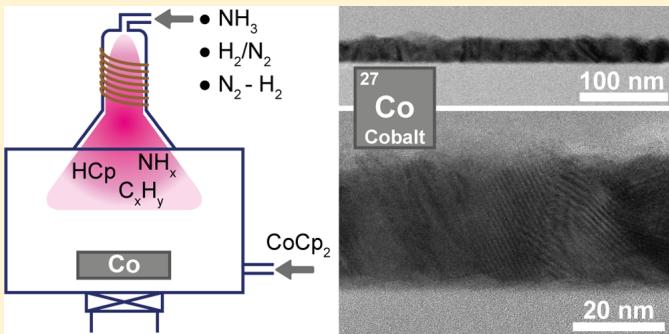
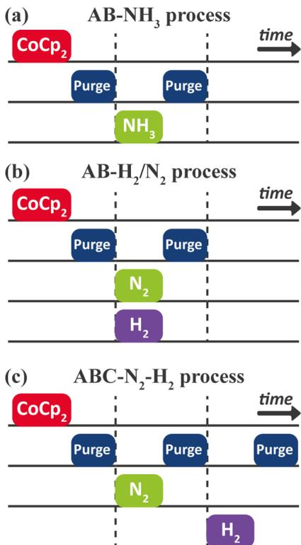
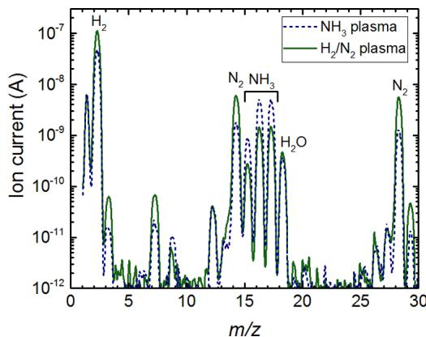
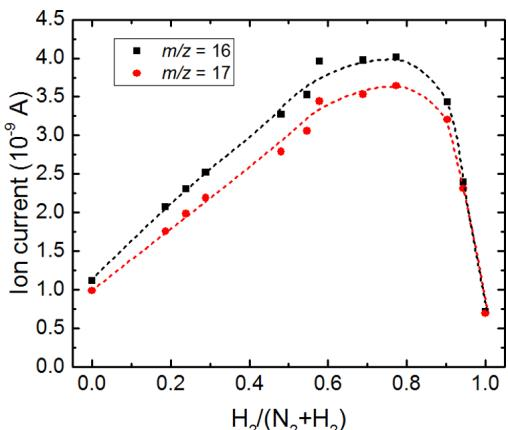
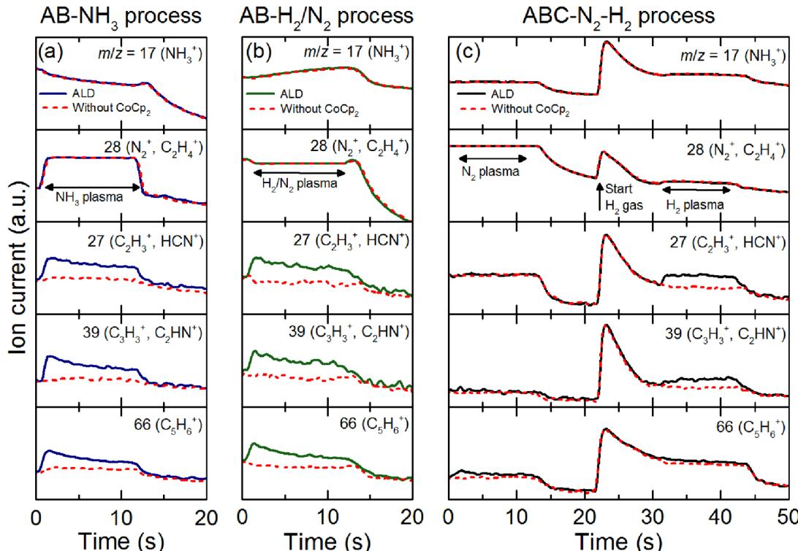
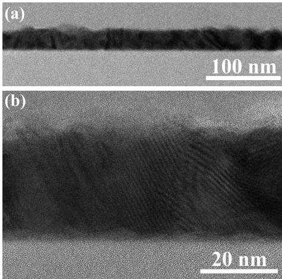
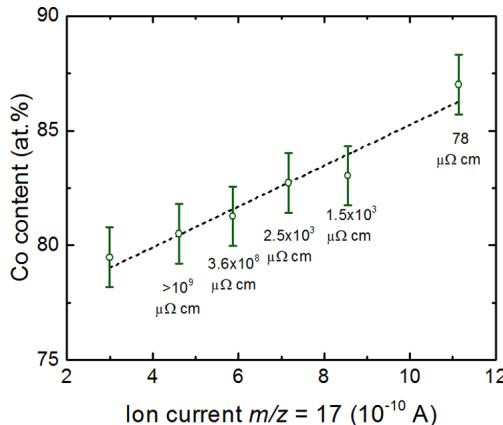
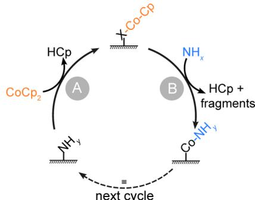

# Atomic Layer Deposition of Cobalt Using  $\mathsf{H}_{2}$ -,  $\mathsf{N}_{2}$ -, and  $\mathsf{NH}_{3}$ -Based Plasmas: On the Role of the Co-reactant

Martijn F. J. Vos, Gerben van Straaten, W. M. M. Erwin Kessels, and Adriaan J. M. Mackus*

Department of Applied Physics, Eindhoven University of Technology, P.O. Box 513, 5600 MB Eindhoven, The Netherlands

Supporting Information

ABSTRACT: This work investigates the role of the coreactant for the atomic layer deposition of cobalt (Co) films using cobaltocene  $(\mathrm{CoCp}_2)$  as the precursor. Three different processes were compared: an AB process using  $\mathrm{NH}_3$  plasma, an AB process using  $\mathrm{H}_2 / \mathrm{N}_2$  plasma, and an ABC process using subsequent  $\mathbf{N}_2$  and  $\mathrm{H}_{2}$  plasmas. A connection was made between the plasma composition and film properties, thereby gaining an understanding of the role of the various plasma species. For  $\mathrm{NH}_3$  plasma,  $\mathrm{H}_{2}$  and  $\mathbf{N}_2$  were identified as the main species apart from the expected  $\mathrm{NH}_{3}$ , whereas for the  $\mathrm{H}_2 / \mathrm{N}_2$  plasma,  $\mathrm{NH}_3$  was detected. Moreover,  $\mathrm{HCp}$  was observed as a reaction product in the precursor and co reactant subcycles. Both AB processes showed self- limiting half- reactions and yielded similar material properties, that is, high purity and low resistivity. For the AB process with  $\mathrm{H}_2 / \mathrm{N}_2$ , the resistivity and impurity content depended on the  $\mathrm{H}_2 / \mathrm{N}_2$  mixing ratio, which was linked to the production of  $\mathrm{NH}_3$  molecules and related radicals. The ABC process resulted in high- resistivity and low- purity films, attributed to the lack of  $\mathrm{NH}_{x,x\leq 3}$  species during the co- reactant exposures. The obtained insights are summarized in a reaction scheme where  $\mathrm{CoCp}_2$  chemisorbs in the precursor subcycle and  $\mathrm{NH}_x$  species eliminate the remaining  $\mathrm{Cp}$  in the consecutive subcycle.

# 1. INTRODUCTION

Atomic layer deposition (ALD) is a thin- film deposition technique, which relies on the cyclewise alternation of precursor and co- reactant doses. The self- limiting nature of the surface reactions during ALD generally allows for good uniformity on large- area substrates and excellent conformality on three- dimensional structures. Although the precursor that is used for an ALD process generally receives considerable attention, the choice of the co- reactant is equally important because it can greatly affect the properties of the deposited material as well as the technological and industrial feasibility of the process. For the ALD of metals, a wide range of coreactants have been explored, with gases or plasmas of  $\mathrm{O}_2$ ,  $\mathrm{H}_2$ , and  $\mathrm{NH}_3$ , being the most common choices. In addition, less common chemicals such as hydrazine  $(\mathrm{N}_2\mathrm{H}_4)$ , silane  $(\mathrm{SiH}_4)$ , disilane  $(\mathrm{Si}_2\mathrm{H}_6)$ , formic acid  $(\mathrm{CH}_2\mathrm{O}_2)$ , and tertiary butyl hydrazine  $(\mathrm{C}_4\mathrm{H}_{12}\mathrm{N}_2)$  have been used. Moreover, certain ALD processes make use of what can be referred to as an advanced ALD cycle, in which either two or more co- reactants are dosed simultaneously or after one another in an ABC- type manner. For instance, mixed  $\mathrm{H}_2 / \mathrm{N}_2$  plasmas have been used for the ALD of a variety of materials. Furthermore, Hamalainen et al. deposited Ir, Pd, Rh, and Pt at low temperatures  $(120 - 200^{\circ}\mathrm{C})$  using consecutive  $\mathrm{O}_3$  and  $\mathrm{H}_2$  exposures, and similar ABC- type cycles were later reported for the ALD of Ru (at  $150^{\circ}\mathrm{C}$ ) using subsequent  $\mathrm{O}_2$  and  $\mathrm{H}_2$  doses and for the ALD of Pt (at room temperature) using subsequent  $\mathrm{O}_2$  and  $\mathrm{H}_2$  plasmas.

and for the ALD of Pt (at room temperature) using subsequent  $\mathrm{O}_2$  and  $\mathrm{H}_2$  plasmas.13- 16

$\mathrm{H}_2$ - ,  $\mathrm{N}_2$ - , and  $\mathrm{NH}_3$ - based plasmas (e.g., plasmas using  $\mathrm{NH}_3$ ,  $\mathrm{H}_2$ ,  $\mathrm{N}_2$ , or  $\mathrm{H}_2 / \mathrm{N}_2$  mixtures as source gases) have previously been used as co- reactants for the ALD of a wide range of metals and metal nitrides. See Table S1 in the Supporting Information for an overview of selected metals and metal nitrides, which have been deposited using a  $\mathrm{NH}_3$  plasma or a mixed  $\mathrm{H}_2 / \mathrm{N}_2$  plasma as the co- reactant. For instance, Kim et al. found that for the ALD of Ir using ((ethylcyclopentadienyl)- (1,5- cyclooctadiene)iridium),  $\mathrm{NH}_3$  plasma yielded a lower surface roughness in comparison to when using  $\mathrm{O}_2$  gas as the co- reactant. Furthermore, Ten Eyck et al. employed a  $\mathrm{H}_2 / \mathrm{N}_2$  plasma for the ALD of Pd on a polymer substrate and claimed that a  $\mathrm{H}_2 / \mathrm{N}_2$  plasma leads to the formation of reactive  $\mathrm{NH}_2$  groups on the polymer, needed for chemisorption of the palladium(II) hexafluoroacetylacetone precursor. Moreover, the use of  $\mathrm{NH}_3$  plasmas instead of  $\mathrm{H}_2$  plasmas for the ALD of Ru, Ag, and Ni resulted in higher growth per cycle (GPC) and lower resistivity values. The choice for the co- reactant is generally less straightforward for the ALD of Co, Ni, and Cu, as compared to noble metals, because their reduction potential is lower, which makes impurity incorporation more

Table 1. ALD Processes Reported in the Literature for the Deposition of Co, Listing Deposition Temperature T, GPC, and Resistivity  $\rho$  

<table><tr><td>precursor</td><td>co-reactant</td><td>T(°C)</td><td>GPC (Å)</td><td>ρ (μΩ·cm)</td><td>refs</td></tr><tr><td>CoCp2</td><td>NH3plasma</td><td>300</td><td>0.48</td><td>10</td><td>37</td></tr><tr><td>CoCp2</td><td>H2/N2plasma</td><td>150–450</td><td>0.26–0.65</td><td>18</td><td>26</td></tr><tr><td>CoCp2</td><td>NH3a</td><td>100–300</td><td>0.37–0.97</td><td></td><td>38</td></tr><tr><td>Co(MeCp)2</td><td>NH3plasma</td><td>100–350</td><td>0.4–1.9</td><td>31</td><td>39</td></tr><tr><td>Co(CpAMD)b</td><td>NH3plasma</td><td>200–250</td><td>0.5</td><td>140</td><td>40</td></tr><tr><td>Co2(CO)8</td><td>H2plasma</td><td>75–110</td><td>1.2</td><td></td><td>41</td></tr><tr><td>CpCo(CO)2</td><td>H2plasma</td><td>125–175</td><td>1.1</td><td></td><td>42</td></tr><tr><td>Co(AMD)c</td><td>H2</td><td>340</td><td>0.50</td><td>285</td><td>43</td></tr><tr><td>Co(AMD)2</td><td>NH3</td><td>350</td><td>0.26</td><td>50</td><td>44</td></tr><tr><td>‘Bu-allylCo(CO)3</td><td>dimethylhydrazine</td><td>140</td><td>0.5</td><td></td><td>45</td></tr><tr><td>CCTBAd</td><td>H2</td><td>125–200</td><td>0.8</td><td>90</td><td>46</td></tr><tr><td>Co(DBDB)e</td><td>formic acid</td><td>170–180</td><td>0.95</td><td>137</td><td>7, 47</td></tr><tr><td>Co(DBDB)e</td><td>tert-butylamine</td><td>170–200</td><td>0.98</td><td>157</td><td>48</td></tr></table>

aHot-wire ALD. bCyclopentadienyl isopropyl acetamidinato-cobalt.  ${}^{c}\mathrm{Bis}(N_{r}N^{\prime}$  diisopropylacetamidinato)cobalt(II). Dicobalt hexacarbonyl tertbutylacetylene.  $^c\mathrm{Bis}(1,4$  -dithrt-butyl-1,3-diazabutadienyl)cobalt(II). Measured on the Ru substrate.

probable.4 For this reason,  $\mathrm{H}_{2 - },\mathrm{N}_{2 - },$  or  $\mathrm{NH_3}$  - based plasmas can be preferred over the OD- containing co- reactants commonly used for noble metal ALD. However, for certain elements, the use of  $\mathrm{N}_2,$ $\mathrm{NH_3},$  or  $\mathrm{H}_2 / \mathrm{N}_2$  plasmas and mixtures thereof can also result in metal nitride films e.g.,AlN, TiN, and TaN).9,21- 24 In general, deposition of a metal nitride becomes more likely for metals with a low reduction potential, as illustrated in Table S1.4 Al, Ta, and Ti have reduction potentials between  $- 0.6$  and  $- 1.7\mathrm{V}_{i}$  whereas for Co, Ni, and noble metals, it is  $- 0.26\mathrm{V}$  or higher.25 Consequently, the use of, for instance, a mixed  $\mathrm{H}_2 / \mathrm{N}_2$  plasma leads to the deposition of AlN on one hand and metallic Co on the other hand.26

Co is a ferromagnetic transition metal used in, for instance, magnetoresistive random- access memory and  $\mathrm{CoSi}_2$  contacts.27- 31 Currently, Co mostly receives much attention for applications in interconnect technology, in order to reduce the resistance- capacitance delay in state- of- the- art devices.32 First, Co has been suggested as a viable candidate as the liner for Cu interconnects because Co can be thinner than the conventional Ta liner, which leaves more space for Cu.33,34 Moreover, Co is also being investigated for the replacement of Cu or W in small- dimension interconnects in the front- end of line.35,36 It is therefore valuable to select Co ALD as a model system for studying the influence of the co- reactant. A wide range of precursors and co- reactants have been investigated for the ALD of Co, as shown in Table 1. As compared to other precursors, the bis(cyclopentadienyl)cobalt(II) (cobaltocene,  $\mathrm{CoCp}_2$  precursor has previously given good results, that is, a low resistivity and high purity, while also being a readily available and low- cost precursor. Interestingly, the ALD of Co using  $\mathrm{CoCp}_2$  as the precursor can be achieved using different co- reactants. Specifically, the studies of Lee et al. and Yoon et al. reported the growth of high- quality Co films using  $\mathrm{NH}_3$  plasma and  $\mathrm{H}_2 / \mathrm{N}_2$  plasma, respectively.26,37 A direct comparison between the two different processes as well as a connection between the plasma composition and the obtained material properties has not been made so far.

In this work, a detailed study of the use of  $\mathrm{H}_{2 - }$ $\mathrm{N}_{2 - }$  and  $\mathrm{NH}_3$  - based plasmas as co- reactants for the ALD of Co using  $\mathrm{CoCp}_2$  as the precursor is presented. As illustrated in Figure 1, three ALD processes with different co- reactants were investigated: an AB- type process with  $\mathrm{NH}_3$  plasma (referred to as  $\mathrm{^{*}AB - NH_3}$  process, Figure 1a), an AB process with a mixed  $\mathrm{H}_2 / \mathrm{N}_2$  plasma ("AB-  $\mathrm{H}_2 / \mathrm{N}_2$  process", Figure 1b), and an ABC process with subsequent  $\mathrm{N}_2$  and  $\mathrm{H}_2$  plasmas ("ABC-  $\mathrm{N}_2$  -  $\mathrm{H}_2$  process", Figure 1c). As will be shown, the separation of the  $\mathrm{H}_2$  and  $\mathrm{N}_2$  plasmas in an ABC- type cycle provides an insight into the role of  $\mathrm{NH}_{x,x\leq 3}$  species that are present in both the  $\mathrm{NH}_3$  plasma and the  $\mathrm{H}_2 / \mathrm{N}_2$  plasma (but not in the  $\mathrm{N}_2$  or  $\mathrm{H}_2$  plasmas).

  
Figure 1. Schematic overview of the three Co ALD processes investigated in this study: (a) AB- $\mathrm{NH}_3$ , (b) AB- $\mathrm{H}_2 / \mathrm{N}_2$ , and (c) ABC- $\mathrm{N}_2 - \mathrm{H}_2$  process. The ABC process uses separate  $\mathrm{N}_2$  and  $\mathrm{H}_2$  plasmas exposures. Note that each purge step is followed by a pump step (see Section 2.1 under Experimental Section), which is not shown in the figure for simplicity.

This work is structured as follows. First, the experimental conditions related to the film deposition, the plasma studies, and the film analysis are discussed. In Section 3.1, the species present in the  $\mathrm{NH}_3$  and  $\mathrm{H}_2 / \mathrm{N}_2$  plasmas are identified and the

role of the  $\mathrm{H}_2 / \mathrm{N}_2$  ratio on the plasma composition is investigated. This is followed in Section 3.2 by a study on the reaction products released during the plasma exposures of the three different ALD processes. In Section 3.3, the obtained material properties are compared. In addition, the effect of the  $\mathrm{H}_2 / \mathrm{N}_2$  ratio and  $\mathrm{NH}_{x,x\leq 3}$  concentration in the plasma on the material properties are addressed. Next, the role of  $\mathrm{NH}_{x,x\leq 3}$  species and a possible reaction mechanism are discussed in Sections 4.1 and 4.2, respectively. Finally, the main conclusions of this work are summarized.

# 2. EXPERIMENTAL SECTION

2.1. ALD Reactor and Conditions. Co films were deposited in a home- built ALD reactor, as described in the previous work. In short, the reactor is equipped with a remote inductively coupled plasma source and a turbo pump reaching a base pressure of  $\sim 10^{- 6}$  Torr. During all experiments, the temperature of the substrate table was set to 300  $^\circ \mathrm{C}$ , whereas the walls were heated to  $100^{\circ}\mathrm{C}$ . Prior to all experiments, the reactor wall was covered by Co by running at least 200 cycles of the AB-  $\mathrm{NH}_3$  process. The  $\mathrm{CoCp}_2$  precursor (98%, Sigma- Aldrich) was contained in a stainless steel bubbler. The bubbler and the dosing line were heated to 80 and  $120^{\circ}\mathrm{C}$ , respectively, as was previously found to be appropriate for the deposition of  $\mathrm{CoO}_x$  in the same reactor. The ALD recipe consisted of precursor dosing for  $6\mathrm{~s}$  in the first subcycle, using Ar as a carrier gas, which resulted in a chamber pressure of approximately  $15\mathrm{mTorr}$ . Subsequently, the reactor was purged with Ar for  $3\mathrm{~s}$  and pumped down for  $6\mathrm{~s}$ . All plasma exposures were performed at a power of  $100\mathrm{W}$  for  $11\mathrm{~s}$  and were followed by a purge and a pump step of  $1$  and  $11\mathrm{~s}$ , respectively. The  $\mathrm{NH}_3$ ,  $\mathrm{N}_2$ , and  $\mathrm{H}_2$  plasmas were started after flowing the source gas into the reactor for  $3\mathrm{~s}$ . For the AB-  $\mathrm{H}_2 / \mathrm{N}_2$  process, the  $\mathrm{N}_2$  flow was started  $2\mathrm{~s}$  before the  $\mathrm{H}_2$  flow, and subsequently after  $5\mathrm{~s}$ , the  $\mathrm{H}_2 / \mathrm{N}_2$  plasma was ignited. This was done to stabilize the gas flows and minimize overpressures. The precursor dosing and plasma exposure times were based on saturation studies as shown in the Supporting Information (Figure S1).

The pressure used for the  $\mathrm{NH}_3$  plasma was  $1.5\mathrm{mTorr}$ . For the standard  $\mathrm{H}_2 / \mathrm{N}_2$  plasma, the  $\mathrm{N}_2$  and  $\mathrm{H}_2$  pressures were separately set to  $1.5$  and  $15\mathrm{mTorr}$ , respectively. Because of the addition of  $\mathrm{N}_2$  to the  $\mathrm{H}_2$  gas, the pumping speed increases (as compared to only  $\mathrm{H}_2$ ), leading to a lower total pressure of approximately  $13\mathrm{mTorr}$  for the  $\mathrm{H}_2 / \mathrm{N}_2$  mixture. Moreover, the actual  $\mathrm{H}_2 / (\mathrm{H}_2 + \mathrm{N}_2)$  mixing ratio is approximately  $\sim 0.77$  (for the  $\mathrm{H}_2$  and  $\mathrm{N}_2$  pressures of  $1.5$  and  $15\mathrm{mTorr}$ , respectively) because of the shorter residence time of  $\mathrm{H}_2$  as compared to that of  $\mathrm{N}_2$  (see also Section 3.1). The results for different  $\mathrm{H}_2 / (\mathrm{H}_2 + \mathrm{N}_2)$  ratios in Sections 3.3 and 4.1 were obtained by varying the partial pressures of  $\mathrm{H}_2$  and  $\mathrm{N}_2$ , while keeping the total pressure of the mixture constant at  $13\mathrm{mTorr}$ . For the ABC-  $\mathrm{N}_2 - \mathrm{H}_2$  process, a pressure of  $7.5\mathrm{mTorr}$  was used for both the  $\mathrm{N}_2$  and  $\mathrm{H}_2$  plasmas, and both plasma exposures were  $11\mathrm{~s}$  long.

To determine the effect of the  $\mathrm{H}_2 / (\mathrm{H}_2 + \mathrm{N}_2)$  ratio on the  $\mathrm{NH}_3$  production in Section 3.1, a constant pressure of  $75\mathrm{mTorr}$  was used for the gas mixture. This pressure was higher than the "standard"  $13\mathrm{mTorr}$  to allow for more accurate variation of the gas flows and to enable mixing ratios higher than  $80\mathrm{vol}\%$ . For a pressure of  $13\mathrm{mTorr}$ , it is not possible to keep the pressure constant for mixing ratios higher than  $\sim 80$  vol  $\%$  because of the low gas flows used and because of changes in pumping speed upon mixing gas flows.

2.2. Plasma Studies. Quadrupole mass spectrometry (QMS) measurements were performed using Pfeiffer Vacuum Prisma QME- 200 (mass- to- charge ratio  $m / z = 1 - 200$ ), attached to the side of the ALD chamber. Measurements were done with the substrate table, and reactor walls were kept at the standard temperatures of  $300$  and  $100^{\circ}\mathrm{C}$ , respectively. Note that a considerable part of the QMS signal can originate from the reactions at the reactor walls because the surface area of the wall is significantly larger than the surface area of the substrate table. It was confirmed that growth also occurs at a deposition temperature of  $100^{\circ}\mathrm{C}$ , albeit at a lower GPC ( $\sim 0.13\mathrm{~A}$  as compared to  $\sim 0.29\mathrm{~A}$ ) and with a higher impurity content. Because the aim is to compare the three ALD processes with one another, the temperature difference between the wall and the table is considered to be of minor influence.

For determination of the main species in the  $\mathrm{NH}_3$  and  $\mathrm{H}_2 / \mathrm{N}_2$  plasmas, mass scans (i.e., ion current as a function of  $m / z$ ) for masses  $1 - 30$  were used. These mass scans were collected after stabilization of the gas flows and plasma. The  $\mathrm{H}_2 / (\mathrm{H}_2 + \mathrm{N}_2)$  mixing ratios were determined using the QMS ion currents at  $m / z$  ratios 2 and 14 (corresponding to  $\mathrm{H}_2^+$  and  $\mathrm{N}^+$ , respectively) from such mass scans. For a complete description of this method, see the Supporting Information.

The procedure for time- resolved QMS measurements was similar to the method as previously described by Knoops et al. In short, for  $m / z\leq 40$ , four  $m / z$  ratios were measured simultaneously, of which one was always  $m / z = 40$ . This value corresponds to  $\mathrm{Ar}^+$  and is used as reference. For  $m / z > 40$ , besides  $m / z = 40$ , only one other  $m / z$  ratio was followed per measurement, in order to keep the signal- to- noise ratio optimal while maintaining a reasonable time resolution. Three different cycles were studied using the QMS measurements: a "normal" (AB- or ABC- type) ALD cycle, a cycle without  $\mathrm{CoCp}_2$  dosing (but with Ar carrier gas dosing), and a cycle without igniting the plasma(s) (see Figure S2). This was done to discern reaction products from the species present because of the precursor dosing, source gas exposure, or plasma ignition. For each type of recipe, 10 cycles were performed, and only the signals over the last nine were averaged, assuming the first cycle can deviate because of the recipes performed previously. To further minimize the influence of previous cycles, every set of cycles was preceded by a cleaning step consisting of an  $\mathrm{O}_2$  plasma for  $90\mathrm{~s}$ , followed by a  $\mathrm{NH}_3$  plasma for  $120\mathrm{~s}$ . Moreover, the purging and gas stabilization times were extended as compared to the standard ALD cycle, in order to separate the effects of pressure overshoots from the reaction products. See the Supporting Information (Figure S3) for a more detailed description and an example of the raw data that is collected using this procedure.

Optical emission spectroscopy (OES) was performed using a USB4000 spectrometer from OceanOptics, with a wavelength range of  $180 - 1100\mathrm{~nm}$ , mounted horizontally to the side of the plasma source.

2.3. Film Analysis. For characterization of the deposited material, Co films were grown on Si(100) coupons with  $450\mathrm{~nm}$  thermal  $\mathrm{SiO}_2$ . Prior to deposition, the samples were cleaned in situ with an  $\mathrm{O}_2$  plasma for  $2\mathrm{~min}$ . It was found that unloading the samples after the deposition at a table temperature of  $300^{\circ}\mathrm{C}$  led to significant oxidation of the Co film. Therefore, the substrate table was cooled down from  $300$

to  $100^{\circ}\mathrm{C}$  after each deposition to minimize the oxidation. Although the effect of the table temperature was not investigated in detail in this study, the GPC and film purity were found to decrease when the sample temperatures were lowered, which will be addressed in a follow- up publication. The depositions for generating the saturation curves (Supporting Information, Figure S1) were performed on an ALD- grown Co seed layer to avoid nucleation effects. This Co seed layer was deposited by performing 400 cycles of the standard recipe using  $\mathrm{NH}_3$  plasma on a thermal  $\mathrm{SiO}_2$  wafer, resulting in a film thickness of approximately  $12\mathrm{nm}$ . Coupons of this seed layer were loaded into the reactor with the table temperature set to  $100^{\circ}\mathrm{C}$ . After heating the substrate table in vacuum to the standard deposition temperature of  $300^{\circ}\mathrm{C}$ , the coupons were treated with a  $\mathrm{NH}_3$  plasma for  $3\mathrm{min}$  to reduce the surface oxidation.

The ALD growth was monitored in situ by spectroscopic ellipsometry (SE) using a J.A. Woollam, Inc. M2000U ellipsometer. The dielectric function of the deposited films was parameterized using a B- spline model. The Co film microstructure was studied using transmission electron microscopy (TEM) using JEOL ARM 200F, operated at 200 kV. For the TEM analysis, a lamella was prepared using a focused ion beam (FIB) in a FEI Nova600i NanoLab. X- ray photoelectron spectroscopy (XPS) was performed with a Thermo Scientific KA1066 spectrometer, using monochromatic Al Kα X- rays with an energy of  $1486.6\mathrm{eV}$ . For XPS depth profiling, sputtering was carried out using  $\mathrm{Ar}^+$  ions with an energy of  $500\mathrm{eV}$ . In addition, four- point probe (FPP) resistivity measurements were done using a Keithley 2400 Sourcemeter and Signation probe.

# 3. RESULTS

3.1. Species in  $\mathrm{NH}_3$  and  $\mathrm{H}_2 / \mathrm{N}_2$  Plasmas. The similarities and differences between the  $\mathrm{NH}_3$  plasma and  $\mathrm{H}_2 / \mathrm{N}_2$  plasma were identified by collecting mass spectra in the range  $m / z = 1 - 30$ . As can be seen in Figure 2, both plasmas mainly contain  $\mathrm{H}_2$ $(m / z = 2)$ ,  $\mathrm{N}_2$ $(m / z = 14$  and  $28)$ , and  $\mathrm{NH}_3$ $(m / z = 15 - 17)$ . However, the ratio between these species differs for the two plasmas, with the relative amount of  $\mathrm{NH}_3$  being larger for the  $\mathrm{NH}_3$  plasma. The mass- to- charge ratios 15 and 16 could correspond to  $\mathrm{NH}_x$ $(x< 3)$  species formed in the plasma as well as  $\mathrm{NH}_x$  species formed by the dissociation of  $\mathrm{NH}_3$  in the

  
Figure 2. QMS spectra for a  $\mathrm{NH}_3$  plasma and a  $\mathrm{H}_2 / \mathrm{N}_2$  plasma. The main plasma species  $(\mathrm{H}_2, \mathrm{N}_2,$  and  $\mathrm{NH}_3)$  are indicated in the figure. The  $\mathrm{NH}_3$  pressure was  $1.5\mathrm{mTorr}$ , whereas the  $\mathrm{H}_2 / \mathrm{N}_2$  pressure was  $13\mathrm{mTorr}$ .

QMS analyzer. However,  $\mathrm{NH}_x$ $(x< 3)$  radicals present in the plasma are likely recombined before being detected in the QMS, indicating that the signals for  $m / z = 15 - 17$  can mainly be attributed to  $\mathrm{NH}_3$ . Although  $\mathrm{NH}_x$ $(x< 3)$  species cannot directly be detected using the QMS, it can be assumed that they are present in the plasma as a consequence of dissociation of  $\mathrm{NH}_3$ . See also the Supporting Information (Table S2) for the assignment of species to corresponding mass- to- charge ratios.

By comparing the QMS spectrum for the source gas with the spectrum for the corresponding plasma, it becomes visible which species are formed upon plasma ignition (see Figure S4). When a  $\mathrm{NH}_3$  plasma is ignited, the signals for  $m / z$  ratios 15, 16, and 17 decrease, whereas the signals at  $m / z = 2$ , 7, 14, and 28 increase. These observations indicate that part of the  $\mathrm{NH}_3$  is dissociated, leading to the formation of both  $\mathrm{N}_2$  and  $\mathrm{H}_2$ . Similarly, in a  $\mathrm{H}_2 / \mathrm{N}_2$  plasma,  $\mathrm{N}_2$  and  $\mathrm{H}_2$  are dissociated upon plasma ignition, followed by the formation of  $\mathrm{NH}_3$  (see Figure S4b).  $\mathrm{NH}_3$  production using a  $\mathrm{H}_2 / \mathrm{N}_2$  plasma occurs mostly at the reactor walls because a three- body reaction in the gas phase is unlikely for the pressures used in this work.

The two plasmas were further compared using OES measurements (see Figure S5). The emission spectra for the  $\mathrm{NH}_3$  and  $\mathrm{H}_2 / \mathrm{N}_2$  plasmas were found to be very similar. Moreover, the emission peak at  $\sim 336\mathrm{nm}$  corresponds to the  $\mathrm{A}^3\Pi \rightarrow \mathrm{X}^3\Sigma$  transition of NH and was identified in the spectra for both plasmas (Figure S5b), corresponding the presence of  $\mathrm{NH}_{x,x< 3}$  species.

To study the composition of the  $\mathrm{H}_2 / \mathrm{N}_2$  plasma as a function of the mixing ratio between the  $\mathrm{H}_2$  and  $\mathrm{N}_2$  gases, QMS spectra were collected for different  $\mathrm{H}_2 / (\mathrm{H}_2 + \mathrm{N}_2)$  ratios. The amount of  $\mathrm{NH}_3$  species produced in the plasma was found to depend on the mixing ratio. Figure 3 shows the QMS ion currents at

  
Figure 3. QMS ion current at  $m / z$  ratios 16 and 17 for  $\mathrm{H}_2 / \mathrm{N}_2$  plasmas as a function of  $\mathrm{H}_2$  fraction in the  $\mathrm{H}_2 / \mathrm{N}_2$  mixture. The  $\mathrm{H}_2 / (\mathrm{H}_2 + \mathrm{N}_2)$  mixing ratios on the horizontal axis were determined using the ion currents at  $m / z$  ratios 2 and 14, corresponding to  $\mathrm{H}_2^+$  and  $\mathrm{N}^+$  (see the Supporting Information), before igniting the plasma. The total chamber pressure was kept constant at  $75\mathrm{mTorr}$ .

$m / z$  ratios 16 and 17 as a function of the  $\mathrm{H}_2 / (\mathrm{H}_2 + \mathrm{N}_2)$  ratio for a constant chamber pressure of  $75\mathrm{mTorr}$ . This pressure is higher than the standard  $13\mathrm{mTorr}$  used for the ALD process, as explained in Section 2.1. The  $m / z$  ratios 16 and 17 correspond to  $\mathrm{NH}_2^+$  and  $\mathrm{NH}_3^+$ , and their ion currents are a measure for the amount of  $\mathrm{NH}_3$  produced in the plasma. Figure 3 indicates a maximum in  $\mathrm{NH}_3$  production around  $60-$

  
Figure 4. Time-resolved QMS signals for  $m / z$  ratios 17  $\mathrm{(NH_3^+)}$  28  $\mathrm{(N_2^+)}$  27  $\mathrm{(C_2H_3^+}$ $\mathrm{HCN^{+}}$  39  $\mathrm{(C_3H_3^+}$ $\mathrm{HCN^{+}}$  and 66  $\mathrm{(C_5H_6^+)}$  , collected during the plasma subcycle for the (a)  $\mathrm{AB - NH_3}$  process, (b)  $\mathrm{AB - H_2 / N_2}$  process, and (c)  $\mathrm{ABC - N_2 - H_2}$  process. A normal ALD cycle and a reference cycle without the  $\mathrm{CoCp_2}$  precursor dosing were measured, with plasma ignition for 11 s during both cycles (indicated with an arrow in the panels for  $m / z = 28$  ). The  $\mathrm{H}_2 / (\mathrm{H}_2 + \mathrm{N}_2)$  mixing ratio of the  $\mathrm{H}_2 / \mathrm{N}_2$  plasma was  $\sim 0.77$

$80\%$ $\mathrm{H}_2$  in the  $\mathrm{H}_2 / \mathrm{N}_2$  mixture, in agreement with the previous work.51,60 Interestingly, the optimum is found close to the ratio between  $\mathrm{N}$  and  $\mathrm{H}$  atoms in the  $\mathrm{NH}_3$  molecule (0.75).60,61 Because the plasma composition depends strongly on the mixing ratio, selecting the  $\mathrm{H}_2 / (\mathrm{H}_2 + \mathrm{N}_2)$  ratio is highly important when using a  $\mathrm{H}_2 / \mathrm{N}_2$  plasma for ALD, as will also be discussed later. On the basis of the optimum found in Figure 3, a  $\mathrm{H}_2 / (\mathrm{H}_2 + \mathrm{N}_2)$  mixing ratio of  $\sim 0.77$  was employed for further QMS studies and depositions using the  $\mathrm{AB - H_2 / N_2}$  process, unless specified otherwise.

3.2. Reaction Products during Plasma Subcycle. A further insight into the use of  $\mathrm{NH}_3$  and  $\mathrm{H}_2 / \mathrm{N}_2$  plasmas was obtained by studying the reaction products formed during the ALD cycles using time- resolved QMS measurements. First, QMS signals were collected for  $m / z$  ratios 40  $\mathrm{(Ar^+)}$  59  $\mathrm{(Co^+)}$  and 66  $\mathrm{(HCp^+)}$  during the precursor subcycle (Figure S6). On the basis of these results, it can be concluded that HCp  $\mathrm{(C_5H_6^+}$ $m / z = 66)$  is released as a product during the precursor half- reaction. Second, QMS signals were recorded during the co- reactant subcycles of the  $\mathrm{AB - NH_3}$  process (Figure 4a), the  $\mathrm{AB - H_2 / N_2}$  process (Figure 4b), and the ABC $\mathrm{N}_2\mathrm{- H}_2$  process (Figure 4c). Measurements were done for a normal ALD cycle and for a reference cycle without  $\mathrm{CoCp}_2$  dosing, using plasma exposures of 11 s (see Figure S3). Differences between the signals for the two cycles indicate the formation of species as a consequence of the ALD reactions.

Figure 4a shows the results collected during the plasma subcycle of the  $\mathrm{AB - NH_3}$  process. The signals for  $m / z$  ratios 17 and 28 are very similar for the ALD cycle and the corresponding reference cycle and are related to the main plasma species, namely,  $\mathrm{NH}_3$  and  $\mathrm{N}_2$ . The increase in ion current for  $m / z = 28$  and a decrease for  $m / z = 17$  after plasma ignition correspond to the formation of  $\mathrm{N}_2$ $(m / z = 28)$ , which is a consequence of the dissociation of  $\mathrm{NH}_3$ $(m / z = 17)$ . The current for  $m / z = 17$  demonstrates a transient behavior, as  $\mathrm{NH}_3$  is a "sticky" molecule and the  $\mathrm{NH}_3$  flow does not stabilize within the time of the exposure.62 Meanwhile, the initial rise in ion currents (at  $\sim 0 \mathrm{~s}$ ) for  $m / z$  ratios 27, 39, and 66 upon plasma ignition for the (normal) ALD cycle can be attributed to the release of reaction products (see Table S2). This rise is not observed for the reference cycle without  $\mathrm{CoCp}_2$  dosing. The increase for  $m / z = 66$ , assigned to  $\mathrm{HCp}^+$ $\mathrm{(C_5H_6^+)}$  upon plasma ignition indicates the elimination of the  $\mathrm{Cp}$  ring from the surface. A similar increase in ion current was observed for  $m / z = 65$ $\mathrm{(C_5H_5^+)}$  data not shown). The detection of  $\mathrm{HCp}^+$  reveals that some of the  $\mathrm{Cp}$  ligands are still present on the surface after the  $\mathrm{CoCp}_2$  subcycle. The mass- to- charge ratio 27 corresponds to  $\mathrm{C}_2\mathrm{H}_3^+$  or  $\mathrm{HCN}^+$  and  $m / z = 39$  to  $\mathrm{C}_3\mathrm{H}_3^+$  or  $\mathrm{C}_2\mathrm{HN}^+$ . The presence of, for example,  $\mathrm{HCN}$  and  $\mathrm{C}_2\mathrm{HN}$  might be caused by the reaction of  $\mathrm{C}_x\mathrm{H}_y$  and  $\mathrm{NH}_x$  species in the plasma. The detection of  $\mathrm{C}_2\mathrm{H}_x^+$  and  $\mathrm{C}_3\mathrm{H}_3^+$  can be explained by dissociative ionization of  $\mathrm{HCp}^+$  in the QMS (see the cracking pattern in Figure S7) and/or by the formation of  $\mathrm{C}_2\mathrm{H}_4$  and  $\mathrm{C}_3\mathrm{H}_4$  in the plasma because of dissociation of  $\mathrm{HCp}$ . Such production channels can unfortunately not be distinguished using the current experimental setup.

The QMS results for the  $\mathrm{AB - H_2 / N_2}$  process are shown in Figure 4b. The ion currents for  $m / z$  ratios 17 and 28 behave very similar for the ALD cycle and the reference cycle and indicate the formation of  $\mathrm{NH}_3$ $(m / z = 17)$  and consumption of  $\mathrm{N}_2$ $(m / z = 28)$  in the  $\mathrm{H}_2 / \mathrm{N}_2$  plasma. These findings are in line with the QMS measurements discussed in Section 3.1 (and as shown in Figure S4). Note that the signal for  $m / z = 17$  continues to increase during the plasma exposure because of the "sticky" nature of  $\mathrm{NH}_3$  and/or ongoing stabilization of the  $\mathrm{NH}_3$  production.62 However, the current for  $m / z = 17$  starts to

drop after the plasma exposure, accompanied by a small increase in the signal for  $\mathbb{N}_2,$  indicating that no more  $\mathbb{N}_2$  is being consumed. The ion currents for  $m / z$  ratios 27, 39, and 66 for the ALD cycle increase when the plasma is started (at  $t$ $\approx 0s$  similar to the data shown in Figure 4a. This increase can be explained by the release of reaction products, as was discussed for the  $\mathrm{AB - NH_3}$  process.

To examine the role of the  $\mathrm{NH}_x$  species in the plasma in the reaction mechanism, the  $\mathrm{H}_2 / \mathrm{N}_2$  plasma was replaced by separated  $\mathbb{N}_2$  and  $\mathrm{H}_{2}$  plasma steps in an ABC- type cycle (see Figure 1). The results for the ABC-  $\mathbf{\cdot N}_2\mathbf{- H}_2$  process in Figure 4c show that no  $\mathrm{NH}_3$  was present during the  $\mathbb{N}_2$  exposure, as can be expected. Moreover, upon ignition of the  $\mathbb{N}_2$  plasma (at  $t\approx$ $0\mathrm{~s~}$  a minimal amount of  $\mathrm{HCp^{+}}$ $(m / z = 66)$  is detected (revealed by the small difference with the reference cycle), which is much smaller than for the  $\mathrm{AB - NH_3}$  and  $\mathrm{AB - H_2 / N_2}$  processes. Upon ignition of the subsequent  $\mathrm{H}_{2}$  plasma, a rise in ion currents for both  $m / z = 17$  and 28 (at  $t\approx 32s,$  observed for the ALD cycle and also for the reference cycle) indicates that  $\mathrm{NH}_3$  and  $\mathbb{N}_2$  are released. However, the amounts are almost negligible and are limited by the amount of nitrogencontaining species adsorbed to the substrate and reactor wall after the  $\mathbb{N}_2$  plasma exposure. The  $\mathrm{H}_{2}$  plasma mostly leads to the detection of  $\mathrm{C}_2\mathrm{H}_3^+ /\mathrm{HCN}^+$ $(m / z = 27)$  and  $\mathrm{C}_3\mathrm{H}_3^+ /\mathrm{C}_2\mathrm{HN}^+$ $(m / z = 39)$  species and no significant amount of  $\mathrm{HCp^{+}}$  . The limited amount of  $\mathrm{HCp^{+}}$  detected during both plasma exposures indicates that the  $\mathrm{Cp}$  ring is not eliminated as a whole but rather dissociated because of the interaction with the plasmas.

Comparison of the results for the three different ALD processes provides an insight into the similarities and differences in reaction mechanisms. Except for the differences in plasma species  $m / z = 17$  and 28), the results in Figure 4a,b show very similar reaction products for the  $\mathrm{AB - NH_3}$  and AB $\mathrm{H}_2 / \mathrm{N}_2$  processes. These analogies between the two AB processes suggest a similar reaction pathway, where  $\mathrm{Cp}$  ligands are eliminated from the surface during both the precursor and plasma subcycle. QMS measurements for the  $\mathrm{ABC - N}_2\mathrm{- H}_2$  process show significant differences in terms of plasma species and reaction products (see Figure 4c), as compared to the AB processes, suggesting a different reaction pathway.

3.3. Film Properties. Before characterization of the material properties, the ALD behavior of the two AB processes was studied by determining the GPC as a function of the  $\mathrm{CoCp}_2$  dosing and the plasma exposure times. As can be seen in Figure S1, both the precursor and co- reactant subcycles demonstrated a self- limiting behavior for the  $\mathrm{NH}_3$  plasma as well as for the  $\mathrm{H}_2 / \mathrm{N}_2$  plasma processes. Moreover, the saturation curves for the two processes look very similar, in line with the finding that the two AB processes show similarities in terms of plasma composition and reaction pathways as discussed in Sections 3.1 and 3.2. The GPC saturates to a value of  $0.29\pm 0.02\mathrm{\AA},$  which is slightly lower than that reported by Kim and co- workers  $(0.48\mathrm{\AA})$  26,37

The material properties for the three different ALD processes were investigated for the films deposited using 1000 cycles. A film deposited using the  $\mathrm{AB - NH_3}$  process was investigated using TEM after preparation of a lamella using a FIB. The cross- sectional images in Figure 5 reveal that the film is polycrystalline and the crystal grains can clearly be observed. The film forms a closed layer of approximately  $29\mathrm{nm}$  thick and has a low roughness. SE modeling yielded a film thickness of  $\sim 32 \mathrm{nm}$  . The difference between the thicknesses derived from

  
Figure 5. (a,b) Cross-sectional TEM images of a Co film deposited by performing 1000 ALD cycles of the  $\mathrm{AB - NH_3}$  process.

SE and TEM is thought to be due to the film roughness, which is not included in the SE modeling.

The material properties obtained using the different processes are shown in Table 2. As can be seen, for both the  $\mathrm{AB - NH_3}$  and the  $\mathrm{AB - H_2 / N_2}$  process, the film thickness (determined using SE) is  $\sim 25 \mathrm{nm}$  after 1000 cycles, corresponding to an average GPC of approximately  $0.25\mathrm{\AA}$  It is noted that the sample prepared for the TEM analysis was different from the sample listed in Table 2 and the film thickness was slightly higher. The  $\mathrm{ABC - N}_2\mathrm{- H}_2$  process resulted in an average GPC as high as  $0.44\mathrm{\AA}$  . The films deposited using the  $\mathrm{AB - NH_3}$  and  $\mathrm{AB - H_2 / N_2}$  processes both demonstrate a low resistivity  $(41 - 42\mu \Omega \mathrm{cm},$  as compared to a Co bulk resistivity of  $6.24~\mu \Omega \mathrm{cm})$  and have a similarly low impurity content.63 The resistivity values obtained for the AB processes are slightly higher than the best reported value for Co ALD and lie within the range of values obtained for processes using  $\mathrm{NH}_3$  or  $\mathrm{H}_2 / \mathrm{N}_2$  plasma as the co- reactant  $(10 - 140\mu \Omega \mathrm{cm},$  see Table 1). This is in contrast to the film deposited using the  $\mathrm{ABC - N}_2\mathrm{- H}_2$  process, which has a high resistivity  $(>1000~\mu \Omega \mathrm{cm})$  ,likely caused by considerable amounts of impurities found in the film  $(\mathrm{O},\mathrm{N},$  and C add up to 25 at.  $\%$  -

XPS measurements showed that the surface of the Co films is slightly oxidized (Figure S8). After  $\mathrm{Ar^{+}}$  sputtering, the O contents of the films deposited using both AB processes  $\mathrm{(NH_3}$  and  $\mathrm{H}_2 / \mathrm{N}_2)$  are however found to be close to 0 at.  $\% ,$  and metallic Co 2p peaks were detected at around  $780.2\mathrm{eV}$  64 Apart from minimal amounts of O, C, and N, no other impurities were detected in the Co films grown using the AB $\mathrm{NH}_3$  and  $\mathrm{AB - H_2 / N_2}$  processes. For the film deposited using the  $\mathrm{ABC - N}_2\mathrm{- H}_2$  process, significant amounts of O, C, and N were detected in the bulk of the film (see the XPS results in Figures S8 and S9). It was found that exchanging the  $\mathrm{H}_{2}$  and  $\mathbb{N}_2$  plasma exposures, corresponding to an ABC- type cycle first with the  $\mathrm{H}_{2}$  plasma followed by the  $\mathbb{N}_2$  plasma, led to a comparable impurity content of approximately 25 at.  $\%$  (see Table S3).

The significant higher GPC and resistivity for the  $\mathrm{ABC - N}_2\mathrm{- }$ $\mathrm{H}_{2}$  process can be explained by the impurity incorporation, leading to a lower film density and/or a higher surface roughness. The difference between the two AB processes on one hand and the  $\mathrm{ABC - N}_2\mathrm{- H}_2$  process on the other hand can most likely be attributed to the absence of  $\mathrm{NH}_x$  species in the

Table 2. Material Properties of Co Films for the Three Different ALD Processes As Determined from SE, FPP, and  $\mathbf{XPS}^a$  

<table><tr><td>ALD process</td><td>d (nm)</td><td>ρ (μΩ·cm)</td><td>[O] (at. %)</td><td>[N] (at. %)</td><td>[C] (at. %)</td></tr><tr><td>AB-NH3</td><td>25</td><td>41</td><td>0.5 ± 0.3</td><td>2.3 ± 0.5</td><td>0.6 ± 0.6</td></tr><tr><td>AB-H2/N2</td><td>25</td><td>42</td><td>1.0 ± 0.4</td><td>2.8 ± 0.5</td><td>0.7 ± 0.7</td></tr><tr><td>ABC-N2-H2</td><td>44</td><td>1 × 103</td><td>10.0 ± 0.5</td><td>8.4 ± 0.5</td><td>7 ± 1</td></tr><tr><td colspan="6">a1000 ALD cycles were performed. The impurity contents were determined using XPS after sputtering with Ar+ for 6 min.</td></tr></table>

Table 3. Material Properties of Co Films for Different  $\mathbf{H}_2 / \mathbf{N}_2$  Mixing Ratiosa  

<table><tr><td>H2/(H2+N2)</td><td>d (nm)</td><td>ρ (μΩ·cm)</td><td>[O] (at. %)</td><td>[N] (at. %)</td><td>[C] (at. %)</td></tr><tr><td>0.13</td><td>17.9</td><td>&amp;gt;109</td><td>7.0 ± 0.2</td><td>9.5 ± 0.5</td><td>4.0 ± 0.9</td></tr><tr><td>0.23</td><td>19.9</td><td>&amp;gt;109</td><td>6.2</td><td>9.5</td><td>3.8</td></tr><tr><td>0.35</td><td>20.3</td><td>3.6 × 108</td><td>5.6</td><td>9.3</td><td>3.8</td></tr><tr><td>0.42</td><td>20.3</td><td>2.5 × 103</td><td>4.2</td><td>9.6</td><td>3.5</td></tr><tr><td>0.52</td><td>19.6</td><td>1.5 × 103</td><td>4.4</td><td>8.8</td><td>3.8</td></tr><tr><td>0.77</td><td>17.5</td><td>78</td><td>0.2</td><td>8.4</td><td>4.6</td></tr></table>

$^a 800$  ALD cycles were performed. The total pressure was kept constant at  $13\mathrm{mTorr}$  The impurity contents were determined using XPS after sputtering with  $\mathrm{Ar^{+}}$  for  $3\mathrm{min}$  Typical errors in the impurity content are indicated in the top row.

plasmas for the  $\mathrm{ABC - N}_2\mathrm{- H}_2$  process (see Section 3.2), as will also be discussed later.

As described in Section 3.1, the amount of  $\mathrm{NH}_3$  produced in the  $\mathrm{H}_2 / \mathrm{N}_2$  plasma depends on the ratio between the two source gases. To study the effect of the  $\mathrm{NH}_3$  concentration in the plasma, a set of Co films was deposited for various  $\mathrm{H}_2 / (\mathrm{H}_2 + \mathrm{N}_2)$  ratios, using a constant pressure of  $13\mathrm{mTorr}$  for the gas mixture. The properties of the Co films were studied using SE, FPP, and XPS, and the results are shown in Table 3. The thicknesses of the films varied slightly as a function of  $\mathrm{H}_2$  fraction, with higher film thicknesses  $(\sim 20 \mathrm{nm})$  obtained for intermediate ratios of  $0.35$  and  $0.42$ . The films deposited using low mixing ratios of  $0.13$  and  $0.23$  had resistivity values that were too high to be measured  $(>10^{9}~\mu \Omega \mathrm{cm})$ . For higher mixing ratios, the resistivity of the films decreased with increasing  $\mathrm{H}_2$  fraction, which correlates to a significant decrease in O impurity content. In addition to the O content, differences in film structure (e.g., crystallinity, density, or porosity) might affect the film resistivity, and further research would be required to obtain a more detailed understanding. The O incorporation is likely due to the dissociation of background species (such as  $\mathrm{H}_2\mathrm{O}$ ) in the plasma during film growth or post- deposition oxidation of the films. Interestingly, the C and N contents of the films are relatively constant and do not show a clear trend as a function of  $\mathrm{H}_2 / (\mathrm{H}_2 + \mathrm{N}_2)$  ratio. The relation between the  $\mathrm{H}_2 / (\mathrm{H}_2 + \mathrm{N}_2)$  ratio and the material properties will be further discussed in Section 4.1.

# 4. DISCUSSION

4.1. Role of  $\mathrm{NH}_x$  Species. The results addressed in Section 3 can provide an insight into the role of different plasma species during the Co film growth. Specifically, the data in Table 3 show that the impurity content decreases with the  $\mathrm{H}_2$  fraction in the  $\mathrm{H}_2 / \mathrm{N}_2$  plasma. Meanwhile, the ion current at  $m / z = 17$ , indicating  $\mathrm{NH}_3$  in the plasma, increased when varying the  $\mathrm{H}_2 / (\mathrm{H}_2 + \mathrm{N}_2)$  ratio up to  $\sim 0.77$  (see Figure S10). This finding is in line with the dependence of the  $\mathrm{NH}_3$  content on the mixing ratio as was discussed in Section 3.1. In Figure 6, the Co concentration of the films is plotted as a function of the ion current for  $m / z = 17$ . Interestingly, this graph shows a linear trend, suggesting that a higher amount of  $\mathrm{NH}_{x,x\leq 3}$  species in the plasma leads to a higher film purity. Note that with a higher  $\mathrm{NH}_3$  concentration in the plasma, also the

  
Figure 6. Co content from XPS as a function of QMS ion current at  $m / z = 17$ . The QMS ion current is a measure for the  $\mathrm{NH}_3$  production in the  $\mathrm{H}_2 / \mathrm{N}_2$  plasma and was varied by changing the  $\mathrm{H}_2 / \mathrm{N}_2$  mixing ratio of the source gas. The pressure of the  $\mathrm{H}_2 / \mathrm{N}_2$  gas mixture was kept constant at  $13\mathrm{mTorr}$ . The Co content was determined using XPS on films obtained by performing  $800\mathrm{ALD}$  using the various  $\mathrm{H}_2 / \mathrm{N}_2$  mixing ratios. XPS was carried out after sputtering with  $\mathrm{Ar^{+}}$  ions for  $3\mathrm{min}$ . The resistivity values of the Co films are indicated in the figure, in which the dashed line represents a linear fit through the data. It is noted that the decrease of the film resistivity as a function of  $\mathrm{NH}_x$  concentration might be related to the changes in the film structure, aside from the increased film purity.

amount of  $\mathrm{NH}_{x,x< 3}$  radical species increases, as a consequence of  $\mathrm{NH}_3$  dissociation. The increase in Co purity is mostly due to the decline in O content, suggesting that  $\mathrm{NH}_{x,x< 3}$  or  $\mathrm{NH}_3$  species facilitate the removal of O from the material or lead to a film which is less prone to post- deposition oxidation. Additional research is required to distinguish between these two possible explanations.

Overall, the findings show that careful consideration is needed when a  $\mathrm{H}_2 / \mathrm{N}_2$  plasma is employed as the co- reactant for ALD. Moreover, the dependence on the  $\mathrm{NH}_x$  concentration explains why  $\mathrm{H}_2$  plasmas or  $\mathrm{N}_2$  plasmas are not suitable as co- reactants, mainly because of the lack of  $\mathrm{NH}_x$  species. In addition, the fact that  $\mathrm{NH}_3$  gas cannot be used as the co- reactant in a thermal ALD process substantiates the hypothesis that  $\mathrm{NH}_x(x< 3)$  plasma species are necessary. The results thus suggest that  $\mathrm{NH}_{x,x\leq 3}$  species play a crucial role in the Co

growth. This is further elaborated on in Section 4.1, where a reaction mechanism is proposed.

Interestingly, the dependence of the film resistivity on the  $\mathrm{H}_2 / \mathrm{N}_2$  ratio is in agreement with the work of Yoon et al. and Hong et al. for the deposition of Co and Ru, respectively.12,26 Both studies observed high- resistivity values for high  $\mathbf{N}_2$  fractions and suggested that  $\mathrm{NH}_x$  species in the plasma play an important role in the growth.12,26 In addition, in the work of Ten Eyck et al., the  $\mathrm{H}_2 / \mathrm{N}_2$  ratio was optimized in order to maximize the  $\mathrm{NH}_x$  generation in the plasma.10 Finally, ALD processes for Ru, Ni, and Ag have been reported to improve when  $\mathrm{NH}_3$  plasmas are used instead of  $\mathrm{H}_2$  plasmas (in terms of a higher GPC and lower resistivity), which also suggests an important role of  $\mathrm{NH}_x$  species present in the  $\mathrm{NH}_3$  plasmas.18- 20

4.2. Reaction Mechanism. The QMS studies addressed in Section 3.2 can help to unravel the reaction mechanisms for the ALD growth of Co. Before reviewing the main QMS results, it is relevant to obtain an understanding of the surface groups present on Co after plasma exposure (i.e., prior to precursor dosing). Although the interaction of a  $\mathrm{NH}_3$ ,  $\mathrm{H}_2$ , or  $\mathrm{N}_2$  plasma with a Co surface has not been studied in detail, the surface science literature on Co provides some insights. For instance, Kizilkaya et al. investigated the stability of  $\mathrm{NH}_x$  groups on Co after  $\mathrm{NH}_3$  exposure and found that  $\mathrm{NH}_3$  adsorption on Co is followed by decomposition, resulting in  $\mathrm{NH}_x$  groups remaining on the surface.67 In addition, Wang et al. studied the nitridation of transition- metal surfaces and calculated that Co is not prone to nitridation, although a Ncovered surface is stable after formation.68 On the basis of these reports, it can be expected that  $\mathrm{NH}_x$  groups are present on the Co film after  $\mathrm{NH}_3$  or  $\mathrm{H}_2 / \mathrm{N}_2$  plasma exposure. H adsorbed on the Co surface seems less likely because  $\mathrm{H}$  is reported to desorb (as  $\mathrm{H}_2$  from Co between the temperatures of approximately 300 and  $400\mathrm{K}$ , which is lower than the sample temperature during ALD  $(300^{\circ}\mathrm{C} = 573\mathrm{K}$  table temperature).69- 71 Notably, the role of N- containing surface species has previously been addressed for the ALD of Pt and Ag using  $\mathrm{N}_2$  or  $\mathrm{NH}_3$  plasmas.19,72,73 Specifically, N- containing species were proposed to adsorb during the  $\mathrm{N}_2$  or  $\mathrm{NH}_3$  plasma exposures and to react with the precursor during the subsequent precursor dose.

In short, the QMS studies in Section 3.2 revealed the following. During the precursor and co- reactant subcycles,  $\mathrm{HCp}$ $(\mathrm{C}_5\mathrm{H}_6)$  is released for both the  $\mathrm{AB - NH}_3$  and  $\mathrm{AB - H}_2 / \mathrm{N}_2$  processes. In addition, fragments of the  $\mathrm{Cp}$  ring (e.g.,  $\mathrm{C}_x\mathrm{H}_y^+$  and  $\mathrm{C}_x\mathrm{H}_y\mathrm{N}^+$ ) were detected during the plasma exposure. Furthermore, variation of the  $\mathrm{H}_2 / \mathrm{N}_2$  ratio showed that the  $\mathrm{NH}_3$  species  $(\mathrm{NH}_{x,x\leq 3})$  play an important role in the growth mechanism. These observations suggest that during the precursor subcycle, the  $\mathrm{CoCp}_2$  molecules chemisorb to the surface and that part of the  $\mathrm{Cp}$  rings react with  $\mathrm{H}$  atoms present at the surface, followed by the release of  $\mathrm{HCp}$ . This is illustrated in step "A" in Figure 7. Considering that chemisorbed  $\mathrm{H}$  is not stable on a Co surface, it is speculated that  $\mathrm{NH}_y$  surface groups present after the plasma exposure provide the source of  $\mathrm{H}$ $\mathrm{NH}_y$  with the subscript  $y$  is used to indicate the distinction from the  $\mathrm{NH}_x$  species in the plasma). Additional research such as surface Fourier- transform infrared spectroscopy (FTIR) is required to identify the surface groups to which the precursor binds. Possibly the precursor chemisorbs directly to unoccupied Co surface sites or to the  $\mathrm{NH}_y$  species after the release of  $\mathrm{HCp}$ .

  
Figure 7. Schematic representation of the proposed reaction mechanisms during the ALD of Co using  $\mathrm{NH}_3$  or  $\mathrm{H}_2 / \mathrm{N}_2$  plasma as the co-reactant. During the precursor subcycle  $(^{\circ}\mathrm{A}^{\prime})$ ,  $\mathrm{CoCp}_2$  binds to the surface, accompanied by the release of  $\mathrm{HCp}$ . The site to which  $\mathrm{CoCp}_2$  chemisorbs is indicated as "X" because it remains to be identified. In the co-reactant subcycle  $(^{\circ}\mathrm{B}^{\prime})$ , the  $\mathrm{NH}_{x,x< 3}$  species from the plasma cause the release of  $\mathrm{HCp}$  and fragments thereof and lead to the formation of  $\mathrm{NH}_y$  surface groups.  $\mathrm{NH}_y$  with the subscript  $y$  is used to indicate the distinction from  $\mathrm{NH}_x$  species in the plasma.

In the co- reactant subcycle, the Co ligands remaining after precursor dosing are eliminated by the  $\mathrm{NH}_3$  radical species from the plasma  $(\mathrm{NH}_{x,x< 3})$ . This reaction leads to the formation of  $\mathrm{HCp}$  and  $\mathrm{C}^-$ ,  $\mathrm{H}^-$ , and N- containing fragments, as illustrated in step "B" in Figure 7. The release of  $\mathrm{HCp}$  was also observed during the  $\mathrm{NH}_3$  plasma exposure in the work of Oh et al.74 Moreover, Shimizu et al. and Yuan et al. used  $\mathrm{NH}_3$  as the co- reactant gas for Co and Ni hot- wire ALD using  $\mathrm{CoCp}_2$  and  $\mathrm{NiCp}_2$  as precursors, respectively, and claimed that the  $\mathrm{NH}_3$  gas- phase species formed on the hot wire are needed for the dissociation of the metal-  $\mathrm{Cp}$  bond.38,75 In the reaction mechanism shown in Figure 7, the  $\mathrm{NH}_{x,x< 3}$  species generated in the plasma thus fulfill this role. Furthermore, the  $\mathrm{NH}_{x,x< 3}$  species as well as  $\mathrm{NH}_3$  lead to the formation of  $\mathrm{NH}_y$  surface groups, which react with the precursor molecules in the next cycle. Although  $\mathrm{NH}_3$  can dissociate after adsorption on a clean Co surface, it is believed that the  $\mathrm{NH}_{x,x< 3}$  plasma species are essential for complete ligand removal.

Note that a small amount of N  $(\sim 2 - 3$  at.  $\%$  ) is present in the Co films deposited using the  $\mathrm{AB - NH}_3$  and  $\mathrm{AB - H}_2 / \mathrm{N}_2$  processes and that this content is slightly higher  $(\sim 4.5$  at.  $\%$  in the (sub)surface region (see Figure S9). This corroborates the expectation based on the surface science literature that N- containing species (e.g.,  $\mathrm{NH}_y$ ) are present and that they are more stable on the surface than in the bulk. However, a remaining question is how the surface  $\mathrm{NH}_y$  species leave the film, such that they are not incorporated in the film. Because the films contain only a small amount of N, it is speculated that most of the N diffuses out of the surface region and desorbs in the form of either  $\mathrm{NH}_3$  or  $\mathrm{N}_2$ .

Interestingly, an analogy appears to exist between the proposed reaction mechanism and the ALD growth of noble metals using  $\mathrm{O}_2$  as the co- reactant. During noble metal ALD, chemisorbed O plays a crucial role in the reaction mechanism, while the stability of noble metal oxides is limited.76 This is similar to the ALD of Co, where  $\mathrm{NH}_x$  species appear needed for chemisorption of the precursor and removal of the  $\mathrm{Cp}$  ligands but are not built into the film.

# 5. CONCLUSIONS

The use of  $\mathrm{H}_2$ ,  $\mathrm{N}_2$ , and  $\mathrm{NH}_3$ - based plasmas as co- reactants for the ALD of Co using  $\mathrm{CoCp}_2$  was investigated. A direct

comparison was made between ALD processes with a  $\mathrm{NH}_3$  plasma and a combined  $\mathrm{H}_2 / \mathrm{N}_2$  plasma as the co- reactant. It was shown that the  $\mathrm{NH}_3$  and  $\mathrm{H}_2 / \mathrm{N}_2$  plasmas contain comparable plasma species, including  $\mathrm{NH}_{x,x< 3}$ , although the relative concentrations are different. Moreover, the reaction products detected during the plasma subcycle are very similar, suggesting analogous reaction pathways. Variation of the mixing ratio of  $\mathrm{H}_2$  and  $\mathrm{N}_2$  in the  $\mathrm{H}_2 / \mathrm{N}_2$  plasma showed that the lowest resistivity is achieved for the ratios with the highest  $\mathrm{NH}_{x,x\leq 3}$  concentration. In addition, the films deposited using plasmas with a lower  $\mathrm{NH}_{x,x\leq 3}$  concentration contained significant amounts of  $\mathrm{O}$  impurities. Deposition using an ABC- type cycle with consecutive  $\mathrm{N}_2$  and  $\mathrm{H}_2$  plasma steps resulted in a Co film with significant amounts of impurities and a high resistivity. These insights indicate that the  $\mathrm{NH}_x$  species present in both the  $\mathrm{NH}_x$  and  $\mathrm{H}_2 / \mathrm{N}_2$  plasmas are necessary for eliminating the precursor ligands and for obtaining high- purity films, which explains why  $\mathrm{H}_2$  plasmas or  $\mathrm{N}_2$  plasmas are not suitable as co- reactants. Furthermore, on the basis of the QMS results and surface science literature, a reaction mechanism was proposed where  $\mathrm{NH}_{x,x< 3}$  play an essential role, leading to the release of  $\mathrm{HCp}$  in both subcycles.

Overall, the work shows that the plasma composition can strongly affect the obtained material properties and that the coreactant of a metal ALD process should be carefully selected. Specifically, when using a  $\mathrm{H}_2 / \mathrm{N}_2$  plasma for Co ALD, selecting the  $\mathrm{H}_2 / (\mathrm{H}_2 + \mathrm{N}_2)$  ratio is crucial. Other literature reports further illustrate the importance of choosing a suitable coreactant and demonstrate that  $\mathrm{NH}_3$  or  $\mathrm{H}_2 / \mathrm{N}_2$  plasmas can be preferred over other co- reactants. This suggests that the findings of this work can be generalized and can also apply to other metal ALD processes.

# ASSOCIATED CONTENT

# $\bullet$  Supporting Information

The Supporting Information is available free of charge on the ACS Publications website at DOI: 10.1021/acs.jpcc.8b06342.

Additional OES and QMS data on the plasma composition, detailed description of the QMS procedures, assignment of species to corresponding  $m / z$  ratios, QMS data collected during the precursor subcycle, saturation curves, and XPS data showing the elemental film composition and ion currents for  $m / z = 16$  and 17 as a function of  $\mathrm{H}_2 / (\mathrm{H}_2 + \mathrm{N}_2)$  for 13 and 75 mTorr, respectively (PDF)

# AUTHOR INFORMATION

# Corresponding Author

E- mail: a.j.m.mackus@blue.nl.

# ORCID

Martijn F. J. Vos: 0000- 0002- 7380- 5032 W. M. M. Erwin Kessels: 0000- 0002- 7630- 8226 Adriaan J. M. Mackus: 0000- 0001- 6944- 9867

# Notes

The authors declare no competing financial interest.

# ACKNOWLEDGMENTS

The authors gratefully acknowledge J. J. A. Zeebregts, C. A. A. van Helvoirt, and C. van Bommel for technical assistance and Dr. Harm Knoops and Dr. Nick Thissen for fruitful discussion. The authors would also like to thank Dr. M. A. Verheijen for the TEM analysis. Solliance and the Dutch province of Noord- Brabant are acknowledged for funding the TEM facility. This work was financially supported by the Netherlands Organization for Scientific Research (NwO) through the Zwaartekracht program "Research Centre for Integrated Nanophotonics".

# REFERENCES

(1) George, S. M. Atomic Layer Deposition: An Overview. Chem. Rev. 2010, 110, 111-131. 
(2) Miikkulainen, V.; Leskelä, M.; Ritala, M.; Puurunen, R. L. Crystallinity of Inorganic Films Grown by Atomic Layer Deposition: Overview and General Trends. J. Appl. Phys. 2013, 113, 021301. 
(3) Hamäläinen, J.; Ritala, M.; Leskelä, M. Atomic Layer Deposition of Noble Metals and Their Oxides. Chem. Mater. 2014, 26, 786-801. 
(4) Bernal Ramos, K.; Saly, M. J.; Chabal, Y. J. Precursor Design and Reaction Mechanisms for the Atomic Layer Deposition of Metal Films. Coord. Chem. Rev. 2013, 257, 3271-3281. 
(5) Kalanyan, B.; Losego, M. D.; Oldham, C. J.; Parsons, G. N. Low-Temperature Atomic Layer Deposition of Tungsten Using Tungsten Hexafluoride and Highly-Diluted Silane in Argon. Chem. Vap. Depos. 2013, 19, 161-166. 
(6) Grubbs, R. K.; Steinmetz, N. J.; George, S. M. Gas phase reaction products during tungsten atomic layer deposition using  $\mathrm{WF}_6$  and  $\mathrm{Si}_6$ . J. Vac. Sci. Technol., B: Microelectron. Nanometer Struct.-Process., Meas., Phenom. 2004, 22, 1811. 
(7) Klesko, J. P.; Kerrigan, M. M.; Winter, C. H. Low Temperature Thermal Atomic Layer Deposition of Cobalt Metal Films. Chem. Mater. 2016, 28, 700-703. 
(8) Golrokhi, Z.; Marshall, P. A.; Romani, S.; Rushworth, S.; Chalker, P. R.; Potter, R. J. The Influence of Tertiary Butyl Hydrazine as a Co-Reactant on the Atomic Layer Deposition of Silver. Appl. Surf. Sci. 2017, 399, 123-131. 
(9) Kim, H.; Kellock, A. J.; Rossnagel, S. M. Growth of Cubic-TaN Thin Films by Plasma-Enhanced Atomic Layer Deposition. J. Appl. Phys. 2002, 92, 7080-7085. 
(10) Ten Eyck, G. A.; Pimanpang, S.; Juneja, J. S.; Bakhru, H.; Lu, T. M.; Wang, G. C. Plasma-Enhanced Atomic Layer Deposition of Palladium on a Polymer Substrate. Chem. Vap. Depos. 2007, 13, 307-311. 
(11) Alevli, M.; Ozgit, C.; Donmez, I.; Biyikli, N. The Influence of  $\mathrm{N}_2 / \mathrm{H}_2$  and Ammonia N Source Materials on Optical and Structural Properties of AlN Films. Growth by Plasma Enhanced Atomic Layer Deposition. J. Cryst. Growth 2011, 335, 51-57. 
(12) Hong, T. E.; Mun, K.-Y.; Choi, S.-K.; Park, J.-Y.; Kim, S.-H.; Cheon, T.; Kim, W. K.; Lim, B.-Y.; Kim, S. Atomic Layer Deposition of Ru Thin Film Using N2/H2 Plasma as a Reactant. Thin Solid Films 2012, 520, 6100-6105. 
(13) Hamäläinen, J.; Puukilainen, E.; Kemell, M.; Costelle, L.; Ritala, M.; Leskelä, M. Atomic Layer Deposition of Iridium Thin Films by Consecutive Oxidation and Reduction Steps. Chem. Mater. 2009, 21, 4868-4872. 
(14) Hamäläinen, J.; Puukilainen, E.; Sajavaara, T.; Ritala, M.; Leskelä, M. Low Temperature Atomic Layer Deposition of Noble Metals Using Ozone and Molecular Hydrogen as Reactants. Thin Solid Films 2013, 531, 243-250. 
(15) Lu, J.; Elam, J. W. Low Temperature ABC-Type Ru Atomic Layer Deposition through Consecutive Dissociative Chemisorption, Combustion, and Reduction Steps. Chem. Mater. 2015, 27, 4950-4956. 
(16) Mackus, A. J. M.; Garcia-Alonso, D.; Knoops, H. C. M.; Bol, A. A.; Kessels, W. M. M. Room-Temperature Atomic Layer Deposition of Platinum. Chem. Mater. 2013, 25, 1769-1774. 
(17) Kim, S.-W.; Kwon, S.-H.; Jeong, S.-J.; Park, J.-S.; Kang, S.-W. Improvement of Morphological Stability of PEALD-Iridium Thin Films by Adopting Two-Step Annealing Process. Electrochem. Solid-State Lett. 2008, 11, H303.

(18) Sari, W.; Eom, T.-K.; Kim, S.-H.; Kim, H. Plasma Enhanced Atomic Layer Deposition of Ruthenium Thin Films Using Isopropylmethylbenzene-Cyclohexadiene-Ruthenium and NH[sub 3] Plasma. J. Electrochem. Soc. 2011, 158, D42-D47.  
(19) Minjauw, M. M.; Solano, E.; Sree, S. P.; Asapu, R.; Van Daele, M.; Ramachandran, R. K.; Heremans, G.; Verbruggen, S. W.; Lenaerts, S.; Martens, J. A.; et al. Plasma-Enhanced Atomic Layer Deposition of Silver Using Ag(Fod)(PEt3) and NH3-Plasma. Chem. Mater. 2017, 29, 7114-7121.  
(20) Lee, H.-B.-R.; Bang, S.-H.; Kim, W.-H.; Gu, G. H.; Lee, Y. K.; Chung, T.-M.; Kim, C. G.; Park, C. G.; Kim, H. Plasma-Enhanced Atomic Layer Deposition of Ni. Jpn. J. Appl. Phys. 2010, 49, 05FA11.  
(21) Kim, H.; Detavenier, C.; Van Der Straten, O.; Rossnagel, S. M.; Kellock, A. J.; Park, D.-G. Robust TaNx Diffusion Barrier for Cu-Interconnect Technology with Subnanometer Thickness by Metal-Organic Plasma-Enhanced Atomic Layer Deposition. J. Appl. Phys. 2005, 98, 014308.  
(22) Chung, H.-S.; Kwon, J.-D.; Kang, S.-W. Plasma-Enhanced Atomic Layer Deposition of TaN Thin Films Using Tantalum-Pentafluoride and N2/H2/Ar Plasma. J. Electrochem. Soc. 2006, 153, C751.  
(23) Ozgit-Akgun, C.; Goldenberg, E.; Okyay, A. K.; Biyikli, N. Hollow Cathode Plasma-Assisted Atomic Layer Deposition of Crystalline AlN, GaN and AlxGa1-xN Thin Films at Low Temperatures. J. Mater. Chem. C 2014, 2, 2123-2136.  
(24) Alevli, M.; Gungor, N. Influence of N2/H2 and N2 Plasma on Binary III-Nitride Films Prepared by Hollow-Cathode Plasma-Assisted Atomic Layer Deposition. J. Vac. Sci. Technol., A 2018, 36, 01A110.  
(25) Rumble, J. R. CRC Handbook of Chemistry and Physics, 98th ed.; CRC-Press: Boca Raton, FL, 2017.  
(26) Yoon, J.; Lee, H.-B.-R.; Kim, D.; Cheon, T.; Kim, S.-H.; Kim, H. Atomic Layer Deposition of Co Using N2/H2 Plasma as a Reactant. J. Electrochem. Soc. 2011, 158, H1179.  
(27) Jian-Gang, Z. Magnetoresistive Random Access Memory: The Path to Competitiveness and Scalability. Proc. IEEE 2008, 96, 1786-1798.  
(28) Nistor, L. E.; Rodmack, B.; Auffret, S.; Dieny, B. Pt/Co/Oxide and Oxide/Co/Pt Electrodes for Perpendicular Magnetic Tunnel Junctions. Appl. Phys. Lett. 2009, 94, 012512.  
(29) Li, L.; Han, D.; Lei, W.; Liu, Z.; Zhang, F.; Mao, X.; Wang, P.; Hou, H. Interlayer Exchange Coupling in  $\mathrm{[Pt / Co]n / MgO / [Co / Pt]2}$  Perpendicular Magnetic Tunnel Junctions. J. Appl. Phys. 2014, 116, 123904.  
(30) Hwang, I. Y.; Kim, J. H.; Oh, S. K.; Kang, H. J.; Lee, Y. S. Ultrathin Cobalt Silicide Film Formation on Si(100). Surf. Interface Anal. 2003, 35, 184-187.  
(31) Lee, H.-B.-R.; Son, J. Y.; Kim, H. Nitride Mediated Epitaxy of Co Si2 through Self-Interlayer-Formation of Plasma-Enhanced Atomic Layer Deposition. Co. Appl. Phys. Lett. 2007, 90, 213509.  
(32) Tokei, Z.; Ciofi, I.; Roussel, P.; Debacker, P.; Raghavan, P.; Van Der Veen, M. H.; Jourdan, N.; Wilson, C. J.; Gonzalez, V. V.; Adelmann, C.; et al. On-Chip Interconnect Trends, Challenges and Solutions: How to Keep RC and Reliability under Control. IEEE Symp. VLSI Technol., 2016, Vol. 1-2.  
(33) He, M.; Zhang, X.; Nogami, T.; Lin, X.; Kelly, J.; Kim, H.; Spooner, T.; Edelstein, D.; Zhao, L. Mechanism of Co Liner as Enhancement Layer for Cu Interconnect Gap-Fill. J. Electrochem. Soc. 2013, 160, D3040-D3044.  
(34) Zhang, X.; Cao, L.; Ryan, V.; Ho, P. S.; Taylor, B.; Witt, C.; Labelle, C. Co Liner Impact on Microstructure of Cu Interconnects. ECS J. Solid State Sci. Technol. 2015, 4, N3177-N3179.  
(35) Mont, F. W.; Zhang, X.; Wang, W.; Kelly, J. J.; Standaert, T. E.; Quon, R.; Ryan, E. T. Cobalt Interconnect on Same Copper Barrier Process Integration at the 7nm Node. IITC 2017 - 2017. IEEE Int. Interconnect Technol. Conf., Proc., 2017; Vol. 7-9.  
(36) Bekiaris, N.; Wu, Z.; Ren, H.; Naik, M.; Park, J. H.; Lee, M.; Ha, T. H.; Hou, W.; Bakke, J. R.; Gage, M.; et al. Cobalt Fill for Advanced Interconnects. IITC 2017 - 2017. IEEE Int. Interconnect Technol. Conf., Proc., 2017; Vol. 1-3.

(37) Lee, H.-B.-R.; Kim, H. High-Quality Cobalt Thin Films by Plasma-Enhanced Atomic Layer Deposition. Electrochem. Solid-State Lett. 2006, 9, G323.  
(38) Shimizu, H.; Sakoda, K.; Momose, T.; Koshi, M.; Shimogaki, Y. Hot-Wire-Assisted Atomic Layer Deposition of a High Quality Cobalt Film Using Cobaltocene: Elementary Reaction Analysis on NHx Radical Formation. J. Vac. Sci. Technol., A 2012, 30, 01A144.  
(39) Park, J.; Lee, H. B. R.; Kim, D.; Yoon, J.; Lansalot, C.; Gatineau, J.; Chevrel, H.; Kim, H. Plasma-Enhanced Atomic Layer Deposition of Co Using Co(MeCp)2 Precursor. J. Energy Chem. 2013, 22, 403-407.  
(40) Kim, J.-M.; Lee, H.-B.-R.; Lansalot, C.; Dussarrat, C.; Gatineau, J.; Kim, H. Plasma-Enhanced Atomic Layer Deposition of Cobalt Using Cyclopentadienyl Isopropyl Acetamidinato-Cobalt as a Precursor. Jpn. J. Appl. Phys. 2010, 49, 05FA10.  
(41) Kim, K.; Lee, K.; Han, S.; Jeong, W.; Jeon, H. Characteristics of Cobalt Thin Films Deposited by Remote Plasma ALD Method with Dicobalt Octacarbonyl. J. Electrochem. Soc. 2007, 154, H177.  
(42) Lee, K.; Kim, K.; Park, T.; Jeon, H.; Lee, Y.; Kim, J.; Yeom, S. Characteristics of Ti-Capped Co Films Deposited by a Remote Plasma ALD Method Using Cyclopentadienylcobalt Dicarbonyl. J. Electrochem. Soc. 2007, 154, H899.  
(43) Lee, H.-B.-R.; Kim, H. Area Selective Atomic Layer Deposition of Cobalt Thin Films. ECS Trans. 2008, 16, 219-225.  
(44) Lee, H.-B.-R.; Kim, W.-H.; Lee, J. W.; Kim, J.-M.; Heo, K.; Hwang, I. C.; Park, Y.; Hong, S.; Kim, H. High Quality Area-Selective Atomic Layer Deposition Co Using Ammonia Gas as a Reactant. J. Electrochem. Soc. 2010, 157, D10.  
(45) Kwon, J.; Saly, M.; Halls, M. D.; Kanjolia, R. K.; Chabal, Y. J. Substrate Selectivity of (t Bu-Allyl)Co(CO) 3 during Thermal Atomic Layer Deposition of Cobalt. Chem. Mater. 2012, 24, 1025-1030.  
(46) Park, J. H.; Moon, D. Y.; Han, D. S.; Kang, Y. J.; Shin, S. R.; Jeon, H. T.; Park, J. W. Plasma-Enhanced Atomic Layer Deposition (PEALD) of Cobalt Thin Films for Copper Direct Electroplating. Surf. Coatings Technol. 2014, 259, 98-101.  
(47) Kerrigan, M. M.; Klesko, J. P.; Rupich, S. M.; Dezelah, C. L.; Kanjolia, R. K.; Chabal, Y. J.; Winter, C. H. Substrate Selectivity in the Low Temperature Atomic Layer Deposition of Cobalt Metal Films from Bis(1,4-Di-Tert-Butyl-1,3-Diazadienyl)Cobalt and Formic Acid. J. Chem. Phys. 2017, 146, 052813.  
(48) Kerrigan, M. M.; Klesko, J. P.; Winter, C. H. Low Temperature, Selective Atomic Layer Deposition of Cobalt Metal Films Using Bis(1,4-Di-Tert-Butyl-1,3-Diazadienyl)Cobalt and Alkylamine Precursors. Chem. Mater. 2017, 29, 7458-7466.  
(49) Heil, S. B. S.; Langereis, E.; Roozeboom, F.; van de Sanden, M. M.; Kessels, W. M. M. Low-Temperature Deposition of TiN by Plasma-Assisted Atomic Layer Deposition. J. Electrochem. Soc. 2006, 153, G956.  
(50) Donders, M. E.; Knoops, H. C. M.; Van, M. C. M.; Kessels, W. M. M.; Notten, P. H. L. Remote Plasma Atomic Layer Deposition of Co3O4 Thin Films. J. Electrochem. Soc. 2011, 158, G92.  
(51) Knoops, H. C. M.; Langereis, E.; van de Sanden, M. C. M.; Kessels, W. M. M. Reaction Mechanisms of Atomic Layer Deposition of TaNx from Ta(NMe2)5 Precursor and H2-Based Plasmas. J. Vac. Sci. Technol., A 2012, 30, 01A101.  
(52) Langereis, E.; Heil, S. B. S.; Knoops, H. C. M.; Keuning, W.; van de Sanden, M. C. M.; Kessels, W. M. M. In situ Spectroscopic Ellipsometry As a Versatile Tool for Studying Atomic Layer Deposition. J. Phys. D. Appl. Phys. 2009, 42, 073001.  
(53) Johs, B.; Hale, J. S. Dielectric Function Representation by B-Splines. Phys. Status Solidi A 2008, 205, 715-719.  
(54) d'Agostino, R.; Cramarossa, F.; De Benedictis, S.; Ferraro, G. Kinetic and Spectroscopic Analysis of NH3 Decomposition under R.F. Plasma at Moderate Pressures. Plasma Chem. Plasma Process. 1981, 1, 19-35.

(55) Van Helden, J. H.; Van Den Oever, P. J.; Kessels, W. M. M.; Van De Sanden, M. C. M.; Schram, D. C.; Engeln, R. Production Mechanisms of NH and NH2 Radicals in N 2-H2 Plasmas. J. Phys. Chem. A 2007, 111, 11460-11472.(56) Van Helden, J. H.; Wagemans, W.; Yagci, G.; Zijlmans, R. A. B.; Schram, D. C.; Engeln, R.; Lombardi, G.; Stancu, G. D.; Röpcke, J. Detailed Study of the Plasma-Activated Catalytic Generation of Ammonia in N2-H2 Plasmas. J. Appl. Phys. 2007, 101, 043305.(57) Mackus, A. J. M.; Heil, S. B. S.; Langereis, E.; Knoops, H. C. M.; van de Sanden, M. C. M.; Kessels, W. M. M. Optical Emission Spectroscopy as a Tool for Studying, Optimizing, and Monitoring Plasma-Assisted Atomic Layer Deposition Processes. J. Vac. Sci. Technol., A 2010, 28, 77-87.(58) Gaydon, R. W. B.; Pearse, A. G. The Identification of Molecular Spectra; Chapman & Hall: London, 1950.(59) Bazinette, R.; Paillol, J.; Massines, F. Optical Emission Spectroscopy of Glow, Townsend-like and Radiofrequency DBDs in an Ar/NH3mixture. Plasma Sources Sci. Technol. 2015, 24, 055021.(60) Nagai, H.; Takashima, S.; Hiramatsu, M.; Hori, M.; Goto, T. Behavior of Atomic Radicals and Their Effects on Organic Low Dielectric Constant Film Etching in High Density N2/H2 and N2/NH3 Plasmas. J. Appl. Phys. 2002, 91, 2615-2621.(61) Amorim, J.; Baravian, G.; Sultan, G. Absolute Density Measurements of Ammonia Synthetized in N2-H2 Mixture Discharges. Appl. Phys. Lett. 1996, 68, 1915-1917.(62) Roscioli, J. R.; Zahniser, M. S.; Nelson, D. D.; Herndon, S. C.; Kolb, C. E. New Approaches to Measuring Sticky Molecules: Improvement of Instrumental Response Times Using Active Passivation. J. Phys. Chem. A 2016, 120, 1347-1357.(63) Dean, J. A. Lange's Handbook of Chemistry, 15th ed.; McGraw-Hill: New York, 1999; Vol. 5.(64) Moulder, J. F.; Stickle, W. F.; Sobol, P. E.; Bomben, K. D. Handbook of X-ray Photoelectron Spectroscopy; Chastain, J., Ed.; Perkin-Elmer Corporation: Minnesota, 1992.(65) Johns, C.; Islam, M. S.; Groza, J. R. Physical and Chemical Vapor Deposition Processes. In Materials Processing Handbook; Groza, J. R.; Shackelford, J. F.; Lavernia, E. J.; Powers, M. T., Eds.; CRC Press, 2007.(66) Nastasi, M.; Misra, A.; Mayer, J. W. Ion Beam Assisted Deposition. In Materials Processing Handbook; Groza, J. R.; Shackelford, J. F.; Lavernia, E. J.; Powers, M. T., Eds.; CRC Press, 2007.(67) Kizilkaya, A. C.; Niemantsverdriet, J. W.; Weststrate, C. J. Ammonia Adsorption and Decomposition on Co(0001) in Relation to Fischer-Tropsch Synthesis. J. Phys. Chem. C 2016, 120, 3834-3845.(68) Wang, T.; Yan, Z.; Michel, C.; Pera-Titus, M.; Sautet, P. Trends and Control in the Nitridation of Transition-Metal Surfaces. ACS Catal. 2018, 8, 63-68.(69) van Helden, P.; van den Berg, J.-A.; Weststrate, C. J. Hydrogen Adsorption on Co Surfaces: A Density Functional Theory and Temperature Programmed Desorption Study. ACS Catal. 2012, 2, 1097-1107.(70) Zowtak, J. M.; Bartholomew, C. H. The Kinetics of H2 Adsorption on and Desorption from Cobalt and the Effects of Support Thereon. J. Catal. 1983, 83, 107-120.(71) Gopalakrishnan, R.; Viswanathan, B. Interaction of CO and Hydrogen on Cobalt Surfaces: A Temperature-Programmed Desorption Study. Surf. Technol. 1984, 23, 173-177.(72) Longrie, D.; Devloo-Casier, K.; Deduytsche, D.; Van den Berghe, S.; Driesen, K.; Detavernier, C. Plasma-Enhanced ALD of Platinum with O2, N2 and NH3 Plasmas. ECS J. Solid State Sci. Technol. 2012, 1, Q123-Q129.(73) Dendooven, J.; Ramachandran, R. K.; Solano, E.; Kurttepeli, M.; Geerts, L.; Heremans, G.; Rongé, J.; Minjauw, M. M.; Dobbelaere, T.; Devloo-Casier, K.; et al. Independent Tuning of Size and Coverage of Supported Pt Nanoparticles Using Atomic Layer Deposition. Nat. Commun. 2017, 8, 1074.

(74) Oh, I. K.; Kim, H.; Lee, H. B. R. Growth Mechanism of Co Thin Films Formed by Plasma-Enhanced Atomic Layer Deposition Using NH3 as Plasma Reactant. Curr. Appl. Phys. 2017, 17, 333-338.(75) Yuan, G.; Shimizu, H.; Momose, T.; Shimogaki, Y. Role of NH3 Feeding Period to Realize High-Quality Nickel Films by Hot-Wire-Assisted Atomic Layer Deposition. Microelectron. Eng. 2014, 120, 230-234.(76) Mackus, A. J. M.; Leick, N.; Baker, L.; Kessels, W. M. M. Catalytic Combustion and Dehydrogenation Reactions during Atomic Layer Deposition of Platinum. Chem. Mater. 2012, 24, 1752-1761.