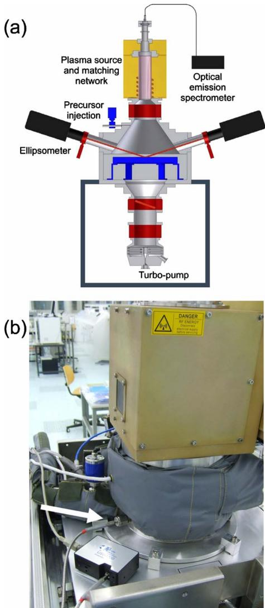
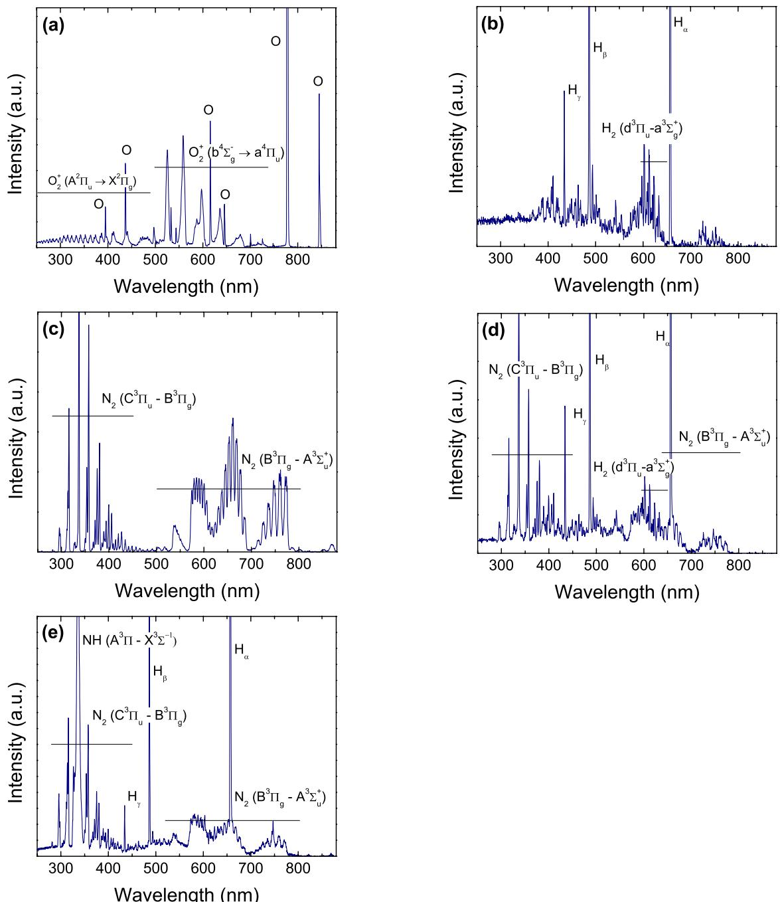
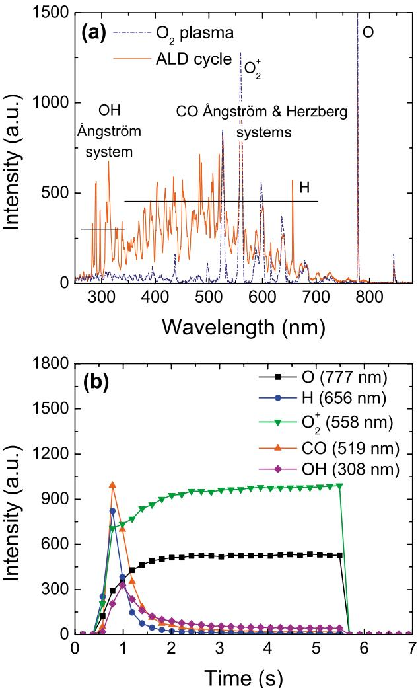
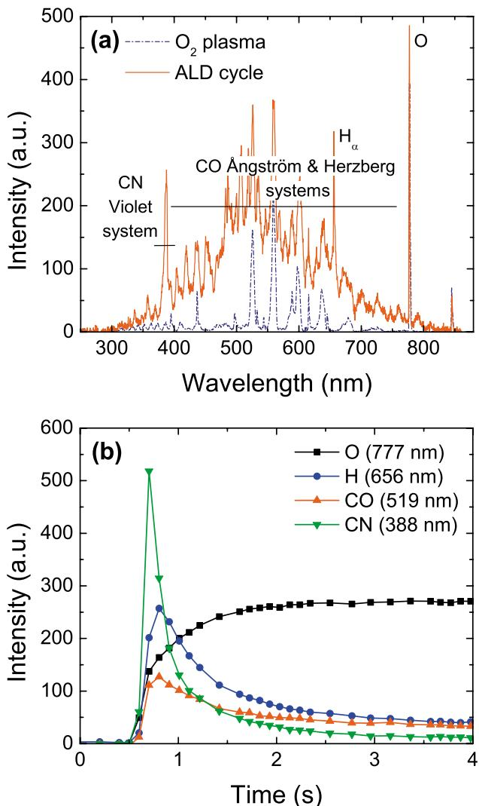
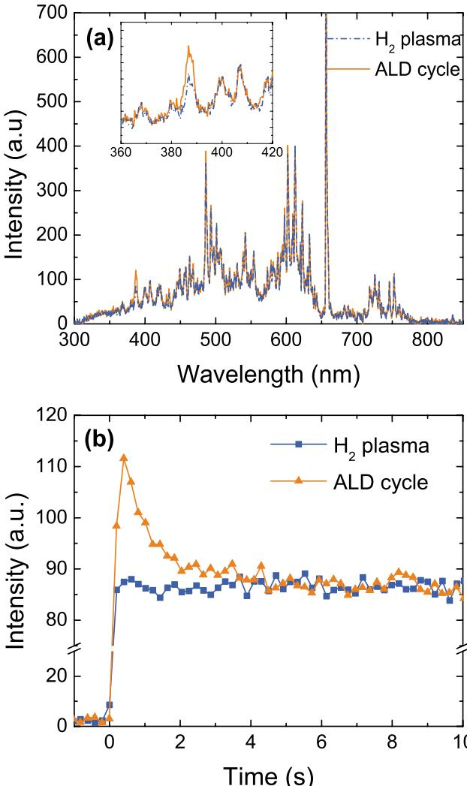
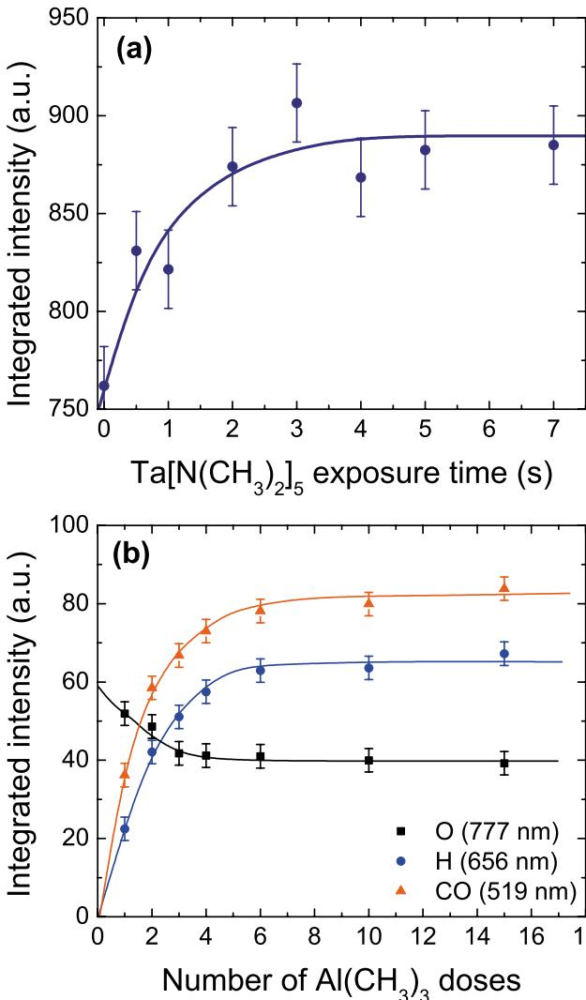
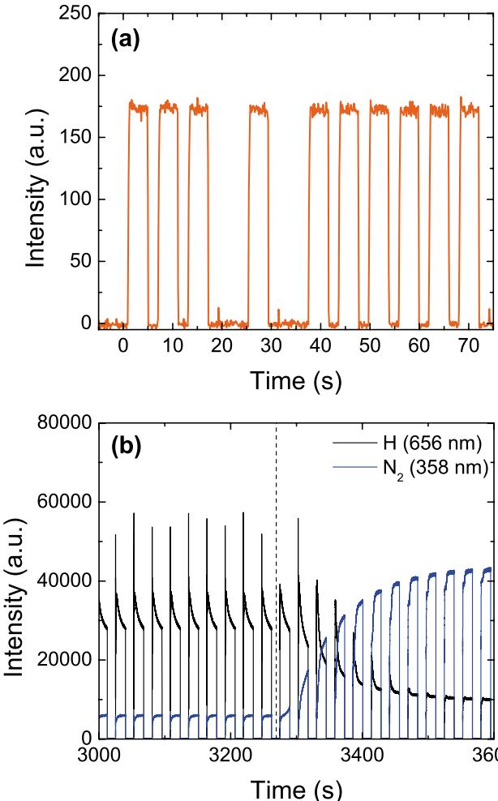
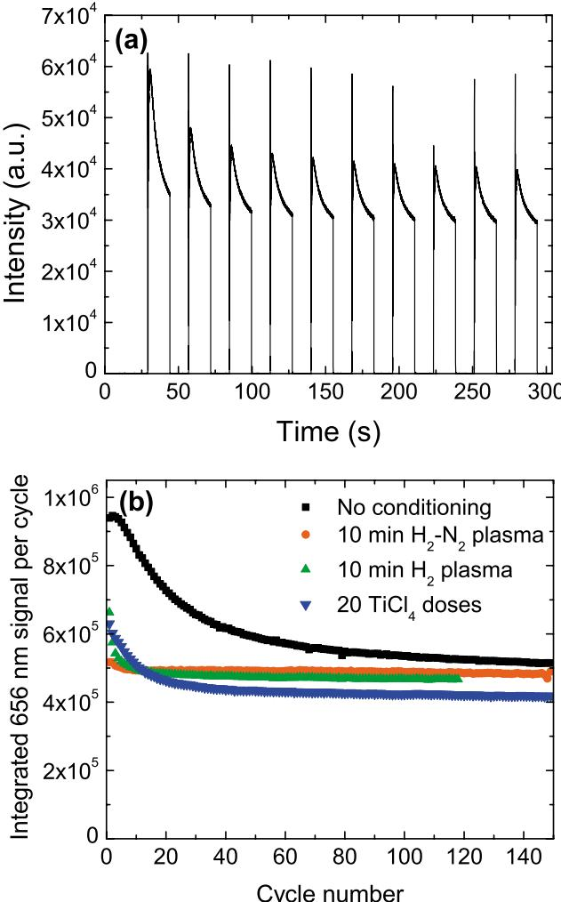

# Optical emission spectroscopy as a tool for studying, optimizing, and monitoring plasma-assisted atomic layer deposition processes  $\odot$

A. 
J. 
M. Mackus; 
S. 
B. 
S. Heil; 
E. Langereis; 
H. 
C. 
M. Knoops; 
M. 
C. 
M. van de Sanden; 
W. 
M. 
M. Kessels

Check for updates J.Vac.Sci.Technol.A28,77- 872010) https://doi.org/10.1116/13256227

# Articles You May Be Interested In

Reaction mechanisms during plasma- assisted atomic layer deposition of metal oxides: A case study for Al 2 O 3

J.Appl.Phys.May 2008

Plasma- assisted atomic layer deposition of Ta 2 O 5 from alkylamide precursor and remote O 2 plasma

J.Vac.Sci.Technol.A4702008

In situ reaction mechanism studies of plasma- assisted atomic layer deposition of Al 2 O 3

Appl.Phys.Lett.September 2006

# Optical emission spectroscopy as a tool for studying, optimizing, and monitoring plasma-assisted atomic layer deposition processes

A. 
J. 
M. Mackus, 
S. 
B. 
S. Heil, 
E. Langereis, 
H. 
C. 
M. Knoops, 
M. 
C. 
M. van de Sanden, and 
W. 
M. 
M. Kesselsa)  Department of Applied Physics, Eindhoven University of Technology, P.O. Box 513, 5600 MB Eindhoven, The Netherlands

(Received 18 August 2008; accepted 5 October 2009; published 18 December 2009)

In this note it is demonstrated that optical emission spectroscopy (OES) is an easy- to- implement and valuable tool to study, optimize, and monitor thin film growth by plasma- assisted atomic layer deposition (ALD). The species in the plasma can be identified through the analysis of the light emitted by the plasma. OES provides therefore information on the reactant species delivered to the surface by the plasma but it also yields unique insight into the surface reaction products and, as a consequence, on the reaction mechanisms of the deposition process. Time- resolved measurements reveal information about the amount of precursor dosing and length of plasma exposure needed to saturate the self- limiting half reactions, which is useful for the optimization of the ALD process. Furthermore, time- resolved OES can also be used as an easy- to- implement process monitoring tool for plasma- assisted ALD processes on production equipment; for example, to monitor reactor wall conditions or to detect process faults in real time. © 2010 American Vacuum Society.

# [DOI: 10.1116/1.3256227]

# I. INTRODUCTION

Atomic layer deposition (ALD) is considered the method of choice for the deposition of ultrathin high- quality films due to its unique features such as precise growth control, excellent conformality on substrates with demanding topologies, and processing at relatively low thermal budget. A trend that started half a decade ago and that is currently gaining more momentum is the introduction of a plasma step in the ALD process. This so- called plasma- enhanced or plasma- assisted ALD process has several potential advantages compared to the purely thermally driven process, often referred to as thermal ALD. For some (emerging) applications of ultrathin films, merits of plasma- assisted ALD such as the deposition at reduced temperatures, improved material properties, increased choice of precursors and materials, and more process versatility might become of key importance.

To be able to exploit the merits of the plasma- assisted ALD technique it is of great value to gain an in- depth understanding of the underlying mechanisms of the plasma- assisted ALD processes. Plasma- assisted ALD of a large set of materials has already been reported, however, many questions about the reaction mechanisms that rule the surface chemistry and the resulting film and device properties still remain unanswered. Moreover, with plasma- assisted ALD gradually developing to research and development (R&D) and industrial applications, there is a need for process monitoring tools and process control tools which are dedicated to the plasma- based process. The aforementioned issues can be tackled by the implementation of in situ diagnostic techniques: in situ studies are of key importance for elucidating the reaction mechanisms of plasma- assisted ALD, and, if easy to implement, the techniques can also serve as process monitoring tools when plasma- assisted ALD is scaled up to production.

monitoring tools when plasma- assisted ALD is scaled up to production.Some diagnostic techniques have already been introduced as process monitoring tools to study (plasma- assisted) ALD, such as quadrupole mass spectroscopy, 2- 4 quartz crystal microbalance measurements, 3,5,6 and in situ spectroscopic ellipsometry. 3,4,7- 11 Because in plasma- assisted ALD one of the two main steps is the exposure of the surface to a plasma for surface ligand exchange, the unique possibility exist to study the light emitted by the plasma. This plasma emission contains information about the species present in the plasma and with the method of optical emission spectroscopy (OES) reactant species delivered to the surface by the plasma can be identified. In the recent years, OES has been employed for this purpose in plasma- assisted ALD processes by several authors. 12- 17 OES can, however, not only be used to study the (electronically excited) species delivered to the surface during the plasma half- reaction, OES can also provide information on the precursor half- reaction and the overall process performance.

The aim of this note is to show that OES is a versatile technique to study, optimize, and monitor plasma- assisted ALD processes. Based on our recently reported studies of plasma- assisted ALD of the metal oxides  $\mathrm{Al}_2\mathrm{O}_3$  (Refs. 3 and 18) and  $\mathrm{Ta}_2\mathrm{O}_5$  (Ref. 4) and metal nitrides  $\mathrm{NaN}$  (Ref. 10) and TiN (Ref. 16) we will demonstrate that OES can provide unique insight into the surface reaction products and therefore on the reaction mechanisms of the deposition process. Since time- resolved OES can reveal information about the saturation of the two half reactions, it is also possible to optimize half reaction times by OES. This is helpful to decrease precursor consumption and to increase wafer throughput. Finally, we will show that OES is an easy- to- implement technique for process monitoring and process control on

plasma- assisted ALD equipment used for production. For process monitoring and control it is important that OES has a relatively low detection limit and fast response time. Small densities of excited species and/or small changes in the plasma properties can be probed by OES, whereas other techniques are often not sufficiently sensitive. OES is therefore well suited to monitor several aspects of the deposition process, such as plasma source operation, adequacy of purging, reactor wall conditioning, etc.

In the following sections, the abovementioned possibilities provided by OES will be illustrated by several examples from our recent studies obtained at two plasma- assisted ALD reactors. It is not the intention to give a complete and detailed review of the method and its results; we rather want to demonstrate to the (nonplasma specialist) reader that very valuable information can easily be obtained by the OES method. We start therefore with a brief review of the very basics of OES in Sec. II, after which some experimental details will be presented (Sec. III). In Sec. IV, emission spectra of several plasmas typically employed in plasma- assisted ALD will first be treated with the most prominent emission lines identified. Although specific for the particular plasmas studied, the results should form a good starting point when other plasma configurations and other plasma conditions are considered. Subsequently, examples of OES results will be presented for a variety of plasma- assisted ALD processes  $\mathrm{Al}_2\mathrm{O}_3$ $\mathrm{Ta}_2\mathrm{O}_5$  TaN, TiN) to illustrate the possibilities of OES for studying reaction mechanisms and optimizing ALD cycles. In addition, the feasibility of using OES as a process monitoring tool will be evaluated.

# II. OPTICAL EMISSION SPECTROSCOPY

OES exploits the fact that a plasma emits light. Emission lines in an emission spectrum originate from the decay of electronically excited states of the atoms and molecules which are present in the reactor. These excited states are in most cases created through collisions between plasma species with electrons, for example, through electron- impact excitation, ionization, or dissociation reactions. Radiating atomic, ionic, and molecular species can therefore reveal information on the species present in the plasma and consequently also about the reactions that take place in the gas phase and at the surface of the reactor or film deposited. The existence of particular emission lines in the emission spectrum indicates the presence of particular species in the plasma, i.e., the emission lines can act as a "fingerprint" of (excited) species. We note, however, that it cannot be concluded that certain species are absent in the plasma when their emission lines are not observed. Whether species radiate depends on whether the species are excited in the plasma and therefore details of the plasma kinetics as well as details of the electronic structure and radiative properties of the species are important.

Considering the basics of OES, in an ionizing plasma the excitation of species takes place predominantly by electron impact. Species are excited from level  $q$  to level  $p$  which can subsequently be followed by the decay of the species into level  $k$  by spontaneous emission. Consequently, the wave length  $\lambda$  of an emission line is determined by the photon energy corresponding to the transition of level  $p$  with energy  $E_{p}$  to level  $k$  with energy  $E_{k}$

$$
\lambda = \frac{hc}{E_p - E_k}, \tag{1}
$$

with  $h$  and  $c$  Planck's constant and the speed of light, respectively. The emission intensity (in terms of number of photons  $\mathrm{m}^{- 3}\mathrm{s}^{- 1}$ ) is characterized by the product of the transition probability or Einstein coefficient  $A_{k}$  of a spontaneous emission process and the population density of the excited level  $n_{p}$ ,

$$
I_{pk} = n_pA_{pk}. \tag{2}
$$

This means that the emission intensity is proportional to the density of electronically excited species. In an OES measurement this proportionality holds in the case that self- absorption can be neglected. Furthermore, also geometrical aspects and specifications of the detection system need to be taken into account. Examples are the possible absorption of light by the window material and the fact that the measurement is a line- of- sight measurement.

In most cases the emission intensity is also a measure of the density of the ground state species. The latter, however, only holds when the excited state is predominantly populated through excitations from the ground state, referred to as the so- called Corona balance, which is generally the case in ionizing plasmas. Moreover, the intensity of a certain emission line can only be directly related to the density of a certain ground state species when one particular excitation channel is present or by far dominant. However, in several cases there exist several excitation channels, for example, involving both atomic and molecular species in the plasma, that can contribute to the population of an excited state. It should also be noted that the fraction of the plasma species which are electronically excited in an ionizing plasma is determined by the electron energy distribution function of the plasma, resulting in a dependence of the emission intensity on both the density of the plasma species and the energy distribution function of the electrons. Since both can change when the plasma conditions are varied (i.e., actively varied or altered by indirect means), the change in density of plasma species cannot be determined straightforwardly from optical emission signals. This problem can be solved by using the method of actinometry as developed by Coburn and Chen. More detailed theory of OES can be found in Refs. 21- 23 and references therein.

# III. EXPERIMENTAL

The OES measurements were carried out on two plasma- assisted ALD reactors which can be classified as remote plasma reactors because the plasma is created upstream and independently from the substrate stage. Both reactors have been described in detail previously, the home- built ALD- I reactor in Ref. 16 and the commercially available FlexAL reactor (Oxford Instruments) in Ref. 24. The FlexAL reactor is schematically represented in Fig. 1(a). Briefly, both reac

  
FIG. 1. (Color online) (a) Schematic representation of the Oxford Instruments FlexAL reactor for plasma-assisted atomic layer deposition (Ref. 24) on which the OES equipment is implemented. The optical emission signal can either be obtained at the top of the plasma source (as indicated in the figure) or in the downstream region. (b) Photograph of the upper part of the FlexAL reactor showing the ICP plasma source, the top of the chamber, and the gate valve in between the chamber and the plasma source. The OES spectrometer (Ocean Optics USB4000, bottom left) is connected with an optical fiber to a window installed on a vacuum port in the downstream region.

tors consist of a process chamber connected to an inductively coupled plasma (ICP) source, a precursor dosing unit, and a pump unit. The plasma source can be operated on plasma gases such as  $\mathrm{H}_2$ ,  $\mathrm{N}_2$ ,  $\mathrm{O}_2$ , and  $\mathrm{NH}_3$  or mixtures thereof. The plasma conditions typically employed are plasma powers within the range of  $100 - 400\mathrm{W}$ , gas flows of  $30 - 60\mathrm{scm}$  (sccm denotes cubic centimeter per minute at STP), and pressures between 7.5 and  $15\mathrm{mTorr}$ . The precursors can be delivered into the process chamber by either releasing a trapped volume or by opening the precursor valve for a certain precursor dosing time.

The light emission from the plasma is collected by a quartz optical fiber which is coupled to an Ocean Optics USB4000 spectrometer. This spectrometer, depicted in Fig. 1(b), has a wavelength detection range of  $200 - 1100\mathrm{nm}$  and a resolution of approximately  $1\mathrm{nm}$ . In most experiments on the FlexAL reactor the quartz fiber is placed in front of a quartz window installed at the top of the plasma source as depicted in Fig. 1(a). This configuration results in a line- of- sight measurement through the plasma source into the deposition chamber. The quartz window mainly transmits light in the wavelength range of  $250 - 850\mathrm{nm}$ . Deposition of thin film material on this window is negligible because the valve between the deposition chamber and the plasma source is closed during the precursor exposure step for most ALD processes. The optical fiber can also be placed in front of a window installed on a vacuum port in the downstream region of the reactor, as shown in Fig. 1(b). This position samples the downstream plasma and is expected to give preferential information on the excited reaction product species. On the other hand, the plasma is less intense at this position and the opening angle of the vacuum port is small reducing the emission intensities detected. Furthermore, thin film material will be deposited at this window and therefore the optical transmission of this window should be closely monitored over time. Measurements on the ALD- I reactor have been carried out in the downstream region through glass and quartz windows positioned in the reactor chamber. The fiber probes light emitted by the plasma at the position of the substrate stage. For the ALD- I reactor it is also possible to detect the light emission in the plasma source region by positioning the quartz fiber in front of the quartz tube used to generate the inductively coupled plasma.

TABLE I. Overview of plasma-assisted ALD deposition processes for which optical emission spectroscopy results are reported in this work.  

<table><tr><td>Material</td><td>Precursor</td><td>Plasma gas</td><td>ALD reactor</td></tr><tr><td>Al2O3</td><td>Al(CH3)3</td><td>O2</td><td>ALD-I/FlexAL</td></tr><tr><td>Ta2O5</td><td>Ta[N(CH3)2]5</td><td>O2</td><td>ALD-I</td></tr><tr><td>TaN</td><td>Ta[N(CH3)2]5</td><td>H2-N2</td><td>ALD-I</td></tr><tr><td>TiN</td><td>TiCl4</td><td>H2-N2</td><td>FlexAL</td></tr></table>

Several plasma- assisted ALD deposition processes have been investigated by OES measurements and will be reported on in this note. An overview of the ALD processes is given in Table I, which summarizes the ALD reactants for the different processes and the reactor on which the experiments have been carried out.

# IV. RESULTS

# A. Emission spectra for plasmas used in plasma-assisted ALD

Figure 2 shows emission spectra of several plasmas that are frequently used in plasma- assisted ALD processes, i.e.,  $\mathrm{O}_2$ ,  $\mathrm{H}_2$ ,  $\mathrm{N}_2$ ,  $\mathrm{H}_2 - \mathrm{N}_2$ , and  $\mathrm{NH}_3$  plasmas. The most important spectral features have been indicated in the graphs. The emission lines and their intensities observed are characteristic for the inductively coupled plasma and its particular operating conditions used, yet the overall observations are very typical for low- pressure plasmas employed in plasma- assisted ALD.

  
FIG. 2. (Color online) Emission spectra from (a) an  $\mathrm{O}_2$  plasma, (b) a  $\mathrm{H}_{2}$  plasma, (c) a  $\mathrm{N}_2$  plasma, (d) a plasma from a  $\mathrm{H}_{2} - \mathrm{N}_{2}$  (10:1) mixture, and (e) a  $\mathrm{NH}_3$  plasma. All spectra have been measured on the FlexAL reactor with plasma powers, gas flows, and pressures in the range of  $100 - 400\mathrm{W}$ ,  $30 - 60\mathrm{SCCM}$ , and  $7.5 - 15\mathrm{mTorr}$ , respectively. The most important spectral features have been identified in the figures. Some of the emission lines in the figures are in saturation.

Figure 2(a) shows the emission spectrum of a pure  $\mathrm{O}_2$  plasma generated by the ICP source. Oxygen plasma is used in plasma- assisted ALD of metal oxides such as  $\mathrm{Al}_2\mathrm{O}_3$ ,  ${}^{9,25}$ $\mathrm{HfO}_2$ ,  ${}^{24}\mathrm{Ta}_2\mathrm{O}_5$ ,  ${}^{4,26}$  and  $\mathrm{TiO}_2$ .  ${}^{27 - 29}$  Emission by  $\mathrm{O}_2^+$  from the first  $(b^4\Sigma_g^-\rightarrow a^4\Pi_u)$  and second  $(A^2\Pi_u\rightarrow X^2\Pi_u)$  negative systems and by O radicals  $(3p^5 P\rightarrow 3s^5 S$  and  $3p^5 P\rightarrow 3s^3 S)$  can be observed in the spectrum of the  $\mathrm{O}_2$  plasma. The  $777~\mathrm{nm}$  emission line of atomic oxygen is most intense. An extended list of reactions possibly taken place in an  $\mathrm{O}_2$  plasma has been compiled by Lieberman and Lichtenberg  ${}^{22}$  and by Kiehlbauch and Graves.  ${}^{30}$  It is important to realize that a certain excited species might be created by several ionization, dissociation, and excitation reactions. For example, excited atomic oxygen can be produced by the direct electron- impact excitation of atomic oxygen in the ground state or by the process of dissociative excitation of molecular oxygen. This, in combination with the large number of reactions that take place in the plasma, clearly illustrates that pinpointing the excitation mechanisms leading to particular emission lines is rather complex.

The identification of emission lines in a measured OES spectrum can be fairly complicated depending on the resolution of the spectrometer. This is due to uncertainty in the wavelength value of an emission line and due to the fact that

TABLE II. Overview of spectral lines that can be used for time-resolved OES measurements to investigate and monitor plasma-assisted ALD processes (Refs. 31 and 32). The most intense spectral line of the emission systems has been selected unless the most intense spectral line overlaps with other emission lines or is too intense to measure conveniently.  

<table><tr><td>Species</td><td>Comment</td><td>Transition</td><td>Quantum number (n/v)</td><td>Wavelength (nm)</td></tr><tr><td>CO</td><td>Ångström system</td><td>B 1Σ→A 1Π</td><td>0→2</td><td>519.82</td></tr><tr><td>CN</td><td>Violet system</td><td>B 2Σ→X 2Σ</td><td>0→0</td><td>388.34</td></tr><tr><td>H</td><td>Balmer series</td><td>3d2D→2p2P+</td><td>3→2</td><td>656.28</td></tr><tr><td>H2</td><td>Fulcher band</td><td>d3Πu→a3Σ+</td><td>0→0</td><td>601.83</td></tr><tr><td>N2</td><td>Second positive system</td><td>C 3Πu→B 3Πg</td><td>0→0</td><td>337.13</td></tr><tr><td>N2</td><td>First positive system</td><td>B 3Πg→A 3Σ+</td><td>5→2</td><td>670.48</td></tr><tr><td>NH</td><td>Ångström system</td><td>A 3Π→X 3Σ-</td><td>0→0</td><td>336.01</td></tr><tr><td>O</td><td>—</td><td>3p5P→3s5S-</td><td>3→2</td><td>777.19</td></tr><tr><td>O2+</td><td>1st negative system</td><td>b 4Σg→a 4Πu</td><td>2→1</td><td>559.75</td></tr><tr><td>OH</td><td>Ångström system</td><td>A 2Σ+→X 2Π</td><td>0→0</td><td>308.9</td></tr></table>

in the wavelength range around a data point, as defined by the spectrometer's resolution, there are generally a number of spectral lines which can be related to the species present in the reactor. The identification of the emission lines is facilitated by keeping some rules of thumb in mind. The presence of a particular line in the emission spectrum implies in most cases also the presence of other related emission lines belonging to the same emission system. For example, in Fig. 2(a) several emission lines of the  $\mathrm{O}_2^+$  first negative system are observed. The presence of the combination of these emission lines strongly suggests identifying the lines as  $\mathrm{O}_2^+$  emission. In addition, when considering time- resolved measurements, the emission lines of one system generally show a similar time- evolution providing that the electron temperature does not change significantly over the measurement time. If one of the lines evolves very differently, it can therefore be assumed that the signal consists of overlapping lines of different species.

The spectrum of a  $\mathrm{H}_{2}$  plasma depicted in Fig. 2(b) can mainly be characterized by intense atomic hydrogen lines  $(\mathrm{H}_{\alpha},\mathrm{H}_{\beta},\mathrm{H}_{\gamma})$  and the Fulcher band  $(d^{3}\Pi_{u}\rightarrow a^{3}\Sigma_{g}^{+}$ $590\mathrm{- }630\mathrm{nm})$  . The  $\mathbf{N}_2$  plasma spectrum shown in Fig. 2(c) is dominated by the first  $(B\mathrm{~}^3\Pi_{g}\longrightarrow A\mathrm{~}^3\Sigma_{u}^{+})$  and second  $(C^{3}\Pi_{u}$ $\rightarrow B^3\Pi_g)$  positive system of molecular nitrogen. Emission by excited  $Nu$  atoms cannot be distinguished as is also generally the case under typical plasma conditions employed due to high excitation energies involved. This does not exclude the presence of a high density of  $Nu$  atoms in the plasma. In Fig. 2(d), the emission spectrum from a plasma generated in a  $\mathrm{H}_2 - \mathrm{N}_2$  mixture (ratio  $\mathrm{H}_2{:}\mathrm{N}_2$  is 10:1) is a combination of the spectra of  $\mathrm{H}_{2}$  and  $\mathbf{N}_2$  plasmas as indicated by the intense atomic hydrogen lines, the Fulcher band, and the  $\mathbf{N}_2$  first and second positive systems. The emission from a  $\mathrm{NH}_3$  plasma in Fig. 2(e) shows NH emission from the Angstrom system  $(A^{3}\Pi \longrightarrow X^{3}\Sigma^{- })$  together with atomic hydrogen lines and emission lines of the  $\mathbf{N}_2$  first and second positive systems.

Table II summarizes several important spectral lines of the plasmas discussed above. These spectral lines are gener ally well suited to use in (time- resolved) OES studies as also illustrated in the experiments discussed in the following sections. More emission lines and additional details can be found in Refs. 31 and 32.

  
FiG. 3. (Color online) (a) Emission spectrum from a steady-state  $\mathrm{O}_2$  plasma and a spectrum of an  $\mathrm{O}_2$  plasma exposure during a plasma-assisted ALD cycle of  $\mathrm{Al}_2\mathrm{O}_3$ . The latter spectrum was recorded after an  $\mathrm{Al(CH}_3\mathrm{)}_3$  dosing step during the first  $200~\mathrm{ms}$  of plasma exposure, whereas the steady-state  $\mathrm{O}_2$  plasma spectrum was recorded well after the plasma half-reaction reached saturation. (b) Time-resolved intensities of emission lines related to plasma species and reaction products after an  $\mathrm{Al(CH}_3\mathrm{)}_3$  dose had preceded. The plasma was ignited at time  $t = \sim 0.5 \mathrm{s}$ .

# B. Studying reaction products and reaction mechanisms

When studying the plasma half reaction of a plasma- assisted ALD process by optical emission spectroscopy, it can be observed that the plasma emission initially changes over time before steady state is reached. See, for example, Fig. 3. When the precursor exposure step has preceded the plasma exposure step, the optical emission signals at the start of the plasma step are remarkably different from a plasma exposure step which is not related to an ALD cycle (e.g., just by switching the plasma on and off). The behavior distinguishes itself from typical plasma start- up effects by the fact that the initial change over time is much more prominent

than when the plasma is switched on without preceding precursor exposure. This difference in plasma emission results from the reactions at the surface that are initiated by the plasma species. When delivered to the surface these reactant species react with the precursor fragments adsorbed at the surface during the precursor dosing step. Volatile reaction products are released from the surface into the plasma and when excited by, e.g., electron impact, the reaction products provide additional optical emission at certain wavelengths. This additional emission yields information about the kind of reaction products created at the start of the plasma exposure and consequently about the surface reactions. Moreover, consumption of reactant species in the plasma by these surface reactions can be observed by a reduced optical emission intensity at wavelengths that correspond to the plasma reactant species itself. At the end of the plasma step when the surface reactions have saturated, the emission spectrum recorded during a plasma- assisted ALD cycle resembles the spectrum of the steady- state plasma.

The effect described has clearly been observed during the plasma- assisted ALD process of metal oxides employing metal- organic precursors and  $\mathrm{O}_2$  plasma as oxidant source. Figure 3 shows the results obtained for plasma- assisted ALD of  $\mathrm{Al}_2\mathrm{O}_3$  with  $\mathrm{Al(CH_3)_3}$  as precursor. In Fig. 3(a) the emission spectrum from an  $\mathrm{O}_2$  plasma ignited after preceding  $\mathrm{Al(CH_3)_3}$  precursor dosing, as recorded within the first  $200~\mathrm{ms}$  after plasma ignition, is compared to the emission spectrum from a steady- state  $\mathrm{O}_2$  plasma [similar to the spectrum in Fig. 2(a)]. The spectra in Fig. 3(a) are clearly different; the spectrum recorded during the plasma- assisted ALD cycle contains many more emission lines. From a detailed analysis of the spectrum it has been deduced that the broad emission band can be attributed to excited CO molecules. Furthermore, an intense OH band at  $\sim 309 \mathrm{nm}$  is observed as well as emission lines from the Balmer series of atomic H. As mentioned this difference in emission between the two spectra can be explained by the excitation of reaction products released from the surface at the start of the plasma exposure. The difference disappears when the surface reactions reach saturation. As has been discussed in our previous work, the excited CO and OH molecules and excited H atoms are formed as a result of electron- impact (dissociative) excitation of CO,  $\mathrm{CO}_2$ ,  $\mathrm{H}_2\mathrm{O}$ , and  $\mathrm{CH}_4$  reaction products created at the surface during plasma- assisted ALD of  $\mathrm{Al}_2\mathrm{O}_3$  by combustionlike reactions.3,18

In order to obtain information about the surface reactions and to study the time dependence involved, it can be helpful to measure the optical emission intensities at certain wavelengths as a function of time. Such measurements are generally more illustrative than the comparison of full spectra. The wavelengths measured can be selected such that they correspond to emission lines by plasma reactant species and (expected) reaction products. Figure 3(b) shows time- resolved emission signals of relevant emission lines recorded during the plasma half reaction of the  $\mathrm{Al}_2\mathrm{O}_3$  ALD process. Initially there is a rapid increase in the intensity of the CO, OH, and H emission lines due to the surface reactions taking place.

Subsequently, the intensities of these emission lines decrease due to the reduction in the amount of ligands present at the surface as caused by the progression of the surface reactions. Finally, when all surface ligands have been oxidized by the  $\mathrm{O}_2$  plasma species, stable plasma emission intensities are reached with a similar fingerprint as an  $\mathrm{O}_2$  plasma in steady state. During the plasma half- cycle, the consumption of reactant species in the  $\mathrm{O}_2$  plasma can be observed by the decreased emission intensities of the oxygen species at the plasma start up. During the plasma exposure these emission intensities gradually increase and finally reach again their steady- state values. The change of the emission during the plasma step of plasma- assisted ALD of  $\mathrm{Al}_2\mathrm{O}_3$  can even be observed by the naked eye as a blue to green transition or "blue flash."18,33 These measurements as well as other in situ studies of the reaction mechanism of plasma- assisted ALD of  $\mathrm{Al}_2\mathrm{O}_3$  are discussed in more detail in our previous work.3,18

For plasma- assisted ALD of  $\mathrm{Ta}_2\mathrm{O}_5$  from the  $\mathrm{Ta}[\mathrm{N}(\mathrm{CH}_3)_2]_5$  precursor and  $\mathrm{O}_2$  plasma a similar effect has been observed.4 In Fig. 4(a) the emission spectrum from an  $\mathrm{O}_2$  plasma ignited after preceding  $\mathrm{Ta}[\mathrm{N}(\mathrm{CH}_3)_2]_5$  precursor dose, as recorded in the first  $200~\mathrm{ms}$  after plasma ignition, is compared to the emission spectrum from a steady- state  $\mathrm{O}_2$  plasma. Similar emission lines as for the  $\mathrm{Al}_2\mathrm{O}_3$  case are observed indicating that combustionlike reactions also rule the plasma half- reaction for plasma- assisted ALD of  $\mathrm{Ta}_2\mathrm{O}_5$ . The consumption of the reactant species in the  $\mathrm{O}_2$  plasma is again observed. Different is, however, that also CN emission at  $388~\mathrm{nm}$  (from excited  $\mathrm{C} = \mathrm{N}$ ) is observed at the start of the plasma exposure step. This difference is due to the use of the alkylamide precursor instead of the alkyl precursor in the  $\mathrm{Al}_2\mathrm{O}_3$  case. The presence of CN emission suggests that  $\mathrm{Ta} - \mathrm{N}$  bonds are broken during the oxidation of the film and its surface groups. Figure 4(b) shows the emission intensities at selected wavelengths as recorded by time- resolved OES measurements. The intense CO emission due to electron- impact (dissociative) excitation of CO and  $\mathrm{CO}_2$  reaction products can again be observed by the naked eye as a "blue flash," similar to the emission during the deposition of  $\mathrm{Al}_2\mathrm{O}_3$  as discussed above.

In Fig. 5, emission spectra and time- resolved emission intensities recorded during the plasma- assisted ALD process of  $\mathrm{TaN}$  are shown. The metal nitride film was deposited from the  $\mathrm{Ta}[\mathrm{N}(\mathrm{CH}_3)_2]_5$  precursor and  $\mathrm{H}_2$  plasma as reported in Ref. 10. The emission spectra recorded during the plasma- assisted ALD cycle (within the first  $200~\mathrm{ms}$  of plasma exposure) are very similar to the emission spectrum from a steady- state  $\mathrm{H}_2$  plasma. A difference can, however, be observed around  $388~\mathrm{nm}$  where again the emission band is visible that can be attributed to the radiative decay of excited CN molecules. The presence of CN emission during the plasma- assisted ALD cycles when employing a  $\mathrm{H}_2$  plasma suggests that  $\mathrm{Ta} - \mathrm{N}$  bonds of the  $\mathrm{Ta}[\mathrm{N}(\mathrm{CH}_3)_2]_5$  surface ligands are broken by the reactant species in the  $\mathrm{H}_2$  plasma. The increased emission at  $388~\mathrm{nm}$  during the ALD cycle can also be observed in the time- resolved measurements as shown in Fig. 5(b). The CN emission during the cycle is

  
FIG. 4. (Color online) (a) Emission spectrum from a steady-state  $\mathrm{O}_2$  plasma and a spectrum of an  $\mathrm{O}_2$  plasma exposure during a plasma-assisted ALD cycle of  $\mathrm{Ta}_2\mathrm{O}_5$ . The latter spectrum was recorded after a  $\mathrm{Ta}[\mathrm{N}(\mathrm{CH}_3)_2]_5$  dosing step during the first  $200~\mathrm{ms}$  of plasma exposure. (b) Time-resolved intensities of emission lines of plasma species and reaction products after a  $\mathrm{Ta}[\mathrm{N}(\mathrm{CH}_3)_2]_5$  dose had preceded. The plasma was ignited at time  $t = \sim 0.5\mathrm{s}$ .

superimposed on the emission intensity from other emission lines in the  $\mathrm{H}_2$  plasma. This measurement illustrates that OES can give insight into the chemistry of the deposition process since it provides insight into which bonds are broken in the surface ligands during plasma exposure. A more detailed description of this experiment can be found in our previous work.10

These examples illustrate that OES measurements and especially time- resolved OES measurements can be used to obtain information about the reaction products released during the plasma half- reaction of plasma- assisted ALD. The observations are most obvious during the deposition of metal oxides, however, also during the deposition of metal nitrides and presumably also during the deposition of metals similar observations can be made. Studies by OES help therefore to come to an understanding of the reaction mechanisms of plasma- assisted ALD processes.

  
FIG. 5. (Color online) (a) Emission spectrum from a steady-state  $\mathrm{H}_2$  plasma and a spectrum of a  $\mathrm{H}_2$  plasma exposure during a plasma-assisted ALD cycle of  $\mathrm{TaN}$ . The latter spectrum was recorded after a  $\mathrm{Ta}[\mathrm{N}(\mathrm{CH}_3)_2]_5$  dosing step during the first  $200~\mathrm{ms}$  of plasma exposure. The inset shows the emission spectra around  $388~\mathrm{nm}$  in more detail. (b) Time-resolved emission intensity at  $388~\mathrm{nm}$  during the plasma exposure step for an ALD cycle with and without  $\mathrm{Ta}[\mathrm{N}(\mathrm{CH}_3)_2]_5$  dosing step. The plasma was ignited at time  $t = \sim 0.0\mathrm{s}$ .

# C. Optimization of ALD cycles

The plasma exposure step induces a self- limiting reaction because the surface reactions are complete when all adsorbed precursor ligands at the surface have reacted with the reactant species delivered by the plasma. From time- resolved OES measurements such as in Figs. 3(b), 4(b), and 5(b), the minimal plasma exposure needed to achieve ALD growth conditions can easily be determined. Since the emission lines corresponding to the reaction products and consumed reactant species are a direct evidence of plasma interaction with the surface ligands, their time- resolved signals reveal when the surface reactions have reached completion. When the signals reach their steady- state value, it is safe to assume that the surface ligand exchange is finished. For example, the optical emission signals in Fig. 3(b) reach their steady- state value after approximately  $2\mathrm{s}$  whereas in Fig. 4(b) it is approximately  $3\mathrm{s}$ . These times correspond well with those determined from saturation curves of the growth per cycle plot

ted as a function of the plasma exposure time.9,10 However, in some cases the material properties still slightly improve with prolonged plasma exposure and therefore longer plasma exposure times can be desired than strictly necessary for complete ligand exchange.10,34

Time- resolved OES signals can also be used to determine whether the precursor dosing is sufficient to react to all available adsorption sites at the surface. Under saturated precursor adsorption conditions, the amount of reaction products released from the surface during the plasma exposure step is independent of the precursor dose used as all available adsorption sites at the surface have reacted. Under undersaturated conditions, however, the amount of reaction products are dependent on the number of adsorbed precursor molecules. This number of adsorbed precursor molecules in turn depends on the precursor dose used. Since the amount of reaction products in the plasma exposure step scales with the intensity of the emission signals due to the reaction products, the number of reacted adsorption sites at the surface scales with the emission signals.

To quantify the amount of emission during the plasma exposure step as a function of precursor dose, the emission signals can be integrated for different precursor dosing times, which is illustrated for the TaN deposition process in Fig. 6(a). The total emission during the plasma step first increases and finally saturates for  $\mathrm{Ta}[\mathrm{N}(\mathrm{CH}_3)_2]_5$  dosing times larger than  $3\mathrm{~s~}$  .This indicates that  $3\mathrm{~s~}$  of dosing is sufficient to adsorb  $\mathrm{Ta}[\mathrm{N}(\mathrm{CH}_3)_2]_5$  molecules on all available surface adsorption sites, i.e., to reach saturation for the precursor step.10

A similar measurement is shown in Fig. 6(b) for  $\mathrm{Al}_2\mathrm{O}_3$  deposition. In this case, precursor dosing took place by consecutively releasing a very small trapped volume filled with  $\mathrm{Al(CH_3)_3}$  . The number of consecutive doses within one cycle defines the total amount of precursor dosed to the surface. From the figure it is clear that saturation is reached after six consecutive doses per cycle. This number corresponds again very well with growth per cycle data and observations obtained by other techniques. The graph also shows that reaching saturation of  $\mathrm{Al(CH_3)_3}$  dosing leads also to a decrease in integrated O emission. Obviously, under undersaturated conditions less reactant species from the  $\mathrm{O}_2$  plasma are consumed by combustionlike reactions than under saturated conditions.

For both examples, the experiments were carried out in reactors with a uniformly heated reactor wall such that the reaction rates at all internal surfaces of the reactor can be considered similar. In the case that not all internal surfaces of a reactor have the same temperature, the plasma emission results can be an average over different saturation coverages of the surfaces, e.g., when the growth per cycle is significantly affected by the substrate temperature. Still the results from the emission intensities might yield good first order estimates for the plasma exposure time and the amount of precursor dosing necessary.

The optimization of plasma exposure time and the amount of precursor dosed is very important to achieve pure ALD growth as well as to reduce cycle times and restrict precursor consumption. From the examples it is clear that timeresolved OES measurements provide a fast and straightforward way to roughly scan the parameter range available. It is still advisable to validate the data by some additional experiments in which the growth per cycle is determined, however, by a rough parameter scan using OES the number of thin film depositions as well as the thin film analysis measurements can be reduced to a bare minimum.

  
FIG. 6. (Color online) (a) Time-integrated emission intensity at  $388~\mathrm{nm}$  related to CN emission, as a function of the  $\mathrm{Ta}[\mathrm{N}(\mathrm{CH}_3)_2]_5$  exposure time during plasma-assisted ALD of TaN. The emission intensity for zero  $\mathrm{Ta}[\mathrm{N}(\mathrm{CH}_3)_2]_5$  exposure time is due to emission from the  $\mathrm{H}_2$  plasma. (b) Time-integrated emission intensities of O plasma species and  $\mathrm{H}$  and CO reaction products as a function of the number of consecutive  $\mathrm{Al}(\mathrm{CH}_3)_3$  doses in the  $\mathrm{Al}_2\mathrm{O}_3$  plasma-assisted ALD cycle. The lines serve as guides to the eye.

In addition to the approach explained above, the understanding of the deposition process in terms of chemical reactions and physical mechanisms that can be obtained from OES measurements, as described in Sec. IV B, is generally very valuable in the process of optimizing ALD cycles and the resulting material properties.

# D. Process monitoring

As mentioned in Sec. I, there is a need for dedicated process monitoring tools when plasma- assisted ALD processes develop to (industrial) applications. Generally many quality measurements are done ex situ by postprocess analysis of wafers, however, in situ process monitoring can give already a lot of information about the deposition process itself. The use of process monitoring tools can improve uptime by detecting equipment failure and reduce the amount of test wafers needed. Process monitoring tools can also be used to monitor process drifts and contribute to the improvement of wafer- to- wafer reproducibility, etc. OES is a suitable candidate for process monitoring due to its advantages such as the low investment costs, the easiness of implementation, and the ability to measure real time and noninvasively. Compared to other techniques, OES has the advantage of a very low detection limit (e.g., compared to mass spectrometry), while the measurement procedure is relatively simple in comparison with advanced optical spectroscopy (e.g., compared to infrared spectroscopy or laser induced fluorescence). On the other hand, with OES only excited species are probed and insight into absolute densities can only be obtained by applying indirect methods such as actinometry. The merits of OES have already been realized a long time ago in the field of plasma- enhanced chemical vapor deposition and especially in the field of plasma etching. In plasma etching OES is often employed for fault detection as well as for end point detection.35,36

Also during plasma- assisted ALD many faults can occur during the deposition process. Due to the high sensitivity of OES, these faults generally have a large influence on the optical emission signals. OES is therefore well suited to detect these faults in real time.

For example, a plasma ignition failure can easily be detected by OES which is illustrated in Fig. 7(a) for an  $\mathrm{O}_2$  plasma employed during  $\mathrm{Al}_2\mathrm{O}_3$  deposition. The plasma fails to ignite in the fourth and sixth cycles as is evident by the absence of optical emission during these cycles. Due to the self- limiting nature of ALD such faults are in principle relatively harmless for the deposition process and the material properties obtained. However, when controlling the desired thickness of the film by a preset number of cycles, plasma ignition failures lead to a smaller thickness than aimed for. This can have large implications on the device performance as the thickness of the ultrathin films is often a critical parameter.

Another possible processing fault is the failure of a gas flow, for example, the failure of the  $\mathrm{H}_{2}$  gas flow during plasma- assisted ALD of TiN in which a  $\mathrm{H}_2 - \mathrm{N}_2$  plasma mixture is used. Figure 7(b) shows a time- resolved OES measurement during the deposition of TiN in which a  $\mathrm{H}_{2}$  gas flow failure is observed by a sudden intensity decrease in the H emission line at  $656~\mathrm{nm}$  and an increase in the  $\mathbf{N}_2$  emission at  $358~\mathrm{nm}$  . The consequence of such a gas flow failure is that material is deposited with different compositions and properties than targeted.

These two examples illustrate that a fault is characterized by a particular deviating trend of the optical emission sig nals. Therefore, the OES signals can be used to investigate whether and what kind of fault occurred. Obviously, OES provides the possibility of both real- time fault detection and postdeposition fault detection by logging the optical emission signals during the deposition. The latter can, for example, be useful when the wafer quality does not correspond to the specifications, potentially due to a process fault. One step more advanced is to implement advanced process control (APC),37 in which the process monitoring tool helps to control the equipment. The signals obtained are compared to the desired signals and the difference is a measure for a possible correction by the equipment to reach the targeted effect. Due to the very high time resolution of the technique, OES is also very well suited for such APC features and it can therefore prevent unsuccessful depositions or equipment downtime through the detection and correction of process faults during the deposition process.

  
FIG. 7. (Color online) (a) Time-resolved emission intensity recorded at  $777~\mathrm{nm}$  related to atomic oxygen during plasma-assisted ALD of  $\mathrm{Al}_2\mathrm{O}_3$  Failures of plasma ignition can be observed for the fourth and sixth ALD cycles. (b) Time-resolved emission intensities recorded during plasma-assisted ALD of TiN in which a  $\mathrm{H}_2 - \mathrm{N}_2$  plasma is employed. The dashed line indicates the point at which the  $\mathrm{H}_2$  gas flow fails.

Another important aspect of industrial plasma- assisted ALD processes is wafer- to- wafer reproducibility. Wafer- towafer reproducibility is affected by process drifts which can, for example, be caused by a change in reactor wall condi

  
FIG. 8. (Color online) (a) Evolution of the emission intensity at  $656~\mathrm{nm}$  related to atomic hydrogen recorded during plasma-assisted ALD of TiN without reactor wall conditioning prior to deposition. (b) Integrated emission intensities per cycle at  $656~\mathrm{nm}$  as a function of cycle number for plasma-assisted ALD of TiN in a reactor in which the reactor wall was conditioned by various procedures.

tions during processing.38 As a result of the deposition of material and the accumulation of reaction products on the reactor walls during the deposition process, reactor wall conditions may change wafer after wafer. Consequently, the surface reaction probabilities of the precursors and the reactive plasma species can change. This can in turn modify the plasma chemistry, resulting in slightly altered deposition conditions.

Reactor wall conditioning prior to introduction of a new wafer can prevent process drift and thus prevent the decrease in reproducibility. An example of a reactor wall conditioning procedure is the exposure of the reactor walls to a plasma for a preset time. Such plasma exposure can remove and dissociate surface groups and reaction products accumulated on the surface. Insight into the reactor wall conditions can be obtained with optical emission spectroscopy39,40 since small amounts of (contaminant) species in the plasma can already result in emission intensities that can be measured with a good signal- to- noise ratio.

Figure 8(a) shows a time- resolved measurement of the H emission intensity at  $656~\mathrm{nm}$  during the deposition of TiN on a wafer without reactor preconditioning. Apart from the decay of the signal during a single plasma exposure,41 a decreasing trend of the total H emission intensity in the plasma exposure steps can be observed. This trend is plotted in Fig. 8(b) by a graph of the integrated H emission intensity per cycle as a function of the cycle number. This figure also shows the integrated H emission intensity for plasma- assisted ALD depositions of TiN with reactor conditioning procedures. Clearly, the graph shows the influence of the reactor conditioning procedure on the evolution of the H emission intensity. For example, when  $\mathrm{H}_{2}$  or  $\mathrm{H}_{2} - \mathrm{N}_{2}$  plasma exposures precede the deposition for a period of  $10\mathrm{min}$ , the integrated intensities saturate rapidly to a stable situation. This indicates a well defined reactor wall condition. In contrast, when extra  $\mathrm{TiCl_4}$  precursor doses precede the deposition a higher H emission intensity is observed during the first tens of cycles. This reveals a correlation between the amount of chlorine ligands or residual  $\mathrm{TiCl_4}$  present at the reactor wall and the amount of excited H present in the plasma. An explanation can most probably be found in the surface loss of atomic H being dependent on the type of species present on the reactor wall. Obviously, this experiment shows that the reactor wall conditions can have a pronounced influence on the plasma chemistry and the densities of plasma species. Apparently, for the case displayed in Fig. 8 the best procedure of reactor wall conditioning is running a  $\mathrm{H}_{2} - \mathrm{N}_{2}$  plasma for a certain amount of time.

The example of changing reactor wall conditions as a potential source for process drifts illustrates that OES is well suited as process monitoring tool during plasma- assisted ALD processes. The change in the hydrogen atom density in the plasma in Fig. 8 is expected to be relatively small, which causes difficulties of measuring such an effect with other process monitoring tools. The relatively low detection limit and fast response time of OES are therefore very important and make OES also well suited as process control tool.

# V. CONCLUSIONS

It is universally known that OES is a very powerful diagnostic technique to obtain information on reactant species in the plasma. The method finds therefore many applications in plasma processing techniques such as plasma etching and plasma- enhanced chemical vapor deposition. The relatively new field of plasma- assisted ALD can benefit in a similar way from OES studies, however, as demonstrated in this note, OES provides also additional opportunities with respect to studying, optimizing, and controlling plasma- assisted ALD processes. From plasma- assisted ALD experiments on the metal oxides  $\mathrm{Al}_2\mathrm{O}_3$  and  $\mathrm{Ta}_2\mathrm{O}_5$  and the metal nitrides TaN and TiN it has illustrated the following.

- OES can provide detailed insight into the surface reaction products and reaction mechanisms during plasma-assisted ALD. The plasma surface interaction is directly probed when considering emission lines of species which are not present in the plasma gas itself while the emission lines

measured give information on the species present on the surface after the precursor step.

Time- resolved measurements allow for direct monitoring of the saturation of the surface reactions during the plasma exposure step, whereas saturation curves related to precursor dosing can be obtained by monitoring the emission intensity during the plasma step as a function of the amount of precursor dosed. Although such measurements are possibly affected by differences in temperature of the reactor's internal surfaces (in the case that temperature differences significantly affect the ALD growth characteristics) the method of OES provides a fast and straightforward way to roughly scan the parameter ranges for process optimization purposes.

OES is a valuable process monitoring tool for plasma- assisted ALD processes on R&D and production equipment, e.g., to monitor reactor wall conditions or to detect process faults in real time. Such a monitoring tool is of great value during plasma- assisted ALD processes due to the cyclewise nature of the deposition process and the small film thicknesses typically involved. Process faults such as plasma ignition failures or precursor valve failures have impact on the final thickness and/or properties of the films while such failures can easily be detected by OES.

These aspects as well as the general merits of OES such as the low investment costs, the easiness of implementation, and the ability to measure real time and noninvasively make OES a method of choice to improve the performance of plasma- assisted ALD processes and the thin films deposited.

# ACKNOWLEDGMENTS

The authors acknowledge Dr. P. Kudlacek for his contribution to the experiments. W. Keuning, J. J. A. Zeebregts, J. F. C. Jansen, and M. J. P. van de Sande are thanked for their skilful technical assistance. This work was financially supported by the Dutch Technology Foundation STW.

$^1\mathbf{M}$  Ritala and M. Leskelii, in Handbook of Thin Film Materials, edited by H.S.Nalwa Academic, San DiegoCA,2001)Vol.1p.103.  $^2\mathrm{L}$  Henn- Lecordier, W. Lei, M. Anderle, and G. W. Rubloff, J. Vac. Sci. Technol.B 25,130 (2007.  $^3\mathrm{S}$  B.S.Heil, J. L. van Hemmen, M.C.M. van de Sanden, and W.M.M. Kessels, J. Appl. Phys. 103, 103302 (2008).  $^4\mathrm{S}$  B.S.Heil, F. Roozeboom, M.C.M. van de Sanden, and W.M.M. Kessels, J. Vac. Sci. Technol. A 26, 472 (2008).  $^5\mathrm{A}$  Rahtu, T. Alaranta, and M. Ritala, Langmuir 17, 6506 (2001).  $^6\mathrm{H}$  Kim and S. M. Rossnagel, J. Vac. Sci. Technol. A 20, 802 (2002).  $^7\mathrm{S}$  B.S.Heil, E. Langereis, A. Kemmeren, F. Roozeboom, M.C.M. van de Sanden, and W.M.M. Kessels, J. Vac. Sci. Technol. A 22, L5 (2005).  $^8\mathrm{E}$  Langereis, S. B. S. Heil, M. C. M. van de Sanden, and W. M. M. Kessels, J. Appl. Phys. 100, 023534 (2006).  $^9\mathrm{J}$  L. van Hemmen, S. B. S. Heil, J. H. Klootwijk, F. Roozeboom, C. J. Hodson, M. C. M. van de Sanden, and W. M. M. Kessels, J. Electrochem. Soc. 154, G165 (2007).  $^{10}\mathrm{E}$  Langereis, H. C. M. Knoops, A. J. M. Mackus, F. Roozeboom, M. C. M. van de Sanden, and W. M. M. Kessels, J. Appl. Phys. 102, 083517 (2007).  $^{11}\mathrm{D}$  Schmidt, S. Strehle, M. Albert, W. Hentsch, and J. W. Bartha, Microelectron. Eng. 85, 527 (2008).

$^{12}\mathrm{H}$  Kim, A. J. Kellock, and S. M. Rossnagel, J. Appl. Phys. 92, 7080 (2002).  $^{13}\mathrm{S}$  X. Lao, R. M. Martin, and J. P. Chang, J. Vac. Sci. Technol. A 23, 488 (2005).  $^{14}\mathrm{J}$  Y. Kim, S. H. Kim, H. Seo, J. H. Kim, and H. Jeon, Electrochem. Solid- State Lett. 8, G82 (2005).  $^{15}\mathrm{J}$  Choi, S. Kim, J. Kim, H. Kang, H. Jeon, and C. Bae, J. Vac. Sci. Technol. A 24, 900 (2006).  $^{16}\mathrm{S}$  B. S. Heil, E. Langereis, F. Roozeboom, M. C. M. van de Sanden, and W. M. M. Kessels, J. Electrochem. Soc. 153, G956 (2006).  $^{17}\mathrm{R}$  Sreenivasan, T. Sugawara, K. C. Saraswat, and P. C. McIntyre, Appl. Phys. Lett. 90, 102101 (2007).  $^{18}\mathrm{S}$  B. S. Heil, P. Kudlacek, E. Langereis, R. Engeln, M. C. M. van de Sanden, and W. M. M. Kessels, Appl. Phys. Lett. 89, 131505 (2006).  $^{19}\mathrm{I}$  The low pressure plasmas as typically used in plasma- assisted ALD are generally optically thin for the emission lines.  $^{20}\mathrm{J}$  W. Coburn and M. Chen, J. Appl. Phys. 51, 3134 (1980).  $^{21}\mathrm{V}$  M. Donnelly, in Plasma Diagnostics, edited by O. Auciello and D. L. Flamm (Academic, Washington, DC, 1989), Vol. I, p. 1.  $^{22}\mathrm{M}$  A. Lieberman and A. J. Lichtenberg, Principles of Plasma Discharges and Materials Processing (Wiley, New York, 2005).  $^{23}\mathrm{U}$  Fantz, Plasma Sources Sci. Technol. 15, S137 (2006).  $^{24}\mathrm{S}$  B. S. Heil, J. L. van Hemmen, C. J. Hodson, N. Singh, J. H. Klootwijk, F. Roozeboom, M. C. M. van de Sanden, and W. M. M. Kessels, J. Vac. Sci. Technol. A 25, 1357 (2007).  $^{25}\mathrm{E}$  Langereis, M. Creatore, S. B. S. Heil, M. C. M. van de Sanden, and W. M. M. Kessels, Appl. Phys. Lett. 89, 081915 (2006).  $^{26}\mathrm{W}$  J. Maeng, S. J. Park, and H. Kim, J. Vac. Sci. Technol. B 24, 2276 (2006).  $^{27}\mathrm{J}$  W. Lim, S. J. Yun, and J. H. Lee, Electrochem. Solid- State Lett. 7, F73 (2004).  $^{28}\mathrm{W}$  J. Maeng and H. Kim, Electrochem. Solid- State Lett. 9, G191 (2006).  $^{29}\mathrm{Q}$  Xie, J. Musschoot, D. Deduytsche, R. L. van Meirhaeghe, C. Detavernier, S. van den Berghe, Y. L. Jiang, G. P. Ru, B. Z. Li, and X. P. Qu, J. Electrochem. Soc. 155, H688 (2008).  $^{30}\mathrm{M}$  W. Kiehlbauch and D. B. Graves, J. Vac. Sci. Technol. A 21, 660 (2003).  $^{31}\mathrm{R}$  W. B. Pearse and A. G. Gaydon, The Identification of Molecular Spectra (Chapman and Hall, London, 1976).  $^{32}\mathrm{Plasus Ingenieurbiro, Plasus SpecLine}$  (version 2.1). Spectral line identification for atoms and molecules (2004).  $^{33}\mathrm{S}$  See EPAPS supplementary material at E- AVTAD6- 28- 004001 for a movie of the plasma emission during a plasma- assisted ALD cycle.  $^{34}\mathrm{A}$  After the completion of the ligand exchange reaction, material properties may be improved by prolonging the plasma exposure step due to the interaction of the plasma with the deposited film causing for example a decrease of resistivity (Ref. 10) or incorporation of plasma species into the material (Ref. 16).  $^{35}\mathrm{S}$  B. Dollins, A. Srivastava, and B. E. Flinchbaugh, IEEE Trans. Semicond. Manuf. 1, 23 (1988).  $^{36}\mathrm{D}$  A. White, B. E. Goodlin, A. E. Gower, D. S. Boning, H. Chen, H. H. Sawin, T. J. Dalton, IEEE Trans. Semicond. Manuf. 13, 193 (2000).  $^{37}\mathrm{S}$  W. Butler, J. Vac. Sci. Technol. B 13, 191 (1995).  $^{38}\mathrm{S}$  L. Xu, Z. W. Sun, X. Y. Qian, J. Holland, and D. Podlesnik, J. Vac. Sci. Technol. B 19, 166 (2001).  $^{39}\mathrm{S}$  J. Ullal, A. R. Godfrey, E. Edelberg, L. Braly, V. Vahedi, and E. S. Aydil, J. Vac. Sci. Technol. A 20, 43 (2002).  $^{40}\mathrm{L}$  Chen, W. Jiang, T. Pao, B. Lin, L. Xu, G. Ji, and H. Cai, J. Electrochem. Soc. 155, D699 (2008).  $^{41}\mathrm{The}$  decrease in the H emission intensity within the cycle can most probably be attributed to a decrease in the H density in the plasma during the cycle caused by a change in the reactor wall surface conditions. Initially, the reactor wall surface is covered with- Cl species while during the  $\mathrm{H}_2 - \mathrm{N}_2$  plasma exposure the surface becomes terminated by  $- \mathrm{NH}_{\mathrm{x}}$  species. If the surface reaction and recombination losses for atomic  $\mathrm{H}$  on a  $- \mathrm{NH}_{\mathrm{x}}$  covered surface are higher than on a- Cl- covered surface, the atomic H density will be higher during the period that the surface is still (partly)- Cl- covered.