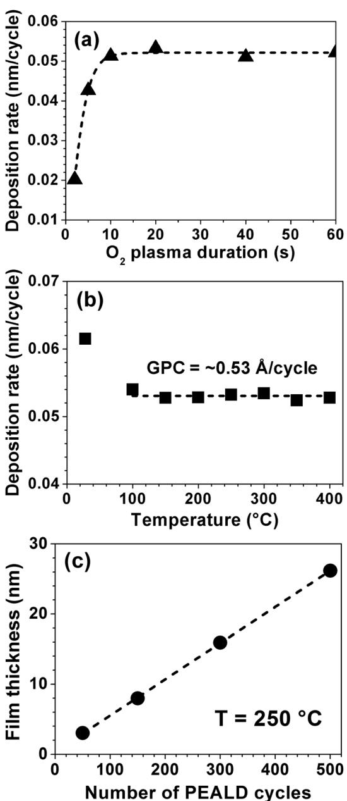
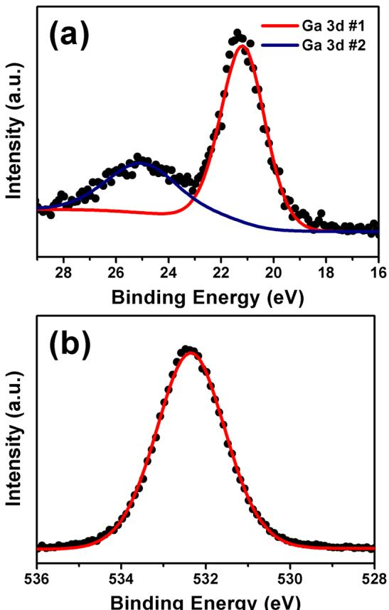
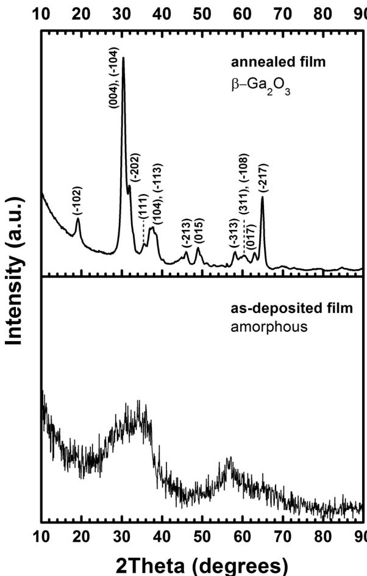
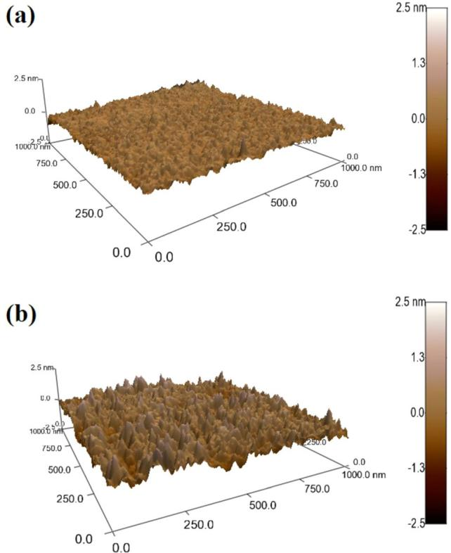
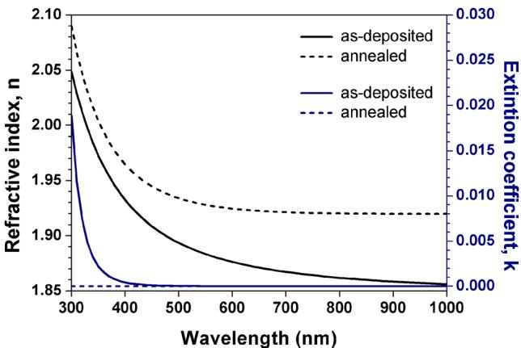

# Low temperature deposition of  $\mathrm{Ga}_{2}\mathrm{O}_{3}$  thin films using trimethylgallium and oxygen plasma  $\odot$

Inci Donmez; Cagla Ozgit- Akgun; Necmi Biyikli

Check for updates

J. Vac. Sci. Technol. A 31, 01410 (2013) https://doi.org/10.1116/1.4758782

# Articles You May Be Interested In

Effect of postdeposition annealing on the electrical properties of  $\beta - \mathrm{Ga}_{2}\mathrm{O}_{3}$  thin films grown on  $p$ - Si by plasma- enhanced atomic layer deposition

J. Vac. Sci. Technol. A (May 2014)

Effect of  $\mathrm{O}_{2}$  plasma exposure time during atomic layer deposition of amorphous gallium oxide

J. Vac. Sci. Technol. A (September 2021)

Low- temperature growth of gallium oxide thin films by plasma- enhanced atomic layer deposition

J. Vac. Sci. Technol. A (January 2020)

# Low temperature deposition of  $\mathrm{Ga}_{2}\mathrm{O}_{3}$  thin films using trimethylgallium and oxygen plasma

Inci Donmez, Cagla Ozgit- Akgun, and Necmi Biyiklia)  UNAM - Institute of Materials Science and Nanotechnology, Bilkent University, 06800 Ankara, Turkey

(Received 1 August 2012; accepted 28 September 2012; published 12 October 2012)

Gallium oxide  $(\mathrm{Ga}_{2}\mathrm{O}_{3})$  thin films were deposited by plasma- enhanced atomic layer deposition (ALD) using trimethylgallium as the gallium precursor and oxygen plasma as the oxidant. A wide ALD temperature window was observed from 100 to  $400^{\circ}\mathrm{C}$ , where deposition rate was constant at  $\sim 0.53\mathrm{\AA}$  cycle. X- ray photoelectron spectroscopy survey scans indicated the presence of gallium, oxygen, and carbon elements with concentrations of  $\sim 36$ ,  $\sim 51.8$ , and  $\sim 12.2$  at.  $\%$  respectively. As- deposited films were amorphous; upon annealing at  $900^{\circ}\mathrm{C}$  under  $\mathrm{N}_2$  atmosphere for  $30\mathrm{min}$ , polycrystalline  $\beta - \mathrm{Ga}_{2}\mathrm{O}_{3}$  phase with a monoclinic crystal structure was obtained. Refractive index and root mean square roughness of the annealed  $\mathrm{Ga}_{2}\mathrm{O}_{3}$  film were higher than those of the as- deposited due to crystallization. © 2013 American Vacuum Society. [http://dx.doi.org/10.1116/1.4758782]

# I. INTRODUCTION

Gallium oxide  $(\mathrm{Ga}_{2}\mathrm{O}_{3})$  is a wide band gap material with good thermal and chemical stability, high dielectric constant, and large band gap  $(\sim 4.9\mathrm{eV})$ . Combination of these properties enables  $\mathrm{Ga}_{2}\mathrm{O}_{3}$  thin films to be used in various applications, including solar cells, gas sensors, deep- UV photodetectors, field- effect transistors, and spintronics. The growth of  $\mathrm{Ga}_{2}\mathrm{O}_{3}$  films has been accomplished by techniques, such as magnetron sputtering, electron beam evaporation, pulsed laser deposition, molecular beam epitaxy, metal- organic chemical vapor deposition (MOCVD), vapor phase epitaxy, and sol- gel process.

Several studies have been reported for the atomic layer deposition (ALD) of  $\mathrm{Ga}_{2}\mathrm{O}_{3}$  thin films using different precursors. First report on the plasma- enhanced ALD (PEALD) of  $\mathrm{Ga}_{2}\mathrm{O}_{3}$  using oxygen  $(\mathrm{O}_{2})$  plasma was published by Shan et al. Their study, in which  $\mathrm{[(CH_3)_2NaNH_2]_3}$  was used as the gallium (Ga) precursor, presented the structural, electrical, and optical properties of the deposited films.  $\mathrm{Ga}_{2}\mathrm{O}_{3}$  and mixed  $\mathrm{Ga}_{2}\mathrm{O}_{3} - \mathrm{TiO}_{2}$  films have also been grown by PEALD using  $\mathrm{[(CH_3)_2NaNH_2]_3}$  and  $\mathrm{Ti(NMe_2)_4}$  precursors in order to obtain films with large dielectric constant and low leakage current for electronic device applications. Another study is about the fabrication of metal/insulator/semiconductor capacitors by using  $\mathrm{Ga}_{2}\mathrm{O}_{3}$  as the insulating layer. Ga precursor used in this study was not mentioned by the authors. Besides PEALD, few studies regarding the growth of  $\mathrm{Ga}_{2}\mathrm{O}_{3}$  films using thermal ALD were reported as well. Dezelah et al. employed  $\mathrm{Ga}_{2}(\mathrm{NMe}_{2})_{6}$  together with  $\mathrm{H}_2\mathrm{O}$  to obtain  $\mathrm{Ga}_{2}\mathrm{O}_{3}$  thin films. This process exhibited an ALD window between 170 and  $250^{\circ}\mathrm{C}$  with a growth rate of  $1\mathrm{\AA}$  cycle. Recently, Lee et al. reported the deposition of  $\mathrm{Ga}_{2}\mathrm{O}_{3}$  thin films via both ALD and MOCVD using a new Ga precursor, dimethylgallium isopropoxide  $(\mathrm{Me}_2\mathrm{GaO}^*\mathrm{Pr})$ . A narrow ALD window  $(280 - 300^{\circ}\mathrm{C})$  was reported for the process, and growth rate was found to be  $0.28\mathrm{\AA}$  cycle in this region.

In this study, we report on the growth of  $\mathrm{Ga}_{2}\mathrm{O}_{3}$  thin films using trimethylgallium (TMG) and  $\mathrm{O}_2$  plasma as the Ga source and oxidant, respectively. To the best of our knowledge,

PEALD of  $\mathrm{Ga}_{2}\mathrm{O}_{3}$  films at such low temperatures using TMG has not yet been reported. Chemical, structural, and morphological characterizations of the films are also presented.

# II. EXPERIMENT

$\mathrm{Ga}_{2}\mathrm{O}_{3}$  thin films were deposited by PEALD using TMG as the Ga precursor and  $\mathrm{O}_2$  plasma as the oxidant. Experiments were carried out in a Fiji F200 ALD reactor (Cambridge Nanotech) with a base pressure of  $\sim 0.20 - 0.25$  Torr. Solvent- cleaned Si (111) substrates were loaded into the reactor through a load lock.  $\mathrm{Ga}_{2}\mathrm{O}_{3}$  films were then deposited on these substrates at temperatures starting from room temperature to  $400^{\circ}\mathrm{C}$ . Ar was used as the carrier gas with the flow rates of 60 and 200 sccm for TMG and  $\mathrm{O}_2$ , respectively. For the optimization of growth parameters, 150 cycles were deposited at  $250^{\circ}\mathrm{C}$ , where one cycle consisted of  $0.015\mathrm{s}$  TMG (precursor bottle temperature  $\sim 6^{\circ}\mathrm{C}) / 5\mathrm{s}$  Ar purge/2- 60 s (25 sccm,  $300\mathrm{W}$ )  $\mathrm{O}_2$  plasma/5 s Ar purge. Postgrowth annealing of  $\mathrm{Ga}_{2}\mathrm{O}_{3}$  films was performed in a rapid thermal annealing system (ATV- Unitem, RTP- 1000- 150) under 100 sccm  $\mathrm{N}_2$  flow.

Chemical compositions and bonding states of the  $\mathrm{Ga}_{2}\mathrm{O}_{3}$  thin films were determined by x- ray photoelectron spectroscopy (XPS), using a Thermo Scientific K- Alpha spectrometer equipped with a monochromatic Al K2 x- ray source. Surface morphologies and root mean square (rms) roughnesses of the films were investigated by using an atomic force microscope (AFM, Asylum Research, MFP- 3D) in the contact mode. Grazing- incidence x- ray diffraction (GIXRD) measurements were performed in a PANanalytical X'Pert PRO MRD diffractometer operating at  $45\mathrm{kV}$  and  $40\mathrm{mA}$ , using  $\mathrm{CuK}\alpha$  radiation  $(\lambda = 0.15418\mathrm{nm})$ . Initial scans were performed within the range of  $10^{\circ} - 90^{\circ}$  by using  $0.1^{\circ}$  step size and  $0.5\mathrm{s}$  counting time. For the crystalline samples, additional data were obtained within the same  $2\theta$  range by the summation of eight scans, which were performed by using  $0.1^{\circ}$  step size and  $10\mathrm{s}$  counting time. Ellipsometric spectra of the  $\mathrm{Ga}_{2}\mathrm{O}_{3}$  thin film samples were measured at three angles of incidence  $(65^{\circ}, 70^{\circ}$ , and  $75^{\circ})$  within the wavelength range of  $300 - 1000\mathrm{nm}$  by spectroscopic ellipsometry (VASE, J. A. Woollam). Cauchy dispersion function was used for modeling the optical

constants and estimating film thicknesses. Prior to depositions, native oxide thicknesses of the Si (111) substrates were measured by spectroscopic ellipsometry, which were then used for estimating the thicknesses of deposited  $\mathrm{Ga}_2\mathrm{O}_3$  layers using the  $\mathrm{Si / SiO_2 / Ga_2O_3}$  model.

# III. RESULTS AND DISCUSSION

In order to optimize growth parameters needed for the self- limiting deposition of  $\mathrm{Ga}_2\mathrm{O}_3$  thin films, effect of TMG dose,  $\mathrm{O}_2$  plasma duration, and Ar purge time were studied. Doubling the TMG dose from 0.015 to  $0.03\mathrm{s}$  (precursor bottle temperature  $\sim 0^{\circ}\mathrm{C}$ ) did not affect the deposition rate remarkably, indicating that  $0.015\mathrm{s}$  is high enough for surface saturation. Figure 1(a) shows the deposition rate of  $\mathrm{Ga}_2\mathrm{O}_3$  films as a function of  $\mathrm{O}_2$  flow duration. Experiments were carried out by using various durations ranging from 2 to  $60\mathrm{s}$ . Deposition rate has saturated for  $\mathrm{O}_2$  flow durations starting from  $10\mathrm{s}$ . Although  $10\mathrm{s}$  was acceptable,  $20\mathrm{s}$  was used for the following  $\mathrm{Ga}_2\mathrm{O}_3$  depositions. The effect of purge time on growth rate was also investigated. Five seconds of Ar flow were found to be sufficient for completely purging excess precursors and gaseous byproducts. In order to study the effect of temperature on growth rate, 150 cycles with  $0.015\mathrm{s}$  TMG and  $20\mathrm{s}$ $\mathrm{O}_2$  plasma were deposited at different temperatures  $(28 - 400^{\circ}\mathrm{C})$ . A wide ALD temperature window was observed from 100 to  $400^{\circ}\mathrm{C}$  [Fig. 1(b)], where deposition rate was constant at  $\sim 0.53\mathrm{A / cycle}$ . In Fig. 1(c),  $\mathrm{Ga}_2\mathrm{O}_3$  film thicknesses were plotted as a function of the number of PEALD cycles. Films deposited at  $250^{\circ}\mathrm{C}$  exhibited a linear growth behavior. Slope of the linear fit corresponded to deposition rate observed within the ALD window.

  
FIG. 1. Growth rate of  $\mathrm{Ga}_2\mathrm{O}_3$  thin films as a function of (a)  $\mathrm{O}_2$  plasma flow duration at  $250^{\circ}\mathrm{C}$  and (b) deposition temperature. TMG dose and  $\mathrm{O}_2$  plasma flow rate were constant at  $0.015\mathrm{s}$  and  $25\mathrm{scm}$  respectively. (c)  $\mathrm{Ga}_2\mathrm{O}_3$  film thickness as a function of the number of PEALD cycles.

Chemical compositions and bonding states of the deposited  $\mathrm{Ga}_2\mathrm{O}_3$  thin films were studied by XPS. Survey scans detected peaks of Ga, oxygen (O), and carbon (C) with the concentrations of  $\sim 36$ ,  $\sim 51.8$ , and  $\sim 12.2$  at.  $\%$ , respectively, for the film deposited at  $250^{\circ}\mathrm{C}$ . Almost same elemental compositions were measured for the films deposited at different temperatures within the ALD window. The reason of C found in the samples was asserted to be due to surface contamination. To prove this claim, bulk films were reached by applying ion beam etching by using Ar ions with energy of  $2\mathrm{kV}$ . C was not detected in the bulk films obtained by

  
FIG. 2. (Color online) (a) Ga 3d and (b) O is high resolution XPS scans of  $\sim 26\mathrm{nm}$  thick  $\mathrm{Ga}_2\mathrm{O}_3$  thin film deposited at  $250^{\circ}\mathrm{C}$ .

60 s etching. Ga 3d high resolution XPS spectrum taken from the surface of  $\sim 26 \mathrm{nm}$  thick  $\mathrm{Ga}_2\mathrm{O}_3$  sample was fitted by using two subpeaks as shown in Fig. 2(a). Subpeak #1, with a binding energy of  $21.2\mathrm{eV}$ , confirmed the presence of Ga- O bond in the samples. Subpeak #2  $(\sim 25\mathrm{eV})$ , on the other hand, was related to the contribution from O 2s core level. The effect of this contribution on XPS survey scan results is also noteworthy, which leads to an overestimation of the Ga atomic concentration in deposited films. Figure 2(b) is the O 1s high resolution XPS spectrum taken from the sample surface. Binding energy position of the O 1s  $(532.3\mathrm{eV})$  core level was well consistent with the literature.

Figure 3 shows the GIXRD patterns of as- deposited and annealed  $\mathrm{Ga}_2\mathrm{O}_3$  films. Although these patterns belong to a film deposited at  $250^{\circ}\mathrm{C}$ , PEALD- grown  $\mathrm{Ga}_2\mathrm{O}_3$  thin films were found to be amorphous in the as- deposited state irrespective of their deposition temperature. Upon annealing at  $900^{\circ}\mathrm{C}$  for  $30\mathrm{min}$  under  $\mathsf{N}_2$  atmosphere, polycrystalline  $\beta - \mathrm{Ga}_2\mathrm{O}_3$  films with a monoclinic crystal structure were obtained (ICDD reference code: 00- 011- 0370). Among all the five different allotropic modifications of  $\mathrm{Ga}_2\mathrm{O}_3$ ,  $\beta - \mathrm{Ga}_2\mathrm{O}_3$  is known to be the most stable and frequent one reported for thin films. In order to determine the annealing temperature at which crystallization starts, as- deposited samples were also annealed at 500, 600, 700, and  $800^{\circ}\mathrm{C}$  for  $30\mathrm{min}$  under  $\mathsf{N}_2$  atmosphere. GIXRD patterns of these samples indicated that crystallization starts at  $600^{\circ}\mathrm{C}$ . Crystallinity of the  $\beta - \mathrm{Ga}_2\mathrm{O}_3$  films increased with annealing temperature.

  
FIG. 3. GIXRD patterns of as-deposited and annealed  $\sim 26 \mathrm{nm}$  thick  $\mathrm{Ga}_2\mathrm{O}_3$  thin films. Film deposited at  $250^{\circ}\mathrm{C}$  was amorphous in the as-deposited state. GIXRD pattern of the annealed film reveals a polycrystalline structure and corresponds to the  $\beta -\mathrm{Ga}_2\mathrm{O}_3$  phase.

  
FIG. 4. (Color online) 3D surface morphologies of (a) as-deposited  $(250^{\circ}\mathrm{C})$  and (b) annealed  $\sim 26 \mathrm{nm}$  thick  $\mathrm{Ga}_2\mathrm{O}_3$  thin films.

AFM analyses were performed for revealing the surface morphologies and measuring the rms roughnesses of  $\sim 26 \mathrm{nm}$  thick  $\mathrm{Ga}_2\mathrm{O}_3$  thin films deposited on Si (111) substrates. Figures 4(a) and 4(b) show 3D AFM topographies of the as- deposited and annealed samples, respectively. rms roughness value, which was measured from a  $1\mu \mathrm{m}\times 1\mu \mathrm{m}$  scan area, increased from 0.16 to  $0.37 \mathrm{nm}$  after annealing at  $900^{\circ}\mathrm{C}$  for  $30 \mathrm{min}$ . Increase in the rms roughness value after annealing was attributed to the formation of grains upon crystallization.

Thicknesses and optical constants of  $\mathrm{Ga}_2\mathrm{O}_3$  thin films were estimated by modeling the spectra measured by spectroscopic ellipsometry within the wavelength range of  $300 - 1000 \mathrm{nm}$ . Ellipsometric spectra of the as- deposited and annealed  $\mathrm{Ga}_2\mathrm{O}_3$  thin films (500 PEALD cycles) were modeled by the Cauchy dispersion function using Si  $(0.5 \mathrm{mm}) / \mathrm{SiO}_2$ $(1.83 \mathrm{nm}) / \mathrm{Ga}_2\mathrm{O}_3$  layer structure. The thickness of the as- deposited film was measured as  $26.2 \mathrm{nm}$ , which did not change remarkably after postgrowth annealing. Refractive index values, on the other hand, increased from 2.05- 1.86 to 2.09- 1.92 for  $300 - 1000 \mathrm{nm}$  spectral range (Fig. 5). These results again indicate structural enhancement upon annealing at  $900^{\circ}\mathrm{C}$ .

  
FIG. 5. (Color online) Optical constants of as-deposited  $(250^{\circ}\mathrm{C})$  and annealed  $\sim 26 \mathrm{nm}$  thick  $\mathrm{Ga}_{2}\mathrm{O}_{3}$  thin films.

# IV. SUMMARY AND CONCLUSIONS

$\mathrm{Ga}_{2}\mathrm{O}_{3}$  thin films were deposited via PEALD at temperatures starting from room temperature using TMG and  $\mathrm{O}_{2}$  plasma. A wide ALD window ranging from 100 to  $400^{\circ}\mathrm{C}$  was observed with a constant deposition rate of  $\sim 0.53 \mathrm{\AA}$  cycle. XPS studies confirmed the presence of  $\mathrm{Ga}_{2}\mathrm{O}_{3}$ , and C detected in the survey scans was attributed to surface contamination. Although as- deposited films were amorphous, annealing at  $900^{\circ}\mathrm{C}$  for  $30 \mathrm{min}$  under  $\mathrm{N}_{2}$  atmosphere resulted in crystallization. Upon postgrowth annealing, polycrystalline  $\beta - \mathrm{Ga}_{2}\mathrm{O}_{3}$  thin films with monoclinic structure were obtained, which also exhibited higher refractive indices and rms roughnesses when compared to their as- deposited counterparts.

# ACKNOWLEDGMENTS

This work was performed at UNAM supported by the State Planning Organization (DPT) of Turkey through the National Nanotechnology Research Centre Project. N.B. acknowledges support from Marie Curie International Reintegration Grant (Grant No. PIRG05- GA- 2009- 249196).

# C. Ozgit-Akgun acknowledges TUBITAK-BIDEB for National Ph.D. Scholarship.

$^1$ G. X. Liu, F. K. Shan, J. J. Park, W. J. Lee, G. H. Lee, I. S. Kim, B. C. Shin, and S. G. Yoon, J. Electroceram. 17, 145 (2006).  $^2$ M. Orita, H. Ohta, M. Hirano, and H. Hosono, Appl. Phys. Lett. 77, 4166 (2000).  $^3$ F. K. Shan, G. X. Liu, W. J. Lee, G. H. Lee, and I. S. Kim, J. Appl. Phys. 98, 023504 (2005).  $^4$ M. Ogita, S. Yuasa, K. Kobayashi, Y. Yamada, Y. Nakanishi, and Y. Hatanaka, Appl. Surf. Sci. 212- 213, 397 (2003).  $^5$ S. Fujita, Proc. SPIE 7041, 70410M (2008).  $^6$ M. Higashiwaki, K. Sasaki, A. Kuramata, T. Masui, and S. Yamakoshi, Appl. Phys. Lett. 100, 013504 (2012).  $^7$ H. Hayashi, R. Huang, H. Ikeno, F. Oba, and S. Yoshika, Appl. Phys. Lett. 89, 181903 (2006).  $^8$ H. H. Kim and P. H. Holloway, J. Vac. Sci. Technol. A 20, 928 (2002).  $^9$ N. C. Oldham, C. J. Hill, C. M. Garland, and T. C. McGill, J. Vac. Sci. Technol. A 20, 809 (2002).  $^{10}$ S.- L. Ou, D.- S. Wuu, Y.- C. Fu, S.- P. Liu, R.- H. Horng, L. Liu, and Z.- C. Feng, Mater. Chem. Phys. 133, 700 (2012).  $^{11}$ M. Holland, C. R. Stanley, W. Reid, R. J. Hill, and D. A. Moran, J. Vac. Sci. Technol. B 25, 1706 (2007).  $^{12}$ H. W. Kim and N. H. Kim, Mater. Sci. Eng., B 110, 34 (2004).  $^{13}$ L. Kong, J. Ma, C. Luan, W. Mi, and Y. Lv, Thin Solid Films 520, 4270 (2012).  $^{14}$ Y. Kokubun, K. Miura, F. Endo, and S. Nakagomi, Appl. Phys. Lett. 90, 031912 (2007).  $^{15}$ F. K. Shan, G. X. Liu, W. J. Lee, G. H. Lee, I. S. Kim, and B. C. Shin, Integr. Ferroelectr. 80, 197 (2006).  $^{16}$ G. X. Liu, F. K. Shan, W. J. Lee, B. C. Shin, S. C. Kim, H. S. Kim, and C. R. Cho, Integr. Ferroelectr. 94, 11 (2007).  $^{17}$ N.- J. Seong, S.- G. Yoon, and W.- J. Lee, Appl. Phys. Lett. 87, 082909 (2005).  $^{18}$ G. X. Liu, F. K. Shan, W. J. Lee, G. H. Lee, I. S. Kim, and B. C. Shin, Integr. Ferroelectr. 85, 155 (2006).  $^{19}$ S.- A. Lee, J.- Y. Hwang, J.- P. Kim, C.- R. Cho, W.- J. Lee, and S.- Y. Jeong, J. Korean Phys. Soc. 47, S292 (2005).  $^{20}$ C. L. Dezelah IV, J. Niinisto, K. Arstila, L. Niinisto, and C. H. Winter, Chem. Mater. 18, 471 (2006).  $^{21}$ H. Lee, K. Kim, J.- J. Woo, D.- J. Jun, Y. Park, Y. Kim, H. W. Lee, Y. J. Cho, and H. M. Cho, Chem. Vap. Deposition 17, 191 (2011).  $^{22}$ D. H. Kim, S. H. Yoo, T.- M. Chung, K.- S. An, H.- S. Yoo, and Y. Kim, Bull. Korean Chem. Soc. 23, 225 (2002).  $^{23}$ V. K. Josepovits, O. Krafcisik, G. Kiss, and I. V. Perczel, Sens. Actuators B 48, 373 (1998).  $^{24}$ M. Rebien, W. Henrion, M. Hong, J. P. Mannaerts, and M. Fleischer, Appl. Phys. Lett. 81, 250 (2002).