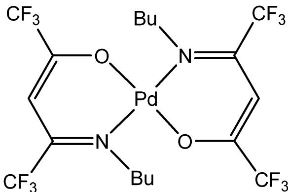
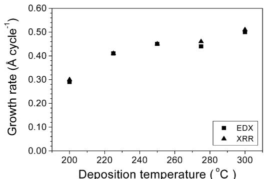
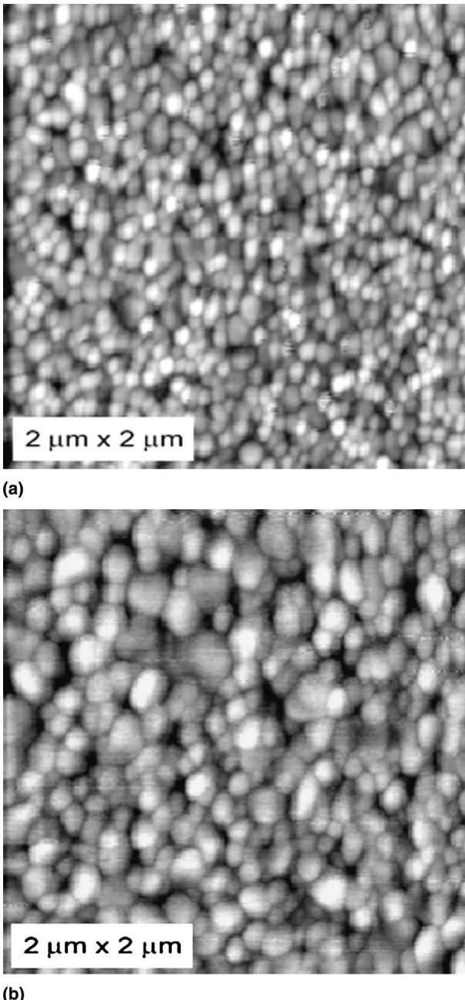
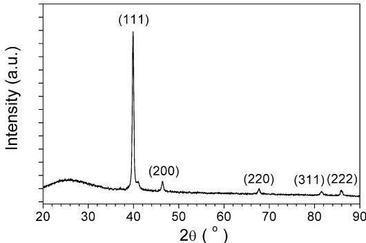
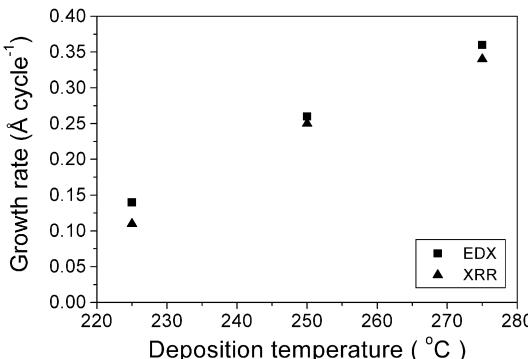
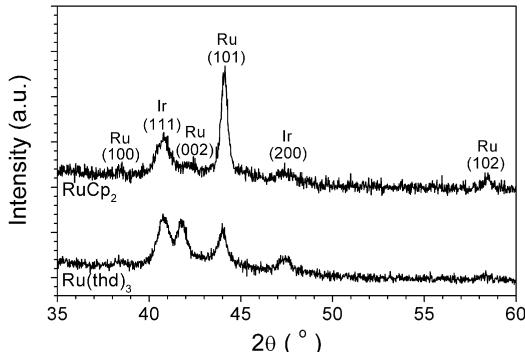

# Atomic layer deposition of noble metals: Exploration of the low limit of the deposition temperature

Titta Aaltonena) and Mikko Ritala  Department of Chemistry, University of Helsinki, FIN- 00014 Helsinki, Finland

Yung- Liang Tung and Yun Chi  Department of Chemistry, National Tsing Huang University, Hsinchu 30013, Taiwan

Kai Arstila and Kristoffer Meinander  Department of Physical Sciences, University of Helsinki, FIN- 00014 Helsinki, Finland  Markku Leskelaii  Department of Chemistry, University of Helsinki, FIN- 00014 Helsinki, Finland

(Received 17 June 2004; accepted 4 August 2004)

The low limit of the deposition temperature for atomic layer deposition (ALD) of noble metals has been studied. Two approaches were taken; using pure oxygen instead of air and using a noble metal starting surface instead of  $\mathrm{Al}_2\mathrm{O}_3$ . Platinum thin films were obtained by ALD from  $\mathrm{MeCpPtMe}_3$  and pure oxygen at deposition temperature as low as  $200^{\circ}\mathrm{C}$ , which is significantly lower than the low- temperature limit of  $300^{\circ}\mathrm{C}$  previously reported for the platinum ALD process in which air was used as the oxygen source. The platinum films grown in this study had smooth surfaces, adhered well to the substrate, and had low impurity contents. ALD of ruthenium, on the other hand, took place at lower deposition temperatures on an iridium seed layer than on an  $\mathrm{Al}_2\mathrm{O}_3$  layer. On iridium surface, ruthenium films were obtained from  $\mathrm{RuCp}_2$  and oxygen at  $225^{\circ}\mathrm{C}$  and from  $\mathrm{Ru(thd)}_3$  and oxygen at  $250^{\circ}\mathrm{C}$ , whereas no films were obtained on  $\mathrm{Al}_2\mathrm{O}_3$  at temperatures lower than 275 and  $325^{\circ}\mathrm{C}$ , respectively. The crystal orientation of the ruthenium films was found to depend on the precursor. ALD of palladium from a palladium  $\beta$ - ketoiminate precursor and oxygen at 250 and  $275^{\circ}\mathrm{C}$  was also studied. However, the film- growth rate did not saturate to a constant level when the precursor pulse times were increased.

# I. INTRODUCTION

Noble metals have many potential applications in integrated circuits. Platinum, ruthenium, and iridium are potential electrode materials in dynamic random access memories (DRAMs) and in ferroelectric random access memories (FRAMs).1- 4 They are also potential gate electrode materials in metal- oxide- semiconductor field effect transistors (MOSFETs).5- 7 Furthermore, ruthenium and palladium have been studied as barrier or seed materials for copper interconnects in the integrated circuits.8- 10 Deposition of noble metals by chemical vapor deposition (CVD) has extensively been studied.11 Atomic layer deposition (ALD)12 is another promising method for noble metal deposition for these applications because of the excellent conformality and good large- area uniformity13,14 of the deposited films.

Low deposition temperatures have many benefits in the above mentioned applications of noble metals. Smoother films are obtained at lower deposition temperatures because of less pronounced crystal growth.15,16 Smooth bottom electrodes have been shown to provide lower leakage currents in the memory capacitors.1,17 In addition, less aggressive process conditions (e.g., lower deposition temperature) may retard the barrier oxidation1 during the noble metal deposition. In interconnect metallization, low deposition temperature is required when temperature- sensitive low-  $k$  dielectrics are used.14 Furthermore, at lower deposition temperatures, noble metal films with lower degree of crystallization are produced,18 possibly reducing the grain- boundary diffusion of copper through the noble metal barrier, as is the case with transition metal nitride barriers.19

ALD processes for ruthenium,15,16,20- 22 platinum,23 palladium,24 and iridium18 thin films have recently been reported. The low- temperature limits for these processes are  $270^{\circ}\mathrm{C}$  for ruthenium,  $300^{\circ}\mathrm{C}$  for platinum,  $225^{\circ}\mathrm{C}$  for iridium, and  $80^{\circ}\mathrm{C}$  for palladium, the palladium films

being deposited on a palladium seed grown at  $210^{\circ}\mathrm{C}$ , or on an evaporated iridium seed layer. $^{24}$  The reported noble metal ALD processes are based on reaction of oxygen or hydrogen with the ligands of the metal precursor. In addition, plasma assisted ALD of ruthenium has been reported. $^{22}$  In the oxygen- based processes, oxygen dissociatively adsorbs on the noble metal surface during the oxygen pulse and oxidatively decomposes the ligands of the metal precursor during the following pulse. $^{25}$  The noble metal surface thus catalytically activates the film growth reactions. The onset of the film growth, on the other hand, takes place on the initial substrate surface, which may not be catalytically active. In such case, the film growth may be prevented by low reactivity of the metal precursor with the initial surface or by the lack of catalytic activation of oxygen. If the onset of the film growth is the growth limiting factor, a catalytically active seed layer can be used to facilitate the onset of the film growth.

In this paper, we have studied methods for lowering the deposition temperature for ALD of ruthenium and platinum films. Ruthenium films were grown at lower temperatures than previously reported $^{15,16}$  by using an iridium seed layer that was grown in the same ALD process at the same temperature as the ruthenium film.  $\mathrm{RuCp}_2$ $\mathrm{Cp} =$  cyclopentadienyl) and  $\mathrm{Ru(thd)}_3$ $\mathrm{(thd =}$  2,2,6,6- tetramethyl- 3,5- heptanedionato) were used as ruthenium precursors. We also report a low- temperature ALD process for platinum from  $\mathrm{MeCpPtMe}_3$  and pure oxygen. In addition, we have studied palladium deposition by a process based on oxidative decomposition of  $\mathrm{Pd(keim2)}_2$ $\mathrm{[keim2 = CF_3C(O)CH^+C(CF_3)NBu^n]}$  at temperatures lower than  $300^{\circ}\mathrm{C}$

# II. EXPERIMENTAL

The films were grown in a hot- wall flow- type F- 120 ALD reactor (ASM Microchemistry Ltd., Helsinki, Finland) operated under a pressure of about 10 mbar. Nitrogen  $(99.9995\%)$ , from a NITROX UHPN 3000 nitrogen generator (Schmidlin, Neuheim), was used as a carrier and a purging gas. The noble metal films were grown on  $5\mathrm{cm}\times 5\mathrm{cm}$  borosilicate glass and silicon substrates with an as- deposited  $2 - 4\mathrm{nm}$  thick, amorphous  $\mathrm{Al}_2\mathrm{O}_3$  layer. The  $\mathrm{Al}_2\mathrm{O}_3$  layer was grown by ALD from  $\mathrm{AlCl}_3$  and  $\mathrm{H}_2\mathrm{O}$ . $^{26}$  Platinum films were grown by ALD from  $\mathrm{MeCpPtMe}_3$  (Strem Chemicals, Newburyport, MA) and oxygen  $(99.999\%)$ .  $\mathrm{MeCpPtMe}_3$  was evaporated at room temperature inside the reactor. The oxygen flow rate was  $20\mathrm{scm}$ . Palladium was deposited by ALD from  $\mathrm{Pd(keim2)}_2$ , whose structure is shown in Fig. 1, and oxygen  $(99.999\%)$ . The palladium precursor was synthesized as described by Liu et al. $^{27}$ $\mathrm{Pd(keim2)}_2$  was evaporated at  $60^{\circ}\mathrm{C}$ , which is also the melting point of the compound. Oxygen flow rates of  $20$  and  $40\mathrm{scm}$  were used.

  
FIG. 1. Structure of the palladium  $\beta$ -ketoiminato precursor  $\mathrm{Pd(keim2)}_2$ .

Iridium films were grown from  $\mathrm{Ir(acac)}_3$  (acac = acetylacetonato) (Strem Chemicals), and ruthenium films from  $\mathrm{RuCp}_2$  (Strem Chemicals) and  $\mathrm{Ru(thd)}_3$  (Volatec, Porvoo, Finland) by similar ALD processes as described earlier $^{15,16,18}$  with the exception that oxygen  $(99.999\%)$  instead of air was used as the other reagent. Oxygen flow rates of  $5$  and  $20\mathrm{scm}$  were used in the  $\mathrm{RuCp}_2$  and  $\mathrm{Ru(thd)}_3$  processes, respectively.  $\mathrm{Ir(acac)}_3$  was evaporated at  $150^{\circ}\mathrm{C}$ ,  $\mathrm{RuCp}_2$  at  $60^{\circ}\mathrm{C}$ , and  $\mathrm{Ru(thd)}_3$  at  $100^{\circ}\mathrm{C}$ . The oxygen flow rate in the iridium process was varied between  $5$  and  $20\mathrm{scm}$ , and was the same as in the subsequent metal process. The iridium films were grown just prior to ruthenium deposition at the same temperature as the ruthenium films.

The crystal structure of the films was determined using a AXS D8 Advance x- ray diffraction (XRD) instrument (Bruker, Karlsruhe), which was also used in the x- ray reflectivity (XRR) measurements. The film thicknesses were determined by XRR and by energy dispersive x- ray spectroscopy (EDX), the EDX data being analyzed by using a GMR electron probe thin film microanalysis program. $^{28}$  The film roughnesses were analyzed by XRR and by atomic force microscopy (AFM). The AFM measurements were carried out in intermittent- contact mode using AutoProbe CP Research AFM (ThermoMicroscopes, Sunnyvale, CA). Sheet resistances were measured by the standard four- point probe method. Impurity contents were analyzed by time- of- flight elastic recoil detection analysis (TOF- ERDA) using  $53\mathrm{MeV}^{127}\mathrm{J}^{10 + }$  ions.

# III. RESULTS AND DISCUSSION

Platinum thin films were grown by ALD from  $\mathrm{MeCpPtMe}_3$  and oxygen at temperatures of  $200 - 300^{\circ}\mathrm{C}$ . We have previously reported an ALD process for platinum from the same platinum precursor using air as the oxygen source. $^{23}$  In that process, practically no film was obtained at deposition temperatures lower than  $300^{\circ}\mathrm{C}$ . Thus, deposition temperature of platinum films is significantly lowered when pure oxygen is used as the reactive gas instead of air. The air flow rate in our previous study

was 40 sccm, whereas the oxygen flow rate in the current study was 20 sccm. Thus, the higher oxygen partial pressure used in this study was essential for the deposition of platinum films at temperatures lower than  $300^{\circ}\mathrm{C}$ .

Figure 2 shows the temperature dependence of the platinum film- growth rate, the film thicknesses being determined by EDX and XRR. The growth rate was about  $0.30\mathrm{\AA}$  cycle $^{- 1}$  at  $200^{\circ}\mathrm{C}$  and about  $0.51\mathrm{\AA}$  cycle $^{- 1}$  at  $300^{\circ}\mathrm{C}$ . In our previous study, growth rates of about  $0.50\mathrm{\AA}$  cycle $^{- 1}$  were obtained when air was used as the oxygen source at  $300^{\circ}\mathrm{C}$ . Thus, at  $300^{\circ}\mathrm{C}$  the oxygen source or the oxygen partial pressure do not have a significant effect on growth rate.

Dependence of the grain size and the surface roughness of the platinum films on the deposition temperature was studied by AFM. Figure 3 shows AFM images of a  $45\mathrm{- nm}$  film grown at  $250^{\circ}\mathrm{C}$  and a  $50\mathrm{- nm}$  film grown at  $300^{\circ}\mathrm{C}$ . A  $30\mathrm{- nm}$  film grown at  $200^{\circ}\mathrm{C}$  looked very similar to the film grown at  $250^{\circ}\mathrm{C}$ . The root mean square (RMS) surface roughnesses, obtained from  $2\mu \mathrm{m}\times 2\mu \mathrm{m}$  scans, were  $0.8\mathrm{nm}$  for both the films grown at  $200$  and  $250^{\circ}\mathrm{C}$ . As can be seen in Fig. 3, the grains in the film grown at  $300^{\circ}\mathrm{C}$  are clearly larger than in the film grown at  $250^{\circ}\mathrm{C}$ . The increased grain size also affects the surface roughness, which is  $1.2\mathrm{nm}$  for the film grown at  $300^{\circ}\mathrm{C}$ . In our previous study, the RMS surface roughness of a  $50\mathrm{- nm}$  film grown at  $300^{\circ}\mathrm{C}$  from  $\mathrm{MeCpPtMe}_3$  using air as the oxygen source was about  $4\mathrm{nm}$ . This is much higher than the roughness of the film grown at  $300^{\circ}\mathrm{C}$  in this study using oxygen as the reaction gas. Thus, smoother platinum films are obtained when oxygen instead of air is used as the reactive gas. This may be due to a higher nucleation density at higher oxygen partial pressure.

Platinum films grown at  $300^{\circ}\mathrm{C}$  in our previous study were strongly (111) oriented. $^{23}$  The XRD pattern in Fig. 4 shows that the platinum films have a preferred (111) crystal orientation even at the lowest deposition temperature of  $200^{\circ}\mathrm{C}$ . The (111) surface has the lowest surface energy and is therefore the most favorable crystal orientation. Resistivities of the platinum films were low; a  $30\mathrm{- nm}$  film grown at  $200^{\circ}\mathrm{C}$  had a resistivity of about  $17\mu \Omega \mathrm{cm}$ , and a  $50\mathrm{- nm}$  film grown at  $300^{\circ}\mathrm{C}$  of about  $13\mu \Omega \mathrm{cm}$ . Adhesion of the films grown on  $\mathrm{Al}_2\mathrm{O}_3$  and on iridium was good, as all the films passed the tape test. The films grown in our previous study $^{23}$  suffered from poor adhesion. Thus, better adhesion is obtained when the platinum films are grown using oxygen instead of air as the reaction gas.

  
FIG. 2. Growth rate of the platinum films grown from  $\mathrm{MeCpPtMe}_3$  as a function of the deposition temperature, the film thicknesses being measured by EDX and XRR. The  $\mathrm{MeCpPtMe}_3$  and oxygen pulse times were  $0.7$  and  $1.0\mathrm{s}$ , respectively, and the purge period between the pulses was  $0.7\mathrm{s}$ .

  
FIG. 3. AFM images of  $2\mu \mathrm{m}\times 2\mu \mathrm{m}$  regions of (a) a  $45\mathrm{-nm}$  platinum film grown at  $250^{\circ}\mathrm{C}$  with a total  $\mathbb{Z}$  -range of  $6.1~\mathrm{nm}$  and b) a  $50 - \mathrm{nm}$  platinum film grown at  $300^{\circ}\mathrm{C}$  with a total  $\mathbb{Z}$  -range of  $9.7~\mathrm{nm}$  .The  $\mathbb{Z}$  -scale for both images spans  $10\mathrm{nm}$

  
FIG. 4. XRD pattern measured from a platinum film grown from  $\mathrm{MeCpPtMe}_3$  and oxygen at  $200^{\circ}\mathrm{C}$ .

The impurity contents of the platinum films were analyzed by TOF- ERDA. The amount of impurities was lower in the films grown at 300 and  $250^{\circ}\mathrm{C}$  than in the film grown at  $200^{\circ}\mathrm{C}$ . Films grown at 300 and  $250^{\circ}\mathrm{C}$  had hydrogen, carbon, and oxygen content of less than 0.3 at.  $\%$  each. The film grown at  $200^{\circ}\mathrm{C}$  contained slightly more impurities, but, however, less than 0.5 at.  $\%$  each. The increased impurity content in the film grown at  $200^{\circ}\mathrm{C}$  is most likely caused by lower reactivity of the precursors at the lowest deposition temperature.

Palladium films were grown from  $\mathrm{Pd(keim2)}_2$  and oxygen at temperatures of 250 and  $275^{\circ}\mathrm{C}$ . Only peaks from metallic palladium could be seen in the diffraction patterns measured by XRD. As the face- centered- cubic metals platinum $^{23}$  and iridium $^{18}$  grown by ALD, also the palladium films had a preferred (111) crystal orientation. Adhesion of the palladium films to the  $\mathrm{Al}_2\mathrm{O}_3$  layer was poor. Therefore, about  $15\mathrm{- nm}$  thick iridium film was deposited on the substrate just prior to palladium deposition to improve the adhesion. At  $275^{\circ}\mathrm{C}$ , mirror- like palladium films were obtained when the oxygen flow rate was 20 sccm. However, when the oxygen flow rate was increased to 40 sccm, the films became milky- like and had very rough surfaces. Surface roughening with increasing air flow rate has been observed also with ruthenium films grown by ALD from  $\mathrm{RuCp}_2$ .

The dependence of the film- growth rate on the  $\mathrm{Pd(keim2)}_2$  and the oxygen pulse times was studied at a deposition temperature of  $250^{\circ}\mathrm{C}$ . The film- growth rate did not saturate to a constant value but increased with increasing precursor pulse times. With  $\mathrm{Pd(keim2)}_2$  pulse time of  $1.0\mathrm{s}$  and oxygen pulse time of  $2.0\mathrm{s}$ , growth rate of  $0.60\mathrm{\AA}$  cycle $^{- 1}$  was obtained. Low reactivity of the precursors is one possible reason for the lack of saturation of the growth rate at pulse times up to  $2\mathrm{s}$ . The increase in the growth rate with increasing  $\mathrm{Pd(keim2)}_2$  pulse time may also be caused by thermal self- decomposition of  $\mathrm{Pd(keim2)}_2$  since metallic palladium was also deposited on the hot walls of the precursor source tube. The impurity content of a palladium film grown at  $250^{\circ}\mathrm{C}$  was 0.3 at.  $\%$  hydrogen, 0.5 at.  $\%$  carbon, 0.1 at.  $\%$  nitrogen, 1.0 at.  $\%$  oxygen, and 0.1 at.  $\%$  fluorine, as determined by TOF- ERDA.

Ruthenium thin films were grown from two ruthenium precursors  $\mathrm{RuCp}_2$  and  $\mathrm{Ru(thd)}_3$ , and oxygen. Ruthenium films were obtained from  $\mathrm{RuCp}_2$  on as- deposited iridium already at a deposition temperature of  $225^{\circ}\mathrm{C}$ , whereas no film growth took place on as- deposited  $\mathrm{Al}_2\mathrm{O}_3$  at temperatures lower than  $275^{\circ}\mathrm{C}$ . When  $\mathrm{Ru(thd)}_3$  was used as the ruthenium precursor, films were obtained on iridium at  $250^{\circ}\mathrm{C}$ , whereas no film was grown on  $\mathrm{Al}_2\mathrm{O}_3$  at temperatures lower than  $325^{\circ}\mathrm{C}$ . These low- temperature limits of 275 and  $325^{\circ}\mathrm{C}$  on  $\mathrm{Al}_2\mathrm{O}_3$  are the same as for the films grown on  $\mathrm{Al}_2\mathrm{O}_3$  using air as a precursor. $^{15,16}$  Thus, unlike in the platinum process described above, the oxygen partial pressure does not affect the onset temperature of the ruthenium film growth. The results show, however, that the onset temperature can be lowered by using the iridium seed layer. This indicates that the film growth on  $\mathrm{Al}_2\mathrm{O}_3$  at low temperatures is restricted by the low reactivity of the ruthenium precursor and oxygen on the initial  $\mathrm{Al}_2\mathrm{O}_3$  surface. The catalytic activity of the iridium film, however, promotes the onset of the ruthenium film growth, and after the ruthenium film covers the surface, the film growth proceeds by self- catalyzation. It was also tested that the platinum films grown at low temperatures by the process presented in this paper serve as seed layers for ruthenium deposition, as well.

Growth rates of the ruthenium films from  $\mathrm{RuCp}_2$  and oxygen on iridium surface are shown in Fig. 5 as a function of the deposition temperature. The growth rate increases linearly with increasing deposition temperature from about  $0.12\mathrm{\AA}$  cycle $^{- 1}$  at  $225^{\circ}\mathrm{C}$  to about  $0.35\mathrm{\AA}$  cycle $^{- 1}$  at  $275^{\circ}\mathrm{C}$ . On  $\mathrm{Al}_2\mathrm{O}_3$ , the ruthenium growth rate at  $275^{\circ}\mathrm{C}$  was only  $0.23\mathrm{\AA}$  cycle $^{- 1}$ , which is much lower than the growth rate of  $0.35\mathrm{\AA}$  cycle $^{- 1}$  on the iridium seed layer. One explanation for this difference is a long incubation period at the beginning of the film growth on  $\mathrm{Al}_2\mathrm{O}_3$ , which decreases the total growth rate. Such an

  
FIG. 5. Growth rate of the ruthenium films grown from  $\mathrm{RuCp}_2$  on iridium as a function of the deposition temperature, the film thicknesses being measured by EDX and XRR. The  $\mathrm{RuCp}_2$  and oxygen pulse times were 0.5 and  $0.2\mathrm{s}$ , respectively, and the purge period between the pulses was  $0.5\mathrm{s}$ .

  
FIG. 6. XRD patterns of ruthenium films grown from  $\mathrm{Ru(thd)}_3$  and  $\mathrm{RuCp}_2$  on iridium at  $250^{\circ}\mathrm{C}$ .

incubation period was observed in our previous study15 for ruthenium films grown on  $\mathrm{Al}_2\mathrm{O}_3$  at  $300^{\circ}\mathrm{C}$ . Furthermore, when air was used as the oxygen source the growth rate was only  $0.13\mathrm{\AA}$  cycle $^{- 1}$  on  $\mathrm{Al}_2\mathrm{O}_3$  at  $275^{\circ}\mathrm{C}^{15}$  while with oxygen the growth rate thus was  $0.23\mathrm{\AA}$  cycle $^{- 1}$ . Kwon et al. $^{21}$  have reported that the growth rate of ruthenium films grown by ALD from  $\mathrm{Ru(EtCp)}_2$  and oxygen depends on the oxygen partial pressure.

The films grown from  $\mathrm{Ru(thd)}_3$  and oxygen on iridium had a growth rate of  $0.15\mathrm{\AA}$  cycle $^{- 1}$  at  $250^{\circ}\mathrm{C}$ , which was the low- temperature limit for the process. This limit is higher than for the  $\mathrm{RuCp}_2$  process indicating that  $\mathrm{Ru(thd)}_3$  has lower reactivity than  $\mathrm{RuCp}_2$ . On  $\mathrm{Al}_2\mathrm{O}_3$  surface, film growth takes place only at  $325^{\circ}\mathrm{C}$  or higher. At  $325^{\circ}\mathrm{C}$  the growth rate was  $0.35\mathrm{\AA}$  cycle $^{- 1}$  on the iridium surface which is only slightly higher than the growth rate of  $0.33\mathrm{\AA}$  cycle $^{- 1}$  measured in our previous study $^{16}$  on  $\mathrm{Al}_2\mathrm{O}_3$  when air was used as the oxygen precursor.

Figure 6 shows XRD patterns of ruthenium films grown at  $250^{\circ}\mathrm{C}$  from  $\mathrm{RuCp}_2$  and  $\mathrm{Ru(thd)}_3$ . The films grown from  $\mathrm{RuCp}_2$  at  $225 - 250^{\circ}\mathrm{C}$  were slightly (101) oriented, whereas the films grown at  $275^{\circ}\mathrm{C}$  were randomly oriented. No differences in the crystal orientation could be seen in the films grown from  $\mathrm{RuCp}_2$  at  $275^{\circ}\mathrm{C}$  on  $\mathrm{Al}_2\mathrm{O}_3$  and iridium. As Fig. 6 shows, the films grown at  $250^{\circ}\mathrm{C}$  from  $\mathrm{Ru(thd)}_3$  have a slightly preferred (002) crystal orientation. The (002) orientation is characteristic for the films grown from  $\mathrm{Ru(thd)}_3$  as the films grown at  $250 - 325^{\circ}\mathrm{C}$  in this study, and the films grown at  $325 - 450^{\circ}\mathrm{C}$  in our previous study. $^{16}$  all had a preferred (002) crystal orientation. Thus, the choice of the ruthenium precursor affects the crystal orientation of the ruthenium films grown by ALD.

# IV. CONCLUSION

Platinum thin films can be grown by ALD at low deposition temperatures of  $200 - 300^{\circ}\mathrm{C}$  from  $\mathrm{MeCpPtMe}_3$  and oxygen. The low- temperature limit of this process using pure oxygen as the reactant is significantly lower than previously reported for the process in which air was used as the oxygen source. The platinum films had low resistivities and good adhesion to the substrate. Palladium films were grown from  $\mathrm{Pd(keim2)}_2$  and oxygen at deposition temperatures of 250 and  $275^{\circ}\mathrm{C}$ , but the film growth did not saturate to a constant value at the process conditions. Ruthenium films were obtained on iridium seed layers at lower deposition temperatures than on  $\mathrm{Al}_3\mathrm{O}_3$ . The crystal orientation of the ruthenium films depends on the precursor.

# ACKNOWLEDGMENTS

Facilities provided by the Electron Microscopy Unit at the Institute of Biotechnology at the University of Helsinki were used for the EDX analysis. This work was supported in part by the Finnish National Technology Agency (TEKES) and the Academy of Finland.

# REFERENCES

1. C.S. Hwang:  $\mathrm{(Ba,Sr)TiO_3}$  thin films for ultra large scale dynamic random-access memory. A review on the process integration. Mater. Sci. Eng. B 56, 178 (1998). 
2. M.S. Tsai, S.C. Sun, and T-Y. Tseng: Effect of bottom electrode materials on the electrical and reliability characteristics of  $\mathrm{(Ba,Sr)TiO_3}$  capacitors. IEEE Trans. Electron Devices 46, 1829 (1999). 
3. J.A. Johnson, J.G. Lisoni, and D.J. Vouters: Developing a conductive oxygen barrier for ferroelectric integration. Microelectron. Eng. 70, 377 (2003). 
4. J. Bandaru, T. Sands, and L. Tsakalakos: Simple Ru electrode scheme for ferroelectric  $\mathrm{(Pb,La)(Zr,Ti)O_3}$  capacitors directly on silicon. J. Appl. Phys. 84, 1121 (1998). 
5. M.A. Pawlak, T. Schram, K. Maex, and A. Vantomme: Investigation of iridium as a gate electrode for deep sub-micron CMOS technology. Microelectron. Eng. 70, 373 (2003). 
6. F. Papadatos, S. Skordas, S. Consiglio, A.E. Kaloyeros, and E. Eisenbraun: Characterization of ruthenium and ruthenium oxide thin films deposited by chemical vapor deposition for CMOS gate electrode applications, in Novel Materials and Processes for Advanced CMOS, edited by M.I. Gardner, S. De Gendt, J-P. Maria, and S. Stemmer (Mater. Res. Soc. Symp. Proc. 745, Warrendale, PA, 2003) p. 61. 
7. K-J. Choi and S-G. Yoon: Characteristics of Pt and TaN metal gate electrode for high-  $\kappa$  hafnium oxide gate dielectrics. Electrochem. Solid-State Lett. 7, G47 (2004). 
8. D. Josell, D. Wheeler, C. Witt, and T.P. Moffat: Seedless superfill: Copper electrodeposition in trenches with ruthenium barriers. Electrochem. Solid-State Lett. 6, C143 (2003). 
9. Z. Wang, O. Yaegashi, H. Sakaue, T. Takahagi, and S. Shingubara: Highly adhesive electroless Cu layer formation using an ultra thin ionized cluster beam (ICB)-Pd catalytic layer for sub-  $100\mathrm{nm}$  Cu interconnections. Jpn. J. Appl. Phys. 42, L1223 (2003). 
10. J.J. Kim, S-K. Kim, and Y.S. Kim: Direct plating of low resistivity bright Cu film onto TiN barrier layer via Pd activation. J. Electrochem. Soc. 151, C97 (2004). 
11. J.R.V. Garcia and T. Goto: Chemical vapor deposition of iridium, platinum, rhodium, and palladium. Mater. Trans. 44, 1717 (2003). 
12. M. Ritala and M. Leskelä: In Handbook of Thin Film Materials, edited by H.S. Nalwa (Academic Press, San Diego, CA, 2001) p. 103.

13. M. Ritala, M. Leskelä, J-P. Dekker, C. Mutsaers, P.J. Soininen, and J. Skarp: Perfectly conformal TiN and  $\mathrm{Al}_2\mathrm{O}_3$  films deposited by atomic layer deposition. Chem. Vap. Deposition 5, 7 (1999).14. K-E. Elers, V. Saanila, P.J. Soininen, W-M. Li, J.T. Kostamo, S. Haukka, J. Juhanoja, and W.F.A. Besling: Diffusion barrier deposition on a copper surface by atomic layer deposition. Chem. Vap. Deposition 8, 149 (2002).15. T. Aaltonen, P. Alén, M. Ritala, and M. Leskelä: Ruthenium thin films grown by atomic layer deposition. Chem. Vap. Deposition 9, 45 (2003).16. T. Aaltonen, M. Ritala, K. Arstila, J. Keinonen, and M. Leskelä: Atomic layer deposition of ruthenium thin films from  $\mathrm{Ru(thd)}_3$  and oxygen. Chem. Vap. Deposition 10, 215 (2004).17. D-S. Yoon and J.S. Roh: Thin Pt layer insertion into the Ru bottom electrode: Effects on the surface morphology of a (Ba, Sr)  $\mathrm{TiO}_3$  dielectric film and on the performance of the TiN barrier in the  $\mathrm{Pt / Ru / TiN / p - Si / Si}$  heterostructure. Semicond. Sci. Technol. 17, 1048 (2002).18. T. Aaltonen, M. Ritala, V. Sammelselg, and M. Leskelä: Atomic layer deposition of iridium thin films. J. Electrochem. Soc. 151, G489 (2004).19. A.E. Kaloyeros and E. Eisenbraun: Ultrathin diffusion barriers/liners for gigascale copper metallization. Annu. Rev. Mater. Sci. 30, 363 (2000).20. Y-S. Min, E.J. Bae, K-S. Jeong, Y.J. Cho, J-H. Lee, W.B. Choi, and G-S. Park: Ruthenium oxide nanotube arrays fabricated by atomic layer deposition using a carbon nanotube template. Adv. Mater. 15, 1019 (2003).

21. O-K. Kwon, J-H. Kim, H-S. Park, and S-W. Kang: Atomic layer deposition of ruthenium thin films for copper glue layer. J. Electrochem. Soc. 151, G109 (2004).22. O-K. Kwon, S-H. Kwon, H-S. Park, and S-W. Kang: Plasma-enhanced atomic layer deposition of ruthenium thin films. Electrochem. Solid-State Lett. 7, C46 (2004).23. T. Aaltonen, M. Ritala, T. Sajavaara, J. Keinonen, and M. Leskelä: Atomic layer deposition of platinum thin films. Chem. Mater. 15, 1924 (2003).24. J.J. Senkevich, F. Tang, D. Rogers, J.T. Drotar, C. Jezewski, W.A. Lanford, G-C. Wang, and T-M. Lu: Substrate-independent palladium atomic layer deposition. Chem. Vap. Deposition 9, 258 (2003).25. T. Aaltonen, A. Rahtu, M. Ritala, and M. Leskelä: Reaction mechanism studies on atomic layer deposition of ruthenium and platinum. Electrochem. Solid-State Lett. 6, C130 (2003).26. J. Aarik, A. Aidla, A. Jaek, A-A. Kisler, and A-A. Tammik: Properties of amorphous  $\mathrm{Al}_2\mathrm{O}_3$  films grown by ALE. Acta Polytechn. Scand. Chem. Technol. Metall. Ser. 195, 201 (1990).27. Y-H. Liu, Y-C. Cheng, Y-L. Tung, Y. Chi, Y-L. Chen, C-S. Liu, S-M. Peng, and G-H. Lee: Synthesis and characterization of fluorinated  $\beta$ -ketoiminate and imino-alcoholate Pd complexes: Precursors for palladium chemical vapor deposition. J. Mater. Chem. 13, 135 (2003).28. R.A. Waldo: An iteration procedure to calculate film compositions and thicknesses in electron-probe microanalysis. Microbeam Anal. 23, 310 (1988).