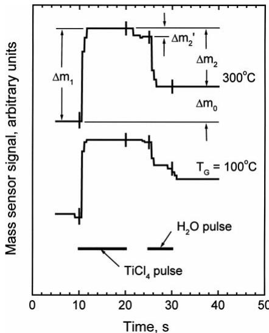
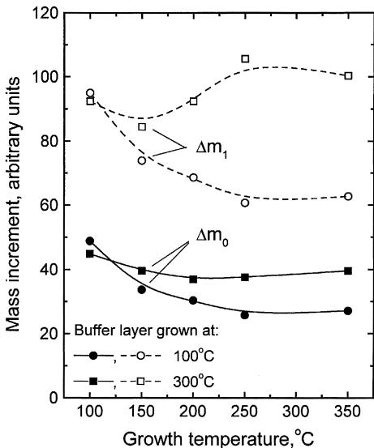
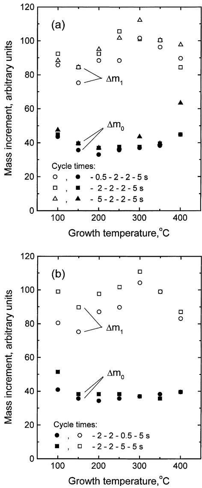
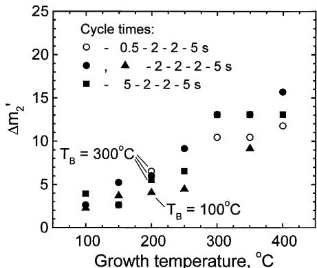
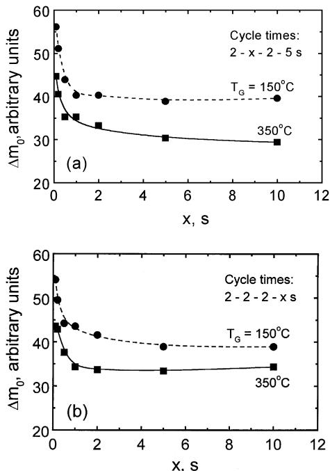
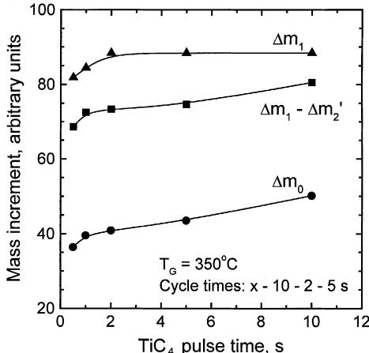
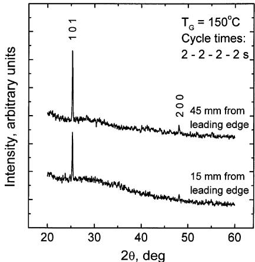
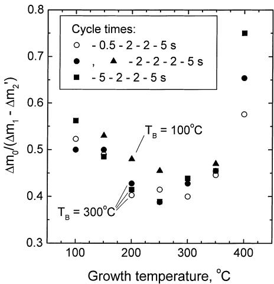

# Atomic layer deposition of titanium dioxide from  $\mathrm{TiCl_4}$  and  $\mathrm{H}_2\mathrm{O}$ : investigation of growth mechanism

J. Aarik*, 
A. Aidla, 
H. Mändar, 
T. Uustare  Institute of Materials Science, University of Tartu, Tähe 4, 51010 Tartu, Estonia

Received 11 May 2000; accepted 30 September 2000

# Abstract

Atomic layer deposition (ALD) of titanium dioxide from  $\mathrm{TiCl_4}$  and  $\mathrm{H}_2\mathrm{O}$  was studied at substrate temperatures of 100-  $400^{\circ}\mathrm{C}$ . Using a real- time quartz crystal microbalance method, it was demonstrated that although the surface reactions were self- limited, the growth rate depended on the temperature and development of the thin film structure. Relatively low growth rate which was obtained in the  $\mathrm{TiCl_4 / H_2O}$  ALD process, was found to be a result of a significant chlorine amount adsorbed during the  $\mathrm{TiCl_4}$  pulse. Surface intermediates formed in the initial stage of  $\mathrm{TiCl_4}$  adsorption were unstable and weakly bonded to the surface. Desorption and decomposition of these species additionally influenced the deposition rate and, especially, its dependence on the precursor pulse times. © 2001 Elsevier Science B.V. All rights reserved.

PACS: 61.50K; 68.55

Keywords: Atomic layer deposition; Titanium dioxide; Crystallization; Adsorption

# 1. Introduction

Self- controlled thin film deposition methods, known as atomic layer epitaxy [1,2], molecular layer epitaxy [3], molecular layering [4], atomic layer deposition ALD) [5- 7], etc., allow reproducible growth of thin and ultra- thin films. A specific feature of these methods is that a thin film is formed as a result of repeated deposition cycles. At least two subsequent self- limited surface reactions are used to form a new layer of the film material in each cycle. In most applications, the precursors reacting with the surface are adsorbed from molecular beams [3] or from the gas phase (e.g. [2,5- 7]). The growth rate can reach one monomolecular layer of the film material per deposition cycle but usually it is significantly lower, especially when compounds with large ligands are used as the precursors. A common reason for reduced growth rate is that a precursor molecule temporarily blocks several adsorption sites while the constituent of the film material occupies only one or few of those. Naturally, higher growth rates should be obtained when using precursors with smaller ligands. However, in some cases this general rule does not apply. For instance, in the process where  $\mathrm{TiCl_4}$  and  $\mathrm{H}_2\mathrm{O}$  or  $\mathrm{H}_2\mathrm{O}_2$  are used as the precursors to grow titanium dioxide  $(\mathrm{TiO_2})$ , typical growth rates have ranged from 0.04 to  $0.07\mathrm{nm}$  per cycle at substrate temperatures of 150-  $400^{\circ}\mathrm{C}$  [2,5- 8]. Rather similar or even higher growth

rates can be obtained when using organic precursors such as titanium ethoxide  $\mathrm{(Ti(OCH_2CH_3)_4)}$  and titanium isopropoxide  $\mathrm{(Ti(OCH(CH_3)_2)_4)}$  having remarkably larger sizes of ligands. At temperatures  $150 - 250^{\circ}\mathrm{C}$  the growth rates of  $0.05 - 0.15\mathrm{nm}$  per cycle have been obtained in the ALD process where titanium isopropoxide and  $\mathrm{H}_2\mathrm{O}$  or  $\mathrm{H}_2\mathrm{O}_2$  were used as the precursors [9,10]. In case of titanium ethoxide and  $\mathrm{H}_2\mathrm{O}$  the growth rate reached  $0.06 - 0.08\mathrm{nm}$  per cycle [11].

The effective diameters of the  $\mathrm{TiCl_4}$  Ti(OCH  ${}_{2}\mathrm{CH}_{3})_{4}$  and  $\mathrm{Ti(OCH(CH_3)_2)_4}$  molecules have been estimated to be 0.64, 0.78 and  $0.88\mathrm{nm}$  ,respectively [12]. Correspondingly, the theoretical limits of the growth rate are 0.099, 0.067 and  $0.052\mathrm{nm}$  per cycle [12], provided that no exchange reactions take place during adsorption of these titanium precursors. Of course, exchange reactions that might appear during adsorption of the precursors could reduce the size of adsorbed species. In this way, larger amounts of precursors can be adsorbed and higher growth rates become possible.

When growing metal oxides in a process, in which  $\mathrm{H}_2\mathrm{O}$  or  $\mathrm{H}_2\mathrm{O}_2$  is used as an oxygen precursor, hydroxyl groups can be formed on the surface during the oxygen precursor pulse. Thus, the metal precursor adsorbed may react with surface hydroxyl groups and release some ligands in this reaction. It has been shown that at  $200 - 250^{\circ}\mathrm{C}$  in average 2.2- 2.9 ligands are released from each  $\mathrm{Ti(OCH(CH_3)_2)_4}$  molecule in the  $\mathrm{Ti(OCH(CH_3)_2)_4 / H_2O}$  and  $\mathrm{Ti(OCH(CH_3)_2)_4 / H_2O_2}$  processes [10]. Significant ligand release from adsorbed  $\mathrm{Ti(OCH(CH_3)_2)_4}$  molecules explains why the experimental values of growth rate are sometimes remarkably higher than those estimated from the  $\mathrm{Ti(OCH(CH_3)_2)_4}$  molecule size. In the  $\mathrm{Ti(OCH_2 - }$ $\mathrm{CH}_3)_4 / \mathrm{H}_2\mathrm{O}$  process, by contrast, the average number of ligands released from an adsorbing molecule does not exceed 1.5 [11], and the growth rate is comparable to the estimation given above [12].

Haukka et al. [13- 16] have shown that the exchange reactions with hydroxyl groups also contribute to  $\mathrm{TiCl_4 / H_2O}$  process, at least when growing  $\mathrm{TiO_2}$  on silica catalysts. These authors have concluded that each  $\mathrm{TiCl_4}$  molecule reacts with one to two hydroxyl groups and as a result up to two chlorine ligands are released from an adsorbed  $\mathrm{TiCl_4}$  molecule. In this context, however, it is not clear why the experimen tally obtained growth rates of the thin films are up to two times lower than the theoretical value calculated for the process, in which no ligands are released from adsorbed  $\mathrm{TiCl_4}$  . It has been discussed that HCl, which is released in the reaction between  $\mathrm{TiCl_4}$  and surface hydroxyl groups, may re- adsorb and occupy adsorption sites for  $\mathrm{TiCl_4}$  [2,16,17]. Another possibility is that the exchange reactions, which do contribute to the growth on silica catalysts, are hindered in case of planar substrates. This may be due to different structure of substrates and/or growing film. Indeed, formation of surface hydroxyl groups on crystalline oxides might depend, for instance, on the structure type and crystalline plane, which is exposed to water vapor. Therefore, it would not be surprising if the growth mechanism was dependent on the structure development as well. In order to lighten these problems, we performed the study described below. The work was aimed at better understanding the reaction mechanisms in the  $\mathrm{TiCl_4 / H_2O}$  process and revealing the reasons for rather limited growth rate on planar substrates in flow- type ALD reactors.

Unfortunately, the choice of methods for surface studies in this kind of reactors is limited. For instance, electron spectroscopy methods, such as Auger electron spectroscopy etc. cannot be applied because the surface intermediate species formed in the growth process are unlikely so stable that they would save their characteristics during transportation of the substrates from the growth reactor to an ultra- high vacuum analysis chamber. At the same time, the infrared spectroscopy method that has been used in case of porous silica catalysts [14,16] is not sufficiently sensitive to record the surface species on planar substrates. For this reason, the quartz crystal microbalance (QCM) method [18] was applied to investigate the deposition kinetics in real- time and reveal the most probable reaction mechanisms. The same technique was used to study the reactions of HCl with hydroxylated  $\mathrm{TiO_2}$  surface and the effect of crystal structure development on the growth process.

# 2.Experimental

2. ExperimentalThe thin films were grown in a low pressure flow-type ALD reactor [18]. Each of the periodically repeated growth cycles included a  $\mathrm{TiCl_4}$  pulse, purge

time,  $\mathrm{H}_2\mathrm{O}$  pulse and another purge time. The vapors of  $\mathrm{TiCl_4}$  and  $\mathrm{H}_2\mathrm{O}$  were carried into the reaction zone in the flow of pure  $(99.999\%)$  nitrogen gas. During the purge times, only the carrier gas was led through the reactor. The process was carried out at the pressure of  $250\mathrm{Pa}$ .

QCM working at the oscillation frequency of  $30\mathrm{MHz}$  was applied to record the deposition kinetics in real- time. In the real- time measurements, the thin film was deposited on the mass sensor of QCM while the mass changes were recorded with sampling period of  $0.5\mathrm{s}$ . To reduce the effect of the mass sensor on the growth process, a buffer layer of  $\mathrm{TiO_2}$  was deposited on the sensor crystal before starting the measurements. Buffer layers grown at different temperatures,  $T_{\mathrm{B}}$ , allowed us to vary the structure of the film, on which the deposition kinetics was studied. The substrate temperature  $T_{\mathrm{G}}$ , at which the QCM studies of the growth process were performed, was varied from  $100$  to  $400^{\circ}\mathrm{C}$  and stabilized with the accuracy of  $0.1^{\circ}\mathrm{C}$ . In addition to the conventional ALD process, we investigated the effect of subsequent exposures of  $\mathrm{TiO_2}$  films to  $\mathrm{HCl}$  and  $\mathrm{H}_2\mathrm{O}$ . This enabled us to estimate the possible contribution of re- adsorption of gaseous reaction products to the thin film growth.

Generally, the QCM method should enable one to estimate the abundance of adsorbed surface species, when a calibration procedure has been made and absolute values of mass changes have been measured. However, the mass sensors used in this work had very rough surfaces and therefore the actual surface areas of them were not known. Thus, only the relative mass changes were measured in this work because in no case, reliable determination of the mass exchange per unit area would have been possible. The reproducibility of our QCM measurements was mainly determined by the instability of the oscillation frequency. At  $T_{\mathrm{G}} = 100 - 200^{\circ}\mathrm{C}$ , the frequency fluctuations did not exceed  $\pm 2\mathrm{Hz}$ . This enabled us to record the mass changes corresponding to a complete ALD cycle with the uncertainty of about  $\pm 5\%$ . The instability increased with growth temperature and reached  $\pm 4\mathrm{Hz}$  at  $T_{\mathrm{G}} = 400^{\circ}\mathrm{C}$ . As a result the corresponding experimental uncertainty of recording the mass increments mentioned above increased to  $\pm 10\%$ .

The films for ex situ characterization were grown on single crystal (1 0 0)- oriented silicon and amorphous silica substrates. During the growth, the substrate surface was parallel to the gas flow direction. The  $\mathrm{TiCl_4}$  and  $\mathrm{H}_2\mathrm{O}$  flow rates were set at  $0.9$  and  $8\mathrm{mPa}\mathrm{m}^3 /\mathrm{s}$ , respectively, while the precursor pulse times and purge times were equal to  $2\mathrm{s}$ . The partial pressure corresponding to the  $\mathrm{H}_2\mathrm{O}$  flow rate used was about  $6\mathrm{Pa}$  at the reactor outlet. Reflection high energy electron diffraction (RHEED) and X- ray diffraction (XRD) methods were applied to characterize the structure of the films while the Auger electron spectroscopy (AES) method was used for composition studies. The refractive index and thickness of the films deposited on silica substrates were calculated from optical transmission spectra [19].

# 3. Results

Fig. 1 shows the behavior of the mass sensor signal recorded during a single ALD cycle at two different mass sensor temperatures. During the  $\mathrm{TiCl_4}$  pulse, the mass, first abruptly increased and then saturated. A decrease of the mass sensor signal followed when the  $\mathrm{TiCl_4}$  pulse was switched off at higher substrate temperatures (Fig. 1). This decrease demonstrated that some kind of surface intermediate species formed during  $\mathrm{TiCl_4}$  pulse or some precursor ligands were weakly bonded to the surface and could be easily

  
Fig. 1. Mass sensor signal as a function of time recorded at temperatures of  $100$  and  $300^{\circ}\mathrm{C}$  during a single ALD cycle. Mass sensor was covered with a buffer layer deposited at  $300^{\circ}\mathrm{C}$ .

released. At  $T_{\mathrm{G}} = 300^{\circ}\mathrm{C}$ , the mass sensor signal decreased in the very beginning of the first purge time and then stayed at an almost constant level (Fig. 1). Therefore, the intermediate species that remained on the surface until beginning of the  $\mathrm{H}_2\mathrm{O}$  pulse were stable and rather strongly bonded to the film material. During the following  $\mathrm{H}_2\mathrm{O}$  pulse the mass sensor signal rapidly decreased and stabilized on a new level. Decrease of the film mass caused by the  $\mathrm{H}_2\mathrm{O}$  pulse indicated that the surface intermediate species formed in the  $\mathrm{TiCl_4}$  adsorption process were heavier than the final reaction products. This was not surprising because the former species might contain chlorine, which was replaced by much lighter oxygen or hydroxyl groups during an exposure to  $\mathrm{H}_2\mathrm{O}$ . After switching off the  $\mathrm{H}_2\mathrm{O}$  pulse, no changes were observed at  $T_{\mathrm{G}} = 300^{\circ}\mathrm{C}$ . At  $100^{\circ}\mathrm{C}$  by contrast, an additional decrease appeared in the beginning of the second purge time. The latter decrease was probably due to dehydration of the film surface.

The dependencies of the mass increments  $\Delta m_0$  and  $\Delta m_1$  on the growth temperature and precursor pulse times were studied on buffer layers deposited at two different temperatures. In the first series of measurements a buffer layer was grown onto the mass sensor by applying 60 cycles at the mass sensor temperature of  $100^{\circ}\mathrm{C}$ . According to the RHEED data, the films deposited under such conditions were always amorphous. Using this kind of buffer layer the dependencies of  $\Delta m_0$  and  $\Delta m_1$  on the growth temperature (solid and open circles in Fig. 2, respectively) were recorded in the range of  $100 - 350^{\circ}\mathrm{C}$  by applying 10 cycles at each temperature. Altogether, 40 cycles were performed at temperatures  $150 - 350^{\circ}\mathrm{C}$  where crystallization might take place. RHEED data showed that this was still not sufficient to initiate crystal growth on amorphous substrates. It was revealed that in the beginning of the growth process, amorphous material was formed on silicon and silica substrates as well as on a buffer layer of amorphous  $\mathrm{TiO_2}$  grown at  $100^{\circ}\mathrm{C}$ . The number of cycles needed for initiation of crystallization was about 100 cycles at  $T_{\mathrm{G}} = 275 - 350^{\circ}\mathrm{C}$  but it increased with decreasing growth temperature (Table 1). For this reason, one can conclude that the data obtained in the experiments, where only 40 cycles were applied to grow a film on an amorphous buffer layer, described the growth of amorphous  $\mathrm{TiO_2}$ .

  
Fig.2.  $\Delta m_0$  and  $\Delta m_1$  as functions of growth temperature. Buffer layers were deposited at 100 and  $300^{\circ}\mathrm{C}$ . The  $\mathrm{TiCl_4}$  pulse time, first purge time,  $\mathrm{H}_2\mathrm{O}$  pulse time, and second purge time were 2, 2, 2, and  $5\mathrm{s}$ , respectively.

The second series of measurements was performed using a sensor coated with the buffer layer by applying 100 cycles at  $300^{\circ}\mathrm{C}$ . In this case, more complex studies (Figs. 2- 6) were carried out while the measurements were started at  $T_{\mathrm{G}} = 400^{\circ}\mathrm{C}$  and continued at 350, 300, 250, 200, 150 and  $100^{\circ}\mathrm{C}$ . The total thickness of the film deposited on the mass sensor in this series was about  $20\mathrm{nm}$ .

One can see in Fig. 2 that both  $\Delta m_0$  and  $\Delta m_1$  depended on the temperature, at which the real- time measurements were performed, as well as on the temperature, at which the buffer layer had been grown. The data depicted in Table 1 show that differently from the films deposited at  $100^{\circ}\mathrm{C}$ , those grown at  $300^{\circ}\mathrm{C}$  and higher temperatures contained at least some amount of crystalline phase when the number

Table 1 Number of ALD cycles needed to initiate crystallization of  $\mathrm{TiO_2}$  grown from  $\mathrm{TiCl_4}$  and  $\mathrm{H}_2\mathrm{O}$  on silicon substrates  

<table><tr><td>TG(°C)</td><td>Number of cycles</td></tr><tr><td>150</td><td>300</td></tr><tr><td>200</td><td>200</td></tr><tr><td>275</td><td>100</td></tr><tr><td>350</td><td>100</td></tr></table>

of cycles exceeded 100. Therefore, the structure of the buffer layer was probably one factor that influenced the growth rate. At temperatures  $150 - 350^{\circ}\mathrm{C}$ , for instance, considerably higher growth rates were obtained on the crystalline buffer layer (Fig. 2). However, within the experimental uncertainty, there was no difference whether the deposition was performed onto the amorphous or crystalline layer at  $T_{\mathrm{G}} = 100 - 150^{\circ}\mathrm{C}$ .

  
Fig. 4.  $\Delta m_2^{\prime}$  as a function of growth temperature recorded at different  $\mathrm{TiCl_4}$  pulse times. Buffer layers were deposited at  $T_{\mathrm{B}} = 100$  and  $300^{\circ}\mathrm{C}$ . Notation of cycle times is the same as in Fig. 3.

The precursor pulse times affected the growth at temperatures close to 100 and  $400^{\circ}\mathrm{C}$  (Fig. 3). The  $\mathrm{TiCl_4}$  pulse length influenced  $\Delta m_0$ , only, while the

  
Fig. 3.  $\Delta m_0$  and  $\Delta m_1$  as functions of substrate temperature measured at (a) different  $\mathrm{TiCl_4}$  pulse times and (b) different  $\mathrm{H}_2\mathrm{O}$  pulse times. Buffer layer was grown at  $300^{\circ}\mathrm{C}$ . Cycle times shown in the inset denote the  $\mathrm{TiCl_4}$  pulse time, first purge time,  $\mathrm{H}_2\mathrm{O}$  pulse time, and second purge time, respectively.  
Fig. 5.  $\Delta m_0$  as a function of (a) the first purge time and (b) the second purge time. Notation of cycle times is the same as in Fig. 3. Buffer layer was deposited at  $300^{\circ}\mathrm{C}$ .

  
Fig.6.  $\Delta m_0$ ,  $\Delta m_1$  and  $\Delta m_1 - \Delta m_2^{\prime}$  recorded at  $350^{\circ}\mathrm{C}$  as functions of  $\mathrm{TiCl_4}$  pulse time. The first purge time,  $\mathrm{H}_2\mathrm{O}$  pulse time, and second purge time were 10, 2 and  $5\mathrm{s}$ , respectively.

effect appeared at  $T_{\mathrm{G}} = 400^{\circ}\mathrm{C}$  (Fig. 3(a)). By contrast, both  $\Delta m_0$  and  $\Delta m_1$  increased with the  $\mathrm{H}_2\mathrm{O}$  pulse length at the lowest growth temperature studied (Fig. 3(b)). In addition, it was revealed that variation of the  $\mathrm{TiCl_4}$  and  $\mathrm{H}_2\mathrm{O}$  fluxes somewhat influenced the value of  $\Delta m_0$ . However, the effect was rather weak. Increase of the  $\mathrm{TiCl_4}$  and  $\mathrm{H}_2\mathrm{O}$  flow rates by the factor of three caused  $5 - 10\%$  increase in  $\Delta m_0$  whereas remarkable effect of higher water dose appeared at  $T_{\mathrm{G}} = 100^{\circ}\mathrm{C}$ , only.

The value of  $\Delta m_1 - \Delta m_0$ , which equaled to  $\Delta m_2$  (Fig. 1), had a maximum in the  $T_{\mathrm{G}}$  range of  $250 - 300^{\circ}\mathrm{C}$  (Fig. 3) where the growth per cycle was lowest. At the same time the mass decrease  $\Delta m_2^{\prime}$  that was observed during the first purge time (Fig. 1), monotonously increased with the mass sensor temperature (Fig. 4). As can be seen, the dependence of  $\Delta m_2^{\prime}$  on  $T_{\mathrm{B}}$  was rather weak. It was also revealed that within experimental uncertainty,  $\Delta m_2^{\prime}$  was independent of  $\mathrm{TiCl_4}$  (Fig. 4) and  $\mathrm{H}_2\mathrm{O}$  pulse times when they were varied from 0.5 to  $5\mathrm{s}$  and the first purge time was kept at  $2\mathrm{s}$ .

In order to study the deposition process in more detail, the value of  $\Delta m_0$  as a function of purge times was recorded at 150 and  $350^{\circ}\mathrm{C}$  (Fig. 5). At both temperatures, a fast decrease in  $\Delta m_0$  took place with the increase of both purge times from 0.1 to  $1\mathrm{s}$ . This effect was mainly related to the overlap of precursor pulses. Longer purge times used after  $\mathrm{TiCl_4}$  pulse did not influence the growth rate at  $150^{\circ}\mathrm{C}$  (Fig. 5(a)). At  $350^{\circ}\mathrm{C}$ , however,  $\Delta m_0$  decreased in the purge time range of  $1 - 10\mathrm{s}$ , as well, indicating that the amount of titanium bonded to the surface decreased with increasing purge time. Such behavior of  $\Delta m_0$  correlated with the decrease of the mass sensor signal by  $\Delta m_2^{\prime}$ , which occurred at higher temperatures during the first purge time (Fig. 1). Consequently, the latter mass decrease was related to desorption of titanium- containing surface intermediate species. The  $1 - 10\mathrm{s}$  long purge times used after  $\mathrm{H}_2\mathrm{O}$  pulse, contrary, did not affect  $\Delta m_0$  rate at  $350^{\circ}\mathrm{C}$  but influenced it at  $150^{\circ}\mathrm{C}$  (Fig. 5(b)). The decrease of  $\Delta m_0$ , which appeared with increasing second purge time at  $150^{\circ}\mathrm{C}$ , was probably connected with dehydration of the film surface. An evidence of such process was the mass decrease that was observed after switching off the  $\mathrm{H}_2\mathrm{O}$  pulse at low temperatures (Fig. 1).

According to the data depicted in Fig. 3(a) the value of  $\Delta m_0$  noticeably depended on the  $\mathrm{TiCl_4}$  pulse time at  $T_{\mathrm{G}} = 400^{\circ}\mathrm{C}$ . At pulse times reaching  $10\mathrm{s}$ , however, a similar dependence was observed at  $350^{\circ}\mathrm{C}$ , as well (Fig. 6). Differently from  $\Delta m_0$ , the value of  $\Delta m_1$  as a function of  $\mathrm{TiCl_4}$  pulse time almost completely saturated at the latter temperature (Fig. 6). At the same time,  $\Delta m_2^{\prime}$  decreased with the increase of  $\mathrm{TiCl_4}$  exposure time from 2 to  $10\mathrm{s}$ . As a result, no saturation of  $\Delta m_1 - \Delta m_2^{\prime}$  was obtained. This means that although  $\Delta m_1$  saturated, the amount of strongly bonded surface intermediate species did not. Decrease of  $\Delta m_2^{\prime}$  with increasing  $\mathrm{TiCl_4}$  pulse time, in turn, indicated that the amount of weakly bonded surface intermediate species decreased during relatively long exposure times.

Subsequent exposures of the mass sensor to  $\mathrm{HCl}$  and  $\mathrm{H}_2\mathrm{O}$  performed at substrate temperatures  $150 - 350^{\circ}\mathrm{C}$  revealed some mass increase during the  $\mathrm{HCl}$  pulse. The amplitude of that change depended on the substrate temperature and was around  $30\%$  of the  $\Delta m_2$  value recorded in case of conventional  $\mathrm{TiCl_4 / H_2O}$  sequence at the same temperature. Evidently, the exposure to  $\mathrm{HCl}$  did not form stable surface intermediate species because a few seconds after switching off the  $\mathrm{HCl}$  pulse, the initial level of the mass sensor signal was recovered independently of whether the  $\mathrm{H}_2\mathrm{O}$  pulse was applied or not. The fact that the  $\mathrm{HCl}$  pulse formed no strongly bonded surface intermediates allowed us to suppose that re- adsorption of  $\mathrm{HCl}$  could unlikely have a strong effect on the  $\mathrm{TiCl_4}$  adsorption. This conclusion was indirectly supported by the fact that the films grown on silicon and silica

substrates were of very uniform thickness independently of the growth temperature used. The thickness gradients, if existed at all, did not exceed few percent on the  $60\mathrm{mm}^2 \times 30\mathrm{mm}^2$  substrate area.

No chlorine signal was recorded by AES in the films grown at  $275^{\circ}\mathrm{C}$  whereas the sensitivity of the measurements was estimated to be about 0.04 at.%. Chlorine was detected in the films grown at 200, 150 and  $100^{\circ}\mathrm{C}$  but its concentration did not exceed 0.1, 0.2 and 0.5 at.%, respectively. The O/Ti ratio of the films grown at substrate temperatures of  $150–275^{\circ}\mathrm{C}$  corresponded to stoichiometric  $\mathrm{TiO_2}$  within the experimental uncertainty of our AES measurements. In the films grown at temperatures of  $100–125^{\circ}\mathrm{C}$ , some oxygen deficiency reaching up to  $5 - 10\%$  was still recorded.

XRD and RHEED measurements revealed that crystalline films with anatase structure were obtained on silicon and silica substrates at the growth temperatures of  $150–350^{\circ}\mathrm{C}$ . In addition to anatase, a minor amount of rutile was recorded in the films grown at  $425^{\circ}\mathrm{C}$ . As mentioned above, crystallization did not start from the beginning of the deposition process (Table 1). Similarly to earlier studies [5,20], preferential orientation of crystallites was observed in crystalline films of sufficient thickness. The preferential orientation was strongest in the films grown at substrate temperatures of  $275–350^{\circ}\mathrm{C}$ . An interesting result was that the crystallinity of the films, in particular those grown at  $150^{\circ}\mathrm{C}$  (Fig. 7), was lower at the leading edges of substrates, which were closer to the inlet of the precursors.

The growth rates determined from optical measurements of the films grown on silica substrates by applying 3000 ALD cycles at 100, 150, 275 and  $425^{\circ}\mathrm{C}$  were 0.078, 0.048, 0.072 and  $0.050\mathrm{nm}$  per cycle, respectively. Comparing these values with the data presented in Figs. 2 and 3, one can find that the growth rate calculated from the thickness of relatively thick films behaved with changing substrate temperature in a rather different way than  $\Delta m_0$  did. Partially the relatively high growth rate of thicker films at  $275^{\circ}\mathrm{C}$  can be explained by lower density of those compared with the films grown at 150 and  $425^{\circ}\mathrm{C}$ . Indeed, the values of the refractive index of the films grown at 100, 150, 275 and  $425^{\circ}\mathrm{C}$  equaled to 2.37, 2.63, 2.37 and 2.55, respectively. Thus, the films grown at  $275^{\circ}\mathrm{C}$  were really of lower density than those grown at 150 and  $425^{\circ}\mathrm{C}$ . However, the differ ence in the refractive index was about  $10\%$ , only. At the same time the growth rate was about 1.5 times higher at  $275^{\circ}\mathrm{C}$  than at 150 and  $425^{\circ}\mathrm{C}$ . For this reason, one should consider the possibility that crystallization, which affected the growth rate of very thin films, already (Fig. 2), even stronger influenced the deposition of thicker films, in which the crystal structure and preferential orientation were more developed.

  
Fig. 7. XRD patterns of a film grown on (1 0 0) silicon substrates at temperature of  $150^{\circ}\mathrm{C}$ . 3000 cycles were used for film growth. The patterns show 1 0 1 and 2 0 0 reflections of anatase.

# 4. Discussion

The data presented in the previous section indicate that at the growth temperatures of  $100–350^{\circ}\mathrm{C}$  and  $\mathrm{TiCl_4}$  doses used, adsorption of  $\mathrm{TiCl_4}$  saturates during few seconds, already. The data also show that the mass of surface intermediate species formed is higher than that of the solid reaction product obtained after  $\mathrm{H}_2\mathrm{O}$  pulse. Most of the surface intermediate species formed during  $\mathrm{TiCl_4}$  adsorption are stable and strongly bonded to the surface. However, decrease of the film mass during the first purge time (Fig. 1) and dependence of  $\Delta m_0$  on that purge length (Fig. 5(a)) still indicates desorption of some intermediate species from the surface. The species that stay on the surface react with  $\mathrm{H}_2\mathrm{O}$  in the next reaction step. As revealed by the post- growth studies, the result of such two- step reaction is stoichiometric  $\mathrm{TiO_2}$  provided that  $T_{\mathrm{G}} \geq 150^{\circ}\mathrm{C}$ . In addition to the exchange of adsorbed

chlorine ligands,  $\mathrm{H}_2\mathrm{O}$  is obviously able to create surface hydroxyl groups on the as- grown  $\mathrm{TiO_2}$  film. The decrease of the mass sensor signal observed at  $T_{\mathrm{G}} = 100^{\circ}\mathrm{C}$  after the  $\mathrm{H}_2\mathrm{O}$  pulse (Fig. 1), in turn, indicates that during the second purge, dehydration of the surface takes place. The abundance of surface hydroxyl groups remaining on the surface evidently depends on the temperature as well as on the purge length used. Indeed, it has been shown that the stable concentration of hydroxyl groups residing on the surface of  $\mathrm{TiO_2}$  decreases with increasing temperature. However, some abundance of them has been recorded at temperatures exceeding  $400^{\circ}\mathrm{C}$  [21]. When  $\mathrm{TiCl_4}$  adsorbs on such surface, exchange reactions are possible. For instance, in the exchange reaction with two hydroxyl groups [13,14], two chlorine ligands can be released from adsorbing  $\mathrm{TiCl_4}$

$$
\begin{array}{rl} & 2(-\mathrm{OH})(\mathrm{s}) + \mathrm{TiCl}_4(\mathrm{g})\\ & \rightarrow (-\mathrm{O} - )_2\mathrm{TiCl}_2(\mathrm{s}) + 2\mathrm{HCl}(\mathrm{g}) \end{array} \tag{1}
$$

while the rest of chlorine ligands can be replaced in the next reaction step

$$
\begin{array}{rl} & {(-\mathrm{O} - )_2\mathrm{TiCl}_2(\mathrm{s}) + 2\mathrm{H}_2\mathrm{O}(\mathrm{g})}\\ & {\rightarrow (-\mathrm{O} - )_2\mathrm{Ti(OH)}_2(\mathrm{s}) + 2\mathrm{HCl}(\mathrm{g})} \end{array} \tag{2}
$$

The equations describing the surface reactions allow one to calculate the relative mass changes corresponding to different reaction steps. In case of the  $\mathrm{TiCl_4}$  adsorption reaction (Eq. (1)), the mass increase equals to  $M_{\mathrm{i}} - M_{\mathrm{h}}$  where  $M_{\mathrm{i}}$  is the mass of surface intermediate species  $(\mathrm{TiCl}_2)$  and  $M_{\mathrm{h}}$  the mass of hydrogen replaced by one species. A complete ALD cycle causes the mass increase  $M_{\mathrm{o}}$  which equals to the molar mass of film material  $(\mathrm{TiO_2})$ . Evidently, the  $M_{\mathrm{o}} / (M_{\mathrm{i}} - M_{\mathrm{h}})$  ratio does not depend on the abundance of surface intermediate species provided that there is no desorption of titanium- containing species during the reaction with water vapor.

QCM measurements show that rather stable surface intermediate layer is obtained on the film surface after the  $2\mathrm{s}$  long first purge time (Fig. 1). Therefore, comparing the  $M_{\mathrm{o}} / (M_{\mathrm{i}} - M_{\mathrm{h}})$  ratio with the values of  $\Delta m_0 / (\Delta m_1 - \Delta m_2')$  obtained at different growth temperatures, one can reveal the most probable reaction mechanisms. For instance, the  $M_{\mathrm{o}} / (M_{\mathrm{i}} - M_{\mathrm{h}})$  ratio calculated from Eqs. (1) and (2) is equal to 0.68. It can be seen, however, that this value fits to the experimental  $\Delta m_0 / (\Delta m_1 - \Delta m_2')$  ratios (Fig. 8) at  $T_{\mathrm{G}} = 400^{\circ}\mathrm{C}$ , only

  
Fig.8.  $\Delta m_0 / (\Delta m_1 - \Delta m_2')$  as a function of growth temperature determined at different  $\mathrm{TiCl_4}$  pulse times. Buffer layers were grown at temperatures of 100 and  $300^{\circ}\mathrm{C}$ . Notation of cycle times is the same as in Fig. 3.

Better agreement can be obtained, when assuming that  $\mathrm{TiCl_4}$  reacts with one surface hydroxyl group

$$
\begin{array}{rl} & {(-\mathrm{OH})(\mathrm{s}) + \mathrm{TiCl}_4(\mathrm{g})}\\ & {\quad \rightarrow (-\mathrm{O} - )\mathrm{TiCl}_3(\mathrm{s}) + \mathrm{HCl}(\mathrm{g})} \end{array} \tag{3}
$$

In this case the following  $\mathrm{H}_2\mathrm{O}$  pulse should remove three chlorine ligands and form one hydroxyl group in order to recover the initial abundance of hydroxyl groups on the film surface

$$
\begin{array}{rl} & {(-\mathrm{O} - )\mathrm{TiCl}_3(\mathrm{s}) + 2\mathrm{H}_2\mathrm{O}(\mathrm{g})}\\ & {\quad \rightarrow (-\mathrm{O} - )\mathrm{TiO(OH)}(\mathrm{s}) + 3\mathrm{HCl}(\mathrm{g})} \end{array} \tag{4}
$$

Correspondingly, the  $M_{\mathrm{o}} / (M_{\mathrm{i}} - M_{\mathrm{h}})$  ratio is equal to 0.52. This value fits to the experimental data at  $T_{\mathrm{G}} = 100 - 150^{\circ}\mathrm{C}$ . At temperatures  $200 - 350^{\circ}\mathrm{C}$ , however, the  $\Delta m_0 / (\Delta m_1 - \Delta m_2')$  ratios are still significantly lower (Fig. 8). This fact allows one to suppose that in the latter temperature range, the  $\mathrm{TiCl_4}$  adsorption could proceed without any release of gaseous reaction products. Such process may be described as dissociation of  $\mathrm{TiCl_4}$  on the dehydroxylated surface followed by adsorption of  $\mathrm{TiCl_3}$  and  $\mathrm{Cl}$  [2]. Corresponding  $M_{\mathrm{o}} / (M_{\mathrm{i}} - M_{\mathrm{h}})$  value is equal to 0.42, i.e. very close to the experimental  $\Delta m_0 / (\Delta m_1 - \Delta m_2')$

ratios obtained at substrate temperatures of  $200-$ $350^{\circ}\mathrm{C}$  However, existing experimental data [21] indicate that the  $\mathrm{TiO_2}$  surface is unlikely hydroxylfree at these temperatures. Therefore, one should consider the possibility that reacting with hydroxyl groups,  $\mathrm{TiCl_4}$  could form surface  $\mathrm{Ti(OH)_xCl_{4 - x}}$  species with  $1\leq x\leq 3$  . This reaction may also proceed without formation gaseous reaction products and result in  $M_0 / (M_{\mathrm{i}} - M_{\mathrm{h}}) = 0.42$

$\mathrm{Ti(OH)_xCl_{4 - x}}$  has been considered to be a volatile surface species that can migrate on the film surface and be responsible for agglomeration [16,22] in the ALD process. The results obtained in this work also indicate that some kind of intermediate species may really contribute to the crystal growth. Indeed, the films were more crystalline at the trailing edge of substrates. Thus, drift of some intermediate species in the gas flow direction and re- adsorption of them might be considered as an effect that accelerates crystallization.

Under certain conditions  $\mathrm{Ti(OH)_xCl_{4 - x}}$  obviously releases HCl and forms  $\mathrm{TiO_2}$  or  $\mathrm{TiOCl}_2$  on the solid surface [2,15,16]. Consequently, both desorption of volatile  $\mathrm{Ti(OH)_xCl_{4 - x}}$  and decomposition of that cause a decrease in the film mass without  $\mathrm{H}_2\mathrm{O}$  supply and could well explain the mass decrease observed during the first purge time. Furthermore, if the decomposition of surface  $\mathrm{Ti(OH)_xCl_{4 - x}}$  took place during the  $\mathrm{TiCl_4}$  pulse, already, a smaller mass decrease would appear during the following purge time. Simultaneously, additional adsorption sites should be created for  $\mathrm{TiCl_4}$  adsorption and an increase of  $\Delta m_0$  should be observed with increasing  $\mathrm{TiCl_4}$  pulse time. This kind of effect (Fig. 6) was recorded in our QCM measurements. When increasing the  $\mathrm{TiCl_4}$  pulse time and the following purge time up to  $10~\mathrm{s}$  a noticeable decrease in  $\Delta m_2^{\prime}$  was obtained. Moreover, the  $\Delta m_0 / (\Delta m_1 - \Delta m_2^{\prime})$  ratio as high as 0.62 was observed at  $T_{\mathrm{G}} = 350^{\circ}\mathrm{C}$  . This is considerably higher than the value of 0.44- 0.47 recorded at  $\mathrm{TiCl_4}$  pulse time of  $0.5 - 5\mathrm{s}$  and purge time of  $2\mathrm{s}$  at the same temperature (Fig. 8). The average Cl/Ti ratio in the surface intermediate species that was estimated from the  $\Delta m_0 / (\Delta m_1 - \Delta m_2^{\prime})$  ratio was about 2.5 after the  $10~\mathrm{s}$  long  $\mathrm{TiCl_4}$  pulse and  $10~\mathrm{s}$  long purge time. This value is rather close to those reported for the  $\mathrm{TiCl_4 / H_2O}$  process performed on silica catalyst [16].

It is worth noting, however, that although the model, which assumes formation of  $\mathrm{Ti(OH)_xCl_{4 - x}}$  during the  $\mathrm{TiCl_4}$  pulse, very well explains all experimental results, the QCM data alone do not allow one to exclude the possible role of  $\mathrm{TiCl_4}$  adsorption on dehydroxylated sites. Indeed, if the surface oxychlorides that could be formed in the latter process were sufficiently volatile and able to decompose, all effects described above would be also observed. Nevertheless, the QCM studies unambiguously confirm that at temperatures of  $200 - 350^{\circ}\mathrm{C}$  close to four chlorine atoms are adsorbed together with each titanium atom.

At temperatures below 200 and above  $350^{\circ}\mathrm{C}$  the amount of adsorbed chloride decreases. Simultaneously, as can be seen in Figs. 2 and 3, the growth rate increases at these temperatures. The reason for reduced chlorine concentration in the surface intermediate species formed at  $T_{\mathrm{G}}< 200^{\circ}\mathrm{C}$  is evidently increasing abundance of hydroxyl groups or even molecular water on the surface where  $\mathrm{TiCl_4}$  is adsorbed. At temperatures above  $350^{\circ}\mathrm{C}$  however, smaller  $\mathrm{Cl / Ti}$  ratio in the adsorbate layer is connected with faster decomposition of the surface intermediate species. One could further speculate that the reactions with surface hydroxyl groups and/or decomposition of surface intermediate species reduce the mobility of the latter. Such conclusion is strongly supported by the fact that the texture was preferentially formed at temperatures  $275-$ $350^{\circ}\mathrm{C}$  where no chlorine was released during  $\mathrm{TiCl_4}$  adsorption. At the same time, the texture development was hindered at  $T_{\mathrm{G}}< 200$  and  $T_{\mathrm{G}} > 350^{\circ}\mathrm{C}$  where the  $\mathrm{Cl / Ti}$  ratio was lower than four in the surface intermediate layer.

The idea about formation of slowly decomposing surface species explains why the data characterizing the thin film growth on planar substrates differ from those describing the process on silica catalysts [13- 16]. In the latter case  $\mathrm{TiCl_4}$  pulse times as long as  $2\mathrm{h}$  were used. This time allows the unstable surface intermediate species to decompose and form oxychlorides as predicted by Eqs. (1) and (3) (see also [15,16]). In the thin film growth processes, by contrast, the  $\mathrm{TiCl_4}$  pulse times have been usually few seconds [5,8] or even shorter [2,6,7]. Our results show that this is insufficient to completely stabilize the surface intermediate layer formed in the  $\mathrm{TiCl_4}$  adsorption step.

As discussed above, the reaction between surface hydroxyl groups and HCl released in reactions described by Eqs. (1) and (3), can additionally contribute to chlorine trapping at the film surface. The experimental results obtained show, however, that this is not the main effect responsible for relatively low growth rate. First, the HCl pulse created much lower surface coverage of chlorine than the reactions with  $\mathrm{TiCl_4}$  did. Secondly, the surface coverage formed during the HCl pulse was not stable. Finally, very uniform thickness of the films confirmed that the influence of HCl re- adsorption could not be remarkable.

Results presented in Fig. 8 indicate that within our experimental uncertainty, the deposition temperature and the structure of the buffer layer had no effect on the  $\Delta m_0 / (\Delta m_1 - \Delta m_2')$  ratio. Similarly, the thin film structure had no measurable influence on desorption of surface intermediate species (Fig. 4). At the same time, the amounts of  $\mathrm{TiCl_4}$  adsorbed on the  $\mathrm{TiO_2}$  layers of dissimilar origin differed considerably (Fig. 2). These facts demonstrate that the effect of surface microstructure on the  $\mathrm{TiO_2}$  growth is more significantly related to the number of adsorption sites than to the changes in adsorption and/or desorption mechanisms. A probable reason for the increased number of adsorption sites on the surface of (crystalline) films grown at  $T_{\mathrm{G}} = 300^{\circ}\mathrm{C}$  is agglomeration [5,7,22] and corresponding increase in effective surface area. Significant surface roughening that has been observed at  $T_{\mathrm{G}}\geq 150^{\circ}\mathrm{C}$  with development of the crystal structure [5,7] strongly supports this conclusion.

# 5. Conclusions

We have revealed in this work that significant amount of chlorine that is bonded to the surface during  $\mathrm{TiCl_4}$  adsorption, is the main reason for rather limited growth rate in the  $\mathrm{TiCl_4 / H_2O}$  ALD process. Some chlorine is released in the  $\mathrm{TiCl_4}$  adsorption step at temperatures below  $200^{\circ}\mathrm{C}$  and above  $350^{\circ}\mathrm{C}$ . At intermediate temperatures, however, most of chlorine that contains in  $\mathrm{TiCl_4}$  is adsorbed in the initial stage of interaction between  $\mathrm{TiCl_4}$  and  $\mathrm{TiO_2}$  surface exposed to  $\mathrm{H}_2\mathrm{O}$ . With the increase of the  $\mathrm{TiCl_4}$  pulse time and the following purge time, especially at higher growth temperatures, the  $\mathrm{Cl / Ti}$  ratio in the surface intermedi ate species decreases, indicating that a decomposition process proceeds on the film surface after adsorption of precursor molecules. Simultaneously, some titanium- containing surface intermediate species are released from the film surface during the purge time. Surface migration of these weakly bonded surface intermediate species evidently contributes to the crystallization process because the films are more crystalline at the trailing edge of substrates. The crystallization process, in turn, influences the growth rate. The QCM data indicate that the growth rate increase observed with the initiation of crystal growth is due to more effective adsorption of  $\mathrm{TiCl_4}$  on the crystalline film than on the amorphous  $\mathrm{TiO_2}$ .

# Acknowledgements

The authors are grateful to Alma- Asta Kiisler for technical assistance. The work was partially supported by Estonian Science Foundation (Research Grants no. 3999 and 4205).

# References

[1] T. Suntola, Mater. Sci. Rep. 4 (1989) 261. [2] M. Ritala, M. Leskelä, E. Nykänen, P. Soininen, L. Niinistö, Thin Solid Films 225 (1993) 288. [3] J. Nishizawa, H. Abe, T. Kurabayashi, J. Electrochem. Soc. 132 (1985) 1197. [4] V.B. Aleskovskii, V.E. Drozd, Acta Polytech. Scand. Ser. Chem. Technol. 195 (1990) 155. [5] J. Aarik, A. Aidla, T. Uustare, V. Sammelselg, J. Cryst. Growth 148 (1995) 268. [6] A. Rosental, P. Adamson, A. Gerst, H. Koppel, A. Tarre, Appl. Surf. Sci. 112 (1997) 82. [7] V. Sammelselg, A. Rosental, A. Tarre, L. Niinistö, K. Heiskanen, K. Ilmonen, L.- S. Johansson, T. Uustare, Appl. Surf. Sci. 134 (1998) 78. [8] H. Kumagai, M. Matsumoto, K. Toyoda, M. Obara, M. Suzuki, Thin Solid Films 263 (1995) 47. [9] H. Döring, K. Hashimoto, A. Fujishima, Ber. Bunsenges. Phys. Chem. 96 (1992) 620. [10] J. Aarik, A. Aidla, T. Uustare, M. Ritala, M. Leskelä, Appl. Surf. Sci. 161 (2000) 385. [11] J. Aarik, A. Aidla, V. Sammelselg, T. Uustare, M. Ritala, M. Leskelä, Thin Solid Films 370 (2000) 163. [12] M. Ritala, M. Leskelä, E. Rauhala, Chem. Mater. 6 (1994) 556. [13] E.- L. Lakomaa, S. Haukka, T. Suntola, Appl. Surf. Sci. 60/61 (1992) 742. [14] S. Haukka, E.- L. Lakomaa, T. Suntola, Thin Solid Films 225 (1993) 280.

[15] S. Haukka, E.- L. Lakomaa, O. Jylhä, J. Hornytskyj, S. Vilhunen, Langmuir 9 (1993) 3497.  [16] S. Haukka, E.- L. Lakomaa, A. Root, J. Phys. Chem. 97 (1993) 5085.  [17] H. Siimon, J. Aarik, J. Phys. D: Appl. Phys. 30 (1997) 1725.  [18] J. Aarik, A. Aidla, A.- A. Kiisler, T. Uustare, V. Sammelselg, Thin Solid Films 340 (1999) 110.

[19] R. Swanepoel, J. Phys. E: Sci. Instrum. 16 (1983) 1214.  [20] J. Aarik, A. Aidla, A.- A. Kiisler, T. Uustare, V. Sammelselg, Thin Solid Films 305 (1997) 270.  [21] S. Bourgeois, F. Jomard, M. Perdereau, Surf. Sci. 279 (1992) 349.  [22] M. Ritala, M. Leskoli, L.- S. Johansson, L. Niinisto, Thin Solid Films 228 (1993) 32.