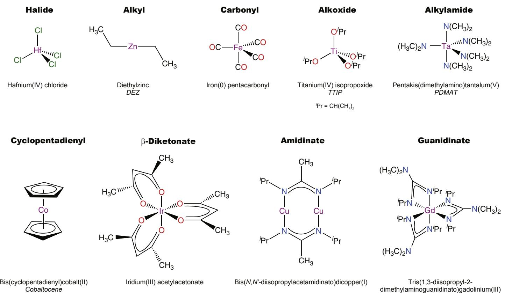

# Atomic Layer Deposition

H.C.M. Knoops, 
S.E. Potts, 
A.A. Bol, 
W.M.M. Kessels  DEPARTMENT OF APPLIED PHYSICS, EINDHOVEN UNIVERSITY OF TECHNOLOGY, EINDHOVEN, THE NETHERLANDS

# CHAPTER OUTLINE

27.1 Thin Films and the Need for Precise Growth Control 1102

27.2 From Atomic Layer Epitaxy to Atomic Layer Deposition 1105

27.3 Basics of ALD 1105

27.3.1 Standard ALD Process Scheme 1106  27.3.2 Temperature Window 1107  27.3.3 Uniformity and Conformality 1108  27.3.4 Advanced ALD Process Schemes 1109

27.4 Materials, Precursors, and Co- reactants 1110

27.4.1 Materials 1110  27.4.2 Metal Precursors 1111  27.4.3 Co- reactants 1114

27.4.3.1 Energy- Enhanced ALD 1116

27.5 ALD Chemistries 1116

27.5.1 Aluminum Oxide 1117  27.5.1.1 TMA with Water 1117  27.5.1.2 TMA with an  $O_2$  Plasma 1118

27.5.2 Hafnium Oxide 1119  27.5.2.1 HfCl₄ with Water 1119  27.5.2.2 HfCl₄ with Ozone 1119

27.5.3 Titanium Nitride 1120  27.5.3.1 TiCl₄ with Ammonia 1121  27.5.3.2 TiCl₄ with an  $H_2 - N_2$  Plasma 1121

27.5.4 Platinum Metal 1121  27.5.4.1 [Pt(CpMe)Me₃] with  $O_2$  Gas 1121  27.5.4.2 [Pt(CpMe)Me₃] with an  $O_2$  Plasma 1123

27.5.5 Other ALD Chemistries 1123

27.6 ALD Reactors 1124

27.6.1 Reactor Basics 1124  27.6.2 Flow- type ALD Reactor 1124

27.6.3 Showerhead ALD Reactor 1124  27.6.4 Batch ALD Reactor 1125  27.6.5 Energy- Enhanced ALD Reactor 1126  27.6.6 Spatial ALD Reactor 1126  27.7 ALD Virtues and Practicalities 1126  27.7.1 Uniform and Conformal Deposition 1127  27.7.2 Growth Control 1129  27.7.3 Growth at Low Temperature 1131  27.8 Conclusion 1132  References 1133

# 27.1 Thin Films and the Need for Precise Growth Control

Thin films are ubiquitous in present- day technologies, with applications spanning from surface coatings to the most advanced nanoelectronics. In the field of electronics especially, thin films are very pervasive with an ever increasing number of material systems, functionalities, and applications. They are key in continuing the rollout of increasingly powerful devices for computation, data storage, communication, energy scavenging, energy storage, and sensing. Many of these applications require films that are of high (electronic) quality, that are relatively thin  $(< 1000 \mathrm{nm})$ , and that can be deposited by vapor- phase deposition techniques compatible with electronic device manufacturing. Often there is no strict requirement on the microstructure of the films as long as they fulfill the demands on the quality, although in some cases (poly)crystalline or amorphous films really are vital. Obviously, there are also various requirements in terms of processing temperature and throughput of the technique used to deposit the thin films.

When considering polycrystalline and amorphous films, the use of vapor- phase deposition techniques such as physical vapor deposition (PVD) and chemical vapor deposition (CVD) has skyrocketed since the 1980s. PVD describes a variety of techniques that are based on the condensation of a vaporized form of the film material on the surface to be coated, the substrate. This vaporized form of the material is obtained from a target material by purely physical processes, such as thermal or laser- induced evaporation or sputtering by energetic ion bombardment. The method of CVD, on the other hand, involves chemical reactions. These chemical reactions take place by volatile precursor molecules that decompose at the surface leaving a thin film and volatile byproducts. The chemical reactions are thermally driven, most frequently by heating the substrate. The chemical reactions can also be enhanced by reactive species created in the gas phase, e.g., in plasma- enhanced CVD.

To date, the techniques of PVD and CVD continue to dominate the field of electronic thin film deposition. However, the continuous trend in the miniaturization of the critical

device dimensions and the processing of devices on increasingly larger substrate materials sets stricter and new demands on the film deposition techniques, which become difficult to meet with PVD and CVD. There is an increasing need for growth control in terms of three metrics.

- Thickness control: The deposition of high-quality ultra-thin films with a thickness control at the subnanometer level.- Uniformity and conformality: The uniformity of the films on large substrates, such as large wafers, sheet materials, and foils; excellent conformality for surface features including trenches, pores, surface roughness, etc.- Low temperature: The ability to deposit high-quality materials with a high purity and a high density (no voids or pinholes) at low substrate temperatures.

These coverage metrics, as well as the need for low substrate temperatures, are illustrated in Figure 27.1.

To exemplify the increasing need for precise growth control, a few very demanding, emerging applications of thin films are shown in Figure 27.2. The first example concerns state- of- the- art field- effect transistors, which are the fundamental building blocks of modern electronic devices. Since the 45- nm technology node of transistors, thermally grown  $\mathrm{SiO}_2$  has become inadequate and high- quality nanometer- thick films of materials such as  $\mathrm{HfO}_2$  need to be deposited (Figure 27.2(a)). A thickness control at the subnanometer level (Figure 27.2(b)), uniformly over 300- nm silicon wafers, is necessary. With the advent of three- dimensional transistors in the 22- nm node and beyond, an excellent conformality over the semiconductor fins is also required (Figure 27.2(c)). A high conformality is also vital for many other emerging nanoscale devices, e.g., those involving thin films deposited on nanomaterials such as nanowires (Figure 27.2(d)), nanotubes, and nanoparticles. These nanoscale devices have applications in electronics, sensing, and energy technologies. Dense conformal films without pinholes are also required in large- area applications such as in photovoltaics. For example, in thin- film chalcogenide solar cells based on copper- indium- gallium- selenide (CIGS), thin

  
FIGURE 27.1 The coverage metrics of a film on a substrate with three-dimensional features. Coverage of the planar surface is evaluated using the uniformity while the coverage of three-dimensional features is evaluated using the conformality. The growth control over the film thickness itself is another important metric. The ability to achieve these metrics at low temperatures is an additional important aspect.

FIGURE 27.2 (a) Cross- section of a field- effect transistor at the 45- nm technology node. The transistor contains a hafnium- based high-  $k$  dielectric, with a thickness of  $\sim 3 \mathrm{nm}$ , as the gate oxide (intel.com). (b) Illustration of film growth in which the thickness is controlled at the subnanometer level. (c) Intel's "Tri- gate" FinFET transistors at the 22- nm technology node. The gates are the taller ridges (going up from left to right), and the fins are the lower ridges that link the gates (going down from left to right) (intel.com). (d) GaP nanowire coated by a thin film of  $\mathrm{Al}_2\mathrm{O}_3$  deposited by atomic layer deposition [44]. (e) Electron microscope cross- section of a CIGS solar cell, where the buffer layer (in yellow) has to cover the rough CIGS absorber layer (www.zsw- bw.de). (f) Five- inch plastic OLED from LG Display (lgdnewsroom.com).

pinhole- free buffer layers need to be deposited on the polycrystalline absorber layer, which has a randomly corrugated surface topology (Figure 27.2(e)). The deposition process needs to take place at reasonably low substrate temperatures. The latter is even more important for flexible electronics involving polymeric or otherwise organic materials (Figure 27.2(f)). Many of such materials require temperatures lower than 200 or even  $100^{\circ}\mathrm{C}$ . Clearly these demands are increasingly harder to meet with techniques that are not intrinsically self- limiting (PVD and CVD), are flux- controlled (PVD and CVD),* or that take place at (highly) elevated substrate temperatures (CVD).

In this chapter, the method of atomic layer deposition (ALD) will be introduced with the aim of describing the basics of this technique, showing that ALD is able to meet the previously mentioned requirements for precise growth control, as well as describing typical ALD chemistries and ALD reactors. Also, some particular cases will be considered to show how ALD manifests itself in practice. It is not within the scope of this chapter to give an in- depth and comprehensive overview of the method, the materials deposited by ALD, and the results obtained with respect to its rapidly growing number of applications. Such information can be found elsewhere [1- 4]. In the next section, the relationship between ALD and epitaxy will be treated briefly, addressing the historical development of the technique from atomic layer epitaxy (ALE) to atomic layer deposition (ALD).

*For flux- controlled processes, the growth rate on a surface is directly related to the flux of source species. PVD and CVD are examples of this. The disadvantage of flux- controlled deposition is that, in many cases, the flux has to be precisely regulated to achieve controlled, uniform, and conformal growth.

# 27.2 From Atomic Layer Epitaxy to Atomic Layer Deposition

27.2 From Atomic Layer Epitaxy to Atomic Layer DepositionThe origin of ALD dates back to the 1970s, when the technique was developed to deposit polycrystalline II- VI thin films, in particular ZnS, for electroluminescent film display devices [4,5]. The first experiments were carried out with elemental source materials such as zinc and sulfur. The method was called atomic layer epitaxy (ALE), as the prime interest was to deposit films of crystalline and polycrystalline materials one atomic layer at a time. However, the method was also used to deposit amorphous dielectric thin films, such as  $\mathrm{Al}_2\mathrm{O}_3$ , for the same application. During the 1980s, the research efforts on ALE strongly increased when there was interest in fabricating elemental semiconductors, single- crystal III- V and II- VI semiconductors, and ordered heterostructures by ALE. Organometallic compounds such as metal alkyls were used as precursors. Although good results were reported for epitaxial growth, the overall success of ALD for crystalline materials was limited due to the complicated surface chemistry and because ALE did not bring obvious benefits over the traditional molecular beam epitaxy (MBE) and metal- organic vapor- phase epitaxy (MOVPE) methods. As a consequence, the activities in this area of ALE diminished in the mid- 1990s. However, from the late 1990s into the early 2000s, interest in the method by the silicon- based microelectronics industry began to increase [4,6]. Also at that time, the term atomic layer deposition (ALD) was coined, a name which was more appropriate considering the fact that the interest in amorphous films had strongly increased. This increase was most prominent in highly insulating oxide films to be used as low- leakage high-  $k$  dielectrics in complementary metal- oxide- semiconductor (CMOS) transistors and dynamic random access memory (DRAM) devices. Ruled by the trend of miniaturization in electronic devices, these applications have been the main driving force for the development of ALD processes and equipment. These applications were furthermore the first main commercial applications of ALD besides the production of electroluminescent film display devices and thin- film magnetic heads in hard drives. In the last decade, many more potential applications of ALD have been identified as the need for precise growth control has become widespread (as has been addressed in the previous section). The library of materials possible by ALD, including metal oxides, nitrides, carbides, chalcogenides, metals, etc., has significantly expanded over the last years, as addressed later in this chapter (Section 27.4). Current interest lies mostly in amorphous and polycrystalline films [1].

Now that the relevance and historical background of ALD have been discussed, the following sections will describe the basics and important aspects of ALD.

# 27.3 Basics of ALD

27.3 Basics of ALDIn this section, the basics of ALD, as well as several concepts that are important in the understanding of ALD, are explained on the basis of an ideal ALD process. Such a process and its inherent properties provide a means for understanding the behavior of real, potentially less- ideal, ALD processes that are discussed in the later sections.

# 27.3.1 Standard ALD Process Scheme

27.3.1 Standard ALD Process SchemeIn ALD, thin films are built up in cycles in which the surface is exposed to various vapor- or gas- phase species in alternating, separated doses. In each cycle, a submonolayer of material is deposited. As illustrated in Figure 27.3, a typical cycle consists of four steps: (1) a precursor dosing step, where a precursor is typically an inorganic coordination compound, i.e., a metal center surrounded by chemical functional groups called ligands; (2) a purge and/or pump step; (3) a co- reactant step, typically involving a small molecule; and (4) a purge and/or pump step. The precursor, and in many cases also the co- reactant, bring elements to the surface that lead to film growth. For the precursor, the element to be deposited is in many cases the metal center, while for the reactant, it is typically a nonmetal such as O, N, S, etc. For ALD, it is vital that the precursor and co- reactants react with the surface in a self- limiting way. This means that the precursor molecules and co- reactant species react with surface sites and/or surface chemical groups as long as these are present or accessible; hence the surface reactions eventually saturate and stop. The precursor molecules and co- reactants react neither with themselves nor with the surface groups that they create. In the purge and/or pump steps, the gaseous reaction products that may be generated during the surface reactions, as well as any excess precursor or co- reactant molecules, are removed from the ALD reactor. This is necessary to avoid reactions between precursor and co- reactant molecules directly in the gas phase or on the surface, as this could lead to an undesired CVD component.

  
FIGURE 27.3 A schematic representation of the various steps in an ALD cycle consisting of two half reactions. The exposures in the first half-cycle (precursor) and second half-cycle (co-reactant) are self-limiting such that the process stops when all available surface sites are occupied. The two half-cycles are separated by purge steps. The half-cycles are repeated in an ABAB fashion to build the film up to the target thickness. The lower panels show the resulting coverage, or growth per cycle, as a function of exposure or time for that particular step. For sufficient exposure, saturated growth is obtained, while insufficient exposure results in incomplete saturation. For insufficient purging, a CVD component from mixing of the precursor and co-reactant is obtained.

As mentioned before, the various steps in a typical, ideal ALD cycle are represented in Figure 27.3. This figure shows a schematic representation of the self- limiting surface reactions during the two half- cycles as well as the saturation of the surface coverage in every step of the cycle (in the first half- cycle the precursor is dosed; in the second half- cycle the co- reactant is dosed). The saturation of both half- cycles leads to a characteristic amount of growth per cycle, often abbreviated to GPC. It is also illustrative to express the surface reactions during the half- cycles as equations. Considering a binary material AB and precursors and reactants, both with two ligands, the reaction during the first half- cycle is of the form

$$
\mathrm{s - Y_{(ads)} + AX_{2(g)}\rightarrow s - AX_{(ads)} + XY_{(g)}} \tag{27.1}
$$

where s indicates the surface with surface groups Y,  $\mathrm{AX}_2$  is the formula for the precursor, with A the first element to be deposited and X the ligand, and XY is the reaction product. The reaction during the second half- cycle is of the form:

$$
\mathrm{s - AX_{(ads)} + BY_{2(g)}\rightarrow s - ABY_{(ads)} + XY_{(g)}} \tag{27.2}
$$

where  $\mathrm{BY}_2$  is the formula for the co- reactant (with B the second element to be deposited and Y the ligand) and XY is again the reaction product. Note that in other ALD processes the number of ligands and surface groups can differ, resulting in more diverse reaction products. To reach a certain film thickness the two half- cycles (27.1) and (27.2) are repeated in an ABAB fashion.

# 27.3.2 Temperature Window

The chemical and physical conditions necessary to obtain self- limiting growth differ for each ALD process and lead to a characteristic GPC. Furthermore, each process is deemed to have a specific temperature window in which ALD behavior is obtained. An idealized temperature window is indicated in Figure 27.4, where the GPC is plotted as a function of temperature. For ideal ALD growth, the temperature window represents the temperature

  
FIGURE 27.4 The idealized temperature window of the ALD process, indicated by the growth per cycle as a function of temperature. In the case of ALD behavior, self-limiting growth is obtained and ideally a weak or no dependence on temperature is observed, while outside the window the ALD behavior is lost due to one of four effects: (a) condensation: precursors can condense on the surface preventing effective purging, (b) low reactivity: low temperatures can prevent complete reactions from taking place, (c) decomposition: when precursors decompose, a (parasitic) CVD component can affect the growth, and (d) desorption: the film itself or the precursor can desorb, thereby reducing growth.

range over which the GPC shows a weak or no temperature dependence, as indicated by the horizontal line in Figure 27.4. Outside the temperature window, several chemical and physical processes can disrupt the ALD behavior. At low temperatures, some precursors and co- reactants can condense on the surface, leading to an increase in GPC. Alternatively, the reactivity of the molecules with the surface sites can be too low because of limited thermal energy at low temperatures, which prevents saturation of the reaction and leads to a decrease in growth. At high temperatures, the precursors or co- reactants can decompose, leading to a CVD component and an increase in growth. Furthermore, the film itself or the reactive surface groups involved may desorb or etch above a certain temperature, leading to a decrease in growth.

# 27.3.3 Uniformity and Conformality

Because of the self- limiting nature of ALD, a difference in the flux of source species, either at different areas on a substrate or in a three- dimensional structure, still affords the same film thickness. The only requirement that needs to be fulfilled is that a sufficient flux reaches all areas. The coverage for surface- controlled growth is compared to the coverage for flux- controlled growth in Figure 27.5. The top half of Figure 27.5 shows the coverage of relatively large planar areas (uniformity). Perfect uniformity would be

  
FIGURE 27.5 The uniformity and conformality for (a) surface-controlled and (b) flux-controlled deposition techniques. The magnified areas show the film coverage of a three-dimensional feature in the substrate. Surface-controlled processes afford a coverage with constant thickness throughout the structure (a), while flux-controlled processes result in a thickness that depends on the line-of-sight access to the source (b). Uniformity has to be carefully engineered for flux-controlled processes to achieve an equal flux of source species over the substrate surface. For surface-controlled growth, the requirement is simply that sufficient flux should reach each area.

obtained for ideal ALD growth, while a flux- controlled process usually needs careful engineering to ensure a constant flux of source species over the whole surface area, which can be difficult to achieve. The magnified areas in the bottom half of Figure 27.5 indicate the coverage of a three- dimensional structure (conformality). When the flux of source species is sufficient, a perfect coverage is obtained for ideal ALD growth (Figure 27.5(a)). A high conformality indicates an equal thickness throughout a three- dimensional structure, while a low conformality indicates a varying thickness, which is typically seen with flux- controlled growth (Figure 27.5(b)). Reactor engineering can improve the uniformity for flux- controlled growth, but cannot typically improve the conformality.

# 27.3.4 Advanced ALD Process Schemes

Besides the process described in Figure 27.3 with two alternating half- cycles (a so- called AB ALD cycle), there are many additional methods of exploiting ALD- type processes by using more steps. Figure 27.6 shows a comparison between various process schemes. The process can consist of more than two half- cycles in what is called a multistep process (sometimes referred to as an ABC ALD cycle), and ALD cycles for a certain material can be alternated with cycles for other materials in what is called a supercycle. In a multistep process (Figure 27.6(b)) additional steps can be used to change the process to widen the temperature window or achieve different material properties. Supercycles (Figure 27.6(c)) can be used to grow alloy, doped or multilayer films of specific elemental mixtures. An ALD cycle for the first process is run  $m$  times, which is followed by  $n$  cycles of a second ALD process. This supercycle of  $m + n$  cycles is then repeated  $x$  times until the desired thickness is reached.

The possible materials and typical precursors and co- reactants will be discussed in the next section.

  
FIGURE 27.6 A schematic representation of the various steps in (a) a regular ALD process, (b) a multistep process and (c) a supercycle. In a multistep process one or more additional steps are added in the ALD cycle to form, for instance, an ABC process. In a supercycle, the steps of two normal ALD processes are combined where  $m$  cycles of the first process are followed by  $n$  cycles of the second process. The variables  $m$  and  $n$  can be chosen so as to obtain the desired composition and structure of the film.

# 27.4 Materials, Precursors, and Co-reactants

# 27.4.1 Materials

To date, a wide variety of technologically important materials has been deposited using ALD [1]. Moreover, the selection of elements that have been successfully incorporated into ALD films is ever increasing, and those reported to date are summarized in Figure 27.7. The periodic table shows that a significant number of main- group elements, transition metals, and lanthanides have been reported in films deposited by ALD, either as the principal metal (blue squares) or as the nonmetal component of binary compounds (gray squares). In principle, ALD is best suited for depositing multicomponent materials (such as binary, tertiary, and quaternary) because of its stepwise approach. Indeed, binary compounds with a metal or nonmetal component do make up the majority of these materials, such as metal oxides, nitrides, carbides, chalcogenides, and pnictides. In general, ALD materials are amorphous or, in some cases, polycrystalline. The most common materials deposited using ALD are metal oxides, mainly as a result of the thermodynamic stability of the M- O bond. However, with advanced ALD process schemes such those based on supercycles, many tertiary and quaternary compounds or alloys are also well- known, such as  $\mathrm{SrTiO_3}$  (STO),  $\mathrm{HfSi}_x\mathrm{O}_y$  and  $\mathrm{InSn}_x\mathrm{O}_y$ . In addition, single- element films have also been reported, in particular noble metals such as Ru, Pd, and Pt but also metals such as W and Mo.In general, for binary compounds, an ALD cycle of two half- cycles as discussed in Section 27.3 is applied. The choice of compound used in each half- cycle can have a significant effect on the ALD process and the final film.

In general, for binary compounds, an ALD cycle of two half- cycles as discussed in Section 27.3 is applied. The choice of compound used in each half- cycle can have a significant effect on the ALD process and the final film.

  
FIGURE 27.7 Periodic table denoting the materials deposited by ALD (December 2013), adapted from the literature [1]. Metallic (and metalloid) elements with a blue background are those which have been incorporated into ALD films of compounds such as oxides, nitrides, carbides, etc. The gray background indicates elements forming the nonmetallic component of the films. Underlined symbols indicate that ALD thin films of the pure element have been reported.

# 27.4.2 Metal Precursors

27.4.2 Metal PrecursorsVery early ALD processes used elemental (metal) sources; however, current metal sources are almost exclusively inorganic coordination complexes, i.e., a metal center surrounded by ligands. Examples of typical inorganic complexes used as precursors are shown in Figure 27.8. The ligands are essentially what make the metal center volatile and they play a key role in determining the characteristics of the precursor. In general, such metal sources should ideally have the following attributes specifically for ALD.

- The precursor should be sufficiently volatile.- The precursor must be reactive toward the surface groups and leave reactive surface groups. Without this feature, precursors and co-reactions would not undergo surface chemical reactions and ALD would not occur.- The precursor must not react with itself or with its surface-adsorbed species.- The precursor should have a sufficiently high decomposition temperature. If decomposition occurs, the self-limiting growth control may be lost.- The reaction products should be volatile and neither easily adsorb to nor etch the growing film. Excessive adsorption of reaction products can affect the self-limiting growth, resulting in CVD-like growth. Etching can lead to a lower GPC and reduce the film's uniformity (see Section 27.7).

Although not essential to the ALD mechanism, there are many other desirable properties for an ALD precursor.

- The precursor should have a low toxicity.- The precursor should be easy to handle. Generally, liquids are ideal as they can be stored and transferred relatively easily. Solid compounds can sometimes be difficult to volatilize.- The precursor should be easy to synthesize and scale up.- The precursor should be low cost.

Some of the aforementioned precursor considerations with respect to volatility are outlined in Figure 27.9. A compound's volatility is affected by intermolecular forces, such as hydrogen- bonding or electrostatic interactions (mainly van der Waals forces), which in turn are influenced in varying degrees by the molecular weight of the precursor and the shape of the molecule (i.e., how easy it is to pack together). Although the vapor pressure of a compound can be measured directly, it is often easier to obtain a TG curve (thermogravimetric analysis), which shows a compound's weight loss as a function of temperature. As a rule of thumb, heavier, symmetrical molecules tend to exhibit low volatilities, whereas lighter, highly asymmetric compounds are very volatile (although there are many exceptions). A standard method of improving volatility is to adopt a heteroleptic precursor (i.e., a metal center with two or more different ligands), which introduces asymmetry, as opposed to a homoleptic molecule (where all the ligands are the same). Furthermore, the intermolecular forces and molecular weight are also influenced by the ligands themselves.

  
FIGURE 27.8 Examples of compounds used as the metal source in ALD. The names in bold refer to the general class of precursor compound. The names below each image are the names of the specific example compound followed, where applicable, by the common name in italics.

  
FIGURE 27.9 Thermogravimetric analysis (a compound's mass loss as a function of temperature at a set heating rate, usually  $10^{\circ}\mathrm{C / min}$ ) of an ideal and nonideal ALD precursor. Ideal ALD precursors should be volatile at low temperatures and not decompose easily, which is denoted by volatilization at a relatively low temperature and characterized by a swift mass drop to  $0\%$ . However, there are many compounds that do not fit these requirements, potentially giving a TG curve as exemplified above, where the volatilization takes place slowly over a wide temperature range, which is higher than that required by most ALD processes. In this case the mass loss is likely a sign of decomposition, observable by a large residual mass and loss of ligands, denoted by multiple plateaus and mass drops in the TG curve.

The precursor examples shown in Figure 27.8 show a selection of common ligand types used in ALD precursors, although there are many other ligands possible. Only examples of homoleptic precursors are covered here, but heteroleptic precursors with these ligands are also widely reported.

Halide- based (F, Cl, Br, or I) precursors, such as  $\mathrm{HfCl_4}$ , are highly desirable for industrial processes as they are highly reactive, stable compounds and are relatively inexpensive. However, halide ligands have a high tendency to contaminate films, especially at low deposition temperatures. Additionally, a common reaction product is HX ( $X =$  halide), which can be corrosive toward both the film and the reactor. Organometallic compounds, such as metal alkyls (e.g.,  $\mathrm{ZnEt_2}$  or  $\mathrm{Al_2Me_6}$ ) or metal carbonyls (e.g.,  $\mathrm{Fe(CO)_5}$  or  $\mathrm{Co_2(CO)_8}$ ), do not have these problems and are still highly reactive with high vapor pressures. However, the low energy of the M- C bond affects their thermal stability and shelf life, potentially making handling difficult; for example, metal alkyls tend to be pyrophoric, and metal carbonyls readily decompose, even at room temperature. A stronger M- C bond is obtained for metal cyclopentadienyl (Cp) complexes (e.g.,  $\mathrm{FeCp_2}$  or  $\mathrm{CoCp_2}$ ), as the Cp ligand helps to saturate the metal center both electronically and coordinatively through

$\pi$ - bonding, although the bonding can be too strong with some metals, leaving the Cp difficult to hydrolyze under ALD conditions.

Other popular categories of precursor include alkoxides (OR), such as  $\mathrm{Ti(O^iPr)_4}$ , and alkylamides  $(\mathrm{NR}_2)$ , such as  $\mathrm{Ta(NMe_2)_5}$ . Alkoxides are generally liquids and exhibit a lower reactivity than alkyl compounds, for example, and they readily form oligomers. Oligomerization can potentially affect volatility, as is apparent for  $\mathrm{Ti(OMe)_4}$ , which exists as a tetramer with a low melting point [7]. However, for higher alkoxides, volatility is not usually a major issue, and they are more thermally stable than alkyl precursors and have significantly better shelf lives. Alkylamides show an intermediate reactivity to that of halides and alkoxides, but thermal stability can be very problematic, particularly over long periods of time held in a heated bubble.

Both alkoxides and alkylamides can oligomerize. In order to overcome this, ligands that bind to the metal center via two or more atoms can be adopted to block vacant coordination sites on the metal. This can either be to the same metal center (a chelating ligand), as exhibited by  $\beta$ - diketonates (and their analogues:  $\beta$ - diketiminates and  $\beta$ - ketoiminates), amidinates, and guanidinates, or by a ligand bridging across two metal centers. All three ligand types are noteworthy as they have produced volatile compounds of late transition metal and lanthanide compounds. In general,  $\beta$ - diketonates form compounds with high thermal stability, which gives them a long shelf life, such as  $[\mathrm{Ir(acac)}_3]$  (Figure 27.8). The caveat is that their reactivity under ALD conditions is not very high. Amidinates, such as  $[\mathrm{Cu_2(^iPr - amd)_2}]$  or  $[\mathrm{Dy(^iPr - amd)_3}]$ , offer a higher reactivity as the M- N bond is weaker than the M- O bond; however, they still afford good coordinative saturation. Guanidinates, such as  $[\mathrm{Gd\{(^iPrN)_2CNMe_2\}_{3}}]$ , are related to amidinates, although the alkylamino moiety on the carbon- backbone gives the ligand more electronic flexibility, equivalent to that of a Cp ligand without compromising reactivity.

Of course, knowledge of metal precursors is only half the story. The choice of co- reactant is of equal importance when designing a new ALD process, as the interplay between precursor and co- reactant can be quite complex. Next, we discuss the myriad of co- reactants possible for ALD processes.

# 27.4.3 Co-reactants

A list of the most common ALD materials is given in Table 27.1 alongside common nonmetal sources (or co- reactants) for those materials. It is clear from the table that metal oxides, metal nitrides, and elemental metals are the most studied ALD materials with the widest variety of possible co- reactants. In general, co- reactants are all volatile, small molecules, such as elements ( $\mathrm{H}_2$  or  $\mathrm{O}_2$ ), hydrides ( $\mathrm{H}_2\mathrm{O}$ ,  $\mathrm{NH}_3$  etc.), or alkyl compounds ( $\mathrm{BEt}_3$  or  $\mathrm{AsMe}_3$ ). There are other possible compounds, but the aforementioned categories serve as a good rule of thumb. In addition, species that are activated by the input of extra energy can be used, but these will be discussed in the next section.

From Table 27.1, it is clear that the greatest range of compounds is associated with metal oxide depositions.  $\mathrm{H}_2\mathrm{O}$  is the most commonly used oxygen source, although

Table 27.1 Typical ALD Materials and the Common (Nonmetallic) Co-reactants Used  

<table><tr><td>Material</td><td>Common Co-reactants</td></tr><tr><td>Metal oxides</td><td>H2O, H2O2, ROH, R(CO)H, R(CO)OH, R2CO, O2, O3, O2 plasma, O radicals, M(OR)X, CO2, NxOy, air</td></tr><tr><td>Metal nitrides</td><td>NH3, NR3, R2NNR2, NH3 plasma, H2 plasma, N2 plasma, H2-N2 plasma, NHx radicals</td></tr><tr><td>Metal carbides</td><td>CxHy, BR3</td></tr><tr><td>Metal phosphides</td><td>PR3, POCl3, P(OR)3, PO(OR)3, P(NR)23</td></tr><tr><td>Metal arsenides</td><td>AsH3, AsR3, As(NR)23</td></tr><tr><td>Metal sulfides</td><td>H2S, S2R2</td></tr><tr><td>Metal selenides</td><td>H2Se, R2Se, Se(SiR3)2</td></tr><tr><td>Metal tellurides</td><td>H2Te, Te(SiR3)2</td></tr><tr><td>Metal fluorides</td><td>HF, MFx</td></tr><tr><td>Pure element (metal)</td><td>H2, H2 plasma, NH3, NH3 plasma, H2 plasma, N2 plasma, H2-N2 plasma, NHx radicals, O2, O2 plasma, O radicals, SiXHy, formalin</td></tr></table>

$\mathsf{R} = \mathsf{H}$  or  $\mathbb{C}_x\mathbb{H}_y$  (any alkyl or aryl group) [1].

$\mathrm{H}_2\mathrm{O}_2$  and many oxygen- containing organic molecules have also been successfully employed. For metal nitrides,  $\mathrm{NH}_3$  is the most popular co- reactant, although substituted amines and hydrazines have also been reported. Analogous compounds of phosphorus and arsenic (phosphines and arsines) have been used for the deposition of metal phosphides and arsenides, respectively. This is a similar case to the deposition of metal sulfides, selenides, and tellurides, where either hydrides or alkyl compounds are typical. The choice is more restricted for metal fluorides, in that only the hydride HF and other metal fluoride compounds have been reported as fluorine sources. The deposition of pure metals has also been made possible by a wide range of co- reactants, including  $\mathrm{H}_2$  and even  $\mathrm{O}_2$ . In general for metals, the co- reactant should be a reducing agent such that the pure ligand- free metal remains. The use of  $\mathrm{O}_2$  is restricted to the ALD of catalytic metals that are more thermodynamically stable than their respective oxide.

The main purpose of a co- reactant molecule is to react cleanly with surface ligands, thereby adding a second component to the film (where required), and to reform the original surface groups. To do that, they must be sufficiently reactive at the substrate temperature employed. With this in mind, co- reactant molecules can be placed in an order of reactivity as addressed for metal oxides in the following paragraphs.

$\mathrm{H}_2\mathrm{O}$  is by far the most popular, and reported, oxygen source for metal oxide ALD [1]. However,  $\mathrm{H}_2\mathrm{O}$  adsorbs strongly to surfaces, which means that it is difficult to purge from the reactor, particularly at very low deposition temperatures.  $\mathrm{H}_2\mathrm{O}$  is also not sufficiently reactive at low temperatures. More reactivity can be obtained using species with less thermodynamic stability.  $\mathrm{H}_2\mathrm{O}_2$ , for example, contains an  $\mathrm{O} - \mathrm{O}$  bond, which has a low bond energy, thereby increasing the molecule's reactivity. Despite this, the use of  $\mathrm{H}_2\mathrm{O}_2$  has not been as widely reported as  $\mathrm{H}_2\mathrm{O}$ , although examples of its use have often been associated with low- temperature depositions.

# 27.4.3.1 Energy-Enhanced ALD

In order to obtain more reactivity, species with relatively short lifetimes can be used.  $\mathrm{O_3}$  gas and plasma species are examples of co- reactants that both have short lifetimes and must therefore be produced in situ, rather than being obtained from a chemical supplier. Their production requires an application of energy to a gaseous species. Such energy is usually in the form of an electrical discharge, thermal cracking, or photodissociation [8]. Processes involving such extra energy are referred to as energy- enhanced ALD. Specifically for  $\mathrm{O_3}$  gas,  $\mathrm{O_3}$  molecules are typically stable on the order of minutes in an ALD reactor setting, and so are present long enough to travel from the  $\mathrm{O_3}$  generator to the reaction chamber. However, the  $\mathrm{O_3}$  transport line must be kept clean of certain materials as  $\mathrm{O_3}$  molecules are prone to decompose on specific surfaces [9].

In the case of plasma, the species are generated closer to or in the reaction chamber. When employing a plasma, various highly reactive species can contribute to the surface chemistry, such as ions, electrons, radicals, metastable species, and (UV) photons [10]. These plasma species are typically produced in an electric discharge by the application of radio- frequency or microwave energy. The ions, electrons, and photons are essentially only present when the power is on, but the radicals still exist when the power is no longer applied, although their lifetimes are also short. The benefit of this situation is that a high reactivity is obtained, and long purge times are often not necessary.

It is clear that each precursor or co- reactant in an ALD cycle has a profound effect on the chemistry of the process. Until now, we have been focusing on very general concepts. In Section 27.5, the chemistries of specific ALD processes will be covered.

# 27.5 ALD Chemistries

In the previous section, a general overview of materials prepared by ALD was given as well of precursors and co- reactants used. A variety of reaction chemistries are applicable to ALD processes.

Ligand- exchange: a reaction between surface groups and ligands on precursors, or surface groups and co- reactants, where groups are exchanged leading to volatile reaction products. These are sequential condensation and hydrolysis reactions. Dissociation: a reaction in which the precursor or co- reactant dissociate into several adsorbed species on the surface without releasing reaction products into the vapor phase. Association: the bonding of an intact precursor or co- reactant with the surface without release of ligands (e.g., hydrogen- bonding). Combustion: an oxidizing co- reactant can combust surface groups and replace them with an oxidized surface. Abstraction: a co- reactant can remove ligands and release reaction products, without leaving behind fragments from the co- reactant, for instance, in conjunction with the reduction of the metal center.

- Reduction: the metal center can be reduced to a lower oxidation state by the co-reactant.- Nitridation: the co-reactant can nitridate the material or surface. This reaction is essentially the nitrogen analogue of combustion.

Here, selected examples of specific ALD chemistries are presented to illustrate the variety in ALD reaction mechanisms.

# 27.5.1 Aluminum Oxide

Perhaps the most well- known ALD chemistry is that of  $\mathrm{Al}_2\mathrm{O}_3$ , a material that probably also has the widest range of applications of all ALD materials. There are various ALD processes for  $\mathrm{Al}_2\mathrm{O}_3$  available, in which  $[\mathrm{Al}(\mathrm{CH}_3)_3]_2$  (TMA),  $\mathrm{Al}_2\mathrm{Cl}_6$ , and  $[\mathrm{Al}(\mathrm{O}^i\mathrm{Pr})_3]_4$  have been used as the Al- source, along with water, ozone, or an  $\mathrm{O}_2$  plasma as the co- reactants. The TMA/water process in particular has long been considered a model ALD process [2], as it provides a good demonstration of metal alkyl precursor chemistry. Furthermore, the  $\mathrm{TMA} / \mathrm{O}_2$  plasma process also demonstrates nicely how an  $\mathrm{O}_2$  plasma undergoes combustion- like mechanisms with an organically terminated surface.

# 27.5.1.1 TMA with Water

Many ALD processes involve Bronsted acid- base ligand- exchange reactions between the surface groups and the incoming precursor(s), releasing volatile reaction products. These ligand- exchange reactions are typically alternating condensation and hydrolysis reactions. The two ALD half- cycles of the TMA/water process are good examples of this (Eqns (27.3) and (27.4)).

TMA half- cycle (condensation,  $n = 1$ , 2):

$$
n\mathrm{s - OH_{(ads)} + ^1 / _2[Al(CH_3)_3]_{2(vap)}\rightarrow s - O_nAl(CH_3)_{3 - n(ads)} + nCH_4(g)} \tag{27.3}
$$

Water half- cycle (hydrolysis):

$$
\mathrm{s\text{-}Al(CH_3)_{(ads)} + H_2O_{(vap)}\rightarrow s\text{-}AlOH_{(ads)} + CH_4(g)} \tag{27.4}
$$

In this example, the surface hydroxyl group (s- OH) acts as a Bronsted acid by donating a proton to a methyl  $(\mathrm{CH}_3)$  ligand on the TMA, which is the Bronsted base. This transfer results in the formation of a surface O- Al bond and the release of methane as a reaction product. Additionally, TMA may bind either via one methyl group (monofunctional binding) or two methyl groups (bifunctional binding). Trifunctional binding is energetically very unlikely due to the geometry of the TMA molecule.

In terms of growth per cycle (GPC) as a function of temperature (Figure 27.10), it becomes apparent that the process is well described by the term thermal ALD. At

deposition temperatures below  $150^{\circ}\mathrm{C}$ , the GPC drops with decreasing temperature; in essence, there is less thermal energy available to drive the reaction. At the higher end of the temperature scale, a drop in GPC is also observed with increasing temperature, which stems from a reduction in the density of reactive s- OH groups. In this sense, the TMA/water ALD process illustrates that even a model ALD process, such as the TMA/water process, does not necessarily show a temperature window where the GPC is constant with temperature.

# 27.5.1.2 TMA with an  $O_2$  Plasma

For the TMA/ $O_2$  plasma ALD process, the first half- cycle can essentially be considered the same as in the thermal process (Eqn (27.5)), whereby incoming TMA molecules react with s- OH groups. In the second half- cycle ( $O_2$  plasma), the reaction products are carbon dioxide, water, and methane (Eqn (27.6)) [11,12]. At the most basic level, the first two reaction products (carbon dioxide and water) can be explained by a combustion- like mechanism.

TMA half- cycle  $(n = 1,2)$

$$
n\mathrm{s - OH_{(ads)} + ^1 / _2[Al(CH_3)_3]_{2(vap)}\rightarrow s - O_nAl(CH_3)_{3 - n(ads)} + nCH_4(g)} \tag{27.5}
$$

$O_2$  plasma half- cycle:

$$
\mathrm{s - Al(CH_3)_{(ads)} + 4O_{(plasma)}\rightarrow s - AlOH_{(ads)} + CO_2(g) + H_2O_{(vap)}} \tag{27.6}
$$

  
FIGURE 27.10 Variation in growth per cycle (GPC) as a function of substrate temperature for the ALD of  $A l_{2}O_{3}$  from trimethylaluminum,  $[A l(C H_{3})_{3}]_{2}$  (TMA). The decrease in growth at lower temperatures for the thermal ALD process is a result of insufficient thermal energy, required to fully drive the surface reactions (see Figure 27.4). Above  $200^{\circ}C$  there is a decrease in GPC for thermal ALD and a similar decrease is seen for plasma ALD over the whole temperature range (attributed to the desorption of reactive surface groups with increasing temperature). This illustrates that there is no ideal temperature window, as true ALD is occurring at all deposition temperatures yet the GPC is not constant (as in the ideal situation described in Figure 27.4). For plasma ALD at lower temperatures, there is a slightly superlinear increase in the GPC as a result of reduced film density. However, the Al atoms deposited per cycle as a function of temperature shows a consistent linear plot [13].

The water formed as a reaction product can then react with any (remaining)  $\mathrm{s - CH_3}$  groups to form methane and  $\mathrm{s - OH}$ , as in the thermal process (Eqn (27.4)). As plasmas are highly reactive,  $\mathrm{Al_2O_3}$  films synthesized by plasma- enhanced ALD tend to have a higher GPC (Figure 27.10), higher density and lower carbon, hydrogen, and (excess) oxygen contents than films deposited using water or ozone as the co- reactant. This is particularly the case at low substrate temperatures [13].

# 27.5.2 Hafnium Oxide

Hafnium oxide is another common ALD material, which is a high-  $k$  dielectric. In industry, halide- based precursors, in particular  $\mathrm{HfCl_4}$ , are favored because of the reactivity (with surface OH) and stability of the compound. Other common precursors are alkoxide- and alkylamide- based, such as  $[\mathrm{Hf(O^iPr)_4}]$  and  $[\mathrm{Hf(NEtMe)_4}]$ , which are widely reported in industrial and academic research and development. ALD reactions involving  $\mathrm{HfCl_4}$  give insight into how halide- based ALD processes behave.

# 27.5.2.1 HfCl4 with Water

Initially, the half- cycles (Eqns (27.7) and (27.8)) appear to be similar to the TMA/water process, i.e., alternating condensation and hydrolysis reactions [14].

$\mathrm{HfCl_4}$  half- cycle  $(n = 1,2)$

$$
n\mathrm{s - OH}_{\mathrm{(ads)}} + \mathrm{HfCl}_{4\mathrm{(vap)}}\rightarrow \mathrm{s - O}_n\mathrm{HfCl}_{4\mathrm{-}n\mathrm{(ads)}} + n\mathrm{HCl}_{\mathrm{(g)}} \tag{27.7}
$$

Water half- cycle:

$$
\mathrm{s\text{-}HfCl_{(ads)} + H_2O_{(vap)}\rightarrow s\text{-}Hf(OH)_{(ads)} + HCl_{(g)}} \tag{27.8}
$$

The stepwise nature of the ALD cycles can be easily seen in the variation of mass with time as measured by a quartz crystal microbalance (QCM). The QCM data in Figure 27.11 shows a large mass increase on adsorption of  $\mathrm{HfCl_4}$  and a mass loss as water displaces the surface chloride ligands as HCl. In addition to the ligand- exchange reactions,  $\mathrm{HfCl_4}$  has an affinity to oxygen bridges, i.e., Hf- O- Hf [15]. In essence, the oxygen bridges can also serve as reactive surface sites. The  $\mathrm{HfCl_4}$  can add across an oxygen bridge (Eqn (27.9)), and then the remaining chlorides can undergo hydrolysis with water (Eqn (27.10)).

$\mathrm{HfCl_4}$  half- cycle:

$$
\mathrm{s\text{-}Hf(-O\text{-})_2Hf_{(ads)} + HfCl_4(vap)\rightarrow s\text{-}Hf(Cl)\text{-}O\text{-}Hf(OHfCl_3)_{(ads)}} \tag{27.9}
$$

Water half- cycle:

$$
\mathrm{s\text{-}Hf(Cl) - O - Hf(OHfCl_3)_{(ads)} + 2H_2O_{(vap)}\rightarrow s\text{-}Hf(-O)_{2}Hf(-O)_{2}Hf_{(ads)} + 4HCl_{(g)}} \tag{27.10}
$$

# 27.5.2.2 HfCl4 with Ozone

The deposition of  $\mathrm{HfO_2}$  using  $\mathrm{HfCl_4}$  as precursor can also be performed with ozone as an alternative to water as the co- reactant [16,17]. The following mechanism has been

  
FIGURE 27.11 Change in mass as a function of time for the  $\mathsf{HfCl}_4$  water ALD process, measured using a quartz crystal microbalance. The mass changes are in the order of ng. (a) When only  $\mathsf{HfCl}_4$  is introduced into the reactor (i.e., no water), the mass does not change after the first pulse, confirming saturation of the surface sites. (b) Over full ALD cycles, the mass increases on adsorption/reaction of  $\mathsf{HfCl}_4$  molecules before reaching a plateau. The mass loss observed on addition of water is a result of replacement of the heavier chlorine atoms  $(35.5\mathrm{g / mol})$  with lighter hydroxyl groups  $(17\mathrm{g / mol})$ . Reprinted from Ref. [15], copyright (1999), with permission from Elsevier.

proposed based on known interactions of ozone with surfaces [18]. Assuming only oxygen bridges or surface oxide were present, the  $\mathrm{HfCl}_4$  could either react by adding across a Hf- O- Hf bridge or simply by binding to surface oxygen species (Eqn (27.11)). However, it is the reaction between incoming ozone and the surface chloride species that remains unconfirmed. It has been proposed that the ozone oxidizes the surface chloride species to chlorine gas (Eqn (27.12)) while forming a Hf- O bond.

$\mathrm{HfCl}_4$  half- cycle  $(n = 1,2)$

$$
\mathrm{s - Hf(-O - )_2Hf_{(ads)} + HfCl_{4(vap)}\rightarrow s - Hf(Cl) - O - HfOHfCl_{3(ads)}} \tag{27.11}
$$

Ozone half- cycle:

$$
\mathrm{s - HfCl_{2(ads)} + 2O_{3(g)}\rightarrow s - HfO_{2(ads)} + 2O_{2(g)} + Cl_{2(g)}} \tag{27.12}
$$

Furthermore, it has been suggested that oxychloride species, such as  $\mathrm{Cl}_2\mathrm{O}$  or  $\mathrm{ClO}$ , could also be produced.

# 27.5.3 Titanium Nitride

Titanium nitride is a common ALD metal nitride, which has good barrier properties and a high conductivity [19]. Similar to the halide  $\mathrm{HfCl}_4$ ,  $\mathrm{TiCl}_4$  is often used in industry because of the stability of the compound. Another common precursor is alkylamide- based  $[\mathrm{Ti}(\mathrm{NMe}_2)_4]$ , which is reported in research and development.

# 27.5.3.1  $T_iCl_4$  with Ammonia

In the first half- cycle, a surface covered in NH and  $\mathrm{NH_2}$  groups is exposed to the  $\mathrm{TiCl_4}$  precursor, where HCl is formed as a reaction product. In the second half- cycle,  $\mathrm{NH_3}$  as a co- reactant removes Cl from the surface and regenerates the NH and  $\mathrm{NH_2}$  groups. Again, HCl is formed as a reaction product. For simplicity, the  $\mathrm{TiCl_4}$  is assumed to release one ligand during adsorption.

$\mathrm{TiCl_4}$  half- cycle  $(n = 1,2)$  ..

$$
\mathrm{s\text{-}NH_{n(\mathrm{ads})} + TiCl_{4(\mathrm{vap})}\rightarrow s\text{-}NH_{n - 1}TiCl_{3(\mathrm{ads})} + HCl_{(g)}} \tag{27.13}
$$

$\mathrm{NH_3}$  half- cycle:

$$
n\mathrm{s\text{-}Cl_{(ads)} + NH_{3(vap)}\rightarrow s\text{-}NH_{3\text{-}n(ads)} + nHCl_{(g)}} \tag{27.14}
$$

Furthermore, note that  $\mathbf{N}_2$  and  $\mathrm{Cl}_2$  also have been suggested as reaction products. In  $\mathrm{TiCl_4}$  titanium is in the  $^{4 + }$  oxidation state, while Ti is in the  $^{3 + }$  state in TiN, which means the titanium must therefore be reduced during the reaction. Interestingly, X- ray photoelectron spectroscopy (XPS) analysis has shown that the reduction takes place during the  $\mathrm{TiCl_4}$  exposure step instead of the  $\mathrm{NH_3}$  exposure step [20].

# 27.5.3.2  $T_iCl_4$  with an  $H_{2} - N_{2}$  Plasma

TiN can also be deposited using an  $\mathrm{H}_2\mathrm{- N}_2$  plasma as co- reactant. The first half- cycle is assumed to be similar to the thermal process.

$\mathrm{TiCl_4}$  half- cycle  $(n = 1,2)$  ..

$$
\mathrm{s\text{-}NH_{n(\mathrm{ads})} + TiCl_{4(\mathrm{vap})}\rightarrow s\text{-}NH_{n - 1}TiCl_{3(\mathrm{ads})} + HCl_{(g)}} \tag{27.15}
$$

It has been suggested that  $\mathrm{H}$  and  $\mathrm{N}$  radicals are the most important reactive species in the co- reactant half- cycle.

$$
\mathrm{s\text{-}Cl_{(ads)} + (n + 1)H_{(plasma)} + N_{(plasma)}\rightarrow s\text{-}NH_{n(ads)} + HCl_{(g)}} \tag{27.16}
$$

Here, H radicals also serve as a reducing agent for the Ti center. The energy provided to the surface by the ions in the  $\mathrm{H}_2\mathrm{- N}_2$  plasma is furthermore reported to be beneficial to achieving low resistivities. As can be seen in Figure 27.12, low resistivities have been obtained down to low substrate temperatures. Note that in the  $\mathrm{H}_2\mathrm{- N}_2$  plasma itself,  $\mathrm{NH_3}$  is also formed, which can contribute to the reaction in a secondary thermal ALD reaction (Eqn (27.14)). If a pure  $\mathrm{H}_2$  plasma is used with  $\mathrm{TiCl_4}$  Ti metal can also be grown [21].

# 27.5.4 Platinum Metal

Noble metals such as platinum can be used as electrode materials, because of their low resistivity and resistance to oxidation. These materials are also used for their catalytic properties.

# 27.5.4.1  $[P t(Cp^{Me})Me_3]$  with  $O_2$  Gas

For thermal ALD processes for noble metals, the catalytic activity and the instability of the respective metal oxides can be utilized in the growth chemistry by using  $\mathrm{O_2}$  as a

  
FIGURE 27.12 Resistivity (measured at room temperature) of TiN films deposited at  $100 - 400^{\circ}C$ . The films were obtained by plasma ALD using  $\mathrm{TiCl_4}$  in combination with an  $\mathsf{H}_2\mathsf{-N}_2$  plasma. The resistivity was determined by in situ spectroscopic ellipsometry (thin films,  $\sim 10 \mathrm{nm}$ ) and four-point probe measurements (thicker films,  $>45 \mathrm{nm}$ ) [45].

co- reactant [22]. Typically for platinum, metal- organic precursors are used with  $\mathrm{Cp}$  ligands such as  $[\mathrm{Pt(Cp^{Me})Me_3}]$ . The following reaction mechanism was proposed after studying the reaction products (Figure 27.13) [23- 25]. The first essential step in the reaction is the dissociative chemisorption of  $\mathrm{O_2}$  on  $\mathrm{Pt}$ .

$$
\mathrm{s\text{-}Pt_{(ads)} + O_{2(g)}\rightarrow s\text{-}Pt_{(ads)} + 2s\text{-}O_{(ads)}} \tag{27.17}
$$

Note that this reaction is unbalanced in terms of surface sites. The surface covered by a submonolayer of  $\mathrm{O}$  is the surface that is present during the precursor step. The following overall reactions are expected to take place during the half- cycles.

  
FIGURE 27.13 Difference Fourier transform infrared (FTIR) spectra during the  $[\mathrm{Pt(Cp^{Me})Me_3}]$  dosing and the  $\mathrm{O_2}$  dosing. During the precursor dosing, peaks from the excess precursor  $(2909\mathrm{cm}^{-1})$ ,  $\mathrm{CO_2}$ $(2360\mathrm{cm}^{-1})$ , and  $\mathrm{CH_4}$ $(3016\mathrm{cm}^{-1})$  can be seen. During the  $\mathrm{O_2}$  dosing, peaks from the  $\mathrm{CO_2}$  are visible. The signal from  $\mathrm{H}_2\mathrm{O}$  (present during both steps) is hardly distinguishable from the noise in the data [23].

$\mathrm{[Pt(Cp^{Me})Me_3]}$  half- cycle:

$$
\mathrm{\cdot O_{(ads)} + [Pt(Cp^{Me})Me_3]_{(vap)}\rightarrow s\mathrm{-PtC_xH_{y(ads)}} + CO_2(g) + H_2O_{(vap)} + CH_4(g) + CO_{(g)} + H_2(g)}
$$

$\mathrm{O_2}$  gas half- cycle:

$$
\mathrm{s\mathrm{-}PtC_xH_{y(ads)} + O_{2(g)}\rightarrow s\mathrm{-}Pt_{(ads)} + s\mathrm{-}O_{(ads)} + CO_{2(g)} + H_2O_{(vap)}} \tag{27.19}
$$

Note that these half- cycles are not balanced. As on the bare  $\mathrm{Pt}$  surface, the  $\mathrm{O_2}$  in this  $\mathrm{O_2}$  gas half- cycle dissociatively chemisorbs on the  $\mathrm{Pt}$  to form a self- limiting adsorbed layer of  $\mathrm{O}$  atoms. This adsorbed  $\mathrm{O}$  not only combusts ligands during the co- reactant step, but also during the subsequent precursor half- cycle. When the adsorbed  $\mathrm{O}$  is consumed during the precursor half- cycle, dehydrogenation reactions then lead to the formation of  $\mathrm{CH_4}$  and  $\mathrm{H_2}$ .

# 27.5.4.2  $[Pt(Cp^{Me})Me_3]$  with an  $O_2$  Plasma

Since the thermal process relies on the catalytic nature of the  $\mathrm{Pt}$ , nucleation on non- catalytic surfaces is inherently difficult. By using an  $\mathrm{O_2}$  plasma, this dependence is removed and nucleation is strongly improved [26]. The precursor step is basically the same as the thermal process, while the co- reactant step differs.

$\mathrm{[Pt(Cp^{Me})Me_3]}$  half- cycle:

$$
\mathrm{\cdot O_{(ads)} + 2[Pt(Cp^{Me})Me_3]_{(vap)}\rightarrow s\mathrm{-PtC_xH_{y(ads)}} + CO_2(g) + H_2O_{(vap)} + CH_4(g) + CO_{(g)} + H_2(g)}
$$

$\mathrm{O_2}$  plasma half- cycle:

$$
\mathrm{s\mathrm{-}PtC_xH_{y(ads)} + O_{(plasma)}\rightarrow s\mathrm{-}Pt_{(ads)} + s\mathrm{-}O_{(ads)} + CO_2(g) + H_2O_{(vap)}} \tag{27.21}
$$

Note that the half- cycles are again not balanced. Naturally, as soon as  $\mathrm{Pt}$  is grown, the thermal process can also occur as the  $\mathrm{Pt}$  can dissociate  $\mathrm{O_2}$ . When applying low temperatures and/or when large doses of  $\mathrm{O}$  radicals are used while not significantly overdosing the precursor,  $\mathrm{PtO_2}$  can also be grown (i.e., the noble metal oxide).

# 27.5.5 Other ALD Chemistries

The aforementioned chemistries for the  $\mathrm{Al_2O_3}$ ,  $\mathrm{HfO_2}$ ,  $\mathrm{TiN}$ , and  $\mathrm{Pt}$  ALD processes demonstrate how ALD manifests itself in real reaction mechanisms. However, there are many alternative ALD chemistries, which can seem increasingly complex. For example, the following reaction is known to occur between aluminum chloride and aluminum isopropoxide (Eqn (27.22)).

$$
\mathrm{AlCl_{3(ads / vap)} + Al(O^iPr)_{3(ads / vap)}\rightarrow Al_2O_{3(s)} + 3^iPrCl_{(g)}} \tag{27.22}
$$

Such a chemistry has been exploited to deposit (mixed) metal oxides (where the metals are  $\mathrm{Al}$ ,  $\mathrm{Si}$ ,  $\mathrm{Ti}$ ,  $\mathrm{Zr}$ ,  $\mathrm{Hf}$ ) using alternating cycles of a metal chloride and metal alkoxide precursor [27], although elevated substrate temperatures ( $>300^{\circ}\mathrm{C}$ ) were necessary. Interestingly, a gaseous co- reactant was not required, as the alkoxide ligand already contains oxygen. Other chemistries that have been employed for ALD include silyl halide elimination

(for example, Eqn (27.23)), which relies on the formation of a strong Si- X bond and the release of a volatile reaction product, exemplified by the ALD of  $\mathrm{Ge_3Sb_2}$ . [28]

3 GeCl2(dioxane)(ads/vap) + 2 Sb(SiEt3)3(ads/vap)  $\rightarrow$  Ge3Sb2(s) + 6 Et3SiCl(vap) + dioxane(vap) (27.23) In essence, these examples demonstrate that there is an almost limitless variety of reaction mechanisms applicable to ALD, which essentially mimic reactions carried out in solution.

# 27.6 ALD Reactors

In this section, the basics of ALD reactors are explained, and various types of ALD reactors are briefly discussed. First, a basic flow- type reactor is discussed, after which alternative designs are treated.

# 27.6.1 Reactor Basics

The following requirements are important for an ALD reactor. First, the reactor heats the samples to the desired deposition temperature. Second, pulses of precursors and coreactants need to be injected into the reactor volume, and an inert gas is often used to purge the reactor volume between these steps. Generally, the reactor volume is continuously pumped to achieve a certain pressure. This pressure is typically between 0.1 and 10 Torr, but pressures at the mTorr level and at atmospheric pressure are also viable.

The reactor requirements dictate the design. Most ALD reactor designs are derived from CVD reactors. However, contrary to CVD, ALD is not a continuous process and, therefore, the reactor volume has to be filled and purged efficiently to achieve reasonable cycle times. Furthermore, the pulsing of the precursor and co- reactant has to be automated with accurate timing. Note that in the reactor, growth can occur on all reactor surfaces that are exposed to both precursor and co- reactant. Figure 27.14 shows an overview of the reactor types discussed.

# 27.6.2 Flow-type ALD Reactor

A flow- type reactor is essentially a furnace through which the gases flow. The substrate rests on the bottom edge, adopting the temperature of the walls. Typically, a carrier gas is used to transport the precursor and co- reactant. By choosing the inlet gas flow and pumping speed, an optimum flow (e.g., laminar or streamline flow) and pressure (e.g., 1 Torr) can be obtained to have both efficient precursor and co- reactant usage, and effective purging of the reactor volume.

# 27.6.3 Showerhead ALD Reactor

For gases entering the reactor, a showerhead can be used to evenly distribute the precursor and co- reactant flux. This design is beneficial for processes that are likely to exhibit a small CVD component or suffer from chemical side effects (see Section 27.7 for discussion on

  
FIGURE 27.14 A schematic of the various types of ALD reactor. The top half shows two single-wafer, temporal reactors for thermal ALD with a flow-type reactor on the left and a showerhead reactor on the right. Alternative types are shown in the bottom half, starting from the bottom left: batch, energy-enhanced and spatial.

these side effects). When high substrate temperatures are needed, a heated substrate stage can be employed with the wall temperature set lower for technical reasons (e.g., avoiding the use of expensive high- temperature- resistant components). Reactors where the wall temperature is lower than the substrate temperature are often called "warm wall" or even "cold wall" reactors. Note that care has to be taken to avoid precursor condensation or side reactions at the wall influencing the growth at the substrate.

# 27.6.4 Batch ALD Reactor

To increase the throughput of ALD reactors, batch reactors can be employed. As shown in Figure 27.14, such a reactor is typically a furnace that can contain many substrates

(typically 50- 500) that are coated in one run. Because of the larger reactor volume and slower gas diffusion between the substrates, the exposure, and purging times need to be longer to maintain ALD behavior. Fortunately, the advantage of processing multiple wafers at the same time outweighs the disadvantage of longer processing times in most cases. Because of the longer cycle times, small CVD components or chemical side effects will have a larger influence on uniformity than in a single- wafer tool.

# 27.6.5 Energy-Enhanced ALD Reactor

For ALD processes that require more than thermal energy to obtain a good film or feasible process, energy- enhanced ALD can be employed. In this case, the co- reactants are species with a limited lifetime, such as ozone or plasmas. This requires the integration of equipment that generates the species relatively close to the substrate [8].

In the case of ozone, the ozone generator is positioned close to the reactor and connected via an inlet. In principle, the rest of the reactor design can be similar to the flow- type reactor, for example, although care has to be taken when materials or temperatures are used that could lead to the decomposition of ozone. In this case, the decomposition on the reactor surface can lead to low ozone fluxes downstream [9].

In the case of plasma ALD, the co- reactant species have a short lifetime and are generated closer to the substrate, for instance, in a volume just above a showerhead to distribute the co- reactant species evenly before the radicals recombine (as shown in Figure 27.14). A wide variety of plasma sources can be used that can either be directly in contact with the substrate or more remote as discussed by Profijt et al. [10].

# 27.6.6 Spatial ALD Reactor

Instead of separating the ALD steps of Figure 27.3 in the time domain, the steps can also be separated in the spatial domain as shown in Figure 27.14 [29]. This means that precursor and co- reactant exposures occur at different positions using different reaction zones separated by purging areas. Therefore, in order to expose the substrate to these different zones, either the substrate itself or a "deposition head" must move. In this case, the throughput is merely limited by the technical specifications of the reactor (e.g., substrate loading, reactor dimensions, etc.) as well as the kinetics of the surface reactions. For processes with typical half- reaction time scales in the order of a few milliseconds, very high deposition rates can be obtained while maintaining a high film quality.

# 27.7 ALD Virtues and Practicalities

In this section, some practicalities are addressed which are important to consider when ALD is utilized. Considerations for uniform and conformal growth are discussed as well as how to control the growth or how to allow growth at low substrate temperatures. Some effects manifest themselves as virtues for extending the applicability of ALD.

# 27.7.1 Uniform and Conformal Deposition

In the case of an ideal ALD process, perfect uniformity and conformality over the entire surface of the sample is achieved when the ALD conditions as described in Section 27.3, are fulfilled. However, since ALD relies on surface chemistry, several chemical side effects can be present as well.

Decomposition: A very basic effect is decomposition of precursor in the gas phase or on the surface, which can lead to a CVD component. This often becomes an issue when transferring processes from single- wafer tools to batch tools. During the short exposure times used in a single- wafer tool, such a CVD component might be negligible, while the longer exposure times in the batch tool can lead, for instance, to clear nonuniformities for the same ALD process.- Etching: Another chemical side effect is etching, which, for instance, can be an issue with metal halide precursors. The hydrogen halide reaction products (e.g., HCl) can etch the material being deposited, the substrate material, or even the reactor surfaces.- Surface poisoning: This is a chemical side effect in which the reaction products influence the process. In this case, the reaction products compete with the precursor for the surface groups created during the co- reactant exposure. Figure 27.15 shows a schematic description of the poisoning process. Since both reaction products and precursor compete for surface sites, the partial pressures of each reactive species will affect the resulting growth. For the TiN process discussed in Section 27.5, using  $\mathrm{TiCl_4}$  as precursor and  $\mathrm{NH_3}$  as co- reactant, poisoning by the reaction product HCl can occur, and uniformity and conformality can be compromised [30].- Process interaction: When using different processes in sequence, for instance in a supercycle, interaction between these processes has to be considered. For instance, TMA can react with a ZnOH surface, in which Zn is removed and released from the surface as  $\mathrm{ZnMe_2}$  [31].

Excellent conformality has been achieved for many ALD processes as can be seen, for instance, for thermal ALD of  $\mathrm{Al}_2\mathrm{O}_3$  in the SEM image in Figure 27.16. Here the  $\mathrm{Al}_2\mathrm{O}_3$  film has equal thickness throughout the trench structure due to saturation of the growth. Note, however, that conformality in some cases can even be achieved for unsaturated

  
FIGURE 27.15 A schematic representation of surface poisoning during ALD. In contrast to Figure 27.3, the reaction products during the first half-cycle can also react with the initial surface and, therefore, compete with the precursor for surface sites. This competition can lead to nonuniform deposition even when both half-cycles have sufficient exposure and purging.

  
FIGURE 27.16 Cross-sectional SEM image of an  $\mathrm{Al}_2\mathrm{O}_3$  ALD film with a thickness of  $300 \mathrm{nm}$  on a Si wafer with a trench structure. The film follows the trench structure conformally [46].

conditions. Figure 27.17 shows the thickness profile under unsaturated conditions for three different deposition regimes [32]. In the case of reaction- limited growth (Figure 27.17(a)), which occurs for low reaction probabilities of the precursor or coreactant, an equal thickness is observed throughout the trench (i.e., no gradient) even when the process is not saturated. To achieve conformal and saturated growth, the exposure times do not have to be extended compared to the saturated conditions on planar surfaces. Certain low- pressure CVD processes behave similarly and can provide conformal films. For high reaction probabilities or for very high aspect ratio structures, growth is generally diffusion- limited (Figure 27.17(b)), and a growth front is observed, moving from top to bottom, when extending the exposure. Exposure and purge times have to be extended to a large extent compared to the planar case to achieve saturation

  
FIGURE 27.17 Illustration of the different thickness profiles resulting from unsaturated growth conditions for the three deposition regimes: (a) reaction-limited regime, in this case growth occurs simultaneously everywhere until saturation is reached; (b) diffusion-limited regime, a downwards moving saturation front is observed for this situation; and (c) recombination-limited regime, here growth occurs everywhere but with a rate that is reduced near the bottom of the trench where the condition of saturation is fulfilled last. In (b), the small amount of growth at the bottom due to species making no or very few collisions has been neglected. The cases shown are representative of unsaturated growth conditions to highlight the difference between the regimes (for saturated growth conditions the profiles would be conformal in all three cases) [32].

in the bottom of the trench (Figure 27.17(b)). The initial coverage is similar to PVD growth where incoming particles immediately adsorb at the top of the trench. For coreactants such as plasma radicals and ozone, the growth can be recombination- limited (Figure 27.17(c)), where a decreasing thickness is observed when moving down in the trench. In this case, conformal coating in very high aspect ratios can become impractical due to the very long exposure times necessary. Nonetheless, when a sufficient exposure is applied, a conformal film is obtained.

# 27.7.2 Growth Control

The substrate material and its treatment before ALD can lead to a growth delay or growth enhancement. Figure 27.18 shows, schematically, the effect on the average growth per cycle (GPC) of the different scenarios. In the case of an ideal process, there would be an immediate constant GPC, while an accelerated or delayed growth will lead to higher or lower thickness, respectively, after a specific number of cycles. Issues with nucleation of the material to be deposited on a surface can hinder growth of closed thin films, but can also be exploited to obtain controlled growth of islands or even nanoparticles on surfaces [33].

The thermal ALD process of  $\mathrm{HfO_2}$  using  $\mathrm{HfCl_4}$  and  $\mathrm{H}_2\mathrm{O}$ , as described in Section 27.5, is a nice example of growth delay due to a limited number of OH groups on the initial surface [14]. The growth proceeds through the formation of islands on isolated reactive sites, which slowly coalesce during consecutive cycles, after which normal growth is obtained.

When the sum of the surface energy of the material to be deposited and of the interface energy between film and substrate is considerably higher than the surface energy of the substrate, de- wetting of the film can occur, leading to island or nanoparticle formation (as observed for other deposition techniques). For the thermal ALD process of  $\mathrm{Pt}$ , as described in Section 27.5, nucleation on oxide surfaces is slow and needs high  $\mathrm{O_2}$  exposures to grow at all. Figure 27.19 shows the thickness as a function of

  
FIGURE 27.18 Monitoring the film thickness as a function of number of cycles during an ALD process. Three kinds of nucleation behavior of the ALD films can typically be distinguished during the first few cycles. ALD process with: accelerated growth, immediate constant GPC (ideal process), and (pronounced) nucleation delay.

  
FIGURE 27.19 Thickness as a function of the number of ALD cycles for thermal ALD of Pt on an  $\mathrm{Al}_2\mathrm{O}_3$  surface. The bright field TEM images in the figure illustrate that Pt ALD nucleation evolves from island growth, via island coalescence, to film closure. A scale bar is given for the SEM images [34].

the number of cycles for this process on  $\mathrm{Al}_2\mathrm{O}_3$  as a starting surface [34]. The insets in Figure 27.19 show TEM images of the surface during various stages of the growth. Initially, the surface is covered with Pt nanoparticle islands. As the growing Pt islands coalesce, the surface becomes completely covered with Pt and the growth achieves a constant rate. This illustrates that, in some cases, ALD can be used to deposit either nanoparticles or closed films using the number of cycles for control.

Besides the common goal of optimizing conditions and processes in order to reduce the dependency on the starting surface properties, the opposite is also desired in some cases. Here the process can be developed such that selective growth occurs. In this case, there is controlled growth on certain materials, while there is no growth on other materials. Such a process can be exploited in order to achieve self- assembly or, for instance, a mask- less process. The thermal ALD process of Pt, described in Section 27.5, has a good selectivity of growth on noble metals, compared to oxides, when using a low  $\mathrm{O}_2$  exposure [35]. This selectivity can be utilized to grow Pt structures on noble metal seed patterns. This process can also be employed to make core- shell nanoparticles with, for instance, a Pd core and a Pt shell [36]. Selective growth can also be obtained by inhibiting growth on the surfaces where no growth is desired, as has been demonstrated using self- assembled monolayers [37].

Supercycles (Section 27.3) can be used to control the dopant introduction in a material. Al- doped  $\mathrm{ZnO}$  has been deposited by alternating AB cycles for  $\mathrm{ZnO}$  with AB cycles for  $\mathrm{Al}_2\mathrm{O}_3$ . By choosing the metal precursor of the  $\mathrm{Al}_2\mathrm{O}_3$  process, the lateral dopant distance can be changed while the dopant distance perpendicular to the substrate is controlled by the number of  $\mathrm{ZnO}$  cycles [38,39]. For example, a lower resistivity at low Al content can be achieved when using the larger molecule dimethylaluminum isopropoxide, DMAI,  $[\mathrm{Al}(\mathrm{CH}_3)_2(\mathrm{O}^i\mathrm{Pr})]_2$ , as an alternative Al precursor for doping instead of TMA (Figure 27.20).

  
FIGURE 27.20 Resistivity of Al-doped ZnO films prepared with dimethylaluminum isopropoxide,  $\left[\mathrm{Al}(\mathrm{CH}_3)_2(\mathrm{O}^i \mathrm{Pr})\right]_2$  (DMAI) and TMA as Al precursors as a function of Al fraction (AF). A lower resistivity at a low Al content can be achieved when using the larger molecule DMAI as an alternative Al precursor for doping instead of TMA. The precursor molecule diagrams are shown as an inset. The Al fraction (AF) is varied by changing  $m$  in the supercycles  $\left(\mathrm{A1B1}\right)_m(\mathrm{A2B2})_1$  (Figure 27.6) with A1 the Zn-precursor  $\left(\mathrm{Zn}(\mathrm{C}_2\mathrm{H}_5)_2\right)$  and A2 the Al precursor. B1 and B2 are water [39].

# 27.7.3 Growth at Low Temperature

Compared to CVD, ALD can typically achieve good material properties at lower deposition temperatures  $(200 - 400^{\circ}\mathrm{C})$ . However, at even lower temperatures  $(25 - 100^{\circ}\mathrm{C})$ , thermal ALD processes can have low material purity, low GPC values, or long cycle times [40]. Energy- enhanced ALD (e.g., plasma ALD), can generally be used at lower temperatures because of its higher reactivity. Using plasma ALD, several oxides have been deposited at temperatures down to room temperature such as  $\mathrm{Al}_2\mathrm{O}_3$ ,  $\mathrm{TiO}_2$ , and  $\mathrm{SiO}_2$  as shown in Figure 27.21 [41]. To enable growth of Pt metal at low temperatures, an additional step can be used in an ABC ALD cycle, where C is a reduction step using  $\mathrm{H}_2$

  
FIGURE 27.21 The increase in film thickness as a function of ALD cycles for  $\mathrm{Al}_2\mathrm{O}_3$ ,  $\mathrm{TiO}_2$ , and  $\mathrm{SiO}_2$  performed at room temperature using the precursors TMA,  $\mathrm{Ti}(\mathrm{O}^i \mathrm{Pr})_4$  (TTIP), and  $\mathrm{SiH}_2(\mathrm{NEt}_2)_2$  (BDEAS), respectively. All plasma-enhanced ALD processes and the  $\mathrm{TMA} / \mathrm{O}_3$  ALD process showed a linear increase in thickness with the number of ALD cycles [41].

  
FIGURE 27.22 Left: Bent woven cotton fabric coated with  $3\mathrm{nm}$ $A1_{2}O_{3}$  at room temperature and 750 cycles of the ABC process for Pt at room temperature (A is  $\mathsf{Pt(Cp^{Me})Me_3}$  ; B is  $①_{2}$  plasma; and C is  $\mathsf{H}_{2}$  gas or  $\mathsf{H}_{2}$  plasma). Top right: SEM image of the coated fabric surface, where a sharp image is obtained due to the presence of the conductive Pt. Bottom right: energy-dispersive X-ray spectroscopy (EDX) spectra prove the presence of a Pt film on the cotton fabric [42].

gas or plasma [42]. Using this ABC cycle, Pt metal can be deposited at temperatures down to room temperature as demonstrated by coating woven cotton fabric (Figure 27.22).

To attain certain crystalline phases for some materials, relatively high temperatures are sometimes needed. This is, for example, the case for rutile  $\mathrm{TiO_2}$ , which is generally only obtained using ALD at elevated substrate temperatures. However, the use of substrate biasing to provide additional ion energy allows rutile  $\mathrm{TiO_2}$  to be grown at  $200^{\circ}\mathrm{C}$  without specific nucleation layers or annealing treatments [43].

# 27.8 Conclusion

In this chapter, the method of atomic layer deposition (ALD) has been introduced at an elementary level while an overview of materials, precursors, reactants, typical surface chemistries, reactor configurations, and ALD practicalities has been given to illustrate the diversity of ALD and how it manifests itself in applications. A good understanding of the basics of ALD is key in recognizing its opportunities in current and emerging applications, as well as advancing the technology even further. Although it was more than 40 years ago when the technique was established as atomic layer epitaxy (ALE), ALD has only recently prevailed as pivotal and inevitable for many technologies. It is, therefore, expected that the importance of ALD as a thin- film deposition technique will continue to grow rapidly, complementing deposition techniques such as PVD, CVD,

and other thin- film technologies. This will be aided by current trends in ALD research, for example, in the field of increasing throughput by spatial ALD approaches, extending the range of (complex) materials and process properties by multistep and supercycle processes, and exploring new avenues in ALD such as area selectivity.

# References

[1] Miikkulainen V, Leskelä M, Ritala M, Puurunen RL. J Appl Phys 2013;113:021301.  [2] Puurunen RL. J Appl Phys 2005;97:121301.  [3] George SM. Chem Rev 2010;110:111.  [4] Parsons GN, Elam JW, George SM, Haukka S, Jeon H, Kessels WMM, et al. J Vac Sci Technol A 2013; 31:050818.  [5] Suntola T. Mater Sci Reports 1989;4:261- 312.  [6] Leskelä M, Ritala M. Thin Solid Films 2002;409:138- 46.  [7] Wright DA, Williams DA. Acta Crystallogr Sect B Struct Crystallogr Cryst Chem 1968;24:1107- 14.  [8] Potts SE, Kessels WMM. Coord Chem Rev 2013;257:3254- 70.  [9] Knoops HCM, Elam JW, Libera JA, Kessels WMM. Chem Mater 2011;23:2381.  [10] Profijt HB, Potts SE, Kessels WMM, van de Sanden MCM. J Vac Sci Technol A 2011;29:50801.  [11] Heil SBS, van Hemmen JL, van de Sanden MCM, Kessels WMM. J Appl Phys 2008;103:103302.  [12] Langereis E, Keijmel J, van de Sanden MCM, Kessels WMM. Appl Phys Lett 2008;92.  [13] Potts SE, Keuning W, Langereis E, Dingemans G, van de Sanden MCM, Kessels WMM. J Electrochem Soc 2010;157:66- 74.  [14] Puurunen RL. J Appl Phys 2004;95:4777- 86.  [15] Aarik J, Aidla A, Kisler AA, Uustare T, Sammelselg V. Thin Solid Films 1999;340:110- 6.  [16] Delabie A, Swerts J, van Elshocht S, Jung SH, Raisanen PI, Givens ME, et al. J Electrochem Soc 2011; 158:D259- 63.  [17] Park TJ, Chung KJ, Kim HC, Ahn J, Wallace RM, Kim J. Electrochem Solid- State Lett 2010;13:G65.  [18] Nyns L. Atomic layer deposition: nucleation and growth behaviour of  $\mathrm{HfO_2}$  dielectrics on semiconductor surfaces. Katholieke Universiteit Leuven; 2009.  [19] Kim H. J Vac Sci Technol B 2003;21:2231- 61.  [20] Tiznado H, Zaera F. J Phys Chem B 2006;110:13491- 8.  [21] Kim H, Rossnagel SM. J Vac Sci Technol A 2002;20:802.  [22] Aaltonen T, Rahtu A, Ritala M, Leskelä M. Electrochem Solid- State Lett 2003;6:C130.  [23] Kessels WMM, Knoops HCM, Dielissen SAF, Mackus AJM, van de Sanden MCM. Appl Phys Lett 2009;95:013114.  [24] Mackus AJM, Leick N, Baker L, Kessels WMM. Chem Mater 2012;24:1752- 61.  [25] Erkens IJM, Mackus AJM, Knoops HCM, Smits P, van de Ven THM, Roozeboom F, et al. ECS J Solid State Sci Technol 2012;1:P255- 62.  [26] Knoops HCM, Mackus AJM, Donders ME, van de Sanden MCM, Notten PHL, Kessels WMM. Electrochem Solid- State Lett 2009;12:G34.  [27] Ritala M, Kukli K, Rahtu A, Raisanen PI, Leskelä M, Sajavaara T, Keinonen J. Science 2000;288: 319- 21.

[28] Pore V, Knapas K, Hatanpää T, Sarnet T, Kemell M, Ritala M, et al. Chem Mater 2011;23:247- 54. [29] Poodt P, Cameron DC, Dickey E, George SM, Kuznetsov V, Parsons GN, et al. J Vac Sci Technol A 2012;30:010802. [30] Elers KEE, Blomberg T, Peussa M, Aitchison B, Haukka S, Marcus S. Chem Vap Deposition 2006;12: 13- 24. [31] Elam JW, George SM. Chem Mater 2003;15:1020- 8. [32] Knoops HCM, Langereis E, van de Sanden MCM, Kessels WMM. J Electrochem Soc 2010;157: G241- 9. [33] Lu J, Elam JW, Stair PC. Acc Chem Res 2013;46:1806- 15. [34] Mackus AJM, Verheijen MA, Leick N, Bol AA, Kessels WMM. Chem Mater 2013;25:1905- 11. [35] Mackus AJM, Thissen NFW, Mulders JJL, Trompenaars PHF, Verheijen MA, Bol AA, et al. J Phys Chem C 2013;117:10788- 98. [36] Weber MJ, Mackus AJM, Verheijen MA, van der Marel C, Kessels WMM. Chem Mater 2012;24: 2973- 7. [37] Pinna N, Knez M, editors. Atomic layer deposition of nanostructured materials. Weinheim, Germany: Wiley- VCH Verlag GmbH & Co. KGaA; 2011. [38] Wu Y, Hermkens PM, van de Loo BWH, Knoops HCM, Potts SE, Verheijen MA, et al. J Appl Phys 2013;114:024308. [39] Wu Y, Potts SE, Hermkens PM, Knoops HCM, Roozeboom F, Kessels WMM. Chem Mater 2013;25: 4619- 22. [40] Groner MD, Fabreguette FH, Elam JW, George SM. Chem Mater 2004;16:639- 45. [41] Potts SE, Profit HB, Roelofs R, Kessels WMM. Chem Vap Deposition 2013;19:125- 33. [42] Mackus AJM, Garcia- Alonso D, Knoops HCM, Bol AA, Kessels WMM. Chem Mater 2013;25:1769- 74. [43] Profit HB, van de Sanden MCM, Kessels WMM. Electrochem Solid- State Lett 2011;15:G1- 3. [44] Kessels WMM, Knoops HCM, Weber MJ, Mackus AJM, Creatore M. Mater Matters 2013;8:117- 20. [45] Heil SBS, Langereis E, Roozeboom F, van de Sanden MCM, Kessels WMM. J Electrochem Soc 2006; 153:G956. [46] Ritala M, Leskelä M, Dekker JP, Mutsaers C, Soininen PJ, Skarp J. Chem Vap Deposition 1999;5:7- 9.