# JACS

A R T I C L E S

Published on Web 03/09/2007

# Atomic Layer Deposition of  $\mathrm{TiO_2}$  from  $\mathrm{Til}_4$  and  $\mathrm{H}_2\mathrm{O}$  onto  $\mathrm{SiO_2}$  Surfaces: Ab Initio Calculations of the Initial Reaction Mechanisms

Zheng Hu and C. Heath Turner*

Contribution from the Department of Chemical and Biological Engineering, University of Alabama, Tuscaloosa, Alabama 35487- 0203

Received September 10, 2006; E- mail: hturner@eng.ua.edu

Abstract: The initial surface reactions involved in the atomic layer deposition (ALD) of  $\mathrm{TiO_2}$  from  $\mathrm{Til}_4$  and  $\mathrm{H}_2\mathrm{O}$  onto a  $\mathrm{SiO_2}$  substrate have been investigated using electronic structure calculations based on cluster models. The detailed atomic growth mechanisms on different types of functionalities on the  $\mathrm{SiO_2}$  substrate have been proposed. The effects of quantum tunneling and hindered rotations of adsorbates on the rate of surface reactions have been investigated. The effects of tunneling were found to be negligible for all reactions, because typical ALD temperatures range from 150 to  $450^{\circ}\mathrm{C}$ . However, the rotational contributions to the rate constants must be taken into account in certain cases. All of the three surface functionalities investigated exhibit high chemical reactivity toward  $\mathrm{Ti}_4$  precursors at typical ALD temperatures. The rate constants of the second half- reactions between  $\mathrm{Ti}$  intermediates and  $\mathrm{H}_2\mathrm{O}$  are 5- 8 orders of magnitude smaller than the first half- reactions between  $\mathrm{Til}_4$  and the surface functionalities. Although the iodine release reaction has been used to explain previous experimental measurements, it is predicted to be unfavorable (kinetically and thermodynamically) and is unlikely to occur at typical ALD temperatures. Substitution of  $\mathrm{Til}_4$  with  $\mathrm{TiCl}_4$  as the metal precursor can increase the binding energies of the absorbates onto the surface due to the high electronegativity of the  $\mathrm{Cl}$  ligands. However, the activation barriers are not significantly different between these two metal precursors. More importantly, our calculations predict that  $\mathrm{Til}_4$  precursors tend to produce  $\mathrm{TiO_2}$  films with fewer impurities than the  $\mathrm{TiCl}_4$  precursors.

# 1. Introduction

The continuous scaling of metal- oxide- semiconductor field effect transistors (MOSFETs) reduces the  $\mathrm{SiO_2}$  layer thickness to the limit where leakage current, due to a quantum mechanical tunneling mechanism, becomes a critical problem. Therefore, it is necessary to develop high-  $\kappa$  gate dielectric replacement materials for  $\mathrm{SiO_2}$  and improve deposition techniques. Among the possible fabrication technologies, atomic layer deposition (ALD) is an ideal candidate. ALD is a deposition method by which precursor vapors are alternately pulsed onto the surface of a substrate, with a purge cycle of an inert gas between the precursor pulses. The surface reactions in ALD are complementary and self- limiting, which enables the deposition of a material through highly uniform and conformal growth, with thickness control at the atomic level.1

Since its original development for the fabrication of thin film electroluminescent (TFEL) display devices, the applications of ALD have been explored extensively by researchers around the world and has found uses in nanotechnology,2 catalysts,3 electronic and optoelectronic materials,4 and semiconductor devices.5 Rapidly increasing interest toward ALD has originated from the electronic materials industry as desired film thicknesses are shrinking. Valuable film properties, such as excellent conformality, uniformity, and controllability, obtained using this technique are now beginning to outweigh the inherent drawback of low deposition rates. For instance, Kim and  $\mathrm{Yun}^6$  have begun experimenting with nanolaminated thin films, synthesized by using alternating precursors during the ALD process. These atomically detailed films have been shown to possess superior characteristics for high-  $\kappa$  gate- oxide materials, which are commonly used in MOSFETs. There is a huge market potential for the application of ALD processing to microelectromechanical systems (MEMS), due to the precision attainable with this technique. In contrast to the other techniques tested, ALD allows highly conformal coatings to be deposited on high aspect ratio structures, which are typical of MEMS devices.7 These initial discoveries, along with other applications of ALD, motivate the need to develop mechanistic models and simulation tools, which can provide fundamental insight into this surface deposition process.

In this work, we focus on the initial surface reactions of  $\mathrm{TiO_2}$  deposition onto a  $\mathrm{SiO_2}$  substrate. The ALD of  $\mathrm{TiO_2}$  using  $\mathrm{TiCl_4}$

$\mathrm{H}_2\mathrm{O}$  precursors has been examined in our previous work. Here, we investigated the initial surface reactions in the  $\mathrm{TiI_4 / H_2O}$  ALD process because the smaller strength of the Ti- I bond compared to the Ti- Cl bond provides a nice comparison with regards to the thermodynamics and kinetics of the two precursors. Other computational studies have reported the energetics and reaction mechanisms of related ALD process, such as ALD of  $\mathrm{Al}_2\mathrm{O}_3$ ,  $\mathrm{ZrO}_2$ , and metal- nitride. However, this is the first report that we are aware of regarding the  $\mathrm{TiI_4 / H_2O}$  system.

The actual ALD growth mechanism is complicated by competing reactions, significant structural relaxation, and densification processes, as surface coverage increases and subsequent layers are deposited. Unfortunately, due to the high computational cost, it is not practical to model all of the features of the ALD growth cycle using electronic structure calculations. In this work, we focus only on the initial surface reaction mechanisms that initialize the ALD growth of  $\mathrm{TiO_2}$  on different reactive sites of  $\mathrm{SiO_2}$  surfaces in the zero coverage limit. We present detailed chemical mechanism and kinetic data, which can be used to understand experimental results and optimize operating conditions. In addition, this information can be incorporated into larger- scale simulations, such as kinetic Monte Carlo simulations, allowing one to model more complex surface dynamics and extended structures.

# 2. Computational Details

In ideal ALD conditions, the gas- phase reactions are eliminated by alternate exposure of the precursors (separated by purging) restricting the reactions to the number of surface sites available. Because different surface sites may have different reaction rates or even different reaction mechanisms with the same precursor, a critical question in surface kinetics is whether the surface sites are distinguishable. For the case of hydroxylated  $\mathrm{SiO_2}$  surfaces, several types of surface functionalities have been experimentally detected. In this work, we examined the reaction kinetics on three typical types of surface functional groups on the  $\mathrm{SiO_2}$  substrate (isolated  $- \mathrm{OH}$  groups, adjacent hydrogen- bonded  $- \mathrm{OH}$  groups, and oxygen bridges). Because of the high computational cost of electronic structure calculations, small cluster models (Figure 1) were used to represent the three different active sites on the  $\mathrm{SiO_2}$  substrate. These models have been used in previous work to study ALD of  $\mathrm{TiO_2}$  from  $\mathrm{TiCl_4}$  and  $\mathrm{H}_2\mathrm{O}$  and were shown to give results consistent with larger models. In addition, we also investigated cluster size effects by using a larger  $\mathrm{Si_{12}O_{14}H_{24}}$  cluster model (Figure S1; Supporting Information), and we found that the smaller cluster models used here are reliable for studying the reactions examined in this paper (discussed in Supporting Information). The clusters are generated by truncating the local structures from the extended surface and terminating with hydrogen atoms, which helps avoid unphysical electronic effects due to the cleaved  $\mathrm{O} - \mathrm{Si}$  bonds. Due to the amorphous structure of the interfacial  $\mathrm{SiO_2}$  in MOSEFTs, boundary constraints were not applied to the clusters by freezing boundary atoms to specific spatial positions or directions. Therefore, in our calculations, the clusters were fully relaxed. This may potentially lead to over- relaxation of the cluster model. However, due to the flexible relaxation of amorphous  $\mathrm{SiO_2}$  structures and the low- energy cost of the stretching and bending of the soft  $\mathrm{Si} - \mathrm{O} - \mathrm{Si}$  bond angle, the mechanical constraints imposed on the cluster by the extended surface is predicted to be small. In addition, surface adsorption and reactions have little effect on the bonding among the atoms of the substrate due to the localized states of covalent bonds, so any induced relaxation of the substrate should be small. Therefore, although the fully relaxed cluster may underestimate the strain of the surrounding surface, the relative energies of critical structures along the reaction coordinates should be predicted accurately.

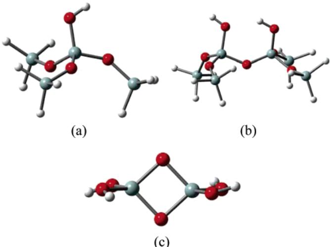  
Figure 1. Cluster models used to represent the active functional groups on the  $\mathrm{SiO_2}$  substrate: (a)  $\mathrm{(SiH_3O)_3Si - OH}$  cluster used to represent isolated surface  $-\mathrm{OH}$  groups, (b)  $\mathrm{Si_6O_7H_{14}}$  cluster used to represent adjacent hydrogen-bonded  $-\mathrm{OH}$  groups, and (c) the  $\mathrm{Si_2O_6H_4}$  cluster used to represent oxygen bridges on the  $\mathrm{SiO_2}$  substrate.

The potential energy surfaces (PESs) for the reacting systems were constructed by electronic structure calculations using Gaussian03. The equilibrium structures and transition structures along the reaction pathways were computed using gradient- corrected density functional theory with the Becke three- parameter exchange functional and the Lee- Yang- Parr correlation functional (B3LYP). This approach has been successfully applied to studies of ALD growth mechanisms and to transition metals. The optimized geometries were predicted using the 6- 31G(d,p) basis set on Si, O, H, and Ti atoms, whereas the I atoms were expanded using an augmented LANL2DZ relativistic effective core potential (RECP) basis set. The LANL2DZ basis set consist of a LANL RECP and a double-  $\zeta$  valence basis set. To further improve the quality of the basis set, the LANL2DZ was augmented by single sets of d polarization and p diffuse functions with optimized exponents of 0.306 and 0.0304, respectively. For consistency with previous studies, this augmented basis set is denoted as LANL2DZdp. The addition of the polarization and diffuse functions improves the valence basis set and makes the LANL2DZdp comparable to the all- electron 6- 31+G(d) basis set in computational accuracy. The combined basis set used in geometry optimizations (6- 31G(d,p) on Si, O, H, and Ti and LANL2DZdp on I) is termed BSI. The nature of the stationary points on the PES was identified by subsequent frequency calculations, which also yielded zero- point energy (ZPE) corrections. Intrinsic reaction coordinate (IRC) calculations were performed to

examine the reaction path leading down from a transition structure in both directions on the PES to ensure that the transition states connect reactants to products.

In previous work, it was found that adsorption energies calculated using the 6- 31G(d,p) basis set are usually overestimated due to basis set superposition error (BSSE). To reduce the BSSE to a negligible level and improve the description of bonding for the adsorbed complex and the transition state structures, a triple-  $\zeta$  basis set with multiple polarization functions and diffuse functions should be used, especially for the Ti and O atoms. Also, it was found that an accurate single point energy calculation using a large basis set at a geometry computed at a smaller basis set gives results comparable to performing all calculations at the larger basis set. Therefore, in this work, single point energy calculations were carried out using the  $6\mathrm{- }311 + + \mathrm{G}(2\mathrm{df},2\mathrm{p})$  basis set on the Si, O, Ti, and Ti atoms and the LANE2DZup basis set on the I atoms. This combined basis set is termed BSII. A few preliminary calculations were carried out to determine the performance of the different theory levels on the energy prediction. On the basis of these results, which are discussed in Section 3.1 in detail, second- order Møller- Plesset perturbation theory (MP2) is used to calculate the heat of adsorption and the activation barrier, and DFT with the B3LYP functional is used to calculate the heat of reaction. This computation scheme is chosen as an optimal tradeoff between accuracy and computational cost. The detailed methods used to calculate the  $0\mathrm{K}$  heat of adsorption, the activation barrier, and the  $0\mathrm{K}$  enthalpy of reaction reported in this paper are described in the Supporting Information.

The rate constants of the elementary surface reactions are computed using harmonic semiclassical transition state theory (SC- TST) as developed by Fermann and Auerbach:24

$$
k^{\mathrm{SC - TST}}(T) = k^{\mathrm{TST}}(T)\cdot \Gamma (T) \tag{1}
$$

where  $k^{\mathrm{TST}}$  is the conventional transitional state theory rate constant and  $\Gamma (T)$  is the tunneling correction factor, given by

$$
k^{\mathrm{TST}}(T) = \frac{k_{\mathrm{B}}T}{h}\frac{q}{q_{\mathrm{r}}}^{\ddagger}e^{-\Delta E_{0} / k_{\mathrm{B}}T} \tag{2}
$$

$$
\Gamma (T) = \frac{e^{\Delta E_0 / k_{\mathrm{B}}T}}{1 + e^{2\pi\Delta E_0 / h|\omega^+|}} +\frac{1}{2}\int_{-\infty}^{\pi \Delta E_0 / h|\omega^+}|e^{\mathrm{h}|\omega^+ |\theta /\pi k_{\mathrm{B}}T}\sec h^2\theta \mathrm{d}\theta \tag{3}
$$

where  $k_{\mathrm{B}}$  is Boltzmann's constant,  $h$  is Plank's constant,  $T$  is temperature,  $q^{\ddagger}$  is the partition function of the activated complex,  $q_{\mathrm{r}}$  is the partition function of the reactant(s),  $\Delta E_0$  is ZPE- including classical activation barrier,  $\omega^{\ddagger}$  is the imaginary frequency of the activated complex corresponding to the vibrational mode in the reaction coordinate, and  $\theta$  is the barrier penetration integral for the reaction coordinate. The parameters required by SC- TST are obtained from the electronic structure calculations described above. The energy barriers are calculated at MP2/BSII/B3LYP/BSI approximation with B3LYP/BSI ZPE correction. The partition functions are computed using standard statistical thermodynamics methods, and the B3LYP/BSI frequencies are used to calculate the contributions to the partition functions from vibrational motions.

On the basis of Hernandez and Miller's SC- TST,25 which include the effects of reaction path curvature and barrier anharmonicity and require a detailed description of the PES to parametrize their model, the Fermann and Auerbach approach requires only the energies and frequencies at the reactant state and the transition states. It is much less computationally demanding than the sophisticated multidimensional theories that require detailed descriptions of the minimum energy path (MEP) or cubic and quartic derivatives of the potential energy, which is prohibitively expensive to obtain from electronic calculations for the reaction systems being studied. The SC- TST developed by Fermann and Auerbach features a truncated parabolic barrier by reintroducing the ground state energy of the reactant. By setting a maximum barrier penetration integral  $(\theta_{0} = \pi \Delta E_{0} / h|\omega^{\ddagger}|)$ , the numerical instabilities and convergence problems in SC- TST were eliminated. It has been shown that  $\Gamma (T)$  is well- behaved at all temperatures and, hence, provides an approach to predict quantum rate coefficients with qualitative reliability.24 In addition, following the method proposed by Fermann and Auerbach,24 we also calculated the tunneling crossover temperature  $(T_{x})$  by:

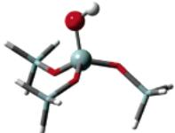  
Figure 2.  $(\mathrm{SiH}_3\mathrm{O})_3\mathrm{Si} - \mathrm{OH}^*$  cluster model used in ONIOM calculations. The atoms appearing as spheres are treated with a high-level model chemistry, whereas the remaining atoms are approximated with HF/6-31G(d,p).

$$
T_{\mathrm{x}} = \frac{h|\omega^{\ddagger}|\Delta E_{0} / k_{\mathrm{B}}}{2\pi\Delta E_{0} - h|\omega^{\ddagger}|\ln 2} \tag{4}
$$

The crossover temperature enables us to quickly identify the temperature regime (temperatures below  $T_{x}$ ) where the tunneling is significant.

# 3. Results and Discussion

3.1. Model Chemistry. To find a reliable theoretical model for predicting the energetics of the reaction systems, we performed some test calculations on the  $(\mathrm{SiH}_3\mathrm{O})_3\mathrm{Si} - \mathrm{OH}^*$  (surface species are denoted by asterisks)  $+\mathrm{TiCl}_4$  reaction, which has been studied in detail in previous work.8 Different model chemistries, including high- level CCSD(T), are used in total energy calculations using B3LYP/6- 31G(d,p) geometries and ZPE corrections. Because a high level model chemistry is not computationally practical for the system being studied here, a hybrid ONIOM method26 was used in these test calculations. The ONIOM procedure divides the real system into two or three model systems, which are treated with different model chemistries. The total ONIOM energy of a two- level system is defined as:

$$
E_{\mathrm{ONIOM}} = E_{\mathrm{LOW,REAL}} + E_{\mathrm{HIGH,MODEL}} - E_{\mathrm{LOW,MODEL}} \tag{5}
$$

The ONIOM model used in our calculations is shown in Figure 2. As shown, the substrate atoms (represented as spheres) and the  $\mathrm{TiCl}_4$  precursor are the crucial region for the energetics of the reactions and, hence, are treated with high- level model chemistries: B3LYP/6- 311++G(2df,2p), MP2/6- 311++G(2df,2p), or CCSD(T)/6- 311++G(2df,2p). The remaining atoms are approximated at the less- expensive HF/6- 31G(d,p) level. Note that the ONIOM methods are only used in the test calculations, which identify reliable theoretical models used in the energy predictions for the reactions in the following sections.

We use the following abbreviations to identify the compound ONIOM model chemistries tested here.

ONIOM(MP2) represents MP2/6- 311++G(2df,2p):HF/6- 31G(d,p)

Table 1. Comparison of Activation Barrier  $(E_{\mathrm{act}})$  Heat of Adsorption  $(Q_{\mathrm{ads}})$  and Enthalpy of Reaction  $(\Delta H_0)$  Calculated Using Three Different Model Chemries for the  $(\mathrm{SiH}_3\mathrm{O})_3\mathrm{Si} - \mathrm{OH}^*$ $+\mathrm{TiCl}_4\rightarrow (\mathrm{SiH}_3\mathrm{O})_3\mathrm{Si} - \mathrm{TiCl}_3^*$  + HCl Reaction at 0 K  

<table><tr><td rowspan="2"></td><td colspan="3">relative energy (kcal/mol)</td></tr><tr><td>ONIOM(B3LYP)</td><td>ONIOM(MP2)</td><td>ONIOM(CCSD(T))</td></tr><tr><td>Eact</td><td>12.5</td><td>13.4</td><td>14.4</td></tr><tr><td>Qads(TiCl4)</td><td>1.9</td><td>7.2</td><td>7.5</td></tr><tr><td>Qads(HCl)</td><td>-0.6</td><td>2.4</td><td>2.1</td></tr><tr><td>ΔH0</td><td>-4.9</td><td>-3.5</td><td>-4.6</td></tr></table>

ONIOM(B3LYP) represents B3LYP/6- 311++G(2df,2p): HF/6- 31G(d,p) ONIOM(CCSD(T)) represents  $\mathrm{CCSD(T) / 6 - 311 + + G(2df,2)}$  2p):HF/6- 31G(d,p)

The energetics calculated using the three different ONIOM model chemistries for the  $\mathrm{(SiH_3O)_3Si - OH^* + TiCl_4\rightarrow}$ $\mathrm{(SiH_3O)_3Si - O - TiCl_3^* + HCl}$  reaction are listed in Table 1, and we assume ONIOM(CCSD(T)) gives us the most accurate predictions, which are used to evaluate the other two model chemistries. Our calculations indicate that ONIOM(B3LYP) underestimates the  $0\mathrm{K}$  heat of adsorption significantly. The heat of adsorption of  $\mathrm{TiCl_4}$  onto the  $\mathrm{SiO_2}$  surface  $(Q_{\mathrm{ads}}(\mathrm{TiCl_4}))$  is calculated to be 1.9 and  $7.5\mathrm{kcal / mol}$  using the ONIOM(B3LYP) and ONIOM(CCSD(T)) model chemistries, respectively. Moreover, ONIOM(B3LYP) incorrectly predicts a negative  $Q_{\mathrm{ads}}(\mathrm{HCl})$  because the underestimated electronic stabilization energy is smaller than the increased ZPE in the adsorption state. Although heats of adsorption are underestimated at ONIOM(B3LYP), the ONIOM(MP2)  $Q_{\mathrm{ads}}$  are in good agreement with ONIOM(CCSD(T))  $Q_{\mathrm{ads}}$  Both of the differences of  $Q_{\mathrm{ads}}(\mathrm{TiCl_4})$  and  $Q_{\mathrm{ads}}(\mathrm{HCl})$  predicted by these two model chemistries are within  $0.3\mathrm{kcal / mol}$  Similarly, ONIOM(MP2) is closer to ONIOM(CCSD(T)) with regards to the activation barrier. However, for reaction enthalpy  $(\Delta H_0)$  ONIOM(B3LYP) is more consistent with ONIOM(CCSD(T)), as shown in Table 1.

The primary goal of the test calculations was to determine the relative computational accuracy of the three candidate model chemistries: B3LYP/6- 311++G(2df,2p),MP2/6- 311++G(2df, 2p),CCSD(T)  $6 - 311 + + G(2\mathrm{df},2\mathrm{p})$  . So, a natural question is if we can extend the conclusions obtained using the ONIOM compound models to the single- level model chemistries, which is used for the whole system (not just for the active sites). The  $Q_{\mathrm{ads}}(\mathrm{TiCl_4})$  calculated using the ONIOM compound models and the single- level models are compared in Figure 3. As illustrated, the difference between the  $Q_{\mathrm{ads}}$  calculated using the two singlelevel model chemistries (B3LYP/6- 311++G(2df,2p) and MP2/  $6 - 311 + + G(2\mathrm{df},2\mathrm{p}))$  is given by:

$$
\Delta Q_{\mathrm{SM}} = \Delta Q_{\mathrm{ONIOM}} + \Delta Q_{\mathrm{B3LYP}} - \Delta Q_{\mathrm{MP2}} \tag{6}
$$

Our calculations show that  $\Delta Q_{\mathrm{SM}}$  is  $7.0\mathrm{kcal / mol}$  , which is very close to the difference between the results calculated using the two ONIOM models  $(\Delta Q_{\mathrm{ONIOM}} = 5.3\mathrm{kcal / mol})$  . There are two reasons leading to the similarity between  $\Delta Q_{\mathrm{SM}}$  and  $\Delta Q_{\mathrm{ONIOM}}$  One is that, due to the localized covalent bonds of the reaction system, the energetics of the chemical reactions are determined primarily by the local states of the reactive site. Thus, the level of theory used to model the active site is the decisive factor for the computational accuracy of the ONIOM models. Therefore, the absolute values of  $\Delta Q_{\mathrm{B3LYP}}$  and  $\Delta Q_{\mathrm{MP2}}$  are small and, hence, lead to similar  $\Delta Q_{\mathrm{SM}}$  and  $\Delta Q_{\mathrm{ONIOM}}$  values. Second, due to the application of the same model chemistry to the nonactive regions in all of the ONIOM calculations, any errors induced by the low level of theory are (at least partially) cancelled, resulting in a small difference between  $\Delta Q_{\mathrm{SM}}$  and  $\Delta Q_{\mathrm{ONIOM}}$  .Due to the similarity of the results obtained from the ONIOM and the single- level model chemistries, the computational reliability of the single- level model chemistries were predicted to be consistent with the trends of the corresponding ONIOM models.

Although CCSD(T) should yield the most reliable results, it is not a feasible option for our systems due to the tremendous computational cost. As mentioned above, MP2 is in much better agreement with CCSD(T) when predicting  $Q_{\mathrm{ads}}$  than B3LYP, which underestimates  $Q_{\mathrm{ads}}$  significantly. Therefore, MP2 was used to calculate the heats of adsorption in this paper. Similar results have been observed by Cross and Schlegel.27 They found that  $\mathrm{B3LYP / 6 - 311 + G(3df,2p)}$  underestimates  $\mathrm{NH_3}$  binding energies for the  $\mathrm{TiCl_4 / NH_3}$  system by  $6 - 8\mathrm{kcal / mol}$  , whereas  $\mathrm{MP2 / 6 - 311 + G(3df,2p)}$  binding energies are very close to the G2 results. Although our two reaction systems are not identical, the results should be comparable, due to the same nature of the adsorption. The  $\mathrm{TiCl_4 / NH_3}$  complex is similar to the adsorption complex of our study in that the Lewis acid/base interaction between Ti and the electron pair donor plays an important role in the adsorption. Therefore, as expected, the relative performances of model chemistries for predicting binding energies are consistent.

In conclusion, the heats of adsorption and the activation barriers were obtained using MP2 calculations based on its better agreement with CCSD(T) results. However, values of  $\Delta \mathrm{H_0}$  obtained from MP2 were found to be less accurate, and therefore, the enthalpy of reaction is evaluated using DFT with the B3LYP functional.

3.2. Reactions On Isolated Hydroxyl Groups. 3.2.1. First Half- Reaction. When being introduced onto the  $\mathrm{SiO_2}$  substrate, metal- containing precursors  $\mathrm{(Ti_4)}$  can react with the isolated  $- \mathrm{OH}$  groups via a ligand- exchange mechanism:

$$
\begin{array}{r}\mathrm{\underline{O}}^{\mathrm{H}} + \mathrm{\underline{Ti}}_4\longrightarrow \mathrm{\underline{O}}^{\mathrm{Til}_3}\\ \mathrm{\underline{Si}}\mathrm{\underline{Si}}\mathrm{\underline{Si}}\mathrm{\underline{Si}}\mathrm{\underline{Si}}\mathrm{\underline{Si}}\mathrm{\underline{Si}}\mathrm{\underline{Si}}\mathrm{\underline{Si}}\mathrm{\underline{Si}}\mathrm{\underline{Si}}\mathrm{\underline{Si}}\mathrm{\underline{Si}}\mathrm{\underline{Si}}\mathrm{\underline{Si}}\mathrm{H}\mathrm{\underline{H}} \end{array} \tag{A}
$$

The reaction pathway is initiated by the adsorption of  $\mathrm{Ti_4}$  onto the isolated hydroxyl group of the  $\mathrm{SiO_2}$  substrate to form an adsorption complex, as shown in Figure 4a. In the adsorption state, the  $\mathrm{Ti - O}$  distance is  $2.27\mathrm{\AA}$  and all of the  $\mathrm{Ti - I}$  bonds are lengthened to above  $2.59\mathrm{\AA}$  compared to  $2.55\mathrm{\AA}$  in the gas phase. In addition, the coordination geometry of Ti changes from tetrahedron in the gas phase to trigonal bipyramid in the adsorption complex. The geometric changes indicate the Lewis acid/base interactions between the adsorbate and the surface  $- \mathrm{OH}$  group. A natural bond orbital (NBO)28,29 analysis shows that there are interactions between the oxygen lone pair NBO and the  $\mathrm{Ti - I}$  antibond NBOs, which indicates donation of occupancy from the oxygen lone pair NBO into the empty  $\mathrm{Ti - I}$  antibond hybrid orbitals. The accumulation of negative charge on Ti induces the rehybridization of the Ti group from

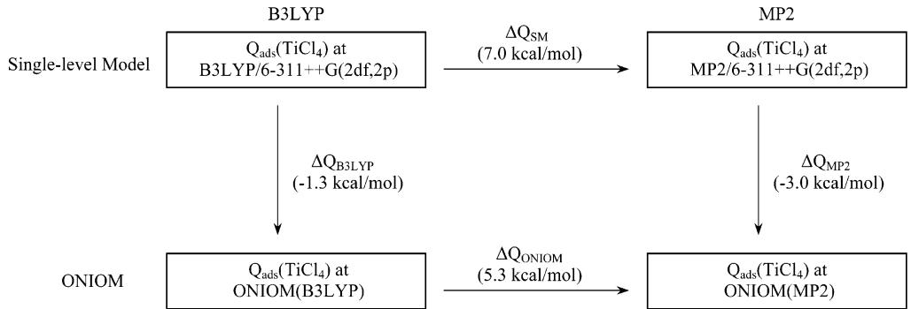  
Figure 3. Comparison of the  $0\mathrm{K}$  heats of adsorption  $(Q_{\mathrm{ads}}(\mathrm{TiCl}_4))$  calculated using different model chemistries.

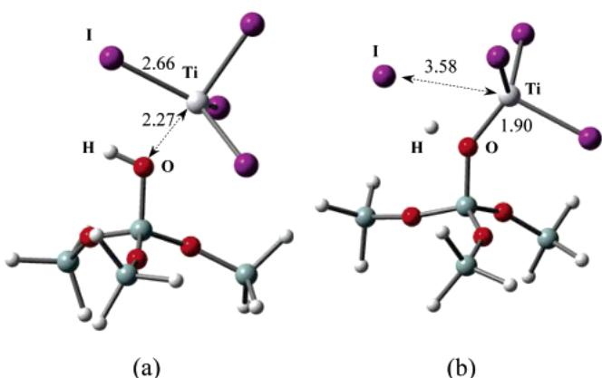  
Figure 4. Stationary points for the  $(\mathrm{SiH}_3\mathrm{O})_3\mathrm{Si} - \mathrm{OH}^* + \mathrm{TiI}_4$  reaction calculated using B3LYP/6-31G(d,p): (a) adsorption equilibrium state, (b) transition state. Distances are shown in angstroms.

4- coordination to 5- coordination and, hence, changes the coordination geometry. The adsorption interaction is weak, with a binding energy of  $5.7\mathrm{kcal / mol}$

The adsorbed  $\mathrm{TiI_4}$  is capable of attacking the surface  $- \mathrm{OH}$  group to release  $\mathrm{HI}$  and leave a  $- \mathrm{TiI_3}$  group on the surface, with the transition state shown in Figure 4b. In the transition state, the  $\mathrm{Ti - O}$  distance decreases to 1.90 from  $2.27\mathrm{\AA}$  in the adsorption state. A natural bond orbital (NBO) analysis shows that a two- center  $\sigma_{\mathrm{Ti - O}}$  NBO is formed, although the contribution to this orbital is mainly from the O  $(95\%)$ . In addition, the  $\mathrm{Ti - I}$  distance  $(3.58\mathrm{\AA})$  is much longer than that in the adsorption state  $(2.66\mathrm{\AA})$ . The NBO analysis reveals that there is no bond between Ti and I, indicating that the  $\mathrm{Ti - I}$  bond is completely broken in the transition state. The  $\mathrm{H - I}$  distance in the transition state is  $1.95\mathrm{\AA}$  which is longer than the equilibrium bond length of a HI molecule  $(1.61\mathrm{\AA})$ . Although the  $\mathrm{H - I}$  bond is not formed completely, the NBO analysis predicts the presence of a  $\sigma_{\mathrm{H - I}}$  orbital, which indicates that they can "see" each other in the transition state. On the other hand, this calculation predicts a lone pair NBO on the O atom  $(\mathrm{LP_0})$  rather than a two- center bond between  $\mathrm{H}$  and O, suggesting that the  $\mathrm{O - H}$  bond is broken completely. However, it is important to note the low occupancy  $(1.75)$  of the O lone pair NBO and the large occupancy  $(0.22)$  of  $\sigma_{\mathrm{H - I}}$  \* (star denotes the non- Lewis NBO) antibonding orbital, which indicates deviations from idealized Lewis bonding. Second- order perturbation analysis shows strong  $\mathrm{LP_0}\longrightarrow \sigma_{\mathrm{H - I}}$  \* interaction between the O lone pair and the  $\mathrm{H - I}$  antibonding orbital with a stabilization energy of  $199\mathrm{kcal / mol}$ . This interaction leads to donation of occupancy from the O lone pair orbital to the  $\sigma_{\mathrm{H - I}}$  \* antibonding orbital. The delocalization of the lone pair electrons builds a partial  $\sigma$  bond between O and HI and weakens the  $\sigma$  bond between the H and I. The ZPE- corrected activation barrier with reference to the adsorption state is  $13.5\mathrm{kcal / mol}$ . The reaction is exothermic by  $9.4\mathrm{kcal / mol}$  at  $0\mathrm{K}$ . The HI product may adsorb on the surface, with a binding energy of  $2.7\mathrm{kcal / mol}$ .

To incorporate our calculations into mechanistic models, rate constants of the  $(\mathrm{SiH}_3\mathrm{O})_3\mathrm{Si} - \mathrm{OH}^* + \mathrm{TiI}_4$  reaction were calculated using eqs 1, 2, and 3. For a Langmuir- Hinshelwood mechanism, the gas- phase molecules first absorb onto the surface prior to reacting. Therefore, in our calculations, the activation barrier is reported with respect to the adsorption complex. In addition, only vibrational partition functions are used in the rate constant calculations. The reactant complex and activated complex are considered to lose all of their translational and rotational degrees of freedom. The possible exception to this assumption is that the  $\mathrm{TiI_4}$  in the adsorption state (Figure 4a) may have one rotational degree of freedom along the  $\mathrm{Ti - O}$  axis. As the rotation along the  $\mathrm{Ti - O}$  axis couples weakly to the translational energy leading to desorption, the adsorbate is likely to stick on the surface with rotational excitation along this degree of freedom. However, a PES scan estimates that the rotational barrier is approximately  $16\mathrm{kcal / mol}$ , which is even larger than the activation barrier of the surface reaction and was therefore neglected.

The rate constants for this reaction step were calculated from 60 to  $723.15\mathrm{K}$  and are listed in Table 2 (given on a per surface active site basis). Figure 5 shows this data fit to an Arrhenius plot. As shown, tunneling plays a critical role in the magnitude of the rate constant at lower temperatures, resulting in  $k^{\mathrm{SC - TST}}$  values that are much larger than  $k^{\mathrm{TST}}$  values. As shown in Figure 5, the Arrhenius fit of  $k^{\mathrm{SC - TST}}$  gives two different linear relations at high temperatures and low temperatures. The classical Arrhenius temperature dependence is observed in the regime of high temperatures, and the Arrhenius activation energy is estimated to be  $3.4\mathrm{kcal / mol}$ . At low temperatures, however, there is significant deviation of the rate constant from Arrhenius behavior due to the dominance of quantum tunneling. Using eq 4, the tunneling crossover temperature  $(T_x)$  is calculated to be  $151\mathrm{K}$ , where the tunneling correction factors  $(\Gamma)$  drops to 35. Above  $T_x$ , I decreases quickly and the tunneling effect becomes negligible and, therefore, can be used as a quick estimate of the tunneling- dominant temperature regime. It has been found through similar calculations that the  $T_x$  for the other reactions studied here are comparable or lower than the  $T_x$  of reaction A. Therefore, tunneling effects are predicted to be

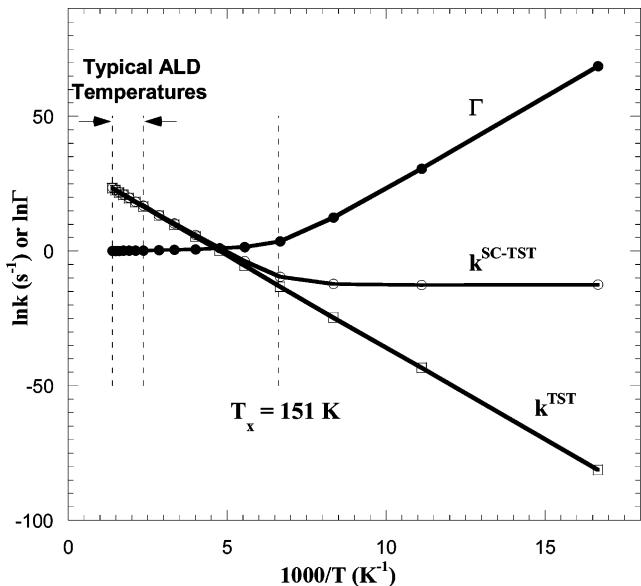  
Figure 5. Arrhenius plot of  $\Gamma (T)$ ,  $k^{\mathrm{TST}}(T)$ , and  $k^{\mathrm{SC - TST}}(T)$  for the  $(\mathrm{SiH}_3\mathrm{O})_3\mathrm{Si - OH}^* + \mathrm{Ti}_4$  reaction.

Table 2. Rate Constants and Tunneling Correction Factors for the  $(\mathrm{SiH}_3\mathrm{O})_3\mathrm{Si - OH}^* +\mathrm{Ti}_4$  Reaction  

<table><tr><td>T(K)</td><td>Γ</td><td>kTST (s-1)</td><td>kSC-TST (s-1)</td></tr><tr><td>60.00</td><td>6.77 × 1029</td><td>5.57 × 10-36</td><td>3.77 × 10-6</td></tr><tr><td>90.00</td><td>1.99 × 1013</td><td>1.55 × 10-19</td><td>3.10 × 10-6</td></tr><tr><td>120.00</td><td>2.58 × 105</td><td>1.86 × 10-11</td><td>4.79 × 10-6</td></tr><tr><td>150.00</td><td>3.54 × 101</td><td>1.92 × 10-6</td><td>6.78 × 10-5</td></tr><tr><td>180.00</td><td>4.93 × 100</td><td>4.37 × 10-3</td><td>2.15 × 10-2</td></tr><tr><td>210.00</td><td>2.78 × 100</td><td>1.12 × 100</td><td>3.11 × 100</td></tr><tr><td>250.00</td><td>1.95 × 100</td><td>2.06 × 102</td><td>4.01 × 102</td></tr><tr><td>300.00</td><td>1.55 × 100</td><td>2.06 × 102</td><td>2.91 × 102</td></tr><tr><td>350.00</td><td>1.37 × 100</td><td>4.81 × 104</td><td>6.59 × 104</td></tr><tr><td>423.15</td><td>1.23 × 100</td><td>1.63 × 107</td><td>2.01 × 107</td></tr><tr><td>473.15</td><td>1.18 × 100</td><td>8.18 × 107</td><td>9.67 × 107</td></tr><tr><td>523.15</td><td>1.15 × 100</td><td>3.69 × 108</td><td>4.23 × 108</td></tr><tr><td>573.15</td><td>1.12 × 100</td><td>1.08 × 109</td><td>1.21 × 109</td></tr><tr><td>623.15</td><td>1.10 × 100</td><td>2.92 × 109</td><td>3.22 × 109</td></tr><tr><td>673.15</td><td>1.08 × 100</td><td>6.85 × 109</td><td>7.42 × 109</td></tr><tr><td>723.15</td><td>1.07 × 100</td><td>1.43 × 1010</td><td>1.54 × 1010</td></tr></table>

negligible for all reactions studied in this work at typical ALD temperatures.

3.2.2. Second Half- Reaction. The second- half cycle, which introduces  $\mathrm{H}_2\mathrm{O}$  into the reactor, will regenerate the surface  $- \mathrm{OH}$  groups by:

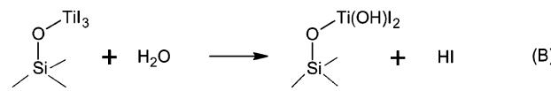

Like other Langmuir- Hinshelwood reactions,  $\mathrm{H}_2\mathrm{O}$  first absorbs onto the surface to form an adsorbed complex. Similar to the  $\mathrm{TiCl_4 / H_2O}$  precursor combination,  $\mathrm{H}_2\mathrm{O}$  can absorb on top or on side sites of the Ti intermediates. As the atomic mechanisms of the different adsorption modes and the following reaction pathways are very similar, for simplicity, we restrict discussion here to the adsorption of  $\mathrm{H}_2\mathrm{O}$  to the apical sites of the surface  $- \mathrm{TiI}_3$  group (Figure 6a). The NBO analysis reveals that, in the adsorption state, the interaction between the O1 lone pair (LP) and the  $\sigma_{\mathrm{Ti - O2}}$  antibond NBO gives a stabilization energy of  $67.44\mathrm{kcal / mol}$ , which indicates the  $\mathrm{LP} \rightarrow \sigma_{\mathrm{Ti - O2}}$  donation of occupancy. A natural population analysis (NPA) shows that the adsorbed  $\mathrm{H}_2\mathrm{O}$  has a net charge of  $+0.1e$  due to the charge transfer from the aqueous O to Ti. The charge transfer leads to the rehybridization of the Ti and changes the coordination geometry from tetrahedron to trigonal bipyramid. The  $0\mathrm{K}$  heat of adsorption is calculated to be  $6.2\mathrm{kcal / mol}$ .

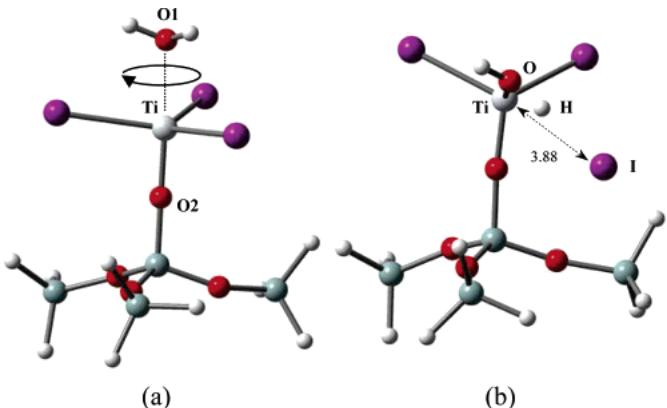  
Figure 6. Stationary points for the  $(\mathrm{SiH}_3\mathrm{O})_3\mathrm{Si - O - TiI}_3^* + \mathrm{H}_2\mathrm{O}$  reaction calculated using B3LYP/6-31G(d,p): (a) adsorption equilibrium state, and (b) transition state. Distances are shown in angstroms.

After the adsorption of  $\mathrm{H}_2\mathrm{O}$ , the reaction proceeds via the transition state shown in Figure 6b. In the transition state, O in  $\mathrm{H}_2\mathrm{O}$  is bonded to Ti with a bond length of  $1.95\mathrm{\AA}$ . NBO analysis reveals a polarized  $\mathrm{Ti - O}$  NBO with significant contribution  $(95\%)$  from O. The  $\mathrm{Ti - I}$  distance is increased to  $3.88\mathrm{\AA}$ , which indicates that the bond is broken in the transition state. Also note that the interaction between the O lone pair and the  $\mathrm{H - I}$  antibonding orbital leads to the delocalization of the lone pair electrons, which indicates the partial breakage of the  $\mathrm{O - H}$  bond and the partial formation of the  $\mathrm{H - I}$  bond. At  $0\mathrm{K}$  temperature, the reaction is slightly exothermic by  $0.2\mathrm{kcal / mol}$  with an activation barrier of  $20.3\mathrm{kcal / mol}$ .

The surface  $- \mathrm{Ti(OH)}\mathrm{I}_2$  group can be further hydroxylated by reacting with additional  $\mathrm{H}_2\mathrm{O}$  molecules through a similar atomic mechanism, until all of the I atoms on the surface are replaced by hydroxyl groups. The ZPE- corrected PESs for the three consecutive hydroxylation reactions are shown in Figure 7. Note that, with an increase in the number of  $- \mathrm{OH}$  attached to the Ti atom, the binding energy of  $\mathrm{H}_2\mathrm{O}$  onto the Ti- containing group is correspondingly increased. The  $0\mathrm{K}$  heats of adsorption of  $\mathrm{H}_2\mathrm{O}$  is  $6.2\mathrm{kcal / mol}$  on the  $- \mathrm{TiI}_3$  group,  $7.5\mathrm{kcal / mol}$  on the  $- \mathrm{Ti(OH)}\mathrm{I}_2$  group, and  $8.8\mathrm{kcal / mol}$  on the  $- \mathrm{Ti(OH)}_2\mathrm{I}$  group. This trend is related to the hydrogen bonds between the adsorbed  $\mathrm{H}_2\mathrm{O}$  and the  $- \mathrm{OH}$  attached to the Ti atom, which enhances the adsorption interaction. The ZPE- corrected activation barrier for the three consecutive hydroxylation reactions is  $20.3$ ,  $17.7$ , and  $19.4\mathrm{kcal / mol}$ , respectively. The reaction enthalpy of each individual reaction is small  $(- 0.2$ ,  $3.2$ , and  $1.5\mathrm{kcal / mol}$ ), and the overall  $0\mathrm{K}$  reaction enthalpy for replacing all of the three I atoms bonded to the Ti atom with hydroxyl groups is  $4.5\mathrm{kcal / mol}$ .

Using eqs 1, 2, and 3, rate constants for the first hydroxylation reaction (reaction B) were calculated at temperatures between  $150$  and  $450^{\circ}\mathrm{C}$ , which is the typical temperature range of ALD. In our calculations, only vibrational partition functions are considered in the transition state. However, in the adsorption state, the adsorbed  $\mathrm{H}_2\mathrm{O}$  may have rotational degrees of freedom in addition to the vibrational degrees of freedom, and neglect of the rotational motions will lead to errors in the reaction kinetics. The rotation of an absorbate on a surface is composed

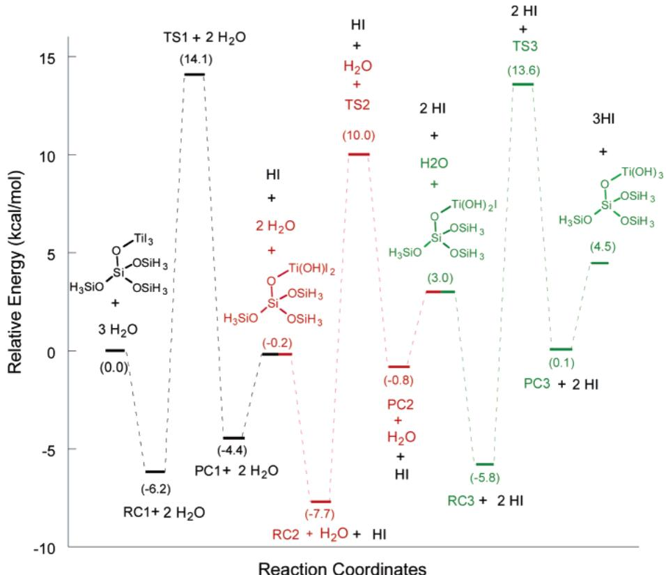  
Figure 7. ZPE-corrected PES for the three consecutive hydroxylation reactions on the surface  $-\mathrm{TiI}_3$  intermediate. The three hydroxylation reactions are denoted by different colors:  $\mathrm{RC} =$  reactant complex;  $\mathrm{TS} =$  transition state;  $\mathrm{PC} =$  product complex.

of two types of degrees of freedom. The first is the rotation perpendicular to the surface. As this type of rotation has strong coupling to normal translation and, hence, enhances desorption, it is not taken into account in the adsorption state. The second is called in- plane rotation, which rotates about the  $\mathrm{Ti} - \mathrm{O1}$  axis shown in Figure 6a. As the energy transfer of the in- plane rotational motion to the normal translational motion is very small, the excitation of the in- plane rotation has little influence on desorption. Therefore, we assume that  $\mathrm{H}_2\mathrm{O}$  can only rotate about the  $\mathrm{Ti} - \mathrm{O1}$  axis in the adsorption state. Being adsorbed on the surface, however,  $\mathrm{H}_2\mathrm{O}$  cannot undergo free rotation due to the directional interaction with the substrate. A PES scan predicts that the potential barrier of the rotation  $(V_0)$  is  $1.6\mathrm{kcal}/$  mol. At the typical temperatures of ALD,  $k_{\mathrm{B}}T$  is very close in magnitude to  $V_{0}$ . As a result, we can neither treat the rotation as free rotation nor as torsional vibration. In our calculations, the partition function of the hindered rotor is calculated by an approach developed by Fernandez,30 where

$$
q_{\mathrm{rot}} = \left(\frac{I}{2\pi\beta\hbar^2\sigma^2}\right)^{1 / 2}\int_0^{2\pi}e^{-\beta V(\phi)}w(\phi)\mathrm{d}\phi \tag{7}
$$

$$
w(\phi) = 1 + \frac{\hbar^2\beta^2}{24I} [\beta V'(\phi)^2 -2V''(\phi)]
$$

$$
\begin{array}{l}\beta = \frac{1}{k_{\mathrm{B}}T}\\ \hbar = \frac{h}{2\pi} \end{array} \tag{8}
$$

Table 3. Calculated Rate Constants for the  $(\mathsf{SiH}_3\mathsf{O})_3\mathsf{Si} - \mathsf{O} - \mathsf{Ti}\mathsf{I}_3^* +$ $\mathsf{H}_2\mathsf{O}$  Reaction  

<table><tr><td>TK)</td><td>kTST (s-1)</td><td>kSC-TST (s-1)</td></tr><tr><td>423.15</td><td>1.43 × 100</td><td>1.45 × 100</td></tr><tr><td>473.15</td><td>1.56 × 101</td><td>1.57 × 101</td></tr><tr><td>523.15</td><td>1.08 × 102</td><td>1.08 × 102</td></tr><tr><td>573.15</td><td>5.82 × 102</td><td>5.84 × 102</td></tr><tr><td>623.15</td><td>2.04 × 103</td><td>2.04 × 103</td></tr><tr><td>673.15</td><td>6.92 × 103</td><td>6.94 × 103</td></tr><tr><td>723.15</td><td>1.72 × 104</td><td>1.73 × 104</td></tr></table>

In the equations above,  $\phi$  is the angle of rotation,  $I$  is an effective moment of inertia for the in- plane rotation,  $k_{\mathrm{B}}$  is Boltzmann's constant,  $T$  is temperature,  $V(\phi)$  is the potential energy of the in- plane rotation, and  $\sigma$  is the number of rotational potential wells, which is 2 for the system being studied. Following Nielsen,31 the potential is approximated by

$$
V(\phi) = \frac{1}{2} V_{0}(1 - \cos \sigma \phi) \tag{9}
$$

where  $V_{0}$  is the potential energy barrier of the rotation.

The rate constants calculated are given in Table 3.  $k^{\mathrm{TST}}$  is very close to  $k^{\mathrm{SC} - \mathrm{TST}}$  due to the negligible tunneling effects. The rate constants for the  $(\mathrm{SiH}_3\mathrm{O})_3\mathrm{Si} - \mathrm{O} - \mathrm{TiI}_3^* + \mathrm{H}_2\mathrm{O}$  reaction are 6- 7 orders of magnitude smaller than the  $(\mathrm{SiH}_3\mathrm{O})_3\mathrm{Si} - \mathrm{OH}^* + \mathrm{TiI}_4$  reaction, indicating that the second half- reaction is much slower than the first half- reaction.

To better understand the effects of the restricted rotational motions of the adsorbed  $\mathrm{H}_2\mathrm{O}$  on the rate constants, we also calculated the rate constants by using the free rotational model  $(V_0 = 0, \sigma = 1)$  and by completely ignoring the rotation of

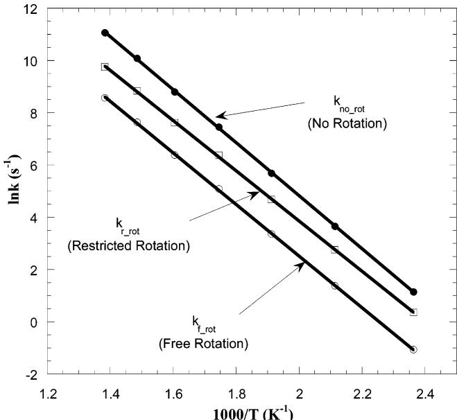  
Figure 8. Arrhenius plot of the rate constants of the  $\mathrm{(SiH_3O)_3Si - OTi - }$ $\mathrm{I}_3^* +\mathrm{H}_2\mathrm{O}$  reaction calculated with different treatments of the rotation of the absorbed  $\mathrm{H}_2\mathrm{O}$

$\mathrm{H}_2\mathrm{O}$ $(q_{rot} = 1)$ . Figure 8 presents the rate constants of the  $\mathrm{(SiH_3O)_3Si - O - TiI_3^* + H_2O}$  reaction calculated with three different models of adsorbate rotation. Note that including the rotation of  $\mathrm{H}_2\mathrm{O}$  decreases the rate constant. As more rotation is included, the free energy of the adsorbed complex decreases, which increases the overall free energy activation barrier of the reaction. In addition, the inclusion of the restricted rotation leads to a smaller Arrhenius activation energy  $(4.8\mathrm{kcal / mol})$  than with the rotation excluded  $(5.1\mathrm{kcal / mol})$ . If the  $\mathrm{H}_2\mathrm{O}$  rotation is treated as free rotation, however, the rotational entropy will be overestimated, which will lead to an underestimation of the rate constant.

3.3. Reactions On Adjacent Hydrogen- Bonded Hydroxyl Groups. 3.3.1. First Half- Reaction. Different from the reactions on isolated hydroxyl groups, the reaction between  $\mathrm{TiI_4}$  and adjacent hydroxyl groups can form  $- \mathrm{TiI_2}$  groups on the surface via two consecutive reactions.

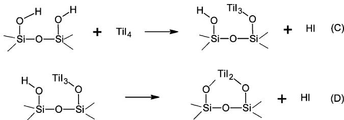

When the  $\mathrm{TiI_4}$  molecule approaches the surface, it can stick to one of the adjacent hydroxyl groups via nonactivated adsorption. Due to the lateral interaction of the adjacent hydroxyl groups, the ZPE- including binding energy of  $\mathrm{TiI_4}$ $(9.0\mathrm{kcal / }$  mol) is larger than that on isolated hydroxyl groups  $(5.7\mathrm{kcal / }$  mol). As shown in Figure 9a, the adjacent hydroxyl groups form a weak  $\mathrm{H1 - O2}$  hydrogen bond, which lengthens the  $\mathrm{O1 - H1}$  bond to  $0.99\mathrm{\AA}$  and decreases the  $\mathrm{H1 - O1 - Si1}$  bond angle to  $108.8^{\circ}$ . A NBO analysis reveals that the interaction between the O2 lone pair (LP) and the  $\sigma_{\mathrm{HI}} - \mathrm{O1}^*$  antibond NBO gives a stabilization energy of  $20.09\mathrm{kcal / mol}$ , which leads to donation of occupancy from the O2 lone pair to the  $\sigma_{\mathrm{HI}} - \mathrm{O1}^*$  antibond

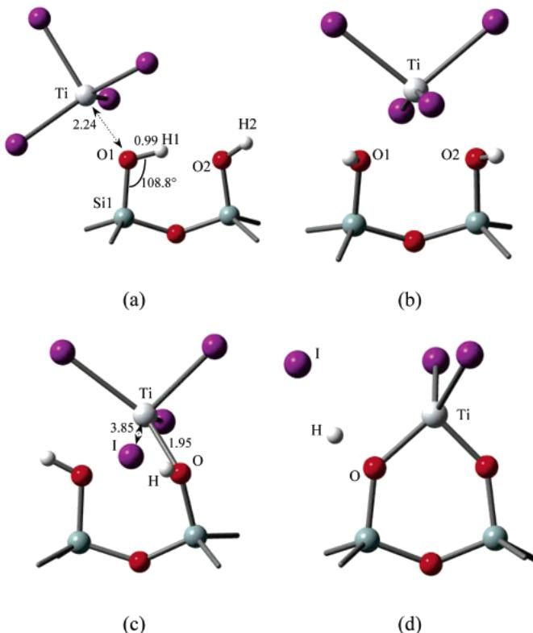  
Figure 9. Stationary points for the first half-reactions taking place on the adjacent hydrogen-bonded hydroxyl groups calculated using B3LYP/6-31G-  $(\mathrm{d},\mathrm{p})$  a adsorption equilibrium state on the top site of a single hydroxyl group, (b) adsorption equilibrium state on the bridge site of adjacent hydroxyl groups, (c) transition state for reaction C, and (d) transition state for reaction D. For clarity, only reactive site of the  $\mathrm{SiO_2}$  substrate is shown. Distances are shown in angstroms.

NBO. The delocalization of the O2 lone pair electrons makes O1 more negatively charged and increases its charge- donating ability. As a result, Ti and O1 show stronger Lewis acid/base interaction, which decreases the Ti- O1 distance to  $2.24\mathrm{\AA}$  and increases the binding energy of the  $\mathrm{TiI_4}$ . After being adsorbed on the top site of one of the adjacent hydroxyl groups,  $\mathrm{TiI_4}$  can hop to the bridge site of the adjacent hydroxyl groups to form a more stable adsorption complex (Figure 9b). This process involves overcoming a barrier of  $3.6\mathrm{kcal / mol}$  to break the hydrogen bond. In the bridge- site adsorption state, Ti has 6- fold coordination with a coordination geometry that is roughly octahedral, which indicates that both of the two oxygen atoms (O1 and O2) donate electrons to Ti to form the adsorption complex. The binding energy of  $\mathrm{TiI_4}$  to the bridge site is 11.3 kcal/mol, which is larger than that to the top site and is therefore favored energetically.

With  $\mathrm{TiI_4}$  adsorbed on the bridge site, reaction C proceeds through the transition state shown in Figure 9c. The transition state occurs late, where the  $\mathrm{Ti - I}$  bond has been broken and corresponds to a distance of  $3.85\mathrm{\AA}$ . The  $\mathrm{Ti - O}$  distance is decreased to  $1.95\mathrm{\AA}$ , indicating the formation of the  $\mathrm{Ti - O}$  bond. The  $\mathrm{H - O}$  bond is partially broken and the  $\mathrm{H - I}$  distance is decreased to  $1.94\mathrm{\AA}$  where they can now "see" each other. The activation barrier with reference to the bridge- site adsorption state is  $12.7\mathrm{kcal / mol}$ . The  $0\mathrm{K}$  enthalpy of reaction is  $- 8.0$  kcal/mol, and the HI product may adsorb on the surface with a binding energy of  $4.4\mathrm{kcal / mol}$ .

The  $- \mathrm{TiI_3}$  group can further react with the adjacent surface hydroxyl group to liberate another HI via reaction D, with the

Table 4. Calculated Rate Constants for Reaction C  

<table><tr><td>T(K)</td><td>kTST (s-1)</td><td>kSC-TST (s-1)</td></tr><tr><td>423.15</td><td>1.45 × 107</td><td>1.78 × 107</td></tr><tr><td>473.15</td><td>7.36 × 107</td><td>8.68 × 107</td></tr><tr><td>523.15</td><td>2.77 × 108</td><td>3.17 × 108</td></tr><tr><td>573.15</td><td>8.33 × 108</td><td>9.31 × 108</td></tr><tr><td>623.15</td><td>2.30 × 109</td><td>2.52 × 109</td></tr><tr><td>673.15</td><td>5.08 × 109</td><td>5.50 × 109</td></tr><tr><td>723.15</td><td>1.01 × 1010</td><td>1.08 × 1010</td></tr></table>

Table 5. Calculated Rate Constants for Reaction D  

<table><tr><td>T(K)</td><td>kTST (s-1)</td><td>kSC-TST (s-1)</td></tr><tr><td>423.15</td><td>2.26 × 105</td><td>3.51 × 105</td></tr><tr><td>473.15</td><td>44 × 106</td><td>2.03 × 106</td></tr><tr><td>523.15</td><td>6.50 × 106</td><td>8.60 × 106</td></tr><tr><td>573.15</td><td>2.49 × 107</td><td>3.13 × 107</td></tr><tr><td>623.15</td><td>6.57 × 107</td><td>7.98 × 107</td></tr><tr><td>673.15</td><td>4.76 × 108</td><td>2.07 × 108</td></tr><tr><td>723.15</td><td>1.84 × 108</td><td>4.43 × 108</td></tr></table>

transition state shown in Figure 9d. The  $\mathrm{Ti - I}$  and  $\mathrm{H - O}$  distances are lengthened, whereas the  $\mathrm{Ti - O}$  distance is shortened in the transition state. The reaction is exothermic by 2.0 kcal/mol with the ZPE- including activation barrier of  $14.7\mathrm{kcal}/$  mol.

The rate constants for the two consecutive reactions were calculated at various temperatures using eqs 1, 2, and 3. Only vibrational partition functions were included. Table 4 and Table 5 present rate constants for reactions C and D, respectively. Although the rate constants of reaction D are 2 orders of magnitude smaller than that of reaction C, both of the reactions are very fast at temperatures between 150 and  $450^{\circ}\mathrm{C}$ . In addition, the rate constants of reaction D are very close to that of the reaction between  $\mathrm{TiI_4}$  and isolated hydroxyl groups. This result shows that both types of hydroxyl groups have similar reactivity toward  $\mathrm{TiI_4}$  precursors.

3.3.2. Second Half- Reaction. During the exposure of  $\mathrm{H}_2\mathrm{O}$  the surface  $-\mathrm{TiI_2}$  group deposited during the first half- cycle can be hydroxylated with the removal of the surface I atom via the following reaction.

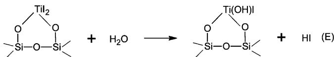

Similar to the  $(\mathrm{SiH}_3\mathrm{O})_3\mathrm{Si} - \mathrm{O} - \mathrm{Ti}_3^* +\mathrm{H}_2\mathrm{O}$  reaction,  $\mathrm{H}_2\mathrm{O}$  molecules first adsorb onto the  $- \mathrm{TiI_2}$  species to form an adsorbed complex (Figure 10a). Like the binding of  $\mathrm{H}_2\mathrm{O}$  to the surface  $- \mathrm{TiI_3}$  species described above, the adsorption process involves a Lewis acid/base interaction between Ti and O. Following the formation of the adsorbed complex, the  $\mathrm{H}_2\mathrm{O}$  is capable of attacking the  $- \mathrm{TiI_2}$  species. As the  $\mathrm{Ti - O}$  distance is shortened, the  $\mathrm{H - O}$  and  $\mathrm{Ti - I}$  bond is lengthened. Figure 10b depicts the transition state, which occurs late, with the breakage of the  $\mathrm{Ti - I}$  bond and the partial formation of the  $\mathrm{H - I}$  bond. After liberating one HI, the surface  $- \mathrm{Ti(OH)I}$  group can be further hydroxylated by reacting with another  $\mathrm{H}_2\mathrm{O}$  molecule through a similar mechanism. The ZPE- corrected PESs for the two consecutive hydroxylation reactions are shown in Figure 11. The two reactions have almost identical activation barriers (22.2 and  $22.4\mathrm{kcal / mol}$ ). The overall  $0\mathrm{K}$  reaction enthalpy for the two exchange reactions is  $2.6\mathrm{kcal / mol}$ .

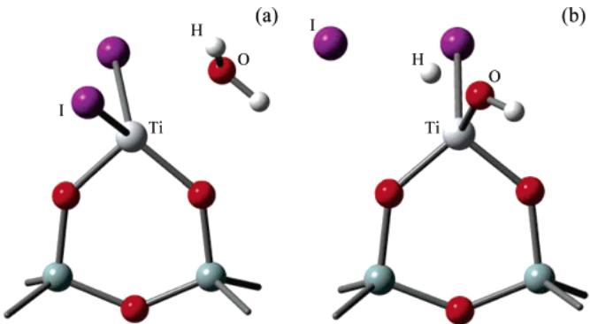  
Figure 10. Stationary points for reaction E calculated using B3LYP/6-  $3\mathrm{TiO}(\mathrm{d},\mathrm{p})$  a) adsorption equilibrium state b) transition state. Only the reactive site of the  $\mathrm{SiO_2}$  substrate is shown for clarity in the figure.

The rate constants for reaction E were calculated at various temperatures using eqs 1, 2, and 3 and are listed in Table 6. Vibrational partition functions were used in the calculations, as well as the partition function for the hindered rotation of the adsorbed  $\mathrm{H}_2\mathrm{O}$ . The rate constants for reaction E are 1 order of magnitude smaller than the  $(\mathrm{SiH}_3\mathrm{O})_3\mathrm{Si} - \mathrm{O} - \mathrm{TiI}_3^* +\mathrm{H}_2\mathrm{O}$  reaction. The lower rate constants of reaction E are attributed to the slightly higher activation barrier and larger rotational partition function of the adsorbed  $\mathrm{H}_2\mathrm{O}$  due to a larger effective moment of inertia.

3.4. Reactions On Oxygen Bridges. 3.4.1. Reaction of  $\mathrm{TiI_4}$  with Oxygen Bridge. When being brought to the  $\mathrm{SiO_2}$  surface, the  $\mathrm{TiI_4}$  precursors can react not only with hydroxyl groups but also with oxygen bridges by the following reaction.

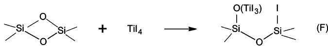

This reaction is initiated with the attachment of  $\mathrm{TiI_4}$  to the oxygen bridge (Figure 12a), where the surface provides a Lewis base site (O) for coordination to Ti. The heat of adsorption is  $9.2\mathrm{kcal / mol}$  at  $0\mathrm{K}$ . After the adsorption of the  $\mathrm{TiI_4}$  onto the surface, reaction F proceeds via the transition state shown in Figure 12b. In the transition state, the  $\mathrm{Ti - O}$  distance decreases to  $1.90$  from  $2.22\mathrm{\AA}$  in the adsorption state. A NBO analysis shows that a two- center  $\sigma_{\mathrm{Ti - O}}$  is formed with significant contribution (95%) from O, and the  $\mathrm{Ti - I1}$  bond is almost broken at a distance of  $3.03\mathrm{\AA}$ . Second- order perturbation analysis reveals that the interaction between the I1 lone pair and the  $\sigma_{4}^{*}$  antibond NBO gives a stabilization energy of  $150.19\mathrm{kcal / mol}$ . This strong interaction leads to delocalization from the I1 lone pair to the unfilled  $\sigma_{\mathrm{Ti - I4}}^{*}$  antibond NBO. As a result, the Ti- I4 bond is  $0.04\mathrm{\AA}$  longer than the Ti- I2 (or Ti- I3) bond, whereas the Ti- I1 bond is not broken completely. In addition, in the transition state, the  $\mathrm{Si - O}$  bond is partially broken at a distance of  $2.07\mathrm{\AA}$  and the  $\mathrm{Si - I1}$  bond is partially formed at a distance of  $2.69\mathrm{\AA}$ . The ZPE- including activation barrier for reaction F is  $15.7\mathrm{kcal / mol}$ , which is close to that of the reactions between  $\mathrm{TiI_4}$  and hydroxyl groups. However, the reaction of  $\mathrm{TiI_4}$  with the oxygen bridge leads to a much more stable product, with a  $0\mathrm{K}$  reaction enthalpy of  $- 23.3\mathrm{kcal / mol}$ .

The rate constants of reaction F were calculated at temperatures between 150 and  $450^{\circ}\mathrm{C}$  and only vibrational partition functions were used in the calculations (see Table 7). Compared to the reactions of  $\mathrm{TiI_4}$  with hydroxyl groups, the rate constant

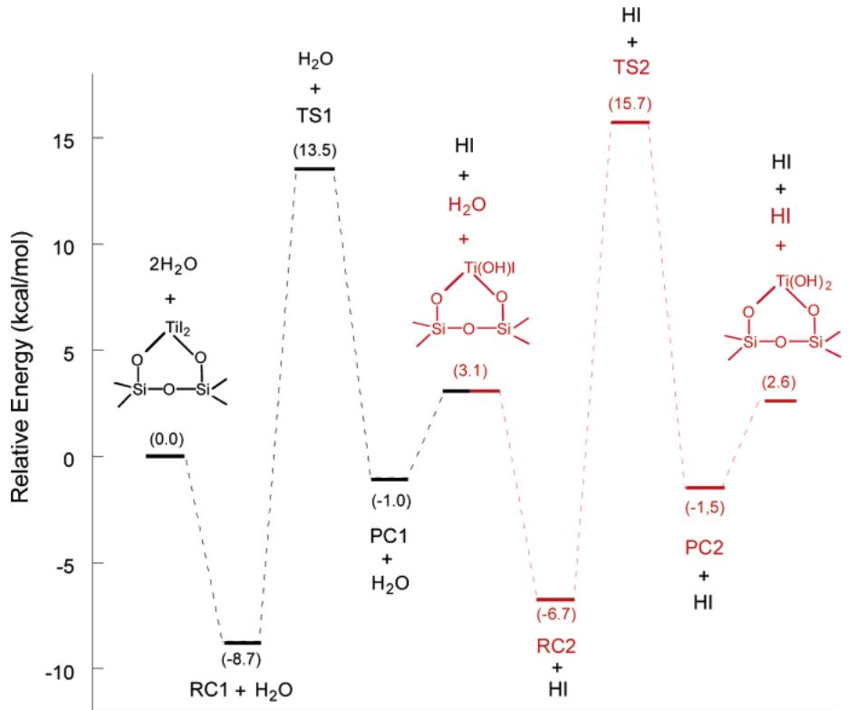  
Reaction CoordinatesFigure 11. ZPE-corrected PES for the two consecutive hydroxylation reactions on the surface  $-\mathrm{TiI}_3$  intermediate. The two hydroxylation reactions are denoted by different colors:  $\mathrm{RC} =$  reactant complex;  $\mathrm{TS} =$  transition state;  $\mathrm{PC} =$  product complex.

Table 6. Calculated Rate Constants for Reaction E  

<table><tr><td>T(K)</td><td>kST (s-1)</td><td>kSC-TST (s-1)</td></tr><tr><td>423.15</td><td>1.73 × 10-1</td><td>1.75 × 10-1</td></tr><tr><td>473.15</td><td>2.40 × 100</td><td>2.42 × 100</td></tr><tr><td>523.15</td><td>2.02 × 101</td><td>2.03 × 101</td></tr><tr><td>573.15</td><td>1.28 × 102</td><td>1.29 × 102</td></tr><tr><td>623.15</td><td>5.57 × 102</td><td>5.60 × 102</td></tr><tr><td>673.15</td><td>1.96 × 103</td><td>1.97 × 103</td></tr><tr><td>723.15</td><td>5.77 × 103</td><td>5.79 × 103</td></tr></table>

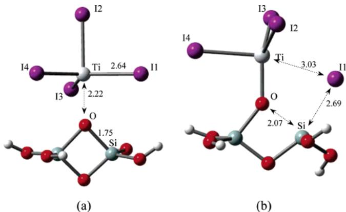  
Figure 12. Stationary points for reaction  $\mathrm{F}$  calculated using B3LYP/6-31G(d,p): (a) adsorption equilibrium state, (b) transition state. Distances are shown in angstroms.

of the reaction between  $\mathrm{TiI_4}$  and the oxygen bridges are 2 orders of magnitude smaller. However, oxygen bridges still exhibit high chemical reactivity toward  $\mathrm{TiI_4}$  precursors at temperatures between  $150^{\circ}\mathrm{C}$  and  $450^{\circ}\mathrm{C}$

3.4.2. Reaction of  $\mathbf{H}_2\mathbf{O}$  with Surface Iodine. When a vapor dose of the second precursor  $(\mathrm{H}_2\mathrm{O})$  is brought to the surface, both of the adjacent surface species  $(- \mathrm{TiI}_3$  and  $- \mathrm{I})$  produced by reaction  $\mathrm{F}$  can react with  $\mathrm{H}_2\mathrm{O}$ . As the reaction of  $\mathrm{H}_2\mathrm{O}$  with the  $- \mathrm{TiI}_3$  species has been described above, we restrict our discussion here to the reaction of  $\mathrm{H}_2\mathrm{O}$  with the surface iodine species, as shown below.

Table 7. Calculated Rate Constants for Reaction F  

<table><tr><td>T(K)</td><td>kST (s-1)</td><td>kSC-TST (s-1)</td></tr><tr><td>423.15</td><td>2.26 × 105</td><td>2.28 × 105</td></tr><tr><td>473.15</td><td>1.60 × 106</td><td>1.61 × 106</td></tr><tr><td>523.15</td><td>8.68 × 106</td><td>8.73 × 106</td></tr><tr><td>573.15</td><td>3.24 × 107</td><td>3.25 × 107</td></tr><tr><td>623.15</td><td>1.07 × 108</td><td>1.07 × 108</td></tr><tr><td>673.15</td><td>2.75 × 108</td><td>2.76 × 108</td></tr><tr><td>723.15</td><td>6.25 × 108</td><td>6.27 × 108</td></tr></table>

The ZPE- corrected PES for reaction  $\mathrm{G}$  is shown in Figure 13. The reaction pathway is initiated with the binding of  $\mathrm{H}_2\mathrm{O}$  to the surface through a configuration shown in Figure 13a.  $\mathrm{H}_2\mathrm{O}$  binds through the  $\mathrm{Ti} - \mathrm{O}1$  and  $\mathrm{H} - \mathrm{O}2$  interaction, where the  $\mathrm{Ti} - \mathrm{O}1$  distance is  $2.26\mathrm{\AA}$  and the  $\mathrm{H} - \mathrm{O}2$  distance is  $1.90\mathrm{\AA}$ , and the ZPE- including binding energy is  $5.8\mathrm{kcal / mol}$ . The adsorbed  $\mathrm{H}_2\mathrm{O}$  is capable of attacking the  $- \mathrm{TiI}_3$  species to release a  $\mathrm{HCl}$  via an atomic mechanism similar to that described above. An alternative reaction is the reaction of the adsorbed  $\mathrm{H}_2\mathrm{O}$  with the adjacent surface iodine species via a reaction pathway (Figure 13) which involves a metastable intermediate and two transition states. Starting from the initial adsorption state, the  $\mathrm{H}_2\mathrm{O}$  is able to adjust its direction so that the lone pair of the

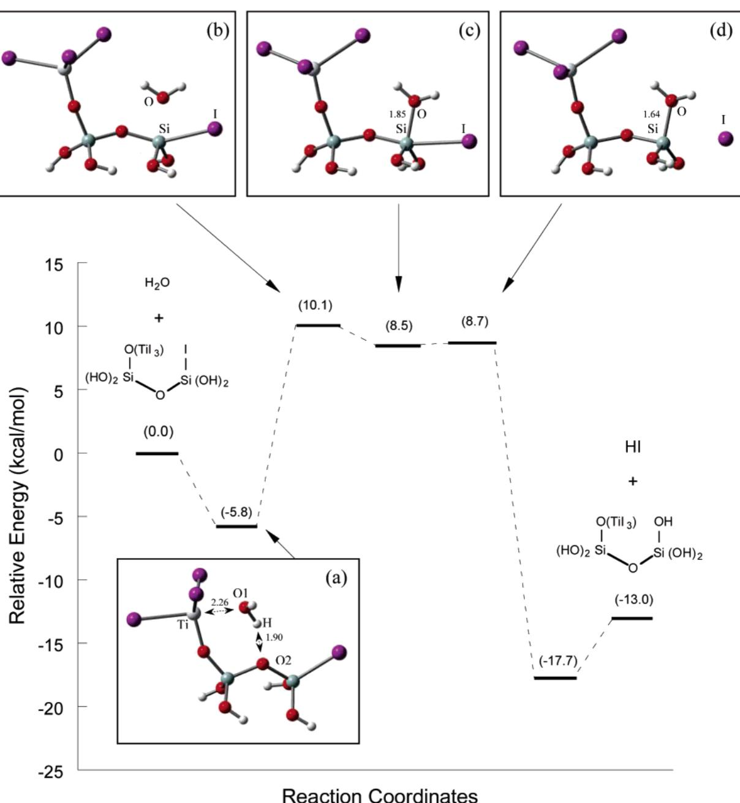  
Figure 13. ZPE-corrected PES for the reaction of  $\mathrm{TiI_4}$  with surface iodine species: (a) adsorption equilibrium state, (b) first transition state, (c) reaction intermediate, and (d) second transition state. Distances are shown in angstroms.

aqueous oxygen can directly attack the silicon attached to the iodine in a nucleophilic fashion. As shown in Figure 13,  $\mathrm{H}_2\mathrm{O}$  has to overcome a larger energy barrier  $(15.9\mathrm{kcal / mol})$  to attach to the surface Si site and reach the intermediate metastable state (Figure 13c). This larger barrier is related to the energy cost required to deform the cluster structure, which then leads to a high- energy intermediate. As  $\mathrm{H}_2\mathrm{O}$  approaches Si, the  $\mathrm{Si} - \mathrm{O}$  bond becomes stronger due to the donation of charge from the O lone pair to the empty levels of Si. Meanwhile, the cluster structure becomes distorted by swinging out the surface iodine. In the metastable intermediate, the  $\mathrm{Si} - \mathrm{O}$  distance is  $1.85\mathrm{\AA}$  which is much longer than that in the final product  $(1.64\mathrm{\AA})$ . This indicates that the overlap of the O lone pair orbitals and the accepting orbitals of Si is restricted due to steric hindrance, and hence, the  $\mathrm{Si} - \mathrm{O}$  bonding is weak. It turns out that the energy gained due to the bonding of  $\mathrm{H}_2\mathrm{O}$  to Si is smaller than the high- energy cost for the distortion of the cluster structure.

Therefore, the intermediate is  $8.5\mathrm{kcal / mol}$  higher in energy than the separated reactants. Release of HI from the intermediate is nearly a barrierless process, with a very small activation barrier of  $0.2\mathrm{kcal / mol}$ . The overall  $0\mathrm{K}$  reaction enthalpy of reaction G is  $- 13.0\mathrm{kcal / mol}$ .

The reaction of  $\mathrm{H}_2\mathrm{O}$  with surface iodine can be represented as a multistep reaction:

$$
\begin{array}{r}\mathbf{R}\quad \frac{\mathbf{k}_{\mathrm{f}}}{\mathbf{k}_{\mathrm{r}}}\quad \mathbf{M}\quad \frac{\mathbf{k}_{\mathrm{f}}^{*}}{\mathbf{k}_{\mathrm{r}}}\quad \mathbf{P} \end{array}
$$

where R is the reactant- like adsorbed complex (Figure 13a), M is the metastable intermediate (Figure 13c), and P is the product- like adsorbed complex. As the HI products are continuously removed from the reactor in the ALD process, the reverse reaction from P to M is neglected. A comparison of the

Table 8. Forward Rate Constants of the Rate-Limiting Step and the Overall Rate Constants for Reaction F  

<table><tr><td>T(K)</td><td>kSC-TST (s-1)</td><td>γ</td><td>kOverall (s-1)</td></tr><tr><td>423.15</td><td>8.74 × 104</td><td>0.72</td><td>6.30 × 104</td></tr><tr><td>473.15</td><td>6.16 × 105</td><td>0.65</td><td>4.03 × 105</td></tr><tr><td>523.15</td><td>3.02 × 106</td><td>0.64</td><td>1.93 × 106</td></tr><tr><td>573.15</td><td>1.23 × 107</td><td>0.59</td><td>7.22 × 106</td></tr><tr><td>623.15</td><td>3.74 × 107</td><td>0.56</td><td>2.10 × 107</td></tr><tr><td>673.15</td><td>1.04 × 108</td><td>0.52</td><td>5.39 × 107</td></tr><tr><td>723.15</td><td>2.20 × 108</td><td>0.50</td><td>1.10 × 108</td></tr></table>

activation barriers of the step reactions (Figure 13) shows that the consumption rate of the intermediate  $(k_{\mathrm{f}}^{*}$  and  $k_{\mathrm{r}}$  ) is orders of magnitude faster than the formation rate of the intermediate  $(k_{\mathrm{f}})$  . Therefore, we assume that there is no accumulation of the short- lived intermediate. On the basis of this assumption, the overall rate constants of reaction G from the adsorption state is calculated by

$$
k_{\mathrm{overall}} = \gamma \cdot k_{\mathrm{f}} \tag{10}
$$

where  $k_{\mathrm{f}}$  is the rate constant of the forward reaction from R to M and  $\gamma$  is the scale factor, which represents the probability of forward reaction from  $\mathbf{M}$  to  $\mathrm{P}$  and is given by

$$
\gamma = \frac{e^{-\Delta G^{*}\epsilon_{\mathrm{f}} / k_{\mathrm{B}}T}}{\mathrm{e}^{-\Delta G_{\mathrm{r}} / k_{\mathrm{B}}T} + \mathrm{e}^{-\Delta G^{*}\epsilon_{\mathrm{f}} / k_{\mathrm{B}}T}} \tag{11}
$$

where  $\Delta G_{\mathrm{f}}^{*}$  is the free energy activation barrier of the reaction from  $\mathbf{M}$  to  $\mathrm{P}$  and  $\Delta G_{\mathrm{r}}$  is the free energy activation barrier of the reaction from  $\mathbf{M}$  to  $\mathrm{R}$  . The rate constants,  $k_{\mathrm{f}}$  and  $k_{\mathrm{overall}}$  are listed in Table 8. As shown,  $\gamma$  decreases from 0.72 at  $150^{\circ}\mathrm{C}$  to 0.50 at  $450^{\circ}\mathrm{C}$  This indicates that the probability to form the final product  $\mathrm{P}$  from the intermediate M decreases as the temperature increases. The overall rate constants are 4 orders of magnitude larger than that of the reaction of  $\mathrm{H}_2\mathrm{O}$  with the  $- \mathrm{TiI}_3$  species, indicating that the surface iodine attached to Si has higher reactivity toward  $\mathrm{H}_2\mathrm{O}$  than the iodine attached to Ti.

3.5. Iodine Release Reaction. During the ALD of  $\mathrm{TiO_2}$  Aarik and co- workers32 observed that, after switching off the  $\mathrm{TiI_4}$  pulse, there is mass decrease  $(\Delta m_{\mathrm{p}})$  of the film, which is characterized in situ by a quartz crystal microbalance. The  $\Delta m_{\mathrm{p}}$  depended on the purge duration at high temperatures, but the mass increment per cycle  $(\Delta m_0)$  did not. Therefore, they attributed the  $\Delta m_{\mathrm{p}}$  to the release of iodine from surface intermediate species. To examine the possibility of the release of iodine at typical ALD temperatures, we investigated the following reaction.

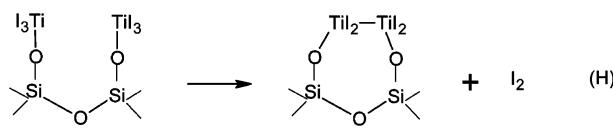

The ZPE- corrected PES and selected stationary point structures of reaction  $\mathrm{H}$  is shown in Figure 14. The two adjacent  $- \mathrm{TiI}_3$  species (Figure 14a) can attack each other to release an iodine molecule via the transition state shown in Figure 14b. In the transition state, the Ti1- Ti2 distance is reduced to 3.28

$\mathring{\mathrm{A}}$  where the Ti1- Ti2 bonding interaction is observed due to the overlap of the sd orbitals on the two Ti (Figure 15a). The Ti1- I2 bond has been broken at a distance of  $3.14\mathrm{\AA}$  whereas the Ti2- I4 bond has not yet been broken completely at a distance of  $2.80\mathrm{\AA}$  due to the partial overlap between the I p orbital and the Ti sd orbitals. The redistribution of electron density changes the coordination geometry of Ti from tetrahedron in the initial reactant state to trigonal bipyramid in the transition state. After passing through the transition state, I2 and I4 bond with each other to form an iodine molecule. Figure 14c presents the product- like adsorption equilibrium structure, where the structure is stabilized due to the increased overlap between I p orbitals and Ti sd orbitals (Figure 15b). All of the Ti- I bonds are longer in the product than in the reactant. This is attributed to the rehybridization of Ti, which decreases the electron density between the Ti and  $\mathrm{r}$  and hence, increases the distance between Ti atoms and I atoms (especially I1 and I6). The iodine release reaction is strongly endothermic by  $57.8\mathrm{kcal}/$  mol with a large activation barrier of  $61.9\mathrm{kcal / mol}$

The rate constants of the iodine release reaction were calculated at temperatures between 150 and  $450^{\circ}\mathrm{C}$  and only vibrational partition functions were used in the calculations. The calculated rate constants are listed in Table 9. Due to the large activation barrier, the rate constant of the iodine release reaction is very small and even at  $450^{\circ}\mathrm{C}$  is only on the order of  $10^{- 11}$ $\mathrm{s}^{- 1}$  . The extremely low rate suggests that the iodine release reaction cannot be used to explain the phenomena observed by Aarik and co- workers. Whereas the decomposition of the surface intermediate species is not a plausible explanation, we believe that the observed  $\Delta m_{\mathrm{p}}$  may be attributed to the following two possible factors.

One possibility is the release of HI by the reactions of intermediate species with the remaining unreacted hydroxyl groups on the surface. It is found that the aggregation of the  $\mathrm{TiO_2}$  film (prepared by ALD) increases with an increase of the growth temperature.33,34 The enhanced migration of intermediate species at high temperatures increases their ability to reach the unreacted hydroxyl groups and react with them to release HI. Therefore, at high temperatures, the diffusion- reaction mechanism can lead to  $\Delta m_{\mathrm{p}}$  observed after switching off the  $\mathrm{TiI_4}$  and explain the dependence of  $\Delta m_{\mathrm{p}}$  on the purge duration.

The second explanation involves the desorption of  $\mathrm{TiI_4}$  from the surface. At high coverage, the adsorption of the  $\mathrm{TiI_4}$  onto the surface is expected to be an activated adsorption, due to the lateral interactions between intermediate species and adsorbates. Although activated adsorption is not likely to occur at low temperatures, the probability can be increased by moderately increasing the temperature. Therefore, at elevated temperatures, the enhanced activated adsorption leads to the increase of the mass of the film during the  $\mathrm{TiI_4}$  dose, which has been observed by Aarik and co- workers.32 However, the  $\mathrm{TiI_4}$  absorbed through activated adsorption may not react further with the surface functional groups because of the large activation barrier due to steric hindrance. Therefore, after switching off the  $\mathrm{TiI_4}$  pulse, the adsorbed  $\mathrm{TiI_4}$  can desorb from the surface, leading to the mass decrease  $(\Delta m_{\mathrm{p}})$  of the thin film. This is consistent with the fact that, in practice, the deposition per cycle

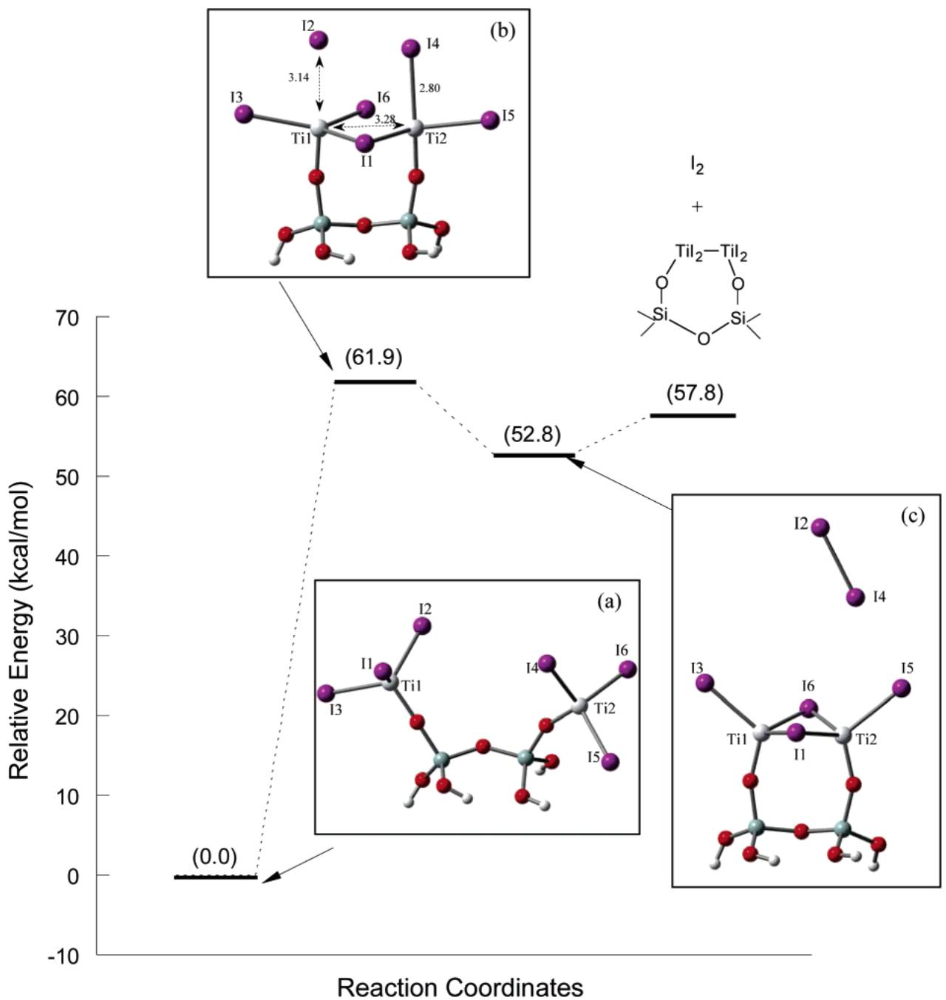  
Figure 14. ZPE-corrected PES for the iodine release reaction: (a) reactant, (b) transition state, and (c) product-like adsorption equilibrium state. Distances are shown in angstroms.

is usually half of a monolayer or less. As the desorption of the unreacted  $\mathrm{TiI_4}$  is also an activated process due to the lateral interactions, it cannot occur as fast as nonactivated physical desorption. Therefore, the  $\Delta m_{\mathrm{p}}$  is dependent on the purge duration. Moreover, the mass increment per cycle  $(\Delta m_0)$  is minimally affected because the adsorption only involves the  $\mathrm{TiI_4}$  not chemically bonded to the surface. Unfortunately, it is not computationally practical to use ab initio cluster calculations to test these two explanations. However, in future work, we plan to investigate the mechanisms described above using largerscale simulation models.

3.6. Comparison of the  $\mathrm{TiI_4}$  and  $\mathrm{TiCl_4}$  Precursors. The choice of precursors is a critical determinant of the success of an ALD process. The  $\mathrm{TiCl_4 / H_2O}$  precursor combination used in  $\mathrm{TiO_2}$  ALD has been modeled previously, so here, we compare the effect of these two metal precursors  $\mathrm{TiCl_4}$  and

$\mathrm{TiI_4}$  on ALD reaction energetics. To be consistent with the model chemistry used here, the energetics of ALD with the  $\mathrm{TiCl_4 / H_2O}$  precursors is calculated at  $\mathrm{MP2 / 6 - 311 + + G(2df,2p) / }$  B3LYP/6- 31G(d,p). The comparison of the ZPE- corrected PESs for the  $\mathrm{(SiH_3O)_3Si - OH^* + TiI_4}$  and  $\mathrm{(SiH_3O)_3Si - OH^* + TiCl_4}$  reactions is illustrated in Figure 16. It can be observed that the PES of the  $\mathrm{(SiH_3O)_3Si - OH^* + TiCl_4}$  reaction is much deeper than that of the  $\mathrm{(SiH_3O)_3Si - OH^* + TiI_4}$  reaction at the adsorption equilibrium structure and TS structure. This downward shift is due to the stronger interaction between the  $\mathrm{TiCl_4}$  and the  $- \mathrm{OH}$  group on the surface. Since the  $\mathrm{Cl}$  is more effective at withdrawing charge than  $\mathrm{I}$ ,  $\mathrm{Ti}$  in  $\mathrm{TiCl_4}$  shows better electron acceptor character, which results in stronger Lewis acid/base interactions between  $\mathrm{Ti}$  and  $\mathrm{O}$  and decreases the potential energy of the adsorption complex and the TS structure. As a result, the  $0\mathrm{K}$  heat of adsorption of  $\mathrm{TiCl_4}$ $(10.2\mathrm{kcal / mol})$  is

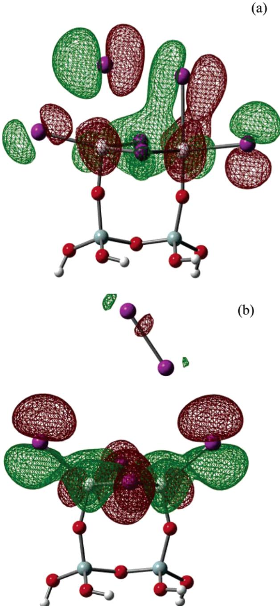  
Figure 15. HOMO orbitals of stationary points for the iodine release reaction: (a) transition state, (b) product-like adsorption equilibrium state.

Table 9. Calculated Rate Constants for Reaction H  

<table><tr><td>T(K)</td><td>kTST (s-1)</td><td>kSC-TST (s-1)</td></tr><tr><td>423.15</td><td>3.42 × 10-24</td><td>3.43 × 10-24</td></tr><tr><td>473.15</td><td>8.36 × 10-21</td><td>8.38 × 10-21</td></tr><tr><td>523.15</td><td>4.65 × 10-18</td><td>4.65 × 10-18</td></tr><tr><td>573.15</td><td>8.45 × 10-16</td><td>8.66 × 10-16</td></tr><tr><td>623.15</td><td>7.59 × 10-14</td><td>7.00 × 10-14</td></tr><tr><td>673.15</td><td>2.97 × 10-12</td><td>2.97 × 10-12</td></tr><tr><td>723.15</td><td>7.04 × 10-11</td><td>7.04 × 10-11</td></tr></table>

much larger than that of  $\mathrm{TiI_4}$ $(5.7\mathrm{kcal / mol})$  .As the Cl ligands stabilize both the reactant complex and the TS, the two reactions have almost identical activation barriers,  $13.5\mathrm{kcal / mol}$  for the  $\mathrm{(SiH_3O)_3Si - OH^* + TiI_4}$  reaction and  $13.7\mathrm{kcal / mol}$  for the  $\mathrm{(SiH_3O)_3Si - OH^* + TiCl_4}$  reaction. In addition, the  $\mathrm{(SiH_3O)_3}$

$\mathrm{Si - OH^* + TiI_4}$  reaction is more exothermic  $(9.4\mathrm{kcal / mol})$  than the  $\mathrm{(SiH_3O)_3Si - OH^* + TiCl_4}$  reaction  $(6.5\mathrm{kcal / mol})$

The calculated energetics for the initial surface reactions involved in ALD of  $\mathrm{TiO_2}$  using the  $\mathrm{TiI_4}$  precursor are presented in Table 10, where the energetics of the corresponding reactions using the  $\mathrm{TiCl_4}$  precursor are displayed in parentheses. As shown, all of the adsorption heats in the  $\mathrm{TiCl_4 / H_2O}$  ALD process are larger than that in the  $\mathrm{TiI_4 / H_2O}$  ALD process. The more charge- withdrawing Cl ligand attached to Ti increases the binding energies by enhancing the Lewis acid/base interactions between Ti and O. Substitution of  $\mathrm{TiCl_4}$  with  $\mathrm{TiI_4}$  as the precursor does not appreciably change the activation barriers. Therefore, the rates of reaction are predicted to be very similar for these two reaction systems, even though the  $\mathrm{Ti - Cl}$  bond is stronger than the  $\mathrm{Ti - I}$  bond. As the kinetics depend on the energy needed to reach the transition state, bond energies cannot be used to predict the kinetics of a reaction. For example, although the  $\mathrm{Ti - I}$  bond energy is smaller than the  $\mathrm{Ti - Cl}$  bond energy, the activation energy of the  $\mathrm{(SiH_3O)_3Si - O - TiI_3^* + H_2O}$  reaction is slightly larger than that of the  $\mathrm{(SiH_3O)_3Si - O - TiCl_3^* + H_2O}$  reaction, as shown in Table 10. A closer examination of the PESs of the two reactions shows that the larger activation barrier of the  $\mathrm{(SiH_3O)_3Si - O - TiI_3^* + H_2O}$  reaction is attributed to a later transition state compared to the  $\mathrm{(SiH_3O)_3Si - O - TiCl_3^* + H_2O}$  reaction. To reach the transition state, the  $\mathrm{Ti - I}$  distance is increased by  $1.05\mathrm{\AA}$  while the  $\mathrm{Ti - Cl}$  distance is increased by only  $0.64\mathrm{\AA}$ . Therefore, slightly more energy is required for the  $\mathrm{(SiH_3O)_3Si - O - TiI_3^* + H_2O}$  reaction to lengthen the  $\mathrm{Ti - I}$  bond to reach the transition state.

Although the difference in strengths between the  $\mathrm{Ti - I}$  and  $\mathrm{Ti - Cl}$  bonds did not change the kinetics appreciably, the thermodynamics of the reactions are influenced considerably. As shown in Table 10, the reactions in the  $\mathrm{TiI_4 / H_2O}$  ALD process are more exothermic than the reactions in the  $\mathrm{TiCl_4 / H_2O}$  ALD process. At ALD reaction conditions, a larger thermodynamic driving force suggests that reactions can proceed further toward completion and that the gas- phase products can be removed more completely. Therefore, the  $\mathrm{TiI_4}$  precursor tends to produce  $\mathrm{TiO_2}$  films with fewer impurities than the  $\mathrm{TiCl_4}$  precursor. For example, the  $\mathrm{SiO_2 - I^* + H_2O}$  reaction (reaction G) is much more exothermic  $(13.0\mathrm{kcal / mol})$  than the  $\mathrm{SiO_2 - Cl^* + H_2O}$  reaction  $(5.7\mathrm{kcal / mol})$ . The larger exothermicity suggests that surface iodine can be removed more completely than surface chlorine. This conclusion is consistent with the experiment by Schuisky and co- workers, which shows that  $\mathrm{TiO_2}$  films grown by ALD using  $\mathrm{TiI_4}$  as metal precursors are iodine free. In addition, the larger thermodynamic driving force allows lower deposition temperatures for  $\mathrm{TiI_4 / H_2O}$  ALD than for  $\mathrm{TiCl_4 / H_2O}$  ALD.

# 4. Conclusions

The initial surface reactions involved in ALD of  $\mathrm{TiO_2}$  from  $\mathrm{TiI_4}$  and  $\mathrm{H_2O}$  onto a  $\mathrm{SiO_2}$  substrate have been investigated using electronic structure calculations based on cluster models. The detailed atomic growth mechanisms on different types of functional groups of the  $\mathrm{SiO_2}$  substrate have been proposed. During the metal precursor pulse,  $\mathrm{TiI_4}$  can adsorb on different types of active sites and become chemically bonded to the

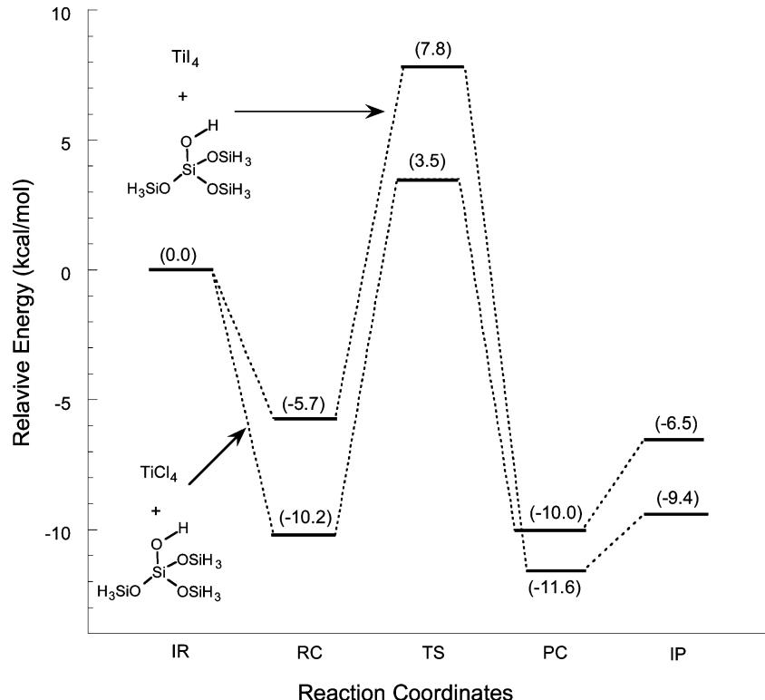  
Figure 16. ZPE-corrected PES for the  $\mathrm{(SiH_3O)_3Si - OH^* + Ti_4}$  and  $\mathrm{(SiH_3O)_3Si - OH^* + TiCl_4}$  reactions.  $\mathrm{IR} =$  isolated reactants;  $\mathrm{RC} =$  reactant-like adsorption complex;  $\mathrm{TS} =$  transition state;  $\mathrm{PC} =$  product-like adsorption complex;  $\mathrm{IP} =$  isolated products.

Table 10. Calculated Energetics for the Initial Surface Reactions Involved in ALD of  $T_{1}O_{2}^{a}$  

<table><tr><td></td><td>Qads(kcal/mol)</td><td>Eact(kcal/mol)</td><td>ΔH0(kcal/mol)</td></tr><tr><td>reaction A</td><td>5.7 (10.2)</td><td>12.5 (13.7)</td><td>-9.4 (-6.5)</td></tr><tr><td>reaction B</td><td>6.2 (8.4)</td><td>20.3 (19.1)</td><td>-0.2 (3.5)</td></tr><tr><td>reaction C</td><td>11.3 (18.6)</td><td>12.7 (15.1)</td><td>-8.0 (-3.5)</td></tr><tr><td>reaction D</td><td>-</td><td>14.7 (15.3)</td><td>-2.0 (4.9)</td></tr><tr><td>reaction E</td><td>8.7 (9.1)</td><td>22.2 (19.3)</td><td>3.1 (3.9)</td></tr><tr><td>reaction F</td><td>9.2 (14.6)</td><td>15.7 (13.0)</td><td>-23.3 (-27.9)</td></tr><tr><td>reaction G</td><td>5.8 (7.6)</td><td>15.9 (17.5)</td><td>-13.0 (-5.7)</td></tr></table>

Values not in parentheses are for  $\mathrm{TiI_4 / H_2O}$  ALD reactions and values in parentheses are for  $\mathrm{aTiCl_4 / H_2O}$  ALD reactions.

surface via different exchange reactions. For example,  $\mathrm{TiI_4}$  can react with isolated hydroxyl groups to form a  $- \mathrm{TiI}_3$  species or react with adjacent hydroxyl groups to form a  $- \mathrm{TiI}_2$  species. In addition,  $\mathrm{TiI_4}$  can react with oxygen bridges to form adjacent  $- \mathrm{TiI}_3$  and  $- \mathrm{I}$  species on the surface. Our calculations show that all of the investigated initial reactions have large rate constants at temperatures between 150 and  $450^{\circ}\mathrm{C}$  which indicates that all of the three surface functionalities exhibit high chemical reactivity toward  $\mathrm{TiI_4}$  precursors at typical ALD temperatures.

When  $\mathrm{H}_2\mathrm{O}$  is introduced onto the surface during the second half- cycle, it can react with any of the intermediate species deposited during the  $\mathrm{TiI_4}$  pulse. The  $- \mathrm{TiI}_3$  intermediate species can react with three consecutive  $\mathrm{H}_2\mathrm{O}$  molecules to form a  $- \mathrm{Ti}(\mathrm{OH})_3$  species on the surface. Similarly,  $\mathrm{H}_2\mathrm{O}$  can continuously react with the  $- \mathrm{TiI}_2$  intermediate to form a surface  $- \mathrm{Ti(OH)}_2$  group. The rate constants of these reactions are  $5 - 8$  orders of magnitude smaller than the first half- reactions between  $\mathrm{TiI_4}$  and surface functionalities. These results suggest that the recovery of the hydroxyl groups on the Ti- including intermediates by reacting with  $\mathrm{H}_2\mathrm{O}$  is much slower than the deposition of metal precursors onto the surface. We have also investigated the reaction of  $\mathrm{H}_2\mathrm{O}$  with the surface iodine species attached to Si. This reaction removes the surface iodine and yields a surface hydroxyl group via a mechanism which involves a metastable intermediate and two transition states. The reaction of  $\mathrm{H}_2\mathrm{O}$  with the surface iodine attached to Si is much faster than with the Ti- including intermediates, based on the rate constants calculated. This result suggests that the surface iodine attached to Si will not be a major source of iodine impurity in the  $\mathrm{TiO_2}$  thin film. In addition, the atomic mechanism of iodine release from the intermediate species has been investigated. The release of an iodine molecule from the two adjacent Ti- including intermediates was found to be kinetically and thermodynamically unfavorable. On the basis of the extremely low rate constants, the iodine release reaction is predicted to be very unlikely to occur at typical ALD temperatures.

The effects of quantum tunneling and hindered rotations of adsorbates on the rate of surface reactions have been investigated. The effects of tunneling were found to be negligible for all reactions at typical ALD temperatures range from 150 to  $450^{\circ}\mathrm{C}$ . However, the hindered rotational contributions of adsorbed  $\mathrm{H}_2\mathrm{O}$  to the rate constants must be taken into account due to the small rotational potential energy barrier.

Comparison of  $\mathrm{TiI_4}$  and  $\mathrm{TiCl_4}$  shows that the more charge- withdrawing Cl ligands can increase the binding energies of the absorbates onto the surface. Although the activation barriers of the initial surface reactions are very similar for  $\mathrm{TiI_4 / H_2O}$  and  $\mathrm{TiCl_4 / H_2O}$  ALD reacting systems, the reactions in the  $\mathrm{TiI_4 / H_2O}$  ALD process are more exothermic than the reactions in the  $\mathrm{TiCl_4 / H_2O}$  ALD process, which suggests that the  $\mathrm{TiI_4}$  precursor tends to produce  $\mathrm{TiO_2}$  films with fewer impurities than the  $\mathrm{TiCl_4}$  precursor due to the larger thermodynamic driving force.

It is important that our kinetic results be interpreted with an understanding of the complexity of the whole picture of ALD dynamics, which involves adsorption, desorption, surface diffusion, surface reaction and structural relaxation. For a multistep Langmuir- Hinshelwood reaction, the rate- determining step (RDS) can be any one of the events (adsorption, desorption, surface diffusion, or surface reaction) depending upon reaction conditions. In this work, we examined the rates of the surface reaction steps, which are important for identifying the RDS and understanding the overall dynamics. At high pressure and low temperature, the deposition of the precursors onto the surface is limited by a fast adsorption- desorption equilibrium followed by slow surface reactions. In this situation, the surface reaction is the RDS and the rate constants of the surface reactions can be used as an indication of the rate of the overall dynamics. At low pressure and high temperature, however, surface reaction and desorption are very fast and adsorption becomes the RDS. At the reaction conditions in which adsorption is the RDS, using precursors with large binding energies on the surface may speed up the rate of deposition due to the faster adsorption rate, for example, the  $\mathrm{TiCl_4 / H_2O}$  ALD process is predicted to be faster than the  $\mathrm{TiI_4 / H_2O}$  ALD process at low pressure and high temperature. It is also important that our kinetic results be interpreted within the context of low coverage. At high coverage, the lateral interactions of the surface species may change the energetics or even the mechanisms of the reactions. The more complicated dynamic mechanisms at high coverage exceed the capabilities of cluster- based ab initio calculations. In the future, we plan to study coverage dependence using periodic DFT calculations based on tight- binding techniques and force- field simulations.

Acknowledgment. We thank Prof. Tonya Klein for helpful discussions of the experimental systems, and the University of Alabama Graduate Council Fellowship for financial support. The computing resources of work were partially supported by the NSF Teragrid (Project number: TG- CTS060011T) and the Alabama Supercomputer Center.

Supporting Information Available: Complete ref 17. Computational details for the reaction energetics and for the analysis of the cluster size effects. This material is available free of charge via the Internet at http://pubs.acs.org.

JA066529Z