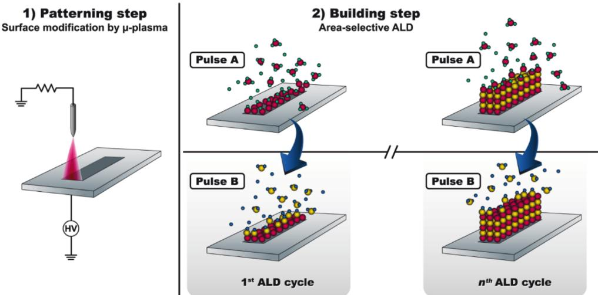
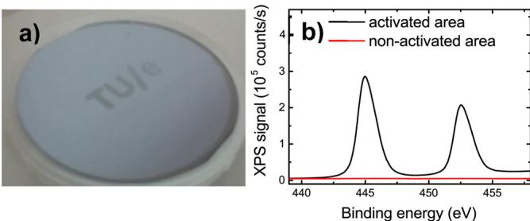
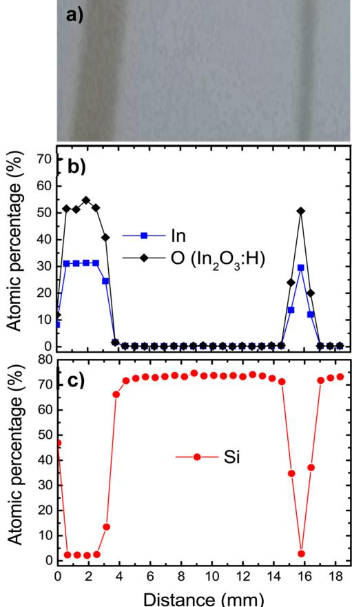
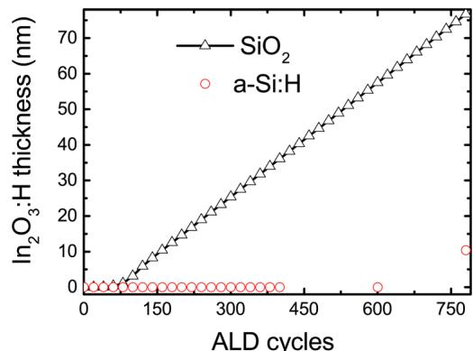
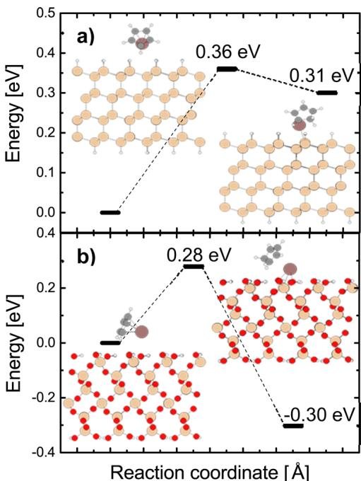
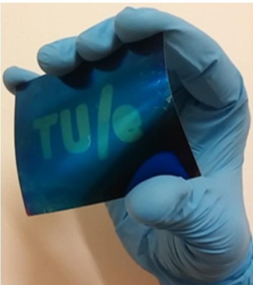

# Area-Selective Atomic Layer Deposition of  $\ln_2O_3:H$  Using a  $\mu$ -Plasma Printer for Local Area Activation

Alfredo Mameli,\*† Yinghuan Kuang,† Morteza Aghaee,† Chaitanya K. Ande,† Bora Karasulu,† Mariadriana Creatore,† Adriaan J. M. Mackus,† Wilhelmus M. M. Kessels,† and Fred Roozeboom†,‡

†Department of Applied Physics, Eindhoven University of Technology, PO Box 513, 5600 MB Eindhoven, The Netherlands ‡Department Thin Film Technology, TNO, High Tech Campus 21, 5656 AE Eindhoven, The Netherlands

# $\circledcirc$  Supporting Information

E lectronic device fabrication generally requires several lithographic steps to obtain well- aligned features. This is becoming ever more challenging in the semiconductor industry as feature dimensions of state- of- the- art devices keep shrinking.1- 4 It is, however, not only the semiconductor industry that faces such challenges. Some of the challenges in patterning for nanoelectronics share common ground with those of microscale patterning as used in large- area electronics. Furthermore, removing material by etching can be detrimental in terms of materials damage and contamination. Moreover, for large- area electronics cost per unit and throughput considerations also limit the use of expensive and iterative "litho- etch" steps. This holds, for example, for patterned transparent conductive oxides (TCOs),6- 8 TCO films are ubiquitous in many devices such as displays,9- 12 solar cells,13 and solid state lighting and sensors,78 including those based on emerging organic light- emitting devices (OLEDs)14 and on halide perovskite materials. To date, methods used for patterning TCOs such as such as rapid laser patterning15 often have limited uniformity and resolution or suffer from material degradation during the etch processes. Furthermore, more than six steps are typically required to fabricate patterned TCOs.6- 8,16 Hence, several applications that require millimeter and submillimeter patterned TCO films would benefit from the availability of alternative patterning methods.9- 12

Area- selective atomic layer deposition (AS- ALD) has emerged as a promising solution to push device manufacturing toward new frontiers. Significant efforts, in academia and industry, are currently devoted toward the development of AS- ALD techniques that can be incorporated within existing fabrication schemes. To date, most of these efforts have been inspired by the need to prepare nanoscale features in the semiconductor industry as an alternative or a possible solution for extremely complex lithography schemes. Although the number of viable methods is still very limited, the approaches for achieving AS- ALD can be categorized as (1) area deactivation, in which a part of the surface is rendered inert toward a specific ALD process, and (2) area activation, where conversely, an inert surface is locally activated for a specific type of ALD chemistry.17- 19 A prototype example of the first case is area deactivation of a surface by blocking it with self- assembled monolayers.2,20,21 A particular case of the latter approach is the direct activation of a surface region without any subtractive steps. This can be referred to as direct- write ALD,2,18,22 and it enables patterning and ALD to be combined into a truly bottom- up process drastically reducing the number of required fabrication steps. One embodiment of direct- write ALD was developed by Mackus et al. by exploiting the catalytic activity of a Pt seed layer grown locally using electron beam induced deposition (EBID). After EBID, ALD was applied for selectively thickening the Pt seed layers into high- quality Pt nanostructures.2,18,22

In this work, we present a novel method for AS- ALD which targets the preparation of microscale features relevant in large- area electronics. It is a direct- write ALD process of  $\mathrm{In}_2\mathrm{O}_3{:}\mathrm{H}$ , a highly promising and relevant TCO material,23 which makes use of printing technology for surface activation. As schematically depicted in Figure 1, first the surface of H- terminated silicon materials is locally activated by a  $\mu$ - plasma printer in air or  $\mathrm{O}_2$ ,24 and subsequently  $\mathrm{In}_2\mathrm{O}_3{:}\mathrm{H}$  is deposited selectively on the activated areas. The selectivity stems from the fact that ALD  $\mathrm{In}_2\mathrm{O}_3{:}\mathrm{H}$  leads to very long nucleation delays on H- terminated silicon materials.25 In this work it is demonstrated that this method allows for preparing microscale  $\mathrm{In}_2\mathrm{O}_3{:}\mathrm{H}$  features in a true bottom- up approach on surfaces of H- terminated  $\mathrm{Si}(100)$ , a  $\mathrm{Si:H}$  or a  $\mathrm{a - SiN_x{:}H}$  with the  $\mathrm{In}_2\mathrm{O}_3{:}\mathrm{H}$  material quality being as high as for blanket films.26 This novel approach for direct- write ALD of  $\mathrm{In}_2\mathrm{O}_3{:}\mathrm{H}$  holds therefore potential for applications in large- area electronics which make use of patterned TCOs such as displays and solar cells.

For the experiments an Oxford Instruments Opal ALD reactor was used to deposit the  $\mathrm{In}_2\mathrm{O}_3{:}\mathrm{H}$  films. Indium cyclopentadienyl  $(\mathrm{InCp})$  served as indium precursor and a mixture of  $\mathrm{H}_2\mathrm{O}$  and  $\mathrm{O}_2$  as coreactants.27 A standard recipe was employed as detailed elsewhere.23,27

The reactor pressure was  $\sim 150$  mTorr throughout the cycle with a pressure spike of  $\sim 200$  mTorr during the  $20\mathrm{ms}\mathrm{H}_2\mathrm{O}$  dose. All samples prepared in this study were deposited at  $100^{\circ}\mathrm{C}$ .

Films of a- Si:H and a-  $\mathrm{SiN_x{:}H}$  on p- type  $\mathrm{Si}(100)$  served as substrates. These  $10\mathrm{nm}$  thick films were prepared by inductively coupled plasma chemical vapor deposition (ICP- CVD) from  $\mathrm{SiH_4}$  and Ar at  $50^{\circ}\mathrm{C}$  and from  $\mathrm{SiH_4}$  and  $\mathrm{NH}_3$  at  $80^{\circ}\mathrm{C}$  for a- Si:H and a-  $\mathrm{SiN_x{:}H}$ , respectively. Alternatively, H- terminated  $\mathrm{Si}(100)$  was prepared by dipping the wafer in diluted (1 vol %) hydrofluoric acid (HF) for  $2 - 3\mathrm{min}$ .28 Furthermore, a  $400\mu \mathrm{m}$  thick stainless steel foil with  $20\mathrm{nm}$  of a- Si:H on top was used as a flexible substrate.

After preparation, the surfaces were locally activated by a  $\mu$ - plasma printer developed by the company InnoPhysics. The

  
Figure 1. Schematic representation of the area-selective ALD process of  $\mathrm{In}_2\mathrm{O}_3{:}\mathrm{H}$  on H-terminated silicon materials. In the first step (1), microscale patterns are defined by activating the surface with a  $\mu$  plasma operated in air or  $\mathrm{O}_2$ . In the second step (2), the  $\mathrm{In}_2\mathrm{O}_3{:}\mathrm{H}$  is deposited selectively on the activated areas in a building step. The ALD process consists of two alternating half reactions:  $\mathrm{InCp}$  precursor dosing in pulse A and a mixture of  $\mathrm{O}_2$  and  $\mathrm{H}_2\mathrm{O}$  dosing in pulse B. Note that in the case that conductive substrates are used, a thin dielectric membrane  $(\mathrm{Al}_2\mathrm{O}_3)$  is positioned between the needles and the substrate, as shown in Figure S1a.

print- head of this  $\mu$  - plasma printer consists of actuated needle electrodes in a multi needle- to- plate dielectric barrier discharge configuration.24 It allows varying the patterning width by setting the number of actuated needles and achieving high throughput  $(1\mathrm{cm}^2$  in less than 5 s). For this study air and  $\mathrm{O}_2$  plasmas at atmospheric pressure were used to locally activate the surface of the silicon based materials.

By carrying out the sequence of local plasma activation and the ALD cycles as illustrated in Figure 1, the area- selective deposition was demonstrated for a macroscopic pattern on a large area. Figure 2a shows a 4- in. wafer covered with  $10\mathrm{nm}$  a- Si:H onto which a patterned film was prepared by  $\mu$  - plasma printing and 400 ALD cycles. This resulted in  $\sim 35 \mathrm{nm}$  thick  $\mathrm{In}_2\mathrm{O}_3{:}\mathrm{H}$  locally deposited as measured by ex situ spectroscopic ellipsometry (SE) at two different angles (65 and  $75^{\circ}$ , using an M- 2000D system from J. Woollam Co. with photon energy range of 1.2 to  $6.5\mathrm{eV}$ ). The selectivity of the process was confirmed by XPS measurements using a Thermo Scientific K- Alpha system probing distinctive points inside and outside the patterned area. The In  $3\mathrm{d}_{3 / 2}$  and In  $3\mathrm{d}_{5 / 2}$  signals for two of such points are shown in Figure 2b. High signals were collected on the patterned area whereas a negligible signal was measured outside the pattern. This demonstrates the excellent selectivity reached, even after 400 ALD cycles. This finding was substantiated by  $I - V$  measurements within and between the different letters of Figure 2a (see Supporting Information, Figure S3).

  
Figure 2. (a) Photograph of a 4-in. Si(100) wafer covered with  $10\mathrm{nm}$  of a-Si:H with the letters  $\mathrm{^{\circ}TU / e^{\circ}}$  prepared using the direct-write ALD process of  $\mathrm{In}_2\mathrm{O}_3{:}\mathrm{H}$ . The number of ALD cycles was 400 and the thickness of the  $\mathrm{In}_2\mathrm{O}_3{:}\mathrm{H}$  was  $\sim 35 \mathrm{nm}$ . (b) XPS signals for the  $\mathrm{In}3\mathrm{d}_{5 / 2}$  and In  $3\mathrm{d}_{3 / 2}$  binding energy measured for two distinctive points inside (black) and outside (red) the patterned area.

The patterning capabilities of the  $\mu$  - plasma printer were subsequently investigated using three active needle combinations to pattern lines which were 3.0, 0.8, and  $0.6\mathrm{mm}$  in width. This is done by actuating 12, 4, and 3 needles, respectively, yielding the result in Figure 3a. All three patterns are shown in Figure S1b in the Supporting Information. The material at the surface was probed by XPS through line scans across the 3.0 and  $0.8\mathrm{mm}$  wide lines. The XPS spot size was  $400\mu \mathrm{m}$ , and the distance between successive sampling points was  $600\mu \mathrm{m}$ . For clarity, only the atomic percentages of In and O bonded to In (Figure 3b) and Si (Figure 3c) are reported. The complete XPS data, together with the results on a  $\mathrm{SiN}_2{:}\mathrm{H}$ , are shown in Figure S2 of the Supporting Information. The XPS line scans reproduce the patterns in Figure 3a as atomic percentages of In and O, while the Si atomic percentage was observed to be complementary to the  $\mathrm{In}_2\mathrm{O}_3{:}\mathrm{H}$  signals. The In atomic percentage decreased from a maximum of  $\sim 30\%$  inside the pattern area toward  $0\%$  in between the patterns, again demonstrating the high selectivity of the ALD process. The result also demonstrates the capability of the  $\mu$  - plasma printer to pattern microscale features on a large area substrate. The smallest achievable feature size is  $\sim 200\mu \mathrm{m}$  with the current version of  $\mu$  - plasma printer, and this can be achieved by actuating one needle (see Supporting Information).

It was also verified that the area- selective processing does not affect the material properties as compared to full blanket films. The resistivity of the  $\mathrm{In}_2\mathrm{O}_3{:}\mathrm{H}$  patterns was measured using a four- point probe station on  $3\mathrm{mm}$  wide patterns. In this case the patterns were prepared on a wafer with  $450 \mathrm{nm}$  thick thermal  $\mathrm{SiO}_2$  and  $10\mathrm{nm}$  a- Si:H. The  $\mathrm{In}_2\mathrm{O}_3{:}\mathrm{H}$  prepared by the direct- write ALD process had a resistivity of  $0.59\mathrm{m}\Omega \cdot \mathrm{cm}$ , which corresponds well with results obtained for blanket films. In addition the microstructure of the films probed by cross- sectional SEM was found to be comparable to what obtained for blanket films (Figure S4).

As mentioned at the beginning of this communication, the selectivity of the  $\mathrm{In}_2\mathrm{O}_3{:}\mathrm{H}$  ALD process is stemming from the fact that very long nucleation delays are obtained on H- terminated

  
Figure 3. (a) Photograph of  $\mathrm{In}_2\mathrm{O}_3\cdot \mathrm{H}$  lines being 3.0 and  $0.8\mathrm{mm}$  wide as prepared by the direct-write ALD process with 400 cycles. XPS line scans for the patterns depicted in (a) showing the atomic percentages related to (b)  $\mathrm{In}_2\mathrm{O}_3$  (In  $3\mathrm{d}_5$ $\mathrm{I}_2$  and O 1s) and (c) the Si substrate (Si 2p).

surfaces of silicon materials whereas the nucleation delay on oxide surfaces is considerably shorter as shown in Figure 4.25 To elucidate the role of the surface groups during ALD of  $\mathrm{In}_2\mathrm{O}_3\cdot \mathrm{H}$ , first- principle calculations have been carried out using density functional theory (DFT)29,30 with the Perdew- Burke- Ernzerhof (PBE) exchange correlation functional.31,32 van der Waals interactions were also accounted for on an empirical basis.33 Additional computational details can be found in the

  
Figure 4. Film thickness measured by in situ SE as a function of the  $\mathrm{In}_2\mathrm{O}_3\cdot \mathrm{H}$  ALD cycles on  $\mathrm{SiO}_2$  open triangles) and on a-Si:H (open circles). Ex situ SE measurements were taken only for 600 and 780 ALD cycles on a-Si:H. Above 600 ALD cycles the selectivity of the process appears to degrade.

Supporting Information Section 1.4. The structures and associated relative energies have been calculated for the stationary points along the anticipated reaction pathways for the chemisorption of the InCp precursor and proton transfer from the substrate to the Cp ligand of the precursor. This was done for (1) hydrogenated silicon and (2) hydroxylated silicon oxide surfaces, as these are expected to represent the H- terminated and plasma activated surfaces to a good approximation. The reactions considered are therefore

$$
\mathrm{Si - H^{*} + InCp\rightarrow Si - In^{*} + HCp} \tag{1}
$$

$$
\mathrm{Si - OH^{*} + InCp\rightarrow Si - O - In^{*} + HCp} \tag{2}
$$

where the asterisks indicate the surface species involved in the reactions.

Figure 5 shows the corresponding energies obtained by the DFT calculations. The results reveal that Reaction 1 is endothermic and requires an energy input of  $0.31\mathrm{eV}$  to proceed, with associated activation energy of  $0.36\mathrm{eV}$ . For Reaction 2, the activation energy of  $0.28\mathrm{eV}$  is slightly lower, and in contrast to Reaction 1, the overall process is exothermic.

  
Figure 5. Energy profiles computed by DFT method (PBE-D3) for the chemisorption of InCp on (a) hydrogenated silicon (Si-H termination) and (b) on hydroxylated silicon oxide (Si-OH termination).

Based on the Arrhenius equation, assuming the prefactor is similar in magnitude for both surface reactions, this difference in activation energies translates into an  $\sim 13$ - fold higher rate for Reaction 2 in comparison to Reaction 1 at the ALD temperature of  $100^{\circ}\mathrm{C}$ . Moreover, the proton transfer reaction for Reaction 2 is exothermic and releases energy  $(0.30\mathrm{eV})$ . By contrast, Reaction 1 requires an energy intake of  $0.31\mathrm{eV}$  to take place, such that Reaction 2 likely proceeds with a much higher probability.34

The predicted reaction energies therefore point to the thermodynamically favored nature of InCp binding on the hydroxylated  $\mathrm{SiO}_2$  surface as opposed to the H- terminated silicon. This can explain the high selectivity that can be reached

for the area- selective ALD process of  $\mathrm{In}_2\mathrm{O}_3{:}\mathrm{H}$  on activated and nonactivated surfaces of H- terminated silicon materials.

In conclusion, a novel direct- write ALD process has been demonstrated for  $\mathrm{In}_2\mathrm{O}_3{:}\mathrm{H}_3$  a highly relevant TCO material. By combining local activation of H- terminated surfaces of silicon materials by a  $\mu$  - plasma printer and AS- ALD of  $\mathrm{In}_2\mathrm{O}_3{:}\mathrm{H}_3$  microscale patterns can be generated in a true bottom- up process. Excellent selectivity and low resistivity of the  $\mathrm{In}_2\mathrm{O}_3{:}\mathrm{H}$  were demonstrated. The method therefore provides bright prospects for large- area applications because both the  $\mu$  - plasma printing and the AS- ALD process are scalable. Large- area applications employing flexible substrates such as OLED displays and flexible photovoltaics are of particular interest due to the current trend toward printing technology and roll- to- roll ALD processes.35- 37 Therefore, as a first demonstrator, the direct- write ALD process was employed on a flexible stainless steel foil with  $20 \mathrm{nm}$  thick a- Si:H as is shown in Figure 6. Transferring the technology to printing on flexible substrates combined with spatial ALD processes will be the next steps. Also the extension of the process to other substrate materials and ALD materials systems will be considered. Other ALD precursors that undergo similar surface reactions can possibly also be used to develop area- selective ALD in a few cases.28,34,38 Finally, we note that preliminary investigations using a focused electron beam have yielded promising results with respect to the extension of the current direct- write ALD process of  $\mathrm{In}_2\mathrm{O}_3{:}\mathrm{H}$  toward nanoscale dimensions.

  
Figure 6. Pattern prepared by direct-write ALD of a  $35~\mathrm{nm}$  thick  $\mathrm{In}_2\mathrm{O}_3{:}\mathrm{H}$  film on a flexible stainless steel foil covered with  $20~\mathrm{nm}$  of a-Si:H. This serves as a first demonstrator of the capability of the direct-write ALD process for large-area and flexible electronics.

# ASSOCIATED CONTENT

# 3 Supporting Information

The Supporting Information is available free of charge on the ACS Publications website at DOI: 10.1021/acs.chemma- ter.6b04469.

$\mu$  - plasma printer details, XPS line scans and  $I - V$  measurements, SEM images, and computational methods (PDF)

# AUTHOR INFORMATION

Corresponding Author \*A.Mameli.E- mail: a.mameli@tue.nl.

# ORCID

Alfredo Mameli: 0000- 0001- 9175- 8965

# Author Contributions

All authors have given approval to the final version of the manuscript.

# Notes

The authors declare no competing financial interest.

# ACKNOWLEDGMENTS

The authors thank Dr. Valerio Zardetto for his skillful help with XPS measurements and their interpretation, Tahsin Faraz for critical discussions, Cristian van Helvort and Jeroen van Gerwen for their technical assistance, and Alquin Stevens (Innophysics) for the use of the  $\mu$  - plasma printer. The Dutch TNO organization is acknowledged for partially supporting this work.

# REFERENCES

(1) Hua, Y.; King, W. P.; Henderson, C. L. Nanopatterning Materials Using Area Selective Atomic Layer Deposition in Conjunction with Thermochemical Surface Modification via Heated AFM Cantilever Probe Lithography. Microelectron. Eng. 2008, 85, 934-936. 
(2) Mackus, A. J. M.; Bol, A. A.; Kessels, W. M. M. The Use of Atomic Layer Deposition in Advanced Nanopatterning. Nanoscale 2014, 6, 10941-10960. 
(3) Kim, W.; Lee, H.; Heo, K.; Lee, K.; Chung, T.; Kim, G.; Hong, S.; Heo, J.; Kim, H. Atomic Layer Deposition of Ni Thin Films and Application to Area Selective Deposition. J. Electrochem. Soc. 2011, 150, D1-D5. 
(4) Kim, W.-H.; Minaye Hashemi, F. S.; Mackus, A. J. M.; Singh, J.; Kim, Y.; Bobb-Semple, D.; Fan, Y.; Kaufman-Osborn, T.; Godet, L.; Bent, S. F. A Process for Topographically Selective Deposition on 3D Nanostructures by Ion Implantation. ACS Nano 2016, 10, 4451-4458. 
(5) Sinha, A.; Hess, D. W.; Henderson, C. L. Area-Selective ALD of Titanium Dioxide Using Lithographically Defined Poly(methyl Methacrylate) Films. J. Electrochem. Soc. 2006, 153, G465-G469. 
(6) Jeong, H. S.; Jeon, H.-J.; Kim, Y. H.; Oh, M. B.; Kumar, P.; Kang, S. W.; Jung, H.-T. Bifunctional ITO Layer with a High Resolution, Surface Nano-Pattern for Alignment and Switching of LCs in Device Applications. NPG Asia Mater. 2012, 4, e7. 
(7) Tandon, N.; Marsano, A.; Maidhof, R.; Numata, K.; Montouri-Sorrentino, C.; Cannizzaro, C.; Voldman, J.; Vunjak-Novakovic, G. Surface-Patterned Electrode Bioreactor for Electrical Stimulation. Lab Chip 2010, 10, 692-700. 
(8) Kim, S. H.; Yamamoto, T.; Fourmy, D.; Fujii, T. Electroactive Microwell Arrays for Highly Efficient Single-Cell Trapping and Analysis. Small 2011, 7, 3239-3247. 
(9) Xiao, S.; Fernandes, S. A.; Ostendorf, A. Selective Patterning of ITO on Flexible PET Substrate by 1064nm Picosecond Laser. Phys. Procedia 2011, 12, 125-132. 
(10) Breen, T. L.; Fryer, P. M.; Nunes, R. W.; Rothwell, M. E. Patterning Indium Tin Oxide and Indium Zinc Oxide Using Microcontact Printing and Wet Etching. Langmuir 2002, 18, 194-197. 
(11) Chae, J.; Jang, L.; Jain, K. High-Resolution, Resistive Patterning of Indium-Tin-Oxide Thin Films Using Excimer Laser Projection Annealing Process. Mater. Lett. 2010, 64, 948-950. 
(12) Choi, H. W.; Farson, D. F.; Bovatsiek, J.; Arai, a; Ashkenasi, D. Direct Write Patterning of Indium-Tin-Oxide Film by High Pulse Repetition Frequency Femtosecond Laser Ablation. Appl. Opt. 2007, 46, 5792-5799. 
(13) Pang, C.; Hwang, J.; Park, K.; Jung, D.; Kim, H.; Chae, H. Efficiency Enhancement of Polymer Solar Cells. J. Nanosci. Nanotechnol. 2008, 8, 5279-5283.

(14) Wang, J.; Li, W.; Wang, C. Improving Light Outcoupling Efficiency for OLEDs with Microlens Array Fabricated on Transparent Substrate. J. Nanomater. 2014, 2014, 289752.  
(15) Chae, J.; Appasamy, S.; Jain, K. Patterning of Indium Tin Oxide by Projection Photoablation and Lift-off Process for Fabrication of Flat-Panel Displays. Appl. Phys. Lett. 2007, 90, 261102.  
(16) Harrison, P. M.; Wendland, J.; Henry, M. Innovative Laser Patterning of Black Matrix for LCD Manufacture. Dig. Tech. Pap. - Soc. Inf. Disp. Int. Symp. 2008, 39, 736-739.  
(17) Faraz, T.; Roozeboom, P.; Knoops, H. C. M.; Kessels, W. M. M. Atomic Layer Etching: What Can We Learn from Atomic Layer Deposition? ECS J. Solid State Sci. Technol. 2015, 4, N5023-N5032.  
(18) Mackus, A. J. M.; Dieissen, S. A. F.; Mulders, J. J. L.; Kessels, W. M. M. Nanoscale Nanopatterning by Direct wnteratomic Layer Deposition. Nanoscale 2012, 4, 4477-4480.  
(19) Firm, E.; Lindroos, S.; Ritala, M.; Leskelä, M. Microcontact Printed RuOx Film as an Activation Layer for Selective-Area Atomic Layer Deposition of Ruthenium. Chem. Mater. 2012, 24, 275-278.  
(20) Chen, R.; Bent, S. F. Chemistry for Positive Pattern Transfer Using Area-Selective Atomic Layer Deposition. Adv. Mater. 2006, 18, 1086-1090.  
(21) Chen, R.; Kim, H.; McIntyre, P. C.; Porter, D. W.; Bent, S. F. Achieving Area-Selective Atomic Layer Deposition on Patterned Substrates by Selective Surface Modification. Appl. Phys. Lett. 2005, 86, 191910.  
(22) Mackus, A. J. M.; Mulders, J. J. L.; Van De Sanden, M. C. M.; Kessels, W. M. M. Local Deposition of High-Purity Pt Nanostructures by Combining Electron Beam Induced Deposition and Atomic Layer Deposition. J. Appl. Phys. 2010, 107, 116102.  
(23) Macco, B.; Wu, Y.; Vythamel, D.; Kessels, W. M. M. High Mobility In2O3:H Transparent Conductive Oxides Prepared by Atomic Layer Deposition and Solid Phase Crystallization. Phys. Status Solidi RRL 2014, 8, 987-990.  
(24) Schalken, J. R. G.; Creatore, M.; Verhoeven, P.; Stevens, A. Micro-PlasmaPrinting Deposition of Amine-Containing Organo-Silane Polymers by Means of 3-Aminopropyl Trimethoxysilane. Nanosci. Nanotechnol. Lett. 2015, 7, 62-66.  
(25) Kuang, Y.; Macco, B.; Karasulu, B.; Ande, C. K.; Bronsveld, P. C. P.; Verheijen, M. A.; Wu, Y.; Kessels, W. M. M.; Schropp, R. Towards the Implementation of Atomic Layer Deposition  $\mathrm{In}_2\mathrm{O}_3\mathrm{:H}$  in Silicon Heterojunction Solar Cells. Sol. Energy Mater. Sol. Cells 2017, 163, 43-50.  
(26) Macco, B.; Knoops, H. C. M.; Kessels, W. M. M. Electron Scattering and Doping Mechanisms in Solid-Phase-Crystallized  $\mathrm{In}_2\mathrm{O}_3\mathrm{:H}$  Prepared by Atomic Layer Deposition. ACS Appl. Mater. Interfaces 2015, 7, 16723-16729.  
(27) Libera, J. A.; Hryn, J. N.; Elam, J. W. Indium Oxide Atomic Layer Deposition Facilitated by the Synergy between Oxygen and Water. Chem. Mater. 2011, 23, 2150-2158.  
(28) Michalak, D. J.; Amy, S. R.; Aureau, D.; Dai, M.; Estève, A.; Chabal, Y. J. Nanopatterning Si(111) Surfaces as a Selective Surface-Chemistry Route. Nat. Mater. 2010, 9, 266-271.  
(29) Hohenberg, P.; Kohn, W. Inhomogeneous Electron Gas. Phys. Rev. 1964, 136, B864-B871.  
(30) Kohn, W.; Sham, L. J. Self-Consistent Equations Including Exchange and Correlation Effects. Phys. Rev. 1965, 140, A1133-A1138.  
(31) Perdew, J. P.; Burke, K.; Ernzerhof, M. Generalized Gradient Approximation Made Simple. Phys. Rev. Lett. 1996, 77, 3865-3868.  
(32) Perdew, J. P.; Burke, K.; Ernzerhof, M. Generalized Gradient Approximation Made Simple. Phys. Rev. Lett. 1997, 78, 1396-1396.  
(33) Grimme, S.; Antony, J.; Ehrlich, S.; Krieg, H. A Consistent and Accurate Ab Initio Parameterization of Density Functional Dispersion Correction (DFT-D) for the 94 Elements H-Pu. J. Chem. Phys. 2010, 132, 154104.  
(34) Longo, R. C.; McDonnell, S.; Dick, D.; Wallace, R. M.; Chabal, Y. J.; Owen, J. H. G.; Ballard, J. B.; Randall, J. N.; Cho, K. Selectivity of Metal Oxide Atomic Layer Deposition on Hydrogen Terminated and Oxidized Si(001)-(2 × 1) Surface. J. Vac. Sci. Technol., B: Nanotechnol. Microelectron.: Mater., Process., Meas., Phenom. 2014, 32, 03D112.

(35) Wong, W. S.; Chabinyc, M. L.; Ng, T.-N.; Salleo, A. In Materials and Novel Patterning Methods for Flexible Electronics; Wong, W. S., Salleo, A., Eds; Springer: New York, 2009.  
(36) Kessels, W. M. M.; Putkonen, M. Advanced Process Technologies: Plasma, Direct-Write, Atmospheric Pressure, and Roll-to-Roll ALD. MRS Bull. 2011, 36, 907-913.  
(37) Petti, L.; Munzenrieder, N.; Vogt, C.; Faber, H.; Buthe, L.; Cantarella, G.; Bottacchi, F.; Anthopoulos, T. D.; Troster, G. Metal Oxide Semiconductor Thin-Film Transistors for Flexible Electronics. Appl. Phys. Rev. 2016, 3, 021303.  
(38) Thissen, P.; Peixoto, T.; Longo, R. C.; Peng, W.; Schmidt, W. G.; Cho, K.; Chabal, Y. J. Activation of Surface Hydroxyl Groups by Modification of H-Terminated Si(111) Surfaces. J. Am. Chem. Soc. 2012, 134, 8869-8874.