# Reactor scale simulations of ALD and ALE: Ideal and non-ideal self-limited processes in a cylindrical and a 300 mm wafer cross-flow reactor  $\oplus$ FREE

Special Collection: Atomic Layer Deposition (ALD)

Angel Yanguas- Gil  $\oplus$  Joseph A. Libera; Jeffrey W. Elam

J. Vac. Sci. Technol. A 39, 062404 (2021) https://doi.org/10.1116/S0001312

# Articles You May Be Interested In

Waterless  $\mathrm{TiO_2}$  atomic layer deposition using titanium tetrachloride and titanium tetraisopropoxide

J. Vac. Sci. Technol. A (December 2013)

Role of surface intermediates in enhanced, uniform growth rates of  $\mathrm{TiO_2}$  atomic layer deposition thin films using titanium tetraisopropoxide and ozone

J. Vac. Sci. Technol. A (December 2011)

Atomic layer deposition of titanium dioxide using titanium tetrachloride and titanium tetraisopropoxide as precursors

J. Vac. Sci. Technol. A (April 2013)

# Reactor scale simulations of ALD and ALE: Ideal and non-ideal self-limited processes in a cylindrical and a 300 mm wafer cross-flow reactor

Cite as: J. Vac. Sci. Technol. A 39, 062404 (2021); doi: 10.1116/6.0001212  Submitted: 14 June 2021 · Accepted: 26 August 2021 · Published Online: 24 September 2021

Angel Yanguas- Gila)  Joseph A. Libera, and Jeffrey W. Elam

# AFFILIATIONS

Applied Materials Division, Argonne National Laboratory, Lemont, Illinois 60439

Note: This paper is part of the 2022 Special Topic Collection on Atomic Layer Deposition (ALD).  a)Electronic mail: ayg@aml.gov

# ABSTRACT

We have developed a simulation tool to model self- limited proceses such as atomic layer deposition (ALD) and atomic layer etching inside reactors of arbitrary geometry as well the output of in situ quartz crystal microbalance and mass spectrometry. We have applied this model to two standard types of cross- flow reactors: a cylindrical tube reactor and a model  $300\mathrm{mm}$  wafer reactor, and explored both ideal and nonideal self- limited kinetics. The model results are in agreement with experimental results and analytic expressions obtained using a simple plug- flow model for the cylindrical tube reactor. We also extended the simulations to consider two nonideal self- limited processes: soft- saturating processes characterized by a slow reaction pathway and processes where surface by- products can compete with the precursor for the same pool of adsorption sites. Our results show that it is possible to have a self- limited process with saturated yet inhomogeneous growth profiles due to the competition of reactor by- products. This is in agreement with experimental observations for titanium dioxide ALD from titanium tetraisopropoxide and titanium tetrachloride precursors.

Published under an exclusive license by the AVs. https://doi.org/10.1116/6.0001212

# I. INTRODUCTION

Atomic layer deposition (ALD) is a thin film growth technique that has been experiencing a tremendous growth in terms of processes and application domains, ranging from semiconductor manufacturing to photovoltaics and energy storage.' More recently, atomic layer etching (ALE), ALE's etching counterpart, has also seen a resurgence due to its impact on advanced lithographic applications in semiconductor processing and the development of thermal ALE processes. Both ALD and ALE are enabled by selflimited precursor- surface interactions, which underpin their ability to add/remove material in a controlled way over large substrate areas and inside nanostructured and high aspect ratio features.

ALD and ALE's self- limited nature is usually conceptualized in terms of a finite number of reactive sites on the surface: once the reactive sites are fully consumed, the surface is no longer reactive toward the precursor. However, this picture overlooks some critical aspects of self- limited processes: first, self- limited heterogeneous reactions introduce nonlinear time- dependent kinetics and complex spatiotemporal patterns in the surface reactivity and chemistry during each precursor dose. Consequently, the contribution of the reactant transport of species inside the reactor needs to be considered when extracting information on the surface kinetics from in situ measurements. The transport of species is also key to understanding the scale- up of a process and optimizing reactor geometry.

Second, the self- limited nature of precursor- surface interactions is not sufficient to guarantee uniformity over large areas or inside high aspect ratio features: even without considering the effect of additional nonself- limiting components, the presence of soft- saturating kinetics, additional surface recombination pathways, competitive adsorption with reaction by- products, flux/pressure- dependent surface kinetics, long surface residence times, or merely insufficient purge times, can lead to inhomogeneous processes even when the processes are self- limited. As mentioned in a recent review, these processes can also affect the reproducibility of ALD and, by extension, ALE.

In this work, we explore the reactive transport of species under self- limited processes using computational fluid dynamics (CFD) simulations. CFD is a valuable tool to predict the impact surface kinetics and reactor geometry has on metrics such as throughput, coating homogeneity, and precursor utilization. Examples in the literature have explored CFD and multiscale simulations to model and optimize ALD processes.5- 10 Here, we use CFD to address the following three questions: (1) how can we use under- saturated doses to extract information on surface kinetics from coverage and thickness profiles? (2) how does reactive transport impact the data obtained using in situ measurement tools such as quartz crystal microbalance (QCM) and quadrupole mass spectrometry (QMS), and (3) what is the impact that nonidealities in the surface kinetics have on the saturation profiles and homogeneity at the reactor scale? Understanding these three aspects is crucial to maximize the information that we can extract from reactor- scale data.

Finally, one of our goals is to make the simulation code available to the research community: the simulation tools and some examples that can be used to reproduce the results presented in this paper have been publicly released as open source in github (https://github.com/aldsim/aldFoam) under a GPLv3 license.

# II. MODEL

# A. Model equations

Our model solves the time- dependent transport equation of one or more reactive species subject to self- limited heterogeneous processes inside reactors of arbitrary geometry. Our model makes two fundamental assumptions: (1) we assume that precursors and reaction by- products represent a small perturbation with respect to the carrier gas flow and (2) we consider that the total carrier gas flow is minimally altered during doses and purge times. Both approximations are consistent with the way our experimental reactors operate: the carrier gas lines utilized during the precursor dose and purge operations in our reactor have similar conductances, so the effect of bypassing a precursor bubbler during the purge times on the overall flow is minimal.11

These two assumptions allow us to decouple the momentum and energy transport from the precursor mass transport equation so that the reactive transport of both precursors and reactants takes place on a velocity field  $\pmb {u}(\pmb {x})$  that is determined by the carrier gas and the overall process conditions. Under these assumptions, we can approximate the momentum transport equation with the incompressible Navier- Stokes equation for the carrier gas,

$$
\frac{\partial\pmb{u}}{\partial t} +(\pmb {u}\cdot \nabla)\pmb {u} - \nu \nabla^{2}\pmb {u} = -\frac{1}{\rho}\nabla p, \tag{1}
$$

which under the steady state flow approximation reduces to

$$
(\pmb {u}\cdot \nabla)\pmb {u} - \nu \nabla^{2}\pmb {u} = -\frac{1}{\rho}\nabla p. \tag{2}
$$

Here,  $\nu = \mu /\rho$  is the kinematic viscosity of the carrier gas,  $\mu$  is the dynamic viscosity, and  $\rho$  is the mass density. Note that this approximation assumes an isothermal reactor since the kinematic viscosity depends on the temperature through both the dynamic viscosity and gas density. This is a restriction that can be easily lifted if the temperature dependence with the surface kinetic parameters is known. A discussion on nonisothermal conditions is given in Sec. II E.

Under steady- state conditions, the solution of the Navier- Stokes equations results in a velocity field  $\pmb {u} = \pmb {u}(\pmb {x})$  that is then used as input for the mass transport equations of each of the chemical vapor species. The mass transport equation for each species can be formulated in terms of its molar concentration  $c_{i}$  as

$$
\frac{\partial c_i}{\partial t} +\nabla \cdot (\mathbf{u}c_i) = -\nabla \cdot \mathbf{J}_i, \tag{3}
$$

with

$$
\mathbf{J}_i = -D_i\nabla c_i. \tag{4}
$$

Here,  $D_{i}$  is the mass diffusivity of species  $i$  in the carrier gas.

The molar concentration  $c_{i}$  can be expressed in terms of the precursor pressure  $p_{i}$  as

$$
c_{i} = \frac{p_{i}}{RT}, \tag{5}
$$

where  $R$  is the gas constant.

Our model neglects gas phase reactions. However, the presence of nonself- limited processes can be directly incorporated through the boundary conditions. They also spontaneously occur whenever the precursor and coreactant are simultaneously present in the gas phase.

# B. Boundary conditions

We codify the reactivity of each species  $i$  in terms of a wall reaction probability  $\beta_{i}$ . This term incorporates reversible and irreversible interactions as well as any side reaction pathways that do not contribute to either growth or etching such as surface recombination. The second term that we need to consider is desorption from the walls. We codify these processes in terms of a flux  $F_{i}$  so that the mass balance equation at each point of the reactor surface can be expressed as

$$
-{\cal D}\frac{\partial c_i}{\partial n} = \beta_i\frac{1}{4}\nu_{th,i}c_i - F_i. \tag{6}
$$

The exact dependence of  $\beta_{i}$  and  $F_{i}$  on the surface kinetics will vary depending on the specific heterogeneous processes being considered in the model. These will be described in more detail in Sec. II C. Also note that, with this formalism, the transport equations are the same regardless of the type of process that we are modeling, encompassing both self- limited growth (ALD) and etching (ALE).

Inlet boundary conditions need to incorporate the pulsed nature of ALD and ALE. A key challenge is how to model accurate pulses when the reactor inlet is not considered in the simulation domain. Here, we assume that concentration pulses at the inlet that are characterized by a response time  $t_{r}$  controls the steepness of the pulse: at the beginning of each dose, the precursor concentration increases linearly during a time interval  $t_{r}$  and remains fixed at a

preset value  $c_{0}$  during a time equal to  $t_d - t_r$ . Then, the concentration decreases linearly with time over the same internal  $t_r$ . This allows us to control the spread of the pulse at the inlet while keeping the product  $t_d \times p_0$  constant, where  $p_0$  refers to the precursor pressure at the inlet. For reaction by- products  $(c_{bp})$ , we assume that there is no net mass transport at the inlet, by imposing the condition

$$
\begin{array}{r}\pmb {u}|_{n_cbp} = -D_{bp}\frac{\partial c_0}{\partial n}. \end{array} \tag{7}
$$

Zero gradient boundary conditions were used for the outlet.

# C. Surface models for self-limited processes

# 1. Ideal self-limited process

A key assumption of self- limited processes is the presence of a finite number of surface sites. If we define the surface fractional coverage  $\Theta$  as the fraction of surface sites that have reacted with the precursor, the simplest model is to assume that the reactivity of the precursor is given by12,13

$$
\beta_{1} = \beta_{10}(1 - \Theta), \tag{8}
$$

that is, the surface reactivity toward the precursor is proportional to the fraction of available sites. This model corresponds to an irreversible first order Langmuir kinetics, and it is one of the most widely used models for ALD simulations. The evolution with time of the surface coverage will be then given by

$$
\frac{d\Theta}{dt} = s_0\beta_{10}J_1(1 - \Theta). \tag{9}
$$

When we consider full ALD cycles with both precursor and coreactant doses, the evolution of the fractional coverage simply incorporates the influence of both species,

$$
\frac{d\Theta}{dt} = s_0\beta_{10}J_1(1 - \Theta). - s_0n_2\beta_{20}J_2\Theta . \tag{10}
$$

Here,  $J_{1}$  and  $J_{2}$  are the surface flux of precursor species to the surface,  $s_0$  is the average surface area of a reaction site for the precursor, and  $n_2$  is the number of coreactant molecules required per precursor molecule required to satisfy the film's stoichiometry. For instance, within this approximation,  $n_2 = 1.5$  for the ALD of  $\mathrm{Al}_2\mathrm{O}_3$  from trimethylaluminum (TMA) and water and  $n_2 = 2$  for the case of  $\mathrm{TiO_2}$  ALD from titanium tetraisopropoxide and water.

The wall flux  $J_{i}$  can be expressed as a function of the precursor pressure as

$$
j_{i} = \frac{1}{4}\nu_{th}\frac{p_{i}}{kT}, \tag{11}
$$

where  $\nu_{th}$  is the mean thermal velocity of species  $i$  and  $p_i$  is connected with the molar density  $c_{i}$  through Eq. (5).

The value of  $s_0$  can be obtained from the mass gain (or loss in the case of etching) per unit surface area per cycle  $\Delta m$  or the growth (etch) per cycle in unit of thickness. For the former,  $s_0$  is simply given by

$$
s_0 = \frac{M_0}{n_p\Delta m}, \tag{12}
$$

where  $M_0$  is the molecular mass of the solid and  $n_p$  is the number of precursor molecules per unit formula (i.e., two in the case of trimethylaluminum and  $\mathrm{Al}_2\mathrm{O}_3$ ).

# 2. Soft-saturating processes

A simple generalization to the ideal model is to consider two self- limited reaction pathways with a fast and a slow reacting component. This allows us to incorporate soft- saturating processes where saturation is not reached as fast as in the ideal case.

If  $f$  represents the fraction of sites with the second pathway, the reaction probability  $\beta_{1}$  will be given by

$$
\beta_{1} = (1 - f)\beta_{1a}(1 - \Theta_{a}) + f\beta_{1b}(1 - \Theta_{b}), \tag{13}
$$

where  $\beta_{1a}$  and  $\beta_{1b}$  represent the sticking probabilities for each pathway and  $\Theta_{a}$  and  $\Theta_{b}$  their respective fractional coverages so that the total surface coverage will be

$$
\Theta = (1 - f)\Theta_{a} + f\Theta_{b} \tag{14}
$$

and the evolution of  $\Theta_{a}$  and  $\Theta_{b}$  is given by Eq. (9).

# 3. Site-blocking by precursor by-products

Thus far, we have assumed that heterogeneous processes involve a precursor and a coreactant species. However, reaction by- products and precursor ligands can play an important role, for instance, competing with precursor molecules for available surface sites. In the case of ALD, this can lead to the presence of thickness gradients in the reactor even under saturation with otherwise perfectly self- limited processes.

Here, we implement a simple model that captures the impact of precursor by- products through a simple site- blocking mechanism. Our model considers the surface fractional coverage of both the precursor and precursor by- products,  $\Theta$  and  $\Theta_{bp}$ , respectively. The simplest possible model assumes that upon adsorption, the precursor occupies a single surface site, releasing  $n_{bp}$  reaction by- products into the gas phase. These by- products can then adsorb on available sites. The coreactant is then able of fully regenerating the surface. This can be modeled using the following equations:

$$
\frac{d\Theta}{dt} = s_0\beta_{10}J_1(1 - \Theta -\Theta_{bp}), \tag{15}
$$

$$
\frac{d\Theta_{bp}}{dt} = s_0\beta_{bp0}J_{bp}(1 - \Theta -\Theta_{bp}), \tag{16}
$$

when modeling just the precursor dose. The flux of by- product

molecules coming back to the gas phase is given by

$$
F_{bp} = n_{bp}s_0\beta_{J1}(1 - \Theta -\Theta_{bp}). \tag{17}
$$

When we model a full cycle, we have to incorporate the displacement of by- products by the coreactant,

$$
\frac{d\Theta}{dt} = s_0\beta_{10}J_1(1 - \Theta -\Theta_{bp}) - s_0n_2\beta_{20}J_2\Theta , \tag{18}
$$

$$
\frac{d\Theta_{bp}}{dt} = s_0\beta_{bp0}J_{bp}(1 - \Theta -\Theta_{bp}) - s_0\beta_{20}J_2\Theta_{bp}. \tag{19}
$$

Here, we assume a 1:1 displacement ratio between the by- product and the coreactant.

# 4.Nonself-limited and recombination pathways

Another way of generalizing Eq.9) is to consider nonself- limited as well as secondary pathways such as surface recombination that do not lead to either growth or etching. We can implement them simply by adding extra components to the reaction probability,

$$
\beta_{1} = \beta_{10}(1 - \Theta) + \beta_{\mathrm{cvd}} + \beta_{\mathrm{rec}}, \tag{20}
$$

where  $\beta_{\mathrm{cvd}}$  and  $\beta_{\mathrm{rec}}$  correspond to the sticking probability of the nonself- limited and recombination, respectively.

# 5.Sticky precursors

The final case that we can consider are precursors that have a significant residence time on the surface. These may require larger purge times in order to fully evacuate unreacted precursor molecules from the reactor.

Here, we consider a simple model, where a precursor molecule can undergo monolayer adsorption on reacted sites. Under this assumption, we have available sites, reacted sites that do not have adsorbed precursor molecules, whose fractional coverage is given by  $\Theta$  and reacted sites with adsorbed precursor molecules, whose fractional coverage is given by  $\Theta_{a}$  . The evolution of  $\Theta$  and  $\Theta_{a}$  will be given by

$$
\frac{d\Theta}{dt} = s_0\beta_{10}J_1(1 - \Theta -\Theta_a) + k_0\Theta_a, \tag{21}
$$

$$
\frac{d\Theta_{a}}{dt} = s_{0}\beta_{a0}J_{1}\Theta -k_{d}\Theta_{a}, \tag{22}
$$

where  $k_{a}$  is the desorption rate and  $\beta_{a0}$  is the sticking probability for reversible adsorption.

A consequence of having this process is that the growth per cycle becomes larger than the nominal saturation value when the coreactant reacts with reversibly adsorbed precursor molecules.

# D.Transport coefficients

The models described above depend on the values of the kinematic viscosity  $\nu = \mu /\rho$  where  $\mu$  is the dynamic viscosity and  $\rho$  is the mass density of the carrier gas. Pair diffusivities of the different species in the carrier gas  $D_{i}$  are calculated using the ChapmanEngskop approximation,17

$$
D_{ij} = \frac{3k_BT}{8p}\sqrt{\frac{k_BT}{2\pi}\frac{M_i + M_j}{M_iM_j}}\frac{1}{\sigma_{ij}^2\Delta_D(k_BT / \epsilon_{ij})}, \tag{23}
$$

where  $\sigma_{ij}$  and  $\epsilon_{ij}$  are coefficients for the pair potential, which is assumed to be spherically symmetric. In the case of a Lennard- Jones model,  $\Omega_{D}(k_{B}T / \epsilon_{ij})$  is a function that can be parametrized as

$$
\Omega_{D}(k_{B}T / \epsilon_{ij})\approx 1.22(k_{B}T / \epsilon_{ij})^{-0.16}. \tag{24}
$$

# E.Implementation

We have implemented the models described above using the open source library OPENFOAM.18 OPENFOAM solves partial differential equations using a finite volume method with a colocated grid approach in which all properties are stored at a single point of each control volume (its centroid). Interpolation, discretization, and matrix solution schemes can be selected at runtime. Through OPENFOAM, we can work with arbitrary reactor geometries, including 1D, 2D, 2D axisymmetric, and full 3D simulations.

In order to incorporate self- limited processes, we have created a series of custom solvers for both ideal and nonideal self- limited interactions. Volume fields such as reactant and by- product concentrations are still solved and discretized using openFOAM's built- in capabilities. The time evolution of the different surface coverages is solved using a custom solver. Each of the active boundaries is initiated using kinetic parameters that are specific to each region in our mesh. This allows us to incorporate regions with different reactivity, for instance, to account for changes in temperature or different types of substrates.

All time derivatives are discretized using an implicit Euler method, whereas linear interpolation is used to approximate values at cell faces. The use of implicit methods ensures that fractional surface coverages remain bounded between 0 and 1. The solution of the resulting system of equations is solved using OPENFOAM's built- in algorithms. In particular, we used OpenFOAM's preconditioner biconjugate gradient (PbiCG) solver, a standard Krylov subspace solver that allows the use of a runtime selectable preconditioner. For this work, we used the simplified diagonal- based incomplete lower- upper preconditioner.

The velocity field  $\pmb{u}$  used as input for the advection, diffusion, and reaction equation of gas- phase species [Eq. (3)] has been calculated using OPENFOAM's implementation of the SIMPLE algorithm for the Navier- Stokes equations.19 The velocity fields have been obtained assuming laminar flow conditions, which is a reasonable assumption for the low Reynolds numbers involved in the low pressure reactors considered in this work. We have also used nonslip boundary conditions for the flow velocity, which are consistent with the low Knudsen numbers in our experimental condition  $\mathrm{Kn}< 0.01$  assuming a mean free path of  $50\mu \mathrm{m}$  at 1 Torr and characteristic reactor width of the order of  $1\mathrm{cm}$  .OPENFOAM's current implementation naturally allows us to extend the simulations to nonisothermal conditions. We have used these in the past

to model other configurations, such as vertical chemical vapor deposition (CVD) reactors, with strong thermal gradients.20 Likewise, it is possible to generalize the model to consider turbulent flow conditions. Both conditions are outside the scope of the present work. In particular, for turbulent flows, one needs to consider the effect of turbulent transport, which becomes the dominant mechanism of precursor mixing.

The code has been run both in off- the- shelf desktops and laptops and in Blues, one of the clusters at Argonne's Laboratory Computing Research Center. This allowed us to explore process parameters in a massively parallel fashion.

# III. RESULTS

# A. Simulation domains and carrier gas flow

In this work, we have considered two main reactor geometries shown in Fig. 1. The first geometry is a 2D model of a  $5\mathrm{cm}$  diameter cross- flow cylindrical tube reactor.11 This model reproduces the geometry of three of the experimental reactors in our laboratory, one of which is shown in Fig. 1(a). We have created an axisymmetric mesh using OPENFOAM's mesh generation utility blockMesh. The mesh used in this work is composed of 9400 cells, with a spatial resolution in the downstream direction of  $1\mathrm{mm}$ . Meshes with two times higher spatial resolution were also created to confirm that the simulation results are independent of mesh size.

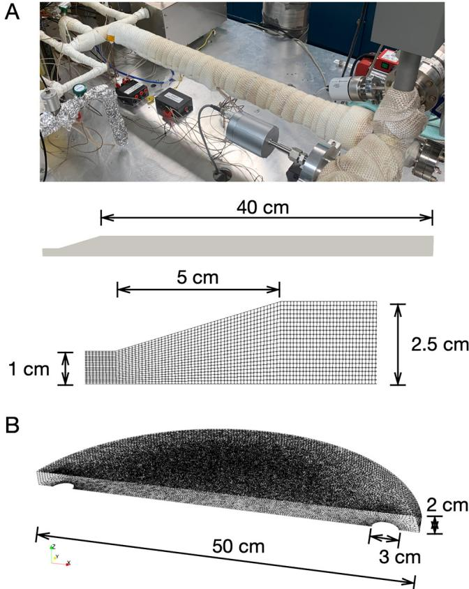  
FIG. 1. (a) Simulation domain for a horizontal cross-flow reactor. The 2D domain has cylindrical symmetry and incorporates an expanding section bridging the inlet manifold with the reactor tube. A picture of our experimental setup is shown for comparison. (b) Simulation domain for a  $300\mathrm{mm}$  wafer reactor. The simulation domain comprises a circular disk with a  $50\mathrm{cm}$  diameter and  $3\mathrm{cm}$  diameter inlet and outlet regions. The height of the reactor is  $2\mathrm{cm}$ . A  $300\mathrm{mm}$  wafer region is placed at the center of the reactor and treated as a separate area. Only half of the reactor is modeled, with mirror boundary conditions used at the bisecting plane.

The second geometry corresponds to a large area cross- flow horizontal circular reactor for  $300\mathrm{mm}$  wafers with  $30\mathrm{mm}$  circular inlet and outlet and a total diameter of  $50\mathrm{cm}$ . The reactor is  $2\mathrm{cm}$  tall [Fig. 1(b)]. The mesh has been generated using Gmsh,21 an Open Source mesh generator, and then converted to an OPENFOAM- compatible format using the utility gmshToFOAM. The mesh used in this work is composed of 148 390 cells. Again, meshes with 2 times higher spatial resolution were also created to confirm that the results were independent of the mesh size.

The same flow conditions were used for all simulations in this work. For the tube geometry, we adapted the inlet velocity to ensure that the average flow velocity inside the reactor was  $1\mathrm{m / s}$ , which is in agreement with the values expected in our experimental setup, and considered a pressure of 1 Torr. In Fig. 2(a), we show the steady state magnitude value of the flow velocity as it transitions from the inlet to the wider reactor region. The kinematic viscosity (Table I) is high enough to ensure that viscous terms compensate the inertial term and the flow quickly becomes fully developed, opening up in the reactor area without any wall separation that may lead to recirculation patterns and stagnation points at the inlet. The Reynolds number is  $\mathrm{Re} = 1$  for a characteristic length equal to the tube diameter, which is consistent with a laminar flow approximation, and a residence time of  $0.5\mathrm{s}$ .

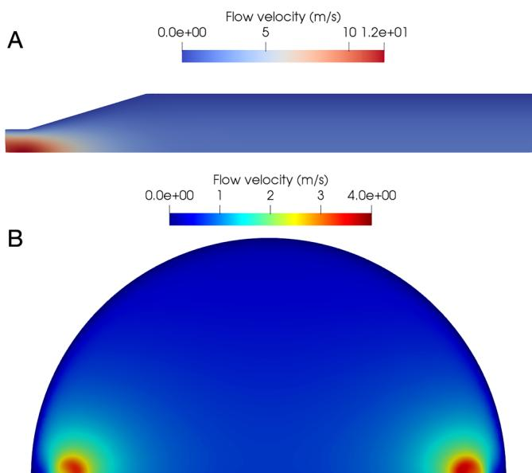  
FIG. 2. Velocity profiles for our two simulation domains: (a) tube cross-flow geometry and (b)  $300\mathrm{mm}$  wafer reactor.

TABLE I. Summary of parameters used in the simulations.  

<table><tr><td>Parameter</td><td>Symbol</td><td>Value</td><td>Units</td></tr><tr><td>Precursor diffusivity</td><td>D1</td><td>0.01</td><td>m2s−1</td></tr><tr><td>Kinematic viscosity</td><td>v</td><td>0.05</td><td>m/s</td></tr><tr><td>Process temperature</td><td>T</td><td>473</td><td>K</td></tr><tr><td>Precursor molecular mass</td><td>M1</td><td>150</td><td>amu</td></tr><tr><td>Surface site area</td><td>s0</td><td>24</td><td>nm2</td></tr><tr><td>By-product diffusivity</td><td>Dbp</td><td>0.05</td><td>m2s−1</td></tr></table>

In the case of the  $300\mathrm{mm}$  wafer reactor, the velocity field was obtained assuming  $300\mathrm{SCM}$  of total flow at a base pressure of 1 Torr. In Fig. 2(b), we show the magnitude of the flow velocity at a cross section located at midheight of the reactor. Both are consistent with stable flow patterns, with an average velocity of  $0.5\mathrm{m / s}$  over the wafer area. This corresponds to a Reynolds number  $\mathrm{Re} = 1$  and a residence time of  $1\mathrm{s}$ .

# B. Ideal ALD process

In this section, we first focus on the ideal ALD model given in Sec. II C 1. Unless explicitly mentioned, the parameters used for the simulations are given in Table I.

# 1. Benchmark with the plug-flow model

In a previous work, we considered a plug- flow approximation of a cross- flow reactor and derived analytic solutions for the coverage profiles for the ideal ALD process. The plug- flow approximation assumes that precursor transport in the axial direction of a cylindrical reactor is dominated by advection, which corresponds to a case where the Peclet number, defined as the ratio of advective to diffusive transport rates, is greater than one,

$$
\mathrm{Pe} = \frac{uL}{D}\gg 1, \tag{25}
$$

where  $u$  is the flow velocity,  $D$  is the diffusivity, and  $L$  is, in this case, the length of the tube. For the value of diffusivity in Table I,  $1\mathrm{m / s}$  axial velocity and a reactor length of  $40\mathrm{cm}$  this condition is fulfilled, with  $\mathrm{Pe} = 40$

In terms of the precursor pressure  $p_0$ , the average flow velocity  $u$ , dose time  $t_d$ , and the same parameters used in Eq. (9), the predicted saturation coverage as a function of the dose time in the plug- flow approximation is given by the following expression:

$$
\Theta (z;u) = \frac{e^{t_d / t} - 1}{e^z / z + e^{t_d / t} - 1}, \tag{26}
$$

where

$$
\bar{t} = \frac{4k_BT}{s_0\nu_{th}\beta_0p_0} \tag{27}
$$

and

$$
\bar{z} = \frac{V}{S}\frac{4u}{\nu_{th}\beta_0}. \tag{28}
$$

Here, the volume to surface ratio  $\frac{V}{S}$  is equal to  $d / 2$  for a parallel plate reactor and  $R / 2$  for a tube reactor with  $R$  being the radius of the cylindrical tube. In that same work, we also showed that Eq. (26) yielded excellent agreement with experimental saturation profiles obtained during the ALD of aluminum oxide from TMA and water.

In Fig. 3, we show a comparison between the simulated growth profiles obtained with our CFD model and those predicted by Eq. (26) for the cylindrical reactor. We present simulated growth profiles along the reactor for three different dose times: 0.05, 0.1, and  $0.2\mathrm{s}$ . In all cases, the average precursor pressure at the inlet  $p_0$  is set to  $20\mathrm{mTorr}$ . The results, which have been obtained for a reaction probability  $\beta_{10} = 10^{- 2}$ , show a good agreement between this work and the analytic expression. A key difference between this work and the plug- flow approximation is that the latter neglects the presence of axial and radial diffusion: the combined effect of these two factors is a softening of the growth profiles with respect to the predictions of the plug- flow model.

Since our simulation domain incorporates part of the reactor inlet, in order to produce Fig. 3 we had to take into account the effect of upstream consumption in Eq. (26). We did so by considering an offset in the axial coordinate given by

$$
\Delta z = \int_0^l z\frac{R(z)}{R_0} dz, \tag{29}
$$

where  $l$  is the length of the inlet,  $R(z)$  is the radius at that specific location, and  $R_0$  is the radius of the reactor tube. This expression is the result of considering the spatial dependence of  $\bar{z}$  [Eq. (28)] in

  
FIG. 3. Comparison between the full 2D simulation and the analytic expression under the plug-flow approximation [Eq. (26)] derived in Ref. 12. The results were obtained for three undersaturated precursor doses of 0.05, 0.1, and  $0.2\mathrm{s}$ , an average precursor pressure at the inlet of  $20\mathrm{mTorr}$ , and a sticking probability  $\beta_{10} = 10^{-2}$ .

the inlet as the radius (and therefore the mean flow velocity) changes with respect to the radius of the reactor tube.

# 2.Impact of reaction probability

The reaction probability  $\beta_{10}$  is by far the most influential factor in the ideal ALD model. In Fig. 4, we show the impact of this parameter in the reactor growth profiles: all curves in Fig. 4 have been obtained considering the same dose time (0.2 s) and precursor pressure  $(20\mathrm{mTorr})$  and different values of  $\beta_{10}$ . As shown in previous works, a decrease in the reaction probability decreases the steepness of unsaturated growth profiles in the reactor. It is important to note, though, that a reduction of 1 order of magnitude in the value of  $\beta_{10}$  does not necessarily reduce the total mass uptake by an order of magnitude. Instead, if the reaction probability is high enough, a reduction in the reaction probability simply redistributes the way the mass is deposited in the reactor. Only when the reaction probability is low enough, the system transitions from a transport- limited to a reaction- limited regime, and the mass uptake is directly proportional to  $\beta_{10}$ .

The same trends are reproduced when instead of the tubular reactor we consider the  $300\mathrm{mm}$  wafer reactor. In Fig. 5, we show the evolution of surface coverage during a single half cycle comprising a  $0.3\mathrm{s}$  dose and 1s purge. The simulations assume a precursor pressure of  $75\mathrm{mTorr}$  and  $\beta_{10} = 10^{- 2}$ . The evolution of the surface coverage follows the steep saturation profile that is expected from high sticking probability processes.

In Fig. 6, we show the coverage profiles on  $30\mathrm{cm}$  wafer substrates for increasing dose times and two values of the reaction probability:  $\beta_{10} = 10^{- 2}$  and  $\beta_{10} = 10^{- 3}$ . The results show the smoothening of the profiles and the increase in saturation times as the reaction probability decreases. This sensitivity to the surface reactivity at a wafer scale suggests that through a combination of CFD simulations and experimental thickness measurements on wafers it should be possible to extract sticking probabilities for self limited processes in this type of reactors, similarly to how it is currently done using tubular reactors and macrotrenches.12,22

  
FIG.4. Growth profiles for a  $200ms$  20 mTorr precursor dose for different values of the reaction probability  $\beta_{10}$  Higher reaction probabilities lead to steeper growth profiles.

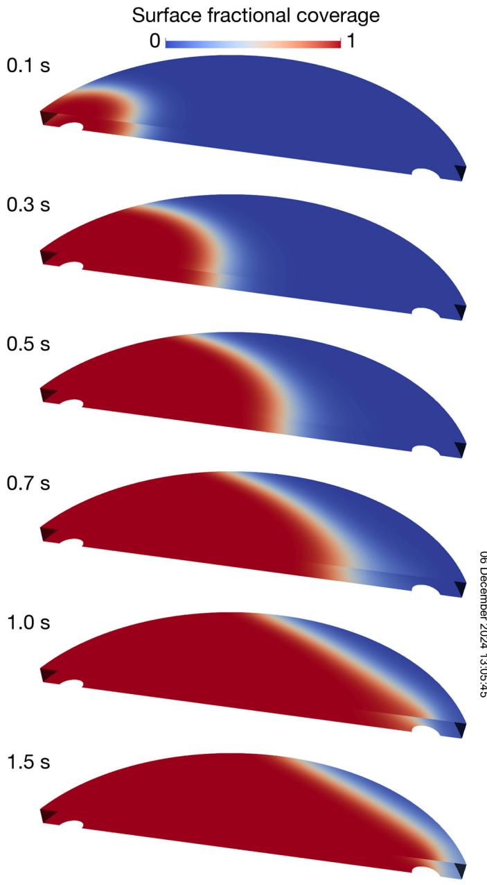  
FIG.5. Evolution of surface coverage as a function of time during a  $0.3\mathrm{s}$  dose and 1s purge. The simulations assume a precursor pressure at the inlet of  $\rho_{0} = 75\mathrm{mTorr}$ , and a reaction probability for the self-limited process  $\beta_{10} = 10^{-2}$ .

# 3. Modeling in situ QCM and QMS

As shown in Sec. III B 2, undersaturated growth profiles carry out information about the underlying kinetics of self- limited

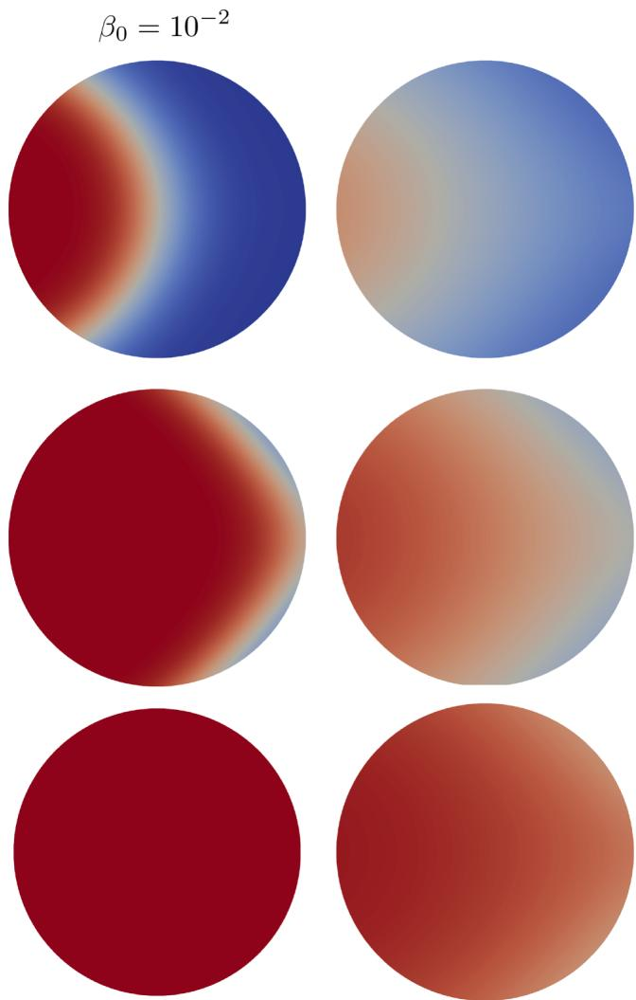  
FIG. 6. Surface coverage for increasing dose times of 0.1, 0.2, and  $0.4 \text{s}$ . The simulations assume a precursor pressure at the inlet of  $\beta_{0} = 75 \text{mTorr}$ , and a reaction probability for the self-limited process is  $\beta_{10} = 10^{-2}$  (left) and  $\beta_{10} = 10^{-3}$  (right).

processes. However, the information that they provide is static, representing the cumulative effect of a whole dose. In contrast, in situ techniques such as QCM and QMS have enough temporal resolution to provide mechanistic information during each dose. One challenge of extracting kinetic data from these techniques is that kinetic effects are convoluted with the transport of the precursor inside the reactor. Here, we focus on simulating the output of these two techniques in order to understand how the flow and process conditions affect the measurements.

The transport of the precursor and the reaction by- products is strongly influenced by the reaction probability  $\beta_{10}$ . In Fig. 7, we show the precursor partial pressure inside our tube reactor model at different snapshots in time taken at  $0.1 \text{s}$  intervals during a single saturated dose. In particular, we compare processes with three different values of the reaction probability:  $10^{- 2}$ ,  $10^{- 3}$ , and  $10^{- 4}$ . In the high reaction probability case, the precursor is fully consumed before it reaches the end of the reactor. However, as the reaction probability decreases, an increasing fraction of the precursor reaches the outlet. In all cases, we observe a broadening of the pulse shape due to axial diffusion transport. This broadening depends on the precursor transport in the inlet region of the reactor (not shown in Fig. 7), and from an experimental point of view it will be affected by the flow and length of the inlet region of an ALD/thermal ALE reactor.

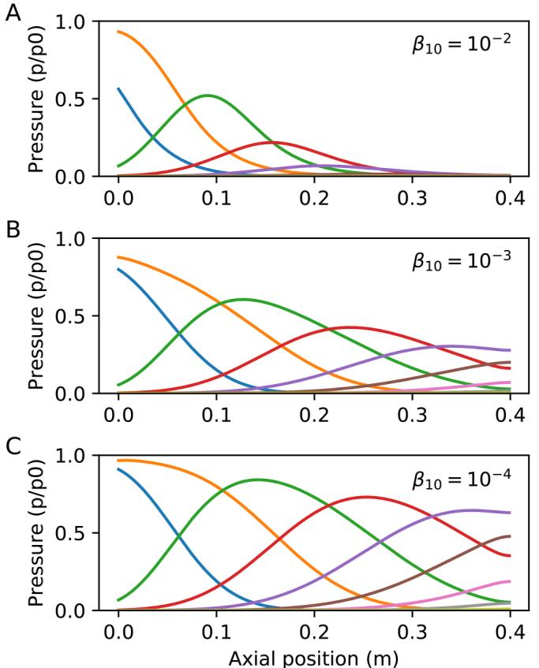  
FIG. 7. Precursor pressure inside the reactor during a single under-saturated dose (0.2 s at 20 mTorr). Snapshots are taken at 0.1 s intervals: (a)  $\beta_{10} = 10^{-2}$ , (b)  $\beta_{10} = 10^{-3}$ , and (c)  $\beta_{10} = 10^{-4}$ .

Precursor transport and surface reactivity impact how the shape of the QCM profiles changes as a function of the sensor position inside the reactor. In Fig. 8, we have considered the evolution of the fractional surface coverage during a single saturating dose at 10 different positions in our tubular reactor, each placed  $4 \text{cm}$  apart. Under the ideal ALD conditions considered in this section, there is a one- to- one correspondence between the fractional surface coverage and the mass gain observed by the QCM.

The results in Fig. 8 show that time delays of up to  $0.5 \text{s}$  can be expected between the first and the last QCM of the array. Precursor transport is a key factor in this offset, with a small

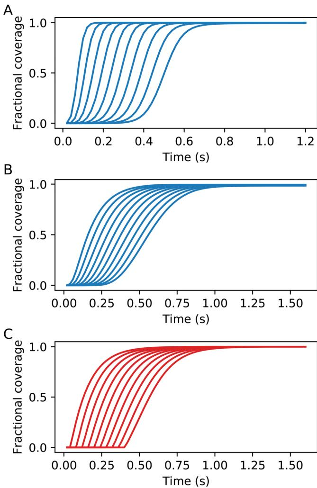  
FIG. 8. Simulated QCM traces showing the evolution of the fractional surface coverage during a single saturating dose at 10 different reaction positions located at a 4 cm distance from each other: (a)  $\beta_{1} = 10^{-2}$  and (b)  $\beta_{2} = 10^{-3}$ . In both cases, the precursor pressure is 50 mTorr. (c) Plug-flow approximation [Eq. (30)] using the same conditions as in (b).

contribution due to upstream precursor consumption. Upstream precursor consumption also leads to a change in slope observed as the QCM moves further from the inlet. This hinders our ability to extract quantitative information from data coming from a single QCM within a single half- cycle of a self- limited process without additional flow information.

We can again compare the results of the full model with the prediction of the simpler 1D plug- flow approximation for the tubular reactor. The plug- flow model predicts a mass gain as a function of time for a QCM located at a position  $z$  given by

$$
\Theta (z,t) = \frac{e^{[t - \Delta t]^{+} / t} - 1}{e^{[t - \Delta t]^{+} / t} + e^{z / z} - 1}, \tag{30}
$$

where  $[\cdot ]^{+}$  is a rectifying function that is zero whenever the argument is negative. The value of  $\Delta t$  represents the delay in the arrival of the pulse, which in the plug- flow approximation is simply given by

$$
\Delta t = \frac{z}{u}, \tag{31}
$$

where  $u$  is the average flow velocity in the tube. In Fig. 8(c), we show the predicted values of fractional coverage with time under the same conditions of 8(b). While the agreement is not perfect, Eq. (30) does provide a good approximation that could be used to discriminate between ideal and nonideal self- limited processes from QCM data.

The reaction probability strongly impacts the distribution of mass gains that would be observed using an array of sensors: for a high sticking probability process, mass gains sharply transition from fully saturated values in the upstream sensors to zero mass gain in the downstream sensors [Fig. 8(a)], whereas for lower values of the reaction probability [Fig. 8(b)] the difference in mass gain between upstream and downstream sensors is expected to be smaller. The use of multiple sensors can therefore be leveraged to extract quantitative data for a self- limited process if mass transport inside a reactor is well understood.

In order to model QMS input, we have tracked as a function of time the partial pressures of both the precursor and by- product species at a single location at the downstream position of the reactor. This is a common experimental configuration. In Fig. 9, we show the concentration of both species for the same two processes used for the QCM analysis: the reaction probability has a strong impact on the temporal separation of the traces coming from the precursor and the by- product. This is a natural consequence of the results shown in Fig. 7, where for high enough reaction probabilities all the precursor initially reacts inside the reactor. At the same time, reaction by- products are released since the beginning of the dose. This creates an offset between the two contributions. As the reaction probability goes down, this offset is reduced, as clearly seen in Fig. 9(b) for the case of  $\beta_{10} = 10^{- 3}$ .

This separation becomes more apparent if we break down a single dose into a sequence of microdoses. In Figs. 9(c) and 9(d), we show the precursor and by- product partial pressures during a sequence of microdoses, where each pulse corresponds to a 0.1 s dose. In the high sticking probability case [Fig. 9(c)], the first pulses are dominated by the contribution coming from the reaction by- products, and the transition between pure by- product and pure precursor signals occurs rather abruptly at 2 s. In contrast, a lower sticking probability [Fig. 9(d)] leads to by- product and precursor signals that persist throughout the microdose sequence and a gradual transition between by- product and precursor signals.

# C. Nonideal self-limited processes

# 1. Soft-saturating processes

The first generalization of the ideal self- limited model that we have considered is the presence of more than one reactive pathway on the surface: we have incorporated a second self- limited reaction pathway, comprising a fraction  $f$  of the surface sites and characterized by a different reaction probability  $\beta_{1b}$  (Sec. II C 2). This allows

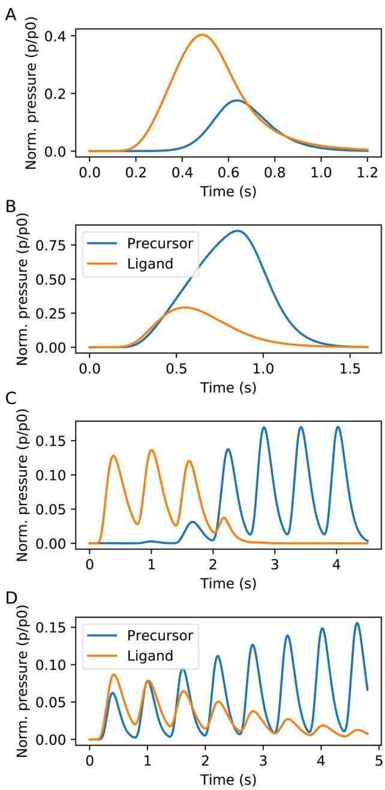  
FIG. 9. Normalized pressure of precursors and ligand species at the downstream position of the tubular reactor: (a) Single dose,  $t_d = 0.2 \text{s}$ ,  $\beta_1 = 10^{-2}$  and (b) Single dose,  $t_d = 0.4 \text{s}$ ,  $\beta_2 = 10^{-3}$ . (b) Microtissue sequence,  $\beta_{1b} = 10^{-2}$  and (d) microdose sequence,  $\beta_{02} = 10^{-3}$ . A high reaction probability leads to a temporal separation between the precursor and ligand peaks. In all cases, the average precursor pressure at the inlet is  $p_0 = 50 \text{mTorr}$ .

us to model soft- saturating processes with fast initial rise and slow saturation.

In Fig. 10, we show growth profiles in our tube reactor configuration for a self- limited process with a fast and a slow component for varying fractions of the slow component,  $f$ . The growth profiles have been obtained using the same dose times (0.2 s) and precursor pressure in the inlet (50 mTorr) for all the cases. In Fig. 10(a), the fast and slow components have reaction probabilities of  $10^{- 2}$  and

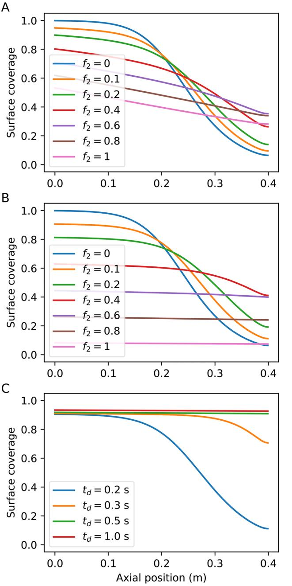  
FIG. 10. Reactor growth profiles for a soft-saturating self-limited model with two components (a)  $\beta_{1b} = 10^{-2}$  and  $\beta_{1b} = 10^{-3}$  and (b)  $\beta_{1b} = 10^{-2}$  and  $\beta_{1b} = 10^{-4}$ . All profiles correspond to the same unsaturated dose time of  $0.2 \text{s}$  for an average precursor pressure at the inlet of 50 mTorr. (c) Surface coverage for increasing dose times using (b) conditions.

$10^{- 3}$ , and they show the progressive transition from a more steplike saturation profile at  $f = 0$  to a more gentle, almost linear profile for  $f = 1$ .

In Fig. 10(b), the probability of the slow component is 2 orders of magnitude smaller,  $\beta_{1b} = 10^{- 4}$ . The interesting aspect in this case is that for small values of  $f$ , the region closer to the inlet shows the type of plateau that would be expected from a fully saturated process, except at surface coverages that are well below saturation. In Fig. 10(c), we show growth profiles for increasing dose times for the case of  $f = 0.2$  and  $\beta_{1b} = 10^{- 4}$ . After a dose time of  $0.5 \mathrm{~s}$ , the process has the appearance of saturation but its slow component is still evolving, resulting in a slightly higher coverage at  $1 \mathrm{~s}$  dose time. The slow self- limited component could be easily mistaken for a nonself- limited component if the timescales for saturation are large enough. If we compare this result with the literature, there are several examples of this behavior in the case of ALD: for instance, it has been shown that extremely large doses of water can lead to slightly larger growth per cycle than the conventional ALD process.23

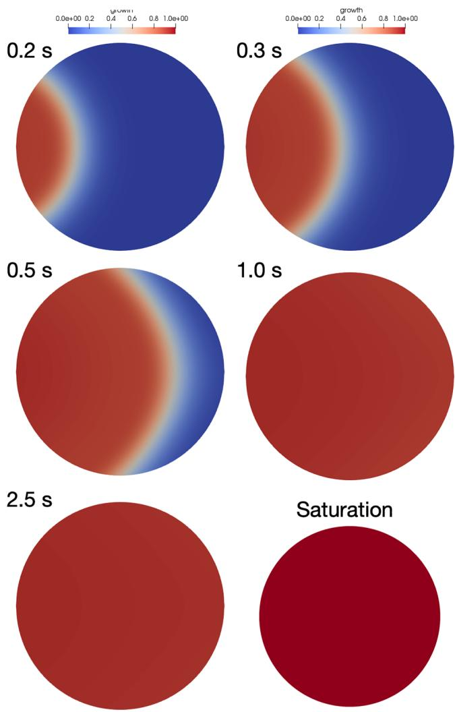  
FIG. 11. Evolution of coverage as a function of time for a self-saturating process where  $f = 0.1$  and  $\beta_{1b} = 10^{-4}$ . While the fast component reaches saturation after  $0.5 \mathrm{~s}$ , the remaining a  $10\%$  of the sites require an order of magnitude higher dose times, resulting in a homogeneous yet unsaturated profile. A fully saturated wafer from an ideal self-limited process is shown as comparison.

If we now consider this model on the  $300 \mathrm{~mm}$  wafer reactor, we observe similar trends: in Fig. 11, we show the surface coverage on  $300 \mathrm{~mm}$  wafers for increasing values of dose times for the same soft saturating process represented in Fig. 10(c). After  $1 \mathrm{~s}$ , the whole wafer has almost identical surface coverage, yet it is still  $10\%$  below its saturation value.

A second consequence of this soft- saturating behavior is a process that appears to have reached saturation but that still has a measurable variability inside the reactor. Using the  $3\sigma$  standard deviation of surface coverage as a measure of within- wafer variability, in Fig. 12 we compare the saturation curve of the soft- saturating process with that of the ideal process: both curves are very similar, except that the soft- saturating case "saturates" at a lower value of the fractional coverage [Fig. 12(a)]. On the other hand, the  $3\sigma$

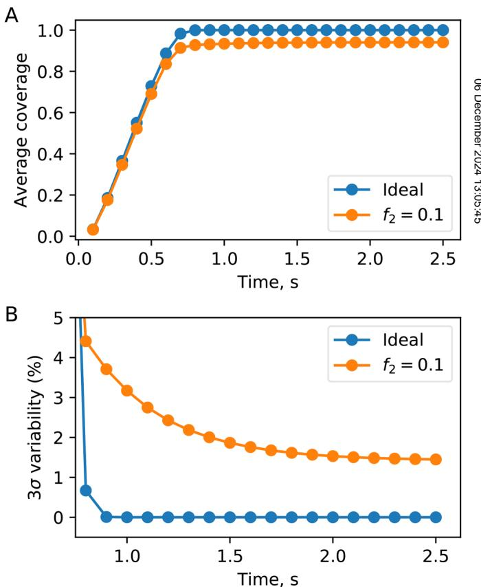  
FIG. 12. (a) Average wafer coverage and (b)  $3\sigma$  wafer thickness variability for an ideal and a soft-saturating ALD process. Simulation conditions are the same as for Fig. 10(c).

variability of the coverage across the wafer is much higher in the soft- saturating case and decreases asymptotically with dose times.

# 2. Site blocking by ligands and reaction by-products

A second generalization of the ideal self- limited interactions considers the effect of ligands or reaction by- products competing with the precursor for adsorption sites. This effect has been well documented in the ALD literature, leading to self- limited yet inhomogeneous growth profiles, as it is, for instance, the case of the ALD of  $\mathrm{TiO_2}$  from titanium tetraisopropoxide and water and titanium tetrachloride and water.15,16 Growth modulation studies in ALD showed that alkoxides, betadiketones, and carboxylic acids are some of the moieties that interfere with the adsorption of ALD precursors.24

  
FIG. 13. Coverage profiles in the presence of competitive adsorption by reaction by-products. (a) Precursor coverage profile for a process characterized by  $\beta_{10} = 10^{-2}$  and  $p_0 = 50$  mTorr. (b) By-products coverage profiles for the same conditions used in (a). Note how  $\Theta +\Theta_{bp} = 1$  indicating that the process is fully saturated. (c) Impact of precursor partial pressure for a process characterized by  $\beta_{10} = 10^{-2}$  and  $\beta_{bp0} = 10^{-3}$

As described in Sec. II C 3, we have modeled the presence of competitive adsorption between precursor molecules and reaction by- products by considering that by- products can irreversibly react with surface sites through a first order Langmuir kinetics characterized by a reaction probability  $\beta_{bp0}$ . Under this assumption, the surface now is composed of two types of adsorbed species, and we can therefore define a precursor fractional coverage  $\Theta$  and a by- product fractional coverage  $\Theta_{bp}$ .

The sticking probability of both the precursor and reaction by- products is proportional to the fraction of available sites,

$$
\beta_{1} = \beta_{10}\big(1 - \Theta_{1} - \Theta_{bp}\big), \tag{32}
$$

$$
\beta_{bp} = \beta_{bp0}\big(1 - \Theta_{1} - \Theta_{bp}\big). \tag{33}
$$

Consequently, both species are competing for the same pool of surface sites. The surface becomes unreactive when  $\Theta +\Theta_{bp} = 1$

In Fig. 13, we show the impact that competitive adsorption has on the saturation profiles in our tube reactor. We consider that, on average, one ligand is released per precursor molecule. The by- product reactivity leads to the presence of thickness gradients even when the process reaches saturation. These gradients increase with the by- product reaction probability and are mitigated with increasing precursor pressures. The relative diffusivities of the precursor and by- product molecules also play a role, controlling the relative spread of the concentration gradients of both species as they move downstream in the reactor.

The results in Fig. 13 have been obtained assuming a reaction probability for the precursor of  $\beta_{10} = 10^{- 2}$ . In Fig. 13(a), we have explored the impact of increasing reactivity of the reaction by- product on the surface coverage of precursor molecules. The dose time (0.8 s) and average precursor pressure at the inlet during the dose (50 mTorr) lead to a complete saturation of the surface so that, in the absence of competition, the surface coverage is one everywhere in the reactor  $(\Theta = 1)$ . As we increase the reactivity of the surface by- product, we observe increasing gradients along the reactor due to the fact that, in saturation,  $\Theta = 1 - \Theta_{bp}$ . In Fig. 13(b), we show the surface coverage of the reaction by- product  $\Theta_{bp}$ . The fact that the curves obtained mirror those of the precursor shown in Fig. 13(a) indicate that  $\Theta +\Theta_{bp} = 1$  as expected from a fully saturated process. In Fig. 13(c), we show the impact of precursor pressure for the case of  $\beta_{bp0} = 10^{- 3}$  under the same conditions used for Fig. 13(a): a higher precursor pressure tends to reduce the impact of by- product adsorption, as expected from a competitive adsorption process.

Similar results are obtained on the  $300\mathrm{mm}$  wafer reactor. In Fig. 14, we show the by- product surface coverage at saturation for a precursor reactivity  $\beta_{10} = 10^{- 2}$  and two different ligand reactivities:  $\beta_{bp} = 10^{- 4}$  and  $\beta_{bp} = 10^{- 3}$ . By- product coverages increase from the upstream (left) to the downstream (right) position in the wafer, reaching maximum values of 5% and 25%, respectively.

In Fig. 15, we show the evolution of precursor coverage and  $3\sigma$  variability for both cases, showing how both processes saturate at a point where  $3\sigma$  is not zero. This provides a key differentiating

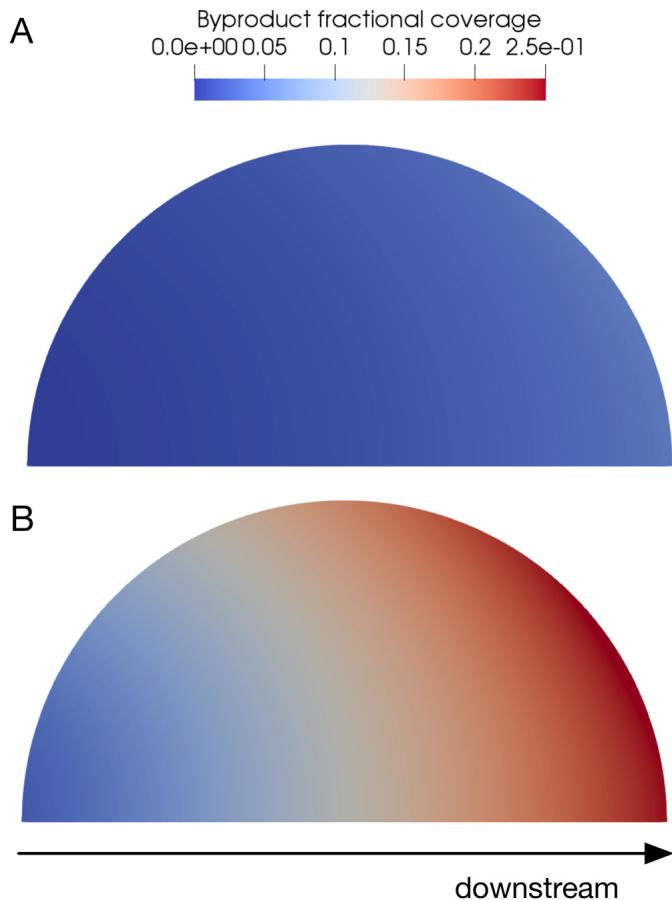  
FIG. 14. By-product coverage at saturation on  $300\mathrm{mm}$  wafers for two different values of by-product reactivity: (a)  $\beta_{bp} = 10^{-4}$  and (b)  $\beta_{bp} = 10^{-3}$ . The precursor reactivity is  $\beta_{10} = 10^{-2}$ .

feature between a soft- saturating process and a process with competitive adsorption by reaction by- products: in the former case, the  $3\sigma$  variability is expected to decrease, albeit slowly, with increasing dose times, whereas the variability in the latter remains constant once saturation has been reached.

# IV. DISCUSSION

In this work, we have explored self- limited processes in two different types of reactors: a cross- flow horizontal tube reactor and a model reactor for  $300\mathrm{mm}$  wafers. For the tube reactor case, the results obtained are in good agreement with the prediction of an analytic model that we previously developed under the plug- flow approximation. The effect of axial diffusion is to smooth the growth profile for undersaturated doses with respect to the plug- flow approximation. The plug- flow model also shows a reasonable agreement with the expected QCM profiles as long as upstream consumption and propagation delays are properly accounted for. The plug- flow approximation underestimates the initial rise in surface coverage compared to the CFD model considering both axial and radial diffusion, but the overall agreement is good.

  
FIG. 15. Evolution of the average coverage (a) and  $3\sigma$  variability (b) in  $300\mathrm{mm}$  wafers for two values of by-product reaction probability:  $\beta_{bp} = 10^{-4}$  and  $\beta_{bp} = 10^{-3}$ . The precursor reactivity is  $\beta_{10} = 10^{-2}$ .

The first order irreversible Langmuir kinetics used for the ideal model is the simplest example of surface kinetics exhibiting self- limited behavior. In reality, though, many ALD and ALE processes exhibit more complex behavior. In this work, we considered two types of generalizations: we considered soft- saturating cases, which we modeled taking into account fast and slow self- limited reaction pathways, and the presence of site blocking by reaction by- products. Both cases represent examples of self- limited processes that can lead to reactor inhomogeneities. In the first case, inhomogeneities arise due to the timescale of the slow component requiring unfeasibly large doses to fully saturate the surface. The site- blocking case is intrinsically inhomogeneous even under saturation conditions.

The examples explored in this work are just two of the many sources of nonideal behavior. For instance, it has been postulated that the effective sticking probability of TMA can have a dependence with precursor pressure due to the presence of slow, reversible intermediates on the surface, something that is also well- known

from the CVD literature.15 One of the challenges of including increasingly complex processes is the larger number of parameters, most of them unknown, that are introduced in the kinetic model: a self- limited process that is soft- saturating and has a slow reversible intermediate would have at least four independent parameters per precursor. In some cases, the surface mobility of the adsorbed species can greatly impact the effective sticking probability, for instance, increasing the capture zone around islands and steps in otherwise passivated surfaces.26

One of the challenges of modeling the surface kinetics of selflimited processes is the scarcity of kinetic data. This is also an issue for the mass diffusivity of different precursor molecules. Except for a few of the most commonly used precursors and some recent studies,17,27 the diffusivity of the majority of relevant species for ALD and ALE is not known. One way of extracting information on surface kinetics is through the use of saturation profiles. As mentioned above, plug- flow approximations have been used in the past to model and extract kinetic data from saturation profiles at a reactor scale. Likewise, growth profiles inside high aspect ratio features can be used to extract effective sticking probabilities of selflimited processes. Recently, the use of macrotrenches has greatly simplified the characterization of these growth profiles, allowing the use of techniques such as spectroscopic ellipsometry.22 The comparison between the kinetics at a reactor scale and inside macrotrenches can also provide information on the impact of the surface fluxes of different species on the kinetics of self- limited processes.

One example of the use of saturation profiles to extract kinetic data is shown in Fig. 16. In Fig. 16(a), we show an experimental configuration used to explore ALD at rates exceeding 1 cycle per second  $(1\mathrm{Hz})$  . Both precursors are brought into the reactor using two long injector lines. Precursor doses are so short that it reaches  $100\%$  precursor consumption across a  $300~\mathrm{mm}$  wafer. Using kinetic data for trimethylaluminum previously extracted in our tube reactor and fitted to the plug- flow model, we simulated this process using the model described in this work. The results, shown in Fig. 16(b), are obtained after considering three full ALD cycles. Without any fitting parameter, the agreement between the simulation and experiments is remarkably good, even capturing the presence of a nonself- limited CVD component at the center of the oval due to the simultaneous presence of trimethylaluminum and water on the surface. The main discrepancy between the simulations and the experiments is near the injection point: our model considers well- separated pulses, while in reality, the long injection channels cause a spread of the trimethylaluminum and water pulses, leading to a higher growth rate near the injectors due to precursor mixing. Still, Fig. 16 provides a good example of the potential of using reactor growth profiles as a source for kinetic information of selflimited processes.

Also, it is important to emphasize that, while we have focused on the case of ALD, the results presented in this work can be directly applied to atomic layer etching. For instance, in Fig. 8, we show the changes in mass as a function of time and reactor position as measured using in situ quartz crystal microbalance. In the case of thermal ALE, the only difference is that instead of mass gains, the plots in Fig. 8 would represent mass losses. Likewise, the simple 1D models explored in this work would naturally extend to the case of thermal atomic layer etching, providing a simple way of exploring the effective rate coefficients in ALE from etching profiles using subsaturating doses.

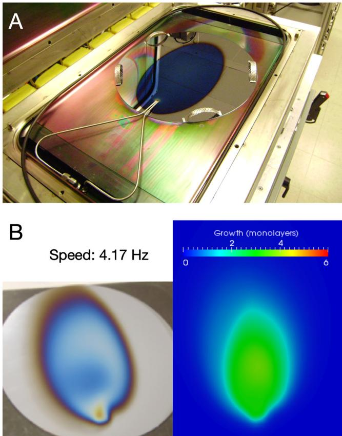  
FIG. 16. Comparison between simulations and experimental results on a nontraditional experimental setup in which subsaturating pulses of TMA and  $\mathsf{H}_2\mathbb{O}$  are introduced locally using a pair of injectors. (a) Experimental setup, showing a wafer coated at a speed of 1 cycle per second. (b) Comparison between experiments and simulated growth rates for a speed of 4.17 cycles per second. At this rate, purge times are so short that there is an overimposed nonself-limited component. This is captured in the simulation results, which show the total material deposited over three ALD cycles.

Finally, in this work, we have not considered the effect of high surface area materials inside the reactor. This is a technologically relevant case, as one of the key advantages of self- limited processes is its conformality, and yet the scale up of ALD processes to large area substrates can sometimes be far from trivial. In a prior work, we briefly explored the impact of a specific type of high surface area substrate on the reactant transport of an ALD precursor.28 That simple example showed the formation of a large region depleted of precursor near the center of the substrate for cross- flow reactors. However, this is an area that still needs further exploration and will be the focus of a future work. This is also a configuration where the symmetry between ALD and ALE breaks down: as the number of cycles starts to affect the shape and surface area of the

nanostructures, we expect to see a divergence in precursor transport at the reactor scale for each case.

# V. CONCLUSIONS

V. CONCLUSIONSWe have developed a versatile reactor scale simulation tool capable of modeling self-limited processes such as atomic layer deposition and atomic layer etching. All the process, from mesh generation to the visualization of 3D results, is based on open source tools. In addition to the traditional ideal self-limited model, we have explored soft-saturating processes and the case of competitive adsorption by reaction by-products. In particular, the model is able to capture two experimental observations in nonideal ALD processes: the presence of gradients at the reactor scale even under saturation due to competitive absorption between the precursor and reaction by-products and potential discrepancies in the growth per cycle due to homogeneous yet nonsaturated growth in soft-saturating processes. We have released the simulation code as well under a GPL v3 license and can be found at https://github.com/aldsim/aldFoam.

# ACKNOWLEDGMENTS

ACKNOWLEDGMENTSThis research is based upon work supported by Laboratory Directed Research and Development (LDRD) funding from Argonne National Laboratory, provided by the Director, Office of Science, of the U.S. Department of Energy under Contract No. DE- AC02- 06CH11357. We gratefully acknowledge the computing resources provided on Blues, a high- performance computing cluster operated by the Laboratory Computing Resource Center at Argonne National Laboratory. We would also like to acknowledge Shashikant Aithal for his support and useful suggestions for testing our simulations in Blues.

# REFERENCES

1E. Alvaro and A.Yanguas- GilPLoS ONE 13,1 2018. 2S.M.George and Y.LeeACS Nano 10,4889 2016. 3R.L.PuurunenJ.Appl.Phys.97,121301 2005.

4H. H. Sonsteby, A. Yanguas- Gil, and J. W. Elam, J. Vac. Sci. Technol. A 38, 020804 (2020). 5D. Sengupta, S. Mazumder, W. Kuykendall, and S. Lowry, J. Cryst. Growth 279, 369 (2005). 6A. Holmqvist, T. Torndahl, and S. Stenstrom, Chem. Eng. Sci. 81, 260 (2012). 7D. Pan, T.- C. Jen, and C. Yuan, Int. J. Heat Mass Transf. 96, 189 (2016). 7G. P. Gakis, H. Vergnes, E. Scheid, C. Vahlas, B. Gaussat, and A. G. Boudouvis, Chem. Eng. Res. Des. 132, 795 (2018). 9P. Peltonen, V. Vuorinen, G. Marin, A. J. Karttunen, and M. Karppinen, J. Vac. Sci. Technol. A 36, 021516 (2018). 10V. H. Nguyen, A. Schlot, C. Jimenez, D. Muñoz, D. Bellet, and D. Muñoz- Rojas, Chem. Eng. J. 403, 126234 (2021). 11J. W. Elam, M. D. Groner, and S. M. George, Rev. Sci. Instrum. 73, 2981 (2002). 12A. Yanguas- Gil and J. W. Elam, J. Vac. Sci. Technol. A 32, 031504 (2014). 13A. Yanguas- Gil and J. W. Elam, J. Vac. Sci. Technol. A 30, 01A159 (2012). 14A. Yanguas- Gil and J. W. Elam, Theor. Chem. Acc. 133, 1465 (2014). 15M. Ritala, M. Leskela, L. Niinisto, and P. Haussalo, Chem. Mater. 5, 1174 (1993). 16K.- E. Elers, T. Blomberg, M. Peussa, B. Aitchison, S. Haukka, and S. Marcus, Chem. Vap. Deposition 12, 13 (2006). 17D. E. Rosner, Transport Processes in Chemically Reacting Flow Systems (Dover, Mineola, NY, 2000). 18H. G. Weller, G. Tabor, H. Jasak, and C. Fureby, Comput. Phys. 12, 620 (1998). 19J. H. Ferziger and M. Peric, Computational Methods for Fluid Dynamics (Springer- Verlag, Berlin, 2002). 20G. Ju, M. J. Highland, A. Yanguas- Gil, C. Thompson, J. A. Eastman, H. Zhou, S. M. Brennan, G. B. Stephenson, and P. H. Fuss, Rev. Sci. Instrum. 88, 035113 (2017). 21C. Geuzaine and J.- F. Remacle, Int. J. Numer. Methods Eng. 79, 1309 (2009). 22K. Arts, V. Vandalon, R. L. Puurunen, M. Utriainen, F. Gao, W. M. M. E. Kessels, and H. C. M. Knoops, J. Vac. Sci. Technol. A 37, 030908 (2019). 23R. Matero, A. Rahtu, M. Ritala, M. Leskela, and T. Sajavaara, Thin Solid Films 368, 1 (2000). 24A. Yanguas- Gil, J. A. Libera, and J. W. Elam, Chem. Mater. 25, 4849 (2013). 25C. D. Travis and R. A. Adomaitis, Chem. Vap. Deposition 19, 4 (2013). 26A. Yanguas- Gil, J. Vac. Sci. Technol. A 36, 051510 (2018). 27B. A. Sperling and J. E. Maslar, J. Vac. Sci. Technol. A 37, 060907 (2019). 28A. Yanguas- Gil, J. A. Libera, and J. W. Elam, ECS Trans. 64, 63 (2014).